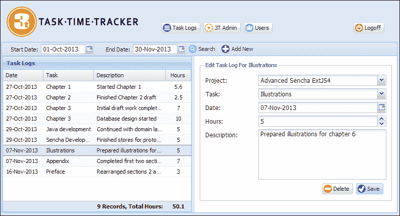
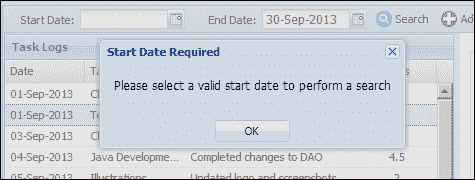
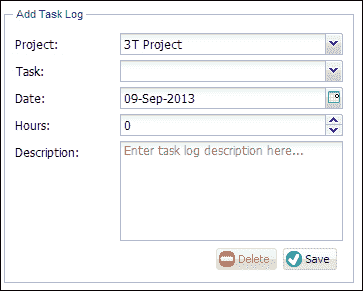
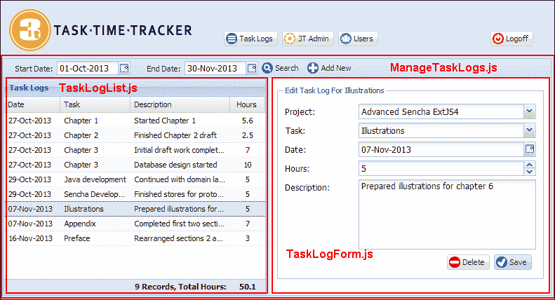
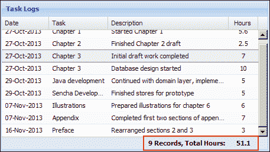
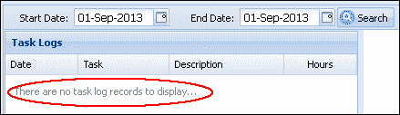
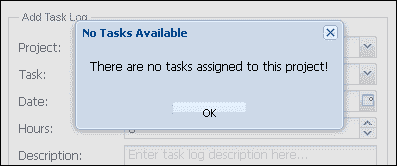

# 一、建立任务日志用户界面

任务日志用户界面允许用户跟踪在不同任务上花费的时间。此界面允许任务日志搜索和数据输入。用户将能够：

*   在指定的时间段内搜索任务日志
*   对任务日志项列表进行排序
*   编辑现有任务日志
*   添加新的任务日志条目
*   查看一段时间内用于任务的总时间

我们将构建的界面如下图所示：



**开始日期**和**结束日期**字段以本月的开始日期和结束日期为前缀。点击**搜索**按钮将触发搜索，并用匹配的记录填充**任务日志**网格。单击列表中的记录将打开{Task name}表单的**编辑任务日志中的项目。点击工具栏中的**新增**按钮，将清除任务日志表单字段，并将标题设置为**新增任务日志**。现在让我们详细了解这些操作。**

# 任务日志工作流和布局

在中搜索任务日志需要有效的开始和结束日期。点击**搜索**按钮上的后，如果其中一个字段缺失，将显示相应的消息：



从列表中选择任务日志项，将打开**编辑测试任务日志**表单中的记录。当列表显示时，任务日志表单中的**项目**下拉列表将显示除项目名称外的公司名称：


在此列表中选择**项目**将过滤**任务**组合框中显示的任务：


如果选择了没有分配任务的**项目**，则显示以下消息：


添加新任务日志将保留当前选择的**日期**和**项目**，如果存在：



删除任务日志将要求用户确认其操作：


### 注

这应该是开发企业项目时所有删除的标准实践；在未与用户确认操作之前，切勿删除记录！

选择**是**将删除任务日志记录，并从搜索结果中删除记录。

# 构建我们的任务日志视图

任务日志用户界面包含各种不同的组件，包括日期选择器和组合框。我们将通过将屏幕分为三个视图来实现 UI。最外层的`ManageTaskLogs`视图将包含一个工具栏，并定义一个边框布局，以容纳`TaskLogList`和`TaskLogForm`视图：



## ManageTaskLogs.js 文件

我们已为该视图选择了`border`布局，以允许调整`TaskLogForm`视图的大小，该视图最初固定在`east`区域的 400px 宽度。`ManageTaskLogs`的定义如下：

```java
Ext.define('TTT.view.tasklog.ManageTaskLogs', {
    extend: 'Ext.panel.Panel',
    xtype: 'managetasklogs',
    requires: ['Ext.toolbar.Toolbar', 'Ext.layout.container.Border', 'Ext.form.field.Date', 'TTT.view.tasklog.TaskLogList', 'TTT.view.tasklog.TaskLogForm'],
    layout: {
        type: 'border'
    },
    initComponent: function() {
        var me = this;
        var now = new Date();
        Ext.applyIf(me, {
            dockedItems: [{
                xtype: 'toolbar',
                dock: 'top',
                items: [{
                    xtype: 'datefield',
                    labelAlign: 'right',
                    name: 'startDate',
                    format: 'd-M-Y',
                    fieldLabel: 'Start Date',
                    value: Ext.Date.getFirstDateOfMonth(now),
                    width: 180,
                    labelWidth: 70
                }, {
                    xtype: 'datefield',
                    labelAlign: 'right',
                    name: 'endDate',
                    format: 'd-M-Y',
                    fieldLabel: 'End Date',
                    value: Ext.Date.getLastDateOfMonth(now),
                    width: 180,
                    labelWidth: 70
                }, {
                    xtype: 'button',
                    iconCls: 'search',
                    itemId: 'searchBtn',
                    text: 'Search'
                }, {
                    xtype: 'button',
                    iconCls: 'addnew',
                    itemId: 'addTaskLogBtn',
                    text: 'Add New'
                }]
            }],
            items: [{
                xtype: 'taskloglist',
                region: 'center',
                margin: 1
            }, {
                xtype: 'tasklogform',
                region: 'east',
                split: true,
                width: 400
            }]
        });
        me.callParent(arguments);
    }
});
```

此类在`view.tasklog`命名空间中定义。您将需要在添加`ManageTaskLogs.js`文件之前创建`view/tasklog`子目录。

`date`字段使用`Ext.Date.getFirstDateOfMonth()`和`Ext.Date.getLastDateOfMonth()`函数以当月的开始和结束日期初始化。在 Ext JS 4 开发中，处理日期是一项常见的任务，`Ext.Date`类中有许多有用的函数使这些任务变得简单。

`TaskLogList`视图已放置在`border`布局的`center`区域，而`TaskLogForm`视图已在`east`区域中被赋予`400`的初始固定宽度。这将确保较大的屏幕分辨率缩放任务日志列表，以提供平衡的视图。因此，1200px 的屏幕宽度将显示以下布局：


如果用户希望增加数据输入字段的宽度，`border`布局还允许调整`TaskLogForm`视图的大小。

## TaskLogForm.js 文件

`TaskLogForm`视图用于显示任务日志记录：

```java
Ext.define('TTT.view.tasklog.TaskLogForm', {
    extend: 'Ext.form.Panel',
    xtype: 'tasklogform',
    requires: ['Ext.form.FieldSet', 'Ext.form.field.ComboBox', 'Ext.form.field.Date', 'Ext.form.field.Number', 'Ext.form.field.TextArea', 'Ext.toolbar.Toolbar'],
    layout: {
        type: 'anchor'
    },
    bodyPadding: 10,
    border: false,
    autoScroll: true,
    initComponent: function() {
        var me = this;
        Ext.applyIf(me, {
            items: [{
                xtype: 'fieldset',
                hidden: true,
                padding: 10,
                fieldDefaults: {
                    anchor: '100%'
                },
                title: 'Task Log Entry',
                items: [{
                    xtype: 'combobox',
                    name: 'project',
                    fieldLabel: 'Project',
                    queryMode: 'local',
                    store: 'Project',
                    valueField: 'idProject',
                    listConfig: {
                        minWidth: 300
                    },
                    tpl: Ext.create('Ext.XTemplate', '<tpl for=".">', '<div class="x-boundlist-item"><b>{companyName}</b>: {projectName}</div>', '</tpl>'),
                    displayTpl: Ext.create('Ext.XTemplate', '<tpl for=".">', '{projectName}', '</tpl>')
                }, {
                    xtype: 'combobox',
                    name: 'idTask',
                    fieldLabel: 'Task',
                    displayField: 'taskName',
                    queryMode: 'local',
                    store: 'Task',
                    valueField: 'idTask'
                }, {
                    xtype: 'datefield',
                    name: 'taskLogDate',
                    format: 'd-M-Y',
                    fieldLabel: 'Date'
                }, {
                    xtype: 'numberfield',
                    name: 'hours',
                    minValue: 0,
                    decimalPrecision: 2,
                    itemId: 'taskHours',
                    fieldLabel: 'Hours'
                }, {
                    xtype: 'textareafield',
                    height: 100,
                    name: 'taskDescription',
                    fieldLabel: 'Description',
                    emptyText: 'Enter task log description here...'
                }, {
                    xtype: 'toolbar',
                    ui: 'footer',
                    layout: {
                        pack: 'end',
                        type: 'hbox'
                    },
                    items: [{
                        xtype: 'button',
                        iconCls: 'delete',
                        itemId: 'deleteBtn',
                        disabled: true,
                        text: 'Delete'
                    }, {
                        xtype: 'button',
                        iconCls: 'save',
                        itemId: 'saveBtn',
                        text: 'Save'
                    }]
                }]
            }]
        });
        me.callParent(arguments);
    }
});
```

**项目**组合框定义了两个不同的模板：一个用于呈现列表，另一个用于呈现所选项目文本。`tpl`属性将公司名称和项目名称合并显示在下拉列表中：


选择项目时，只有项目名称显示为`displayTpl`模板呈现的项目名称。

## TaskLogList.js 文件

`TaskLogList`视图定义为：

```java
Ext.define('TTT.view.tasklog.TaskLogList', {
    extend: 'Ext.grid.Panel',
    xtype: 'taskloglist',
    viewConfig: {
        markDirty: false,
        emptyText: 'There are no task log records to display...'
    },
    title: 'Task Logs',
    store: 'TaskLog',
    requires: ['Ext.grid.feature.Summary', 'Ext.grid.column.Date', 'Ext.util.Point'],
    features: [{
        ftype: 'summary',
        dock: 'bottom'
    }],
    initComponent: function() {
        var me = this;
        Ext.applyIf(me, {
            columns: [{
                xtype: 'datecolumn',
                dataIndex: 'taskLogDate',
                format: 'd-M-Y',
                width: 80,
                text: 'Date'
            }, {
                xtype: 'gridcolumn',
                dataIndex: 'taskName',
                text: 'Task'
            }, {
                xtype: 'gridcolumn',
                dataIndex: 'taskDescription',
                flex: 1,
                text: 'Description',
                summaryType: 'count',
                summaryRenderer: function(value, summaryData, dataIndex) {
                    return Ext.String.format('<div style="font-weight:bold;text-align:right;">{0} Records, Total Hours:</div>', value);
                }
            }, {
                xtype: 'gridcolumn',
                dataIndex: 'taskMinutes',
                width: 80,
                align: 'center',
                text: 'Hours',
                summaryType: 'sum',
                renderer: function(value, metaData, record) {
                    return record.get('hours');
                },
                summaryRenderer: function(value, summaryData, dataIndex) {
                    var valHours = value / 60;
                    return Ext.String.format('<b>{0}</b>', valHours);
                }
            }]
        });
        me.callParent(arguments);
    }
});
```

`viewConfig`属性用于创建`Ext.grid.View`类的实例，该类提供特定于网格的视图功能。我们将根据每个记录执行更新，而不是通过商店使用批量更新。`markDirty:false`属性将确保成功保存的记录不会在网格中使用脏标志呈现。如果任务日志搜索未返回任何记录，`emptyText`值将显示在网格中，以立即向用户提供反馈。

`TaskLogList`视图使用`summary`功能显示包含**记录**计数和**总小时数**的总行，该记录显示在搜索列表中。`summaryType`和`summaryRender`定义用于配置显示在`taskDescription`和`taskMinutes`列的页脚中的`feature`。`summary`值可以是`count`、`sum`、`min`、`max`或`average`中的一个，我们正在使用其中的`count`和`sum`值。有关`summary`功能的更多信息，请访问[http://docs.sencha.com/extjs/4.2.2/#!/api/Ext.grid.feature.Summary](http://docs.sencha.com/extjs/4.2.2/#!/api/Ext.grid.feature.Summary)。以下屏幕截图显示了正在使用的`summary`功能：



在代表分配给任务的工时的列中还有一些代码需要注意：

```java
{
    xtype: 'gridcolumn',
    dataIndex: 'taskMinutes',
    width:80,
    align:'center',
    text: 'Hours',
    summaryType:'sum',
    renderer:function(value, metaData, record){
  return record.get('hours');
    },
    summaryRenderer: function(value, summaryData, dataIndex) {
  var valHours = value/60;
  return Ext.String.format('<b>{0}</b>', valHours); 
    }           
}
```

每个任务日志的工作时间以分钟存储在数据库中，但在前端显示为小时。该列绑定到模型中的`taskMinutes`字段。渲染器显示`TaskLog`模型的（计算的）`hours`字段（这将在下面的部分中定义）。`summary`功能使用`taskMinutes`字段来计算总时间，因为该功能需要一个真实（未转换）的模型字段来操作。然后，在`summaryRenderer`功能中将以分钟为单位的总时间转换为小时进行显示。

# 定义我们的模型

我们的`Project`、`Task`和`TaskLog`模型是在[第 9 章](09.html "Chapter 9. Getting Started with Ext JS 4")、*开始使用 Ext JS 4*中使用 Sencha Cmd 创建的基本字段，但它们缺乏持久性或验证逻辑。现在是添加所需代码的时候了。

## 任务日志模型

`TaskLog`模型是我们应用中最复杂的模型。完整的`TaskLog`模型及其所需的所有逻辑如下：

```java
Ext.define('TTT.model.TaskLog', {
    extend: 'Ext.data.Model',    
    fields: [
        { name: 'idTaskLog', type: 'int', useNull:true },
        { name: 'taskDescription', type: 'string' },
        { name: 'taskLogDate', type: 'date', dateFormat:'Ymd' },
        { name: 'taskMinutes', type: 'int' },
        { name: 'hours', type: 'float', persist:false, convert:function(value, record){
            return record.get('taskMinutes') / 60;
        }},
        { name: 'username', type: 'string' },
        { name: 'userFullName', type: 'string', persist:false },
        { name: 'idTask', type: 'int', useNull:true },
        { name: 'taskName', type: 'string', persist:false },
        { name: 'idProject', type: 'int', persist:false },
        { name: 'projectName', type: 'string', persist:false },
        { name: 'idCompany', type: 'int', persist:false },
        { name: 'companyName', type: 'string', persist:false }
    ],
    idProperty: 'idTaskLog',
    proxy: {
        type: 'ajax',
        idParam:'idTaskLog',
        api:{
            create:'taskLog/store.json',
            read:'taskLog/find.json',
            update:'taskLog/store.json',
            destroy:'taskLog/remove.json'
        },
        reader: {
            type: 'json',            
            root: 'data'
        },
        writer: {
            type: 'json',
            allowSingle:true,
            encode:true,
            root:'data',
            writeAllFields: true
        }
    },
    validations: [
        {type: 'presence',  field: 'taskDescription'},
        {type: 'length', field: 'taskDescription', min: 2},
        {type: 'presence',  field: 'username'},
        {type: 'presence',  field: 'taskLogDate'},
        {type: 'presence',  field: 'idTask'},
        {type: 'length', field: 'idTask', min: 1},
        {type: 'length', field: 'taskMinutes', min: 0}
    ]     
});
```

这是我们第一次在字段上使用属性。将 JSON 数据转换为`int`、`float`、`Boolean`或`String`类型时，`useNull`属性非常重要。当读取器无法解析某个值时，将为模型字段设置以下默认值：

<colgroup><col style="text-align: left"> <col style="text-align: left"> <col style="text-align: left"></colgroup> 
| 

字段类型

 | 

带`useNull:true`的默认值

 | 

带`useNull:false`的默认值

 |
| --- | --- | --- |
| `int` | `null` | `0` |
| `float` | `null` | `0` |
| `boolean` | `null` | `false` |
| `String` | `null` | `""`（空字符串） |
| `Date` | `null` | `null` |

如果读卡器无法解析该值，如果该字段配置了`useNull:true`，则会将`null`分配给该字段值。否则，将使用上表第三列中显示的该类型的默认值。请注意，如果无法解析值，`Date`字段始终设置为`null`。在大多数情况下，读取记录后能够识别字段是否为空非常重要，因此，我们建议为所有主键字段设置`useNull:true`属性。

这也是我们第一次使用`dateFormat`属性。此属性通过配置的`writer`和`reader`类对 JSON`date`字段进行编码或解码时，定义日期的格式。`YYYYMMDD`格式字符串表示一个 8 位数字。例如，2013 年 8 月 18 日的日期相当于 20130818。其他格式字符串记录在[的`Ext.Date`API 中 http://docs.sencha.com/extjs/4.2.2/#!/api/分机日期](http://docs.sencha.com/extjs/4.2.2/#!/api/Ext.Date)。强烈建议您始终为任何`date`字段指定明确的日期格式。

在`hours`字段中使用`convert`功能也是新的。它转换`reader`类提供的值，并将其存储在模型的已配置`name`字段中。在我们的`TaskLog`模型中，分钟数转换为十进制值并存储在`hours`字段中。对于 3T 用户来说，输入 2.5 小时的值要比输入 150 分钟方便得多。

注意，我们再次使用了`persist:false`属性来限制`TaskLogHandler`方法中不需要的持久性字段。我们对`TaskLog`模型的验证也应该是不言自明的！

## 项目模型

`Project`模型定义了我们常用的代理和验证属性：

```java
Ext.define('TTT.model.Project', {
    extend: 'Ext.data.Model',
    fields: [
        { name: 'idProject', type: 'int', useNull:true },
        { name: 'projectName', type: 'string' },
        { name: 'idCompany', type:'int', useNull:true },
        { name: 'companyName', type:'string', persist:false }
    ],
    idProperty: 'idProject',
    proxy: {
        type: 'ajax',
        idParam:'idProject',
        api:{
            create:'project/store.json',
            read:'project/find.json',
            update:'project/store.json',
            destroy:'project/remove.json'
        },
        reader: {
            type: 'json',
            root: 'data'
        },
        writer: {
            type: 'json',
            allowSingle:true,
            encode:true,
            root:'data',
            writeAllFields: true
        }
    },
    validations: [
        {type: 'presence',  field: 'projectName'},
        {type: 'length', field: 'projectName', min: 2},
        {type: 'presence',  field: 'idCompany'},
        {type: 'length', field: 'idCompany', min: 1}
    ]    
});
```

在保存记录时不需要包含`companyName`字段，因此该字段包含`persist:false`属性。

## 任务模型

`Task`型也有一个简单的结构：

```java
Ext.define('TTT.model.Task', {
    extend: 'Ext.data.Model',    
    fields: [
        { name: 'idTask', type: 'int', useNull:true },
        { name: 'taskName', type: 'string' },
        { name: 'idProject', type: 'int', useNull:true },
        { name: 'projectName', type: 'string', persist:false  },
        { name: 'idCompany', type: 'int', useNull:true, persist:false  },
        { name: 'companyName', type: 'string', persist:false  }

    ],
    idProperty: 'idTask',
    proxy: {
        type: 'ajax',
        idParam:'idTask',
        api:{
            create:'task/store.json',
            read:'task/find.json',
            update:'task/store.json',
            destroy:'task/remove.json'
        },
        reader: {
            type: 'json',
            root: 'data'
        },
        writer: {
            type: 'json',
            allowSingle:true,
            encode:true,
            root:'data',
            writeAllFields: true
        }
    },
    validations: [
        {type: 'presence',  field: 'taskName'},
        {type: 'length', field: 'taskName', min: 2},
        {type: 'presence',  field: 'idProject'},
        {type: 'length', field: 'idProject', min: 1}
    ]
});
```

我们还有几个字段不需要持久化，因此使用`persist:false`属性配置。现在是定义构建我们的任务日志用户界面所需的存储的时候了。

# 定义我们的店铺

`TaskLogList`和`TaskLogForm`视图需要存储才能正常工作。`TaskLogList`视图需要`TaskLog`存储，而`TaskLogForm`视图需要`Project`和`Task`存储。现在让我们来定义它们。

## 任务日志存储

我们使用助手方法定义此存储，以便轻松加载任务日志搜索。定义如下：

```java
Ext.define('TTT.store.TaskLog', {
    extend: 'Ext.data.Store',
    requires: ['TTT.model.TaskLog'],
    model: 'TTT.model.TaskLog',
    proxy: {
        type: 'ajax',
        url: 'taskLog/findByUser.json',
        reader: {
            type: 'json',
            root: 'data'
        }
    },
    doFindByUser: function(username, startDate, endDate) {
        this.load({
            params: {
                username: username,
                startDate: Ext.Date.format(startDate, 'Ymd'),
                endDate: Ext.Date.format(endDate, 'Ymd')
            }
        });
    }
});
```

请注意，我们正在使用`Ext.Date.format`函数在`doFindByUser`方法中格式化开始和结束日期。这是为了确保发送到服务器的日期是预期的 8 位数`yyyymmdd`格式。

## 项目仓库

将对`Project`门店进行排序，以实现**项目**组合框中显示的所需公司名称分组：

```java
Ext.define('TTT.store.Project', {
    extend: 'Ext.data.Store',
    requires: ['TTT.model.Project'],
    model: 'TTT.model.Project',
    sorters: [{
        property: 'companyName',
        direction: 'ASC'
    }, {
        property: 'projectName',
        direction: 'ASC'
    }],
    proxy: {
        type: 'ajax',
        url: 'project/findAll.json',
        reader: {
            type: 'json',
            root: 'data'
        }
    }
});
```

请注意，所有项目记录都将通过映射到`ProjectHandler`Java 类中`findAll`方法的`project/findAll.json`URL 加载。`sorters`属性配置加载存储后将应用于结果的排序例程。记录将首先按照`companyName`字段的升序排序，`projectName`字段将用于应用二次排序。

## 任务库

任务存储的结构非常简单。以下定义不应让您感到意外：

```java
Ext.define('TTT.store.Task', {
    extend: 'Ext.data.Store',
    requires: ['TTT.model.Task'],
    model: 'TTT.model.Task',
    proxy: {
        type: 'ajax',
        url:'task/findAll.json',
        reader: {
            type: 'json',
            root: 'data'
        }
    }    
});
```

所有的任务记录将由映射到`TaskHandler`Java 类中`findAll`方法的`task/findAll.json`URL 加载。

# 控制 TaskLog 操作

`TaskLogController`定义是我们迄今为止开发的最复杂的控制器定义。以下定义不包括`refs`和`init`配置。您可以从本书的网站下载完整的源代码：

```java
Ext.define('TTT.controller.TaskLogController', {
    extend: 'Ext.app.Controller',
    views: ['tasklog.ManageTaskLogs'],
    stores: ['TaskLog', 'Project', 'Task'],
    refs: omitted…
    init: omitted…
    doAfterActivate: function() {
        var me = this;
        me.getTaskStore().load();
        me.getProjectStore().load();
    },            
    doSelectProject: function(combo, records) {
        var me = this;
        var rec = records[0];
        if (!Ext.isEmpty(rec)) {
            me.getTaskCombo().getStore().clearFilter();
            me.getTaskCombo().getStore().filter({
                property: 'idProject',
                value: rec.get('idProject'),
                exactMatch: true
            });
            me.getTaskCombo().setValue('');
            if (me.getTaskCombo().getStore().getCount() === 0) {
                Ext.Msg.alert('No Tasks Available', 'There are no tasks assigned to this project!');
            }
        }
    },
    doSelectTaskLog: function(grid, record) {
        var me = this;
        me.getTaskCombo().getStore().clearFilter();
        me.getTaskCombo().getStore().filter({
            property: 'idProject',
            value: record.get('idProject'),
            exactMatch: true
        });
        me.getProjectCombo().setValue(record.get('idProject'));
        me.getTaskLogForm().loadRecord(record);
        me.getTaskLogFormFieldset().show();
        me.getTaskLogFormFieldset().setTitle('Edit Task Log For ' + record.get('taskName'));
        me.getTaskLogForm().getForm().clearInvalid();
        me.getDeleteTaskLogButton().enable();
    },
    doAddTaskLog: function() {
        var me = this;
        me.getTaskLogFormFieldset().show();
        me.getTaskLogFormFieldset().setTitle('Add Task Log');
        var taskLogDate = me.getTaskLogDateField().getValue();
        if (Ext.isEmpty(taskLogDate)) {
            taskLogDate = new Date();
        }
        var tl = Ext.create('TTT.model.TaskLog', {
            taskDescription: '',
            username: TTT.getApplication().getUser().username,
            taskLogDate: taskLogDate,
            taskMinutes: 0,
            idTask: null
        });
        me.getTaskLogForm().loadRecord(tl);
        me.getDeleteTaskLogButton().disable();
        var idProject = me.getProjectCombo().getValue();
        if (Ext.isEmpty(idProject)) {
            var firstRec = me.getProjectCombo().getStore().getAt(0);
            me.getProjectCombo().setValue(firstRec.get('idProject'), true);
            me.getTaskCombo().getStore().clearFilter();
            me.getTaskCombo().getStore().filter({
                property: 'idProject',
                value: firstRec.get('idProject'),
                exactMatch: true
            });
            me.getTaskCombo().setValue('');
        }
    },
    doDeleteTaskLog: function() {
        var me = this;
        var rec = me.getTaskLogForm().getRecord();
        Ext.Msg.confirm('Confirm Delete', 'Are you sure you want to delete this task log?', function(btn) {
            if (btn === 'yes') {
                rec.destroy({
                    failure: function(rec, operation) {
                        Ext.Msg.alert('Delete Failure', operation.request.scope.reader.jsonData.msg);
                    }
                });
                me.doAddTaskLog();
            }
        });
    },
    doSaveTaskLog: function() {
        var me = this;
        var rec = me.getTaskLogForm().getRecord();
        if (!Ext.isEmpty(rec)) {
            me.getTaskLogForm().updateRecord(); 
            // update the minutes field of the record
            var hours = me.getTaskHoursField().getValue();
            rec.set('taskMinutes', hours * 60);
            var errs = rec.validate();
            if (errs.isValid() && me.getTaskLogForm().isValid()) {
                rec.save({
                    success: function(record, operation) {
                        if (typeof record.store === 'undefined') {
                            me.getTaskLogStore().add(record);
                        }
                        me.getTaskLogFormFieldset().setTitle('Edit Task Log For ' + record.get('taskName'));
                        me.getDeleteTaskLogButton().enable();
                    },
                    failure: function(rec, operation) {
                        Ext.Msg.alert('Save Failure', operation.request.scope.reader.jsonData.msg);
                    }
                });
            } else {
                me.getTaskLogForm().getForm().markInvalid(errs);
                Ext.Msg.alert('Invalid Fields', 'Please fix the invalid entries!');
            }
        }
    },
    doSearch: function() {
        var me = this;
        var startDate = me.getStartDateField().getValue();
        if (Ext.isEmpty(startDate)) {
            Ext.Msg.alert('Start Date Required', 'Please select a valid start date to perform a search');
            return;
        }
        var endDate = me.getEndDateField().getValue();
        if (Ext.isEmpty(endDate)) {
            Ext.Msg.alert('End Date Required', 'Please select a valid end date to perform a search');
            return;
        }
        me.getTaskLogStore().doFindByUser(TTT.getApplication().getUser().username, startDate, endDate);
        me.getTaskLogFormFieldset().hide();
    }
});
```

`TaskLogController`部分定义了视图使用的三个存储。`Project`和`Task`存储在`ManageTaskLogs`面板激活时触发的`doAfterActivate`功能中加载。这确保了**任务**和**项目**组合框具有可操作的有效数据。

控制器中定义的每个`ref`项用于一个或多个功能，以访问底层组件并执行适当的操作。每个`ref`项的自动生成集合方法使引用代码中的组件变得容易。

### 注

需要注意的是，`ref`项将始终返回单个对象，因此它不能像`Ext.ComponentQuery.query`函数那样用于检索组件集合。要动态检索对象（不使用 refs）或检索对象集合，应使用`ComponentQuery.query`函数。更多信息，请参见[http://docs.sencha.com/extjs/4.2.2/#!/api/Ext.ComponentQuery](http://docs.sencha.com/extjs/4.2.2/#!/api/Ext.ComponentQuery)。

每个可能的用户操作都由一个适当命名的函数处理。函数参数将取决于事件源。`button`对象的`click`事件处理程序函数将始终传递对按钮本身的引用，作为事件处理程序的第一个参数。grid`itemclick`事件处理函数将始终接收对网格本身的引用，作为第一个参数，后跟单击的记录。您应该检查 Sencha Ext JS 4 文档，以熟悉常见组件的事件处理函数参数。

执行搜索需要有效的开始和结束日期。`doSearch`功能将在允许搜索之前验证两个`date`字段。注意使用`TTT.getApplication().getUser()`功能访问当前登录的用户。

成功的搜索将列出与搜索条件匹配的任务日志记录。然后用户可以点击列表中的一个项目来加载任务日志表单。这是在`doSelectTaskLog`功能中完成的。

添加新的任务日志将创建新的`TaskLog`模型记录并加载表单。该记录将设置当前登录的`username`属性。项目组合中当前选择的**项目**如有保留；否则，将选择组合中的第一项。

选择项目将筛选任务存储，以仅显示分配给项目的任务。此通过的`doSelectProject`功能实现：

```java
me.getTaskCombo().getStore().filter({
property:'idProject',
value:rec.get('idProject'),
exactMatch:true
});
```

请注意，我们正在`idProject`字段上定义一个`exactMatch`。如果没有此属性，将返回部分匹配项（例如，`idProject`值为`2`的筛选将匹配`idProject`值为`20`的任务；这是不小心的开发人员的陷阱！）。

`doSaveTaskLog`和`doDeleteTaskLog`函数对加载到任务日志表单中的记录执行适当的操作。与前一章一样，表单用于显示和输入数据，但数据从未提交。所有保存数据的动作都是通过`model`实例触发的。

# 测试任务日志界面

在运行应用并测试新文件之前，您需要将`TaskLogController`以及新的门店和型号添加到您的`Application.js`文件中：

```java
controllers: [
  'MainController',
  'UserController',
  'TaskLogController'
],
models: [
  'User',
  'Project',
 'Task',
 'TaskLog'
],
stores: [
  'User',
  'Project',
 'Task',
 'TaskLog'
]
```

您还需要将`ManageTaskLogs`视图添加到`MainCards`视图的`items`数组中，如图所示：

```java
Ext.define('TTT.view.MainCards', {
    extend: 'Ext.container.Container',
    xtype: 'maincards',
    requires: ['Ext.layout.container.Card', 'TTT.view.Welcome', 'TTT.view.user.ManageUsers', 'TTT.view.tasklog.ManageTaskLogs'],
    layout: 'card',
    initComponent: function() {
        var me = this;
        Ext.applyIf(me, {
            items: [{
                xtype: 'welcome',
                itemId: 'welcomCard'
            }, {
                xtype: 'manageusers',
                itemId: 'manageUsersCard'
            }, {
 xtype: 'managetasklogs',
 itemId: 'taskLogCard'
 }]
        });
        me.callParent(arguments);
    }
});
```

现在，您可以在 GlassFish 服务器中运行该应用，并测试**任务日志**界面。首先使用密码`admin`以`jsmith`用户身份登录，并使用不同的日期范围进行搜索。在 MySQL 中加载 3T 表时，应显示以下数据：


尝试执行不返回任何记录的搜索。您应该看到在`TaskLogList`视图的`viewConfig`属性中定义的`emptyText`值：



现在，您可以尝试添加新记录并编辑现有任务日志，以测试全部功能。你能弹出下面的消息吗？



我们将在下一章中构建 3T 管理界面，以阻止这种情况发生！

# 总结

任务日志用户界面汇集了视图、模型和存储之间的多个组件交互。我们在`Project`和`Task`存储中为网格和过滤记录引入了`summary`功能。搜索`TaskLog`记录需要我们将日期解析为适当的格式，以便进行后端处理，而我们的基本模型框架通过持久性和验证属性得到了增强。我们再次探索了有趣的 ExtJS4 领域，并使用了各种组件。

在[第 12 章](12.html "Chapter 12. 3T Administration Made Easy")*3T 管理变得简单*中，我们将开发 3T 管理界面，并介绍 Ext JS 4 树组件。`Ext.tree.Panel`是一个非常通用的组件，非常适合显示公司项目任务关系。