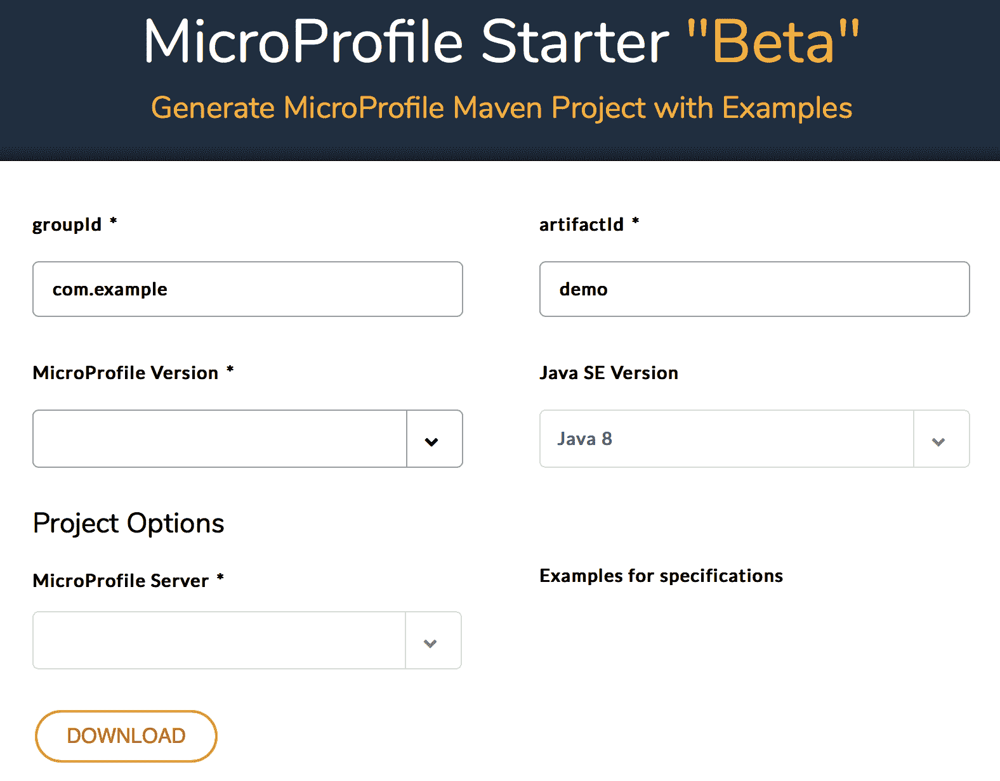
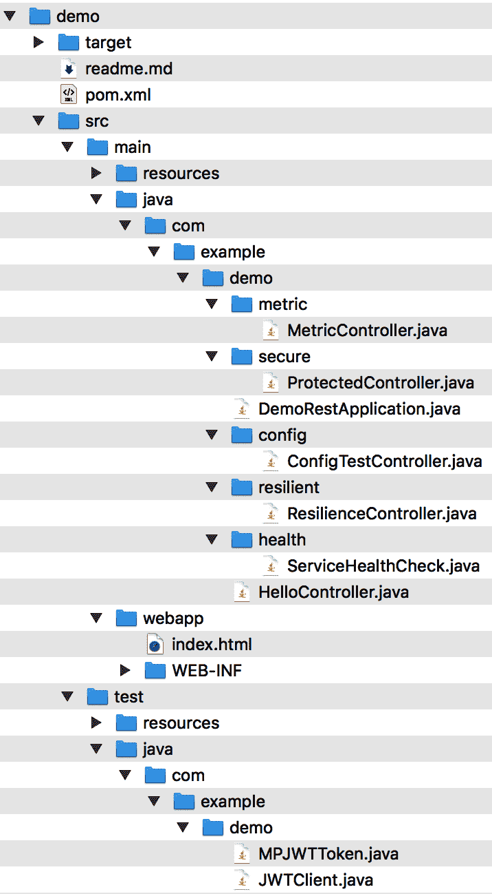
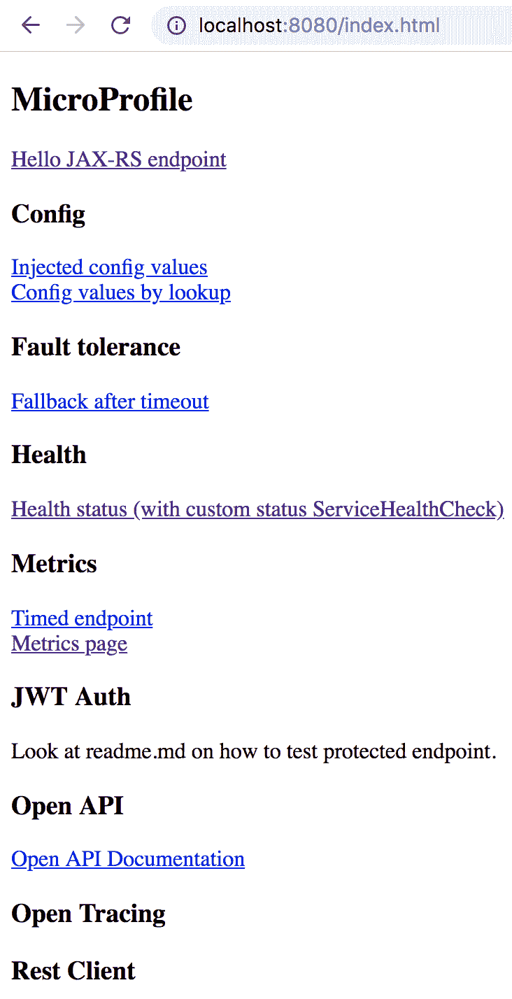
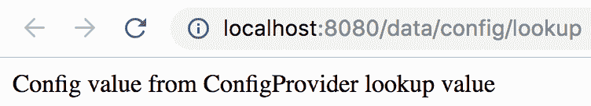

# 二、治理和贡献

Eclipse 文件由社区成员管理。换句话说，它不是由一个供应商管理的。此外，它还接收来自不同组织、公司和个人贡献者的开发人员和主题专家的贡献。该项目的特点是通过轻松的流程和治理实现创新、快速和敏捷。本章中的主题将帮助您了解 MicropoFile 项目的管理，您还将了解如何为 MicropoFile 项目做出贡献。

本章将介绍以下主题：

*   Eclipse MicroProfile项目的治理方式
*   社区如何协作并为其不断创新做出贡献。。。

# 当前 Eclipse 文件治理

Eclipse 文件在其操作和决策过程中是透明的，这是非常轻量级的。治理的重点是以协作的方式创建、创新和发展规范。

Eclipse 文件首先是一个 Eclipse 项目，因此它遵循 Eclipse 过程。这包括提交者批准、项目发布、知识产权保护、许可证审查流程等。然而，Eclipse 基金会对于诸如 MyPrrices 这样的项目足够灵活，可以为多个规范提供一些额外的轻量级流程，以并行方式进行跨通信和对齐规范的方式。

其中一个轻量级流程是 Eclipse MicroFile 每周两次的聚会/电话（其会议 URL 为[https://eclipse.zoom.us/j/949859967](https://eclipse.zoom.us/j/949859967) ，谁的录音可以在 Eclipse YouTube 频道[上找到 https://www.youtube.com/channel/UC_Uqc8MYFDoCItFIGheMD_w](https://www.youtube.com/channel/UC_Uqc8MYFDoCItFIGheMD_w) ，它向社区中的任何人开放，并作为一个论坛，讨论与会者提出的主题并做出决策，从子项目状态和发布内容到发布日期和子项目创建批准。应该注意的是，MicroFile 并不是一个标准组织，尽管它看起来是这样的。MicroProfile是由社区为社区创建的，它以社区在其不同子项目中创新时确定的速度移动。MicroProfile 定义了鼓励多种实现的规范，很像标准组织。然而，MicroProfile 实际上是一个快速发展的开源项目，其源代码是规范。

社区交流、讨论和辩论的主要方式是 Eclipse MicroProfile Google Group（[https://groups.google.com/forum/#！论坛/文件](https://groups.google.com/forum/#!forum/microprofile)。您可以使用您最喜爱的 web 浏览器阅读、发布、回答或启动 Google 组中任何与文件相关主题的论坛消息。您还可以使用该组的电子邮件来启动新的论坛消息。任何人都可以启动新的论坛线程来讨论主题，例如添加到文件中的潜在新功能。在社区在论坛和/或聚会上详细讨论了一个新想法，并确定值得进一步讨论后，社区决定为这个新想法成立一个工作组，以及一个或一组领导人，他们通常是手头主题的专家，被指定为其促进者。

需要注意的一个重要方面是，一个或多个工作组（或该问题的子项目）的负责人不会单枪匹马地塑造或决定规范的演变，也不会决定是否包含哪些能力。他们没有否决权或就其规格所作决定的最终决定权。通过分享想法、专业知识、过去的经验、对现有技术的分析和最佳实践，工作组将尽可能提出他们的最佳建议。此外，社区需要讨论所有未解决的问题，并在每两周一次的聚会/呼吁进一步辩论中提出（如果需要）。通过讨论、协作和来自社区的反馈，分析了许多观点，从而使最佳选项浮出水面。工作组将每周或每两周召开一次定期会议，会议记录在谷歌日历文件（[中）https://calendar.google.com/calendar/embed?src=gbnbc373ga40n0tvbl88nkc3r4%40group.calendar.google.com](https://calendar.google.com/calendar/embed?src=gbnbc373ga40n0tvbl88nkc3r4%40group.calendar.google.com) ）。它包含所有MicroProfile挂起调用、MicroProfile子项目调用和MicroProfile发布日期的信息。

虽然任何人都可以参加这些会议，但通常都有一些核心人员作为主题专家参与这些会议。在几次会议之后，工作组决定是否应将新功能提交 Micropofile Hangout 会议，以讨论其成为 Micropofile 子项目的建议。

在会议上，子项目建议书可能会被拒绝或接受。应该说，当子项目提案被提交给会议时，关于是否应该推进的大部分讨论都已经进行了，因此在会议上做出的决定对子项目工作组来说并不奇怪。拒绝子项目并不意味着它不能满足特定的开发需求，而是肯定了它的目标与推进MicroProfile规范并不匹配，MicroProfile规范的目标是为微服务体系结构优化企业 Java。

例如，如果子项目提案解决了与微服务无关的需求，那么子项目提案很可能不会作为MicroProfile子项目前进。子项目的接受意味着它有效地满足了一种需求，这一需求丰富了规范，使其朝着为微服务体系结构优化企业 Java 的目标前进。正是在这个时候，一个子项目成为了一个官方的MicroProfile API。一旦子项目成为MicroProfile API，则确定它是伞式MicroProfile版本之外的独立子项目还是包含在伞式MicroProfile版本中的子项目。该流程的高级流程图如下：


在撰写本书时，以下是 Eclipse 文件 API/子项目（列出了项目负责人）：

| **MicroProfile API/子项目名称** | **子项目负责人** |
| MicroProfile项目领导 | 约翰·克林根和凯文·萨特 |
| 配置 | 江慧卿和马克·斯特鲁伯格 |
| 容错性 | 江慧卿 |
| 健康检查 | 安托万·卡托·杜兰德 |
| JWT 传播 | 斯科特·斯塔克 |
| 韵律学 | 海科·鲁普 |
| 开放应用接口 | 阿瑟·德马加里斯 |
| 开放跟踪 | 帕沃尔·洛菲 |
| Rest 客户端 | 约翰·D·阿门特和安迪·麦奎特 |

Eclipse 微配置文件遵循一个时间盒式快速增量发布计划，它是公共的，并在 Eclipse 基金会微配置项目页面上列出（Outt0）。https://projects.eclipse.org/projects/technology.microprofile ）。主要的 Eclipse MicroProfile版本，例如从 1.x 到 2.x，包括对MicroProfile API 的主要更新，这些更新可能会引入突破性的更改。次要发布，即点发布，包括小的 API 更新或使预定发布日期生效的新 API。目前，MicroProfile社区发布窗口在每年的 2 月、6 月和 11 月用于次要和/或主要发布。

# 开放贡献的沙箱方法

为一个潜在的MicroProfile子项目创建一个工作组也可以分配一个沙箱，这是MicroProfile社区提供的另一种尝试新想法的资源。沙盒存储库，是位于[的 GitHub 存储库 https://github.com/eclipse/microprofile-sandbox](https://github.com/eclipse/microprofile-sandbox) 用于酝酿想法和代码示例，这些想法和代码示例最终将转变为新规范的单独存储库。任何人都可以打开 pull 请求，使用沙箱进行新想法的实验，共享代码和文档，这些都可以作为社区 Google 小组讨论的一部分，也可以作为工作组会议的一部分。保持拉取请求打开。。。

# 伞式发布与伞外项目

Eclipse 文件由一组规范组成，每个规范都有一个特定的焦点。例如，Eclipse MicroProfile配置规范包含与配置微服务参数相关的所有内容。规范的一个版本可以包含在 Eclipse 文件的伞式版本中，也可以在伞式版本之外发布。作为一个具体的例子，Eclipse MicroporFile 2.2 的最新伞形版本于 2019 年 2 月 12 日发布，包括以下规范：

*   Eclipse 文件打开跟踪 1.3
*   Eclipse MicroProfile开放 API 1.1
*   Eclipse 文件 Rest 客户端 1.2
*   Eclipse MicroProfile容错 2.0
*   Eclipse 文件配置 1.3
*   Eclipse MicroProfile度量 1.1
*   Eclipse MicroProfile JWT 传播 1.1
*   Eclipse MicroProfile运行状况检查 1.0
*   CDI2.0
*   JSON-P1.1
*   JAX-RS 2.1
*   JSON-B1.0

然而，Eclipse 文件还有其他规范，这些规范已经在伞形版本之外发布。例如，我们将在[第 9 章](09.html)、*反应式编程和未来发展*中介绍的 Eclipse MicroFile 反应式流操作符 1.0 是最近发布的一个规范，它是一个在保护伞之外的规范。那么，为什么 MicroFile 允许在保护伞之外使用规范呢？原因是，通过首先在保护伞外发布，它为社区和最终用户提供了利用和测试新技术的机会，因此，在考虑将其纳入保护伞之前，在实际应用中对其进行验证。

# MicroProfile启动器

MicroProfile Starter 是一个示例源代码生成器，其目标是通过在 Maven 项目中生成工作示例代码，帮助开发人员快速开始使用和利用企业 Java 微服务社区驱动的开源规范 Eclipse MicroProfile 的功能。

自 2016 年年中项目创建以来，MicroFile Starter 的想法就一直存在，并在 Devxx BE 2016（2016 年 11 月 7 日的一周）上公开讨论。在推出的头两周内，世界各地的开发人员通过 MicroFile Starter 项目创建了 1200 多个项目，这是一个良好和积极的迹象，表明 MicroFile 在全球范围内得到了采用。

# 快速浏览 MicroFile Starter

让我们快速巡视微轮廓起动器：

1.  当您进入**MicroProfile启动程序“Beta”**页面时，[https://start.microprofile.io/](https://start.microprofile.io/) ，您将看到以下登录页面：



您可以接受 Maven 相关参数的默认值（[https://maven.apache.org/guides/mini/guide-naming-conventions.html](https://maven.apache.org/guides/mini/guide-naming-conventions.html) 、groupId 和 artifactId，或根据您的喜好进行更改。groupId 参数在所有项目中唯一地标识您的项目，而 artifactId 是 JAR 文件的名称，不带文件版本号。对于本教程，接受所有默认设置。

2.  接下来，从下拉列表中选择文件版本：


对于本教程，请选择 MicroProfile 版本 MP 2.1。请注意，根据所选文件的版本，“规格示例”部分中列出的规格数量将有所不同。这个数字取决于每个版本中包含了多少 API。要了解每个版本中包含哪些 API，请参阅 MicroFile 社区演示（[https://docs.google.com/presentation/d/1BYfVqnBIffh-QDIrPyromwc9YSwIbsawGUECSsrSQB0/edit#slide=id.g4ef35057a0_6_205](https://docs.google.com/presentation/d/1BYfVqnBIffh-QDIrPyromwc9YSwIbsawGUECSsrSQB0/edit#slide=id.g4ef35057a0_6_205) ）。

3.  然后，从下拉列表中选择文件服务器：


在本教程中，选择 Thorntail V2，它是 Red Hat 用于实现 Eclipse 文件规范的开源项目。

4.  选中所有规格示例复选框（即，不要取消选中任何复选框）：


这将为 MicroFile 2.1 版中包含的所有 API 生成示例工作代码。

5.  使用 MicroFile Starter 生成示例源代码过程的最后一步是单击下载按钮，这将创建一个 ZIP 存档。确保将`demo.zip`文件保存到本地驱动器。然后，在本地驱动器中解压缩`demo.zip`。内容应如下所示：



请注意，在生成的内容中有一个`readme.md`文件。此文件包含有关如何编译和运行生成代码的说明，其中包括一个示例 web 应用，该应用可以使用 Eclipse 文件的不同功能。

6.  将目录更改为解压缩演示项目的位置。就我而言，我把它放在我的`Downloads`目录中：

```java
$ cd Downloads/demo
```

7.  通过输入以下命令编译生成的示例代码：

```java
$ mvn clean package
```

8.  运行微服务：

```java
$ java -jar target/demo-thorntail.jar
```

9.  几秒钟后，您将看到以下消息：

```java
$ INFO  [org.wildfly.swarm] (main) WFSWARM99999: Thorntail is Ready
```

这表示微服务已启动并正在运行。

10.  打开您最喜爱的 web 浏览器并将其指向`http://localhost:8080/index.html`。

这将打开示例 web 应用，如下所示：



11.  要查看文件配置的功能，请单击注入的配置值。窗口选项卡将打开，并显示以下内容：


12.  同样，如果通过查找单击配置值，则会显示另一个窗口选项卡，如下所示：



我们前面看到的参数值的*注入值*和*查找值*在`./demo/src/main/resources/META-INF/microprofile-config.properties`文件中定义，如下图：

```java
$ cat ./src/main/resources/META-INF/microprofile-config.properties
injected.value=Injected value
value=lookup value
```

13.  假设您需要在开发和系统测试之间为`value`参数使用不同的值。启动微服务时，您可以在命令行中传递一个参数，如下所示（确保先按终端窗口上的*Ctrl*+*C*退出正在运行的应用）：

```java
$ java -jar target/demo-thorntail.jar -Dvalue=hola
```

14.  现在，当您单击“按查找配置值”时，将显示另一个窗口选项卡：


请注意，执行此逻辑的源代码位于生成的`./src/main/java/com/example/demo/config/ConfigTestController.java`文件中。

15.  要查看MicroProfile容错功能，请单击超时后的回退。窗口选项卡将打开，并显示以下内容：


有关 MicroFile Config API 的更多信息，请参阅其文档（[https://github.com/eclipse/microprofile-config/releases/download/1.3/microprofile-config-spec-1.3.pdf](https://github.com/eclipse/microprofile-config/releases/download/1.3/microprofile-config-spec-1.3.pdf) ）。

示例代码结合`@Timeout`执行`@Fallback`注释，示例代码如下：

```java
@Fallback(fallbackMethod = "fallback") // fallback handler
   @Timeout(500)
   @GET
   public String checkTimeout() {
     try {
       Thread.sleep(700L);
     } catch (InterruptedException e) {
       //
     }
     return "Never from normal processing";
   }
   public String fallback() {
   return "Fallback answer due to timeout";
   }
```

`@Timeout`注释指定如果该方法的执行时间超过 500 毫秒，则应引发超时异常。此注释可以与`@Fallback`一起使用，在本例中，它在发生超时异常时调用名为 fallback 的回退处理程序。在前面生成的示例代码中，超时异常总是会发生，因为该方法正在执行，即睡眠 700 毫秒，这比 500 毫秒长。

请注意，执行此逻辑的源代码位于生成的`./src/main/java/com/example/demo/resilient/ResilienceController.java`文件中。

有关 MicroFile 容错 API 的更多信息，请参阅其文档（[https://github.com/eclipse/microprofile-opentracing/releases/download/1.2/microprofile-opentracing-spec-1.2.pdf](https://github.com/eclipse/microprofile-opentracing/releases/download/1.2/microprofile-opentracing-spec-1.2.pdf) ）。

MicroProfile社区欢迎您对MicroProfile初学者项目的持续开发提供反馈、合作或贡献。要提供反馈，您需要单击 MicroFile Starter“Beta”（[）右上角的“提供反馈”按钮 https://start.microprofile.io/](https://start.microprofile.io/) ）登录页面并创建问题。

项目启动者将项目分组，并在里程碑中对请求的项目和修复进行优先级排序，目的是持续发布。MicroFile Starter 工作组定期召开会议，如果您希望在开发技能方面帮助项目，请发送电子邮件至`microprofile@googlegroups.com`或加入其 Gitter 频道（[的讨论 https://gitter.im/eclipse/microprofile-starter](https://gitter.im/eclipse/microprofile-starter) 。项目信息，包括其源代码的位置，可在[找到 https://wiki.eclipse.org/MicroProfile/StarterPage](https://wiki.eclipse.org/MicroProfile/StarterPage) 。

# 总结

在本章中，我们了解了 Eclipse MicroProfile项目的轻量级治理过程、其快速创新方法，以及如何使用沙盒促进协作并鼓励代码开发和文档编制。我们还了解了它的子项目，这些子项目的领导者，以及如何独立发布或作为 Eclipse 发布的一部分发布它们。

此外，您还了解了 MicropoFile Starter，它是一个 Maven 项目生成工具，提供代码示例，以便开发人员能够快速启动他们的 MicropoFile 应用。最后，我们初步了解了如何使用 Eclipse 文件配置构造轻松修改应用的属性。。。

# 问题

1.  MicroProfile社区的主要通信方式是什么？
2.  每两周一次的聚会的目的是什么？
3.  子项目（文件规范）主管/主管的角色是什么？
4.  新的MicroProfile规范提案所遵循的流程是什么？
5.  MicroFile 项目遵循的发布时间表是什么？
6.  MicroProfile沙箱的目标是什么？
7.  在伞式/平台下发布的项目与在其外部发布的项目有什么区别？
8.  什么是 MicroFile Starter？它提供了什么好处？