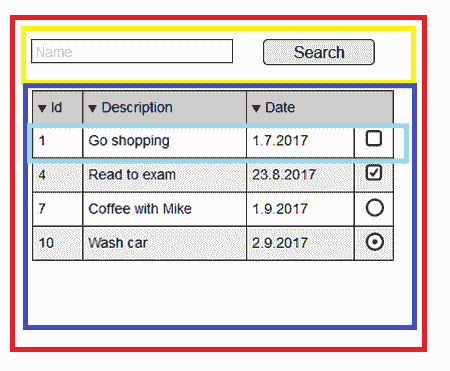
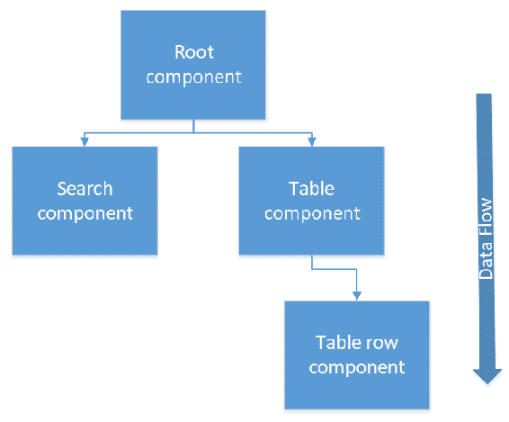
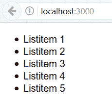
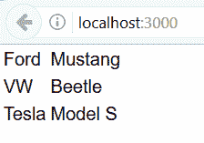
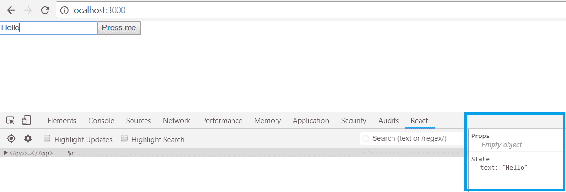
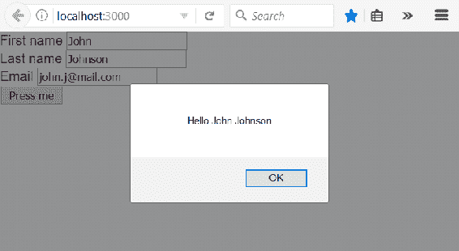

# 六、从 React 开始

本章介绍 React 编程的基础知识。我们将介绍为 React 前端创建基本功能所需的技能。在 JavaScript 中，我们使用 ES6 语法，因为它提供了许多使编码更简洁的特性。

在本章中，我们将了解以下内容：

*   如何创建 React 组件
*   如何在组件中使用状态和道具
*   有用的 ES6 功能
*   什么是 JSX
*   如何在 React 中处理事件和表单

# 技术要求

在这本书中，我们使用的是 Windows 操作系统，但所有工具都可以用于 Linux 和 macOS。

# 基本反应组分

根据 Facebook 的说法，React 是一个用于用户界面的 JavaScript 库。从版本 15 开始，React 就在 MIT 许可下开发。React 是基于组件的，组件是独立的和可重用的。这些组件是 React 的基本构建块。当您开始使用 React 开发用户界面时，最好从创建模拟界面开始。这样，就很容易确定您必须创建哪种组件以及它们如何交互。

从下面的模拟图中，我们可以看到如何将用户界面拆分为组件。在这种情况下，将有一个应用根组件、一个搜索栏组件、一个表组件和一个表行组件：



然后可以按以下树层次结构排列组件。使用 React 需要了解的重要一点是，数据流从父组件流向子组件：



React 使用虚拟 DOM 选择性地重新呈现用户界面，这使其更具成本效益。虚拟 DOM 是 DOM 的轻量级副本，对虚拟 DOM 的操作要比真实 DOM 快得多。更新虚拟 DOM 后，React 会将其与运行更新之前从虚拟 DOM 获取的快照进行比较。在比较之后，React 知道哪些部分已经更改，并且只有这些部分更新为真实的 DOM。

可以使用 JavaScript 函数或 ES6JavaScript 类定义 React 组件。在下一节中，我们将更深入地讨论 ES6。下面是呈现`Hello World`文本的简单组件源代码。第一个代码块使用 JavaScript 函数：

```java
// Using JavaScript function
function Hello() {
  return <h1>Hello World</h1>;
}
```

这是一个使用类来创建组件：

```java
// Using ES6 class
class Hello extends React.Component {
  render() {
    return <h1>Hello World</h1>;
  }
}
```

使用类实现的组件包含所需的`render()`方法。此方法显示并更新组件的渲染输出。用户定义组件的名称应以大写字母开头。

让我们对组件的`render`方法进行更改，并在其中添加新的头元素：

```java
class App extends Component {
  render() {
    return (
      <h1>Hello World!</h1>
      <h2>From my first React app</h2>
    );
  }
}
```

运行应用时，您会发现相邻的 JSX 元素必须包装在一个封闭的标记错误中。要修复此错误，我们必须将标题包装在一个元素中，例如`div`；从 React 版本 16.2 开始，我们还可以使用`Fragments`，它看起来像空的 JSX 标记：

```java
// Wrap headers in div
class App extends Component {
  render() {
    return (
      <div>
        <h1>Hello World!</h1>
        <h2>From my first React app</h2>
      </div>
    );
  }
}

// Or using fragments
class App extends Component {
  render() {
    return (
      <>
        <h1>Hello World!</h1>
        <h2>From my first React app</h2>
      </>
    );
  }
}

```

让我们更仔细地看看我们在上一章中使用`create-react-app`创建的第一个 React 应用。根文件夹中`Index.js`文件的源代码如下：

```java
import React from 'react';
import ReactDOM from 'react-dom';
import './index.css';
import App from './App';
import registerServiceWorker from './registerServiceWorker';

ReactDOM.render(<App />, document.getElementById('root'));
registerServiceWorker();
```

在文件的开头，有`import`语句将组件或资产加载到我们的文件中。例如，第二行从`node_modules`文件夹导入`react-dom`包，第四行导入`App`（根文件夹中的`App.js`文件）组件。`react-dom`包为我们提供了特定于 DOM 的方法。要将 React 组件呈现给 DOM，我们可以使用`react-dom`包中的`render`方法。第一个参数是要呈现的组件，第二个参数是要呈现组件的元素或容器。在本例中，`root`元素是`<div id="root"></div>`，可以在`public`文件夹中的`index.html`文件中找到。参见以下`index.html`文件：

```java
<!DOCTYPE html>
<html lang="en">
  <head>
    <meta charset="utf-8">
    <meta name="viewport" content="width=device-width, initial-scale=1,
     shrink-to-fit=no">
    <meta name="theme-color" content="#000000">

    <link rel="manifest" href="%PUBLIC_URL%/manifest.json">
    <link rel="shortcut icon" href="%PUBLIC_URL%/favicon.ico">

    <title>React App</title>
  </head>
  <body>
    <div id="root"></div>
  </body>
</html>
```

下面的源代码显示了我们第一个 React 应用中的`App.js`组件。您可以看到，`import`也适用于资产，例如图像和样式表。在源代码的末尾，有一个`export`语句导出该组件，其他组件可以使用 import 使用该语句。每个文件只能有一个默认导出，但可以有多个命名导出：

```java
import React, { Component } from 'react';
import logo from './logo.svg';
import './App.css';

class App extends Component {
  render() {
    return (
      <div className="App">
        <header className="App-header">
          
          <h1 className="App-title">Welcome to React</h1>
        </header>
        <p className="App-intro">
          To get started, edit <code>src/App.js</code> and save to reload.
        </p>
      </div>
    );
  }
}

export default App;
```

以下示例显示如何导入默认导出和命名导出：

```java
import React from 'react' // Import default value
import { Component } from 'react' // Import named value
```

导出如下所示：

```java
export default React // Default export
export {Component} // Named export
```

# ES6 基础知识

**ES6**（**ECMAScript 2015**于 2015 年发布，引入了很多新功能。ECMAScript 是一种标准化的脚本语言，JavaScript 是它的一种实现。在这里，我们将介绍 ES6 中发布的最重要的特性，这些特性将在下一节中使用。

# 理解常数

常数或不可变变量可以通过使用`const`关键字来定义。使用`const`关键字时，变量内容不能重新赋值：

```java
const PI = 3.14159;
```

`const`的范围为块范围，与`let`相同。这意味着`const`变量只能在定义它的块内使用。实际上，块是花括号`{ }`之间的区域。下面的示例代码显示了作用域的工作方式。第二条`console.log`语句给出了一个错误，因为我们试图在范围之外使用`total`变量：

```java
var count = 10;
if(count > 5) {
  const total = count * 2;
  console.log(total); // Prints 20 to console
}
console.log(total); // Error, outside the scope
```

很高兴知道，如果`const`是一个对象或数组，则可以更改内容。以下示例说明：

```java
const myObj = {foo : 3};
myObj.foo = 5; // This is ok
```

# 箭头函数

箭头函数使函数声明更加紧凑。在 JavaScript 中定义函数的传统方法是使用`function`关键字。以下函数获取一个参数并仅返回参数值：

```java
function hello(greeting) {
    return greeting;
}
```

通过使用 ES6 arrow 函数，函数如下所示：

```java
const hello = greeting => { greeting }

// function call
hello('Hello World'); // returns Hello World
```

如果有多个参数，则必须将参数用括号括起来，并用逗号分隔参数。下面的函数获取两个参数并返回参数之和。如果函数体是表达式，则不需要使用`return`关键字。表达式总是从函数隐式返回：

```java
const calcSum = (x, y) => { x + y }

// function call
calcSum(2, 3); // returns 5
```

如果函数没有任何参数，则语法如下：

```java
() => { ... }
```

# 模板文本

模板文本可用于连接字符串。连接字符串的传统方法是使用加号运算符：

```java
var person = {firstName: 'John', lastName: 'Johnson'};
var greeting = "Hello " + ${person.firstName} + " " + ${person.lastName};
```

对于模板文本，语法如下所示。您必须使用反引号（`` ``，而不是单引号或双引号：

```java
var person = {firstName: 'John', lastName: 'Johnson'};
var greeting = `Hello ${person.firstName} ${person.lastName}`;
```

# 类与继承

ES6 中的类定义类似于 Java 或 C#等其他面向对象语言。定义类的关键字是`class`。类可以有字段、构造函数和类方法。以下示例代码显示了 ES6 类：

```java
class Person {
    constructor(firstName, lastName) {
        this.firstName = firstName;
        this.lastName = lastName;
    }  
}
```

继承是通过一个`extends`关键字完成的。下面的示例代码显示了继承`Person`类的`Employee`类。因此，它继承父类中的所有字段，并且可以拥有自己的特定于员工的字段。在构造函数中，我们首先使用`super`关键字调用父类构造函数。该调用是必需的，如果缺少该调用，您将得到一个错误：

```java
class Employee extends Person {
    constructor(firstName, lastName, title, salary) {
        super(firstName, lastName);
        this.title= title;
        this.salary = salary;
    }  
}
```

虽然 ES6 已经很老了，但它仍然只得到现代 web 浏览器的部分支持。Babel 是一个 JavaScript 编译器，用于将 ES6 编译为与所有浏览器兼容的旧版本。您可以在 Babel 网站（[上测试编译器 https://babeljs.io](https://babeljs.io) ）。以下屏幕截图显示了编译回旧 JavaScript 语法的 arrow 函数：


# JSX 和样式

JSX 是 JavaScript 的语法扩展。将 JSX 与 React 一起使用不是强制性的，但是有一些好处可以使开发更容易。例如，JSX 可以防止注入攻击，因为所有值在呈现之前都会在 JSX 中转义。最有用的特性是，您可以在 JSX 中嵌入 JavaScript 表达式，方法是用花括号将其括起来，这将在后面的章节中大量使用。在本例中，我们可以在使用 JSX 时访问组件道具。组件道具将在下一节中介绍：

```java
class Hello extends React.Component {
  render() {
    return <h1>Hello World {this.props.user}</h1>;
  }
}
```

您还可以将 JavaScript 表达式作为道具传递：

```java
<Hello count={2+2} />
```

JSX 由巴贝尔编译成`React.createElement()`调用。您可以对 React JSX 元素使用内部或外部样式。以下是内联样式的两个示例。第一个定义了直接在`div`元素内部的样式：

```java
<div style={{height: 20, width: 200}}>
  Hello
</div>
```

第二个示例首先创建样式对象，然后在`div`元素中使用。对象名称应使用 camelCase 命名约定：

```java
const divStyle = {
  color: 'red',
  height: 30
};

const MyComponent = () => (
  <div style={divStyle}>Hello</div>
);
```

如前一节所示，可以将样式表导入 React 组件。要引用外部 CSS 文件中的类，应使用`className`属性：

```java
import './App.js';

...

<div className="App-header">
  This is my app
</div>
```

# 道具与状态

道具和状态是渲染组件的输入数据。道具和状态实际上都是 JavaScript 对象，当道具或状态发生变化时，组件将重新呈现。

这些道具是不可变的，因此组件无法更改其道具。从父组件接收道具。组件可以通过`this.props`对象访问道具。例如，请查看以下组件：

```java
class Hello extends React.Component {
  render() {
    return <h1>Hello World {this.props.user}</h1>;
  }
}
```

父组件可以通过以下方式向`Hello`组件发送道具：

```java
<Hello user="John" />
```

当`Hello`组件被渲染时，它显示`Hello World John`文本。

可以在组件内部更改状态。状态的初始值在组件的构造函数中给出。可以使用`this.state`对象访问状态。状态的范围是组件，因此不能在定义它的组件之外使用。正如您在下面的示例中所看到的，props 作为参数传递给构造函数，并且状态在构造函数中初始化。然后可以使用花括号`{this.state.user}`在 JSX 中呈现状态值：

```java
class Hello extends React.Component {
  constructor(props) {
    super(props);
    this.state = {user: 'John'}
  }

  render() {
    return <h1>Hello World {this.state.user}</h1>;
  }
}
```

该状态可以包含多个不同类型的值，因为它是一个 JavaScript 对象，如下例所示：

```java
  constructor(props) {
    super(props);
    this.state = {firstName: 'John', lastName: 'Johnson', age: 30}
  }
```

使用`setState`方法更改状态值：

```java
this.setState({firstName: 'Jim', age: 31});  // Change state value
```

永远不要使用 equals 操作符更新状态，因为这样 React 不会重新渲染组件。更改状态的唯一方法是使用触发重新渲染的`setState`方法：

```java
this.state.firstName = 'Jim'; // WRONG
```

`setState`方法是异步的，因此无法确定何时更新状态。`setState`方法有一个回调函数，该函数在状态更新时执行。

状态的使用总是可选的，它增加了组件的复杂性。只有道具的组件称为**无状态**组件。当有相同的输入时，它总是呈现相同的输出，这意味着它们非常容易测试。同时具有状态和道具的组件称为**有状态**组件。下面是简单无状态组件的示例，它是使用类定义的。您还可以使用以下函数定义它：

```java
export default class MyTitle extends Component {
  render() {
    return (
     <div>
      <h1>{this.props.text}</h1>
     </div>
    );
 };
};

// The MyTitle component can be then used in other component and text value is passed to props
<MyTitle text="Hello" />
// Or you can use other component's state
<MyTitle text={this.state.username} />
```

如果要更新依赖于当前状态的状态值，则应将更新函数传递给`setState()`方法，而不是对象。证明这种情况的一个常见案例是此处所示的反例：

```java
// This solution might not work correctly
incerementCounter = () => {
 this.setState({count: this.state.count + 1});
}

// The correct way is the following
incrementCounter = () => {
  this.setState((prevState) => {
    return {count: prevState.count + 1}
  });
}
```

# 组件生命周期方法

React 组件有许多可以重写的生命周期方法。这些方法在组件生命周期的特定阶段执行。生命周期方法的名称是逻辑的，您几乎可以猜测它们将在何时执行。具有前缀的生命周期方法在发生任何事情之前执行，具有前缀的方法在发生任何事情之后执行。挂载是组件生命周期的一个阶段，是组件被创建并插入 DOM 的时刻。在组件挂载时，我们已经介绍了两种生命周期方法：`constructor()`和`render()`。

安装阶段的一个有用方法是`componentDidMount()`，该方法在安装组件后调用。例如，此方法适用于调用一些 RESTAPI 来获取数据。下面的示例代码给出了使用`componentDidMount()`方法的示例。

在下面的示例代码中，我们首先将初始值`this.state.user`设置为`John`。然后，当安装组件时，我们将值更改为`Jim`：

```java
class Hello extends React.Component {
  constructor(props) {
    super(props);
    this.state = {user: 'John'}
  }

  componentDidMount() {
    this.setState({user: 'Jim'});
  }

  render() {
    return <h1>Hello World {this.state.user}</h1>;
  }
}
```

还有一个`componentWillMount()`生命周期方法在安装组件之前调用，但 Facebook 建议不要使用它，因为它可能用于内部开发目的。

当状态或道具已更新且在呈现组件之前调用`shouldComponentUpdate()`方法。该方法获取新的 props 作为第一个参数，获取新的 state 作为第二个参数，并返回布尔值。如果返回值为`true`，则组件将被重新呈现；否则，它将不会被重新渲染。此方法允许您避免无用的渲染并提高性能：

```java
shouldComponentUpdate(nextProps, nextState) {
  // This function should return a boolean, whether the component should re-render.
  return true; 
}
```

在从 DOM 中删除组件之前，会调用一个`componentWillUnmount()`生命周期方法。这是清理资源、清除计时器或取消请求的好方法。

错误边界是在子组件树中捕获 JavaScript 错误的组件。他们还应该记录这些错误，并在用户界面中显示回退。为此，有一种称为`componentDidCatch()`的生命周期方法。它与 React 组件一起工作，比如标准 JavaScript`catch`块。

# 使用 React 处理列表

对于列表处理，我们引入了一个新的 JavaScript 方法`map()`，当您必须操作列表时，它非常方便。`map()`方法创建一个新数组，其结果是对原始数组中的每个元素调用一个函数。在以下示例中，每个阵列元素都乘以 2：

```java
const arr = [1, 2, 3, 4];

const resArr = arr.map(x => x * 2); // resArr = [2, 4, 6, 8]
```

`map()`方法还有`index`第二个参数，在 React 中处理列表时非常有用。React 中的列表项需要一个用于检测已更改、添加或删除的行的唯一键。

以下示例显示了将整数数组转换为列表项数组并在`ul`元素中呈现这些内容的组件：

```java
class App extends React.Component {
  render() { 
    const data = [1, 2, 3, 4, 5];
    const rows = data.map((number, index) =>
     <li key={index}>Listitem {number}</li>
    );

    return (
     <div>
      <ul>{rows}</ul>
     </div>
    );
  }
}
```

以下屏幕截图显示了渲染组件时的外观：



如果数据是一个对象数组，则最好以表格式显示数据。想法与列表相同，但现在我们只需将数组映射到表行，并在 table 元素中呈现这些行，如以下代码所示：

```java
class App extends Component {
  render() { 
    const data = [{brand: 'Ford', model: 'Mustang'}, 
    {brand:'VW', model: 'Beetle'}, {brand: 'Tesla', model: 'Model S'}];
    const tableRows = data.map((item, index) =>
     <tr key={index}><td>{item.brand}</td><td>{item.model}</td></tr>
    );

    return (
     <div>
      <table><tbody>{tableRows}</tbody></table>
     </div>
    );
  }
}
```

以下屏幕截图显示了渲染组件时的外观：



# 使用 React 处理事件

React 中的事件处理类似于处理 DOM 元素事件。与 HTML 事件处理相比，区别在于事件命名在 React 中使用 camelCase。以下示例代码向按钮添加事件侦听器，并在按下按钮时显示警报消息：

```java
class App extends React.Component {
  // This is called when the button is pressed
  buttonPressed = () => {
    alert('Button pressed');
  }

  render() { 
    return (
     <div>
      <button onClick={this.buttonPressed}>Press Me</button>
     </div>
    );
  }
}
```

在 React 中，您不能从事件处理程序返回`false`，以防止出现默认行为。相反，您应该调用`preventDefault()`方法。在以下示例中，我们正在使用表单，希望阻止表单提交：

```java
class MyForm extends React.Component {
  // This is called when the form is submitted
  handleSubmit(event) {
    alert('Form submit');
    event.preventDefault();  // Prevents default behavior
  }

  render() {
    return (
      <form onSubmit={this.handleSubmit}>
        <input type="submit" value="Submit" />
      </form>
    );
  }
}
```

# 使用 React 处理表单

表单处理与 React 略有不同。HTML 表单在提交时将导航到下一页。一种常见的情况是，我们希望调用一个 JavaScript 函数，该函数在提交后可以访问表单数据，并避免导航到下一页。在上一节中，我们已经使用`preventDefault()`介绍了如何避免提交

让我们首先创建一个带有一个输入字段和 submit 按钮的极简表单。为了能够获得输入字段的值，我们使用`onChange`事件处理程序。更改输入字段的值时，新值将保存到状态。`this.setState({text: event.target.value});`语句从输入字段获取值，并将其保存到名为`text`的状态。最后，当用户按下提交按钮时，我们将显示键入的值。以下是我们第一个表单的源代码：

```java
class App extends Component {
  constructor(props) {
    super(props);
    this.state = {text: ''};
  }

  // Save input box value to state when it has been changed
  inputChanged = (event) => {
    this.setState({text: event.target.value});
  }

  handleSubmit = (event) => {
    alert(`You typed: ${this.state.text}`);
    event.preventDefault();
  }

  render() {
    return (
      <form onSubmit={this.handleSubmit}>
        <input type="text" onChange={this.inputChanged} 
            value={this.state.text}/>
        <input type="submit" value="Press me"/>
      </form>
    );
  } 
}
```

以下是按下提交按钮后表单组件的屏幕截图：


现在是查看 React 开发者工具的好时机，它们是调试 React 应用的便捷工具。如果我们用 React 表单应用打开 React Developer 工具，并在输入字段中键入一些内容，我们可以看到状态值是如何变化的。我们可以检查道具和状态的当前值。以下屏幕截图显示了在输入字段中键入内容时状态的变化：



通常，表单中有多个输入字段。处理多个输入字段的一种方法是添加尽可能多的更改处理程序。但是这会产生很多样板代码，这是我们想要避免的。因此，我们将 name 属性添加到输入字段中，并可以在变更处理程序中利用该属性来确定哪个输入字段触发变更处理程序。输入字段的 name 属性值必须与要保存该值的状态的名称相同。

处理程序现在看起来如下所示。如果触发处理程序的输入字段是 first name 字段，那么`event.target.name`是`firstName`，类型化的值将被保存到名为`firstName`的状态。这样，我们可以使用一个更改处理程序处理所有输入字段：

```java
 inputChanged = (event) => {
    this.setState({[event.target.name]: event.target.value});
  }
```

以下是组件的完整源代码：

```java
class App extends Component {
  constructor(props) {
    super(props);
    this.state = {firstName: '', lastName: '', email: ''};
  }

  inputChanged = (event) => {
    this.setState({[event.target.name]: event.target.value});
  }

  handleSubmit = (event) => {
    alert(`Hello ${this.state.firstName} ${this.state.lastName}`);
    event.preventDefault();
  }

  render() {
    return (
      <form onSubmit={this.handleSubmit}>
        <label>First name </label>
        <input type="text" name="firstName" onChange={this.inputChanged} 
            value={this.state.firstName}/><br/>
        <label>Last name </label>
        <input type="text" name="lastName" onChange={this.inputChanged} 
            value={this.state.lastName}/><br/>
        <label>Email </label>
        <input type="email" name="email" onChange={this.inputChanged} 
            value={this.state.email}/><br/>
        <input type="submit" value="Press me"/>
      </form>
    );
  } 
}
```

以下是按下提交按钮后表单组件的屏幕截图：



# 总结

在本章中，我们开始发现 React，我们将使用它来构建前端。在开始使用 React 进行开发之前，我们介绍了一些基础知识，例如 React 组件、JSX、props 和 state。在我们的前端开发中，我们使用 ES6，这使我们的代码更干净。我们介绍了进一步开发所需的功能。我们还学习了如何使用 React 处理表单和事件。

# 问题

1.  反应成分是什么？
2.  什么是状态和道具？
3.  React 应用中的数据如何流动？
4.  无状态组件和有状态组件之间的区别是什么？
5.  什么是 JSX？
6.  什么是组件生命周期方法？
7.  我们应该如何处理反应中的事件？
8.  我们应该如何在 React 中处理表单？

# 进一步阅读

Packt 还有其他学习 React 的好资源：

*   [https://www.packtpub.com/web-development/getting-started-react](https://www.packtpub.com/web-development/getting-started-react)
*   [https://www.packtpub.com/web-development/react-16-essentials-second-edition](https://www.packtpub.com/web-development/react-16-essentials-second-edition)