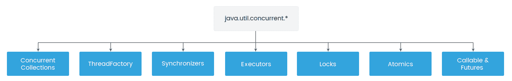

# 八、多线程和并发编程

在上一章中，我们学习了如何优化 Spring 消息传递。我们还学习了各种配置技巧和技巧，帮助我们提高应用的性能。我们还研究了 JMS 和 RabbitMQ 的监控和配置，以获得最佳性能。

在本章中，我们将介绍 Java 线程的核心概念，然后讨论由`java.util.concurrent`包提供的高级线程支持。对于这个包，我们将看到帮助我们编写多线程和并发编程的各种类和接口。我们还将学习如何使用 Java`ThreadPool`来提高性能。我们将介绍 Spring 框架提供的有用功能，例如任务执行、调度和异步运行。最后，我们将研究使用线程的 Spring 事务管理和线程的各种最佳编程实践。

本章将介绍以下主题：

*   Java 经典线程
*   `java.util.concurrent`包
*   使用线程池进行异步处理
*   Spring 任务执行与调度
*   弹簧异步
*   Spring 和 threads 事务
*   Java 线程最佳编程实践

# Java 经典线程

Java 应用通过线程执行，线程是程序中独立的执行路径。任何 Java 程序都至少有一个线程，称为主线程，由**Java 虚拟机**（**JVM**创建。Java 是一个多线程应用，允许在任何特定时间执行多线程，这些线程可以异步或同步并发运行。当多个线程执行时，每个线程的路径可能不同于其他线程的路径。

JVM 为每个线程提供自己的堆栈，以防止线程相互干扰。单独的堆栈有助于线程跟踪下一个要执行的指令，每个线程执行的指令可能不同。堆栈还为线程提供了自己的方法参数、局部变量和返回值副本。

线程生活在一个进程中，并与该进程的其他线程共享其资源，如内存和打开的文件。在不同线程之间共享资源的能力使它们更容易受到错误的影响，而性能是一个重要的要求。Java 中的每个线程都是由`java.lang.Thread`类和`java.lang.Runnable`接口创建和控制的。

# 创建线程

线程是 Java 语言中的对象。可以使用以下机制创建它们：

*   创建一个实现`Runnable`接口的类
*   创建一个扩展`Thread`类的类

创建`Runnable`对象有两种方法。第一种方法是创建一个实现`Runnable`接口的类，如下所示：

```java
public class ThreadExample {
  public static void main(String[] args) {
    Thread t = new Thread(new MyThread());
    t.start();
  }
}
class MyThread implements Runnable {
  private static final Logger LOGGER =     
  Logger.getLogger(MyThread.class);
  public void run() {
    //perform some task
    LOGGER.info("Hello from thread...");
  }
}
```

在 Java8 之前，我们只有这种方法来创建`Runnable`对象。但从 Java8 开始，我们可以使用 Lambda 表达式创建一个`Runnable`对象。

创建`Runnable`对象后，需要将其传递给`Thread`构造函数，该构造函数接收`Runnable`对象作为参数：

```java
Runnable runnable = () -> LOGGER.info("Hello from thread...");
Thread t = new Thread(runnable);
```

有些构造函数不将`Runnable`对象作为参数，例如`Thread()`。在这种情况下，我们需要采取另一种方法来创建线程：

```java
public class ThreadExample1 {
  public static void main(String[] args) {
    MyThread t = new MyThread1();
    t.start();
  }

}
class MyThread1 extends Thread {
  private static final Logger LOGGER = 
  Logger.getLogger(MyThread1.class);
  public void run() {
    LOGGER.info("Hello from thread...");
  }
}
```

# 线程生命周期和状态

在处理线程和多线程环境时，了解线程生命周期和状态非常重要。在前面的示例中，我们看到了如何使用`Thread`类和`Runnable`接口创建 Java 线程对象。但要启动线程，我们必须首先创建 thread 对象并调用其`start()`方法，以线程的形式执行`run()`方法。

以下是 Java 中线程生命周期的不同状态：

*   **新建**：使用`new`操作符创建线程时，线程处于新建状态。在此阶段，线程不活动。

*   **可运行**：调用 thread 对象的`start()`方法时，线程处于可运行状态。在这个阶段，线程调度程序仍然不会选择它来运行。
*   **正在运行**：当线程调度程序选择线程状态时，线程状态从 runnable 变为 Running。
*   **阻塞/等待**：线程当前不符合运行条件时，线程状态为阻塞/等待。
*   **终止/失效**：线程执行 run 方法时，线程状态为终止/失效。在这个阶段，它被认为是没有生命的。

# 更高级的线程任务

我们已经看到了线程的生命周期及其状态，但是线程还支持一些高级任务，例如睡眠、加入和中断。让我们来讨论一下：

*   **休眠**：可以使用`sleep()`线程方法将当前线程的执行暂停指定的时间。
*   **加入**：可以使用`join()`线程方法暂停当前线程的执行，直到其加入的线程完成任务。
*   **中断**：可以使用`interrupt()`线程方法来打破线程的休眠或等待状态。如果线程处于休眠或等待状态，则抛出`InterruptedException`，否则不会中断线程，而是将中断标志设置为 true。

# 同步线程

在多线程应用中，可能存在多线程试图访问共享资源并产生错误和意外结果的情况。我们需要确保资源一次只被一个线程使用，这可以通过同步实现。`synchronized`关键字用于实现同步；在 Java 中定义任何同步块时，只有一个线程可以访问该块，其他线程被阻塞，直到块中的线程退出该块。

`synchronized`关键字可用于以下不同类型的块：

*   实例方法
*   静态方法

*   实例方法内部的代码块
*   静态方法中的代码块

在 Java 中，同步块会降低性能。我们必须在需要时使用`synchronized`关键字，否则，我们应该只在需要的地方使用关键部分的同步块。

# 多线程问题

多线程是一种非常强大的机制，可以帮助我们更好地利用系统资源，但在读取和写入多线程共享的数据时，我们需要特别小心。多线程编程的可见性和访问问题有两个基本问题。当一个线程的效果可以被另一个线程看到时，就会出现可见性问题。当多个线程同时访问相同的共享资源时，可能会出现访问问题。

由于可见性和访问问题，程序不再作出反应，从而导致死锁或生成不正确的数据。

# java.util.concurrent 包

在上一节中，我们重点讨论了 Java 对线程的底层支持。在本节中，我们将继续研究由`java.util.concurrent`包提供的 Java 高级线程支持。这个包有各种各样的类和接口，它们提供了非常有用的功能来帮助我们实现多线程和并发编程。在本节中，我们将主要关注这个包中一些最有用的实用程序。

下图显示了`java.util.concurrent`API 的高级概述：



让我们详细讨论一下接口。

# 遗嘱执行人

`Executor`为所有内部线程管理任务提供抽象层，并管理线程的整个并发执行流。`Executor`是执行所提供任务的对象。

Java 并发 API 为执行者提供以下三个基本接口：

*   `Executor`：这是一个用于启动新任务的简单界面。它并不严格要求执行是异步的。
*   `ExecutorService`：这是`Executor`接口的子接口。它允许我们异步传递一个由线程执行的任务。它提供了通过`shutdown()`、`shutdownNow()`和`awaitTermination(long timeout, TimeUnit unit)`管理先前升华任务的终止的方法。它还提供返回`Future`对象的方法，用于跟踪一个或多个异步任务的进度。
*   `ScheduledExecutorService`：这是`ExecutorService`的子接口。提供`schedule()`、`scheduleAtFixedRate()`、`scheduleWithFixedDelay()`等多种关键方式。所有调度方法都可以接受相对延迟和周期作为参数，这有助于我们将任务调度到给定延迟或周期后执行。

下面是一个简单的示例，演示如何创建`Executor`以执行`Runnable`任务：

```java
public class ExecutorExample {
    private static final Logger LOGGER = 
    Logger.getLogger(ExecutorExample.class);

    public static void main(String[] args) {
        ExecutorService pool = Executors.newSingleThreadExecutor();

            Runnable task = new Runnable() {
            public void run() {
                LOGGER.info(Thread.currentThread().getName());
            }
        }; 

        pool.execute(task); 
        pool.shutdown();
    }
}
```

在前面的示例中，`Runnable`对象由匿名类创建，并通过单线程`Executor`接口执行任务。编译并运行前面的类时，我们将获得以下输出：

```java
pool-1-thread-1
```

# 螺纹加工厂

`ThreadFactory`接口用于按需创建新线程，还帮助我们消除了大量创建线程的样板代码。

下面的示例显示了如何使用`ThreadFactory`接口创建新线程：

```java
public class ThreadFactoryExample implements ThreadFactory {
  private static final Logger LOGGER =   
  Logger.getLogger(ThreadFactoryExample.class);

  public static void main(String[] args) {
    ThreadFactoryExample factory = new ThreadFactoryExample();

    Runnable task = new Runnable() {
      public void run() {
        LOGGER.info(Thread.currentThread().getName());
      }
    };
    for (int i = 0; i < 5; i++) {
      Thread t = factory.newThread(task);
      t.start();
    }
  }

  @Override
  public Thread newThread(Runnable r) {
    Thread t = new Thread(r);
    return t;
  }
}
```

编译并运行前面的类时，我们将获得以下输出：

```java
Thread-0
Thread-1
```

# 同步化器

Java 提供了一个`synchronized`关键字来编写同步代码，但仅通过`synchronized`关键字很难正确编写同步代码。`java.util.concurrent`包提供了各种实用程序类，如`CountDownLatch`、`CyclicBarrier`、`Exchanger`、`Semaphore`和`Phaser`，它们被称为同步器。同步器是提供线程同步而不使用`wait()`和`notify()`方法的并发实用程序。让我们看一下以下几类：

*   `CountDownLatch`：这允许一个线程等待一个或多个线程完成后才能开始处理。
*   `CyclicBarrier`：这与`CountdownLatch`非常相似，但它允许多个线程在开始处理之前互相等待。
*   `Semaphore`：这维护了一组许可证，用于限制可以访问共享资源的线程数量。线程在访问共享资源之前需要`Semaphore`的许可。它提供了两种主要方法，`acquire()`和`release()`分别用于获取和发布许可证。
*   `Exchanger`：这提供了一个线程可以交换对象的同步点。
*   `Phaser`：提供类似`CyclicBarrier`和`CountDownLatch`的线程同步机制，但支持更灵活的使用。它允许一组线程在屏障上等待，然后在最后一个线程到达后继续，它还支持多个执行阶段。

# 并发集合类

并发集合类比其他集合类（如`HashMap`或`Hashtable`）提供更多的可伸缩性和性能。以下是`java.util.concurrent`包中提供的有用并发类：

*   `ConcurrentHashMap`：与`HashMap`和`Hashtable`类似，但其设计用于并发编程，无需显式同步。`Hashtable`和`ConcurrentHashMap`都是线程安全集合，但`ConcurrentHashMap`比`Hashtable`更高级。它不会锁定整个集合以进行同步，因此在有大量更新和较少并发读取时非常有用。

*   `BlockingQueue`：生产者-消费者模式是异步编程中最常见的设计模式，`BlockingQueue`数据结构在这些异步场景中非常有用。
*   `DelayQueue`：这是一个无限大小的元素阻塞队列，其中一个元素只有在其延迟过期时才能使用。如果有多个元素延迟到期，那么延迟到期时间最长的元素将首先使用。

# 锁

`Lock`接口提供了比同步块更高级的锁定机制。同步块与`Lock`的主要区别在于，同步块完全包含在一个方法中，`Lock`接口有单独的方法`lock()`和`unlock()`，可以在不同的方法中调用。

# 可赎回与未来

`Callable`接口类似于`Runnable`对象，但它可以返回任何类型的对象，这有助于我们从`Callable`任务中获取结果或状态。

`Callable`任务返回`Future`对象，用于获取异步操作的结果。它的用途包括提供两种方法来检查异步执行是否完成，以及检索计算结果。

# 原子变量

原子变量是`java.util.concurrent.atomic`包中引入的非阻塞算法。使用原子变量的主要好处是我们不需要担心同步问题。原子变量是多线程环境中避免数据不一致的必要条件。它支持对单个变量执行无锁、线程安全的操作。

# 使用线程池进行异步处理

线程池是多线程编程中的一个核心概念，它为可用于执行任务的空闲线程集合提供服务。线程池可以重用以前创建的线程来执行当前任务，以便在请求到达时线程已经可用，这可以减少线程创建时间并提高应用的性能。通常，线程池可以在 web 服务器中用于处理客户端请求，还可以用于维护与数据库的开放连接。

我们可以配置池中并发线程的最大数量，这有助于防止过载。如果所有线程都在忙于执行任务，则会将新任务放入队列中，并等待线程可用。

Java 并发 API 支持以下类型的线程池：

*   **固定线程池**：具有固定线程数的线程池。只有当线程可用时，任务才会执行，否则，它将在队列中等待。`Executors.newFixedThreadPool()`方法用于创建固定线程池。
*   **缓存线程池**：一个线程池，我们可以根据需要创建新线程，但也可以重用以前创建的线程。如果一个线程在理想情况下持续 60 秒，那么它将被终止并从池中删除。`Executors.newCachedThreadPool()`方法用于创建缓存线程池。
*   **单线程池**：一个有一个线程的线程池。它一个接一个地执行任务。`Executors.newSingleThreadExecutor()`方法用于创建单线程池。
*   **Fork/join pool**：一个线程池，通过递归地将任务分割成更小的部分，用于更快地执行繁重的任务。要创建 fork/join 池，我们需要创建一个`ForkJoinPool`类的实例。

下面是固定线程池的一个简单示例：

```java
public class ThreadPoolExample {
  private static final Logger LOGGER = 
  Logger.getLogger(ThreadPoolExample.class);
  public static void main(String[] args) {
    ExecutorService executor = Executors.newFixedThreadPool(3);

    for (int i = 1; i <= 6; i++) {
      Runnable task = new Task(" " + i);
      executor.execute(task);
    }
    executor.shutdown();
    while (!executor.isTerminated()) {
    }
    LOGGER.info("All threads finished");
  }
}
```

以下内容演示了任务是如何实现的：

```java
public class Task implements Runnable {
  private static final Logger LOGGER = Logger.getLogger(Task.class);
  private String taskNumber;

  public Task(String taskNumber) {
    this.taskNumber = taskNumber;
  }

  @Override
  public void run() {
    LOGGER.info(Thread.currentThread().getName() + ", Execute Task = " 
    + taskNumber);
    taskProcess();
    LOGGER.info(Thread.currentThread().getName() + ", End");
  }

  private void taskProcess() {
    try {
      Thread.sleep(2000);
    } catch (InterruptedException e) {
      e.printStackTrace();
    }
  }
}
```

在上一个示例中，我们创建了一个最多有三个并发线程的池，并将`6`任务提交给`executor`对象。当我们编译和运行前面的类时，我们知道只有三个线程执行任务。

以下是输出：

```java
pool-1-thread-1, Execute Task = 1
pool-1-thread-2, Execute Task = 2
pool-1-thread-3, Execute Task = 3
pool-1-thread-1, End
pool-1-thread-1, Execute Task = 4
pool-1-thread-3, End
pool-1-thread-2, End
pool-1-thread-2, Execute Task = 5
pool-1-thread-3, Execute Task = 6
pool-1-thread-1, End
pool-1-thread-2, End
pool-1-thread-3, End
All threads finished
```

# Spring 任务执行与调度

在处理长时间运行的任务时，在任何 web 应用中使用线程都不容易。有时，我们需要异步或在特定延迟后运行任务，这可以通过 Spring 的任务执行和调度来完成。Spring 框架引入了异步执行和任务调度的抽象，使用`TaskExecutor`和`TaskScheduler`接口。

# 任务执行者

Spring 提供了`TaskExecutor`接口作为处理`Executor`的抽象。`TaskExecutor`的实现类如下：

*   `SimpleAsyncTaskExecutor`：启动一个新线程并异步执行。它不会重用线程。
*   `SyncTaskExecutor`：在调用线程中同步执行每个任务。它不会重用线程。
*   `ConcurrentTaskExecutor`：这将公开用于配置`java.util.concurrent.Executor`的 bean 属性。
*   `SimpleThreadPoolTaskExecutor`：这是`Quartz`的`SimpleThreadPool`的一个子类，监听 Spring 的生命周期回调。
*   `ThreadPoolTaskExecutor`：公开用于配置`java.util.concurrent.ThreadPoolExecutor`的 bean 属性，并将其包装在`TaskExecutor`中。
*   `TimerTaskExecutor`：实现一个`TimerTask`类作为其后台实现。它在单独的线程中以同步方式执行方法。

*   `WorkManagerTaskExecutor`：使用`CommonJ``WorkManager`接口作为其后台实现。

让我们看一个在 Spring 应用中使用`SimpleAsyncTaskExecutor`执行任务的简单示例。它为每个任务提交创建一个新线程，并以异步方式运行。

以下是配置文件：

```java
@Configuration
public class AppConfig {
  @Bean
  AsyncTask myBean() {
    return new AsyncTask();
  }
  @Bean
  AsyncTaskExecutor taskExecutor() {
    SimpleAsyncTaskExecutor t = new SimpleAsyncTaskExecutor();
    return t;
  }
}
```

这是我们将`5`任务分配给`TaskExecutor`的 bean 类：

```java
public class AsyncTask {
  @Autowired
  private AsyncTaskExecutor executor;
  public void runTasks() throws Exception {
    for (int i = 1; i <= 5; i++) {
      Runnable task = new Task(" " + i);
      executor.execute(task);
    }
  }
}
```

以下是从`main`方法执行任务的代码：

```java
public class TaskExecutorExample {
  public static void main(String[] args) throws Exception {
    ApplicationContext context = new 
    AnnotationConfigApplicationContext(AppConfig.class);
    AsyncTask bean = context.getBean(AsyncTask.class);
    bean.runTasks();
  }
}
```

当我们编译并运行前面的类时，我们将得到以下输出。在这里，我们可以看到创建了五个线程，它们异步执行任务：

```java
SimpleAsyncTaskExecutor-1, Execute Task = 1
SimpleAsyncTaskExecutor-4, Execute Task = 4
SimpleAsyncTaskExecutor-3, Execute Task = 3
SimpleAsyncTaskExecutor-2, Execute Task = 2
SimpleAsyncTaskExecutor-5, Execute Task = 5
SimpleAsyncTaskExecutor-2, End
SimpleAsyncTaskExecutor-1, End
SimpleAsyncTaskExecutor-4, End
SimpleAsyncTaskExecutor-3, End
SimpleAsyncTaskExecutor-5, End
```

# 任务调度器

有时，我们需要以固定的时间间隔执行任务，这可以通过 Spring 调度器框架实现。在本节中，我们将看到如何使用一些注释在 Spring 中安排任务。

让我们看一个在 Spring 应用中调度任务的简单示例：

```java
@Configuration
@EnableScheduling
public class SpringSchedulingExample {
    private static final Logger LOGGER =                                                     
    Logger.getLogger(SpringSchedulingExample.class);
    @Scheduled(fixedDelay = 2000)
    public void scheduledTask() {
        LOGGER.info("Execute task " + new Date());
    }

    public static void main(String[] args) {
        AnnotationConfigApplicationContext context = new 
        AnnotationConfigApplicationContext(
        SpringSchedulingExample.class);
        String scheduledAnnotationProcessor =         
        "org.springframework.context.annotation.
        internalScheduledAnnotationProcessor";
        LOGGER.info("ContainsBean : " + scheduledAnnotationProcessor + 
        ": " + context.containsBean(scheduledAnnotationProcessor));
        try {
            Thread.sleep(12000);
        } catch (InterruptedException e) {
            e.printStackTrace();
        } finally {
            context.close();
        }
    }
} 
```

在 Spring 中，我们可以借助`@EnableScheduling`注释来启用任务调度。一旦启用任务调度，Spring 将自动注册一个内部 bean 后处理器，它将在 Spring 管理的 bean 上找到`@Scheduled`注释的方法。

在上一个示例中，我们使用带有每`2`秒调用一次的`fixedDelay`属性的`@Scheduled`注释来注释`scheduledTask()`方法。我们还可以使用其他属性，例如`fixedRate`和`cron`：

```java
@Scheduled(fixedRate = 2000)
@Scheduled(cron = "*/2 * * * * SAT,SUN,MON")
```

当我们编译并运行上一个类时，我们将获得以下输出：

```java
Execute task Thu May 10 20:18:04 IST 2018
ContainsBean : org.springframework.context.annotation.internalScheduledAnnotationProcessor: true
Execute task Thu May 10 20:18:06 IST 2018
Execute task Thu May 10 20:18:08 IST 2018
Execute task Thu May 10 20:18:10 IST 2018
Execute task Thu May 10 20:18:12 IST 2018
Execute task Thu May 10 20:18:14 IST 2018
```

# 弹簧异步

在本节中，我们将看到 Spring 中的异步执行支持。在某些情况下，我们需要异步执行某些任务，因为该任务的结果不需要用户，因此我们可以在单独的线程中处理该任务。异步编程的主要好处是我们可以提高应用的性能和响应能力。

Spring 通过`@EnableAsync`和`@Async`为异步方法执行提供注释支持。让我们详细讨论一下。

# @EnableAsync 注释

我们可以通过简单地向配置类添加`@EnableAsync`来启用异步处理，如下所示：

```java
@Configuration
@EnableAsync
public class AppConfig {
  @Bean
  public AsyncTask asyncTask() {
    return new AsyncTask();
  }
}
```

在前面的代码中，我们没有将`TaskExecutor`作为 bean 提供，因此 Spring 将隐式使用默认`SimpleAsyncTaskExecutor`。

# @Async 注释

启用异步处理后，使用`@Async`注释的方法将异步执行。

以下是`@Async`注释的简单示例：

```java
public class AsyncTask {
  private static final Logger LOGGER = 
  Logger.getLogger(AsyncTask.class);
  @Async
  public void doAsyncTask() {
    try {
      LOGGER.info("Running Async task thread : " + 
      Thread.currentThread().getName());
    } catch (Exception e) {
    }
  }
}
```

我们还可以将`@Async`注释注释为返回类型的方法，如下所示：

```java
@Async
  public Future<String> doAsyncTaskWithReturnType() {
    try 
    {
      return new AsyncResult<String>("Running Async task thread : " + 
      Thread.currentThread().getName());
    } 
    catch (Exception e) { 
    }
    return null;
  }
```

在前面的代码中，我们使用了`AsyncResult`类，它实现了`Future`。这可用于获取异步方法执行的结果。

下面是从`main`方法调用异步方法的代码：

```java
public class asyncExample {
  private static final Logger LOGGER = 
  Logger.getLogger(asyncExample.class);
  public static void main(String[] args) throws InterruptedException {
    AnnotationConfigApplicationContext ctx = new 
    AnnotationConfigApplicationContext();
    ctx.register(AppConfig.class);
    ctx.refresh();
    AsyncTask task = ctx.getBean(AsyncTask.class);
    LOGGER.info("calling async method from thread : " + 
    Thread.currentThread().getName());
    task.doAsyncTask();
    LOGGER.info("Continue doing something else. ");
    Thread.sleep(1000);
  }
}
```

编译并运行前面的类时，我们将获得以下输出：

```java
calling async method from thread : main
Continue doing something else. 
Running Async Task thread : SimpleAsyncTaskExecutor-1
```

# @与 CompletableFuture 异步

在上一节中，我们看到了如何使用`java.util.Future`来获得异步方法执行的结果。它提供了检查计算是否完成的`isDone()`方法，以及在计算完成时检索计算结果的`get()`方法。但使用`Future`API 有一定的局限性：

*   假设我们已经编写了通过远程 API 从电子商务系统获取最新产品价格的代码。此任务非常耗时，因此我们需要异步运行它，并使用`Future`获取该任务的结果。现在，当远程 API 服务关闭时，问题就会出现。此时，我们需要根据产品的最后一次缓存价格手动完成`Future`，而`Future`则不可能。
*   `Future`仅提供一个`get()`方法，当结果可用时通知我们。我们无法将回调函数附加到`Future`并在`Future`结果可用时自动调用它。
*   有时我们有需求，比如长时间运行的任务的结果是需要发送另一个长时间运行的任务。我们无法使用`Future`创建这样的异步工作流。
*   我们不能同时运行多个`Future`。
*   `Future`API 没有任何异常处理。

由于这些限制，Java8 引入了比`java.util.Future`更好的抽象，称为`CompletableFuture`。我们只需使用以下无参数构造函数即可创建`CompletableFuture`：

```java
CompletableFuture<String> completableFuture = new CompletableFuture<String>();
```

以下是`CompletableFuture`提供的帮助我们解决`Future`局限性的方法列表：

*   `complete()`方法用于手动完成任务。
*   `runAsync()`方法用于异步运行不返回任何内容的后台任务。它接受一个`Runnable`对象并返回`CompletableFuture<Void>`。
*   `supplyAsync()`方法用于异步运行后台任务并返回值。取`Supplier<T>`返回`CompletableFuture<T>`，其中`T`为供应商给定值的类型。

*   `thenApply()`、`thenAccept()`和`thenRun()`方法用于将回调附加到`CompletableFuture`。
*   `thenCompose()`方法用于将两个相关`CompletableFuture`组合在一起。
*   `thenCombine()`方法用于将两个独立的`CompletableFuture`组合在一起。
*   `allOf()`和`anyOf()`方法用于将多个`CompletableFuture`组合在一起。
*   `exceptionally()`方法用于从`Future`获取生成的误差。我们可以记录错误并设置默认值。
*   `handle()`方法用于处理异常。

# Spring 和线程-事务

Spring 框架为数据库事务管理提供了广泛的 API。Spring 负责所有基本的事务管理控制，并为不同的事务 API 提供一致的编程模型，如 JDBC、Hibernate、**Java 事务 API**（**JTA**）、**Java 持久化 API**（**JPA**）和**Java 数据对象**（**JDO**。Spring 提供了两种类型的事务：一种是声明性事务，另一种是编程事务管理。声明式是非常高级的，而编程式更高级，但更灵活。

Spring 事务管理可以很好地使用单个线程。但它无法跨多个线程管理事务。如果我们尝试将事务与多个线程一起使用，我们的程序将出现运行时错误或意外结果。

要理解 Spring 事务在多线程中失败的原因，首先，我们需要了解事务如何在 Spring 中工作。Spring 将所有事务信息存储在`org.springframework.transaction.support.TransactionSynchronizationManager`类中的`ThreadLocal`变量中：

```java
public abstract class TransactionSynchronizationManager {
  private static final Log logger =         
  LogFactory.getLog(TransactionSynchronizationManager.class);
  private static final ThreadLocal<Map<Object, Object>> resources = new  
  NamedThreadLocal("Transactional resources");
  private static final ThreadLocal<Set<TransactionSynchronization>> 
  synchronizations = new NamedThreadLocal("Transaction 
  synchronizations");
  private static final ThreadLocal<String> currentTransactionName = new 
  NamedThreadLocal("Current transaction name");
  private static final ThreadLocal<Boolean> currentTransactionReadOnly 
  = new NamedThreadLocal("Current transaction read-only status");
  private static final ThreadLocal<Integer> 
  currentTransactionIsolationLevel = new NamedThreadLocal("Current 
  transaction isolation level");
  private static final ThreadLocal<Boolean> actualTransactionActive = 
  new NamedThreadLocal("Actual transaction active");
}
```

线程的局部变量只保存单个线程的特定事务信息，其他线程无法访问这些信息。因此，正在进行的事务的信息不会传递给新创建的线程。结果将是一个错误，指示事务丢失。

现在我们能够理解具有多线程的 Spring 事务的问题。Spring 无法维护新创建线程中旧线程的事务状态。要解决多线程的事务问题，我们需要手动将线程的局部变量值传递给新创建的线程。

# Java 线程最佳编程实践

使用多线程和并发编程的目的是提高性能，但我们需要始终记住，正确性之后才是速度。Java 编程语言提供了从语言到 API 级别的大量同步和并发支持，但这取决于个人在编写无 bug Java 并发代码方面的专业技能。以下是 Java 并发和多线程最佳实践，它们帮助我们用 Java 编写更好的并发代码：

*   【谚 T2>使用不可变类 AUTT3：我们应该总是喜欢多线程编程中的不可变类，因为不可变类确保在操作的中间没有改变值，而不使用同步块。例如，在不可变类中，例如`java.lang.String`，对`String`的任何修改，例如添加内容或转换为大写，都会创建另一个字符串对象，保持原始对象不中断。

*   **使用局部变量**：始终尝试使用局部变量，而不是实例或类级别的变量，因为局部变量从不在线程之间共享。

*   **使用线程池**：线程池可以重用以前创建的线程，减少创建线程的时间，提高应用的性能。

*   **使用同步工具**：在这里，我们可以使用同步工具代替`wait`和`notify`方法。`java.util.concurrent`包提供了更好的同步实用程序，如`CycicBariier`、`CountDownLatch`、`Sempahore`和`BlockingQueue`。使用`CountDownLatch`等待五个线程完成任务非常容易，而不是使用`wait`和`notify`方法实现相同的实用程序。使用`BlockingQueue`而不是`wait`和`notify`方法更容易实现生产者-消费者设计。
*   **使用并发集合而不是同步集合**：并发集合是通过`Lock`接口提供的新锁定机制实现的，其设计方式是我们可以利用底层硬件和 JVM 提供的本机并发结构。与同步的类相比，并发集合提供了更多的可伸缩性和性能。`ConcurrentHashMap`提供了比同步的`HashMap`或`Hashtable`类更好的性能，如果同时有许多更新和更少的读取
*   **最小化锁定范围**：我们应该尽量减少锁定范围，因为锁定块不会同时执行，会影响应用的性能。如果我们的需求不满足，我们应该首先尝试使用原子变量和可变变量来实现我们的同步需求，然后我们需要使用`Lock`接口提供的功能。我们还可以减少锁定范围，使用同步块代替同步方法。
*   **使用 Java Executor framework**：它在 Java 线程框架上提供了一个抽象层，在多线程环境中创建和执行线程方面提供了更好的控制。

# 总结

在本章中，我们探讨了 Java 线程，并学习了如何借助`java.util.concurrent`包实现多线程和并发编程。我们还学习了如何在应用中使用线程池来提高性能。我们看到了 Spring 提供的任务执行和调度功能，还了解了 Spring 对`@Async`的支持，这可以提高应用的性能和响应能力。我们回顾了 Spring 事务管理如何在处理多线程时产生问题，还介绍了多线程和并发编程的最佳编程实践。

在下一章中，我们将学习如何分析应用以了解应用的性能。它对于识别性能问题非常有用。我们还将了解日志记录，它是识别应用中问题的重要工具。