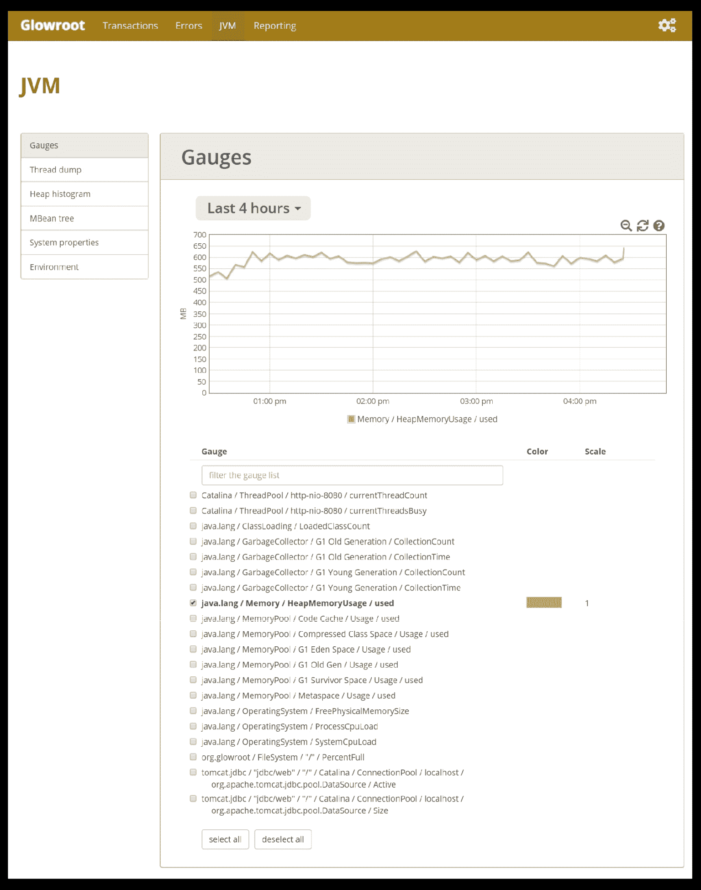
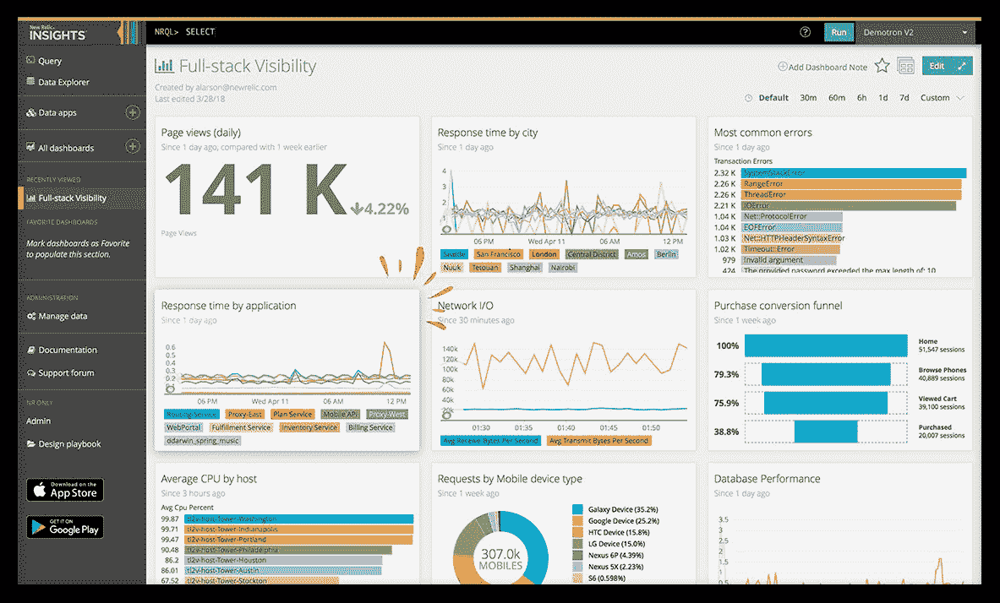
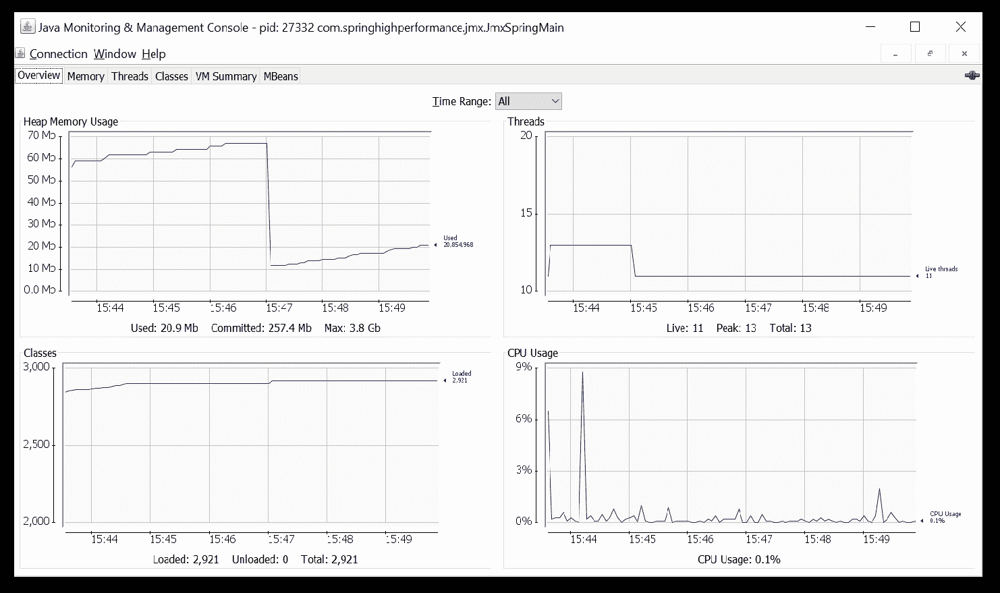

# 九、分析和记录

在上一章中，我们深入讨论了多线程和并发编程的细节。我们查看了`java.util.concurrent`包 API。本章介绍异步编程的线程池、Spring 任务执行、调度和 Spring 异步 API。在本章的后半部分，我们将 Spring Async 与`CompletableFuture`进行了比较。

按照类似的思路，本章将重点介绍概要分析和日志记录。本章首先定义概要分析和日志记录，以及它们如何有助于评估应用性能。在本章的后半部分，重点将是学习可用于研究应用性能的软件工具。

本章将介绍以下主题：

*   性能分析
*   应用日志记录和监视
*   分析工具

# 性能分析

本节将重点介绍用于性能度量的性能和应用评测。分析是任何应用开发和部署生命周期中的一个重要步骤。它帮助我们完成以下两件事：

1.  定义预期绩效结果的基准
2.  根据基准衡量和比较当前绩效结果

第二步定义了要采取的进一步行动，以便将性能提升到基准水平。

# 应用性能

在软件应用中，性能对不同的人意味着不同的东西。它必须有一些背景，以便更好地理解。应用性能是根据两组性能指标来衡量的。应用用户观察到或体验到的实际性能仍然是衡量应用性能的最重要指标之一。它包括峰值和正常负载期间的平均响应时间。与平均响应时间相关的度量包括应用响应用户操作（如页面刷新、导航或按钮单击）所花费的时间。它们还包括执行某些操作所需的时间，例如排序、搜索或加载数据。

本节旨在为技术团队提供配置和内部结构的一些方面的观点，这些配置和内部结构可以设置或更改以优化效果，从而提高应用的性能。通常情况下，技术团队从不关注应用使用的内存或 CPU 利用率，除非他们遇到性能问题。应用事务包括应用每秒接收的请求、每秒数据库事务和每秒服务的页面。系统上的负载通常根据应用处理的事务量来衡量。

还有另一组度量，包括在执行操作时度量应用使用的计算资源。这是确定应用是否有足够的资源来维持给定负载的一种非常好的方法。它还有助于确定应用是否使用了超出预期的资源。如果是这样，可以得出结论，应用在性能方面没有得到优化。云托管的应用现在很流行。在这个时代，用户在部署在云或非云基础设施上的应用以及本地环境上拥有相同的体验是非常重要的。

应用性能监视和改进对于应用来说可能不是必需的，只要它按照预期执行。然而，作为应用开发生命周期的一部分，新的需求不断出现，新的功能不断增加，应用日益复杂。这开始影响应用的性能，因为主要关注的是新特性的开发。总有一天，性能会达不到标准，因为实际上没有人致力于应用性能增强。

# 应用日志记录和监视

本节重点介绍在应用运行时记录重要信息。它有助于从各个方面调试应用，我们将详细介绍这些方面。本节介绍的另一个重要方面是应用监视。在某些情况下，应用监视被认为与应用评测没有什么不同；这些当然是应用性能度量的不同方面。

# 应用日志记录

在深入了解 Java 应用日志记录的细节之前，必须了解什么是日志和日志记录。**日志**是一条语句，用于显示帮助我们了解应用状态的信息。日志语句以特定于应用的格式写入日志文件。日志语句可以包括诸如特定语句的执行日期和时间、各种变量的值以及对象的状态等信息。将日志语句写入日志文件的过程称为**日志记录**。

每个应用都会生成用于各种目的的日志。应用生成日志以跟踪应用事件，包括访问相关事件、登录和注销事件、应用中发生错误时的事件以及系统配置修改。操作系统还生成日志文件。可以对日志文件进行处理以分离所需信息。日志记录是软件应用最基本的部分之一。编写良好的日志和设计良好的日志机制对于开发人员和管理员来说是一个巨大的实用工具。它对从事应用支持活动的团队非常有用。嗯，设计日志可以为开发和支持团队节省大量时间。在执行前端程序时，系统以不可见的方式构建日志文件。

以下是常见的日志文件，通常在应用中生成：

*   **错误/异常日志**：应用流中的任何意外情况称为**错误**。错误可能因不同的原因而发生。错误根据严重性和对应用的影响进行分类。如果用户无法在应用中继续，则此类错误被归类为**阻止程序**。如果网页没有适当的标签，则属于低严重性问题。错误日志是应用执行时发生的关键错误的记录。没有错误的应用实际上是不存在的。在 Java 中，不需要记录所有异常。Java 支持托管异常，可以处理这些异常，并将其作为警告或错误消息抛出给用户。这可能是验证错误或用户输入错误，可以使用托管异常抛出。

*   **访问日志**：在抽象级别上，web 应用的任何请求都可以被视为访问 web 应用服务器上的资源的请求。资源可以是网页、服务器上的 PDF 文件、图像文件或数据库中数据的报告。从安全角度来看，每个资源都必须受到访问权限的保护。访问权限定义谁可以从 web 应用访问资源。访问日志是关于谁试图访问哪个资源的书面信息。它们还可能包括有关访问资源的位置的信息。访问日志为进入 web 应用的每个请求写入访问信息。访问日志还可用于查找有关访问者数量、首次访问应用的访问者数量、来自特定位置的访问者数量、特定页面的请求数量以及应用使用模式的信息。
*   **事务日志**：事务与数据库相关。为维护原子性和数据库完整性而执行的一系列数据库命令或语句称为**事务**。维护事务以保证对崩溃或故障的保护。**交易日志**是记录或写入所有此类交易的文件。在特定时间，如果发现数据库不一致，则事务日志有助于调试问题。事务日志还可用于记录执行的任何回滚操作。通常，事务日志还记录要执行的数据库语句的时间以及传入的参数。这些信息对于分析数据库性能问题非常有用。
*   **审核日志**：**审核**是检查应用如何使用的过程。它检查正在使用的应用资源、访问或使用应用资源的用户以及用户的身份验证和授权信息。**审核日志**记录应用通过的每个事件，以及前面提到的详细信息。

# 日志记录最佳实践

在描述了应记录的内容和常见日志信息之后，本节详细介绍了日志记录的最佳实践：

*   为每个日志语句分配适当的日志级别非常重要。
*   还应在集群环境中考虑日志记录。我们可以使用相同类型的日志文件，将集群节点名称作为文件名的后缀。这将防止在分析日志时覆盖或错误地考虑日志条目。

*   生成日志文件会影响应用的性能。如果应用开始记录每一条次要信息，那么应用的性能将很慢。我们必须确保日志文件的大小和写入日志项的频率较低。
*   必须记录除验证和输入错误以外的所有异常。记录异常消息的方式必须能够清楚地突出显示问题。最佳实践是让框架记录所有异常。
*   日志必须是用户友好且易于解析的。日志可以用两种方式使用。一种方法是用户阅读日志以建立理解。另一种方法是，实用程序根据日志格式解析应用日志，以过滤掉不重要的信息。
*   每个日志条目必须与其他日志条目不同，尽管它们代表相同的信息。每个日志条目都可以有一个唯一的标识符，通常基于时间戳，用于将其与其他日志区分开来。
*   敏感信息不得记录在日志文件中。密码、凭据和身份验证密钥是几个示例。

在大多数情况下，最佳实践作为一般准则，可以根据项目以定制的方式遵循。

# 测井仪器

在本章前面的章节中，我们了解了日志记录的重要性。我们还学习了日志记录最佳实践。现在是向我们的技能集中添加日志工具的时候了。本节重点介绍日志记录工具。日志记录工具很有用，因为它们提供了一些功能。过去，日志文件由以纯文本格式编写的日志语句组成。纯文本日志文件在特定情况下仍然有用，如分析基础结构数据，但它们不再足以记录应用的信息。Java 在`java.util.logging`API 中内置了对标准日志记录的支持。Log4j 是 Java 社区中另一个著名且广泛使用的日志记录工具。

在我们深入了解测井工具的细节之前，了解测井机制的关键要素是很重要的。以下是关键日志记录组件：

*   **日志级别**：Java 日志级别用于控制日志输出。它们提供了启用或禁用各种日志记录级别的灵活性。这样就可以选择哪些日志将显示在日志文件中。这样，在生产环境中运行的应用可能与在临时环境中运行的相同应用具有不同的日志记录级别。启用一级日志记录将使所有更高级别的日志能够在日志文件中打印。以下是 Java 日志 API 的日志级别和有效日志级别：

    | **请求级别** | **有效记录级别** |
    | `SEVERE` | `WARNING` | `INFO` | `CONFIG` | `FINE` | `FINER` | `FINEST` |
    | `SEVERE` | 对 | 对 | 对 | 对 | 对 | 对 | 对 |
    | `WARNING` | 不 | 对 | 对 | 对 | 对 | 对 | 对 |
    | `INFO` | 不 | 不 | 对 | 对 | 对 | 对 | 对 |
    | `CONFIG` | 不 | 不 | 不 | 对 | 对 | 对 | 对 |
    | `FINE` | 不 | 不 | 不 | 不 | 对 | 对 | 对 |
    | `FINER` | 不 | 不 | 不 | 不 | 不 | 对 | 对 |
    | 优美的 | 不 | 不 | 不 | 不 | 不 | 不 | 对 |

*   **记录器**：`Logger`对象的任务是记录应用消息。应用可以创建匿名记录器，其存储方式不同于`Logger`命名空间。应用必须确保保留对`Logger`对象的引用，因为`Logger`可能在任何时间点被收集垃圾。`Logger`对象与父`Logger`对象关联，父`Logger`对象是`Logger`命名空间中最近的祖先。在日志过程中，日志消息被发送到`Handler`对象。`Handler`对象将日志消息转发到文件、日志或控制台。每个`Logger`对象都有一个与其关联的日志级别。表示最低级别`Logger`将打印日志。

*   **处理程序**：`Handler`对象的职责是从`Logger`对象获取日志消息，并将这些日志消息发送到相应的目的地进行打印。示例包括在控制台上写入日志消息、将日志消息写入文件或将日志消息写入网络日志服务。可以启用或禁用`Handler`，本质上，它停止在输出介质上打印这些日志。

*   **格式化程序：**日志`Formatter`在将日志消息写入输出介质之前对其进行格式化。Java 支持两种类型的`Formatter`对象：`SimpleFormatter`和`XMLFormatter`。`XMLFormatter`对象需要在格式化记录周围包含头和尾。也可以创建自定义的`Formatter`对象。

*   **LogManager:**`LogManager`是一个单例对象，用于维护记录器和日志服务的共享状态。除此之外，`LogManager`对象管理日志属性和`Logger`命名空间。`LogManager`对象在类初始化时实例化。后续无法更改对象。`LogManager`默认从`lib/logging.properties`文件中读取初始配置，可以修改。

下图显示了一个`Handler`的记录过程：


下图显示了具有多个处理程序的日志记录过程：


# Java 标准日志记录

本节介绍 Java 的内置日志机制。Java 日志 API 由`java.util.logging`包组成。核心包支持将纯文本或 XML 日志条目写入输出流、文件、内存、控制台或套接字。日志 API 还能够与操作系统上已有的日志服务交互。

以下代码示例用于使用标准日志 API 打印日志消息：

```java
package com.packt.springhighperformance.ch9.logging;

import java.io.FileInputStream;
import java.io.IOException;
import java.sql.Timestamp;
import java.util.logging.Level;
import java.util.logging.LogManager;
import java.util.logging.Logger;

public class SampleLoggingOne {
  private static Logger logger = 
  Logger.getLogger("com.packt.springhighperformance.ch4.logging");

  public static void main(String argv[]) throws SecurityException, 
  IOException {
    FileInputStream fis = new FileInputStream("D:\\projects\\spring-    
    high-performance\\SampleProject\\src\\main\\resources
    \\logging.properties");
    LogManager.getLogManager().readConfiguration(fis);
    Timestamp tOne = new Timestamp(System.currentTimeMillis());
    for(int i=0; i < 100000; i++) {
        logger.fine("doing stuff");
    }
    Timestamp tTwo = new Timestamp(System.currentTimeMillis());
    System.out.println("Time: " + (tTwo.getTime() - tOne.getTime()));
    try {
      Bird.fly();
    } catch (Exception ex) {
      logger.log(Level.WARNING, "trouble flying", ex);
    }
    logger.fine("done");
  }
}
```

下面是前面代码示例中引用的`logging.properties`文件的示例：

```java
# Logging
handlers = java.util.logging.ConsoleHandler
.level = ALL

# Console Logging
java.util.logging.ConsoleHandler.level = ALL
```

以下是执行上述示例后的输出：

```java
Feb 19, 2018 12:35:58 AM com.packt.springhighperformance.ch9.logging.SampleLoggingOne main
FINE: doing stuff
Feb 19, 2018 12:35:58 AM com.packt.springhighperformance.ch9.logging.SampleLoggingOne main
FINE: done
```

使用 Java 标准日志的好处是，您不需要在项目中安装单独的 JAR 依赖项。尽管日志记录与我们在服务器上遇到的故障排除相关，但我们还必须确保日志记录不会对应用性能产生负面影响。必须注意以下几点，以确保日志记录不会影响应用性能：

*   `Logger.log`方法用于通过`Handler`在输出介质上打印日志记录。我们可以使用`Logger.isLoggable`来确保日志级别启用了`Logger`。如果我们将自定义对象作为参数传递给`Logger.log`方法，则从库类的深层调用自定义对象的`toString`方法。因此，如果我们想执行繁重的操作以准备一个对象进行日志记录，我们应该在检查`Logger.isLoggable`的块内或在对象的`toString`方法内执行。
*   我们不能对任何对象调用`toString`方法来获取日志消息内容。我们也不能将`toString`方法调用作为参数传递给`Logger.log`。`Logger`对象和日志框架负责对自定义对象调用`toString`方法。

*   必须避免混合使用格式字符串连接和日志参数。具有错误意图的应用用户可能会破坏日志，并使用恶意连接字符串访问用户不允许的数据。

Java 标准日志记录的主要缺点之一是性能比较差。与其他基于 Java 的日志框架相比，标准日志记录需要更多的时间，如 Apache Log4j 2、commons 日志记录或用于 Java 的（**SLF4J**的**简单日志外观）。**

# Apache Log4j 2

apachelog4j 是 Java 社区中使用最广泛的日志框架之一。它是用 Java 编写的，并在 Apache 软件许可下分发。Apache Log4j 2 是早期版本的修订版。最显著的特性包括线程安全、性能优化、命名记录器层次结构和国际化支持。

为了设置 Log4j 2，必须在 Maven`pom.xml`文件中添加以下 Maven 依赖项：

```java
<dependency>
  <groupId>org.apache.logging.log4j</groupId>
  <artifactId>log4j-core</artifactId>
  <version>2.7</version>
</dependency>

<dependency>
  <groupId>org.apache.logging.log4j</groupId>
  <artifactId>log4j-core</artifactId>
  <version>2.7</version>
  <type>test-jar</type>
  <scope>test</scope>
</dependency>
```

为了访问测试命名配置文件所需的上下文规则，我们必须包括`test`JAR 和主`log4j-core`包。

Log4j 2 有三个主要的日志组件：

*   `Loggers`**由`Loggers`负责日志信息的捕获。**
***   `Appenders`**这些与 Java 标准日志中的`Handler`对象类似。`Appenders`负责向配置的输出介质广播日志信息或消息。*****   `Layouts`**由`Layouts`负责将日志消息格式化为配置的样式。******

 ******以下是`log4j2.xml`文件的示例：

```java
<?xml version="1.0" encoding="UTF-8"?>
<Configuration status="WARN">
  <Appenders>
    <Console name="ConsoleAppender" target="SYSTEM_OUT">
      <PatternLayout pattern="%d [%t] %-5level %logger{36} - 
      %msg%n%throwable" />
    </Console>
  </Appenders>
  <Loggers>
    <Root level="ERROR">
      <AppenderRef ref="ConsoleAppender" />
    </Root>
  </Loggers>
</Configuration>
```

以下是 Log4j 2 Java 代码的示例：

```java
package com.packt.springhighperformance.ch9.logging;

import org.apache.log4j.Logger;

public class SampleLog4j2Example {
  private static Logger logger = 
  Logger.getLogger(SampleLog4j2Example.class);

  public static void main(String argv[]) {
    logger.info("example info log");
    try {
      Bird.fly();
    } catch (Exception ex) {
      logger.error("example error log", ex);
    }
    logger.warn("example warning log");
  }
}
```

当我们执行前面的示例时，将生成以下输出：

```java
2018-02-22 01:18:09 INFO SampleLog4j2Example:9 - example info log
2018-02-22 01:18:09 WARN SampleLog4j2Example:15 - example warning log
```

Apache Log4j 2 除了普通日志级别之外，还有其他日志级别。这些是`ALL`和`OFF`级别。当我们想要在`ALL`日志级别启用日志时，使用`ALL`日志级别。如果配置了`ALL`日志级别，则不考虑这些级别。`OFF`日志级别与`ALL`日志级别相反。它禁用所有日志记录。

# 应用监控

如前所述，应用性能被认为是任何软件应用生命周期中最重要的里程碑之一。还需要应用始终保持良好的性能。这是我们可以确保应用用户获得最佳应用体验的方法之一。这还意味着应用已启动并运行良好。应用性能监视工具跟踪进出应用的每个请求和响应，处理来自请求的信息，并在图形用户界面中响应和显示。这意味着监控工具为管理员提供了快速发现、隔离和解决影响性能的问题所需的数据。

监视工具通常收集有关 CPU 利用率、内存需求、带宽和吞吐量的数据。可以使用多个监控系统进行不同的监控。任何应用性能监控的一个重要方面是将来自此类监控系统的数据组合到统计分析引擎中，并将其显示在仪表板上。仪表板可以轻松读取数据日志进行分析。应用监控工具帮助管理员监控应用服务器，以遵守**服务级别协议**（**SLA**）。业务规则设置为在出现问题时向管理员发送警报。这可确保以更高的优先级考虑业务关键型功能和应用。随着环境的快速变化，在生产系统中进行快速部署变得非常重要。快速部署意味着有更多机会引入影响系统体系结构的错误或降低系统速度。

许多实现和工具都基于这些基本概念。应用监控工具有一个巨大而拥挤的市场，包括业界领先和知名的工具，如 AppDynamics、New Relic 和 Dynatrace。除了这些已知的工具外，还存在开源应用监视工具。开源工具包括 Stagemonitor、Pinpoint、MoSKito、Glowroot、Kamon 等等。我们将在以下部分详细介绍这些工具。

# 舞台监视器

Stagemonitor 有一个监视代理，该代理支持集群应用堆栈。该工具的目的是监视在多个服务器上运行的应用，这是一种常见的生产场景。Stagemonitor 经过优化，可与时间序列数据库集成。它针对时间序列数据管理进行了优化，包括按时间索引的数字数组。这些数据库包括 elasticsearch、graphite 和 XDB。也可以在专用网络中设置 Stagemonitor。它使用开放跟踪 API 关联分布式系统中的请求。它的特点是为度量定义阈值。Stagemonitor 还支持创建新插件和集成第三方插件。

Stagemonitor 包含一个基于 Java 的代理。代理位于 Java 应用中。代理连接到中央数据库并发送度量、请求跟踪和统计信息。Stagemonitor 需要一个实例来监视所有应用、实例和主机。

在浏览器的监控端，我们可以看到来自集群的历史或当前数据。我们还可以创建自定义警报。还可以为每个度量定义阈值。Stagemonitor 有一个仪表板。仪表板用于可视化和分析不同的指标和感兴趣的请求。Stagemonitor 支持创建自定义仪表板、编写自定义插件和使用第三方插件。它还支持浏览器内小部件。该小部件不需要后端，并自动注入到受监控的网页中。

以下是 Stagemonitor 仪表板的屏幕截图，以供参考：


Stagemonitor 仪表板视图（来源：http://www.stagemonitor.org/)

# 准确指出

Pinpoint 不同于 Stagemonitor，因为它是在考虑大规模应用的情况下开发的。它是在 Dapper（一个由谷歌开发的分布式系统跟踪基础设施）之后开发的，目的是为开发者提供关于复杂分布式系统行为的更多信息。

精确定位有助于分析整个系统结构以及系统的不同组件是如何相互连接的。Pinpoint 通过跨分布式应用跟踪事务来实现这一点。它旨在解释每个事务是如何执行的，跟踪组件之间的流程以及潜在的瓶颈和问题区域。

Pinpoint 类似于 Stagemonitor，有一个用于可视化的仪表板。仪表板有助于可视化组件之间的互连。仪表板还允许用户在特定时间点监控应用中的活动线程。Pinpoint 具有跟踪请求计数和响应模式的功能。这有助于识别潜在问题。它支持查看关键信息，包括 CPU 利用率、内存利用率、垃圾收集和 JVM 参数。

Pinpoint 由四个组件组成：收集器、Web、示例 TestApp 和 HBase。我们可以通过分别为每个组件执行脚本来运行实例。

以下是供参考的精确定位仪表板：


精确定位仪表板参考视图（来源：http://www.testingtoolsguide.net/tools/pinpoint-apm/)

# 莫斯基托

MoSKito 由三种工具组成：

*   **MoSKito Essential**：该独立项目是 MoSKito 的核心。它使监视应用成为可能。
*   **MoSKito Central**：这是一个集中式存储服务器。它存储所有与性能相关的信息。
*   **MoSKito 控件**：此工具适用于多节点 web 应用。它支持监视多节点 web 应用。

为了设置 MoSKito，我们需要在应用的`WEB-INF/lib`目录中安装一个 JAR 文件，这是保存 API 库的常用文件夹。也可以通过在`web.xml`文件中添加新节来设置。

该工具能够收集所有应用性能指标，包括内存、线程、存储、缓存、注册、支付、转换、SQL、服务、负载分布等。它不要求用户在应用中进行任何代码更改。它支持所有主要的应用服务器，包括 Tomcat、Jetty、JBoss 和 Weblogic。它将数据存储在本地。

MoSKito 还有一个通知功能，可以在达到阈值时广播警报。它还记录用户的操作，这可能是出于监控目的而感兴趣的。MoSKito 提供了一个移动应用，用于在移动中监控应用。它也有基于网络的仪表盘。

MoSKito 的一个显著特点是它非常稳定，在 Java 社区中非常有名。它得到社区和团队的支持，包括有偿支持。

以下是莫斯基托仪表板，供参考：


MoSKito 仪表板视图（来源：https://confluence.opensource.anotheria.net/display/MSK/Javaagent+轻型+和+多个+java+进程）

# 红根

Glowroot 是一种快速、干净、简单的应用性能监视工具。它有一个允许跟踪慢速请求和错误的功能。使用 Glowroot，还可以记录每个用户操作所花费的时间。Glowroot 支持 SQL 捕获和聚合。使用保留配置对数据进行历史汇总是 Glowroot 提供的附加功能之一。

Glowroot 支持在图表中可视化响应时间分解和响应时间百分比。它有一个响应迅速的用户界面，允许用户使用移动设备以及桌面系统监控应用，而无需任何额外安装。

Glowroot 以 ZIP 文件包的形式提供。为了开始使用 Glowroot，我们必须下载并解压缩 ZIP 文件包。Glowroot 要求更改应用的 JVM 参数。我们必须在应用的 JVM 参数中添加`-javaagent:<path to glowroot.jar>`。

Glowroot 在设置和运行后提供了带过滤的连续评测。我们还可以为响应时间百分比和 MBean 属性设置警报。Glowroot 还支持跨多个线程的异步请求。在应用服务器方面，Glowroot 支持 Tomcat、Jetty、JBoss、Wildfly 和 Glassfish。

以下是 Glowroot JVM 仪表板供参考：



Glowroot JVM 仪表板视图（来源：https://demo.glowroot.org)

# 新遗迹

New Relic 是 Java 社区中另一个广泛使用的应用性能监视工具。New Relic 为应用和网络性能统计提供分组视图。这有助于快速诊断域级问题。它还提供了一些功能，可以深入到特定的请求中，以便按响应时间、数据传输大小和吞吐量查看性能指标。

New Relic 支持用 Java、Scala、Ruby、Python、PHP、.NET 和 Node.js 开发的应用。New Relic 提供了四种不同的后端监控方法：

*   **应用性能管理**：在应用性能管理中，New Relic 提供了高级指标，能够深入到代码级别查看应用的性能。在仪表板上，New Relic 显示响应时间图。New Relic 使用 Apdex 指数评分方法将指标提取为绩效指标。New Relic 要求用户手动设置阈值
*   **服务器监控**：New Relic 关注应用服务器运行的硬件。测量包括 CPU 使用率、内存利用率、磁盘 I/O 和网络 I/O。New Relic 提供了堆内存和垃圾收集属性的简要详细信息。
*   **数据库监控**：在 New Relic 中，数据库仪表板是应用性能管理仪表板的一部分。可以通过插件查看数据库监控指标。
*   **洞察与分析**：New Relic 有一个内置的选择加入数据库，用于存储统计数据并支持查询数据库。

以下是 New Relic 仪表板供参考：



New Relic 仪表板视图（来源：https://newrelic.com/)

# 分析工具

分析工具（profiler）是应用开发人员用来调查和识别代码特征和问题的软件工具。分析工具在识别性能问题时也很有用。分析工具回答的问题有：设置了哪些 JVM 参数、堆内存的状态如何、内存利用率的基于生成的分类是什么、哪些线程处于活动状态等等。一些探查器还跟踪代码中的方法，以了解调用 SQL 语句的频率或调用 web 服务的频率。

与应用性能监视工具类似，市场上有许多分析工具。VisualVM、JConsole 和 Healpanalyzer 是其中的一些。我们将在以下各节中详细讨论每个分析工具。

# 视觉的

VisualVM 是一种 Java 评测和性能分析工具。它有一个可视化界面，用于分析 JVM 上本地和远程环境中运行的 Java 应用的详细信息。它集成并利用 JDK 提供的命令行工具，如`jstack`、`jconsole`、`jmap`、`jstat`和`jinfo`。这些工具是标准 JDK 发行版的一部分。VisualVM 有助于解决运行时问题，具有堆转储和线程分析等功能。它有助于识别应用性能以及它与基准的对比。它还有助于确保最佳内存使用。它还可以帮助监视垃圾收集器、分析 CPU 使用情况、分析堆数据和跟踪内存泄漏。以下是 VisualVM 使用的每个命令行工具的用途：

*   `jstack`**此工具用于捕获 Java 应用的线程转储**
***   `jmap`**此工具打印给定进程的共享对象内存映射和堆内存详细信息*****   `jstat`**此工具显示运行应用的 JVM 的性能统计信息*****   `jinfo`**此工具打印 Java 配置信息********

 ******VisualVM 是标准 JDK 包的一部分。在 JDK 版本 6，更新 7 中，它首先与 JDK 平台捆绑在一起。它也可以单独安装。让我们详细了解每个部分：


VisualVM 的应用窗口视图

正如前面的屏幕截图所示，在窗口的左侧有一个应用窗口。“应用”窗口包含节点和子节点。可以展开节点和子节点，以查看配置的应用和保存的文件。我们可以通过右键单击节点并从出现的弹出菜单中选择项目来查看其他信息或执行操作。弹出菜单选项因所选节点而异。

在应用窗口中，我们可以看到本地节点的菜单。本地节点显示与 VisualVM 在同一台机器上运行的 Java 进程的进程名称和进程标识符相关的信息。启动 VisualVM 后，当本地根节点展开时，会自动填充本地节点。VisualVM 始终作为本地节点之一加载。当服务终止时，节点自动消失。如果我们获取应用的线程转储和堆转储，它们将显示为子节点。

可以使用 VisualVM 连接到远程机器上运行的 JVM。所有这些正在运行的进程或应用都显示在远程节点下。在与远程节点建立连接后，我们可以扩展远程节点以查看远程机器上运行的所有 Java 应用。

VM Coredumps 节点仅在应用在 Linux 或 Solaris 操作系统上运行时可见。在 VisualVM 中打开核心转储文件时，VM Coredumps 节点将显示打开的核心转储文件。它是一个二进制文件，包含有关机器运行时状态的信息。

“应用”窗口的最后一部分标记为快照。快照部分显示应用运行时拍摄的所有已保存快照。

本地或远程应用的数据显示在 VisualVM 的选项卡中。查看应用数据时，默认情况下会打开“概述”选项卡。Overview 选项卡显示的信息包括进程 ID、系统位置、应用的主类、Java 安装路径、传递的 JVM 参数、JVM 标志和系统属性

列表中的下一个选项卡是监视器选项卡。Monitor 选项卡可用于查看有关堆内存、永久生成堆内存以及类和线程数量的实时信息。这里的类表示加载到虚拟机中的类。应用监视过程的开销很低。

监视器选项卡上的堆图显示总堆大小和当前使用的堆大小。永久发电区在一段时间内的变化显示在永久发电图中。“类”图显示加载和共享类的总数。活动线程和守护进程线程的数量信息显示在线程部分。VisualVM 可用于执行线程转储，该转储显示特定时间线程的确切信息。

在 Monitor 选项卡中，我们可以强制执行垃圾收集。该操作将立即运行垃圾回收。也可以从监视器选项卡捕获堆转储：


VisualVM 在“线程”选项卡中显示实时线程活动。默认情况下，“线程”选项卡显示当前线程活动的时间线。通过单击特定线程，我们可以在“详细信息”选项卡中查看该特定线程的详细信息。

时间线部分显示了一个带有实时线程状态的时间线。我们可以通过在下拉菜单中选择适当的值来过滤显示的线程类型。在前面的屏幕截图中，它显示了实时线程时间线。通过从下拉菜单中选择此选项，我们还可以查看所有线程或完成的线程。

我们可以选择在应用运行时执行应用的线程转储。线程转储在打印时显示一个线程堆栈，其中包含 Java 应用的线程状态。

Profiler 选项卡可以启动和停止应用的分析会话。结果将显示在探查器选项卡本身中。可以对 CPU 配置文件或内存配置文件执行配置文件。启动分析会话后，VisualVM 连接到应用以开始收集分析数据。一旦结果可用，它们将自动显示在“探查器”选项卡中。

# 监控

JConsole 是另一个 Java 评测工具。编译为**Java 管理扩展**（**JMX**规范。JConsole 广泛使用 JVM 中的工具来收集和显示在 Java 平台上运行的应用的性能和资源消耗信息。JConsole 在 JavaSE6 中更新为 GNOME 和 Windows 外观。

与 VisualVM 类似，JConsole 与 Java 开发工具包捆绑在一起。JConsole 的可执行文件可以在`JDK_HOME/bin`目录中找到。可以使用以下命令从命令提示符或控制台窗口启动 JConsole：

```java
jconsole
```

在执行上述命令时，JConsole 向用户提供系统上运行的所有 Java 应用的选择。我们可以选择连接到任何正在运行的应用。

如果我们知道希望 JConsole 连接到的 Java 应用的进程 ID，也可以提供进程 ID。以下是启动 JConsole 的命令，其中包含一个到由其进程 ID 标识的特定 Java 应用的连接：

```java
jconsole <process-id>
```

以下命令可用于连接远程计算机上运行的 Java 应用：

```java
jconsole hostname:portnumber
```

JConsole 在以下选项卡中显示信息：

*   概述：此选项卡显示有关 JVM 和要监视的值的信息。它以图形监控格式显示信息。该信息包含有关 CPU 使用率、内存使用率、线程计数和 JVM 中加载的类数的概述详细信息。
*   内存：此选项卡显示有关内存消耗和使用的信息。内存选项卡包含一个执行 GC 按钮，单击该按钮可以激活即时垃圾收集。对于 HotSpot Java VM，内存池是 Eden 空间、幸存者空间、终身生成、永久生成和代码缓存。可以显示各种图表来描述内存池的消耗。
*   线程：此选项卡显示有关线程使用情况的信息。线程包括活动线程、活动线程和所有线程。图表显示了两条不同线上的线程峰值数和活动线程数。MXBean 提供了 Threads 选项卡未涵盖的其他信息。使用 MXBean，可以检测死锁线程。
*   类：此选项卡显示有关 Java 虚拟机中加载的类的信息。类信息包括到目前为止加载的类的总数，包括稍后卸载的类和当前加载的类的数量。
*   VM：此选项卡显示有关 Java 虚拟机的统计信息。摘要包括正常运行时间，指示 JVM 启动后的时间量；进程 CPU 时间，指示 JVM 自启动以来已消耗的 CPU 时间量；和总编译时间，表示编译过程所花费的时间。
*   MBeans：此选项卡显示有关 MBean 的信息。MBean 包括当前正在运行的 MBean。我们可以通过选择 MBean 来获得`MBeanInfo`描述符信息。

以下屏幕截图显示了 JConsole 仪表板的外观：



# 总结

本章充满了有关应用性能度量技术的信息。本章对于从事应用性能增强任务的开发团队非常有用。同时，建立应用日志记录机制的技术团队可以参考它。

本章首先介绍了有关性能分析和日志记录的详细信息。接下来，我们了解了特定的应用性能监视和应用日志记录。我们了解了日志记录的关键要素。我们还研究了日志工具，如标准 Java 日志和 Log4j。在本章的后半部分，我们学习了 VisualVM 作为一种性能评测工具。VisualVM 是使用最广泛的基于 Java 的性能评测工具之一，作为标准 Java 分发包提供。这一章就是这样。

下一章将重点讨论优化应用性能。在进行性能优化时，您可以在下一章中利用本章中提供的知识和信息。本章为下一章奠定了基础。下一章将详细介绍如何识别性能问题的症状、性能调优生命周期以及 Spring 中的 JMX 支持。非常令人兴奋的事情，不是吗？************