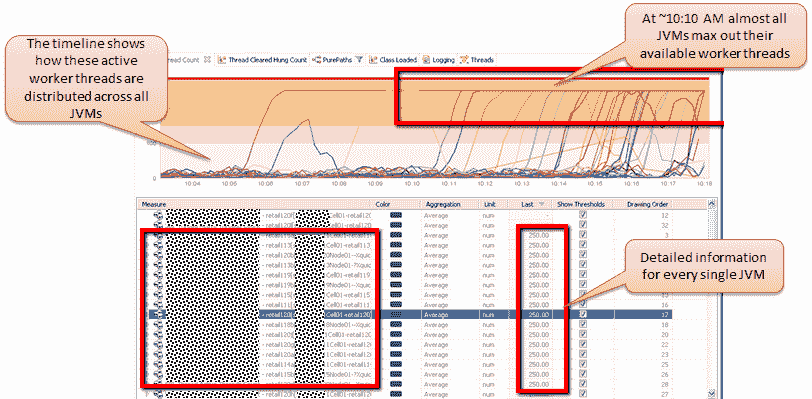
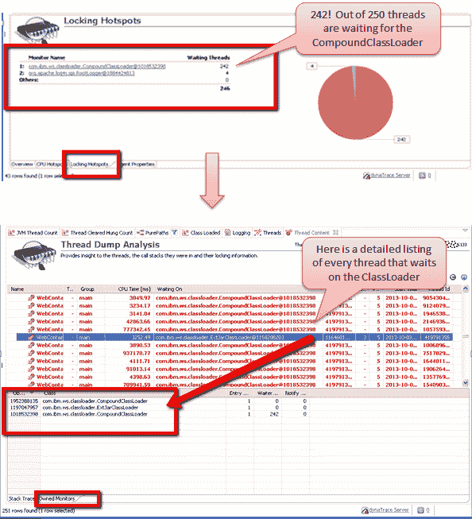
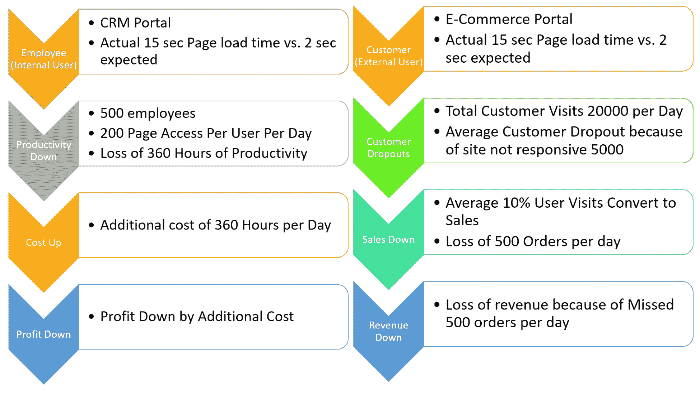
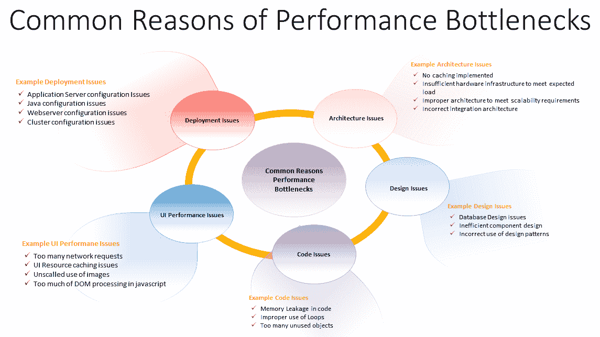
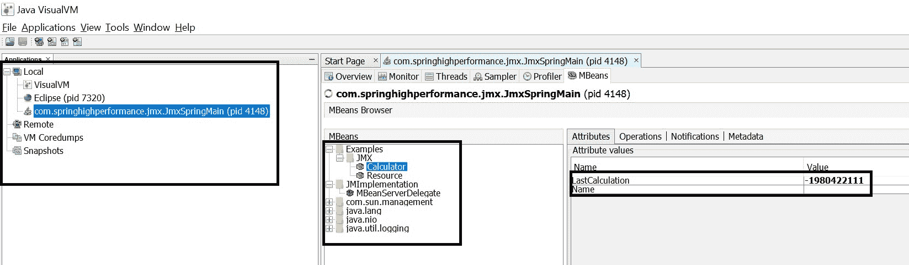

# 十、应用性能优化

在前一章中，我们重点介绍了如何分析应用，以解决应用的性能问题。我们还讨论了日志记录，它是识别应用中问题的有用工具。这是 Spring 应用中必不可少的一部分，也是我们日常工作的一部分。

现在让我们看看这一章的内容。这是本书中至关重要的一章；它为您提供了提高应用性能的方法。在本章中，我们将讨论应用性能优化的基本方法，这对于任何应用都是关键，包括基于 Spring 的应用。我们将讨论 Spring 对**Java 管理扩展**（**JMX**）的支持、数据库交互的改进以及 Spring 应用的性能调优。在本章结束时，您将能够识别基于 Spring 的应用中的性能瓶颈并解决它们。

让我们用结构化方法来研究应用性能优化的重要方面。我们将介绍以下主题：

*   性能问题症状
*   性能调整生命周期
*   性能调优模式和反模式
*   迭代性能调优过程
*   JMX 的 Spring 支持

# 性能问题症状

让我们从性能问题症状开始。这显然是一个开始，因为这就像咨询医生，讨论症状，然后做出诊断。应用性能是指最终用户在交付内容的速度、准确性以及在最高负载下的平均响应时间方面所经历的行为。负载由应用每单位时间处理的事务数表示。响应时间是应用在这种负载下响应用户操作所需的时间。

每当性能需要改进时，首先想到的是影响应用性能的问题。要找到性能问题，我们需要寻找可能导致问题的某些症状。

在弹簧应用中可以观察到的一些常见症状如下：

*   超时
*   工作线程不足
*   等待类装入器的线程
*   即使在正常负载下，也要花费大量时间加载类
*   类加载器尝试加载不存在的类

在以下部分中，我们将通过一个示例上下文来了解这些症状。详细信息将帮助我们在症状发生时识别症状。

# 超时

超时以两种不同的方式发生。一个是请求超时，用`HTTP response status code 408`表示。超时的另一种风格是网关超时，由`HTTP response status code 504`表示。

请求超时表示服务器没有在指定的时间内收到来自客户端的完整请求。在这种情况下，服务器选择关闭与客户端的连接。请求超时是直接来自服务器的错误消息。

网关超时表示网关或代理服务器在处理请求时超时。在大多数情况下，这是因为代理或网关没有收到来自上游实际服务器的及时响应。

# 工作线程不足

考虑银行的例子；银行有一个 web 应用，上面有一个监控系统。监控系统关注 JVM 的实力。测量参数包括内存、CPU、I/O、堆内存和各种其他属性。监控系统提供独特的仪表板，显示并突出显示上述属性的测量值。随附的仪表板演示了在银行应用中执行的一组活动。此仪表板还标识 JVM 在访问专用应用资源（如线程）时开始运行的一组活动。应用正在多个 JVM 环境中运行。以下是示例仪表板的屏幕截图，以供参考：


监控系统配置了阈值。例如，JVM 一次使用的最大线程数不应超过 250。当 JVM 一次使用少于 150 个线程时，仪表板中相应的 JVM 指示器为绿色。当 JVM 开始使用 150 多个线程时，监控系统会以红色指示 JVM。这是一种症状，表明可能发生故障或性能受到超出正常范围的影响。

下面是一个基于时间线的屏幕截图，显示了 JVM 的最大工作线程数：



# 等待类装入器的线程

继续上一节描述的相同示例，出现的第一个问题是，这些线程有什么问题？深入研究线程并分解状态，发现这些线程（250 个线程中约有 242 个）正在寻找服务器的`CompoundClassLoader`。这些线程正在堆叠额外的对象，这就是他们在寻找类加载器的原因。由于大量线程试图访问该公共资源，类加载器中的大多数线程都陷入了暂停状态。

以下监控屏幕截图显示等待`CompoundClassLoader`的线程数：



# 在类加载活动上花费的时间

从监控系统中的分析中得出的另一个结果是线程将大部分时间花在类加载活动上。以下是突出显示这一点的监控系统屏幕截图：


查看监控系统的前一个屏幕截图，很明显，无论当前负载如何，与请求处理生命周期中的其他活动相比，类加载活动都需要相当长的时间。这是性能问题的迹象或症状，因为它会增加总体响应时间。就银行而言，可以通过评估平均响应时间来确认。

# 类加载器试图加载不存在的类

有一个问题出现了：班级堆叠是否非常重要？深入挖掘并查看已处理的请求，它表明每个请求都试图堆叠一个不存在的类。应用服务器正在提示大量的`ClassNotFoundException`类。问题的主要驱动因素是该类永远无法有效堆叠，但应用服务器继续尝试为每个请求堆叠该类。对于快速和适度的请求和功能，这应该不是问题。每个传入请求或特性的这种详细级别可能会占用类加载器的稀有资源，从而影响请求的响应时间。

监控系统的能力、适应性和容量是通过堆叠类上的数据捕获每个请求和响应，以帮助识别症状。以下屏幕截图显示了应用框架中的一个这样的场景：


到目前为止，潜在性能问题的症状必须清楚。它特别适用于任何基于 JVM 的 web 应用，而不仅仅是基于 Spring 的 web 应用。以下屏幕截图向我们展示了基本上有助于我们识别性能问题影响的指针：


性能差的应用对企业来说非常重要，因为应用性能差导致了销售下降。应用还可以注意到由于性能问题而导致的生产力或业务损失。

让我们通过一个基本的例子来了解性能问题对业务的影响：



正如我们从前面的图表中可以理解的那样，糟糕的应用行为会影响业务，这可以用高项目成本、降低转化率、减少重复访问和较差的客户保留率、销售额下降、生产力下降、客户流失、项目成本增加来描述，以及利润和投资回报的延迟或下降。业绩对企业非常重要。

我们需要做什么来避免或解决性能问题？不要等待性能问题出现。对架构、设计和代码进行审查，并提前制定负载测试、调优和基准测试计划。今天，在竞争性营销的世界中，一个组织的关键点是让他们的系统以最佳性能启动和运行。任何故障或停机直接影响业务和收入；应用的性能是一个不容忽视的因素。由于技术在许多方面的广泛应用，数据量与日俱增。因此，平均负荷将通过屋顶。在某些情况下，无法保证数据不会超过限制或用户数量不会超出限制。

在任何时候，我们都可以满足规模化的意外需求。对于任何组织来说，为其应用提供可伸缩性、性能、可用性和安全性都非常重要。应用的可伸缩性——通过扩展数据库来满足跨多台服务器的不同应用查询，在水平和垂直方向上进行扩展——是非常可行的。为集群添加马力以处理负载是很容易的。群集服务器可立即处理故障并管理故障转移部分，以使您的系统几乎始终可用。如果一台服务器宕机，它会将用户的请求重定向到另一个节点，并执行请求的操作。今天，在竞争性营销的世界中，一个组织的关键点是建立和运行他们的系统。任何故障或停机直接影响业务和收入；高可用性是一个不容忽视的因素。

下图显示了我们可能遇到的一些常见性能问题：



现在，让我们进入性能调优生命周期的各个阶段。

# 性能调整生命周期

速度是每项业务的核心。在这个高度互联的现代世界中，让大多数人着迷的是速度；无论是最快的汽车，最快的计算机处理器，甚至是最快的网站。网站性能已成为每个企业的最高优先级。用户的期望比以往任何时候都高。如果你的网站没有立即响应，你的用户很有可能会转向你的竞争对手。

沃尔玛的一项研究（[https://www.slideshare.net/devonauerswald/walmart-pagespeedslide](https://www.slideshare.net/devonauerswald/walmart-pagespeedslide) 发现页面性能每提高 1 秒，转换率就会增加 2%。

Akamai 的一项研究（[https://www.akamai.com/us/en/about/news/](https://www.akamai.com/us/en/about/news/) 发现：

*   47%的人希望网页在两秒钟或更短的时间内加载
*   40%的用户会在网页加载时间超过三秒时放弃该网页
*   52%的在线购物者表示，快速页面加载对于他们对网站的忠诚度很重要

2007 年，亚马逊报告亚马逊的加载时间每增加 100 毫秒（[https://www.amazon.com/](https://www.amazon.com/) ），他们的销售额下降了 1%。

借助下图，我们可以轻松了解性能调整生命周期的不同阶段：


在大多数情况下，可以通过在正确的时间查看以下工件来避免性能问题：

*   建筑学
*   设计
*   密码
*   聘请专家顾问在适当的时间进行应用审查
*   在开发阶段完成之前的任何时间参与
*   强烈建议提前确定性能优化问题，这些问题可以在体系结构阶段完成之前开始
*   在向用户提供应用之前，最好先防止性能问题
*   进行各种审查和测试，以避免生产中出现性能问题
*   性能调整生命周期也可以在投入生产后或在生产环境中遇到性能问题时进行

为了调整 Spring 应用的性能，下面几节中描述的策略非常方便。

# 连接池

**连接池**是一种帮助应用执行的策略，其中在池中打开并监督与数据库的*N*连接。应用只是请求一个连接，利用它，然后将它放回池中。在应用请求连接时，准备好的连接将保持可访问性，以便作为池的一部分使用。该池处理连接生命周期的程度非常高，以至于开发人员真的不必对连接坐以待毙，也不必在陈旧的连接中转换。

Hibernate 使用它的魔力根据您配置的属性确定要使用的连接池提供程序。

以下是 c3p0 连接池的属性配置：

```java
<property name="hibernate.c3p0.min_size">5</property>
<property name="hibernate.c3p0.max_size">20</property>
<property name="hibernate.c3p0.timeout">300</property>
<property name="hibernate.c3p0.max_statements">50</property>
<property name="hibernate.c3p0.idle_test_period">3000</property>
```

以下是 Apache Commons DBCP 的连接池属性配置示例：

```java
<property name="hibernate.dbcp.initialSize">8</property>
<property name="hibernate.dbcp.maxActive">20</property>
<property name="hibernate.dbcp.maxIdle">20</property>
<property name="hibernate.dbcp.minIdle">0</property>
```

当使用任何一种连接池机制时，我们必须手动或使用依赖项管理工具（如 Maven）将 JAR 依赖项放置在服务器类路径中。

也可以使用`hibernate.connection.provider_class`属性显式指定连接提供程序，尽管它不是强制性的。

如果我们不使用 Hibernate 配置连接池，则使用默认值。启动应用时，它在日志或控制台输出中可见：

```java
org.hibernate.engine.jdbc.connections.internal.DriverManagerConnectionProviderImpl configure
```

Hibernate 的默认连接池对于开发环境来说是一个很好的选择，但是在生产环境中，建议根据需求和用例配置连接池。

如果您使用的是应用服务器，您可能希望使用内置池（通常，使用**Java 命名和目录接口**（**JNDI**获得连接）。

要使用 JNDI 配置在 Hibernate 会话中使用服务器的内置池，我们需要在 Hibernate 配置文件中设置以下属性：

```java
hibernate.connection.datasource=java:/comp/env/jdbc/AB_DB
```

假设`AB_DB`是 Tomcat JDBC 连接池`DataSource`的 JNDI 名称。

如果不能或不希望使用应用服务器的内置连接池，Hibernate 支持其他几个连接池，例如：

*   c3p0
*   普罗索

继 ApacheDBCP 之后，第二个最受欢迎的连接池实现是 c3p0，它可以轻松地与 Hibernate 集成，据说可以提供良好的性能。

# 冬眠

连接池机制确保应用在急需数据库连接时不会耗尽数据库连接。Hibernate 是用于基于 Java 的应用的最好的 ORM 框架之一。使用时，必须对其进行调优以优化性能。

# 交易

Hibernate 在需要的时候进行污垢检查，以记住执行成本。当一种特定物质有一个包含大量段的相关表格时，成本增加。为了限制肮脏的检查成本，我们最好帮助 Spring 确定一个要仔细阅读的交换，这样可以更好地提高执行效率，消除任何肮脏检查的要求。

以下是`@Transactional`注释的示例用法，它指示该方法在 Hibernate 事务中运行：

```java
@Transactional(readOnly=true)
public void someBusinessMethod() {
    ....
}
```

# 定期清除休眠会话

在数据库中包括/调整信息时，Hibernate 维护会话。在会话中，它存储了要保存的实例的一种形式。如果在会话关闭之前更改或修改了这些实例或记录，则称为**肮脏检查。**尽管如此，我们可以防止 Hibernate 在会话中保留元素的时间超过实际需要的时间。因此，一旦完成了需求，我们就不再需要在会话中保留实例。对于这种情况，我们可以安全地刷新并清除`EntityManager`，以调整数据库中元素的条件，并从会话中排除实例。这将使应用远离内存需求，毫无疑问会影响更高级别的执行。

下面是一段代码，可用于`flush()`和`clear()`休眠会话：

```java
entityManager.flush();
entityManager.clear();
```

# 延迟初始化

如果您正在使用 Hibernate，您应该注意充分使用`IN`语句。它仅在需要时才延迟加载记录。当这些自定义记录被低效地加载到内存中时，每个记录都将以单独的利用率独立堆叠。因此，如果内存中加载了过多的实例，那么相同数量的查询将连续执行，这可能会导致严重的执行命中。

# 基于构造函数的 HQLs

在典型情况下，当应用使用 Hibernate 时，我们不会尝试恢复整个物质的每一个属性，尽管我们不需要为特定的用例处理每一个属性。一个单独的物质可能有 30 个属性，而我们可能只需要在我们的功能中设置一对或向客户展示。在这种情况下，通过对数据库的查询检索大量记录。考虑到应用中未使用的字段，这将增加一个巨大的负载，最终将对执行或性能造成巨大的影响。

为了管理这一点，HQL/JPA 为我们提供了一个 select new 构造函数调用，该调用经常用于详细查询，这也使设计者能够选择收集的 ESTEM。

# 实体和查询缓存

如果每次对特定元素进行类似的查询，并且表信息不会因特定的可用性而更改，那么我们可以使用 Hibernate 存储问题和元素。

在连接查询存储的情况下，此时不会将生成的 SQL 连接发送到数据库执行。如果查询存储区或一级缓存无法根据标识符找到元素，则使用存储的元素标识符访问 Hibernate 的二级存储区，在该存储区中保留比较真实的元素。这高度影响反应时间。当我们这样做的时候，我们同样担心储备何时会恢复活力。我们可以通过一些基本的设置轻松地做到这一点。

# 本机查询

尽管当地调查发生了意外，但就执行而言，他们是最快的。当 HQL 更改不妨碍增强应用的执行时，局部问题基本上可以将执行提高 40%左右。

# 主键生成

在将 Hibernate 注释指示到实体类或编写`.hbm`文档时，我们应该避免使用自动键年龄方法，这会导致大量连续调用。

以下是定义密钥生成策略的示例代码：

```java
@Id
@GeneratedValue(strategy = GenerationType.SEQUENCE, generator = "your_key_generator")
private Long id;
```

通过这个简单的更改，在插入密集型应用中可以看到 10-20%的改进，基本上没有代码更改。

# 数据库

一旦执行了 Hibernate 性能优化生命周期，下一步就是在数据库级别执行优化生命周期。以下各节定义了数据库组件的性能改进技术。

# 索引

如果查询中包含的表具有大量列，则列表将成为必需的因素。此外，它还影响应用终止复杂数据库查询的时间。获取所需索引建议的最理想方法是检查查询执行计划。在分析 SQL 查询进行索引时，我们必须分别预测每个真正的查询。

使用索引时，必须注意：

*   索引可能会减慢插入和更新的速度，因此请小心地将它们应用于经常更新的列
*   索引旨在加速查询中使用`WHERE`和`ORDER BY`子句的搜索操作

# 意见

数据库视图是另一个过程，当我们高度关注较长的执行时间问题时，我们会探索或思考这个过程。在 SQL Server 2000 之前，视图只是为了适应需要，而不是为了速度。SQL server 的后期形式包括一个称为记录视图的不常见组件，据说该组件会极大地扩展执行，但是，必须利用规则的排列来创建有序视图。

# 春季安全

Spring 安全性是任何应用最重要的方面之一，尤其是在 internet 上运行的应用。虽然 Spring Security 为应用提供了一个安全的外观，并防止应用受到不必要的访问，但如果管理不当，它会增加大量开销。我们将在接下来的章节中重点介绍 Spring 安全性最佳实践。

# 身份验证缓存

Spring Security execution 是偶尔出现的担忧之一，因为需求处理时间很长，因此是不可接受的。在某些情况下，您可能会看到实际的需求处理大约需要 120 毫秒，而 Spring 安全验证/验证还需要 500-600 毫秒。

# LDAP 自定义权限

这将不是您需要考虑的方法，但它确实提供了另一个选项来增强 Spring 安全实现的执行。

在这种方法中，我们使用自己的自定义用法设置用户权限，而不是通过 LDAP 进行确认。这样做有几个很好的理由，应用的执行就是其中之一。

# 本机 LDAP

Spring Security 为我们提供了 LDAP 验证的最标准和最可靠的用法。使用 Centre Spring LDAP，这种方法变得有些糟糕，但显示出流线型改进的迹象。最后一种方法（使用 Centre Spring LDAP）与 Spring Security 相比，可以从根本上增强应用的执行。这不是一个首选的方法，我们仍然可以认为它是发展的选择之一。

# 多线程

现在的每个应用都是多线程的，这意味着它能够同时执行多个操作。

有了每一个可以想象的流线型，应用的一次点击可能会让人满意。尽管如此，对应用同时进行几次命中的堆测试开始阻碍应用的执行。在这种高度同步的情况下，您可能需要调整 Tomcat 服务器上的线程默认值。如果同时性很高，HTTP 会要求将其挂起，直到线程结束处理它为止。在更为骇人听闻的情况下，拦路索会升起，拉票也会暂停。

默认的服务器线程使用还可以通过在业务基本原理中使用代理结构来补充，以便在单独的字符串执行流中从策略内部同时进行非并发调用。

# 性能调优模式和反模式

性能调优是对框架执行的更改。在 PC 框架中，这种行为的灵感通常被称为性能问题，可以是真实的，也可以是假设的。大多数框架都会以某种程度的执行减少来应对扩展的负载。框架确认更高负载的能力称为通用性，修改框架以处理更高负载与执行调优同义。

性能调整包括以下提到的步骤：

1.  应对问题进行调查，并对照预期的数字计数进行检查，以确保满意。
2.  在变更前测量框架的执行情况。
3.  区分框架的哪一部分是增强执行的基础。这就是所谓的**瓶颈**。
4.  改变框架的那一部分以消除瓶颈。
5.  衡量变更后框架的执行情况。
6.  如果调整改善了执行，则接收调整。如果变更加剧了执行，则将其恢复原状。

# 反模式

软件开发中有模式，也有反模式。模式有助于确保应用在性能、可伸缩性和优化处理方面得到改进。另一方面，代码中反模式的存在表明应用执行中存在挑战。反模式对应用的影响程度与模式相似，但却是负面的。性能反模式通常会降低应用的性能。我们讨论反模式是因为，除了遵循模式和最佳实践之外，我们还必须确保不遵循或使用反模式。

# 建筑反模式

体系结构中有许多类型的性能反模式。多层反模式描述了一种架构，该架构试图通过尽可能多的独立逻辑应用层实现高度抽象。作为一名开发人员，这样的体系结构很快就会被识别出来，因为映射和转换数据所花费的大部分时间都丢失了，而且从接口到数据库的简单传递非常复杂。

这种体系结构的出现通常是因为应用应尽可能灵活，以便（例如）可以轻松快速地交换 GUI，并且对其他系统和组件的依赖性可以保持较低。在映射和交换数据的过程中，层的解耦会导致性能损失，特别是如果层也是物理分离的，并且数据交换是通过远程技术进行的，例如**简单对象访问协议**（**SOAP**）或**远程方法调用**（**RMI**、**互联网 ORB 间协议**（**IIOP**）。

许多映射和转换操作还可能导致更高的垃圾收集活动，称为循环对象问题。作为这种反模式的解决方案，应该仔细检查体系结构驱动因素，以明确需要什么样的灵活性和解耦。新的框架方法，如 JBossSeam，已经解决了这个问题，并尽可能避免映射数据。

另一种架构反模式是所谓的**会话缓存**。在这样做时，应用的 web 会话被误用为大型数据缓存，这严重限制了应用的可伸缩性。在调优作业中，会话大小通常被测量为远大于 1MB。在大多数情况下，没有团队成员知道会话的确切内容。大型会话会导致 Java 堆非常繁忙，并且只能使用少量并行用户。特别是在使用会话复制对应用进行集群时，根据所使用的技术，由于序列化和数据传输而导致的性能损失非常高。有些项目有助于获得新的硬件和更多的内存，但从长远来看，这是一个非常昂贵且风险很大的解决方案。

会话缓存的出现是因为应用的体系结构没有明确定义哪些数据依赖于会话，哪些数据是持久的，即在任何时候都可以恢复。在开发过程中，所有数据都会快速存储在会话中，因为这是一个非常方便的解决方案—通常不再从会话中删除这些数据。要解决此问题，应首先使用生产堆转储对会话进行内存分析，并清除会话中不依赖于会话的数据。如果获取数据的过程对性能至关重要（例如，对于数据库访问），则缓存可以对性能产生积极影响。最理想的情况是，缓存对框架内的开发人员是透明的。例如，Hibernate 提供了一级和二级缓存来优化对数据的访问，但要小心；这些框架的配置和调优应该由专家完成，否则，您将很快得到一个新的性能反模式。

# 实现反模式

有许多 Java 性能反模式和调优技巧可用，但这些技术反模式的问题在于它们严重依赖于 Java 版本和制造商，尤其是用例。一个非常常见的反模式是被低估的前端。对于 web 应用，前端通常是性能的致命弱点。HTML 和 JavaScript 开发通常对真正的应用开发人员来说是一件麻烦事，因此常常没有针对性能进行优化。即使 DSL 的使用越来越多，连接通常仍然是一个瓶颈，特别是如果它是通过**通用移动通信系统**（**UMTS**）或**通用分组无线业务**（**GPRS**的移动连接。受 Web2.0 宣传的推动，Web 应用变得越来越复杂，并且越来越接近桌面应用。

通过多次服务器往返和大页面，这种舒适性会延长等待时间，增加服务器和网络负载。有一整套解决方案可以优化基于 web 的界面。使用 GZip 压缩 HTML 页面可以显著减少传输的数据量，并且自 HTTP 1.1 以来，所有浏览器都支持 GZip。Web 服务器（如 Apache）具有模块（`mod_ gzip`），可以在不更改应用的情况下执行压缩。但是，在 HTML 中，通过一致使用 CSS 并将 CSS 和 JavaScript 源交换到您自己的文件中，页面大小也可以快速减小，以便浏览器能够更好地缓存它们。而且，如果正确使用 AJAX，可以显著提高性能，因为可以避免完全重新加载网页；例如，仅重新传输列表的内容。

但即使在分析中，通过调整页面内容以满足用户需求，也可以显著提高曲面的性能。例如，如果页面上只显示 80%时间所需的字段，则平均传输速率可以显著降低；删除的字段被卸载到单独的页面。例如，在许多 web 应用中，有超过 30 个输入字段的表单。在 90%的情况下，当用户填写这些表单时，他们只填写两个字段的值，但我们在列表页面或报告中显示所有这 30 个字段，包括选择框的所有列表。另一种常见的反模式是**幻影日志记录**，几乎在所有项目中都可以找到。虚拟日志生成的日志消息实际上不必在活动日志级别创建。以下代码是该问题的一个示例：

```java
logger.debug ("one log message" + param_1 + "text" + param_2);
```

虽然消息不会记录在`INFO`级别，但字符串已组装。根据调试和跟踪消息的数量和复杂性，这可能会导致巨大的性能损失，特别是如果对象有一个写得过多且成本高昂的`toString()`方法。解决方案很简单：

```java
if (logger.isDebugEnabled ()) {
  logger.debug ("One log message" + param_1 + "Text" + param_2);
}
```

在这种情况下，首先查询日志级别，只有当`DEBUG`日志级别处于活动状态时才会生成日志消息。为了避免开发过程中的性能瓶颈，尤其应该正确理解所使用的框架。大多数商业和开源解决方案都有足够的性能文档，应该定期咨询专家以实施解决方案。即使分析在框架内发现了瓶颈，也并不意味着问题就在框架内。在大多数情况下，问题在于误用或配置。

# 迭代性能调优过程

迭代性能调优过程是一组指导原则，有助于大幅提高应用性能。这些指导原则可以在迭代中应用，直到达到所需的输出。这些指导原则也可以应用于各种 web 应用，而不考虑用于构建应用的技术。

任何应用的第一个也是最重要的部分都是静态内容的呈现。静态内容的交付是最常见的性能瓶颈之一。静态内容包括图像、徽标、浏览器可执行脚本、级联样式表和主题。由于此内容始终保持不变，因此无需动态提供此内容。相反，web 服务器（如 Apache）应配置为在向响应提供静态资源时具有较长的浏览器缓存时间。静态内容交付的这种改进可以显著提高应用的整体性能。web 服务器还必须配置为压缩静态资源。Web 加速器可用于缓存 Web 资源。对于内容驱动的公共门户，强烈建议通过 web 加速器缓存整个页面。Varnish 是一个开源的 web 加速器工具。

服务器资源监视必须作为迭代性能分析的一部分包括在内。原因是，随着应用的增长，它开始在某个特定实例上占用更多的资源。对服务器资源（如 CPU、内存和磁盘 I/O）的更高要求可能会导致服务器超出操作系统限制，并容易出现故障。必须建立监测系统，以观察资源利用情况。资源监测通常包括：

*   网络服务器
*   应用服务器
*   处理最大值与实际值
*   线程最大值与实际值

*   内存使用
*   CPU 利用率
*   堆内存作为单独的度量
*   磁盘 I/O 操作
*   数据库连接最大与繁忙
*   JVM 垃圾收集
*   数据库慢速查询
*   隐藏物
*   缓存命中从缓存中找到结果的次数
*   缓存未命中未从缓存中找到结果的次数

为了监控资源，可以使用以下工具：

*   `jconsole`和`jvisualvm`与标准**Java 开发工具包**（**JDK**捆绑销售。使用这些工具，我们可以监视 JVM、垃圾收集执行、缓存统计、线程、CPU 使用、内存使用和数据库连接池统计。
*   `mpstat`和`vmstat`可在基于 Linux 的操作系统上使用。这两种工具都是命令行工具，用于收集和报告与处理器相关的统计信息。
*   `ifstat`和`iostat`用于监控系统输入/输出操作。

在遵循最佳实践的同时，我们为什么要执行此迭代性能调优过程，这可能会有一个问题。迭代性能调优过程的目标如下：

*   识别系统在各个级别的性能瓶颈
*   按照预期改进门户的性能
*   找到解决方案和方法
*   将解决方案工作流放置到位
*   了解系统的性能问题
*   定义应用的性能策略
*   根据这些技术确定性能度量工具
*   了解应用关键用户场景
*   记录关键场景

*   准备足够的数据，以便在一次执行中对所有口味生成相当大的分布式负载
*   定制并组合负载测试脚本，以准备一个性能测试套件，该套件可用于在任何单一风格或一次在所有风格上执行
*   使用不同的场景和负载组合执行性能脚本，以使用响应时间识别瓶颈

在应用开发生命周期的所有阶段都遵循迭代性能调优过程。下表显示了根据输入和输出期望进行评审的项目：

| **评审项目** | **输入** | **输出** |
| 建筑学

*   高可用性
*   可伸缩性
*   缓存
*   整合
*   网络
*   搜索引擎
*   数据库

 | 系统架构图 | 关于最佳做法的建议 |
| 用户界面 | 

*   前端代码
*   现有技术选择标准

 | 

*   代码审核
*   变更建议

 |
| 硬件配置 | 

*   网状物服务器详细信息
*   应用服务器详细信息
*   数据库详细信息
*   服务器类型（虚拟或物理）
*   中央处理器数量
*   硬盘空间
*   内存配置

 | 硬件配置中建议的更改 |
| 软件配置 | 

*   框架配置
*   依赖模块/集成配置，如有

 | 关于更改配置的建议 |
| 应用服务器配置 | 

*   应用服务器配置文件

 | 关于更改配置的建议 |
| Web 服务器配置 | 

*   网状物服务器配置文件
*   缓存控制设置
*   静态资源处理设置

 | 关于更改配置的建议 |
| 部署架构 | 

*   部署图
*   软件安装明细
*   配置明细

 | 关于部署架构更改的建议 |
| 代码和数据库 | 

*   代码审核
*   分贝设计审核
*   代码复制
*   代码模块化
*   任何第三方库/美国石油学会
*   编码标准实施
*   循环和条件
*   数据规范化
*   索引
*   长时间运行查询
*   表间关系

 | 

*   代码评审结果
*   改进建议

 |

# JMX 的 Spring 支持

JMX 是 Java 平台中的标准组件。它是在 J2SE5.0 中首次发布的。基本上，JMX 是为应用和网络管理定义的一组规范。它使开发人员能够为应用中使用的 Java 对象分配管理属性。通过分配管理属性，它使 Java 对象能够与正在使用的网络管理软件一起工作。它为开发人员提供了管理应用、设备和服务的标准方法。

JMX 具有三层体系结构。此处定义了三个层：

*   **探针或检测层**：该层包含托管 bean。要管理的应用资源已为 JMX 启用。
*   **代理或 MBeanServer 层**：该层构成 JMX 的核心。它充当托管 bean 和应用之间的中介。
*   **远程管理层**：该层允许远程应用使用连接器或适配器连接和访问`MBeanServer`。连接器提供对`mBeanServer`的完全访问，而适配器适应 API。

下图显示了 JMX 的体系结构：


资料来源：https://www.ibm.com/support/knowledgecenter/en/SSAW57_8.5.5/com.ibm.websphere.nd.multiplatform.doc/ae/cxml_javamanagementx.html

# 豆角

托管 bean 是一种 javabean。它专门用于 JMX 技术，并使用**依赖注入**（**DI**技术创建。在 JMX 中，资源表示为**托管 bean**（**MBean**）。这些托管 bean 在核心托管 bean 服务器上注册。因此，托管 bean 可以可视化为 Java 服务、组件或设备的包装器。由于所有托管组件都在 MBeans 服务器上注册，因此它用于管理所有托管 bean。托管 bean 服务器允许服务器组件连接并查找托管 bean。典型的 JMX 代理由托管 bean 服务器和与托管 bean 交互所需的服务组成。

JMX 规范描述了标准连接器。这些连接器也称为**JMX 连接器**。JMX 连接器允许我们从远程管理应用访问 JMX 代理。连接器可以使用不同的协议来使用相同的管理接口。

以下是使用 JMX 的原因：

*   它提供了一种在不同设备上管理应用的方法
*   它提供了管理 Java 应用和网络的标准方法
*   它可以用来管理 JVM
*   它提供了一个可扩展的动态管理界面

在基本了解了 JMX 之后，让我们继续检查它在 Spring 中是如何得到支持的。对 Spring 的 JMX 支持使我们能够非常轻松地将 Spring 应用转换为 JMX 体系结构。

以下是 Spring 的 JMX 支持提供的功能：

*   将 Springbean 自动注册为托管 bean
*   控制 SpringBean 管理接口的灵活结构
*   远程连接器上托管 bean 的声明性方法
*   本地和远程托管 bean 资源的代理

这些特性在不与 Spring 或 JMX 的类或接口耦合的情况下工作。SpringJMX 支持有一个名为`MBeanExporter`的类。此类负责收集 Springbean 并将其注册到托管 beans 服务器。

以下是 Springbean 的一个示例：

```java
package com.springhighperformance.jmx;

public class Calculator {
  private String name;
  private int lastCalculation;

  public String getName() {
    return name;
  }

  public void setName(String name) {
    this.name = name;
  }

  public int getLastCalculation() {
    return lastCalculation;
  }

  public void calculate(int x, int y) {
    lastCalculation = x + y;
  }
}
```

为了将此 bean 及其属性公开为托管属性和操作，应在配置文件中进行以下配置：

```java
<beans>
  <bean id="exporter"     
    class="org.springframework.jmx.export.MBeanExporter
    " lazy-init="false">
    <property name="beans">
      <map>
        <entry key="bean:name=calculatorBean1" value-
        ref="calculatorBean"/>
      </map>
    </property>
  </bean>

  <bean id="calculatorBean" 
    class="com.springhighperformance.jmx.Calculator">
    <property name="name" value="Test"/>
    <property name="lastCalculation" value="10"/>
  </bean>
</beans>
```

前面配置中要查找的一个重要 bean 定义是导出器 bean。exporter bean 的 beans map 属性指示将作为 JMX bean 公开给 JMX 托管 bean 服务器的 Spring bean。

在前面的配置中，假定托管 beans 服务器必须在 Spring 应用可访问的环境中运行。如果托管 bean 服务器或`MBeanServer`正在运行，Spring 将尝试查找它并注册所有 bean。当应用在 Tomcat 或 IBM WebSphere 中运行时，此默认行为非常有用，因为它有一个捆绑的`MBeanServer`。

在其他情况下，我们必须创建一个`MBeanServer`实例，如下所示：

```java
<beans>
  <bean id="mbeanServer" class="org.springframework.jmx.support.
    MBeanServerFactoryBean"/>

  <bean id="exporter" 
   class="org.springframework.jmx.export.MBeanExporter">
    <property name="beans">
      <map>
        <entry key="bean:name=calculatorBean1" value-
         ref="calculatorBean"/>
      </map>
    </property>
    <property name="server" ref="mbeanServer"/>
  </bean>

  <bean id="calculatorBean" 
   class="com.springhighperformance.jmx.Calculator">
    <property name="name" value="Test"/>
    <property name="lastCalculation" value="10"/>
  </bean>
</beans>
```

我们必须在`MBeanExporter`bean 上指定服务器属性，以将其与已创建的`MBeanServer`相关联。

随着 JDK5.0 中注释的出现，Spring 支持设置注释以将 Springbean 注册为 JMXbean。

下面是使用`@ManagedResource`注释定义的`Calculator`bean 示例：

```java
package com.springhighperformance.jmx;

import org.springframework.jmx.export.annotation.ManagedAttribute;
import org.springframework.jmx.export.annotation.ManagedOperation;
import org.springframework.jmx.export.annotation.ManagedOperationParameter;
import org.springframework.jmx.export.annotation.ManagedOperationParameters;
import org.springframework.jmx.export.annotation.ManagedResource;

  @ManagedResource(objectName = "Examples:type=JMX,name=Calculator",
    description = "A calculator to demonstrate JMX in the 
    SpringFramework")
  public class Calculator {
  private String name;
  private int lastCalculation;

  @ManagedAttribute(description = "Calculator name")
  public String getName() {
    return name;
  }

  @ManagedAttribute(description = "Calculator name")
  public void setName(String name) {
    this.name = name;
  }

  @ManagedAttribute(description = "The last calculation")
  public int getLastCalculation() {
    return lastCalculation;
  }

  @ManagedOperation(description = "Calculate two numbers")
  @ManagedOperationParameters({
      @ManagedOperationParameter(name = "x",
          description = "The first number"),
      @ManagedOperationParameter(name = "y",
          description = "The second number") })
  public void calculate(int x, int y) {
    lastCalculation = x + y;
  }
}
```

`@ManagedAttribute`和`@ManagedOperation`注释用于公开 bean 属性和管理 bean 服务器的方法。

以下是实例化托管 bean 的客户机代码，可通过 JConsole 或 VisualVM 等工具进行监控：

```java
package com.springhighperformance.jmx;
import java.util.Random;

import org.springframework.context.ApplicationContext;
import org.springframework.context.annotation.AnnotationConfigApplicationContext;
import org.springframework.context.annotation.Bean;
import org.springframework.context.annotation.Configuration;
import org.springframework.context.annotation.EnableMBeanExport;

@Configuration
@EnableMBeanExport
public class JmxSpringMain {
  private static final Random rand = new Random();

    @Bean
    public Resource jmxResource() {
        return new Resource();
    }

    @Bean
    public Calculator calculator() {
        return new Calculator();
    }

    public static void main(String[] args) throws InterruptedException {
        ApplicationContext context = new 
        AnnotationConfigApplicationContext(JmxSpringMain.class);
        do {
          Calculator cal = context.getBean(Calculator.class);
          cal.calculate(rand.nextInt(), rand.nextInt());
          Thread.sleep(Long.MAX_VALUE);
        } while(true);
    }
}
```

一旦作为托管 bean 公开，就可以使用 JConsole 或 VisualVM 等工具监视这些资源的各种参数，例如对象数量、对象占用的内存以及对象占用的堆内存空间。

以下是 Java VisualVM 的屏幕截图，突出显示了`Calculator`作为托管 bean 的暴露：



# 总结

这是本书最重要的章节之一。它只关注性能度量和增强策略。本章类似于现实生活中的健康检查场景。如果一个人身体不适，第一步是确定症状，以便确定和治愈疾病。类似地，本章从识别性能下降的症状开始，接着讨论性能调优生命周期。描述了性能调优模式和反模式，它们类似于要遵循的最佳实践。接下来是 Spring 框架中的迭代性能调优过程和 JMX 支持。我们看到了一个 Springbean 转变为 JMX 管理 bean 的示例。

下一章重点介绍 JVM 的微调。这不是特定于 Spring 应用的调优，而是适用于 JVM 上运行的任何应用。本章将深入探讨 JVM 的内部细节，开发人员对此并不十分熟悉。让我们准备深入 JVM。