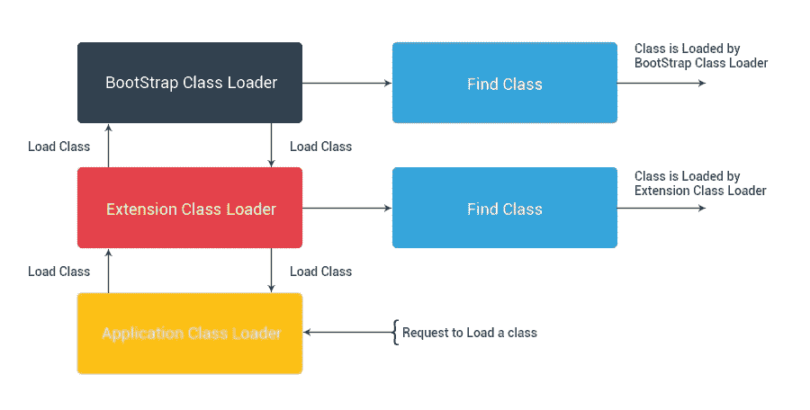
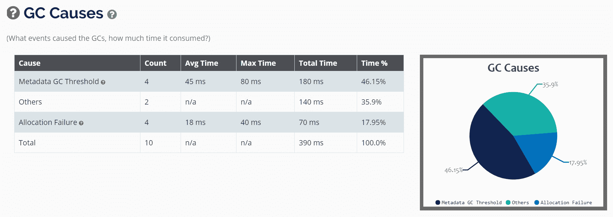

# 十一、JVM 内部

上一章让我们了解了如何通过了解性能问题的症状来优化应用的性能。我们经历了性能调整生命周期，了解了在应用性能的哪些阶段可以进行调整以及如何进行调整。我们还学习了如何将 JMX 连接到 Spring 应用，观察了应用的瓶颈，并对其进行了调优。

在本章中，我们将介绍**Java 虚拟机**（**JVM**的内部结构，并对 JVM 进行调优以实现高性能。JVM 执行两个主要任务：执行代码和管理内存。JVM 从操作系统分配内存，管理堆压缩，并对未引用的对象执行**垃圾收集**（**GC**）。GC 很重要，因为适当的 GC 可以改进应用的内存管理和性能。

以下是我们将在本章中讨论的主题：

*   了解 JVM 内部
*   理解内存泄漏
*   常见的陷阱
*   GC
*   GC 方法和策略
*   分析 GC 日志的工具

# 了解 JVM 内部

作为一名 Java 开发人员，我们知道 Java 字节码在**Java 运行时环境**（**JRE**）中运行，JRE 最重要的部分是 JVM，它分析并执行 Java 字节码。当我们创建 Java 程序并编译它时，结果是一个扩展名为`.class`的文件。它包含 Java 字节码。JVM 将 Java 字节码转换为机器指令，这些指令在我们运行应用的硬件平台上执行。当 JVM 运行程序时，它需要内存来存储字节码和从加载的类文件、实例化对象、方法参数、返回值、局部变量和中间计算结果中提取的其他信息。JVM 将所需的内存组织到几个运行时数据区域中。

JVM 由三部分组成：

*   类加载器子系统
*   存储区
*   执行引擎

下图说明了高级 JVM 体系结构：


JVM 体系结构

让我们简要了解一下在图中看到的 JVM 的三个不同部分。

# 类加载器子系统

类加载器子系统的职责不仅限于定位和导入类的二进制数据。它还验证导入的类是否正确，为类变量分配和初始化内存，并帮助解析符号引用。这些活动按照严格的顺序进行：

1.  **加载**：类加载器读取`.class`文件，查找并导入类型的二进制数据。
2.  **链接**：执行验证、准备和（可选）解析：

*   **验证**：确保导入类型的正确性
*   **准备**：为类变量分配内存，并将内存初始化为默认值
*   **解析**：将符号引用从类型转换为直接引用

3.  **初始化**：为代码中定义的所有静态变量赋值，并执行静态块（如果有）。在类中从上到下执行，在类层次结构中从父级到子级执行。

一般来说，有三类装载机：

*   **引导类加载程序**：加载位于`JAVA_HOME/jre/lib`目录中的核心可信 Java API 类。这些 java API 是用 C++语言或本地语言实现的。
*   **扩展类加载器**：继承引导类加载器。它从位于`JAVA_HOME/jre/lib/ext`的扩展目录或`java.ext.dirs`系统属性指定的任何其他目录加载类。它由`sun.misc.Launcher$ExtClassLoader`类在 Java 中实现。
*   **系统类加载器**：继承扩展类加载器。它从我们的应用类路径加载类。它使用`java.class.path`环境变量

为了加载类，JVM 遵循委托层次原则。系统类加载器将请求委托给扩展类加载器，扩展类加载器将请求委托给引导类加载器。如果在引导路径中找到一个类，则加载该类，否则，请求将被传输到扩展类装入器，然后传输到系统类装入器。最后，如果系统类加载器未能加载该类，则会生成一个`java.lang.ClassNotFoundException`异常。

下图说明了委托层次结构原则：



委托层次原则

# 存储区

Java 运行时内存分为五个不同的区域，如下图所示：


存储区

让我们看一下每个组件的简要说明：

*   **方法区**：包含所有类级信息，如类名、父类、方法、实例、静态变量等。每个 JVM 只有一个方法区域，它是一个共享资源。
*   **堆区**：包含所有对象的信息。每个 JVM 有一个**堆区域**。它也是一种共享资源。由于**方法区**和**堆区**是多线程之间的共享内存，因此存储的数据不是线程安全的。
*   **堆栈内存**：JVM 为执行中的每个线程创建一个运行时堆栈，并将其存储在堆栈区域。这个堆栈的每个块都被称为一个存储方法调用的**激活记录**。该方法的所有局部变量都存储在相应的框架中。堆栈区域是线程安全的，因为它不是共享资源。运行时堆栈将在线程终止时被 JVM 销毁。因此，在方法调用的无限循环的情况下，我们可能会看到`StackOverFlowError`，这是因为堆栈中没有存储方法调用的内存。

*   **PC 寄存器**：保存当前正在执行的指令的地址。指令执行后，**PC 寄存器**将用下一条指令更新。每个线程都有一个单独的**PC 寄存器**。
*   **本机方法堆栈**：为每个线程创建一个单独的本机堆栈。它存储本机方法信息。本机信息只是本机方法调用。

# 执行引擎

执行引擎在运行时数据区域执行字节码。它按每行执行字节码，并使用运行时数据区域中可用的信息。执行引擎可分为三个部分：

*   **解释器**：每行读取、解释和执行字节码。它能快速解释和执行字节码；但是，它在执行解释结果时可能非常慢
*   **即时（JIT）**：为了克服解释器执行解释结果的缓慢性，一旦解释器第一次解释代码，JIT 编译器就会将字节码转换为本机代码。本机代码执行速度快；它一个接一个地执行指令
*   **垃圾收集器**：这会销毁任何未被引用的内容。这是非常重要的，所以任何不需要的东西都将被销毁，以便为新的执行创造空间。

# 理解内存泄漏

Java 的最大好处是 JVM，它提供了开箱即用的内存管理。我们可以创建对象，Java 的垃圾收集器负责为我们释放内存。在下一节中，我们将看到内存泄漏的一些常见原因，并介绍一些检测/避免这些问题的解决方案

# Java 中的内存泄漏

当垃圾收集器无法再收集应用正在使用/引用的对象时，会发生内存泄漏。如果对象未被垃圾收集，应用将使用更多内存，并且一旦整个堆满，将无法分配对象，这将导致`OutOfMemoryError`。

堆内存有两种类型的对象：引用对象和未引用对象。垃圾收集器将删除所有未引用的对象。但是，即使应用不使用引用的对象，垃圾收集器也无法删除这些对象。

# 内存泄漏的常见原因

以下是内存泄漏的最常见原因：

*   **开放流**：在处理流和读卡器时，我们经常忘记关闭流，最终导致内存泄漏。有两种类型的泄漏是由未关闭的流导致的低级别资源泄漏和内存泄漏。低级资源泄漏包括操作系统级资源，如文件描述符和开放连接。由于 JVM 消耗内存来跟踪这些资源，因此会导致内存泄漏。为避免泄漏，请使用`finally`块关闭流或使用 Java 8 的自动关闭功能。
*   **打开连接**：我们经常忘记关闭打开的 HTTP、数据库或 FTP 连接，导致内存泄漏。与关闭流类似，关闭连接。
*   **引用实例对象的静态变量**：任何引用重对象的静态变量都可能导致内存泄漏，因为即使该变量未被使用，也不会被垃圾收集。为了防止这种情况，尽量不要使用大量的静态变量；改用局部变量。
*   **集合**中对象缺少方法：将没有实现`equals`和`hashcode`方法的对象添加到`HashSet`会增加`HashSet`中重复对象的数量，一旦添加，我们将无法删除这些对象。为了防止这种情况，请在添加到`HashSet`的对象中执行`equals`和`hashcode`方法。

诊断内存泄漏是一个漫长的过程，需要大量的实践经验、调试技能和应用的详细知识。以下是诊断内存泄漏的方法：

*   启用 GC 日志并微调 GC 参数
*   轮廓
*   代码审查

在下面的部分中，我们将看到 GC 的常见陷阱、GC 方法和分析 GC 日志的工具。

# 常见的陷阱

性能调优是至关重要的，一个小小的 JVM 标志会让事情变得棘手。JVM 会受到 GC 暂停的影响，暂停的频率和持续时间会有所不同。在暂停期间，一切都会停止，各种意外行为也会开始。在暂停期间和 JVM 卡住的不稳定行为中，性能会受到影响。我们可以看到响应时间慢、CPU 和内存利用率高的症状，或者系统大部分时间行为正常，但行为异常，例如执行极慢的事务和断开连接。

大多数情况下，我们测量平均事务时间，忽略导致不稳定行为的异常值。大多数情况下，系统行为正常，但在某些情况下，系统响应能力会降低。大多数情况下，这种低性能的原因是由于对 GC 开销的认识不足，并且只关注平均响应时间。

在定义性能需求时，我们需要回答的一个重要问题是：对于我们的应用，与 GC 暂停频率和持续时间相关的可接受标准是什么？需求因应用而异，因此根据我们的应用和用户体验，我们需要首先定义这些标准

我们通常有以下几个常见的误解。

# 垃圾收集器的数量

大多数时候，人们并不知道垃圾收集器不仅有一个，而且有四个。四个垃圾收集器分别为-**串行**、**并行**、**并发**、**垃圾优先**（**G1**）。我们将在下一节中看到它们。有一些第三方垃圾收集器，如**Shenandoah**。JVM HotSpot 的默认垃圾收集器与 Java 8 并行，而 Java 9 的默认收集器是**垃圾第一垃圾收集器**（**G1 GC**。并行垃圾收集器在大多数情况下不是最好的；但是，这取决于我们的应用需求。例如，**并发标记扫描**（**CMS**）和 G1 收集器导致 GC 暂停的频率较低。但是，当它们确实导致暂停时，暂停持续时间很可能比并行采集器引起的暂停时间长。另一方面，对于相同的堆大小，并行收集器通常可以获得更高的吞吐量。

# 错误的垃圾收集器

GC 问题的一个常见原因是为应用类型选择了错误的垃圾收集器。每个收藏者都有自己的意义和好处。我们需要找到应用的行为和优先级，并在此基础上选择正确的垃圾收集器。HotSpot 的默认垃圾收集器是并行/吞吐量，大多数情况下，它并不是一个好的选择。CMS 和 G1 采集器是并发的，导致的暂停频率较低，但当暂停出现时，其持续时间比并行采集器长。因此，选择收藏家是我们经常犯的错误。

# 并行/并发关键字

GC 可以导致**s****世界顶级**（**STW**）情况，也可以在不停止应用的情况下同时收集对象。GC 算法可以在单线程或多线程中执行。因此，并发 GC 并不意味着它并行执行，而串行 GC 并不意味着它由于串行执行而导致更多的暂停。并发和并行是不同的，其中并发表示 GC 循环，并行表示 GC 算法。

# G1 是一个问题解决者

随着 Java7 中新垃圾收集器的引入，许多人认为它是所有以前垃圾收集器的问题解决者。G1 GC 解决的一个重要问题是碎片问题，这是 CMS 收集器的常见问题。然而，在许多情况下，其他收集器的性能可以超过 G1 GC。所以这完全取决于我们应用的行为和需求。

# 平均交易时间

大多数情况下，在测试性能时，我们倾向于测量平均事务时间，而仅通过这样做，我们就忽略了异常值。在某些情况下，当 GC 导致长时间暂停时，应用的响应时间会急剧增加，从而影响用户访问应用。这可能会被忽略，因为我们只关注平均事务时间。当 GC 暂停频率增加时，响应时间成为一个严重的问题，我们可能只通过测量平均响应时间来忽略它。

# 降低新对象分配率可以改善 GC 行为

我们应该关注对象的生命，而不是关注或降低新对象的分配率。生命中有三种不同类型的物体：长寿的物体，我们对此无能为力；中年物体，这些是最大的问题；和短期对象，这些对象通常被快速释放和分配，以便在下一个 GC 周期收集它们。因此，与其专注于长寿命和短命的对象，不如专注于中年对象的分配率可以带来积极的结果。不仅仅是对象分配率；正是游戏中的物品类型造成了所有的麻烦。

# GC 日志会导致开销

GC 日志不会导致开销，特别是在默认日志设置中。数据非常有价值，Java7 引入了钩子来控制日志文件的大小。如果我们不收集带有时间戳的 GC 日志，那么我们就错过了分析和解决暂停问题的关键数据源。GC 日志是系统中 GC 状态最丰富的数据源。我们可以获取应用中所有 GC 事件的数据；比方说，它是同时完成的，或者导致 STW 暂停：花了多长时间，消耗了多少 CPU，释放了多少内存。从这些数据中，我们将能够了解暂停的频率和持续时间，以及它们的开销，并采取行动减少它们。

通过添加以下参数启用 GC：

```java
-XX:+PrintGCDetails -XX:+PrintGCDateStamps -Xloggc:`date +%F_%H-%M-%S`-gc.log -XX:+UseGCLogFileRotation -XX:NumberOfGCLogFiles=10 -XX:GCLogFileSize=10M
```

# GC

Java 最好的成就之一是 GC。GC 进程自动管理内存和堆分配，这些内存和堆分配跟踪死对象，删除它们，并将内存重新分配给新对象。理论上，由于垃圾收集器自动管理内存，它使开发人员创建新对象而不考虑内存的分配和释放，从而消除内存泄漏和其他与内存相关的问题。

# GC 的工作原理

我们通常认为 GC 收集并删除未引用的对象。相反，Java 中的 GC 跟踪活动对象并将所有未引用的对象标记为垃圾。

内存的堆区域是动态分配对象的地方。我们应该在运行应用之前将堆内存分配给 JVM。提前将堆分配给 JVM 有两个后果：

*   提高了对象创建速度，因为 JVM 不需要和操作系统通信来为每个新对象获取内存。一旦 JVM 将内存分配给对象，JVM 就会将指针移向下一个可用内存
*   垃圾收集器在没有对象引用时收集对象，并将其内存重新用于新对象分配。由于垃圾收集器不删除对象，因此不会将内存返回操作系统。

在引用这些对象之前，JVM 将它们视为活动对象。当对象不再被引用且应用代码无法访问时，垃圾回收器将删除该对象并回收其内存。我们脑子里有一个问题，谁是物体树中的第一个参照物，对吗？让我们看看对象树及其根。

# GC 根

对象的每个树的根上都有一个或多个对象。如果垃圾收集器可以到达根，则树是可到达的。GC 根未访问或引用的任何对象都被视为死对象，垃圾收集器将其删除。

以下是 Java 中不同类型的 GC 根：

*   **局部变量：**Java 方法的变量或参数。
*   **活动线程：**正在运行的线程是活动对象。
*   **静态变量：**类引用静态变量。垃圾收集器收集类时，会删除对静态变量的引用。
*   **JNI 引用：**在 JNI 调用期间创建的对象引用。它们之所以保持活动状态，是因为 JVM 不知道本机代码有它的引用。

请看下图：


GC 根

# GC 方法和策略

正如我们在上一节中了解到的，这里不是一个而是四个不同的垃圾收集器。每一种都有自己的优点和缺点。这些收集器的一个共同点是，它们将托管堆拆分为不同的段，并假设对象是短期的，应该很快删除。让我们看看 GC 的四种不同算法。

# 串行采集器

串行收集器是最简单的 GC 实现，主要为单线程环境和小堆设计。此 GC 实现在任何时候都会冻结所有应用线程。因此，在多线程应用（如服务器环境）中使用它不是一个好主意。

要启用串行垃圾收集器，请将`-XX:+UseSerialGC`设置为 VM 参数

# 并行/吞吐量收集器

并行收集器是 JVM 的默认收集器，也称为吞吐量收集器。顾名思义，与串行收集器不同，此收集器使用多线程管理堆内存。并行垃圾收集器在执行次要或完全 GC 时仍然冻结所有应用线程。如果我们想使用并行垃圾收集器，我们应该指定调优参数，例如线程、暂停时间、吞吐量和封装外形。

以下是用于指定调整参数的参数：

*   线程：`-XX:ParallelGCThreads=<N>`
*   暂停时间：`-XX:MaxGCPauseMillis=<N>`
*   吞吐量：`-XX:GCTimeRatio=<N>`
*   封装外形（最大堆大小）：`-Xmx<N>`

要在我们的应用中启用并行垃圾收集器，请设置`-XX:+UseParallelGC`选项。

# CMS 垃圾收集器

CMS 实现使用多个垃圾收集器线程扫描（标记）可以删除的未使用对象（扫描）。对于需要短 GC 暂停的应用，以及在应用运行时可以与垃圾收集器共享处理器资源的应用，此垃圾收集器是首选。

CMS 算法只在两种情况下进入 STW 模式：当旧代中的对象仍然从线程入口点或静态变量引用时，当应用在 CMS 运行时更改堆的状态时，算法会返回并重复对象树，以验证它是否标记了正确的对象。

对于此收集器，升级失败是最值得关注的问题。当年轻一代和老一代的对象集合之间发生竞争条件时，升级失败。如果收集器需要将对象从年轻一代升级到老一代，并且没有足够的空间，则必须首先使用 STW 来创建空间。为了确保 CMS 收集器不会发生这种情况，请增加旧一代的大小或为收集器分配更多后台线程，以与分配率竞争。

为了提供高吞吐量，CMS 使用更多的 CPU 来扫描和收集对象。它适用于长时间运行的服务器应用，这不利于应用冻结。因此，如果我们可以分配更多的 CPU 来避免应用暂停，那么我们可以在应用中为 GC 选择 CMS 收集器。要启用 CMS 收集器，请设置-`XX:+UseConcMarkSweepGC`选项。

# G1 收集器

这是 JDK7 更新 4 中引入的新收集器。G1 收集器专为愿意分配超过 4GB 堆内存的应用而设计。G1 将堆划分为多个区域，范围从 1 MB 到 32 MB，具体取决于我们配置的堆，并使用多个后台线程扫描堆区域。将堆划分为多个区域的好处是 G1 将首先扫描存在大量垃圾的区域，以满足给定的暂停时间。

G1 在后台线程完成对未使用对象的扫描之前减少低堆可用性的更改。这减少了 STW 的机会。G1 在运行中压缩堆，不像 CMS 在 STW 期间这样做。

为了在我们的应用中启用 G1 垃圾收集器，我们需要在 JVM 参数中设置`-XX:+UseG1GC`选项。

Java8Update20 为 G1 收集器引入了一个新的 JVM 参数`-XX:+UseStringDeduplication`。使用此参数，G1 标识重复字符串并创建指向同一整型`char[]`数组的指针，以避免同一字符串的多个副本。

从 Java8`PermGen`中，部分堆被移除。这是分配给类元数据、静态变量和内部字符串的部分。这个参数调优导致了许多`OutOfMemory`异常，从 Java8 开始就可以了，JVM 会处理这些异常。

# 堆内存

堆内存主要分为两代：年轻一代和老一代。在 Java 7 之前，**PERM 生成**一直是堆内存的一部分，而从 Java 8 开始，**PERM 生成**被**元空间**取代。**元空间**不是堆内存的一部分，而是**本机内存**的一部分。使用`-XX:MaxMetaspaceSize`选项设置**元空间**的大小。在生产过程中考虑这种设置是至关重要的，因为如果 To.T13.Meta StaseTo.T14-p 占用过多的内存，则影响应用的性能：


Java8 内存管理

**年轻一代**是创建和分配对象的地方；这是为年轻人准备的。**年轻一代**进一步划分为**幸存者空间**。以下是**热点堆结构**：


**伊甸园**区域默认大于**幸存者空间**。所有对象首先在**伊甸园**区域创建。当**伊甸园**满时，会触发次要 GC，它会快速扫描对象的引用，未引用的对象会被标记为死亡并收集。其中任何一个的**幸存者空间**区域总是空的。小 GC 期间在**伊甸园**中幸存的物体将移动到空的**幸存者空间**。我们可能想知道为什么有两个**幸存者空间**区域而没有一个。原因是为了避免内存碎片。当**年轻一代**穿过**幸存者空间**并移除死物时，会在内存中留下漏洞，需要压缩。为了避免压缩，JVM 将幸存对象从一个**幸存者空间**移动到另一个。从**伊甸园**和一个**幸存者空间**到另一个**伊甸园**和另一个**幸存者空间**的活体乒乓球会一直持续到以下情况发生：

*   对象达到最大寿命阈值。这意味着对象不再年轻。
*   **幸存者空间**已满，无法容纳任何新对象。

当上述情况发生时，对象移动到**旧代**

# JVM 标志

以下是应用中常用的 JVM 参数/标志，用于优化 JVM 以获得更好的性能。调整值取决于应用的行为及其生成速率。因此，为了获得更好的性能，没有为 JVM 标志使用特定值的定义指南

# -Xms 和-Xmx

`-Xms`和`-Xmx`被称为最小和最大堆大小。将`-Xms`设置为`-Xmx`可防止堆扩展期间 GC 暂停并提高性能。

# -XX:NewSize 和-XX:MaxNewSize

我们可以使用`-XX:MaxNewSize`设置年轻一代的大小。年轻一代驻留在总堆内存下，如果我们将年轻一代的大小设置为大，则旧一代的大小将更小。出于稳定性原因，年轻一代的大小不应大于旧一代。因此，`-Xmx/2`是我们可以为`-XX:MaxNewSize`设置的最大大小。

为了获得更好的性能，可以通过设置`-XX:NewSize`标志来设置年轻一代的初始大小。这为年轻一代的成长节省了一些成本。

# -XX：新比率

我们可以使用`-XX:NewRatio`选项将年轻一代的规模设置为老一代的比例。这个选项的好处是，当 JVM 在执行过程中调整总堆大小时，年轻一代可以增长和收缩。`-XX:NewRatio`表示老一代的比例大于年轻一代。`-XX:NewRatio=2`表示老一代的大小是年轻一代的两倍，也就是说年轻一代是总堆的 1/3

如果我们为年轻一代指定比率和固定大小，那么固定大小将优先。没有关于指定年轻一代的大小的哪种方法更可取的生成规则。这里的经验法则是，如果您知道应用生成的对象的大小，那么请指定固定大小，否则，请指定比率

# -XX：生存

`-XX:SurvivorRatio`值是伊甸园相对于幸存者空间的比率。将有两个幸存者空间，每个都相等。如果`-XX:SurvivorRatio=8`，则伊甸园占据 3/4，每个幸存者空间占据旧一代总规模的 1/4

如果我们设置一个比率，使幸存者空间很小，那么伊甸园将为新对象创造更多的空间。在次要 GC 期间，将收集未引用的对象，新对象的 eden 将为空，但是，如果该对象仍有引用，则垃圾收集器将其移动到幸存者空间。如果幸存者空间较小且无法容纳新对象，则对象将移动到旧代。旧一代中的对象只能在完全 GC 期间收集，这会在应用中造成长时间暂停。如果幸存者空间足够大，那么更多的物体可以生存在幸存者空间中，但过早死亡。如果幸存者空间很大，伊甸园就会很小，一个小的伊甸园会导致频繁的年轻 GC

# -XX:initialtenuringreshold，-XX:maxtenuringreshold 和-XX:targetsurviviorratio

寿命阈值决定对象何时可以从年轻一代提升/移动到老一代。我们可以使用`-XX:InitialTenuringThreshold`和`-XX:MaxTenuringThreshold`JVM 标志设置寿命阈值的初始值和最大值。我们还可以使用`-XX:TargetSurvivorRatio`指定年轻一代 GC 结束时幸存者空间的目标利用率（百分比）。

# -XX:CMSInitiatingOccupancyFraction

使用 CMS 收集器（`-XX:+UseConcMarkSweepGC`时使用`-XX:CMSInitiatingOccupancyFraction=85`选项。如果设置了标志且旧代已满 85%，CMS 收集器将开始收集未引用的对象。CMS 不必在老一代 85%的用户占用后才开始收集。如果我们希望 CMS 仅在 85%开始，那么我们需要设置`-XX:+UseCMSInitiatingOccupancyOnly`。`-XX:CMSInitiatingOccupancyFraction`标志的默认值为 65%。

# -XX:+PrintGCDetails，-XX:+PrintGCDateStamps，-XX:+PrintTenuringDistribution

设置标志以生成 GC 日志。为了微调 JVM 参数以获得更好的性能，了解 GC 日志和应用的行为非常重要。`-XX:+PrintTenuringDistribution`报告对象的统计信息（对象的年龄）以及对象升级时所需的阈值。这对于理解应用如何保存对象非常重要

# 分析 GC 日志的工具

JavaGC 日志是在出现性能问题时开始调试应用的地方之一。GC 日志提供重要信息，例如：

*   上次 GC 运行时
*   运行的 GC 循环数
*   GC 运行的时间间隔
*   GC 运行后释放的内存量
*   GC 运行所用的时间
*   垃圾收集器运行时 JVM 暂停的时间量
*   分配给每一代的内存量

以下是 GC 日志示例：

```java
2018-05-09T14:02:17.676+0530: 0.315: Total time for which application threads were stopped: 0.0001783 seconds, Stopping threads took: 0.0000239 seconds
2018-05-09T14:02:17.964+0530: 0.603: Application time: 0.2881052 seconds
.....
2018-05-09T14:02:18.940+0530: 1.579: Total time for which application threads were stopped: 0.0003113 seconds, Stopping threads took: 0.0000517 seconds
2018-05-09T14:02:19.028+0530: 1.667: Application time: 0.0877361 seconds
2018-05-09T14:02:19.028+0530: 1.667: [GC (Allocation Failure) [PSYoungGen: 65536K->10723K(76288K)] 65536K->13509K(251392K), 0.0176650 secs] [Times: user=0.05 sys=0.00, real=0.02 secs] 
2018-05-09T14:02:19.045+0530: 1.685: Total time for which application threads were stopped: 0.0179326 seconds, Stopping threads took: 0.0000525 seconds
2018-05-09T14:02:20.045+0530: 2.684: Application time: 0.9992739 seconds
.....
2018-05-09T14:03:54.109+0530: 96.748: Total time for which application threads were stopped: 0.0000498 seconds, Stopping threads took: 0.0000171 seconds
Heap
 PSYoungGen total 76288K, used 39291K [0x000000076b200000, 0x0000000774700000, 0x00000007c0000000)
  eden space 65536K, 43% used [0x000000076b200000,0x000000076cde5e30,0x000000076f200000)
  from space 10752K, 99% used [0x000000076f200000,0x000000076fc78e28,0x000000076fc80000)
  to space 10752K, 0% used [0x0000000773c80000,0x0000000773c80000,0x0000000774700000)
 ParOldGen total 175104K, used 2785K [0x00000006c1600000, 0x00000006cc100000, 0x000000076b200000)
  object space 175104K, 1% used [0x00000006c1600000,0x00000006c18b86c8,0x00000006cc100000)
 Metaspace used 18365K, capacity 19154K, committed 19456K, reserved 1067008K
  class space used 2516K, capacity 2690K, committed 2816K, reserved 1048576K
2018-05-09T14:03:54.123+0530: 96.761: Application time: 0.0131957 seconds
```

这些日志很难快速解释。如果我们有一个可以在可视化界面中呈现这些日志的工具，那么理解 GC 发生了什么将是简单而快速的。在下一节中，我们将介绍一个这样的工具来解释 GC 日志。

# GCeasy

GCeasy 是最流行的垃圾收集日志分析工具之一。开发 GCeasy 是为了自动从 GC 日志中识别问题。它足够聪明，可以提供解决问题的替代方法。

以下是 GCeasy 提供的重要基本功能：

*   使用机器学习算法分析日志
*   快速检测内存泄漏、过早的对象升级、长时间的 JVM 暂停以及许多其他性能问题
*   功能强大、信息丰富的视觉分析仪
*   为主动日志分析提供 RESTAPI
*   免费的基于云的日志分析工具
*   提供有关 JVM 堆大小的建议
*   能够分析所有格式的 GC 日志

GCeasy.io（[http://www.gceasy.io/](http://www.gceasy.io/) 是在线垃圾收集日志分析工具。它要求将日志文件上载到 GCeasy 公共云上。

以下是使用在线工具收集详细日志分析的步骤：

1.  通过在服务器上的 JVM 参数中添加`XX:+PrintGCDetails -XX:+PrintGCDateStamps -Xloggc:<GC-log-file-path>`来启用应用中的 GC 日志。
2.  在指定位置生成 GC 日志文件后，导航到[将文件上传到 GCeasy cloudhttp://gceasy.io/](http://gceasy.io/) 。如果要分析多个日志文件，还可以上载压缩的 ZIP 文件。
3.  处理日志文件后，将生成详细的分析报告。

该报告组织得当，足够详细，能够突出每一个可能导致性能下降的问题。以下部分解释了 GCeasy 生成的报告中的重要部分。

# 关于 JVM 调优的提示

报告的顶部部分提供了基于垃圾收集日志分析的建议。在对日志文件进行彻底分析后，机器学习算法动态生成建议。建议中的细节还包括问题的可能原因。以下是 GCeasy 在 GC 日志分析后提供的示例建议：


# JVM 堆大小

报告中的这一部分提供了有关堆分配和每一内存生成的峰值内存使用率的信息。分配的堆大小可能与 JVM 参数中定义的堆大小不匹配。这是因为 GCeasy 工具从日志中获取分配的内存信息。我们可能已经分配了 2GB 的堆内存，但在运行时，JVM 只能分配 1GB 的堆内存。在这种情况下，报告将显示分配的内存为 1GB。该报告以表格和图形格式显示堆分配。以下是报告中的堆大小部分示例：


# 关键绩效指标

**关键性能指标**（**KPI**）有助于为提高应用的性能做出深刻的决策。吞吐量、延迟和占用空间是几个重要的 KPI。报告中的 KPI 包括吞吐量和延迟。封装外形基本上描述了 CPU 占用的时间量。它可以从性能监视工具（如 JVisualVM）获得。

吞吐量选项指示应用在指定时间段内完成的生产工作量。延迟选项指示 GC 运行所用的平均时间。

以下是报告中的 KPI 示例：


# GC 统计

gcstatistics 部分提供关于垃圾收集器在一段时间内的行为的信息。时段是分析日志的持续时间。GC 统计数据基于实时分析提供。统计信息包括垃圾回收器运行后回收的字节、以秒为单位的累积 GC 时间和以秒为单位的平均 GC 时间。本节还以表格形式提供有关总 GC 统计信息、次要和完整 GC 统计信息以及 GC 暂停统计信息。

# GC 原因

GC 原因部分提供了导致垃圾收集器运行的原因的信息。信息以表格和图形格式提供。除了原因之外，它还提供了垃圾收集器执行所需时间的信息。以下是报告中的一个示例：



基于前面的细节，GCeasy 是帮助开发人员以可视化方式解释 GC 日志的一个重要工具。

# 总结

在本章中，我们学习了 JVM 及其参数。我们了解了与 GC 相关的内存泄漏和常见误解。我们了解了不同的 GC 方法及其重要性。我们学习了导入 JVM 标志，这些标志经过调优以获得更好的性能

在下一章中，我们将学习 Spring Boot 微服务及其性能调优。微服务是应用的体系结构，具有实现业务功能的松散耦合的服务。Spring Boot 使我们能够构建生产就绪的应用。