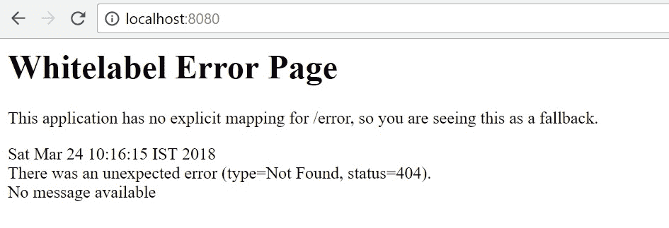
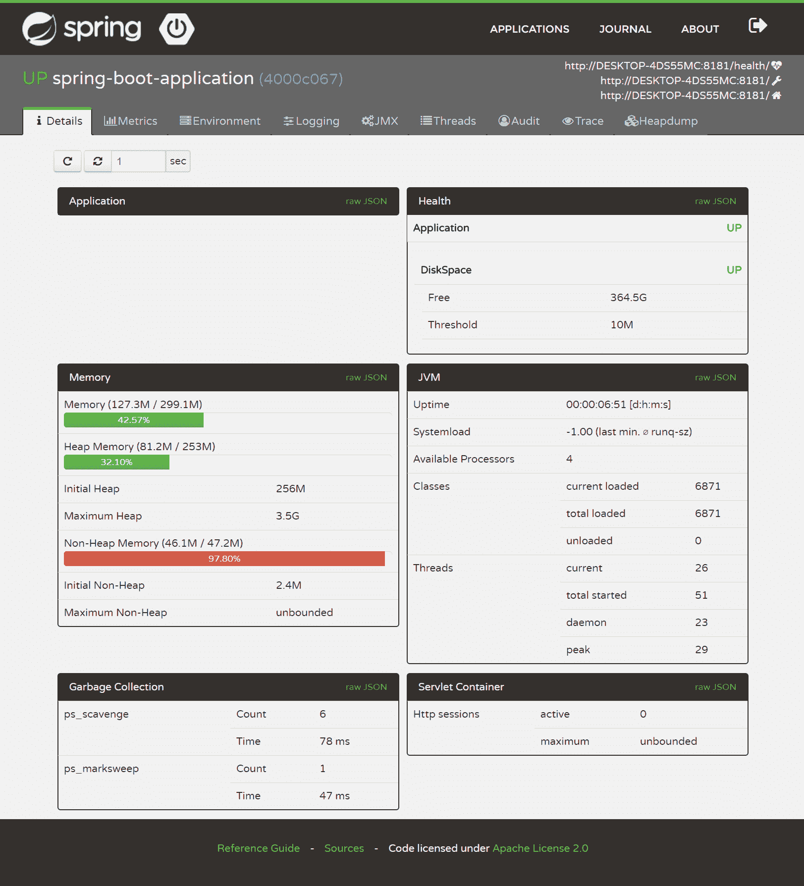
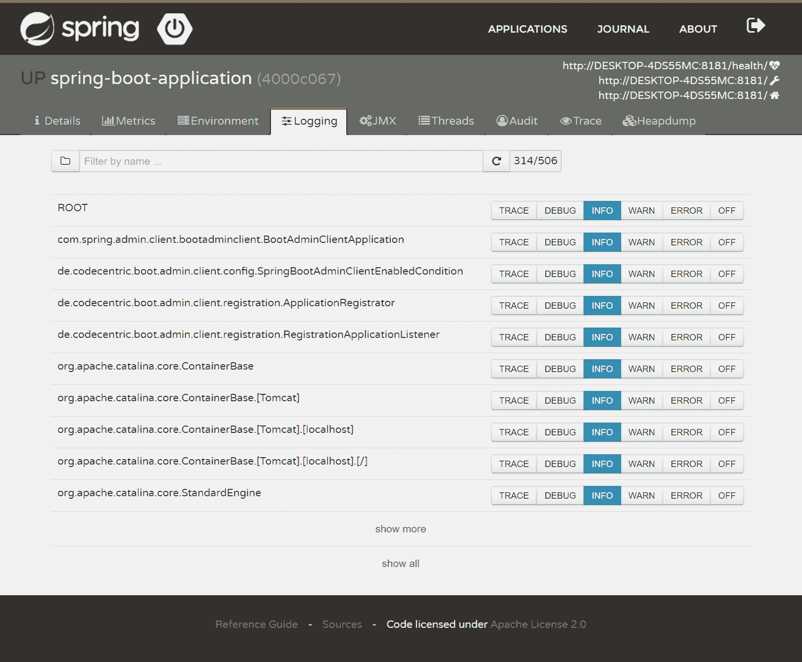

# 十二、Spring Boot 微服务性能调整

在上一章中，我们学习了**Java 虚拟机**（**JVM**）。从 JVM 的内部结构和 Java 的类加载机制开始，我们了解了如何在 Java 中执行内存管理。本章的最后一节重点介绍垃圾收集和 JVM 调优。这一章充满了有关应用性能优化的非常重要的细节。

在本章中，我们将着手解决性能问题。方法是开发微服务。目前，微服务在软件开发行业正处于繁荣期。关于微服务和相关的关键词，有很多热议。这种方法基本上在应用体系结构级别工作，以调整应用的性能。它描述了如何通过以不同的方式设置体系结构来提高应用性能。本章将介绍以下主题：

*   Spring 引导配置
*   使用弹簧启动执行器的度量
*   健康检查
*   使用 springboot 的微服务
*   使用 Spring 云的微服务
*   Spring 微服务配置示例
*   使用 Spring Boot admin 监视微服务
*   弹簧引导性能调整

# Spring 引导配置

在本节中，我们将重点介绍如何让 Spring Boot 为我们工作。在开始 SpringBoot 配置之前，我们将了解什么是 SpringBoot，为什么要使用它，以及 SpringBoot 带来了什么。我们将很快进入如何做的部分。

# 什么是弹簧靴？

软件开发过程必须更快、更准确、更健壮。软件团队被要求开发快速原型，以便向潜在客户展示应用的功能。这同样适用于生产级应用。以下是软件架构师为提高开发团队的效率而关注的几个领域：

*   使用正确的工具集，包括框架、IDE 和构建工具
*   减少代码混乱
*   减少编写重复代码所花费的时间
*   花大部分时间实现业务特性

让我们考虑一下。我们为什么要讨论这个？原因是这是弹簧靴的基础。这些想法是创建帮助团队提高生产力的框架或工具的基石。发现 Spring Boot 的原因与提高生产率完全相同！

使用 Spring Boot，创建由 Spring 框架支持的生产级应用变得很容易。它还可以轻松创建支持生产的服务，并将挑战降至最低。SpringBoot 通过对 Spring 框架的固执己见，帮助新用户和现有用户快速完成生产任务。Spring Boot 是一个工具，它有助于创建一个独立的 Java 应用，可以使用`java -jar`命令运行该应用，也可以创建一个可以部署到 web 服务器的 web 应用。Spring 启动设置与运行 Spring 程序的命令行工具捆绑在一起。

Spring Boot 的主要目标是：

*   获得快速体验，开始 Spring 项目
*   广泛可及性
*   来自开箱即用配置的主要支持
*   根据需要灵活地偏离 Spring 默认值

*   它不会生成任何代码
*   它不需要 XML 配置

除了前面列出的主要功能外，Spring Boot 还支持非功能性功能，如下所示：

*   支持广为人知和使用广泛的框架的版本控制和配置
*   对应用安全性的支持
*   支持监视应用运行状况检查参数
*   支持对性能指标的监控
*   支持外部化配置

尽管 SpringBoot 为主要和非功能特性提供了默认设置，但它足够灵活，允许开发人员使用他们选择的框架、服务器和工具。

# 弹簧初始化器

Spring 引导应用可以通过多种方式启动。其中一种方法是使用基于 Eclipse 的 Spring 工具套件 IDE（[https://spring.io/tools/sts](https://spring.io/tools/sts) ）。另一种方式是使用[https://start.spring.io](https://start.spring.io) ，也称为弹簧初始值设定器。首先，Spring 初始值设定项不是 Spring Boot 或等效项。Spring Initializer 是一个具有简单 web UI 支持的工具，用于配置 Spring 引导应用。它可以被认为是一种快速启动 Spring 项目的工具。它提供了可扩展用于定制的 API，以便生成项目。

Spring Initializer 工具提供了一个配置结构来定义依赖项列表、支持的 Java 和 Spring 启动版本以及支持的依赖项版本控制。

基本上，SpringInitializer 根据提供的配置创建一个初始 Spring 项目，并允许开发人员以 ZIP 文件的形式下载该项目。以下是需要遵循的步骤：

1.  导航至[https://start.spring.io/](https://start.spring.io/) 。
2.  从 Maven 或 Gradle 中选择依赖项管理工具。
3.  从 Java、Kotlin 和 Groovy 中选择基于 JVM 的编程语言。
4.  选择要使用的 Spring 引导版本。
5.  通过输入组名`com.packt.springhighperformance`来提供组工件。

6.  输入工件，它是 Maven 项目的工件 ID。这将成为要部署或执行的项目 WAR 或 JAR 文件的名称。
7.  从 Jar 和 War 中选择一种包装类型。
8.  单击切换到完整版本链接。这将打开一个可供选择的初始项目列表。下一节将详细解释启动项目。
9.  一旦我们选择了启动器或依赖项，单击 GenerateProject 按钮。这将下载包含初始项目配置的 ZIP 文件。

以下是带有一些配置的 Spring Initializer 屏幕：


完成后，将生成一个类似于以下屏幕截图所示的文件夹结构：


Spring Initializer 还支持命令行界面来创建 Spring 项目配置。以下命令可用于生成项目配置：

```java
> curl https://start.spring.io/starter.zip -d dependencies=web,jpa -d bootVersion=2.0.0 -o ch-09-spring-boot-example-1.zip
```

如前所述，Spring 初始化器支持与 IDE 集成。它与 Eclipse/STS、IntelliJ ultimate edition 和 NetBeans 以及 SpringBoot 插件集成良好。

# 马文首发

在上一节中，我们查看了 Spring 初始化工具。现在是快速查看 Spring Boot 支持的启动器或依赖项的时候了。

随着项目复杂性的增加，依赖关系管理变得具有挑战性。对于复杂项目，建议不要手动管理依赖项。弹簧启动启动器解决了类似的问题。Spring Boot starters 是一组依赖描述符，可以包含在使用 starter POM 的 Spring 应用中。它消除了寻找示例代码和为 Spring 及相关库复制/粘贴大量依赖描述符的需要。例如，如果我们想使用 Spring 和 JPA 开发一个应用，我们可以在项目中包含`spring-boot-data-jpa-starter`依赖项。`spring-boot-data-jpa-starter`是一个起点。起动器遵循统一的命名模式，如`spring-boot-starter-*`，其中`*`表示应用的类型。

以下是一些 Spring 引导应用启动器的列表：

| **名称** | **说明** |
| `spring-boot-starter` | Core starter 提供自动配置和日志记录支持。 |
| `spring-boot-starter-activemq` | 使用 ApacheActiveMQ 的 JMS 消息传递启动器。 |
| `spring-boot-starter-amqp` | Spring AMQP 和 Rabbit MQ 启动器。 |
| `spring-boot-starter-aop` | Spring AOP 和 AspectJ 启动器。 |
| `spring-boot-starter-artemis` | 使用 ApacheArtemis 的 JMS 消息传递启动器。 |
| `spring-boot-starter-batch` | 弹簧批式起动器。 |
| `spring-boot-starter-cache` | Spring 框架的缓存支持。 |
| `spring-boot-starter-cloud-connectors` | Starter 在云计算平台（如 cloud Foundry 和 Heroku）中使用 Spring 云连接器，为简化云服务连接提供支持。 |
| `spring-boot-starter-data-elasticsearch` | Starter 支持 elasticsearch 和分析引擎，以及 Spring Data elasticsearch。 |
| `spring-boot-starter-data-jpa` | 带 Hibernate 的 Spring 数据 JPA。 |
| `spring-boot-starter-data-ldap` | Spring 数据 LDAP。 |
| `spring-boot-starter-data-mongodb` | MongoDB 面向文档的数据库和 Spring 数据 MongoDB。 |
| `spring-boot-starter-data-redis` | Redis 键值数据存储与 Spring 数据 Redis 和客户端。 |
| `spring-boot-starter-data-rest` | Starter 支持使用 SpringDataREST 在 REST 上公开 Spring 数据存储库。 |
| `spring-boot-starter-data-solr` | Apache Solr 搜索平台和 Spring 数据 Solr。 |
| `spring-boot-starter-freemarker` | Starter 支持使用 FreeMarker 视图构建 MVC web 应用。 |
| `spring-boot-starter-groovy-templates` | Starter 支持使用 Groovy 模板视图构建 MVC web 应用。 |
| `spring-boot-starter-integration` | Spring 集成。 |
| `spring-boot-starter-jdbc` | 带有 Tomcat JDBC 连接池的 JDBC。 |
| `spring-boot-starter-jersey` | Starter 支持使用 JAX-RS 和 Jersey 构建 RESTful web 应用。它是`spring-boot-starter-web starter`的替代品。 |
| `spring-boot-starter-json` | Starter 支持 JSON 操作。 |
| `spring-boot-starter-mail` | Starter 支持使用 Java 邮件和 Spring 框架的电子邮件发送支持。 |
| `spring-boot-starter-quartz` | 起动器使用石英弹簧靴。 |
| `spring-boot-starter-security` | 弹簧安全启动器。 |
| `spring-boot-starter-test` | 通过 JUnit、Hamcrest 和 Mockito 等库支持 Spring 引导应用。 |
| `spring-boot-starter-thymeleaf` | 支持使用 Thymeleaf 视图构建 MVC web 应用。 |
| `spring-boot-starter-validation` | 使用 Hibernate 验证器支持 JavaBean 验证的初学者。 |
| `spring-boot-starter-web` | 支持使用 SpringMVC 构建 web（包括 RESTful）应用。它使用 Tomcat 作为默认的嵌入式容器。 |
| `spring-boot-starter-web-services` | 支持使用 SpringWeb 服务。 |
| `spring-boot-starter-websocket` | 支持使用 Spring 框架的 WebSocket 支持构建 WebSocket 应用。 |

`spring-boot-starter-actuator`是 Spring Boot 的执行器工具的生产启动器，它为生产准备功能提供支持，如应用监控、健康检查、日志记录和 bean。

以下列表包括一些 Spring Boot 的技术启动器：

| **名称** | **说明** |
| `spring-boot-starter-jetty ` | 支持 Jetty 作为嵌入式 servlet 容器。这是`spring-boot-starter-tomcat`的替代方案。 |
| `spring-boot-starter-log4j2` | 支持 Log4j 2 记录的启动器。这是`spring-boot-starter-logging`的替代方案。 |
| `spring-boot-starter-logging` | 这是使用 logback 的默认日志启动程序。 |
| `spring-boot-starter-tomcat` | 这是用于`spring-boot-starter-web`的默认 servlet 容器启动器。它使用 Tomcat 作为嵌入式服务器。 |
| `spring-boot-starter-undertow` | 这是`spring-boot-starter-tomcat starter`的替代方案。它使用 Undertow 作为嵌入式服务器。 |
| `spring-boot-starter-cache` | Spring 框架的缓存支持。 |

# 创建第一个 Spring 启动应用

在本节中，我们将介绍开发 Spring 引导应用的先决条件。我们将开发一个小型 Spring 引导应用，以了解 Spring 引导应用所需的配置以及每个配置的重要性。

以下是使用 Spring Boot 的先决条件列表：

*   Java 8 或 9
*   Spring 5.0.4 或更高版本

Spring Boot 支持：

*   Maven 3.2+和 Gradle 4 用于依赖项管理和显式构建

*   Tomcat 8.5、码头 9.4 和底拖 1.4

Spring 引导应用可以部署到任何 servlet 3.0+兼容的 servlet 容器。

开发 SpringBoot 应用的第一步是安装 SpringBoot。设置起来非常容易。它可以按照与其他标准 Java 库相同的方式进行设置。要安装 Spring Boot，我们需要在类路径中包含适当的`spring-boot-*.jar`库文件。任何 IDE 或文本编辑器都可以使用，因为 Spring Boot 不需要任何专用工具。

尽管我们可以在应用类路径中复制所需的 Spring 引导 JAR 文件，但建议使用构建工具（如 Maven 或 Gradle）进行依赖关系管理。

Spring 引导依赖项使用的 Maven`groupId`是`org.springframework.boot`。对于 Spring 引导应用，Maven POM 文件继承了`spring-boot-starter-parent`项目。springboot 定义了 starter 项目，它在 springboot 应用的依赖项中定义为一个依赖项。

让我们通过执行以下步骤来创建我们的第一个 Spring Boot 应用：

1.  使用 Spring 初始化器创建 kickstarter 应用。
2.  选择 Maven 作为构建和依赖关系管理工具。
3.  选择合适的 Spring 引导版本。
4.  选择包装类型为 War。
5.  为了简单起见，我们不会在应用中包含 JPA 启动器。我们将包含一个 web 模块，仅用于演示一个请求-响应流。
6.  下载项目并将其导入 STS 或 Eclipse。
7.  在 STS 中，您可以将应用作为 Spring 引导应用运行，而在 Eclipse 中，您可以选择将应用作为 Java 应用运行。

现在让我们浏览一下代码片段。以下是 Maven POM 文件的示例：

```java
<?xml version="1.0" encoding="UTF-8"?>
<project  
    xmlns:xsi="http://www.w3.org/2001/XMLSchema-instance"
    xsi:schemaLocation="http://maven.apache.org/POM/4.0.0         
    http://maven.apache.org/xsd/maven-4.0.0.xsd">
  <modelVersion>4.0.0</modelVersion>

  <groupId>com.packt.springhighperformance.ch09</groupId>
  <artifactId>ch-09-boot-example</artifactId>
  <version>0.0.1-SNAPSHOT</version>
  <packaging>jar</packaging>

  <name>boot-example</name>
  <description>Demo project for Spring boot</description>

  <parent>
    <groupId>org.springframework.boot</groupId>
    <artifactId>spring-boot-starter-parent</artifactId>
    <version>2.0.0.RELEASE</version>
    <relativePath/> <!-- lookup parent from repository -->
  </parent>

  <properties>
    <project.build.sourceEncoding>UTF-8</project.build.sourceEncoding>
    <project.reporting.outputEncoding>UTF-
    8</project.reporting.outputEncoding>
    <java.version>1.8</java.version>
    <spring-cloud.version>Finchley.M9</spring-cloud.version>
  </properties>

  <dependencies>
    <dependency>
      <groupId>org.springframework.boot</groupId>
      <artifactId>spring-boot-starter-web</artifactId>
    </dependency>
    <dependency>
      <groupId>org.springframework.boot</groupId>
      <artifactId>spring-boot-starter-test</artifactId>
      <scope>test</scope>
    </dependency>
  </dependencies>

  <build>
    <plugins>
      <plugin>
        <groupId>org.springframework.boot</groupId>
        <artifactId>spring-boot-maven-plugin</artifactId>
      </plugin>
    </plugins>
  </build>
</project>
```

前面配置文件中值得注意的配置之一是父依赖项。如前所述，所有 Spring 引导应用都使用`spring-boot-starter-parent`作为`pom.xml`文件中的父依赖项。

父 POM 帮助管理子项目和模块的以下内容：

*   Java 版本
*   包含依赖项的版本管理
*   插件的默认配置

Spring 引导父启动器将 Spring 引导依赖项定义为父 POM。因此，它继承了 Spring 引导依赖项的依赖项管理特性。它将默认 Java 版本定义为 1.6，但在项目级别，我们可以将其更改为`1.8`，如前面的代码示例所示。

除了默认的 POM 文件外，SpringBoot 还创建了一个 Java 类，作为应用启动程序使用。以下是示例 Java 代码：

```java
package com.packt.springhighperformance.ch09;

import org.springframework.boot.SpringApplication;
import org.springframework.boot.autoconfigure.SpringBootApplication;

@SpringBootApplication
public class BootExampleApplication {

  public static void main(String[] args) {
    SpringApplication.run(BootExampleApplication.class, args);
  }
}
```

`SpringApplication`是一个负责引导 Spring Boot 应用的类。

Spring Boot 应用开发人员使用`@Configuration`、`@EnableAutoConfiguration`和`@ComponentScan`注释对主应用类进行注释。以下是每个注释的简要说明：

*   `@Configuration`：这是一个 Spring 注释，并不特定于 Spring 引导应用。它表示该类是 bean 定义的源。
*   `@EnableAutoConfiguration`：这是一个特定于 Spring Boot 的注释。注释使应用能够从类路径定义中添加 bean。
*   `@ComponentScan`**此注释告诉 Spring 应用在提供的搜索路径中搜索组件、配置和服务。**

 **以下是`@SpringBootApplication`注释的定义：

```java
@Target(ElementType.TYPE)
@Retention(RetentionPolicy.RUNTIME)
@Documented
@Inherited
@Configuration
@EnableAutoConfiguration
@ComponentScan
public @interface SpringBootApplication {
......
```

查看前面的代码，很明显，`@SpringBootApplication`可以作为一个方便的注释来定义 Spring Boot 应用，而不是声明三个注释。

以下块显示了 Spring 引导应用启动时的日志输出：

```java

  . ____ _ __ _ _
 /\\ / ___'_ __ _ _(_)_ __ __ _ \ \ \ \
( ( )\___ | '_ | '_| | '_ \/ _` | \ \ \ \
 \\/ ___)| |_)| | | | | || (_| | ) ) ) )
  ' |____| .__|_| |_|_| |_\__, | / / / /
 =========|_|==============|___/=/_/_/_/
 :: Spring Boot :: (v2.0.0.RELEASE)

2018-05-23 16:29:21.382 INFO 32268 --- [ main] c.p.s.ch09.BootExampleApplication : Starting BootExampleApplication on DESKTOP-4DS55MC with PID 32268 (E:\projects\spring-high-performance\ch-09\boot-example\target\classes started by baps in E:\projects\spring-high-performance\ch-09\boot-example)
2018-05-23 16:29:21.386 INFO 32268 --- [ main] c.p.s.ch09.BootExampleApplication : No active profile set, falling back to default profiles: default
2018-05-23 16:29:21.441 INFO 32268 --- [ main] ConfigServletWebServerApplicationContext : Refreshing org.springframework.boot.web.servlet.context.AnnotationConfigServletWebServerApplicationContext@58ce9668: startup date [Wed May 23 16:29:21 IST 2018]; root of context hierarchy
2018-05-23 16:29:23.854 INFO 32268 --- [ main] o.s.b.w.embedded.tomcat.TomcatWebServer : Tomcat initialized with port(s): 8080 (http)
2018-05-23 16:29:23.881 INFO 32268 --- [ main] o.apache.catalina.core.StandardService : Starting service [Tomcat]
2018-05-23 16:29:23.881 INFO 32268 --- [ main] org.apache.catalina.core.StandardEngine : Starting Servlet Engine: Apache Tomcat/8.5.28
2018-05-23 16:29:23.888 INFO 32268 --- [ost-startStop-1] o.a.catalina.core.AprLifecycleListener : The APR based Apache Tomcat Native library which allows optimal performance in production environments was not found on the java.library.path: ...
2018-05-23 16:29:24.015 INFO 32268 --- [ost-startStop-1] o.a.c.c.C.[Tomcat].[localhost].[/] : Initializing Spring embedded WebApplicationContext
2018-05-23 16:29:24.016 INFO 32268 --- [ost-startStop-1] o.s.web.context.ContextLoader : Root WebApplicationContext: initialization completed in 2581 ms
2018-05-23 16:29:25.011 INFO 32268 --- [ost-startStop-1] o.s.b.w.servlet.ServletRegistrationBean : Servlet dispatcherServlet mapped to [/]
2018-05-23 16:29:25.015 INFO 32268 --- [ost-startStop-1] o.s.b.w.servlet.FilterRegistrationBean : Mapping filter: 'characterEncodingFilter' to: [/*]
2018-05-23 16:29:25.016 INFO 32268 --- [ost-startStop-1] o.s.b.w.servlet.FilterRegistrationBean : Mapping filter: 'hiddenHttpMethodFilter' to: [/*]
2018-05-23 16:29:25.016 INFO 32268 --- [ost-startStop-1] o.s.b.w.servlet.FilterRegistrationBean : Mapping filter: 'httpPutFormContentFilter' to: [/*]
2018-05-23 16:29:25.016 INFO 32268 --- [ost-startStop-1] o.s.b.w.servlet.FilterRegistrationBean : Mapping filter: 'requestContextFilter' to: [/*]
2018-05-23 16:29:25.016 INFO 32268 --- [ost-startStop-1] o.s.b.w.servlet.FilterRegistrationBean : Mapping filter: 'httpTraceFilter' to: [/*]
2018-05-23 16:29:25.016 INFO 32268 --- [ost-startStop-1] o.s.b.w.servlet.FilterRegistrationBean : Mapping filter: 'webMvcMetricsFilter' to: [/*]
2018-05-23 16:29:26.283 INFO 32268 --- [ main] s.w.s.m.m.a.RequestMappingHandlerMapping : Mapped "{[/welcome]}" onto public java.lang.String com.packt.springhighperformance.ch09.controllers.MainController.helloMessage(java.lang.String)
2018-05-23 16:29:26.284 INFO 32268 --- [ main] s.w.s.m.m.a.RequestMappingHandlerMapping : Mapped "{[/]}" onto public java.lang.String com.packt.springhighperformance.ch09.controllers.MainController.helloWorld()
2018-05-23 16:29:26.291 INFO 32268 --- [ main] s.w.s.m.m.a.RequestMappingHandlerMapping : Mapped "{[/error]}" onto public org.springframework.http.ResponseEntity<java.util.Map<java.lang.String, java.lang.Object>> org.springframework.boot.autoconfigure.web.servlet.error.BasicErrorController.error(javax.servlet.http.HttpServletRequest)
2018-05-23 16:29:26.292 INFO 32268 --- [ main] s.w.s.m.m.a.RequestMappingHandlerMapping : Mapped "{[/error],produces=[text/html]}" onto public org.springframework.web.servlet.ModelAndView org.springframework.boot.autoconfigure.web.servlet.error.BasicErrorController.errorHtml(javax.servlet.http.HttpServletRequest,javax.servlet.http.HttpServletResponse)
2018-05-23 16:29:26.358 INFO 32268 --- [ main] o.s.w.s.handler.SimpleUrlHandlerMapping : Mapped URL path [/webjars/**] onto handler of type [class org.springframework.web.servlet.resource.ResourceHttpRequestHandler]
2018-05-23 16:29:26.359 INFO 32268 --- [ main] o.s.w.s.handler.SimpleUrlHandlerMapping : Mapped URL path [/**] onto handler of type [class org.springframework.web.servlet.resource.ResourceHttpRequestHandler]
2018-05-23 16:29:26.410 INFO 32268 --- [ main] o.s.w.s.handler.SimpleUrlHandlerMapping : Mapped URL path [/**/favicon.ico] onto handler of type [class org.springframework.web.servlet.resource.ResourceHttpRequestHandler]
2018-05-23 16:29:27.033 INFO 32268 --- [ main] o.s.j.e.a.AnnotationMBeanExporter : Registering beans for JMX exposure on startup
2018-05-23 16:29:27.082 INFO 32268 --- [ main] o.s.b.w.embedded.tomcat.TomcatWebServer : Tomcat started on port(s): 8080 (http) with context path ''
2018-05-23 16:29:27.085 INFO 32268 --- [ main] c.p.s.ch09.BootExampleApplication : Started BootExampleApplication in 6.068 seconds (JVM running for 7.496)
```

现在，我们已经准备好 kickstarter Spring 启动应用，但是我们没有任何要呈现的 URL。因此，当您访问`http://localhost:8080`时，将显示一个类似于以下屏幕截图所示的页面：



让我们定义 Spring 控制器和默认路由，并向其中添加文本内容。以下是控制器类的代码段：

```java
package com.packt.springhighperformance.ch09.controllers;

import org.springframework.stereotype.Controller;
import org.springframework.web.bind.annotation.RequestMapping;
import org.springframework.web.bind.annotation.RequestParam;
import org.springframework.web.bind.annotation.ResponseBody;

@Controller
public class MainController {

  @RequestMapping(value="/")
  @ResponseBody
  public String helloWorld() {
    return "<h1>Hello World<h1>";
  }

  @RequestMapping(value="/welcome")
  @ResponseBody
  public String showMessage(@RequestParam(name="name") String name) {
    return "<h1>Hello " + name + "<h1>";
  }

}
```

在前面的示例代码中，我们使用`@RequestMapping`注释定义了两条路由。以下是前面代码块中使用的注释列表，并附有简要说明：

*   `@Controller`注释表示该类是控制器类，可能包含请求映射。
*   `@RequestMapping`注释定义了用户可以在浏览器中导航到的应用 URL。
*   `@ResponseBody`注释表示方法返回值应该作为 HTML 内容呈现在页面上。value 参数可以采用要导航的 URL 路径。

下面的屏幕截图显示了我们在浏览器中点击`http://localhost:8080`时显示或呈现的页面：


我们还定义了参数化请求映射，其值为`/welcome`。当我们在浏览器中导航到 URL 时，请求参数的值将反映在页面上的消息中。以下屏幕截图显示了内容的呈现方式：


当具有这些请求的应用映射引导时，我们可以找到以下日志项：

```java
2018-03-24 10:26:26.154 INFO 11148 --- [ main] s.w.s.m.m.a.RequestMappingHandlerAdapter : Looking for @ControllerAdvice: org.springframework.boot.web.servlet.context.AnnotationConfigServletWebServerApplicationContext@3c153a1: startup date [Sat Mar 24 10:26:24 IST 2018]; root of context hierarchy
2018-03-24 10:26:26.214 INFO 11148 --- [ main] s.w.s.m.m.a.RequestMappingHandlerMapping : Mapped "{[/]}" onto public java.lang.String com.packt.springhighperformance.ch09.controllers.MainController.helloWorld()
2018-03-24 10:26:26.218 INFO 11148 --- [ main] s.w.s.m.m.a.RequestMappingHandlerMapping : Mapped "{[/welcome]}" onto public java.lang.String com.packt.springhighperformance.ch09.controllers.MainController.helloMessage(java.lang.String)
```

此时，我们的第一个 Spring 引导应用和示例请求映射已经就绪。本节作为 Spring Boot 应用开发的分步指南。在下一节中，我们将了解更多的 Spring 引导特性。

# 带弹簧启动执行器的量度

在我们进一步行动之前，了解什么是弹簧启动执行器是很重要的。我们将在接下来的章节中介绍弹簧引导执行器。我们还将介绍 Spring Boot 执行器提供的开箱即用功能。我们还将通过示例了解配置和其他必要的细节。

# 什么是弹簧执行器？

从本质上讲，弹簧靴执行器可以被视为弹簧靴的一个子项目。它有助于在我们使用 Spring Boot 开箱即用开发的应用中引入生产级功能。我们需要先配置 Spring Boot 执行器，然后才能利用它公开的功能。自 2014 年 4 月 Spring Boot 首次发布以来，Spring Boot 执行器一直可用。Spring Boot Actuator 实现了不同的 HTTP 端点，因此开发团队可以执行以下任务：

*   应用监控
*   分析应用度量
*   与应用交互
*   版本信息
*   记录器详细信息
*   豆角细节

# 启用弹簧启动执行器

除了帮助引导应用开发外，SpringBoot 还支持应用中可以使用的许多特性。这些附加功能包括但不限于监视和管理应用。应用管理和监视可以通过 HTTP 端点或使用 JMX 来完成。审计、健康检查和度量也可以应用于 Spring 引导应用中的配置。这些是`spring-boot-actuator`模块提供的生产准备功能。

以下是弹簧靴参考文件（[中致动器的定义 https://docs.spring.io/spring-boot/docs/current/reference/htmlsingle/#production-就绪](https://docs.spring.io/spring-boot/docs/current/reference/htmlsingle/#production-ready)：

致动器是一个制造术语，指用于移动或控制某物的机械装置。执行器可以通过微小的变化产生大量的运动。

为了利用弹簧靴执行器的功能，第一步是启用它。默认情况下，它没有启用，我们必须添加依赖项才能启用它。在 Spring 引导应用中启用 Spring 引导执行器非常容易。我们需要在`pom.xml`文件中添加`spring-boot-starter-actuator`依赖项，以防我们在应用中使用 Maven 进行依赖项管理。以下是 Spring 引导执行器的 Maven 依赖项的代码段：

```java
<dependency>
  <groupId>org.springframework.boot</groupId>
  <artifactId>spring-boot-starter-actuator</artifactId>
</dependency>
```

如前所述，Spring 引导执行器通过公开或启用端点与之交互来启用应用监视。模块有许多现成的端点。它还允许开发人员创建自己的自定义端点。我们可以启用或禁用每个端点。这确保在应用中创建端点，并且应用上下文中存在相应的 bean。

端点可以通过 JMX 或 HTTP 公开来远程访问。通常，应用通过 HTTP 公开端点。端点 URL 是通过将端点 ID 与`/actuator`前缀映射而得。

以下是与技术无关的端点列表：

| **ID** | **说明** | **默认启用** |
| `auditevents` | 此端点公开音频事件的信息。 | 对 |
| `beans` | 此端点显示应用中可用的弹簧`beans`的完整列表。 | 对 |
| `conditions` | 此端点显示在配置和自动配置类上评估的`conditions`。 | 对 |
| `configprops` | 此端点显示标记为`@ConfigurationProperties`的属性列表。 | 对 |
| `env` | 此端点显示 Spring 的`ConfigurableEnvironment`中的属性。 | 对 |
| `flyway` | 端点显示可能已应用的任何`flyway`数据库迁移。 | 对 |
| `health` | 此端点显示应用的`health`信息。 | 对 |
| `httptrace` | 此端点显示 HTTP 跟踪信息。默认情况下，它显示最后 100 次 HTTP 请求-响应交换。 | 对 |
| `info` | 此端点公开应用信息。 | 对 |
| `loggers` | 此端点显示应用`logger`配置。 | 对 |
| `liquibase` | 此端点显示可能已应用的任何`liquibase`数据库迁移。 | 对 |
| `metrics` | 此端点显示应用的`metrics`信息。 | 对 |
| `mappings` | 此端点显示所有`@RequestMapping`路径的列表。 | 对 |
| `scheduledtasks` | 此端点显示应用的计划任务。 | 对 |
| `sessions` | 此端点允许从 Spring 会话支持的会话存储中检索和删除用户`sessions`。当使用 Spring 会话对反应式 web 应用的支持时，它不可用。 | 对 |
| `shutdown` | 此端点允许应用优雅地进行`shutdown`。 | 不 |
| `threaddump` | 该端点执行一个`threaddump`。 | 对 |

以下是在应用为 web 应用时公开的其他终结点的列表：

| **ID** | **说明** | **默认启用** |
| `heapdump` | 此端点返回一个压缩的`hprof`堆转储文件。 | 对 |
| `jolokia` | 此端点通过 HTTP 公开 JMX bean。 | 对 |
| `logfile` | 如果在属性中设置了`logging.file`或`logging.path`，则该端点显示`logfile`的内容。它使用 HTTP 范围标头部分检索日志文件的内容。 | 对 |
| `prometheus` | 此端点以可由 Prometheus 服务器获取的格式显示度量。 | 对 |

# 启用端点

对于弹簧启动执行器，默认情况下启用所有端点，除了`shutdown`端点。为了启用或禁用特定端点，应在`application.properties`文件中添加相关属性。以下是启用端点的格式：

```java
management.endpoint.<id>.enabled=true
```

例如，可以添加以下属性以启用`shutdown`端点：

```java
management.endpoint.shutdown.enabled=true
```

在启动启用默认执行器端点的应用时，可以看到以下日志条目：

```java
2018-03-24 17:51:36.687 INFO 8516 --- [ main] s.b.a.e.w.s.WebMvcEndpointHandlerMapping : Mapped "{[/actuator/health],methods=[GET],produces=[application/vnd.spring-boot.actuator.v2+json || application/json]}" onto public java.lang.Object org.springframework.boot.actuate.endpoint.web.servlet.AbstractWebMvcEndpointHandlerMapping$OperationHandler.handle(javax.servlet.http.HttpServletRequest,java.util.Map<java.lang.String, java.lang.String>)
2018-03-24 17:51:36.696 INFO 8516 --- [ main] s.b.a.e.w.s.WebMvcEndpointHandlerMapping : Mapped "{[/actuator/info],methods=[GET],produces=[application/vnd.spring-boot.actuator.v2+json || application/json]}" onto public java.lang.Object org.springframework.boot.actuate.endpoint.web.servlet.AbstractWebMvcEndpointHandlerMapping$OperationHandler.handle(javax.servlet.http.HttpServletRequest,java.util.Map<java.lang.String, java.lang.String>)
2018-03-24 17:51:36.697 INFO 8516 --- [ main] s.b.a.e.w.s.WebMvcEndpointHandlerMapping : Mapped "{[/actuator],methods=[GET],produces=[application/vnd.spring-boot.actuator.v2+json || application/json]}" onto protected java.util.Map<java.lang.String, java.util.Map<java.lang.String, org.springframework.boot.actuate.endpoint.web.Link>> org.springframework.boot.actuate.endpoint.web.servlet.WebMvcEndpointHandlerMapping.links(javax.servlet.http.HttpServletRequest,javax.servlet.http.HttpServletResponse)
```

仔细查看日志条目，我们发现暴露了以下端点或 URL：

*   `/actuator`
*   `/actuator/health`
*   `/actuator/info`

为什么应用在前面列出的这么多端点中有三个端点是公开的？为了回答这个问题，Spring 引导执行器仅通过 HTTP 公开三个端点。前面列出的其余端点通过 JMX 连接公开。以下是端点列表以及有关它们是通过 HTTP 还是 JMX 公开的信息：

| **ID** | **在 JMX**上暴露 | **通过 HTTP**公开 |
| `auditevents` | 对 | 不 |
| `beans` | 对 | 不 |
| `conditions` | 对 | 不 |
| `configprops` | 对 | 不 |
| `env` | 对 | 不 |
| `flyway` | 对 | 不 |
| `health` | 对 | 对 |
| `heapdump` | 不适用 | 不 |
| `httptrace` | 对 | 不 |
| `info` | 对 | 对 |
| `jolokia` | 不适用 | 不 |
| `logfile` | 不适用 | 不 |
| `loggers` | 对 | 不 |
| `liquibase` | 对 | 不 |
| `metrics` | 对 | 不 |
| `mappings` | 对 | 不 |
| `prometheus` | 不适用 | 不 |
| `scheduledtasks` | 对 | 不 |
| `sessions` | 对 | 不 |
| `shutdown` | 对 | 不 |
| `threaddump` | 对 | 不 |

为什么 SpringBoot 默认情况下不通过 HTTP 公开所有端点？原因是端点可能会暴露敏感信息。因此，在披露这些信息时应仔细考虑

以下属性可用于更改或替代端点的默认曝光行为：

*   `management.endpoints.jmx.exposure.exclude`：逗号分隔列表中指定的端点 ID 不包括在 JMX 连接的默认公开中。默认情况下，不排除任何默认端点。
*   `management.endpoints.jmx.exposure.include`：逗号分隔列表中指定的端点 ID 与 JMX 连接上的默认公开一起包含。该属性可用于公开默认端点列表中未包含的端点。属性的默认值为`*`、**，表示所有端点都是暴露的。**
***   `management.endpoints.web.exposure.exclude`：以逗号分隔的列表指定的端点 ID 不允许通过 HTTP 公开。虽然不存在默认值，但只暴露了`info`和`health`端点。其余端点被隐式排除在 HTTP 之外。*   `management.endpoints.web.exposure.include`：逗号分隔列表中指定的端点 ID 与 HTTP 上的默认公开一起包含。该属性可用于公开默认端点列表中未包含的端点。属性的默认值为`info`、`health`。**

 **# 健康检查

确保应用高性能的一个极其关键的方面是监视应用的运行状况。生产级应用始终由专门的监视和警报软件监视。为每个参数配置阈值，无论是平均响应时间、磁盘利用率还是 CPU 利用率。一旦参数值超过指定的阈值，监控软件将通过电子邮件或通知发出警报信号。开发和操作团队采取必要的措施，确保应用恢复正常状态。

对于 Spring Boot 应用，我们可以通过导航到`/actuator/health`URL 来收集健康信息。`health`端点默认启用。对于部署在生产环境中的应用，可以将使用`health`端点收集的运行状况信息发送到监控软件以进行警报。

`health`端点提供的信息取决于`management.endpoint.health.show-details`属性。以下是该属性支持的值列表：

*   `always`：表示所有信息都要显示给所有用户。
*   `never`：表示不应该显示细节。
*   `when-authorized`：表示仅向具有授权角色的用户显示详细信息。可以使用`management.endpoint.health.roles`属性配置授权角色。

`show-details`属性的默认值为`never`。此外，当用户具有端点的一个或多个授权角色时，可以将其视为已授权。默认情况下，所有角色均未配置为已授权。因此，所有经过身份验证的用户都被视为授权用户。

`HealthIndicator`是重要的接口之一，它在不同方面（如磁盘空间、数据源或 JMS）提供应用运行状况的指示。`health`端点从应用上下文中定义的所有`HealthIndicator`实现 bean 收集运行状况信息。Spring Boot 附带一组自动配置的运行状况指示器。该框架足够灵活，可以支持自定义健康指标实现。应用的最终健康状态由`HealthAggregator`导出。健康聚合器根据已定义的状态顺序对所有健康指示器中的状态进行排序。

以下是 Spring Boot 自动配置的`HealthIndicators`列表：

*   `CassandraHealthIndicator`**检查卡桑德拉数据库是否开启**
***   `DiskSpaceHealthIndicator`：检查是否有足够的磁盘空间可用*   `DataSourceHealthIndicator`：检查是否可以获得与数据源的连接*   `ElasticSearchHealthIndicator`：检查 elasticsearch 集群是否启动*   `InfluxDbHealthIndicator`：检查流入服务器是否已启动并运行*   `JmsHealthIndicator`：检查 JMS 代理是否已启动并运行*   `MailHealthIndicator`：检查邮件服务器是否正常运行*   `MongoHealthIndicator`：检查 Mongo 数据库是否已启动并运行*   `Neo4jHealthIndicator`：检查 Neo4j 服务器是否已启动并运行*   `RabbitHealthIndicator`：检查兔子服务器是否已启动并运行*   `RedisHealthIndicator`：检查 Redis 服务器是否正常运行*   `SolrHealthIndicator`：检查 Solr 服务器是否已启动并运行**

 **这些运行状况指示器是根据相应的 Spring Boot starter 配置自动配置的。

下面是导航到`http://localhost:8080/actuator/health`URL 时的磁盘空间健康检查输出示例：

```java
{
  "status": "UP",
  "details": {
    "diskSpace": {
      "status": "UP",
      "details": {
        "total": 407250137088,
        "free": 392089661440,
        "threshold": 10485760
      }
    }
  }
}
```

我们可以添加其他定制的健康指标，以包括我们希望看到的信息。在`health`端点的结果中将显示定制的健康指示器。创建和注册自定义健康指示器非常容易。

以下是自定义运行状况指示器的示例：

```java
package com.packt.springhighperformance.ch09.healthindicators;

import org.springframework.boot.actuate.health.AbstractHealthIndicator;
import org.springframework.boot.actuate.health.Health;
import org.springframework.stereotype.Component;

@Component
public class ExampleHealthCheck extends AbstractHealthIndicator {
    @Override
      protected void doHealthCheck(Health.Builder builder) 
      throws Exception   
   {
        // TODO implement some check
        boolean running = true;
        if (running) {
          builder.up();
        } else {
          builder.down();
        }
    }
}
```

我们必须创建一个从`AbstractHealthIndicator`扩展的 Java 类。在自定义健康指标类中，我们必须实现`doHealthCheck()`方法。该方法期望传递一个`Health.Builder`对象。如果我们发现健康参数正常，那么应该调用`builder.up()`方法，否则应该调用`builder.down()`方法

以下是点击`/actuator/health`URL 时页面上呈现的输出：

```java
{
  "status": "UP",
  "details": {
    "exampleHealthCheck": {
 "status": "UP"
 },
    "diskSpace": {
      "status": "UP",
      "details": {
        "total": 407250137088,
        "free": 392071581696,
        "threshold": 10485760
      }
    },
    "db": {
      "status": "UP",
      "details": {
        "database": "MySQL",
        "hello": 1
      }
    }
  }
}
```

不需要注册自定义运行状况指示器。扫描`@Component`注释，并向`ApplicationContext`注册 bean。

到目前为止，我们已经通过示例详细了解了 Spring Boot。以下各节将重点介绍 Spring Boot 与 MicroService 的结合使用。

# 使用 springboot 的微服务

在前面的章节中，我们有大量关于 Spring Boot 的信息。根据我们目前掌握的信息，我们现在可以使用 SpringBoot 构建微服务。在开始使用 Spring Boot 实现我们的第一个微服务之前，为了继续实现第一个微服务，我们假设您了解有关微服务的基本信息，包括 Monolith 的问题、什么是微服务以及微服务带来的功能。

# 第一个带弹簧靴的微服务

以下是我们将要开发的微服务的详细信息：

*   我们将把会计服务作为一种微服务来实现。
*   微服务将基于 REST。它是一种用于开发 web 服务的体系结构模式。它着重于用唯一的 URL 标识应用中的每个资源。
*   我们将确定我们需要的 SpringBootStarter 项目，并相应地生成 Maven`pom.xml`文件。
*   我们将实现一个具有一些基本属性的`Account`类。

*   我们将使用按名称查找示例方法实现`AccountRepository`。
*   我们将实现 controller 类，它有一个自动连接的存储库。控制器公开端点。
*   我们还将实现一种将测试数据输入数据库的方法。

让我们开始吧！

我们将通过使用 SpringInitializer 生成 Spring 引导应用来开始实现。我们必须决定要使用的 SpringBootStarter 项目。我们想开发一个基于 JPA 的 web 应用。为了在数据库中存储`Account`数据，我们可以使用 MySQL 或 H2。通常，H2 是一个更方便的选项，因为我们不需要设置任何东西。本章中的示例将使用 MySQL。

以下是要选择的初始项目：

*   网状物
*   JPA
*   MySQL 还是 H2
*   REST 存储库

我们还可以添加 Spring 引导执行器用于应用监控，但在本例中不是强制性的。

以下是 Spring Initializer 生成的`pom.xml`文件：

```java
<?xml version="1.0" encoding="UTF-8"?>
<project  xmlns:xsi="http://www.w3.org/2001/XMLSchema-instance"
  xsi:schemaLocation="http://maven.apache.org/POM/4.0.0 
  http://maven.apache.org/xsd/maven-4.0.0.xsd">
  <modelVersion>4.0.0</modelVersion>

  <groupId>com.packt.springhighperformance.ch09</groupId>
  <artifactId>ch-09-accounting-service</artifactId>
  <version>0.0.1-SNAPSHOT</version>
  <packaging>jar</packaging>

  <name>accounting-service</name>
  <description>Example accounting service</description>

  <parent>
    <groupId>org.springframework.boot</groupId>
    <artifactId>spring-boot-starter-parent</artifactId>
    <version>2.0.0.RELEASE</version>
    <relativePath /> <!-- lookup parent from repository -->
  </parent>

  <properties>
    <project.build.sourceEncoding>UTF-8</project.build.sourceEncoding>
    <project.reporting.outputEncoding>UTF-    
    8</project.reporting.outputEncoding>
    <java.version>1.8</java.version>
  </properties>

  <dependencies>
    <dependency>
      <groupId>org.springframework.boot</groupId>
      <artifactId>spring-boot-starter-actuator</artifactId>
    </dependency>
    <dependency>
      <groupId>org.springframework.boot</groupId>
      <artifactId>spring-boot-starter-data-jpa</artifactId>
    </dependency>
    <dependency>
      <groupId>org.springframework.boot</groupId>
      <artifactId>spring-boot-starter-data-rest</artifactId>
    </dependency>
    <dependency>
      <groupId>org.springframework.boot</groupId>
      <artifactId>spring-boot-starter-hateoas</artifactId>
    </dependency>
    <dependency>
      <groupId>org.springframework.boot</groupId>
      <artifactId>spring-boot-starter-web</artifactId>
    </dependency>
    <dependency>
      <groupId>org.springframework.data</groupId>
      <artifactId>spring-data-rest-hal-browser</artifactId>
    </dependency>
    <dependency>
      <groupId>mysql</groupId>
      <artifactId>mysql-connector-java</artifactId>
      <scope>runtime</scope>
    </dependency>
    <dependency>
      <groupId>org.springframework.boot</groupId>
      <artifactId>spring-boot-starter-test</artifactId>
      <scope>test</scope>
    </dependency>
  </dependencies>

  <build>
    <plugins>
      <plugin>
        <groupId>org.springframework.boot</groupId>
        <artifactId>spring-boot-maven-plugin</artifactId>
      </plugin>
    </plugins>
  </build>
</project>
```

Spring Initializer 生成的另一段代码是 Spring 引导应用：

```java
package com.packt.springhighperformance.ch09.accountingservice;

import org.springframework.boot.SpringApplication;
import org.springframework.boot.autoconfigure.SpringBootApplication;

@SpringBootApplication
public class AccountingServiceApplication {

  public static void main(String[] args) {
    SpringApplication.run(AccountingServiceApplication.class, args);
  }
}
```

此时，我们应该在首选 IDE 中导入项目。

各位，现在就为动手开发做好准备。我们将从创建`Account`JPA 实体类开始。我们将用`@Entity`和`@Table`注释`Account`类。`@Table`注释允许我们提供所需的表名。我们还有一列，就是`accountName`。它存储并表示`Account`的名称。基本上，`Account`实体代表现实世界中的账户类型。我们添加的另一个重要属性是`id`。`id`表示自动生成的唯一数字标识符。我们可以使用标识符唯一地标识每个帐户。`@GeneratedValue`注释允许我们提供在数据库中生成`id`值的方式。将其保留为`AUTO`定义它依赖于数据库自动生成`id`值。`@Column`注释允许我们将`accountName`属性与`ACCT_NAME`数据库字段相匹配。

以下是`Account`实体的代码：

```java
package com.packt.springhighperformance.ch09.accountingservice.models;

import javax.persistence.Column;
import javax.persistence.Entity;
import javax.persistence.GeneratedValue;
import javax.persistence.GenerationType;
import javax.persistence.Id;
import javax.persistence.Table;

@Entity
@Table(name = "accounts")
public class Account {

  @Id
  @GeneratedValue(strategy = GenerationType.AUTO)
  @Column(name = "ACCT_ID")
  private Long id;

  @Column(name = "ACCT_NAME")
      private String accountName;

  public Account() {
  }

  public Account(String accountName) {
    this.accountName = accountName;
  }

  public Long getId() {
    return id;
  }

  public void setId(Long id) {
    this.id = id;
  }

  public String getAccountName() {
    return accountName;
  }

  public void setAccountName(String accountName) {
    this.accountName = accountName;
  }

  @Override
  public String toString() {
    return "Account{"
        + "id=" + id + 
        ", accountName='" + accountName + '\'' +
        '}';
  }

}
```

Spring 数据提供了一个方便的接口来执行常见的数据库操作。该接口称为`CrudRepository`。支持特定类型的基本`Create`、`Read`、`Update`和`Delete`操作。该接口由`JpaRepository`接口继承，该接口是`CrudRepository`接口的 JPA 特定定义。`JpaRepository`还继承了`PagingAndSortingRepository`接口的排序和分页功能。

在这种背景下，我们的下一个任务是构建一个与`accounts`数据库表交互的接口。以下是`AccountsRepository`类的代码：

```java
package com.packt.springhighperformance.ch09.
accountingservice.repositories;

import java.util.Collection;

import org.springframework.data.jpa.repository.JpaRepository;
import org.springframework.data.repository.query.Param;
import org.springframework.data.rest.core.annotation.RepositoryRestResource;

import com.packt.springhighperformance.ch09.accountingservice.models.Account;

@RepositoryRestResource
public interface AccountsRepository extends JpaRepository<Account, Long> {

  Collection<Account> findByAccountName(@Param("an") String an);
}
```

在`AccountsRepository`接口中，我们定义了一个方法，用于根据`accountName`从数据库中查找`Account`条目。`CrudRepository`接口非常强大。它将生成`findByAccountName`方法的实现。它可以为所有遵循约定的查询方法生成实现，如`findBy{model-attribute-name}`。它还返回`Account`类型的对象。

此外，您可能已经注意到，`@RepositoryRestResource`的使用是由 Spring Data REST 模块提供的。它简要地将用于数据操作的存储库方法公开为 REST 端点，而无需进行任何进一步的配置或开发。

现在，我们有了实体和存储库。接下来是 web 应用的控制器部分。我们必须创建一个控制器类。以下是`AccountsController`类的代码：

```java
package com.packt.springhighperformance.ch09
.accountingservice.controllers;

import java.util.Collections;
import java.util.Map;

import org.springframework.web.bind.annotation.GetMapping;
import org.springframework.web.bind.annotation.PathVariable;
import org.springframework.web.bind.annotation.RestController;

@RestController
public class AccountsController {
  @GetMapping(value = "/account/{name}")
  Map<String, Object> getAccount(@PathVariable String name) {
    return Collections.singletonMap("Account : ", name);
  }
}
```

`AccountsController`代码中有三个值得注意的注释：

*   `@RestController`：此注释是`@Controller`和`@ResponseBody`注释的组合。如果我们使用`@RestController`注释，我们不需要定义这两个其他注释。`@RestController`注释表示该类应被视为控制器，每个端点方法将以内容作为响应体进行响应。
*   `@GetMapping`**此注释用于定义 REST`GET`端点映射。**
***   `@PathVariable`**此注释用于获取 URL 路径本身中提供的值。****

 ****剩下两件事。一个是数据库和其他重要属性，另一个是填充`accounts`表中初始数据的方法。

下面是管理应用配置部分的`application.properties`文件：

```java
spring.jpa.hibernate.ddl-auto=create-drop
spring.datasource.url=jdbc:mysql://localhost:3306/db_example?useSSL=false
spring.datasource.username=root
spring.datasource.password=root
```

从属性列表中，`spring.jpa.hibernate.ddl-auto`属性根据提供的数据库配置确定数据库的初始生成。它确定 Spring 启动应用是否应该在应用启动时创建数据库模式。`none`、`validate`、`update`、`create`和`create-drop`是该物业可用的选项。

启动应用时，我们可能还会收到以下错误：

```java
Establishing SSL connection without server's identity verification is not recommended.
```

我们可以在数据库连接 URL 中使用`useSSL=true`来克服此警告，正如您在前面代码示例中的属性中所看到的。

# 将示例数据加载到数据库中

此时，需要在数据库的`accounts`表中有一些初始数据。它将帮助我们测试我们开发的帐户微服务。Spring 模块提供了多种实现方法。

# 初始数据加载的 JPA 方法

SpringDataJPA 提供了一种在应用启动时执行数据库操作命令的方法。由于模式将从 JPA 实体配置和`ddl-auto`属性值在数据库中生成，因此我们必须注意仅在`accounts`表中插入账户记录。以下是实现此目的的步骤：

1.  将以下属性添加到`application.properties`文件中：

```java
spring.datasource.initialization-mode=always
```

2.  在项目的`src/main/resources`文件夹中创建一个包含`INSERT`查询的`data.sql`文件：

```java
INSERT INTO accounts (ACCT_NAME) VALUES
  ('Savings'),
  ('Current'),
  ('Fixed Deposit'),
  ('Recurring Deposit'),
  ('Loan');
```

就这样！当我们启动应用时，Spring 会自动将数据插入数据库的`accounts`表中。

# ApplicationRunner 的初始数据加载方式

我们也可以通过`ApplicationRunner`接口来实现这一点。此接口负责在应用启动时执行`run`方法中定义的代码。

以下是`ApplicationRunner`接口的实现代码：

```java
package com.packt.springhighperformance.ch09.accountingservice;

import java.util.stream.Stream;

import org.springframework.beans.factory.annotation.Autowired;
import org.springframework.boot.ApplicationArguments;
import org.springframework.boot.ApplicationRunner;
import org.springframework.stereotype.Component;

import com.packt.springhighperformance.ch09.accountingservice.models.Account;
import com.packt.springhighperformance.ch09.accountingservice.repositories.AccountsRepository;

@Component
public class AccountsDataRunner implements ApplicationRunner {

  @Autowired
  private AccountsRepository acctRepository;

  @Override
  public void run(ApplicationArguments args) throws Exception {
    Stream.of("Savings", "Current", "Recurring", "Fixed Deposit")
    .forEach(name -> acctRepository.save(new Account(name)));
    acctRepository.findAll().forEach(System.out::println);
  }

}
```

我们已经自动连接了存储库，以便我们可以访问将`accounts`记录插入数据库的`AccountsRepository`方法。

# 微服务客户端

现在我们有了微服务，我们必须看看如何使用它。计划是使用 Spring Initializer 创建另一个 web 应用，并使用适当的工具使用 accounting microservice。

以下是客户端应用的 POM 文件：

```java
<?xml version="1.0" encoding="UTF-8"?>
<project  xmlns:xsi="http://www.w3.org/2001/XMLSchema-instance"
  xsi:schemaLocation="http://maven.apache.org/POM/4.0.0 
  http://maven.apache.org/xsd/maven-4.0.0.xsd">
  <modelVersion>4.0.0</modelVersion>

  <groupId>com.packt.springhighperformance.ch09</groupId>
  <artifactId>ch-09-accounting-service-client</artifactId>
  <version>0.0.1-SNAPSHOT</version>
  <packaging>jar</packaging>

  <name>accounting-service-client</name>
  <description>Example accounting service client</description>

  <parent>
    <groupId>org.springframework.boot</groupId>
    <artifactId>spring-boot-starter-parent</artifactId>
    <version>2.0.0.RELEASE</version>
    <relativePath /> <!-- lookup parent from repository -->
  </parent>

  <properties>
    <project.build.sourceEncoding>UTF-8</project.build.sourceEncoding>
    <project.reporting.outputEncoding>UTF-
    8</project.reporting.outputEncoding>
    <java.version>1.8</java.version>
    <spring-cloud.version>Finchley.M9</spring-cloud.version>
  </properties>

  <dependencies>
    <dependency>
      <groupId>org.springframework.boot</groupId>
      <artifactId>spring-boot-starter-actuator</artifactId>
    </dependency>
    <dependency>
      <groupId>org.springframework.boot</groupId>
      <artifactId>spring-boot-starter-web</artifactId>
    </dependency>
    <dependency>
 <groupId>org.springframework.cloud</groupId>
 <artifactId>spring-cloud-starter-openfeign</artifactId>
 </dependency>

    <dependency>
      <groupId>org.springframework.boot</groupId>
      <artifactId>spring-boot-starter-test</artifactId>
      <scope>test</scope>
    </dependency>
  </dependencies>

  <dependencyManagement>
 <dependencies>
 <dependency>
 <groupId>org.springframework.cloud</groupId>
 <artifactId>spring-cloud-dependencies</artifactId>
 <version>${spring-cloud.version}</version>
 <type>pom</type>
 <scope>import</scope>
 </dependency>
 </dependencies>
 </dependencyManagement>

  <build>
    <plugins>
      <plugin>
        <groupId>org.springframework.boot</groupId>
        <artifactId>spring-boot-maven-plugin</artifactId>
      </plugin>
    </plugins>
  </build>

  <repositories>
    <repository>
      <id>spring-milestones</id>
      <name>Spring Milestones</name>
      <url>https://repo.spring.io/milestone</url>
      <snapshots>
        <enabled>false</enabled>
      </snapshots>
    </repository>
  </repositories>

</project>
```

在前面的`pom.xml`文件中，我们使用 Maven dependency management 元素导入了 Spring 云依赖项。我们还增加了`openfeign`启动项目。Feign 是一个使用 web 服务的客户机工具，并提供 REST 客户机模板工具。

以下是 Spring Boot 客户端应用中`main`类的代码：

```java
package com.packt.springhighperformance.ch09.accountingclient;

import java.util.Map;

import org.springframework.beans.factory.annotation.Value;
import org.springframework.boot.SpringApplication;
import org.springframework.boot.autoconfigure.SpringBootApplication;
import org.springframework.boot.json.BasicJsonParser;
import org.springframework.boot.json.JsonParser;
import org.springframework.http.ResponseEntity;
import org.springframework.web.bind.annotation.GetMapping;
import org.springframework.web.bind.annotation.RequestParam;
import org.springframework.web.bind.annotation.RestController;
import org.springframework.web.client.RestTemplate;

@SpringBootApplication
public class AccountingServiceClientApplication {

  public static void main(String[] args) {
    SpringApplication.run(AccountingServiceClientApplication.class, 
    args);
  }
}

@RestController
class MainController {

  @Value("${accounting.service.url}")
  private String accountingServiceUrl;

  @GetMapping("/account")
  public String getAccountName(@RequestParam("id") Long id) {
    ResponseEntity<String> responseEntity = new 
    RestTemplate().getForEntity(accountingServiceUrl + "/" + id,
    String.class);
    JsonParser parser = new BasicJsonParser();
    Map<String, Object> responseMap = 
    parser.parseMap(responseEntity.getBody());
    return (String) responseMap.get("accountName");
  }
}
```

我们在同一个 Java 文件中定义了 REST 控制器

以下是`application.properties`文件，该文件定义了微服务 URL，并定义了用于运行客户端应用的`server.port`：

```java
accounting.service.url=http://localhost:8080/accounts/
server.port=8181
```

# 使用 Spring 云的微服务

SpringCloud 提供了一种声明式方法来构建云本地 web 应用。Cloud native 是一种应用开发范式，鼓励采用价值驱动的开发最佳实践。SpringCloud 构建在 SpringBoot 之上。SpringCloud 为分布式系统中的所有组件提供了一种方便访问所有功能的方法。

Spring Cloud 提供：

*   集中配置数据的 Git 管理版本控制
*   与 Netflix Eureka 和 Ribbon 配对，以便应用服务动态发现彼此
*   将负载平衡决策从专用代理负载平衡器推送到客户端服务

外部化配置是 SpringCloud 的主要优势之一。在下一节中，我们将开发一个示例来展示 Spring 引导应用的外部化配置。

# Spring 微服务配置示例

为了使外部化配置能够工作，我们需要设置一个集中式配置服务器。配置服务器将存储并提供注册的 Spring 引导应用的配置数据。在本节中，我们将开发一个配置服务器，前面开发的记帐服务将用作配置客户端。

以下是 Spring 引导配置服务器的 POM 文件：

```java
<?xml version="1.0" encoding="UTF-8"?>
<project      
    xmlns:xsi="http://www.w3.org/2001/XMLSchema-instance"
    xsi:schemaLocation="http://maven.apache.org/POM/4.0.0     
    http://maven.apache.org/xsd/maven-4.0.0.xsd">
  <modelVersion>4.0.0</modelVersion>

  <groupId>com.spring.server.config</groupId>
  <artifactId>spring-config-server</artifactId>
  <version>0.0.1-SNAPSHOT</version>
  <packaging>jar</packaging>

  <name>config-server</name>
  <description>Example spring boot config server</description>

  <parent>
    <groupId>org.springframework.boot</groupId>
    <artifactId>spring-boot-starter-parent</artifactId>
    <version>2.0.0.RELEASE</version>
    <relativePath /> <!-- lookup parent from repository -->
  </parent>

  <properties>
    <project.build.sourceEncoding>UTF-8</project.build.sourceEncoding>
    <project.reporting.outputEncoding>UTF-
    8</project.reporting.outputEncoding>
    <java.version>1.8</java.version>
    <spring-cloud.version>Finchley.M9</spring-cloud.version>
  </properties>

  <dependencies>
    <dependency>
 <groupId>org.springframework.cloud</groupId>
 <artifactId>spring-cloud-config-server</artifactId>
 </dependency>

    <dependency>
      <groupId>org.springframework.boot</groupId>
      <artifactId>spring-boot-starter-test</artifactId>
      <scope>test</scope>
    </dependency>
  </dependencies>

  <dependencyManagement>
 <dependencies>
 <dependency>
 <groupId>org.springframework.cloud</groupId>
 <artifactId>spring-cloud-dependencies</artifactId>
 <version>${spring-cloud.version}</version>
 <type>pom</type>
 <scope>import</scope>
 </dependency>
 </dependencies>
 </dependencyManagement>

  <build>
    <plugins>
      <plugin>
        <groupId>org.springframework.boot</groupId>
        <artifactId>spring-boot-maven-plugin</artifactId>
      </plugin>
    </plugins>
  </build>

  <repositories>
    <repository>
      <id>spring-milestones</id>
      <name>Spring Milestones</name>
      <url>https://repo.spring.io/milestone</url>
      <snapshots>
        <enabled>false</enabled>
      </snapshots>
    </repository>
  </repositories>
</project>
```

应注意上述依赖项中的两种配置：

*   `spring-cloud-dependencies`**它提供了 Spring 云项目所需的一组依赖项**
***   `spring-cloud-config-server`**这是弹簧靴的弹簧云启动器项目****

 ****以下是`application.properties`文件：

```java
spring.application.name=configserver
spring.cloud.config.server.git.uri:${user.home}\\Desktop\\config-repo
server.port=9000
spring.profiles.active=development,production
```

`spring.cloud.config.server.git.uri`属性指向存储配置的基于 Git 的目录。版本控制由 Git 本身维护。

`spring.profiles.active`*表示应用要使用的配置文件。开发团队拥有多个环境是一个常见的用例。为了使每个环境具有单独的配置，我们可以使用此属性。*

 *`@EnableConfigServer`注释由 Spring Cloud starter 项目提供。它将该类标记为配置服务器。以下是 Spring Boot 应用`main`类的代码：

```java
package com.spring.server.config;

import org.springframework.boot.SpringApplication;
import org.springframework.boot.autoconfigure.SpringBootApplication;
import org.springframework.cloud.config.server.EnableConfigServer;

@SpringBootApplication
@EnableConfigServer
public class ConfigServerApplication {

  public static void main(String[] args) {
    SpringApplication.run(ConfigServerApplication.class, args);
  }
}
```

完成此操作后，配置服务器就可以运行了。在 Git 存储库中，我们创建了一个包含以下内容的`accountingservice.properties`文件：

```java
server.port=8101
```

一旦应用启动，我们就可以导航到`http://localhost:9000/accountingservice/default`。由于我们在配置服务器中没有针对`accountingservice`应用的特定于配置文件的文件，因此它会选择默认配置文件。页面内容如下所示：


如我们所见，`server.port`属性值呈现在页面上。

下一步是构建一个利用配置服务器中定义的集中式配置的客户机。我们必须创建一个具有 web 依赖性的 Spring 启动应用。

以下是配置服务器客户端的 POM 文件：

```java
<?xml version="1.0" encoding="UTF-8"?>
<project  
    xmlns:xsi="http://www.w3.org/2001/XMLSchema-instance"
    xsi:schemaLocation="http://maven.apache.org/POM/4.0.0     
    http://maven.apache.org/xsd/maven-4.0.0.xsd">
  <modelVersion>4.0.0</modelVersion>

  <groupId>com.packt.springhighperformance.ch09</groupId>
  <artifactId>ch-09-accounting-service</artifactId>
  <version>0.0.1-SNAPSHOT</version>
  <packaging>jar</packaging>

  <name>accounting-service</name>
  <description>Example accounting service</description>

  <parent>
    <groupId>org.springframework.boot</groupId>
    <artifactId>spring-boot-starter-parent</artifactId>
    <version>2.0.0.RELEASE</version>
    <relativePath /> <!-- lookup parent from repository -->
  </parent>

  <properties>
    <project.build.sourceEncoding>UTF-8</project.build.sourceEncoding>
    <project.reporting.outputEncoding>UTF-
    8</project.reporting.outputEncoding>
    <java.version>1.8</java.version>
  </properties>

  <dependencies>
    <dependency>
      <groupId>org.springframework.boot</groupId>
      <artifactId>spring-boot-starter-actuator</artifactId>
    </dependency>
    <dependency>
      <groupId>org.springframework.boot</groupId>
      <artifactId>spring-boot-starter-web</artifactId>
    </dependency>
    <dependency>
      <groupId>org.springframework.boot</groupId>
      <artifactId>spring-boot-starter-test</artifactId>
      <scope>test</scope>
    </dependency>
    <dependency>
 <groupId>org.springframework.cloud</groupId>
 <artifactId>spring-cloud-starter-config</artifactId>
 <version>2.0.0.M9</version>
 </dependency>
  </dependencies>

  <build>
    <plugins>
      <plugin>
        <groupId>org.springframework.boot</groupId>
        <artifactId>spring-boot-maven-plugin</artifactId>
      </plugin>
    </plugins>
  </build>
</project>
```

正如我们在前面的 Maven 文件中所看到的，我们需要添加`spring-cloud-config-starter`项目作为依赖项。该项目提供了将应用注册为配置服务器客户端所需的配置。

以下是`application.properties`文件：

```java
management.endpoints.web.exposure.include=*
server.port=8888
```

对于要注册为配置服务器客户端的应用，我们必须启用管理 web 端点。根据`application.properties`文件中的配置，服务器将在端口`8888`上运行。

SpringCloud 在另一个上下文上运行，称为**引导**上下文。引导上下文是主`ApplicationContext`的父级。引导上下文的职责是将配置属性从外部源加载到本地外部配置中。建议为引导上下文设置单独的属性文件。

以下是来自`bootstrap.properties`文件的属性：

```java
spring.application.name=accountingservice
spring.cloud.config.uri=http://localhost:9000
```

我们已经定义了与配置服务器上 Git 目录中存储的配置属性文件的名称匹配的应用名称。`bootstrap.properties`文件还定义了 Spring 云配置服务器的 URL。

这就是客户端向 Spring 云配置服务器注册的全部内容。服务器启动时可以看到以下日志条目：

```java
2018-04-01 16:11:11.196 INFO 13556 --- [ main] c.c.c.ConfigServicePropertySourceLocator : Fetching config from server at: http://localhost:9000
....

2018-04-01 16:11:13.303  INFO 13556 --- [           main] o.s.b.w.embedded.tomcat.TomcatWebServer  : Tomcat initialized with port(s): 8101 (http)
....

2018-04-01 16:11:17.825  INFO 13556 --- [           main] o.s.b.w.embedded.tomcat.TomcatWebServer  : Tomcat started on port(s): 8101 (http) with context path ''
```

如您所见，虽然我们已将客户端应用的服务器端口定义为`8888`，但它从配置服务器获取`server.port`属性，并在端口`8101`上启动 Tomcat。下面是呈现`/accounts`URL 时页面的外观：


本节介绍了创建简单配置服务器和使用配置服务器的客户端的分步方法。在接下来的部分中，我们将看到一种监视 Spring 微服务的方法。

# 使用 Spring Boot admin 监视微服务

SpringBootAdmin 是一个帮助监视和管理 SpringBoot 应用的应用。最新版本的 Spring Boot admin 应用尚未与 Spring 2.0.0 兼容。为了在本节中展示示例，我们使用了 Spring Boot 1.5.11 快照。Spring 引导管理版本是 1.5.4。

Spring 引导客户机应用通过 HTTP 向 Spring 引导管理应用注册自己。管理员应用也可以使用 Spring Cloud Eureka 发现服务发现客户端应用。Spring Boot admin 用户界面是在执行器端点上的 AngularJS 中构建的。

这对于介绍部分应该足够了，因为示例将提供更多的见解。让我们首先构建 Spring 引导管理服务器。

`spring-boot-admin-server`是构建管理服务器应用的依赖项。Spring Boot admin 应用可以注册多个 Spring Boot 应用，因此，Spring Boot admin 应用必须是安全的。这就是我们添加 SpringSecurityStarter 项目依赖项的原因。我们将在本应用中加入基本身份验证，但这不是限制。我们可以添加高级安全机制，例如 OAuth，以保护应用。以下是 Spring Boot admin 服务器的 POM 文件：

```java
<?xml version="1.0" encoding="UTF-8"?>
<project  
    xmlns:xsi="http://www.w3.org/2001/XMLSchema-instance"
    xsi:schemaLocation="http://maven.apache.org/POM/4.0.0 
    http://maven.apache.org/xsd/maven-4.0.0.xsd">
  <modelVersion>4.0.0</modelVersion>

  <groupId>com.spring.admin</groupId>
  <artifactId>admin-server</artifactId>
  <version>0.0.1-SNAPSHOT</version>
  <packaging>jar</packaging>

  <name>admin-server</name>
  <description>Demo project for Spring Boot</description>

  <parent>
    <groupId>org.springframework.boot</groupId>
    <artifactId>spring-boot-starter-parent</artifactId>
    <version>1.5.11.BUILD-SNAPSHOT</version>
    <relativePath /> <!-- lookup parent from repository -->
  </parent>

  <properties>
    <project.build.sourceEncoding>UTF-8</project.build.sourceEncoding>
    <project.reporting.outputEncoding>UTF-8</project.reporting.outputEncoding>
    <java.version>1.8</java.version>
  </properties>

  <dependencies>
    <dependency>
      <groupId>org.springframework.boot</groupId>
      <artifactId>spring-boot-starter-web</artifactId>
    </dependency>
    <dependency>
 <groupId>de.codecentric</groupId>
 <artifactId>spring-boot-admin-server</artifactId>
 <version>1.5.4</version>
 </dependency>
 <dependency>
 <groupId>de.codecentric</groupId>
 <artifactId>spring-boot-admin-server-ui</artifactId>
 <version>1.5.4</version>
 </dependency>
 <dependency>
 <groupId>org.springframework.boot</groupId>
 <artifactId>spring-boot-starter-security</artifactId>
 </dependency>
 <dependency>
 <groupId>de.codecentric</groupId>
 <artifactId>spring-boot-admin-server-ui-login</artifactId>
 <version>1.5.4</version>
 </dependency>

    <dependency>
      <groupId>org.springframework.boot</groupId>
      <artifactId>spring-boot-starter-test</artifactId>
      <scope>test</scope>
    </dependency>
  </dependencies>

  <build>
    <plugins>
      <plugin>
        <groupId>org.springframework.boot</groupId>
        <artifactId>spring-boot-maven-plugin</artifactId>
      </plugin>
    </plugins>
  </build>

  <repositories>
    <repository>
      <id>spring-snapshots</id>
      <name>Spring Snapshots</name>
      <url>https://repo.spring.io/snapshot</url>
      <snapshots>
        <enabled>true</enabled>
      </snapshots>
    </repository>
    <repository>
      <id>spring-milestones</id>
      <name>Spring Milestones</name>
      <url>https://repo.spring.io/milestone</url>
      <snapshots>
        <enabled>false</enabled>
      </snapshots>
    </repository>
  </repositories>

  <pluginRepositories>
    <pluginRepository>
      <id>spring-snapshots</id>
      <name>Spring Snapshots</name>
      <url>https://repo.spring.io/snapshot</url>
      <snapshots>
        <enabled>true</enabled>
      </snapshots>
    </pluginRepository>
    <pluginRepository>
      <id>spring-milestones</id>
      <name>Spring Milestones</name>
      <url>https://repo.spring.io/milestone</url>
      <snapshots>
        <enabled>false</enabled>
      </snapshots>
    </pluginRepository>
  </pluginRepositories>
</project>
```

`application.properties`文件是我们定义访问管理应用的安全凭据的地方。以下是`application.properties`文件的内容：

```java
security.user.name=admin
security.user.password=admin
```

`@EnableAdminServer`由 Spring Boot 管理服务器依赖项提供。它表示该应用作为 Spring 引导管理应用工作。以下是 Spring Boot 应用`main`类的代码：

```java
package com.spring.admin.adminserver;

import org.springframework.boot.SpringApplication;
import org.springframework.boot.autoconfigure.SpringBootApplication;

import de.codecentric.boot.admin.config.EnableAdminServer;

@SpringBootApplication
@EnableAdminServer
public class AdminServerApplication {

  public static void main(String[] args) {
    SpringApplication.run(AdminServerApplication.class, args);
  }
}
```

下一步是构建一个示例应用，该应用将在 Spring Boot admin 应用中注册。以下是 POM 文件：

```java
<?xml version="1.0" encoding="UTF-8"?>
<project  
    xmlns:xsi="http://www.w3.org/2001/XMLSchema-instance"
    xsi:schemaLocation="http://maven.apache.org/POM/4.0.0 
    http://maven.apache.org/xsd/maven-4.0.0.xsd">
  <modelVersion>4.0.0</modelVersion>

  <parent>
 <groupId>org.springframework.boot</groupId>
 <artifactId>spring-boot-starter-parent</artifactId>
 <version>1.5.11.BUILD-SNAPSHOT</version>
 <relativePath /> <!-- lookup parent from repository -->
 </parent>

  <properties>
    <spring-boot-admin.version>1.5.7</spring-boot-admin.version>
  </properties>

  <dependencies>
    <dependency>
 <groupId>de.codecentric</groupId>
 <artifactId>spring-boot-admin-starter-client</artifactId>
 </dependency>
    <dependency>
 <groupId>org.springframework.boot</groupId>
 <artifactId>spring-boot-starter-actuator</artifactId>
 </dependency>
    <dependency>
 <groupId>org.springframework.boot</groupId>
 <artifactId>spring-boot-starter-security</artifactId>
 </dependency>
</project>
```

我们必须定义以下属性：

*   `spring.boot.admin.url`：URL 指向 Spring Boot 管理应用。
*   `spring.boot.admin.username`：管理员客户端需要使用安全凭据访问管理员应用。此属性指定管理应用的用户名。
*   `spring.boot.admin.password`：此属性指定管理员应用的密码。
*   `management.security.enabled`：此属性表示客户端应用是否启用了安全性。
*   `security.user.name`：此属性定义访问客户端应用的用户名。
*   `security.user.password`**此属性指定访问客户端应用的密码。**

 **以下是`application.properties`文件：

```java
spring.boot.admin.url=http://localhost:8080
server.port=8181
spring.boot.admin.username=admin
spring.boot.admin.password=admin
management.endpoints.web.exposure.include=*
security.user.name=user
security.user.password=password
management.security.enabled=false
```

以下是简单 Spring Boot 应用类的代码：

```java
package com.spring.admin.client.bootadminclient;

import org.springframework.boot.SpringApplication;
import org.springframework.boot.autoconfigure.SpringBootApplication;

@SpringBootApplication
public class BootAdminClientApplication {

  public static void main(String[] args) {
    SpringApplication.run(BootAdminClientApplication.class, args);
  }
}
```

还可以将自定义添加到 Spring security 提供的默认 web 安全配置中。以下示例演示了如何允许所有授权请求：

```java
package com.spring.admin.client.bootadminclient;

import org.springframework.context.annotation.Configuration;
import org.springframework.security.config.annotation.web.builders.HttpSecurity;
import org.springframework.security.config.annotation.web.configuration.WebSecurityConfigurerAdapter;

@Configuration
public class SecurityPermitAllConfig extends WebSecurityConfigurerAdapter {
  @Override
  protected void configure(HttpSecurity http) throws Exception {
    http.authorizeRequests().anyRequest().permitAll().
    and().csrf().disable();
  }
}
```

现在，我们已经准备好启动 Spring 引导管理和客户端应用。当我们导航到 Spring Boot admin 应用 URL 时，将显示以下屏幕，其中包含所有已注册应用的列表：


单击应用名称右侧的详细信息按钮将显示一个类似于此处所示的界面。“详细信息”选项卡显示应用的运行状况、内存和 JVM 统计信息以及垃圾收集器详细信息：



日志选项卡显示应用详细信息，并显示所有已配置记录器的列表。可以更改日志级别。以下是日志记录的界面：



这就是 Spring Boot 管理应用的全部内容。它提供了一个生产级接口和监视 Spring 引导应用的详细信息。下一节将介绍 Spring 引导应用的性能调优。

# 弹簧引导性能调整

SpringBoot 是一个很好的工具，可以快速引导和开发基于 Spring 框架的应用。Spring Boot 应用的普通版本无疑提供了高性能。但随着应用开始增长，其性能开始成为瓶颈。这是所有 web 应用的正常情况。当添加了不同的功能并且传入的请求与日俱增时，性能就会受到影响。在本节中，我们将学习 Spring 引导应用的性能优化技术。

# 作为嵌入式服务器的 Undertow

SpringBoot 提供了可以在 JAR 文件中运行 web 应用的嵌入式服务器。一些可用的嵌入式服务器是 Tomcat、Undertow、Webflux 和 Jetty。建议使用 Undertow 作为嵌入式服务器。与 Tomcat 和 Jetty 相比，Undertow 提供了更高的吞吐量和更少的内存消耗。以下比较可能提供一些见解：

*   吞吐量比较：

| **服务器** | **样品** | **错误%** | **吞吐量** |
| 公猫 | 3000 |        0 | 293.86 |
| 码头 | 3000 | 0 | 291.52 |
| 下拖 | 3000 | 0 | 295.68 |

*   堆内存比较：

| **服务器** | **堆大小** | **使用** | **最大值** |
| 公猫 | 665.5 MB | 118.50 MB | 2 GB |
| 码头 | 599.5 MB | 297 MB | 2 GB |
| 下拖 | 602MB | 109MB | 2 GB |

*   线程比较：

| **服务器** | **现场** | **启动** |
| 公猫 | 17 | 22 |
| 码头 | 19 | 22 |
| 下拖 | 17 | 20 |

从前面的比较中，Undertow 看起来是 Spring Boot 应用中嵌入式服务器的明显选择。

# @SpringBootApplication 注释的开销

`@SpringBootApplication`注释是为曾经使用`@ComponentScan`、`@EnableAutoConfiguration`和`@Configuration`注释 Spring 类的开发人员提供的。因此，`@SpringBootApplication`注释相当于使用三个默认配置的注释。隐式的`@ComponentScan`注释扫描基本包（Spring Boot 应用主类的包）和所有子包中定义的 Java 类。当应用的大小显著增长时，这会减慢应用的启动速度。

为了克服这个问题，我们可以用单独的注释替换`@SpringBootApplication`注释，其中我们提供了要用`@ComponentScan`扫描的包路径。我们还可以考虑使用{ ToeT2>注释来只导入所需的组件、bean 或配置。

# 总结

本章首先介绍了 Spring Boot、Spring 云、微服务以及所有这些方面的深刻细节。我们介绍了 SpringInitializer、SpringBootStarter 项目的细节，并学习了如何创建我们的第一个 SpringBoot 应用。然后，我们了解了弹簧靴执行器以及执行器提供的生产级功能。有关应用运行状况检查和端点的详细信息对于生产就绪的应用非常重要。

在本章后面，我们将迁移到微服务的世界。我们了解了 SpringBoot 如何利用功能构建微服务。我们开发了一个带有 Spring 引导和 Spring 云的微服务，支持外部化配置。我们还研究了 SpringBootAdmin 的集成，以监控 SpringBoot 应用。最后但并非最不重要的一点是，我们学习了一些技术来提高 Spring 引导应用的性能。相当大的东西，不是吗？

在这一点上，您对 Spring 的性能评估和性能调优有了很好的理解，本质上，对任何基于 Java 的 web 应用都有了很好的理解。这是本书的全部内容。更进一步，您可以学习 JVM 类加载机制、Spring 批处理框架、微服务设计模式、微服务部署和**基础设施即服务**（**IaaS**）。我们希望这些对您有所帮助。*****************