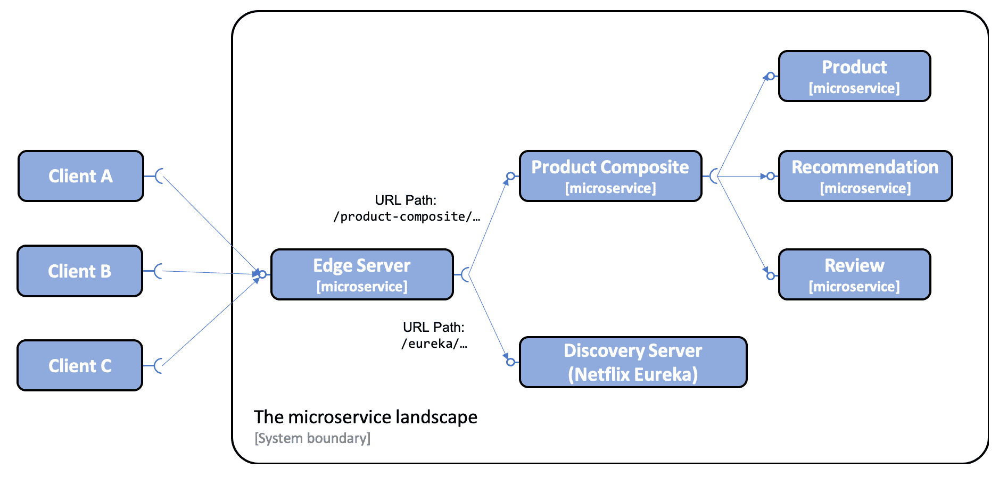
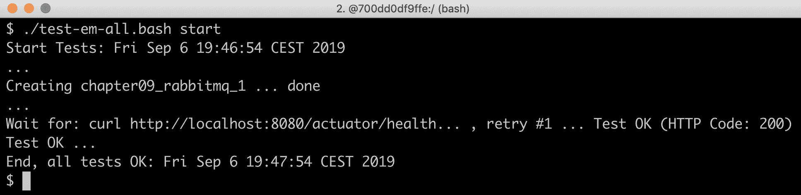
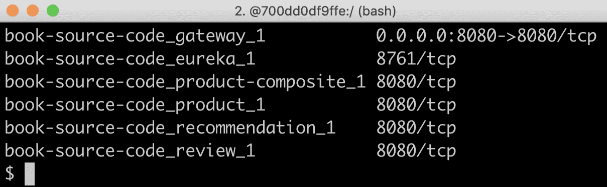
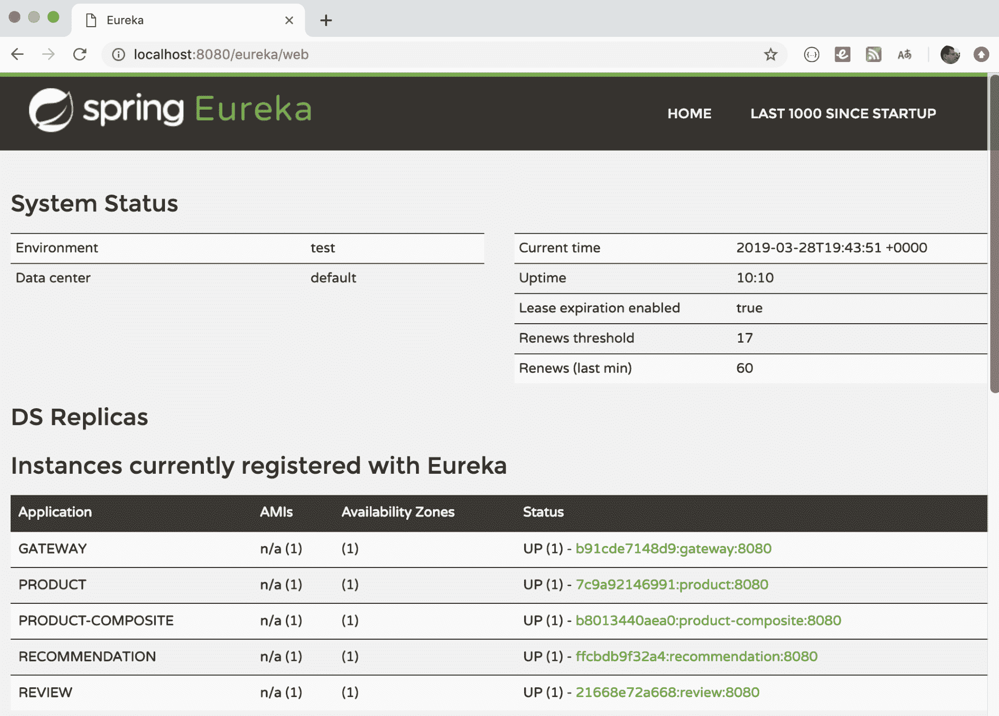

# 十、使用 SpringCloudGateway 在边缘服务器后面隐藏微服务

在本章中，我们将学习如何使用 Spring Cloud Gateway 作为边缘服务器，即控制从基于微服务的系统环境中公开哪些 API。我们将了解如何通过边缘服务器从外部访问具有公共 API 的微服务，而只有私有 API 的微服务可以从微服务环境的内部访问。在我们的系统环境中，这意味着产品组合服务和发现服务 Netflix Eureka 将通过边缘服务器公开。三大核心服务`product`、`recommendation`和`review`将被隐藏在外部。

本章将介绍以下主题：

*   将边缘服务器添加到我们的系统环境中
*   设置 Spring 云网关，包括配置路由规则
*   正在尝试边缘服务器

# 技术要求

本书中描述的所有命令都是使用 macOS Mojave 在 MacBook Pro 上运行的，但是为了在其他平台（如 Linux 或 Windows）上运行，应该可以直接修改这些命令。

本章中无需安装新工具。

本章的源代码可以在 GitHub 上找到：[https://github.com/PacktPublishing/Hands-On-Microservices-with-Spring-Boot-and-Spring-Cloud/tree/master/Chapter10](https://github.com/PacktPublishing/Hands-On-Microservices-with-Spring-Boot-and-Spring-Cloud/tree/master/Chapter10) 。

为了能够运行本书中描述的命令，请将源代码下载到一个文件夹，并设置一个指向该文件夹的环境变量`$BOOK_HOME`。以下是示例命令：

```java
export BOOK_HOME=~/Documents/Hands-On-Microservices-with-Spring-Boot-and-Spring-Cloud
git clone https://github.com/PacktPublishing/Hands-On-Microservices-with-Spring-Boot-and-Spring-Cloud $BOOK_HOME
cd $BOOK_HOME/Chapter10
```

Java 源代码是为 Java8 编写的，并在 Java12 上进行了测试。本章使用 Spring Cloud 2.1.0、SR1（也称为**格林威治**版本）、Spring Boot 2.1.3 和 Spring 5.1.5，这是编写本章时 Spring 组件的最新可用版本。

源代码包含以下 Gradle 项目：

*   `api`
*   `util`
*   `microservices/product-service`
*   `microservices/review-service`
*   `microservices/recommendation-service`
*   `microservices/product-composite-service`
*   `spring-cloud/eureka-server`
*   `spring-cloud/gateway`

本章中的代码示例均来自`$BOOK_HOME/Chapter10`中的源代码，但在某些情况下，经过编辑以删除源代码中不相关的部分，如注释、导入和日志语句。

如果您想查看[第 10 章](10.html)*中应用于源代码的更改，使用 Spring Cloud Gateway 将微服务隐藏在边缘服务器*后面，也就是说，查看将 Spring Cloud Gateway 作为边缘服务器添加到微服务场景中需要做些什么，您可以将其与[的源代码进行比较第 9 章](09.html)，*使用 Netflix Eureka 和 Ribbon*添加服务发现。您可以使用自己喜欢的`diff`工具，比较两个文件夹`$BOOK_HOME/Chapter09`和`$BOOK_HOME/Chapter10`。

# 将边缘服务器添加到我们的系统环境中

在本节中，我们将看到边缘服务器如何添加到系统环境中，以及它如何影响外部客户端访问微服务公开的公共 API 的方式。所有传入请求现在都将通过边缘服务器路由，如下图所示：



从上图中可以看出，外部客户端将其所有请求发送到边缘服务器。边缘服务器可以根据 URL 路径路由传入请求。例如，URL 以`/product-composite/`开头的请求被路由到**产品组合**微服务，URL 以`/eureka/`开头的请求被路由到基于 Netflix Eureka 的**发现服务器**。

在之前的[第 9 章](09.html)*中，我们使用 Netflix Eureka 和 Ribbon*添加了服务发现，我们对外公开了`product-composite`服务和发现服务 Netflix Eureka。当我们在本章中介绍边缘服务器时，情况将不再如此。这是通过删除 Docker Compose 文件中两个服务的以下端口声明来实现的：

```java
  product-composite:
    build: microservices/product-composite-service
    ports:
      - "8080:8080"

  eureka:
    build: spring-cloud/eureka-server
    ports:
      - "8761:8761"
```

将边缘服务添加到系统环境中后，我们将在下一节学习如何基于 Spring Cloud Gateway 设置边缘服务器。

# 设置 Spring 云网关

在本节中，我们将学习如何基于 SpringCloudGateway 设置边缘服务器。

将 Spring 云网关设置为边缘服务器非常简单，可以通过以下步骤完成：

1.  使用 Spring Initializer 创建 Spring Boot 项目，如[第 3 章](03.html)所述，*创建一组协作的微服务-*参考*使用 Spring Initializer 生成骨架代码*一节。
2.  将依赖项添加到`spring-cloud-starter-gateway`。
3.  为了能够通过 Netflix Eureka 找到微服务实例，还需要添加`spring-cloud-starter-netflix-eureka-client`依赖项。
4.  将边缘服务器添加到公共生成文件`settings.gradle`：

```java
include ':spring-cloud:gateway'
```

5.  添加一个 Dockerfile，其内容与我们的微服务相同。
6.  将边缘服务器添加到我们的三个 Docker Compose 文件中：

```java
gateway:
  environment:
    - SPRING_PROFILES_ACTIVE=docker
  build: spring-cloud/gateway
  mem_limit: 350m
  ports:
    - "8080:8080"
```

边缘服务器的端口`8080`暴露在 Docker 引擎外部。350 MB 的内存限制是为了确保本章和后续章节中的所有容器都能容纳我们分配给 Docker 引擎的 6 GB 内存

7.  添加路由规则等配置；在本章中，请参阅*配置 Spring 云网关*一节。
8.  由于边缘服务器将处理所有传入流量，因此我们将把复合运行状况检查从产品复合服务移动到边缘服务器。这在*增加复合健康检查*一节中有描述。

您可以在`$BOOK_HOME/Chapter10/spring-cloud/gateway`中找到 Spring 云网关的源代码。

# 添加复合健康检查

有了边缘服务器，外部运行状况检查请求也必须通过边缘服务器。因此，检查所有微服务状态的复合运行状况检查已从`product-composite`服务移动到边缘服务器。参见[第 7 章](07.html)、*开发反应式微服务—*关于复合健康检查的实现细节，请参见*添加健康 API*一节。

已将以下内容添加到边缘服务器：

1.  增加了`se.magnus.springcloud.gateway.HealthCheckConfiguration`类，声明健康指标：

```java
@Bean
ReactiveHealthIndicator healthcheckMicroservices() {

    ReactiveHealthIndicatorRegistry registry = 
        new DefaultReactiveHealthIndicatorRegistry
            (new LinkedHashMap<>());

    registry.register("product",() -> 
        getHealth("http://product"));
    registry.register("recommendation", () ->
        getHealth("http://recommendation"));
    registry.register("review", () ->
        getHealth("http://review"));
    registry.register("product-composite", () ->
        getHealth("http://product-composite"));

    return new CompositeReactiveHealthIndicator
        (healthAggregator, registry);
}

private Mono<Health> getHealth(String url) {
    url += "/actuator/health";
    LOG.debug("Will call the Health API on URL: {}", url);
    return getWebClient().get().uri(url)
        .retrieve().bodyToMono(String.class)
        .map(s -> new Health.Builder().up().build())
        .onErrorResume(ex -> 
            Mono.just(new Health.Builder().down(ex).build()))
        .log();
}
```

我们已将`product-composite`服务添加到复合健康检查中！

2.  主应用类`se.magnus.springcloud.gateway.GatewayApplication`声明了一个`WebClient.builder`bean，用于健康指示器的实现，如下所示：

```java
@Bean
@LoadBalanced
public WebClient.Builder loadBalancedWebClientBuilder() {
   final WebClient.Builder builder = WebClient.builder();
   return builder;
}
```

从前面的源代码中，我们可以看到，`WebClient.builder`用`@LoadBalanced`注释，这使得它知道在发现服务器 Netflix Eureka 中注册的微服务实例。详见[第 9 章](09.html)中*与 Netflix Eureka 在 SpringCloud 中的服务发现*一节*使用 Netflix Eureka 和 Ribbon 添加服务发现*。

在边缘服务器中安装了一个复合运行状况检查之后，我们准备好查看可以为 Spring 云网关设置的配置。

# 配置 Spring 云网关

在配置 Spring 云网关时，最重要的是设置路由规则。我们还需要在配置中设置一些其他内容：

1.  由于 Spring Cloud Gateway 将使用 Netflix Eureka 查找其将流量路由到的微服务，因此必须按照[第 9 章](09.html)中所述的方式将其配置为 Eureka 客户端，*使用 Netflix Eureka 和 Ribbon*添加服务发现-参见*Eureka 服务器*部分的客户端配置。

2.  按照[第 7 章](07.html)、*开发反应式微服务-*中的说明，配置弹簧启动执行器用于开发用途，参见*添加健康 API*部分：

```java
management.endpoint.health.show-details: "ALWAYS"
management.endpoints.web.exposure.include: "*"

```

3.  配置日志级别，以便我们可以看到 Spring Cloud Gateway 内部处理中感兴趣部分的日志消息，例如，它如何决定将传入请求路由到何处：

```java
logging:
  level:
    root: INFO
    org.springframework.cloud.gateway.route.RouteDefinitionRouteLocator: INFO
    org.springframework.cloud.gateway: TRACE
```

完整的源代码请参考配置文件：`src/main/resources/application.yml`。

# 路由规则

设置路由规则可以通过两种方式完成；通过编程、使用 JavaDSL 或通过配置。如果规则存储在外部存储器（如数据库）中，或者在运行时（例如通过 RESTful API 或发送到网关的消息）给出，则使用 Java DSL 以编程方式设置路由规则非常有用。在大多数情况下，我发现在配置文件`src/main/resources/application.yml`中声明路由很方便。

**路线**的定义如下：

1.  **谓词**，根据传入 HTTP 请求中的信息选择路由
2.  **过滤器**，可以修改请求和/或响应
3.  一个**目标 URI**，描述在何处发送请求
4.  一个**ID**，即路由的名称

有关可用谓词和筛选器的完整列表，请参阅参考文档：[https://cloud.spring.io/spring-cloud-gateway/single/spring-cloud-gateway.html](https://cloud.spring.io/spring-cloud-gateway/single/spring-cloud-gateway.html) 。

# 将请求路由到产品复合 API

例如，如果我们希望将 URL 路径以`/product-composite/`开头的传入请求路由到我们的`product-composite`服务，我们可以指定如下路由规则：

```java
spring.cloud.gateway.routes:
- id: product-composite
  uri: lb://product-composite
  predicates:
  - Path=/product-composite/**
```

以下是从上述代码中获得的一些要点：

*   `id: product-composite`：路线名称为`product-composite`。
*   `uri: lb://product-composite`：如果路由由其谓词选择，则请求将路由到发现服务中名为`product-composite`的服务，即 Netflix Eureka。`lb://`用于指示 Spring Cloud Gateway 使用客户端负载平衡器在发现服务中查找目的地。
*   `predicates:- Path=/product-composite/**`用于指定此路由应匹配的请求。`**`匹配路径中的零个或多个元素。

# 将请求路由到 Eureka 服务器的 API 和网页

Eureka 为其客户机公开了一个 API 和一个网页。为了在 Eureka 的 API 和网页之间提供清晰的分离，我们将设置如下路径：

*   发送到边缘服务器的路径以`/eureka/api/`开头的请求应作为对 Eureka API 的调用处理
*   发送到边缘服务器的路径以`/eureka/web/`开头的请求应作为对 Eureka 网页的调用进行处理。

API 请求将路由到`http://${app.eureka-server}:8761/eureka`。Eureka API 的路由规则如下所示：

```java
- id: eureka-api
  uri: http://${app.eureka-server}:8761
  predicates:
  - Path=/eureka/api/{segment}
  filters:
  - SetPath=/eureka/{segment}
```

`Path`值中的`{segment}`部分与路径中的零个或多个元素匹配，将用于替换`SetPath`值中的`{segment}`部分。

网页请求将被路由到`http://${app.eureka-server}:8761`。该网页将加载多个 web 资源，如`.js`、`.css`和`.png`文件。这些请求将被路由到`http://${app.eureka-server}:8761/eureka`。Eureka 网页的路由规则如下所示：

```java
- id: eureka-web-start
  uri: http://${app.eureka-server}:8761
  predicates:
  - Path=/eureka/web
  filters:
  - SetPath=/

- id: eureka-web-other
  uri: http://${app.eureka-server}:8761
  predicates:
  - Path=/eureka/**
```

从前面的配置中，我们可以注意以下几点：`${app.eureka-server}`属性由 Spring 的属性机制解析，具体取决于激活的 Spring 配置文件：

1.  例如，在不使用 Docker 的情况下在同一主机上运行服务时，出于调试目的，将使用`default`配置文件将属性转换为`localhost`
2.  当将服务作为 Docker 容器运行时，Netflix Eureka 服务器将在 DNS 名称为`eureka`的容器中运行。因此，该属性将使用`docker`配置文件转换为`eureka`。

`application.yml`文件中定义此翻译的相关部分如下所示：

```java
app.eureka-server: localhost
---
spring.profiles: docker
app.eureka-server: eureka
```

# 使用谓词和筛选器路由请求

为了进一步了解 SpringCloudGateway 中的路由功能，我们将尝试基于主机的路由；也就是说，SpringCloudGateway 使用传入请求的主机名来确定将请求路由到何处。我们将使用我最喜欢的网站之一测试 HTTP 代码：[http://httpstat.us/](http://httpstat.us/) 。

对`http://httpstat.us/${CODE}`的调用只返回带有`${CODE}`HTTP 代码的响应，以及包含 HTTP 代码和相应描述文本的响应正文。例如，请参见下面的`curl`命令：

```java
curl http://httpstat.us/200 -i
```

这将返回 HTTP 代码 200 和带有文本 200OK 的响应正文。

假设我们希望将呼叫路由到`http://${hostname}:8080/headerrouting`，如下所示：

*   对`i.feel.lucky`主机的调用应返回 200 OK。
*   对`im.a.teapot`主机的调用应返回`418 I'm a teapot`。
*   对所有其他主机名的调用应返回`501 Not Implemented`。

为了在 Spring Cloud Gateway 中实现这些路由规则，我们可以使用`Host`路由谓词选择具有特定主机名的请求，并使用`SetPath`过滤器在请求路径中设置所需的 HTTP 代码。这可以通过以下方式完成：

1.  要拨打`http://i.feel.lucky:8080/headerrouting`返回 200 OK，我们可以设置以下路线：

```java
- id: host_route_200
  uri: http://httpstat.us
  predicates:
  - Host=i.feel.lucky:8080
  - Path=/headerrouting/**
  filters:
  - SetPath=/200
```

2.  要拨打`http://im.a.teapot:8080/headerrouting`返回`418 I'm a teapot`，我们可以设置以下路线：

```java
- id: host_route_418
  uri: http://httpstat.us
  predicates:
  - Host=im.a.teapot:8080
  - Path=/headerrouting/**
  filters:
  - SetPath=/418
```

3.  最后，要调用所有其他主机名返回`501 Not Implemented`，我们可以设置以下路由：

```java
- id: host_route_501
  uri: http://httpstat.us
  predicates:
  - Path=/headerrouting/**
  filters:
  - SetPath=/501
```

好的，这是一个相当多的配置，所以现在让我们尝试一下！

# 正在尝试边缘服务器

要试用边缘服务器，我们将执行以下步骤：

1.  首先，使用以下命令构建 Docker 映像：

```java
cd $BOOK_HOME/Chapter10
./gradlew build && docker-compose build
```

2.  接下来，在 Docker 中启动系统景观，并使用以下命令运行常规测试：

```java
./test-em-all.bash start
```

预期输出与我们在前面章节中看到的类似：



利用包括边缘服务器在内的系统环境，让我们探讨以下主题：

*   检查 Docker 引擎中运行的系统环境之外的边缘服务器公开的内容
*   请尝试以下几种最常用的路由规则：
    *   使用基于 URL 的路由通过边缘服务器调用我们的 API。
    *   使用基于 URL 的路由通过边缘服务器调用 Netflix Eureka，使用其 API 和基于 web 的 UI。
    *   使用基于头的路由查看如何基于请求中的主机名路由请求。

# 检查 Docker 引擎外部暴露的内容

要了解边缘服务器向系统环境外部公开的内容，请执行以下步骤：

1.  使用`docker-compose ps`命令查看我们的服务公开了哪些端口：

```java
docker-compose ps gateway eureka product-composite product recommendation review
```

2.  正如我们在下面的输出中所看到的，只有边缘服务器（名为`gateway`）将其端口（`8080`）暴露在 Docker 引擎之外：



3.  如果我们想查看边缘服务器设置了哪些路由，我们可以使用`/actuator/gateway/routes`API。这个 API 的响应相当冗长。为了限制对我们感兴趣的信息的响应，我们可以应用`jq`过滤器。在下面的示例中，我选择了路由的`id`和路由中的第一个谓词：

```java
curl localhost:8080/actuator/gateway/routes -s | jq '.[] | {"\(.route_id)": "\(.route_definition.predicates[0].args._genkey_0)"}'
```

4.  此命令将响应以下命令：


这使我们能够很好地了解在边缘服务器中配置的实际路由。现在，让我们试试这些路线！

# 尝试路由规则

在本节中，我们将尝试边缘服务器及其暴露到系统外部的路由。让我们从调用产品复合 API 开始，然后调用 Eureka API 并访问其网页，最后测试基于主机名的路由。

# 通过边缘服务器调用产品复合 API

让我们执行以下步骤，通过边缘服务器调用产品复合 API，如下所示：

1.  为了能够查看边缘服务器中发生了什么，我们可以查看其日志输出：

```java
docker-compose logs -f --tail=0 gateway
```

2.  现在，通过边缘服务器调用 product composite API：

```java
curl http://localhost:8080/product-composite/2
```

3.  预期复合产品 API 的正常响应类型：


4.  我们应该能够在日志输出中找到以下有趣的信息：

```java
Pattern "/product-composite/**" matches against value "/product-composite/2"
Route matched: product-composite
LoadBalancerClientFilter url chosen: http://b8013440aea0:8080/product-composite/2
```

从日志输出中，我们可以看到基于我们在配置中指定的谓词的模式匹配，并且我们可以看到边缘服务器从本例中的 discovery server 中的可用实例中选择了哪个 microservice 实例，`http://b8013440aea0:8080/product-composite/2`。

# 通过边缘服务器调用 Eureka

要通过边缘服务器调用 Eureka，请执行以下步骤：

1.  首先，通过边缘服务器调用 Eureka API，查看发现服务器中当前注册了哪些实例：

```java
curl -H "accept:application/json" localhost:8080/eureka/api/apps -s | \ jq -r .applications.application[].instance[].instanceId
```

2.  期望得到以下方面的响应：


请注意，边缘服务器（名为`gateway`）也存在于响应中。

3.  接下来，使用 URL`http://localhost:8080/eureka/web`在 web 浏览器中打开 Eureka 网页：



从前面的屏幕截图中，我们可以看到 Eureka 网页报告与上一步中的 API 响应相同的可用实例。

# 基于主机头的路由

最后，让我们根据请求中使用的主机名测试路由设置！

通常，HTTP 客户端会在`Host`头中自动设置请求中的主机名。在本地测试边缘服务器时，主机名将为`localhost`——这在测试基于主机名的路由时不太有用。但是我们可以通过在 API 调用的`Host`头中指定另一个主机名来作弊。让我们看看如何做到这一点：

1.  要调用`i.feel.lucky`主机名，请使用以下代码：

```java
curl http://localhost:8080/headerrouting -H "Host: i.feel.lucky:8080"
```

2.  期望得到 200 OK 的响应。对于主机名`im.a.teapot`，使用以下命令：

```java
curl http://localhost:8080/headerrouting -H "Host: im.a.teapot:8080"
```

期待回应`418 I'm a teapot`。

3.  最后，如果没有指定任何`Host`头，则使用`localhost`作为`Host`头：

```java
curl http://localhost:8080/headerrouting
```

期待回应`501 Not Implemented`。

4.  如果我们将`i.feel.lucky`和`im.a.teapot`添加到本地`/etc/hosts`文件中，并指定将它们转换为与`localhost`相同的 IP 地址，即`127.0.0.1`，那么我们也可以在请求中使用`i.feel.lucky`和`im.a.teapot`作为真实主机名。运行以下命令，在`/etc/hosts`文件中添加一行所需信息：

```java
sudo bash -c "echo '127.0.0.1 i.feel.lucky im.a.teapot' >> /etc/hosts"
```

5.  我们现在可以基于主机名执行相同的路由，但不需要指定`Host`头。通过运行以下命令进行尝试：

```java
curl http://i.feel.lucky:8080/headerrouting
curl http://im.a.teapot:8080/headerrouting
```

预期与之前相同的响应，即 200 OK 和`418 I'm a teapot`。

6.  通过使用以下命令关闭系统环境来结束测试：

```java
docker-compose down
```

7.  另外，从我们为主机名`i.feel.lucky`和`im.a.teapot`添加的 DNS 名称翻译中清理`/etc/hosts`文件。编辑`/etc/hosts`文件并删除我们添加的行：`127.0.0.1 i.feel.lucky im.a.teapot`。

本章结束时，将对系统环境的边缘服务器中的路由功能进行这些测试。

# 总结

在本章中，我们已经了解了 SpringCloudGateway 如何被用作边缘服务器来控制允许从系统外部调用哪些服务。基于谓词、筛选器和目标 URI，我们可以非常灵活地定义路由规则。如果我们愿意，我们可以配置 SpringCloudGateway，使用 Netflix Eureka 等发现服务来查找目标微服务实例。

一个尚未回答的重要问题是，我们如何防止对边缘服务器公开的 API 进行未经授权的访问，以及如何防止第三方拦截流量。

在下一章中，我们将了解如何使用 HTTPS、OAuth 和 OpenID Connect 等标准安全机制来保护对边缘服务器的访问。

# 问题

1.  SpringCloudGateway 中用于构建路由规则的元素是什么？
2.  它们是用来干什么的？
3.  我们如何指示 SpringCloudGateway 通过 Netflix Eureka 等发现服务定位微服务实例？
4.  在 Docker 环境中，如何确保对 Docker 引擎的外部 HTTP 请求只能到达边缘服务器？
5.  我们如何更改路由规则，以便边缘服务器接受对`http://$HOST:$PORT/api/product`URL 上`product-composite`服务的调用，而不是当前使用的`http://$HOST:$PORT/product-composite`？