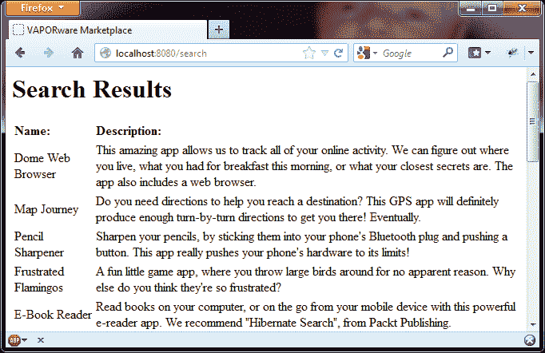
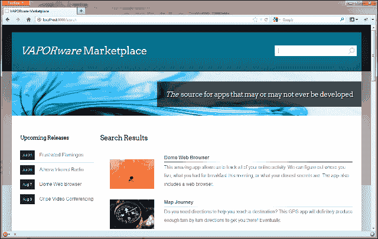

# 一、第一个应用

为了探索**Hibernate Search**的功能，我们将对经典的“Java 宠物商店”示例应用程序进行一次改进。我们的版本“VAPORware Marketplace”将是软件应用程序的在线目录。想想苹果、谷歌、微软、脸谱和……嗯，现在几乎所有其他公司都在经营这样的商店。

我们的应用程序市场将为我们提供大量以不同方式搜索数据的机会。当然，在大多数产品目录中都有标题和描述。然而，软件应用程序涉及一组扩展的数据点，如类型、版本和支持的设备。这些不同的方面将让我们看看 Hibernate 搜索提供的许多功能。

在高层次上，将 Hibernate 搜索合并到应用程序中需要以下三个步骤：

1.  向实体类添加信息，以便 Lucene 知道如何对它们进行索引。
2.  在应用程序的相关部分编写一个或多个搜索查询。
3.  设置项目，以便首先提供 Hibernate 搜索所需的依赖项和配置。

在未来的项目中，在我们对基本知识有了相当好的理解之后，我们可能会从第三个要点开始。然而，目前，让我们直接进入一些代码！

# 创建实体类

为了简单起见，我们的应用程序的第一部分将只包含一个实体类。这个`App`类描述了一个软件应用程序，是所有其他实体类都将与之关联的中心实体。但现在，我们将为“应用程序”提供三个基本数据点：

*   名字
*   要在市场站点上显示的图像
*   长篇大论

Java 代码为如下：

```java
package com.packtpub.hibernatesearch.domain;

import javax.persistence.Column;
import javax.persistence.Entity;
import javax.persistence.GeneratedValue;
import javax.persistence.Id;

@Entity
public class App {

 @Id
 @GeneratedValue
   private Long id;

 @Column
   private String name;

 @Column(length=1000)
   private String description;

 @Column
   private String image;

   public App() {}

   public App(String name, String image, String description) {
      this.name = name;
      this.image = image;
      this.description = description;
   }

   public Long getId() {
      return id;
   }
   public void setId(Long id) {
      this.id = id;
   }
   public String getName() {
      return name;
   }
   public void setName(String name) {
      this.name = name;
   }
   public String getDescription() {
      return description;
   }
   public void setDescription(String description) {
      this.description = description;
   }
   public String getImage() {
      return image;
   }
   public void setImage(String image) {
      this.image = image;
   }
}
```

这个类是一个基本的**普通旧 Java 对象**（**POJO**），只是用于处理它们的成员变量和 getter/setter 方法。但是，请注意高亮显示的注释。

### 注

如果您习惯于 Hibernate 3.x，请注意，版本 4.x 不支持 Hibernate 自己的许多映射注释，而支持它们的**Java 持久性 API**（**JPA】**2.0 对应项。我们将在[第 3 章](3.html "Chapter 3. Performing Queries")*执行查询*中进一步讨论 JPA。现在，只需注意这里的 JPA 注释基本上与它们的原生 Hibernate 对应项相同，而不是属于`javax.persistence`包。

类本身用`@Entity`注释，它告诉 Hibernate 将类映射到数据库表。由于我们没有显式指定表名，默认情况下 Hibernate 将为`App`类创建一个名为`APP`的表。

`id`字段同时标注了`@Id`和`@GeneratedValue`。前者只是告诉 Hibernate 该字段映射到数据库表的主键。后者声明在插入新行时应自动生成值。这就是为什么我们的构造函数方法没有为`id`填充一个值，因为我们指望 Hibernate 为我们处理它。

最后，我们用`@Column`注释三个数据点，告诉 Hibernate 这些变量与数据库表中的列相对应。通常，列的名称将与变量名相同，Hibernate 将在列长度、是否允许 null 值等方面采用一些合理的默认值。但是，可以通过将 description 的列长度设置为 1000 个字符来显式声明这些设置（正如我们在这里所做的）。

# 准备实体进行 Hibernate 搜索

既然 Hibernate 知道了我们的域对象，我们需要告诉 Hibernate 搜索插件如何使用**Lucene**管理它。

我们可以使用一些高级选项来充分利用 Lucene 的功能，随着该应用程序的开发，我们将这样做。然而，在基本场景中使用 Hibernate 搜索就像添加两个注释一样简单。

首先，我们将向类本身添加`@Indexed`注释：

```java
...
import org.hibernate.search.annotations.Indexed;
...
@Entity
@Indexed
public class App implements Serializable {
...
```

这只是声明 Lucene 应该为这个实体类构建并使用索引。此注释是可选的。编写大型应用程序时，其许多实体类可能与搜索无关。HibernateSearch 只需要告诉 Lucene 那些可以搜索的类型。

其次，我们将使用`@Field`注释声明可搜索的数据点：

```java
...
import org.hibernate.search.annotations.Field;
...
@Id
@GeneratedValue
private Long id;
@Column
@Field
private String name;

@Column(length=1000)
@Field
private String description;

@Column
private String image;
...
```

请注意，我们仅将此注释应用于`name`和`description`成员变量。我们没有对`image`进行注释，因为我们不关心按图像文件名搜索应用程序。我们同样没有注释`id`，因为您不需要强大的搜索引擎来通过主键查找数据库表行！

### 注

决定注释什么是一个判断调用。为索引注释的实体越多，注释为字段的成员变量越多，Lucene 索引就越丰富和强大。然而，如果我们仅仅因为可以而注释多余的东西，那么我们就会让 Lucene 做不必要的工作，这会影响性能。

在[第 7 章](7.html "Chapter 7. Advanced Performance Strategies")*高级性能策略*中，我们将更深入地探讨此类性能考虑因素。现在，我们都准备按名称或描述搜索应用程序。

# 加载测试数据

出于测试和演示的目的，我们将使用嵌入式数据库，每次启动应用程序时都应清除和刷新该数据库。对于 Java web 应用程序，在启动时调用代码的简单方法是使用`ServletContextListener`。我们只需创建一个实现该接口的类，并用`@WebListener`注释：

```java
package com.packtpub.hibernatesearch.util;

import javax.servlet.ServletContextEvent;
import javax.servlet.annotation.WebListener;
import org.hibernate.Session;
import org.hibernate.SessionFactory;
import org.hibernate.cfg.Configuration;
import org.hibernate.service.ServiceRegistry;
import org.hibernate.service.ServiceRegistryBuilder;
import com.packtpub.hibernatesearch.domain.App;

@WebListener
public class StartupDataLoader implements ServletContextListener {
   /** Wrapped by "openSession()" for thread-safety, and not meant to be accessed directly. */
   private static SessionFactorysessionFactory;

 /** Thread-safe helper method for creating Hibernate sessions. */
   public static synchronized Session openSession() {
      if(sessionFactory == null) {
         Configuration configuration = new Configuration();
         configuration.configure();
         ServiceRegistryserviceRegistry = new
           ServiceRegistryBuilder().applySettings(
              configuration.getProperties()).buildServiceRegistry();
         sessionFactory =
            configuration.buildSessionFactory(serviceRegistry);
      }
      return sessionFactory.openSession();
   }

   /** Code to run when the server starts up. */
   public void contextInitialized(ServletContextEvent event) {
      // TODO: Load some test data into the database
   }

   /** Code to run when the server shuts down. */
   public void contextDestroyed(ServletContextEvent event) {
      if(!sessionFactory.isClosed()) {
         sessionFactory.close();
      }
   }
}

```

服务器启动时，`contextInitialized`方法现在将自动调用。我们将使用此方法设置 Hibernate 会话工厂，并用一些测试数据填充数据库。当服务器关闭时，`contextDestroyed`方法同样会自动调用。完成后，我们将使用此方法显式关闭会话工厂。

我们应用程序中的多个地方需要一种简单且线程安全的方法来打开与数据库的连接（即 Hibernate`Session`对象）。因此，我们还添加了一个名为`openSession()`的`public static synchronized`方法。此方法充当线程安全的网关守卫，用于从单例`SessionFactory`创建会话。

### 注

在更复杂的应用程序中，您可能会使用依赖项注入框架，如 Spring 或 CDI。在我们的小示例应用程序中，这会有点分散注意力，但这些框架为您提供了一种安全的机制来注入`SessionFactory`或`Session`对象，而无需手动编码。

在充实`contextInitialized`方法时，我们首先获得一个 Hibernate 会话并开始一个新事务：

```java
...
Session session = openSession();
session.beginTransaction();
...
App app1 = new App("Test App One", "image.jpg",
 "Insert description here");
session.save(app1);

// Create and persist as many other App objects as you like…
session.getTransaction().commit();
session.close();
...

```

在事务内部，我们可以通过实例化和持久化`App`对象来创建我们想要的所有样本数据。为了可读性，这里只创建一个对象。然而，可下载的源代码可在[上获得 http://www.packtpub.com](http://www.packtpub.com) 包含各种各样的测试示例。

# 编写搜索查询代码

我们的 VAPORwareMarketplace web 应用程序将基于 Servlet 3.0 控制器/模型类，呈现 JSP/JSTL 视图。我们的目标是使事情变得简单，这样我们就可以专注于 Hibernate 搜索方面。在回顾了这个示例应用程序之后，在 JSF 或 SpringMVC 中，甚至在更新的基于 JVM 的框架（如 Play 或 Grails）中，应该很容易适应相同的逻辑。

首先，我们将编写一个简单的`index.html`页面，其中包含一个文本框，供用户输入搜索关键字：

```java
<html >
<head>
   <title>VAPORware Marketplace</title>
</head>
<body>
   <h1>Welcome to the VAPORware Marketplace</h1>
   Please enter keywords to search:
   <form action="search" method="post">
      <div id="search">
         <div>
         <input type="text" name="searchString" />
         <input type="submit" value="Search" />
         </div>
      </div>
   </form>
</body>
</html>
```

此表单收集 CGI 参数`searchString`中的一个或多个关键字，并将其发布到具有相对`/search`路径的 URL。我们现在需要注册一个控制器 servlet 来响应这些帖子：

```java
package com.packtpub.hibernatesearch.servlet;

import java.io.IOException;

import javax.servlet.ServletException;
import javax.servlet.annotation.WebServlet;
import javax.servlet.http.HttpServlet;
import javax.servlet.http.HttpServletRequest;
import javax.servlet.http.HttpServletResponse;

@WebServlet("search")
public class SearchServletextends HttpServlet {
   protected void doPost(HttpServletRequest request,
         HttpServletResponse response) throws ServletException,
         IOException {

      // TODO: Process the search, and place its results on
      // the "request" object

      // Pass the request object to the JSP/JSTL view
      // for rendering
 getServletContext().getRequestDispatcher(
 "/WEB-INF/pages/search.jsp").forward(request, response);
   }

   protected void doGet(HttpServletRequest request,
         HttpServletResponse response) throws ServletException,
         IOException {
      this.doPost(request, response);
   }

}
```

`@WebServlet`注释将这个 servlet 映射到相对 URL`/search`，这样发布到此 URL 的表单将调用`doPost`方法。此方法将处理搜索，并将请求转发到 JSP 视图进行呈现。

现在，我们进入执行搜索查询的真正核心。我们创建了一个`FullTextSession`对象，一个 Hibernate 搜索扩展，它用 Lucene 搜索功能包装了一个普通的`Session`。

```java
...
import org.hibernate.Session;
import org.hibernate.search.FullTextSession;
import org.hibernate.search.Search;
...
Session session = StartupDataLoader.openSession();
FullTextSessionfullTextSession =   
   Search.getFullTextSession(session);
fullTextSession.beginTransaction();
...
```

现在我们有了一个 Hibernate`Search`会话供我们使用，我们可以获取用户的关键字并执行 Lucene 搜索：

```java
...
import org.hibernate.search.query.dsl.QueryBuilder;
...
String searchString = request.getParameter("searchString");

QueryBuilderqueryBuilder =
fullTextSession.getSearchFactory()
   .buildQueryBuilder().forEntity( App.class ).get();
org.apache.lucene.search.QueryluceneQuery =
 queryBuilder
 .keyword()
 .onFields("name", "description")
 .matching(searchString)
   .createQuery();
...
```

顾名思义，`QueryBuilder`用于构建涉及特定实体类的查询。这里，我们为`App`实体实例化一个构建器。

请注意前面代码第三行的方法调用的长链。从 Java 的角度来看，我们正在调用一个方法，对返回的对象调用另一个方法，并重复该过程。但是，从通俗易懂的英语角度来看，此方法调用链类似于一个句子：

> **建立**查询**关键字**类型，在实体**字段**“名称”和“说明”**中，将**与“searchString”中的关键字进行匹配。

这种 API 风格是非常有意的。由于它本身类似于一种语言，因此被称为 Hibernate 搜索**DSL**（**领域特定语言**。如果您曾经在 Hibernate ORM 中使用过 criteria 查询，那么这里的外观应该对您非常熟悉。

我们现在已经创建了一个`org.apache.lucene.search.Query`对象，Hibernate 搜索将其在封面下转换为 Lucene 搜索。这种魔力是双向的！Lucene 搜索结果可以翻译成标准的`org.hibernate.Query`对象，与任何普通数据库查询一样使用：

```java
...
org.hibernate.Query hibernateQuery =
   fullTextSession.createFullTextQuery(luceneQuery, App.class);
List<App> apps = hibernateQuery.list();
request.setAttribute("apps", apps);
...
```

使用`hibernateQuery`对象，我们获取在搜索中找到的`App`实体的所有，并将它们粘贴到 servlet 请求上。如果您还记得，我们方法的最后一行将此请求转发到`search.jsp`视图以供显示。

这个 JSP 视图将从非常基本的开始，使用 JSTL 标记从请求中获取`App`结果并对其进行迭代：

```java
<%@ page language="java" contentType="text/html;
   charset=UTF-8" pageEncoding="UTF-8"%>
<%@ tagliburi="http://java.sun.com/jsp/jstl/core" prefix="c" %>
<html>
<head>
   <title>VAPORware Marketplace</title>
</head>
<body>
   <h1>Search Results</h1>
   <table>
   <tr>
      <td><b>Name:</b></td>
      <td><b>Description:</b></td>
   </tr>
 <c:forEachvar="app" items="${apps}">
   <tr>
      <td>${app.name}</td>
      <td>${app.description}</td>
   </tr>
   </c:forEach>
</table>
</body>
</html>
```

# 选择构建系统

到目前为止，我们以的顺序处理我们的应用程序，顺序有些相反。我们基本上跳过了最初的项目设置，直接进入代码，这样所有的管道在我们到达那里后都会变得更有意义。

好了，我们现在到了！我们需要将所有这些代码整合到一个有组织的项目结构中，确保其所有 JAR 文件依赖项都可用，并建立一个流程来运行 web 应用程序或将其打包为 WAR 文件。我们需要一个项目构建系统。

我们不会考虑的一个方法是用手来完成所有这些。对于一个使用裸体 Hibernate ORM 的小应用程序，我们可能只依赖于半打以上的 JAR 文件。在这种规模下，我们可以考虑在我们首选的 IDE 中设置标准项目（例如，Eclipse、NETBeaS 或 IntLyJ）。我们可以从 Hibernate 网站上获取一个二进制发行版，并手动复制必要的 JAR 文件，让 IDE 从中获取。

问题是 Hibernate 搜索有很多隐藏的东西。当您完成添加 Lucene 的依赖项甚至最小 Solr 组件时，依赖项列表将成倍增加。即使在第一章中，我们非常基本的 VAPORware Marketplace 应用程序已经需要三十多个 JAR 文件来编译和运行。这些库是高度相互依赖的，如果您升级其中一个库，避免冲突将是一场真正的噩梦。

在这个依赖关系管理级别上，使用自动构建系统来整理这些问题变得至关重要。在本书的代码示例中，我们将主要使用 ApacheMaven 实现构建自动化。

Maven 的两个主要特征是对基本构建的约定优先于配置的方法，以及用于管理项目 JAR 文件依赖关系的强大系统。只要项目符合标准结构，我们甚至不必告诉 Maven 如何编译它。这被视为样板信息。此外，当我们告诉 Maven 项目依赖于哪些库和版本时，Maven 将为我们找出整个依赖层次结构。它确定依赖项本身所依赖的库，等等。已为 Maven 创建了标准存储库格式（请参见[http://search.maven.org](http://search.maven.org) 用于最大的公共示例），这样就可以自动检索所有公共库，而无需查找它们。

Maven 确实有批评者。默认情况下，它的配置是基于 XML 的，这在最近几年已经过时了。更重要的是，当开发人员需要做样板基础以外的事情时，会有一个学习曲线。他或她必须了解可用的插件，Maven 构建的生命周期是如何工作的，以及如何为适当的生命周期阶段配置插件。许多开发人员在这种学习过程中都有过令人沮丧的经历。

最近还创建了其他几个构建系统，试图以更简单的形式利用与 Maven 相同的功能（例如，基于 Groovy 的 Gradle、基于 Scala 的 SBT、基于 Ruby 的 Builder 等等）。然而，需要注意的是，所有这些较新的系统仍然设计为从标准 Maven 存储库获取依赖项。如果您希望使用其他依赖项管理和构建系统，那么本书中的概念将直接应用到这些其他工具中。

为了展示一种更加手动的非 Maven 方法，可从 Packt Publishing 的网站下载的示例代码包括本章示例应用程序的基于 Ant 的版本。查找子目录`chapter1-ant`，对应于基于 Maven 的`chapter1`示例。此子目录根目录中的`README`文件突出显示了差异。然而，主要的收获是，本书中展示的概念应该可以相当容易地转化为任何现代 Java 应用程序构建系统。

# 设置项目并导入 Hibernate 搜索

我们可以使用我们选择的 IDE 创建一个 Maven 项目。Eclipse 通过一个可选的`m2e`插件与 Maven 一起工作，而 NetBeans 使用 Maven 作为其本机构建系统。如果系统上安装了 Maven，还可以选择从命令行创建项目：

```java
mvn archetype:generate -DgroupId=com.packpub.hibernatesearch.chapter1 -DartifactId=chapter1 -DarchetypeArtifactId=maven-archetype-webapp
```

无论哪种情况，都可以通过使用 Maven`archetype`来节省时间，它基本上是给定类型项目的模板。这里，`maven-archetype-webapp`为我们提供了一个空的 web 应用程序，配置为打包为 WAR 文件。`fieldsgroupId`和`artifactId`可以是我们想要的任何东西。如果我们将构建输出存储在 Maven 存储库中，它们将用于标识构建输出。

我们新创建的项目的`pom.xml`Maven 配置文件开始时看起来类似于以下内容：

```java
<?xml version="1.0"?>
<project xsi:schemaLocation="http://maven.apache.org/POM/4.0.0 
      http://maven.apache.org/xsd/maven-4.0.0.xsd"  

         xmlns:xsi="http://www.w3.org/2001/XMLSchema-instance">

   <modelVersion>4.0.0</modelVersion>
   <groupId>com.packpub.hibernatesearch.chapter1</groupId>
   <artifactId>chapter1</artifactId>
   <version>0.0.1-SNAPSHOT</version>
   <packaging>war</packaging>
   <name>chapter1</name>
   <url>http://maven.apache.org</url>

   <dependencies>
      <dependency>
         <groupId>junit</groupId>
         <artifactId>junit</artifactId>
         <version>3.8.1</version>
         <scope>test</scope>
      </dependency>
   </dependencies>

   <build>
 <!-- This controls the filename of the built WAR file -->
      <finalName>vaporware</finalName>
   </build>
</project>
```

我们的第一个任务是声明编译和运行需要哪些依赖项。在`<dependencies>`元素中，我们为 Hibernate 搜索添加一个条目：

```java
...
<dependency>
   <groupId>org.hibernate</groupId>
   <artifactId>hibernate-search</artifactId>
   <version>4.2.0.Final</version>
</dependency>
...
```

等等，我们之前不是说过这需要三十多个依赖项吗？是的，这是真的，但这并不意味着你必须处理所有这些问题！当 Maven 接触到一个存储库并获取这个依赖项时，它还将收到关于其所有依赖项的信息。Maven 沿着阶梯越走越深，在每一步中整理所有冲突，并计算依赖层次结构，这样您就不必这样做。

我们的应用程序需要一个数据库。为了简单起见，我们将使用 H2（[www.h2database.com](http://www.h2database.com)），这是一个可嵌入的数据库系统，可以放在一个 1MB JAR 文件中。我们还将使用**Apache Commons****数据库连接池**（[Commons.Apache.org/dbcp](http://commons.apache.org/dbcp)）来避免不必要地打开和关闭数据库连接。这些要求仅声明一个依赖项：

```java
...
<dependency>
  <groupId>com.h2database</groupId>
  <artifactId>h2</artifactId>
  <version>1.3.168</version>
</dependency>
<dependency>
  <groupId>commons-dbcp</groupId>
  <artifactId>commons-dbcp</artifactId>
  <version>1.4</version>
</dependency>
...
```

最后但并非最不重要的一点是，我们希望指定我们的 web 应用程序使用的是 JEE Servlet API 的 3.x 版本。在下面的依赖项中，我们将作用域指定为`provided`，告诉 Maven 不要将这个 JAR 捆绑到 WAR 文件中，因为我们希望我们的服务器无论如何都能使它可用：

```java
...
<dependency>
  <groupId>javax.servlet</groupId>
  <artifactId>javax.servlet-api</artifactId>
  <version>3.0.1</version>
  <scope>provided</scope>
</dependency>
...
```

POM 文件完成后，我们可以将先前创建的源文件复制到项目中。这三个 Java 类列在`src/main/java`子目录下。`src/main/webapp`子目录表示 web 应用程序的文档根目录。`index.html`搜索页面及其`search.jsp`结果显示在此处。下载并检查项目示例的结构。

# 运行应用程序

运行 Servlet 3.0 应用程序需要 Java 6 或更高版本、和兼容的 Servlet 容器，如 Tomcat 7。然而，如果您使用嵌入式数据库来简化测试和演示，那么为什么不也使用嵌入式应用服务器呢？

**Jetty web****服务器**（[www.eclipse.org/Jetty](http://www.eclipse.org/jetty)）为 Maven 和 Ant 提供了一个非常好的插件，让开发人员可以在不安装服务器的情况下从构建脚本启动应用程序。Jetty 8 或更高版本支持 Servlet 3.0 规范。

要将 Jetty 插件添加到 MavenPOM 中，请在`root`元素中插入一小块 XML：

```java
<project>
...
<build>
   <finalName>vaporware</finalName>
   <plugins>
      <plugin>
         <groupId>org.mortbay.jetty</groupId>
         <artifactId>jetty-maven-plugin</artifactId>
         <version>8.1.7.v20120910</version>
 <configuration>
 <webAppConfig>
 <defaultsDescriptor>
 ${basedir}/src/main/webapp/WEB-INF/webdefault.xml
 </defaultsDescriptor>
 </webAppConfig>
 </configuration>
      </plugin>
   </plugins>
</build>
</project>
```

突出显示的`<configuration>`元素是可选的。在大多数操作系统上，在 Maven 启动了嵌入式 Jetty 实例之后，您可以进行更改并看到它们立即生效，而无需重新启动。但是，由于 Microsoft Windows 如何处理文件锁定的问题，您无法在 Jetty 实例运行时始终保存更改。

因此，如果您正在使用 Windows，并且希望能够动态地进行更改，请创建您自己的`webdefault.xml`自定义副本，并将其保存到前面代码段中引用的位置。通过在解压工具中下载并打开一个`jetty-webapp`JAR 文件，或者从 Packt 发布网站下载这个示例应用程序，就可以找到这个文件。Windows 用户的诀窍是定位`useFileMappedBuffer`参数并将其值更改为`false`。

现在您有了一个 web 服务器，让它为我们创建和管理一个 H2 数据库。Jetty 插件启动时，会自动查找文件`src/main/webapp/WEB-INF/jetty-env.xml`。让我们创建此文件并用以下内容填充它：

```java
<?xml version="1.0"?>
<!DOCTYPE Configure PUBLIC "-//Mort Bay Consulting//DTD
   Configure//EN" "http://jetty.mortbay.org/configure.dtd">

<Configure class="org.eclipse.jetty.webapp.WebAppContext">
   <New id="vaporwareDB" class="org.eclipse.jetty.plus.jndi.Resource">
      <Arg></Arg>
      <Arg>jdbc/vaporwareDB</Arg>
      <Arg>
      <New class="org.apache.commons.dbcp.BasicDataSource">
         <Set name="driverClassName">org.h2.Driver</Set>
         <Set name="url">
 jdbc:h2:mem:vaporware;DB_CLOSE_DELAY=-1
         </Set>
      </New>
      </Arg>
   </New>
</Configure>
```

这导致 Jetty 生成一个 H2 数据库连接池，JDBCURL 在文件系统上指定内存中的数据库，而不是持久数据库。我们在 JNDI 中将该数据源注册为`jdbc/vaporwareDB`，因此我们的应用程序可以使用该名称访问它。我们在应用程序的`src/main/webapp/WEB-INF/web.xml`文件中添加了相应的引用：

```java
<!DOCTYPE web-app PUBLIC
      "-//Sun Microsystems, Inc.//DTD Web Application 2.3//EN"
      "http://java.sun.com/dtd/web-app_2_3.dtd" >
<web-app 
      xmlns:xsi="http://www.w3.org/2001/XMLSchema-instance"
      xsi:schemaLocation="http://java.sun.com/xml/ns/javaee   
      http://java.sun.com/xml/ns/javaee/web-app_3_0.xsd"      
      version="3.0">
   <display-name>VAPORware Marketplace</display-name>
   <resource-ref>
      <res-ref-name>jdbc/vaporwareDB</res-ref-name>
      <res-type>javax.sql.DataSource</res-type>
      <res-auth>Container</res-auth>
   </resource-ref>
</web-app>
```

最后，我们需要通过一个标准的`hibernate.cfg.xml`文件将该数据库资源绑定到 Hibernate，我们将在`src/main/resources`下创建该文件：

```java
<?xml version='1.0' encoding='utf-8'?>
<!DOCTYPE hibernate-configuration PUBLIC
      "-//Hibernate/Hibernate Configuration DTD 3.0//EN"
      "http://www.hibernate.org/dtd/hibernate-configuration-
      3.0.dtd">
<hibernate-configuration>
   <session-factory>
      <property name="connection.datasource">
         jdbc/vaporwareDB
      </property>
      <property name="hibernate.dialect">
         org.hibernate.dialect.H2Dialect
      </property>
      <property name="hibernate.hbm2ddl.auto">
         update
      </property>
      <property name="hibernate.show_sql">
         false
      </property>
      <property name=hibernate.search.default.directory_provider">
         filesystem
      </property>
      <property name="hibernate.search.default.indexBase">
         target/lucenceIndex
      </property>

      <mapping class=
              "com.packtpub.hibernatesearch.domain.App"/>
   </session-factory>
</hibernate-configuration>
```

突出显示的第一行将 Hibernate 会话工厂与 Jetty 管理的`jdbc/vaporwareDBdata`源相关联。最后突出显示的一行将`App`声明为与此会话工厂关联的实体类。现在我们只有这一个实体，但我们将在这里添加更多的`<class>`元素，因为更多的实体将在后面的章节中介绍。

在这两者之间，大多数的`<properties>`元素与核心设置相关，这些核心设置可能是经验丰富的 Hibernate 用户所熟悉的。但是，突出显示的属性指向 Hibernate 搜索附加组件。`hibernate.search.default.directory_provider`声明我们希望将 Lucene 索引存储在文件系统上，而不是存储在内存中。`hibernate.search.default.indexBase`指定索引的位置，在我们项目的子目录中，Maven 在构建过程中为我们清理索引。

好的，我们有一个应用程序、一个数据库和一个服务器将两者结合在一起。现在，我们可以实际部署和启动，通过运行 Maven，实现`jetty:run`目标：

```java
mvn clean jetty:run

```

`clean`目标删除以前构建的痕迹，然后 Maven 组装我们的 web 应用程序，因为`jetty:run`暗示了这一点。我们的代码被快速编译，Jetty 服务器在`localhost:8080`上启动：


我们是活的！我们现在可以使用我们喜欢的任何关键字搜索应用程序。快速提示：在可下载的示例代码中，所有测试数据记录的描述中都包含单词`app`：



可下载的示例代码美化了 HTML，以获得更专业的外观。它还将每个应用程序的图像与其名称和说明一起添加：



Maven 命令`mvn clean package`允许我们将应用程序打包为 WAR 文件，以便将其部署到 Maven Jetty 插件之外的独立服务器上。您可以使用与 Servlet 3.0 规范兼容的任何 Java 服务器（例如，Tomcat 7+），只要您知道如何使用 JNDI 名称`jdbc/vaporwareDB`设置数据源。

因此，您可以用您喜欢的任何独立数据库替换`H2`。只需将适当的 JDBC 驱动程序添加到 Maven 依赖项中，并更新`persistence.xml`中的设置即可。

# 总结

在本章中，我们了解了 Hibernate ORM、Hibernate 搜索插件和底层 Lucene 搜索引擎之间的关系。我们了解了如何映射实体和字段以使其可用于搜索。我们使用 HibernateSearchDSL 编写跨多个字段的全文搜索查询，并像处理普通数据库查询一样处理结果。我们使用一个自动化的构建过程来编译我们的应用程序，并将其部署到一个带有实时数据库的 web 服务器上。

仅使用这些工具，我们就可以使用任何其他服务器或数据库将 Hibernate 搜索立即整合到许多实际应用程序中。在下一章中，我们将深入探讨 Hibernate Search 为将实体对象映射到 Lucene 索引提供的选项。我们将了解如何处理扩展的数据模型，将我们的 VAPORware 应用程序与设备和客户评论相关联。