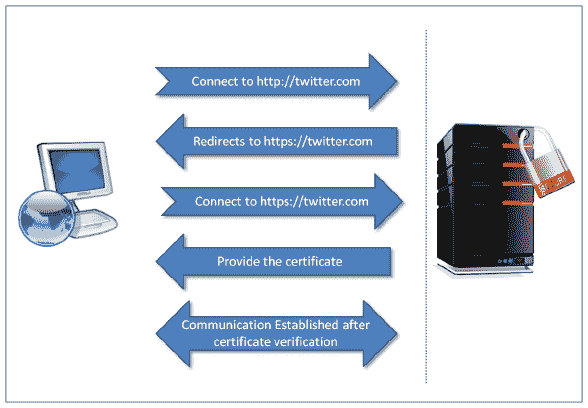
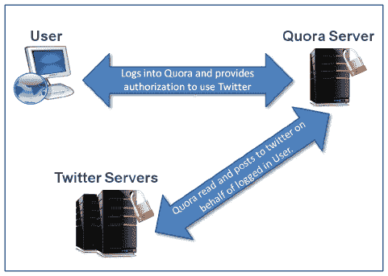
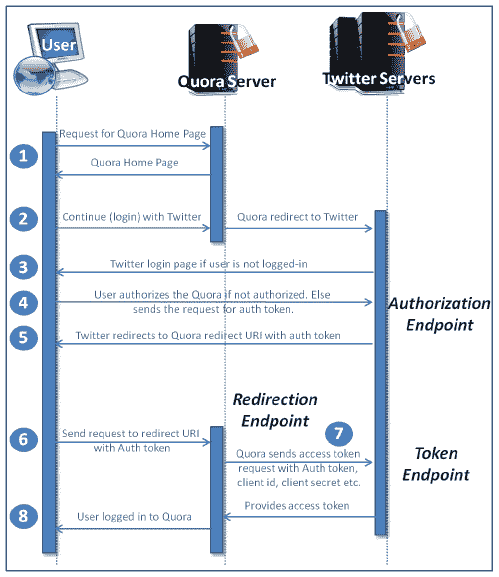
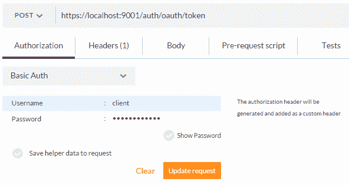
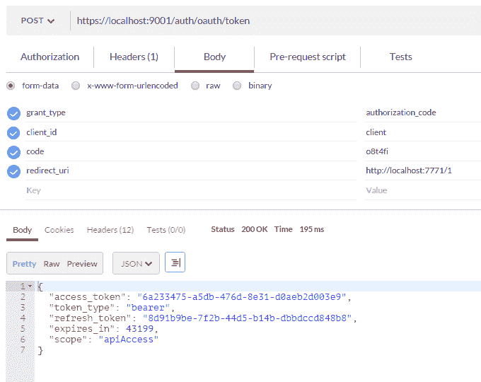

# 七、保护微服务

正如您所知，微服务是我们在内部部署或云基础设施中部署的组件。微服务可以提供 API 或 web 应用。我们的示例应用 OTRS 提供了 API。本章将重点介绍如何使用 SpringSecurity 和 SpringOAuth2 保护这些 API。我们还将关注 OAuth2.0 基础知识，使用 OAuth2.0 保护 OTRSAPI。有关保护 REST API 的更多信息，请参阅*RESTful Java Web 服务安全性，**Packt Publishing*一书。您也可以参考*Spring Security*、*Packt Publishing*视频了解更多关于 Spring Security 的信息。我们还将了解跨源请求站点筛选器和跨站点脚本阻止程序。

在本章中，我们将介绍以下主题：

*   启用安全套接字层（SSL）
*   认证和授权
*   OAuth2.0

# 启用安全套接字层

到目前为止，我们已经使用了**超文本传输协议**（**HTTP**。HTTP 以纯文本传输数据，但在 internet 上以纯文本传输数据根本不是一个好主意。它使黑客的工作变得简单，并允许他们使用数据包嗅探器轻松获取您的私人信息，如您的用户 ID、密码和信用卡详细信息。

我们绝对不想破坏用户数据，因此我们将提供最安全的方式来访问我们的 web 应用。因此，我们需要加密最终用户和应用之间交换的信息。我们将使用**安全套接字层****SSL**或**传输安全层****TSL**对数据进行加密。

SSL 是一种旨在为网络通信提供安全（加密）的协议。HTTP 与 SSL 联合提供 HTTP 的安全实现，称为**超文本传输协议安全**或**超文本传输协议 SSL**（**HTTPS**）。HTTPS 确保交换数据的隐私和完整性受到保护。它还确保访问的网站的真实性。这种安全性以托管应用的服务器、最终用户的计算机和第三方信任存储服务器之间的签名数字证书分发为中心。让我们看看这个过程是如何发生的：

1.  最终用户向 web 应用发送请求，例如[http://twitter.com](http://twitter.com) ，使用网络浏览器
2.  收到请求后，服务器将浏览器重定向到[https://twitter.com](https://twitter.com) 使用 HTTP 代码 302
3.  最终用户的浏览器连接到[https://twitter.com](https://twitter.com) 作为响应，服务器向最终用户的浏览器提供包含数字签名的证书
4.  最终用户的浏览器收到此证书，并将其与受信任的**证书颁发机构**（**CA**列表进行核对以进行验证
5.  一旦证书一直验证到根 CA，最终用户的浏览器和应用宿主服务器之间就会建立加密通信：



安全 HTTP 通信

尽管 SSL 在加密和 web 应用真实性方面确保了安全性，但它不能防止网络钓鱼和其他攻击。专业黑客可以解密使用 HTTPS 发送的信息。

现在，在介绍了 SSL 的基础知识之后，让我们为我们的示例 OTRS 项目实现它。我们不需要为所有的微服务实现 SSL。将使用我们的代理或边缘服务器访问所有微服务；Zuul 服务器由外部环境提供，除了我们新的微服务，安全服务，我们将在本章中介绍它用于身份验证和授权。

首先，我们将在边缘服务器中设置 SSL。我们需要有在嵌入式 Tomcat 中启用 SSL 所需的密钥库。我们将使用自签名证书进行演示。我们将使用 javakeytool 使用以下命令生成密钥库。您还可以使用任何其他工具：

```java
keytool -genkey -keyalg RSA -alias selfsigned -keystore keystore.jks -ext san=dns:localhost -storepass password -validity 365 -keysize 2048 
```

它要求提供诸如姓名、地址详细信息、组织等信息（请参见以下屏幕截图）：


keytool 生成关键点

请注意以下几点，以确保自签名证书的正常运行：

*   使用`-ext`定义**受试者备选名称**（**SANs**）。您也可以使用 IP（例如，`san=ip:190.19.0.11`）。早些时候，应用部署所在机器的主机名被用作大多数**通用名称**（**CN**。防止`java.security.cert.CertificateException`返回`No name matching localhost found`。
*   您可以使用浏览器或 OpenSSL 下载证书。使用`keytool -importcert`命令将新生成的证书添加到活动`JDK/JRE`主目录中`jre/lib/security/cacerts`的`cacerts`密钥库中。请注意，`changeit`是`cacerts`密钥库的默认密码。运行以下命令：

```java
keytool -importcert -file path/to/.crt -alias <cert alias> -  keystore <JRE/JAVA_HOME>/jre/lib/security/cacerts -storepass changeit 
```

自签名证书只能用于开发和测试目的。在生产环境中使用这些证书不会提供所需的安全性。始终在生产环境中使用由可信签名机构提供和签名的证书。安全地存储您的私钥。

现在，将生成的`keystore.jks`与`application.yml`一起放入 OTRS 项目的`src/main/resources`目录后，我们可以在边缘服务器`application.yml`中更新此信息，如下所示：

```java
server: 
    ssl: 
        key-store: classpath:keystore.jks 
        key-store-password: password 
        key-password: password 
    port: 8765 
```

重建 Zuul 服务器 JAR 以使用 HTTPS。

密钥库文件可以存储在 Tomcat 版本 7.0.66+和 8.0.28+中前面的类路径中。对于旧版本，您可以使用密钥库文件的路径作为`server:ssl:key-store`值。

类似地，您可以为其他微服务配置 SSL。

# 认证和授权

为 web 应用提供身份验证和授权是事实。我们将在本节中讨论身份验证和授权。在过去几年中发展起来的新范式是 OAuth。我们将学习并使用 OAuth2.0 实现。OAuth 是一种开放的授权机制，在每个主要的 web 应用中实现。Web 应用可以通过实现 OAuth 标准来访问彼此的数据。它已经成为各种 web 应用中最流行的身份验证方法。例如，在[上 https://www.quora.com/](https://www.quora.com/) ，您可以使用您的 Google 或 Twitter 登录 ID 进行注册和登录。它也更加用户友好，如客户端应用（例如，[）https://www.quora.com/](https://www.quora.com/) ）不需要存储用户的密码。最终用户不需要再记住一个用户 ID 和密码。



OAuth2.0 使用示例

# OAuth2.0

**互联网****工程任务组****IETF**管理 OAuth 的标准和规范。OAuth 1.0a 是 OAuth 2.0 之前的最新版本，它修复了 OAuth 1.0 中的会话固定安全漏洞。OAuth 1.0 和 1.0a 与 OAuth 2.0 非常不同。OAuth 1.0 依赖于安全证书和通道绑定，而 OAuth 2.0 不支持安全证书和通道绑定。它完全在**传输层安全**（**TLS**上工作。因此，OAuth2.0 不提供向后兼容性。

# OAuth 的使用

OAuth 的各种用途如下：

*   如前所述，它可以用于身份验证。您可能已经在各种应用中看到了它，显示消息，例如使用 Facebook 登录或使用 Twitter 登录。
*   应用可以使用它从其他应用读取数据，例如将 Facebook 小部件集成到应用中，或者在您的博客上提供 Twitter 提要。
*   或者，与前一点相反的是：您允许其他应用访问最终用户的数据。

# OAuth 2.0 规范-简明细节

我们将试图以简洁的方式讨论和理解 OAuth2.0 规范。首先让我们看看使用 Twitter 登录是如何工作的。

请注意，本文提到的流程在撰写本文时已使用，将来可能会发生变化。但是，此过程正确地描述了 OAuth 2.0 过程之一：

1.  用户访问 Quora 主页，其中显示各种登录选项。我们将探讨继续使用 Twitter 链接的过程。
2.  当用户单击 Continue with Twitter 链接时，Quora 会打开一个新窗口（在 Chrome 中），将用户重定向到[www.Twitter.com](http://www.twitter.com)应用。在此过程中，很少有 web 应用将用户重定向到同一打开的选项卡/窗口。
3.  在此新窗口/选项卡中，用户使用其凭据登录到[www.twitter.com](http://www.twitter.com)。
4.  如果用户尚未授权 Quora 应用使用其数据，Twitter 将请求用户授权 Quora 访问用户信息。如果用户已经授权 Quora，则跳过此步骤。
5.  在正确的身份验证之后，Twitter 使用身份验证代码将用户重定向到 Quora 的重定向 URI。
6.  当在浏览器中输入 Quora 重定向 URI 时，Quora 将客户端 ID、客户端秘密令牌和身份验证代码（在步骤 5 中由 Twitter 发送）发送到 Twitter。

7.  验证这些参数后，Twitter 将访问令牌发送给 Quora。
8.  用户在成功检索访问令牌后登录到 Quora。
9.  Quora 可以使用此访问令牌从 Twitter 检索用户信息。

您一定想知道 Twitter 是如何获得 Quora 的重定向 URI、客户端 ID 和秘密令牌的。Quora 用作客户端应用，Twitter 用作授权服务器。Quora 作为客户机，通过使用 Twitter 的 OAuth 实现在 Twitter 上注册，以使用资源所有者（最终用户）信息。Quora 在注册时提供重定向 URI。Twitter 向 Quora 提供客户端 ID 和秘密令牌。在 OAuth2.0 中，用户信息称为用户资源。Twitter 提供了一个资源服务器和一个授权服务器。我们将在以下部分中讨论更多这些 OAuth 术语。


OAuth 2.0 使用 Twitter 登录的示例过程

# OAuth2.0 角色

OAuth 2.0 规范中定义了四个角色：

*   资源所有者
*   资源服务器
*   客户
*   授权服务器


OAuth2.0 角色

# 资源所有者

对于使用 Twitter 的 Quora 登录示例，Twitter 用户是资源所有者。资源所有者是拥有要共享的受保护资源（例如，用户句柄、tweet 等）的实体。此实体可以是应用或个人。我们称这个实体为资源所有者，因为它只能授予对其资源的访问权。规范还定义，当资源所有者是个人时，他们被称为最终用户。

# 资源服务器

资源服务器承载受保护的资源。它应该能够使用访问令牌为这些资源的访问请求提供服务。对于使用 Twitter 的 Quora 登录示例，Twitter 是资源服务器。

# 客户

对于使用 Twitter 的 Quora 登录示例，Quora 是客户端。客户端是代表资源所有者向资源服务器发出受保护资源访问请求的应用。

# 授权服务器

只有在资源所有者对自己进行身份验证之后，授权服务器才会向客户端应用提供不同的令牌，例如访问令牌或刷新令牌。

OAuth 2.0 没有为资源服务器和授权服务器之间的交互提供任何规范。因此，授权服务器和资源服务器可以位于同一台服务器上，也可以位于单独的服务器上。

还可以使用单个授权服务器为多个资源服务器颁发访问令牌。

# OAuth2.0 客户端注册

与授权服务器通信以获取资源访问密钥的客户端应首先向授权服务器注册。OAuth2.0 规范没有指定客户端向授权服务器注册的方式。注册不需要客户端和授权服务器之间的直接通信。可以使用自行发布或第三方发布的断言来完成注册。授权服务器使用这些断言之一获取所需的客户端属性。让我们看看客户端属性是什么：

*   客户端类型（将在下一节中讨论）。
*   客户端重定向 URI，正如我们在使用 Twitter 的 Quora 登录示例中所讨论的。这是用于 OAuth 2.0 的端点之一。我们将在*端点*部分讨论其他端点。
*   授权服务器所需的任何其他信息，例如，客户端名称、描述、徽标图像、联系方式、法律条款和条件的接受情况等。

# 客户端类型

规范中描述了两种类型的客户端，基于它们维护客户端凭据机密性的能力：机密客户端和公共客户端。客户端凭据是授权服务器为与客户端通信而向客户端颁发的秘密令牌。客户机类型描述如下：

*   **机密客户端类型：**这是一个客户端应用，它可以安全地保存密码和其他凭据，或者秘密地维护它们。在使用 Twitter 的 Quora 登录示例中，Quora 应用服务器是安全的，并且具有受限访问实现。因此，它属于机密客户端类型。只有 Quora 应用管理员有权访问客户端凭据。
*   **公共客户端类型：**这些客户端应用*不*安全地保存密码和其他凭据，或者对它们进行保密。移动或桌面上的任何本机应用，或在浏览器上运行的应用，都是公共客户端类型的完美示例，因为它们将客户端凭据嵌入其中。黑客可以破解这些应用，并泄露客户端凭据。

客户端可以是基于组件的分布式应用，例如，它可以同时具有 web 浏览器组件和服务器端组件。在这种情况下，两个组件将具有不同的客户端类型和安全上下文。如果授权服务器不支持此类客户端，则此类客户端应将每个组件注册为单独的客户端。

# 客户端配置文件

基于 OAuth 2.0 客户端类型，客户端可以具有以下配置文件：

*   **Web 应用：**使用 Twitter 的 Quora 登录示例中使用的 Quora Web 应用是 OAuth 2.0 Web 应用客户端配置文件的完美示例。Quora 是运行在 web 服务器上的机密客户端。资源所有者（最终用户）使用其设备（台式机/平板电脑/手机）上的 HTML 用户界面在浏览器（用户代理）上访问 Quora 应用（OAuth 2.0 客户端）。资源所有者无法访问客户端（Quora OAuth 2.0 客户端）凭据和访问令牌，因为它们存储在 web 服务器上。您可以在 OAuth 2.0 示例流的图表中看到这种行为。请参见下图中的步骤 6 至步骤 8：


OAuth 2.0 客户端 web 应用配置文件

*   **基于用户代理的应用：**基于用户代理的应用为公共客户端类型。但在这里，应用驻留在 web 服务器中，但资源所有者在用户代理（例如，web 浏览器）上下载它，然后执行应用。这里，驻留在资源所有者设备上的用户代理中的下载应用与授权服务器通信。资源所有者可以访问客户端凭据和访问令牌。游戏应用就是这种应用配置文件的一个很好的例子。用户代理应用流程如下图所示：


OAuth 2.0 客户端用户代理应用配置文件

*   **本机应用：**本机应用与基于用户代理的应用类似，不同之处在于它们安装在资源所有者的设备上并以本机方式执行，而不是从 web 服务器下载然后在用户代理内执行。您在手机上下载的许多本机客户端（移动应用）都属于本机应用类型。在此，平台确保设备上的其他应用不会访问其他应用的凭据和访问令牌。此外，本机应用不应与与本机应用通信的服务器共享客户端凭据和 OAuth 令牌，如下图所示：


OAuth 2.0 客户端本机应用配置文件

# 客户端标识符

授权服务器负责为注册的客户端提供唯一标识符。此客户端标识符是注册客户端提供的信息的字符串表示形式。授权服务器需要确保此标识符是唯一的。授权服务器不应单独使用它进行身份验证。

OAuth 2.0 规范没有指定客户端标识符的大小。授权服务器可以设置大小，并且应该记录它发出的客户端标识符的大小。

# 客户端身份验证

授权服务器应根据客户端类型对客户端进行身份验证。授权服务器应确定适合并满足安全要求的身份验证方法。它应该在每个请求中只使用一种身份验证方法。

通常，授权服务器使用一组客户端凭据（如客户端密码和一些密钥令牌）对机密客户端进行身份验证。

授权服务器可以与公共客户端建立客户端认证方法。但是，出于安全原因，它不能依赖此身份验证方法来识别客户端。

拥有客户端密码的客户端可以使用基本 HTTP 身份验证。OAuth 2.0 不建议在请求正文中发送客户端凭据，但建议在身份验证所需的端点上使用 TLS 和暴力攻击保护。

# OAuth 2.0 协议端点

端点只不过是我们用于 REST 或 web 组件（如 Servlet 或 JSP）的 URI。OAuth2.0 定义了三种类型的端点。两个是授权服务器端点，一个是客户端端点：

*   授权端点（授权服务器端点）
*   令牌端点（授权服务器端点）
*   重定向端点（客户端端点）

# 授权端点

此端点负责验证资源所有者的身份，并在验证后获得授权。我们将在下一节讨论授权授予。

授权服务器需要授权端点的 TLS。端点 URI 不得包含片段组件。授权端点必须支持 HTTP`GET`方法。

本规范未规定以下内容：

*   授权服务器对客户端进行身份验证的方式。
*   客户端将如何接收授权端点 URI。通常，文档包含授权端点 URI，或者客户端在注册时获得该 URI。

# 令牌端点

客户端通过发送授权授予或刷新令牌来调用令牌端点以接收访问令牌。令牌端点由除隐式授权之外的所有授权授权使用。

与授权端点一样，令牌端点也需要 TLS。客户端必须使用 HTTP`POST`方法向令牌端点发出请求。

与授权端点一样，规范没有指定客户端将如何接收令牌端点 URI。

# 重定向端点

一旦资源所有者和授权服务器之间的授权端点交互完成，授权服务器将使用重定向端点将资源所有者的用户代理（例如，web 浏览器）重定向回客户端。客户端在注册时提供重定向端点。重定向端点必须是绝对 URI，并且不包含片段组件。OAuth 2.0 端点如下所示：



OAuth2.0 端点

# OAuth2.0 授权类型

客户端根据从资源所有者获得的授权，从授权服务器请求访问令牌。资源所有者以授权授予的形式给予授权。OAuth 2.0 定义了四种类型的授权：

*   授权码授予
*   隐性补助
*   资源所有者密码凭据授予
*   客户端凭据授予

OAuth2.0 还提供了一种扩展机制来定义额外的授权类型。您可以在官方的 OAuth 2.0 规范中对此进行探讨。

# 授权码授予

我们在 OAuth2.0 示例流中讨论的第一个使用 Twitter 登录的示例流描述了授权代码授予。我们将为整个流程添加更多步骤。正如您所知，在第八步之后，最终用户登录到 Quora 应用。假设用户是第一次登录 Quora 并请求其 Quora 配置文件页面：

1.  登录后，Quora 用户单击他们的 Quora 配置文件页面。
2.  OAuth 客户端 Quora 从 Twitter 资源服务器请求 Quora 用户（资源所有者）的资源（例如，Twitter 配置文件照片等），并发送在上一步中接收到的访问令牌。
3.  Twitter 资源服务器使用 Twitter 授权服务器验证访问令牌。
4.  成功验证访问令牌后，Twitter 资源服务器将请求的资源提供给 Quora（OAuth 客户端）。
5.  Quora 使用这些资源并显示最终用户的 Quora 配置文件页面。

**授权码请求与响应**

如果查看授权代码流的所有步骤（总共 13 个），如下图所示，您可以看到客户端向授权服务器发出的请求总共有两个，授权服务器提供两个响应：一个用于认证令牌的请求响应和一个用于访问令牌的请求响应。

让我们讨论每个请求和响应所使用的参数：


OAuth 2.0 授权代码授权流

对授权端点 URI 的授权请求（步骤 4）：

| **参数** | **必选**/**可选** | **说明** |
| `response_type` | 要求的 | 代码（必须使用此值）。 |
| `client_id` | 要求的 | 它表示授权服务器在注册时向客户端颁发的 ID。 |
| `redirect_uri` | 可选择的 | 它表示注册时客户端提供的重定向 URI。 |
| `scope` | 可选择的 | 请求的范围。如果未提供，则授权服务器根据定义的策略提供范围。 |
| `state` | 推荐 | 客户端使用此参数来维护请求和回调（来自授权服务器）之间的客户端状态。规范建议它能够防止跨站点请求伪造攻击。 |

授权响应（第五步）：

| **参数** | **必选**/**可选** | **说明** |
| `code` | 要求的 | 由授权服务器生成的代码（授权代码）。代码生成后应过期；建议的最大使用寿命为 10 分钟。客户端不能多次使用代码。如果客户端不止一次地使用它，那么请求必须被拒绝，并且之前基于代码发出的所有令牌都应该被撤销。代码绑定到客户端 ID 和重定向 URI。 |
| `state` | 要求的 | 它表示授权服务器在注册时向客户端颁发的 ID。 |

令牌端点 URI 的令牌请求（步骤七）：

| **参数** | **必选**/**可选** | **说明** |
| --- | --- | --- |
| `grant_type` | 要求的 | `authorization_code`（必须使用此值）。 |
| `code` | 要求的 | 从授权服务器接收的代码（授权代码）。 |
| `redirect_uri` | 要求的 | 如果授权码请求中包含此项且值应匹配，则为必填项。 |
| `client_id` | 要求的 | 它表示授权服务器在注册时向客户端颁发的 ID。 |

令牌响应（步骤 8）：

| **参数** | **必选**/**可选** | **说明** |
| `access_token` | 要求的 | 授权服务器颁发的访问令牌。 |
| `token_type` | 要求的 | 授权服务器定义的令牌类型。基于此，客户端可以利用访问令牌。例如，承载或 Mac。 |
| `refresh_token` | 可选择的 | 客户端可以使用此令牌使用相同的授权授予来获取新的访问令牌。 |
| `expires_in` | 推荐 | 表示访问令牌的生存期（以秒为单位）。值 600 表示访问令牌的生存时间为 10 分钟。如果响应中未提供此参数，则文档应突出显示访问令牌的生存期。 |
| `scope` | 可选/必需 | 如果与客户端请求的范围相同，则为可选。如果访问令牌作用域不同于客户端在其请求中提供的作用域，则需要通知客户端已授予的访问令牌的实际作用域。如果客户端在请求访问令牌时未提供作用域，则授权服务器应提供默认作用域，或拒绝请求，指示无效的作用域。 |

错误响应：

| **参数** | **必选**/**可选** | **说明** |
| `error` | 要求的 | 规范中定义的错误代码之一，例如，`unauthorized_client`或`invalid_scope`。 |
| `error_description` | 可选择的 | 错误的简短描述。 |
| `error_uri` | 可选择的 | 描述错误的错误页的 URI。 |

如果在客户端授权请求中传递了其他错误参数状态，则还会在错误响应中发送该状态。

# 隐性补助

隐式授权流中不涉及授权代码步骤。它为授权代码提供隐式授权。除了授权代码步骤外，如果将隐式授权流与授权代码授权流进行比较，则一切都是相同的。因此，它被称为隐式授权。让我们了解一下它的流程：

1.  客户端应用（例如，Quora）使用客户端 ID、重定向 URI 等将访问令牌请求发送到资源服务器（例如，Facebook、Twitter 等）。
2.  如果尚未进行身份验证，用户可能需要进行身份验证。成功进行身份验证和其他输入验证后，资源服务器将发送访问令牌。
3.  OAuth 客户端从资源服务器请求用户（资源所有者）的资源（例如，Twitter 配置文件照片等），并发送在上一步中接收到的访问令牌。
4.  资源服务器使用授权服务器验证访问令牌。
5.  成功验证访问令牌后，资源服务器将请求的资源提供给客户端应用（OAuth 客户端）。
6.  客户端应用使用这些资源。

**隐性授权请求和响应**

如果查看隐式授权流的所有步骤（总共六个），您可以看到客户端向授权服务器发出的请求总共有两个，授权服务器提供两个响应：一个用于访问令牌的请求响应和一个用于访问令牌验证的请求响应。

让我们讨论用于每个请求和响应的参数。

对授权端点 URI 的授权请求：

| **参数** | **必选**/**可选** | **说明** |
| `response_type` | 要求的 | 令牌（必须使用此值）。 |
| `client_id` | 要求的 | 它表示授权服务器在注册时向客户端颁发的 ID。 |
| `redirect_uri` | 可选择的 | 它表示注册时客户端提供的重定向 URI。 |
| `scope` | 可选择的 | 请求的范围。如果未提供，则授权服务器根据定义的策略提供范围。 |
| `state` | 推荐 | 客户端使用此参数维护请求和回调（来自授权服务器）之间的客户端状态。规范建议它能够防止跨站点请求伪造攻击。 |

访问令牌响应：

| **参数** | **必选**/**可选** | **说明** |
| --- | --- | --- |
| `access_token` | 要求的 | 授权服务器颁发的访问令牌。 |
| `token_type` | 要求的 | 授权服务器定义的令牌类型。基于此，客户端可以利用访问令牌。
例如，承载或 Mac。 |
| `refresh_token` | 可选择的 | 客户端可以使用此令牌使用相同的授权授予来获取新的访问令牌。 |
| `expires_in` | 推荐 | 表示访问令牌的生存期（以秒为单位）。值 600 表示访问令牌的生存时间为 10 分钟。如果响应中未提供此参数，则文档应突出显示访问令牌的生存期。 |
| `scope` | 可选/必需 | 如果与客户端请求的范围相同，则为可选。如果访问令牌作用域不同于客户端在请求中提供的作用域，则需要通知客户端已授予访问令牌的实际作用域。如果客户端在请求访问令牌时未提供作用域，则授权服务器应提供默认作用域，或拒绝请求，指示无效的作用域。 |
| `state` | 可选/需要 | 如果在客户端授权请求中传递了状态，则为必需。 |

错误响应：

| **参数** | **必选**/**可选** | **说明** |
| `error` | 要求的 | 规范中定义的错误代码之一，例如，`unauthorized_client`或`invalid_scope`。 |
| `error_description` | 可选择的 | 错误的简短描述。 |
| `error_uri` | 可选择的 | 描述错误的错误页的 URI。 |

如果在客户端授权请求中传递了其他错误参数状态，则还会在错误响应中发送该状态。

# 资源所有者密码凭据授予

此流程通常用于移动或台式机应用。在这个授权流中，只发出两个请求：一个用于请求访问令牌，另一个用于访问令牌验证，类似于隐式授权流。唯一的区别是资源所有者的用户名和密码与访问令牌请求一起发送。（在通常位于浏览器上的隐式授权中，会重定向用户进行自身身份验证。）让我们了解一下它的流程：

1.  客户端应用（例如，Quora）使用客户端 ID、资源所有者的用户名和密码等将访问令牌请求发送到资源服务器（例如，Facebook、Twitter 等）。参数验证成功后，资源服务器将发送访问令牌。
2.  OAuth 客户端从资源服务器请求用户（资源所有者）的资源（例如，Twitter 配置文件照片等），并发送在上一步中接收到的访问令牌。
3.  资源服务器使用授权服务器验证访问令牌。
4.  成功验证访问令牌后，资源服务器将请求的资源提供给客户端应用（OAuth 客户端）。
5.  客户端应用使用这些资源。

资源所有者的密码凭据授予请求和响应。

如前一节所示，在资源所有者密码凭据授予流的所有步骤（总共五个）中，您可以看到客户机向授权服务器发出的总共两个请求，授权服务器提供两个响应：一个是访问令牌的请求响应，另一个是资源所有者资源的请求响应。

让我们讨论用于每个请求和响应的参数。

对令牌终结点 URI 的访问令牌请求：

| **参数** | **必选**/**可选** | **说明** |
| `grant_type` | 要求的 | 密码（必须使用此值）。 |
| `username` | 要求的 | 资源所有者的用户名。 |
| `password` | 要求的 | 资源所有者的密码。 |
| `scope` | 可选择的 | 请求的范围。如果未提供，则授权服务器根据定义的策略提供范围。 |

访问令牌响应（第一步）：

| **参数** | **必选**/**可选** | **说明** |
| --- | --- | --- |
| `access_token` | 要求的 | 授权服务器颁发的访问令牌。 |
| `token_type` | 要求的 | 授权服务器定义的令牌类型。基于此，客户端可以利用访问令牌。
例如，承载或 Mac。 |
| `refresh_token` | 可选择的 | 客户端可以使用此令牌使用相同的授权授予来获取新的访问令牌。 |
| `expires_in` | 推荐 | 表示访问令牌的生存期（以秒为单位）。值 600 表示访问令牌的生存时间为 10 分钟。如果响应中未提供此参数，则文档应突出显示访问令牌的生存期。 |
| 可选参数 | 可选择的 | 附加参数。 |

# 客户端凭据授予

顾名思义，这里使用的是客户机的凭据，而不是用户（资源所有者）的凭据。除了客户端凭据之外，它与资源所有者密码凭据授予流非常相似：

1.  客户端应用（例如，Quora）向资源服务器（例如，Facebook、Twitter 等）发送访问令牌请求，请求的类型和范围为授权类型和范围。客户端 ID 和机密将添加到授权标头中。验证成功后，资源服务器将发送访问令牌。
2.  OAuth 客户端从资源服务器请求用户（资源所有者）的资源（例如，Twitter 配置文件照片等），并发送在上一步中接收到的访问令牌。
3.  资源服务器使用授权服务器验证访问令牌。
4.  成功验证访问令牌后，资源服务器将请求的资源提供给客户端应用（OAuth 客户端）。
5.  客户端应用使用这些资源。

客户端凭据授予请求和响应。

如果查看客户端凭据授予流的所有步骤（总共五个），您可以
看到客户端总共向授权服务器发出了两个请求，授权服务器提供两个响应：一个请求响应用于访问令牌，另一个请求响应用于涉及访问令牌验证的资源。

让我们讨论用于每个请求和响应的参数。

对令牌终结点 URI 的访问令牌请求：

| **参数** | **必选**/**可选** | **说明** |
| `grant_type` | 要求的 | `client_credentials`（必须使用此值）。 |
| `scope` | 可选择的 | 请求的范围。如果未提供，则授权服务器根据定义的策略提供范围。 |

访问令牌响应：

| **参数** | **必选**/**可选** | **说明** |
| `access_token` | 要求的 | 授权服务器颁发的访问令牌。 |
| `token_type` | 要求的 | 授权服务器定义的令牌类型。基于此，客户端可以利用访问令牌。例如，承载或 Mac。 |
| `expires_in` | 推荐 | 表示访问令牌的生存期（以秒为单位）。值 600 表示访问令牌的生存时间为 10 分钟。如果响应中未提供此参数，则文档应突出显示访问令牌的生存期。 |

# 使用 Spring 安全性实现 OAuth

OAuth2.0 是保护 API 的一种方法。springsecurity 提供 springcloudsecurity 和 springcloudoauth2 组件，用于实现我们前面讨论的授权流。

我们将再创建一个服务，一个安全服务，它将控制身份验证和授权。

创建一个新的 Maven 项目并遵循以下步骤：

1.  在`pom.xml`中添加 Spring Security 和 Spring Security OAuth 2 依赖项：

```java
 <dependency> 
   <groupId>org.springframework.cloud</groupId> 
   <artifactId>spring-cloud-starter-security</artifactId> 
</dependency> 
<dependency> 
   <groupId>org.springframework.cloud</groupId> 
   <artifactId>spring-cloud-starter-oauth2</artifactId> 
</dependency> 
```

2.  在应用类中使用`@EnableResourceServer`注释。这将允许此应用作为资源服务器工作。`@EnableAuthorizationServer`注释是我们将根据 OAuth 2.0 规范启用授权服务器的另一个注释：

```java
@SpringBootApplication 
@RestController 
@EnableResourceServer 
public class SecurityApp { 

    @RequestMapping("/user") 
    public Principal user(Principal user) { 
        return user; 
    } 

    public static void main(String[] args) { 
        SpringApplication.run(SecurityApp.class, args); 
    } 

    @Configuration 
    @EnableAuthorizationServer 
    protected static class OAuth2Config extends AuthorizationServerConfigurerAdapter { 

        @Autowired 
        private AuthenticationManager authenticationManager; 

        @Override 
        public void configure(AuthorizationServerEndpointsConfigurer endpointsConfigurer) throws Exception { 
            endpointsConfigurer.authenticationManager(authenticationManager); 
        } 

        @Override 
        public void configure(ClientDetailsServiceConfigurer clientDetailsServiceConfigurer) throws Exception { 
  // Using hardcoded inmemory mechanism because it is just an example 
            clientDetailsServiceConfigurer.inMemory() 
             .withClient("acme") 
             .secret("acmesecret") 
             .authorizedGrantTypes("authorization_code", "refresh_token", "implicit", "password", "client_credentials") 
             .scopes("webshop"); 
        } 
    } 
}
```

3.  更新`application.yml`中的安全服务配置，如下代码所示：

*   `server.contextPath`：表示上下文路径
*   `security.user.password`：本次演示将使用硬编码密码。您可以重新配置它以供实际使用：

```java
application.yml 
info: 
    component: 
        Security Server 

server: 
    port: 9001 
    ssl: 
        key-store: classpath:keystore.jks 
        key-store-password: password 
        key-password: password 
    contextPath: /auth 

security: 
    user: 
        password: password 

logging: 
    level: 
        org.springframework.security: DEBUG 
```

现在我们有了安全服务器，我们将使用新的`api-service`微服务公开我们的 API，它将用于与外部应用和 UI 通信。

我们将修改 Zuul 服务器模块，使其也成为一个资源服务器。这可以通过以下步骤完成：

1.  将 Spring Security 和 Spring Security OAuth 2 依赖项
    添加到`pom.xml`。这里，启用 Zuul 服务器作为资源服务器需要最后两个依赖项：

```java
<dependency> 
    <groupId>org.springframework.cloud</groupId> 
    <artifactId>spring-cloud-starter-zuul</artifactId> 
</dependency> 
<dependency> 
    <groupId>org.springframework.cloud</groupId> 
    <artifactId>spring-cloud-starter-eureka</artifactId> 
</dependency> 
<dependency> 
    <groupId>org.springframework.cloud</groupId> 
    <artifactId>spring-cloud-starter-feign</artifactId> 
</dependency> 
<dependency> 
    <groupId>org.springframework.cloud</groupId> 
    <artifactId>spring-cloud-netflix-hystrix-stream</artifactId> 
</dependency> 
<dependency> 
    <groupId>org.springframework.cloud</groupId> 
    <artifactId>spring-cloud-starter-bus-amqp</artifactId> 
</dependency> 
<dependency> 
    <groupId>org.springframework.cloud</groupId> 
    <artifactId>spring-cloud-starter-stream-rabbit</artifactId> 
</dependency> 
<dependency> 
    <groupId>org.springframework.boot</groupId> 
    <artifactId>spring-boot-starter-web</artifactId> 
</dependency> 
<dependency> 
    <groupId>org.springframework.cloud</groupId> 
    <artifactId>spring-cloud-starter-security</artifactId> 
</dependency> 
<dependency> 
    <groupId>org.springframework.cloud</groupId> 
    <artifactId>spring-cloud-starter-oauth2</artifactId>         </dependency>
```

2.  在应用类中使用`@EnableResourceServer`注释。这将允许此应用用作资源服务器：

```java
@SpringBootApplication 
@EnableZuulProxy 
@EnableEurekaClient 
@EnableCircuitBreaker 
@Configuration 
@EnableFeignClients 
@EnableResourceServer 
public class EdgeApp { 

    private static final Logger LOG = LoggerFactory.getLogger(EdgeApp.class); 

    static { 
        // for localhost testing only 
        LOG.warn("Will now disable hostname check in SSL, only to be used during development"); 
        HttpsURLConnection.setDefaultHostnameVerifier((hostname, sslSession) -> true); 
    } 

    @Value("${app.rabbitmq.host:localhost}") 
    String rabbitMqHost; 

    @Bean 
    public ConnectionFactory connectionFactory() { 
        LOG.info("Create RabbitMqCF for host: {}", rabbitMqHost); 
        CachingConnectionFactory connectionFactory = new CachingConnectionFactory(rabbitMqHost); 
        return connectionFactory; 
    } 

    public static void main(String[] args) { 
        SpringApplication.run(EdgeApp.class, args); 
    } 
} 
```

3.  更新`application.yml`中的 Zuul 服务器配置，如下代码所示。`application.yml`文件将如下所示：

```java
info: 
    component: Zuul Server 

spring: 
  application: 
     name: zuul-server  # Service registers under this name 
  # Added to fix -  java.lang.IllegalArgumentException: error at ::0 can't find referenced pointcut hystrixCommandAnnotationPointcut 
  aop: 
      auto: false 

zuul: 
    ignoredServices: "*" 
    routes: 
        restaurantapi: 
            path: /api/** 
            serviceId: api-service 
            stripPrefix: true 

server: 
    ssl: 
        key-store: classpath:keystore.jks 
        key-store-password: password 
        key-password: password 
    port: 8765 
    compression: 
        enabled: true 

security: 
  oauth2: 
    resource: 
     userInfoUri: https://localhost:9001/auth/user 

management: 
  security: 
    enabled: false 
## Other properties like Eureka, Logging and so on 
```

这里，`security.oauth2.resource.userInfoUri`属性表示安全服务用户 URI。API 使用指向 API 服务的路由配置向外部世界公开。

现在我们有了安全服务器，我们正在使用`api-service`微服务公开我们的 API，它将用于与外部应用和 UI 通信。

现在，让我们测试并探索它如何适用于不同的 OAuth 2.0 授权类型。

我们将使用 Chrome 浏览器的 Postman 扩展来测试不同的流。

# 授权码授予

我们将在浏览器中输入以下 URL。授权代码请求如下所示：

```java
https://localhost:9001/auth/oauth/authorize?response_type=code&client_id=client&redirect_uri=http://localhost:7771/1&scope=apiAccess&state=1234
```

这里，我们提供客户端 ID（默认情况下，我们在安全服务中注册了硬编码的客户端）、重定向 URI、作用域（安全服务中的硬编码`apiAccess`值）和状态。您一定想知道`state`参数。它包含我们重新验证以防止跨站点请求伪造的随机数。

如果资源所有者（用户）尚未通过身份验证，它将要求输入用户名和密码。提供用户名为`username`，密码为`password`；我们在安全服务中硬编码了这些值。

登录成功后，它将要求您提供（资源所有者）批准：


OAuth 2.0 授权代码授权-资源授权批准

选择“批准”，然后单击“授权”。此操作将把应用重定向到`http://localhost:7771/1?code=o8t4fi&state=1234`。

如您所见，它返回了授权代码和状态。

现在，我们将使用此代码检索访问代码，使用 Postman Chrome 扩展。首先，我们将使用用户名作为客户端，密码作为`clientsecret`添加授权头，如下面的屏幕截图所示：



OAuth 2.0 授权码授予-访问令牌请求-添加身份验证

这将使用值`Basic Y2xpZW50OmNsaWVudHNlY3JldA==`将授权标头添加到请求中，该值是“客户端机密”的 base-64 编码。

现在，我们将向请求中添加一些其他参数，如以下屏幕截图所示，然后提交请求：



OAuth 2.0 授权码授予-访问令牌请求和响应

根据 OAuth 2.0 规范，这将返回以下响应：

```java
{
  "access_token": "6a233475-a5db-476d-8e31-d0aeb2d003e9",
  "token_type": "bearer", 
  "refresh_token": "8d91b9be-7f2b-44d5-b14b-dbbdccd848b8", 
  "expires_in": 43199, 
  "scope": "apiAccess" 
} 
```

我们现在可以使用所有者拥有的资源来访问信息。例如，如果`https://localhost:8765/api/restaurant/1`代表 ID 为`1`的餐厅，则应返回相应的餐厅详细信息。

在没有访问令牌的情况下，如果我们输入 URL，则返回错误`Unauthorized`并显示消息`Full authentication is required to access this resource`。

现在，让我们使用访问令牌访问此 URL，如以下屏幕截图所示：


OAuth 2.0 授权码授予-使用 API 访问的访问令牌

如您所见，我们添加了带有访问令牌的授权头。

现在，我们将探讨隐式授权的实现。

# 隐性补助

隐式授权与授权代码授权非常相似，除了代码授权步骤。如果从授权代码授予中删除第一步代码授予步骤（客户端应用从授权服务器接收授权令牌），则其余步骤相同。我们来看看。

在浏览器中输入以下 URL 和参数，然后按 Enter 键。另外，如果询问，请确保添加基本身份验证，客户端为`username`，密码为`password`：

```java
https://localhost:9001/auth/oauth/authorize?response_type=token&redirect_uri=https://localhost:8765&scope=apiAccess&state=553344&client_id=client
```

这里，我们使用以下请求参数调用授权端点：响应类型、客户端 ID、重定向 URI、作用域和状态。

请求成功后，浏览器将被重定向到具有新请求参数和值的以下 URL：

```java
https://localhost:8765/#access_token=6a233475-a5db-476d-8e31-d0aeb2d003e9&token_type=bearer&state=553344&expires_in=19592
```

在这里，我们接收令牌的`access_token`、`token_type`、状态和到期期限。现在，我们可以使用这个访问令牌来访问 API，就像授权码授予中使用的那样。

# 资源所有者密码凭据授予

在本次授权中，我们在请求接入令牌时提供了`username`和`password`参数，以及`grant_type`、`client`和`scope`参数。我们还需要使用客户端 ID 和密码来验证请求。这些授权流使用客户端应用代替浏览器，通常用于移动和桌面应用。

在以下邮差工具屏幕截图中，已使用`client_id`和`password`的基本身份验证添加了授权标头：


OAuth 2.0 资源所有者密码凭据授予-访问令牌请求和响应

一旦客户端接收到访问令牌，它就可以以类似于授权码授予中使用它的方式使用。

# 客户端凭据授予

在此流中，客户端提供自己的凭据并检索访问令牌。它不使用资源所有者的凭据和权限。

正如您在下面的屏幕截图中所看到的，我们直接进入令牌端点，只有两个参数：`grant_type`和`scope`。使用`client_id`和`client secret`添加授权头：


OAuth 2.0 客户端凭据授予-访问令牌请求和响应

您可以使用访问令牌，其使用方式与授权码授予的说明类似。

# 工具书类

有关更多信息，您可以参考以下链接：

*   *RESTful Java Web 服务安全*、*RenéEnríquez、Andrés Salazar C*、*Packt Publishing*：[https://www.packtpub.com/application-development/restful-java-web-services-security](https://www.packtpub.com/application-development/restful-java-web-services-security)
*   *春季安全【视频】*、*包装出版*：[https://www.packtpub.com/application-development/spring-security-video](https://www.packtpub.com/application-development/spring-security-video)
*   OAuth 2.0 授权框架：[https://tools.ietf.org/html/rfc6749](https://tools.ietf.org/html/rfc6749)
*   春季安全：[http://projects.spring.io/spring-security](http://projects.spring.io/spring-security)
*   弹簧 OAuth2:[http://projects.spring.io/spring-security-oauth/](http://projects.spring.io/spring-security-oauth/)

# 总结

在本章中，我们了解了 TLS 层或 HTTPS 对于所有 web 流量的重要性。我们在示例应用中添加了自签名证书。我想重申，对于生产应用，您必须使用证书签署机构提供的证书。我们还探讨了 OAuth2.0 的基本原理和各种 OAuth2.0 赠款流。使用 Spring 安全性和 OAuth 2.0 实现了不同的 OAuth 2.0 授权流。在下一章中，我们将实现示例 OTRS 项目的 UI，并探索所有组件如何协同工作。