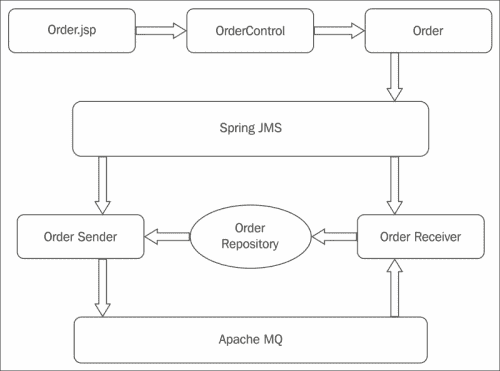
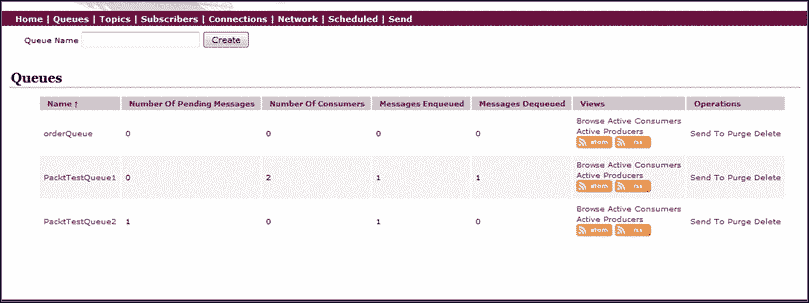
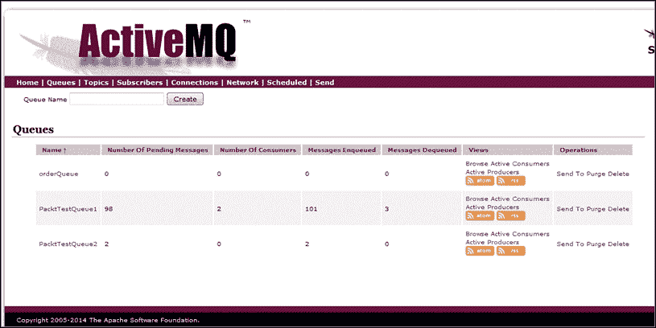
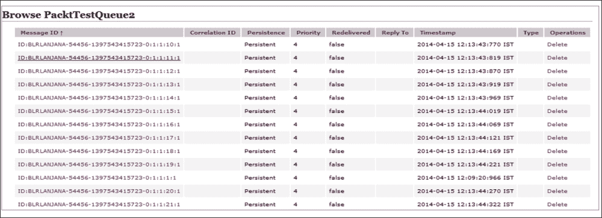
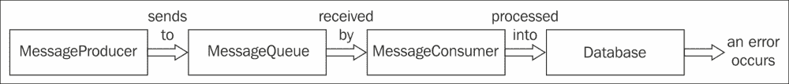

# 二、Spring JMS 消息传递

**Java 消息传递服务**（**JMS**是一种 API，用于在应用中的组件之间或应用之间进行通信。这些消息可以在应用和组件之间发送和接收。消息代理的行为就像中间人一样，创建、接收、读取和发送消息。消息使用者不需要始终可用才能接收消息。消息代理存储消息，并且可以在需要时读取消息。

架构师会选择 JMS 来实现松散耦合的设计。消息是异步的，它们一到达就被传递，并且没有为消息发送请求。它还可以防止冗余，并确保特定消息只传递一次。

# 消息类型

根据需要，有两种类型的消息传递域可供选择：

*   点对点消息：
    *   每个消息只有一个消费者
    *   没有时间依赖性
*   发布订阅消息：
    *   每个消息都有许多消费者
    *   消息具有时间依赖性—当应用向消息传递代理发送消息时，使用者需要订阅并处于活动状态才能接收消息

## 信息消费者

以下是使用 JMS API 提供的消息的方式：

*   消息侦听器
    *   它们提供了一个异步消息传递模型
    *   监听器类似于事件观察者/监听器；每当消息可用时，侦听器都会确保消息到达目的地
    *   侦听器将调用`onMessage()`方法
*   `receive()`方法
    *   它提供了一个同步消息`model()`
    *   通过从连接工厂显式调用`receive()`方法来使用消息

## 消息结构

消息由三部分组成：

*   **头**：包含目的地和时间戳信息，有`messageID`，由`send()`或`publish()`方法设置。
*   **属性**：可以为消息设置一些属性。
*   **正文**：消息正文可以是以下五种类型之一：
    *   `TextMessage`：用于将字符串对象作为消息发送
    *   `ObjectMessage`：用于将可序列化对象作为消息发送
    *   `MapMessage`：用于发送带有键值对的地图
    *   `BytesMessage`：用于发送消息中的字节
    *   `StreamMessage`：用于发送消息中的 I/O 流

## 消息驱动的 POJO 和侦听器

众所周知，**EnterpriseJavaBeans**（**EJB**）提供了一个消息驱动 bean，用于与 EJB 容器通信。与此类似，Spring 还提供了消息驱动的 POJO，它使用消息侦听器容器与消息中间件进行通信。

消息侦听器容器在消息驱动的 Pojo 和消息提供程序之间进行通信。它注册消息，并通过获取和释放消息资源来帮助处理事务和异常。

以下是 Spring JMS 包提供的消息侦听器容器列表：

*   **简单消息侦听器容器**：提供固定数量的 JMS 会话，不参与外部管理的事务。
*   **默认消息侦听器容器**：参与外部管理的事务，性能良好。此侦听器容器被广泛使用。
*   **服务器消息侦听器容器**：提供提供者驱动的运行时调优，提供消息会话池并参与事务。

## 开源消息传递工具

以下是开放源代码许可证下可用的一些开放源代码消息传递中间件：

*   玻璃鱼
*   apacheactivemq
*   乔拉姆
*   假定

# Apache ActiveMQ

ApacheActiveMQ 具有许多特性，使其成为消息传递的选择。最新版本是 5.10。使用 ActiveMQ 的优点如下：

*   它支持 RESTAPI
*   它支持 CXF Web 服务
*   它支持 AJAX 实现
*   它为 Spring 框架提供了完整的支持
*   它适用于所有主要的应用服务器，如 JBoss、Tomcat、Weblogic 和 Glassfish 服务器

## 为点对点消息传递设置 ApacheQ

以下是设置 ApacheMQ 的步骤：

1.  从[下载最新的`Apache ActiveMQ.zip`http://activemq.apache.org/download.html](http://activemq.apache.org/download.html) 。
2.  将 ZIP 文件解压缩到`E:\apachemq\`。
3.  在命令提示中，转到位置`E:\apachemq\apache-activemq-5.10-SNAPSHOT\bin\win32`，然后单击`apachemq.bat`启动 Apache ActiveMQ。
4.  ApacheActiveMQ 将在 Jetty 服务器上运行，因此可以通过 URL 访问。
5.  点击链接`http://localhost:8161/admin/index.jsp`。
6.  第一次这样做时，会要求您提供凭证；输入`admin/admin`。
7.  在控制台中，您将看到一个**欢迎**部分和一个**经纪人**部分。
8.  **代理**部分提供了有关 Apache message Broker 的以下信息：
    *   名称：`localhost`或服务器名称
    *   5.10 版快照
    *   ID:`ID:BLRLANJANA-55074-1397199950394-0:1`
    *   正常运行时间：1 小时 24 分钟
    *   使用的存储百分比：0
    *   使用的内存百分比：0
    *   使用的温度百分比：0
9.  点击**队列**。
10.  在**队列名称**字段中输入`orderQueue`，点击**创建**。

## 带Spring JmsTemplate 的 ApacheMq 用例

在上一章中，我们演示了使用 MongoDB 的订单管理。让我们考虑从一个应用中放置的命令需要被读取到不同的应用中并存储在不同的数据库中。

**订单管理消息代理**的设计如下：


让我们对**MessageBroker**使用相同的用例。请求来自控制器，当用户输入订单详细信息并点击**保存**时，在控制器中设置订单 bean，将请求发送给 JMS 发送方，即订单发送方。

订单发送方以映射的形式将消息发送到队列。接收方读取消息并将消息保存到 MongoDB 数据库中。接收器也可以是不同的应用；如果应用中配置了许多队列，那么应用只需要知道队列名称。

## Spring依赖性

使用与[第 1 章](01.html "Chapter 1. Spring Mongo Integration")、*Spring Mongo 集成*相同的源代码和`pom.xml`文件。使用 Spring JMS 依赖项更新`pom.xml`文件。在本章中，我们提供了 Spring4.0.3 版本，这是迄今为止最新的版本。以下是`Pom.xml`文件的代码：

```java
<project  xmlns:xsi="http://www.w3.org/2001/XMLSchema-instance"
  xsi:schemaLocation="http://maven.apache.org/POM/4.0.0 http://maven.apache.org/maven-v4_0_0.xsd">
  <modelVersion>4.0.0</modelVersion>
  <groupId>com.packt.web</groupId>
  <artifactId>Spring4JMS_Chapter2</artifactId>
  <packaging>war</packaging>
  <version>0.0.1-SNAPSHOT</version>
  <name>Spring4JMS_Chapter2</name>
  <url>http://maven.apache.org</url>
  <properties>
  <spring.version>4.0.3.RELEASE</spring.version>
  </properties>

  <dependencies>

  <!-- Spring JMS dependencies -->
    <dependency>
    <groupId>org.springframework</groupId>
    <artifactId>spring-jms</artifactId>
    <version>${spring.version}</version>
    <scope>runtime</scope>
    </dependency>

    <dependency>
    <groupId>org.apache.activemq</groupId>
    <artifactId>activemq-core</artifactId>
    <version>5.3.1</version>
    <scope>runtime</scope>
    </dependency>
    <dependency>
    <groupId>org.apache.xbean</groupId>
    <artifactId>xbean-spring</artifactId>
    <version>3.5</version>
    <scope>runtime</scope>
    </dependency>
    <dependency>
    <groupId>org.apache.geronimo.specs</groupId>
    <artifactId>geronimo-jms_1.1_spec</artifactId>
    <version>1.1.1</version>
    <scope>runtime</scope>
    </dependency> 
  </dependencies>
  <build>
    <finalName>Spring4JMS_Chapter2</finalName>
  </build>
</project>
```

# 使用 SpringJMS 和 ActiveMQ 实现订单管理消息传递系统

在前面关于 ApacheActiveMQ 的部分中，我们讨论了创建消息队列和创建订单队列所需的步骤。现在，让我们从应用向队列发送消息。

下表描述了与 JMS 集成的应用组件。

请求从 JSP 流到 Spring 控制器，Spring 控制器设置 order bean 对象并发送它`orderSender`（这是一个 JMS 消息发送者类）。该类将 order 对象放入队列中。

JMS 接收方是从队列读取的类。读取对象被发送到`OrderRepository`类，该类是 Mongo Repository 类，并将消息发布到 MongoDB 数据库。



下表概述了使用 Spring MVC 应用与 JMS 通信时使用的类：

<colgroup><col style="text-align: left"> <col style="text-align: left"> <col style="text-align: left"> <col style="text-align: left"> <col style="text-align: left"> <col style="text-align: left"></colgroup> 
| 

JSP

 | 

控制器

 | 

豆

 | 

JMS 发送方

 | 

JMS 接收器

 | 

蒙哥罗普托里

 |
| --- | --- | --- | --- | --- | --- |
| `order.jsp``allorders.jsp` | `Order Controller.java` | `Order.java` | `OrderSender` | `OrderReceiver` | `OrderRepository` |

## 配置 dispatcherservlet.xml 使用 JMS

您可以看到我们在 XML 文件中配置了以下内容：

*   `connectionFactory`：创建`jmsconnection`对象。此`jmsconnection`对象连接到**面向消息的中间件**（**MOM**），即 Apache ActiveMQ。`jmsconnection`对象提供一个 JMS 会话对象，应用使用该对象与 ApacheActiveMQ 进行交互。代理 URL 提供有关主机和 message broker 接口正在侦听的端口的信息。
*   `destination`：应用需要与之通信的队列的名称。

    ```java
    <bean id="destination" class="org.apache.activemq.command.ActiveMQQueue">
      <constructor-arg value="orderQueue"/>
    </bean>
    ```

*   `jmstemplate`：以目的地和`connectionFactory`bean 作为参数。

    ```java
      <bean id="jmsTemplate" class="org.springframework.jms.core.JmsTemplate">
        <property name="connectionFactory" ref="connectionFactory" />
        <property name="defaultDestination" ref="destination" />
      </bean>
    ```

*   `orderSender`：这个类使用`jms`模板向队列发送消息。

    ```java
    <bean id="orderSender" class="com.packt.jms.OrderSender" />
    ```

*   `orderReceiver`：此类从队列中读取消息。它具有`connectionFactory`，因此可以连接到 JMS 提供程序以读取消息。

    ```java
    <bean id="orderReceiver" class="com.packt.jms.OrderReceiver" />

    <jms:listener-container  connection-factory="connectionFactory">
    <jms:listener destination="orderQueue" ref="orderReceiver" method="orderReceived" />
    </jms:listener-container>
    ```

以下是`dispacherservlet.xml`的完整配置。我们将观察到配置文件已更新为`activemq`配置。

**dispatcherservlet.xml**

```java
<?xml version="1.0" encoding="UTF-8"?>
<beans 
  xmlns:xsi="http://www.w3.org/2001/XMLSchema-instance"
  xmlns:context="http://www.springframework.org/schema/context"
  xmlns:mongo="http://www.springframework.org/schema/data/mongo"
  xmlns:p="http://www.springframework.org/schema/p"
  xmlns:jms="http://www.springframework.org/schema/jms"
  xsi:schemaLocation="http://www.springframework.org/schema/beans 
  http://www.springframework.org/schema/beans/spring-beans-3.2.xsd 
  http://www.springframework.org/schema/data/mongo
  http://www.springframework.org/schema/data/mongo/spring-mongo-1.0.xsd

  http://www.springframework.org/schema/context 
  http://www.springframework.org/schema/context/spring-context-3.2.xsd 
  http://www.springframework.org/schema/jms 
  http://www.springframework.org/schema/jms/spring-jms.xsd
  http://activemq.apache.org/schema/core 
  http://activemq.apache.org/schema/core/activemq-core.xsd">
  <context:component-scan base-package="com.packt" />
    <!-- JMS Active MQQueue configuration -->
    <bean id="connectionFactory" class="org.apache.activemq.ActiveMQConnectionFactory">
    <property name="brokerURL">
      <value>tcp://localhost:61616</value>
    </property>
    </bean>

    <bean id="destination" class="org.apache.activemq.command.ActiveMQQueue">
    <constructor-arg value="orderQueue"/>
    </bean>

    <bean id="jmsTemplate" class="org.springframework.jms.core.JmsTemplate">
    <property name="connectionFactory" ref="connectionFactory" />
    <property name="defaultDestination" ref="destination" />
    </bean>
  <bean id="orderSender" class="com.packt.jms.OrderSender" />
  <bean id="orderReceiver" class="com.packt.jms.OrderReceiver" />
  <jms:listener-container  connection-factory="connectionFactory">
  <jms:listener destination="orderQueue" ref="orderReceiver" method="orderReceived" />
  </jms:listener-container>

  <!-- Factory bean that creates the Mongo instance -->
  <bean id="mongo" class="org.springframework.data.mongodb.core.MongoFactoryBean">
    <property name="host" value="localhost" />
  </bean>
  <mongo:mongo host="127.0.0.1" port="27017" />
  <mongo:db-factory dbname="eshopdb" />

  <bean id="mongoTemplate" class="org.springframework.data.mongodb.core.MongoTemplate">
    <constructor-arg name="mongoDbFactory" ref="mongoDbFactory" />
  </bean>
  <!-- Use this post processor to translate any MongoExceptions thrown in @Repository annotated classes -->
  <bean class="org.springframework.dao.annotation.PersistenceExceptionTranslationPostProcessor" />

    <bean id="jspViewResolver" class="org.springframework.web.servlet.view.InternalResourceViewResolver"
      p:prefix="/WEB-INF/myviews/"
      p:suffix=".jsp" /> 
</beans>
```

**Order.java**

```java
package com.packt.bean;
import org.springframework.data.annotation.Id;
import org.springframework.data.mongodb.core.mapping.Document;

@Document
public class Order {
  private String order_id;
  private Customer customer;
  private Product product;
  private String date;
  private String order_status;
  private int quantity;

  public Order() {
    super();
    // TODO Auto-generated constructor stub
  }

  @Id
  public String getOrder_id() {
    return order_id;
  }
  public void setOrder_id(String order_id) {
    this.order_id = order_id;
  }

  public String getDate() {
    return date;
  }
  public void setDate(String date) {
    this.date = date;
  }
  public int getQuantity() {
    return quantity;
  }
  public void setQuantity(int quantity) {
    this.quantity = quantity;
  }
  public String getOrder_status() {
    return order_status;
  }
  public void setOrder_status(String order_status) {
    this.order_status = order_status;
  }

  public Customer getCustomer() {
    return customer;
  }
  public void setCustomer(Customer customer) {
    this.customer = customer;
  }
  public Product getProduct() {
    return product;
  }
  public void setProduct(Product product) {
    this.product = product;
  }
}
```

`OrderController`类调用发送方将订单发送到 MessageBroker 队列。控制器使用 MongoDB 执行一些基本的 CRUD 操作。以下代码仅演示了`Create`操作。

当`/order/save`被调用时，控制器向`orderSender`发送订单对象，该对象将订单明细保存在队列中。

**OrderCOntroller.java**

```java
Order details is saved with JMS.The Order Object is passed to orderSender, which will store the order details in the queue.
@RequestMapping(value = "/order/save", method = RequestMethod.POST)
  // request insert order recordhrecord
  public String addorder(@ModelAttribute("Order") Order order,Map<String, Object> model) {
    orderSender.sendOrder(order);
    model.put("customerList", customerList);
    model.put("productList", productList);
    return "order";
  }
```

让我们看看 JMS 发送方和接收方类。这两个类都使用 SpringJMS 模板来接收和发送消息。`org.springframework.jms.core.MessageCreator`类创建要放置在队列中的消息。

以下是`orderSender`的代码，它获取需要传递到队列的对象。`JMSTemplate`准备消息格式，以便队列可以接受。

**订单发送方**

```java
package com.packt.jms;

import javax.jms.JMSException;
import javax.jms.MapMessage;
import javax.jms.Message;
import javax.jms.Session;
import org.springframework.beans.factory.annotation.Autowired;
import org.springframework.jms.core.JmsTemplate;
import org.springframework.jms.core.MessageCreator;
import com.packt.bean.Order;

public class OrderSender {

  @Autowired
  private JmsTemplate jmsTemplate;
  public void sendOrder(final Order order){
    jmsTemplate.send(
    new MessageCreator() {
      public Message createMessage(Session session) throws JMSException {
        MapMessage mapMessage = session.createMapMessage();
        mapMessage.setInt("quantity", order.getQuantity());
        mapMessage.setString("customerId", order.getCustomer().getCust_id());
        mapMessage.setString("productId", order.getProduct().getProdid());
        return mapMessage;

      }
    }
    );
    System.out.println("Order: "+ order);
  }
}
```

以下是添加订单案例时的屏幕截图：


# 在 ApacheQ 中处理多个队列

在前面的部分中，我们演示了使用映射消息到订单队列发送消息。现在，我们可以了解如何在 ApacheQ 中处理多个队列：

1.  启动 Apache ActiveMQ 服务器，在控制台中单击**队列**并创建两个队列。
2.  Let us create two queues and name the queues as follows:
    *   `PacktTestQueue1`
    *   `PacktTestQueue2`

    

3.  创建一个与本章第一个示例具有相同依赖关系的新 Spring 项目。
4.  创建一个实现`MessageListener`接口的`PacktMessageListener`类。该类重写了`onMessage(Message message)`方法。
5.  Spring 的`DefaultMessageListener`使用队列中的消息并调用`onMessage(Message message)`方法。

    ```java
    PacktMessageListener:
    package com.packt.jms;

    import javax.jms.JMSException;
    import javax.jms.Message;
    import javax.jms.MessageListener;
    import javax.jms.TextMessage;

    public class  PacktMessageListener implements MessageListener{
      private PacktMessageSender packtmessagesender;
      public void onMessage(Message message){
        if (message instanceof TextMessage){
          try{
            String msgText = ((TextMessage) message).getText();
            packtmessagesender.sendMessage(msgText);
          }
          catch (JMSException jmsexception){
            System.out.println(jmsexception.getMessage());
          }
        }
        else{
          throw new RuntimeException("exception runtime");  
        }
      }

      public void setTestMessageSender(PacktMessageSender packtmessagesender){
        this.packtmessagesender = packtmessagesender;
      }
    }
    ```

6.  Let's now look at the message sender class, which sends the text message to the queue using `JmsTemplate`.

    这里，我们为`JmsTemplate`对象和`queue`对象提供了 setter，并定义了发送消息的方法。该类已在应用的 XML 文件中配置。

    **PacktMessageSender**

    ```java
    package com.packt.jms;
    import javax.jms.MessageListener;
    import javax.jms.Queue;
    import org.springframework.jms.core.JmsTemplate;

    public class PacktMessageSender {
      private JmsTemplate jmsTemplate;
      private Queue queue;
      public void setJmsTemplate(JmsTemplate jmsTemplate){
        this.jmsTemplate = jmsTemplate;
      }
      public void setQueue(Queue queue) {
        this.queue = queue;
      }
      public void sendMessage(String msgText) {
      jmsTemplate.convertAndSend(queue, msgText);
      }
    }
    ```

7.  让我们首先在`meta-inf`文件夹下的`context.xml`文件中创建资源引用。这里我们将为 JMS 配置**Java 命名和目录接口**（**JNDI**）。

    ```java
    <?xml version="1.0" encoding="UTF-8"?>
    <Context>
    <!—connection factory details-->
    <Resource name="jms/mqConnectionFactory" auth="Container" type="org.apache.activemq.ActiveMQConnectionFactory" description="JMS Connection Factory" factory="org.apache.activemq.jndi.JNDIReferenceFactory" brokerURL="tcp://localhost:61616" />

    <!—queue details-->

    <Resource name="jms/PacktTestQueue1" auth="Container" type="org.apache.activemq.command.ActiveMQQueue" factory="org.apache.activemq.jndi.JNDIReferenceFactory" physicalName="PacktTestQueue1"/>

    <!—queue details-->

    <Resource name="jms/PacktTestQueue2" auth="Container" type="org.apache.activemq.command.ActiveMQQueue" factory="org.apache.activemq.jndi.JNDIReferenceFactory" physicalName="PacktTestQueue2"/>
    </Context>
    ```

8.  以下是配置多个队列需要在`spring-configuration.xml`文件中进行的配置更改：
    *   使用 SpringJNDI 查找`queueNames`和 JMS`connectionFactory`
    *   将`ConnectionFactory`引用传递到`JmsTemplate`
    *   配置`MessageSender`和`MessageListener`类
    *   `MessageSender`类将有`JmsTemplate`和`queue`对象作为属性
    *   `MessageListener`将`MessageSender`作为财产
    *   配置`DefaultMessageListenerContainer`类，该类使用队列中的消息
9.  The following is the code for the configuration file:

    **Spring-configuration.xml**

    ```java
    <?xml version="1.0" encoding="UTF-8"?>
    <beans 
      xmlns:xsi="http://www.w3.org/2001/XMLSchema-instance"
      xmlns:context="http://www.springframework.org/schema/context"
      xmlns:jee="http://www.springframework.org/schema/jee"
      xsi:schemaLocation="http://www.springframework.org/schema/beans
      http://www.springframework.org/schema/beans/spring-beans-4.0.xsd
      http://www.springframework.org/schema/context
      http://www.springframework.org/schema/context/spring-context-4.0.xsd
      http://www.springframework.org/schema/beans
      http://www.springframework.org/schema/beans/spring-beans-4.0.xsd
      http://www.springframework.org/schema/jee
      http://www.springframework.org/schema/jee/spring-jee-4.0.xsd">

      <jee:jndi-lookup id="apachemqConnectionFactory" jndi-name="java:comp/env/jms/mqConnectionFactory" />
      <jee:jndi-lookup id="PacktTestQueue1" jndi-name="java:comp/env/jms/PacktTestQueue1" />
      <jee:jndi-lookup id="PacktTestQueue2" jndi-name="java:comp/env/jms/PacktTestQueue2" />

      <bean id="packtMessageListener" class="com.packt.jms.PacktMessageListener">
        <property name="packtMessageSender" ref ="packtMessageSender" />
      </bean>

      <bean id="defaultMessageListenerContainer" class="org.springframework.jms.listener.DefaultMessageListenerContainer">
        <property name="connectionFactory" ref ="apachemqConnectionFactory" />
        <property name="destination" ref ="PacktTestQueue1"/>
        <property name="messageListener" ref ="packtMessageListener"/>
        <property name="concurrentConsumers" value="2" />
      </bean>

      <bean id="packtMessageSender" class="com.packt.jms.PacktMessageSender">
        <property name="jmsTemplate" ref="jmsTemplate"/>
        <property name="queue" ref="PacktTestQueue2"/>
      </bean>

      <bean id="jmsTemplate" class="org.springframework.jms.core.JmsTemplate">
        <property name="connectionFactory" ref="apachemqConnectionFactory" />
      </bean>

    </beans>
    ```

10.  以下代码将配置`web.xml`文件。在`web.xml`中，我们实际上提供了关于`spring-configuration.xml`文件位置的信息，以便 web 容器可以加载它。

    ```java
    <?xml version="1.0" encoding="UTF-8"?>
    <web-app xmlns:xsi="http://www.w3.org/2001/XMLSchema-instance"

      xmlns:web="http://java.sun.com/xml/ns/javaee/web-app_2_5.xsd"
      xsi:schemaLocation="http://java.sun.com/xml/ns/javaee
      http://java.sun.com/xml/ns/javaee/web-app_2_5.xsd"
      id="WebApp_ID"
      version="2.5">
      <context-param>
        <param-name>contextConfigLocation</param-name>
        <param-value>
          /WEB-INF/configuration/spring-configuration.xml
        </param-value>
      </context-param>
      <listener>
        <listener-class>org.springframework.web.context.ContextLoaderListener</listener-class>
      </listener>
    </web-app>
    ```

11.  如果您使用 Maven 作为构建工具，请确保编译源代码并在 Tomcat 或您选择的任何其他服务器上运行应用。还要保持 ApacheActiveMQ 服务器控制台正常运行。
12.  在 ActiveMQ 控制台中，点击**队列**。
13.  Click on the **Send** button to link in the `PacktTestQ``ueue1` row.

    

14.  输入一些消息文本并点击**发送**按钮。
15.  In the console, you will see that a message was sent from queue 1 to queue 2\. Our application consumes messages from `PacktTestQueue1` and push it to `PacktTestQueue2`.

    

16.  Now, let's increase the number of messages to send and see how it behaves.

    

17.  Click on **PacktTestQueue2** and you will see all the messages getting pushed to `PacktTestQueue2`.

    

## 配置 JMS 事务

当我们使用事务时，我们可以更好地处理前面的场景。这些消息将在事务中处理，如果侦听器中出现异常，将回滚以获得完整的源代码。参考`repository-Spring4JMS_TransactionChapter2`中的源代码。

以下是在消息传递中包含事务所需的步骤：

1.  将以下属性添加到 ActiveMQ 连接工厂 bean 配置：

    ```java
    <property name="redeliveryPolicy">
      <bean class="org.apache.activemq.RedeliveryPolicy">
    <property name="maximumRedeliveries" value="3"/>
      </bean>
    </property>
    ```

2.  更新侦听器定义如下：

    ```java
    <jms:listener-container connection-factory="connectionFactory" acknowledge="transacted">
      <jms:listener destination="orderQueue" ref="orderReceiver" method="orderReceived" />
    </jms:listener-container>
    ```

让我们重温场景来了解向`jmsTemplate`添加事务后发生了什么：

*   **场景 1**：成功场景
*   **Scenario 2**: The message producer sends information to the queues, the consumer reads it and processes it into the database; then, an error occurs.

    

    添加事务后，代理将发送三次消息。在第四次尝试时，它将被发送到一个新队列，以便消息不会丢失。

*   **Scenario 3**: The message producer sends information to the queues, the consumer reads it and processes it into the database; then, an error occurs.

    

    添加事务后，如果在完成流程之前侦听器执行失败，则 MessageBroker 会重新发送信息。

## 配置多个 JMS 侦听器和适配器

我们可能会遇到一个需要更多 JMS 侦听器和适配器的实例。当我们需要使用 Spring 模板轻松处理多个队列时，我们可以配置多个监听器。为了处理多个侦听器，我们还需要适配器，它将委托给不同的侦听器。

```java
<bean id="jmsMessageAdapter" class="org.springframework.jms.listener.adapter.MessageListenerAdapter">
<property name="delegate" ref="jmsMessageReceiverDelegate" />
<property name="defaultListenerMethod" value="processMessage" />
</bean>

<jms:listener-container container-type="default"
  connection-factory="connectionFactory" acknowledge="auto"> 
<jms:listener destination="queue1"
  ref="jmsMessageReceiverDelegate" method="processMessage" /> 
<jms:listener destination="queue2"
  ref="jmsMessageReceiverDelegate" method="processMessage" /> 
</jms:listener-container>
```

# JMS 事务

在本节中，让我们看看如何在消息传递中包含事务。我们将首先使用几个场景演示无事务的消息传递。我们将首先描述场景并编写一个测试用例。然后，我们将围绕它开发一个应用。我们将演示使用`convertandsendmessage()`方法发送消息。

*   **Scenario 1**: This is a positive use case, which we have seen in previous sections as well.

    

    ```java
    @Test
    public void testCorrectMessage() throws InterruptedException {
      Order order = new Order(0, "notification to deliver correctly");
      ordersender.convertAndSendMessage(QUEUE_INCOMING, order);

      Thread.sleep(6000);
      printResults();

      assertEquals(1, getSavedOrders());
      assertEquals(0, getMessagesInQueue(QUEUE_INCOMING));
      assertEquals(0, getMessagesInQueue(QUEUE_DLQ));
    }
    ```

*   **Scenario 2**: Here, let's use a negative scenario. The message producer sends information to the queues and the consumer reads it, but an exception occurs before reaching the database.

    

    ```java
    @Test
    public void testFailedAfterReceiveMessage() throws InterruptedException {
      Order order = new Order(1, "ordernotification to fail after receiving");
      ordersender.convertAndSendMessage(QUEUE_INCOMING, order);
      Thread.sleep(6000);
      printResults();
      assertEquals(0, getSavedOrders());
      assertEquals(0, getMessagesInQueue(QUEUE_INCOMING));
      assertEquals(1, getMessagesInQueue(QUEUE_DLQ));
      //Empty the dead letter queue
      jmsTemplate.receive(QUEUE_DLQ);
    }
    ```

    在这个场景中，我们丢失了消息。

*   **Scenario 3**: Here, let's use another negative scenario. The message producer sends information to the queues and the consumer reads it and processes it into the database; then, an error occurs

    

    ```java
    @Test
    public void testFailedAfterProcessingMessage() throws InterruptedException {
      Order order = new Order(2, "ordernotification to fail after processing");
      ordersender.convertAndSendMessage(QUEUE_INCOMING, order);
      Thread.sleep(6000);
      printResults();
      assertEquals(2, getSavedOrders());
      assertEquals(0, getMessagesInQueue(QUEUE_INCOMING));
      assertEquals(0, getMessagesInQueue(QUEUE_DLQ));
    }
    ```

    在消息失败之前，消息被传递并存储在数据库中。

# 总结

在本章中，我们学习了安装 ApacheActiveMQ 和不同类型的消息传递所需的步骤。我们演示了如何将 Spring`jms`模板与应用集成。我们还通过屏幕截图演示了如何创建多个队列以及如何使用 Spring 模板与队列通信。在下一章中，我们将介绍 SpringJavaMail API。