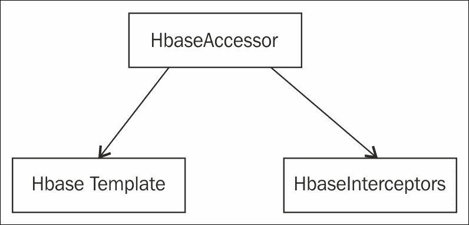

# 七、Spring 和 Hadoop 

处理大数据块一直是构建现代 web 应用的主要挑战。Hadoop 是 Apache 的一个开源框架，它提供了处理和存储大块数据的库。它提供了一个可扩展、经济高效且容错的解决方案来存储和处理大块数据。在本章中，让我们演示 Spring 框架如何支持 Hadoop。Map 和 Reduce、Hive 和 HDFS 是 Hadoop 与基于云的技术一起使用的一些关键术语。除了 ApacheHadoop 之外，Google 还提供了自己的 MapandReduce 和分布式文件系统框架。

# Apache Hadoop 模块

Apache Hadoop 由以下模块组成：

*   **Hadoop 公共**：这是 Hadoop 其他模块使用的公共模块。它就像一个实用程序包。
*   **Hadoop 分布式文件系统**：当我们需要跨各种机器或机器集群存储大量数据时，可以考虑使用 Hadoop 分布式文件系统。
*   **Hadoop 纱线**：设想一个场景，云上有许多服务器需要通过向租户发送电子邮件通知，安排在特定时间重新启动或重新启动。Hadoop 纱线可用于跨计算机或集群调度资源。
*   **Hadoop Map and Reduce**：如果我们需要处理一大组数据，我们可以将其分解成小集群，并将其作为单元处理，稍后再合并回来。这可以通过 ApacheMap 和 reduce 中提供的库来完成。

## Hadoop 的 Spring 名称空间

以下是名称空间，需要用于将 Hadoop 框架与 Spring 集成。[http://www.springframework.org/schema/hadoop/spring-hadoop.xsd](http://www.springframework.org/schema/hadoop/spring-hadoop.xsd) 为 Spring Hadoop 定义 XSD，通常在`application-context.xml`文件中使用。XSD 详细介绍了如何使用 Spring 框架将 Hadoop 配置为作业。

```java
<?xml version="1.0" encoding="UTF-8"?>
<beans 
   xmlns:xsi="http://www.w3.org/2001/XMLSchema-instance"
   xmlns:1hdp="2http://www.springframework.org/schema/hadoop"
   xsi:schemaLocation="
    http://www.springframework.org/schema/beans http://www.springframework.org/schema/beans/spring-beans.xsd
    http://www.springframework.org/schema/hadoop http://www.springframework.org/schema/hadoop/spring-hadoop.xsd">

   <bean id ... >

   4<hdp:configuration ...>
</beans>
```

## Hadoop 分布式文件系统

**Hadoop 分布式文件系统**（**HDFS**用于在分布式文件系统上存储大量数据。HDFS 在不同的服务器上分别存储元数据和应用数据。用于存储元数据的服务器称为`NameNode`服务器。用于存储应用数据的服务器称为`DataNode`服务器。`NameNode`和`DataNodes`采用主从式结构。通常，一个`NameNode`将有多个`DataNodes`。`NameNodes`存储文件的名称空间，文件将在`DataNodes`中分成许多小块。`DataNodes`通常按照`NameNode`的指令和块创建、复制、删除等功能运行。因此，Hadoop 的主要任务将涉及与文件系统的交互。这可能包括创建文件、解析进程的文件或删除文件。

Hadoop 文件系统可以通过多种方式访问。我们在这里列出了一些：

*   `hdfs`：使用 RPC 进行通信，使用的协议为`hdfs://`。它要求客户端、服务器和集群具有相同的版本，否则将发生序列化错误。
*   `hftp`和`hsftp`：这些协议基于 HTTP，版本独立，前缀为`hftp://`。
*   `webhdfs`：这是基于 HTTP 和 REST API 的，也是版本独立的。

抽象类`org.apache.hadoop.fs.FileSystem`的行为类似于 Hadoop 文件系统实现的入口点。这个类已经被 Spring 框架扩展为子类`SimplerFileSystem`。这个子类包含所有为文件操作服务的方法，例如从一个位置复制到另一个位置。

Spring 框架在 Hadoop 中附带了一个包来处理 Hadoop 分布式文件系统。包`org.springframework.data.hadoop.fs`有类来处理文件资源。

`HdfsResourceLoader`是 Sping 的 Hadoop 文件系统包中的一个类，用于加载 Hadoop 文件系统中的资源。它具有将配置对象作为输入的构造函数。`HdfsResourceLoader`构造函数显示在下面的代码段中。它还具有从指定路径获取资源以及在使用后关闭文件流的方法。

```java
HdfsResourceLoader(Configuration config)
HdfsResourceLoader(Configuration config) 
HdfsResourceLoader(Configuration config, URI uri) 
HdfsResourceLoader(Configuration config, URI uri, String user) HdfsResourceLoader(FileSystem fs)
```

使用以下命令将 Spring 配置为使用`webhdfs`：

```java
<hdp:configuration>
  fs.default.name=webhdfs://localhost
  ...
</hdp:configuration>
```

要手动配置 URI 和文件系统 ID，可以提供以下配置：

```java
<!-- manually creates the default SHDP file-system named 'hadoopFs' -->
<hdp:file-system uri="webhdfs://localhost"/>

<!-- creates a different FileSystem instance --> 
<hdp:file-system id="old-cluster" uri="hftp://old-cluster/"/>
```

**Rhino**和**Groovy**等语言提供了 Java 脚本或使用 Python 进行 HDFS 配置。下面的代码中显示了一个示例。脚本可以配置为在启动或条件启动时运行。可用于此配置的两个脚本变量是`run-at-start-up`和`evaluate`。还可以将脚本配置为作为小任务启动（这意味着作为批处理作业）。

```java
<beans  ...> 
<hdp:configuration .../>

<hdp:script id="inlined-js" language="javascript" run-at-startup="true">
  importPackage(java.util);
  name = UUID.randomUUID().toString()
  scriptName = "src/test/resources/test.properties"
  // fs - FileSystem instance based on 'hadoopConfiguration' bean
  // call FileSystem#copyFromLocal(Path, Path)  
  fs.copyFromLocalFile(scriptName, name)
  // return the file length 
  fs.getLength(name)
</hdp:script>

</beans>
```

与隐式变量相关的一些隐式变量和类如下所示：

*   `hdfsRL-org.springframework.data.hadoop.io.HdfsResourceLoader`：HDFS 资源加载器（依赖`hadoop-resource-loader`或单例类型匹配，返回到基于“`cfg`”自动创建一个）。
*   `distcp-org.springframework.data.hadoop.fs.DistributedCopyUtil`：对`DistCp`的编程访问。
*   `fs-org.apache.hadoop.fs.FileSystem`：Hadoop 文件系统（依赖于“`hadoop-fs`”bean 或单例类型匹配，返回到基于“cfg”创建一个）。
*   `fsh-org.springframework.data.hadoop.fs.FsShell`：文件系统外壳，将 hadoop`fs`命令作为 API 公开。

## HBase

Apache HBase 主要是 Hadoop 的键值存储。它实际上是一个数据库，易于扩展，可以容纳数百万行和列。它可以跨硬件扩展，类似于 NoSQL 数据库。它与 Map 和 Reduce 集成，并与 restfulapi 配合使用效果最佳。HBase 源于谷歌的 bigdata。它已经被 Netflix、雅虎和 Facebook 使用。它也是内存密集型的，因为它需要处理大量数据，并且必须根据硬件进行扩展。

让我们使用 Eclipse 和 Hadoop HBase 创建一个简单的 employee 表。在 Eclipse 中，只需添加以下 JAR 文件，或者如果您正在使用 Maven，请确保在 Maven 的`pom.xml`文件中更新以下 JAR 文件：

*   `hbase-0.94.8.jar`
*   `commons-logging-1.1.1.jar`
*   `log4j-1.2.16.jar`
*   `zookeeper-3.4.5.jar`
*   `hadoop-core-1.1.2.jar`
*   `commons-configuration-1.6.jar`
*   `common-lang-2.5.jar`
*   `protobuf-java-2.4.0a.jar`
*   `slf4j-api-1.4.3.jar`
*   `slf4j-log4j12-1.4.3.jar`

使用下面的代码创建一个`Main`类来创建。此类将使用`HbaseAdmin`类创建一个 ID 和名称作为其两列的 employee 表。这个类有方法用于在 Hadoop 中创建、修改和删除表。

```java
import org.apache.hadoop.conf.Configuration;

import org.apache.hadoop.hbase.HBaseConfiguration;

import org.apache.hadoop.hbase.HColumnDescriptor;

import org.apache.hadoop.hbase.HTableDescriptor;

import org.apache.hadoop.hbase.client.HBaseAdmin;

public class HbaseTableCreation
{
  public static void main(String[] args) throws IOException {
    HBaseConfiguration hc = new HBaseConfiguration(new Configuration());

    HTableDescriptor ht = new HTableDescriptor("EmployeeTable"); 

    ht.addFamily( new HColumnDescriptor("Id"));

    ht.addFamily( new HColumnDescriptor("Name"));

    System.out.println( "connecting" );

    HBaseAdmin hba = new HBaseAdmin( hc );

    System.out.println( "Creating Table EmployeeTable" );

    hba.createTable( ht );

    System.out.println("Done....EmployeeTable..");
  }
}
```

HBase 受 Spring 框架的支持，`factoryBean`也在 Spring Hadoop 包中创建以支持它。`HbaseConfigurationFactoryBean`bean 在`org.springframework.data.hadoop.hbase`包中提供。`HBaseAccessor`类是一个抽象类，被`HbaseTemplate`和`HbaseInterceptors`两个子类扩展。



Spring 提供了一个名为`HBaseTemplate`的核心类。此类是实现 HBase 时应用的第一个联系点。此类具有所有访问表的方法，如`execute`、`find`、`find all`等。

此类具有以下构造函数：

```java
HbaseTemplate() 
HbaseTemplate(Configuration configuration)
```

这是可以在应用的`context.xml`或`Hbasecontext.xml`文件中使用的 HBase 模板配置：

```java
// default HBase configuration
<hdp:hbase-configuration/>

// wire hbase configuration (using default name 'hbaseConfiguration') into the template 
<bean id="htemplate" class="org.springframework.data.hadoop.hbase.HbaseTemplate" p:configuration-ref="hbaseConfiguration"/>
```

我们还将通过一个示例代码片段来了解如何使用`HBaseTemplate`检索表信息：

```java
// writing to 'EmployeeTable'
template.execute("EmployeeTable", new TableCallback<Object>() {
  @Override
  public Object doInTable(HTable table) throws Throwable {
    Put p = new Put(Bytes.toBytes("Name"));
    p.add(Bytes.toBytes("Name"), Bytes.toBytes("SomeQualifier"), Bytes.toBytes("Anjana"));
    table.put(p);
    return null;
  }
});

// read each row from 'EmployeeTable'
List<String> rows = template.find("EmployeeTable", "Name", new RowMapper<String>() {
  @Override
  public String mapRow(Result result, int rowNum) throws Exception {
    return result.toString();
  }
}));
```

Spring 还支持与 Hadoop HBase 的 AOP 集成，并且有一个包可以使用`HBaseInterceptors`处理所有 AOP 事件。此类实现以下接口：

*   `org.aopalliance.aop.Advice`
*   `org.aopalliance.intercept.Interceptor`
*   `org.aopalliance.intercept.MethodInterceptor`
*   `InitializingBean`

`HBaseInterceptors`和`HBaseSynchronizationManager`可用于在方法调用之前将 HBase 表绑定到线程，或在方法调用之后从中分离。

*   这是 Spring 的 Hadoop HBase 配置，用于创建 HBase 配置对象以管理 HBase 配置连接：

    ```java
    <!-- default bean id is 'hbaseConfiguration' that uses the existing 'hadoopCconfiguration' object ->
    <hdp:hbase-configuration configuration-ref="hadoopCconfiguration" />
    ```

*   这是 Spring 的 Hadoop HBase 配置，用于在应用上下文为 null 或由于某种原因不可用时管理代理和连接：

    ```java
    <!-- delete associated connections but do not stop the proxies -->
    <hdp:hbase-configuration stop-proxy="false" delete-connection="true">
      toooo=baaaa
      property=value
    </hdp:hbase-configuration>
    ```

*   This is the configuration for a high performance coordination server called `ZooKeeper` which is used in Hadoop distributed systems:

    ```java
    <!-- specify ZooKeeper host/port -->
    <hdp:hbase-configuration zk-quorum="${hbase.host}" zk-port="${hbase.port}">
    ```

    我们还可以从文件中加载属性，如下所示：

    ```java
    <hdp:hbase-configuration properties-ref="some-props-bean" properties-location="classpath:/conf/testing/hbase.properties"/>
    ```

## 映射并还原

**Map and Reduce**是一种允许大量可伸缩性的编程方法。术语“映射并减少”意味着我们将使用映射来处理数据。我们可以在这里看到两个步骤。第一个是地图创建（使用键值对创建地图），第二个是 reduce，它读取第一步创建的地图，并将其分解为许多较小的地图。

让我们考虑一个与地图和减少有关的场景，比如说我们需要获得印度老虎的数量，并做一些工作来改善它们的生活条件，使它们不会灭绝。我们可能有老虎数量的平均数字。比如说，我们派遣人员到不同的州，他们收集这样的信息：卡纳塔克邦（100），泰米尔纳德邦（150），等等。然后我们将这些数字合并成一个数字，得到老虎的总数量。人口测绘可以看作是一个并行的过程（测绘作业），将结果合并可以看作是一个缩减作业。

## 在 Spring 中为 Map 和 Reduce 创建配置对象

配置对象保存有关映射和缩减作业的信息。配置对象本身是映射到类`ConfigurationFactoryBean`的 bean 定义，默认名称为`hadoopConfiguration`。

配置对象可以简单地配置如下：

```java
<hdp:configuration />
```

以下是配置配置对象的另一种变体：

```java
<hdp:configuration resources="classpath:/custom-site.xml, classpath:/hq-site.xml">
```

另一种变体是直接在`configuration`标记中使用`java.properties`配置 Hadoop 资源，如下所示：

```java
<hdp:configuration>
        fs.default.name=hdfs://localhost:9000
        hadoop.tmp.dir=/tmp/hadoop
        electric=sea
     </hdp:configuration>
```

您还可以使用 Spring 的属性占位符将属性外部化，如下所示：

```java
<hdp:configuration>
        fs.default.name=${hd.fs}
        hadoop.tmp.dir=file://${java.io.tmpdir}
        hangar=${number:18}
     </hdp:configuration>
          <context:property-placeholder location="classpath:hadoop.properties" />
```

### 使用Spring映射和减少作业

Map 和 Reduce 可以使用 Spring 框架作为作业进行调度。Spring 框架附带了支持 Map 和 Reduce 的`spring-data-hadoop`包。因此，我们需要确保拥有 ApacheHadoop 核心包。

让我们实现一个简单的场景，计算输入文件中每个单词的出现次数。创建一个简单的 Maven Java 项目，其中包含以下提到的依赖项。

#### Maven 项目的依赖关系

我们需要在`pom.xml`文件中添加这些依赖项：

```java
< !-- Spring Data Apache Hadoop -- >
< dependency >
    < groupId > org.springframework.data </ groupId >
    < artifactId  > spring-data-hadoop </ artifactId >
    < version > 1.0.0.RELEASE </ version >
< /dependency >
< !-- Apache Hadoop Core –- >
< dependency >
    < groupId > org.apache.hadoop </ groupId >
    < artifactId > hadoop-core </ artifactId >
    < version > 1.0.3 </version >
</dependency>
```

ApacheHadoopMap 和 Reduce 附带了一个 mapper 类，可用于创建映射，以解决读取内容和使用键值对存储单词出现的问题。文件中的每一行都将被分解成单词存储在地图中。

我们可以通过扩展`ApacheMapper`类并重写 map 方法来创建自定义映射器，如下所示：

```java
public class CustomWordMapper extends Mapper<LongWritable, Text, Text, IntWritable> {
  private Text myword = new Text();

  @Override
  protected void map(LongWritable key, Text value, Context context) throws IOException, InterruptedException {
    String line = value.toString();
    StringTokenizer lineTokenz = new StringTokenizer(line);
    while (lineTokenz.hasMoreTokens()) {
      String cleaned_data = removeNonLettersNonNumbers(lineTokenz.nextToken());
        myword.set(cleaned_data);
        context.write(myword, new IntWritable(1));
    }
  }

  /**
  * Replace all Unicode characters that are neither numbers nor letters with an empty string.
  * @param original, It is the original string
  * @return a string object that contains only letters and numbers
  */
  private String removeNonLettersNonNumbers (String original) {
    return original.replaceAll("[^\\p{L}\\p{N}]", "");
  }
}
```

`CustomWordMapper`类执行以下操作：

1.  创建`Text()`类的`myword`实例。
2.  覆盖超类`Mapper`的`map`方法，实现以下步骤：
    1.  文本对象被转换为字符串并分配给字符串`line`。
    2.  Line 是传递给字符串标记器的字符串对象。
    3.  字符串标记器使用`while`循环并调用`removeNonLettersNonNumbers`方法。返回的字符串被分配给一个`myword`文本实例。
    4.  调用`context.write(myword,newIntwritable(1))`方法。
3.  具有使用`string.replaceAll()`方法删除非字母和非数字的方法。它最终返回一个只有数字和字母的字符串对象。

接下来我们将创建一个减速器组件。减速器组件将执行以下任务：

1.  扩展`reducer`类。
2.  为 reducer 类创建一个 string 属性，该属性接受需要搜索的字符串以及需要找到其引用的字符串。
3.  覆盖`reduce`方法。
4.  删除不需要的键值对。
5.  保留所需的键值对。
6.  检查输入键是否已存在。如果存在，它将获取事件并存储最新值。

    ```java
    import org.apache.hadoop.io.IntWritable;
    import org.apache.hadoop.io.Text;
    import org.apache.hadoop.mapreduce.Reducer;

    public class CustomWordReducer extends Reducer<Text, IntWritable, Text, IntWritable> {
        protected static final String MY_TARGET_TEXT = "SPRING";

    @Override
     protected void reduce(Text keyTxt, Iterable<IntWritable> values, Context context) throws IOException, InterruptedException {
            if (containsTargetWord(keyTxt)) {
                int wCount = 0;
                for (IntWritable value: values) {
                   wCount += value.get();
                }
                context.write(key, new IntWritable(wCount));
            }
        }
        private boolean containsTargetWord(Text keyTxt) {
            return keyTxt.toString().equals(MY_TARGET_TEXT);
        }
    }
    ```

7.  使用 HDFS 端口和输入输出文件路径配置`application.properties`文件。
8.  Here is the sample `application.properties` file:

    ```java
    fs.default.name=hdfs://localhost:9000
    mapred.job.tracker=localhost:9001
    input.path=/path/to/input/file/
    output.path=/path/to/output/file

    ```

    一旦配置了属性，它应该在 Spring 上下文中可用。因此，使用`property-placeholder`在 Spring 的`application-context.xml`文件中配置属性文件。这是需要添加到`application-conext.xml`文件中的配置片段。

    ```java
    <context:property-placeholder location="classpath:application.properties" />
    ```

    您可以直接在`application-context.xml`文件中配置 Apache Hadoop，也可以使用属性文件从属性文件中读取键值对。由于我们已经使用了属性文件，我们将从属性文件中读取值。下面的代码片段显示`${mapred.job.tracker}`是属性文件中的一个键。您可以看到，默认名称也是使用键`${fs.default.name}`从属性文件中配置的。在`application-context.xml`文件中配置 Apache Hadoop 如下：

    ```java
    <hdp:configuration>
      fs.default.name=${fs.default.name}
      mapred.job.tracker=${mapred.job.tracker}
    </hdp:configuration>
    ```

9.  接下来，我们需要在 Spring 中将 Hadoop 配置为作业：
    1.  提供工作 ID。
    2.  指定输入路径；它将从属性文件中读取。
    3.  指定输出路径；它将从属性文件中读取。
    4.  按类别分类。
    5.  对自定义映射器类的映射器类引用。
    6.  对自定义减速器类的减速器类引用。
10.  这是需要在`application-xccontext.xml`文件中提供的配置片段。在`application-context.xml`文件中配置 Hadoop 作业，如下所示：

    ```java
    <hdp:job id="wordCountJobId"
    input-path="${input.path}"
    output-path="${output.path}"
    jar-by-class="net.qs.spring.data.apachehadoop.Main"
    mapper="com.packt.spring.data.apachehadoop.CustomWordMapper"
    reducer="com.packt.spring.data.apachehadoop.CustomWordReducer"/>
    ```

11.  最后，我们需要在`application-context.xml`文件中配置作业运行器。作业运行器配置告诉 Spring Framework 何时启动作业。在这里，我们已将作业运行器配置为在启动时启动`wordcountjob`。
12.  以下是 job runner 的配置代码段。配置`application-context.xml`文件以运行 Hadoop 作业。

    ```java
    <hdp:job-runner id="wordCountJobRunner" job-ref="wordCountJobId" run-at-startup="true"/>
    ```

因为这是一个独立的 Spring 应用，所以我们没有调用应用上下文的 web 模块。上下文需要加载到类文件中。因此，让我们使用`static`方法创建一个`Main`类来加载`application-context.xml`文件。

我们可以创建一个类，在启动时加载`application-context.xml`文件，如下所示：

```java
import org.springframework.context.ApplicationContext;
importorg.springframework.context.support.ClassPathXmlApplicationContext;

public class Main {
  public static void main(String[] arguments) {
    ApplicationContext ctx = new ClassPathXmlApplicationContext("application-context.xml");
  }
}
```

我们创建一个名为`myinput.txt`的文件，其内容如下：

```java
SPRING IS A SEASON. SPRING IS A FRAMEWORK IN JAVA. ITS SPRING IN INDIA. SPRING IS GREEEN. SPRING SPRING EVERY WHERE
```

接下来，我们需要通过执行以下命令为 HDFS 提供一个输入文件：

```java
hadoop dfs -put myinput.txt /input/myinput.txt
hadoop dfs -ls /input

```

运行`Main`类查看输出。

## 使用 Hadoop streaming 和 Spring DataApache Hadoop 映射和减少作业

在部分中，我们将演示映射，并使用 Unix shell 命令减少数据流。由于这与 Hadoop 流有关，我们将在 Unix 系统上设置一个 Hadoop 实例。对于生产模式，Hadoop 实例始终在 Unix 计算机上运行，而对于开发，则使用 Windows Hadoop 实例。

1.  以下是设置要求的要求：
    *   Java1.7.x
    *   必须安装 SSH
2.  下载最新的 ApacheHadoop 发行版二进制软件包。
3.  解压包并将其解压缩到文件夹中。
4.  Set up the following environment variables:
    *   `JAVA_HOME`
    *   `HADOOP_HOME`
    *   `HADOOP_LOG_DIR`
    *   `PATH`

    我们还需要配置 Hadoop 安装目录的`conf`文件夹中的文件：

    *   `Core-site.xml`
    *   `Hdfs-site.xml`
    *   `Mapred-site.xml`

    我们需要设置默认的 Hadoop 文件系统。

5.  要配置默认的 Hadoop 文件系统，请在`core-site.xml`文件中提供设置信息。

    ```java
    <configuration>
      <property>
      <name>fs.default.name</name>
      <value>hdfs://localhost:9000</value>
      </property>
    </configuration>
    ```

6.  还要配置复制因子。复制因子配置确保文件的副本存储在 Hadoop 文件系统中。属性`dfs.replication`及其值在`hdfs-site.xml`文件中设置。

    ```java
    <configuration>
      <property>
        <name>dfs.replication</name>
        <value>1</value>
      </property>
    </configuration>
    ```

7.  最后，配置作业跟踪器；此配置在`mapred-site.xml`文件中完成。

    ```java
    <configuration>
      <property>
        <name>mapred.job.tracker</name>
        <value>localhost:9001</value>
      </property>
    </configuration>
    ```

8.  要在伪分布式模式下运行 Hadoop，我们只需要格式；在`bin`文件夹中，有`start`和`stop`Hadoop 实例命令。

接下来，我们将演示如何将 Python 与 Apache Hadoop 数据集成。

我们将使用 Maven 创建一个简单的项目。这些是依赖项：

```java
<!-- Spring Data Apache Hadoop -->
<dependency>
  <groupId>org.springframework.data</groupId>
  <artifactId>spring-data-hadoop</artifactId>
  <version>1.0.0.RC2</version>
</dependency>
<!-- Apache Hadoop Core -->
<dependency>
  <groupId>org.apache.hadoop</groupId>
  <artifactId>hadoop-core</artifactId>
  <version>1.0.3</version>
</dependency>
<!-- Apache Hadoop Streaming -->
<dependency>
  <groupId>org.apache.hadoop</groupId>
  <artifactId>hadoop-streaming</artifactId>
  <version>1.0.3</version>
</dependency>
```

我们需要一个映射器和 Python 脚本。Python 中的映射器脚本应实现以执行以下操作：

*   脚本应该从标准输入流中读取，每次读取一行输入，然后将其转换为 UTF-8
*   行中的单词必须分成几个单词
*   行中的特殊字符需要替换为空白字符，然后获得一个键值对作为制表符；它们被分隔为标准输出

以下是 Python 中的映射器脚本：

```java
#!/usr/bin/python
# -*- coding: utf-8 -*-
import sys
import unicodedata

# Removes punctuation characters from the string
def strip_punctuation(word):
 return ''.join(x for x in word if unicodedata.category(x) != 'Po')

#Process input one line at the time
for line in sys.stdin:
 #Converts the line to Unicode
 line = unicode(line, "utf-8")
 #Splits the line to individual words
 words = line.split()
 #Processes each word one by one
 for word in words:
 #Removes punctuation characters
 word = strip_punctuation(word)
 #Prints the output
 print ("%s\t%s" % (word, 1)).encode("utf-8")

```

Python 中的 Reducer 脚本应实现以执行以下操作：

1.  脚本应该读取`mapper`类生成的键值对输出。然后，统计关键字的出现次数。

    ```java
    #!/usr/bin/python
    # -*- coding: utf-8 -*-s
    import sys
    wordCount = 0
    #Process input one line at the time
    for line in sys.stdin:
     #Converts the line to Unicode
     line = unicode(line, "utf-8")
     #Gets key and value from the current line
     (key, value) = line.split("\t")
     if key == "Amily":
     #Increase word count by one
     wordCount = int(wordCount + 1);
    #Prints the output
    print ("Watson\t%s" % wordCount).encode("utf-8")

    ```

2.  一旦 Python 脚本就绪，我们需要在属性文件中提供映射器和减速器类名和配置。这是`.properties`文件：

    ```java
    #Configures the default file system of Apache Hadoop
    fs.default.name=hdfs://localhost:9000

    #The path to the directory that contains our input files
    input.path=/input/

    #The path to the directory in which the output is written
    output.path=/output/

    #Configure the path of the mapper script
    mapper.script.path=pythonmapper.py

    #Configure the path of the reducer script
    reducer.script.path=pythonreducer.py

    ```

3.  我们还需要在`context.xml`文件中配置`property-placeholder`和 Apache Hadoop。以下是配置：

    ```java
    <context:property-placeholder location="classpath:application.properties" />
    <hdp:configuration>
      fs.default.name=${fs.default.name}
    </hdp:configuration>
    ```

4.  最后，我们需要配置 Hadoop 作业并将作业分配给 job runner，job runner 将初始化作业。

    ```java
    <hdp:configuration>
      fs.default.name=${fs.default.name}
    </hdp:configuration>
    <hdp:streaming id="streamingJob"
      input-path="${input.path}"
      output-path="${output.path}"
      mapper="${mapper.script.path}"
      reducer="${reducer.script.path}"/>
    <hdp:job-runner id="streamingJobRunner" job-ref="streamingJob" run-at-startup="true"/>
    ```

5.  现在，我们需要使用应用上下文调用配置，以便应用上下文与 Spring 框架中的所有配置一起加载。

    ```java
    import org.springframework.context.ApplicationContext;
    import org.springframework.context.support.ClassPathXmlApplicationContext;

    public class Main {
      public static void main(String[] arguments) {
        ApplicationContext ctx = new ClassPathXmlApplicationContext("applicationContext.xml");
      }
    }
    ```

6.  在命令提示符下运行以下命令以提供输入文件。将文件放在名为`input`：

    ```java
    hadoop dfs -put MILLSANDBOON.txt /input/ MILLSANDBOON.txt

    ```

    的文件夹中
7.  输出在输出目录中可用，可使用以下命令读取：

    ```java
    hadoop dfs -rmr /output
    hadoop dfs -cat /output/part-00000

    ```

您应该看到一个输出，显示在所提供的文本中出现的单词“Amily”。

# 总结

到目前为止，我们已经看到了 Spring 如何与 ApacheHadoop 集成，并提供了一个映射和缩减过程来搜索和计算数据。我们还讨论了 Python 与 ApacheHadoop 的集成。我们已经演示了如何在 Spring 框架中配置 Hadoop 作业，还看到了 HDFS 配置。

Hadoop 是一个庞大的概念。更多信息，请参考[http://docs.spring.io/spring-hadoop/docs/current/reference/html/](http://docs.spring.io/spring-hadoop/docs/current/reference/html/) 和[https://github.com/spring-projects/spring-hadoop-samples](https://github.com/spring-projects/spring-hadoop-samples) 。

我们已经演示了如何在 Unix 机器上安装 Hadoop 实例。在下一章中，我们将看到如何将 Spring 动态模块与 OSGI 结合使用。