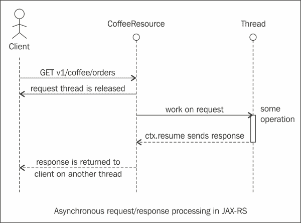

# 四、性能设计

REST 是一种符合 web 架构设计的架构风格，需要正确地设计和实现，以使您能够利用可伸缩 web。本章介绍了与性能相关的高级设计原则，每个开发人员在构建 RESTful 服务时都必须了解这些原则。

本章涵盖的主题包括以下内容：

*   缓存原则
*   REST 中的异步和长时间运行作业
*   HTTP 修补程序和部分更新

我们将详细介绍不同的 HTTP 缓存头，并学习如何发送条件请求，以查看是否需要返回新内容或缓存内容。然后，我们将通过示例演示如何使用 JAX-RS 实现缓存。

此外，我们还将介绍 Facebook API 如何使用 ETag 进行缓存。接下来，我们将介绍使用 JAX-RS 和最佳实践的异步请求-响应处理。最后，我们将介绍 HTTP 补丁方法，并学习如何实现部分更新以及有关部分更新的常见实践。

本章中包含了不同的代码片段，但本书源代码下载包中包含了显示这些代码片段的完整示例。

# 缓存原理

在本节中，我们将介绍设计 RESTful 服务时的不同编程原则。我们将讨论的一个领域是缓存。缓存涉及将与请求相关的响应信息存储在临时存储器中一段特定的时间。这确保了服务器在将来可以从缓存中完成响应时不会处理这些请求。

缓存项可以在特定时间间隔后失效。当缓存中的对象发生更改时（例如，当某些 API 修改或删除资源时），缓存项也会失效。

缓存有很多好处。缓存有助于减少**延迟**并提高应用程序响应能力。它有助于减少服务器必须处理的请求数量，从而使服务器能够处理更多的请求，客户端将更快地得到响应。

通常，图像、JavaScript 文件和样式表等资产都可以大量缓存。此外，建议缓存响应，这可能需要在后端进行大量计算。

## 缓存细节

以下部分介绍与缓存相关的主题。使缓存有效工作的关键是使用 HTTP 缓存头，指定资源的有效时间以及上次更改的时间。

## 缓存头的类型

下一节将介绍缓存头的类型，然后是每种类型的缓存头的示例。以下是标题的类型：

*   强缓存头
*   弱缓存头

### 强缓存头

强缓存头指定缓存的资源有效的时间长度，浏览器在该期间之前不需要再发送任何`GET`请求。`Expires`和`Cache-Control max-age`是强缓存头。

### 弱缓存头

弱缓存头帮助浏览器决定是否需要通过发出条件`GET`请求从缓存中获取项目。`Last-Modified`和`ETag`是弱缓存头的示例。

### 过期和缓存控制–最长期限

`Expires`和`Cache-Control`头指定浏览器可以在不检查更新的版本的情况下使用缓存资源的时间段。如果设置了这些标头，则在达到指定的过期日期或最长期限之前，不会提取较新的资源。`Expires`头包含一个日期，在此日期之后资源将变为无效。不指定日期，`max-age`属性表示资源下载后的有效期。

## 缓存控制头和指令

在**HTTP 1.1**中，`Cache-Control`头指定了资源缓存行为以及可以缓存资源的最长时间。下表显示了`Cache-Control`标题的不同指令：

<colgroup><col style="text-align: left"> <col style="text-align: left"></colgroup> 
| 

指示

 | 

意思

 |
| --- | --- |
| `private` | 当使用此指令时，浏览器可以缓存对象，但代理和内容交付网络不能 |
| `public` | 使用此指令时，浏览器、代理和内容交付网络可以缓存对象 |
| `no-cache` | 使用此指令时，不会缓存对象 |
| `no-store` | 使用时，对象可以缓存在内存中，但不应存储在磁盘上 |
| `max-age` | 此表示资源有效的时间 |

以下是响应中带有`Cache-Control HTTP/1.1`头的响应示例：

```java
HTTP/1.1 200 OK Content-Type: application/json
Cache-Control: private, max-age=86400
Last-Modified: Thur, 01 Apr 2014 11:30 PST
```

前面的响应有一个`Cache-Control`头，其指令为`private`和`max-age`设置为 24 小时或 86400 秒。

一旦基于`max-age`或`Expires`头的资源无效，客户端可以再次请求该资源，或者发送一个条件`GET`请求，该请求仅在资源发生更改时获取该资源。这可以通过较弱的缓存头来实现：`Last-Modified`和 ETag 头，如下一节所示。

### 上次修改和 ETag

这些头允许浏览器检查自上次`GET`请求以来资源是否已更改。在`Last-Modified`头中，有一个与资源修改相关联的日期。在 ETag 头中，可以是唯一标识资源的任何值（如哈希）。但是，这些头允许浏览器通过发出有条件的`GET`请求来有效地更新其缓存的资源。有条件的`GET`请求将仅在服务器上的资源发生更改时返回完整响应。这确保了有条件的`GET`请求比完整的`GET`请求具有更低的延迟。

## 缓存控制头和 REST API

下面的代码显示了如何将`Cache-Control`头添加到 JAX-RS 响应中。该示例作为本书可下载源捆绑包的一部分提供。

```java
@Path("v1/coffees")
public class CoffeesResource {

    @GET
    @Path("{order}")
    @Produces(MediaType.APPLICATION_XML)
    @NotNull(message = "Coffee does not exist for the order id requested")
    public Response getCoffee(@PathParam("order") int order) {
        Coffee coffee = CoffeeService.getCoffee(order);
        CacheControl cacheControl = new CacheControl();
        cacheControl.setMaxAge(3600);
        cacheControl.setPrivate(true);
        Response.ResponseBuilder responseBuilder = Response.ok(coffee);
        responseBuilder.cacheControl(cacheControl);
        return responseBuilder.build();

    }
```

JAX-RS 有一个`javax.ws.rs.core.Cache-Control`类，它是`HTTP/1.1 Cache-Control`头的抽象。`cacheControl`对象上的`setMaxAge()`方法对应于`max-age`指令，`setPrivate(true)`对应于`private`指令。使用`responseBuilder.build()`方法建立响应。`cacheControl`对象被添加到`getCoffee()`方法返回的`Response`对象中。

以下是此应用程序生成的标题响应：

```java
curl -i http://localhost:8080/caching/v1/coffees/1
HTTP/1.1 200 OK
X-Powered-By: Servlet/3.1 JSP/2.3 (GlassFish Server Open Source Edition  4.0  Java/Oracle Corporation/1.7)
Server: GlassFish Server Open Source Edition  4.0 
Cache-Control: private, no-transform, max-age=3600
Content-Type: application/xml
Date: Thu, 03 Apr 2014 06:07:14 GMT
Content-Length: 143

<?xml version="1.0" encoding="UTF-8" standalone="yes"?>
<coffee>
<name>Mocha</name>
<order>1</order>
<size>Small</size>
<type>Chocolate</type>
</coffee>
```

## ETags

HTTP 定义了一个功能强大的缓存机制，包括以下标头：

*   `ETag`头
*   `If-Modified-Since`头
*   `304 Not Modified`响应码

#### ETag 是如何工作的

下面的部分将深入探讨 ETag 如何工作的一些基础知识。下图给出了一个更好的说明：


让我们看看与 ETAG 相关的每个流程：

1.  客户端向[发送`GET`请求 http://api.com/coffee/1234](http://api.com/coffee/1234) REST资源。
2.  服务器返回带有**ETag**值的**200 OK**，例如，**123456789】**。
3.  一段时间后，客户端将另一个`GET`请求连同`If-None-Match: "123456789"`头一起发送到[api.com/coffee/1234](http://api.com/coffee/1234)REST 资源。
4.  服务器检查资源 MD5 哈希是否未被修改，然后发送一个无响应体的`304 Not-Modified`响应。

如果资源已更改，将发送 200 OK 作为响应。此外，作为响应的一部分，服务器会发送一个新的 ETag。

### ETag 头和其余 API

下面的代码显示了如何将`ETag`头添加到 JAX-RS 响应中：

```java
    @GET
    @Path("/etag/{order}")
    @Produces(MediaType.APPLICATION_JSON)
    @NotNull(message = "Coffee does not exist for the order id requested")
    public Response getCoffeeWithEtag(@PathParam("order") int order,
                                      @Context Request request
    ) {
        Coffee coffee = CoffeeService.getCoffee(order);
        EntityTag et = new EntityTag(
 "123456789");
        Response.ResponseBuilder responseBuilder  = request.evaluatePreconditions(et);
        if (responseBuilder != null) {
            responseBuilder.build();
        }
        responseBuilder = Response.ok(coffee);
        return responseBuilder.tag(et).build();
```

在前面的代码片段中，`javax.ws.core.EntityTag`对象的实例是通过使用资源的哈希创建的，为了简单起见，我们使用了“123456789”。

`request,evalautePreconditions`方法检查`EntityTag et`对象的值。如果满足先决条件，则返回带有`200 OK`的响应。

然后向`EntityTag`对象`et`发送响应，响应由`getCoffeeWithETag`方法返回。有关更多详细信息，请参阅作为本书源代码包一部分提供的示例。

### ETAG 的类型

强验证 ETag 匹配表明两个资源的内容是逐字节相同的，并且所有其他实体字段（如内容语言）也没有改变。

弱验证 ETag 匹配仅表明这两个资源在语义上是等价的，并且可以使用缓存副本。

缓存有助于减少客户端发出的请求数。它还有助于减少完整响应的数量，通过条件`GET`请求和 ETag、`IF-None-Match`头和`304-Not Modified`响应节省带宽和计算时间。

### 提示

在 HTTP 响应中指定`Expires`或`Cache-Control max-age`以及两个`Last-Modified`和 ETag 头中的一个是是的良好实践。发送时`Expires`和`Cache-Control max-age`都是冗余的。同样，发送`Last-Modified`和 ETag 也是冗余的。

## Facebook REST API 和 ETag

Facebook 营销 API 支持图形 API 上的 ETag。当使用者进行图形 API 调用时，响应头包含一个 ETag，其值是 API 调用中返回的数据的散列。下次消费者进行相同的 API 调用时，他可以使用从第一步保存的 ETag 值包含`If-None-Match`请求头。如果数据没有改变，响应状态码为`304 –Not Modified`，不返回数据。

如果自上次查询以来服务器端的数据发生了更改，则会像往常一样使用新的 ETag 返回数据。ETag 的新值可用于后续调用。有关更多详细信息，请查看[http://developers.facebook.com](http://developers.facebook.com) 。

### RESTEasy 和缓存

RESTEasy 是一个 JBoss 项目，提供各种框架来帮助构建 RESTful web 服务和 RESTful Java 应用程序。RESTEasy 可以在任何 servlet 容器中运行，但与 JBoss 应用服务器的集成更紧密。

RESTEasy 提供了对 JAX-RS 的扩展，允许在成功的`GET`请求上自动设置`Cache-Control`头。

它还提供了服务器端本地内存缓存，可以放在 JAX-RS 服务前面。如果 JAX-RS 资源方法设置了`Cache-Control`头，它会自动缓存来自 HTTP GET JAX-RS 调用的封送响应。

当`HTTP GET`请求到达时，RESTEasy 服务器缓存将检查 URI 是否存储在缓存中。如果是，则返回已经编组的响应，而不调用 JAX-RS 方法。

更多信息，请查看[http://www.jboss.org/resteasy](http://www.jboss.org/resteasy) 。

### 提示

**服务器端缓存提示**

使`PUT`或`POST`请求的缓存项无效。不要缓存具有查询参数的请求，因为一旦查询参数值更改，来自服务器的缓存响应可能无效。

# REST 中的异步和长时间运行作业

开发 RESTful API 的一种常见模式是处理异步和长时间运行的作业。API 开发人员需要创建可能需要相当长时间的资源。他们不能让客户端等待 API 完成。

考虑在咖啡店订购咖啡。订单详细信息存储在队列中，当咖啡师有空时，他会处理您的订单。在那之前，你会收到一张收据，确认你的订单，但真正的咖啡会在稍后到达。

异步资源处理工作原理相同。异步资源表示不能立即创建资源。也许它将被放置在一个任务/消息队列中，该队列将处理资源的实际创建或类似的事情。

考虑以下要求，我们订购一个小咖啡：

```java
POST v1/coffees/order HTTP 1.1 with body
<coffee>
  <size> SMALL</coffee>
  <name>EXPRESSO</name>
  <price>3.50</price>
<coffee>
```

响应可按以下方式发回：

```java
HTTP/1.1 202 Accepted
Location: /order/12345
```

响应发回一个`202 Accepted`头。`Location`标题可以提供咖啡资源的详细信息。

## 异步请求和响应处理

JAX-RS 2.0 的客户端和服务器端 API 中都包含了异步处理，以促进客户端和服务器组件之间的异步交互。以下列表显示了为在服务器和客户端支持此功能而添加的新接口和类：

*   服务器端：
    *   `AsyncResponse`：这是一个可注入的 JAX-RS 异步响应，为异步服务器端响应处理提供了手段
    *   `@Suspended`：`@Suspended`注释指示容器 HTTP 请求处理应该在辅助线程中进行
    *   `CompletionCallback`：这是一个接收请求处理完成事件的请求处理回调
    *   `ConnectionCallback`：这是一个异步请求处理生命周期回调，接收与连接相关的异步响应生命周期事件
*   Client side:
    *   `InvocationCallback`：这是一个回调，可以实现从调用处理接收异步处理事件
    *   `Future`：此允许客户端轮询异步操作的完成或阻塞等待

    ### 注

    Java SE 5 中引入的`Future`接口提供了两种不同的机制来获取异步操作的结果：第一种是通过调用`Future.get(…)`变量，直到结果可用或出现超时，第二种是通过调用`isDone()`和`isCancelled()`来检查是否完成，返回`Future`当前状态的布尔方法。有关更多详细信息，请查看[http://docs.oracle.com/javase/1.5.0/docs/api/java/util/concurrent/Future.html](http://docs.oracle.com/javase/1.5.0/docs/api/java/util/concurrent/Future.html) 。

下图显示了 JAX-RS 中的异步请求/响应处理：



客户端在`CoffeeResource`上发出异步方法请求。`CoffeeResource`类创建一个新线程，该线程可以执行一些密集操作，然后返回响应。同时，请求线程被释放，可以处理其他请求。处理操作的线程完成处理后，会将响应返回给客户端。

以下示例代码显示了如何使用 JAX-RS 2.0 API 开发异步资源：

```java
@Path("/coffees")
@Stateless
public class CoffeeResource {   
  @Context private ExecutionContext ctx;
  @GET @Produce("application/json")
  @Asynchronous
  public void order() {
        Executors.newSingleThreadExecutor().submit( new Runnable() {
         public void run() { 
              Thread.sleep(10000);     
              ctx.resume("Hello async world! Coffee Order is 1234");
          } });
ctx.suspend();
return;
  }
}
```

`CoffeesResource`类是一个无状态会话 bean，它有一个名为`order()`的方法。此方法使用`@Asynchronous`注释进行注释，该注释将在中以火与忘的方式工作。当客户端通过`order()`方法的资源路径请求资源时，会产生一个新线程来准备请求的响应。线程提交给执行器执行，处理客户端请求的线程被释放（通过`ctx.suspend`处理其他传入请求）。

当为准备响应而创建的工作线程准备好响应时，它调用`ctx.resume`方法，让容器知道响应已经准备好发送回客户端。如果在`ctx.suspend`方法之前调用了`ctx.resume`方法（工作线程在执行到达`ctx.suspend`方法之前已经准备好了结果），则将忽略暂停，并将结果发送给客户端。

使用以下代码段中显示的`@Suspended`注释可以实现相同的功能：

```java
@Path("/coffees")
@Stateless
public class CoffeeResource {
@GET @Produce("application/json")
@Asynchronous
  public void order(@Suspended AsyncResponse ar) {
    final String result = prepareResponse();
    ar.resume(result)
  }
}
```

使用`@Suspended`注释更干净，因为这不涉及使用`ExecutionContext`变量来指示容器挂起，然后在工作线程（本例中称为`prepareResponse()`方法）完成时恢复通信线程。使用异步资源的客户端代码可以在代码级别使用回调机制或轮询。下面的代码显示了如何通过`Future`接口使用轮询：

```java
Future<Coffee> future = client.target("/coffees")
               .request()
               .async()
               .get(Coffee.class);
try {
   Coffee coffee = future.get(30, TimeUnit.SECONDS);
} catch (TimeoutException ex) {
  System.err.println("Timeout occurred");
}
```

代码以开始，形成对`Coffee`资源的请求。它使用`javax.ws.rs.client.Client`实例调用`target()`方法，该方法为`Coffee`资源创建一个`javax.ws.rs.client.WebTarget`实例。`Future.get(…)`方法会一直阻塞，直到服务器返回响应或达到 30 秒超时。

异步客户端的另一个 API 是使用`javax.ws.rs.client.InvocationCallback`实例，这是一个回调，可以实现该回调以从调用中获取异步事件。有关更多详细信息，请查看[https://jax-rs-spec.java.net/nonav/2.0/apidocs/javax/ws/rs/client/InvocationCallback.html](https://jax-rs-spec.java.net/nonav/2.0/apidocs/javax/ws/rs/ client/InvocationCallback.html) 。

# 异步资源最佳实践

下面的部分列出了使用异步 RESTful 资源时的最佳实践。

## 发送 202 接受报文

对于异步请求/响应，API 应该发回`202 Accepted`消息，以防请求有效且资源可能及时可用，即使是几秒钟。`202 Accepted`表示请求已被接受处理，资源将很快可用。`202 Accepted`消息应该指定`Location`头，客户端可以使用该头来知道资源创建后在哪里可用。如果响应不立即可用，API 不应发回`201 Created`消息。

## 设置队列中对象的过期时间

API 开发人员应该在队列中的一段时间后使对象过期。这可确保队列对象不会随时间累积，并定期清除。

## 使用消息队列异步处理任务

API 开发者应该考虑使用异步队列的消息队列，以便消息被放置在队列中，直到接收方接收它们为止。**高级消息队列协议**（**AMQP**）是一种标准，支持可靠、安全的消息路由、排队、发布和订阅。有关更多详细信息，请查看[上的高级消息队列协议 http://en.wikipedia.org/wiki/Advanced_Message_Queuing_Protocol](http://en.wikipedia.org/wiki/Advanced_Message_Queuing_Protocol) 。

例如，当调用异步资源方法时，使用消息队列发送消息并基于消息和事件异步处理不同的任务。

在我们的示例中，如果下了咖啡订单，则可以使用 RabbitMQ（[发送消息 http://www.rabbitmq.com/](http://www.rabbitmq.com/) 触发`COMPLETED`事件。订单完成后，可以将详细信息移动到库存系统。

下一节将介绍 RESTful 服务进行部分更新的另一个重要细节。

# HTTP 补丁和部分更新

API 开发人员的一个常见问题是实现部分更新。当客户端发送的请求必须只更改资源状态的一部分时，就会发生这种情况。例如，假设您的`Coffee`资源有一个 JSON 表示形式，类似于以下代码片段：

```java
{
 "id": 1,
 "name": "Mocha"
 "size": "Small",
 "type": "Latte",
 "status":"PROCESSING"
}
```

订单完成后，需要将状态从`"PROCESSING"`更改为`"COMPLETED"`。

在 RPC 样式 API 中，可以通过添加如下方法来处理此问题：

```java
GET myservice/rpc/coffeeOrder/setOrderStatus?completed=true&coffeeId=1234
```

在使用`PUT`方法的 REST 情况下，所有像这样的数据都需要发送，这将浪费带宽和内存。

```java
PUT /coffee/orders/1234
{
 "id": 1,
 "name": "Mocha"
 "size": "Small", 
 "type": "Latte", 
 "status": "COMPLETED"
}
```

为了避免发送整个数据进行小更新，另一种解决方案是使用`PATCH`进行部分更新：

```java
PATCH /coffee/orders/1234
{
"status": "COMPLETED"
}
```

但是，并不是所有的 web 服务器和客户端都会支持`PATCH`，所以人们一直在支持`POST`和`PUT`的部分更新：

```java
POST /coffee/orders/1234
{
"status": "COMPLETED"
}
```

使用`PUT`部分更新：

```java
PUT /coffee/orders/1234
{
"status": "COMPLETED"
}
```

总之，使用`PUT`或`POST`进行部分更新都是可以接受的。Facebook API 使用`POST`更新部分资源。使用部分`PUT`将更符合我们实现 RESTful 资源和方法作为 CRUD 操作的方式。

为了实现对`PATCH`方法的支持，下面是如何在 JAX-RS 中添加注释：

```java
  @Target({ElementType.METHOD})@Retention(RetentionPolicy.RUNTIME)@HttpMethod("PATCH")public @interface PATCH {}
```

前面的片段展示了如何将`javax.ws.rs.HTTPMethod`的注释与名称“`PATCH`关联。创建此注释后，`@PATCH`注释可以用于任何 JAX-RS 资源方法。

# JSON 补丁

JSON 补丁是 RFC 6902 的一部分。它是一个允许对 JSON 文档执行操作的标准。JSON 补丁可以使用`HTTP PATCH`方法。提供 JSON 文档的部分更新非常有用。介质类型`"application/json-patch+json"`用于标识此类补丁文档。

委员会由下列成员组成：

*   `op`：此标识要对文档执行的操作。可接受值为`"add"`、`"replace"`、`"move"`、`"remove"`、`"copy"`或`"test"`。任何其他值都是错误的。
*   `path`：这是表示 JSON 文档中位置的 JSON 指针。
*   `value`：此表示 JSON 文档中要替换的值。

`move`操作使用一个`"from"`成员，该成员标识要从中移动值的目标文档中的位置。

以下是在`HTTP PATCH`请求中发送的 JSON 修补程序文档示例：

```java
PATCH /coffee/orders/1234 HTTP/1.1
Host: api.foo.com
Content-Length: 100
Content-Type: application/json-patch

[
  {"op":"replace", "path": "/status", "value": "COMPLETED"}
]
```

前面的请求显示了如何使用 JSON 补丁来替换由资源`coffee/orders/1234`标识的咖啡订单的状态。操作，即前面代码段中的`"op"`是`"replace"`，它将值`"COMPLETED"`设置为 JSON 表示中的状态对象。

JSON 补丁对于单页应用程序、实时协作、离线数据更改非常有用，也可以用于需要在大型文档中进行小更新的应用程序。有关更多详细信息，请查看[http://jsonpatchjs.com/](http://jsonpatchjs.com/) ，是麻省理工学院许可证下`JSON Patch.(RFC 6902)`和`JSON Pointer.(RFC 6901)`的实现。

# 推荐阅读

以下部分列出了一些与本章所述主题相关的在线资源，这些资源可能对审查有用：

*   RESTEasy:[http://resteasy.jboss.org/](http://resteasy.jboss.org/)
*   沙发床：[http://www.couchbase.com/](http://www.couchbase.com/)
*   Facebook 图形 API 浏览器：[https://developers.facebook.com/](https://developers.facebook.com/)
*   RabbitMQ:[https://www.rabbitmq.com/](https://www.rabbitmq.com/)
*   JSON 补丁 RFC 6902:[http://tools.ietf.org/html/rfc6902](http://tools.ietf.org/html/rfc6902)
*   JSON 指针 RFC 6901:[http://tools.ietf.org/html/rfc6901](http://tools.ietf.org/html/rfc6901)

# 总结

本章详细介绍了缓存的基本概念，并演示了不同的 HTTP 缓存头，如`Cache-Control`、`Expires`等。我们还看到了头是如何工作的，以及 etag 和`Last-Modified`头是如何为有条件的`GET`请求工作的，这些请求可以提高性能。我们介绍了缓存的最佳实践、RESTEasy 如何支持服务器端缓存，以及 Facebook API 如何使用 etag。本章介绍了异步 RESTful 资源和使用异步 API 时的最佳实践。我们介绍了 HTTP 补丁和部分更新以及 JSON 补丁（RFC6902）。

下一章将讨论高级主题，每个构建 RESTful 服务的开发人员都应该知道这些主题与 REST 资源的速率限制、响应分页和国际化领域中的常用模式和最佳实践有关。它还将涵盖其他主题，如 HATEOAS、REST 及其可扩展性。