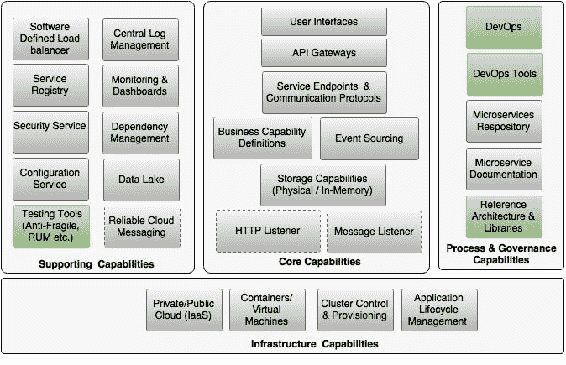
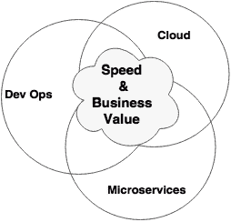
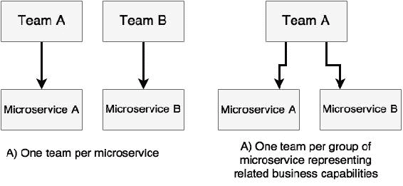
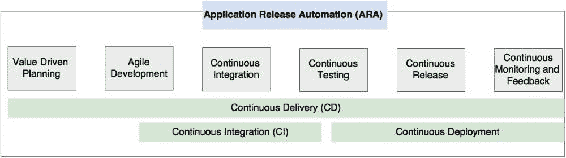
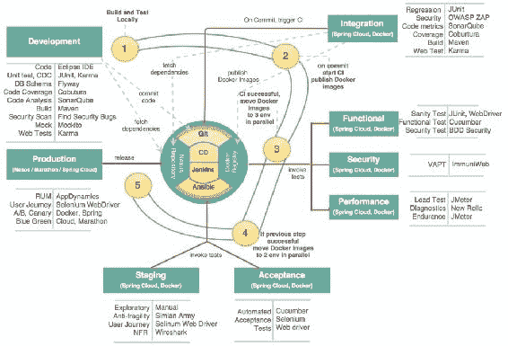

# 十、微服务开发生命周期

与**软件开发生命周期**（**SDLC**）类似，理解微服务开发生命周期流程的各个方面对于成功实施微服务架构非常重要。

最后一章将以布朗菲尔德航空公司的 PSS 微服务为例，重点介绍微服务的开发过程和实践。此外，本章将描述按照 DevOps 实践构建开发团队、开发方法、自动化测试和持续提供微服务的最佳实践。最后，本章最后将阐明参考体系结构在微服务的分散治理方法中的重要性。

在本章结束时，您将了解以下主题：

*   在微服务开发的背景下回顾 DevOps
*   定义微服务生命周期和相关流程
*   围绕互联网规模微服务的开发、测试和部署的最佳实践

# 回顾微服务能力模型

本章将涵盖[第 3 章](03.html "Chapter 3. Applying Microservices Concepts")*应用微服务概念*中讨论的微服务能力模型中的以下微服务能力：

*   **DevOps**
*   **DevOps 工具**
*   **参考架构&图书馆**
*   **测试工具（防脆、RUM 等）**

# 精益 IT 的新口号——DevOps

我们在[第 2 章](02.html "Chapter 2. Building Microservices with Spring Boot")中讨论了 DevOps 的定义，*使用 Spring Boot 构建微服务*。下面是 DevOps 定义的简要概述。

Gartner 对 DevOps 的定义如下：

> “DevOps 代表了 IT 文化的一种变革，通过在面向系统的方法中采用敏捷、精益的实践，专注于快速提供 IT 服务。DevOps 强调人（和文化），并寻求改善运营和开发团队之间的协作。DevOps 实施利用技术，特别是自动化工具，从生命周期的角度来看，这些工具可以利用日益可编程和动态的基础架构。”

DevOps 和微服务是独立发展的。[第一章](01.html "Chapter 1. Demystifying Microservices")*揭开微服务的神秘*探讨了微服务的演变。在本节中，我们将回顾 DevOps 的发展，然后看看 DevOps 如何支持微服务的采用。

在数字破坏的时代，为了支持现代业务，IT 组织必须掌握两个关键领域：交付速度和价值驱动交付。这显然与成为领先技术的专家不同。

许多 IT 组织未能掌握这一变化，导致业务用户感到沮丧。为了克服这种情况，许多业务部门在其控制下启动了自己的影子 IT 或隐形 IT。一些智能 IT 组织随后采用了精益 IT 模型来应对这些情况。

然而，由于遗留系统和流程的巨大负担，许多组织仍在为这种转变而挣扎。Gartner 提出了**步伐分层应用策略**的概念。Gartner 认为，只有某些类型的应用程序或某些业务领域才需要高速。Gartner 将其称为**创新系统**。与**记录系统**相比，创新系统需要快速创新。由于创新系统需要快速创新，因此精益 IT 交付模式对于此类应用至关重要。实践者将精益 IT 模式宣传为 DevOps。

组织采用 DevOps 有两个关键策略。

一些组织将 DevOps 定位为一个流程，以填补其现有流程中的空白。这样的组织为他们的 DevOps 之旅采取了一种增量策略。采用路径从敏捷开发开始，然后逐步采用持续集成、自动化测试、发布到生产，然后是所有 DevOps 实践。这些组织面临的挑战是，需要充分实现遗留流程带来的利益以及人员的混合文化。

因此，许多组织采用破坏性的方法来采用 DevOps。这将通过将其划分为两个层甚至两个不同的 IT 单元来实现。IT 的高速层使用 DevOps 风格的实践极大地改变了组织的文化，而与遗留流程和实践没有任何联系。将根据业务价值确定选择性应用程序群集并将其移动到新 IT：

DevOps 的目的不仅仅是降低成本。它还使企业能够通过快速将想法转移到生产中来打乱竞争对手。DevOps 以多种方式攻击传统 IT 问题，如下所述。

## 减少损耗

DevOps 流程和实践基本上加快了交付速度，从而提高了质量。交付速度是通过减少 IT 浪费来实现的。这是通过避免对业务或期望的业务成果没有任何价值的工作来实现的。IT 浪费包括软件缺陷、生产力问题、过程开销、决策滞后、报告层花费的时间、内部治理、高估等等。通过减少这些浪费，组织可以从根本上提高交付速度。主要通过采用敏捷流程、工具和技术来减少浪费。

## 自动化每一个可能的步骤

通过将手动执行的任务自动化，可以显著提高交付的速度和交付的质量。自动化的范围从计划到客户反馈。自动化缩短了将业务想法转移到生产的时间。这也减少了一些人工把关、官僚决策等。自动化的监控机制和反馈返回到开发工厂，由开发工厂修复并快速转入生产。

## 价值驱动交付

DevOps 通过价值驱动的交付减少了 IT 和业务之间的差距。价值驱动的交付通过理解真实的业务价值使 IT 与业务紧密结合，并通过快速交付这些价值帮助业务，从而提供竞争优势。这类似于影子 IT 概念，在影子 IT 概念中，IT 与业务并置，快速交付业务需求，而不是等待沉重的项目投资交付周期。

传统上，IT 与业务部分断开连接，并使用 IT KPI，例如成功交付项目的数量，而在新模型中，IT 共享业务 KPI。例如，一个新的 IT KPI 可能是，IT 帮助企业实现了 10%的销售订单增长，或导致了 20%的客户获取增长。这将使 IT 的组织地位从单纯的支持组织转变为业务合作伙伴。

## 架起开发与运营的桥梁

传统上，IT 拥有不同的开发和运营团队。在许多情况下，它们是通过逻辑障碍来区分的。DevOps 缩小了开发团队和运营团队之间的差距，因此可以潜在地减少浪费并提高质量。多学科团队合作解决手头的问题，而不是把烂泥扔到墙上。

使用 DevOps，运营团队将对开发团队开发的服务和应用程序有相当好的了解。同样，开发团队将很好地处理应用程序使用的基础架构组件和配置。因此，在设计基础架构组件时，运营团队可以完全基于服务行为而不是强制执行标准的组织策略和规则来做出决策。这最终将有助于 IT 组织提高产品质量以及解决事件和问题管理的时间。

在 DevOps 世界中，交付速度是通过高速变化的自动化实现的，质量是通过自动化和人员实现的。通过效率、交付速度、质量和创新能力实现商业价值。通过自动化、生产率和减少浪费实现成本降低。

# 迎接三巨头——微服务、DevOps 和云

三重云、微服务和 DevOps 以一系列共同目标为目标：交付速度、业务价值和成本效益。这三者都可以独立存在和发展，但它们相互补充，以实现预期的共同目标。组织中的任何一个自然地倾向于考虑其他两个，因为它们紧密地联系在一起：

许多组织以 DevOps 作为实现高速发布周期的组织实践开始他们的旅程，但最终转向微服务架构和云。微服务和云支持 DevOps 不是强制性的。然而，自动化大型单片应用程序的发布周期没有多大意义，在许多情况下，这是不可能实现的。在这种情况下，微服务体系结构和云在实现 DevOps 时将非常方便。

如果我们掷硬币，云不需要微服务架构来实现其好处。然而，为了有效地实现微服务，云和 DevOps 都是必不可少的。

总之，如果一个组织的目标是以经济高效的方式实现高交付速度和高质量，那么三者结合在一起可以带来巨大的成功。

## 云作为微服务的自助基础设施

云的主要驱动因素是提高敏捷性和降低成本。通过缩短提供基础设施的时间，可以提高交付速度。通过优化利用基础设施，可以降低成本。因此，云直接帮助实现交付速度和成本。

如[第 9 章](09.html "Chapter 9. Managing Dockerized Microservices with Mesos and Marathon")所述，*使用 Mesos 和 Marathon*管理对接微服务，如果没有带集群管理软件的云基础设施，部署微服务时很难控制基础设施成本。因此，具有自助服务功能的云对于微服务实现其全部潜在利益至关重要。在微服务环境中，云不仅有助于抽象物理基础设施，还为动态资源调配和自动部署提供软件 API。这被称为**基础设施，代码为**或**软件定义基础设施**。

## DevOps 作为微服务的实践和流程

微服务是一种支持快速交付的架构风格。然而，微服务本身无法提供所需的好处。交付周期为 6 个月的基于微服务的项目无法提供目标交付速度或业务敏捷性。微服务需要一套支持性的交付实践和流程来有效地实现其目标。

DevOps 是支持微服务交付过程和实践的理想人选。DevOps 的流程和实践与微服务体系结构的理念非常契合。

# 微服务开发实践要点

对于成功的微服务交付，需要考虑大量从开发到交付的实践，包括 DevOps 理念。在前面的章节中，您学习了微服务的不同体系结构功能。在本节中，我们将探讨微服务开发的非体系结构方面。

## 了解业务动机和价值

微服务不应该为了实现利基架构风格而使用。在选择微服务作为给定问题的体系结构解决方案之前，了解业务价值和业务 KPI 非常重要。充分理解业务动机和业务价值将有助于工程师以经济高效的方式专注于实现这些目标。

商业动机和价值应该证明选择微服务是合理的。此外，使用微服务，从业务角度来看，业务价值应该是可实现的。这将避免 IT 投资于微服务，但企业没有兴趣利用微服务带来的任何好处。在这种情况下，基于微服务的开发将是企业的开销。

## 从项目到产品开发的思维方式转变

正如[第 1 章](01.html "Chapter 1. Demystifying Microservices")*中所述，*揭开微服务的神秘面纱*，微服务更符合产品开发。使用微服务交付的业务功能应视为产品。这也符合 DevOps 的哲学。*

项目开发和产品开发的思维方式是不同的。产品团队将始终具有主人翁意识，并对其生产的产品负责。因此，产品团队总是试图提高产品的质量。产品团队不仅负责交付软件，还负责产品的生产支持和维护。

产品团队通常直接链接到他们为其开发产品的业务部门。通常，产品团队既有一名 IT 代表，也有一名业务代表。因此，产品思维与实际业务目标密切相关。在每一时刻，产品团队都了解他们为实现业务目标而为业务增加的价值。产品的成功直接取决于从产品中获得的商业价值。

由于高速度的发布周期，产品团队总是在交付过程中获得一种满足感，并且他们总是试图改进它。这给团队带来了更多积极的动力。

在许多情况下，典型的产品团队是长期资助的，并且保持不变。因此，产品团队在本质上变得更具凝聚力。由于团队规模较小，这些团队专注于从日常学习中改进流程。

产品开发中的一个常见陷阱是 IT 人员在产品团队中代表业务。这些 IT 代表可能不完全理解业务愿景。此外，他们可能无权代表企业做出决策。这种情况可能导致与业务不一致，并很快导致失败。

同样重要的是考虑企业和 IT 代表驻留在同一个地方的团队的配置。搭配在 IT 和业务团队之间增加了更多的绑定，并减少了通信开销。

## 选择发展理念

不同的组织采用不同的方法开发微服务，无论是迁移还是新开发。选择适合组织的方法非常重要。方法有很多种，本节将对其中一些方法进行解释。

### 设计思维

设计思维主要用于以创新为中心的开发。这是一种从最终用户的角度探索系统的方法：客户看到了什么以及他们如何体验解决方案。然后根据观察、模式、直觉和访谈来构建故事。

然后，设计思维通过围绕问题运用大量理论、逻辑推理和假设，通过以解决方案为中心的思维快速设计解决方案。在得出一个收敛的解决方案之前，通过头脑风暴来扩展这些概念。

一旦确定了解决方案，建立一个快速原型来考虑客户如何响应它，然后相应地调整解决方案。当团队获得令人满意的结果时，下一步就是扩大产品规模。请注意，原型可能是代码的形式，也可能不是代码的形式。

设计思维采用以人为中心的思维方式，以情感、移情、直觉和想象力为核心。在这种方法中，解决方案将需要重新思考，即使是已知的问题，也需要找到创新和更好的解决方案。

### 启动模式

越来越多的组织遵循创业理念来提供解决方案。组织创建内部启动团队，以交付特定的解决方案。这些团队远离日常组织活动，专注于完成任务。

许多初创企业都是以一个小型、专注的团队开始的，这是一个具有高度凝聚力的团队。部队不担心他们是怎么做到的,；相反，重点是他们想要实现什么。一旦他们有了产品，团队就会考虑正确的方法来构建和扩展它。

这种方法通过生产第一的思想来解决快速交付问题。这种方法的优点是团队不会受到组织治理和政治挑战的干扰。团队有权进行开箱思考、创新和交付。一般来说，这类团队拥有更高级别的所有权，这是成功的关键催化剂之一。这样的团队采用了足够的流程和规程来推进解决方案。他们还遵循快速失败的方法，并尽早纠正错误。

### 敏捷实践

最常用的方法是敏捷开发方法。在这种方法中，使用敏捷宣言中提出的原则，以增量、迭代的方式交付软件。这种类型的开发使用敏捷方法，如 Scrum 或 XP。敏捷宣言定义了敏捷软件开发团队应该关注的四个关键点：

*   过程和工具上的个人和交互
*   在综合文档上运行软件
*   合同谈判中的客户协作
*   响应变化胜过遵循计划

### 注

敏捷软件开发的 12 条原则见[http://www.agilemanifesto.org/principles.html](http://www.agilemanifesto.org/principles.html) 。

## 使用最小可行产品的概念

无论之前解释的开发理念如何，在开发速度和灵活性的微服务系统时，确定**最低可行产品**（**MVP**是至关重要的。

Eric Ries 在开创精益创业运动的同时，将 MVP 定义为：

> “最低可行产品是新产品的版本，它允许团队以最少的努力收集关于客户的最大数量的经验证的知识。”

MVP 方法的目标是快速构建一个展示软件最重要方面的软件。MVP 方法实现了一个想法的核心概念，并可能选择那些为业务增加最大价值的功能。它有助于获得早期反馈，然后在制造重型产品之前，根据需要对过程进行修正。

MVP 可以是解决有限用户组的完整服务，也可以是解决更广泛用户组的部分服务。在 MVP 方法中，客户的反馈非常重要。因此，向真正的用户发布 MVP 是非常重要的。

## 克服遗留热点

在开始微服务开发之前，了解组织中的环境和政治挑战非常重要。

在微服务中，直接或间接依赖于其他遗留应用程序是很常见的。直接遗留集成的一个常见问题是遗留应用程序的开发周期缓慢。一个例子是创新的铁路预订系统，该系统基于古老的**交易处理设施**（**TPF**）来实现一些核心后端功能，如预订。这在将传统单片应用程序迁移到微服务时尤其常见。在许多情况下，遗留系统继续以非敏捷的方式进行开发，具有更大的发布周期。在这种情况下，由于与遗留系统的耦合，微服务开发团队可能无法如此快速地移动。集成点可能会严重拖累微服务的开发。组织上的政治挑战让事情变得更糟。

解决这个问题没有灵丹妙药。文化和过程差异可能是一个持续存在的问题。许多企业通过集中注意力和投资来保护这些遗留系统，以支持快速移动的微服务。在这些遗留平台上进行有针对性的 C 级干预可以减少开销。

## 解决围绕数据库的挑战

自动化是微服务开发的关键。自动化数据库是许多微服务开发的关键挑战之一。

在许多组织中，DBA 在数据库管理中起着关键作用，他们喜欢以不同的方式对待自己控制的数据库。数据的机密性和访问控制也是 DBA 集中管理所有数据的原因之一。

许多自动化工具关注应用程序逻辑。因此，许多开发团队完全忽略了数据库自动化。忽视数据库自动化会严重影响总体效益，并可能使微服务开发脱轨。

为了避免这种情况，必须以与具有适当源代码控制和更改管理的应用程序相同的方式处理数据库。在选择数据库时，考虑自动化是重要的一个方面也是很重要的。

数据库在 NoSQL 数据库的情况下，自动化要容易得多，但使用传统的 RDBMs 很难管理。**数据库生命周期管理**（**DLM**）作为一个概念在 DevOps 世界流行，尤其是处理数据库自动化。DBmaestro、Redgate DLM、Datical DB 和 Delphix 等工具支持数据库自动化。

## 建立自组织团队

微服务开发中最重要的活动之一是建立正确的开发团队。正如在许多 DevOps 过程中所建议的那样，一个小型的、专注的团队总是能够提供最好的结果。

由于微服务与业务能力保持一致，并且是松散耦合的产品，因此每个微服务都有一个专门的团队是非常理想的。在某些情况下，同一团队拥有来自同一业务领域的多个表示相关功能的微服务。这些通常由微服务的耦合和大小决定。

团队规模是建立有效的微服务开发团队的一个重要方面。一般认为团队规模不应超过 10 人。建议的最佳交付尺寸介于 4 和 7 之间。亚马逊网站的创始人杰夫·贝佐斯（Jeff Bezos）创造了两个比萨饼团队的理论。杰夫的理论认为，如果规模变大，团队将面临沟通问题。较大的团队以一致的方式工作，这会导致浪费增加。大型团队也会失去所有权和责任感。衡量标准是，产品负责人应该有足够的时间与团队中的个人交谈，让他们了解他们所交付产品的价值。

团队应该在构思、分析、开发和支持服务方面拥有完全的所有权。来自 Amazon.com 的沃纳·沃格尔（Werner Vogels）称之为*，你构建它，然后运行它*。根据 Werner 的理论，开发人员更注重开发高质量的代码，以避免意外的支持调用。团队成员包括 fullstack 开发人员和操作工程师。这样的团队完全了解所有领域。开发人员理解操作，正如操作团队理解应用程序一样。这不仅减少了团队间投掷泥浆的变化，而且提高了质量。

团队应具备多学科技能，以满足提供服务所需的所有能力。理想情况下，团队不应该依赖外部团队来交付服务的组件。相反，团队应该是自给自足的。然而，在大多数组织中，挑战在于罕见的专业技能。例如，组织中可能没有很多关于图形数据库的专家。解决这个问题的一个常见方法是使用顾问的概念。顾问是中小型企业，负责获取团队面临的具体问题的专业知识。一些组织还使用共享或平台团队来提供一些通用功能。

团队成员不仅要从技术角度，而且要从商业案例和商业 KPI 的角度，对产品有全面的了解。团队应该在交付产品以及共同实现业务目标方面拥有集体所有权。

敏捷软件开发还鼓励拥有自组织的团队。自组织团队作为一个有凝聚力的单位，寻找实现团队目标的方法。团队会自动调整自己并分配职责。团队成员自我管理，并有权在日常工作中做出决策。在这样的团队中，团队的沟通和透明度非常重要。这强调了搭配和协作的需要，以及高带宽的通信：

在上图中，**微服务 A**和**微服务 B**都表示相关的业务能力。自组织团队平等对待团队中的每个人，团队中没有太多的层级和管理开销。在这种情况下，管理层将是单薄的。团队中不会有很多指定的垂直技能，比如团队领导、用户体验经理、开发经理、测试经理等等。在典型的微服务开发中，共享产品经理、共享架构师和共享人员经理足以管理不同的微服务团队。在一些组织中，架构师也负责交付。

自组织团队具有一定程度的自主权，能够以快速敏捷的方式做出决策，而不必等待许多企业中存在的长期官僚决策过程。在许多情况下，企业体系结构和安全性被视为事后诸葛亮。然而，从一开始就让他们参与进来是很重要的。在赋予团队在决策能力方面的最大自由度的同时，拥有完全自动化的 QA 和法规遵从性也同样重要，以确保尽早捕获偏差。

团队之间的沟通很重要。然而，在理想情况下，它应该仅限于微服务之间的接口。理想情况下，团队之间的集成必须以测试脚本的形式通过消费者驱动的契约来处理，而不是使用描述各种场景的大型接口文档。当服务不可用时，团队应该使用模拟服务实现。

## 构建自助云

在开始微服务之前，人们应该考虑的关键方面是建立云环境。当只有几个服务时，通过手动将它们分配到预先指定的一组虚拟机，可以很容易地对它们进行管理。

然而，微服务开发人员需要的不仅仅是 IaaS 云平台。开发人员和团队中的操作工程师都不应该担心应用程序部署在何处以及如何以最佳方式部署。他们也不应该担心如何管理容量。

这种复杂程度需要一个具有自助服务能力的云平台，如我们在[第 9 章](09.html "Chapter 9. Managing Dockerized Microservices with Mesos and Marathon")中讨论的，*使用 Mesos 和 Marathon*管理容器化的微服务，以及 Mesos 和 Marathon 集群管理解决方案。[第 8 章](08.html "Chapter 8. Containerizing Microservices with Docker")中讨论的容器化部署*使用 Docker*容器化微服务在管理和端到端自动化方面也很重要。构建这种自助云生态系统是微服务开发的先决条件。

## 构建微服务生态系统

正如我们在[第 3 章](03.html "Chapter 3. Applying Microservices Concepts")中的能力模型中所讨论的，*应用微服务概念*，微服务需要许多其他能力。在大规模实施微服务之前，所有这些功能都应该到位。

这些功能包括服务注册、发现、API 网关和外部化配置服务。所有这些都是由 SpringCloud 项目提供的。诸如集中式日志记录、监视等功能也是微服务开发的先决条件。

## 定义 DevOps 风格的微服务生命周期流程

DevOps 是最适合微服务开发的实践。已经在实践 DevOps 的组织不需要另一种微服务开发实践。

在本部分中，我们将探讨微服务开发的生命周期。我们将从微服务的角度探讨 DevOps 流程和实践，而不是为微服务重新设计流程。

在探索 DevOps 流程之前，让我们先了解一下 DevOps 世界中使用的一些常用术语：

*   **持续集成**（**CI**）：此在指定环境中以时间触发方式或开发人员提交的方式持续自动执行应用程序构建和质量检查。CI 还将代码度量发布到中央仪表板，并将二进制工件发布到中央存储库。CI 在敏捷开发实践中很流行。
*   **持续交付**（**CD**）：此将端到端软件交付实践从构思到生产自动化。在非 DevOps 模型中，这过去被称为**应用程序生命周期管理**（**ALM**。CD 的一个常见解释是，它是 CI 的下一个演变，它将 QA 周期添加到集成管道中，并使软件准备发布到生产中。需要手动操作才能将其投入生产。
*   **持续部署**：这是一种通过管理二进制移动和相关配置参数，将应用程序二进制文件自动部署到一个或多个环境的方法。通过将自动发布过程集成到 CD 管道中，连续部署也被认为是 CD 的下一个发展。
*   **应用程序发布自动化****ARA**：ARA 工具帮助监控和管理端到端交付管道。ARA 工具使用 CI 和 CD 工具，并管理发布管理批准的附加步骤。ARA 工具还能够将版本发布到不同的环境，并在部署失败时将其回滚。ARA 提供了一个完全协调的工作流管道，通过集成许多用于存储库管理、质量保证、部署等的专用工具来实现交付生命周期。XL Deploy 和 Automic 是一些 ARA 工具。

以下图显示了 DevOps 微服务开发流程：

现在让我们进一步探讨微服务开发的这些生命周期阶段。

### 价值驱动的规划

价值驱动规划是敏捷开发实践中使用的一个术语。价值驱动的规划在微服务开发中极其重要。在价值驱动的规划中，我们将确定要开发哪些微服务。最重要的方面是确定对业务具有最高价值和风险最低的需求。MVP 理念在从头开始开发微服务时使用。在单片到微服务迁移的情况下，我们将使用[第 3 章](03.html "Chapter 3. Applying Microservices Concepts")中提供的指南*应用微服务概念*来确定必须首先使用哪些服务。所选的微服务有望准确地为企业提供预期的价值。衡量该价值的业务 KPI 必须被确定为价值驱动规划的一部分。

### 敏捷开发

一旦确定了微服务，就必须按照敏捷宣言原则，以敏捷方法进行开发。scrum 方法被大多数组织用于微服务开发。

### 持续整合

持续集成步骤应该到位，以自动构建由各个团队成员生成的源代码并生成二进制文件。重要的是只构建一次，然后在后续阶段中移动二进制文件。持续集成还作为构建管道的一部分执行各种 QA，例如代码覆盖率、安全检查、设计指南和单元测试用例。CI 通常将二进制人工制品交付给二进制人工制品存储库，并将二进制人工制品部署到一个或多个环境中。部分功能测试也作为 CI 的一部分进行。

### 连续测试

一旦持续集成生成二进制文件，它们就被转移到测试阶段。在此阶段，将启动一个完全自动化的测试周期。作为测试阶段的一部分，自动化安全测试也很重要。自动化测试有助于提高可交付成果的质量。根据测试类型，测试可能在多个环境中进行。这可以从集成测试环境到生产环境，再到生产中的测试。

### 连续释放

持续发布到生产，负责实际部署、基础设施供应和部署。通过应用某些规则，二进制文件将自动发布并部署到生产环境中。许多组织停止了登台环境的自动化，并利用手动批准步骤转移到生产环境。

### 持续监控和反馈

持续监控和反馈阶段是敏捷微服务开发中最重要的阶段。在 MVP 场景中，此阶段提供对 MVP 初始接受的反馈，并评估所开发服务的价值。在功能添加场景中，这进一步深入了解了用户是如何接受此新功能的。根据反馈，调整服务，然后重复相同的循环。

## 实现连续输送管道的自动化

在前面的部分中，我们讨论了微服务开发的生命周期。生命周期阶段可以由组织根据其组织需求进行更改，也可以根据应用程序的性质进行更改。在本节中，我们将查看示例连续交付管道以及实现示例管道的工具集。

在开源和商业领域，有许多工具可用于构建端到端管道。组织可以选择其选择的产品来连接管道任务。

### 提示

关于建造连续输送管道的工具参考，请参考 XebiaLabs 周期表。可在[获取 https://xebialabs.com/periodic-table-of-devops-tools/](https://xebialabs.com/periodic-table-of-devops-tools/) 。

管道最初的设置成本可能很高，因为它们需要许多工具集和环境。组织在实施交付管道时可能不会立即实现成本效益。此外，修建管道需要高功率资源。大型管道可能涉及数百台机器。通过管道将更改从一端移动到另一端也需要数小时。因此，为不同的微服务提供不同的管道是很重要的。这也将有助于不同微服务版本之间的解耦。

在管道中，应该使用并行性在不同的环境中执行测试。尽可能多地并行执行测试用例也很重要。因此，根据应用程序的性质设计管道非常重要。不存在一刀切的情况。

管道中的关键重点是从开发到生产的端到端自动化，以及在出现问题时快速失败。

下面的管道是微服务的指示性管道，并探索开发微服务管道时应该考虑的不同能力：

连续输送管道阶段将在以下章节中解释。

### 发展

从发展的角度来看，发展阶段有以下活动。本节还说明了在开发阶段可以使用的一些工具。这些工具是敏捷开发团队使用的规划、跟踪和沟通工具（如敏捷 JIRA、Slack 和其他工具）的补充。请看以下内容：

*   **源代码**：开发团队需要 IDE 或开发环境来剪切源代码。在大多数组织中，开发人员可以自由选择他们想要的 IDE。话虽如此，IDE 可以与许多工具集成，以检测违反准则的行为。通常，EclipseIDE 有用于静态代码分析和代码矩阵的插件。SonarQube 是一个集成了其他插件的例子，比如代码约定的 Checkstyle、检测不良实践的 PMD、检测潜在 bug 的 FindBugs 和代码覆盖率的 Cobertura。还建议使用诸如 ESVD、查找安全漏洞、SonarQube 安全规则等 Eclipse 插件来检测安全漏洞。
*   **单元测试用例**：开发团队还使用 JUnit、NUnit、TestNG 等生成单元测试用例。单元测试用例是针对组件、存储库、服务等编写的。这些单元测试用例与本地 Maven 构建集成在一起。以微服务端点为目标的单元测试用例（服务测试）作为回归测试包。如果用 AngularJS 编写 Web UI，可以使用 Karma 进行测试。
*   **消费者驱动契约**：开发者也会编写 CDC 来测试与其他微服务的集成点。契约测试用例通常以 JUnit、NUnit、TestNG 等形式编写，并添加到前面步骤中提到的服务测试包中。
*   **模拟测试**：开发人员也编写模拟来模拟集成端点，以执行单元测试用例。Mockito、PowerMock 和其他工具通常用于模拟测试。一旦确定了服务契约，就根据契约部署模拟服务是一种好的做法。这为后续阶段的服务虚拟化提供了一种简单的机制。
*   **行为驱动设计**（**BDD**）：敏捷团队还使用 BDD 工具编写 BDD 场景，如 Cucumber。通常，这些场景针对的是微服务契约或基于微服务的 web 应用程序公开的用户界面。Cucumber 与 JUnit 和 Cucumber 与 Selenium WebDriver 分别用于这些场景。不同的场景用于功能测试、用户旅程测试以及验收测试。
*   **源代码库**：源代码控制库是开发的一部分。开发人员将他们的代码签入到一个中央存储库，主要是在 IDE 插件的帮助下。每个存储库一个微服务是许多组织使用的常见模式。这禁止其他微服务开发人员修改其他微服务或基于其他微服务的内部表示编写代码。Git 和 Subversion 是用作源代码存储库的流行选择。
*   **构建工具**：Maven 或 Gradle 等构建工具用于管理依赖关系和构建目标工件，在本例中为 Spring Boot services。有许多案例，如基本质量检查、安全检查和单元测试案例、代码覆盖率等，都是作为构建本身的一部分集成的。这些与 IDE 类似，特别是当开发人员不使用 IDE 时。我们作为 IDE 的部分检查的工具也可以作为 Maven 插件提供。直到项目的 CI 阶段，开发团队才使用 Docker 之类的容器。对于每次更改，必须对所有工件进行适当的版本控制。
*   **工件库**：工件库在开发过程中起着举足轻重的作用。工件库是存储所有构建工件的地方。工件库可以是 Artifactory、Nexus 或任何类似的产品。
*   **数据库模式**：Liquibase 和 Flyway 通常用于管理、跟踪和应用数据库更改。Maven 插件允许和 Liquibase 或 Flyway 库进行交互。模式更改的版本和维护与源代码一样。

### 持续整合

一旦代码被提交到存储库，下一个阶段，即持续集成将自动启动。这是通过配置 CI 管道完成的。此阶段使用存储库快照构建源代码，并生成可部署的构件。不同的组织使用不同的事件启动构建。CI 启动事件可能在每个开发人员提交时发生，也可能基于时间窗口，如每日、每周等。

CI 工作流是此阶段的关键方面。持续集成工具（如 Jenkins、Bambor 和其他工具）在协调构建管道方面起着核心作用。该工具配置了要调用的活动工作流。工作流自动执行配置的步骤，如构建、部署和 QA。在开发人员提交或以设定的频率提交时，CI 启动工作流。

以下活动在持续集成工作流中发生：

1.  **构建和 QA**：工作流监听 Git webhooks 进行提交。一旦检测到更改，第一个活动就是从存储库下载源代码。在下载的快照源代码上执行生成。作为构建的一部分，将自动执行许多 QA 检查，这与在开发环境中执行 QA 类似。这些包括代码质量检查、安全检查和代码覆盖率。许多 QA 都是通过 SonarQube 等工具完成的，还有前面提到的插件。它还收集代码覆盖率等代码度量，并将其发布到中央数据库进行分析。使用 OWASP ZAP Jenkins 的插件执行额外的安全检查。作为构建的一部分，它还执行 JUnit 或用于编写测试用例的类似工具。如果 web 应用程序支持 Karma for UI 测试，Jenkins 也能够运行用 Karma 编写的 web 测试。如果构建或 QA 失败，它会按照系统中的配置发出警报。
2.  **打包**：一旦构建和 QA 通过，CI 将创建一个可部署的包。在我们的 microservices 案例中，它生成 springboot 独立 JAR。建议在集成构建中构建 Docker 映像。这是我们构建二进制工件的唯一地方。构建完成后，它会将不可变的 Docker 映像推送到 Docker 注册表。这可以在 Docker Hub 或私有 Docker 注册表上。在此阶段正确地控制容器的版本非常重要。
3.  **集成测试**：将 Docker 镜像移动到集成环境中，执行回归测试（服务测试）等。该环境具有其他相关的微服务功能，如 SpringCloud、日志记录等。此环境中还存在所有依赖的微服务。如果尚未部署实际的依赖服务，则使用服务虚拟化工具，如 MockServer。或者，由各自的开发团队将服务的基础版本推送到 Git。一旦成功部署，Jenkins 将触发服务测试（针对服务的 JUnits）、一组用 Selenium WebDriver 编写的端到端健全性测试（对于 web），以及使用 OWASP ZAP 进行安全测试。

### 自动测试

在宣布构建已准备好投入生产之前，有许多类型的测试将作为自动交付过程的一部分执行。可以通过在多个环境中移动应用程序来进行测试。每个环境都指定用于特定类型的测试，例如验收测试、性能测试等。对这些环境进行了充分的监控，以收集相应的指标。

在复杂的微服务环境中，测试不应被视为最后一分钟的检查；相反，测试应该被视为提高软件质量以及避免最后一刻失败的一种方法。左移测试是在释放周期中尽早进行换档测试的一种方法。自动化测试将软件开发转变为日常开发和日常测试模式。通过自动化测试用例，我们将避免手动错误以及完成测试所需的工作。

CI 或 ARA 工具用于跨多个测试环境移动 Docker 映像。一旦部署到环境中，测试用例将根据环境的用途执行。默认情况下，执行一组健全性测试以验证测试环境。

在本节中，我们将介绍自动交付管道中所需的所有类型的测试，无论环境如何。我们已经考虑将某些类型的测试作为开发和集成环境的一部分。在本节后面，我们还将根据执行测试用例的环境映射测试用例。

#### 不同的自动化候选测试

在本节中，我们将探讨在设计端到端交付管道时，自动化候选的不同类型的测试。主要测试类型如下所述。

##### 自动健全性测试

当从一个环境移动到另一个环境时，建议运行一些心智测试，以确保所有基本的东西都正常工作。这是使用 JUnit 服务测试、SeleniumWebDriver 或类似工具创建的测试包。仔细识别并编写所有关键服务调用的脚本非常重要。特别是如果使用同步依赖性来集成微服务，那么最好考虑这些场景以确保所有依赖的服务也在运行。

##### 回归检验

回归测试确保软件中的更改不会破坏系统。在 microservices 上下文中，回归测试可以在服务级别（restapi 或消息端点）上进行，并使用 JUnit 或类似的框架编写，如前所述。当依赖服务不可用时，使用服务虚拟化。Karma 和 Jasmine 可用于 web UI 测试。

在 web 应用程序背后使用微服务的情况下，Selenium WebDriver 或类似工具用于准备回归测试包，测试在 UI 级别进行，而不是集中在服务端点上。或者，BDD 工具，例如 Cucumber with JUnit 或 Cucumber with Selenium WebDriver，也可以用于准备回归测试包。诸如 Jenkins 或 ARA 之类的 CI 工具用于自动触发回归测试包。还有其他商业工具，如 TestComplete，也可用于构建回归测试包。

##### 自动功能测试

功能测试案例通常针对使用微服务的 UI。这些是基于用户故事或功能的业务场景。这些功能测试在每个构建上执行，以确保微服务按预期执行。

BDD 通常用于开发功能测试用例。通常在 BDD 中，业务分析师使用特定于领域的语言编写测试用例，但使用的是纯英语。然后，开发人员向添加脚本以执行这些场景。自动化 web 测试工具（如 SeleniumWebDriver）与 BDD 工具（如 Cucumber、JBehave、SpecFlow 等）在此类场景中非常有用。JUnit 测试用例用于无头微服务。有一些管道将回归测试和功能测试结合为一个步骤，使用相同的测试用例集。

##### 自动验收测试

这与前面的功能测试用例非常相似。在许多情况下，自动验收测试通常使用剧本或旅程模式，并应用于 web 应用程序级别。客户视角用于构建测试用例，而不是特性或功能。这些测试模拟用户流。

BDD 工具（如 Cucumber、JBehave 和 SpecFlow）通常与 JUnit 或 Selenium WebDriver 一起用于这些场景，如前一个场景中所述。在功能测试和验收测试中，测试用例的性质是不同的。验收测试包的自动化是通过与 Jenkins 集成实现的。市场上还有许多其他专用的自动验收测试工具。FitNesse 就是这样一种工具。

##### 性能测试

作为交付管道的一部分，自动化性能测试非常重要。这将性能测试从闸门检查模型定位到输送管道的一个组成部分。通过这样做，可以在构建周期的早期阶段识别瓶颈。在一些组织中，性能测试只针对主要版本进行，但在其他组织中，性能测试是管道的一部分。性能测试有多种选择。诸如 JMeter、Gatling、Grinder 等工具可用于负载测试。这些工具可以集成到 Jenkins 工作流中以实现自动化。然后可以使用 BlazeMeter 等工具进行测试报告。

应用程序性能管理工具（如 AppDynamics、New Relic、Dynatrace 等）作为交付管道的一部分提供了质量度量。这可以使用这些工具作为性能测试环境的一部分来完成。在一些管道中，这些被集成到功能测试环境中，以获得更好的覆盖率。詹金斯有插件来获取测量值。

##### 真实用户流模拟或旅程测试

这是另一种测试形式，通常用于暂存和生产环境。这些测试在暂存和生产环境中持续运行，以确保所有关键事务按预期执行。这比典型的 URL ping 监视机制有用得多。通常，与自动验收测试类似，这些测试用例模拟真实世界中发生的用户旅程。这些也有助于检查相关微服务是否已启动并运行。这些测试用例可以是验收测试用例或使用 SeleniumWebDriver 创建的测试包的一个子集。

##### 自动化安全测试

确保自动化不会违反组织的安全策略非常重要。安全性是最重要的，为了速度而牺牲安全性是不可取的。因此，将安全测试集成为交付管道的一部分非常重要。一些安全评估已经集成到本地构建环境以及集成环境中，例如 SonarQube、Find security Bug 等。一些安全方面作为功能测试用例的一部分进行了介绍。BDD Security、Mittn 和 Gauntlt 等工具是遵循 BDD 方法的其他安全测试自动化工具。VAPT 可以使用 ImmuniWeb 等工具完成。OWASP ZAP 和 Burp 套件是安全测试中的其他有用工具。

##### 探索性测试

探索性测试是测试人员或业务用户采取的一种手动测试方法，用于验证他们认为自动化工具可能无法捕获的特定场景。测试人员以他们想要的任何方式与系统交互，而无需预先判断。他们用自己的智慧来识别他们认为某些特殊用户可能会探索的场景。他们还通过模拟某些用户行为进行探索性测试。

##### A/B 测试、金丝雀测试、蓝绿部署

将应用程序转移到生产环境时，通常会应用 A/B 测试、蓝绿部署和金丝雀测试。A/B 测试主要用于审查变更的有效性以及市场对变更的反应。新功能将向特定用户群推出。金丝雀发布是指在向所有客户全面推出之前，将新产品或功能移动到某个社区。蓝绿色从 IT 的角度来看是一种部署策略，用于测试新版本的服务。在这个模型中，蓝色和绿色版本都会在某个时间点启动并运行，然后优雅地从一个版本迁移到另一个版本。

##### 其他非功能性试验

高可用性和抗敏捷性测试（故障注入测试）在生产前也很重要。这有助于开发人员发现实际生产场景中可能出现的未知错误。这通常是通过断开系统组件以了解其故障转移行为来实现的。这也有助于测试系统中的断路器和后备服务。Simian Army 等工具在这些场景中非常有用。

##### 生产中的测试

生产中的**测试**（**TiP**）与一样重要，因为我们只能在一定程度上进行模拟。通常针对生产执行两种类型的测试。第一种方法是以连续的方式运行真实的用户流或旅程测试，模拟各种用户操作。这是使用**真实用户监控**（**RUM**工具之一，如 AppDynamics，自动完成的。第二种方法是从生产中窃听消息，在登台环境中执行它们，然后将生产中的结果与登台环境中的结果进行比较。

##### 减摩试验

抗敏捷性测试通常在与生产相同的试生产环境中进行，甚至在生产环境中通过在环境中制造混乱来查看应用程序如何响应和从这些情况中恢复。经过一段时间，应用程序获得了从大多数故障中自动恢复的能力。Simian Army 就是 Netflix 的一个这样的工具。Simian Army 是为 AWS 环境构建的一套产品。Simian Army 使用一组能够在预生产或生产环境中制造混乱的自主猴子进行破坏性测试。混乱猴、看门人猴和从众猴是猿猴军队的一些组成部分。

#### 目标测试环境

不同的测试环境以及针对这些环境执行的测试类型如下：

*   **开发环境**：开发环境用于测试编码风格检查、不良做法、潜在错误、单元测试和基本安全扫描。
*   **集成测试环境**：集成环境用于跨多个微服务的单元测试和回归测试。集成测试环境中还执行一些基本的安全相关测试。
*   **性能和诊断**：性能测试在性能测试环境中执行。应用程序性能测试工具部署在这些环境中，以收集性能指标并识别瓶颈。
*   **功能测试环境**：功能测试环境用于执行健全性测试和功能测试包。
*   **UAT 环境**：UAT 环境具有健全性测试、自动验收测试包和用户旅程模拟。
*   **暂存**：试生产环境主要用于健全性测试、安全性、抗脆弱性、网络测试等。它还用于用户旅程模拟和探索性测试。
*   **生产**：用户旅程模拟和 RUM 测试在生产环境中持续执行。

最大的挑战是跨多个环境提供适当的数据以支持测试用例。DelpIX 是一个有用的工具，在处理多个环境中的测试数据时以有效的方式进行考虑。

### 持续部署

持续部署是将应用程序部署到一个或多个环境，并相应地配置和调配这些环境的过程。正如[第 9 章](09.html "Chapter 9. Managing Dockerized Microservices with Mesos and Marathon")中所述，*通过 Mesos 和 Marathon*管理容器化的微服务，基础设施供应和自动化工具有助于部署自动化。

从部署的角度来看，一旦成功完成所有质量检查，发布的 Docker 映像将自动移动到生产中。在这种情况下，生产环境必须基于云，并使用集群管理工具，如 Mesos 或 Marathon。具有监控功能的自助云环境是必需的。

群集管理和应用程序部署工具确保正确部署应用程序依赖项。这会自动部署在缺少任何依赖项时所需的所有依赖项。它还确保在任何时间点运行的实例数最少。如果出现故障，它会自动回滚部署。它还以优雅的方式负责回滚升级。

Ansible、Chef 或 Puppet 是将配置和二进制文件移动到生产环境中的有用工具。Ansible playbook 概念可用于启动支持 Marathon 和 Docker 的 Mesos 集群。

### 监测与反馈

一旦应用程序部署到生产环境中，监控工具就会持续监控其服务。监控和日志管理工具收集和分析信息。根据所需的反馈和纠正措施，将信息反馈给开发团队以采取纠正措施，并通过管道将更改推回到生产中。APM、Open Web Analytics、Google Analytics、Webalizer 等工具是监视 Web 应用程序的有用工具。真正的用户监控应该提供端到端的监控。QuBit、Boxever、Channel Site、MaxTraffic 等在分析客户行为时也很有用。

## 自动配置管理

配置管理也必须从微服务和 DevOps 的角度重新思考。使用新的配置管理方法，而不是使用传统的静态配置 CMDB。CMDB 的手动维护不再是选项。静态管理的 CMDB 需要大量日常任务来维护条目。同时，由于部署拓扑的动态特性，很难以一致的方式维护数据。

CMDB 的新样式会根据操作拓扑自动创建 CI 配置。这些应该是基于发现的，以获取最新信息。新的 CMDB 应该能够管理裸机、虚拟机和容器。

# 微服务开发治理、参考体系结构和库

重要的是要有一个完整的企业参考体系结构和一套标准的微服务开发工具，以确保以一致的方式进行开发。这有助于各个微服务团队遵守某些最佳实践。每个团队可以确定适合其开发的专门技术和工具。在多语言微服务开发中，不同的团队显然使用了多种技术。然而，他们必须坚持拱形原则和实践。

为了快速取胜和利用时间线，微服务开发团队在某些情况下可能会偏离这些实践。只要团队在他们的积压中添加重构任务，这是可以接受的。在许多组织中，尽管团队试图重用来自企业的东西，但重用和标准化通常是事后才想到的。

确保服务被编目并在企业中可见是很重要的。这提高了微服务的重用机会。

# 总结

在本章中，您了解了微服务和 DevOps 之间的关系。我们还研究了开发微服务时的一些实践点。最重要的是，您了解了微服务开发生命周期。

在本章的后面，我们还研究了如何自动化从开发到生产的微服务交付管道。作为本文的一部分，我们研究了许多工具和技术，这些工具和技术在自动化微服务交付管道时非常有用。最后，我们谈到了参考体系结构在微服务治理中的重要性。

将本书中涵盖的微服务、挑战、最佳实践和各种功能的概念结合在一起，可以为大规模开发成功的微服务提供完美的配方。