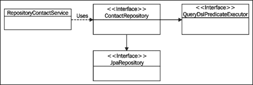
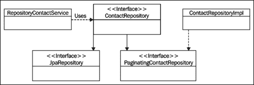

# 四、向 JPA 存储库添加自定义功能

我们已经了解了如何使用 SpringDataJPA 管理实体和创建数据库查询。我们还学习了如何对查询结果进行排序和分页。然而，如果我们从纯粹的架构角度来看，我们会注意到所描述的解决方案没有遵循**关注点分离**原则。事实上，我们的服务层包含揭示存储库层内部工作的代码。

这是架构纯度和生产力之间的权衡。一如往常，这种选择会产生一些后果。如果我们必须将应用从 SpringDataJPA 迁移出去，我们必须对服务层和存储库层进行更改。然而，有多少次我们听说应用的存储库层必须进行如此彻底的更改？确切地这种情况非常罕见。因此，当回报较高时，这种风险是值得冒的。

本章中描述的技术可用于对我们的服务层隐藏特定于实现的细节，但它们也有其他应用。在本章中，我们将介绍以下主题：

*   如何向单个存储库添加自定义功能
*   如何向所有存储库添加自定义功能

我们将使用在第 3 章*中创建的 Querydsl 示例应用，以 SpringData JPA*构建查询作为起点。让我们首先刷新一下内存，花点时间回顾一下示例应用的结构。我们的服务层由一个名为`RepositoryPersonService`的类组成，该类使用名为`ContactRepository`的存储库接口。应用的分页和查询构建逻辑位于服务层。下图说明了这种情况：



# 向单个存储库添加自定义功能

当添加的功能仅与单个实体相关时，将自定义功能添加到单个存储库是一个有用的功能。在本节中，我们将研究如何做到这一点，并将分页和搜索逻辑从服务层移动到存储库层。

如果要向单个存储库添加自定义功能，必须遵循以下步骤：

1.  创建声明自定义方法的自定义接口。
2.  实现创建的接口。
3.  创建存储库接口。
4.  创建使用自定义功能的服务实现。

## 创建自定义界面

我们的第一步是创建一个声明自定义存储库方法的接口。由于我们的目标是将分页和搜索逻辑移动到存储库层，因此我们必须向创建的接口添加以下方法：

<colgroup><col style="text-align: left"> <col style="text-align: left"></colgroup> 
| 

方法

 | 

描述

 |
| --- | --- |
| `List<Contact> findAllForPage(int pageIndex, int pageSize)` | 返回属于请求页面的所有联系人。 |
| `List<Contact> findContactsForPage(String searchTerm, int pageIndex, int pageSize)` | 返回与给定搜索词匹配且属于请求页面的所有联系人。 |

`PaginatingContactRepository`接口的源代码如下：

```java
public interface PaginatingContactRepository {

    public List<Contact> findAllForPage(int pageIndex, int pageSize);

    public List<Contact> findContactsForPage(String searchTerm, int pageIndex, int pageSize);
}
```

## 实现创建的接口

我们现在已经创建了一个接口，用于指定我们的自定义存储库方法。我们的下一步是创建此接口的实现，并将所有分页和查询构建代码从服务层移动到此类。

存储库基础结构从接口所在的包中查找自定义接口的实现。它正在寻找一个名称与字符串匹配的类，该字符串是通过在实际存储库接口的简单名称后添加后缀创建的。默认情况下，此后缀的值为`Impl`。

### 注

我们可以使用 SpringData JPA 的`repositories`名称空间元素的`repository-impl-postfix`属性或`@EnableJpaRepositories`注释的`repositoryImplementationPostfix`属性来设置后缀。

目前，我们对默认后缀非常满意。因此，实现自定义接口的类的名称必须是`ContactRepositoryImpl`。我们可以通过以下步骤实现此类：

1.  编写一些配置用来执行查询的`QueryDslJpaRepository<T, ID>`类所需的管道代码。
2.  实现自定义接口中声明的方法。

### 配置存储库类

在阶段中，我们将编写获取`QueryDslJpaRepository<Contact, Long>`类实例所需的代码。此过程包括以下步骤：

1.  使用`@PersistenceContext`注释获取对所用实体管理器的引用。
2.  创建一个`init()`方法并用`@PostConstruct`注释对其进行注释。这确保了在构造 bean 和注入实体管理器引用之后调用的方法。
3.  实现`init()`方法并创建一个新的`QueryDslJpaRepository<Contact, Long>`对象。

我们实现的源代码如下：

```java
public class ContactRepositoryImpl implements PaginatingContactRepository {

    @PersistenceContext
    private EntityManager entityManager;

    private QueryDslJpaRepository<Contact, Long> repository;

    //Add methods here

    @PostConstruct
    public void init() {
        JpaEntityInformation<Contact, Long> contactEntityInfo = new JpaMetamodelEntityInformation<Contact, Long>(Contact.class, entityManager.getMetamodel());
        repository = new QueryDslJpaRepository<Contact, Long>(contactEntityInfo, entityManager);
    }
}
```

### 实现自定义方法

目前无法编译创建的类，因为我们还没有实现自定义方法。此外，在实现这些方法之前，我们必须将分页逻辑从服务层移动到`ContactRepositoryImpl`类。因此，该过程有以下两个步骤：

1.  将分页相关代码添加到我们的存储库实现中。
2.  实现自定义存储库方法。

首先，我们必须将分页相关的代码添加到存储库中。这意味着我们必须将`sortByLastNameAndFirstNameAsc()`和`buildPageSpecification()`方法添加到`ContactRepositoryImpl`类中。这些方法的实现保持不变，如下代码所示：

```java
private Pageable buildPageSpecification(int pageIndex, int pageSize) {
  return new PageRequest(pageIndex, pageSize, sortByLastNameAndFirstNameAsc());
}

private Sort sortByLastNameAndFirstNameAsc() {
  return new Sort(new Sort.Order(Sort.Direction.ASC, "lastName"),
        new Sort.Order(Sort.Direction.ASC, "firstName")
  );
}
```

下一步是为`findAllForPage()`方法编写实现，该方法用于获取属于请求页面的联系人列表。这意味着我们必须：

1.  使用 private`buildPageSpecification()`方法获取页面规范。
2.  通过调用存储库的`findAll()`方法并将页面规范作为参数传递，获取请求页面的内容。
3.  返回联系人列表。

`findAllForPage()`方法的源代码如下：

```java
@Override
public List<Contact> findAllForPage(int pageIndex, int pageSize) {
    Pageable pageSpec = buildPageSpecification(pageIndex, pageSize);
    Page wanted = repository.findAll(pageSpec);

    return wanted.getContent();
}
```

我们的最后一个任务是为`findContactsForPage()`方法提供一个实现。此方法的实现包括以下步骤：

1.  调用`ContactPredicates`类的静态`firstOrLastNameStartsWith()`方法获取已使用的搜索条件。
2.  调用私有`buildPageSpecification()`方法获取页面规范。
3.  通过调用存储库的`findAll()`方法并提供必要的参数，获取请求页面的内容。
4.  返回联系人列表。

`findContactsForPage()`方法的源代码如下：

```java
@Override
public List<Contact> findContactsForPage(String searchTerm, int pageIndex, int pageSize) {
    Predicate searchCondition = firstOrLastNameStartsWith(searchTerm);
    Pageable pageSpec = buildPageSpecification(pageIndex, pageSize);
    Page wanted = repository.findAll(searchCondition, pageSpec);

    return wanted.getContent();
}
```

## 创建存储库接口

我们现在已经实现了自定义功能，现在是时候将此功能添加到我们的存储库中了。我们必须对现有的`ContactRepository`接口进行两项更改。详情如下:

1.  通过扩展`PaginatingContactRepository`接口，我们可以让存储库的用户使用定制方法。
2.  因为服务层不再需要 Querydsl 库中的特定方法，所以我们可以从扩展接口列表中删除`QueryDslPredicateExecutor`接口。

我们的新存储库界面的源代码如下所示：

```java
public interface ContactRepository extends JpaRepository<Contact, Long>, PaginatingContactRepository {
}
```

## 创建服务实现

最后一步是修改`RepositoryContactService`类以使用自定义功能。此步骤分为以下两个阶段：

1.  移除`buildPageSpecification()`和`sortByLastNameAndFirstNameAsc()`方法。
2.  修改`findAllForPage()`和`search()`方法，将方法调用委托给我们的存储库。

修改后的方法的源代码如下所示：

```java
@Transactional(readOnly = true)
@Override
public List<Contact> findAllForPage(int pageIndex, int pageSize) {
    return repository.findAllForPage(pageIndex, pageSize);
}

@Transactional(readOnly = true)
@Override
public List<Contact> search(SearchDTO dto) {
    return repository.findContactsForPage(dto.getSearchTerm(), dto.getPageIndex(), dto.getPageSize());
}

```

## 我们刚才做了什么？

我们只是将分页和搜索逻辑从`RepositoryContactService`类移动到`ContactRepositoryImpl`类，并消除了服务层和 Querydsl 之间的依赖关系。我们行动的结果如下图所示：



# 向所有存储库添加自定义功能

有时我们必须向所有存储库添加自定义功能。在本节中，我们将学习如何做到这一点，并创建一个自定义存储库方法，用于通过使用实体 ID 删除实体。

我们可以通过以下步骤向所有存储库添加自定义功能：

1.  创建一个声明自定义方法的基接口。
2.  实现创建的接口。
3.  创建一个存储库工厂 bean。
4.  配置 SpringDataJPA 以使用我们的存储库工厂 bean。
5.  创建存储库接口。
6.  实现使用自定义功能的服务类。

## 创建基础存储库接口

我们首先创建一个基本存储库接口，声明实际存储库中可用的方法。我们可以通过以下方式做到这一点：

1.  创建将托管实体的类型及其 ID 的类型作为类型参数的接口。
2.  在我们的基本存储库接口中扩展`JpaRepository<T, ID>`和`QueryDslPredicateExecutor<T>`接口。
3.  使用`@NoRepositoryBean`注释对接口进行注释。这确保 SpringDataJPA 不会为此接口创建存储库实现。另一个解决方案是将此接口从存储库基本包中移出，但由于通常很难找到它的逻辑位置，因此我们不会这样做。
4.  在此接口中添加一个`T deleteById(ID id)`方法。此方法返回已删除的实体，如果找不到 ID 为参数的实体，则抛出`NotFoundException`。

我们把这个接口称为`BaseRepository`。其源代码如下所示：

```java
@NoRepositoryBean
public interface BaseRepository<T, ID extends Serializable> extends JpaRepository<T, ID>, QueryDslPredicateExecutor<T> {

    public T deleteById(ID id) throws NotFoundException;
}
```

## 实现基础存储库接口

接下来我们要编写一个`BaseRepository<T, ID>`接口的实现。此过程包括以下步骤：

1.  创建一个实现`BaseRepository<T, ID>`接口并扩展`QueryDslJpaRepository<T, ID>`类的类。这确保类可以访问`JpaRepository<T, ID>`接口提供的方法，并且可以使用 Querydsl。
2.  添加一个构造函数，该构造函数用于简单地将所需信息转发给超类。
3.  执行`deleteById()`方法。首先，该方法获取删除的实体。如果找不到实体，此方法抛出`NotFoundException`。否则，此方法将删除找到的实体并返回删除的实体。

创建的`GenericBaseRepository`类的源代码如下：

```java
public class GenericBaseRepository<T, ID extends Serializable> extends QueryDslJpaRepository<T, ID> implements BaseRepository<T, ID> {

    public GenericBaseRepository(JpaEntityInformation<T, ID> entityMetadata, EntityManager entityManager) {
        super(entityMetadata, entityManager);
    }

    @Override
    public T deleteById(ID id) throws NotFoundException {
        T deleted = findOne(id);
        if (deleted == null) {
            throw new NotFoundException();
        }

        delete(deleted);
        return deleted;
    }
}
```

## 创建存储库工厂 bean

现在我们已经实现了定制功能，我们必须确保在创建具体的存储库实现时使用它。这意味着我们必须创建一个自定义的存储库工厂 bean 来替换默认的存储库工厂 bean。我们的存储库工厂 bean 只有一个用途：它将提供`GenericBaseRepository`作为扩展`Repository`接口的所有接口的实现。我们可以通过以下步骤创建自定义存储库工厂 bean：

1.  创建存储库工厂 bean 类的框架。
2.  创建一个存储库工厂类。
3.  创建用于构建新存储库工厂的生成器方法。

### 创建存储库工厂 bean 类的框架

首先，我们必须创建存储库工厂 bean 类。此类必须扩展`JpaRepositoryFactoryBean<R, T, I>`类，该类是 SpringData JPA 的默认存储库工厂 bean。此类有三个类型参数：存储库类型、实体类型和实体 ID 类型。类骨架的源代码如下所示：

```java
public class BaseRepositoryFactoryBean <R extends JpaRepository<T, I>, T, I extends Serializable> extends JpaRepositoryFactoryBean<R, T, I> {

}
```

### 创建存储库工厂内部类

第二步是创建实际的 repository factory 类。此类的实现包括以下步骤：

1.  将`BaseRepositoryFactory`类作为受保护的内部类添加到`BaseRepositoryFactoryBean`类。
2.  使创建的类扩展`JpaRepositoryFactory`类。
3.  重写`JpaRepositoryFactory`类的`getTargetRepository()`方法。此方法负责创建实际的存储库实现。
4.  重写`JpaRepositoryFactory`类的`getRepositoryBaseClass()`方法，该方法只返回基本存储库实现的类。我们可以忽略作为参数提供的元数据，因为`JpaRepositoryFactory`使用该信息来决定是否应该返回`SimpleJpaRepository`或`QueryDslJpaRepository`类。

仓库工厂内部类的源代码如下：

```java
protected static class BaseRepositoryFactory<T, I extends Serializable> extends JpaRepositoryFactory {

  private EntityManager entityManager;

    public BaseRepositoryFactory(EntityManager entityManager) {
      super(entityManager);
        this.entityManager = entityManager;
  }

    @Override
    protected Object getTargetRepository(RepositoryMetadata metadata) {
      return new GenericBaseRepository<T, I>((JpaEntityInformation<T,I>) getEntityInformation(metadata.getDomainType()), entityManager);
  }

    @Override
    protected Class<?> getRepositoryBaseClass(RepositoryMetadata metadata) {
        return GenericBaseRepository.class;
  }
}
```

### 创建存储库工厂的 builder 方法

我们可以通过重写`BaseRepositoryFactoryBean`类中`JpaRepositoryFactoryBean`类的`createRepositoryFactory()`方法来创建自定义存储库工厂类的新实例。此方法只是创建一个新的`BaseRepositoryFactory`类实例，并将实体管理器引用作为构造函数参数传递。重写方法的源代码如下所示：

```java
@Override
protected RepositoryFactorySupport createRepositoryFactory(EntityManager entityManager) {
    return new BaseRepositoryFactory(entityManager);
}
```

## 配置弹簧数据 JPA

接下来，我们必须配置 SpringData JPA，以便在创建存储库接口的具体实现时使用自定义存储库工厂 bean。我们可以通过使用`@EnableJpaRepositories`注释的`repositoryFactoryBeanClass`属性来实现这一点。换句话说，我们必须在`ApplicationContext`类中添加以下注释：

```java
@EnableJpaRepositories(basePackages = {"com.packtpub.springdata.jpa.repository"}, repositoryFactoryBeanClass = BaseRepositoryFactoryBean.class)
```

### 注

如果我们使用 XML 来配置我们的应用，我们可以使用 SpringDataJPA 的`repositories`名称空间元素的`factory-class`属性。

## 创建存储库接口

我们现在已经为所有存储库提供了定制功能。现在我们必须为`Contact`实体创建一个存储库接口。我们可以通过以下步骤来实现这一点：

1.  从扩展接口列表中删除`JpaRepository`和`QueryDslPredicateExecutor`接口。
2.  扩展`BaseRepository<T, ID>`接口。

`ContactRepository`接口的源代码如下：

```java
public interface ContactRepository extends BaseRepository<Contact, Long> {
}
```

## 实现服务层

由于`RepositoryContactService`类的`delete()`方法的旧实现包含与我们新的`deleteById()`存储库方法相同的功能，我们必须更改`RepositoryContactService`类的`delete()`方法，将方法调用委托给新的存储库方法。我们新的`delete()`方法的源代码如下：

```java
@Transactional(rollbackFor = NotFoundException.class)
@Override
public Contact deleteById(Long id) throws NotFoundException {
    return repository.deleteById(id);
}
```

## 我们刚才做了什么？

我们实现了一个通用的 delete 方法，该方法可自动用于应用的所有存储库。这消除了向服务层添加特定于实体的删除逻辑的需要，并减少了代码重复。我们还创建了一个自定义存储库工厂，该工厂提供`GenericBaseRepository`作为存储库接口的实现。我们的工作结果如下图所示：


# 总结

在本章中，我们了解到可以向单个存储库或所有存储库添加自定义功能。然而，这一章还有另一个非常重要的教训。我们注意到，将自定义功能添加到存储库会增加应用的复杂性，并迫使我们编写样板代码，这对实现和维护都很麻烦。这就是为什么我们只有在绝对必要时才使用本章中描述的技术。

这是描述 SpringData JPA 用法的最后一章。在下一章中，我们将学习如何在运行类 Unix 操作系统的计算机上安装 Redis，并建立一个使用 Redis 作为数据存储的 web 应用项目。