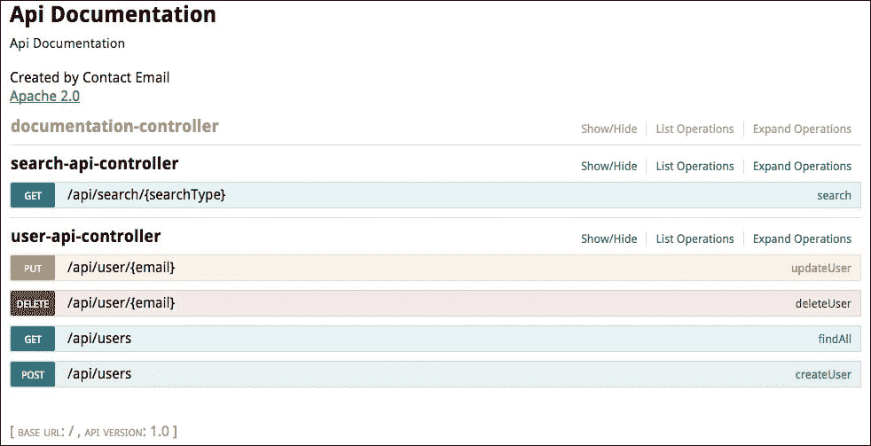
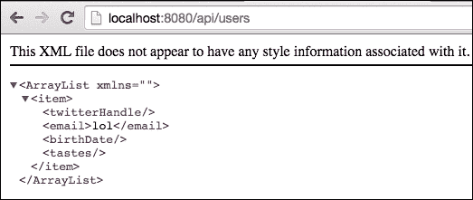
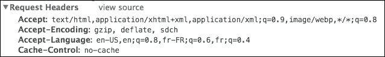
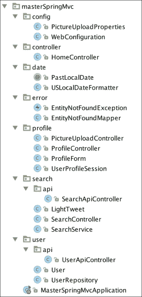

# 十六、构建 RESTful 应用

在本章中，我们将了解 RESTful 体系结构的主要原则。然后，借助非常方便的工具，我们将设计一个友好的 API，利用 Jackson 的功能以 JSON 序列化我们的模型。

我们将使用适当的错误代码和 HTTP 谓词记录我们的应用，并通过使用 Swagger UI 自动为我们的应用生成整洁的前端。

最后，我们将研究其他形式的序列化，并进一步了解 SpringMVC 的内容协商机制。

# 什么是休息？

**REST**（**表示性状态传输**是一种体系结构风格，定义了利用 HTTP 协议的功能创建可伸缩 web 服务的最佳实践。

RESTful web 服务自然应具有以下属性：

*   **客户端服务器**：界面与数据存储分离
*   **无状态**：每个请求都包含足够的信息，服务器可以在不维护任何状态的情况下运行
*   **可缓存**：服务器的响应包含足够的信息，允许客户端对数据存储做出明智的决定
*   **统一接口**：URI 唯一标识资源，超链接允许 API 被发现
*   **分层**：API 的每个资源都提供了合理的详细程度

这种体系结构的优点是易于维护和发现。它还可以很好地扩展，因为不需要在服务器和客户机之间保持持久连接，从而消除了负载平衡或粘性会话的需要。最后，该服务更高效，因为信息布局整齐，易于缓存。

让我们看看如何使用 Richardson 的成熟度模型以增量方式设计更好的 API。

# 理查森成熟度模型

Leonard Richardson 因定义了四个级别而闻名，级别从 0 到 3，描述了 web API 的“RESTfulity”级别。每个级别都需要对 API 进行额外的工作和投资，但也提供了额外的好处。

## 0 级-HTTP

0 级真的很容易达到；您只需通过 HTTP 协议使您的资源在网络上可用。您可以使用您认为最适合您的用例的任何数据表示（XML、JSON 等）。

## 1 级-资源

大多数人听到“休息”这个词时都会想到资源。资源是模型中某个元素的唯一标识符，例如用户或 tweet。使用 HTTP，资源显然与统一资源标识符 URI 相关联，如本例所示：

*   `/users`包含我们所有用户的列表
*   `/user/42`包含特定用户
*   `/user/42/tweets`包含与此特定用户相关的所有推文列表

也许您的 API 可以允许访问与用户相关的特定推文，或者每个推文都是唯一标识的，在这种情况下，您可能更喜欢`/tweet/3`。

此级别的目标是通过公开多个专用资源来处理应用的复杂性。

没有关于服务器可以返回的响应类型的规则。当您使用`/users`列出所有资源时，您可能希望只包含稀缺信息，并在请求特定资源时提供更多详细信息。有些 API 甚至允许您在向您提供字段之前列出感兴趣的字段。

定义 API 的形式确实取决于您，记住一条简单的规则：最少惊讶的原则。给你的用户他们所期望的，你的 API 就会处于良好状态。

## 2 级-HTTP 动词

这个级别是关于使用 HTTP 动词识别资源上可能的操作。这是一个非常好的方法来描述您的 API 可以做什么，因为 HTTP 谓词在开发人员中是众所周知的标准。

以下列出了主要动词：

*   `GET`：读取特定 URI 上的数据。
*   `HEAD`：这与没有响应体的`GET`相同。这对于获取资源上的元数据（缓存信息等）非常有用。
*   `DELETE`：删除资源。
*   `PUT`：此更新或创建资源。
*   `POST`：此更新或创建资源。
*   `PATCH`：部分更新资源。
*   `OPTIONS`：返回服务器在特定资源上支持的方法的列表。

大多数允许**创建读取更新删除**（**CRUD**）操作的应用只需要三个动词即可完成：`GET`、`DELETE`和`POST`。实现的动词越多，API 就越丰富，语义也就越丰富。它允许第三方键入一些命令并查看发生了什么，从而帮助第三方与您的服务交互。

`OPTIONS`和`HEAD`动词很少出现，因为它们在元数据级别工作，通常对任何应用都不重要。

乍一看，`PUT`和`POST`动词似乎做了同样的事情。主要区别在于，`PUT`动词被称为幂等，这意味着多次发送相同的请求将导致相同的服务器状态。该规则的含义本质上是，`PUT`动词应该对给定的 URI 进行操作，并包含足够的信息以使请求成功。

例如，客户端可以使用`/user/42`上的`PUT`数据，结果将是更新或创建，这取决于请求之前是否存在实体。

另一方面，当您不知道应该写入哪个 URI 时，应该使用`POST`。您可以发送`POST`到`/users`，而无需在请求中指定 ID，并期望创建用户。您还可以将`POST`发送到相同的`/users`资源，这次在请求实体中指定一个用户 ID，并期望服务器更新相应的用户。

如您所见，这两个选项都有效。一个常见的用例是使用`POST`进行创建（因为大多数情况下，服务器应该负责 ID），并使用`PUT`更新 ID 已知的资源。

服务器还可能允许部分修改资源（客户端不发送资源的全部内容）。在这种情况下，它应该响应`PATCH`方法。

在这个级别上，我还鼓励您在提供响应时使用有意义的 HTTP 代码。稍后我们将看到最常见的代码。

## 第 3 级-超媒体控制

超媒体控件也称为**超文本，作为应用状态**（**HATEOAS**的引擎。在这个野蛮的首字母缩略词背后隐藏着 RESTful 服务最重要的特性：通过使用超文本链接使其可被发现。这本质上是服务器使用响应头或响应实体告诉客户机其选项是什么。

例如，在创建了一个带有`PUT`的资源之后，服务器应该返回一个带有代码`201 CREATED`的响应，并发送一个包含所创建资源的 URI 的`Location`头。

没有标准定义指向 API 其他部分的链接的外观。Spring Data REST 是一个 Spring 项目，它允许您使用最少的配置创建 RESTful 后端，通常会输出以下内容：

```java
{
 "_links" : {
 "people" : {
 "href" : "http://localhost:8080/users{?page,size,sort}",
 "templated" : true
 }
 }
}

```

然后，转到`/users`：

```java
{
 "_links" : {
 "self" : {
 "href" : "http://localhost:8080/users{?page,size,sort}",
 "templated" : true
 },
 "search" : {
 "href" : "http://localhost:8080/users/search"
 }
 },
 "page" : {
 "size" : 20,
 "totalElements" : 0,
 "totalPages" : 0,
 "number" : 0
 }
}

```

这给了您一个关于如何使用 API 的好主意，不是吗？

# API 版本控制

如果第三方客户机使用了 Apple T0 的 API，那么在更新应用时，可以考虑对 API 进行版本化，以避免破坏更改。

对 API 进行版本控制通常需要在子域下提供一组稳定的资源。例如，GitLab 维护其 API 的三个版本。可在`https://example/api/v3`下访问，依此类推。与软件中的许多体系结构决策一样，版本控制也是一种权衡。

设计这样一个 API 并识别 API 中的突破性变化需要做更多的工作。通常，添加新字段不会像删除或转换 API 实体结果或请求那样有问题。

在大多数情况下，您将同时负责 API 和客户机，因此不再需要如此复杂。

### 注

有关 API 版本控制的更深入讨论，请参见本博文：

[http://www.troyhunt.com/2014/02/your-api-versioning-is-wrong-which-is.html](http://www.troyhunt.com/2014/02/your-api-versioning-is-wrong-which-is.html)

# 有用的 HTTP 代码

好的 RESTful API 的另一个重要方面是以合理的方式使用 HTTP 代码。HTTP 规范定义了许多标准代码。它们应该涵盖一个好的 API 与用户通信所需的 99%。下面的列表包含了最重要的代码，每个 API 都应该使用这些代码，每个开发人员都应该知道这些代码：

<colgroup><col> <col> <col></colgroup> 
| 

密码

 | 

意思

 | 

用法

 |
| --- | --- | --- |
| **2xx-成功** | **这些代码在一切顺利时使用。** |   |
| `200` | 一切都很好。 | 请求成功了。 |
| `201` | 已创建一个资源。 | 资源的成功创建。响应应包括与创建关联的位置列表。 |
| `204` | 没有返回的内容。 | 服务器已成功处理请求，但没有要返回的内容。 |
| **3xx-重定向** | **当客户需要采取进一步行动来满足请求**时，使用这些代码。 |   |
| `301` | 永久移动 | 资源的 URI 已更改，其新位置在`Location`头中指示。 |
| `304` | 资源尚未修改。 | 自上次以来，资源未更改。此响应必须包括日期、ETag 和缓存信息。 |
| **4xx-客户端错误** | **由于客户端**出错，请求未成功执行。 |   |
| `400` | 错误的请求 | 无法理解客户端发送的数据。 |
| `403` | 被禁止的 | 该请求已被理解，但不被允许。这可以通过描述错误的信息来丰富。 |
| `404` | 找不到 | 没有与此 URI 匹配的内容。如果不应披露有关安全性的信息，则可以使用此选项代替 403。 |
| `409` | 冲突 | 请求与另一个修改冲突。答复应包括如何解决冲突的信息。 |
| **5xx-服务器错误** | **服务器端**发生错误。 |   |
| `500` | 内部服务器错误 | 服务器意外地无法处理该请求。 |

### 注

更多详细清单，请参见[http://www.restapitutorial.com/httpstatuscodes.html](http://www.restapitutorial.com/httpstatuscodes.html) 。

# 客户就是国王

我们将允许第三方客户端通过 RESTAPI 检索搜索结果。这些结果将以 JSON 或 XML 格式提供。

我们想处理`/api/search/mixed;keywords=springFramework` 表格的请求。这与我们已经制作的搜索表单非常相似，只是请求路径以`api`开头。在此命名空间中找到的每个 URI 都应返回二进制结果。

让我们在`search.api`包中创建一个新的`SearchApiController`类：

```java
package masterSpringMvc.search.api;

import masterSpringMvc.search.SearchService;
import org.springframework.beans.factory.annotation.Autowired;
import org.springframework.social.twitter.api.Tweet;
import org.springframework.web.bind.annotation.*;

import java.util.List;

@RestController
@RequestMapping("/api/search")
public class SearchApiController {
    private SearchService searchService;

    @Autowired
    public SearchApiController(SearchService searchService) {
        this.searchService = searchService;
    }

    @RequestMapping(value = "/{searchType}", method = RequestMethod.GET)
    public List<Tweet> search(@PathVariable String searchType, @MatrixVariable List<String> keywords) {
        return searchService.search(searchType, keywords);
    }
}
```

这与我们之前的控制器非常相似，但有三个细微的区别：

*   控制器类使用`@RequestMapping`注释进行注释。这将是我们的基址，并将在此控制器中声明的每个其他映射作为前缀。
*   我们不再重定向到视图，而是在搜索方法中返回一个普通对象。
*   控制器注释为`@RestController`而非`@Controller`。

`RestController`是一个声明控制器的快捷方式，它将返回每个响应，就像它被`@ResponseBody`注释注释一样。它告诉 Spring 将返回类型序列化为适当的格式，默认格式为 JSON。

使用 RESTAPI 时，一个好的实践是始终指定您将响应的方法。对于`GET`或`POST`方法，请求不太可能以相同的方式处理。

如果你去`http://localhost:8080/api/search/mixed;keywords=springFramework`，你会得到一个非常大的结果，如下所示：


事实上，Spring 使用 Jackson 自动处理整个`Tweet`类属性的序列化。

# 调试 RESTful API

使用浏览器，只能在特定 API 上执行`GET`请求。好的工具将使您的开发更加简单。有很多工具可以测试 RESTful API。我只列出我使用和喜爱的一个。

## JSON 格式扩展

通常，您只需测试的`GET`方法，您的第一反应就是将地址复制到浏览器中以检查结果。在这种情况下，您可以通过扩展（如用于 Chrome 的 JSON 格式化程序或用于 Firefox 的 JSONView）获得更多的纯文本。

## 浏览器中的 RESTful 客户端

浏览器是处理 HTTP 请求的天然工具。但是，使用地址栏很少允许您详细测试 API。

Postman 是 Chrome 的扩展，RESTClient 是 Firefox 的对应版本。它们都具有类似的特性，例如创建和共享查询集合、修改头和处理身份验证（basic、digest 和 OAuth）。在编写本文时，只有 RESTClient 处理 OAuth2。

## httpie

**httpie**是一个命令行实用工具，类似于 la curl，但面向 REST 查询。它允许您键入以下命令：

```java
http PUT httpbin.org/put hello=world

```

它比这个丑陋的版本友好得多：

```java
curl -i -X PUT httpbin.org/put -H Content-Type:application/json -d '{"hello": "world"}'

```

# 定制 JSON 输出

使用我们的工具，我们能够轻松查看服务器生成的请求。它是巨大的。默认情况下，Spring Boot 使用的 JSON 序列化库 Jackson 将序列化通过 getter 方法可以访问的所有内容。

我们想要更轻的，比如：

```java
{
 "text": "original text",
 "user": "some_dude",
 "profileImageUrl": "url",
 "lang": "en",
 "date": 2015-04-15T20:18:55,
 "retweetCount": 42
}

```

自定义哪些字段将被序列化的最简单方法是向 bean 中添加注释。您可以在类级别使用`@JsonIgnoreProperties`注释忽略一组属性，也可以在希望忽略的属性的 getter 上添加`@JsonIgnore`。

在我们的例子中，`Tweet`类不是我们自己的类。它是 SpringSocialTwitter 的一部分，我们没有能力对它进行注释。

直接使用模型类进行序列化很少是一个好的选择。它会将您的模型与序列化库绑定在一起，而序列化库应该仍然是一个实现细节。

在处理不可修改的代码时，Jackson 提供了两个选项：

*   创建专用于序列化的新类。
*   使用 mixin，这是将链接到模型的简单类。这些将在代码中声明，并且可以使用任何 Jackson 注释进行注释。

因为我们只需要对模型的字段执行一些简单的转换（大量隐藏和少量重命名），所以我们可以选择 mixin。

这是一种很好的、非侵入性的方法，可以使用简单的类或接口动态重命名和排除字段。

指定应用不同部分中使用的字段子集的另一个选项是使用`@JsonView`注释对其进行注释。本章将不介绍这一点，但我鼓励您查看这篇优秀的博文[https://spring.io/blog/2014/12/02/latest-jackson-integration-improvements-in-spring](https://spring.io/blog/2014/12/02/latest-jackson-integration-improvements-in-spring) 。

我们希望能够控制 API 的输出，所以让我们创建一个名为`LightTweet`的新类，它可以通过 tweet 构建：

```java
package masterSpringMvc.search;

import org.springframework.social.twitter.api.Tweet;
import org.springframework.social.twitter.api.TwitterProfile;

import java.time.LocalDateTime;
import java.time.ZoneId;
import java.util.Date;

public class LightTweet {
    private String profileImageUrl;
    private String user;
    private String text;
    private LocalDateTime date;
    private String lang;
    private Integer retweetCount;

    public LightTweet(String text) {
        this.text = text;
    }

    public static LightTweet ofTweet(Tweet tweet) {
        LightTweet lightTweet = new LightTweet(tweet.getText());
        Date createdAt = tweet.getCreatedAt();
        if (createdAt != null) {
            lightTweet.date = LocalDateTime.ofInstant(createdAt.toInstant(), ZoneId.systemDefault());
        }
        TwitterProfile tweetUser = tweet.getUser();
        if (tweetUser != null) {
            lightTweet.user = tweetUser.getName();
            lightTweet.profileImageUrl = tweetUser.getProfileImageUrl();
        }
        lightTweet.lang = tweet.getLanguageCode();
        lightTweet.retweetCount = tweet.getRetweetCount();
        return lightTweet;
    }

  // don't forget to generate getters
  // They are used by Jackson to serialize objects
}
```

我们现在需要让我们的`SearchService`类返回`LightTweets`类，而不是推文：

```java
    public List<LightTweet> search(String searchType, List<String> keywords) {
        List<SearchParameters> searches = keywords.stream()
                .map(taste -> createSearchParam(searchType, taste))
                .collect(Collectors.toList());

        List<LightTweet> results = searches.stream()
                .map(params -> twitter.searchOperations().search(params))
                .flatMap(searchResults -> searchResults.getTweets().stream())
                .map(LightTweet::ofTweet)
                .collect(Collectors.toList());

        return results;
    }
```

这将影响`SearchApiController`类的返回类型以及`SearchController`类中的 tweets model 属性。在这两个类中进行必要的修改。

我们还需要更改`resultPage.html`文件的代码，因为某些属性已更改（我们不再有嵌套的`user`属性）：

```java
<ul class="collection">
    <li class="collection-item avatar" th:each="tweet : ${tweets}">
        
        <span class="title" th:text="${tweet.user}">Username</span>

        <p th:text="${tweet.text}">Tweet message</p>
    </li>
</ul>
```

我们差不多完成了。如果重新启动应用并转到`http://localhost:8080/api/search/mixed;keywords=springFramework`，您将看到日期格式不是我们期望的格式：


这是因为 Jackson 没有内置的对 JSR-310 约会的支持。幸运的是，这很容易修复。只需将以下库添加到`build.gradle`文件中的依赖项：

```java
compile 'com.fasterxml.jackson.datatype:jackson-datatype-jsr310'
```

这确实改变了日期格式，但它现在输出的是一个数组，而不是格式化的日期。

要改变这一点，我们需要了解图书馆做了什么。它包括一个名为 JSR-310 模块的新 Jackson 模块。Jackson 模块是定制序列化和反序列化的扩展点。这一个将在启动时由 Spring Boot 在`JacksonAutoConfiguration`类中自动注册，该类将创建一个默认的 Jackson`ObjectMapper`方法，并支持知名模块。

我们可以看到，前一个模块为 JSR-310 中定义的所有新类添加了一组序列化器和反序列化器。这将尽可能将每个日期转换为 ISO 格式。参见[https://github.com/FasterXML/jackson-datatype-jsr310](https://github.com/FasterXML/jackson-datatype-jsr310) 。

例如，如果我们仔细观察`LocalDateTimeSerializer`，我们可以看到它实际上有两种模式，并且可以通过一个名为`WRITE_DATES_AS_TIMESTAMPS`的序列化功能在这两种模式之间切换。

要定义此属性，我们需要自定义 Spring 的默认对象映射器。从自动配置中我们可以看出，SpringMVC 提供了一个实用程序类来创建我们可以使用的`ObjectMapper`方法。将以下 bean 添加到您的`WebConfiguration`类：

```java
@Bean
@Primary
public ObjectMapper objectMapper(Jackson2ObjectMapperBuilder builder) {
   ObjectMapper objectMapper = builder.createXmlMapper(false).build();
   objectMapper.configure(SerializationFeature.WRITE_DATES_AS_TIMESTAMPS, false);
   return objectMapper;
}
```

这一次，我们完成了，日期格式正确，如您所见：


# 用户管理 API

我们的搜索 API 相当不错，但让我们做一些更有趣的事情。像许多 web 应用一样，我们需要一个用户管理模块来识别我们的用户。为此，我们将创建一个新的`user`包。在此包中，我们将添加一个模型类，如下所示：

```java
package masterSpringMvc.user;

import java.time.LocalDate;
import java.util.ArrayList;
import java.util.List;

public class User {
    private String twitterHandle;
    private String email;
    private LocalDate birthDate;
    private List<String> tastes = new ArrayList<>();

    // Getters and setters for all fields
}
```

因为我们现在还不想使用数据库，所以我们将在同一个包中创建一个`UserRepository`类，由一个简单的`Map`支持：

```java
package masterSpringMvc.user;

import org.springframework.stereotype.Repository;

import java.util.ArrayList;
import java.util.List;
import java.util.Map;
import java.util.concurrent.ConcurrentHashMap;

@Repository
public class UserRepository {
    private final Map<String, User> userMap = new ConcurrentHashMap<>();

    public User save(String email, User user) {
        user.setEmail(email);
        return userMap.put(email, user);
    }

    public User save(User user) {
        return save(user.getEmail(), user);
    }

    public User findOne(String email) {
        return userMap.get(email);
    }

    public List<User> findAll() {
        return new ArrayList<>(userMap.values());
    }

    public void delete(String email) {
        userMap.remove(email);
    }

    public boolean exists(String email) {
        return userMap.containsKey(email);
    }
}
```

最后，在`user.api`包中，我们将创建一个非常简单的控制器实现：

```java
package masterSpringMvc.user.api;

import masterSpringMvc.user.User;
import masterSpringMvc.user.UserRepository;
import org.springframework.beans.factory.annotation.Autowired;
import org.springframework.web.bind.annotation.*;

import java.util.List;

@RestController
@RequestMapping("/api")
public class UserApiController {

    private UserRepository userRepository;

    @Autowired
    public UserApiController(UserRepository userRepository) {
        this.userRepository = userRepository;
    }

    @RequestMapping(value = "/users", method = RequestMethod.GET)
    public List<User> findAll() {
        return userRepository.findAll();
    }

    @RequestMapping(value = "/users", method = RequestMethod.POST)
    public User createUser(@RequestBody User user) {
        return userRepository.save(user);
    }

    @RequestMapping(value = "/user/{email}", method = RequestMethod.PUT)
    public User updateUser(@PathVariable String email, @RequestBody User user) {
        return userRepository.save(email, user);
    }

    @RequestMapping(value = "/user/{email}", method = RequestMethod.DELETE)
    public void deleteUser(@PathVariable String email) {
        userRepository.delete(email);
    }
}
```

我们通过使用用户的电子邮件地址作为唯一标识符，使用 RESTful 存储库实现了所有经典的 CRUD 操作。

在这种情况下，您将很快面临问题，因为在一个点之后会发现弹簧条内容。该解决方案非常类似于我们在[第 3 章](15.html#aid-4C62M2 "Chapter 3. File Upload and Error Handling")、*文件上传和错误处理*中使用矩阵变量的 URL 映射部分中支持 URL 中的分号。

在`WebConfiguration`类中已经定义的`configurePathMatch()`方法中添加设置为 false 的`useRegisteredSuffixPatternMatch`属性：

```java
@Override
public void configurePathMatch(PathMatchConfigurer configurer) {
    UrlPathHelper urlPathHelper = new UrlPathHelper();
    urlPathHelper.setRemoveSemicolonContent(false);
    configurer.setUrlPathHelper(urlPathHelper);
    configurer.setUseRegisteredSuffixPatternMatch(true);
}
```

既然我们有了 API，我们就可以开始与它交互了。

以下是使用 httpie 的几个示例命令：

```java
~ $ http get http://localhost:8080/api/users
HTTP/1.1 200 OK
Content-Type: application/json;charset=UTF-8
Date: Mon, 20 Apr 2015 00:01:08 GMT
Server: Apache-Coyote/1.1
Transfer-Encoding: chunked

[]

~ $ http post http://localhost:8080/api/users email=geo@springmvc.com birthDate=2011-12-12 tastes:='["spring"]'
HTTP/1.1 200 OK
Content-Length: 0
Date: Mon, 20 Apr 2015 00:02:07 GMT
Server: Apache-Coyote/1.1

~ $ http get http://localhost:8080/api/users
HTTP/1.1 200 OK
Content-Type: application/json;charset=UTF-8
Date: Mon, 20 Apr 2015 00:02:13 GMT
Server: Apache-Coyote/1.1
Transfer-Encoding: chunked

[
 {
 "birthDate": "2011-12-12",
 "email": "geo@springmvc.com",
 "tastes": [
 "spring"
 ],
 "twitterHandle": null
 }
]

~ $ http delete http://localhost:8080/api/user/geo@springmvc.com
HTTP/1.1 200 OK
Content-Length: 0
Date: Mon, 20 Apr 2015 00:02:42 GMT
Server: Apache-Coyote/1.1

~ $ http get http://localhost:8080/api/users
HTTP/1.1 200 OK
Content-Type: application/json;charset=UTF-8
Date: Mon, 20 Apr 2015 00:02:46 GMT
Server: Apache-Coyote/1.1
Transfer-Encoding: chunked

[]

```

这很好，但不是很好。尚未处理状态代码。我们需要更多的休息来攀登理查森阶梯。

# 状态码及异常处理

我们要做的第一件事是正确处理响应状态。默认情况下，Spring 会自动处理某些状态：

*   `500 Server Error`：表示处理请求时发生异常。
*   `405 Method not Supported`：当您在现有处理程序上使用不正确的方法时，会出现。
*   `404 Not Found`：当处理程序不存在时会出现。
*   `400 Bad Request`：表示请求主体或参数与服务器期望不符。
*   `200 OK`：对于任何处理无误的请求都会抛出。

使用 Spring MVC，有两种方法返回状态代码：

*   从 REST 控制器返回`ResponseEntity`类
*   正在引发将在专用处理程序中捕获的异常

## 带响应的状态代码

HTTP 协议指定当我们创建新用户时，我们应该返回`201 Created`状态。在我们的 API 中，这可以通过`POST`方法实现。在处理不存在的实体时，我们还需要在操作中抛出一些 404 错误。

SpringMVC 有一个将 HTTP 状态与响应实体相关联的类。它被称为`ResponseEntity`。让我们更新`UserApiController`类来处理错误代码：

```java
package masterSpringMvc.user.api;

import masterSpringMvc.user.User;
import masterSpringMvc.user.UserRepository;
import org.springframework.beans.factory.annotation.Autowired;
import org.springframework.http.HttpStatus;
import org.springframework.http.ResponseEntity;
import org.springframework.web.bind.annotation.*;

import java.util.List;

@RestController
@RequestMapping("/api")
public class UserApiController {

    private UserRepository userRepository;

    @Autowired
    public UserApiController(UserRepository userRepository) {
        this.userRepository = userRepository;
    }

    @RequestMapping(value = "/users", method = RequestMethod.GET)
    public List<User> findAll() {
        return userRepository.findAll();
    }

    @RequestMapping(value = "/users", method = RequestMethod.POST)
    public ResponseEntity<User> createUser(@RequestBody User user) {
        HttpStatus status = HttpStatus.OK;
        if (!userRepository.exists(user.getEmail())) {
            status = HttpStatus.CREATED;
        }
        User saved = userRepository.save(user);
        return new ResponseEntity<>(saved, status);
    }

    @RequestMapping(value = "/user/{email}", method = RequestMethod.PUT)
    public ResponseEntity<User> updateUser(@PathVariable String email, @RequestBody User user) {
        if (!userRepository.exists(user.getEmail())) {
            return new ResponseEntity<>(HttpStatus.NOT_FOUND);
        }
        User saved = userRepository.save(email, user);
        return new ResponseEntity<>(saved, HttpStatus.CREATED);
    }

    @RequestMapping(value = "/user/{email}", method = RequestMethod.DELETE)
    public ResponseEntity<User> deleteUser(@PathVariable String email) {
        if (!userRepository.exists(email)) {
            return new ResponseEntity<>(HttpStatus.NOT_FOUND);
        }
        userRepository.delete(email);
        return new ResponseEntity<>(HttpStatus.OK);
    }
}
```

你可以看到，我们朝着 RESTfulity 的第一个层次发展，但涉及到很多样板代码。

## 有例外的状态代码

处理 API 中错误的另一种方法是抛出异常。有两种方法可以将异常映射到 Spring MVC：

*   在类级别使用`@ExceptionHandler`，就像我们在[第 3 章](15.html#aid-4C62M2 "Chapter 3. File Upload and Error Handling")中的上传控制器中对`IOException`所做的一样，*文件上传和错误处理*
*   使用`@ControllerAdvice`捕获所有控制器或控制器子集引发的全局异常

这两个选项帮助您做出一些面向业务的决策，并在应用中定义一组实践。

要将这些处理程序与 HTTP 状态代码关联，我们可以将响应注入到带注释的方法中并使用`HttpServletResponse.sendError()`方法，或者只使用`@ResponseStatus`注释对该方法进行注释。

我们将定义自己的例外情况`EntityNotFoundException`。当找不到用户正在处理的实体时，我们的业务存储库将引发此异常。这将有助于释放 API 代码。

以下是异常的代码。我们可以将其放入一个名为`error`的新包中：

```java
package masterSpringMvc.error;

public class EntityNotFoundException extends Exception {
    public EntityNotFoundException(String message) {
        super(message);
    }

    public EntityNotFoundException(String message, Throwable cause) {
        super(message, cause);
    }
}
```

我们的存储库现在将在不同的位置抛出异常。我们还将区分保存和更新用户：

```java
package masterSpringMvc.user;

import masterSpringMvc.error.EntityNotFoundException;
import org.springframework.stereotype.Repository;

import java.util.ArrayList;
import java.util.List;
import java.util.Map;
import java.util.concurrent.ConcurrentHashMap;

@Repository
public class UserRepository {
    private final Map<String, User> userMap = new ConcurrentHashMap<>();

    public User update(String email, User user) throws EntityNotFoundException {
        if (!exists(email)) {
            throw new EntityNotFoundException("User " + email + " cannot be found");
        }
        user.setEmail(email);
        return userMap.put(email, user);
    }

    public User save(User user) {
        return userMap.put(user.getEmail(), user);
    }

    public User findOne(String email) throws EntityNotFoundException {
        if (!exists(email)) {
            throw new EntityNotFoundException("User " + email + " cannot be found");
        }
        return userMap.get(email);
    }

    public List<User> findAll() {
        return new ArrayList<>(userMap.values());
    }

    public void delete(String email) throws EntityNotFoundException {
        if (!exists(email)) {
            throw new EntityNotFoundException("User " + email + " cannot be found");
        }
        userMap.remove(email);
    }

    public boolean exists(String email) {
        return userMap.containsKey(email);
    }
}
```

我们的控制器变得更简单，因为它不必处理 404 状态。我们现在从控制器方法中抛出`EntityNotFound`异常：

```java
package masterSpringMvc.user.api;

import masterSpringMvc.error.EntityNotFoundException;
import masterSpringMvc.user.User;
import masterSpringMvc.user.UserRepository;
import org.springframework.beans.factory.annotation.Autowired;
import org.springframework.http.HttpStatus;
import org.springframework.http.ResponseEntity;
import org.springframework.web.bind.annotation.*;

import java.util.List;

@RestController
@RequestMapping("/api")
public class UserApiController {

    private UserRepository userRepository;

    @Autowired
    public UserApiController(UserRepository userRepository) {
        this.userRepository = userRepository;
    }

    @RequestMapping(value = "/users", method = RequestMethod.GET)
    public List<User> findAll() {
        return userRepository.findAll();
    }

    @RequestMapping(value = "/users", method = RequestMethod.POST)
    public ResponseEntity<User> createUser(@RequestBody User user) {
        HttpStatus status = HttpStatus.OK;
        if (!userRepository.exists(user.getEmail())) {
            status = HttpStatus.CREATED;
        }
        User saved = userRepository.save(user);
        return new ResponseEntity<>(saved, status);
    }

    @RequestMapping(value = "/user/{email}", method = RequestMethod.PUT)
    public ResponseEntity<User> updateUser(@PathVariable String email, @RequestBody User user) throws EntityNotFoundException {
        User saved = userRepository.update(email, user);
        return new ResponseEntity<>(saved, HttpStatus.CREATED);
    }

    @RequestMapping(value = "/user/{email}", method = RequestMethod.DELETE)
    public ResponseEntity<User> deleteUser(@PathVariable String email) throws EntityNotFoundException {
        userRepository.delete(email);
        return new ResponseEntity<>(HttpStatus.OK);
    }
}
```

如果我们不处理这个异常，Spring 将默认抛出 500 个错误。为了处理它，我们将在错误包中创建一个小类，就在`EntityNotFoundException`类的旁边。称为`EntityNotFoundMapper`类，负责异常处理：

```java
package masterSpringMvc.error;

import org.springframework.http.HttpStatus;
import org.springframework.web.bind.annotation.ControllerAdvice;
import org.springframework.web.bind.annotation.ExceptionHandler;
import org.springframework.web.bind.annotation.ResponseStatus;

@ControllerAdvice
public class EntityNotFoundMapper {

    @ExceptionHandler(EntityNotFoundException.class)
    @ResponseStatus(value = HttpStatus.NOT_FOUND, reason = "Entity could not be found")
    public void handleNotFound() {
    }
}
```

`@ControllerAdvice`注释允许我们通过注释 bean 向一组控制器添加一些行为。这些控制器建议可以处理异常，但也可以使用`@ModelAttribute`声明模型属性，或者使用`@InitBinder`声明验证器策略。

使用我们刚刚编写的代码，我们在一个地方处理控制器抛出的所有`EntityNotFoundException`类，并将其与 404 状态关联。这样，我们就可以抽象出这个概念，并确保我们的应用在所有控制器中一致地处理它。

我们不打算在我们的 API 级别处理超链接。相反，我鼓励您看看 SpringHateOAS 和 SpringDataREST，它们提供了非常优雅的解决方案，使您的资源更易于发现。

# 大摇大摆地记录

Swagger 是一个非常棒的项目，它允许您在 HTML5 网页中记录并与 API 交互。以下屏幕截图说明了 API 文档：



Swagger 过去很大（用 Scala 编写），使用 Spring 设置进行配置有点复杂。自 2.0 版以来，该库已被重写，一个名为`spring-fox`的非常简洁的项目将允许轻松集成。

### 注

`spring-fox`原名`swagger-springmvc`，已经存在三年多了，仍然是一个非常活跃的项目。

将以下依赖项添加到生成文件：

```java
compile 'io.springfox:springfox-swagger2:2.1.2'
compile 'io.springfox:springfox-swagger-ui:2.1.2'
```

第一个将提供一个注释来支持应用中的 Swagger，以及一个 API 来用注释描述您的资源。然后，Swagger 将生成 API 的 JSON 表示。

第二个是 WebJar，它包含通过 web 客户端使用生成的 JSON 的静态资源。

现在您只需要将`@EnableSwagger2`注释添加到您的`WebConfiguration`类中：

```java
@Configuration
@EnableSwagger2
public class WebConfiguration extends WebMvcConfigurerAdapter {
 }
```

我们刚刚添加的`swagger-ui.jar`文件在`META-INF/resources`中包含一个 HTML 文件。

当您进入`http://localhost:8080/swagger-ui.html`时，弹簧靴会自动为您服务。

默认情况下，Springfox 将扫描整个类路径，并显示应用中声明的所有请求映射。

在我们的例子中，我们只想公开 API：

```java
@Bean
public Docket userApi() {
    return new Docket(DocumentationType.SWAGGER_2)
        .select()
        .paths(path -> path.startsWith("/api/"))
        .build();
}
```

Springfox 使用的是必须在配置类中定义为 bean 的`Docket`组。它们是 RESTful 资源的逻辑分组。一个应用可以有很多。

请查看文档（[http://springfox.github.io/springfox](http://springfox.github.io/springfox) 查看所有可用的不同设置。

# 生成 XML

RESTful API 有时以不同的媒体类型（JSON、XML 等）返回响应。负责选择正确媒体类型的机制称为 Spring 中的内容协商。

默认情况下，在 SpringMVC 中，`ContentNegotiatingViewResolver`bean 将负责根据应用中定义的内容协商策略解析正确的内容。

您可以查看`ContentNegotiationManagerFactoryBean`以了解这些策略是如何在 Spring MVC 中应用的。

可以使用以下策略解析内容类型：

*   根据客户端发送的`Accept`头
*   带有参数，如`?format=json`
*   具有路径扩展，例如`/myResource.json`或`/myResource.xml`

您可以通过重写`WebMvcConfigurerAdapter`类的`configureContentNegotiation()`方法，在 Spring 配置中定制这些策略。

默认情况下，Spring 将使用`Accept`头和路径扩展。

要使用 Spring Boot 启用 XML 序列化，可以向类路径添加以下依赖项：

```java
compile 'com.fasterxml.jackson.dataformat:jackson-dataformat-xml'
```

如果您使用浏览器浏览 API 并转到`http://localhost:8080/api/users`，您将看到结果为 XML，如下所示：



这是因为您的浏览器通常不请求 JSON，但 XML 排在 HTML 之后。这显示在以下屏幕截图中：



要获取 JSON，您可以转到`http://localhost:8080/api/users.json`或使用 Postman 或 httpie 发送相应的`Accept`头。

# 检查点

在本章中，我们添加了一个搜索`ApiController`类。因为 twitterapi 返回的 tweet 不适合我们的使用，所以我们引入了一个`LightTweet`类来将它们转换成更友好的格式。

我们还开发了一个用户 API。`User`类就是模型。通过`UserRepository`类存储和检索用户，`UserApiController`类公开 HTTP 端点，对用户执行 CRUD 操作。我们还添加了一个通用异常和一个映射器，以将异常与 HTTP 状态相关联。

在配置中，由于 Swagger，我们添加了一个记录 API 的 bean，并定制了 JSR-310 日期的序列化。我们的代码库应该如下所示：



# 总结

在本章中，我们看到了如何使用 SpringMVC 创建 RESTfulAPI。这种后端在性能和维护方面带来了巨大的好处，并且在与 JavaScript MVC 框架（如主干、Angular JS 或 React.JS）结合使用时可以创造奇迹。

我们了解了如何正确处理错误和异常，并了解了如何利用 HTTP 状态来制作更好的 API。

最后，我们使用 Swagger 添加了自动文档，并添加了生成 XML 和 JSON 的能力。

在下一章中，我们将学习如何保护我们的应用，以及如何使用 Twitter API 注册我们的用户。