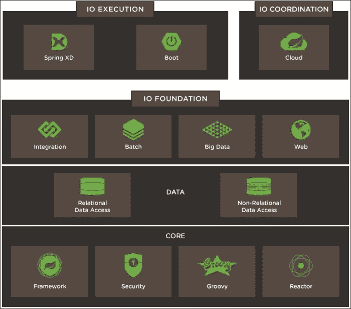

# 二十一、超越 SpringWeb

在本章中，我们将看到我们已经走了多远，我们已经解决了哪些问题，还有哪些问题有待解决。

我们将讨论 Spring 生态系统，特别是持久化、部署和单页应用。

# Spring 生态系统

从网络到数据，Spring 是一个综合生态系统，旨在以模块化方式解决各种问题：

在[查看 Spring IO 平台 https://spring.io/platform](https://spring.io/platform) 。

## 核心

在 Spring 框架的核心中，显然存在依赖注入机制。

我们只触及了安全特性和框架与 Groovy 的高度集成的表面。

## 执行

我们在中详细了解了 Spring Boot 的内容——为庞大的子项目网络带来了简单性和内聚性。

它允许您专注于真正重要的事情，即业务代码。

SpringXD 项目也非常有趣。其目标是提供处理、分析、转换或导出数据的工具，并明确关注大数据。有关更多信息，请访问[http://projects.spring.io/spring-xd](http://projects.spring.io/spring-xd) 。

## 数据

在开发我们的应用时，我们没有注意到的一件事是如何在数据库中存储数据。在 Pivotal 的参考体系结构中，有一层专门处理关系数据和非关系（NoSQL）数据。

Spring 生态系统在`spring-data`标签下提供了许多有趣的解决方案，可在[找到 http://projects.spring.io/spring-data/](http://projects.spring.io/spring-data/) 。

在构建缓存时，我们浏览了 SpringDataRedis，但 SpringData 还有很多内容。

基本概念在所有 Spring 数据项目中共享，例如模板 API，它是从持久化系统检索和存储对象的抽象。

Spring 数据 JPA（[http://projects.spring.io/spring-data-jpa/](http://projects.spring.io/spring-data-jpa/) 和弹簧数据 Mongo（[http://projects.spring.io/spring-data-mongodb/](http://projects.spring.io/spring-data-mongodb/) 是一些最著名的 Spring 数据项目。它们允许您通过存储库、提供创建查询工具的简单接口、持久化对象等对实体进行操作。

皮氏凯努莱宁（[http://www.petrikainulainen.net/spring-data-jpa-tutorial/](http://www.petrikainulainen.net/spring-data-jpa-tutorial/) 有很多关于弹簧数据的详细示例。它没有使用 Spring Boot 提供的功能，但您应该能够很容易地开始使用指南，例如在[上提供的指南 https://spring.io/guides/gs/accessing-data-jpa/](https://spring.io/guides/gs/accessing-data-jpa/) 。

SpringDataREST 也是一个神奇的项目，它将通过 RESTfulAPI 半自动地公开您的实体。访问[https://spring.io/guides/gs/accessing-data-rest/](https://spring.io/guides/gs/accessing-data-rest/) 获取详细教程。

## 其他值得关注的项目

Spring 集成（[http://projects.spring.io/spring-integration](http://projects.spring.io/spring-integration) 和弹簧反应器（[http://projectreactor.io](http://projectreactor.io) 也是我最喜欢的两个 Spring 项目。

Spring Reactor 是由 Pivotal 实现的反应流。其思想是在服务器端提供完全非阻塞 IO。

另一方面，Spring Integration 专注于企业集成模式，并允许您设计加载和转换来自异构系统的数据的通道。

您可以在这里看到一个很好且简单的示例，说明您可以使用频道完成哪些工作：[http://ilopmar.github.io/contest/#_spring_boot_application](http://ilopmar.github.io/contest/#_spring_boot_application) 。

如果您的应用必须与异构和/或复杂的子系统进行通信，那么一定值得一看。

Spring 生态系统中我们没有的最后一个项目是 Spring Batch，这是一个非常有用的抽象，用于为企业系统的日常操作处理大量数据。

# 部署

SpringBoot 提供了作为一个简单的 JAR 运行和分发 Spring 应用的能力，在这方面是一个极好的成功。

毫无疑问，这是朝着正确的方向迈出的一步，但有时您想要部署的不仅仅是 web 应用。

当处理一个包含多个服务器和数据源的复杂系统时，操作团队的工作可能会变得相当令人头痛。

## 码头工人

谁没听说过 Docker 的事？它是容器世界中新的酷儿，由于其充满活力的社区，它已经取得了相当大的成功。

Docker 背后的想法并不新鲜，它利用 LinuX 容器（LXC）和 cGroup 为应用提供一个完全隔离的运行环境。

您可以在 Spring 网站上找到一个教程，该教程将指导您完成 Docker 在[上的第一步 https://spring.io/guides/gs/spring-boot-docker](https://spring.io/guides/gs/spring-boot-docker) 。

Pivotal Cloud Foundry 多年来一直在其名为 Warden 的容器管理器中使用容器技术。他们最近搬到了 Garden，这个抽象不仅支持 Linux 容器，还支持 Windows 容器。

Garden 是 Cloud Foundry（称为 Diego）最新版本的一部分，该版本还允许 Docker 映像作为部署单元。

Cloud Foundry 的开发者版本也以 Lattice 的名义发布，可在[找到 https://spring.io/blog/2015/04/06/lattice-and-spring-cloud-resilient-sub-structure-for-your-cloud-native-spring-applications](https://spring.io/blog/2015/04/06/lattice-and-spring-cloud-resilient-sub-structure-for-your-cloud-native-spring-applications) 。

如果您想测试容器而不需要命令行的麻烦，我建议您看看 Kitematic。这样，您就可以运行 Jenkins 容器或 MongoDB，而无需在系统上安装二进制文件。访问[https://kitematic.com/](https://kitematic.com/) 了解更多有关 Kitematic 的信息。

Docker 生态系统中另一个值得一提的工具是 Docker Compose。它允许您使用单个配置文件运行和链接多个容器。

参见[http://java.dzone.com/articles/spring-session-demonstration](http://java.dzone.com/articles/spring-session-demonstration) 这是一个很好的 Spring Boot 应用示例，它由两个 web 服务器组成，一个用于存储用户会话的 Redis 和一个用于进行负载平衡的 Nginx 实例。当然，关于 Docker Swarm 和 Docker Machine 还有很多需要学习的地方，Docker Swarm 可以让你用一个简单的命令来扩展你的应用，Docker Machine 可以在任何机器上为你创建 Docker 主机，包括云提供商。

GoogleKurbernetes 和 ApacheMesos 也是分布式系统的好例子，它们可以从 Docker 容器中获益匪浅。

# 单页申请

今天的大多数 web 应用都是用 JavaScript 编写的。Java 被降级到后端，在处理数据和业务规则方面起着重要作用。然而，大部分 GUI 工作现在都在客户端进行。

这在响应能力和用户体验方面有很好的理由，但这些应用增加了额外的复杂性。

开发人员现在必须精通 Java 和 JavaScript，而且一开始框架的数量可能会有点过多。

## 选手们

如果您想深入了解 JavaScript，我强烈推荐 Dave Syer 的 Spring 和 AngularJS 教程，该教程可在[上获得 https://spring.io/guides/tutorials/spring-security-and-angular-js](https://spring.io/guides/tutorials/spring-security-and-angular-js) 。

选择 JavaScript MVC 框架也可能有点困难。AngularJS 多年来一直受到 Java 社区的青睐，但人们似乎正在远离它。欲了解更多信息，请访问[https://gist.github.com/tdd/5ba48ba5a2a179f2d0fa](https://gist.github.com/tdd/5ba48ba5a2a179f2d0fa) 。

其他备选方案包括：

*   **BackboneJS**：这是一个非常简单的 MVC 框架，位于下划线和 jQuery 之上。
*   **余烬**：这是一个全面的系统，提供了更多与数据交互的设施和更多功能。
*   **React**：这是 Facebook 最新的项目。它有一个新的和非常有趣的哲学来处理观点。它的学习曲线非常陡峭，但从设计 GUI 框架的角度来看，它是一个非常有趣的系统。

React 是我现在最喜欢的项目。它让你专注于视图，它的单向数据流使你很容易对应用的状态进行推理。但是，它仍然是 0.13 版。这使得它既非常有趣，因为充满活力的社区总是会提出新的解决方案和想法，也有点令人不安，因为即使经过两年多的开源开发，前面的道路似乎仍然漫长。访问[https://facebook.github.io/react/blog/2014/03/28/the-road-to-1.0.html](https://facebook.github.io/react/blog/2014/03/28/the-road-to-1.0.html) 了解“通往 1.0 之路”的信息。

## 未来

我看到很多 Java 开发人员对 JavaScript 的允许性大喊大叫，并且很难处理它不是强类型语言这一事实。

还有其他的选择，例如**类型脚本**（[http://www.typescriptlang.org/](http://www.typescriptlang.org/) ），它非常有趣，提供了我们 Java 开发人员一直用来简化生活的东西：接口、类、IDE 中的有用支持和自动完成。

很多人打赌 Angular 的下一个版本（2.0）将会打破一切。我认为这是最好的。他们与微软的 Typescript 团队的合作非常独特。

当大多数 JEE 开发人员听说 ECMAScript 的一大新特性（允许开发这个新框架）是 decorators（某种注释机制）时，他们都会笑：

### 注

要了解注释和装饰之间的区别，请访问[http://blog.thoughtram.io/angular/2015/05/03/the-difference-between-annotations-and-decorators.html](http://blog.thoughtram.io/angular/2015/05/03/the-difference-between-annotations-and-decorators.html) 。

JavaScript 发展很快，ECMAScript 6 有许多有趣的特性，使其成为一种非常高级和复杂的语言。不要错过这条船；请看[https://github.com/lukehoban/es6features](https://github.com/lukehoban/es6features) 否则就太晚了！

web 组件规范也是一个游戏规则改变者。目标是提供可重用的 UI 组件，React 团队和 Angular 2 团队都计划与之交互。谷歌在网络组件 Polymer 的基础上开发了一个有趣的项目，该组件现在已经是 1.0 版了。

### 注

参见[中的文章 http://ng-learn.org/2014/12/Polymer/](http://ng-learn.org/2014/12/Polymer/) 了解更多关于这些项目的状态。

## 无国籍化

在处理 JavaScript 客户端时，依赖会话 cookie 不是最佳选择。大多数应用选择完全无状态，并使用令牌标识客户端。

如果你想坚持 Spring 课程，请看`HeaderHttpSessionStrategy`课程。它有一个使用 HTTP 头发送和检索会话的实现。这方面的一个例子可以在[中找到 https://drissamri.be/blog/2015/05/21/spr](https://drissamri.be/blog/2015/05/21/spr) 。

# 总结

Spring 生态系统非常广泛，可以为现代 web 应用开发人员提供很多东西。

很难找到一个 Spring 项目没有解决的问题。

该说再见了！我希望您喜欢我们的 SpringMVC 小旅程，它将帮助您在工作或业余时间愉快地开发和创建令人惊叹的项目。