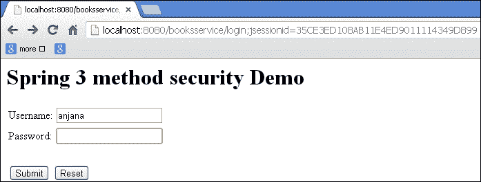
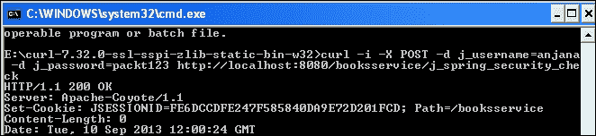
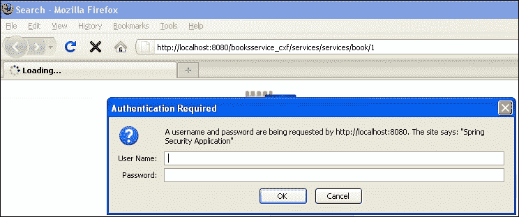
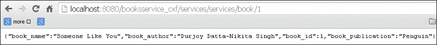
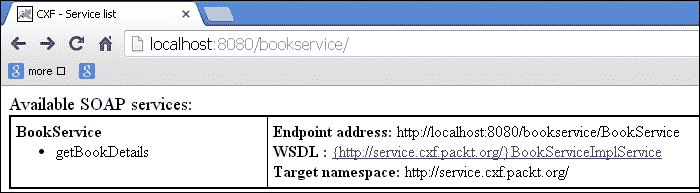

# 十、SpringSecurity 和 SpringWeb 服务

在本章中，我们将介绍：

*   在 RESTful web 服务上应用 SpringSecurity
*   使用 cURL 工具的 springrestfulweb 服务的 SpringSecurity
*   将 SpringSecurity 与 Apache CXF RESTful 服务集成
*   将 SpringSecurity 与基于 ApacheCXFSOAP 的 web 服务集成
*   将 SpringSecurity 与 Apache Camel 集成

# 导言

**SOAP**（**简单对象访问协议**是一种基于 XML 的 web 服务。它用于在 web 服务之间传输请求和响应消息。

**REST**（**代表性状态传输**是通过 HTTP 协议以 XML、文本或 JSON 文件的形式发送数据的一种方式。

在本节中，我们将把 SpringSecurity 应用于 web 服务。任何 web 服务的正常流程都是向最终用户公开服务 WSDL 或 URL。在应用 Spring Security 时，可以对最终用户进行身份验证并授权其使用服务。

# 在 RESTful web 服务上应用 SpringSecurity

REST 已经成为提供 web 服务的另一种方式。

可以使用 XML、文本或 JSON 格式在应用程序之间共享数据。RESTWeb 服务被认为是轻量级 web 服务。

让我们应用 SpringSecurity 来访问 RESTWeb 服务，这样只有经过授权的用户才能访问 RESTful web 服务。由于 RESTful web 服务是通过 URL 访问的，并且使用 HTTP 协议，因此我们可以轻松地应用 URL 级别的安全性。此示例演示了基于表单的身份验证。但用户也可以使用基本身份验证和摘要身份验证。

以下是 Spring 用来生成 RESTful web 服务的注释：

*   `@PathVariable`
*   `@RequestMapping`
*   `@RequestMethod`

## 准备好了吗

*   使用 SpringWebServiceAPI 创建 RESTfulWeb 服务
*   添加 SpringSecurity 依赖项
*   将弹簧过滤器配置添加到`Web.xml`文件中
*   配置`application-security.xml`文件
*   创建一个`AccessController`类来处理登录和注销操作
*   在应用程序中配置 SpringSecurity 以验证用户

## 怎么做。。。

以下是将 RESTful web 服务与 Spring Security 集成的步骤：

1.  让我们用`@PathVariable`创建一个`BookController`类，如下面的代码片段所示：

    ```java
    package org.springframework.rest;
    @Controller
    public class BookController {
      private static final Map<Integer, Books> books = new HashMap<Integer, Books>();
      static {
        try {
          books.put(1, new Books(1, "Someone Like You", "Penguin", "Durjoy Datta-Nikita Singh"));
          books.put(2, new Books(2, "The Secret Wish List", "Westland", " Preeti Shenoy"));
          books.put(3, new Books(3, "Love Stories That Touched My Heart ", "Metro Reads", " Preeti Shenoy"));
        } catch (Exception e) {
          e.printStackTrace();
        }
      }
      @RequestMapping(value = "/books/{book_id}", method = RequestMethod.GET)
      @ResponseBody
      public Books findCharacter(@PathVariable int book_id) {
        return books.get(book_id);
      }
    }
    ```

2.  使用`@JsonAutoDetect`注释创建一个`Books`POJO 类，如下代码片段所示：

    ```java
    @JsonAutoDetect
    public class Books {
        private int book_id;
        private String book_name;
        private String book_publication;
        private String book_author;
        public Books(int book_id, String book_name, String book_publication, String book_author) {
          this.book_id = book_id;
          this.book_name = book_name;
          this.book_publication = book_publication;
          this.book_author = book_author;
        }
        public String getBook_author() {
          return book_author;
        }
        public void setBook_author(String book_author) {
          this.book_author = book_author;
        }
        public int getBook_id() {
          return book_id;
        }
        public void setBook_id(int book_id) {
          this.book_id = book_id;
        }
        public String getBook_name() {
          return book_name;
        }
        public void setBook_name(String book_name) {
          this.book_name = book_name;
        }
        public String getBook_publication() {
          return book_publication;
        }
        public void setBook_publication(String book_publication) {
          this.book_publication = book_publication;
        }
    }
    ```

3.  创建一个`AccessController`类来处理登录和注销操作：

    ```java
    package org.springframework.booksservice;
    @Controller
    public class AccessController {
      @RequestMapping(value = "/", method = RequestMethod.GET)
      public String defaultPage(ModelMap map) {
        return "redirect:/login";
      }
      @RequestMapping(value = "/login", method = RequestMethod.GET)
      public String login(ModelMap model) {
        return "login";
      }
      @RequestMapping(value = "/accessdenied", method = RequestMethod.GET)
      public String loginerror(ModelMap model) {
        model.addAttribute("error", "true");
        return "denied";
      }
      @RequestMapping(value = "/logout", method = RequestMethod.GET)
      public String logout(ModelMap model) {
        return "logout";
      }
    }
    ```

4.  配置`Application-security.xml`文件，如下代码段所示：

    ```java
      <http auto-config="false"  use-expressions="true">
        <intercept-url pattern="/login" access="permitAll" />
        <intercept-url pattern="/logout" access="permitAll" />
        <intercept-url pattern="/accessdenied" access="permitAll" />
        <intercept-url pattern="/**" access="hasRole('ROLE_EDITOR')" />
        <form-login login-page="/login" default-target-url="/books" authentication-failure-url="/accessdenied" />
        <logout logout-success-url="/logout" />
      </http>
      <authentication-manager>
        <authentication-provider>
        <user-service>
          <user name="anjana" password="packt123" authorities="ROLE_EDITOR" />
        </user-service>
      </authentication-provider>
    </authentication-manager>
    ```

## 它是如何工作的。。。

访问 URL:`http://localhost:8080/booksservice/books/1`。这是基于 REST 的 URL，使用 Spring Security 限制访问。当用户调用基于 REST 的 web 服务 URL 时，Spring Security 会将用户重定向到登录页面。成功身份验证后，用户将重定向到授权的基于 REST 的 web 服务页面。

以下是使用 Spring Security 的基于 REST 的应用程序的工作流。您将被重定向到登录页面，如以下屏幕截图所示：



在认证和授权时，您将能够访问 RESTful web 服务，如以下屏幕截图所示：


## 另见

*   *将 SpringSecurity 与 Apache CXF RESTful web 服务*集成
*   *将 SpringSecurity 与 ApacheCXF 基于 SOAP 的 web 服务*集成
*   *将 SpringSecurity 与 Apache Camel*集成

# 使用 cURL 工具为 Spring RESTful web 服务提供 SpringSecurity

在这个示例中，我们显式地使用 SpringSecurity API 类和接口。我们将使用`curl`命令对 RESTful web 服务进行身份验证。使用 cURL 工具，您可以使用 URL 传输数据。它可以用来测试身份验证。这是同一个图书服务示例，它有一些与 SpringSecurity 相关的显式 API 类，如`AuthenticationEntryPoint`和`SimpleURLAuthenticationSuccessHandler`。这里的目标是演示它们在 SpringSecurity 中的内部用法。

## 准备好了吗

*   实现`AuthenticationEntryPoint`接口并在 XML 文件中配置
*   扩展`SimpleUrlAuthenticationSuccessHandler`并在 XML 文件中配置
*   配置`Application-security.xml`文件
*   将安全相关过滤器添加到`Web.xml`文件中
*   下载适用于您的操作系统的 cURL 工具

## 怎么做。。。

以下是使用`AuthenticationEntryPoint`接口和`SimpleURLAuthenticationSuccessHandler`类应用 SpringSecurity 认证授权机制的步骤：

1.  `AuthenticationEntryPoint`类是认证的入口类，实现`AuthenticationEntryPointImpl`类。

    ```java
    public final class AuthenticationEntryPointImpl implements AuthenticationEntryPoint {
      @Override
      public void commence(final HttpServletRequest request, final HttpServletResponse response, final AuthenticationException authException) throws IOException {
        response.sendError(HttpServletResponse.SC_UNAUTHORIZED, "Unauthorized");
      }
    }
    ```

2.  扩展`SimpleURLAuthenticationSuccessHandler`类，如代码片段所示：

    ```java
      public class MySimpleUrlAuthenticationSuccessHandler extends SimpleUrlAuthenticationSuccessHandler {
        private RequestCache requestCache = new HttpSessionRequestCache();
        @Override
        public void onAuthenticationSuccess(final HttpServletRequest request, final HttpServletResponse response, final Authentication authentication) throws ServletException, IOException {
          final SavedRequest savedRequest = requestCache.getRequest(request, response);
          if (savedRequest == null) {
            clearAuthenticationAttributes(request);
            return;
          }
          final String targetUrlParameter = getTargetUrlParameter();
          if (isAlwaysUseDefaultTargetUrl() || (targetUrlParameter != null && StringUtils.hasText(request.getParameter(targetUrlParameter)))) {
            requestCache.removeRequest(request, response);
            clearAuthenticationAttributes(request);
            return;
          }
          clearAuthenticationAttributes(request);
        }
        public void setRequestCache(final RequestCache requestCache) {
          this.requestCache = requestCache;
        }
      }
    ```

3.  配置`Application-security.xml`文件。

    ```java
      <http entry-point-ref="authenticationEntryPoint">
        <intercept-url pattern="/**" access="ROLE_EDITOR"/>
        <form-login authentication-success-handler-ref="mySuccessHandler" />
        <logout />
      </http>
      <beans:bean id="mySuccessHandler"class="org.springframework.booksservice.MySimpleUrlAuthenticationSuccessHandler"/>
      <beans:bean id="authenticationEntryPoint"class="org.springframework.booksservice.AuthenticationEntryPointImpl"/>
      <authentication-manager>
        <authentication-provider>
          <user-service>
            <user name="anjana" password="packt123" authorities="ROLE_EDITOR" />
          </user-service>
        </authentication-provider>
      </authentication-manager>
      </beans:beans>
    ```

## 它是如何工作的。。。

现在访问网址：`http://localhost:8080/booksservice/books/1`

您将看到一个页面，上面显示您无权查看这些页面。

让我们使用 cURL 工具，它为我们提供了一个 cookie。`200 OK`消息意味着我们已通过身份验证。

```java
Command: curl -i -X POST -d j_username=anjana -d j_password=packt123 http://localhost:8080/booksservice/j_spring_security_check
curl -i --header "Accept:application/json" -X GET -b cookies.txt http://localhost:8080/booksservice/books/1

```

cookies 存储在名为`mycookies.txt`的文件中。




## 另见

*   *将 SpringSecurity 与 Apache CXF RESTful web 服务*集成
*   *将 SpringSecurity 与 ApacheCXF 基于 SOAP 的 web 服务*集成
*   *将 SpringSecurity 与 Apache Camel*集成

# 将 SpringSecurity 与 Apache CXF RESTful web 服务集成

在这一节中，让我们创建一个 ApacheCXF RESTful web 服务。它是一个开源的 web 服务框架。让我们在此演示中使用基本身份验证。

CXF 支持契约优先和契约最后的 web 服务。它还支持 RESTfulWeb 服务。

让我们将 SpringSecurity 与 CXF 集成，并授权 RESTful web 服务。

## 准备好了吗

*   将`cxf`依赖项添加到`pom`文件中
*   使用 CXF 设置 RESTful web 服务
*   配置`spring-security.xml`文件

## 怎么做。。。

以下是将 Spring Security 与 Apache CXF RESTful web 服务集成的步骤：

1.  配置的的`Book`POJO 类。

    ```java
    @XmlRootElement(name = "book")
    public class Book {
        private int book_id;
        private String book_name;
        private String book_publication;
        private String book_author;
        public Book(int book_id, String book_name, String book_publication, String book_author) {
          this.book_id = book_id;
          this.book_name = book_name;
          this.book_publication = book_publication;
          this.book_author = book_author;
        }
        public String getBook_author() {
          return book_author;
        }
        public void setBook_author(String book_author) {
          this.book_author = book_author;
        }
        public int getBook_id() {
          return book_id;
        }
        public void setBook_id(int book_id) {
          this.book_id = book_id;
        }
        public String getBook_name() {
          return book_name;
        }
        public void setBook_name(String book_name) {
          this.book_name = book_name;
        }
        public String getBook_publication() {
          return book_publication;
        }
        public void setBook_publication(String book_publication) {
          this.book_publication = book_publication;
        }
    }
    ```

2.  配置的`BookCollection`POJO 类。

    ```java
      @XmlType(name = "BookCollection")
      @XmlRootElement
      public class BookCollection {
        private Collection books;
        public BookCollection() {
        }
        public BookCollection(Collection books) {
          this.books = books;
        }
        @XmlElement(name="books")
        @XmlElementWrapper(name="books")
        public Collection getUsers() {
          return books;
        }
      }
    ```

3.  配置`BookService`接口。

    ```java
    public interface BookService {
        BookCollection getBooks();
        Book getBook(Integer id);
        Response add(Book book);
    }
    ```

4.  配置`BookServiceImpl`类。

    ```java
      @Path ("/services/")
      public class BookServiceImpl implements BookService {
        private static final Map<Integer, Book> books = new HashMap<Integer, Book>();
        private static int index = 4;
        static {
          try {
            books.put(1, new Book(1, "Someone Like You", "Penguin", "Durjoy Datta-Nikita Singh"));
              books.put(2, new Book(2, "The Secret Wish List", "Westland", " Preeti Shenoy"));
              books.put(3, new Book(3, "Love Stories That Touched My Heart ", "Metro Reads", " Preeti Shenoy"));
            } catch (Exception e) {
              e.printStackTrace();
            }
        }
     @Override
     @POST
     @Path("/book")
     @Consumes("application/json")
        public Response add(Book book) {
          System.out.println("Adding :" + book.getBook_name());
          book.setBook_id(index++);
          return Response.status(Response.Status.OK).build();
        }
     @Override
     @GET
     @Path("/book/{book_id}")
     @Produces("application/json")
        public Book getBook(@PathParam("book_id") Integer book_id) {
          return books.get(book_id);
        }
     @Override
     @GET
     @Path("/books")
     @Produces("application/json")
        public BookCollection getBooks() {
          return new BookCollection(books.values());
        }
    }
    ```

5.  配置的`application-security.xml`文件：

    ```java
      <sec:global-method-security pre-post-annotations="enabled" />
      <sec:http auto-config="true"  use-expressions="true">
        <sec:intercept-url pattern="/**" access="hasRole('ROLE_EDITOR')"/>
        <sec:http-basic></sec:http-basic>
        <sec:logout logout-success-url="/logout" />
      </sec:http>
      <import resource="classpath:META-INF/cxf/cxf.xml" />
      <import resource="classpath:META-INF/cxf/cxf-servlet.xml"/>
      <jaxrs:server address="/" id="myService">
        <jaxrs:serviceBeans>
          <ref bean="bookserviceImpl"/>
        </jaxrs:serviceBeans>
        <jaxrs:providers>
          <ref bean="jacksonProvider"/>
        </jaxrs:providers>
      </jaxrs:server>
      <bean id="jacksonProvider"
      class="org.codehaus.jackson.jaxrs.JacksonJaxbJsonProvider"/>
      <bean id="bookserviceImpl"
      class="org.springframework.booksservice.BookServiceImpl"/>
      <sec:authentication-manager>
        <sec:authentication-provider>
          <sec:user-service>
            <sec:user name="anjana" password="packt123" authorities="ROLE_EDITOR" />
          </sec:user-service>
        </sec:authentication-provider>
      </sec:authentication-manager>
    </beans>
    ```

6.  配置的`Web.xml`文件。

    ```java
        <!-- The definition of the Root Spring Container shared by all Servlets and Filters -->
      <context-param>
        <param-name>contextConfigLocation</param-name>
        <param-value>/WEB-INF/spring/application-security.xml</param-value>
      </context-param>
      <!-- Creates the Spring Container shared by all Servlets and Filters -->
      <listener>
      <listener-class>org.springframework.web.context.ContextLoaderListener</listener-class>
      </listener>
      <!-- Processes application requests -->
      <servlet>
        <servlet-name>cxf</servlet-name>
        <servlet-class>org.apache.cxf.transport.servlet.CXFServlet</servlet-class>
        <load-on-startup>1</load-on-startup>
      </servlet>
      <servlet-mapping>
        <servlet-name>cxf</servlet-name>
        <url-pattern>/services/*</url-pattern>
      </servlet-mapping>
      <!-- Spring child -->
      <!-- <servlet>
      <servlet-name>bookservice_cxf</servlet-name>
        <servlet-class>org.springframework.web.servlet.DispatcherServlet</servlet-class>
        <load-on-startup>1</load-on-startup>
      </servlet>
      <servlet-mapping>
        <servlet-name>bookservice_cxf</servlet-name>
        <url-pattern>/bookservice_cxf/*</url-pattern>
      </servlet-mapping>-->
      <filter>
        <filter-name>springSecurityFilterChain</filter-name>
        <filter-class>org.springframework.web.filter.DelegatingFilterProxy</filter-class>
      </filter>
      <filter-mapping>
        <filter-name>springSecurityFilterChain</filter-name>
        <url-pattern>/*</url-pattern>
      </filter-mapping>
    </web-app>
    ```

## 它是如何工作的。。。

RESTful 服务由本例中的 CXF 框架提供。然后将应用程序与 Spring Security 集成，以便为 RESTful web 服务提供安全的身份验证和授权模块。Spring Security filter chain 管理身份验证和授权过程。当您访问该服务时，系统将提示您登录，如下面的屏幕截图所示。登录后，您可以查看 RESTful 数据。Mozilla Firefox 浏览器将提示用户以文件格式下载数据。



现在访问 URL:`http://localhost:8080/booksservice_cxf/services/services/book/1`



## 另见

*   *将 SpringSecurity 与 Apache CXF RESTful web 服务*集成
*   *将 SpringSecurity 与 Apache Camel*集成

# 将 SpringSecurity 与基于 ApacheCXF SOAP 的 web 服务集成

在这一节中，让我们创建一个基于 SOAP 的 web 服务。我们将演示 SpringSecurity 与基于 ApacheCXFSOAP 的 web 服务的集成。

使用 ApacheCXF 创建基于 SOAP 的 web 服务已成为一个简单的过程。

## 准备好了吗

*   将 CXF-SOAP 依赖项添加到`pom`文件中。
*   在`pom`文件中添加基于 SpringSecurity 的依赖项。
*   使用`interface`和`Impl`类设置基于 SOAP 的 web 服务。
*   配置`spring-security.xml`文件。
*   将 JAR 添加到`Tomcat_7.0/lib`文件夹作为设置的一部分。Tomcat 需要其`lib`文件夹中的以下 jar 文件才能使用 CXF web 服务。缺少这些 JAR 可能会导致一些错误：
    *   `streambuffer.jar`
    *   `stax-ex`
    *   `jaxws-ap-2.1`
    *   `jaxws-rt`

## 怎么做。。。

以下是将基于 Apache CXF SOAP 的 web 服务与 Spring Security 集成的步骤：

1.  `Book`POJO 有 getter 和 setter 方法。它还有一个参数化构造函数。在`BookService`接口中使用`Book`POJO，提供客户端应用程序请求的`Book`的详细信息。

    ```java
    package org.packt.cxf.domain;
    public class Book {
      private int book_id;
      private String book_name;
      private String book_publication;
      private String book_author;
      public Book() {
      }
      public Book(int book_id, String book_name, String book_publication, String book_author) {
        this.book_id = book_id;
        this.book_name = book_name;
        this.book_publication = book_publication;
        this.book_author = book_author;
      }
      public String getBook_author() {
        return book_author;
        }
        public void setBook_author(String book_author) {
            this.book_author = book_author;
      }
      public int getBook_id() {
        return book_id;
      }
      public void setBook_id(int book_id) {
        this.book_id = book_id;
      }
      public String getBook_name() {
        return book_name;
      }
      public void setBook_name(String book_name) {
        this.book_name = book_name;
      }
      public String getBook_publication() {
        return book_publication;
      }
      public void setBook_publication(String book_publication) {
        this.book_publication = book_publication;
      }
    }
    ```

2.  `BookService`接口是用`@WebService`注释创建的，在中`getBookDetails`是 WSDL 中的服务方法。

    ```java
    package org.packt.cxf.service;
    import javax.jws.WebService;
    import org.packt.cxf.domain.Book;
    @WebService
    public interface BookService {
      public Book getBookDetails(int book_id);
    }
    ```

3.  `BookServiceImpl`类是`BookService`接口的实现类，通过`@webservice`注释包`org.packt.cxf.service`配置为端点接口。

    ```java
    import java.util.HashMap;
    import java.util.Map;
    import javax.jws.WebService;
    import org.packt.cxf.domain.Book;
    @WebService(endpointInterface = "org.packt.cxf.service.BookService")
    public class BookServiceImpl implements BookService{
        private static final Map<Integer, Book> books = new HashMap<Integer, Book>();
        private static int index = 4;
        static {
          try {
            books.put(1, new Book(1, "Someone Like You", "Penguin", "Durjoy Datta-Nikita Singh"));
            books.put(2, new Book(2, "The Secret Wish List", "Westland", " Preeti Shenoy"));
            books.put(3, new Book(3, "Love Stories That Touched My Heart ", "Metro Reads", " Preeti Shenoy"));
          } catch (Exception e) {
            e.printStackTrace();
          }
        }
        @Override
        public Book getBookDetails(int book_id) {
          return books.get(book_id);
        }}
    ```

4.  在的的`Cxf-servlet.xml`文件中，我们注册了 web 服务接口和实现类。

    ```java
      <beans 
      xmlns:xsi="http://www.w3.org/2001/XMLSchema-instance" xmlns:jaxws="http://cxf.apache.org/jaxws"
      xsi:schemaLocation="http://www.springframework.org/schema/beans http://www.springframework.org/schema/beans/spring-beans.xsdhttp://cxf.apache.org/jaxwshttp://cxf.apache.org/schemas/jaxws.xsd">
      <import resource="classpath:META-INF/cxf/cxf.xml" />
      <import resource="classpath:META-INF/cxf/cxf-servlet.xml" />
      <import resource="classpath:META-INF/cxf/cxf-extension-http.xml" />
      <import resource="classpath:META-INF/cxf/cxf-extension-soap.xml" />
      <jaxws:endpoint id="bookService"implementor="org.packt.cxf.service.BookServiceImpl" address="/BookService" />
      </beans>
    ```

5.  在`Web.xml`文件中，我们参考`cxf-servlet.xml`的位置并配置`CXFSservlet`。

    ```java
      <web-app version="2.5"  xmlns:xsi="http://www.w3.org/2001/XMLSchema-instance" xsi:schemaLocation="http://java.sun.com/xml/ns/javaee http://java.sun.com/xml/ns/javaee/web-app_2_5.xsd">
        <display-name>SampleWSCxf</display-name>
        <listener>
          <listener-class>org.springframework.web.context.ContextLoaderListener</listener-class>
        </listener>
        <context-param>
          <param-name>contextConfigLocation</param-name>
          <param-value>WEB-INF/cxf-servlet.xml</param-value>
        </context-param>
        <servlet>
          <servlet-name>CXFServlet</servlet-name>
          <servlet-class>org.apache.cxf.transport.servlet.CXFServlet</servlet-class>
          <load-on-startup>1</load-on-startup>
        </servlet>
        <servlet-mapping>
          <servlet-name>CXFServlet</servlet-name>
          <url-pattern>/*</url-pattern>
        </servlet-mapping>
      </web-app>
    ```

## 它是如何工作的。。。

在这一节中，我们将演示 web 服务上的基本身份验证。访问网址：`http://localhost:8080/bookservice/`

我们使用了 CXF 框架来创建基于 SOAP 的 web 服务。当用户访问 URL 时，预期的行为是授予对 WSDL 及其服务的访问权。但是 SpringSecurity 会中断请求，并为用户弹出一个登录对话框。成功进行身份验证后，用户可以访问 WSDL。




生成的 WSDL 可在以下 URL 获取：`http://localhost:8080/bookservice/BookService?wsdl`

```java
<wsdl:definitions xmlns:ns1="http://cxf.apache.org/bindings/xformat" xmlns:soap="http://schemas.xmlsoap.org/wsdl/soap/"xmlns:tns="http://service.cxf.packt.org/" xmlns:wsdl="http://schemas.xmlsoap.org/wsdl/"xmlns:xsd="http://www.w3.org/2001/XMLSchema" name="BookServiceImplService" targetNamespace="http://service.cxf.packt.org/">
  <wsdl:types>
  <xs:schema xmlns:tns="http://service.cxf.packt.org/"xmlns:xs="http://www.w3.org/2001/XMLSchema"elementFormDefault="unqualified" targetNamespace="http://service.cxf.packt.org/" version="1.0">
  <xs:element name="getBookDetails"type="tns:getBookDetails"/>
  <xs:element name="getBookDetailsResponse" type="tns:getBookDetailsResponse"/>
  <xs:complexType name="getBookDetails">
    <xs:sequence>
      <xs:element name="arg0" type="xs:int"/>
    </xs:sequence>
  </xs:complexType>
  <xs:complexType name="getBookDetailsResponse">
    <xs:sequence>
      <xs:element minOccurs="0" name="return"type="tns:book"/>
    </xs:sequence>
  </xs:complexType>
  <xs:complexType name="book">
    <xs:sequence>
      <xs:element minOccurs="0" name="book_author" type="xs:string"/>
      <xs:element name="book_id" type="xs:int"/>
      <xs:element minOccurs="0" name="book_name" type="xs:string"/>
      <xs:element minOccurs="0" name="book_publication" type="xs:string"/>
      </xs:sequence>
    </xs:complexType>
  </xs:schema>
  </wsdl:types>
  <wsdl:message name="getBookDetails">
    <wsdl:part element="tns:getBookDetails" name="parameters"></wsdl:part>
  </wsdl:message>
  <wsdl:message name="getBookDetailsResponse">
    <wsdl:part element="tns:getBookDetailsResponse" name="parameters"></wsdl:part>
    </wsdl:message>
  <wsdl:portType name="BookService">
    <wsdl:operation name="getBookDetails">
      <wsdl:input message="tns:getBookDetails"name="getBookDetails"></wsdl:input>
      <wsdl:outputmessage="tns:getBookDetailsResponse"name="getBookDetailsResponse"></wsdl:output>
    </wsdl:operation>
  </wsdl:portType>
  <wsdl:bindingname="BookServiceImplServiceSoapBinding"type="tns:BookService">
    <soap:bindingstyle="document"transport="http://schemas.xmlsoap.org/soap/http"/>
      <wsdl:operationname="getBookDetails">
        <soap:operationsoapAction=""style="document"/>
      <wsdl:inputname="getBookDetails">
        <soap:bodyuse="literal"/>
      </wsdl:input>
      <wsdl:outputname="getBookDetailsResponse">
        <soap:bodyuse="literal"/>
      </wsdl:output>
    </wsdl:operation>
  </wsdl:binding>
  <wsdl:servicename="BookServiceImplService">
    <wsdl:portbinding="tns:BookServiceImplServiceSoapBinding"name="BookServiceImplPort">
      <soap:addresslocation="http://localhost:8080/bookservice/BookService"/>
    </wsdl:port>
  </wsdl:service>
</wsdl:definitions>
```

## 另见

*   *将 SpringSecurity 与 Apache CXF RESTful web 服务*集成
*   *将 SpringSecurity 与 Apache Camel*集成

# 将 SpringSecurity 与 Apache Camel 集成

ApacheCamel 可用于定义路由和中介应用程序的规则。SpringSecurity 可与 Apache Camel 一起用于对路由器进行身份验证。SpringSecurity 身份验证策略对象控制对路由器的访问。SpringSecurity 身份验证策略对象包含角色信息，并引用了 Spring 身份验证管理器。您可以从网站下载源代码。

## 准备好了吗

*   创建骆驼上下文
*   使用 XML 配置添加路由规则
*   在 Spring XML 文件中，配置以下内容：
    *   访问决策管理器
    *   角色投票人
    *   身份验证管理器
    *   用户详细信息服务
*   配置具有权限的身份验证策略对象
*   添加`camel-spring-security`依赖项

## 怎么做。。。

以下是将 Apache Camel 与 Spring Security 集成的步骤：

1.  创建`Camel–context.xml`文件，并使用 Spring Security 定义路由规则。

    ```java
      <spring-security:http realm="User Access Realm">
        <spring-security:intercept-url pattern="/apachecamel/**"     access="ROLE_EDITOR"/>
        <spring-security:http-basic/>
        <spring-security:remember-me/>
      </spring-security:http>
      <spring-security:authentication-manager alias="authenticationManager">
        <spring-security:authentication-provider user-service-ref="userDetailsService"/>
      </spring-security:authentication-manager>
      <spring-security:user-service id="userDetailsService">
        <spring-security:user name="anju" password="anju123" authorities="ROLE_EDITOR,ROLE_AUTHOR"/>
        <spring-security:user name="shami" password="shami123" authorities="ROLE_EDITOR"/>
      </spring-security:user-service>
      <bean id="accessDecisionManager" class="org.springframework.security.access.vote.AffirmativeBased">
        <property name="allowIfAllAbstainDecisions" value="true"/>
        <property name="decisionVoters">
          <list>
            <bean class="org.springframework.security.access.vote.RoleVoter"/>
          </list>
        </property>
      </bean>
      <!-- The Policy for checking the authentication role of AUTHOR -->
      <authorizationPolicy id="author" access="ROLE_AUTHOR"
        authenticationManager="authenticationManager"
        accessDecisionManager="accessDecisionManager"
        />
      <!-- The Policy for checking the authentication role of EDITOR -->
      <authorizationPolicy id="editor" access="ROLE_EDITOR"/>
      <camelContext id="myCamelContext" >
        <!-- Catch the authorization exception and set the Access Denied message back -->
        <onException>
        <exception>org.apache.camel.CamelAuthorizationException</exception>
        <handled>
          <constant>true</constant>
        </handled>
        <transform>
          <simple>Access Denied with the Policy of ${exception.policyId} !</simple>
          </transform>
        </onException>
     <route>
     <from uri="servlet:///editor"/>
     <!-- wrap the route in the policy which enforces security check -->
     <policy ref="editor">
     <transform>
     <simple>Normal user can access this service</simple>
     </transform>
     </policy>
     </route>
     <route>
     <from uri="servlet:///author"/>
     <!-- wrap the route in the policy which enforces security check -->
     <policy ref="author">
     <transform>
     <simple>Call the admin operation OK</simple>
     </transform>
     </policy>
     </route>
      </camelContext>
    </beans>
    ```

2.  在`Web.xml`中配置骆驼 servlet。

    ```java
    <!-- location of spring xml files -->
      <context-param>
        <param-name>contextConfigLocation</param-name>
        <param-value>classpath:camel-context.xml</param-value>
      </context-param>
      <!-- the listener that kick-starts Spring -->
      <listener>
        <listener-class>org.springframework.web.context.ContextLoaderListener</listener-class>
      </listener>
      <filter>
        <filter-name>springSecurityFilterChain</filter-name>
        <filter-class>org.springframework.web.filter.DelegatingFilterProxy</filter-class>
      </filter>
      <filter-mapping>
        <filter-name>springSecurityFilterChain</filter-name>
        <url-pattern>/*</url-pattern>
      </filter-mapping>
      <servlet>
        <servlet-name>CamelServlet</servlet-name>
        <servlet-class>org.apache.camel.component.servlet.CamelHttpTransportServlet</servlet-class>
        <load-on-startup>1</load-on-startup>
      </servlet>
      <servlet-mapping>
        <servlet-name>CamelServlet</servlet-name>
        <url-pattern>/apachecamel/*</url-pattern>
      </servlet-mapping>
    </web-app>
    ```

## 它是如何工作的。。。

现在访问网址：`http://localhost:8080/apachecamel/editor`

`camel-context.xml`文件有路由规则；`camel-context.xml`文件的位置在`Web.xml`和`CamelServlet`中配置，以处理路由机制。`<authorizationpolicy>` 标记处理`spring-security.xml`文件中配置的资源的身份验证和授权。`<spring-security:user-service>`标记包含在路由请求之前可以访问的用户和角色的详细信息。以下是 Apache Camel 使用 Spring Security 中断路由过程的工作流。用户被授权担任两个角色之一：`EDITOR`或`AUTHOR`。


## 另见

*   *将 SpringSecurity 与 Apache CXF RESTful web 服务*集成
*   *将 SpringSecurity 与 Apache Camel*集成