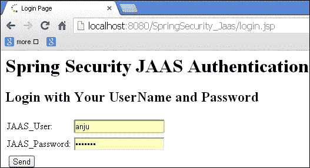

# 十一、关于 SpringSecurity 的更多内容

在本章中，我们将介绍：

*   具有多个身份验证提供者的 SpringSecurity
*   具有多输入身份验证的 SpringSecurity
*   SpringSecurity 与验证码集成
*   JAAS 的 springsecurity

# 导言

在本章中，我们将看到更多的 SpringSecurity 示例。让我们看看如何将 SpringSecurity 与多个身份验证提供者集成。我们还将看到一个使用带有多个输入的 Spring 进行身份验证的示例。

# 具有多个身份验证提供商的 SpringSecurity

SpringSecurity 提供了一个选项来添加许多身份验证提供者。筛选器链会检查每个身份验证提供程序，直到它成功通过身份验证。

在本节中，我们将了解如何配置多个身份验证提供程序，以及 Spring 如何使用多个身份验证提供程序进行身份验证。

例如，我们正在使用`horrormovie`应用程序，其中身份验证和授权由 Spring Security 和数据库处理。

## 准备好了吗

*   创建 maven web 项目
*   添加`spring-security`依赖项
*   添加与 spring 核心相关的依赖项
*   在`Web.xml`文件中配置 Spring 上下文侦听器
*   创建`AddHorroMovieController.java`控制器，添加添加、删除、列表的请求映射方法
*   使用其他身份验证提供商编辑`application-security.xml`文件

## 怎么做。。。

以下是将多个认证提供商与 Spring Security 集成的步骤：

1.  编辑`application-security.xml`文件。

    ```java
      <authentication-manager alias="authentication Manager">
        <authentication-provider>
     <jdbc-user-service data-source-ref="tenant1DataSource"users-by-username-query=" select username, password ,'true' as enabled from users where username=?"authorities-by-username-query=" select u.username as username, ur.authority as authority from users u, user_roles ur where u.user_id = ur.user_id and u.username =?" />
        </authentication-provider>
     <authentication-provider>
     <user-service>
     <user name="anjana" password="anjana123" authorities="ROLE_EDITOR"/>
     <user name="raghu" password="raghu123" authorities="ROLE_AUTHOR"/>
     <user name="shami" password="shami123" authorities="ROLE_EDITOR"/>
     </user-service>
     </authentication-provider>
      </authentication-manager>
    ```

## 它是如何工作的。。。

在 GlassFish 应用服务器上部署应用程序；访问以下 URL:`http://localhost:8080/list`并使用用户名/密码（`Vikash`/`Vikash123`登录。

这是在 derby 数据库中创建的具有访问权限的用户（`ROLE_EDITOR`。

然后注销并再次登录，用户名为`shami`，密码为`shami123`。在此，用户由两个认证提供者以顺序方式进行认证。


## 另见

*   具有多输入认证的*Spring Security*配方
*   *Spring Security 与验证码集成*配方
*   使用 JAAS 配方的*SpringSecurity*

# 具有多输入身份验证的 Spring Security

在部分中，我们将演示多输入验证。这也称为双因素身份验证。到目前为止，在我们的所有示例中，我们都是根据用户名和密码进行身份验证。在本例中，我们将为电话号码和用户名提供另一个字段。它与 hibernate 和 derby 数据库是相同的`horrormovie`应用程序。

## 准备好了吗

*   创建自定义筛选器以处理新的登录表单
*   在`Springsecurity.xml`文件中配置自定义过滤器
*   更新`UserDetailsService`实现类以处理额外的输入
*   在数据库中添加一个名为`MOBILE_NO`的额外列
*   更新`login.jsp`文件，以`MOBILE_NO`作为输入

## 怎么做。。。

以下是使用 Spring Security 实现多输入认证的步骤：

1.  创建一个名为`MultipleInputAuthenticationFilter`的自定义筛选器以提取额外的手机号码参数。

    ```java
      public class MultipleInputAuthenticationFilter extends UsernamePasswordAuthenticationFilter{
        private String extraParameter = "mobile_no";

        public String getExtraParameter() {
            return extraParameter;
        }

        public void setExtraParameter(String extraParameter) {
          this.extraParameter = extraParameter;
        }
        private String delimiter = ":";

        @Override
        protected String obtainUsername(HttpServletRequest request)
          {
            String username = request.getParameter(getUsernameParameter());
            String mobile_no = request.getParameter(getExtraParameter());
            String combinedUsername = username + getDelimiter() + mobile_no;
            System.out.println("Combined username = " + combinedUsername);
            return combinedUsername;
          }

        public String getDelimiter()
        {
          return this.delimiter;
        }
        /**
          * @param delimiter The delimiter string used to separate the username and extra input values in the
            * string returned by <code>obtainUsername()</code>
        */
        public void setDelimiter(String delimiter) {
          this.delimiter = delimiter;
        }
    ```

2.  更新文件处理自定义过滤器。

    ```java
      <global-method-security pre-post-annotations="enabled" />
        <http auto-config="false"  use-expressions="true" entry-point-ref="loginUrlAuthenticationEntryPoint">
          <intercept-url pattern="/login" access="permitAll" />
          <intercept-url pattern="/logout" access="permitAll" />
          <intercept-url pattern="/accessdenied" access="permitAll" />
          <intercept-url pattern="/list" access="hasRole('ROLE_EDITOR')" />
          <intercept-url pattern="/add" access="hasRole('ROLE_EDITOR')" />
          <custom-filter position="FORM_LOGIN_FILTER" ref="multipleInputAuthenticationFilter" />
          <!--<form-login login-page="/login" default-target-url="/list" authentication-failure-url="/accessdenied" />-->
          <logout logout-success-url="/logout" />
        </http>
        <authentication-manager alias="authenticationManager">
          <authentication-provider user-service-ref="MyUserDetails">
            <password-encoder hash="plaintext" />
          </authentication-provider>
        </authentication-manager>
     <beans:bean id="multipleInputAuthenticationFilter" class="com.packt.springsecurity.controller.MultipleInputAuthenticationFilter">
     <beans:property name="authenticationManager" ref="authenticationManager" />
     <beans:property name="authenticationFailureHandler" ref="failureHandler" />
     <beans:property name="authenticationSuccessHandler" ref="successHandler" />
     <beans:property name="filterProcessesUrl" value="/j_spring_security_check" />
     <beans:property name="postOnly" value="true" />
     <beans:property name="extraParameter" value="mobile_no" />
     </beans:bean>
        <beans:bean id="horrorMovieDAO" class="com.packt.springsecurity.dao.HorrorMovieDaoImpl" />
        <beans:bean id="horrorMovieManager" class="com.packt.springsecurity.service.HorrorMovieManagerImpl" />
        <beans:bean id="UsersDAO" class="com.packt.springsecurity.dao.UsersDAOImpl" />
        <beans:bean id="UsersManager" class="com.packt.springsecurity.service.UsersManagerImpl" />
        <beans:bean id="UserRoleDAO" class="com.packt.springsecurity.dao.UserRoleDAOImpl" />
        <beans:bean id="UserRoleManager" class="com.packt.springsecurity.service.UserRoleManagerImpl" />
        <beans:bean id="loginUrlAuthenticationEntryPoint" class="org.springframework.security.web.authentication.LoginUrlAuthenticationEntryPoint">
          <beans:property name="loginFormUrl" value="/login" />
        </beans:bean>
        <beans:bean id="successHandler" class="org.springframework.security.web.authentication.SavedRequestAwareAuthenticationSuccessHandler">
          <beans:property name="defaultTargetUrl" value="/list" />
        </beans:bean>

        <beans:bean id="failureHandler" class="org.springframework.security.web.authentication.SimpleUrlAuthenticationFailureHandler">
          <beans:property name="defaultFailureUrl" value="/accessdenied" />
        </beans:bean>
     <beans:bean id="MyUserDetails" class="com.packt.springsecurity.service.MyUserDetails" />
     </beans:beans> 

    ```

3.  更新`UsersDAOImpl`以处理额外的输入。

    ```java
    @Override
     @Transactional
     public Users findByUserNameMobile(String userName, String mobile_no) {
     List<Users> userList = new ArrayList<Users>();
     Query query = (Query) sessionFactory.getCurrentSession().createQuery("from Users u where u.userName = :userName and u.mobile_no=:mobile_no");
     query.setParameter("userName", userName);
     query.setInteger("mobile_no", Integer.parseInt(mobile_no));
     userList = query.list();
     if (userList.size() > 0) {
     return userList.get(0);
     } else {
     return null;
     }
     }

    ```

4.  实现类中的方法，该类实现`UserDetailsService`接口来处理额外的输入。

    ```java
    public UserDetails loadUserByUsername(String str)throws UsernameNotFoundException {
     String[] splitstring = str.split(":");
     if (splitstring.length < 2) {
     System.out.println("User did not enter both username and mobile number.");
     throw new UsernameNotFoundException("Must specify both username and mobile number");
     }
     String username = splitstring[0];
     String mobile = splitstring[1];

     System.out.println("Username = " + username);
     System.out.println("Mobile = " + mobile);

     Users users = UsersDAO.findByUserNameMobile(username, mobile);
     boolean enabled = true;
     boolean accountNonExpired = true;
     boolean credentialsNonExpired = true;
     boolean accountNonLocked = true;
     return new User(
     users.getUserName(),
     users.getUserPassword(),
     enabled,
     accountNonExpired,
     credentialsNonExpired,
     accountNonLocked,
     getAuthorities(users.getRole().getRoleId().intValue()));
    }

    ```

## 它是如何工作的。。。

访问以下 URL:`http://localhost:8080/SpringSecurity_MultipleInputAuth/login`

用户不仅使用本书中使用的所有应用程序中演示的用户名和密码进行身份验证，还使用手机号码参数进行身份验证。

当用户在登录页面提交信息并点击**SubmitQuery**时，用户名和手机号会被一个分隔符勾住，Spring Security 将调用`MyUserDetails`类，该类将再次拆分参数并根据用户使用 hibernate 提供的输入对用户进行身份验证。

成功验证后，用户将重定向到授权页面。


## 另见

*   多认证提供商的*SpringSecurity*配方
*   *Spring Security 与验证码集成*配方
*   使用 JAAS 配方的*SpringSecurity*

# Spring Security 与验证码集成

让我们演示 SpringSecurity 与 Captcha 的集成。为此，我们下载了一个`Kaptcha.jar`验证码提供商。我们需要将 jar 文件安装到 maven 本地存储库中，应用程序才能工作。

该示例是前一个配方的扩展，其中 Spring Security 考虑了一个额外的输入，即移动号码，用于授权和身份验证。在本例中，我们将从用户处获得用户名和密码的代码以及验证码。用户名根据数据库进行身份验证，并且还比较请求的验证码和用户输入的验证码。

当整个条件匹配时，称用户已通过身份验证，否则身份验证失败。

## 准备好了吗

*   将`Kaptcha`servlet 添加到`Web.xml`文件中
*   在`Springsecurity.xml`文件中配置自定义过滤器
*   更新`UserDetailsService`实现类处理`Kaptcha`
*   更新`login.jsp`文件，以`Kaptcha`作为输入
*   扩展`UsernamePasswordAuthenticationFilter`

## 怎么做。。。

以下是将 Spring Security 与 Captcha 集成的步骤：

1.  将`Kaptcha`servlet 添加到`Web.xml`文件中。

    ```java
      <servlet>
        <servlet-name>Kaptcha</servlet-name>
        <servlet-class>com.google.code.kaptcha.servlet.KaptchaServlet</servlet-class>
      </servlet>
      <servlet-mapping>
        <servlet-name>Kaptcha</servlet-name>
        <url-pattern>/kaptcha.jpg</url-pattern>
      </servlet-mapping>
    ```

2.  更新`application-security.xml`以处理自定义过滤器。

    ```java
      <beans:bean id="multipleInputAuthenticationFilter" class="com.packt.springsecurity.controller.MultipleInputAuthenticationFilter">
        <beans:property name="authenticationManager" ref="authenticationManager" />
        <beans:property name="authenticationFailureHandler" ref="failureHandler" />
        <beans:property name="authenticationSuccessHandler" ref="successHandler" />
        <beans:property name="filterProcessesUrl" value="/j_spring_security_check" />
        <beans:property name="postOnly" value="true" />
        <beans:property name="extraParameter" value="kaptcha" />
      </beans:bean>
    ```

3.  更新`UsersDAOImpl`处理额外输入。

    ```java
     @Override
     @Transactional
     public Users findByUserNameCaptcha(String userName, String kaptchaReceived, String kaptchaExpected) {
     List<Users> userList = new ArrayList<Users>();
     Query query = (Query) sessionFactory.getCurrentSession().createQuery("from Users u where u.userName = :userName");
     query.setParameter("userName", userName);
     userList = query.list();
     if (userList.size()>0 && kaptchaReceived.equalsIgnoreCase(kaptchaExpected)) {
     return (Users)userList.get(0);
     }  else {
     return null;
     }
     }

    ```

4.  更新`UserDetailsService`类以处理额外的输入。

    ```java
    public UserDetails loadUserByUsername(String str)throws UsernameNotFoundException {
     String[] splitstring = str.split(":");
     if (splitstring.length < 2) {
     System.out.println("User did not enter both username and captcha code.");
     throw new UsernameNotFoundException("Must specify both username captcha code");
     }
     String username = splitstring[0];
     String kaptchaReceived = splitstring[1];
     String kaptchaExpected = splitstring[2];
     Users users = UsersDAO.findByUserNameCaptcha(username, kaptchaReceived,kaptchaExpected);
     boolean enabled = true;
     boolean accountNonExpired = true;
     boolean credentialsNonExpired = true;
     boolean accountNonLocked = true;
     return new User(
     users.getUserName(),
     users.getUserPassword(),
     enabled,
     accountNonExpired,
     credentialsNonExpired,
     accountNonLocked,
     getAuthorities(users.getRole().getRoleId().intValue())
     );
    }

    ```

5.  扩展`UsernamePasswordAuthenticationFilter`和覆盖`MultipleInputAuthenticationFilter`类中的`obtainUsername`（`HttpServletRequest`请求）方法。

    ```java
    @Override
      protected String obtainUsername(HttpServletRequest request) {
      String username = request.getParameter(getUsernameParameter());
      String kaptcha = request.getParameter(getExtraParameter());
      String kaptchaExpected = (String) request.getSession().getAttribute(com.google.code.kaptcha.Constants.KAPTCHA_SESSION_KEY);
      String combinedUsername = username + getDelimiter() + kaptcha + getDelimiter() + kaptchaExpected;
      System.out.println("Combined username = " + combinedUsername);
      return combinedUsername;
      }
    ```

## 它是如何工作的。。。

访问以下 URL：

`http://localhost:8080/SpringSecurity_MultipleInputAuth/login`

`Kaptcha`servlet 在浏览器上为用户显示不同的图表。

用户输入的值与`Kaptcha`生成的值在`UsersDAOImpl.java`类中与数据库中的`Username`字段进行比较。当整个条件匹配时，即用户输入的`Kaptcha`应与浏览器显示的`Kaptcha`相同，且用户名应存在于数据库中，则表示用户已被认证。用户将被重定向到经过身份验证和授权的页面。


## 另见

*   多认证提供商的*SpringSecurity*配方
*   具有多输入认证的*Spring Security*配方
*   使用 JAAS 配方的*SpringSecurity*

# JAAS 的 SpringSecurity

在[第一章](01.html "Chapter 1. Basic Security")*基本安全*中，我们已经演示了如何在 JBOSS 中使用 JAAS 配置进行身份验证和授权。SpringSecurity 还提供了对实现基于 JAAS 的身份验证的全面支持。我们需要将`DefaultJaasAuthenticationProvider`配置为身份验证提供者。在本节中，我们将演示 SpringSecurity 与 JAAS 的集成。

让我们看看 Spring Security API 提供的一些基于 JAAS 的类和接口：

*   `org.springframework.security.authentication.jaas`
*   `AbstractJaasAuthenticationProvider`
*   `AuthorityGranter`
*   `DefaultJaasAuthenticationProvider`
*   `DefaultLoginExceptionResolver`
*   `JaasAuthenticationCallbackHandler`
*   `JaasAuthenticationToken`
*   `JaasGrantedAuthority`
*   `JaasNameCallbackHandler`
*   `LoginExceptionResolver`
*   `SecurityContextLoginModule`

## 准备好了吗

*   通过`org.springframework.security.authentication.jaas.AuthorityGranter`实现与`AuthorityGranter`接口
*   通过`javax.security.auth.spi.LoginModule`实现与`LoginModule`接口
*   在`context.xml`文件中配置`DefaultJaasAuthenticationProvider`类。实现`AuthorityGranter`接口及其配置。

## 怎么做。。。

以下是使用 Spring Security 实现 JAAS 的步骤：

1.  使用`AuthorityGranterImpl`类实现`AuthorityGranter`类。

    ```java
    public class AuthorityGranterImpl implements AuthorityGranter {
      public Set<String> grant(Principal principal) {
        if (principal.getName().equals("publisher"))
          return Collections.singleton("PUBLISHER");
        else
          return Collections.singleton("EDITOR");
      }
    }
    ```

2.  使用`LoginModuleImpl`类实现类，该类在`javax.security.auth.spi`包中提供。

    ```java
    public class LoginModuleImpl implements LoginModule {
      private String password;
      private String username;
      private Subject subject;
      public boolean login() throws LoginException {
        // Check the password against the username "publisher" or "editor"
        if (username == null || (!username.equals("publisher") && !username.equals("editor"))) {
          throw new LoginException("User not valid");
        }
        if (password == null || (!password.equals("publisher123") && !password.equals("editor123"))) {
          throw new LoginException("Password not valid");
        } else {
          subject.getPrincipals().add(new UserPrincipal(username));
          return true;
        }
      }

      @Override
      public boolean abort() throws LoginException {
        // TODO Auto-generated method stub
        return false;
      }

      @Override
      public boolean commit() throws LoginException {
        // TODO Auto-generated method stub
        return true;
      }

      @Override
      public boolean logout() throws LoginException {
        // TODO Auto-generated method stub
        return false;
      }

      public void initialize(Subject subject, CallbackHandler callbackHandler,
        Map<String, ?> state, Map<String, ?> options) {
        this.subject = subject;
        try {
          NameCallback nameCallback = new NameCallback("prompt");
          PasswordCallback passwordCallback = new PasswordCallback("prompt", false);
          callbackHandler.handle(new Callback[]{nameCallback,passwordCallback});
          password = new String(passwordCallback.getPassword());
          username = nameCallback.getName();
        } catch (Exception e) {
          throw new RuntimeException(e);
        }
      }
    }
    ```

3.  使用 JAAS 配置 SpringSecurity。

    ```java
      <sec:authentication-manager>
        <sec:authentication-provider ref="jaasAuthProvider" />
      </sec:authentication-manager>
      <bean id="jaasAuthProvider" class="org.springframework.security.authentication.jaas.DefaultJaasAuthenticationProvider">
        <property name="configuration">
          <bean class="org.springframework.security.authentication.jaas.memory.InMemoryConfiguration">
            <constructor-arg>
              <map><entry key="SPRINGSECURITY">
                <array>
                  <bean class="javax.security.auth.login.AppConfigurationEntry">
                    <constructor-arg value="org.packt.springsecurityjaas.LoginModuleImpl" />
                    <constructor-arg>
                      <util:constant static-field="javax.security.auth.login.AppConfigurationEntry$LoginModuleControlFlag.REQUIRED" />
                    </constructor-arg>
                    <constructor-arg>
                      <map></map>
                    </constructor-arg>
                  </bean>
                </array>
              </entry>
              </map>
            </constructor-arg>
          </bean>
        </property>
        <property name="authorityGranters">
          <list>
            <bean class="org.packt.springsecurityjaas.AuthorityGranterImpl" />
          </list>
        </property>
      </bean>
    </beans>
    ```

## 它是如何工作的。。。

访问网址：`http://localhost:8080/SpringSecurity_Jaas/`

使用以下凭证登录：`publisher`/`publisher123`和`editor`/`editor123`。

认证由`DefaultJaasAuthenticationProvider`处理。用户信息和认证由`InMemoryConfiguration`处理，这意味着 JAAS 的`LoginModule`类使用`callbackhandlers`进行认证和授权。成功验证后，用户将重定向到授权页面。以下屏幕截图显示了应用程序的工作流：




## 另见

*   多认证提供商的*SpringSecurity*配方
*   具有多输入认证的*Spring Security*配方
*   使用 JAAS 配方的*SpringSecurity*