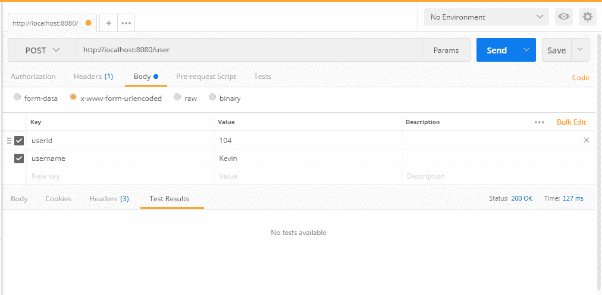

# 纯 REST（无响应）和文件上载中的 CRUD 操作

在最后一章中，我们探讨了一种带有反应式支持的 CRUD 操作。由于 Spring 开发团队仍在更新更多的被动实体，被动支持还没有达到他们的水平。尽管 Spring5 的反应式支持工作得很好，但他们仍然需要对其进行改进以使其稳定。在考虑了这些指针之后，我们计划避免被动支持，以使它对您来说更简单。

在本章中，我们将介绍 Spring5 中的基本 CRUD（创建、读取、更新和删除）API（无反应式 REST）。在本章之后，您将能够在 Spring5 中执行简单的 CRUD 操作，而无需响应性支持。另外，我们将在 Spring5 中讨论文件上传选项

在本章中，我们将介绍以下方法：

*   将 CRUD 操作映射到 HTTP 方法
*   创建用户
*   更新用户
*   删除用户
*   读取（选择）用户
*   春季上传文件

# 将 CRUD 操作映射到 HTTP 方法

在上一章中，您看到了控制器中的 CRUD 操作。在本章中，我们将使用相同的 CRUD 操作；但是，我们排除了所有反应性组件

# 创造资源

要创建基本的 Spring 项目资源，可以使用 Spring 初始化器（[https://start.spring.io/](https://start.spring.io/) ）。在 Spring Initializer 中，提供必要的详细信息：

使用 Java 和 Spring Boot 1.5.9 生成一个 Maven 项目。

组：`com.packtpub.restapp`

神器：`ticket-management`

搜索依赖项：选择`Web (Full Stack Web Development with Tomcat and Web MVC) `依赖项

填写完详细信息后，点击【生成项目】；然后它将以 ZIP 格式创建 Spring 基本资源。我们可以通过将它们导入 Eclipse 来开始使用该项目

Spring 5 POM 文件如下所示：

```
<?xml version="1.0" encoding="UTF-8"?>
<project  xmlns:xsi="http://www.w3.org/2001/XMLSchema-instance"
  xsi:schemaLocation="http://maven.apache.org/POM/4.0.0 http://maven.apache.org/xsd/maven-4.0.0.xsd">
  <modelVersion>4.0.0</modelVersion>
  <groupId>com.packtpub.restapp</groupId>
  <artifactId>ticket-management</artifactId>
  <version>0.0.1-SNAPSHOT</version>
  <packaging>jar</packaging>
  <name>ticket-management</name>
  <description>Demo project for Spring Boot</description>
  <parent>
    <groupId>org.springframework.boot</groupId>
    <artifactId>spring-boot-starter-parent</artifactId>
    <version>1.5.9.RELEASE</version>
    <relativePath/> <!-- lookup parent from repository -->
  </parent>
  <properties>
    <project.build.sourceEncoding>UTF-8</project.build.sourceEncoding>
    <project.reporting.outputEncoding>UTF-8</project.reporting.outputEncoding>
  </properties>
  <dependencies>
    <dependency>
      <groupId>org.springframework.boot</groupId>
      <artifactId>spring-boot-starter-web</artifactId>
    </dependency>
    <dependency>
      <groupId>org.springframework.boot</groupId>
      <artifactId>spring-boot-starter-test</artifactId>
      <scope>test</scope>
    </dependency>
  </dependencies>
  <build>
    <plugins>
      <plugin>
        <groupId>org.springframework.boot</groupId>
        <artifactId>spring-boot-maven-plugin</artifactId>
      </plugin>
    </plugins>
  </build>
</project>
```

让我们删除父对象以简化 POM：

```
  <parent>
    <groupId>org.springframework.boot</groupId>
    <artifactId>spring-boot-starter-parent</artifactId>
    <version>1.5.9.RELEASE</version>
    <relativePath/> <!-- lookup parent from repository -->
  </parent>
```

当我们删除父项时，我们可能需要在所有依赖项中添加该版本。让我们在依赖项中添加版本：

```
<dependencies>
    <dependency>
      <groupId>org.springframework.boot</groupId>
      <artifactId>spring-boot-starter-web</artifactId>
      <version>1.5.9.RELEASE</version>
    </dependency>
    <dependency>
      <groupId>org.springframework.boot</groupId>
      <artifactId>spring-boot-starter-test</artifactId>
      <scope>test</scope>
      <version>1.5.9.RELEASE</version>
    </dependency>
  </dependencies>
```

由于依赖工件`spring-boot-starter-web`版本`1.5.9`基于 Spring4.3.11，我们将不得不升级到 Spring5。让我们清理并升级 POM 文件，以引入 Spring 5 更新：

```
<?xml version="1.0" encoding="UTF-8"?>
<project  xmlns:xsi="http://www.w3.org/2001/XMLSchema-instance"
  xsi:schemaLocation="http://maven.apache.org/POM/4.0.0 http://maven.apache.org/xsd/maven-4.0.0.xsd">
  <modelVersion>4.0.0</modelVersion>
  <groupId>com.packtpub.restapp</groupId>
  <artifactId>ticket-management</artifactId>
  <version>0.0.1-SNAPSHOT</version>
  <packaging>jar</packaging>
  <name>ticket-management</name>
  <description>Demo project for Spring Boot</description> 
  <properties>
    <project.build.sourceEncoding>UTF-8</project.build.sourceEncoding>
    <project.reporting.outputEncoding>UTF-8</project.reporting.outputEncoding>
  </properties>
  <dependencies>
    <dependency>
      <groupId>org.springframework.boot</groupId>
      <artifactId>spring-boot-starter-web</artifactId>
      <version>1.5.9.RELEASE</version>
    </dependency>
    <dependency>
      <groupId>org.springframework.boot</groupId>
      <artifactId>spring-boot-starter-test</artifactId>
      <scope>test</scope>
      <version>1.5.9.RELEASE</version>
    </dependency>
  </dependencies>
  <build>
    <plugins>
      <plugin>
        <groupId>org.springframework.boot</groupId>
        <artifactId>spring-boot-maven-plugin</artifactId>
      </plugin>
    </plugins>
  </build>
</project>
```

您可以在前面的 POM 文件中看到与 Spring5 相关的依赖项。让我们用 REST 端点测试它们。首先，创建 Spring 引导主文件以初始化 Spring 引导：

```
@SpringBootApplication
public class TicketManagementApplication {  
  public static void main(String[] args) {
    SpringApplication.run(TicketManagementApplication.class, args);
  }
}
```

通过右键单击项目并选择 RunAs | Spring Boot App，可以开始在 Eclipse 上运行 Spring Boot。如果这样做，您将在 Eclipse 控制台中看到日志。

If you don't see the console, you can get it via Window | Show View | Console.

下面是一个示例日志。你可能看不到精确的匹配；但是，您将了解服务器运行日志的外观：

```

 . ____ _ __ _ _
 /\\ / ___'_ __ _ _(_)_ __ __ _ \ \ \ \
( ( )\___ | '_ | '_| | '_ \/ _` | \ \ \ \
 \\/ ___)| |_)| | | | | || (_| | ) ) ) )
 ' |____| .__|_| |_|_| |_\__, | / / / /
 =========|_|==============|___/=/_/_/_/
 :: Spring Boot :: (v1.5.7.RELEASE)

2017-11-05 15:49:21.380 INFO 8668 --- [ main] c.p.restapp.TicketManagementApplication : Starting TicketManagementApplication on DESKTOP-6JP2FNB with PID 8668 (C:\d\spring-book-sts-space\ticket-management\target\classes started by infoadmin in C:\d\spring-book-sts-space\ticket-management)
2017-11-05 15:49:21.382 INFO 8668 --- [ main] c.p.restapp.TicketManagementApplication : No active profile set, falling back to default profiles: default
2017-11-05 15:49:21.421 INFO 8668 --- [ main] ationConfigEmbeddedWebApplicationContext : Refreshing org.springframework.boot.context.embedded.AnnotationConfigEmbeddedWebApplicationContext@5ea434c8: startup date [Sun Nov 05 15:49:21 EST 2017]; root of context hierarchy
2017-11-05 15:49:22.205 INFO 8668 --- [ main] s.b.c.e.t.TomcatEmbeddedServletContainer : Tomcat initialized with port(s): 8080 (http)
2017-11-05 15:49:22.213 INFO 8668 --- [ main] o.apache.catalina.core.StandardService : Starting service [Tomcat]
...
..

...
...
2017-11-05 15:49:22.834 INFO 8668 --- [ main] o.s.j.e.a.AnnotationMBeanExporter : Registering beans for JMX exposure on startup
2017-11-05 15:49:22.881 INFO 8668 --- [ main] s.b.c.e.t.TomcatEmbeddedServletContainer : Tomcat started on port(s): 8080 (http)
```

你应该在日志的最后几行看到`Tomcat started on port(s): 8080`。

当您检查 URI`http://localhost:8080`时，您将看到以下错误：

```
Whitelabel Error Page

This application has no explicit mapping for /error, so you are seeing this as a fallback.

Sun Nov {current date}
There was an unexpected error (type=Not Found, status=404).
No message available
```

前面的错误表示应用程序中没有配置相应的 URI。让我们通过在`com.packtpub.restapp`包下创建名为`HomeController`的控制器来解决此问题：

```
package com.packtpub.restapp;
import java.util.LinkedHashMap;
import java.util.Map;
import org.springframework.web.bind.annotation.RequestMapping;
import org.springframework.web.bind.annotation.ResponseBody;
import org.springframework.web.bind.annotation.RestController;
@RestController
@RequestMapping("/")
public class HomeController {
  @ResponseBody
  @RequestMapping("")
  public Map<String, Object> test(){
    Map<String, Object> map = new LinkedHashMap<>();
    map.put("result", "Aloha");    
    return map;
  }
}
```

在前面的代码中，我们创建了一个名为`HomeController`的虚拟控制器，其结果是一个简单的`map`。此外，我们还添加了新的控制器，我们需要让这些类由我们的主应用程序自动屏蔽，在我们的例子中是`TicketManagementApplication`类。我们将通过在主类中添加`@ComponentScan("com.packtpub")`来告诉他们。最后，我们的主要类将如下所示：

```
package com.packtpub.restapp.ticketmanagement;
import org.springframework.boot.SpringApplication;
import org.springframework.boot.autoconfigure.SpringBootApplication;
import org.springframework.context.annotation.ComponentScan;
@ComponentScan("com.packtpub")
@SpringBootApplication
public class TicketManagementApplication {
  public static void main(String[] args) {
    SpringApplication.run(TicketManagementApplication.class, args);
  }
}
```

重新启动 Spring Boot 应用程序时，您将看到 REST 端点正在工作（`localhost:8080`：

```
{
  result: "Aloha"
}
```

# 弹簧 5 中的积垢运行（无反应）

让我们执行用户 CRUD 操作。正如我们之前讨论过 CRUD 概念一样，这里我们只讨论 Spring5 上的用户管理（没有响应式支持）。让我们填写 CRUD 端点的所有虚拟方法。在这里，我们可以创建`UserContoller`并填写 CRUD 用户操作的所有方法：

```
package com.packtpub.restapp;
import java.util.LinkedHashMap;
import java.util.Map;
import org.springframework.web.bind.annotation.PathVariable;
import org.springframework.web.bind.annotation.RequestMapping;
import org.springframework.web.bind.annotation.RequestMethod;
import org.springframework.web.bind.annotation.ResponseBody;
import org.springframework.web.bind.annotation.RestController;
@RestController
@RequestMapping("/user")
public class UserController {  
  @ResponseBody
  @RequestMapping("")
  public Map<String, Object> getAllUsers(){
    Map<String, Object> map = new LinkedHashMap<>();
    map.put("result", "Get All Users Implementation");    
    return map;
  }  
  @ResponseBody
  @RequestMapping("/{id}")
  public Map<String, Object> getUser(@PathVariable("id") Integer id){
    Map<String, Object> map = new LinkedHashMap<>();
    map.put("result", "Get User Implementation");    
    return map;
  } 
  @ResponseBody
  @RequestMapping(value = "", method = RequestMethod.POST)
  public Map<String, Object> createUser(){
    Map<String, Object> map = new LinkedHashMap<>();
    map.put("result", "Create User Implementation");    
    return map;
  }  
  @ResponseBody
  @RequestMapping(value = "", method = RequestMethod.PUT)
  public Map<String, Object> updateUser(){
    Map<String, Object> map = new LinkedHashMap<>();
    map.put("result", "Update User Implementation");    
    return map;
  }
  @ResponseBody
  @RequestMapping(value = "", method = RequestMethod.DELETE)
  public Map<String, Object> deleteUser(){
    Map<String, Object> map = new LinkedHashMap<>();
    map.put("result", "Delete User Implementation");    
    return map;
  }
}
```

我们已经填充了所有 CRUD 操作的基本端点。如果您使用适当的方法，如`GET`、`POST`、`PUT`和`DELETE`给他们打电话，您将看到提及适当消息的结果。

例如，对于`getAllUsers`API（`localhost:8080/user`，您将获得：

```
{
  result: "Get All Users Implementation"
}
```

# getAllUsers–实现

让我们实现`getAllUsers`API。对于此 API，我们可能需要在包`com.packtpub.model`下创建一个名为`User`的模型类：

```
package com.packtpub.model;
public class User {
  private Integer userid;  
  private String username;   
  public User(Integer userid, String username){
    this.userid = userid;
    this.username = username;
  }  
  // getter and setter methods 
}
```

现在，我们将为`getAllUsers`实现添加代码。由于这是业务逻辑，我们将创建一个单独的`UserService`和`UserServiceImpl`类。通过这样做，我们可以将业务逻辑保持在不同的位置，以避免代码复杂性

`UserService`界面如下所示：

```
package com.packtpub.service;
import java.util.List;
import com.packtpub.model.User;
public interface UserService {
  List<User> getAllUsers();
}
```

`UserServiceImpl`类实现如下：

```
package com.packtpub.service;
import java.util.LinkedList;
import java.util.List;
import org.springframework.stereotype.Service;
import com.packtpub.model.User;
@Service
public class UserServiceImpl implements UserService {
  @Override
  public List<User> getAllUsers() {    
    return this.users;
  }  
  // Dummy users
  public static List<User> users; 
  public UserServiceImpl() {
    users = new LinkedList<>();   
    users.add(new User(100, "David"));
    users.add(new User(101, "Peter"));
    users.add(new User(102, "John"));
  }
}
```

在前面的实现中，我们在构造函数中创建了虚拟用户。当类由 Spring 配置初始化时，这些用户将被添加到列表中。

调用`getAllUsers`方法的`UserController`类如下：

```
@Autowired
UserService userSevice;
@ResponseBody
@RequestMapping("")
public List<User> getAllUsers(){
    return userSevice.getAllUsers();
}
```

在前面的代码中，我们通过在控制器文件中自动连接来调用`getAllUsers`方法。`@Autowired`将在幕后完成所有实例化魔法

如果现在运行应用程序，可能会遇到以下错误：

```
***************************
APPLICATION FAILED TO START
***************************

Description:

Field userSevice in com.packtpub.restapp.UserController required a bean of type 'com.packtpub.service.UserService' that could not be found.

Action:

Consider defining a bean of type 'com.packtpub.service.UserService' in your configuration.
```

此错误背后的原因是您的应用程序无法识别`UserService`，因为它位于不同的包中。我们可以通过在`TicketManagementApplication`类中添加`@ComponentScan("com.packtpub")`来解决此问题。这将识别不同子包中的所有`@service`和其他 bean：

```
@ComponentScan("com.packtpub")
@SpringBootApplication
public class TicketManagementApplication {  
  public static void main(String[] args) {
    SpringApplication.run(TicketManagementApplication.class, args);
  }
}
```

现在您可以在调用 API（`http://localhost:8080/user`时看到结果：

```
[
  {
    userid: 100,
    username: "David"
  },
  {
    userid: 101,
    username: "Peter"
  },
  {
    userid: 102,
    username: "John"
  }
]
```

# getUser–实现

正如我们前面在[第 4 章](04.html)中所做的一样，*Spring REST 中的 CRUD 操作*我们将在本节中实现`getUser`业务逻辑。让我们使用 Java8 流在这里添加`getUser`方法。

`UserService`界面如下所示：

```
User getUser(Integer userid);
```

`UserServiceImpl`类实现如下：

```
@Override
public User getUser(Integer userid) {     
    return users.stream()
    .filter(x -> x.getUserid() == userid)
    .findAny()
    .orElse(new User(0, "Not Available")); 
}
```

在前面的`getUser`方法实现中，我们使用 Java 8 流和 lambda 表达式通过`userid`获取用户。lambda 表达式不再使用传统的`for`循环，而是更容易获取细节。在前面的代码中，我们根据筛选条件检查用户。如果用户匹配，则返回具体用户；否则，它将创建一个带有`"Not available"`消息的虚拟用户

`getUser`方法的`UserController`类如下：

```
@ResponseBody
@RequestMapping("/{id}")
public User getUser(@PathVariable("id") Integer id){  
  return userSevice.getUser(100);
}
```

您可以通过访问客户端中的`http://localhost:8080/user/100`来验证 API（使用 Postman 或 SoapUI 进行测试）：

```
{
  userid: 100,
  username: "David"
}
```

# createUser–实现

现在我们可以添加创建用户选项的代码。

`UserService`界面如下所示：

```
void createUser(Integer userid, String username);
```

`UserServiceImpl`类实现如下：

```
@Override
public void createUser(Integer userid, String username) {    
    User user = new User(userid, username); 
    this.users.add(user); 
}
```

`createUser`方法的`UserController`类如下：

```
@ResponseBody
  @RequestMapping(value = "", method = RequestMethod.POST)
  public Map<String, Object> createUser(
    @RequestParam(value="userid") Integer userid,
    @RequestParam(value="username") String username
    ){    
    Map<String, Object> map = new LinkedHashMap<>(); 
    userSevice.createUser(userid, username);    
    map.put("result", "added");
    return map;
}
```

前面的代码将在地图中添加用户。这里我们使用了`userid`和`username`作为方法参数，您可以在下面的 API 调用中查看`userid`和`username`：



当您使用 SoapUI/Postman 调用此方法时，将得到以下结果。在本例中，我们使用参数（`userid`、`username`代替 JSON 输入。这只是为了简化流程：

```
{"result": "added"}
```

# updateUser–实现

现在我们可以为 updateuser 选项添加代码。

`UserService`界面如下所示：

```
void updateUser(Integer userid, String username);
```

`UserServiceImpl`类实现如下：

```
@Override
public void updateUser(Integer userid, String username) {
    users.stream()
        .filter(x -> x.getUserid() == userid)
        .findAny()
        .orElseThrow(() -> new RuntimeException("Item not found"))
        .setUsername(username); 
}
```

在前面的方法中，我们使用了基于 Java Streams 的实现来更新用户。我们只需应用过滤器并检查用户是否可用。如果`userid`不匹配，则抛出`RuntimeException`。如果用户可用，我们会得到相应的用户，然后更新`username`。

`updateUser`方法的`UserController`类如下：

```
@ResponseBody
  @RequestMapping(value = "", method = RequestMethod.PUT)
  public Map<String, Object> updateUser(
      @RequestParam(value="userid") Integer userid,
      @RequestParam(value="username") String username
    ){
    Map<String, Object> map = new LinkedHashMap<>();
    userSevice.updateUser(userid, username);    
    map.put("result", "updated");    
    return map;
  }
```

我们将尝试在`userid`上用`100`值将`username`从`David`更新为`Sammy`。我们可以从以下屏幕截图中查看 API 详细信息：


当我们使用 SoapUI/Postman 扩展名（`http://localhost:8080/user`调用此 API（方法`UPDATE`时），我们将得到以下结果：

```
{"result": "updated"}
```

您可以通过检查邮递员分机（`http://localhost:8080/user`中的`getAllUsers`API`GET`方法】来检查结果；您将得到以下结果：

```
[
  {
    "userid": 100,
    "username": "Sammy"
  },
  {
    "userid": 101,
    "username": "Peter"
  },
  {
    "userid": 102,
    "username": "John"
  },
  {
    "userid": 104,
    "username": "Kevin"
  }
]
```

# deleteUser–实现

现在我们可以为`deleteUser`选项添加代码。

`UserService`界面如下所示：

```
void deleteUser(Integer userid);
```

`UserServiceImpl`类实现如下：

```
@Override
public void deleteUser(Integer userid) { 

   users.removeIf((User u) -> u.getUserid() == userid);

}
```

`deleteUser`方法的`UserController`类如下：

```
@ResponseBody
@RequestMapping(value = "/{id}", method = RequestMethod.DELETE)
public Map<String, Object> deleteUser(
      @PathVariable("id") Integer userid) {
    Map<String, Object> map = new LinkedHashMap<>(); 
      userSevice.deleteUser(userid); 
      map.put("result", "deleted");
      return map;
}
```

当您使用 Postman 扩展名（`http://localhost:8080/user/100`调用此 API（`DELETE`方法）时，您将得到以下结果：

```
{"result": "deleted"}
```

您还可以检查`getAllUsers`方法，以确认您已删除该用户。

# 文件上传–RESTAPI

有了`NIO`库和 Spring 的`MultipartFile`选项的支持，文件上传变得非常容易。在这里，我们将添加文件上传的代码

`FileUploadService`界面如下所示：

```
package com.packtpub.service;
import org.springframework.web.multipart.MultipartFile;
public interface FileUploadService {
  void uploadFile(MultipartFile file) throws IOException;
}
```

在前面的代码中，我们刚刚定义了方法，让具体类（实现类）覆盖我们的方法。我们在这里使用`MultipartFile`转发一个文件，比如一个媒体文件，以实现我们的业务逻辑。

`FileUploadServerImpl`类实现如下：

```
package com.packtpub.service;
import java.io.IOException;
import java.nio.file.Files;
import java.nio.file.Path;
import java.nio.file.Paths;
import java.nio.file.StandardCopyOption;
import org.springframework.stereotype.Service;
import org.springframework.util.StringUtils;
import org.springframework.web.multipart.MultipartFile;
@Service
public class FileUploadServerImpl implements FileUploadService {
  private Path location;  
  public FileUploadServerImpl() throws IOException {
    location = Paths.get("c:/test/");
    Files.createDirectories(location);
  }
  @Override
  public void uploadFile(MultipartFile file) throws IOException {
    String fileName = StringUtils.cleanPath(file.getOriginalFilename());
    if (fileName.isEmpty()) {
      throw new IOException("File is empty " + fileName);
    } try {
      Files.copy(file.getInputStream(), 
            this.location.resolve(fileName),     
            StandardCopyOption.REPLACE_EXISTING);
    } catch (IOException e) {
      throw new IOException("File Upload Error : " + fileName);
    }
  }
}
```

在前面的代码中，我们在构造函数本身中设置了位置，因此当 Spring Boot 应用程序初始化时，它将设置正确的路径；如果需要，它将在提到的位置创建一个特定的文件夹。

在`uploadFile`方法中，我们首先获取文件并清理它们。我们使用一个名为`StringUtils`的 Spring 实用程序类来清理文件路径。您可以在此处看到清洁过程：

```
String fileName = StringUtils.cleanPath(file.getOriginalFilename());
```

如果文件为空，我们只会抛出一个异常。您可以在此处检查异常：

```
    if(fileName.isEmpty()){
      throw new IOException("File is empty " + fileName);
    }
```

然后是真正的文件上传逻辑！我们只是使用`Files.copy`方法将文件从客户端复制到服务器位置。如果发生错误，我们抛出`RuntimeException`：

```
try {
      Files.copy(
        file.getInputStream(), this.location.resolve(fileName),  
        StandardCopyOption.REPLACE_EXISTING
      );
    } catch (IOException e) { 
      throw new IOException("File Upload Error : " + fileName);
    }
```

由于主要实现是由具体类完成的，所以控制器只是将`MultipartFile`传递给服务。我们在这里使用了`POST`方法，因为它将是上传文件的完美方法。另外，您可以看到我们使用了`@Autowired`选项来使用`service`方法。

`uploadFile`方法的`FileController`类如下：

```
package com.packtpub.restapp;
import java.io.IOException;
import java.util.LinkedHashMap;
import java.util.Map;
import org.springframework.beans.factory.annotation.Autowired;
import org.springframework.web.bind.annotation.RequestMapping;
import org.springframework.web.bind.annotation.RequestMethod;
import org.springframework.web.bind.annotation.RequestParam;
import org.springframework.web.bind.annotation.ResponseBody;
import org.springframework.web.bind.annotation.RestController;
import org.springframework.web.multipart.MultipartFile;
import com.packtpub.service.FileUploadService;
@RestController
@RequestMapping("/file")
public class FileController {  
  @Autowired
  FileUploadService fileUploadSevice;
  @ResponseBody
  @RequestMapping(value = "/upload", method = RequestMethod.POST)
  public Map<String, Object> uploadFile(@RequestParam("file") MultipartFile file) {
    Map<String, Object> map = new LinkedHashMap<>();
    try {
      fileUploadSevice.uploadFile(file);      
      map.put("result", "file uploaded");
    } catch (IOException e) {
      map.put("result", "error while uploading : "+e.getMessage());
    }    
    return map;
  }
} 
```

# 测试文件上传

您可以创建一个 HTML 文件，如下所示，并测试文件上传 API。您还可以使用任何 REST 客户机来测试这一点。我为您提供了此 HTML 文件以简化测试过程：

```
<!DOCTYPE html>
<html>
<body>
<form action="http://localhost:8080/file/upload" method="post" enctype="multipart/form-data">
    Select image to upload:
    <input type="file" name="file" id="file">
    <input type="submit" value="Upload Image" name="submit">
</form>
</body>
</html>
```

# 总结

在本章中，我们从基本资源开始并对其进行定制，从而介绍了 Spring5 中的 CRUD 操作（没有反应式支持）。此外，我们还学习了如何在春季上传文件。在下一章中，我们将进一步了解 Spring 安全性和 JWT（JSON Web 令牌）。