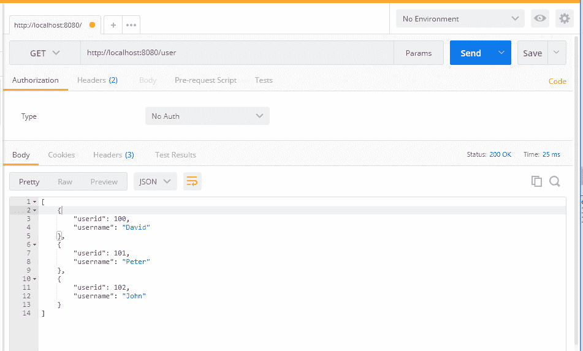
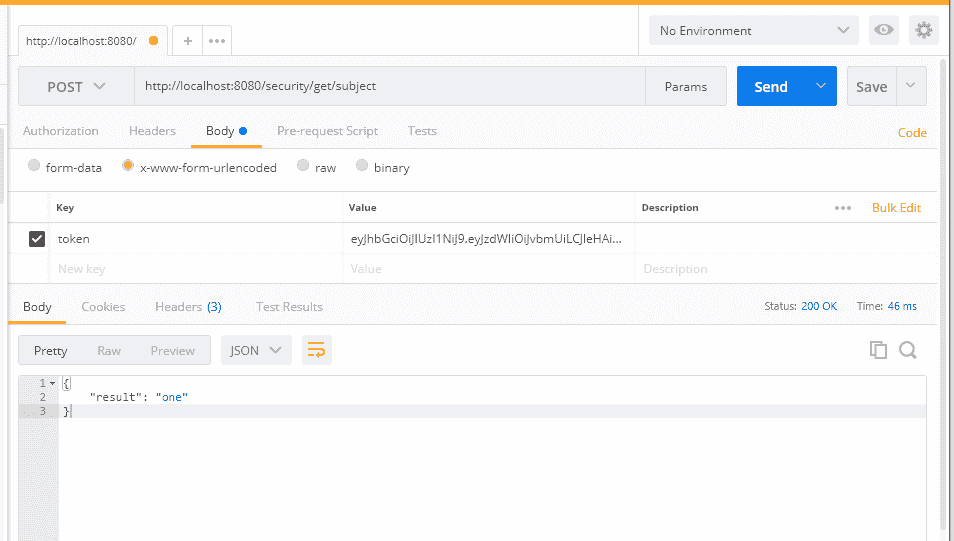
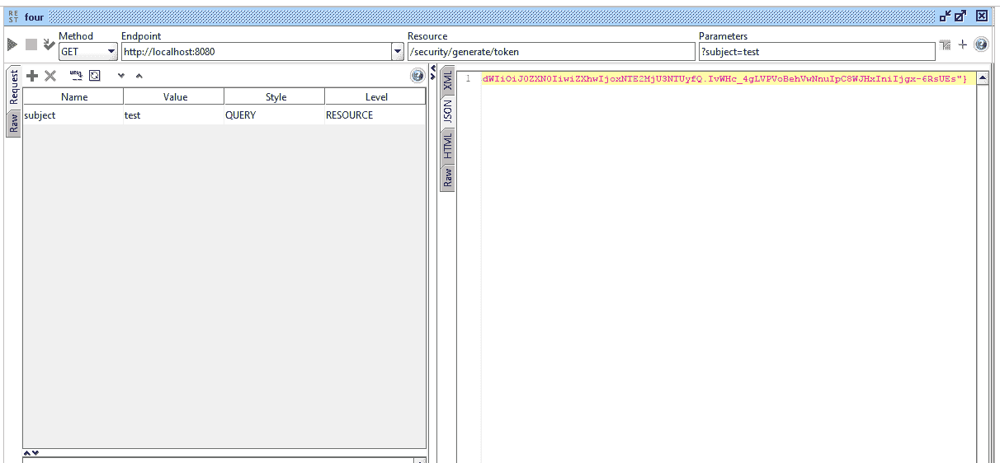
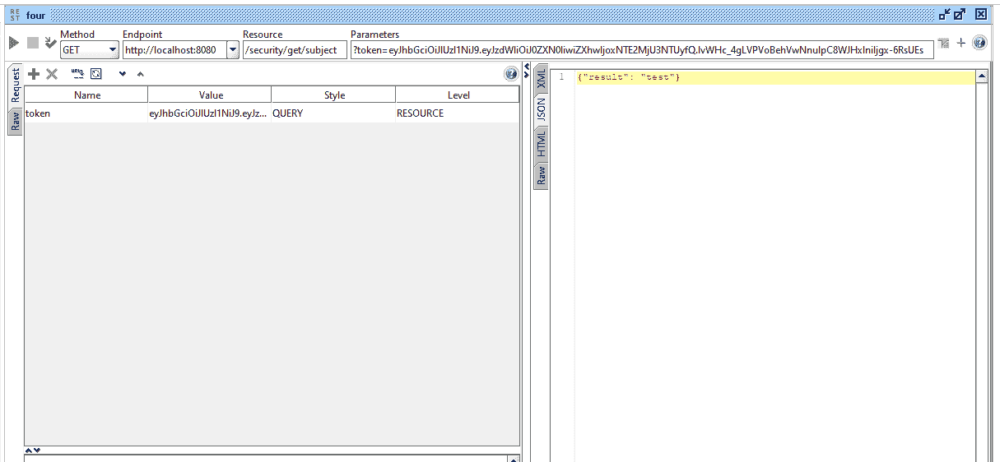

# 测试 RESTful Web 服务

在前面的章节中，我们已经讨论了如何创建 RESTAPI 并在 RESTAPI 和服务方法中应用业务逻辑。然而，为了确保我们的业务逻辑，我们可能需要编写适当的测试用例并使用其他测试方法。测试 RESTAPI 将有助于我们在生产中部署应用程序时保持应用程序的干净性和功能性。我们编写的单元测试用例或其他测试方法越多，我们在将来维护应用程序的效果就越好。

在本章中，我们将讨论示例 RESTful web 服务的以下测试策略：

*   Spring 控制器上的 JUnit 测试
*   MockMvc（控制器上的模拟）
*   邮递员休息客户端
*   SoapUI REST 客户端
*   作为客户端的 jsoup 阅读器

# 朱尼特

JUnit 是 Java 和 Spring 应用程序最简单、最首选的测试框架。通过为我们的应用程序编写 JUnit 测试用例，我们可以提高应用程序的质量并避免出现错误的情况。

这里，我们将讨论一个简单的 JUnit 测试用例，它在`userService`中调用`getAllUsers`方法。我们可以检查以下代码：

```
@RunWith(SpringRunner.class)
@SpringBootTest
public class UserTests {  
  @Autowired
  UserService userSevice;
  @Test
  public void testAllUsers(){
    List<User> users = userSevice.getAllUsers(); 
    assertEquals(3, users.size());
  }
}
```

在前面的代码中，我们调用了`getAllUsers`并验证了总数。让我们在另一个测试用例中测试单用户方法：

```
// other methods
@Test
public void testSingleUser(){
    User user = userSevice.getUser(100); 
    assertTrue(user.getUsername().contains("David"));
}
```

在前面的代码片段中，我们只是测试了服务层并验证了业务逻辑。但是，我们可以使用模拟方法直接测试控制器，这将在本章后面讨论。

# 模拟 MVC

MockMvc 主要用于通过控制器测试代码。通过直接调用控制器（REST 端点），我们可以从 MockMvc 测试本身覆盖整个应用程序。此外，如果我们在控制器上保留任何身份验证或限制，它也将包含在 MockMvc 测试用例中。

以下代码将使用 MockMvc 标准测试我们的基本 API（`localhost:8080/`）：

```
import static org.hamcrest.Matchers.is;
import static org.springframework.test.web.servlet.result.MockMvcResultMatchers.jsonPath;
import static org.springframework.test.web.servlet.result.MockMvcResultMatchers.status;
import org.junit.Before;
import org.junit.Test;
import org.junit.runner.RunWith;
import org.springframework.beans.factory.annotation.Autowired;
import org.springframework.boot.test.context.SpringBootTest;
import org.springframework.test.context.junit4.SpringJUnit4ClassRunner;
import org.springframework.test.web.servlet.MockMvc;
import org.springframework.test.web.servlet.MvcResult;
import org.springframework.test.web.servlet.request.MockMvcRequestBuilders;
import org.springframework.test.web.servlet.setup.MockMvcBuilders;
import org.springframework.web.context.WebApplicationContext;
@SpringBootTest
@RunWith(SpringJUnit4ClassRunner.class)
public class UserMockMVCTests {  
  @Autowired
  private WebApplicationContext ctx;  
  private MockMvc mockMvc;  
  @Before
  public void setUp() {
    this.mockMvc = MockMvcBuilders.webAppContextSetup(this.ctx).build();
  }  
  @Test
  public void testBasicMVC() throws Exception {
    MvcResult result = mockMvc
        .perform(MockMvcRequestBuilders.get("/"))
        .andExpect(status().isOk())
        .andExpect(jsonPath("result", is("Aloha")))         
        .andReturn();    
    String content = result.getResponse().getContentAsString();
     System.out.println("{testBasicMVC} response : " + content);
  }
}
```

在前面的代码中，我们仅使用`setUp()`方法初始化 web 应用程序。此外，我们还使用了`@Autowired`注释来绑定`WebApplicationContext`。一旦设置就绪，我们创建一个名为`testBasicMVC`的方法来测试我们的普通 API（`localhost:8080`，它将返回`"result: Aloha"`。

一旦我们完成了代码，如果我们通过选择 runas | JUnit test 在 Eclipse 上运行它，前面的方法将被执行并显示结果。我们可以在 Eclipse 的 JUnit 窗口中查看成功的测试用例结果。

# 测试单个用户

到目前为止，我们只测试了一个普通的 RESTAPI。在这里，我们可以更进一步，通过从`userid`获取单个用户来测试我们的用户 API。以下代码将引导我们完成获取单个用户的实现：

```
import static org.hamcrest.Matchers.is;
import static org.springframework.test.web.servlet.result.MockMvcResultMatchers.jsonPath;
import static org.springframework.test.web.servlet.result.MockMvcResultMatchers.status;
import org.junit.Before;
import org.junit.Test;
import org.junit.runner.RunWith;
import org.springframework.beans.factory.annotation.Autowired;
import org.springframework.boot.test.context.SpringBootTest;
import org.springframework.test.context.junit4.SpringJUnit4ClassRunner;
import org.springframework.test.web.servlet.MockMvc;
import org.springframework.test.web.servlet.MvcResult;
import org.springframework.test.web.servlet.request.MockMvcRequestBuilders;
import org.springframework.test.web.servlet.setup.MockMvcBuilders;
import org.springframework.web.context.WebApplicationContext;
@SpringBootTest
@RunWith(SpringJUnit4ClassRunner.class)
public class UserMockMVCTests {  
  @Autowired
  private WebApplicationContext ctx;  
  private MockMvc mockMvc;  
  @Before
  public void setUp() {
    this.mockMvc = MockMvcBuilders.webAppContextSetup(this.ctx).build();
  }    
  @Test
  public void testBasicMVC() throws Exception {
    MvcResult result = mockMvc
        .perform(MockMvcRequestBuilders.get("/"))        
        .andExpect(status().isOk())
        .andExpect(jsonPath("result", is("Aloha")))        
        .andReturn();    
    String content = result.getResponse().getContentAsString();
     System.out.println("{testBasicMVC} response : " + content);
  }    
  @Test
  public void testSingleUser() throws Exception {
    MvcResult result = mockMvc
        .perform(MockMvcRequestBuilders.get("/user/100")) 
        .andExpect(status().isOk())
        .andExpect(jsonPath("userid", is(100)))
        .andExpect(jsonPath("username", is("David")))
        .andReturn();    
    String content = result.getResponse().getContentAsString();
    System.out.println("{testSingleUser} response : " + content);
  }
}
```

在前面的代码（`testSingleUser`中，我们可以看到，我们期望`status`、`userid`和`username`分别为`Ok`、`100`和`David`。此外，我们还打印从 RESTAPI 获得的结果。

# 邮递员

在前面的章节中，我们已经使用了 Postman 来测试 RESTAPI。当我们需要完全测试应用程序时，Postman 会很有帮助。在 Postman 中，我们可以编写测试套件来验证 RESTAPI 端点。

# 获取所有用户–邮递员

首先，我们将从一个简单的 API 开始，以获得所有用户：

```
http://localhost:8080/user
```

前面的方法将获取所有用户。获取所有用户的 Postman 屏幕截图如下：



在前面的屏幕截图中，我们可以看到我们获得了之前添加的所有用户。我们使用了`GET`方法来调用这个 API。

# 添加用户–邮递员

我们试着使用`user`中的`POST`方法添加一个新用户：

```
http://localhost:8080/user
```

添加用户，如以下屏幕截图所示：


在前面的结果中，我们可以看到 JSON 输出：

```
{
     "result" : "added"
}
```

# 生成 JWT–邮递员

让我们尝试通过使用以下代码在 Postman 中调用 generate token API 来生成令牌（JWT）：

```
http://localhost:8080/security/generate/token
```

我们可以清楚地看到，我们在体内使用`subject`来生成代币。调用 API 后，我们将获得令牌。我们可以在以下屏幕截图中检查令牌：


# 从标记中获取主题

通过使用我们之前创建的现有令牌，我们将通过调用 get subject API 获取主题：

```
http://localhost:8080/security/get/subject
```

结果将如以下屏幕截图所示：



在前面的 API 调用中，我们在 API 中发送令牌以获取主题。我们可以在生成的 JSON 中看到主题。

# 索皮

与 Postman 一样，SoapUI 是另一个用于测试 web 服务的开源工具。SoapUI 帮助进行 web 服务调用、模拟、模拟、负载测试和功能测试。SoapUI 在负载测试中被大量使用，它有许多控件使负载测试变得容易。

SoapUI 很容易安装在 Windows 和 Linux 等操作系统中。它的用户界面为我们构建复杂的测试场景提供了很大的灵活性。此外，SoapUI 支持第三方插件，如`TestMaker`和`Agiletestware`，并且很容易与 NetBeans 和 Eclipse 等 IDE 集成。

# 获取所有用户–SoapUI

我们将使用 SoapUI 来测试我们的基本 API（`/user`。当我们使用`GET`方法在 SoapUI 中使用用户时，以下方法将获取所有用户：

```
http://localhost:8080/user
```

获取所有用户的 SoapUI 屏幕截图如下：


我们将尝试使用`POST`方法添加用户：

```
http://localhost:8080/user
```

添加的用户屏幕截图如下所示：


在这个结果中，我们可以看到 JSON 输出：

```
{"result" : "added"}
```

# 生成 jwtsoapui

我们将使用`GET`方法生成令牌，如下所示：

```
http://localhost:8080/security/generate/token
```

在 SoapUI 中，我们使用`subject`作为参数。我们可以在以下屏幕截图中看到这一点：



我们可以清楚地看到，我们在体内使用`subject`来生成代币。此外，我们可以在 SoapUI 中将样式视为查询。这将使我们的值（`test`）成为 API 的参数。

调用 API 后，我们将获得令牌。我们可以在前面的屏幕截图中检查令牌。

# 从令牌获取主题–SoapUI

现在我们可以从前面生成的标记中获取主题。我们可能需要将令牌作为参数传递以获取主题。

当我们使用`GET`方法在 SoapUI 中调用 API 时，以下 API 将从令牌中获取主题：

```
http://localhost:8080/security/get/subject
```

虽然我们可以在前面的 API 调用中使用`POST`方法，但我们只使用`GET`方法来简化流程，如下图所示：



在前面的 API 调用中，我们在 API 中发送令牌以获取主题。我们可以在生成的 JSON 中看到主题。

到目前为止，我们已经在 SoapUI 的帮助下测试了我们的 API。虽然 SoapUI 看起来比 Postman 要难一些，但当我们在企业级进行负载测试和安全测试时，它可能会非常有用。

# jsoup

jsoup 是一个 Java 库，用于提取 HTML 文档并从 HTMLDOM 获取详细信息。jsoup 使用 DOM、CSS 和类似 jQuery 的方法从任何网页检索信息。尽管 jsoup 主要用于 HTML 文档解析，但在我们的应用程序中，我们将使用它进行 API 测试。

首先，我们将在 jsoup 中调用 RESTAPI，并将结果转换为 JSON。要将字符串转换为 JSON，我们将使用 Gson 库。

对于 jsoup 和 Gson 库，我们可能需要在`pom.xml`中添加依赖项。以下是 jsoup 和 Gson 依赖项的代码：

```
    <dependency>
      <groupId>org.jsoup</groupId>
      <artifactId>jsoup</artifactId>
      <version>1.8.2</version>
    </dependency> 
    <dependency>
        <groupId>com.google.code.gson</groupId>
        <artifactId>gson</artifactId>
        <version>2.8.2</version>
    </dependency>
```

我们将在测试资源中使用 jsoup REST 使用者，以便更容易进行测试：

```
String doc = Jsoup.connect("http://localhost:8080/user").ignoreContentType(true).get().body().text();
```

下面的代码将以 HTML 形式调用 RESTAPI，并以文本形式获取正文。通过这样做，我们将只获得 RESTAPI 结果作为 JSON 文本。JSON 文本如下所示：

```
[{"userid":100,"username":"David"},{"userid":101,"username":"Peter"},{"userid":102,"username":"John"}]
```

一旦我们得到 JSON 文本，我们就可以使用`JsonParser`类将它们转换成 JSON 数组。以下代码将解析 JSON 文本并将其转换为`JsonArray`类：

```
JsonParser parser = new JsonParser();
JsonElement userElement = parser.parse(doc);
JsonArray userArray = userElement.getAsJsonArray();
```

一旦获得 JSON 数组，我们就可以简单地检查数组大小来验证 RESTAPI。以下代码将测试 REST API 的大小：

```
assertEquals(3, userArray.size());
```

下面是包含前面提到的代码的完整类：

```
import static org.junit.Assert.assertEquals;
import java.io.IOException;
import org.jsoup.Jsoup;
import org.junit.Test;
import org.junit.runner.RunWith;
import org.slf4j.Logger;
import org.slf4j.LoggerFactory;
import org.springframework.boot.test.context.SpringBootTest;
import org.springframework.test.context.junit4.SpringRunner;
import com.google.gson.Gson;
import com.google.gson.JsonArray;
import com.google.gson.JsonElement;
import com.google.gson.JsonParser;
import com.packtpub.model.User;
@RunWith(SpringRunner.class)
@SpringBootTest
public class JsoupUserTest {  
  private final Logger _log = LoggerFactory.getLogger(this.getClass());  
  @Test
  public void testUsersJsoup() throws IOException{    
    String doc = Jsoup.connect("http://localhost:8080/user").ignoreContentType(true).get().body().text();    
    _log.info("{test} doc : "+doc);    
    JsonParser parser = new JsonParser();
    JsonElement userElement = parser.parse(doc);
    JsonArray userArray = userElement.getAsJsonArray();    
    _log.info("{test} size : "+userArray.size());        
    assertEquals(3, userArray.size());
  }
}
```

在前面的方法中，我们使用了记录器来打印大小。此外，我们还使用了`assertEquals`方法来检查用户数组的大小。

由于这类似于 JUnit 测试，我们可能需要在 Eclipse 中使用 JUnit 测试选项进行测试。我们只需右键单击该文件，然后单击 RunAs | JUnit Test。

# 获取用户–jsoup

在前面的方法中，我们测试了在 RESTAPI 中获取所有用户。现在，我们可以检查单个用户和详细信息。以下代码将测试单用户 REST API：

```
  @Test
  public void testUserJsoup() throws IOException{   
    String doc = Jsoup.connect("http://localhost:8080/user/100").ignoreContentType(true).get().body().text();    
    Gson g = new Gson(); 
    User user = g.fromJson(doc, User.class);        
    assertEquals("David", user.getUsername());
  }
```

前面的代码将调用 RESTAPI，获取文本格式的 JSON，然后将它们转换为`User`类。一旦我们将它们转换成`User`类，我们就可以通过`assertEquals`检查用户名。

# 添加用户–jsoup

让我们通过添加一个新用户来尝试使用 jsoup 中的`POST`方法。在这个 restapi（adduser）中，我们可能需要向 restapi 传递一些参数。以下代码将调用添加用户 API 并获得结果：

```
@Autowired
UserService userSevice;
@Test
public void testUserAdditionJsoup() throws IOException{    
    String doc = Jsoup.connect("http://localhost:8080/user/") 
        .data("userid", "103")
        .data("username", "kevin")
        .ignoreContentType(true)
        .post().body().text();    
    Gson g = new Gson(); 
    Map<String, Object> result = g.fromJson(doc, Map.class);    
    _log.info("{test} result : "+result);        
    assertEquals("added", result.get("result"));
    // user should be deleted as we tested the case already 
    userSevice.deleteUser(103);
}
```

在前面的代码中，我们使用了`.post()`方法来调用 API。此外，我们还使用了`.data()`方法来传递参数。通过添加`.ignoreContentType()`我们告诉`Jsoup`库我们不关心 API 返回的内容类型。此外，`body().text()`将以文本形式获取正文。

通过检查`assertEquals`中的结果，我们确保 API 工作正常。

要测试 jsoup，服务器需要运行，所以我们需要先运行服务器。然后我们可以运行我们的测试用例。要运行其他测试用例，例如 JUnit 和 MockMvc，我们不需要服务器。

# 运行测试用例

首先，我们运行服务器并确保可以访问服务器。如果我们不运行服务器，我们将无法测试 jsoup，因此请保持服务器运行。服务器启动后，右键单击项目 RunAs | JUnit Test。我们可以在 JUnit 窗口中看到结果，如以下屏幕截图所示：


在前面的屏幕截图中，我们可以清楚地看到我们所有的测试用例都通过了。

# 总结

在本章中，我们讨论了 RESTfulWeb 服务的各种测试方法。我们已经应用了 JUnit 测试、MockMvc、Postman 和 SoapUI。这些测试方法将非常有助于测试应用程序中的业务逻辑。在下一章中，我们将讨论 REST 客户机和在 REST 客户机中使用 REST 服务。