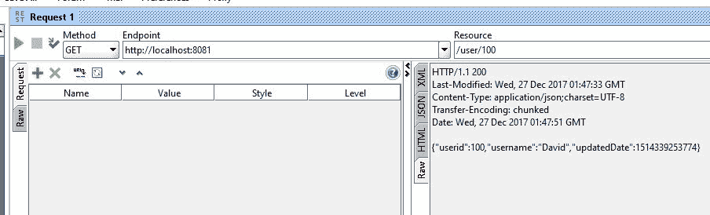

# 八、性能

对于应用程序中的 RESTful web 服务，性能被视为主要标准。本章将主要关注如何提高应用程序的性能并缩短响应时间。虽然性能优化技术可以应用于 web 应用程序的不同层，但我们将讨论 RESTful（web）层。其余的性能优化技术将在[第 11 章](11.html)、*缩放*中讨论。

本章将讨论以下主题：

*   HTTP 压缩
*   HTTP 缓存和 HTTP 缓存控制
*   restapi 中的缓存实现
*   使用 HTTP（如果已修改），因为标头和 ETag

# HTTP 压缩

为了快速从 REST 服务获取内容，可以通过 HTTP 等协议压缩和发送数据。在压缩数据时，我们必须遵循某种编码格式，因此在接收方应用相同的格式。

# 内容协商

在服务器中请求资源时，客户端将有许多选项来接收各种表示形式的内容。例如，DOC/PDF 是数据类型表示。Turkish 或 English 是语言表示形式，服务器可以在其中以特定语言发送资源。服务器和客户端之间必须就访问资源的格式（如语言、数据类型等）达成某种协议。该过程称为**内容协商**。

这里，我们将讨论两种不同的内容协商机制：服务器驱动机制和代理驱动机制。在讨论这些机制之前，我们将讨论接受编码和内容编码，因为它们很重要。

# 接受编码

客户端将告诉服务器它可以接收哪些压缩算法。最常见的编码类型是`gzip`和`deflate`。在请求服务器时，客户端将在请求头中共享编码类型。接受编码将用于此类目的。简单地说，客户端会对服务器说，“我只接受上面提到的压缩格式”。

我们将看到样本`Accept-Encoding`如下：

```java
Accept-Encoding: gzip, deflate
```

在前面的标题中，客户机表示它只能接受响应中的`gzip`或`deflate`。

其他可能的选择如下：

```
Accept-Encoding: compress, gzip
Accept-Encoding: 
Accept-Encoding: *
Accept-Encoding: compress;q=0.5, gzip;q=1.0
Accept-Encoding: gzip;q=1.0, identity; q=0.5, *;q=0
```

我们可以看到`compress`值后面跟着`q=0.5`，这意味着质量评级只有`0.5`，而`q=1.0`的`gzip`评级非常高。在这种情况下，客户端建议服务器通过`compress`获得`gzip`。但是，如果`gzip`不可能，则`compress`对客户来说是可以的。

如果服务器不支持客户端请求的压缩算法，则服务器应发送带有`406 (Not Acceptable)`状态代码的错误响应。

# 内容编码

内容编码是一个实体头，用于压缩从服务器发送到客户端的数据类型。Content Encoding 值告诉客户机实体体中使用了哪些编码。它将告诉客户端如何解码数据以检索值。

让我们看看单个和多个编码选项：

```
// Single Encoding option
Content-Encoding: gzip
Content-Encoding: compress

// Multiple Encoding options
Content-Encoding: gzip, identity
Content-Encoding: deflate, gzip
```

在前面的配置中，提供了关于内容编码的单个和多个选项。在这里，服务器告诉客户端它可以提供基于`gzip`和`compress`算法的编码。如果服务器提到了多重编码，那么这些编码将按照提到的顺序应用。

强烈建议尽可能压缩数据。

不建议动态更改内容编码。由于它将崩溃未来的请求（例如`GET`上的`PUT`，因此动态更改内容编码根本不是一个好主意。

# 服务器驱动的内容协商

服务器驱动的内容协商由服务器端算法执行，以确定服务器必须发送给客户端的最佳表示形式。这也称为主动式内容协商。在服务器驱动的协商中，客户机（用户代理）将提供具有质量评级的各种表示的选项。服务器中的算法必须决定哪个表示最适合客户端提供的标准。

例如，客户机通过共享媒体类型标准请求资源，并提供诸如哪种媒体类型更适合客户机等评级。服务器将完成其余的工作，并提供满足客户需求的最佳资源表示。

# 代理驱动的内容协商

代理驱动的内容协商由客户端的算法执行。当客户机请求特定资源时，服务器将告诉客户机资源的各种表示形式，以及诸如内容类型、质量等元数据。然后客户端算法将决定哪一个是最好的，并再次从服务器请求它。这也称为反应式内容协商。

# HTTP 缓存

当客户机多次请求相同的资源表示时，从服务器端提供它将是一种浪费时间的行为，并且在 web 应用程序中会非常耗时。如果资源被重用，它肯定会提高 web 应用程序的性能，而不是与服务器对话。

缓存将被视为提高 web 应用程序性能的主要选项。Web 缓存避免了服务器多次接触，减少了延迟；因此，应用程序将更快。缓存可以应用于应用程序的不同层。在本章中，我们将只讨论 HTTP 缓存，它被认为是一个中间层。我们将在[第 11 章](11.html)、*缩放*中深入探讨其他形式的缓存。

# HTTP 缓存控制

Cache control 是一个标头字段，用于指定 web 上缓存操作的指令。这些指令提供缓存授权，定义缓存的持续时间，等等。指令定义行为，通常用于防止缓存响应。

这里，我们将讨论 HTTP 缓存指令：`public`、`private`、`no-cache`和`only-if-cached`指令。

# 公共缓存

如果缓存控件允许公共缓存，则资源可以由多用户缓存进行缓存。我们可以通过在`Cache-Control`标题中设置`public`选项来实现这一点。在公共缓存中，响应可能由多个用户缓存缓存，即使是不可缓存或可缓存的，也只能在非共享缓存中缓存：

```
Cache-Control: public
```

在前面的设置中，`public`表示响应可以被任何缓存缓存。

# 私有缓存

与公共缓存不同，私有响应适用于单用户缓存，而不适用于共享缓存。在私有缓存中，中间方不能缓存内容：

```
Cache-Control: private
```

前面的设置指示响应仅可供单个用户使用，不应由任何其他缓存访问。

此外，我们还可以指定在标题设置中缓存内容的时间。这可以通过`max-age`指令选项完成。

检查以下设置：

```
Cache-Control: private, max-age=600
```

在前面的设置中，我们提到响应可以以私有模式缓存（仅限单个用户），并且资源被视为最新的最长时间。

# 无缓存

访问动态资源可能不需要缓存。在这种情况下，我们可以在缓存控制中使用`no-cache`设置来避免客户端缓存：

```
Cache-Control: no-cache
```

前面的设置将告诉客户机在请求资源时检查服务器。

此外，在某些情况下，我们可能需要禁用缓存机制本身。这可以在我们的设置中使用`no-store`来完成：

```
Cache-Control: no-store
```

前面的设置将告诉客户端避免资源缓存，并始终从服务器获取资源。

HTTP/1.0 缓存将不遵循 no cache 指令，因为它是在 HTTP/1.1

中引入的。缓存控制仅在 HTTP/1.1 中引入。在 HTTP/1.0 中，只有**Pragma:no cache**用于防止缓存响应。

# 只有缓存

在某些情况下，如网络连接不良，客户端可能希望返回缓存的资源，而不是重新加载或重新验证服务器。为了实现这一点，客户机可以在请求中包含`only-if-cached`指令。如果收到，客户端将获取缓存的条目，否则响应为`504`（网关超时）状态。

These cache control directives can override the default caching algorithms.

到目前为止，我们已经讨论了各种缓存控制指令及其解释。以下是缓存请求和缓存响应指令的示例设置。

请求缓存控制指令（标准`Cache-Control`指令，可由客户端在 HTTP 请求中使用）如下：

```
Cache-Control: max-age=<seconds>
Cache-Control: max-stale[=<seconds>]
Cache-Control: min-fresh=<seconds>
Cache-Control: no-cache 
Cache-Control: no-store
Cache-Control: no-transform
Cache-Control: only-if-cached
```

响应缓存控制指令（服务器可在 HTTP 响应中使用的标准`Cache-Control`指令）如下所示：

```
Cache-Control: must-revalidate
Cache-Control: no-cache
Cache-Control: no-store
Cache-Control: no-transform
Cache-Control: public
Cache-Control: private
Cache-Control: proxy-revalidate
Cache-Control: max-age=<seconds>
Cache-Control: s-maxage=<seconds>
```

It is not possible to specify cache directives for a specific cache.

# 缓存验证

当缓存有一个新条目可以在客户端请求时用作响应时，它将与原始服务器进行检查，以查看缓存条目是否仍然可用。此过程称为**缓存验证**。此外，当用户按下重新加载按钮时，会触发重新验证。如果缓存响应中包含`Cache-Control: must revalidate`头，则在正常浏览时会触发。

当资源的时间过期时，将再次验证或获取资源。只有当服务器提供强或弱验证程序时，才会触发缓存验证。

# 埃塔格

ETag 提供了一种验证缓存响应的机制。ETag 响应头可用作强验证器。在这种情况下，客户既无法理解价值，也无法预测其价值。当服务器发出响应时，它会生成一个令牌来隐藏资源的状态：

```
ETag : ijk564
```

如果`ETag`是响应的一部分，客户端可以在未来请求的头中发出`If-None-Match`来验证缓存的资源：

```
If-None-Match: ijk564
```

服务器将把请求的头与资源的当前状态进行比较。如果资源状态发生更改，服务器将使用新资源进行响应。否则，服务器将返回一个`304 Not Modified`响应。

# 上次修改/如果自标题修改

到目前为止，我们已经看到了一个强大的验证器（ETags）。在这里，我们将讨论一个可以在报头中使用的弱验证器。`Last-Modified`响应头可用作弱验证器。将使用时间戳检查缓存的响应是否有效，而不是生成资源的哈希。

由于此验证器具有 1 秒的分辨率，因此与 ETag 相比，它被认为是较弱的。如果响应中存在`Last-Modified`头，则客户端可以发送`If-Modified-Since`请求头来验证缓存的资源。

`If-Modified-Since`头在请求资源时由客户端提供。为了简化实际示例中的机制，客户端请求类似于这样：“我已经在上午 10 点缓存了资源 XYZ；但是，如果从上午 10 点开始更改，则获取更新的 XYZ。否则只返回`304`。然后我将使用以前缓存的 XYZ。”

# 缓存实现

到目前为止，我们已经在本章中看到了理论部分。让我们尝试在应用程序中实现这个概念。为了简化缓存实现，我们将只使用用户管理。我们将使用`getUser`（单用户）RESTAPI 应用我们的缓存概念。

# 其余资源

在`getUser`方法中，我们将把正确的`userid`传递给 path 变量，假设客户端将传递`userid`并获取资源。有许多缓存选项可供实现。这里，我们将只使用`If-Modified-Since`缓存机制。由于此机制会传递头中的`If-Modified-Since`值，因此会转发给服务器，表示如果资源在指定时间后更改，则获取新资源，否则返回 null。

有很多方法可以实现缓存。由于我们的目标是简化并清晰地传达信息，因此我们将保持代码的简单，而不是增加代码的复杂性。为了实现这种缓存，我们可能需要在`User`类中添加一个名为`updatedDate`的新变量。让我们在类中添加变量。

`updatedDate`变量将用作`If-Modified-Since`缓存的检查变量，因为我们将依赖于用户更新日期。

客户端将询问服务器自上次缓存以来用户数据是否已更改。服务器将对照用户`updatedDate`进行检查，如果未更新，则返回 null；否则，它将返回新数据：

```
  private Date updatedDate;
  public Date getUpdatedDate() {
    return updatedDate;
  }
  public void setUpdatedDate(Date updatedDate) {
    this.updatedDate = updatedDate;
  }
```

在前面的代码中，我们刚刚添加了一个新变量`updatedDate`，并在其中添加了适当的 getter 和 setter 方法。稍后我们可能会通过添加 Lombok 库来清理这些 getter 和 setter 方法。我们将在接下来的章节中应用龙目。

另外，当我们获得类的实例时，我们需要添加另一个构造函数来初始化`updatedDate`变量。让我们在这里添加构造函数：

```
public User(Integer userid, String username, Date updatedDate){
    this.userid = userid;
    this.username = username;
    this.updatedDate = updatedDate;
  }
```

如果可能，我们可以将`toString`方法更改如下：

```
  @Override
  public String toString() {
    return "User [userid=" + userid + ", username=" + username + ", updatedDate=" + updatedDate + "]";
  }
```

添加前面提到的所有详细信息后，我们的类将如下所示：

```
package com.packtpub.model;
import java.io.Serializable;
import java.util.Date;
public class User implements Serializable {  
  private static final long serialVersionUID = 1L;
  public User() {
  }
  private Integer userid;
  private String username;
  private Date updatedDate;
  public User(Integer userid, String username) {
    this.userid = userid;
    this.username = username;
  }
  public User(Integer userid, String username, Date updatedDate) {
    this.userid = userid;
    this.username = username;
    this.updatedDate = updatedDate;
  }
  public Date getUpdatedDate() {
    return updatedDate;
  }
  public void setUpdatedDate(Date updatedDate) {
    this.updatedDate = updatedDate;
  }
  public Integer getUserid() {
    return userid;
  }
  public void setUserid(Integer userid) {
    this.userid = userid;
  }
  public String getUsername() {
    return username;
  }
  public void setUsername(String username) {
    this.username = username;
  }
  @Override
  public String toString() {
    return "User [userid=" + userid + ", username=" + username + ", updatedDate=" + updatedDate + "]";
  }
}
```

现在，我们回到前面几章介绍的`UserController`，修改`getUser`方法：

```
@RestController
@RequestMapping("/user")
public class UserController {
    // other methods and variables (hidden)  
    @ResponseBody
    @RequestMapping("/{id}")
    public User getUser(@PathVariable("id") Integer id, WebRequest webRequest){    
        User user = userSevice.getUser(id);
        long updated = user.getUpdatedDate().getTime();    
        boolean isNotModified = webRequest.checkNotModified(updated);    
        logger.info("{getUser} isNotModified : "+isNotModified);    
        if(isNotModified){
          logger.info("{getUser} resource not modified since last call, so exiting");
          return null;
        }    
        logger.info("{getUser} resource modified since last call, so get the updated content");    
        return userSevice.getUser(id);
   }
}
```

在前面的代码中，我们在现有方法中使用了`WebRequest`参数。`WebRequest`对象将用于调用`checkNotModified`方法。首先，我们通过`id`获取用户详细信息，并以毫秒为单位获取`updatedDate`。我们根据客户端标题信息检查用户更新日期（我们假设客户端将通过标题中的`If-Not-Modified-Since`。如果用户更新的日期比缓存的日期新，则我们假定用户已更新，因此必须发送新资源。

我们可能需要导入`org.apache.log4j.Logger`，因为我们在`UserController`中添加了记录器。否则编译时会显示错误。

如果用户在缓存（由客户端）日期之后没有更新，它只会返回 null。此外，我们还提供了足够的记录器来打印所需的语句。

让我们在 SoapUI 或 Postman 客户端中测试 RESTAPI。当我们第一次调用 API 时，它将返回带有头信息的数据，如下所示：



SoapUI 客户端

我们可以看到，我们对这个 API 使用了`GET`方法，并且在右侧使用了响应头。

在前面的屏幕截图中，我们使用了端口`8081`。默认情况下，Spring Boot 在端口`8080`上工作。如果您想将其更改为`8081`，请将`/src/main/resources/``application.properties`中的端口配置如下：

`server.port = 8081`

如果上述位置下没有`application.properties`，您可以创建一个。

响应（JSON）如下所示：

```
{
   "userid": 100,
   "username": "David",
   "updatedDate": 1516201175654
}
```

在前面的 JSON 响应中，我们可以看到用户的详细信息，包括`updatedDate`。

响应（标题）如下所示：

```
HTTP/1.1 200 
Last-Modified: Wed, 17 Jan 2018 14:59:35 GMT
ETag: "06acb280fd1c0435ac4ddcc6de0aeeee7"
Content-Type: application/json;charset=UTF-8
Content-Length: 61
Date: Wed, 17 Jan 2018 14:59:59 GMT

{"userid":100,"username":"David","updatedDate":1516201175654}
```

在前面的响应头中，我们可以看到 HTTP 结果`200`（表示 OK）和`Last-Modified`日期。

现在，我们将在标题中添加`If-Modified-Since`，并更新从之前的响应中获得的最新日期。我们可以在下面的屏幕截图中检查`If-Modified-Since`参数：


在前面的配置中，我们在 header 部分添加了`If-Modified-Since`参数，并再次调用了相同的 RESTAPI。代码将检查自上次缓存日期以来资源是否已更新。在我们的例子中，资源没有更新，因此它将在响应中返回`304`。我们可以看到以下回应：

```
HTTP/1.1 304 
Last-Modified: Wed, 17 Jan 2018 14:59:35 GMT
Date: Wed, 17 Jan 2018 15:05:29 GMT
```

HTTP`304`（未修改）响应只是向客户端传递没有修改的资源，因此客户端可以使用现有缓存。

如果我们通过调用更新 REST API（`http://localhost:8081/user/100`使用`PUT`来更新指定的用户，然后使用`GET`来调用之前的 API（`http://localhost:8081/user/100`来更新指定的用户），那么当用户在客户端缓存之后被更新时，我们将获得一个新的资源。

# 使用 etag 进行缓存

在上一节中，我们探讨了基于更新日期的缓存。然而，当我们需要检查更新的资源时，我们可能并不总是需要依赖更新的日期。还有另一种机制，称为 ETag 缓存，它提供了一个强大的验证器来检查资源是否更新。通过检查更新日期，ETag 缓存将是常规缓存的完美选择。

在 ETag 缓存中，响应头将为主体提供哈希 ID（MD5）。如果资源已更新，则标头将在 REST API 调用上生成新的哈希 ID。因此，我们不需要像上一节那样明确地检查信息。

Spring 提供了一个名为`ShallowEtagHeaderFilter`的过滤器来支持 ETag 缓存。让我们尝试在现有应用程序中添加`ShallowEtagHeaderFilter`。我们将在我们的主应用程序文件（`TicketManagementApplication`中添加代码）：

```
  @Bean
  public Filter shallowEtagHeaderFilter() {
    return new ShallowEtagHeaderFilter();
  }
  @Bean
  public FilterRegistrationBean shallowEtagHeaderFilterRegistration() {
    FilterRegistrationBean result = new FilterRegistrationBean();
    result.setFilter(this.shallowEtagHeaderFilter());
    result.addUrlPatterns("/user/*");
    result.setName("shallowEtagHeaderFilter");
    result.setOrder(1);
    return result;
  }
```

在前面的代码中，我们将`ShallowEtagHeaderFilter`添加为 bean，并通过提供 URL 模式和名称进行注册。因为我们目前只测试用户资源，所以我们将在模式中添加`/user/*`。最后，我们的主要应用程序类如下所示：

```
package com.packtpub.restapp.ticketmanagement;
import javax.servlet.Filter;
import org.springframework.boot.SpringApplication;
import org.springframework.boot.autoconfigure.SpringBootApplication;
import org.springframework.boot.web.servlet.FilterRegistrationBean;
import org.springframework.context.annotation.Bean;
import org.springframework.context.annotation.ComponentScan;
import org.springframework.context.annotation.ImportResource;
import org.springframework.web.filter.ShallowEtagHeaderFilter;
@ComponentScan("com.packtpub")
@SpringBootApplication
public class TicketManagementApplication {
  public static void main(String[] args) {
    SpringApplication.run(TicketManagementApplication.class, args);
  }
  @Bean
  public Filter shallowEtagHeaderFilter() {
    return new ShallowEtagHeaderFilter();
  }
  @Bean
  public FilterRegistrationBean shallowEtagHeaderFilterRegistration() {
    FilterRegistrationBean result = new FilterRegistrationBean();
    result.setFilter(this.shallowEtagHeaderFilter());
    result.addUrlPatterns("/user/*");
    result.setName("shallowEtagHeaderFilter");
    result.setOrder(1);
    return result;
  }
}
```

我们可以通过调用用户 API（`http://localhost:8081/user`来测试这个 ETag 机制。调用此 API 时，服务器将返回以下标头：

```
HTTP/1.1 200 
ETag: "02a4bc8613aefc333de37c72bfd5e392a"
Content-Type: application/json;charset=UTF-8
Content-Length: 186
Date: Wed, 17 Jan 2018 15:11:45 GMT 
```

我们可以看到，`ETag`是用散列 ID 添加到我们的头中的。现在我们将用具有散列值的`If-None-Match`头调用相同的 API。我们将在以下屏幕截图中看到标题：


当我们使用`If-None-Match`头和之前散列 ID 的值再次调用相同的 API 时，服务器将返回一个`304`状态，我们可以看到如下所示：

```
HTTP/1.1 304 
ETag: "02a4bc8613aefc333de37c72bfd5e392a"
Date: Wed, 17 Jan 2018 15:12:24 GMT 
```

在这种机制中，实际的响应主体将不会发送到客户端。相反，它将告诉客户端资源未被修改，因此客户端可以使用以前缓存的内容。`304`状态表示资源未缓存。

# 总结

在本章中，我们学习了提高应用程序性能的 HTTP 优化方法。通过减少客户端和服务器之间的交互以及 HTTP 上的数据大小，我们将在 REST API 服务中实现最高性能。我们将在[第 11 章](11.html)、*缩放、*中探讨其他优化、缓存和缩放技术，因为我们将讨论与 web 服务性能相关的更高级主题。