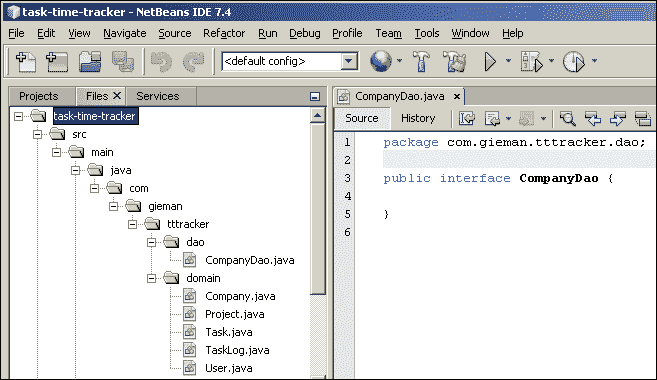

# 第四章数据访问变得容易

**数据访问对象**（**DAO**设计模式是一种从应用程序业务逻辑抽象数据库持久性的简单而优雅的方式。这种设计确保了任何企业应用程序的两个核心部分的清晰分离：数据访问层和服务（或业务逻辑）层。DAO 模式是一种广为人知的 Java EE 编程结构，最初由 Sun Microsystems 在其 Java EE 设计蓝图中突出，后来被其他编程环境（如.NET framework）采用。

下图说明了 DAO 层在整个应用程序结构中的位置：


在 DAO 层中更改实现不应以任何方式影响服务层。这是通过定义 DAO 接口来封装服务层可以访问的持久性操作来实现的。DAO 实现本身对服务层是隐藏的。

# 定义 DAO 接口

Java 编程语言中的接口定义了一组方法签名和常量声明。接口公开行为（或*可以做什么*并定义实现类承诺提供的契约（*如何做*）。我们的 DAO 层将为每个域对象包含一个接口和一个实现类。

### 注

在企业编程中，接口的使用是一种经常被误解的模式。这个论点是这样的，“为什么在不需要 Java 对象集的情况下向代码库中添加另一组 Java 对象呢？”。接口确实增加了您编写的代码行数，但是当您被要求重构一个从一开始就使用接口编写的老化项目时，它们的美丽就会得到赞赏。我已经将基于 SQL 的持久性层迁移到 JPA 持久性层。由于使用了接口，新的 DAO 实现取代了旧的 DAO，服务层没有任何重大变化。开发是在支持现有（旧）实现的同时进行的，直到我们准备在新的实现中进行交换。这是一个相对无痛的过程，如果不使用接口，就不容易实现。

让我们从公司界面开始。

## 增加 CompanyDao 接口

1.  Navigate to **File** | **New File** from the menu and select **Java Interface** as shown in the following screenshot:

    

2.  Click on the **Next** button and fill in the details as shown in the following screenshot:

    

接口名称为`CompanyDao`。我们可以使用大写的首字母缩写`CompanyDAO`来命名此接口。为了与较新的 JavaEE 命名风格保持一致，我们决定使用首字母缩略词的驼峰大小写形式。这种风格的最新示例包括`Html`*、`Json`*和`Xml`*类和接口，例如`javax.json.JsonObject`。我们还认为，这种形式更容易阅读。但是，这并不禁止您使用大写首字母缩写词；Java EE 中也有许多这样的示例（`EJB`*、`JAXB`*和`JMS`*接口和类，仅举几例）。无论你选择什么，都要始终如一。不要混用表单和创建`CompanyDAO`和`ProjectDao`接口！

请注意，包`com.gieman.tttracker.dao`还不存在，将为您创建。单击**完成**创建第一个界面，之后 NetBeans 将在编辑器中打开该文件。



公司接口将定义我们将在应用程序中使用的持久化方法。核心方法必须包括执行每个 CRUD 操作以及适合我们业务需要的任何其他操作的能力。我们将向该接口添加以下方法：

*   `persist`：此方法插入新的公司记录
*   `merge`：此方法更新现有公司记录
*   `remove`：此方法删除公司记录
*   `find`：此方法使用主键选择公司记录
*   `findAll`：此方法返回所有公司记录

请注意，JPA 术语`persist`、`merge`、`remove`和`find`等同于 SQL 操作`insert`、`update`、`delete`和`select`。将方法添加到`CompanyDao`中，如下代码所示：

```java
package com.gieman.tttracker.dao;

import com.gieman.tttracker.domain.Company;
import java.util.List;
public interface CompanyDao {

    public Company find(Integer idCompany);

    public List<Company> findAll();

    public void persist(Company company);

    public Company merge(Company company);

    public void remove(Company company);
}
```

我们定义了实现类必须承诺交付的契约。现在我们将添加`ProjectDao`接口。

## 增加 ProjectDao 接口

`ProjectDao`接口将定义一组与`CompanyDao`接口类似的方法：

```java
package com.gieman.tttracker.dao;

import com.gieman.tttracker.domain.Company;
import com.gieman.tttracker.domain.Project;
import java.util.List;

public interface ProjectDao {

    public Project find(Integer idProject);

    public List<Project> findAll();

    public void persist(Project project);

    public Project merge(Project project);

    public void remove(Project project);
}
```

您会注意到，`ProjectDao`接口中的所有方法签名都与`CompanyDao`接口相同。唯一的区别是在类类型中，`Company`被`project`取代。我们将要添加的所有其他接口（`TaskDao`、`UserDao`和`TaskLogDao`中也会出现同样的情况。每个接口都需要为`find`方法定义一个如下代码：

```java
public Company find(Integer idCompany); // in CompanyDao
public Project find(Integer idProject); // in ProjectDao
public Task find(Integer idTask); // in TaskDao
public User find(Integer idUser); // in UserDao
public TaskLog find(Integer idTaskLog); // in TaskLogDao
```

正如所示，这些方法中唯一的功能差异是返回的类型。`persist`、`merge`和`remove`方法也是如此。这种情况非常适合使用 Java 泛型。

## 定义通用 DAO 接口

此接口将由我们的每个 DAO 接口扩展。`GenericDao`接口使用泛型以每个子接口都可以使用的方式定义每个方法。这些方法将免费提供给扩展接口。与在`CompanyDao`、`ProjectDao`、`TaskDao`、`UserDao`和`TaskLogDao`接口中定义`find(Integer id)`方法不同，`GenericDao`接口定义了可供所有子体使用的通用方法。

### 注

这是一种用于企业应用程序编程的强大技术，在设计或构建应用程序框架时应始终予以考虑。使用 Java 泛型的结构良好的设计将简化未来多年的更改请求和维护。

通用接口定义如下所示：

```java
package com.gieman.tttracker.dao;

public interface GenericDao<T, ID> {

    public T find(ID id);

    public void persist(T obj);

    public T merge(T obj);

    public void remove(T obj);
}
```

我们现在可以重构`CompanyDao`接口，如下所示：

```java
package com.gieman.tttracker.dao;

import com.gieman.tttracker.domain.Company;
import java.util.List;

public interface CompanyDao extends GenericDao<Company, Integer>{

    public List<Company> findAll();

}
```

注意我们使用`<Company, Integer>`类型扩展接口的方式。`GenericDao`界面中的类型参数`<T, ID>`成为`CompanyDao`定义中指定类型的占位符。在`GenericDao`界面中找到的`T`或`ID`将在`CompanyDao`界面中被`Company`和`Integer`替换。这会自动将`find`、`persist`、`merge`和`remove`方法添加到`CompanyDao`。

泛型允许编译器在编译时检查类型正确性。这提高了代码的健壮性。关于 Java 泛型的一个很好的解释可以在[中找到 http://docs.oracle.com/javase/tutorial/extra/generics/index.html](http://docs.oracle.com/javase/tutorial/extra/generics/index.html) 。

以类似的方式，我们现在可以重构`ProjectDao`接口：

```java
package com.gieman.tttracker.dao;

import com.gieman.tttracker.domain.Company;
import com.gieman.tttracker.domain.Project;
import java.util.List;

public interface ProjectDao extends GenericDao<Project, Integer>{

    public List<Project> findAll();

}
```

让我们以同样的方式继续处理缺失的接口。

## TaskDao 接口

除了常用的泛型方法外，我们将再次需要方法。此界面类似于以下代码：

```java
package com.gieman.tttracker.dao;

import com.gieman.tttracker.domain.Project;
import com.gieman.tttracker.domain.Task;
import java.util.List;

public interface TaskDao extends GenericDao<Task, Integer>{

    public List<Task> findAll();    
}
```

## 用户 DAO 接口

我们将需要系统中所有用户的列表以及作为一些查找方法，通过不同的参数识别用户。当我们开发前端用户界面和服务层功能时，需要这些方法。`UserDao`界面的代码如下：

```java
package com.gieman.tttracker.dao;

import com.gieman.tttracker.domain.User;
import java.util.List;

public interface UserDao extends GenericDao<User, String> {

    public List<User> findAll();

    public User findByUsernamePassword(String username, String password);

    public User findByUsername(String username);

    public User findByEmail(String email);
}
```

注意，`UserDao`接口使用`String`ID 类型扩展`GenericDao`。这是因为`User`域实体具有`String`主键类型。

## TaskLogDao 接口

`TaskLogDao`接口还需要定义一些额外的方法，以便允许不同的视图进入任务日志数据。当我们开发前端用户界面和服务层功能时，将再次需要这些方法。

```java
package com.gieman.tttracker.dao;

import com.gieman.tttracker.domain.Task;
import com.gieman.tttracker.domain.TaskLog;
import com.gieman.tttracker.domain.User;
import java.util.Date;
import java.util.List;

public interface TaskLogDao extends GenericDao<TaskLog, Integer>{

    public List<TaskLog> findByUser(User user, Date startDate, Date endDate);

    public long findTaskLogCountByTask(Task task);

    public long findTaskLogCountByUser(User user);
}
```

请注意，我们的`TaskLogDao`接口的 finder 方法具有描述性名称，用于标识该方法的用途。每个 finder 方法将用于检索适合应用程序业务需求的任务日志项子集。

这涵盖了应用程序所需的所有接口。现在是为我们的每个接口定义实现的时候了。

# 定义泛型 DAO 实现

我们将再次使用 Java 泛型定义一个共同的祖先类，该类将由我们的每个实现类（`CompanyDaoImpl`、`ProjectDaoImpl`、`TaskDaoImpl`、`TaskLogDaoImpl`和`UserDaoImpl`进行扩展。`GenericDaoImpl`和所有其他实现类将添加到与 DAO 接口相同的`com.gieman.tttracker.dao`包中。`GenericDaoImpl`中的关键代码行突出显示，将在以下章节中解释：

```java
package com.gieman.tttracker.dao;

import java.io.Serializable;
import org.slf4j.Logger;
import org.slf4j.LoggerFactory;
import javax.persistence.EntityManager;
import javax.persistence.PersistenceContext;
import org.springframework.transaction.annotation.Propagation;
import org.springframework.transaction.annotation.Transactional;

public class GenericDaoImpl<T, ID extends Serializable> implements GenericDao<T, ID> {

    final protected Logger logger = LoggerFactory.getLogger(this.getClass());    

    @PersistenceContext(unitName = "tttPU")
    protected EntityManager em;

    private Class<T> type;

    public GenericDaoImpl(Class<T> type1) {
        this.type = type1;
    }

    @Override
    @Transactional(readOnly = true, propagation = Propagation.SUPPORTS)
  public T find(ID id) {
        return (T) em.find(type, id);
    }

    @Override
    @Transactional(readOnly = false, propagation = Propagation.REQUIRED)
    public void persist(T o) {
      em.persist(o);
    }

    @Override
    @Transactional(readOnly = false, propagation = Propagation.REQUIRED)
    public T merge(T o) {

          o = em.merge(o);
      return o;
    }
    @Override
    @Transactional(readOnly = false, propagation = Propagation.REQUIRED)
    public void remove(T o) {

        // associate object with persistence context
        o = merge(o);
        em.remove(o);

    }    
}
```

这门课有很多新概念！让我们一次解决一个问题。

## Java 的简单日志外观

Java 或 SLF4J 的简单日志外观是对关键日志框架的简单抽象，包括`java.util.logging`、`log4j`和`logback`。SLF4J 允许最终用户在部署时插入所需的日志框架，只需包含适当的实现库即可。有关 SLF4J 的更多信息，请访问[http://slf4j.org/manual.html](http://slf4j.org/manual.html) 。日志记录不仅允许开发人员调试代码，还可以提供应用程序中操作和应用程序状态的永久记录。应用程序状态的示例可能是当前内存使用情况、当前登录的授权用户数或等待处理的挂起消息数。在分析生产缺陷时，日志文件通常是第一个要查看的地方，它们是任何企业应用程序的重要组成部分。

尽管默认的 Java 日志记录对于简单的使用来说是足够的，但它不适合于更复杂的应用程序。`log4J`框架（[http://logging.apache.org/log4j/1.2](http://logging.apache.org/log4j/1.2) 和`logback`框架（[http://logback.qos.ch](http://logback.qos.ch) 是高度可配置日志框架的示例。`logback`框架通常被认为是`log4j`的继承者，因为它比`log4j`提供了一些关键优势，包括更好的性能、更少的内存消耗和自动重新加载配置文件。我们将在应用程序中使用`logback`。

所需的 SLF4J 和`logback`库将通过向`pom.xml`添加以下依赖项而添加到应用程序中：

```java
  <dependency>
   <groupId>ch.qos.logback</groupId>
   <artifactId>logback-classic</artifactId>
   <version>${logback.version}</version>
  </dependency>
```

您还需要将额外的`logback.version`属性添加到`pom.xml`：

```java
 <properties>
  <endorsed.dir>${project.build.directory}/endorsed</endorsed.dir>
  <project.build.sourceEncoding>UTF-8</project.build.sourceEncoding>
  <spring.version>3.2.4.RELEASE</spring.version>
 <logback.version>1.0.13</logback.version>
 </properties>
```

您现在可以执行**清理和构建项目**来下载`logback-classic`、`logback-core`和`slf4j-api`JAR 文件。这将使我们能够添加`GenericDaoImpl`中定义的导入以及记录器定义：

```java
final protected Logger logger = LoggerFactory.getLogger(this.getClass());
```

所有子类现在都可以使用记录器（声明为`protected`），但无法更改记录器（声明为`final`）。我们将在[第 5 章](05.html "Chapter 5. Testing the DAO Layer with Spring and JUnit")*中开始使用记录器，使用 Spring 和 JUnit*测试 DAO 层，其中我们将详细检查`logback.xml`配置文件。

## The@PersistenceContext（unitName=“tttPU”）行

这一行注释了`EntityManager`接口方法，这是 Spring 框架在运行时插入或注入`EclipseLink`实现所需的全部。`EntityManager`接口定义了与持久性上下文交互的方法，如`persist`、`merge`、`remove`和`find`。`EntityManager`接口方法的完整列表见[http://docs.oracle.com/javaee/7/api/javax/persistence/EntityManager.html](http://docs.oracle.com/javaee/7/api/javax/persistence/EntityManager.html) 。

我们的持久性上下文在`persistence.xml`中定义，我们在其中将其命名为`tttPU`。这就是通过`@PersistenceContext`注释`unitName`属性将`GenericDaoImpl`中的`EntityManager`绑定到持久性上下文的原因。持久性上下文是一组实体实例（在我们的应用程序中，它们是`Company`、`Project`、`Task`、`User`和`TaskLog`对象），其中对于任何持久性实体，都有一个唯一的实体实例。在持久性上下文中，管理实体实例及其生命周期。

`EntityManager`API 用于创建和删除持久实体实例，通过主键查找实体，并对实体进行查询。在我们的`GenericDaoImpl`类中，`EntityManager`实例`em`用于执行通用 CRUD 操作。因此，每个子类都可以访问这些方法以及`em`实例本身（声明为受保护）。

## @Transactional 注释

`@Transactional`注释是 Spring 声明式事务管理的基石。它允许您在单个方法级别指定事务行为，并且使用非常简单。此选项对应用程序代码的影响最小，并且不需要任何复杂的配置。事实上，它是完全非侵入性的，因为提交和回滚不需要 Java 编码。

Spring 建议您只使用`@Transactional`注释来注释类（和类的方法），而不是注释接口（完整的解释可以在[中找到）http://static.springsource.org/spring/docs/3.2.x/spring-framework-reference/html/transaction.html](http://static.springsource.org/spring/docs/3.2.x/spring-framework-reference/html/transaction.html) 。因此，我们将使用以下方法之一对泛型类和实现类中的所有适当方法进行注释：

```java
@Transactional(readOnly = false, propagation = Propagation.REQUIRED)
@Transactional(readOnly = true, propagation = Propagation.SUPPORTS)
```

`@Transactional`注释是指定方法必须具有事务语义的元数据。例如，我们可以定义元数据，定义在调用此方法时启动一个全新的只读事务，挂起任何现有事务。默认`@Transactional`设置如下：

*   `propagation`设置为`Propagation.REQUIRED`
*   `readOnly`是假的

正如我们前面所做的那样，定义所有属性（包括默认设置）是一种很好的做法。让我们详细检查这些属性。

### 所需的属性

未指定`propagation`设置的交易的默认值。此属性支持当前事务（如果存在），或创建新事务（如果不存在）。这确保了带`Propagation.REQUIRED`注释的方法始终具有可用的有效事务，并且应该在持久性存储中修改数据时使用。此属性通常与`readOnly=false`组合。

### Propagation.SUPPORTS 属性

如果存在当前的事务，则此属性支持该事务；如果不存在，则此属性以非事务方式执行。如果注释的方法没有修改数据（不会对数据库执行`insert`、`update`或`delete`语句），则应使用`Propagation.SUPPORTS`属性。此属性通常与`readOnly=true`组合。

### 只读属性

这只是为实际事务子系统提供了一个提示，以便尽可能优化已执行的语句。事务管理器可能无法解释此属性。但是，对于自文档化代码，最好包含此属性。

### 其他交易性质

Spring 允许我们使用超出本书范围的其他选项微调事务属性。浏览前面提到的链接，了解更多关于如何在更复杂的场景（包括多个事务资源）中管理事务的信息。

# 定义 DAO 实现

以下 DAO 实现将继承`GenericDaoImpl`中的核心 CRUD 操作，并添加它们自己在实现接口中定义的类特定方法。每个方法都将使用`@Transactional`注释来定义适当的事务行为。

## 公司 DAOImpl 类

我们`CompanyDaoImpl`类的完整清单如下：

```java
package com.gieman.tttracker.dao;

import com.gieman.tttracker.domain.Company;
import java.util.List;
import org.springframework.stereotype.Repository;
import org.springframework.transaction.annotation.Propagation;
import org.springframework.transaction.annotation.Transactional;

@Repository("companyDao")
@Transactional
public class CompanyDaoImpl extends GenericDaoImpl<Company, Integer> 
    implements CompanyDao {

    public CompanyDaoImpl() {
        super(Company.class);
    }

    @Override
    @Transactional(readOnly = true, propagation = Propagation.SUPPORTS)
    public List<Company> findAll() {
        return em.createNamedQuery("Company.findAll")
                .getResultList();
    }    
}
```

首先要注意的是`@Repository("companyDao")`注释。Spring 使用此注释在加载应用程序时自动检测和处理 DAO 对象。Spring API 对该注释的定义如下：

### 注

它表示带注释的类是`Repository`，最初由域驱动设计（Evans，2003）定义为一种机制，用于封装模拟对象集合的存储、检索和搜索行为。

注释的目的是允许 Spring 通过`classpath`扫描自动检测实现类，并处理该类以进行数据访问异常转换（Spring 用于从底层实现中抽象数据库异常消息）。然后，Spring 应用程序将在键`companyDao`下保存对实现类的引用。将键值与实现接口的名称匹配被认为是最佳实践。

`CompanyDaoImpl`类还介绍了在上一章的逆向工程过程中定义的 JPA 命名查询的使用。方法调用`em.createNamedQuery("Company.findAll")`在持久性引擎中创建由唯一标识符`"Company.findAll"`定义的命名查询。此命名查询是在`Company`类中定义的。调用`getResultList()`对数据库执行查询，返回公司对象的`java.util.List`。现在让我们回顾一下`Company`类中的命名查询定义：

```java
@NamedQuery(name = "Company.findAll", query = "SELECT c FROM Company c")
```

我们将对这个命名查询做一个小的更改，以按`companyName`升序排列结果。这需要在查询语句中添加一个`ORDER BY`子句。`Company`类中的最终命名查询定义现在看起来像以下代码：

```java
@NamedQueries({
    @NamedQuery(name = "Company.findAll", query = "SELECT c FROM Company c ORDER BY c.companyName ASC "),
    @NamedQuery(name = "Company.findByIdCompany", query = "SELECT c FROM Company c WHERE c.idCompany = :idCompany"),
    @NamedQuery(name = "Company.findByCompanyName", query = "SELECT c FROM Company c WHERE c.companyName = :companyName")})
```

## 项目导入类

本实施定义为：

```java
package com.gieman.tttracker.dao;

import com.gieman.tttracker.domain.Company;
import com.gieman.tttracker.domain.Project;
import java.util.List;
import org.springframework.stereotype.Repository;
import org.springframework.transaction.annotation.Propagation;
import org.springframework.transaction.annotation.Transactional;

@Repository("projectDao")
@Transactional
public class ProjectDaoImpl extends GenericDaoImpl<Project, Integer> 
    implements ProjectDao {

    public ProjectDaoImpl() {
        super(Project.class);
    }

    @Override
    @Transactional(readOnly = true, propagation = Propagation.SUPPORTS)
    public List<Project> findAll() {
        return em.createNamedQuery("Project.findAll")
                .getResultList();
    }    
}
```

再次，我们将在 Project 类中的`Project.findAll`命名查询中添加`ORDER BY`子句：

```java
@NamedQuery(name = "Project.findAll", query = "SELECT p FROM Project p ORDER BY p.projectName")
```

## TaskDaoImpl 类

该类定义为：

```java
package com.gieman.tttracker.dao;

import com.gieman.tttracker.domain.Project;
import com.gieman.tttracker.domain.Task;
import java.util.List;
import org.springframework.stereotype.Repository;
import org.springframework.transaction.annotation.Propagation;
import org.springframework.transaction.annotation.Transactional;

@Repository("taskDao")
@Transactional
public class TaskDaoImpl extends GenericDaoImpl<Task, Integer> implements TaskDao {

    public TaskDaoImpl() {
        super(Task.class);
    }

    @Override
    @Transactional(readOnly = true, propagation = Propagation.SUPPORTS)
    public List<Task> findAll() {
        return em.createNamedQuery("Task.findAll")
                .getResultList();
    }
}
```

再一次我们会在任务类的`Task.findAll`命名查询中添加`ORDER BY`子句：

```java
@NamedQuery(name = "Task.findAll", query = "SELECT t FROM Task t ORDER BY t.taskName")
```

## UserDaoImpl 类

此`UserDaoImpl`类将需要`User`域类中的附加命名查询来测试用户的登录凭据（用户名/密码组合）。`UserDaoImpl`类定义如下：

```java
package com.gieman.tttracker.dao;

import com.gieman.tttracker.domain.User;
import java.util.List;
import org.springframework.stereotype.Repository;
import org.springframework.transaction.annotation.Propagation;
import org.springframework.transaction.annotation.Transactional;

@Repository("userDao")
@Transactional
public class UserDaoImpl extends GenericDaoImpl<User, String> implements UserDao {

    public UserDaoImpl() {
        super(User.class);
    }

    @Override
    @Transactional(readOnly = true, propagation = Propagation.SUPPORTS)
    public List<User> findAll() {
        return em.createNamedQuery("User.findAll")
                .getResultList();
    }

    @Override
    @Transactional(readOnly = true, propagation = Propagation.SUPPORTS)
    public User findByUsernamePassword(String username, String password) {

        List<User> users = em.createNamedQuery("User.findByUsernamePassword")
                .setParameter("username", username)
                .setParameter("password", password)
                .getResultList();

        return (users.size() == 1 ? users.get(0) : null);
    }    

    @Override
    @Transactional(readOnly = true, propagation = Propagation.SUPPORTS)
    public User findByUsername(String username) {
        List<User> users = em.createNamedQuery("User.findByUsername")
                .setParameter("username", username)
                .getResultList();

        return (users.size() == 1 ? users.get(0) : null);
    }    

    @Override
    @Transactional(readOnly = true, propagation = Propagation.SUPPORTS)
    public User findByEmail(String email) {

        List<User> users = em.createNamedQuery("User.findByEmail")
                .setParameter("email", email)
                .getResultList();

        return (users.size() == 1 ? users.get(0) : null);
    }    
}
```

缺少的命名查询是`User.findByUsernamePassword`，用于验证具有给定用户名和密码的用户。查询定义必须添加到`User`类中，如下所示：

```java
@NamedQuery(name = "User.findByUsernamePassword", query = "SELECT u FROM User u WHERE u.password = :password AND (u.email = :username OR u.username = :username)")
```

请注意，此定义允许用户通过用户名或电子邮件字段进行匹配。与 web 应用程序中的常见做法一样，用户可以使用其唯一的登录名（用户名）或电子邮件地址登录。

`findByEmail`、`findByUsername`和`findByUsernamePassword`方法只能返回`null`（未找到匹配项）或单个结果，因为数据库中不能有多条记录具有这些唯一字段。与使用`getResultList()`方法检索`List`结果和测试列表大小为 1 的情况不同，我们可以使用与以下类似的代码：

```java
public User findByEmail(String email) {

  User user = (User) em.createNamedQuery("User.findByEmail")
      .setParameter("email", email)
      .getSingleResult();

  return user;
}
```

`getSingleResult()`方法只返回一个结果，如果找不到单个结果，则抛出异常。您还将注意到需要将返回的结果强制转换为所需的`User`类型。调用方法还需要捕获从`getSingleResult()`方法抛出的任何异常，除非前面给出的示例代码被更改以捕获异常。

```java
public User findByEmail(String email) {

  User user = null;

  try {
    user = (User) em.createNamedQuery("User.findByEmail")
      .setParameter("email", email)
      .getSingleResult();

  } catch(NoResultException nre){

 }
  return user;
}
```

我们相信我们`UserDaoImpl`接口中的代码比前面使用`try`/`catch`函数包装`getSingleResult()`方法的示例更干净。但是，在这两种情况下，如果找不到记录，则方法返回`null`。

### 注

在企业编程中，应该明智地使用异常，并且只有在真正异常的情况下才使用。除非异常指示调用代码无法恢复的情况，否则应避免引发异常。返回`null`（或者在适当的场景中返回 true/false）以指示情况与预期不符，这要干净得多。

我们不认为无法通过 ID 或电子邮件或电子邮件地址查找特殊情况下的记录；可能是其他用户删除了该记录，或者根本没有指定电子邮件的记录。返回`null`可以清楚地标识没有找到记录，而不需要抛出异常。

无论您是否抛出异常以指示找不到的记录，或者按照我们的偏好使用`null`，都应该记录您的 API 以指示该行为。例如，`UserDaoImpl.findByUsernamePassword`方法可以记录如下：

```java
/**
 * Find a User with the username/password combination or return null
 * if a valid user could not be found.
 * @param username
 * @param password
 * @return valid User object or null if not found.
 */
```

然后，API 的用户将了解预期的行为，并相应地对其交互进行编码。

## TaskLogDaoImpl 类

我们的应用程序中的最终 DAO 类如下：

```java
package com.gieman.tttracker.dao;

import com.gieman.tttracker.domain.Task;
import com.gieman.tttracker.domain.TaskLog;
import com.gieman.tttracker.domain.User;
import java.util.Date;
import java.util.List;
import javax.persistence.TemporalType;

public class TaskLogDaoImpl extends GenericDaoImpl<TaskLog, Integer> implements TaskLogDao {

    public TaskLogDaoImpl() {
        super(TaskLog.class);
    }

    @Override
    public List<TaskLog> findByUser(User user, Date startDate, Date endDate) {
        return em.createNamedQuery("TaskLog.findByUser")
                .setParameter("user", user)
                .setParameter("startDate", startDate, TemporalType.DATE)
                .setParameter("endDate", endDate, TemporalType.DATE)
                .getResultList();
    }

    @Override
    public long findTaskLogCountByTask(Task task) {
        Long count = (Long) em.createNamedQuery("TaskLog.findTaskLogCountByTask")
                .setParameter("task", task)
                .getSingleResult();
        return count;
    }

    @Override
    public long findTaskLogCountByUser(User user) {
        Long count = (Long) em.createNamedQuery("TaskLog.findTaskLogCountByUser")
                .setParameter("user", user)
                .getSingleResult();

        return count;
    }
}
```

这一次，我们将重构`TaskLog`命名的查询，如下所示：

```java
@NamedQueries({
    @NamedQuery(name = "TaskLog.findByUser", query = "SELECT tl FROM TaskLog tl WHERE tl.user = :user AND tl.taskLogDate BETWEEN :startDate AND :endDate order by tl.taskLogDate ASC"),
    @NamedQuery(name = "TaskLog.findTaskLogCountByTask", query = "SELECT count(tl) FROM TaskLog tl WHERE tl.task = :task "),
    @NamedQuery(name = "TaskLog.findTaskLogCountByUser", query = "SELECT count(tl) FROM TaskLog tl WHERE tl.user = :user ")
})
```

我们删除了几个不需要的查询，并添加了三个新的查询，如图所示。`TaskLog.findByUser`查询将用于列出指定日期范围内分配给用户的任务日志。注意使用`BETWEEN`关键字指定日期范围。在`TaskLogDaoImpl.findByUser`方法中设置参数时，还要注意`TemporalType.DATE`的使用。这将确保严格的日期比较，忽略参数中的任何时间成分（如果存在）。

我们的服务层将使用`TaskLog.findTaskLogCountByTask`和`TaskLog.findTaskLogCountByUser`命名查询来测试是否允许删除。我们将实施检查，以确保在分配有效任务日志的情况下不会删除用户或任务。

# 更好的域名层

现在让我们重温[第 3 章](03.html "Chapter 3. Reverse Engineering the Domain Layer with JPA")中创建的域层，*使用 JPA*反向工程域层。为该层中的所有实体定义一个祖先类不仅是最佳实践，而且还将使我们的域层在将来更容易增强。我们的祖先类定义如下：

```java
package com.gieman.tttracker.domain;

import java.io.Serializable;

public abstract class AbstractEntity implements Serializable{

}
```

虽然这个类有一个空的实现，但我们将在后面的章节中添加功能。

我们还将定义一个适当的接口，该接口具有一个通用方法来返回实体的 ID：

```java
package com.gieman.tttracker.domain;

public interface EntityItem<T> {

    public T getId();

}
```

我们的域层现在可以扩展我们的基础`AbstractEntity`类并实现`EntityItem`接口。我们的`Company`课程需要做如下更改：

```java
public class Company extends AbstractEntity implements EntityItem<Integer> {

// many more lines of code here

 @Override
 public Integer getId() {
 return idCompany;
 } 
}
```

通过类似的方式，我们可以更改其余的域类：

```java
public class Project extends AbstractEntity implements EntityItem<Integer> {

// many more lines of code here

 @Override
 public Integer getId() {
 return idProject;
 } 
}
public class Task extends AbstractEntity implements EntityItem<Integer> {

// many more lines of code here

 @Override
 public Integer getId() {
 return idTask;
 } 
}
public class User extends AbstractEntity implements EntityItem<String> {

// many more lines of code here

 @Override
 public String getId() {
 return username;
 } 
}
public class TaskLog extends AbstractEntity implements EntityItem<Integer> {

// many more lines of code here

 @Override
 public Integer getId() {
 return idTaskLog;
 } 
}
```

我们将为域层的未来变化做好充分准备。

# 练习–一个简单的变更请求

这个简单的练习将再次展示泛型的威力。现在，插入数据库的每条记录都应使用`logger.info()`记录，并显示以下消息：

```java
The "className" record with ID=? has been inserted
```

此外，删除的记录应使用`logger.warn()`记录，并显示以下信息：

```java
The "className" record with ID=? has been deleted
```

在这两种情况下，`?`标记应替换为插入或删除实体的 ID，`className`标记应替换为插入或删除实体的类名。当使用泛型时，这是一个微不足道的变化，因为代码可以添加到`GenericDaoImpl`类的`persist`和`remove`方法中。如果不使用泛型，`CompanyDaoImpl`、`ProjectDaoImpl`、`TaskDaoImpl`、`UserDaoImpl`和`TaskLogDaoImpl`类中的每一个都需要进行此更改。当您认为企业应用程序可能有 20, 30, 40 个或多个在 DAO 层中表示的表时，这样一个微小的改变可能不那么简单，而不用泛型。

您的任务是实现前面概述的变更请求。请注意，本练习将向您介绍`instanceof`操作员。

# 总结

本章介绍了数据访问对象设计模式，并定义了一组将在 3T 应用程序中使用的接口。DAO 设计模式清楚地将持久层操作与应用程序的业务逻辑分开。正如将在下一章中介绍的，这种清晰的分离确保了数据访问层易于测试和维护。

我们还引入了 Java 泛型作为一种技术，通过将公共功能移动到祖先来简化应用程序设计。`GenericDao`接口和`GenericDaoImpl`类定义并实现了扩展组件可以免费使用的方法。我们的实现还引入了 SLF4J、事务语义以及使用 JPA 命名查询。

我们的旅程现在将继续[第 5 章](05.html "Chapter 5. Testing the DAO Layer with Spring and JUnit")、*使用 Spring 和 JUnit*测试 DAO 层，在这里我们将配置一个测试环境，并为我们的几个 DAO 实现开发测试用例。