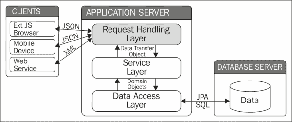
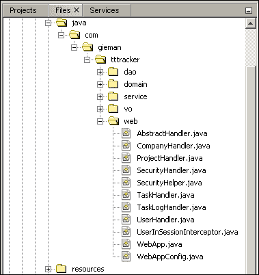

# 七、Web 请求处理层

请求处理层是将 HTTP 客户端绑定到应用提供的服务的粘合剂。这一层的领域是对请求的解释和数据的传输。我们的重点将放在 ExtJS4 客户端使用和提交的数据上。这些数据是 JSON 格式的，因此我们将讨论使用 JavaAPI 进行 JSON 处理的 JSON 解析和生成。但是，需要注意的是，任何类型的数据都可以通过适当的请求处理实现公开。如果需要，实现 RMI 或 RESTful 接口也同样容易。

# Web MVC 发展简史

在历史背景下讨论**模型-视图-控制器**（**MVC**）范例似乎有些奇怪，因为今天大多数 web 应用仍然使用这种技术。MVC 设计模式首先在 2000 年代早期的开源 Struts 框架中崭露头角。该框架鼓励使用 MVC 架构来促进在处理和服务请求时明确划分职责。此后，服务器端 Java 开发的 MVC 范式一直以各种格式存在，最终形成了设计良好、功能强大的 SpringMVC 框架。

使用 MVC 方法的原理非常简单。实现客户端和应用之间交互的 web 层可分为以下三种不同类型的对象：

*   表示数据的模型对象
*   查看负责显示数据的对象
*   响应动作并为视图对象提供要处理的模型数据的控制器对象

每个 MVC 对象都将以松散耦合的方式独立运行。例如，视图技术与控制器无关。视图是由 FreeMarker 模板、XSLT 转换还是 Tiles 和 JSP 的组合生成并不重要。控制器只需将处理模型数据的责任传递给视图对象。

在此历史讨论中需要注意的一点是，所有 MVC 处理都是在服务器上*执行的。随着 JavaScript 框架数量的增加，特别是 ExtJS4，MVC 范式已经从服务器转移到了客户端浏览器。这是 web 应用开发方式的根本性改变，也是您阅读本书的原因！*

# 企业 web 应用的请求处理

下图清楚地标识了请求处理层在整个应用架构中的位置：



请求处理层接受客户端请求，并将相应的操作转发给适当的服务层方法。将检查返回的 DTO（或域驱动设计中的值对象），然后将适当的响应发送给客户端。与历史上的服务器端 MVC 编程不同，请求处理层不了解表示，只是充当到应用的请求处理接口。

# 构建请求处理层

Ext JS 4 客户端的 web 请求处理层是服务层接口的 JSON 生成代理。域实体在该层内转换为 JSON 表示；因此，我们的第一步是创建一些帮助程序代码，以简化此任务。

有几个优秀的开源 JSON 生成项目可以帮助完成这项任务，包括 Jackson（[http://jackson.codehaus.org](http://jackson.codehaus.org) 和谷歌 Gson（[http://code.google.com/p/google-gson/](http://code.google.com/p/google-gson/) ）。这些库通过它们声明的字段将 POJO 解析为适当的 JSON 表示。随着 JavaEE7 的发布，我们不再需要第三方库。用于 JSON 处理的 JavaAPI（JSR-353）可在所有符合 JavaEE7 的应用服务器中使用，包括 GlassFish 4。我们将利用此 API 生成和解析 JSON 数据。

### 注

如果无法使用 JavaEE7 应用服务器，则需要选择另一种 JSON 生成策略，如 Jackson 或 GoogleGSON。

## 准备生成 JSON

我们的第一个新增的是一个新的域接口：

```java
package com.gieman.tttracker.domain;

import javax.json.JsonObject;
import javax.json.JsonObjectBuilder;

public interface JsonItem{

    public JsonObject toJson();
    public void addJson(JsonObjectBuilder builder);

}
```

这个非常简单的接口定义了两种方法来帮助生成 JSON。`toJson`方法创建一个表示实体的`JsonObject`。`addJson`方法将实体属性添加到`JsonObjectBuilder`接口。我们很快就会看到这两种方法是如何使用的。

我们的每个域实体都需要实现`JsonItem`接口，这可以通过简单地将接口添加到所有域实体的抽象超类中来实现：

```java
package com.gieman.tttracker.domain;

import java.io.Serializable;
import java.text.SimpleDateFormat;
import javax.json.Json;
import javax.json.JsonObject;
import javax.json.JsonObjectBuilder;
public abstract class AbstractEntity implements JsonItem, Serializable{

    @Override
 public JsonObject toJson() {

 JsonObjectBuilder builder = Json.createObjectBuilder();
 addJson(builder);
 return builder.build();
 }

}
```

`JsonObjectBuilder`接口定义了一组方法，将名称/值对添加到与构建器关联的 JSON 对象中。`builder`实例添加了在实现`addJson`方法的子类中定义的字段。我们将从`Company`对象开始。

### 实施公司 addJson 方法

需要添加到`Company`类中的`addJson`方法如下：

```java
@Override
public void addJson(JsonObjectBuilder builder) {
  builder.add("idCompany", idCompany)
     .add("companyName", companyName);
}
```

`Company`实例的`JsonObject`表示是通过调用超类中的`builder.build()`方法创建的。生成的`JsonObject`可以由`JsonWriter`实例写入输出源。

### 实现项目 addJson 方法

需要添加到`Project`类中的`addJson`方法如下：

```java
@Override
public void addJson(JsonObjectBuilder builder) {

  builder.add("idProject", idProject)
     .add("projectName", projectName);

  if(company != null){
     company.addJson(builder);
  }
}   
```

请注意，在访问对象方法之前执行`null`对象测试始终是一种良好的做法。可以在没有`company`实例的情况下创建`project`对象，因此我们在将`company`JSON 属性添加到项目`builder`实例之前执行`company != null`测试。我们可以使用以下代码将`company`属性直接添加到项目`builder`实例中：

```java
builder.add("idProject", idProject)
     .add("projectName", projectName)
.add("idCompany", company.getIdCompany() )
     .add("companyName", company.getCompanyName() );
```

然而，我们现在已经在两个类（`Company.addJson`和`Project.addJson`之间复制了`builder.add("idCompany"…)`代码，因此未来的维护容易出错。例如，将 JSON 属性名称从`idCompany`更改为`companyId`，将需要扫描代码以检查所有类（而不仅仅是`Company`类）的可能用法。正如我们已经实现的那样，`Company`JSON 的创建应该属于`Company`类。

### 实现 Task addJson 方法

此`Task`类将实现的`addJson`方法，如下所示：

```java
@Override
public void addJson(JsonObjectBuilder builder) {

  builder .add("idTask", idTask)
     .add("taskName", taskName);

  if(project != null){
     project.addJson(builder);

     Company company = project.getCompany();
     company.addJson(builder);
  }        
}
```

再次注意我们如何为`project`和`company`类链接对`addJson`的调用，以将它们的 JSON 属性添加到任务的`builder`实例中。

### 实现用户 addJson 方法

`User.addJson`方法定义如下：

```java
@Override
public void addJson(JsonObjectBuilder builder) {

  builder.add("username", username)
      .add("firstName", firstName)
      .add("lastName", lastName)
      .add("email", email)
      .add("adminRole", adminRole + "")
      .add("fullName", firstName + " " + lastName);
}
```

`fullName`物业仅为方便起见；我们可以同样轻松地创建一个`fullName`字段，将 ExtJS 代码中的`firstName`和`lastName`字段连接起来。但是，将此代码保留在 JSON 生成的源代码中可以更容易地进行维护。考虑业务更改请求“向 AutoT5 实体添加一个 OutT4 字段”。因此，`fullName`包含新的`middleName`字段是一个简单的练习，ExtJS 客户端无需进一步更改即可使用。

### 实现 TaskLog addJson 方法

`addJson`方法将所有`TaskLog`字段添加到`builder`实例中。`DATE_FORMAT_yyyyMMdd`常量用于将`taskLogDate`格式化为年/月/日的 8 位表示，并添加到`TaskLog`类中，如下所示：

```java
static final SimpleDateFormat DATE_FORMAT_yyyyMMdd = new SimpleDateFormat("yyyyMMdd");
```

`addJson`方法将使用`SimpleDateFormat`实例格式化`taskLogDate`字段：

```java
public void addJson(JsonObjectBuilder builder) {

  builder.add("idTaskLog", idTaskLog)
    .add("taskDescription", taskDescription)
    .add("taskLogDate", taskLogDate == null ? "" : DATE_FORMAT_yyyyMMdd.format(taskLogDate))
    .add("taskMinutes", taskMinutes);

  if (user != null) {
    user.addJson(builder);
  }
  if (task != null) {
    task.addJson(builder);            
  }
}
```

`taskLogDate`字段的格式在转换为 ExtJS 客户端中的 JavaScript`Date`对象时不能被误解。在不使用`SimpleDateFormat`实例的情况下，`builder`实例会调用`taskLogDate`对象上的默认`toString`方法来检索字符串表示，结果类似于以下输出：

```java
Wed Aug 14 00:00:00 EST 2013
```

使用配置了日期模式为`yyyyMMdd`的`SimpleDateFormat`实例将确保该日期被格式化为`20130814`。

### 注

如果不采用标准策略，企业应用中的日期格式可能会导致许多问题。当我们开发应用在全球范围内使用多个时区和不同语言时，这一点更为适用。无论语言、时区和用户偏好如何，日期的格式应始终能够以相同的方式进行解释。

## 关于 JSON 的一个注记

我们将使用 JSON 在 GlassFish 服务器和 ExtJS 客户端之间传输数据。传输是双向的；服务器将 JSON 数据发送到 ExtJS 客户端，ExtJS 客户端将 JSON 格式的数据发送回服务器。服务器和客户端将使用*和*生成 JSON 数据。

只要 JSON 数据符合规范（[，就没有结构化 JSON 数据的规则 http://tools.ietf.org/html/rfc4627](http://tools.ietf.org/html/rfc4627) ）。ExtJS4 模型通过使用关联允许任何形式的有效 JSON 结构；我们的方法将 JSON 结构保持为最简单的形式。以前定义的`addJson`方法返回简单、平坦的数据结构，没有嵌套或数组。例如，`task`实例可以序列化为以下 JSON 对象（包含格式以便于可读）：

```java
{
    success: true,
    data: {
        "idTask": 1,
        "taskName": "Write Chapter 7",
        "idProject": 1,
        "projectName": "My Book Project",
        "idCompany": 1,
        "companyName": "PACKT Publishing"
    }
}
```

`data`有效负载表示 Ext JS 4 客户端将使用的`task`对象。我们可以将`task`对象的 JSON 表示定义为如下：

```java
{
    success: true,
    data: {
        "idTask": 1,
        "taskName": "Write Chapter 7",
        "project": {
            "idProject": 1,
            "projectName": "My Book Project ",
            "company": {
                "idCompany": 1,
                "companyName": "PACKT Publishing"
            }
        }
    }
}
```

在这个结构中，我们看到`task`实例属于`project`，而`project`又属于`company`。这两种表述都是合法的；它们都包含有效 JSON 格式的相同`task`数据。但是，这两个选项中哪一个更容易解析？哪个更容易调试？作为一名企业应用开发人员，我们应该始终牢记 KISS 原则。**保持简单，愚蠢**（**KISS**原则指出大多数系统如果保持简单，工作效果最好，应该避免不必要的复杂性。

### 注

让你的 JSON 保持简单！我们知道复杂的结构是可能的；只有在定义 Ext JS 4 模型以及在读取或写入 JSON 数据时相关的数据处理时增加复杂性，才能实现这一点。简单的 JSON 结构更易于理解和维护。

# 创建请求处理程序

现在我们将构建用于服务 ExtJS 客户端 HTTP 请求的处理程序。这些处理程序将被添加到新的`web`目录中，如以下屏幕截图所示：



每个处理程序将使用 Spring 框架`@Controller`注释来指示该类充当“控制器”的角色。严格地说，我们将定义的处理程序不是传统意义上的 SpringMVC 应用中的*控制器。我们将只使用一小部分可用的 Spring 控制器功能来处理请求。这将确保我们的请求处理层非常轻量级，并且易于维护。一如既往，我们将从创建所有处理程序都将实现的基类开始。*

## 定义 AbstractHandler 超类

`AbstractHandler`超类定义了几个用于简化 JSON 生成的重要方法。当我们致力于与 Ext JS 4 客户端集成时，我们的处理程序生成的 JSON 对象的结构特定于 Ext JS 4 组件所期望的数据结构。我们将始终生成一个 JSON 对象，该对象具有保存布尔值`true`或`false`的`success`属性。同样，我们将始终生成一个名为`data`的有效负载属性的 JSON 对象。此`data`属性将一个有效的 JSON 对象作为其值，可以是一个简单的 JSON 对象，也可以是一个 JSON 数组。

### 注

请记住，所有生成的 JSON 对象的格式都可以由 ExtJS4 组件使用，而无需额外配置。

`AbstractHandler`类的定义如下：

```java
package com.gieman.tttracker.web;

import com.gieman.tttracker.domain.JsonItem;
import java.io.StringReader;
import java.io.StringWriter;
import java.util.List;
import javax.json.Json;
import javax.json.JsonArrayBuilder;
import javax.json.JsonNumber;
import javax.json.JsonObject;
import javax.json.JsonObjectBuilder;
import javax.json.JsonReader;
import javax.json.JsonValue;
import javax.json.JsonWriter;
import org.slf4j.Logger;
import org.slf4j.LoggerFactory;

public abstract class AbstractHandler {

    protected final Logger logger = LoggerFactory.getLogger(this.getClass());

    public static String getJsonSuccessData(List<? extends JsonItem> results) {

        final JsonObjectBuilder builder = Json.createObjectBuilder();
        builder.add("success", true);
        final JsonArrayBuilder arrayBuilder = Json.createArrayBuilder();

        for (JsonItem ji : results) {

            arrayBuilder.add(ji.toJson());
        }

        builder.add("data", arrayBuilder);

        return toJsonString(builder.build());
    }

    public static String getJsonSuccessData(JsonItem jsonItem) {

        final JsonObjectBuilder builder = Json.createObjectBuilder();
        builder.add("success", true);
        builder.add("data", jsonItem.toJson());

        return toJsonString(builder.build());

    }

    public static String getJsonSuccessData(JsonItem jsonItem, int totalCount) {

        final JsonObjectBuilder builder = Json.createObjectBuilder();
        builder.add("success", true);
        builder.add("total", totalCount);
        builder.add("data", jsonItem.toJson());

        return toJsonString(builder.build());
    }

    public static String getJsonErrorMsg(String theErrorMessage) {

        return getJsonMsg(theErrorMessage, false);

    }

    public static String getJsonSuccessMsg(String msg) {

        return getJsonMsg(msg, true);
    }
    public static String getJsonMsg(String msg, boolean success) {

        final JsonObjectBuilder builder = Json.createObjectBuilder();
        builder.add("success", success);
        builder.add("msg", msg);

        return toJsonString(builder.build());

    }

    public static String toJsonString(JsonObject model) {

        final StringWriter stWriter = new StringWriter();

        try (JsonWriter jsonWriter = Json.createWriter(stWriter)) {
            jsonWriter.writeObject(model);
        }

        return stWriter.toString();
    }

    protected JsonObject parseJsonObject(String jsonString) {

        JsonReader reader = Json.createReader(new StringReader(jsonString));
        return reader.readObject();

    }
    protected Integer getIntegerValue(JsonValue jsonValue) {

        Integer value = null;

        switch (jsonValue.getValueType()) {

            case NUMBER:
                JsonNumber num = (JsonNumber) jsonValue;
                value = num.intValue();
                break;
            case NULL:
                break;
        }

        return value;
    }
}
```

重载的`getJsonSuccessData`方法将分别生成一个 JSON 字符串，其`success`属性设置为`true`并生成一个适当的`data`JSON 负载。`getJsonXXXMsg`变体还将生成一个 JSON 字符串，该字符串具有适当的`success`属性（成功操作的`true`属性或失败操作的`false`属性）和保存适当消息的`msg`属性，供 Ext JS 组件使用。

`parseJsonObject`方法将使用`JsonReader`实例将 JSON 字符串*解析为*一个`JsonObject`。`toJsonString`方法将*使用`JsonWriter`实例将*aT4】写入其 JSON 字符串表示。这些类是 JavaEE7`javax.json`包的一部分，它们使使用 JSON 变得非常简单。

`getIntegerValue`方法用于将`JsonValue`对象解析为`Integer`类型。`JsonValue`对象可以是`javax.json.jsonValue.ValueType`常量定义的几种不同类型，在尝试将`JsonValue`对象解析为`Integer`之前，对该值进行适当的检查。这将允许我们以以下形式从 Ext JS 客户端发送 JSON 数据：

```java
{
    success: true,
    data: {
        "idCompany":null,
        "companyName": "New Company"
    }
}
```

注意，`idCompany`属性的值为`null`。`getIntegerValue`方法允许我们解析*可能*是`null`的整数，这在使用默认`JsonObject.getInt(key)`方法时是不可能的（如果遇到`null`值，它会引发异常）。

现在，让我们定义将处理用户身份验证的第一个处理程序类。

## 定义 SecurityHandler 类

我们首先定义一个简单的助手类，用于验证用户会话是否处于活动状态：

```java
package com.gieman.tttracker.web;

import com.gieman.tttracker.domain.User;
import javax.servlet.http.HttpServletRequest;
import javax.servlet.http.HttpSession;

public class SecurityHelper {
    static final String SESSION_ATTRIB_USER = "sessionuser";

    public static User getSessionUser(HttpServletRequest request) {
        User user = null;
        HttpSession session = request.getSession(true);
        Object obj = session.getAttribute(SESSION_ATTRIB_USER);

        if (obj != null && obj instanceof User) {
            user = (User) obj;
        }
        return user;
    }
}
```

静态常量`SESSION_ATTRIB_USER`将用作保存已验证用户的会话属性的名称。所有处理程序类都将调用`SecurityHelper.getSessionUser`方法从会话中检索经过身份验证的`user`。用户会话可能因处于非活动状态而超时，然后应用服务器将删除 HTTP 会话。发生这种情况时，`SecurityHelper.getSessionUser`方法将返回`null`，3T 应用必须优雅地处理。

`SecurityHandler`类用于验证用户凭据。如果用户成功通过身份验证，`user`对象使用`SESSION_ATTRIB_USER`属性存储在 HTTP 会话中。用户也可以通过点击**退出**按钮退出 3T 应用。在这种情况下，用户将从会话中删除。

验证和注销功能的实现如下：

```java
package com.gieman.tttracker.web;

import com.gieman.tttracker.domain.User;
import com.gieman.tttracker.service.UserService;
import com.gieman.tttracker.vo.Result;
import static com.gieman.tttracker.web.AbstractHandler.getJsonErrorMsg;
import static com.gieman.tttracker.web.SecurityHelper.SESSION_ATTRIB_USER;
import javax.servlet.http.HttpServletRequest;
import javax.servlet.http.HttpSession;
import org.springframework.beans.factory.annotation.Autowired;
import org.springframework.stereotype.Controller;
import org.springframework.web.bind.annotation.RequestMapping;
import org.springframework.web.bind.annotation.RequestMethod;
import org.springframework.web.bind.annotation.RequestParam;
import org.springframework.web.bind.annotation.ResponseBody;

@Controller
@RequestMapping("/security")
public class SecurityHandler extends AbstractHandler {

    @Autowired
    protected UserService userService;

    @RequestMapping(value = "/logon", method = RequestMethod.POST, produces = {"application/json"})
    @ResponseBody
    public String logon(
            @RequestParam(value = "username", required = true) String username,
            @RequestParam(value = "password", required = true) String password,
            HttpServletRequest request) {

        Result<User> ar = userService.findByUsernamePassword(username, password);

        if (ar.isSuccess()) {
            User user = ar.getData();
            HttpSession session = request.getSession(true);
            session.setAttribute(SESSION_ATTRIB_USER, user);            
            return getJsonSuccessData(user);
        } else {
            return getJsonErrorMsg(ar.getMsg());
        }
    }

    @RequestMapping(value = "/logout", produces = {"application/json"})
    @ResponseBody
    public String logout(HttpServletRequest request) {

        HttpSession session = request.getSession(true);
        session.removeAttribute(SESSION_ATTRIB_USER);
        return getJsonSuccessMsg("User logged out...");
    }
}
```

`SecurityHandler`课程引入了许多新的 Spring 注释和概念，需要详细解释。

### @Controller 和@RequestMapping 注释

`@Controller`注释表示该类充当 Spring 控制器的角色。`@Controller`注释类通过 Spring 组件扫描自动检测，其配置在本章后面定义。但控制器究竟是什么？

Spring 控制器是 Spring MVC 框架的一部分，通常与模型和视图一起处理请求。我们不需要模型或视图；事实上，我们的处理生命周期完全由控制器本身管理。每个控制器负责类级别`@RequestMapping`注释中定义的 URL 映射。此映射将 URL 路径映射到控制器。在我们的 3T 应用中，任何以`/security/`开头的 URL 都将被定向到`SecurityHandler`类进行进一步处理。然后，任何子路径都将用于匹配方法级别`@RequestMapping`注释。我们定义了两个方法，每个方法都有自己独特的映射。这将导致以下 URL 路径到方法的映射：

*   `/security/logon`将映射到`logon`方法
*   `/security/logout`将映射到`logout`方法

任何以`/security/`开头的其他 URL 都将与定义的方法不匹配，并将产生`404`错误。

方法的名称并不重要；`@RequestMapping`注释定义了用于服务请求的方法。

`logon``@RequestMapping`注释中定义了两个附加属性。`method=RequestMethod.POST`属性指定登录请求 URL`/security/logon`必须作为`POST`请求提交。如果`/security/logon`提交使用了任何其他请求类型，将返回`404`错误。默认情况下，使用 AJAX 的 ExtJS4 存储和模型将提交`POST`请求。但是，除非另有配置，否则读取数据的操作将使用`GET`请求提交。RESTful web 服务中使用的其他可能方法包括`PUT`和`DELETE`，但我们将仅在应用中定义`GET`和`POST`请求。

### 注

确保每种`@RequestMapping`方法都定义了合适的`RequestMethod`被认为是最佳实践。修改数据的操作应始终使用`POST`请求提交。保存敏感数据（例如密码）的操作也应使用`POST`请求提交，以确保数据不会以 URL 编码格式发送。根据您的应用需要，读取操作可以作为`GET`或`POST`请求发送。

`produces = {"application/json"}`属性定义映射请求的可生产媒体类型。我们所有的请求都将生成媒体类型为`application/json`的 JSON 数据。浏览器提交的每个 HTTP 请求都有一个`Accept`头，例如：

```java
text/html,application/xhtml+xml,application/xml;q=0.9,*/*;q=0.8
```

如果请求不包含属性媒体类型，则 GlassFish 4 服务器返回以下`406 Not Acceptable`错误：

```java
The resource identified by this request is only capable of generating responses with characteristics not acceptable according to the request "accept" headers.
```

所有现代浏览器都将接受`application/json`内容类型。

### @ResponseBody 注释

Spring 使用此注释标识应将内容直接返回到 HTTP 响应输出流的方法（不放在模型中或解释为视图名称，这是 Spring MVC 的默认行为）。如何实现这一点取决于方法的返回类型。我们所有的请求处理方法都将返回 Java 字符串，Spring 将在内部使用一个`StringHttpMessageConverter`实例，以`Content-Type`值`text/plain`将字符串写入 HTTP 响应输出流。这是一种非常简单的方法，可以将 JSON 数据对象字符串返回 HTTP 客户端，从而使请求处理成为一个简单的过程。

### @RequestParam 注释

方法参数上的注释将请求参数映射到参数本身。在`logon`方法中，我们有以下定义：

```java
@RequestParam(value = "username", required = true) String username,
@RequestParam(value = "password", required = true) String password,
```

假设方法属于`GET`类型（在`SecurityHandler`类中设置为`POST`，因此下面的 URL 编码不起作用），下面这样的 URL 将调用`username`值为`bjones`且`password`值为`admin`的方法：

`/security/logon.json?username=bjones&password=admin`

我们可以很容易地用以下定义编写此方法：

```java
@RequestParam(value = "user", required = true) String username,
@RequestParam(value = "pwd", required = true) String password,
```

这将映射以下形式的 URL：

`/security/logon.json?user=bjones&pwd=admin`

请注意，是映射到请求参数名称的`@RequestParam`注释的`value`属性。

`@RequestParam`注释的`required`属性定义此参数是否为必填字段。以下 URL 将导致异常：

`/security/logon.json?username=bjones`

密码参数明显缺失，不符合`required=true`定义。

注意，`required=true`属性只检查是否存在与`@RequestParam`注释的`value`匹配的请求参数。请求参数为空是完全有效的。以下 URL 不会引发异常：

`/security/logon.json?username=bjones&password=`

可选参数可以使用`required=false`属性定义，也可以包括`defaultValue`。考虑下面的方法论证：

```java
@RequestParam(value = "address", required = false, defaultValue = "Unknown address") String address
```

还考虑以下三个 URL：

*   `/user/address.json?address=Melbourne`
*   `/user/address.json?address=`
*   `/user/address.json?`

第一个 URL 将产生一个地址值`Melbourne`，第二个 URL 将有一个空地址，第三个 URL 将有一个“未知地址”。请注意，`defaultValue`仅在请求没有有效的地址参数时使用，而在地址参数为空时不使用。

### 验证用户身份

由于我们实现了服务层业务逻辑，我们`SecurityHandler`类中的`logon`方法非常简单。我们调用`userService.findByUsernamePassword(username, password)`方法并检查返回的`Result`。如果`Result`成功，`SecurityHandler.logon`方法将返回已验证用户的 JSON 表示。这是通过行`getJsonSuccessData(user)`实现的，这将导致将以下输出写入 HTTP 响应：

```java
{
    "success": true,
    "data": {
        "username": "bjones",
        "firstName": "Betty",
        "lastName": "Jones",
        "email": "bj@tttracker.com",
        "adminRole": "Y",
        "fullName": "Betty Jones"
    }
}
```

请注意，前面的格式仅用于可读性。实际响应将是一个字符流。然后，使用属性`SESSION_ATTRIB_USER`将经过身份验证的用户添加到 HTTP 会话中。然后，我们可以通过调用请求处理程序中的`SecurityHelper.getSessionUser(request)`来识别经过身份验证的用户。

失败的`Result`实例将调用`getJsonErrorMsg(ar.getMsg())`方法，这将导致在 HTTP 响应中返回以下 JSON 对象：

```java
{
    "success": false,
    "msg": "Unable to verify user/password combination!"
}
```

`msg`文本在`UserServiceImpl.findByUsernamePassword`方法的`Result`实例上设置。Ext JS 前端将根据`success`属性对每个结果进行不同的处理。

### 注销

此方法中的逻辑非常简单：从会话中删除用户并返回一条成功的 JSON 消息。Ext JS 前端随后将采取适当的操作。`@RequestMapping`注释中没有定义`RequestMethod`，因为没有发送数据。这意味着可以使用任何`RequestMethod`来映射此 URL（`GET`、`POST`等等）。此方法返回的 JSON 对象如下：

```java
{
    "success": true,
    "msg": "User logged out..."
}
```

## 定义 CompanyHandler 类

此处理程序处理公司操作，并映射到`/company/`URL 模式。

```java
package com.gieman.tttracker.web;

import com.gieman.tttracker.domain.*;
import com.gieman.tttracker.service.CompanyService;
import com.gieman.tttracker.service.ProjectService;

import com.gieman.tttracker.vo.Result;
import static com.gieman.tttracker.web.SecurityHelper.getSessionUser;

import java.util.List;
import javax.json.JsonObject;
import javax.servlet.http.HttpServletRequest;
import org.springframework.beans.factory.annotation.Autowired;

import org.springframework.stereotype.Controller;
import org.springframework.web.bind.annotation.RequestMapping;
import org.springframework.web.bind.annotation.RequestMethod;
import org.springframework.web.bind.annotation.ResponseBody;
import org.springframework.web.bind.annotation.RequestParam;

@Controller
@RequestMapping("/company")
public class CompanyHandler extends AbstractHandler {

    @Autowired
    protected CompanyService companyService;
    @Autowired
    protected ProjectService projectService;
    @RequestMapping(value = "/find", method = RequestMethod.GET, produces = {"application/json"})
    @ResponseBody
    public String find(
            @RequestParam(value = "idCompany", required = true) Integer idCompany,
            HttpServletRequest request) {

        User sessionUser = getSessionUser(request);
        if (sessionUser == null) {
            return getJsonErrorMsg("User is not logged on");
        }

        Result<Company> ar = companyService.find(idCompany, sessionUser.getUsername());

        if (ar.isSuccess()) {

            return getJsonSuccessData(ar.getData());

        } else {

            return getJsonErrorMsg(ar.getMsg());

        }
    }

    @RequestMapping(value = "/store", method = RequestMethod.POST, produces = {"application/json"})
    @ResponseBody
    public String store(
            @RequestParam(value = "data", required = true) String jsonData,
            HttpServletRequest request) {

        User sessionUser = getSessionUser(request);
        if (sessionUser == null) {
            return getJsonErrorMsg("User is not logged on");
        }

        JsonObject jsonObj = parseJsonObject(jsonData);

        Result<Company> ar = companyService.store(
                getIntegerValue(jsonObj.get("idCompany")), 
                jsonObj.getString("companyName"), 
                sessionUser.getUsername());

        if (ar.isSuccess()) {

            return getJsonSuccessData(ar.getData());

        } else {

            return getJsonErrorMsg(ar.getMsg());

        }
    }

    @RequestMapping(value = "/findAll", method = RequestMethod.GET, produces = {"application/json"})
    @ResponseBody
    public String findAll(HttpServletRequest request) {

        User sessionUser = getSessionUser(request);
        if (sessionUser == null) {
            return getJsonErrorMsg("User is not logged on");
        }

        Result<List<Company>> ar = companyService.findAll(sessionUser.getUsername());

        if (ar.isSuccess()) {

            return getJsonSuccessData(ar.getData());

        } else {

            return getJsonErrorMsg(ar.getMsg());

        }
    }

    @RequestMapping(value = "/remove", method = RequestMethod.POST, produces = {"application/json"})
    @ResponseBody
    public String remove(
            @RequestParam(value = "data", required = true) String jsonData,
            HttpServletRequest request) {
        User sessionUser = getSessionUser(request);
        if (sessionUser == null) {
            return getJsonErrorMsg("User is not logged on");
        }

        JsonObject jsonObj = parseJsonObject(jsonData);

        Result<Company> ar = companyService.remove(
                getIntegerValue(jsonObj.get("idCompany")), 
                sessionUser.getUsername());

        if (ar.isSuccess()) {

            return getJsonSuccessMsg(ar.getMsg());

        } else {

            return getJsonErrorMsg(ar.getMsg());

        }
    }
}
```

每个方法都映射到由方法级别`@RequestMapping`注释定义的不同子 URL。因此，`CompanyHandler`类将映射到以下 URL：

*   `/company/find`将使用`GET`请求将其映射到`find`方法
*   `/company/store`将使用`POST`请求将其映射到`store`方法
*   `/company/findAll`将使用`GET`请求将其映射到的`findAll`方法
*   `/company/remove`将使用`POST`请求将其映射到的`remove`方法

以下是需要注意的几点：

*   每个处理程序方法都用一个`RequestMethod.POST`或`RequestMethod.GET`来定义。`GET`方法用于查找方法，`POST`方法用于数据修改方法。这些方法类型是 ExtJS 为每个操作使用的默认值。
*   每个方法通过调用`getSessionUser(request)`从 HTTP 会话中检索用户，然后测试`user`值是否为`null`。如果用户不在会话中，则在 JSON 编码的 HTTP 响应中返回消息“`User is not logged on"`。
*   `POST`方法有一个单独的请求参数，用于保存 ExtJS 客户端提交的 JSON 数据。然后，在使用所需参数调用适当的服务层方法之前，将此 JSON 字符串解析为`JsonObject`。

用于添加新公司的典型 JSON 数据有效负载如下所示：

```java
{"idCompany":null,"companyName":"New Company"}
```

注意，`idCompany`值为`null`。如果要修改现有公司记录，JSON 数据负载必须包含有效的`idCompany`值：

```java
{"idCompany":5,"companyName":"Existing Company"}
```

还要注意，JSON 数据只保存一条公司记录。通过提交类似于以下数组的 JSON 数组，可以将 Ext JS 客户端配置为每个请求提交多个记录：

```java
[
  {"idCompany":5,"companyName":"Existing Company"},
  {"idCompany":4,"companyName":"Another Existing Company"}
]
```

然而，我们将限制我们的逻辑处理每个请求的单个记录。

## 定义 ProjectHandler 类

`ProjectHandler`类处理项目动作，并映射到`/project/`URL 模式，如下所示：

```java
package com.gieman.tttracker.web;

import com.gieman.tttracker.domain.*;
import com.gieman.tttracker.service.ProjectService;
import com.gieman.tttracker.vo.Result;
import static com.gieman.tttracker.web.SecurityHelper.getSessionUser;

import java.util.List;
import javax.json.JsonObject;
import javax.servlet.http.HttpServletRequest;
import org.springframework.beans.factory.annotation.Autowired;

import org.springframework.stereotype.Controller;
import org.springframework.web.bind.annotation.RequestMapping;
import org.springframework.web.bind.annotation.RequestMethod;
import org.springframework.web.bind.annotation.ResponseBody;
import org.springframework.web.bind.annotation.RequestParam;

@Controller
@RequestMapping("/project")
public class ProjectHandler extends AbstractHandler {

    @Autowired
    protected ProjectService projectService;

    @RequestMapping(value = "/find", method = RequestMethod.GET, produces = {"application/json"})
    @ResponseBody
    public String find(
            @RequestParam(value = "idProject", required = true) Integer idProject,
            HttpServletRequest request) {

        User sessionUser = getSessionUser(request);
        if (sessionUser == null) {
            return getJsonErrorMsg("User is not logged on");
        }

        Result<Project> ar = projectService.find(idProject, sessionUser.getUsername());

        if (ar.isSuccess()) {
            return getJsonSuccessData(ar.getData());
        } else {
            return getJsonErrorMsg(ar.getMsg());
        }
    }

    @RequestMapping(value = "/store", method = RequestMethod.POST, produces = {"application/json"})
    @ResponseBody
    public String store(
            @RequestParam(value = "data", required = true) String jsonData,
            HttpServletRequest request) {

        User sessionUser = getSessionUser(request);
        if (sessionUser == null) {
            return getJsonErrorMsg("User is not logged on");
        }
        JsonObject jsonObj = parseJsonObject(jsonData);

        Result<Project> ar = projectService.store(
                getIntegerValue(jsonObj.get("idProject")),
                getIntegerValue(jsonObj.get("idCompany")),
                jsonObj.getString("projectName"),
                sessionUser.getUsername());

        if (ar.isSuccess()) {
            return getJsonSuccessData(ar.getData());
        } else {
            return getJsonErrorMsg(ar.getMsg());
        }
    }

    @RequestMapping(value = "/remove", method = RequestMethod.POST, produces = {"application/json"})
    @ResponseBody
    public String remove(
            @RequestParam(value = "data", required = true) String jsonData,
            HttpServletRequest request) {

        User sessionUser = getSessionUser(request);
        if (sessionUser == null) {
            return getJsonErrorMsg("User is not logged on");
        }

        JsonObject jsonObj = parseJsonObject(jsonData);

        Result<Project> ar = projectService.remove(
                getIntegerValue(jsonObj.get("idProject")), 
                sessionUser.getUsername());

        if (ar.isSuccess()) {
            return getJsonSuccessMsg(ar.getMsg());
        } else {
            return getJsonErrorMsg(ar.getMsg());
        }
    }

    @RequestMapping(value = "/findAll", method = RequestMethod.GET, produces = {"application/json"})
    @ResponseBody
    public String findAll(
            HttpServletRequest request) {

        User sessionUser = getSessionUser(request);
        if (sessionUser == null) {
            return getJsonErrorMsg("User is not logged on");
        }

        Result<List<Project>> ar = projectService.findAll(sessionUser.getUsername());

        if (ar.isSuccess()) {
            return getJsonSuccessData(ar.getData());
        } else {
            return getJsonErrorMsg(ar.getMsg());
        }
    }
}
```

因此，`ProjectHandler`类将被映射到以下 URL：

*   `/project/find`将使用`GET`请求映射到`find`方法
*   `/project/store`将使用`POST`请求映射到`store`方法
*   `/project/findAll`将使用`GET`请求映射到的`findAll`方法
*   `/project/remove`将使用`POST`请求映射到的`remove`方法

注意，在`store`方法中，我们再次从解析的`JsonObject`中检索所需的数据。添加新项目时 JSON`data`有效负载的结构如下：

```java
{"idProject":null,"projectName":"New Project","idCompany":1}
```

更新现有项目时，JSON 结构如下所示：

```java
{"idProject":7,"projectName":"Existing Project with ID=7","idCompany":1}
```

您还会注意到，我们再次在每个方法中复制了相同的代码块，正如我们在`CompanyHandler`类中所做的那样：

```java
if (sessionUser == null) {
  return getJsonErrorMsg("User is not logged on");
}
```

其余每个处理程序中的每个方法也需要相同的检查；用户*必须*在会话中才能执行该操作。这正是我们将通过引入 Spring 请求处理程序拦截器概念来简化代码的原因。

# 弹簧手柄拦截器接口

Spring 的请求处理映射机制包括使用处理程序拦截器拦截请求的能力。这些拦截器用于对请求应用某种类型的功能，如我们检查用户是否在会话中的示例所示。拦截器必须实现`org.springframework.web.servlet`包中的`HandlerInterceptor`接口，可以通过以下三种方式应用该功能：

*   在之前，通过实现`preHandle`方法执行 handler 方法
*   执行`postHandle`方法执行 handler 方法后
*   在完成请求后，通过实现`afterCompletion`方法完成执行

`HandlerInterceptorAdapter`抽象类以及每个方法预定义的空实现通常用于实现自定义处理程序。我们的`UserInSessionInterceptor`类定义如下：

```java
package com.gieman.tttracker.web;

import com.gieman.tttracker.domain.User;
import static com.gieman.tttracker.web.SecurityHelper.getSessionUser;
import javax.servlet.http.HttpServletRequest;
import javax.servlet.http.HttpServletResponse;
import org.slf4j.Logger;
import org.slf4j.LoggerFactory;
import org.springframework.web.servlet.handler.HandlerInterceptorAdapter;

public class UserInSessionInterceptor extends HandlerInterceptorAdapter {

    private final Logger logger = LoggerFactory.getLogger(this.getClass());

    @Override
    public boolean preHandle(HttpServletRequest request, HttpServletResponse response, Object handler)
            throws Exception {

        logger.info("calling preHandle with url=" + request.getRequestURI());

        User sessionUser = getSessionUser(request);

        if (sessionUser == null) {
            String json = "{\"success\":false,\"msg\":\"A valid user is not logged on!\"}";
            response.getOutputStream().write(json.getBytes());
            return false;
        } else {
            return true;
        }
    }
}
```

当使用`UserInSessionInterceptor`截取请求时，`preHandle`方法中的代码检查会话中是否有用户。如果找到一个`sessionUser`，则处理程序返回`true`以指示正常处理应继续。正常处理可能会导致在最终到达映射处理程序方法之前调用其他处理程序拦截器（如果已配置）。

如果未找到`sessionUser`，则会立即向响应输出流发送一个简单的 JSON 字符串。然后，`preHandle`方法返回`false`，表示拦截器已经处理了响应，不需要进一步处理。

通过对每个需要用户会话测试的请求应用`UserInSessionInterceptor`，我们可以从每个处理程序方法中删除以下代码：

```java
if (sessionUser == null) {
  return getJsonErrorMsg("User is not logged on");
}
```

我们如何将拦截器应用于适当的处理程序方法？这是在我们定制 SpringMVC 配置时完成的。

# Spring MVC 配置

Spring MVC 框架可以配置 XML 文件或 Java 配置类。我们将使用 Spring MVC 配置类配置我们的应用，第一个是`WebAppConfig`类：

```java
package com.gieman.tttracker.web;

import org.springframework.context.annotation.ComponentScan;
import org.springframework.context.annotation.Configuration;
import org.springframework.web.servlet.config.annotation.EnableWebMvc;
import org.springframework.web.servlet.config.annotation.InterceptorRegistry;
import org.springframework.web.servlet.config.annotation.WebMvcConfigurerAdapter;

@EnableWebMvc
@Configuration
@ComponentScan("com.gieman.tttracker.web")
public class WebAppConfig extends WebMvcConfigurerAdapter {

    @Override
    public void addInterceptors(InterceptorRegistry registry) {
        registry.addInterceptor(new UserInSessionInterceptor())
                .addPathPatterns(new String[]{
                    "/**"
                }).excludePathPatterns("/security/**");
    }
}
```

`WebAppConfig`类扩展了`WebMvcConfigurerAdapter`，这是一个方便的基类，为每个`WebMvcConfigurer`接口方法提供空实现。我们重写`addInterceptors`方法来注册`UserInSessionInterceptor`并定义将用于应用拦截器的处理程序映射。路径模式`/**`将截取*所有*我们*排除*的`/security/**`映射的映射。安全映射不应*包含用户会话检查，因为该用户尚未通过身份验证，并且不会处于会话中。*

`@ComponentScan("com.gieman.tttracker.web")`注释将触发对`com.gieman.tttracker.web`包中`@Controller`注释类的扫描。然后，我们的处理程序类将由 Spring 识别和加载。`@EnableWebMvc`注释将该类标识为 SpringWebMVC 配置类。此符号导致弹簧加载所需的`WebMvcConfigurationSupport`配置属性。剩下的`@Configuration`注释将该类标识为 Spring 应用启动期间组件扫描的候选类。然后自动加载`WebAppConfig`类以在 Spring MVC 容器中使用。

`WebAppConfig`类配置 MVC 环境；配置`servlet`容器的是`WebApp`类：

```java
package com.gieman.tttracker.web;

import org.springframework.web.servlet.support.AbstractAnnotationConfigDispatcherServletInitializer;

public class WebApp extends AbstractAnnotationConfigDispatcherServletInitializer {

    @Override 
    protected String[] getServletMappings() {
        return new String[]{
            "/ttt/*"
        };
    }

    @Override
    protected Class<?>[] getRootConfigClasses() {
        return new Class<?>[0];
    }

    @Override
    protected Class<?>[] getServletConfigClasses() {
        return new Class<?>[]{WebAppConfig.class};
    }
}
```

`AbstractAnnotationConfigDispatcherServletInitializer`类是在 Spring3.2 中引入的，作为`WebApplicationInitializer`实现的基类。这些实现注册了一个配置有注释类的`DispatcherServlet`，这些注释类在`WebAppConfig`类中定义（注意这个类在`getServletConfigClasses`方法中是如何返回的）。

最后一个感兴趣的配置项是`getServletMappings`方法，它将传入的请求映射到通过`@ComponentScan`注释发现的`WebAppConfig`处理程序集。应用中以`/ttt/`开头的每个 URL 都将被定向到适当的请求处理程序进行处理。从 Ext JS 4 客户端提交的一些示例 URL 可能包括以下内容：

*   `/ttt/company/findAll.json`将映射到`CompanyHandler.findAll`方法
*   `/ttt/project/find.json?idProject=5`将映射到`ProjectHandler.find`方法

请注意，URL 中的`/ttt/`前缀定义了 Spring MVC 组件的*入口点*。不以`/ttt/`开头的 URL 将*不会*由 Spring MVC 容器处理。

我们现在将实现另外一个处理程序，以在 Spring 控制器中引入数据绑定。

# 定义 TaskLogHandler 类

`TaskLogHandler`类处理任务日志动作，并映射到`/taskLog/`URL 模式：

```java
package com.gieman.tttracker.web;

import com.gieman.tttracker.domain.*;
import com.gieman.tttracker.service.TaskLogService;
import com.gieman.tttracker.vo.Result;
import static com.gieman.tttracker.web.SecurityHelper.getSessionUser;
import java.text.ParseException;
import java.text.SimpleDateFormat;

import java.util.Date;
import java.util.List;
import javax.json.JsonObject;
import javax.servlet.http.HttpServletRequest;
import org.springframework.beans.factory.annotation.Autowired;
import org.springframework.beans.propertyeditors.CustomDateEditor;
import org.springframework.stereotype.Controller;
import org.springframework.web.bind.WebDataBinder;
import org.springframework.web.bind.annotation.InitBinder;
import org.springframework.web.bind.annotation.RequestMapping;
import org.springframework.web.bind.annotation.RequestMethod;
import org.springframework.web.bind.annotation.ResponseBody;
import org.springframework.web.bind.annotation.RequestParam;

@Controller
@RequestMapping("/taskLog")
public class TaskLogHandler extends AbstractHandler {

    static final SimpleDateFormat DATE_FORMAT_yyyyMMdd = new SimpleDateFormat("yyyyMMdd");

    @Autowired
    protected TaskLogService taskLogService;
    @InitBinder
    public void initBinder(WebDataBinder binder) {

        binder.registerCustomEditor(Date.class, new CustomDateEditor(DATE_FORMAT_yyyyMMdd, true));

    }

    @RequestMapping(value="/find", method = RequestMethod.GET, produces = {"application/json"})
    @ResponseBody
    public String find(
            @RequestParam(value = "idTaskLog", required = true) Integer idTaskLog,
            HttpServletRequest request) {

        User sessionUser = getSessionUser(request);

        Result<TaskLog> ar = taskLogService.find(idTaskLog, sessionUser.getUsername());

        if (ar.isSuccess()) {
            return getJsonSuccessData(ar.getData());
        } else {
            return getJsonErrorMsg(ar.getMsg());
        }
    }
    @RequestMapping(value = "/store", method = RequestMethod.POST, produces = {"application/json"})
    @ResponseBody
    public String store(
            @RequestParam(value = "data", required = true) String jsonData,
            HttpServletRequest request) throws ParseException {

        User sessionUser = getSessionUser(request);

        JsonObject jsonObj = parseJsonObject(jsonData);

        String dateVal = jsonObj.getString("taskLogDate");

        Result<TaskLog> ar = taskLogService.store(
                getIntegerValue(jsonObj.get("idTaskLog")),
                getIntegerValue(jsonObj.get("idTask")),
                jsonObj.getString("username"),
                jsonObj.getString("taskDescription"),
                DATE_FORMAT_yyyyMMdd.parse(dateVal),
                jsonObj.getInt("taskMinutes"),
                sessionUser.getUsername());

        if (ar.isSuccess()) {
            return getJsonSuccessData(ar.getData());
        } else {
            return getJsonErrorMsg(ar.getMsg());
        }
    }

    @RequestMapping(value = "/remove", method = RequestMethod.POST, produces = {"application/json"})
    @ResponseBody
    public String remove(
            @RequestParam(value = "data", required = true) String jsonData,
            HttpServletRequest request) {

        User sessionUser = getSessionUser(request);

        JsonObject jsonObj = parseJsonObject(jsonData);

        Result<TaskLog> ar = taskLogService.remove(
                getIntegerValue(jsonObj.get("idTaskLog")), 
                sessionUser.getUsername());
        if (ar.isSuccess()) {
            return getJsonSuccessMsg(ar.getMsg());
        } else {
            return getJsonErrorMsg(ar.getMsg());
        }
    }

    @RequestMapping(value = "/findByUser", method = RequestMethod.GET, produces = {"application/json"})
    @ResponseBody
    public String findByUser(
            @RequestParam(value = "username", required = true) String username,
            @RequestParam(value = "startDate", required = true) Date startDate,
            @RequestParam(value = "endDate", required = true) Date endDate,
            HttpServletRequest request) {

        User sessionUser = getSessionUser(request);

        Result<List<TaskLog>> ar = taskLogService.findByUser(
                username,
                startDate,
                endDate,
                sessionUser.getUsername());

        if (ar.isSuccess()) {
            return getJsonSuccessData(ar.getData());
        } else {
            return getJsonErrorMsg(ar.getMsg());
        }
    }
 }
```

因此，`TaskLogHandler`类将映射到以下 URL：

*   `/taskLog/find`将使用`GET`请求映射到`find`方法
*   `/taskLog/store`将使用`POST`请求映射到`store`方法
*   `/taskLog/findByUser`将使用`GET`请求映射到`findByUser`方法
*   `/taskLog/remove`将使用`POST`请求映射到`remove`方法

我们还引入了一个新的注释：`@InitBinder`注释。

## @InitBinder 注释

`@InitBinder`注释用于将方法标记为“数据绑定感知”。该方法使用编辑器初始化`WebDataBinder`对象，编辑器用于将字符串参数转换为 Java 等效参数。这种转换最常见的需求是日期。

日期可以用许多不同的方式表示。以下所有日期均为等效日期：

*   2013 年 12 月 6 日
*   2013 年 12 月 6 日
*   2013 年 12 月 6 日（英国日期，缩写）
*   2013 年 6 月 12 日（美国日期，缩写）
*   06-Dez-2013（德国日期）
*   2013 年 12 月 6 日

至少可以说，通过 HTTP 请求发送日期表示可能会令人困惑！我们都知道这些日期中的大多数代表什么，但是我们如何才能将这些日期转换成一个`java.util.Date`对象呢？这就是使用`@InitBinder`方法的地方。指定所需日期格式的代码涉及为`Date`类注册`CustomDateEditor`构造函数：

```java
binder.registerCustomEditor(Date.class, new CustomDateEditor(DATE_FORMAT_yyyyMMdd, true));
```

此将允许 Spring 使用`DATE_FORMAT_yyyyMMdd`实例解析客户机以`yyyyMMdd`格式发送的日期。下面的 URL 现在将被正确转换为`findByUser`方法中所需的参数：

`/taskLog/findByUser?username=bjones&startDate=20130719&endDate=20130812`

`CustomDateEditor`构造函数中的`true`参数确保为空日期提供值`null`。

# 更多关于 Spring MVC 的信息

我们的处理程序方法和 SpringMVC 实现只使用 SpringMVC 框架的一小部分。现实世界中的应用会遇到一些本章未涉及的场景。其中包括以下要求：

*   通过路径变量访问 URL 部分的 URI 模板模式。它们对于简化 RESTful 处理和允许处理程序方法访问 URL 模式中的变量特别有用。公司`find`方法可以映射到一个 URL，比如`/company/find/5/`，其中`5`表示`idCompany`值。这是通过使用`@PathVariable`注释和`/company/find/{idCompany}`形式的映射实现的。
*   使用注释在请求之间的 HTTP 会话中存储数据。
*   使用`@CookieValue`注释映射 cookie 值，以允许将方法参数绑定到 HTTP cookie 的值。
*   使用`@RequestHeader`注释映射请求头属性，以允许将方法参数绑定到请求头。
*   异步请求处理，允许释放主 servlet 容器线程并允许处理其他请求。
*   将 SpringMVC 与 SpringSecurity 集成（强烈建议用于企业应用）。
*   解析多部分请求以允许用户从 HTML 表单上载文件。

对于企业 SpringMVC 应用，还应考虑使用 SpringMVC 测试框架测试处理程序类。更多信息，请参见[的综合指南 http://docs.spring.io/spring/docs/3.2.x/spring-framework-reference/html/testing.html#spring-mvc 测试框架](http://docs.spring.io/spring/docs/3.2.x/spring-framework-reference/html/testing.html#spring-mvc-test-framework)。该框架为测试客户端和服务器端 SpringMVC 应用提供 JUnit 支持。

SpringMVC 框架的内容远不止一章。我们建议用户从[的优秀在线资源中了解更多关于 Spring MVC 功能的信息 http://docs.spring.io/spring/docs/3.2.x/spring-framework-reference/html/mvc.html](http://docs.spring.io/spring/docs/3.2.x/spring-framework-reference/html/mvc.html) 。

# 练习

实现`UserHandler`和`TaskHandler`类，将请求映射到以下方法：

*   `/task/find`将使用`GET`请求映射到`TaskHandler.find`方法
*   `/task/store`将使用`POST`请求映射到`TaskHandler.store`方法
*   `/task/findAll`将使用`GET`请求映射到`TaskHandler.findAll`方法
*   `/task/remove`将使用`POST`请求映射到`TaskHandler.remove`方法
*   `/user/find`将使用`GET`请求映射到`UserHandler.find`方法
*   `/user/store`将使用`POST`请求映射到`UserHandler.store`方法
*   `/user/findAll`将使用`GET`请求映射到`UserHandler.findAll`方法
*   `/user/remove`将使用`POST`请求映射到`UserHandler.remove`方法

# 总结

我们的 Java web 界面现在已经完成，我们已经创建了一个功能齐全的请求处理层，该层针对 ExtJS4 客户端进行了优化。HTTP 客户端可访问的 URL 通过类和方法级别的`@RequestMapping`注释映射到请求处理类。每个处理程序方法通过定义良好的接口与服务层交互，并在 HTTP 响应中返回 JSON 数据之前处理`Result`数据传输对象。我们已经用 Java 配置类配置了 SpringWebMVC 容器，并实现了一个 Spring 拦截器来检查用户是否已经过身份验证。

在[第 8 章](08.html "Chapter 8. Running 3T on GlassFish")中*在 GlassFish*上运行 3T，我们将完成 Spring 配置，并在 GlassFish 4 服务器上部署 3T 应用。然后，我们的应用堆栈中的每一层都将准备好在服务 ExtJS4 客户机请求中发挥作用。