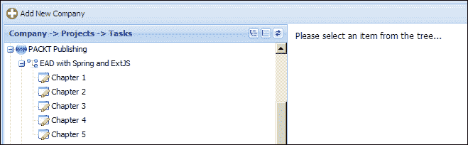
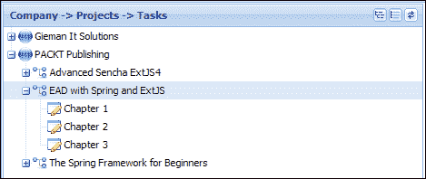
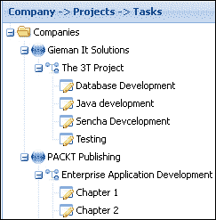
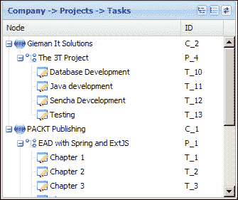
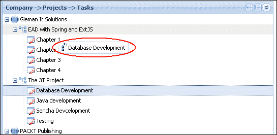

# 第 12 章 3T 管理变得简单

3T 管理界面允许用户维护公司、项目和任务关系。由于这种关系是分层的，我们将使用 Ext JS 中最通用的组件之一：`Ext.tree.Panel`。

我们将构建的界面如下图所示：


在树中选择一个项目将在右侧面板上显示相应的记录，**添加新公司**按钮将允许用户输入新公司的名称。现在让我们详细检查这些操作。

# 管理工作流程和布局

可以编辑三个不同的实体（公司、项目和任务），前面的屏幕截图显示了公司。在树中选择项目将显示**编辑项目**表单：


选择任务将显示**编辑任务**表单：


选择按钮**新增公司**按钮，显示空公司表单：


请注意，**删除**和**添加项目**按钮被禁用。当不允许操作时，所有屏幕中的相应按钮将被禁用。在这种情况下，无法将项目添加到尚未保存的公司。

树工具将允许用户展开、折叠和刷新树：


当用户首次显示管理界面时，显示**新增公司**画面。删除任何项目时，**请从树中选择一个项目…**消息显示：



现在我们已经定义了接口及其行为，是时候定义我们的视图了。

# 搭建 3T 管理接口

3T 管理界面将要求我们构建以下屏幕截图中显示的组件。`ProjectForm`和`TaskForm`视图不可见，需要时将在卡片布局中显示：


`ManageTasks`视图是一个`hbox`布局，将屏幕的左右部分平均分割。工具栏包含一个添加新公司的按钮，而右侧区域是一个包含`CompanyForm`、`ProjectForm`和`TaskForm`视图的卡片布局。现在让我们详细了解每个组件。

## ManageTasks.js 文件

`ManageTasks`视图使用**添加新公司**按钮定义工具栏，并将视图拆分为`hbox`布局。用卡片布局定义的`companytree`面板和`container`由`xtype`配置。卡片布局容器包含`CompanyForm`、`ProjectForm`和`TaskForm`。`ManageTasks`视图定义如下：

```java
Ext.define('TTT.view.admin.ManageTasks', {
    extend: 'Ext.panel.Panel',
    xtype: 'managetasks',
    requires: ['TTT.view.admin.CompanyTree', 'TTT.view.admin.TaskForm', 'TTT.view.admin.ProjectForm', 'TTT.view.admin.CompanyForm', 'Ext.toolbar.Toolbar', 
        'Ext.layout.container.Card'],
    layout: {
        type: 'hbox',
        align: 'stretch'
    },
    initComponent: function() {
        var me = this;
        Ext.applyIf(me, {
            dockedItems: [{
                xtype: 'toolbar',
                dock: 'top',
                items: [{
                    xtype: 'button',
                    itemId: 'addCompanyBtn',
                    iconCls: 'addnew',
                    text: 'Add New Company'
                }]
            }],
            items: [{
                xtype: 'companytree',
                flex: 1,
                margin: 1
            }, {
                xtype: 'container',
                itemId: 'adminCards',
                activeItem: 0,
                flex: 1,
                layout: {
                    type: 'card'
                },
                items: [{
                    xtype: 'container',
                    padding: 10,
                    html: 'Please select an item from the tree...'
                }, {
                    xtype: 'companyform'
                }, {
                    xtype: 'projectform'
                }, {
                    xtype: 'taskform'
                }]
            }]
        });
        me.callParent(arguments);
    }
});
```

注意使用简单容器作为卡片布局的第一项来显示**请从树中选择一项。。。**留言。

## CompanyForm.js 文件

`CompanyForm`视图有一个非常简单的界面，只有一个数据输入字段：`companyName`。这可以在以下代码行中看到：

```java
Ext.define('TTT.view.admin.CompanyForm', {
    extend: 'Ext.form.Panel',
    xtype: 'companyform',
    requires: ['Ext.form.FieldSet', 'Ext.form.field.Text', 'Ext.toolbar.Toolbar'],
    layout: {
        type: 'anchor'
    },
    bodyPadding: 10,
    border: false,
    autoScroll: true,
    initComponent: function() {
        var me = this;
        Ext.applyIf(me, {
            items: [{
                xtype: 'fieldset',
                hidden: false,
                padding: 10,
                width: 350,
                fieldDefaults: {
                    anchor: '100%'
                },
                title: 'Company Entry',
                items: [{
                    xtype: 'textfield',
                    name: 'companyName',
                    fieldLabel: 'Name',
                    emptyText: 'Enter company name...'
                }, {
                    xtype: 'toolbar',
                    ui: 'footer',
                    layout: {
                        pack: 'end',
                        type: 'hbox'
                    },
                    items: [{
                        xtype: 'button',
                        iconCls: 'delete',
                        itemId: 'deleteBtn',
                        disabled: true,
                        text: 'Delete'
                    }, {
                        xtype: 'button',
                        iconCls: 'addnew',
                        itemId: 'addProjectBtn',
                        disabled: true,
                        text: 'Add Project'
                    }, {
                        xtype: 'button',
                        iconCls: 'save',
                        itemId: 'saveBtn',
                        text: 'Save'
                    }]
                }]
            }]
        });
        me.callParent(arguments);
    }
});
```

注意在加载有效公司之前，**删除**和**添加项目**按钮的初始状态被禁用。

## ProjectForm.js 文件

`ProjectForm`视图的布局和结构与我们刚才定义的公司形式非常相似：

```java
Ext.define('TTT.view.admin.ProjectForm', {
    extend: 'Ext.form.Panel',
    xtype: 'projectform',
    requires: ['Ext.form.FieldSet', 'Ext.form.field.Text', 'Ext.toolbar.Toolbar'],
    layout: {
        type: 'anchor'
    },
    bodyPadding: 10,
    border: false,
    autoScroll: true,
    initComponent: function() {
        var me = this;
        Ext.applyIf(me, {
            items: [{
                xtype: 'fieldset',
                hidden: false,
                padding: 10,
                width: 350,
                fieldDefaults: {
                    anchor: '100%'
                },
                title: 'Project Entry',
                items: [{
                    xtype: 'textfield',
                    name: 'projectName',
                    fieldLabel: 'Project Name',
                    emptyText: 'Enter project name...'
                }, {
                    xtype: 'toolbar',
                    ui: 'footer',
                    layout: {
                        pack: 'end',
                        type: 'hbox'
                    },
                    items: [{
                        xtype: 'button',
                        iconCls: 'delete',
                        itemId: 'deleteBtn',
                        disabled: true,
                        text: 'Delete'
                    }, {
                        xtype: 'button',
                        iconCls: 'addnew',
                        itemId: 'addTaskBtn',
                        disabled: true,
                        text: 'Add Task'
                    }, {
                        xtype: 'button',
                        iconCls: 'save',
                        itemId: 'saveBtn',
                        text: 'Save'
                    }]
                }]
            }]
        });
        me.callParent(arguments);
    }
});
```

再一次在加载有效项目之前，**删除**和**添加任务**按钮的初始状态为`disabled`。

## TaskForm.js 文件

`TaskForm`视图与之前的表单类似，但只需要两个按钮，定义如下：

```java
Ext.define('TTT.view.admin.TaskForm', {
    extend: 'Ext.form.Panel',
    xtype: 'taskform',
    requires: ['Ext.form.FieldSet', 'Ext.form.field.Text', 'Ext.toolbar.Toolbar'],
    layout: {
        type: 'anchor'
    },
    bodyPadding: 10,
    border: false,
    autoScroll: true,
    initComponent: function() {
        var me = this;
        Ext.applyIf(me, {
            items: [{
                xtype: 'fieldset',
                hidden: false,
                padding: 10,
                width: 350,
                fieldDefaults: {
                    anchor: '100%'
                },
                title: 'Task Entry',
                items: [{
                    xtype: 'textfield',
                    name: 'taskName',
                    fieldLabel: 'Name',
                    emptyText: 'Enter task name...'
                }, {
                    xtype: 'toolbar',
                    ui: 'footer',
                    layout: {
                        pack: 'end',
                        type: 'hbox'
                    },
                    items: [{
                        xtype: 'button',
                        iconCls: 'delete',
                        itemId: 'deleteBtn',
                        disabled: true,
                        text: 'Delete'
                    }, {
                        xtype: 'button',
                        iconCls: 'save',
                        itemId: 'saveBtn',
                        text: 'Save'
                    }]
                }]
            }]
        });
        me.callParent(arguments);
    }
});
```

再次之后，在加载有效任务之前，**删除**按钮的初始状态为禁用。

## CompanyTree.js 文件

最后一个视图是`CompanyTree`视图，表示公司、项目和任务之间的关系。



该视图定义如下：

```java
Ext.define('TTT.view.admin.CompanyTree', {
    extend: 'Ext.tree.Panel',
    xtype: 'companytree',
    title: 'Company -> Projects -> Tasks',
    requires: ['TTT.store.CompanyTree'],
    store: 'CompanyTree',
    lines: true,
    rootVisible: false,
    hideHeaders: true,
    viewConfig: {
        preserveScrollOnRefresh: true
    },
    initComponent: function() {
        var me = this;
        Ext.applyIf(me, {
            tools: [{
                type: 'expand',
                qtip: 'Expand All'
            }, {
                type: 'collapse',
                qtip: 'Collapse All'
            }, {
                type: 'refresh',
                qtip: 'Refresh Tree'
            }],
            columns: [{
                xtype: 'treecolumn',
                dataIndex: 'text',
                flex: 1
            }]
        });
        me.callParent(arguments);
    }
}); 
```

`CompanyTree`视图扩展了`Ext.tree.Panel`，即需要一个专门的`Ext.data.TreeStore`实现，该实现管理树节点和项目之间的关系。Ext JS 4 树是一个非常灵活的组件，我们建议您熟悉[中的核心树概念 http://docs.sencha.com/extjs/4.2.2/#!/指南/树](http://docs.sencha.com/extjs/4.2.2/#!/guide/tree)。

## 引入 Ext.data.TreeStore 类

`Ext.data.TreeStore`类是`Ext.tree.Panel`使用的默认存储实现。`TreeStore`功能为加载和管理分层数据提供了许多方便的功能。`TreeStore`功能可以用模型定义，但这不是必需的。如果提供了模型，则该模型将使用树中所需的`Ext.data.NodeInterface`字段、方法和属性进行装饰。此附加功能应用于模型的原型，以允许树维护模型之间的状态和关系。

如果没有提供模型，则存储将以实现`Ext.data.NodeInterface`类的方式创建一个这样的模型。我们建议您浏览`NodeInterface`API 文档，查看节点上可用的全套字段、方法和属性。

我们在树中使用的`CompanyTree`存储定义如下：

```java
Ext.define('TTT.store.CompanyTree', {
    extend: 'Ext.data.TreeStore',
    proxy: {
        type: 'ajax',
        url: 'company/tree.json'
    }
});
```

所有树存储都使用 JSON 或 XML 格式的分层结构中的数据。我们将使用以下结构在请求处理层生成 JSON 数据：

```java
{
    "success": true,
    "children": [
        {
            "id": "C_1",
            "text": "PACKT Publishing",
            "leaf": false,
            "expanded": true,
            "children": [
                {
                    "id": "P_1",
                    "text": "EAD with Spring and ExtJS",
                    "leaf": false,
                    "expanded": true,
                    "children": [
                        {
                            "id": "T_1",
                            "text": "Chapter 1",
                            "leaf": true
                        },
                        {
                            "id": "T_2",
                            "text": "Chapter 2",
                            "leaf": true
                        },
                        {
                            "id": "T_3",
                            "text": "Chapter 3",
                            "leaf": true
                        }
                    ]
                },
                {
                    "id": "P_2",
                    "text": "The Spring Framework for Beginners",
                    "leaf": false,
                    "expanded": true,
                    "children": [
                        {
                            "id": "T_4",
                            "text": "Chapter 1",
                            "leaf": true
                        },
                        {
                            "id": "T_5",
                            "text": "Chapter 2",
                            "leaf": true
                        },
                        {
                            "id": "T_6",
                            "text": "Chapter 3",
                            "leaf": true
                        }
                    ]
                }
            ]
        }
    ]
}
```

此结构定义了任何树所使用的核心属性，包括`id`、`children`、`text`、`leaf`和`expanded`。

`children`属性定义存在于同一级别且属于同一父节点的节点数组。结构中的顶级子节点属于根节点，并将添加到树的根级别。树面板属性`rootVisible:false`将从视图中隐藏根级别，仅显示子级。通过将属性设置为`rootVisible:true`来启用根级别可见性，将显示`TreeStore`类中定义的根节点。例如，将以下定义添加到树存储将导致显示`Companies`节点，如以下屏幕截图所示：

```java
root: {
    text: 'Companies',
    expanded: true
}
```



我们希望在树的顶层显示每个公司，因此将从视图中隐藏根节点。

`id`属性在内部用于唯一标识每个节点。该属性在树结构中不能有重复项，因此我们将使用节点类型作为`id`值的前缀。代表公司的节点前缀为`C_`，项目节点前缀为`P_`，任务节点前缀为`T_`。此`id`格式将允许我们确定节点类型和节点的主键。如果没有提供 ID，商店会为我们生成一个。

该 ID 还可用于动态分配`iconCls`类给节点。我们通过使用存储的`append`侦听器来实现这一点，并在稍后的控制器中定义这一点。请注意，我们可以同样轻松地在 JSON 本身中定义`iconCls`属性：

```java
{
    "success": true,
    "children": [
        {
            "id": "C_1",
            "iconCls": "company",
            "text": "PACKT Publishing",
            "leaf": false,
            "expanded": true,
            "children": [
                {
                    "id": "P_1",
                    "iconCls": "project",
                    "text": "EAD with Spring and ExtJS",
                    "leaf": false,
                    "expanded": true,
                    "children": [ etc…
```

然而，我们现在正在将数据与表示相结合，生成 JSON 的 Java 方法不应该关心数据的显示方式。

JSON 树的`text`字段用于显示节点的文本。对于没有多列的简单树，如果没有使用列定义显式设置，则这是默认字段名（树列将在本章后面讨论）。

leaf 属性标识此节点是否可以有子节点。所有任务节点都有`"leaf":true`设置。`leaf`属性定义是否在节点旁边显示展开图标。

感兴趣的最后一个属性是`expanded`属性，该属性指示节点是否应以展开状态显示。如果一次加载整个树，则必须在每个有子节点的节点上将此属性设置为`true`；否则，在展开这些节点时，代理将尝试动态加载这些节点的子节点。我们的 JSON 数据将包含整个树，因此我们将每个父节点的`expanded`属性设置为`true`。

# 在 CompanyHandler 类中生成 JSON 树

现在是时候增强`CompanyHandler`类以生成所需的 JSON 来加载树存储并显示公司树了。我们将创建两个新方法来实现此功能。

## CompanyHandler.getTreeNodeId（）方法

`CompanyHandler.getTreeNodeId()`helper 方法根据`EntityItem`类的 ID 生成唯一 ID。它将用于为每个节点生成特定于类型的 ID。

```java
private String getTreeNodeId(EntityItem obj){
  String id = null;

  if(obj instanceof Company){
    id = "C_" + obj.getId();
  } else if(obj instanceof Project){
    id = "P_" + obj.getId();
  } else if(obj instanceof Task){
    id = "T_" + obj.getId();
  }
  return id;
}
```

## CompanyHandler.getCompanyTreeJson（）方法

`CompanyHandler getCompanyTreeJson()`方法映射到`company/tree.json`URL，定义如下：

```java
@RequestMapping(value="/tree", method=RequestMethod.GET, produces={"application/json"})
@ResponseBody
public String getCompanyTreeJson(HttpServletRequest request) {

  User sessionUser = getSessionUser(request);

  Result<List<Company>> ar = companyService.findAll(sessionUser.getUsername());
  if (ar.isSuccess()) {

    JsonObjectBuilder builder = Json.createObjectBuilder();
    builder.add("success", true);
    JsonArrayBuilder companyChildrenArrayBuilder =
      Json.createArrayBuilder();

    for(Company company : ar.getData()){

      List<Project> projects = company.getProjects();

      JsonArrayBuilder projectChildrenArrayBuilder = Json.createArrayBuilder();

      for(Project project : projects){

        List<Task> tasks = project.getTasks();

        JsonArrayBuilder taskChildrenArrayBuilder = Json.createArrayBuilder();

        for(Task task : tasks){

          taskChildrenArrayBuilder.add(
            Json.createObjectBuilder()
            .add("id", getTreeNodeId(task))
            .add("text", task.getTaskName())
            .add("leaf", true)
          );                        
        }

        projectChildrenArrayBuilder.add(
          Json.createObjectBuilder()
            .add("id", getTreeNodeId(project))
            .add("text", project.getProjectName())
            .add("leaf", tasks.isEmpty())
            .add("expanded", tasks.size() > 0)
            .add("children", taskChildrenArrayBuilder)
        );                    

      }

      companyChildrenArrayBuilder.add(
        Json.createObjectBuilder()
          .add("id", getTreeNodeId(company))
          .add("text", company.getCompanyName())
          .add("leaf", projects.isEmpty())
          .add("expanded", projects.size() > 0)
          .add("children", projectChildrenArrayBuilder)
      );
    }

    builder.add("children", companyChildrenArrayBuilder);

    return toJsonString(builder.build());

  } else {

    return getJsonErrorMsg(ar.getMsg());

  }
}
```

此方法执行以下任务：

*   它创建一个名为`companyChildrenArrayBuilder`的对象，以保存在迭代公司列表时将在主`for`循环中创建的公司`JsonObjectBuilder`实例集。
*   它遍历分配给每个公司的每个项目，将每个项目的`JsonObjectBuilder`树节点表示添加到`projectChildrenArrayBuilder JsonArrayBuilder`实例中。然后将`projectChildrenArrayBuilder`实例添加为所属公司`JsonObjectBuilder`实例的`children`属性。
*   它遍历分配给每个项目的每个任务，将每个任务的`JsonObjectBuilder`树节点表示添加到`taskChildrenArrayBuilder JsonArrayBuilder`实例中。然后将`taskChildrenArrayBuilder`实例添加为所属项目`JsonObjectBuilder`实例的`children`属性。
*   它添加了`companyChildrenArrayBuilder`作为`builder`实例的`children`属性，该实例将用于构建 JSON 并从返回具有`success`属性`true`的方法。

`getCompanyTreeJson`方法返回分层 JSON 结构，该结构以`CompanyTree`存储可以使用的格式封装公司、项目和任务之间的关系。

# 控制 3T 给药

`TTT.controller.AdminController`将视图联系在一起，并实现此用户界面中可能的许多操作。您必须下载源代码才能查看此控制器的完整定义，因为它在以下文本中没有完全复制。

`AdminController`引用了处理操作所需的四个存储。在`update`或`delete`操作后，将重新加载每个存储，以确保存储与数据库同步。对于多用户应用来说，这是一个重要的考虑点；在会话的生命周期内，其他用户是否可以更改视图数据？与任务日志界面不同，任务日志界面中的数据属于会话中的用户，3T 管理模块可同时由不同的用户主动使用。

### 注

讨论多用户环境中的数据完整性策略超出了本书的范围。这通常是通过使用每个记录的时间戳来实现的，该时间戳指示最后的更新时间。服务层中的适当逻辑将根据数据库中的时间戳测试提交的记录时间戳，然后相应地处理操作。

有一个商店和模型尚未完全定义；我们现在就这样做。

## 定义公司模式和门店

`Company`模型最初是在[第 9 章](09.html "Chapter 9. Getting Started with Ext JS 4")*开始使用 Ext JS 4*中使用 Sencha Cmd 定义的，但我们现在需要添加适当的代理和验证。完整定义如下：

```java
Ext.define('TTT.model.Company', {
    extend: 'Ext.data.Model',
    fields: [
        { name: 'idCompany', type: 'int', useNull:true },
        { name: 'companyName', type: 'string'}
    ],
    idProperty: 'idCompany',
    proxy: {
        type: 'ajax',
        idParam:'idCompany',
        api:{
            create:'company/store.json',
            read:'company/find.json',
            update:'company/store.json',
            destroy:'company/remove.json'
        },
        reader: {
            type: 'json',
            root: 'data'
        },
        writer: {
            type: 'json',
            allowSingle:true,
            encode:true,
            root:'data',
            writeAllFields: true
        }
    },
    validations: [
        {type: 'presence',  field: 'companyName'},
        {type: 'length', field: 'companyName', min: 2}
    ]
});
```

`Company`存储将通过`company/findAll.json`URL 加载所有公司记录，如下所示：

```java
Ext.define('TTT.store.Company', {
    extend: 'Ext.data.Store',
    requires: [
        'TTT.model.Company'
    ],
    model: 'TTT.model.Company',
    proxy: {
        type: 'ajax',
        url: 'company/findAll.json',
        reader: {
            type: 'json',
            root: 'data'
        }
    }    
});
```

`Company`模型和存储是我们迄今为止最简单的定义。现在我们将检查我们的`AdminController`中的核心行动。

## DOAFTERACTIVE 功能

激活`ManageTasks`面板时，加载 3T 给药所需的三个存储。这将确保在树中选择项目时，每个存储中都有可用的有效记录。`doAfterActivate`功能可用于初始化属于`AdminController`的任何组件的状态。这在本章末尾配置拖放操作时特别有用。

请注意，我们正在将**追加**侦听器添加到树存储视图中，并分配`doSetTreeIcon`函数。在`init`功能控制配置中无法执行此操作，因为此时视图尚未配置并准备就绪。激活后将`doSetTreeIcon`功能分配给侦听器可确保组件已完全配置。`doSetTreeIcon`函数根据节点类型为每个节点动态分配`iconCls`类。

`doAfterActivate`函数的最后一步是加载树存储以显示树中的数据。

## DOSELECTREITEM 功能

当用户选择树中的项目时，调用`doSelectTreeItem`函数。检索并拆分节点 ID，以允许我们确定节点的类型：

```java
var recIdSplit = record.getId().split('_');
```

对于每个节点，确定主键值并使用它从适当的存储中检索记录。然后将记录加载到表单中，然后将表单设置为管理卡布局中的活动项。

## doSave 功能

每个保存函数从表单中检索记录，并用表单值更新记录。如果验证成功并且表单更新以反映更改的按钮状态，则保存记录。然后重新加载拥有该记录的存储以与数据库同步。

## 多德莱特函数

每个删除函数在调用模型的`destroy`方法之前确认用户动作。如果成功，管理卡布局中的活动项目将设置为显示默认消息：**请从树**中选择一个项目。如果删除未成功，将显示相应的消息通知用户。

## doAdd 功能

**添加**按钮位于动作父级表单上的。您只能向公司添加项目或向项目添加任务。在加载适当的表单之前，每个`doAdd`函数都会检索父对象并创建子对象的实例。根据需要禁用子窗体上的按钮。

# 测试 3T 管理接口

我们现在需要将我们的新组件添加到`Application.js`文件中：

```java
models:[
  'Company',
  'Project',
  'Task',
  'User',
  'TaskLog'
],    
controllers: [
  'MainController',
  'UserController',
  'AdminController',
  'TaskLogController'
],    
stores: [
  'Company',
  'CompanyTree',
  'Project',
  'Task',
  'User',
  'TaskLog'
]
```

我们还需要在`MainCards`中添加`ManageTasks`视图：

```java
Ext.define('TTT.view.MainCards', {
    extend: 'Ext.container.Container',
    xtype: 'maincards',
    requires: ['Ext.layout.container.Card', 'TTT.view.Welcome', 'TTT.view.user.ManageUsers', 'TTT.view.tasklog.ManageTaskLogs', 'TTT.view.admin.ManageTasks'],
    layout: 'card',
    initComponent: function() {
        var me = this;
        Ext.applyIf(me, {
            items: [{
                xtype: 'welcome',
                itemId: 'welcomCard'
            }, {
                xtype: 'manageusers',
                itemId: 'manageUsersCard'
            }, {
                xtype: 'managetasklogs',
                itemId: 'taskLogCard'
            }, {
 xtype: 'managetasks',
 itemId: 'manageTasksCard'
 }]
        });
        me.callParent(arguments);
    }
});
```

您现在可以在 GlassFish 服务器中运行应用程序，并以`bjones`用户（或任何其他具有管理员权限的用户）身份登录，测试 3T 管理界面。

# 动态加载树节点

企业应用程序通常具有禁止在单个 JSON 请求中加载完整树的数据集。通过按需扩展级别，可以将大型树配置为在每个节点上加载子节点。对我们的代码进行一些小的更改可以让我们实现节点子节点的动态加载。

当节点展开时，树存储代理提交一个请求，该请求包含一个带有被展开节点 ID 的`node`参数。提交的 URL 是在代理中配置的 URL。我们将更改我们的树存储代理，如下所示：

```java
proxy: {
  type: 'ajax',
  url: 'company/treenode.json'
}
```

请注意，代理的 URL 已更改为`treenode`。此映射在`CompanyHandler`中实现时，将一次加载一个级别。代理提交的加载树顶层的第一个请求将采用以下格式：

```java
company/treenode.json?node=root
```

这将返回根节点的公司列表：

```java
{
    success: true,
    "children": [{
        "id": "C_2",
        "text": "Gieman It Solutions",
        "leaf": false
    }, {
        "id": "C_1",
        "text": "PACKT Publishing",
        "leaf": false
    }]
}
```

注意没有为每个公司定义`children`数组，`leaf`属性设置为`false`。如果未定义子节点且节点不是叶，则 Ext JS 树将在节点旁边显示一个扩展图标。点击扩展器图标将提交一个请求，该请求将被扩展节点的`node`参数设置为`id`值。因此，扩展`"PACKT Publishing"`节点将通过`company/treenode.json?node=C_1`提交加载子节点的请求。

JSON 响应将包含一个`children`数组，该数组将作为`PACKT Publishing`节点的子节点追加到树中。在我们的示例中，响应将包括分配给公司的项目：

```java
{
    success: true,
    "children": [{
        "id": "P_3",
        "text": "Advanced Sencha ExtJS4 ",
        "leaf": false
    }, {
        "id": "P_1",
        "text": "EAD with Spring and ExtJS",
        "leaf": false
    }, {
        "id": "P_2",
        "text": "The Spring Framework for Beginners",
        "leaf": false
    }]
}
```

同样，每个项目都不会定义一个`children`数组，即使分配了任务。如果分配了任务，每个项目都将定义为`"leaf":false`以呈现一个扩展图标。扩展`P_1`节点将导致代理提交请求以加载下一级：`company/treenode.json?node=P_1`。

这将导致返回以下 JSON：

```java
{
    success: true,
    "children": [{
        "id": "T_1",
        "text": "Chapter 1",
        "leaf": true
    }, {
        "id": "T_2",
        "text": "Chapter 2",
        "leaf": true
    }, {
        "id": "T_3",
        "text": "Chapter 3",
        "leaf": true
    }]
}
```

这次我们用`"leaf":true`定义这些节点，以确保不会显示扩展器图标，并且用户无法尝试加载树的第四级。

负责此逻辑的`CompanyHandler`方法现在可以定义并映射到`company/treenode.json`URL：

```java
@RequestMapping(value = "/treenode", method = RequestMethod.GET, produces = {"application/json"})
@ResponseBody
public String getCompanyTreeNode(
    @RequestParam(value = "node", required = true) String node,
    HttpServletRequest request) {

  User sessionUser = getSessionUser(request);

  logger.info(node);

  JsonObjectBuilder builder = Json.createObjectBuilder();
  builder.add("success", true);
  JsonArrayBuilder childrenArrayBuilder =Json.createArrayBuilder();

  if(node.equals("root")){

    Result<List<Company>> ar =companyService.findAll(sessionUser.getUsername());
    if (ar.isSuccess()) {                                

      for(Company company : ar.getData()){                   
        childrenArrayBuilder.add(
          Json.createObjectBuilder()
            .add("id", getTreeNodeId(company))
            .add("text", company.getCompanyName())
            .add("leaf", company.getProjects().isEmpty())
        );
      }
    } else {

      return getJsonErrorMsg(ar.getMsg());
    }
  } else if (node.startsWith("C")){

    String[] idSplit = node.split("_");
    int idCompany = Integer.parseInt(idSplit[1]);
    Result<Company> ar = companyService.find(idCompany,sessionUser.getUsername());

    for(Project project : ar.getData().getProjects()){

      childrenArrayBuilder.add(
        Json.createObjectBuilder()
          .add("id", getTreeNodeId(project))
          .add("text", project.getProjectName())
          .add("leaf", project.getTasks().isEmpty())
      );
    }

  } else if (node.startsWith("P")){

    String[] idSplit = node.split("_");
    int idProject = Integer.parseInt(idSplit[1]);
    Result<Project> ar = projectService.find(idProject,sessionUser.getUsername());
    for(Task task : ar.getData().getTasks()){

      childrenArrayBuilder.add(
        Json.createObjectBuilder()
          .add("id", getTreeNodeId(task))
          .add("text", task.getTaskName())
          .add("leaf", true)
      );
    }
  }

  builder.add("children", childrenArrayBuilder);

  return toJsonString(builder.build());
}
```

`getCompanyTreeNode`方法确定要扩展的节点类型，并从服务层加载适当的记录。返回的 JSON 随后被存储区使用并显示在树中。

我们现在可以在 GlassFish 中运行该项目并显示**3T Admin**界面。树的第一级按预期加载：


单击扩展器图标时，将动态加载下一级树：


然后可以展开第三级以显示任务：


我们将留给您来增强`AdminController`以用于动态树。在每次成功保存或删除后重新加载树不会对用户非常友好；将逻辑更改为仅重新加载父节点将是更好的解决方案。

# 显示多个树列

Ext JS 4 树可以配置为显示多个列，以可视化高级数据结构。我们将做一些小的更改来显示树中每个节点的 ID。只需向树定义中添加一个新列即可实现此目的：

```java
Ext.define('TTT.view.admin.CompanyTree', {
    extend: 'Ext.tree.Panel',
    xtype: 'companytree',
    title: 'Company -> Projects -> Tasks',
    requires: ['TTT.store.CompanyTree'],
    store: 'CompanyTree',
    lines: true,
    rootVisible: false,
    hideHeaders: false,
    viewConfig: {
        preserveScrollOnRefresh: true
    },
    initComponent: function() {
        var me = this;
        Ext.applyIf(me, {
            tools: [{
                type: 'expand',
                qtip: 'Expand All'
            }, {
                type: 'collapse',
                qtip: 'Collapse All'
            }, {
                type: 'refresh',
                qtip: 'Refresh Tree'
            }],
            columns: [{
                xtype: 'treecolumn',
                text:'Node',
                dataIndex: 'text',
                flex: 1
            },
 {
 dataIndex: 'id',
 text : 'ID',
 width:60
 }]
        });
        me.callParent(arguments);
    }
});
```

我们在中还为每一列添加了`text`属性，其中显示在标题行中，并使用`hideHeaders:false`启用标题。这些微小的更改将导致在完全展开时显示以下树：



# 拖放变得简单

使用 Ext JS 4 可以轻松地在树中拖动和删除节点。为了允许在树中进行拖放操作，我们需要添加`TreeViewDragDrop`插件，如下所示：

```java
Ext.define('TTT.view.admin.CompanyTree', {
    extend: 'Ext.tree.Panel',
    xtype: 'companytree',
    title: 'Company -> Projects -> Tasks',
    requires: ['TTT.store.CompanyTree','Ext.tree.plugin.TreeViewDragDrop'],
    store: 'CompanyTree',
    lines: true,
    rootVisible: false,
    hideHeaders: true,
    viewConfig: {
        preserveScrollOnRefresh: true,
        plugins: {
 ptype: 'treeviewdragdrop'
 }
    }, etc
```

这个简单的包含将启用对树的拖放支持。现在，您可以将任何节点拖放到新的父节点。不幸的是，这并不是我们所需要的。任务节点只能放在项目节点上，而项目节点只能放在公司节点上。我们如何将拖放操作限制为这些规则？

有两个事件可用于配置此功能。这些事件由`TreeViewDragDrop`插件触发，可以在`AdminController`的`doAfterActivate`功能中按以下方式配置：

```java
doAfterActivate:function(){
  var me = this;
  me.getCompanyStore().load();
  me.getProjectStore().load();
  me.getTaskStore().load();
  me.getCompanyTreeStore().on('append' , me.doSetTreeIcon, me);
  me.getCompanyTree().getView().on('beforedrop', me.isDropAllowed,me);
 me.getCompanyTree().getView().on('drop', me.doChangeParent, me);
  me.getCompanyTreeStore().load();
}
```

`beforedrop`事件可用于测试`drag`和`drop`动作是否有效。返回`false`将停止`drop`动作的发生，并将节点设置为动作原点的动画。`drop`事件可用于处理`drop`操作，最有可能将更改持久化到底层存储。

`isDropAllowed`函数返回`true`或`false`，具体取决于投放目标对节点是否有效：

```java
isDropAllowed: function(node, data, overModel, dropPosition) {
    var dragNode = data.records[0];
    if (!Ext.isEmpty(dragNode) && !Ext.isEmpty(overModel)) {
        var dragIdSplit = dragNode.getId().split('_');
        var dropIdSplit = overModel.getId().split('_');
        if (dragIdSplit[0] === 'T' && dropIdSplit[0] === 'P') {
            return true;
        } else if (dragIdSplit[0] === 'P' 
                     && dropIdSplit[0] === 'C') {
            return true;
        }
    }
    return false;
}
```

此功能将`drag`和`drop`操作限制为两种有效场景：将项目拖到新公司和将任务拖到新项目。所有其他的`drag`和`drop`动作都是不允许的。

仅拖动和下降是不够的；我们现在需要在成功删除后保存新的父项。此动作在的`doChangeParent`功能中处理：

```java
doChangeParent: function(node, data, overModel, dropPosition, eOpts) {
    var me = this;
    var dragNode = data.records[0];
    if (!Ext.isEmpty(dragNode) && !Ext.isEmpty(overModel)) {
        var dragIdSplit = dragNode.getId().split('_');
        var dropIdSplit = overModel.getId().split('_');
        if (dragIdSplit[0] === 'T' && dropIdSplit[0] === 'P') {
            var idTask = Ext.Number.from(dragIdSplit[1]);
            var idProject = Ext.Number.from(dropIdSplit[1]);
            var rec = me.getTaskStore().getById(idTask);
            if (!Ext.isEmpty(rec)) {
                rec.set('idProject', idProject);
                rec.save();
            }
        } else if (dragIdSplit[0] === 'P' 
                    && dropIdSplit[0] === 'C') {
            var idProject = Ext.Number.from(dragIdSplit[1]);
            var idCompany = Ext.Number.from(dropIdSplit[1]);
            var rec = me.getProjectStore().getById(idProject);
            if (!Ext.isEmpty(rec)) {
                rec.set('idCompany', idCompany);
                rec.save();
            }
        }
    }
}
```

保存记录时，将有效节点拖动到新的父节点现在将保持不变。现在，您可以在有效的树节点之间拖放，并自动保存更改。

Ext JS 4 trees 提供的动画将指导您的`drag`和`drop`动作。拖动**数据库开发**节点将设置动作动画，如下图所示：



如果下降动作不被允许，节点将动画恢复到原始位置，为用户提供即时的视觉反馈。

ExtJS4 树是非常灵活的组件，如果您想在应用程序中充分利用树，还有很多东西需要学习。我们建议您在*Sencha Docs*网站上浏览许多树示例，以了解更复杂的示例，包括树与持久化基于模型的数据节点之间的`drag`和`drop`操作。

# 总结

**3T Admin**界面引入了树组件，用于显示分层数据。公司、项目和任务关系通过单个 JSON 请求加载到树中，并允许用户维护和添加新实体。

然后解释并实现了树节点的动态加载。此策略最适合于具有潜在复杂数据结构的非常大的树。通过 ExtJS4 客户端和 Java 后端所需的最小更改，可以轻松实现逐节点动态加载。

还探索并实现了显示多个树列和基本拖放功能，以显示 ExtJS4 树的灵活性。

使用 Ext JS 和 Spring Travely 进行企业应用程序开发的最后一步是为生产部署构建 3T 项目。谢天谢地，Maven 和 Sencha Cmd 可以帮助您轻松完成这项任务，您将在我们的最后一章[第 13 章](13.html "Chapter 13. Moving Your Application to Production")*中了解到这一点，并将您的应用程序移至生产*。