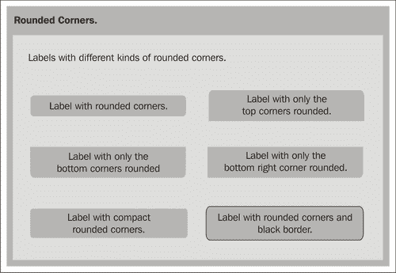
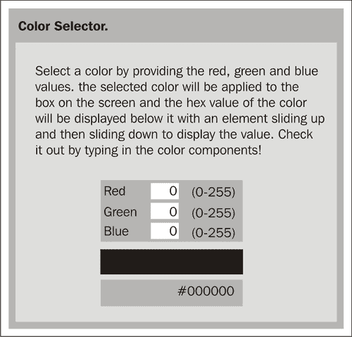

# 第 6 章 JSNI 和 JavaScript 库的浏览器效果

在本章中，我们将学习如何创建用户界面，以利用一些著名的第三方 JavaScript 库提供的酷浏览器效果。我们将利用 GWT 提供的 JavaScript 本机接口（JSNI）来包装这些现有的 JavaScript 库，并在 GWT 应用程序中使用它们。

我们将处理的任务是：

*   Moo.Fx
*   里科圆角
*   Rico 颜色选择器
*   Script.aculo.us 效果

# 什么是 JSNI？

JSNI 提供了一种混合 JavaScript 代码和 Java 代码的方法。它在概念上类似于 Sun 的 Java 环境提供的 Java 本机接口（JNI）。JNI 使 java 代码调用 C++和 C++方法。JSNI 使 Java 代码能够调用 JavaScript 方法。这是一种非常强大的技术，让我们可以直接从 Java 代码访问低级 JavaScript 代码，并为下面列出的各种用途和可能性打开了大门：

*   从 Java 调用 JavaScript 代码
*   从 JavaScript 调用 Java 代码
*   抛出跨越 Java/JavaScript 边界的异常
*   从 JavaScript 访问 Java 字段

然而，这种强大的技术应该小心使用，因为 JSNI 代码可能无法跨浏览器移植。GWT 编译器的当前实现也将无法对 JSNI 代码执行任何优化。JSNI 方法必须始终声明为本机方法，放置在 JSNI 方法中的 JavaScript 代码必须放置在经过特殊格式化的注释块中。因此，每个 JSNI 方法将由两部分组成：一部分是本机方法声明，另一部分是嵌入在特殊格式代码块中的方法 JavaScript 代码。下面是一个调用 `alert()`JavaScript 方法的 JSNI 方法示例：

```java
native void helloGWTBook()
/*-{
$wnd.alert("Hello, GWT book!");
}-*/;

```

在上面的示例中，JavaScript 代码嵌入在“/*-{”和“}-*/”块中。另一件需要注意的事情是使用 `$wnd`和 `$doc`变量。GWT 代码始终在浏览器内的嵌套框架内运行，因此您无法在 JSNI 代码内以正常方式访问窗口或文档对象。您必须使用 GWT 自动初始化的 `$wnd`和 `$doc`变量来引用主机页的窗口和文档对象。GWT 编译器可以检查我们的 JSNI 代码。因此，如果在 web 模式下运行它并编译应用程序，编译器将标记 JSNI 代码中的任何错误。这是调试 JSNI 代码的好方法，因为当您在托管模式下运行时，这些错误直到运行时才会显示。在本章中，我们将使用 JSNI 包装一些第三方 JavaScript 库，并在 GWT 用户界面中使用它们提供的酷浏览器效果。

### 注

在 GWT 的最新版本中，JSNI 函数有时不能在托管模式下工作，但在部署时可以正常工作。

# Moo.Fx

`Moo.fx`是一个超轻量且快速的 JavaScript 库，为 web 应用程序提供了多种酷炫效果（[http://moofx.mad4milk.net](http://moofx.mad4milk.net) ）。它结构紧凑，适用于所有主要的 web 浏览器。我们将使用 JSNI 包装 `Moo.fx`库提供的一些效果，并在 GWT 应用程序中使用这些效果。

## 使用 JSNI 采取行动的时间

我们将使用 GWT 框架提供的 JSNI 来包装 `Moo.fx`库，并将 Java 和 JavaScript 混合在一起，以便在 GWT 用户界面中使用其功能。

1.  将我们的应用程序所需的原型和 `Moo.fx`JavaScript 文件添加到模块的 HTML 文件-`Samples.html`中。

    ```java
    <script type="text/JavaScript"src="JavaScript/prototype.js">
    </script>
    <script type="text/JavaScript"src="JavaScript/moo.fx.js">
    </script>

    ```

2.  在包装 `Moo.fx`JavaScript 库效果的 `com.packtpub.gwtbook.samples.client.util`包中创建一个名为 `MooFx.java`的新 Java 类。
3.  在 `MooFx.java`中添加一个新的 JSNI 方法来创建 `opacity.fx`对象。

    ```java
    public native static Element opacity(Element element)
    /*-{
    $wnd._nativeExtensions = false;
    return new $wnd.fx.Opacity(element);
    }-*/;

    ```

4.  添加用于切换不透明度效果的 JSNI 方法。

    ```java
    public native static void toggleOpacity(Element element)
    /*-{
    $wnd._nativeExtensions = false;
    element.toggle();
    }-*/;

    ```

5.  添加一个私有 JSNI 方法，该方法接受选项的参数字符串并将其转换为 JavaScript 对象。

    ```java
    private static native JavaScriptObject buildOptions
    (String opts)
    /*-{
    eval("var optionObject = new Object()");
    var options = opts.split(',');
    for (var i =0; i < options.length; i++)
    {
    var opt = options[i].split(':');
    eval("optionObject." + opt[0] + "=" + opt[1]);
    }
    return optionObject;
    }-*/;

    ```

6.  添加一个用于创建高度效果的静态 Java 方法，该方法使用上面的 `buildOptions()`构建一个 JavaScript 对象，用于将选项传递给 JSNI 方法。

    ```java
    public static Element height(Element element, String opts)
    {
    return height(element, buildOptions(opts));
    }

    ```

7.  添加将创建高度效果对象的新 JSNI 方法。

    ```java
    private native static Element height
    (Element element, JavaScriptObject opts)
    /*-{
    $wnd._nativeExtensions = false;
    return new $wnd.fx.Height(element, opts);
    }-*/;

    ```

8.  添加用于切换高度效果的新 JSNI 方法。

    ```java
    public native static void toggleHeight(Element element)
    /*-{
    $wnd._nativeExtensions = false;
    element.toggle();
    }-*/;

    ```

9.  添加一个用于创建宽度效果的静态 Java 方法，该方法使用上面的 `buildOptions()`构建一个 JavaScript 对象，用于将选项传递给 JSNI 方法。

    ```java
    public static Element width(Element element, String opts)
    {
    return width(element, buildOptions(opts));
    }

    ```

10.  添加一个新的 JSNI 方法来创建 width effect 对象。

    ```java
    private native static Element width
    (Element element, JavaScriptObject opts)
    /*-{
    $wnd._nativeExtensions = false;
    return new $wnd.fx.Width(element, opts);
    }-*/;

    ```

11.  添加一个新的 JSNI 方法来切换宽度效果。

    ```java
    public native static void toggleWidth(Element element)
    /*-{
    $wnd._nativeExtensions = false;
    element.toggle();
    }-*/;

    ```

12.  在 `com.packtpub.gwtbook.samples.client.panels`包中名为 `MooFxEffectsPanel.java`的新 Java 文件中创建此应用程序的用户界面。添加一个 HTML 片段，其中包含一个外部 `div`元素和一个内部 `div`元素，后者包含一个带有文本的段落元素。添加包含此片段的三个不同变量。还为每个效果添加一个元素。

    ```java
    private HTML opacityBox = new HTML
    ("<div class='moofxBox'><div id=\"opacitybox\">
    <p class=\"text\">
    Lorem ipsum dolor sit amet, consectetur adipisicing elit,
    sed do eiusmod tempor incididunt ut labore et dolore
    magna aliqua. Ut enim ad minim veniam, quis nostrud exercitation ullamco laboris nisi ut aliquip ex ea commodo consequat.
    </p></div></div>");
    private HTML heightBox = new HTML
    ("<div class='moofxBox'><div id=\"heightbox\">
    <p class=\"text\">
    Lorem ipsum dolor sit amet, consectetur adipisicing elit,
    sed do eiusmod tempor incididunt ut labore et dolore
    magna aliqua. Ut enim ad minim veniam, quis nostrud exercitation ullamco laboris nisi ut aliquip ex ea commodo consequat.
    </p></div></div>");
    private HTML widthBox = new HTML
    ("<div class='moofxBox'><div id=\"widthbox\">
    <p class=\"text\">
    Lorem ipsum dolor sit amet, consectetur adipisicing elit,
    sed do eiusmod tempor incididunt ut labore et dolore
    magna aliqua. Ut enim ad minim veniam, quis nostrud exercitation ullamco laboris nisi ut aliquip ex ea commodo consequat.
    </p></div></div>");
    private Element widthBoxElement;
    private Element heightBoxElement;
    private Element opacityBoxElement;

    ```

13.  创建三个按钮，一个用于切换每个 `Moo.fx`效果。

    ```java
    Button opacityButton = new Button("Toggle Opacity");
    Button heightButton = new Button("Toggle Height");
    Button widthButton = new Button("Toggle Width");

    ```

14.  注册事件处理程序以侦听每个按钮上的单击，并调用相应的方法来切换效果。

    ```java
    opacityButton.addClickListener(new ClickListener()
    {
    public void onClick(Widget sender)
    {
    MooFx.toggleOpacity
    (opacityBoxElement);
    }
    });
    heightButton.addClickListener(new ClickListener()
    {
    public void onClick(Widget sender)
    {
    MooFx.toggleHeight
    (heightBoxElement);
    }
    });
    widthButton.addClickListener(new ClickListener()
    {
    public void onClick(Widget sender)
    {
    MooFx.toggleWidth
    (widthBoxElement);
    }
    });

    ```

15.  创建一个 `DeferredCommand`，在执行时创建每个效果对象。

    ```java
    DeferredCommand.add(new Command()
    {
    public void execute()
    {
    opacityBoxElement = MooFx.opacity
    (DOM.getElementById("opacitybox"));
    }
    });
    DeferredCommand.add(new Command()
    {
    public void execute()
    {
    heightBoxElement =
    MooFx.height(DOM.getElementById
    ("heightbox"), "duration:2500");
    }
    });
    DeferredCommand.add(new Command()
    {
    public void execute()
    {
    widthBoxElement =
    MooFx.width(DOM.getElementById
    ("widthbox"), "duration:2000");
    }
    });

    ```

16.  在构造器中，将每个效果的按钮和 `divs`添加到工作面板中。

    ```java
    opacityButton.setStyleName("moofxButton");
    workPanel.add(opacityButton);
    workPanel.add(opacityBox);
    heightButton.setStyleName("moofxButton");
    workPanel.add(heightButton);
    workPanel.add(heightBox);
    widthButton.setStyleName("moofxButton");
    workPanel.add(widthButton);
    workPanel.add(widthBox);

    ```

17.  最后，创建一个小信息面板，显示有关此应用程序的描述性文本，以便我们在 `Samples`应用程序的可用样本列表中选择此样本时可以显示此文本。将信息面板和工作面板添加到停靠面板，并初始化小部件。

    ```java
    HorizontalPanel infoPanel = new HorizontalPanel();
    infoPanel.add(new HTML("<div class='infoProse'>
    Use cool Moo.fx effects in your
    GWT application.</div>"));
    DockPanel workPane = new DockPanel();
    workPane.add(infoPanel, DockPanel.NORTH);
    workPane.add(workPanel, DockPanel.CENTER);
    workPane.setCellHeight(workPanel, "100%");
    workPane.setCellWidth(workPanel, "100%");
    initWidget(workPane);

    ```

下面是应用程序的屏幕截图。单击每个按钮以查看实际效果。


### 刚才发生了什么事？

`Moo.fx`库提供的主要效果有：

*   不透明度：修改图元的不透明度或透明度。
*   高度：修改图元的高度。
*   宽度：修改图元的宽度。

在这个示例中，我们创建了一个名为 `MooFx`的 Java 类，它使用 JSNI 包装了 `Moo.fx`JavaScript 库。我们创建了一个名为 `opacity()`的本地方法来实例化不透明对象。在这个方法中，我们为不透明对象调用 JavaScript 构造函数，并返回结果对象，类型为 `Element`。我们将其存储在一个变量中。

```java
return new $wnd.fx.Opacity(element);

```

然后，我们创建一个名为 `toggleOpacity()`的本地方法，用于将元素的不透明度从一种状态切换到另一种状态。此方法使用我们先前存储的变量，并对其调用 toggle 方法来更改其当前状态。

```java
element.toggle();

```

我们创建了 `height()`和 `width()`Java 方法，这些方法被传递一个字符串参数，其中包含需要提供给 `Moo.fx`高度和宽度构造函数的选项。这两个方法使用名为 `buildOptions()`的本机方法创建包含选项的 JavaScript 对象，然后将其传递给本机方法以创建高度和宽度。 `buildOptions()`方法解析提供的字符串，创建一个 JavaScript 对象并设置其属性和属性值。我们再次使用 `eval()`函数设置属性并返回对象。

```java
private static native JavaScriptObject buildOptions(String opts)
/*-{
eval("var optionObject = new Object()");
var options = opts.split(',');
for (var i =0; i < options.length; i++)
{
var opt = options[i].split(':');
Moo.fxworkingeval("optionObject." + opt[0] + "=" + opt[1]);
}
return optionObject;
}-*/;

```

返回的 JavaScript 选项对象被传递给本机的 `height()`和 `width()`方法，以创建与 `opacity()`方法类似的相应效果对象。然后，我们添加用于切换高度和宽度的本机方法。这就是将库包装到易于使用的 Java 类中所要做的一切！

在用户界面中，我们创建了一个带有外部 `div`的 HTML 对象，该对象包含一段文本的内部 `div`。HTML 小部件使我们能够创建任意 HTML 并将其添加到面板中。我们在这个示例中使用了 HTML 小部件，但是我们也可以使用 GWT 框架中 DOM 对象中的方法创建相同的元素。在下一个示例中，我们将使用该功能，以便熟悉 GWT 提供的不同工具。我们还创建了三个按钮，每个按钮用于切换每个效果。事件处理程序向这些按钮中的每个按钮注册，以侦听单击，然后为指定的效果调用适当的切换方法。在创建效果的方法中，我们使用 DOM 对象上的 `getElementById()`来获得我们感兴趣的 `div`元素。我们需要这样做，因为我们无法访问我们添加到小组中的 `div`。我们感兴趣的 `div`作为 HTML 小部件的一部分添加到面板中。

```java
opacityBoxElement = MooFx.opacity(DOM.getElementById("opacitybox"));

```

然后在元素上切换必要的效果。

```java
MooFx.toggleOpacity(opacityBoxElement);

```

效果本身是通过调用 `DeferredCommand`中效果的相应构造函数来构建的。在事件处理程序全部完成之前，我们添加的元素还不能通过使用它们的 ID 来使用。 `DeferredCommand`在它们全部完成后运行，这确保我们的元素已添加到 DOM 中，并且可以使用其 ID 进行访问。我们获取元素，创建效果，并将其与元素关联。

```java
DeferredCommand.add(new Command()
{
public void execute()
{
opacityBoxElement = MooFx.opacity
(DOM.getElementById("opacitybox"));
}
});

```

我们已经在 GWT 应用程序中成功地从 Java 访问了该库，并且可以在任何地方重用这些效果。在本章后面的 `ColorSelector`示例中，我们将使用 `Moo.fx`效果中的一种，并结合其他库中的效果。

# 圆角

圆角网页上的元素在视觉上比直角更有吸引力，在美学上更具吸引力。它也是 web 应用程序外观和感觉方面最热门的设计趋势之一。Rico（[http://openrico.org/rico/home.page](http://openrico.org/rico/home.page) ）是另一个优秀的 JavaScript 库，它非常支持这一点，并且非常易于使用。它还提供了大量功能，但我们仅包装和使用 Rico 的圆角效果部分。在本示例中，我们仅使用标签应用圆角，但您也可以将其应用于文本段落和其他几个 HTML 元素。在本例中，我们将包装 Rico 的圆角效果，并在应用程序中使用它来显示具有不同圆角类型的多个标签。

## 支持标签的行动时间

我们将包装 `Rico`库，并在 GWT 用户界面中为圆角标签提供支持。

1.  将我们的应用程序所需的原型和 Rico JavaScript 文件添加到模块的 HTML 文件-`Samples.html`。

    ```java
    <script type="text/JavaScript"src="JavaScript/prototype.js">
    </script>
    <script type="text/JavaScript"src="JavaScript/rico.fx.js">
    </script>

    ```

2.  在 `com.packtpub.gwtbook.samples.client.util`包中创建一个名为 `Rico.java`的新 Java 类，该类将包装 `rico`JavaScript 库效果。
3.  在 `Rico.java`中添加一个新的 JSNI 方法，用于取整小部件的角落。

    ```java
    private native static void corner
    (Element element, JavaScriptObject opts)
    /*-{
    $wnd._nativeExtensions = false;
    $wnd.Rico.Corner.round(element, opts);
    }-*/;

    ```

4.  添加一个私有 JSNI 方法，该方法接受字符串选项的参数并将其转换为 JavaScript 对象。

    ```java
    private static native JavaScriptObject buildOptions(String opts)
    /*-{
    eval("var optionObject = new Object()");
    var options = opts.split(',');
    for (var i =0; i < options.length; i++)
    {
    var opt = options[i].split(':');
    eval("optionObject." + opt[0] + "=" + opt[1]);
    }
    return optionObject;
    }-*/;

    ```

5.  添加一个用于创建圆角的静态 Java 方法，该方法使用上面的 `buildOptions()`构建一个 JavaScript 对象，用于将选项传递给 JSNI 方法。

    ```java
    public static void corner(Widget widget, String opts)
    {
    corner(widget.getElement(), buildOptions(opts));
    }

    ```

6.  添加一个静态 Java 方法，用于在不传递任何选项的情况下创建圆角，并使用默认值。

    ```java
    public static void corner(Widget widget)
    {
    corner(widget.getElement(), null);
    }

    ```

7.  在 `com.packtpub.gwtbook.samples.client.panels`包中名为 `RoundedCornersPanel.java`的新 Java 文件中创建此应用程序的用户界面。创建一个包含三行两列的网格。我们将向该网格添加标签。

    ```java
    private Grid grid = new Grid(3, 2);

    ```

8.  添加将应用六个不同圆角的六个标签。

    ```java
    private Label lbl1 = new Label("Label with rounded corners.");
    private Label lbl2 = new Label
    ("Label with only the top corners rounded.");
    private Label lbl3 = new Label("Label with only the
    bottom corners rounded.");
    private Label lbl4 = new Label("Label with only the
    bottom right corner rounded.");
    private Label lbl5 = new Label("Label with compact
    rounded corners ");
    private Label lbl6 = new Label("Label with rounded corners
    and red border.");

    ```

9.  调用该方法为每个标签创建圆角，并向其传递不同的选项。

    ```java
    Rico.corner(lbl1);
    Rico.corner(lbl2, "corners:\"top\"");
    Rico.corner(lbl3, "corners:\"bottom\"");
    Rico.corner(lbl4, "corners:\"br\"");
    Rico.corner(lbl5, "compact:true");
    Rico.corner(lbl6, "border: 'red'");

    ```

10.  将标签添加到网格中。

    ```java
    grid.setWidget(0, 0, lbl1);
    grid.setWidget(0, 1, lbl2);
    grid.setWidget(1, 0, lbl3);
    grid.setWidget(1, 1, lbl4);
    grid.setWidget(2, 0, lbl5);
    grid.setWidget(2, 1, lbl6);

    ```

11.  最后，创建一个小信息面板，显示有关此应用程序的描述性文本，以便我们在 `Samples`应用程序的可用样本列表中选择此样本时可以显示此文本。将信息面板和工作面板添加到停靠面板，并初始化小部件。

    ```java
    HorizontalPanel infoPanel =
    new HorizontalPanel();infoPanel.add(new HTML
    ("<div class='infoProse'>Labels with different
    kinds of rounded corners.</div>"));
    workPanel.add(grid);
    DockPanel workPane = new DockPanel();
    workPane.add(infoPanel, DockPanel.NORTH);
    workPane.add(workPanel, DockPanel.CENTER);
    workPane.setCellHeight(workPanel, "100%");
    workPane.setCellWidth(workPanel, "100%");
    initWidget(workPane);

    ```

以下是显示具有不同圆角类型的标签的屏幕截图：



### 刚才发生了什么事？

我们创建了一个 Java 类，它使用 JSNI 提供对 `Rico`JavaScript 库中圆角功能的访问。我们创建了一个与前一个示例类似的 `buildOptions()`方法，该方法可以接受包含带有选项的字符串的参数，并将这些选项作为本机 JavaScript 对象的属性添加。然后，这个 options 对象被传递给一个 JSNI 方法，该方法为所提供的元素调用 Rico 库中的 `corner()`方法。

```java
private native static void corner
(Element element, JavaScriptObject opts)
/*-{
$wnd._nativeExtensions = false;
$wnd.Rico.Corner.round(element, opts);
}-*/;

```

在用户界面中，我们创建一个网格，并向其中添加六个标签。每个标签都应用了不同类型的圆角。Rico 支持所有四个边或特定边上的圆角。它还可以在紧凑形式中创建角点，其中角点的圆度略低于默认版本。你甚至可以绕过两个或三个拐角，留下第四个一方形。Rico 提供了除圆角外，还可以在应用程序中包装和使用的其他方法。这个过程与我们到目前为止所做的非常相似，通常只是实现您感兴趣的 JavaScript 库中的所有方法。在下一个示例中，我们将在 Rico 中包装更多功能，并在颜色选择器应用程序中使用它。

# Rico 颜色选择器

在上一个示例中，我们成功地包装了 Rico 的圆角效果。在本节中，我们将添加对使用 Rico 的 color 对象访问颜色信息的支持。我们将使用 JSNI 包装此功能，然后创建一个颜色选择器应用程序，该应用程序使用 Rico 颜色对象以及我们在本章前面创建的 `Moo.fx`效果。

## 包装颜色方法的行动时间

我们将把 `color`方法包装在 `Rico`库中，并使用它们创建一个用于选择颜色的应用程序。

1.  在 `Rico.java`中添加一个新的 JSNI 方法，用于创建一个具有提供的 `red, green`和 `blue`值的 `color`对象，并将其应用于提供的元素。

    ```java
    public native static void color
    (Element element, int red, int green,int blue)
    /*-{
    $wnd._nativeExtensions = false;
    eval('' + element.id +' = new $wnd.Rico.Color
    (' + red +',' + green +',' + blue + ')');
    element.style.backgroundColor=eval
    (element.id + '.asHex()');
    }-*/;

    ```

2.  在 `Rico.java`中添加一个新的 JSNI 方法，用于获取 Rico color 对象的十六进制值。

    ```java
    public native static String getColorAsHex(Element element)
    /*-{
    $wnd._nativeExtensions = false;
    return (eval(element.id + '.asHex()'));
    }-*/;

    ```

3.  在 `com.packtpub.gwtbook.samples.client.panels`包中名为 `ColorSelectorPanel.java`的新 Java 文件中创建此应用程序的用户界面。创建一个包含三行三列的网格。创建三个用于输入值的文本字段，以及用于颜色框和颜色文本的工作面板和 `divs`。

    ```java
    private HorizontalPanel workPanel = new HorizontalPanel();
    private Grid grid = new Grid(3, 3);
    private TextBox redText = new TextBox();
    private TextBox greenText = new TextBox();
    private TextBox blueText = new TextBox();
    private Element outerDiv = DOM.createDiv();
    private Element colorDiv = DOM.createDiv();
    private Element colorText = DOM.createElement("P");
    private Element colorBox = DOM.createElement("P");

    ```

4.  在构造函数中，初始化网格，并将每个文本框中的值默认为零。

    ```java
    grid.setText(0, 0, "Red");
    grid.setText(1, 0, "Green");
    grid.setText(2, 0, "Blue");
    redText.setText("0");
    grid.setWidget(0, 1, redText);
    greenText.setText("0");
    grid.setWidget(1, 1, greenText);
    blueText.setText("0");
    grid.setWidget(2, 1, blueText);
    grid.setText(0, 2, "(0-255)");
    grid.setText(1, 2, "(0-255)");
    grid.setText(2, 2, "(0-255)");

    ```

5.  注册事件处理程序以侦听键盘事件。

    ```java
    redText.addKeyboardListener(this);
    blueText.addKeyboardListener(this);
    greenText.addKeyboardListener(this);

    ```

6.  创建用于显示选定颜色的段落元素。

    ```java
    DOM.setAttribute(colorBox, "className", "ricoColorBox");
    DOM.setAttribute(colorBox, "id", "colorBox");
    DOM.setInnerText(colorBox, "");
    Rico.color(colorBox, 0, 0, 0);

    ```

7.  创建用于显示选定颜色的十六进制值的元素。

    ```java
    DOM.setAttribute(outerDiv, "className", "heightBox");
    DOM.setAttribute(colorDiv, "id", "colorDiv");
    DOM.setAttribute(colorText, "className", "text");
    DOM.appendChild(colorDiv, colorText);
    DOM.appendChild(outerDiv, colorDiv);
    DOM.appendChild(workPanel.getElement(), outerDiv);

    ```

8.  创建一个用于从 `Moo.fx`初始化高度效果并将初始选定颜色设置为（0，0，0）的 `DeferredCommand`。

    ```java
    DeferredCommand.add(new Command()
    {
    public void execute()
    {
    MooFx.height(DOM.getElementById("colorDiv"),
    "duration:500");
    DOM.setInnerText(colorText, Rico.getColorAsHex
    (colorBox));
    }
    });

    ```

9.  添加 `onKeyPress()`处理程序，当用户输入新的 RGB 值时显示所选颜色，并将高度效果应用于显示所选颜色十六进制值的 `div`。

    ```java
    public void onKeyPress(Widget sender, char keyCode,
    int modifiers)
    {
    MooFx.toggleHeight(DOM.getElementById("colorDiv"));
    Timer t = new Timer()
    {
    public void run()
    {
    if ((redText.getText().length() > 0)
    && (greenText.getText().length() > 0)
    && (blueText.getText().length() > 0))
    {
    Rico.color(colorBox,
    Integer.parseInt(redText.getText()),
    Integer.parseInt(greenText.getText()),
    Integer.parseInt(blueText.getText()));
    DOM.setInnerText(colorText, Rico.getColorAsHex
    (colorBox));
    MooFx.toggleHeight(DOM.getElementById("colorDiv"));
    }
    }
    };
    t.schedule(500);
    }

    ```

10.  最后，创建一个小信息面板，显示有关此应用程序的描述性文本，以便我们在 `Samples`应用程序的可用样本列表中选择此样本时可以显示此文本。将信息面板和工作面板添加到停靠面板，并初始化小部件。

    ```java
    HorizontalPanel infoPanel = new HorizontalPanel();infoPanel.add
    (new HTML("<div class='infoProse'>
    Select a color by providing the red, green and blue values.
    The selected color will be applied to the box on the screen
    and the hex value of the color will be displayed below it
    with an element sliding up and then sliding down to display
    the value. Check it out by typing in the color
    components!</div>"));
    DockPanel workPane = new DockPanel();
    workPane.add(infoPanel, DockPanel.NORTH);
    workPane.add(workPanel, DockPanel.CENTER);
    workPane.setCellHeight(workPanel, "100%");
    workPane.setCellWidth(workPanel, "100%");
    initWidget(workPane);

    ```

这是申请表。输入新的 RGB 值，并在您停止输入时立即观察所选颜色的显示，以及当前颜色的十六进制值，并显示上下滑动窗口效果！



### 刚才发生了什么事？

我们首先从前面的示例中增强 Rico 包装器类，以添加对颜色功能的访问。Rico 使我们能够通过使用一组红色、绿色和蓝色值来创建颜色对象。构造此颜色对象后，可以将其十六进制值作为字符串检索。我们添加了一个 JSNI 方法来创建颜色对象。在这个方法中，我们创建 `Rico.Color`对象，然后将所提供元素的背景设置为新创建的颜色。颜色对象存储在一个变量中，该变量的名称与元素的 ID 相同。我们使用 `eval()`方法动态创建变量并设置背景颜色。我们为元素设置了 `backgroundColor`DHTML 属性

```java
eval('' + element.id +' = new $wnd.Rico.Color
(' + red +',' + green +',' + blue + ')');
element.style.backgroundColor=eval(element.id + '.asHex()');

```

我们还创建了一个 JSNI 方法，该方法可以返回所提供元素背景色的十六进制值。

```java
public native static String getColorAsHex(Element element)
/*-{
return (eval(element.id + '.asHex()'));
}-*/;

```

在用户界面中，我们创建一个网格，并用三个文本框填充它，用于输入颜色值，以及每个字段的一些标识符。在这个示例中，我们使用 DOM 对象来创建各种元素，而不是使用 HTML 小部件。DOM 对象包含几个静态方法，用于创建各种元素和操作网页的文档对象模型。我们创建两个 `div`元素和一个段落元素，并将它们添加到页面的面板中。在显示所选颜色的十六进制值之前，这些将用于创建应用高度效果的元素，以在 `div`上下滑动。由于 `workPanel`是一个 GWT 小部件，我们调用所有小部件上提供的 `getElement()`方法来访问底层 DOM 元素，然后将 `div`元素附加到它。

```java
DOM.setAttribute(outerDiv, "className", "heightBox");
DOM.setAttribute(colorDiv, "id", "colorDiv");
DOM.setAttribute(colorText, "className", "text");
DOM.appendChild(colorDiv, colorText);
DOM.appendChild(outerDiv, colorDiv);
DOM.appendChild(workPanel.getElement(), outerDiv);

```

我们再次使用 `DeferredCommand`设置当前颜色的初始十六进制值，并从 `Moo.fx`设置高度效果对象。由于我们使用一个段落元素来显示带有颜色十六进制值的字符串，因此必须使用 DOM 对象设置其内部文本。如果改用 GWT 小部件，我们将通过调用 `setText()`方法来设置值。

```java
MooFx.height(DOM.getElementById("colorDiv"), "duration:500");
DOM.setInnerText(colorText, Rico.getColorAsHex(colorBox));

```

最后，在 `onKeyPress()`方法中，我们首先切换 `colordiv`的高度，使元素向上滑动。然后我们安排一个计时器在 500 毫秒内关闭，当计时器启动时，我们用红色、绿色和蓝色文本框中的当前值创建一个新的颜色对象，将 `colorText`元素的文本设置为该颜色的十六进制值，然后切换 `colordiv`的高度，使其向下滑动以显示该值。定时器是必要的，以使它慢一点，这样你可以清楚地看到过渡和效果。

```java
MooFx.toggleHeight(DOM.getElementById("colorDiv"));
Timer t = new Timer()
{
public void run()
{
if((redText.getText().length() > 0)
&& (greenText.getText().length() > 0)
&& (blueText.getText().length() > 0))
{
Rico.color(colorBox, Integer.parseInt(redText.getText()),
Integer.parseInt(greenText.getText()),
Integer.parseInt(blueText.getText()));
DOM.setInnerText(colorText, Rico.getColorAsHex(colorBox));
MooFx.toggleHeight(DOM.getElementById("colorDiv"));
}
}
};
t.schedule(500);

```

# Script.aculo.us 效果

`Script.aculo.us`[http://script.aculo.us/](http://script.aculo.us/) ）是一个由 Thomas Fuchs 编写的令人惊叹的 JavaScript 库，可以在网页内实现各种时髦的过渡和视觉效果。它是一个跨浏览器兼容的库，构建在原型 JavaScript 框架之上。它也是最流行的 Web2.0 库之一，广泛应用于各种应用程序中，最值得注意的是，它还包含在 RubyonRails Web 框架中。 `Script.aculo.us`效果由 `Effect`类集成并提供，该类是该库的一部分。我们将使用这个类来调用和使用 GWT 应用程序中的各种效果。与本章中的其他章节不同，这里我们将不使用 JSNI，但我们将展示如何在应用程序中使用现有的包装器库来提供一些良好的浏览器效果。

## 动作施效时间

`gwt-widget`库是对 Robert Hanson 维护的 GWT 框架（[的一组极好的扩展和增强 http://gwt-widget.sourceforge.net/](http://gwt-widget.sourceforge.net/) 。它提供了一个包装效果的 Java 类，我们将在应用程序中使用这个类。我们将添加一个两行四列的网格，每个网格包含一个小的图像文件，并对每个图像应用一种效果。

我们需要引用为库提供 Java 包装器的 `gwt-widgets`模块。这是利用 GWT 的模块继承特性。我们将在*中对这个概念进行解释，刚才发生了什么？*该样本的截面。按照以下步骤添加网格：

1.  将以下条目添加到 `com.packtpub.gwtbook.samples`包中现有的 `Samples.gwt.xml`文件中：

    ```java
    <inherits name='org.gwtwidgets.WidgetLibrary'/>

    ```

2.  添加上述模块使用的原型和 `Script.aculo.us`JavaScript 文件：

    ```java
    <script type="text/JavaScript"src="JavaScript/prototype.js">
    </script>
    <script type="text/JavaScript src="JavaScript/Scriptaculous.js">
    </script>

    ```

3.  在 `com.packtpub.gwtbook.samples.client.panels`包中名为 `ScriptaculousEffectsPanel.java`的新 Java 文件中创建此应用程序的用户界面。创建一个包含两行四列的网格。创建八个图像、八个按钮和一个工作面板。

    ```java
    private HorizontalPanel workPanel = new HorizontalPanel();
    private Grid grid = new Grid(2, 4);
    private Image packtlogo1 = new Image("img/packtlogo.jpg");
    private Image packtlogo2 = new Image("img/packtlogo.jpg");
    private Image packtlogo3 = new Image("img/packtlogo.jpg");
    private Image packtlogo4 = new Image("img/packtlogo.jpg");
    private Image packtlogo5 = new Image("img/packtlogo.jpg");
    private Image packtlogo6 = new Image("img/packtlogo.jpg");
    private Image packtlogo7 = new Image("img/packtlogo.jpg");
    private Image packtlogo8 = new Image("img/packtlogo.jpg");
    private Button fadeButton = new Button("fade");
    private Button puffButton = new Button("puff");
    private Button shakeButton = new Button("shake");
    private Button growButton = new Button("grow");
    private Button shrinkButton = new Button("shrink");
    private Button pulsateButton = new Button("pulsate");
    private Button blindUpButton = new Button("blindup");
    private Button blindDownButton = new Button("blinddown");

    ```

4.  将淡入淡出效果的按钮和图像添加到 `VerticalPanel`并将面板添加到网格中。

    ```java
    VerticalPanel gridCellPanel = new VerticalPanel();
    gridCellPanel.add(packtlogo1);
    gridCellPanel.add(fadeButton);
    grid.setWidget(0, 0, gridCellPanel);

    ```

5.  添加一个事件处理程序，用于监听“淡入淡出效果”按钮的点击，并调用相应的 `Script.aculo.us`效果。

    ```java
    fadeButton.addClickListener(new ClickListener()
    {
    public void onClick(Widget sender)
    {
    Effect.fade(packtlogo1);
    }
    });

    ```

6.  将震动效果的按钮和图像添加到 `VerticalPanel`并将面板添加到网格中。

    ```java
    gridCellPanel = new VerticalPanel();
    gridCellPanel.add(packtlogo3);
    gridCellPanel.add(shakeButton);
    grid.setWidget(0, 1, gridCellPanel);

    ```

7.  添加一个事件处理程序，用于监听点击震动效果按钮，并调用相应的 `Script.aculo.us`效果。

    ```java
    shakeButton.addClickListener(new ClickListener()
    {
    public void onClick(Widget sender)
    Scrip.aculo.useffects, applying{
    Effect.shake(packtlogo3);
    }
    });

    ```

8.  将生长效果的按钮和图像添加到 `VerticalPanel`并将面板添加到网格中。

    ```java
    gridCellPanel = new VerticalPanel();
    gridCellPanel.add(packtlogo4);
    gridCellPanel.add(growButton);
    grid.setWidget(0, 2, gridCellPanel);

    ```

9.  添加一个事件处理程序，用于侦听单击“增长效果”按钮，并调用相应的 `Script.aculo.us`效果。

    ```java
    growButton.addClickListener(new ClickListener()
    {
    public void onClick(Widget sender)
    {
    Effect.grow(packtlogo4);
    }
    });

    ```

10.  将盲起效果的按钮和图像添加到 `VerticalPanel`并将面板添加到网格中。

    ```java
    gridCellPanel = new VerticalPanel();
    gridCellPanel.add(packtlogo8);
    gridCellPanel.add(blindUpButton);
    grid.setWidget(0, 3, gridCellPanel);

    ```

11.  添加一个事件处理程序，用于侦听单击“盲起效果”按钮，并调用相应的 `Script.aculo.us`效果。

    ```java
    blindUpButton.addClickListener(new ClickListener()
    {
    public void onClick(Widget sender)
    {
    Effect.blindUp(packtlogo8);
    }
    });

    ```

12.  将 puff 效果的按钮和图像添加到 `VerticalPanel`并将面板添加到网格中。

    ```java
    gridCellPanel = new VerticalPanel();
    gridCellPanel.add(packtlogo2);
    gridCellPanel.add(puffButton);
    grid.setWidget(1, 0, gridCellPanel);

    ```

13.  添加一个事件处理程序，用于监听点击 puff effect 按钮，并调用相应的 `Script.aculo.us`效果。

    ```java
    puffButton.addClickListener(new ClickListener()
    {
    Scrip.aculo.useffects, applyingpublic void onClick(Widget sender)
    {
    Effect.puff(packtlogo2);
    }
    });

    ```

14.  将收缩效果的按钮和图像添加到 `VerticalPanel`并将面板添加到网格中。

    ```java
    gridCellPanel = new VerticalPanel();
    gridCellPanel.add(packtlogo5);
    gridCellPanel.add(shrinkButton);
    grid.setWidget(1, 1, gridCellPanel);

    ```

15.  添加一个事件处理程序，用于侦听单击收缩效果按钮，并调用相应的 `Script.aculo.us`效果。

    ```java
    shrinkButton.addClickListener(new ClickListener()
    {
    public void onClick(Widget sender)
    {
    Effect.shrink(packtlogo5);
    }
    });

    ```

16.  将脉动效果的按钮和图像添加到 `VerticalPanel`并将面板添加到网格中。

    ```java
    gridCellPanel = new VerticalPanel();
    gridCellPanel.add(packtlogo6);
    gridCellPanel.add(pulsateButton);
    grid.setWidget(1, 2, gridCellPanel);

    ```

17.  添加一个事件处理程序，用于监听点击脉动效果按钮，并调用相应的 `Script.aculo.us`效果。

    ```java
    pulsateButton.addClickListener(new ClickListener()
    {
    public void onClick(Widget sender)
    {
    Effect.pulsate(packtlogo6);
    }
    });

    ```

18.  最后，创建一个小信息面板，显示有关此应用程序的描述性文本，以便我们在 `Samples`应用程序的可用样本列表中选择此样本时可以显示此文本。将信息面板和工作面板添加到停靠面板，并初始化小部件。

    ```java
    HorizontalPanel infoPanel =
    new HorizontalPanel();infoPanel.add
    (new HTML("<div class='infoProse'>
    Use nifty scriptaculous effects
    in GWT applications.
    </div>"));
    workPanel.setStyleName("scriptaculouspanel");
    workPanel.add(grid);
    DockPanel workPane = new DockPanel();
    workPane.add(infoPanel, DockPanel.NORTH);
    workPane.add(workPanel, DockPanel.CENTER);
    workPane.setCellHeight(workPanel, "100%");
    workPane.setCellWidth(workPanel, "100%");
    initWidget(workPane);

    ```

19.  在 Eclipse 中将 `gwt-widgets.jar`添加到构建路径中，以便它可以找到引用的类。

以下是我们在此应用程序中的各种效果：


单击每个按钮以查看应用于图像的相应效果。

### 刚才发生了什么事？

模块是包含 GWT 项目配置设置的 XML 文件。我们已经在 `Samples`项目中看到并使用了这个。这是我们引用应用程序使用的外部 JavaScript 文件的文件，以及应用程序使用的 RPC 服务的条目等。GWT 模块还可以从其他模块继承。这使继承模块能够使用在继承模块中声明的资源。它防止了重复资源映射的问题，并促进了重用，使得将 GWT 库打包为模块、分发并跨项目重用变得容易。通过使用 `inherits`标记并提供模块的完全限定名，我们可以指定要从中继承的模块。所有 GWT 应用程序都必须从 `com.google.gwt.user.User`模块继承，该模块提供核心 web 工具包项。在本例中，我们继承了提供我们在应用程序中使用的 `Script.aculo.us`效果类的 `org.gwtwidgets.WidgetLibrary`。下面是我们如何在 `Samples.gwt.xml`文件中定义此继承的

```java
<inherits name='org.gwtwidgets.WidgetLibrary'/>

```

`Script.aculo.us`效应分为两种不同类型的核心效应和组合效应。核心效应是图书馆的基础和组合效应，并利用核心效应创造组合效应。此库中的核心效果是：

*   **不透明度：**设置元素的透明度。
*   **缩放：**平滑缩放元素。
*   **移动方式：**将元素移动给定数量的像素。
*   **高亮显示：**通过改变元素的背景色并闪烁来吸引对元素的注意。
*   **平行：**元素平行应用多重效果。

将上述核心效果混合在一起，以创建以下组合效果：

*   **淡出：**淡出一个元素。
*   **喘息：**使元素消失在烟雾中。
*   **抖动：**反复左右移动一个元素。
*   **遮阳帘下降：**模拟百叶窗下降到一个元素上。
*   **遮阳帘：**模拟百叶窗在一个元素上升起。
*   **脉动：**将元素淡入淡出，使其看起来像是脉动。
*   **生长：**生长一个元素的大小。
*   **收缩：**缩小一个元素的大小。
*   **挤压：**通过向左收缩元素来减少元素。
*   **折叠：**首先将元素缩小到顶部，然后向左，最后使其消失。

我们在每个网格单元中放置一个图像和一个按钮。单击按钮时，我们会对按钮上方的图像元素应用效果。我们通过向 `org.gwtwidgets.client.wrap.Effect`类中所需的 effect 方法提供 widget 对象来调用 effect。这个类中的所有方法都是静态的，每个 `Script.aculo.us`效果在这个类中都有一个相应命名的方法。因此，为了使元素褪色，我们调用 `Effect.fade()`方法，并为其提供图像小部件以应用效果。这些转换是为我们的应用程序添加炫目效果并提供更好的用户体验的非常好的方式。您还可以以不同的方式混合和匹配提供的效果，以创建和使用自定义效果。

# 总结

我们已经介绍了几个 JavaScript 库及其在 GWT 应用程序中的使用。在使用所有这些库时需要注意的一件非常重要的事情是，包含大量 JavaScript 将增加浏览器必须加载的膨胀，几乎肯定会增加页面加载时间，并使运行速度变慢。因此，要谨慎使用视觉效果，不要过火。另一个警告是在应用程序中使用 JSNI 时缺乏可移植性。这可能会导致应用程序在不同版本的浏览器中的工作方式完全不同。

在本章中，我们了解了 JSNI。我们使用 JSNI 来包装 `Moo.fx`库并使用其效果。我们还包装了 `Rico`库的不同部分，并利用它为标签和颜色选择器应用程序创建圆角。我们使用了 `gwt-widgets`库提供的 `Script.aculo.us`效果。在本例中，我们使用了现有的库来提供效果。我们还学习了如何在 GWT 中使用模块继承。

在下一章中，我们将学习如何创建可跨项目共享的自定义 GWT 小部件。