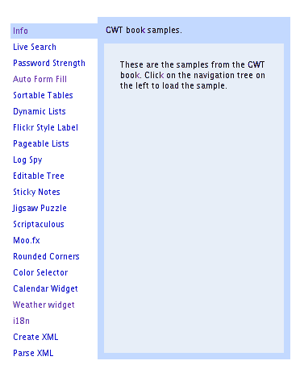
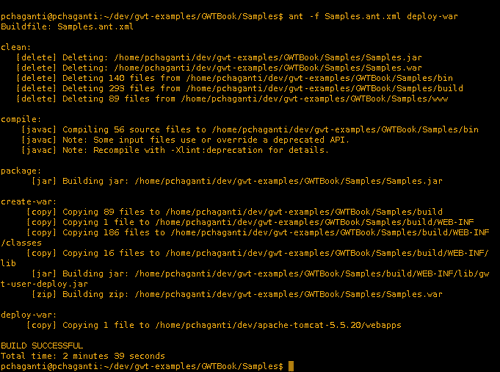
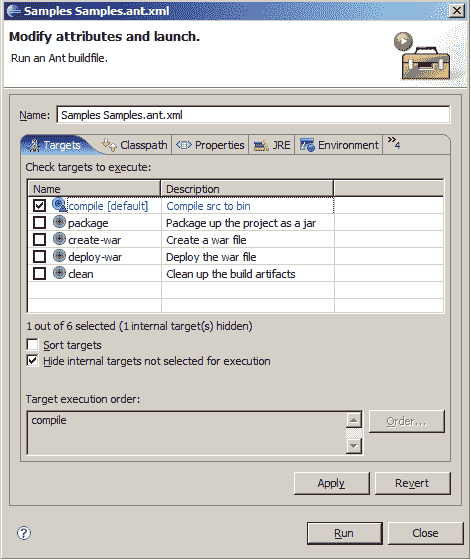

# 第 10 章部署

在本章中，我们将首先学习如何手动部署 GWT 应用程序，以便熟悉作为部署一部分的所有构件。然后，我们将使用 ApacheAnt 自动化这个过程。

我们将处理的任务是：

*   Tomcat 中的手动部署
*   使用 Ant 的自动部署
*   从 Eclipse 部署

# 在 Tomcat 中手动部署

我们将采用我们在本书中一直在研究的 `Samples`应用程序，并完成在 Tomcat 中手动部署和运行它所需的各种步骤。

## 部署 GWT 应用程序的操作时间

以下是将 GWT 应用程序手动部署到 Tomcat 所需的步骤：

1.  为您的平台下载并安装 Apache Tomcat（[http://tomcat.apache.org](http://tomcat.apache.org) ）。从 5.x 系列中选择最新的稳定版本。我将把安装 Tomcat 的目录称为 `$TOMCAT_DIR`，包含 `Samples`项目的目录称为 `$SAMPLES_DIR`。
2.  运行 `$SAMPLES_DIR/Samples-compile`编译整个应用程序。这将在 `$SAMPLES_DIR`下创建一个名为 `www`的新目录。
3.  Create a new file named `web.xml` in the `$SAMPLES_DIR` directory. Add a display name and a description for our application:

    ```java
    <display-name>
    GWT Book Samples
    </display-name>
    <description>
    GWT Book Samples
    </description>

    ```

    当您使用 Tomcat 管理器浏览已部署应用程序的列表时，将显示显示名称。

4.  在上一步创建的 `web.xml`文件中，为我们在应用程序中使用的每个 RPC 服务添加条目，并为每个条目添加相应的 servlet 映射。为实时搜索服务添加条目：

    ```java
    <servlet>
    <servlet-name>livesearch</servlet-name>
    <servlet-class>
    com.packtpub.gwtbook.samples.server.
    LiveSearchServiceImpl
    </servlet-class>
    </servlet>
    <servlet-mapping>
    <servlet-name>livesearch</servlet-name>
    <url-pattern>/livesearch</url-pattern>
    </servlet-mapping>

    ```

5.  为密码强度服务添加条目：

    ```java
    <servlet>
    <servlet-name>pwstrength</servlet-name>
    <servlet-class>
    com.packtpub.gwtbook.samples.server.
    PasswordStrengthServiceImpl
    </servlet-class>
    </servlet>
    <servlet-mapping>
    <servlet-name>pwstrength</servlet-name>
    <url-pattern>/pwstrength</url-pattern>
    </servlet-mapping>

    ```

6.  为自动表单填写服务添加条目：

    ```java
    <servlet>
    <servlet-name>autoformfill</servlet-name>
    <servlet-class>
    com.packtpub.gwtbook.samples.server.
    AutoFormFillServiceImpl
    </servlet-class>
    </servlet>
    <servlet-mapping>
    <servlet-name>autoformfill</servlet-name>
    <url-pattern>/autoformfill</url-pattern>
    </servlet-mapping>

    ```

7.  为动态列表服务添加条目：

    ```java
    <servlet>
    <servlet-name>dynamiclists</servlet-name>
    <servlet-class>
    com.packtpub.gwtbook.samples.server.
    DynamicListsServiceImpl
    </servlet-class>
    </servlet>
    <servlet-mapping>
    <servlet-name>dynamiclists</servlet-name>
    <url-pattern>/dynamiclists</url-pattern>
    </servlet-mapping>

    ```

8.  为可分页数据服务添加条目：

    ```java
    <servlet>
    <servlet-name>pageabledata</servlet-name>
    <servlet-class>
    com.packtpub.gwtbook.samples.server.
    PageableDataServiceImpl
    </servlet-class>
    </servlet>
    <servlet-mapping>
    <servlet-name>pageabledata</servlet-name>
    <url-pattern>/pageabledata</url-pattern>
    </servlet-mapping>

    ```

9.  为实时数据网格服务添加条目：

    ```java
    <servlet>
    <servlet-name>livedatagrid</servlet-name>
    <servlet-class>
    com.packtpub.gwtbook.samples.server.
    LiveDatagridServiceImpl
    </servlet-class>
    </servlet>
    <servlet-mapping>
    <servlet-name>livedatagrid</servlet-name>
    <url-pattern>/livedatagrid</url-pattern>
    </servlet-mapping>

    ```

10.  添加日志间谍服务的条目：

    ```java
    <servlet>
    <servlet-name>logspy</servlet-name>
    <servlet-class>
    com.packtpub.gwtbook.samples.server.
    LogSpyServiceImpl
    </servlet-class>
    </servlet>
    <servlet-mapping>
    <servlet-name>logspy</servlet-name>
    <url-pattern>/logspy</url-pattern>
    </servlet-mapping>

    ```

11.  为气象服务添加条目：

    ```java
    <servlet>
    <servlet-name>weather</servlet-name>
    <servlet-class>
    com.packtpub.gwtbook.widgets.server.
    WeatherServiceImpl
    </servlet-class>
    </servlet>
    <servlet-mapping>
    <servlet-name>weather</servlet-name>
    <url-pattern>/weather</url-pattern>
    </servlet-mapping>

    ```

12.  为欢迎文件添加一个条目，并将欢迎文件设置为我们的应用程序的主 HTML 页面-`Samples.html:`

    ```java
    <welcome-file-list>
    <welcome-file>
    Samples.html
    </welcome-file>
    </welcome-file-list>

    ```

13.  在 `www/com.packtpub.gwtbook.samples.Samples`目录下新建一个名为 `WEB-INF`的目录。在 `WEB-INF`目录下创建两个子目录 `lib`和 `classes`。
14.  将上述 `web.xml`文件复制到 `WEB-INF`目录。
15.  将 `$SAMPLES_DIR/bin`的内容复制到 `WEB-INF/classes`目录。
16.  将 `$SAMPLES_DIR/lib`的内容复制到 `WEB-INF/lib`目录。
17.  将 `www/com.packtpub.gwtbook.samples.Samples`目录复制到 `$TOMCAT_DIR/webapps`。
18.  Start up Tomcat. Once it is up and running, navigate to the following URL to see the `Samples` application that we have created in this book:

    `http://localhost:8080/com.packtpub.gwtbook.samples.Samples/`

    

### 刚才发生了什么事？

编译 GWT 应用程序会为 `www`目录中的应用程序生成 HTML 和 JavaScript。它包含用户界面所需的所有工件，并且实际上可以在任何 web 服务器上运行。但是，如果您正在使用任何 RPC 服务，那么您需要确保服务所需的任何第三方 JAR 以及服务和支持类与 `www`目录的内容一起部署到 servlet 容器中。为此，我们选择了 Tomcat，因为它是使用最广泛的 servlet 容器之一，并且是 JSP 和 servlet 规范的参考实现。我们可以类似地将应用程序部署到任何其他容器，如 Geronimo、JBoss、WebSphere、JOnAS 或 Weblogic。

部署到一个 servlet 容器（如 Tomcat）意味着我们将构建我们的部署以模仿 WAR 格式。因此，我们需要确保我们的应用程序中的所有 Java 类都在 `WEB-INF/classes`目录中可用，并且我们的应用程序使用的所有 JAR 文件都需要在 `WEB-INF/lib`目录中。因此，我们将这些工件复制到这些目录中。我们还创建了一个部署描述符，Tomcat 需要它来识别我们的部署。此文件为 `web.xml`，需要复制到 `WEB-INF`目录。

一旦我们在 `www/com.packtpub.gwtbook.samples.Samples`目录中准备好了所有内容，我们将 `com.packtpub.gwtbook.samples.Samples`复制到 Tomcat 的 web 应用程序目录-`$TOMCAT_DIR/webapps`。然后我们启动 Tomcat，它在启动时将从 `web.xml`文件注册应用程序，并使其在上下文`com.packtpub.gwtbook.samples.Samples`中可用。

# 使用 Ant 的自动部署

通过让 Ant 处理 GWT 应用程序的部署，我们将使事情变得更简单，并减少繁琐的工作。我们将使用 ApacheAnt 自动化上一节中所做的一切。

## 创建 Ant 构建文件的操作时间

以下是自动部署到 Tomcat 的步骤：

1.  我们将修改在[第 3 章](03.html "Chapter 3. Creating Services")中运行 `applicationCreator`创建项目时创建的 `$SAMPLES_DIR/Samples.ant.xml`文件。创建全局属性以引用各种目录：

    ```java
    <property name="tmp" value="${basedir}/build" />
    <property name="www" value=
    "${basedir}/www/com.packtpub.gwtbook.samples.Samples" />
    <property name="lib" value="${basedir}/lib" />
    <property name="classes" value="${basedir}/bin" />
    <property name="gwt-home" value="/gwt-windows-1.3.1" />
    <property name="deploy-dir" value=
    " /shonu/jakarta-tomcat-5.0.28/webapps" />

    ```

2.  将编译时需要的 JAR 添加到 `classpath:`

    ```java
    <pathelement path="${lib}/junit.jar"/>
    <pathelement path="${lib}/widgets.jar"/>
    <pathelement path="${lib}/gwt-widgets-0.1.3.jar"/>

    ```

3.  修改 `clean`目标以包括其他要清理的工件：

    ```java
    <target name="clean" description=
    "Clean up the build artifacts">
    <delete file="Samples.jar"/>
    <delete file="Samples.war"/>
    <delete>
    <fileset dir="bin" includes="**/*.class"/>
    <fileset dir="build" includes="**/*"/>
    <fileset dir="www" includes="**/*"/>
    </delete>
    </target>

    ```

4.  创建一个名为 `create-war:`

    ```java
    <target name="create-war" depends="package" description=
    "Create a war file">
    <mkdir dir="${tmp}"/>
    <exec executable="${basedir}/Samples-compile.cmd"
    output="build-log.txt"/>
    <copy todir="${tmp}">
    <fileset dir="${www}" includes="**/*.*"/>
    </copy>
    <mkdir dir="${tmp}/WEB-INF" />
    <copy todir="${tmp}/WEB-INF">
    <fileset dir="${basedir}" includes="web.xml"/>
    </copy>
    <mkdir dir="${tmp}/WEB-INF/classes" />
    <copy todir="${tmp}/WEB-INF/classes">
    <fileset dir="${basedir}/bin" includes="**/*.*"/>
    </copy>
    <mkdir dir="${tmp}/WEB-INF/lib" />
    <copy todir="${tmp}/WEB-INF/lib">
    <fileset dir="${basedir}/lib" includes="**/*.jar" excludes=
    "gwt-dev-*.jar,gwt-servlet.jar,gwt-user.jar,*.so"/>
    </copy>
    <jar destfile="${tmp}/WEB-INF/lib/gwt-user-deploy.jar">
    <zipfileset src="${gwt-home}/gwt-user.jar">
    <exclude name="javax/**"/>
    <exclude name="META-INF/**"/>
    <exclude name="**/*.java"/>
    </zipfileset>
    </jar>
    <zip destfile="Samples.war" basedir="${tmp}" />
    </target>

    ```

    的新目标
5.  创建一个名为 `deploy-war:`

    ```java
    <target name="deploy-war" depends="clean,create-war"
    description="Deploy the war file">
    <copy todir="${deploy-dir}">
    <fileset dir="${basedir}" includes="Samples.war"/>
    </copy>
    </target>

    ```

    的新目标
6.  如果您还没有 Apache Ant，请安装它（[http://ant.apache.org](http://ant.apache.org) 。确保 Ant 二进制文件位于您的 `path`上。
7.  Run Ant from `$SAMPLES_DIR` with these parameters:

    ```java
    ant -f Samples.ant.xml deploy-war 

    ```

    这将清理构建工件，编译整个应用程序，创建 WAR 文件，并将 WAR 文件部署到 Tomcat。您可以通过 URL`http://localhost:8080/Samples`访问部署的应用程序。

以下是运行 Ant 时的输出：



### 刚才发生了什么事？

ApacheAnt 提供了一种自动化部署应用程序的好方法。我们创建了清理旧构建工件、创建 WAR 文件以及将此 WAR 文件部署到 Tomcat `webapps`目录的目标。 `applicationCreator`命令有一个生成简单 `build.xml`文件的选项。我们使用此选项为[第 3 章](03.html "Chapter 3. Creating Services")中的 `Samples`项目生成一个骨架 `build.xml`文件。我们获取了这个生成的文件并对其进行了修改，以添加我们需要的所有其他目标。我们还将应用程序的所有 `class`文件打包到 `Samples.jar`中，而不是复制类本身。

# 从 Eclipse 部署

在上一节中，我们创建了构建文件，该文件与 Ant 一起用于自动将应用程序部署到 Tomcat。但是，我们是从命令行运行 Ant 的。在本节中，我们将介绍从 Eclipse 内部运行 Ant 所需的步骤。

## 从 Eclipse 运行 Ant 的行动时间

以下是从 Eclipse 内部运行构建文件的步骤：

1.  Right-click the `Samples.ant.xml` file in the **Navigator** view in Eclipse. This will display the option for running Ant. Select **Run As | 1 Ant Build:**

    

2.  This will execute Ant and display the output by running the build in the **Console** view in Eclipse:

    

3.  The previous screenshot shows the output of the `compile` target from the Ant script, which is the default target if you don't specify any other. Now we are going to run the `deploy-war` target. Right-click the `Samples.ant.xml` file again in the **Navigator** view in Eclipse. This time select **Run As | 2 Ant Build...** option, as shown in the following screenshot:

    

4.  This will display the window where you can select which target to execute:

    

5.  Select `deploy-war` and click **Run** to run the Ant build. The output will be displayed in the **Console** view in Eclipse:

    

现在我们可以从 Eclipse 内部运行 Ant，并成功地将应用程序部署到 Tomcat。

### 刚才发生了什么事？

Eclipse 为编辑和运行 Ant 构建文件提供了极好的支持。它识别 `build.xml`文件，并将上下文操作添加到各种视图中，以便您可以右键单击 `build.xml`文件并执行 Ant 构建。它还为您提供了运行指定目标的选项，而不仅仅是运行文件中指定的默认目标。在本节中，我们学习了如何使用这种支持，以便可以直接从 Eclipse 环境内部部署到 Tomcat。

# 总结

在本章中，我们学习了如何将 GWT 应用程序手动部署到 Tomcat。然后，我们了解了如何使用 Ant 自动化部署，它允许我们从命令行部署应用程序。

最后，我们利用 Eclipse 的内置 Ant 支持从 Eclipse 内部运行 Ant 构建文件。