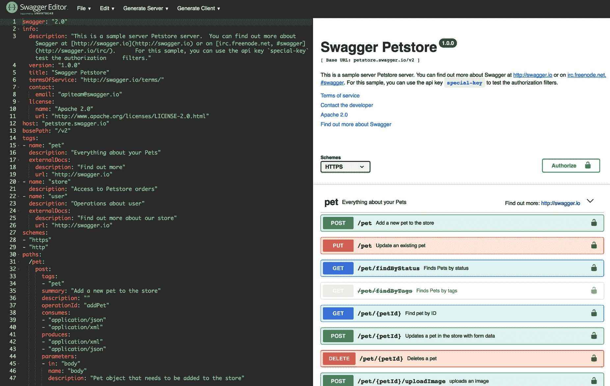

# 微文件 OpenAPI 和类型安全 REST 客户端

EclipseMicroFile 有一套丰富的 Java 微服务规范。其中两个，Eclipse 微文件 OpenAPI 和 Eclipse 微文件 REST 客户端，分别帮助您编写微服务的 API 文档，并为 REST 端点上的类型安全调用提供 API。OpenAPI 简化了 microservice 端点的文档，并使此元数据可供第三方开发人员阅读。类型安全的 REST 客户端简化了将对象编组和解编组为 HTTP 或 JSON 的过程。

本章将介绍以下主题：

*   每个规范提供的功能
*   其中一些功能的简单代码示例
*   如何获得关于这些规范的更多信息

# 微文件 OpenAPI 及其功能简介

推动数字经济的移动力量导致企业需要建立全渠道的发展方法，以优化成本、提高效率和改善客户体验。这种方法的促进者是 API，它带来了 API 经济和概念，如 API 主导或 API 优先开发实践。此外，微服务体系结构已成为现代发展的首选体系结构。基于 API（即 RESTful）的微服务间通信已被采用为*事实上的*标准，因为它非常适合微服务的*智能端点和哑管道*、*分散治理*和*分散数据管理*特征。

然而，随着微服务体系结构中微服务数量的增加，它们的管理可能会变得笨拙。但是，您可以通过微服务的 API 管理微服务。您可以将管理、安全、负载平衡和限制策略应用于面向微服务的 API。

Eclipse Micropofile OpenAPI 为开发人员提供了 Java 接口，用于从 Java RESTful Web 服务（JAX-RS）应用程序生成 OpenAPI v3 文档。该规范要求在根 URL`/openapi`上提供一个经过完整处理的 OpenAPI 文档，作为 HTTP`GET`操作，如下所示：

```java
GET http://myHost:myPort/openapi
```

所需协议为`http`。但是，强烈鼓励规范的实施者也支持`https`协议，以确保与 OpenAPI 端点的安全连接。

OpenAPI 文档的创建源有三个。这三个来源（在本章后面的章节中描述）如下：

*   通过处理应用程序中的 JAX-RS 注释（以及可选的 OpenAPI 注释）生成
*   通过提供实现`OasModelReader`的 Java 类，由应用程序以编程方式构建
*   应用程序部署中包含的静态 OpenAPI 文档

这三个源（任意组合）组合起来生成一个 OpenAPI 文档，该文档可以被过滤（通过提供实现`OasFilter`接口的 Java 类），然后在前面的`/openapi`端点提供服务。

# 配置

MicroProfile OpenAPI 规范使用 MicroProfile 配置规范来配置其参数和值。例如，对于注入配置值，MicroProfile OpenAPI 可以使用默认和自定义配置源。

有关 ConfigSources 的更多信息，请访问[https://github.com/eclipse/microprofile-config/blob/master/spec/src/main/asciidoc/configsources.asciidoc](https://github.com/eclipse/microprofile-config/blob/master/spec/src/main/asciidoc/configsources.asciidoc) 。

有许多可配置项。下表包含其中的一个子集：

| 

**配置项**

 | 

**说明**

 |
| --- | --- |
| `mp.openapi.scan.di sable` | 用于禁用批注扫描的配置属性。默认值为`false`。 |
| `mp.openapi.servers` | 配置属性以指定以下全局服务器的列表。。。 |

# 生成 OpenAPI 文档

如前所述，微文件 OpenAPI 规范要求从三个源的组合生成 OpenAPI 文档。

然后，您有许多选择：

*   使用 OpenAPI 注释扩展 JAX-RS 注释生成的 OpenAPI 文档。
*   利用`/openapi`的初始输出，您可以将其用作开始记录 API 的参考。在这种情况下，您可以在编写任何代码之前编写静态 OpenAPI 文件（在本章后面的一节中介绍），这是组织锁定 API 契约的常用方法，也就是说，这是 API 优先开发实践。
*   通过使用本章后面介绍的编程模型进行编码，引导或完成 OpenAPI 模型树。

此外，您可以使用过滤器在构建 OpenAPI 模型后更新它。

# 微文件 OpenAPI 注释

OpenAPI 信息最常见的来源可能是构成标准 JAX-RS 应用程序定义的注释集。这些注释以及 MicroFile OpenAPI 规范定义的附加（可选）注释可由 MicroFile 平台扫描和处理，以生成 OpenAPI 文档。

MP OpenAPI 规范要求从纯 JAX-RS 2.0 应用程序生成有效的 OpenAPI 文档。如果您是 OpenAPI 新手，只需将现有的 JAX-RS 应用程序部署到一个微文件 OpenAPI 运行时，并查看`/openapi`的输出。

要填写生成的 OpenAPI 文档的其他详细信息，您可以进一步注释您的。。。

# 用法示例

MicroFile OpenAPI 注释的一些使用示例如下：

示例 1–简单操作说明（缩写）：

```java
@GET
@Path("/findByMake")
@Operation(summary = "Finds cars by make",
           description = "Find cars by their manufacturer")
public Response findCarsByMake(...)
{ ... }
```

下面是示例 1 的输出：

```java
/car/findByMake:
 get:
 summary: Finds cars by make
 description: Find cars by their manufacturer
```

示例 2–具有不同响应的操作（缩写）：

```java
@GET
@Path("/{name}")
@Operation(summary = "Get customer by name")
  @APIResponse(description = "The customer",
             content = @Content(mediaType = "application/json",
                                schema = @Schema(implementation = Customer.class))),
@APIResponse(responseCode = "400", description = "Customer not found")
public Response getCustomerByName(
        @Parameter(description = "The name of the customer to be fetched", required = true) @PathParam("name") String name)

{...}
```

下面是示例 2 的输出：

```java
/customer/{name}:
 get:
 summary: Get customer by name
 operationId: getCutomerByName
 parameters:
 - name: name
 in: path
 description: 'The name of the customer to be fetched'
 required: true
 schema:
 type: string
 responses:
 default:
 description: The customer
 content:
 application/json:
 schema:
 $ref: '#/components/schemas/Customer'
 400:
 description: Customer not found
```

有关更多示例，请参考位于[的 MicroProfile OpenAPI 规范 wikihttps://github.com/eclipse/microprofile-open-api/wiki](https://github.com/eclipse/microprofile-open-api/wiki) 。

# 静态 OpenAPI 文件

正如本章前面提到的，静态 OpenAPI 文件是创建 OpenAPI 文档的三个来源之一。在下面，我们将简要介绍如何生成一个，以及如何将其包含在部署中。许多组织使用 API 优先开发实践，这需要在为它们实现任何代码之前定义静态 OpenAPI 文件。

首先，您可以通过使用开源编辑器（如 Swagger editor）（[）创建 OpenAPI 文档 https://editor.swagger.io](https://editor.swagger.io) ）。以下是一个屏幕截图，显示了这一点：



使用此编辑器，您可以从示例开始。。。

# 编程模型

您可以使用微文件 OpenAPI 编程模型，通过 JavaPOJO（普通的旧 Java 对象）提供 OpenAPI 元素。全套型号在`org.eclipse.microprofile.openapi.models`包中描述。您可以在[https:](https://github.com/eclipse/microprofile-open-api/tree/master/api/src/main/java/org/eclipse/microprofile/openapi/models)[//github.com/eclipse/microfile-open-api/tree/master/api/src/main/java/org/eclipse/microfile/openapi/models](https://github.com/eclipse/microprofile-open-api/tree/master/api/src/main/java/org/eclipse/microprofile/openapi/models)上了解更多信息。

您可以使用`OASFactory`创建 OpenAPI 树。通过示例参考以下代码块：

```java
OASFactory.createObject(Info.class).title("Weather")
          .description("Weather APIs").version("1.0.0");
```

要引导 OpenAPI 模型树，可以使用`OASModelReader`接口。然后，您可以创建此接口的实现，并使用`mp.openapi.model.reader`配置键进行注册。

以下是`META-INF/microprofile-config.properties`中其定义的全球示例：

```java
mp.openapi.model.reader=com.mypackage.MyModelReader
```

与静态文件一样，模型读取器可用于提供完整或部分模型树。要提供完整的 OpenAPI 模型树，您应该将`mp.openapi.scan.disable`配置设置为`true`。否则，将假定此部分模型。

# 使用过滤器进行更新

要更新或删除 OpenAPI 文档的某些元素和字段，可以使用过滤器。过滤器（[https://github.com/eclipse/microprofile-open-api/blob/master/api/src/main/java/org/eclipse/microprofile/openapi/OASFilter.java](https://github.com/eclipse/microprofile-open-api/blob/master/api/src/main/java/org/eclipse/microprofile/openapi/OASFilter.java) 接口允许您接收各种 OpenAPI 元素的回调。它允许您覆盖您关心的方法。您可以创建此接口的实现，并使用`mp.openapi.filter`配置键进行注册。

以下是`META-INF/microprofile-config.properties`中其定义的示例：

```java
mp.openapi.filter=com.mypackage.MyFilter
```

为每个模型元素调用一次注册的过滤器。例如，`filterPathItem`方法是。。。

# 微文件 REST 客户端及其功能简介

**微文件 REST 客户端**（**MP-RC**为 REST 端点上的类型安全调用提供 API。它可以从应用程序中用于对其他服务执行远程调用。

它利用 Java 接口上的 JAX-RS 注释来描述与远程服务的实际契约。然后使用这些接口创建隐藏大部分底层 HTTP 通信的客户端代理。

MP-RC 规范定义了利用 Java 接口上的 JAX-RS 注释以及 MP-RC 特定注释来增强行为的要求，包括如何传播传入请求头、如何使用提供程序增强 JAX-RS 行为、异常映射、CDI 支持、，以及与其他微文件规范的集成。我们将从类型安全端点接口的定义开始，更详细地了解 MP-RC。

# 定义端点接口

为了定义端点的类型安全接口，我们创建了一个 Java 接口，该接口利用 JAX-RS 注释将接口方法映射到它们代理的 REST 端点。下面的`WorldClockApi`界面展示了一个基本示例：

```java
package io.pckt.restc.contract;import javax.ws.rs.GET;import javax.ws.rs.Path;import javax.ws.rs.PathParam;import javax.ws.rs.Produces;import javax.ws.rs.core.MediaType;@Path("/api/json")public interface WorldClockApi { static final String BASE_URL = "http://worldclockapi.com/api/json"; @GET @Path("/utc/now") @Produces(MediaType.APPLICATION_JSON) Now utc(); @GET @Path("{tz}/now") @Produces(MediaType.APPLICATION_JSON) Now tz(@PathParam("tz") String tz);}public class Now ...
```

# 微文件 REST 客户端编程 API 的使用

MP-RC 支持编程查找和 CDI 注入两种使用方法。下面列出了 REST 服务使用`org.eclipse.microprofile.rest.client.RestClientBuilder`为`WorldClockApi`接口创建类型安全客户端的示例`WorldClockUser.java`：

```java
package io.pckt.restc.contract;

import javax.ws.rs.GET;
import javax.ws.rs.Path;
import javax.ws.rs.PathParam;
import javax.ws.rs.Produces;
import javax.ws.rs.core.MediaType;

@Path("/api")
@ApplicationScoped
public class WorldClockUser {
 @GET
 @Path("/now-utc")
 @Produces(MediaType.TEXT_PLAIN)
 public String getCurrentDateTime() {
 WorldClockApi remoteApi = RestClientBuilder.newBuilder()
 .baseUri(URI.create(WorldClockApi.BASE_URL))
 .build(WorldClockApi.class);
 Now now = remoteApi.utc();
 return now.getCurrentDateTime();
 }
}
```

`baseUri()`方法用于指定要解析`WorldClockApi`方法路径的服务器 URI。`build()`方法采用要构建的类型安全客户端的 Java 接口。其他`RestClientBuilder`方法包括以下内容：

*   `baseUrl(URL)`：与`baseUri`相似，但为`java.net.URL`类型。
*   `connectTimeout(long timeout, TimeUnit unit)`：连接到远程服务器的等待时间。值为 0 表示必须永远等待。
*   `readTimeout(long timeout, TimeUnit unit)`：等待远程服务器连接读取的时间量。值为 0 表示必须永远等待。
*   `executorService(ExecutorService executor)`：用于异步请求。我们将在异步部分中返回到这一点。

# 微文件 REST 客户端 CDI 使用

MP-RC 类型的安全接口可以作为 CDIBean 注入。运行时必须为每个带有`@RegisterRestClient`注释的接口创建一个 CDIBean。创建的 CDI 客户端注入 bean 将包括一个限定符`@RestClient`，以区分作为 MP-RC 注入点的使用。以下对`WorldClockApi`界面的更新说明了`@RegisterRestClient`注释的使用：

```java
import javax.ws.rs.GET;import javax.ws.rs.Path;import javax.ws.rs.PathParam;import javax.ws.rs.Produces;import javax.ws.rs.core.MediaType;import org.eclipse.microprofile.rest.client.inject.RegisterRestClient;@Path("/api/json")@RegisterRestClient()public interface WorldClockApi { static final String BASE_URL = "http://worldclockapi.com/api/json"; ...
```

# 微文件配置集成

对于 CDI 定义的接口，可以使用 MicroFile 配置属性定义通过`RestClientBuilder`API 可用的其他行为。在我们的`io.pckt.restc.contract.WorldClockApi`接口中，以下文件配置属性可用于控制生成的代理行为：

*   `io.pckt.restc.contract.WorldClockApi/mp-rest/url`：用于此服务的基本 URL，相当于`RestClientBuilder#baseUrl`方法。

*   `io.pckt.restc.contract.WorldClockApi/mp-rest/scope`：用于注入的 CDI 作用域的完全限定类名；默认为`javax.enterprise.context.Dependent`。
*   `io.pckt.restc.contract.WorldClockApi/mp-rest/providers`：包含在客户机中的完全合格的提供者类名的逗号分隔列表，相当于`RestClientBuilder#register`方法或`@RegisterProvider`注释。

*   `io.pckt.restc.contract.WorldClockApi/mp-rest/providers/com.mycompany.MyProvider/priority`：这将覆盖此接口的`com.mycompany.MyProvider`提供程序的优先级。

*   `io.pckt.restc.contract.WorldClockApi/mp-rest/connectTimeout`：以毫秒为单位指定的等待连接到远程端点的超时。

*   `io.pckt.restc.contract.WorldClockApi/mp-rest/readTimeout`：以毫秒为单位指定的等待远程端点响应的超时。

# 简化配置密钥

由于包含接口包名称，CDI 接口的默认 MP Config 属性名称可能相当长，因此 MP-RC 规范支持使用`@RegisterRestClient`注释的`configKey`属性简化属性名称前缀的方法：

```java
@Path("/api/json")@RegisterRestClient(baseUri = WorldClockApi.BASE_URL, configKey = "worldClock")public interface WorldClockApi { static final String BASE_URL = "http://worldclockapi.com/api/json";...}
```

使用`worldClock`configKey，前面的属性名称列表简化为以下内容：

*   `worldClock/mp-rest/url`
*   `worldClock/mp-rest/uri`
*   `worldClock/mp-rest/scope`
*   `worldClock/mp-rest/providers`
*   `worldClock/mp-rest/providers/com.mycompany.MyProvider/priority ...`

# 处理客户端头

假设您希望在 HTTP 授权头中指定安全远程服务的凭据，但不希望在客户端接口方法中有 string`authHeader`参数。MP-RC`@ClientHeaderParam`注释可用于指定在不改变客户端接口方法签名的情况下应发送的 HTTP 头。

以下示例说明了两种使用`@ClientHeaderParam`注释在`WorldClockApi`接口的变体中提供`User-Agent`HTTP 头的方法：

```java
WorldClockApiWithHeaders.java
public interface WorldClockApiWithHeaders {
 static final String BASE_URL = "http://worldclockapi.com/api/json";

 default String lookupUserAgent() {
 Config config = ConfigProvider.getConfig();
 String userAgent = config.getValue("WorldClockApi.userAgent", String.class);
 if(userAgent == null) {
 userAgent = "MicroProfile REST Client 1.2";
 }
 return userAgent;
 }

 @GET
 @Path("/utc/now")
 @Produces(MediaType.APPLICATION_JSON)
 @ClientHeaderParam(name = "User-Agent", value = "{lookupUserAgent}")
 Now utc();

 @GET
 @Path("{tz}/now")
 @Produces(MediaType.APPLICATION_JSON)
 @ClientHeaderParam(name = "User-Agent", value = "MicroProfile REST Client 1.2")
 Now tz(@PathParam("tz") String tz);
}

```

也可以使用`ClientHeadersFactory`实现批量添加或传播头：

```java
package org.eclipse.microprofile.rest.client.ext;

public interface ClientHeadersFactory {
 MultivaluedMap<String, String> update(
    MultivaluedMap<String, String> incomingHeaders,
    MultivaluedMap<String, String> clientOutgoingHeaders);
}
```

在前面的代码段中，`incomingHeaders`和`clientOutgoingHeaders`参数使用如下：

*   `incomingHeaders`：表示入站请求的头映射
*   `clientOutgoingHeaders`：表示客户端接口上指定的头值的只读映射，`@ClientHeaderParam`、`@HeaderParam`等头值的并集

`update`方法应返回一个`MultivaluedMap`，其中包含要与`clientOutgoingHeaders`映射合并的头，以便将头的完整映射发送到出站请求。过滤器、拦截器和消息体编写器等提供程序仍然可以在发送 HTTP 请求之前修改头的最终映射。

要启用`ClientHeadersFactory`，客户端接口必须使用`@RegisterClientHeaders`注释进行注释。如果此注释指定了一个值，则客户端实现必须调用指定的`ClientHeadersFactory`实现类的实例。如果未指定值，则客户端实现必须调用`DefaultClientHeadersFactoryImpl`。此默认工厂将指定的头从入站 JAX-RS 请求传播到出站请求–这些头是使用 MicroProfile Config 属性`org.eclipse.microprofile.rest.client.propagateHeaders`使用逗号分隔的列表指定的。

# 高级使用的提供商注册

`RestClientBuilder`接口扩展了 JAX-RS 中的`Configurable`接口，允许用户在构建过程中注册自定义提供程序。支持的提供者的行为由 JAX-RS 客户机 API 规范定义。MP-RC 实现将支持来自 JAX-RS 的`ClientResponseFilter`、`ClientRequestFilter`、`MessageBodyReader`、`MessageBodyWriter`、`ParamConverter`、`ReaderInterceptor`和`WriterInterceptor`。

对于在`filter`方法中有`ClientRequestContext`参数的`ClientResponseFilter`和`ClientRequestFilter`接口，MP-RC 实现添加了一个`org.eclipse.microprofile.rest.client.invokedMethod`属性，其值为`java.lang.reflect.Method`对象。。。

# 提供者优先级

提供者可以通过注释和`RestClientBuilder`注册。通过构建器注册的提供者将优先于`@RegisterProvider`注释。`@RegisterProvider`注释优先级值优先于类上的任何`@javax.annotation.Priority`注释。当使用`RestClientBuilder`接口上的 register 方法时，可以覆盖提供程序优先级，因为它允许优先级。

# 特征注册

如果注册的提供程序的类型是 JAX-RS`Feature`，那么`Feature`设置的优先级也将是构建器的一部分。实现维护已注册提供者的总体优先级，而不管它们是如何注册的。`Feature`将用于在运行时注册其他提供者，可以通过`@RegisterProvider`、配置或`RestClientBuilder`注册。`Feature`将立即执行。因此，不考虑其优先级（始终执行功能）。

# 默认提供者

MP-RC 实施必须提供至少一组提供程序，包括以下内容：

*   `*/json`类型：
    *   JSON-P，`javax.json.JsonValue`
    *   JSON-B，`javax.json.bind`
*   `*`类型：
    *   `byte[]`
    *   `java.lang.String`
    *   `java.io.InputStream`
    *   `java.io.Reader`
*   `text/plain`类型：
    *   `java.lang.Number and subtypes`
    *   `int, long, float and double`
    *   `java.lang.Character and char`
    *   `java.lang.Boolean and boolean`

# 异常映射

MP-RC 支持通过`org.eclipse.microprofile.rest.client.ext.ResponseExceptionMapper`接口将调用响应映射到异常：

```java
import javax.annotation.Priority;import javax.ws.rs.Priorities;import javax.ws.rs.core.MultivaluedMap;import javax.ws.rs.core.Response;import java.util.Optional;public interface ResponseExceptionMapper<T extends Throwable> {    int DEFAULT_PRIORITY = Priorities.USER;    T toThrowable(Response response);    default boolean handles(int status, MultivaluedMap<String, Object> headers) {        return status >= 400;    }    default int getPriority() {        return Optional.ofNullable(getClass().getAnnotation(Priority.class))            .map(Priority::value)            .orElse(DEFAULT_PRIORITY);    }}
```

考虑下面…

# 默认异常映射

每个实现都提供了一个默认的`ResponseExceptionMapper`实现，当响应状态代码为>=400 时，该实现将映射并调用对`javax.ws.rs.WebApplicationException`的响应。它的优先级为`Integer.MAX_VALUE`，用于在遇到错误时作为回退。默认情况下，此映射程序将注册到所有客户端接口，但可以通过将 MP Config 属性`microprofile.rest.client.disable.default.mapper`设置为`true`来禁用此映射程序。在构建客户端时，也可以使用相同的属性在每个客户端上禁用它：

```java
RestClientBuilder.newBuilder().property("microprofile.rest.client.disable.default.mapper",true)
```

# 异步支持

MP-RC 支持异步方法调用。当方法的返回类型为`java.util.concurrent.CompletionStage<?>`类型时，客户端接口方法是异步的。声明异步方法的`WorldClockApi`接口的另一个版本称为`WorldClockApiAsync.java`，如下所示：

```java
import java.util.concurrent.CompletionStage;import javax.ws.rs.GET;import javax.ws.rs.Path;import javax.ws.rs.PathParam;import javax.ws.rs.Produces;import javax.ws.rs.core.MediaType;@Path("/api/json")public interface WorldClockApiAsync { String BASE_URL = "http://worldclockapi.com/api/json"; @GET @Path("/utc/now") @Produces(MediaType.APPLICATION_JSON) CompletionStage<Now> utc(); @GET @Path("{tz}/now") @Produces(MediaType.APPLICATION_JSON) ...
```

# 总结

在本章中，我们学习了两种 Eclipse 微文件规范，即 Eclipse 微文件 OpenAPI 和 Eclipse 微文件 REST 客户端。前者提供了为微服务生成符合 OpenAPI 的文档的规范，后者提供了以类型安全方式调用 REST 端点的规范。在本章中，我们介绍了这些规范的特定功能，提供了一些示例代码，并提供了有关如何获取这些规范的更多信息的指针。您已经了解了 EclipseMicroporFile OpenAPI 和 EclipseMicroporFile REST 客户端规范的特性和功能，如何使用它们的注释和编程接口，以及如何将它们合并到应用程序中。

在下一章中，我们将讨论并深入研究目前市场上存在的 Eclipse 微文件的开源实现。

# 问题

1.  您需要做些什么来获取提供给`/openapi`端点的信息吗？
2.  我可以用一个或两个额外的注释来增强 OpenAPI 输出吗？
3.  使用静态 OpenAPI 文件有什么意义？
4.  我是否需要 REST 端点微服务来提供 MP-REST 接口？
5.  如何将类型安全接口的基本 URL 外部化？
6.  如果我需要传播传入的请求头怎么办？