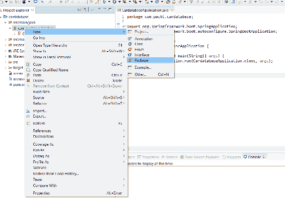
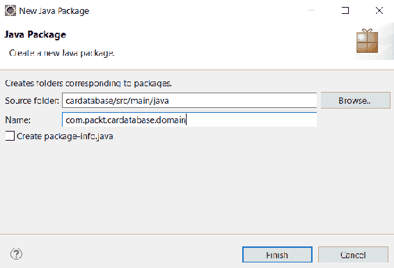
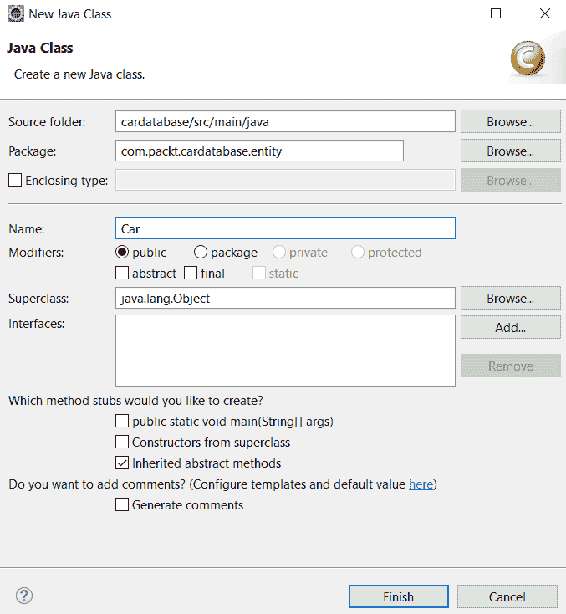
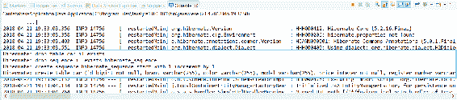
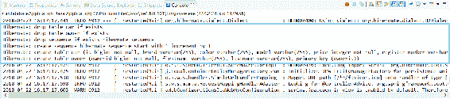
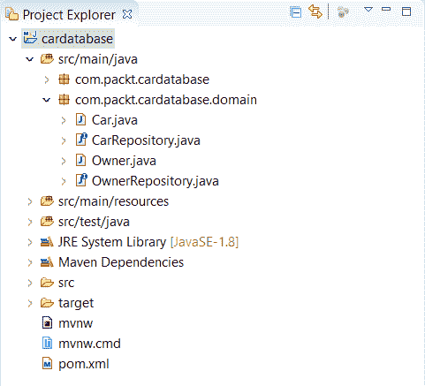

# 使用 JPA 创建和访问数据库

本章介绍如何将 JPA 与 Spring Boot 一起使用。我们将使用实体类创建一个数据库。在第一阶段，我们将使用 H2 内存数据库进行开发和演示。H2 是一个内存 SQL 数据库，非常适合快速开发或演示。在第二阶段，我们将从 H2 转向使用 MariaDB。本章还介绍了 CRUD 存储库的创建以及数据库表之间的一对多连接。

在本章中，我们将了解以下内容：

*   使用 JPA 的基础知识和好处
*   如何使用实体类定义数据库
*   如何使用数据库创建 Spring 引导后端

# 技术要求

使用 Spring Boot（[需要 Java SDK 版本 8 或更高版本 http://www.oracle.com/technetwork/java/javase/downloads/index.html](http://www.oracle.com/technetwork/java/javase/downloads/index.html) ）。

创建数据库应用程序（[需要安装 MariaDBhttps://downloads.mariadb.org/](https://downloads.mariadb.org/) ）。

# ORM、JPA 和 Hibernate 的基础知识

**对象关系映射**（**ORM**是一种允许您使用面向对象编程范式从数据库中获取和操作的技术。ORM 对程序员来说非常好，因为它依赖于面向对象的概念，而不是数据库结构。它还使开发速度大大加快，并减少了源代码的数量。ORM 基本上独立于数据库，开发人员不必担心特定于供应商的 SQL 语句。

**Java 持久化 API**（**JPA**）为 Java 开发人员提供对象关系映射。JPA 实体是一个表示数据库表结构的 Java 类。实体类的字段表示数据库表的列。

Hibernate 是最流行的基于 Java 的 JPA 实现，它在 Spring 引导中作为默认值使用。Hibernate 是一个成熟的产品，在大规模应用中得到了广泛的应用。

# 创建实体类

实体类是一个简单的 Java 类，用 JPA 的`@Entity`注释进行注释。实体类使用标准的 JavaBean 命名约定，并具有适当的 getter 和 setter 方法。类字段具有私有可见性。

JPA 在初始化应用程序时创建一个名为类名的数据库表。如果要为数据库表使用其他名称，可以使用`@Table`注释。

为了能够使用 JPA 和 H2 数据库，我们必须在`pom.xml`文件中添加以下依赖项：

```java
    <dependency>
      <groupId>org.springframework.boot</groupId>
      <artifactId>spring-boot-starter-data-jpa</artifactId>
    </dependency>
    <dependency>
        <groupId>com.h2database</groupId>
        <artifactId>h2</artifactId>
        <scope>runtime</scope>
    </dependency>
```

以下是创建实体类的步骤：

1.  为了在 SpringBoot 中创建实体类，我们将首先为实体创建我们自己的包。包应该在根包下创建。
2.  在 Eclipse 项目资源管理器中激活根包并右键单击以显示菜单。
3.  从菜单中选择新建|软件包。以下屏幕截图显示了实体类包的创建：



4.  我们将我们的包裹命名为`com.packt.cardatabase.domain`：



5.  接下来，我们创建实体类。激活一个新实体包，右键单击，然后从菜单中选择新建|类。因为我们要创建一个 car 数据库，实体类的名称是`Car`。在名称字段中键入`Car`，然后按下完成按钮：



6.  在项目浏览器中双击`Car`类文件，在编辑器中打开该类文件。首先，我们必须用`@Entity`注释对类进行注释。`Entity`注释是从`javax.persistence`包导入的：

```
      package com.packt.cardatabase.domain;

      import javax.persistence.Entity;

      @Entity
      public class Car {

      }
```

您可以在 Eclipse IDE 中使用*Ctrl*+*Shift*+*O*快捷方式自动导入缺失的包。

7.  接下来，我们向类中添加一些字段。实体类字段映射到数据库表列。实体类还必须包含用作数据库主键的唯一 ID：

```
      package com.packt.cardatabase.domain;

      import javax.persistence.Entity;
      import javax.persistence.GeneratedValue;
      import javax.persistence.GenerationType;
      import javax.persistence.Id;

      @Entity
      public class Car {
        @Id
        @GeneratedValue(strategy=GenerationType.AUTO)
        private long id;
        private String brand, model, color, registerNumber;
        private int year, price;
      }
```

使用`@Id`注释定义主键。`@GeneratedValue`注释定义该 ID 由数据库自动生成。我们还可以定义密钥生成策略。类型`AUTO`表示 JPA 提供者为特定数据库选择最佳策略。您还可以通过使用`@Id`注释对多个属性进行注释来创建复合主键。

默认情况下，数据库列根据类字段命名进行命名。如果要使用其他命名约定，可以使用`@Column`注释。通过`@Column`注释，您还可以定义列的长度以及列是否可为空。下面的代码显示了使用`@Column`注释的示例。根据此定义，数据库中的列名为`desc`，列长为`512`，不可为空：

```
@Column(name="desc", nullable=false, length=512)
private String description
```

8.  最后，我们向实体类添加具有属性的 getter、setter 和构造函数。由于自动生成 ID，我们的构造函数中不需要 ID 字段。`Car`实体类构造函数的源代码如下：

Eclipse 提供自动添加 getter、setter 和构造函数。在类中激活光标并单击鼠标右键。从菜单中，选择 Source |生成 getter 和 setter…或 Source |使用字段生成构造函数。。。

```
package com.packt.cardatabase.domain;

import javax.persistence.Entity;
import javax.persistence.GeneratedValue;
import javax.persistence.GenerationType;
import javax.persistence.Id;

@Entity
public class Car {
  @Id
  @GeneratedValue(strategy=GenerationType.AUTO)
  private long id;
  private String brand, model, color, registerNumber;
  private int year, price;

  public Car() {}

  public Car(String brand, String model, String color, 
    String registerNumber, int year, int price) {
    super();
    this.brand = brand;
    this.model = model;
    this.color = color;
    this.registerNumber = registerNumber;
    this.year = year;
    this.price = price;
  }
```

以下是`Car`实体类 getter 和 setter 的源代码：

```
  public String getBrand() {
    return brand;
  }
  public void setBrand(String brand) {
    this.brand = brand;
  }
  public String getModel() {
    return model;
  }
  public void setModel(String model) {
    this.model = model;
  }
  public String getColor() {
    return color;
  }
  public void setColor(String color) {
    this.color = color;
  }
  public String getRegisterNumber() {
    return registerNumber;
  }
  public void setRegisterNumber(String registerNumber) {
    this.registerNumber = registerNumber;
  }
  public int getYear() {
    return year;
  }
  public void setYear(int year) {
    this.year = year;
  }
  public int getPrice() {
    return price;
  }
  public void setPrice(int price) {
    this.price = price;
  } 
}
```

运行应用程序时，必须在数据库中创建名为`car`的表。为了确保这一点，我们将向`application.properties`文件添加一个新属性。这允许将 SQL 语句记录到控制台：

```
spring.jpa.show-sql=true
```

现在，我们可以在运行应用程序时看到表创建语句：



H2 提供了一个基于 web 的控制台，可用于浏览数据库和执行 SQL 语句。要启用控制台，我们必须在`application.properties`文件中添加以下行。第一个设置启用 H2 控制台，第二个设置定义可用于访问控制台的端点：

```
spring.h2.console.enabled=true
spring.h2.console.path=/h2-console
```

您可以通过 web 浏览器导航到`localhost:8080/h2-console`来访问 H2 控制台。使用`jdbc:h2:mem:testdb`作为 JDBC URL，并在登录窗口中将密码字段留空。按 Connect（连接）按钮登录控制台：


现在您可以在数据库中看到我们的`car`表。您可能会注意到，寄存器编号在单词之间有一个下划线。这是由于属性（`registerNumber`的大小写命名导致的：


# 创建 CRUD 存储库

Spring 引导数据 JPA 为 CRUD 操作提供了一个`CrudRepository`接口。它为我们的实体类提供 CRUD 功能。

我们现在将在`domain`包中创建我们的存储库，如下所示：

1.  在`domain`包中创建一个名为`CarRepository`的新类，并根据以下代码段修改该文件：

```
      package com.packt.cardatabase.domain;

      import org.springframework.data.repository.CrudRepository;

      public interface CarRepository extends CrudRepository <Car, Long> {

      }
```

我们的`CarRepository`现在扩展了 Spring Boot JPA`CrudRepository`接口。`<Car, Long>`类型参数定义这是`Car`实体类的存储库，ID 字段的类型很长。

`CrudRepository`提供了多种积垢方法，我们现在可以开始使用。下表列出了最常用的方法：

| **方法** | **说明** |
| `long count()` | 返回实体数 |
| `Iterable<T> findAll()` | 返回给定类型的所有项 |
| `Optional<T> findById(ID Id)` | 按 id 返回一项 |
| `void delete(T entity)` | 删除一个实体 |
| `void deleteAll()` | 删除存储库的所有实体 |
| `<S extends T> save(S entity)` | 保存一个实体 |

如果该方法只返回一项，则返回的是`Optional<T>`而不是`T`。在 Java8SE 中引入了`Optional`类。`Optional`是一种有值或无值的单值容器。通过使用`Optional`，我们可以防止空指针异常。

2.  现在我们准备向 H2 数据库添加一些演示数据。为此，我们将使用弹簧靴`CommandLineRunner`。`CommandLineRunner`接口允许我们在应用程序完全启动之前执行其他代码。因此，最好将演示数据添加到数据库中。`CommandLineRunner`位于主类内：

```
      import org.springframework.boot.CommandLineRunner;
      import org.springframework.boot.SpringApplication;
      import org.springframework.boot.autoconfigure.SpringBootApplication;
      import org.springframework.context.annotation.Bean;

      @SpringBootApplication
      public class CardatabaseApplication {

        public static void main(String[] args) {
          SpringApplication.run(CardatabaseApplication.class, args);
        }

        @Bean
        CommandLineRunner runner(){
          return args -> {
            // Place your code here
          };
        } 
      }
```

3.  接下来，我们必须将我们的 car 存储库注入到主类中，以便能够将新的 car 对象保存到数据库中。`@Autowired`注释用于启用依赖项注入。依赖项注入允许我们将依赖项传递到对象中。注入存储库类后，我们可以使用它提供的 CRUD 方法。以下示例代码显示了如何将几辆车插入数据库：

```
      import org.springframework.beans.factory.annotation.Autowired;
      import org.springframework.boot.CommandLineRunner;
      import org.springframework.boot.SpringApplication;
      import org.springframework.boot.autoconfigure.SpringBootApplication;
      import org.springframework.context.annotation.Bean;

      import com.packt.cardatabase.domain.Car;
      import com.packt.cardatabase.domain.CarRepository;

      @SpringBootApplication
      public class CardatabaseApplication {
        @Autowired 
        private CarRepository repository;

        public static void main(String[] args) {
          SpringApplication.run(CardatabaseApplication.class, args);
        }

        @Bean
        CommandLineRunner runner(){
          return args -> {
            // Save demo data to database
            repository.save(new Car("Ford", "Mustang", "Red",
             "ADF-1121", 2017, 59000));
            repository.save(new Car("Nissan", "Leaf", "White",
             "SSJ-3002", 2014, 29000));
```

```
            repository.save(new Car("Toyota", "Prius", "Silver",
             "KKO-0212", 2018, 39000));
          };
        } 
      }
```

`Insert`应用程序执行后，在 Eclipse 控制台中可以看到以下语句：


您还可以使用 H2 控制台从数据库中获取车辆，如以下屏幕截图所示：


您可以在 Spring 数据存储库中定义自己的查询。查询必须以前缀开头，例如`findBy`。在前缀之后，定义查询中使用的实体类字段。以下是三个简单查询的示例代码：

```
import java.util.List;

import org.springframework.data.repository.CrudRepository;

public interface CarRepository extends CrudRepository <Car, Long> {
  // Fetch cars by brand
  List<Car> findByBrand(String brand);

  // Fetch cars by color
  List<Car> findByColor(String color);

  // Fetch cars by year
  List<Car> findByYear(int year);

}
```

`By`关键字后可以有多个字段，与`And`或`Or`关键字连接：

```
package com.packt.cardatabase.domain;

import java.util.List;

import org.springframework.data.repository.CrudRepository;

public interface CarRepository extends CrudRepository <Car, Long> {
  // Fetch cars by brand and model
  List<Car> findByBrandAndModel(String brand, String model);

  // Fetch cars by brand or color
  List<Car> findByBrandOrColor(String brand, String color); 
}
```

查询可以使用查询方法中的`OrderBy`关键字进行排序：

```
package com.packt.cardatabase.domain;

import java.util.List;

import org.springframework.data.repository.CrudRepository;

public interface CarRepository extends CrudRepository <Car, Long> {
  // Fetch cars by brand and sort by year
  List<Car> findByBrandOrderByYearAsc(String brand);
}
```

您还可以通过`@Query`注释使用 SQL 语句创建查询。以下示例显示了`CrudRepository`中 SQL 查询的用法：

```
package com.packt.cardatabase.domain;

import java.util.List;

import org.springframework.data.repository.CrudRepository;

public interface CarRepository extends CrudRepository <Car, Long> {
  // Fetch cars by brand using SQL
  @Query("select c from Car c where c.brand = ?1")
  List<Car> findByBrand(String brand);
}
```

您还可以使用更高级的带有`@Query`注释的表达式，例如`like`。以下示例显示了`CrudRepository`中`like`查询的用法：

```
package com.packt.cardatabase.domain;

import java.util.List;

import org.springframework.data.repository.CrudRepository;

public interface CarRepository extends CrudRepository <Car, Long> {
  // Fetch cars by brand using SQL
  @Query("select c from Car c where c.brand like %?1")
  List<Car> findByBrandEndsWith(String brand);
}
```

Spring Data JPA 还提供了`PagingAndSortingRepository`，扩展了`CrudRepository`。它提供了使用分页和排序获取实体的方法。如果您处理的数据量较大，这是一个很好的选择。`PagingAndSortingRepository`可以像我们使用`CrudRepository`一样创建：

```
package com.packt.cardatabase.domain;

import org.springframework.data.repository.PagingAndSortingRepository;

```

```
public interface CarRepository extends PagingAndSortingRepository<Car, Long> {

}
```

在本例中，您现在拥有存储库提供的两个新的附加方法：

| **方法** | **说明** |
| `Iterable<T> findAll(Sort sort)` | 返回按给定选项排序的所有实体 |
| `Page<T> findAll(Pageable pageable)` | 根据给定的分页选项返回所有实体 |

# 表之间的关系

接下来，我们创建一个名为`owner`的新表，该表与`car`表具有一对多关系。车主可以拥有多辆车，但一辆车只能有一个车主。以下 UML 图显示了表之间的关系：


以下是创建新表的步骤：

1.  首先，我们在`domain`包中创建`Owner`实体和存储库。`Owner`实体和存储库的创建方式与`Car`类类似。以下是`Owner`实体类和`OwnerRepository`的源代码：

```
      // Owner.java

      package com.packt.cardatabase.domain;

      import javax.persistence.Entity;
      import javax.persistence.GeneratedValue;
      import javax.persistence.GenerationType;
      import javax.persistence.Id;

      @Entity
      public class Owner {
        @Id
        @GeneratedValue(strategy=GenerationType.AUTO)
        private long ownerid;
        private String firstname, lastname;

        public Owner() {}

        public Owner(String firstname, String lastname) {
          super();
          this.firstname = firstname;
          this.lastname = lastname;
        }

        public long getOwnerid() {
          return ownerid;
        }
        public void setOwnerid(long ownerid) {
          this.ownerid = ownerid;
        }
        public String getFirstname() {
          return firstname;
        }
        public void setFirstname(String firstname) {
          this.firstname = firstname;
        }
        public String getLastname() {
          return lastname;
        }
        public void setLastname(String lastname) {
          this.lastname = lastname;
        } 
      }
```

```
      // OwnerRepository.java

      package com.packt.cardatabase.domain;

      import org.springframework.data.repository.CrudRepository;

```

```
      public interface OwnerRepository extends CrudRepository<Owner, Long> 
      {

      }
```

2.  在这一阶段，最好检查所有工作是否正确完成。运行项目并检查两个数据库表是否都已创建，以及控制台中是否没有错误。以下屏幕截图显示了创建表时的控制台消息：



现在，我们的域包包含两个实体类和存储库：



3.  可以使用`@ManyToOne`和`@OneToMany`注释添加一对多关系。在包含外键的 car entity 类中，您将定义与`@ManyToOne`注释的关系。另外，为 owner 字段添加 getter 和 setter。建议所有关联使用`FetchType.LAZY`。对于`toMany`关系，这是默认值，但是对于`toOne`关系，您应该定义它。`FetchType`定义从数据库获取数据的策略。该值可以是`EAGER`或`LAZY`。在我们的例子中，惰性策略意味着当从数据库中提取车主时，所有与车主相关联的汽车都将在需要时提取。`Eager`表示将立即与车主一起取车。下面的源代码展示了如何在`Car`类中定义一对多关系：

```
      // Car.java

      @ManyToOne(fetch = FetchType.LAZY)
      @JoinColumn(name = "owner")
      private Owner owner;

      //Getter and setter
      public Owner getOwner() {
        return owner;
      }

      public void setOwner(Owner owner) {
        this.owner = owner;
      }
```

在 owner entity 站点中，使用`@OneToMany`注释定义关系。该字段的类型为`List<Car>`，因为车主可能有多辆车。此外，还添加了 getter 和 setter：

```
      // Owner.java  

      @OneToMany(cascade = CascadeType.ALL, mappedBy="owner")
      private List<Car> cars;

      //Getter and setter
      public List<Car> getCars() {
        return cars;
      }

      public void setCars(List<Car> cars) {
        this.cars = cars;
      }
```

`@OneToMany`注释有两个我们正在使用的属性。`cascade`属性定义级联如何影响实体。属性设置`ALL`意味着如果车主被删除，链接到该车主的汽车也会被删除。`mappedBy="owner"`属性设置告诉我们`Car`类具有所有者字段，该字段是此关系的外键。

运行项目时，您可以从控制台中看到关系现在已创建：


4.  现在，我们可以使用`CommandLineRunner`将一些所有者添加到数据库中。我们还将修改`Car`实体类构造函数，并在其中添加所有者：

```
      // Car.java constructor 

      public Car(String brand, String model, String color,
      String registerNumber, int year, int price, Owner owner) {
        super();
        this.brand = brand;
        this.model = model;
        this.color = color;
        this.registerNumber = registerNumber;
        this.year = year;
        this.price = price;
        this.owner = owner;
      }
```

5.  我们首先创建两个所有者对象，并将它们保存到数据库中。为了拯救所有者，我们还必须将`OwnerRepository`注入到主类中。然后我们使用`Car`构造器将车主与汽车连接起来。以下是应用主类`CardatabaseApplication`的源代码：

```
      @SpringBootApplication
      public class CardatabaseApplication {
        // Inject repositories
        @Autowired 
        private CarRepository repository;

        @Autowired 
        private OwnerRepository orepository;

        public static void main(String[] args) {
          SpringApplication.run(CardatabaseApplication.class, args);
        }

        @Bean
        CommandLineRunner runner() {
          return args -> {
            // Add owner objects and save these to db
            Owner owner1 = new Owner("John" , "Johnson");
            Owner owner2 = new Owner("Mary" , "Robinson");
            orepository.save(owner1);
            orepository.save(owner2);

            // Add car object with link to owners and save these to db.
            Car car = new Car("Ford", "Mustang", "Red", 
                "ADF-1121", 2017, 59000, owner1);
            repository.save(car);
            car = new Car("Nissan", "Leaf", "White",
                "SSJ-3002", 2014, 29000, owner2);
            repository.save(car);
            car = new Car("Toyota", "Prius", "Silver",
                "KKO-0212", 2018, 39000, owner2);
            repository.save(car);
          };
        } 
      }
```

如果您现在运行应用程序并从数据库中获取汽车，您可以看到车主现在链接到汽车：


如果您想创建多对多关系，这意味着在实践中，一个车主可以有多辆车，一辆车可以有多个车主，那么您应该使用`@ManyToMany`注释。在我们的示例应用程序中，我们将使用一对多关系，但下面有一个如何将关系更改为多对多的示例。在多对多关系中，建议在 hibernate 中使用`Set`而不是`List`：

1.  在`Car`实体类多对多关系中，按照以下方式定义 getter 和 setter：

```
      @ManyToMany(mappedBy = "cars") 
      private Set<Owner> owners; 

      public Set<Owner> getOwners() {
        return owners;
      }

      public void setOwners(Set<Owner> owners) {
        this.owners = owners;
      }
```

在所有者实体中，定义如下：

```
      @ManyToMany(cascade = CascadeType.MERGE)
      @JoinTable(name = "car_owner", joinColumns = { @JoinColumn(name =
       "ownerid") }, inverseJoinColumns = { @JoinColumn(name = "id") }) 
      private Set<Car> cars = new HashSet<Car>(0); 

      public Set<Car> getCars() {
        return cars;
      }

      public void setCars(Set<Car> cars) {
        this.cars = cars;
      }
```

2.  现在，如果您运行应用程序，将在`car`和`owner`表之间创建一个新的联接表。连接表是使用`@JoinTable`注释定义的。通过注释，我们可以设置联接表和联接列的名称。以下是使用多对多关系时数据库结构的屏幕截图：


# 建立 MariaDB 数据库

现在，我们将数据库从 H2 切换到 MariaDB。数据库表仍然是由 JPA 自动创建的。但在运行应用程序之前，我们必须为它创建一个数据库。可以使用 HeidiSQL 创建数据库。打开 HeidiSQL，然后执行以下步骤：

1.  在数据库列表中右键单击鼠标。
2.  然后，选择新建|数据库：


3.  让我们把我们的数据库命名为`cardb`。按“确定”后，您会在数据库列表中看到新的`cardb`：


4.  在应用程序中，我们向`pom.xml`文件添加一个 MariaDB 依赖项，并删除不再需要的 H2 依赖项：

```
      <dependency>
        <groupId>org.mariadb.jdbc</groupId>
        <artifactId>mariadb-java-client</artifactId>
      </dependency> 
```

5.  在`application.properties`文件中，定义数据库连接。首先，您将定义数据库的`url`、`username`、`password`和数据库驱动程序类。`spring.jpa.generate-ddl`设置定义 JPA 是否应该初始化数据库（`true`/`false`。`spring.jpa.hibernate.ddl-auto`设置定义数据库初始化的行为。可能的值为`none`、`validate`、`update`、`create`和`create-drop`。createdrop 表示在应用程序启动时创建数据库，在应用程序停止时删除数据库。如果未定义任何值，则“创建放置”也是默认值。创建值仅在应用程序启动时创建数据库。更新值创建数据库并在架构发生更改时更新架构：

```
      spring.datasource.url=jdbc:mariadb://localhost:3306/cardb
      spring.datasource.username=root
      spring.datasource.password=YOUR_PASSWORD
      spring.datasource.driver-class-name=org.mariadb.jdbc.Driver

      spring.jpa.generate-ddl=true
      spring.jpa.hibernate.ddl-auto=create-drop
```

6.  现在，在运行应用程序之后，您应该可以在 MariaDB 中看到这些表。下面的屏幕截图显示了创建数据库后的 HeidiSQL UI。您的应用程序现在可以与 MariaDB 一起使用了：


# 总结

在本章中，我们使用 JPA 创建了 Spring Boot 应用程序数据库。首先，我们创建了实体类，这些实体类映射到数据库表。然后，我们为实体类创建了`CrudRepository`，它为实体提供 CRUD 操作。之后，我们通过使用`CommandLineRunner`向数据库添加了一些演示数据。我们还创建了两个实体之间的一对多关系。在本章的开头，我们使用了内存中的 H2 数据库，而在最后，我们将数据库切换到了 MariaDB。在下一章中，我们将为后端创建 RESTfulWeb 服务。

# 问题

1.  什么是 ORM、JPA 和 Hibernate？
2.  如何创建实体类？
3.  您如何创建`CrudRepository`？
4.  `CrudRepository`对您的申请有何规定？
5.  如何在表之间创建一对多关系？
6.  如何使用 Spring Boot 将演示数据添加到数据库？
7.  如何访问 H2 控制台？
8.  如何将 Spring Boot 应用程序连接到 MariaDB？

# 进一步阅读

Packt 还有其他很好的学习 Spring Boot 的资源：

*   [https://www.packtpub.com/application-development/learning-spring-boot-20-second-edition](https://www.packtpub.com/application-development/learning-spring-boot-20-second-edition)
*   [https://www.packtpub.com/web-development/spring-boot-getting-started-integrated-course](https://www.packtpub.com/web-development/spring-boot-getting-started-integrated-course)