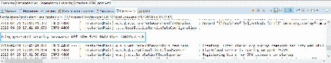
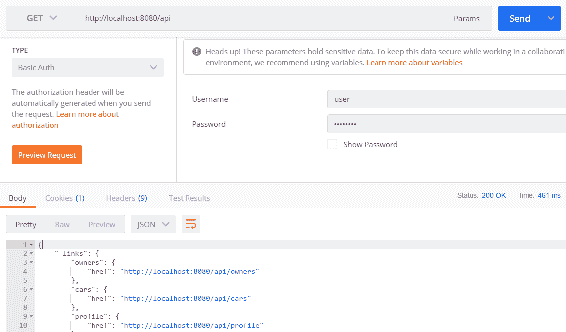
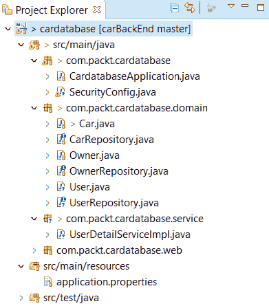
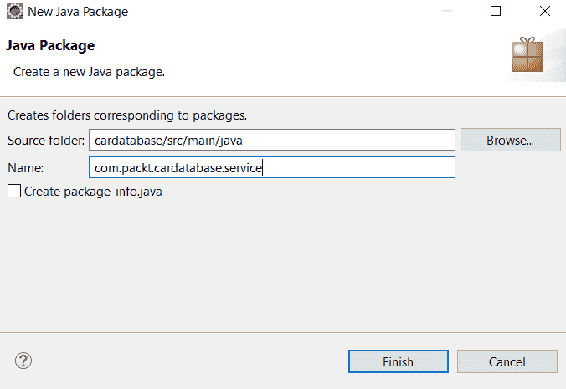
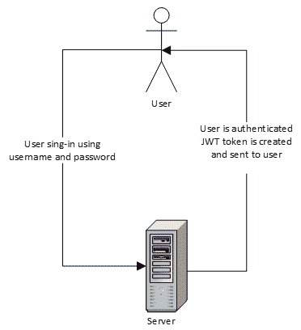
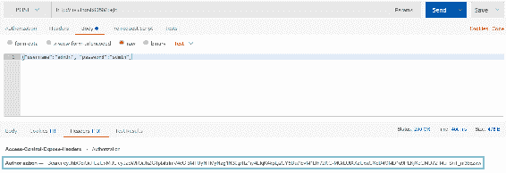
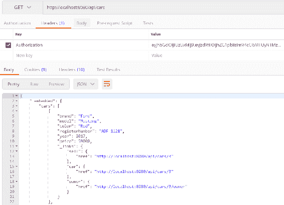

# 四、保护和测试您的后端

本章介绍如何保护和测试 Spring Boot 后端。我们将使用上一章中创建的数据库应用作为起点。

在本章中，我们将研究以下内容：

*   如何使用 Spring Boot 保护 Spring Boot 后端
*   如何使用 JWT 保护 Spring Boot 后端
*   如何测试后端

# 技术要求

在前几章中创建的 Spring 引导应用是必需的。

# 春季安全

春季安全（[https://spring.io/projects/spring-security](https://spring.io/projects/spring-security) 为基于 Java 的 web 应用提供安全服务。Spring 安全项目始于 2003 年，之前被命名为*Spring 的 Acegi 安全系统*。

默认情况下，Spring Security 启用以下功能：

*   具有内存中单个用户的`AuthenticationManager`bean。用户名为`user`，密码打印到控制台输出。
*   已忽略常见静态资源位置的路径，如`/css`、`/images`等。
*   所有其他端点的 HTTP 基本安全性。
*   安全事件发布至 Spring`ApplicationEventPublisher`。
*   默认情况下，公共低级功能处于启用状态（HST、XSS、CSRF 等）。

通过将以下依赖项添加到`pom.xml`文件，您可以在应用中包括 Spring Security：

```java
 <dependency>
   <groupId>org.springframework.boot</groupId>
   <artifactId>spring-boot-starter-security</artifactId>
 </dependency>
```

当您启动应用时，您可以从控制台看到 Spring Security 已经创建了一个具有用户名`user`的内存中用户。可以在控制台输出中看到用户密码：



如果您向 API 端点发出`GET`请求，您将看到它现在是安全的，并且您将得到一个`401 Unauthorized`错误：


为了能够发出成功的`GET`请求，我们必须使用基本身份验证。下面的屏幕截图显示了如何与邮递员一起完成。现在，通过身份验证，我们可以看到状态为 200 OK，并发送响应：



为了配置 Spring 安全性的行为方式，我们必须添加一个新的配置类来扩展`WebSecurityConfigurerAdapter`。在应用根包中创建一个名为`SecurityConfig`的新类。以下源代码显示了安全配置类的结构。`@Configration`和`@EnableWebSecurity`注释关闭默认的 web 安全配置，我们可以在此类中定义自己的配置。在`configure(HttpSecurity http)`方法中，我们可以定义应用中哪些端点是安全的，哪些不是。实际上我们还不需要这种方法，因为我们可以在所有端点都安全的情况下使用默认设置：

```java
package com.packt.cardatabase;

import org.springframework.context.annotation.Configuration;
import org.springframework.security.config.annotation.web.builders.HttpSecurity;
import org.springframework.security.config.annotation.web.configuration.EnableWebSecurity;
import org.springframework.security.config.annotation.web.configuration.WebSecurityConfigurerAdapter;

@Configuration
@EnableWebSecurity
public class SecurityConfig extends WebSecurityConfigurerAdapter {

  @Override
  protected void configure(HttpSecurity http) throws Exception {

  }

}
```

我们还可以通过在`SecurityConfig`类中添加`userDetailsService()`方法，将内存中的用户添加到我们的应用中。下面是该方法的源代码，它将创建一个内存用户，用户名为`user`，密码为`password`：

```java
  @Bean
  @Override
  public UserDetailsService userDetailsService() {
      UserDetails user =
           User.withDefaultPasswordEncoder()
              .username("user")
              .password("password")
              .roles("USER")
              .build();

      return new InMemoryUserDetailsManager(user);
  } 
```

在开发阶段，内存用户的使用情况良好，但实际应用应该将用户保存在数据库中。要将用户保存到数据库，必须创建用户实体类和存储库。密码不应以纯文本格式保存到数据库。springsecurity 提供了多种散列算法，比如 BCrypt，可以用来散列密码。以下步骤说明了如何实现该功能：

1.  在`domain`包中创建一个名为`User`的新类。激活`domain`包并右键单击鼠标。从菜单中选择新建|类，并为新类命名为`User`。之后，项目结构应如以下屏幕截图所示：



2.  用`@Entity`注释注释`User`类。添加类字段 ID、用户名、密码和角色。最后，添加构造函数、getter 和 setter。我们将使用`@Column`注释将所有字段设置为可空，并且用户名必须是唯一的。请参见以下字段和构造函数的`User.java`源代码：

```java
package com.packt.cardatabase.domain;

import javax.persistence.Column;
import javax.persistence.Entity;
import javax.persistence.GeneratedValue;
import javax.persistence.GenerationType;
import javax.persistence.Id;

@Entity
public class User {
    @Id
    @GeneratedValue(strategy = GenerationType.IDENTITY)
    @Column(nullable = false, updatable = false)
    private Long id;

    @Column(nullable = false, unique = true)
    private String username;

    @Column(nullable = false)
    private String password;

    @Column(nullable = false)
    private String role;

    public User() {
    }

  public User(String username, String password, String role) {
    super();
    this.username = username;
    this.password = password;
    this.role = role;
  }
```

以下是带有 getter 和 setter 的`User.java`源代码的其余部分：

```java
  public Long getId() {
    return id;
  }

  public void setId(Long id) {
    this.id = id;
  }

  public String getUsername() {
    return username;
  }

  public void setUsername(String username) {
    this.username = username;
  }

  public String getPassword() {
    return password;
  }

  public void setPassword(String password) {
    this.password = password;
  }

  public String getRole() {
    return role;
  }

  public void setRole(String role) {
    this.role = role;
  }
}
```

3.  在`domain`包中创建一个名为`UserRepository`的新类。激活`domain`包并右键单击鼠标。从菜单中选择新建|类，并为新类命名为`UserRepository`
4.  repository 类的源代码与我们在上一章中所做的类似，但是有一个查询方法，`findByUsername`，我们在接下来的步骤中需要它。参见以下`UserRepository`源代码：

```java
package com.packt.cardatabase.domain;

import org.springframework.data.repository.CrudRepository;
import org.springframework.stereotype.Repository;

@Repository
public interface UserRepository extends CrudRepository<User, Long> { 
    User findByUsername(String username);
}
```

5.  接下来，我们创建一个类来实现 Spring Security 提供的`UserDetailsService`接口。Spring Security 将其用于用户身份验证和授权。在根包中创建一个名为`service`的新包。激活根包并右键单击鼠标。从菜单中选择 New | Package，并为新软件包命名为`service`：



6.  在我们刚刚创建的`service`包中创建一个名为`UserDetailServiceImpl`的新类。现在，您的项目结构应该如下所示：


7.  我们必须将`UserRepository`类注入`UserDetailServiceImpl`类，因为当 Spring Security 处理身份验证时，需要将`UserRepository`类注入`UserDetailServiceImpl`类才能从数据库中获取用户。`loadByUsername`方法返回身份验证所需的`UserDetails`对象。以下是`UserDetailServiceImpl.java`的源代码：

```java
package com.packt.cardatabase.service;

import org.springframework.beans.factory.annotation.Autowired;
import org.springframework.security.core.authority.AuthorityUtils;
import org.springframework.security.core.userdetails.UserDetails;
import org.springframework.security.core.userdetails.UserDetailsService;
import org.springframework.security.core.userdetails.UsernameNotFoundException;
import org.springframework.stereotype.Service;

import com.packt.cardatabase.domain.User;
import com.packt.cardatabase.domain.UserRepository;

@Service
public class UserDetailServiceImpl implements UserDetailsService {
  @Autowired
  private UserRepository repository;

    @Override
    public UserDetails loadUserByUsername(String username) throws UsernameNotFoundException
    { 
      User currentUser = repository.findByUsername(username);
        UserDetails user = new org.springframework.security.core
            .userdetails.User(username, currentUser.getPassword()
            , true, true, true, true, 
            AuthorityUtils.createAuthorityList(currentUser.getRole()));
        return user;
    }

}
```

8.  在我们的安全配置类中，我们必须定义 Spring 安全性应该使用数据库中的用户，而不是内存中的用户。从`SecurityConfig`类中删除`userDetailsService()`方法以禁用内存中的用户。添加一个新的`configureGlobal`方法来启用数据库中的用户。我们不应该将密码以明文形式保存到数据库中。因此，我们将在`configureGlobal`方法中定义密码哈希算法。在本例中，我们使用的是 BCrypt 算法。这可以通过 Spring Security`BCryptPasswordEncoder`类轻松实现。以下是`SecurityConfig.java`源代码。现在，在将密码保存到数据库之前，必须使用 BCrypt 对密码进行散列：

```java
package com.packt.cardatabase;

import org.springframework.beans.factory.annotation.Autowired;
import org.springframework.context.annotation.Configuration;
import org.springframework.security.config.annotation.authentication.builders.AuthenticationManagerBuilder;
import org.springframework.security.config.annotation.web.builders.HttpSecurity;
import org.springframework.security.config.annotation.web.configuration.EnableWebSecurity;
import org.springframework.security.config.annotation.web.configuration.WebSecurityConfigurerAdapter;
import org.springframework.security.crypto.bcrypt.BCryptPasswordEncoder;

import com.packt.cardatabase.service.UserDetailServiceImpl;

@Configuration
@EnableWebSecurity
public class SecurityConfig extends WebSecurityConfigurerAdapter {
  @Autowired
  private UserDetailServiceImpl userDetailsService; 

  @Autowired
  public void configureGlobal(AuthenticationManagerBuilder auth) throws Exception {
    auth.userDetailsService(userDetailsService)
    .passwordEncoder(new BCryptPasswordEncoder());
  }
}
```

9.  最后，我们可以将几个测试用户保存到我们的`CommandLineRunner`中的数据库中。打开`CardatabaseApplication.java`文件，在类的开头添加以下代码，将`UserRepository`注入到主类中：

```java
@Autowired 
private UserRepository urepository;
```

10.  使用哈希密码将用户保存到数据库。您可以使用 internet 上的任何 BCrypt 计算器：

```java
  @Bean
  CommandLineRunner runner() {
    return args -> {
      Owner owner1 = new Owner("John" , "Johnson");
      Owner owner2 = new Owner("Mary" , "Robinson");
      orepository.save(owner1);
      orepository.save(owner2);

      repository.save(new Car("Ford", "Mustang", "Red", "ADF-1121", 
        2017, 59000, owner1));
      repository.save(new Car("Nissan", "Leaf", "White", "SSJ-3002", 
        2014, 29000, owner2));
      repository.save(new Car("Toyota", "Prius", "Silver", "KKO-0212", 
        2018, 39000, owner2));

```

```java
 // username: user password: user
 urepository.save(new User("user",
      "$2a$04$1.YhMIgNX/8TkCKGFUONWO1waedKhQ5KrnB30fl0Q01QKqmzLf.Zi",
      "USER"));
 // username: admin password: admin
 urepository.save(new User("admin",
      "$2a$04$KNLUwOWHVQZVpXyMBNc7JOzbLiBjb9Tk9bP7KNcPI12ICuvzXQQKG", 
      "ADMIN"));
 };
  } 
```

运行应用后，您会看到数据库中现在有一个`user`表，保存了两条用户记录：


现在，如果您尝试在没有身份验证的情况下向`/api`端点发送`GET`请求，您将得到一个`401 Unauthorized`错误。您应该通过身份验证才能发送成功的请求。与前面的示例不同的是，我们使用数据库中的用户进行身份验证

您可以在以下屏幕截图中看到使用`admin`用户向`/api`端点发出的`GET`请求：


# 使用 JWT 保护后端

在上一节中，我们介绍了如何使用 RESTfulWeb 服务的基本身份验证。当我们要用 React 开发自己的前端时，这是不可用的。我们将在应用中使用**JSON Web 令牌**（**JWT**）身份验证。JWT 是在现代 web 应用中实现身份验证的一种紧凑方式。JWT 的大小非常小，因此可以在 URL、`POST`参数或标头中发送。它还包含有关用户的所有必需信息。

JSON web 令牌包含三个由点分隔的不同部分。第一部分是定义令牌类型和哈希算法的头。第二部分是有效载荷，在认证的情况下，它通常包含关于用户的信息。第三部分是签名，用于验证令牌在使用过程中没有被更改。您可以看到 JWT 令牌的以下示例：

```java
eyJhbGciOiJIUzI1NiJ9.
eyJzdWIiOiJKb2UifD.
ipevRNuRP6HflG8cFKnmUPtypruRC4fc1DWtoLL62SY
```

下图显示了 JWT 身份验证过程的主要思想：



成功身份验证后，用户发送的请求应始终包含身份验证中接收到的 JWT 令牌。

我们将使用 Java JWT 库（[https://github.com/jwtk/jjwt](https://github.com/jwtk/jjwt) ），这是 Java 和 Android 的 JSON Web 令牌库；因此，我们必须在`pom.xml`文件中添加以下依赖项。JWT 库用于创建和解析 JWT 令牌：

```java
<dependency>
  <groupId>io.jsonwebtoken</groupId>
  <artifactId>jjwt</artifactId>
  <version>0.9.0</version>
</dependency>
```

以下步骤显示了如何在后端启用 JWT 身份验证：

1.  在`service`包中创建一个名为`AuthenticationService`的新类。在课程开始时，我们将定义几个常量；`EXPIRATIONTIME`定义令牌的到期时间，以毫秒为单位。`SIGNINGKEY`是一个特定于算法的签名密钥，用于对 JWT 进行数字签名。您应该使用 base64 编码的字符串。前缀定义令牌的前缀，通常使用承载模式。`addToken`方法创建令牌并将其添加到请求的`Authorization`头中。签名密钥使用 SHA-512 算法进行编码。该方法还使用`Authorization`值将`Access-Control-Expose-Headers`添加到标题中。这是必需的，因为默认情况下，我们无法通过 JavaScript 前端访问`Authorization`头。`getAuthentication`方法使用`jjwt`库提供的`parser()`方法从响应`Authorization`头中获取令牌。整个`AuthenticationService`源代码可以在这里看到：

```java
package com.packt.cardatabase.service;

import io.jsonwebtoken.Jwts;
import io.jsonwebtoken.SignatureAlgorithm;
import org.springframework.security.authentication.UsernamePasswordAuthenticationToken;
import org.springframework.security.core.Authentication;

import javax.servlet.http.HttpServletRequest;
import javax.servlet.http.HttpServletResponse;
import java.util.Date;

import static java.util.Collections.emptyList;

public class AuthenticationService {
  static final long EXPIRATIONTIME = 864_000_00; // 1 day in milliseconds
  static final String SIGNINGKEY = "SecretKey";
  static final String PREFIX = "Bearer";

  // Add token to Authorization header
  static public void addToken(HttpServletResponse res, String username) {
    String JwtToken = Jwts.builder().setSubject(username)
        .setExpiration(new Date(System.currentTimeMillis() 
            + EXPIRATIONTIME))
        .signWith(SignatureAlgorithm.HS512, SIGNINGKEY)
        .compact();
    res.addHeader("Authorization", PREFIX + " " + JwtToken);
  res.addHeader("Access-Control-Expose-Headers", "Authorization");
  }

  // Get token from Authorization header
  static public Authentication getAuthentication(HttpServletRequest request) {
    String token = request.getHeader("Authorization");
    if (token != null) {
      String user = Jwts.parser()
          .setSigningKey(SIGNINGKEY)
          .parseClaimsJws(token.replace(PREFIX, ""))
          .getBody()
          .getSubject();

      if (user != null) 
        return new UsernamePasswordAuthenticationToken(user, null,
            emptyList());
    }
    return null;
  }
}
```

2.  接下来，我们将添加一个新的简单 POJO 类，以保留用于身份验证的凭据。在`domain`包中创建一个名为`AccountCredentials`的新类。该类有两个字段-`username`和`password`。下面是该类的源代码。此类没有`@Entity`注释，因为我们不必将凭据保存到数据库：

```java
package com.packt.cardatabase.domain;

public class AccountCredentials {
  private String username;
  private String password;

  public String getUsername() {
    return username;
  }
  public void setUsername(String username) {
    this.username = username;
  }
  public String getPassword() {
    return password;
  }
  public void setPassword(String password) {
    this.password = password;
  } 
}
```

3.  我们将使用过滤器类进行登录和身份验证。在根包中创建一个名为`LoginFilter`的新类，该类处理对`/login`端点的`POST`请求。`LoginFilter`类扩展了 Spring 安全性`AbstractAuthenticationProcessingFilter`，需要设置`authenticationManager`属性。通过`attemptAuthentication`方法进行认证。如果认证成功，则执行`succesfulAuthentication`方法。此方法将调用我们服务类中的`addToken`方法，令牌将添加到`Authorization`头中：

```java
package com.packt.cardatabase;

import java.io.IOException;
import java.util.Collections;

import javax.servlet.FilterChain;
import javax.servlet.ServletException;
import javax.servlet.http.HttpServletRequest;
import javax.servlet.http.HttpServletResponse;

import org.springframework.security.authentication.AuthenticationManager;
import org.springframework.security.authentication.UsernamePasswordAuthenticationToken;
import org.springframework.security.core.Authentication;
import org.springframework.security.core.AuthenticationException;
import org.springframework.security.web.authentication.AbstractAuthenticationProcessingFilter;
import org.springframework.security.web.util.matcher.AntPathRequestMatcher;

import com.fasterxml.jackson.databind.ObjectMapper;
import com.packt.cardatabase.domain.AccountCredentials;
import com.packt.cardatabase.service.AuthenticationService;

public class LoginFilter extends AbstractAuthenticationProcessingFilter {

  public LoginFilter(String url, AuthenticationManager authManager) {
    super(new AntPathRequestMatcher(url));
    setAuthenticationManager(authManager);
  }

  @Override
  public Authentication attemptAuthentication(
  HttpServletRequest req, HttpServletResponse res)
      throws AuthenticationException, IOException, ServletException {
  AccountCredentials creds = new ObjectMapper()
        .readValue(req.getInputStream(), AccountCredentials.class);
  return getAuthenticationManager().authenticate(
        new UsernamePasswordAuthenticationToken(
            creds.getUsername(),
            creds.getPassword(),
            Collections.emptyList()
        )
    );
  }

  @Override
  protected void successfulAuthentication(
      HttpServletRequest req,
      HttpServletResponse res, FilterChain chain,
      Authentication auth) throws IOException, ServletException {
    AuthenticationService.addToken(res, auth.getName());
  }
}
```

4.  在根包中创建一个名为`AuthenticationFilter`的新类。该类扩展了`GenericFilterBean`，它是任何类型过滤器的通用超类。此类将处理除`/login`之外的所有其他端点中的身份验证。`AuthenticationFilter`使用我们服务类中的`addAuthentication`方法从请求`Authorization`头中获取令牌：

```java
package com.packt.cardatabase;

import java.io.IOException;

import javax.servlet.FilterChain;
import javax.servlet.ServletException;
import javax.servlet.ServletRequest;
import javax.servlet.ServletResponse;
import javax.servlet.http.HttpServletRequest;

import org.springframework.security.core.Authentication;
import org.springframework.security.core.context.SecurityContextHolder;
import org.springframework.web.filter.GenericFilterBean;

import com.packt.cardatabase.service.AuthenticationService;

public class AuthenticationFilter extends GenericFilterBean {
  @Override
  public void doFilter(ServletRequest request, ServletResponse response, FilterChain filterChain) throws IOException, ServletException {
    Authentication authentication = AuthenticationService.getAuthentication((HttpServletRequest)request);

    SecurityContextHolder.getContext().
        setAuthentication(authentication);
    filterChain.doFilter(request, response);
  }
}
```

5.  最后，我们必须更改`SecurityConfig`类的`configure`方法。在这里，我们定义了对`/login`端点的`POST`方法请求在没有身份验证的情况下是允许的，而对所有其他端点的请求都需要身份验证。我们还使用`addFilterBefore`方法定义`/login`和其他端点中使用的过滤器：

```java
  //SecurityConfig.java  
  @Override
    protected void configure(HttpSecurity http) throws Exception {
     http.cors().and().authorizeRequests()
      .antMatchers(HttpMethod.POST, "/login").permitAll()
          .anyRequest().authenticated()
          .and()
          // Filter for the api/login requests
          .addFilterBefore(new LoginFilter("/login",
           authenticationManager()),
                  UsernamePasswordAuthenticationFilter.class)
          // Filter for other requests to check JWT in header
          .addFilterBefore(new AuthenticationFilter(),
                  UsernamePasswordAuthenticationFilter.class);
    }
```

6.  我们还将在我们的安全配置类中添加一个**CORS**（**跨源资源共享**过滤器。前端需要这样做，即从另一个来源发送请求。CORS 过滤器拦截请求，如果这些请求被标识为跨源请求，它会向请求添加适当的头。为此，我们将使用 SpringSecurity 的`CorsConfigurationSource`接口。在本例中，我们将允许所有 HTTP 方法和头。如果需要更精细的分级定义，可以在此处定义允许的源、方法和头的列表。将以下源添加到您的`SecurityConfig`类中以启用 CORS 筛选器：

```java
  // SecurityConfig.java  
  @Bean
    CorsConfigurationSource corsConfigurationSource() {
        UrlBasedCorsConfigurationSource source = 
            new UrlBasedCorsConfigurationSource();
        CorsConfiguration config = new CorsConfiguration();
        config.setAllowedOrigins(Arrays.asList("*"));
        config.setAllowedMethods(Arrays.asList("*"));
        config.setAllowedHeaders(Arrays.asList("*"));
        config.setAllowCredentials(true);
        config.applyPermitDefaultValues();

        source.registerCorsConfiguration("/**", config);
        return source;
  } 

```

现在，在您运行应用后，我们可以使用`POST`方法调用`/login`端点，如果成功登录，我们将在`Authorization`头中收到 JWT 令牌：



成功登录后，我们可以通过在`Authorization`头中发送从登录接收到的 JWT 令牌来调用其他 RESTful 服务端点。请参见以下屏幕截图中的示例：



现在，我们的后端已经实现了所有需要的功能。接下来，我们将继续后端单元测试。

# 弹簧靴测试

当我们创建项目时，Spring Initializer 将 Spring Boot test starter 包添加到了`pom.xml`。在 Spring Initializer 页面中自动添加，无需任何选择：

```java
    <dependency>
      <groupId>org.springframework.boot</groupId>
      <artifactId>spring-boot-starter-test</artifactId>
      <scope>test</scope>
    </dependency>
```

SpringBootTestStarter 提供了许多方便的测试库，如 JUnit、Mockito、AssertJ 等等。如果查看，您的项目结构已经为测试类创建了自己的包：


默认情况下，Spring Boot 使用内存中的数据库进行测试。我们现在使用的是 MariaDB，但是 H2 也可以通过向`pom.xml`文件添加以下依赖项来用于测试。范围定义 H2 数据库仅用于运行测试；否则，应用将使用 MariaDB 数据库：

```java
    <dependency>
        <groupId>com.h2database</groupId>
        <artifactId>h2</artifactId>
        <scope>test</scope>
    </dependency> 
```

如果还想使用默认数据库进行测试，可以使用`@AutoConfigureTestDatabase`注释。

# 创建单元测试

对于单元测试，我们使用 JUnit，它是一个流行的基于 Java 的单元测试库。下面的源代码显示了 Spring 引导测试类的示例框架。`@SpringBootTest`注释指定该类是运行基于 Spring 引导的测试的常规测试类。方法之前的`@Test`注释向 JUnit 定义该方法可以作为测试用例运行。`@RunWith(SpringRunner.class)`注释提供 Spring`ApplicationContext`并将 bean 注入到您的测试实例中：

```java
@RunWith(SpringRunner.class)
@SpringBootTest
public class MyTestsClass {

  @Test
  public void testMethod() {
    ...
  }

}
```

首先，我们将创建第一个测试用例，它将在创建任何正式测试用例之前测试应用的主要功能。打开已经为您的应用制作的`CardatabaseApplicationTest`测试类。有一种称为`contextLoads`的测试方法，我们将在其中添加测试。以下测试检查控制器实例是否已成功创建和注入：

```java
package com.packt.cardatabase;

import static org.assertj.core.api.Assertions.assertThat;

import org.junit.Test;
import org.junit.runner.RunWith;
import org.springframework.beans.factory.annotation.Autowired;
import org.springframework.boot.test.context.SpringBootTest;
import org.springframework.test.context.junit4.SpringRunner;

import com.packt.cardatabase.web.CarController;

@RunWith(SpringRunner.class)
@SpringBootTest
public class CardatabaseApplicationTests {
  @Autowired
  private CarController controller;

  @Test
  public void contextLoads() {
    assertThat(controller).isNotNull();
  }

}
```

要在 Eclipse 中运行测试，请在 Project Explorer 中激活测试类并右键单击鼠标。从菜单中选择 Run As | JUnit test。您现在应该看到 Eclipse 工作台下部的 JUnit 选项卡。测试结果显示在此选项卡中，测试用例已通过：


接下来，我们将为我们的汽车存储库创建单元测试，以测试 CRUD 操作。在根测试包中创建一个名为`CarRepositoryTest`的新类。如果测试只关注 JPA 组件，`@DataJpaTest`可以代替`@SpringBootTest`注释。使用此注释时，H2 数据库、Hibernate 和 Spring 数据会自动配置以进行测试。SQL 日志记录也将打开。默认情况下，测试是事务性的，并在测试用例结束时回滚。`TestEntityManager`用于处理持久化实体，设计用于测试。您可以在下面看到 JPA 测试类框架的源代码：

```java
package com.packt.cardatabase;

import static org.assertj.core.api.Assertions.assertThat;

import org.junit.Test;
import org.junit.runner.RunWith;
import org.springframework.beans.factory.annotation.Autowired;
import org.springframework.boot.test.autoconfigure.orm.jpa.DataJpaTest;
import org.springframework.boot.test.autoconfigure.orm.jpa.TestEntityManager;
import org.springframework.test.context.junit4.SpringRunner;

import com.packt.cardatabase.domain.Car;
import com.packt.cardatabase.domain.CarRepository;

@RunWith(SpringRunner.class)
@DataJpaTest
public class CarRepositoryTest {
  @Autowired
  private TestEntityManager entityManager;

  @Autowired
  private CarRepository repository;

   // Test cases..
}
```

我们将添加第一个测试用例，以测试向数据库中添加新车的情况。创建一个新的`car`对象，并使用`TestEntityManager`提供的`persistAndFlush`方法保存到数据库中。然后，我们检查如果成功保存，汽车 ID 不能为空。下面的源代码显示了测试用例方法。将以下方法代码添加到您的`CarRepositoryTest`类中：

```java
  @Test
  public void saveCar() {
    Car car = new Car("Tesla", "Model X", "White", "ABC-1234",
        2017, 86000);
    entityManager.persistAndFlush(car);

    assertThat(car.getId()).isNotNull();
  }
```

第二个测试用例将测试从数据库中删除汽车。创建一个新的`car`对象并保存到数据库中。然后，从数据库中删除所有车辆，最后，`findAll()`查询方法应该返回一个空列表。下面的源代码显示了测试用例方法。将以下方法代码添加到您的`CarRepositoryTest`类中：

```java
  @Test
  public void deleteCars() {
    entityManager.persistAndFlush(new Car("Tesla", "Model X", "White",
        "ABC-1234", 2017, 86000));
    entityManager.persistAndFlush(new Car("Mini", "Cooper", "Yellow",
        "BWS-3007", 2015, 24500));

    repository.deleteAll();
    assertThat(repository.findAll()).isEmpty();
  } 
```

运行测试用例并在 Eclipse JUnit 选项卡上检查测试是否通过：


接下来，我们将展示如何测试 RESTfulWeb 服务 JWT 身份验证功能。为了测试暴露的控制器或任何端点，我们可以使用`MockMvc`。通过使用`MockMvc`服务器不启动，而是在 Spring 处理 HTTP 请求的层进行测试，因此模拟真实情况。`MockMvc`提供了发送请求的`perform`方法。为了测试身份验证，我们必须向请求主体添加凭据。我们执行两个请求；第一个具有正确的凭据，我们检查状态是否正常。第二个请求包含不正确的凭据，我们检查是否出现 4XX HTTP 错误：

```java
package com.packt.cardatabase;

import static org.springframework.test.web.servlet.request.MockMvcRequestBuilders.post;
import static org.springframework.test.web.servlet.result.MockMvcResultHandlers.print;
import static org.springframework.test.web.servlet.result.MockMvcResultMatchers.status;

import org.junit.Test;
import org.junit.runner.RunWith;
import org.springframework.beans.factory.annotation.Autowired;
import org.springframework.boot.test.autoconfigure.web.servlet.AutoConfigureMockMvc;
import org.springframework.boot.test.context.SpringBootTest;

import org.springframework.test.context.junit4.SpringRunner;
import org.springframework.test.web.servlet.MockMvc;

@RunWith(SpringRunner.class)
@SpringBootTest
@AutoConfigureMockMvc
public class CarRestTest {
  @Autowired
    private MockMvc mockMvc;

  @Test
  public void testAuthentication() throws Exception {
    // Testing authentication with correct credentials
        this.mockMvc.perform(post("/login")
          .content("{\"username\":\"admin\", \"password\":\"admin\"}")).
          andDo(print()).andExpect(status().isOk());

    // Testing authentication with wrong credentials
        this.mockMvc.perform(post("/login")
          .content("{\"username\":\"admin\", \"password\":\"wrongpwd\"}")).
          andDo(print()).andExpect(status().is4xxClientError());

  }

}
```

现在，当我们运行身份验证测试时，我们可以看到测试通过了：


现在，我们已经介绍了 Spring Boot 应用中测试的基础知识，您应该具备为应用实现更多测试用例所需的知识。

# 总结

在本章中，我们重点关注保护和测试 Spring 引导后端。安全保护首先由 Spring Security 完成。前端将在接下来的章节中与 React 一起开发；因此，我们实现了 JWT 身份验证，这是一种适合我们需要的轻量级身份验证方法。我们还介绍了测试 Spring 引导应用的基础知识。我们使用 JUnit 进行单元测试，并实现了 JPA 和 RESTfulWeb 服务认证的测试用例。在下一章中，我们将为前端开发设置环境和工具。

# 问题

1.  什么是春季安全？
2.  如何使用 Spring Boot 保护后端？
3.  什么是 JWT？
4.  如何使用 JWT 保护后端？
5.  如何使用 Spring Boot 创建单元测试？
6.  如何运行和检查单元测试的结果？

# 进一步阅读

Packt 还有其他很好的资源来学习 Spring 安全性和测试：

*   [https://www.packtpub.com/application-development/spring-security-third-edition](https://www.packtpub.com/application-development/spring-security-third-edition)
*   [https://www.packtpub.com/web-development/mastering-software-testing-junit-5](https://www.packtpub.com/web-development/mastering-software-testing-junit-5)