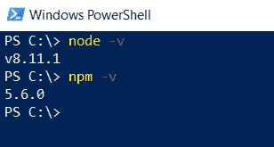
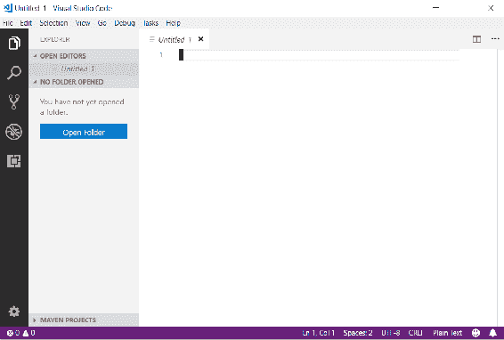
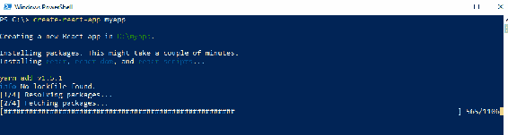
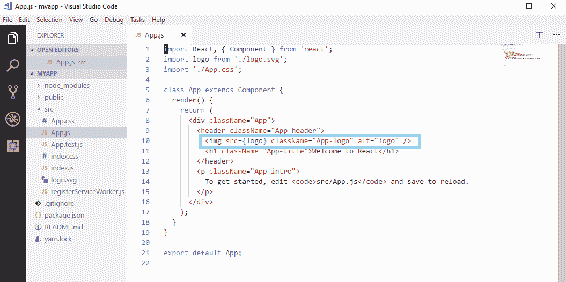
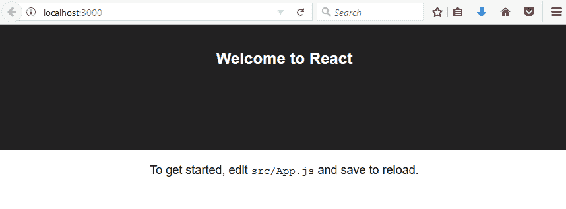

# 五、配置环境和工具——前端

本章介绍 React 所需的开发环境和工具。需要本章才能开始前端开发。我们将使用 Facebook 制作的 CreateReact 应用初学者工具包创建一个简单的初学者 React 应用。

在本章中，我们将研究以下内容：

*   安装 Node.js 和 VS 代码
*   使用`create-react-app`创建 React.js 应用
*   运行 React.js 应用
*   安装 React 开发工具

# 技术要求

在这本书中，我们使用的是 Windows 操作系统，但所有工具都可以用于 Linux 和 macOS。

# 安装 Node.js

js 是一个开源的基于 JavaScript 的服务器端环境。Node.js 可用于多种操作系统，如 Windows、macOS 和 Linux。开发 React 应用需要 Node.js。

Node.js 安装包可在[找到 https://nodejs.org/en/download/](https://nodejs.org/en/download/) 。为您的操作系统下载最新的**长期支持**（**LTS**版本）。在本书中，我们使用的是 Windows 10 操作系统，您可以获得 Node.js MSI 安装程序，这使得安装非常简单。当您执行安装程序时，您将通过安装向导，您可以使用默认设置进行安装：


安装完成后，我们可以检查一切是否正常。打开 PowerShell 或您正在使用的任何终端，然后键入以下命令：

```java
node -v
```

```
npm -v
```

命令应显示已安装的版本 Node.js 和 npm：



npm 随 Node.js 安装而来，是 JavaScript 的包管理器。在接下来的章节中，当我们将不同的节点模块安装到 React 应用时，我们将大量使用这些功能。还有另一个包管理器叫纱线，你也可以使用。

# 安装 VS 代码

**Visual Studio 代码**（**VS 代码**）是一个针对多种编程语言的开源代码编辑器。VS 代码是由 Microsoft 开发的。有很多不同的代码编辑器可用，如 Atom、方括号和其他，如果您熟悉 VS 代码，可以使用 VS 代码以外的其他代码。VS 代码适用于 Windows、macOS 和 Linux，您可以从[下载 https://code.visualstudio.com/](https://code.visualstudio.com/) 。

Windows 的安装使用 MSI 安装程序完成，您可以使用默认设置进行安装。下面的屏幕截图显示了 VS 代码的工作台。左侧是活动栏，可用于在不同视图之间导航。活动栏旁边是一个侧栏，其中包含不同的视图，例如项目文件资源管理器。

编辑器占用了工作台的其余部分：



VS Code 还有一个集成终端，您可以使用它创建和运行 React 应用。终端可在视图|集成终端菜单中找到。当我们创建更多 React 应用时，您也可以在后面的章节中使用此功能。

有许多扩展可用于不同的语言和框架。如果从活动栏打开扩展管理器，则可以搜索不同的扩展。React 开发的一个非常方便的扩展是 Reactjs 代码段，我们建议安装它。它有多个代码片段可用于 React.js 应用，这使您的开发过程更快。稍后我们将向您展示如何使用该扩展。这只是许多有用的扩展中的一个，您应该探索更多可能使您的生活更轻松的扩展。例如，ESLint 扩展可帮助您快速查找打字错误和语法错误，并简化源代码的格式设置：


# 创建和运行 React 应用

当我们安装了 Node.js 和代码编辑器后，我们就可以创建第一个 React.js 应用了。我们正在使用 Facebook 的`create-react-app`（[https://github.com/facebook/create-react-app](https://github.com/facebook/create-react-app) ）谢谢。以下是制作第一个应用的步骤：

1.  打开 PowerShell 或命令行工具并键入以下命令。该命令安装`create-react-app`启动器，我们将使用它开发 React 应用。命令中的参数`-g`表示安装是全局完成的。

如果您使用的是 npm 版本 5.2 或更高版本，您也可以使用`npx`而不是`npm`：

```
npm install -g create-react-app
```

2.  安装完成后，我们通过键入以下命令创建第一个应用：

```
create-react-app myapp
```



3.  创建应用后，将其移动到您的`app`文件夹中：

```
cd myapp
```

4.  然后，我们可以使用以下命令运行应用。该命令在端口`3000`中运行应用，并在浏览器中打开应用：

```
npm start
```

5.  现在，您的应用正在运行，您应该可以在浏览器中看到以下页面。**`npm start`**命令在开发模式下启动应用：


在 PowerShell 中按*Ctrl*+*C*可以停止开发服务器。

要构建用于生产的应用的缩小版本，您可以使用`npm run build`命令，该命令在`build`文件夹中构建您的应用。

# 修改 React 应用

选择文件|打开文件夹，用 VS 代码打开 React 应用文件夹。您应该在文件资源管理器中看到应用结构。此阶段最重要的文件夹是`src`文件夹，其中包含 JavaScript 源代码：


在代码编辑器的`src`文件夹中打开`App.js`文件。删除显示图像的行并保存文件。您还不需要了解有关此文件的更多信息。我们将在下一章对此主题进行深入探讨：



现在，如果您查看浏览器，您会立即看到图像已从页面中消失：



要调试 React 应用，我们还应该安装 React 开发者工具，这些工具可用于 Chrome 或 Firefox 浏览器。可以从 Chrome 网络商店（[安装 Chrome 插件 https://chrome.google.com/webstore/category/extensions 来自 Firefox 插件网站（](https://chrome.google.com/webstore/category/extensions)[的](https://addons.mozilla.org/)和 Firefox 插件 https://addons.mozilla.org ）。安装 React 开发者工具后，在导航到 React 应用后，您应该会在浏览器的开发者工具中看到一个新的 React 选项卡。以下屏幕截图显示了 Chrome 浏览器中的开发者工具：


# 总结

在本章中，我们安装了使用 React.js 开始前端开发所需的一切。首先，我们安装了 Node.js 和 VS 代码编辑器。然后我们使用`create-react-app`初学者工具包创建了第一个 React.js 应用。最后，我们运行了这个应用并演示了如何修改它。这只是对应用结构和修改的概述，我们将在以下章节中继续介绍。

# 问题

1.  什么是 Node.js 和 npm？
2.  如何安装 Node.js？
3.  什么是 VS 代码？
4.  如何安装 VS 代码？
5.  如何使用`create-react-app`创建 React.js 应用？
6.  如何运行 React.js 应用？
7.  如何对应用进行基本修改？

# 进一步阅读

Packt 还有其他学习 React 的好资源：

*   [https://www.packtpub.com/web-development/getting-started-react](https://www.packtpub.com/web-development/getting-started-react)
*   [https://www.packtpub.com/web-development/react-16-tooling](https://www.packtpub.com/web-development/react-16-tooling)