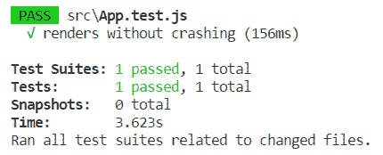
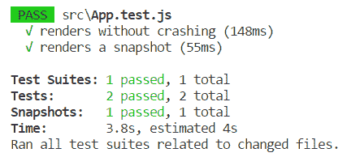

# 测试你的前端

本章介绍测试 React 应用程序的基础知识。我们将概述如何使用 Jest，它是 Facebook 开发的 JavaScript 测试库。我们还将介绍由 Airbnb 开发的酶，它是 React 的测试工具。我们将研究如何创建新的测试套件和测试。我们还将介绍如何运行测试和发现测试结果。

在本章中，我们将了解以下内容：

*   笑话的基础
*   如何创建新的测试套件和测试
*   酶测试实用程序的基础知识
*   如何安装酶
*   如何使用酶创建测试

# 技术要求

需要我们在[第 4 章](04.html)*中创建的 Spring Boot 应用程序来保护和测试后端*（GitHub:[https://github.com/PacktPublishing/Hands-On-Full-Stack-Development-with-Spring-Boot-2.0-and-React/tree/master/Chapter%204](https://github.com/PacktPublishing/Hands-On-Full-Stack-Development-with-Spring-Boot-2.0-and-React/tree/master/Chapter%204) ）。

我们还需要上一章中使用的 React 应用程序（GitHub:[https://github.com/PacktPublishing/Hands-On-Full-Stack-Development-with-Spring-Boot-2.0-and-React/tree/master/Chapter%2011](https://github.com/PacktPublishing/Hands-On-Full-Stack-Development-with-Spring-Boot-2.0-and-React/tree/master/Chapter%2011) ）。

# 开玩笑

Jest 是一个 JavaScript 测试库，由 Facebook（[开发 https://facebook.github.io/jest/en/](https://facebook.github.io/jest/en/) ）。Jest 与 React 一起被广泛使用，它为测试提供了许多有用的特性。您可以创建快照测试，从中可以从 React 树中获取快照，并调查状态是如何变化的。Jest 还具有模拟功能，可用于测试异步 RESTAPI 调用等。Jest 还提供了测试用例中断言所需的函数。

我们将首先看到如何为一个基本 JavaScript 函数创建一个简单的测试用例，该函数执行一些简单的计算。以下函数获取两个数字作为参数，并返回这些数字的乘积：

```
// multi.js
export const calcMulti = (x, y) => {
    x * y;
}
```

下面的代码显示了前面函数的 Jest 测试。测试用例以运行测试用例的`test`方法开始。`test`方法有一个别名，称为`it`，我们将在后面的 React 示例中使用它。测试方法获取两个必需的参数：测试名称和包含测试的函数。`expect`用于测试数值。`toBe`是所谓的匹配器，用于检查函数的结果是否等于匹配器中的值。Jest 中有许多不同的匹配器，您可以从它们的文档中找到：

```
// multi.test.js
import {calcMulti} from './multi';

test('2 * 3 equals 6', () => {
  expect(calcMulti(2, 3)).toBe(6);
});
```

Jest 附带了`create-react-app`，因此我们不必进行任何安装或配置即可开始测试。建议为您的测试文件创建一个名为`_test_`的文件夹。测试文件应具有`.test.js`扩展名。如果您在 VS 代码文件资源管理器中查看您的 React 前端，您可以看到在`src`文件夹中，已经有一个自动创建的测试文件，它被称为`App.test.js`：


测试文件的源代码如下：

```
import React from 'react';
import ReactDOM from 'react-dom';
import App from './App';

it('renders without crashing', () => {
  const div = document.createElement('div');
  ReactDOM.render(<App />, div);
  ReactDOM.unmountComponentAtNode(div);
});
```

下面的测试文件将向 DOM 创建一个`div`元素，并将`App`组件装载到 DOM 中。最后，从`div`卸载组件。因此，它只是测试您的`App`组件是否可以呈现，测试运行程序是否正常工作。`it`是 Jest 中`test`函数的别名，第一个参数是测试的名称，第二个参数是执行和测试的函数。

您可以通过在终端中键入以下命令来运行测试：

```
npm test
```

或者，如果您正在使用纱线，请键入以下内容：

```
yarn test
```

执行测试后，一切正常，您将在终端中看到以下信息：



# 快照测试

快照测试是一个有用的工具，用于测试用户界面中是否没有不必要的更改。Jest 在执行快照测试时生成快照文件。下次执行测试时，会将新快照与上一个快照进行比较。如果文件内容之间有更改，测试用例将失败，并且终端中将显示一条错误消息。

要启动快照测试，请执行以下步骤：

1.  安装`react-test-render`包。`--save-dev`参数表示此依赖关系保存到`package.json`文件的`devDependencies`部分，仅用于开发目的。如果在安装阶段键入`npm install --production`命令，则不会安装`devDependencies`部分中的依赖项。因此，应使用`--save-dev`参数安装仅在开发阶段需要的所有依赖项：

```
npm install react-test-renderer --save-dev
```

2.  您的`package.json`文件应如下所示，并且新的`devDependecies`部分已添加到该文件中：

```
{
  "name": "carfront",
  "version": "0.1.0",
  "private": true,
  "dependencies": {
    "@material-ui/core": "^1.0.0",
    "@material-ui/icons": "^1.0.0",
    "material-ui": "^0.20.1",
    "react": "^16.3.2",
    "react-confirm-alert": "^2.0.2",
    "react-csv": "^1.0.14",
    "react-dom": "^16.3.2",
    "react-scripts": "1.1.4",
    "react-skylight": "^0.5.1",
    "react-table": "^6.8.2"
  },
  "scripts": {
    "start": "react-scripts start",
    "build": "react-scripts build",
    "test": "react-scripts test --env=jsdom",
    "eject": "react-scripts eject"
  },
  "devDependencies": {
    "react-test-renderer": "^16.3.2"
  }
}
```

3.  将`renderer`导入您的测试文件：

```
import renderer from 'react-test-renderer';
```

让我们在`App.test.js`文件中添加一个新的快照测试用例。测试用例将创建我们的`AddCar`组件的快照测试：

1.  将`AddCar`组件导入我们的测试文件：

```
import AddCar from './components/AddCar';
```

2.  在文件中已经存在的第一个测试用例之后添加以下测试代码。测试用例从我们的`App`组件中获取一个快照，然后比较快照是否与之前的快照不同：

```
it('renders a snapshot', () => {
  const tree = renderer.create(<AddCar/>).toJSON();
  expect(tree).toMatchSnapshot();
});
```

3.  通过在终端中键入以下命令，再次运行测试用例：

```
npm test
```

4.  现在您可以在终端中看到以下消息。测试套件告诉我们测试文件的数量，测试告诉我们测试用例的数量：



第一次执行测试时，会创建一个`_snapshots_`文件夹。此文件夹包含从测试用例生成的所有快照文件。现在，您可以看到生成了一个快照文件，如以下屏幕截图所示：


快照文件现在包含`AddCar`组件的反应树。您可以在此处从头看到快照文件的一部分：

```
// Jest Snapshot v1, https://goo.gl/fbAQLP

exports[`renders a snapshot 1`] = `
<div>
  <section
    className="skylight-wrapper "
  >
    <div
      className="skylight-overlay"
      onClick={[Function]}
      style={
        Object {
          "backgroundColor": "rgba(0,0,0,0.3)",
          "display": "none",
          "height": "100%",
          "left": "0px",
          "position": "fixed",
          "top": "0px",
          "transitionDuration": "200ms",
          "transitionProperty": "all",
          "transitionTimingFunction": "ease",
          "width": "100%",
          "zIndex": "99",
        }
      }
  />
...continue
```

# 使用酶

Ezyme 是一个 JavaScript 库，用于测试 React 组件的输出，由 Airbnb 开发。Ezyme 有一个非常好的用于 DOM 操作和遍历的 API。如果您使用过 jQuery，那么很容易理解酶 API 的思想。

要开始使用酶，请执行以下步骤：

1.  通过在终端中键入以下命令来安装它。这将安装 React 版本 16 的`enzyme`库和适配器库。有一个适配器可用于旧版本：

```
npm install enzyme enzyme-adapter-react-16 --save-dev
```

2.  在`src`文件夹中创建一个名为`AddCar.test.js`的新测试文件（测试套件）。现在我们将为我们的`AddCar`组件创建一个酶浅渲染测试。第一个测试用例呈现组件并检查是否有五个`TextInput`组件，正如应该的那样。`wrapper.find`查找渲染树中与`TextInput`匹配的每个节点。通过酶测试，我们可以使用 Jest 进行断言，这里我们使用`toHaveLength`检查发现的节点数是否等于 5。浅层渲染将组件作为一个单元进行测试，不渲染任何子组件。对于这种情况，浅层渲染就足够了。否则您也可以使用`mount`使用完整 DOM 渲染：

```
import React from 'react';
import AddCar from './components/AddCar';
import Enzyme, { shallow } from 'enzyme';
import Adapter from 'enzyme-adapter-react-16';

Enzyme.configure({ adapter: new Adapter() });

describe('<AddCar />', () => {
  it('renders five <TextInput /> components', () => {
    const wrapper = shallow(<AddCar />);
    expect(wrapper.find('TextField')).toHaveLength(5);
  });
});
```

3.  现在，如果您运行测试，您可以在终端中看到以下消息。您还可以看到测试套件的数量是两个，因为新的测试文件和所有测试都通过了：


您也可以使用`simulate`方法用酶测试事件。下面的示例显示如何在`AddCar`组件中测试`TextField`品牌的`onChange`事件。此示例还显示了如何访问组件的状态。我们首先使用`wrapper.find`找到第一个`TextField`，用于汽车品牌。然后，我们设置`TextField`的值，并使用`simulate`方法模拟变更事件。最后，我们检查品牌状态的值，该值现在应包含`Ford`：

```
describe('<AddCar />', () => {
  it('test onChange', () => {
    const wrapper = shallow(<AddCar />);
    const brandInput = wrapper.find('TextField').get(0);
    brandInput.instance().value = 'Ford';
    usernameInput.simulate('change');
    expect(wrapper.state('brand')).toEqual('Ford');
  });
});
```

# 总结

在本章中，我们给出了如何测试 React 应用程序的基本概述。Jest 是 Facebook 开发的一个测试库，它已经在我们的前端可用，因为我们用`create-react-app`创建了我们的应用程序。我们使用 Jest 创建了两个测试，并运行了这些测试，以了解如何检查测试结果。我们安装了酶，这是一个测试工具的反应。使用 Ezyme，您可以轻松测试 React 组件渲染和事件。在下一章中，我们将保护我们的应用程序，并将登录功能添加到前端。

# 问题

1.  什么是玩笑？
2.  您应该如何使用 Jest 创建测试用例？
3.  您应该如何使用 Jest 创建快照测试？
4.  什么是酶？
5.  你应该如何安装酶？
6.  您应该如何使用酶测试渲染？
7.  你应该如何用酶测试事件？

# 进一步阅读

Packt 还有其他学习 React 和测试的好资源：

*   [https://www.packtpub.com/web-development/react-16-tooling](https://www.packtpub.com/web-development/react-16-tooling)
*   [https://www.packtpub.com/web-development/jasmine-javascript-testing-second-edition](https://www.packtpub.com/web-development/jasmine-javascript-testing-second-edition)