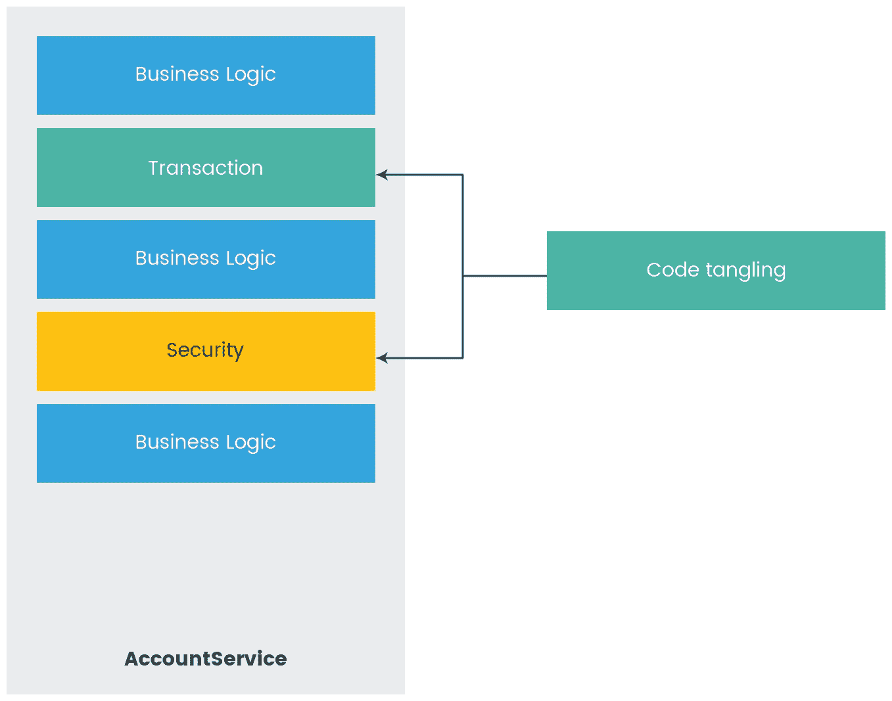
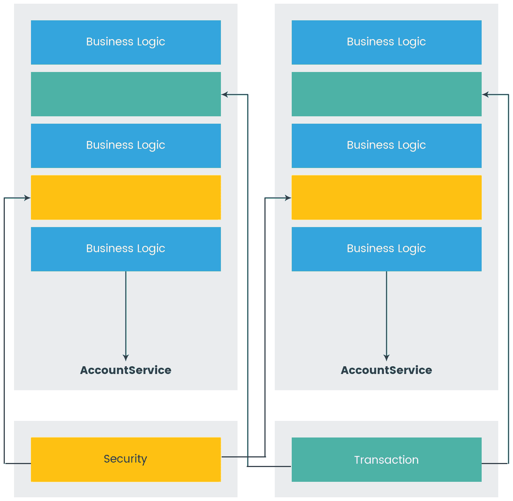
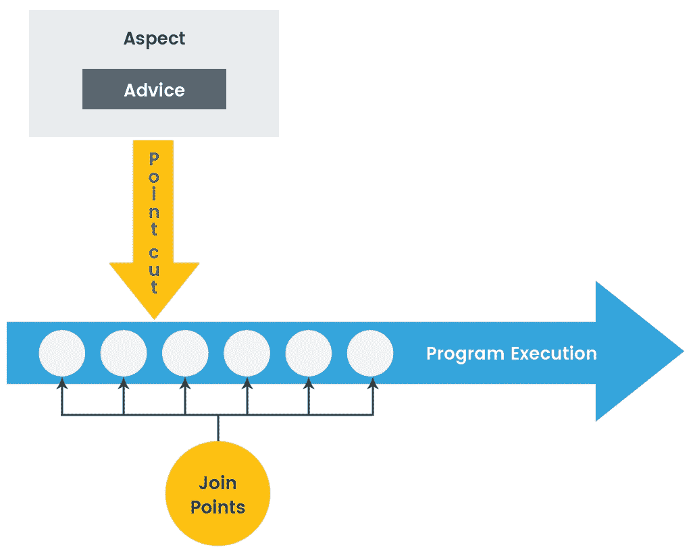
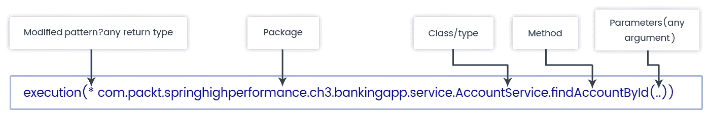

# 面向方面编程的调优

在上一章中，我们深入研究了 Spring 的一个关键特性：依赖注入（IoC 容器）。DI 是一种企业设计模式，它使对象与其所需的依赖项松散耦合。我们了解了 Spring 的 bean 布线配置和最佳实践，以获得最佳结果。

根据 Spring 的核心特性，在本章中，我们将进一步讨论**面向方面编程**（**AOP**。我们已经了解到，DI 促进了接口编程和应用程序对象的解耦，而 AOP 有助于实现业务逻辑和横切关注点的解耦。**横切关注点**是一个适用于部分应用程序或整个应用程序的关注点，例如，应用程序的几乎每个模块都需要的安全性、日志记录和缓存。AOP 和 AspectJ 有助于实现这些横切关注点。在本章中，我们将介绍以下主题：

*   AOP 概念
*   AOP 代理
*   Spring-AOP 剖面法
*   AOP 与 AspectJ 的比较
*   AOP 最佳编程实践

# AOP 概念

在本节中，我们将了解如果只使用**面向对象编程**（**OOP**范式，我们将面临哪些问题。然后我们将了解 AOP 如何解决这些问题。我们将介绍 AOP 的概念以及实现 AOP 概念的方法。

# 面向对象编程的局限性

在 OOP 基础知识和设计模式的帮助下，应用程序开发被划分为多个功能组。OOP 协议使许多事情变得简单和有用，例如引入一个接口，我们可以用它来实现松散耦合的设计，封装我们可以隐藏对象数据，继承扩展功能，通过类，我们可以重用工作。

随着系统的发展，OOP 的这些优点也增加了复杂性。随着复杂性的增加，维护它的成本和失败的机会也增加了。为了解决这个问题，将功能模块化为更简单、更易于管理的模块有助于降低复杂性。

为了模块化系统，我们开始遵循将应用程序划分为不同逻辑层的实践，例如，表示层、服务层和数据层。但是，即使将功能划分为不同的层，所有层中都需要某些功能，例如，安全性、日志记录、缓存和性能监视。这些功能称为横切关注点**。**

如果我们使用继承实现这些横切关注点，它将违反 SOLID 原则的单一责任，并增加对象层次结构。如果我们使用组合来实现它们，它将更加复杂。因此，使用 OOP 实现横切关注点会导致两个问题：

*   代码纠缠
*   码散射

让我们进一步讨论这些问题。

# 代码纠缠

**代码纠缠**意味着横切关注点和业务逻辑的混合，从而导致紧密耦合。让我们看下图来理解代码纠缠：



代码纠缠

上图说明了我们如何在服务实现中将事务和安全代码与业务逻辑混合在一起。这样的实现降低了代码的可重用性，降低了维护质量，并且违反了单一责任原则。

# 码散射

代码分散意味着横切关注点在应用程序的所有模块中都是重复的。让我们看一下以下示例以了解代码分散：

```java
public class TransferServiceImpl implements TransferService {
  public void transfer(Account source, Account dest, Double amount) {
    //permission check
    if (!hasPermission(user) {
      throw new AuthorizationException();
    }
  }
}

public class AccountServiceImpl implements AccountService {
  public void withdraw(Account userAccount, Double amount) {
    //Permission check
    if (!hasPermission(user) {
      throw new AuthorizationException();
    }
}
```

正如我们在前面的代码示例中看到的，权限检查（安全性）是我们的横切关注点，在所有服务中都是重复的。

这些代码纠缠和代码分散的问题是通过 AOP 解决的，但是如何解决呢？我们很快就会看到。

# AOP–问题解决者

在前面的部分中，我们已经看到，在 OOP 中，代码纠缠和分散会发生。通过 AOP，我们可以实现以下目标/好处：

*   模块化横切关注点
*   模块解耦
*   消除关于模块依赖性的横切关注点

SpringAOP 允许我们将横切关注点逻辑与业务逻辑分开，这样我们就可以专注于应用程序的主逻辑。为了帮助我们执行这种分离，Spring 提供了`Aspects`，这是一个普通类，我们可以在其中实现横切关注点逻辑。Spring 提供了将这些`Aspects`注入到应用程序正确位置的方法，而无需将它们与业务逻辑混合。我们将在以下章节中了解更多关于`Aspects`、如何实现以及如何应用它的信息。

此图说明了 Spring AOP：



AOP 如何解决代码纠缠

# Spring AOP 术语和概念

AOP 和所有技术一样，都有自己的术语。它有自己的词汇。Spring 在其 Spring AOP 模块中使用 AOP 范式。然而，SpringAOP 有自己的术语，这些术语是 Spring 特有的。为了理解 Spring AOP 术语，让我们看下图：



Spring AOP 术语和概念

让我们了解上图中提到的 Spring AOP 的每个概念：

*   **连接点：**在程序执行过程中定义的点。这种执行可以是方法调用、异常处理、类初始化或对象实例化。SpringAOP 只支持方法调用。如果我们想要方法调用以外的任何连接点，我们可以一起使用 Spring 和 AspectJ。我们将在本章后面介绍 AspectJ。
*   **建议**：定义在连接点需要做什么。不同类型的建议有`@Before`、`@After`、`@Around`、`@AfterThrowing`和`@AfterReturning`。我们将在*类建议*一节中看到它们的作用。

*   **切入点**：用于定义必须执行的通知的连接点集合。通知不一定应用于所有连接点，因此切入点提供了对将在应用程序中的组件上执行的通知的细粒度控制。切入点是使用表达式定义的，Spring 使用 AspectJ 切入点表达式语言。我们将很快看到如何做到这一点。
*   **方面**：通知和切入点的组合，用于定义应用程序中的逻辑及其执行位置。方面是使用带有`@Aspect`注释的常规类实现的。此注释来自 SpringAspectJ 支持。

那太理论化了，不是吗？现在，让我们深入了解如何在实际编程中应用这些 Spring AOP 概念。您可能已经在项目中实现了这些 AOP 概念；然而，你知道为什么需要它的背景吗？不，现在你知道为什么我们需要春季 AOP 了。

自 Spring2.0 以来，AOP 实现使用基于模式的方法（XML）或注释中定义的 AspectJ 切入点语言变得更简单。在本章中，我们将进一步讨论 Spring2.0AspectJ 对注释的支持。

# 定义切入点

正如我们之前所了解的，切入点定义了应该应用建议的点。SpringAOP 使用 AspectJ 的表达式语言来定义应用建议的点。以下是 Spring AOP 中支持的一组切入点指示符：

| **指示符** | **说明** |
| `execution` | 它通过方法执行来限制对连接点的匹配 |
| `within` | 它仅将匹配限制为某些类型内的连接点。示例：`within(com.packt.springhighperformance.ch3.TransferService)`。 |
| `args` | 它限制匹配到参数为给定类型的连接点。示例：`args(account,..)`。 |
| `this` | 它将匹配限制为连接点，其中 bean 引用或 Spring 代理对象是给定类型的实例。示例：`this(com.packt.springhighperformance.ch3.TransferService)`。 |
| `target` | 它将匹配限制为连接点，其中目标对象是给定类型的实例。示例：`target(com.packt.springhighperformance.ch3.TransferService)`。 |
| `@within` | 它将匹配限制为声明的类型具有给定注释类型的连接点。示例：`@within(org.springframework.transaction.annotation.Transactional)`。 |
| `@target` | 它将匹配限制为目标对象具有给定注释类型的连接点。示例：`@target(org.springframework.transaction.annotation.Transactional)`。 |
| `@args` | 它将匹配限制为连接点，其中传递的实际参数的类型具有给定类型的注释。示例：`@args(com.packt.springhighperformance.ch3.Lockable)`。 |
| `@annotation` | 它限制匹配到执行方法具有给定注释的连接点。示例：`@annotation(org.springframework.transaction.annotation.Transactional)`。 |

让我们看看如何使用`execution`指示符编写点表达式：

*   使用`execution(<method-pattern>)`：建议使用与模式匹配的方法。以下是方法模式：

```java
[Modifiers] ReturnType [ClassType]
MethodName ([Arguments]) [throws ExceptionType]
```

*   为了通过连接其他切入点来创建复合切入点，我们可以使用`&&`、`||`和`!`操作符（这些操作符分别表示 and、OR 和 NOT）。

在前面的方法模式中，`[ ]`中定义的任何内容都是可选的。必须定义没有`[ ]`的值。

下图将说明在执行`findAccountById()`方法时使用`execution`指示符应用建议的点表达式：



执行连接点模式

# 建议的种类

在上一节中，我们学习了 AOP 的不同术语以及如何定义切入点表达式。在本节中，我们将了解 Spring AOP 中不同类型的建议：

*   `@Before`：此通知在连接点之前执行，在`aspect`中使用`@Before`注释定义。声明显示在以下代码中：

```java
@Pointcut("execution(* com.packt.springhighperformance.ch03.bankingapp.service.TransferService.transfer(..))")
public void transfer() {}

@Before("transfer()")
public void beforeTransfer(JoinPoint joinPoint){
  LOGGGER.info("validate account balance before transferring amount");
}
```

如果`@Before`方法抛出异常，`transfer`目标方法将不会被调用。这是对`@Before`建议的有效使用。

*   `@After`：此通知在连接点（方法）正常退出/返回或异常退出/返回后执行。要声明此建议，请使用`@After`注释。声明显示在以下代码中：

```java
@Pointcut("execution(* com.packt.springhighperformance.ch03.bankingapp.service.TransferService.transfer(..))")
public void transfer() {}

@After("transfer()")
public void afterTransfer(JoinPoint joinPoint){
  LOGGGER.info("Successfully transferred from source account to dest     
  account");
}
```

*   `@AfterReturning`：正如我们在`@After`通知中所知道的，该通知在连接点正常退出或异常退出的任何情况下都会执行。现在，如果我们只想在匹配的方法正常返回后运行通知，那么怎么办？那么我们需要`@AfterReturning`。有时我们需要根据方法返回的值执行一些操作。在这些情况下，我们可以使用`@AfterReturning`注释。声明显示在以下代码中：

```java
@Pointcut("execution(* com.packt.springhighperformance.ch03.bankingapp.service.TransferService.transfer(..))")
public void transfer() {}

@AfterReturning(pointcut="transfer() and args(source, dest, amount)", returning="isTransferSuccessful" )
public void afterTransferReturns(JoinPoint joinPoint, Account source, Account dest, Double amount, boolean isTransferSuccessful){
  if(isTransferSuccessful){
    LOGGGER.info("Amount transferred successfully ");
    //find remaining balance of source account
  }
}
```

*   `@AfterThrowing`**当表达式中匹配的方法引发异常时，调用此通知。当我们希望在抛出任何特定类型的异常时采取某些操作，或者希望跟踪方法执行以更正错误时，这非常有用。使用`@AfterThrowing`注释声明，如下代码所示：**

 **```java
@Pointcut("execution(* com.packt.springhighperformance.ch03.bankingapp.service.TransferService.transfer(..))")
public void transfer() {}

@AfterThrowing(pointcut = "transfer()", throwing = "minimumAmountException")
public void exceptionFromTransfer(JoinPoint joinPoint, MinimumAmountException minimumAmountException) {
  LOGGGER.info("Exception thrown from transfer method: " +         
  minimumAmountException.getMessage());
}
```

与`@AfterThrowing``returning`属性类似，`@AfterThrowing`通知中的`throwing`属性必须与通知方法中的参数名称匹配。`throwing`属性将匹配限制为引发指定类型异常的那些方法执行

*   `@Around`**在匹配方法周围应用的最后一个和最后一个建议。这意味着它是我们前面看到的`@Before`和`@After`建议的组合。然而，`@Around`的建议比`@Before`和`@After`的组合更强大。它非常强大，因为它可以决定是继续使用连接点方法，还是返回自己的值，或者抛出异常。`@Around`建议可与`@Around`注释一起使用。`@Around`通知中通知方法的第一个参数应该是`ProceedingJoinPoint`。以下是如何使用`@Around`建议的代码示例：**

 **```java
@Pointcut("execution(* com.packt.springhighperformance.ch03.bankingapp.service.TransferService.transfer(..))")
public void transfer() {}

@Around("transfer()")
public boolean aroundTransfer(ProceedingJoinPoint proceedingJoinPoint){
  LOGGER.info("Inside Around advice, before calling transfer method ");
  boolean isTransferSuccessful = false;
  try {
    isTransferSuccessful = (Boolean)proceedingJoinPoint.proceed();
  } catch (Throwable e) {
    LOGGER.error(e.getMessage(), e);
  }
  LOGGER.info("Inside Around advice, after returning from transfer 
  method");
  return isTransferSuccessful;
}
```

我们可以调用`proceed`一次，多次，或者根本不在`@Around`建议的主体中调用。

# 方面实例化模型

默认情况下，声明的`aspect`是`singleton`，因此每个类加载器（而不是每个 JVM）只有一个`aspect`实例。只有当类装入器是垃圾时，才会销毁我们的`aspect`实例。

如果我们需要让具有私有属性的`aspect`保存相对于类实例的数据，`aspect`需要是有状态的。为此，Spring 及其 AspectJ 支持提供了一种使用`perthis`和`pertarget`实例化模型的方法。AspectJ 是一个独立的库，除了`perthis`和`pertarget`之外还有其他实例化模型，如`percflow`、`percflowbelow`、`pertypewithin`，这些在 Spring 的 AspectJ 支持中不受支持。

要使用`perthis`创建有状态的`aspect`，我们需要在`@Aspect`声明中声明`perthis`如下：

```java
@Aspect("perthis(com.packt.springhighperformance.ch03.bankingapp.service.TransferService.transfer())")
public class TransferAspect {
//Add your per instance attributes holding private data
//Define your advice methods
}
```

一旦我们用`perthis`子句声明了`@Aspect`，执行`transfer`方法的每个唯一`TransferService`对象（在切入点表达式匹配的连接点处绑定到`this`的每个唯一对象）将创建一个`aspect`实例。当`TransferService`对象超出范围时，aspect 的实例超出范围。

`pertarget`工作原理与`perthis`相同；但是，在`pertarget`中，它在与切入点表达式匹配的连接点处为每个唯一的目标对象创建一个`aspect`实例。

现在，您可能想知道 Spring 如何在不从业务逻辑类调用横切关注点类（`Aspects`的情况下应用通知。所以答案是，Spring 使用代理模式来实现这一点。它通过创建代理对象将您的`Aspects`编织到目标对象。让我们在下一节中详细了解 SpringAOP 代理。

# AOP 代理

正是代理模式使 SpringAOP 能够将横切关注点与核心应用程序的业务逻辑或功能解耦。代理模式是**四人帮**（**GoF**的一本书中包含的结构设计模式。实际上，代理模式在不改变原始对象的行为以允许拦截其方法调用的情况下，从原始对象创建不同的对象包装，外部世界会感觉到它们与原始对象而不是代理交互。

# JDK 动态代理和 CGLIB 代理

Spring AOP 中的代理可以通过两种方式创建：

*   JDK 代理（动态代理）：JDK 代理通过实现目标对象的接口和委托方法调用来创建新的代理对象
*   CGLIB 代理：CGLIB 代理通过扩展目标对象和委派方法调用来创建新的代理对象

让我们看看这些代理机制以及它们在下表中的区别：

| **JDK 代理** | **CGLIB 代理** |
| 它内置于 JDK 中。 | 这是一个定制开发的库。 |
| JDK 代理在接口上工作。 | CGLIB 代理用于子类化。当接口不存在时使用。 |
| 它将代理所有接口。 | 当方法和类为 final 时，它无法工作。 |

从 Spring3.2 开始，CGLIB 库是用 SpringCore 打包的，因此不需要在我们的应用程序中单独包含这个库。
从 Spring 4.0 开始，代理对象的构造函数将不会被调用两次，因为 CGLIB 代理实例将通过 Objensis 创建。

默认情况下，如果目标对象的类实现了接口，Spring 将尝试使用 JDK 动态代理；如果目标对象的类没有实现任何接口，那么 Spring 将使用 CGLIB 库创建一个代理。

如果目标对象的类实现了一个接口，并且它作为一个具体类注入到另一个 bean 中，那么 Spring 将抛出一个异常：`NoSuchBeanDefinitionException`。这个问题的解决方案是通过接口进行注入（这是一种最佳实践），或者用`Scope(proxyMode=ScopedProxyMode.TARGET_CLASS)`注释注入。然后 Spring 将使用 CGLIB 代理创建一个代理对象。此配置禁用 Spring 对 JDK 代理的使用。Spring 将始终扩展具体的类，即使注入了接口。CGLIB 代理使用 decorator 模式通过创建代理将建议编织到目标对象：


JDK 动态代理和 CGLIB 代理

创建代理将能够将对方法的所有调用委托给拦截器（advice）。但是，一旦方法调用到达目标对象，在该目标对象内进行的任何内部方法调用都不会被拦截。因此，对象引用中的任何方法调用都不会导致任何通知执行。为了解决这个问题，要么重构代码以避免直接自调用，要么使用 AspectJ 编织。为了在 Spring 中解决这个问题，我们需要将 exposeaproxy 属性设置为 true，并使用`AopContext.currentProxy()`进行自调用。

Spring 建议尽可能使用 JDK 代理。因此，尝试在应用程序中几乎所有地方实现抽象层，以便在接口可用时应用 JDK 代理，并且我们没有明确地将其设置为仅使用 CGLIB 代理。

# 原蚕豆

Spring 提供了一种使用`ProxyFactoryBean`手动创建对象代理的经典方法，它将创建一个封装目标对象的 AOP 代理。`ProxyFactoryBean`提供了一种设置建议和顾问的方法，这些建议和顾问最终合并到 AOP 代理中。Spring 中所有 AOP 代理工厂从`org.springframework.aop.framework.ProxyConfig`超类继承的关键属性如下：

*   `proxyTargetClass`：如果为真，则仅使用 CGLIB 创建代理。如果未设置，则如果目标类实现了接口，则将使用 JDK 代理创建代理；否则，将使用 CGLIB 创建代理。
*   `optimize`：对于 CGLIB 代理，这指示代理应用一些积极的优化。目前，JDK 代理不支持它。这需要明智地使用。
*   `frozen`：如果代理设置为`frozen`，则不允许更改配置。当我们不希望调用方在创建代理后修改代理时，这非常有用。这用于优化。此属性的默认值为`false`。
*   `exposeProxy`：将此属性设置为 true 决定当前代理是否应暴露于`ThreadLocal`。如果它暴露于`ThreadLocal`中，那么目标可以使用`AopContext.currentProxy()`方法对该方法进行自调用。

# ProxyFactoryBean 正在运行

我们将定义一个普通的 Springbean 作为目标 bean，比如说`TransferService`，然后，使用`ProxyFactoryBean`，我们将创建一个将由我们的应用程序访问的代理。为了通知`TransferService`的`transfer`方法，我们将使用`AspectJExpressionPointcut`设置点表达式并创建拦截器，我们将拦截器设置为`DefaultPointcutAdvisor`以创建 advisor

目标对象或 bean 如下所示：

```java
public class TransferServiceImpl implements TransferService {
  private static final Logger LOGGER =     
  Logger.getLogger(TransferServiceImpl.class);

  @Override
  public boolean transfer(Account source, Account dest, Double amount) {
    // transfer amount from source account to dest account
    LOGGER.info("Transferring " + amount + " from " + 
    source.getAccountName() + " 
    to " +   dest.getAccountName());
    ((TransferService)
    (AopContext.currentProxy())).checkBalance(source);
    return true;
  }

  @Override
  public double checkBalance(Account a) {
    return 0;
  }
}
```

以下代码用于方法拦截器或建议：

```java
public class TransferInterceptor implements MethodBeforeAdvice{

   private static final Logger LOGGER =  
   Logger.getLogger(TransferInterceptor.class);

 @Override
 public void before(Method arg0, Object[] arg1, Object arg2) throws   
 Throwable {
    LOGGER.info("transfer intercepted");
 }
}
```

弹簧配置如下所示：

```java
@Configuration
public class ProxyFactoryBeanConfig {

  @Bean
  public Advisor transferServiceAdvisor() {
      AspectJExpressionPointcut pointcut = new 
      AspectJExpressionPointcut();
      pointcut.setExpression("execution(* 
      com.packt.springhighperformance.ch03.bankingapp.service
      .TransferService.checkBalance(..))");
      return new DefaultPointcutAdvisor(pointcut, new 
      TransferInterceptor());
  }

  @Bean
  public ProxyFactoryBean transferService(){
    ProxyFactoryBean proxyFactoryBean = new ProxyFactoryBean();
    proxyFactoryBean.setTarget(new TransferServiceImpl());
    proxyFactoryBean.addAdvisor(transferServiceAdvisor());
    proxyFactoryBean.setExposeProxy(true);
    return proxyFactoryBean;
  }
}
```

在前面的代码示例中，我们没有将`TransferService`单独定义为 Springbean。我们已经创建了一个匿名 bean`TransferService`，然后使用`ProxyFactoryBean`创建了它的代理。这样做的好处是，只有一个`TransferService`类型的对象，任何人都无法获得未经建议的对象。如果我们想使用 SpringIOC 将这个 bean 连接到任何其他 bean，这也减少了歧义。

通过`ProxyFactoryBean`，我们可以配置 AOP 代理，这些代理提供编程方法的所有灵活性，而无需我们的应用程序进行 AOP 配置。

最好使用代理配置的声明性方法而不是编程方法，除非我们需要在运行时执行操纵操作，或者希望获得细粒度控制。

# JDK 动态代理与 CGLIB 代理的性能比较

我们了解了代理的用途。根据 GoF 的书*设计模式：可重用面向对象软件的元素*，代理是另一个对象控制访问的占位符。由于代理位于对象的调用方和真实对象之间，因此它可以决定是阻止调用真实（或目标）对象，还是在调用目标对象之前执行某些操作。

许多对象关系映射程序使用代理模式来实现一种行为，这种行为可以防止在实际需要数据之前加载数据。有时这被称为**延迟加载**。Spring 还使用代理来开发它的一些功能，如事务管理、安全性、缓存和 AOP 框架。

由于代理对象是在运行时由 JDK 代理或 CGLIB 库创建的附加对象，并且位于调用方对象和目标对象之间，因此将为普通方法调用增加一些开销。

让我们看看代理为普通方法调用增加了多少开销

以下代码段显示了 CGLIB 代理的基于 Spring Java 的配置类：

```java
@EnableAspectJAutoProxy
@Configuration
public class CGLIBProxyAppConfig {

  @Bean
  @Scope(proxyMode=ScopedProxyMode.TARGET_CLASS)
  public TransferService transferService(){
    return new TransferServiceImpl();
  }
}
```

JDK 代理基于 Spring Java 的配置类如下：

```java
@Configuration
@EnableAspectJAutoProxy
public class JDKProxyAppConfig {

 @Bean
 @Scope(proxyMode=ScopedProxyMode.INTERFACES)
 public TransferService transferService(){
 return new TransferServiceImpl();
 }
}
```

JUnit 类如下所示：

```java
public class TestSpringProxyOverhead {
  private static final Logger LOGGER = 
  Logger.getLogger(TestSpringProxyOverhead.class);

  @Test
  public void checkProxyPerformance() {
    int countofObjects = 3000;
    TransferServiceImpl[] unproxiedClasses = new 
    TransferServiceImpl[countofObjects];
    for (int i = 0; i < countofObjects; i++) {
      unproxiedClasses[i] = new TransferServiceImpl();
    }

    TransferService[] cglibProxyClasses = new     
    TransferService[countofObjects];
    TransferService transferService = null;
    for (int i = 0; i < countofObjects; i++) {
      transferService = new 
      AnnotationConfigApplicationContext(CGLIBProxyAppConfig.class)
      .getBean(TransferService.class);
      cglibProxyClasses[i] = transferService;
    }

    TransferService[] jdkProxyClasses = new 
    TransferService[countofObjects];
    for (int i = 0; i < countofObjects; i++) {
      transferService = new 
      AnnotationConfigApplicationContext(JDKProxyAppConfig.class)
      .getBean(TransferService.class);
      jdkProxyClasses[i] = transferService;
    }

    long timeTookForUnproxiedObjects = 
    invokeTargetObjects(countofObjects, 
    unproxiedClasses);
    displayResults("Unproxied", timeTookForUnproxiedObjects);

    long timeTookForJdkProxiedObjects = 
    invokeTargetObjects(countofObjects, 
    jdkProxyClasses);
    displayResults("Proxy", timeTookForJdkProxiedObjects);

    long timeTookForCglibProxiedObjects = 
    invokeTargetObjects(countofObjects, 
    cglibProxyClasses);
    displayResults("cglib", timeTookForCglibProxiedObjects);

  }

  private void displayResults(String label, long timeTook) {
  LOGGER.info(label + ": " + timeTook + "(ns) " + (timeTook / 1000000) 
  + "(ms)");
  }

  private long invokeTargetObjects(int countofObjects, 
  TransferService[] classes) {
    long start = System.nanoTime();
    Account source = new Account(123456, "Account1");
    Account dest = new Account(987654, "Account2");
    for (int i = 0; i < countofObjects; i++) {
      classes[i].transfer(source, dest, 100);
    }
    long end = System.nanoTime();
    long execution = end - start;
    return execution;
  }
}
```

开销时间因硬件工具（如 CPU 和内存）而异。以下是我们将获得的输出类型：

```java
2018-02-06 22:05:01 INFO TestSpringProxyOverhead:52 - Unproxied: 155897(ns) 0(ms)
2018-02-06 22:05:01 INFO TestSpringProxyOverhead:52 - Proxy: 23215161(ns) 23(ms)
2018-02-06 22:05:01 INFO TestSpringProxyOverhead:52 - cglib: 30276077(ns) 30(ms)
```

我们可以使用谷歌的卡尺等工具进行基准测试，该工具位于[https://github.com/google/caliper](https://github.com/google/caliper) 或**爪哇微型基准线束**（**JMH**），发现于[http://openjdk.java.net/projects/code-tools/jmh/](http://openjdk.java.net/projects/code-tools/jmh/) 。许多性能测试使用不同的工具和场景，产生了不同的结果。一些测试表明 CGLIB 比 JDK 代理更快，还有一些测试得到了其他结果。如果我们测试 AspectJ（我们将在本章后面讨论），性能仍然优于 JDK 代理和 CGLIB 代理，因为它的字节码编织机制而不是代理对象

这里的问题是，我们真的需要担心我们看到的开销吗？答案是肯定和否定。我们将讨论这两个答案。

我们不必真正担心开销，因为添加代理的时间可以忽略不计，而 AOP 或代理模式提供的好处也很高。在本章前面的章节中，我们已经看到了 AOP 的好处，例如事务管理、安全性、延迟加载，或者任何横切但具有代码简化、集中管理或代码维护的功能

此外，当我们的应用程序有**服务级别协议**（**SLA**）在毫秒内交付时，或者我们的应用程序有大量并发请求或负载时，我们需要担心开销。在这种情况下，所花费的每毫秒对于我们的应用程序都很重要。然而，我们仍然需要在应用程序中使用 AOP 来实现横切关注点。因此，我们需要注意的是正确的 AOP 配置，避免不必要地扫描对象以获取建议，配置我们希望获得建议的确切连接点，并避免通过 AOP 实现细粒度需求。对于细粒度需求，用户 AspectJ（字节码编织方法）。

因此，经验法则是，使用 AOP 实现横切关注点并利用其优势。但是，通过对每个操作应用建议或代理，使用不会降低系统性能的正确配置谨慎地实现它。

# 缓存

为了提高应用程序的性能，缓存繁重的操作是不可避免的。Spring3.1 添加了一个名为**缓存**的强大抽象层，它有助于放弃所有自定义实现的`aspects`、装饰器和注入到与缓存相关的业务逻辑中的代码

Spring 使用 AOP 概念将缓存应用于 springbean 的方法；我们在本章的*AOP 概念*部分了解到了这一点。Spring 创建 Springbean 的代理，在这些代理中，方法被注释为缓存

为了充分利用 Spring 缓存抽象层的优点，只需使用`@Cacheable`注释繁重的方法即可。此外，我们还需要通过使用`@EnableCaching`注释我们的配置类来通知我们的应用程序缓存了这些方法。以下是缓存方法的示例：

```java
@Cacheable("accounts")
public Account findAccountById(int accountId){
```

`@Cacheable`注释具有以下属性：

*   `value`：缓存名称
*   `key`：每个缓存项的缓存密钥
*   `condition`：根据**Spring 表达式语言**（**SpEL**表达式）的评估，定义是否应用缓存
*   `unless`：这是 SpEL 中写入的另一个条件，如果为真，则阻止缓存返回值

以下是 Spring 提供的与缓存相关的附加注释：

*   `@CachePut`：让方法执行并更新缓存
*   `@CacheEvict`：将从缓存中删除过时数据
*   `@Caching`：允许您在同一方法上对多个注释`@Cacheable`、`@CachePut`、`@CacheEvict`进行分组
*   `@CacheConfig`：它将允许我们注释整个类，而不是重复每个方法

我们可以在检索数据的方法上使用`@Cacheable`，在执行插入以更新缓存的方法上使用`@CachePut`。代码示例如下所示：

```java
@Cacheable("accounts" key="#accountId")
public Account findAccountById(int accountId){

@CachePut("accounts" key="#account.accountId")
public Account createAccount(Account account){
```

注释缓存数据的方法不会存储数据；为此，我们需要实施或提供`CacheManager`。Spring 默认在`org.springframework.cache`包中提供一些缓存管理器，其中一个是`SimpleCacheManager`。`CacheManager`代码示例如图所示：

```java
@Bean
public CacheManager cacheManager() {
  CacheManager cacheManager = new SimpleCacheManager();
  cacheManager.setCaches(Arrays.asList(new     
  ConcurrentMapCache("accounts"));
  return cacheManager;
}
```

Spring 还支持集成以下第三方缓存管理器：

*   EhCache
*   番石榴
*   咖啡因
*   雷迪斯
*   黑兹卡斯特
*   您的自定义缓存

# AOP 方法分析

应用程序可以有许多业务方法。由于一些实现问题，一些方法需要时间，我们想测量这些方法花费了多少时间，我们可能还想分析方法参数。SpringAOP 提供了一种在不涉及业务方法的情况下执行方法评测的方法。让我们看看如何。

# 性能监视器接收器

让我们看看如何对方法执行进行分析或监视。这是在 SpringAOP 使用`PerformanceMonitorInterceptor`类提供的一个简单选项的帮助下完成的。

正如我们所了解到的，SpringAOP 允许通过拦截一个或多个方法的执行来定义应用程序中的横切关注点，从而在不涉及核心业务类的情况下添加额外的功能。

SpringAOP 中的`PerformanceMonitorInterceptor`类是一个拦截器，可以绑定到任何要同时执行的自定义方法。此类使用`StopWatch`实例记录方法执行的开始和结束时间。

让我们来监控一下`TransferService`的`transfer`方法。以下为`TransferService`代码：

```java
public class TransferServiceImpl implements TransferService {

  private static final Logger LOGGER = 
  LogManager.getLogger(TransferServiceImpl.class);

  @Override
  public boolean transfer(Account source, Account dest, int amount) {
    // transfer amount from source account to dest account
    LOGGER.info("Transferring " + amount + " from " + 
    source.getAccountName() + " 
    to " + dest.getAccountName());
    try {
      Thread.sleep(5000);
    } catch (InterruptedException e) {
      LOGGER.error(e);
    }
    return true;
  }
}
```

以下代码为`@Pointcut`，用于使用 Spring 拦截器监控通知方法：

```java
@Aspect 
public class TransferMonitoringAspect {

    @Pointcut("execution(*          
    com.packt.springhighperformance.ch03.bankingapp.service
    .TransferService.transfer(..))")
    public void transfer() { }
}
```

以下代码是 advisor 类的代码：

```java
public class PerformanceMonitorAdvisor extends DefaultPointcutAdvisor {

 private static final long serialVersionUID = -3049371771366224728L;

 public PerformanceMonitorAdvisor(PerformanceMonitorInterceptor 
 performanceMonitorInterceptor) {
 AspectJExpressionPointcut pointcut = new AspectJExpressionPointcut();
 pointcut.setExpression(
 "com.packt.springhighperformance.ch03.bankingapp.aspect.TransferMonito  ringAspect.transfer()");
 this.setPointcut(pointcut);
 this.setAdvice(performanceMonitorInterceptor);
 }
}
```

以下代码是 Spring Java 配置类：

```java
@EnableAspectJAutoProxy
@Configuration
public class PerformanceInterceptorAppConfig {
  @Bean
  public TransferService transferService() {
    return new TransferServiceImpl();
  }

  @Bean
  public PerformanceMonitorInterceptor performanceMonitorInterceptor() {
    return new PerformanceMonitorInterceptor(true);
  }

  @Bean
  public TransferMonitoringAspect transferAspect() {
    return new TransferMonitoringAspect();
  }

  @Bean
  public PerformanceMonitorAdvisor performanceMonitorAdvisor() {
    return new 
    PerformanceMonitorAdvisor(performanceMonitorInterceptor());
  }
}
```

切入点中的表达式标识我们要截取的方法。我们将`PerformanceMonitorInterceptor`定义为 bean，然后创建`PerformanceMonitorAdvisor`将切入点与拦截器关联。

在我们的`Appconfig`中，我们已经用`@EnableAspectJAutoProxy`注释进行了注释，以使我们的 bean 的 AspectJ 支持能够自动创建代理

为了让`PerformanceMonitorInterceptor`工作，我们需要将目标对象`TransferServiceImpl`的日志级别设置为`TRACE`级别，因为这是它记录消息的级别。

每次执行`transfer`方法，我们都会在控制台日志中看到`TRACE`消息：

```java
2018-02-07 22:14:53 TRACE TransferServiceImpl:222 - StopWatch 'com.packt.springhighperformance.ch03.bankingapp.service.TransferService.transfer': running time (millis) = 5000
```

# 自定义监视拦截器

`PerformanceMonitorInterceptor`是一种非常基本和简单的方法，可以随时监控我们方法的执行情况。然而，在大多数情况下，我们需要更多的受控方法来监控方法及其参数。为此，我们可以通过扩展`AbstractMonitoringInterceptor`或编写建议或自定义注释来实现自定义拦截器。在这里，我们将编写一个扩展`AbstractMonitoringInterceptor`的自定义拦截器。

让我们扩展`AbstractMonitoringInterceptor`类并重写`invokeUnderTrace`方法来记录方法的`start`、`end`和持续时间。如果方法执行持续时间超过`5`毫秒，我们还可以记录警告。以下是自定义监视侦听器的代码示例：

```java
public class CustomPerformanceMonitorInterceptor extends AbstractMonitoringInterceptor {

    private static final long serialVersionUID = -4060921270422590121L;
    public CustomPerformanceMonitorInterceptor() {
    }

    public CustomPerformanceMonitorInterceptor(boolean 
    useDynamicLogger) {
            setUseDynamicLogger(useDynamicLogger);
    }

    @Override
    protected Object invokeUnderTrace(MethodInvocation invocation, Log 
    log) 
      throws Throwable {
        String name = createInvocationTraceName(invocation);
        long start = System.currentTimeMillis();
        log.info("Method " + name + " execution started at:" + new 
        Date());
        try {
            return invocation.proceed();
        }
        finally {
            long end = System.currentTimeMillis();
            long time = end - start;
            log.info("Method "+name+" execution lasted:"+time+" ms");
            log.info("Method "+name+" execution ended at:"+new Date());

            if (time > 5){
                log.warn("Method execution took longer than 5 ms!");
            } 
        }
    }
}
```

我们在基本`PerformanceMonitorInterceptor`中看到的每一步都是相同的，只需将`PerformanceMonitorInterceptor`替换为`CustomPerformanceMonitorInterceptor`。

生成以下输出：

```java
2018-02-07 22:23:44 INFO TransferServiceImpl:32 - Method com.packt.springhighperformance.ch03.bankingapp.service.TransferService.transfer execution lasted:5001 ms
2018-02-07 22:23:44 INFO TransferServiceImpl:33 - Method com.packt.springhighperformance.ch03.bankingapp.service.TransferService.transfer execution ended at:Wed Feb 07 22:23:44 EST 2018
2018-02-07 22:23:44 WARN TransferServiceImpl:36 - Method execution took longer than 5 ms!
```

# Spring AOP 与 AspectJ

到目前为止，我们已经看到 AOP 使用代理模式和运行时编织。现在让我们看看编译时和加载时编织的 AOP。

# 什么是 AspectJ？

从本章开始我们就知道，AOP 是一种编程范式，它通过分离横切关注点的实现来帮助我们解耦代码。AspectJ 是 AOP 的原始实现，它使用 Java 编程语言的扩展来实现关注点和横切关注点的编织。

为了在我们的项目中启用 AspectJ，我们需要 AspectJ 库，AspectJ 根据其使用情况提供不同的库。你可以在[找到它的所有库 https://mvnrepository.com/artifact/org.aspectj](https://mvnrepository.com/artifact/org.aspectj) 。

在 AspectJ 中，`Aspects`将在扩展名为`.aj`*的文件中创建。*以下是样本`TransferAspect.aj`文件：

```java
public aspect TransferAspect {
    pointcut callTransfer(Account acc1, Account acc2, int amount) : 
     call(public * TransferService.transfer(..));

    boolean around(Account acc1, Account acc2, int amount) : 
      callTransfer(acc1, acc2,amount) {
        if (acc1.balance < amount) {
            return false;
        }
        return proceed(acc1, acc2,amount);
    }
}
```

要启用编译时编织，当我们同时拥有`aspect`代码和我们想要编织`aspects`的代码时，使用 Maven 插件，如下所示：

```java
<plugin>
    <groupId>org.codehaus.mojo</groupId>
    <artifactId>aspectj-maven-plugin</artifactId>
    <version>1.11</version>
    <configuration>
        <complianceLevel>1.8</complianceLevel>
        <source>1.8</source>
        <target>1.8</target>
        <showWeaveInfo>true</showWeaveInfo>
        <verbose>true</verbose>
        <Xlint>ignore</Xlint>
        <encoding>UTF-8 </encoding>
    </configuration>
    <executions>
        <execution>
            <goals>
                <!-- use this goal to weave all your main classes -->
                <goal>compile</goal>
                <!-- use this goal to weave all your test classes -->
                <goal>test-compile</goal>
            </goals>
        </execution>
    </executions>
</plugin>
```

要执行编译后编织，当我们想要编织现有的类文件和 JAR 文件时，使用 Mojo 的 AspectJ Maven 插件，如下所示。我们引用编织的工件或 JAR 文件必须在 Maven 项目中列为`<dependencies/>`，在 AspectJ Maven 插件的`<configuration>`中列为`<weaveDependencies/>`。以下是关于如何定义编织依赖项的 Maven 示例：

```java
<configuration>
    <weaveDependencies>
        <weaveDependency> 
            <groupId>org.agroup</groupId>
            <artifactId>to-weave</artifactId>
        </weaveDependency>
        <weaveDependency>
            <groupId>org.anothergroup</groupId>
            <artifactId>gen</artifactId>
        </weaveDependency>
    </weaveDependencies>
</configuration>
```

要执行**加载时编织**（**LTW**），当我们要将编织延迟到类加载器加载类文件时，我们需要一个编织代理；按如下方式使用 Maven 插件：

```java
<plugin>
    <groupId>org.apache.maven.plugins</groupId>
    <artifactId>maven-surefire-plugin</artifactId>
    <version>2.20.1</version>
    <configuration>
        <argLine>
            -javaagent:"${settings.localRepository}"/org/aspectj/
            aspectjweaver/${aspectj.version}/
            aspectjweaver-${aspectj.version}.jar
        </argLine>
        <useSystemClassLoader>true</useSystemClassLoader>
        <forkMode>always</forkMode>
    </configuration>
</plugin>
```

对于 LTW，它在`META-INF`文件夹下的类路径中查找`aop.xml`。该文件包含如下所示的`aspect`和`weaver`标记：

```java
<aspectj>
    <aspects>
        <aspect name="com.packt.springhighperformance.ch3.bankingapp.
        aspectj.TransferAspect"/>
        <weaver options="-verbose -showWeaveInfo">
            <include         
            within="com.packt.springhighperformance.ch3.bankingapp
            .service.impl.TransferServiceImpl"/>
        </weaver>
    </aspects>
</aspectj>
```

这只是介绍如何在我们的项目中启用 AspectJ。

# Spring AOP 和 AspectJ 之间的差异

让我们看看 SpringAOP（运行时编织）和 AspectJ（编译时和 LTW）之间的区别。

# 能力和目标

SpringAOP 提供了一个简单的 AOP 实现，以使用代理模式和装饰器模式实现横切关注点。它不是一个完整的 AOP 解决方案，Spring 可以应用于由 Spring 容器管理的 bean。

AspectJ 是最初的 AOP 技术，旨在提供完整的 AOP 解决方案。然而，它比 Spring AOP 更健壮，也更复杂。AspectJ 的好处是它可以应用于所有域对象。

# 编织

SpringAOP 和 AspectJ 都使用不同类型的编织，并且根据它们的编织机制，它们在性能和易用性方面的行为是不同的。

为了在应用程序执行期间执行`aspects`的运行时编织，Spring 使用 JDK 动态代理或 CGLIB 代理创建目标对象的代理，我们前面已经讨论过。

与 SpringAOP 的运行时编织不同，AspectJ 在编译时或类加载时执行编织。在前一节中，我们已经看到了不同类型的 AspectJ 编织。

# 连接点

由于 SpringAOP 创建目标类或对象的代理以应用横切关注点（`Aspects`，所以它需要执行目标类或对象的子类化。我们已经知道，对于子类化，SpringAOP 不能将横切关注点应用于 final 或 static 类或方法。

另一方面，AspectJ 使用字节码编织将横切关注点编织到实际代码中，因此不需要对目标类或对象进行子类化

# 简单

在 SpringAOP 中，`Aspects`的运行时编织将在启动时由容器执行，因此它与我们的构建过程无缝集成。

另一方面，在 AspectJ 中，我们必须使用额外的编译器（`ajc`）来执行此操作，除非我们在编译后或 LTW 中执行此操作。因此，Spring 比 AspectJ 更简单、更易于管理。

使用 SpringAOP，我们不能使用或应用 AOP 的全部功能，因为 SpringAOP 是基于代理的，只能应用于 Spring 管理的 bean。

AspectJ 基于字节码编织，这意味着它修改了我们的代码，从而使我们能够在应用程序的任何 bean 上使用 AOP 的全部功能。

# 表演

从性能的角度来看，编译时编织将比运行时编织更快。Spring AOP 是一个基于代理的框架，因此它在运行时为代理创建额外的对象，并且每个`aspect`有更多的方法调用，这会对性能产生负面影响。

另一方面，AspectJ 在应用程序启动之前将`aspects`编织到主代码中，因此没有额外的运行时开销。互联网上有一些基准测试表明 AspectJ 比 SpringAOP 快得多。

这并不是说一个框架比另一个更好。将根据需求和许多不同的因素做出选择，如开销、简单性、可管理性/可维护性、复杂性和学习曲线。如果我们使用更少的`aspects`，并且除了 Springbean 或方法执行之外，不需要应用`aspect`，那么 SpringAOP 和 AspectJ 之间的性能差异是微不足道的。我们也可以一起使用 AspectJ 和 SpringAOP 来实现我们的需求。

# 带弹簧的 AspectJ

Spring 提供了小型库，使 AspectJ`aspects`能够进入 Spring 项目。该库名为`spring-aspects.jar`。从前面的讨论中我们知道，Spring 只允许对 Springbean 进行依赖注入或 AOP 建议。通过使用这个小库对 Spring 的 AspectJ 支持，我们可以为 Spring 驱动的配置启用容器外部创建的任何对象。只需用`@Configurable`注释外部对象即可。用`@Configurable`注释非弹簧 bean 需要`spring-aspects.jar`中的`AnnotationBeanConfigurerAspect`。Spring 需要的`AnnotationBeanConfigurerAspect`配置可以通过用`@EnableSpringConfigured`注释我们的配置 Java 配置类来完成

Spring 提供了一种更好的方式，通过启用每类装入器来启用**加载时间编织**（**LTW**）。这提供了更细粒度的控制，特别是当我们将大型或多个应用程序部署到单个 JVM 环境中时。

要将 LTW 与 Spring 一起使用，我们需要实现我们在前面的*AOP 概念*部分中实现的`aspect`或建议，并且根据 AspectJ 概念，我们需要在`META-INF`文件夹中创建`aop.xml`，如下所示：

```java
<!DOCTYPE aspectj PUBLIC "-//AspectJ//DTD//EN" "http://www.eclipse.org/aspectj/dtd/aspectj.dtd">
<aspectj>
    <weaver>
        <!-- only weave classes in our application-specific packages --
        >
        <include within="com.packt.springhighperformance.ch3.bankingapp
        .service.impl.TransferServiceImpl"/>
        <include within="com.packt.springhighperformance.ch3.bankingapp
        .aspects.TransferServiceAspect"/>
    </weaver>
    <aspects>
        <!-- weave in just this aspect -->
        <aspect name="com.packt.springhighperformance.ch3.bankingapp
        .aspects.TransferServiceAspect"/>
    </aspects>
</aspectj>
```

我们需要做的最后一件事是用`@EnableLoadTimeWeaving`注释我们基于 Java 的 Spring 配置。我们需要在服务器启动脚本中添加`-javaagent:path/to/org.springframework.instrument-{version}.jar`。

# AOP 最佳编程实践

我们已经了解了应用程序中为什么需要 AOP。我们详细了解了它的概念以及如何使用它。让我们看看在应用程序中使用 AOP 时应该遵循哪些最佳实践。

# 切入点表达式

我们从 AOP 的角度了解了切入点。现在让我们看看在使用切入点时应该注意什么：

*   Spring 和 AspectJ 在编译期间处理切入点，并尝试匹配和优化匹配性能。然而，检查代码和匹配（静态或动态）将是一个代价高昂的过程。因此，为了获得最佳性能，请仔细考虑我们想要实现的目标，并尽可能缩小搜索或匹配条件的范围。
*   我们在本章前面学习的所有指示符分为三类：
    *   方法签名模式：`execution`、`get`、`set`、`call`、`handler`
    *   类型签名样式：`within`、`withincode`
    *   上下文签名模式：`this`、`target`、`@annotation`
*   为了获得良好的性能，编写至少包含方法和类型签名模式的切入点。这并不是说如果我们只使用方法或类型模式，匹配就不起作用；但是，始终建议将方法和类型签名连接在一起。类型签名非常快，因为它通过快速选择无法进一步处理的连接点来缩小搜索空间。
*   在空方法上声明切入点，并通过它们的空方法名（名为切入点）引用这些切入点，因此在对表达式进行任何更改的情况下，我们只需在一个位置进行更改。

*   还建议声明小的命名切入点，并按名称组合它们以构建复杂的切入点。按名称引用切入点将遵循默认的 Java 方法可见性规则。以下是定义小切入点并将其连接起来的代码示例：

```java
@Pointcut("execution(public * *(..))")
private void anyPublicMethod() {}

@Pointcut("within(com.packt.springhighperformance.ch3.bankingapp.TransferService..*)")
private void transfer() {}

@Pointcut("anyPublicMethod() && transfer()")
private void transferOperation() {}

```

*   尝试在切入点未共享时为其创建匿名 bean，以避免应用程序直接访问。
*   尝试在参数不需要匹配的地方使用静态切入点。当第一次调用该方法时，它们会更快，并由 Spring 缓存。动态切入点代价高昂，因为它们在每次方法调用时都会被评估，因为缓存无法完成，因为参数会有所不同。

# 建议订购

现在我们知道了如何写建议和如何创建`Aspect`。让我们看看当我们在同一连接点上有多个建议时，建议排序如何帮助我们确定建议的优先级：

*   假设我们在不同方面编写了两个前后建议，并且都希望在同一个连接点上运行。在这种情况下，通知的执行顺序将基于在类的执行中哪个方面首先出现。为了避免这种情况并一个接一个地应用我们的建议，Spring 提供了一种通过方面实现`Ordered`接口或应用`@Order`注释来指定执行顺序的方法。顺序值越低，优先级越高。
*   在声明建议时，始终使用最不有力的建议形式；例如，如果一个简单的 before 建议可以满足我们的要求，我们就不应该使用 around 建议。

# AOP 代理的最佳实践

我们了解了 AOP 代理以及 AOP 代理如何工作。我们在 SpringAOP 中学习了不同类型的代理。以下是在 Spring 中实现 AOP 代理时应遵循的最佳实践：

*   除非我们需要在运行时执行操纵操作，或者我们希望获得对代理的细粒度控制，否则使用代理配置的声明性方法而不是编程方法。
*   Spring 尽可能推荐 JDK 动态代理而不是 CGLIB 代理。如果我们从头开始构建应用程序，并且不需要创建第三方 API 的代理，那么实现抽象层以使用接口松散耦合实现，并让 Spring 使用 JDK 动态代理机制来创建代理。
*   如果是 CGLIB 代理，请确保这些方法不是`final`，因为`final`方法无法被覆盖，因此无法建议它们。
*   根据 Spring 的说法，不可能让`aspects`自己成为其他`aspects`建议的目标。对于这种情况，有一些变通办法；将`aspect`方法移动到一个新的 Springbean，并用`@Component`注释，`@Autowire`将这个新的 Springbean 移动到`aspect`，只需调用建议的方法即可。`MethodProfilingAspect`是否`aspect`在`com.packt.springhighperformance.ch3.bankingapp`下的所有连接点上定义了一个切入点：

```java
@Aspect
public class MethodProfilingAspect {

  @Around("execution(* 
  com.packt.springhighperformance.ch3.bankingapp.*.*(..))")
  public Object log(ProceedingJoinPoint joinPoint){
    System.out.println("Before 
    Around"+joinPoint.getTarget().getClass().getName());
    Object retVal = null;
    try {
       retVal = joinPoint.proceed();
    } catch (Throwable e) {
      e.printStackTrace();
    }
    System.out.println("After 
    Around"+joinPoint.getTarget().getClass().getName());
    return retVal;
  }
```

*   以下`ValidatingAspect`是在`com.packt.springhighperformance.ch3.bankapp`包下定义的`aspect`，但是`MethodProfilingAspect`不会建议调用`validate`方法：

```java
@Aspect
public class ValidatingAspect {

 @Autowired
 private ValidateService validateService;

 @Before("execution(*   
 com.packt.springhighperformance.ch3.bankingapp.TransferService.tran
 sfe  r(..))")
 public void validate(JoinPoint jp){
 validateService.validateAccountNumber();
 }
}
```

*   下面是通过使用`@Component`注释创建一个单独的类并实现`validate`方法的解决方案。此类将是一个 Spring 管理的 bean，建议：

```java
@Component
public class ValidateDefault{

  @Autowired
  private ValidateService validateService;
  public void validate(JoinPoint jp){
        validateService.validateAccountNumber();
    }
}
```

*   下面的代码`ValidatingAspect`注入`ValidateDefault`Springbean 并调用`validate`方法：

```java
@Aspect
public class ValidatingAspect {

 @Autowired
 private ValidateDefault validateDefault;

 @Before("execution(* com.packt.springhighperformance.ch3.bankingapp.TransferService.transfer(..))")
 public void validate(JoinPoint jp){

```

```java
 validateDefault.validate(jp);
 }
}
```

永远不要通过 AOP 实现细粒度需求，也不要使用 AspectJ 来满足这些需求。不要在 Spring 管理的 bean 类上使用`@Configurable`，否则它将执行双重初始化，一次通过容器，一次通过方面。

# 缓存

我们已经了解了如何使用缓存来提高应用程序的性能。以下是在 Spring 中实现缓存时要遵循的最佳实践：

*   Spring 缓存注释应该在具体类上使用，而不是在接口上使用。如果我们选择使用`proxy-target-class="true"`，缓存将无法工作，因为无法继承来自接口的 Java 注释。
*   尽量不要在同一方法上同时使用`@Cacheable`和`@CachePut`。
*   不要将非常低级的方法缓存在一起，例如 CPU 密集型和内存中的计算。在这些场景中，Spring 的缓存可能有些过分。

# 总结

在本章中，我们介绍了 Spring AOP 模块。AOP 是一种功能强大的编程范式，它补充了面向对象编程。AOP 有助于将横切关注点与业务逻辑分离，并帮助我们在处理业务需求时只关注业务逻辑。解耦的横切关注点有助于实现可重用代码

我们学习了 AOP 的概念、术语以及如何实现建议。我们学习了代理以及如何使用代理模式实现 SpringAOP。我们学习了在 SpringAOP 上工作时要遵循的最佳实践，以实现更好的质量和性能。

在下一章中，我们将学习 SpringMVC。SpringWebMVC 提供了一个基于 MVC 的 Web 框架。使用 SpringWebMVC 作为 Web 框架使我们能够开发松散耦合的 Web 应用程序，其好处是编写测试用例而不使用请求和响应对象。我们将看到如何使用异步方法特性、多线程和身份验证缓存优化 SpringMVC 实现，以获得更好的结果。****