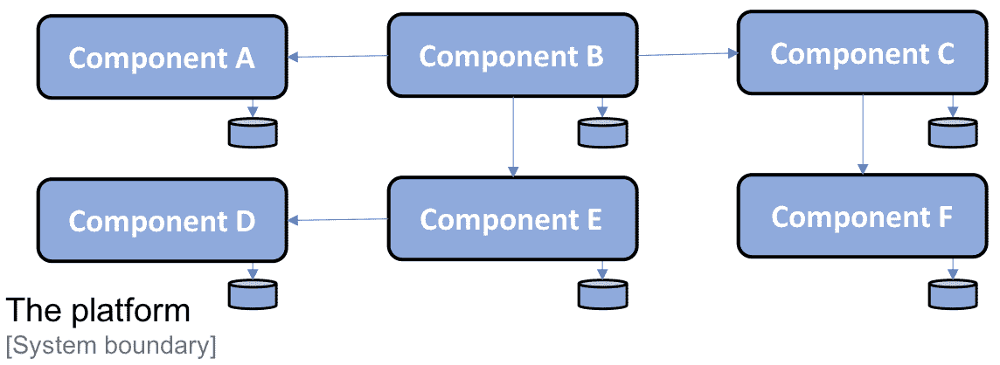
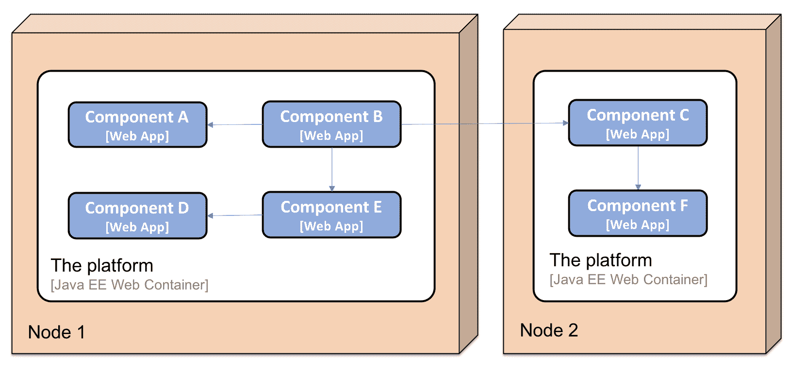
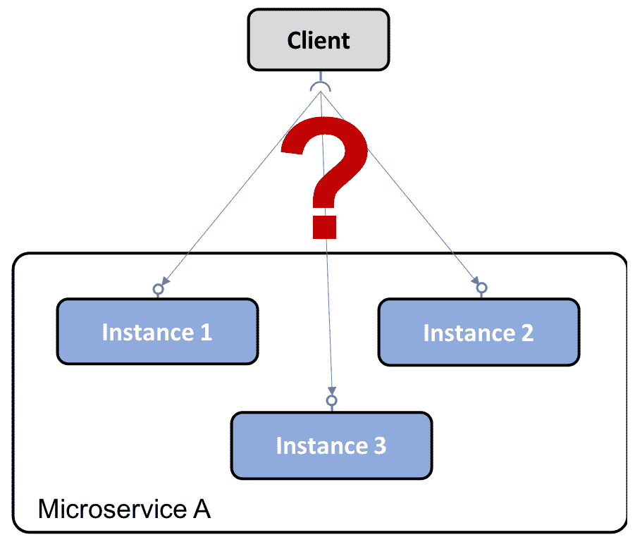
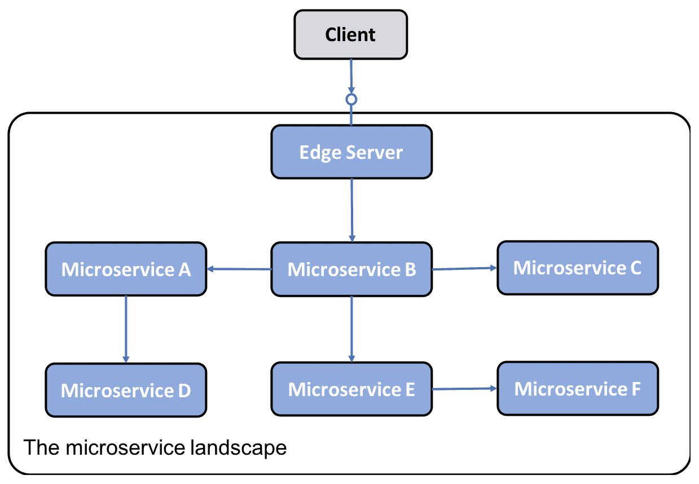
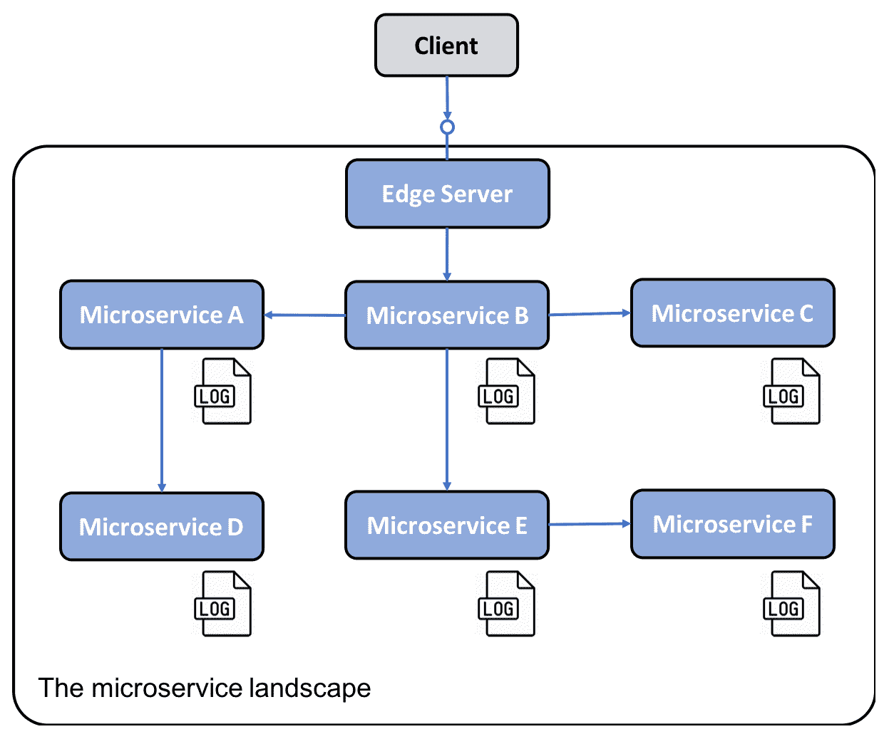
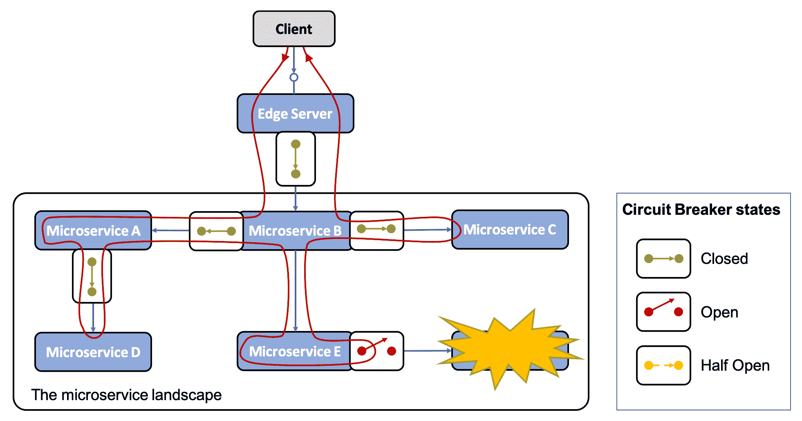
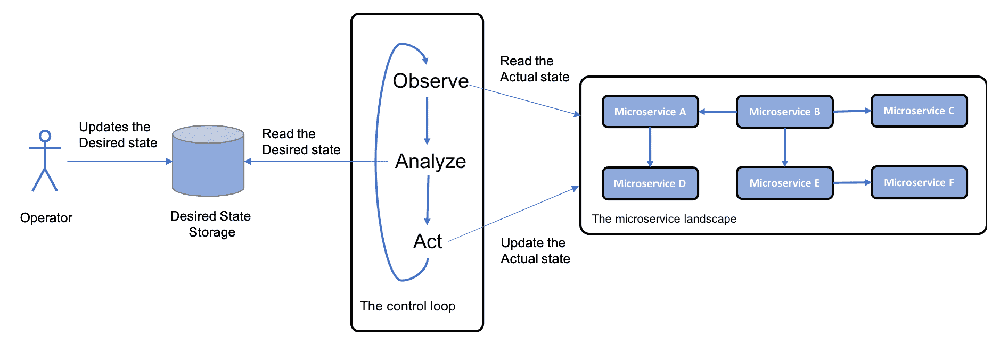

# 一、微服务简介

这本书并没有盲目地赞扬微服务。相反，它是关于我们如何利用它们的好处，同时能够应对构建可伸缩、弹性和可管理的微服务的挑战。

作为本书的导言，本章将介绍以下主题：

*   我是如何了解微服务的，以及我对它们的好处和挑战有哪些经验
*   什么是基于微服务的体系结构？
*   微服务的挑战
*   处理挑战的设计模式
*   可以帮助我们应对这些挑战的软件使能技术
*   本书未涉及的其他重要注意事项

# 技术要求

本章无需安装。但是，您可能有兴趣查看 C4 模型约定，[https://c4model.com](https://c4model.com) ，因为本章中的插图灵感来自 C4 车型。

本章不包含任何源代码。

# 我进入微服务的道路

当我在 2014 年第一次了解到微服务的概念时，我意识到我已经开发微服务（嗯，有点）很多年了，但我并不知道我正在处理的是微服务。我参与了一个始于 2009 年的项目，我们开发了一个基于一系列独立功能的平台。该平台已交付给许多在本地部署该平台的客户。为了方便客户从平台上挑选和选择他们想要使用的功能，每个功能都被开发为一个**自主软件组件**；也就是说，它有自己的持久数据，并且只使用定义良好的 API 与其他组件通信。

由于我无法在本项目的平台上讨论具体的功能，所以我将组件的名称进行了概括，从**组件 A**到**组件 F**。平台组成一组组件的组成如下所示：

每个组件都是使用 Java 和 Spring 框架开发的，打包为 WAR 文件，并作为 web 应用部署在 JavaEEWeb 容器中，例如 ApacheTomcat。根据客户的具体要求，平台可以部署在单个或多个服务器上。两节点部署可能如下所示：

# 自主软件组件的好处

将平台的功能分解为一组自主软件组件可带来许多好处：

*   客户可以在自己的系统环境中部署部分平台，使用其定义良好的 API 将其与现有系统集成。
    以下是一个示例，其中一个客户决定部署**组件 A**、**组件****B**、**组件****D**和**组件****E**与客户系统景观中的两个现有系统**系统 A**和**系统 B**集成：

*   另一个客户可以选择将平台的部分功能替换为客户系统环境中已经存在的实现，这可能需要在一定程度上采用平台 API 中的现有功能。以下是一个示例，其中客户使用自己的实现替换了平台中的**组件 C**和**组件 F**：

*   平台中的每个组件都可以单独交付和升级。由于使用了定义良好的 API，一个组件可以升级到新版本，而不依赖于其他组件的生命周期。
    以下是**组件 A**从**v1.1**版本升级到**v1.2**版本的示例。**组件 B**调用**组件 A**，使用定义良好的 API，不需要升级；也就是说，升级后仍然相同（或者至少向后兼容）：

*   由于使用了定义良好的 API，平台中的每个组件也可以独立于其他组件扩展到多个服务器。可以进行扩展以满足高可用性要求，也可以处理更大量的请求。从技术上讲，这是通过*手动*在多个服务器前面设置负载平衡器来实现的，每个服务器都运行一个 JavaEEWeb 容器。**组件 A**已扩展为三个实例的示例如下所示：

# 自主软件组件的挑战

我们还了解到，分解平台带来了许多新的挑战，在开发更传统的单片应用时，我们没有遇到这些挑战（至少程度不同）：

*   向组件添加新实例需要手动配置负载平衡器和手动设置新节点。这项工作既耗时又容易出错。
*   该平台最初在与之通信的其他系统中容易出错。如果系统及时停止响应从平台发送的请求，那么平台很快就会耗尽关键资源，例如操作系统线程，特别是当暴露于大量并发请求时。这导致平台中的组件挂起甚至崩溃。由于平台中的大多数通信基于同步通信，一个组件崩溃可能导致级联故障；也就是说，崩溃组件的客户端也可能在一段时间后崩溃。这就是所谓的**故障链**。
*   在组件的所有实例中保持配置的一致性和最新性很快成为一个问题，导致大量手动和重复性工作。这不时导致质量问题。
*   就延迟问题和硬件使用情况（例如，CPU、内存、磁盘和网络的使用情况）而言，监控平台的状态比监控单一应用的单个实例要复杂得多。
*   从许多分布式组件收集日志文件，并从这些组件关联相关日志事件也很困难，但也是可行的，因为组件的数量是固定的，并且是预先知道的。

随着时间的推移，我们通过内部开发的工具和用于手动处理这些挑战的详细说明，解决了上述列表中提到的大多数挑战。一般来说，该操作的规模在某种程度上是可以接受的，用于发布组件新版本和处理运行时问题的手动程序，尽管它们并不可取。

# 进入微服务

2014 年，我了解到基于微服务的体系结构，这让我意识到其他项目也面临着类似的挑战（部分原因与我前面描述的不同，例如，大型云服务提供商满足 web 规模的需求）。许多微服务的先驱们已经公布了他们所学到的经验教训的细节。从这些经验教训中学习是非常有趣的

许多先驱者最初开发了单片应用，使他们从商业角度非常成功。但随着时间的推移，这些单片应用变得越来越难以维护和发展。它们也变得具有挑战性，无法扩展到现有最大机器的能力之外（也称为**垂直扩展**。最终，先驱们开始寻找方法，将单片应用拆分为更小的组件，这些组件可以独立发布和扩展。可以水平扩展小型组件，也就是说，在多个较小的服务器上部署一个组件，并在其前面放置一个负载平衡器。如果在云中实现，扩展能力可能是无限的——这只是你引入多少虚拟服务器的问题（考虑到你的组件可以在大量实例上扩展，但以后会更多）。

2014 年，我还了解了一些新的开源项目，这些项目提供了简化微服务开发的工具和框架，可以用来应对基于微服务的体系结构带来的挑战。其中一些措施如下：

*   Pivotal 发布了**Spring Cloud**，对**Netflix OSS**部分进行了封装，以提供动态服务发现、配置管理、分布式跟踪、电路中断等功能。
*   我还了解了**Docker**和集装箱革命，这对于缩小开发和生产之间的差距非常重要。不仅能够将组件打包为可部署的运行时工件（例如，Java、`war`或`jar`文件），而且能够将其打包为一个完整的映像，准备在运行 Docker 的服务器上作为容器（例如，一个独立的进程）启动，这对于开发和测试来说是向前迈出的一大步。
*   容器引擎（如 Docker）不足以在生产环境中使用容器。例如，需要一些东西来确保所有容器都已启动并正在运行，并且它们可以在多个服务器上扩展容器，从而提供高可用性和/或增加计算资源。这些类型的产品被称为**容器编排器***。*在过去几年中，许多产品都在不断发展，如 Apache Mesos、Swarm 模式下的 Docker、Amazon ECS、HashiCorp Nomad 和**Kubernetes**。Kubernetes 最初由谷歌开发。当谷歌发布 v1.0 时，他们还向 CNCF 捐赠了 Kubernetes（[https](https://www.cncf.io/)[://www.CNCF.io/](https://www.cncf.io/)）。2018 年期间，Kubernetes 成为了一种事实上的标准，既可以预先打包供内部使用，也可以作为服务从大多数主要云提供商处获得。
*   我最近开始学习**服务网格**的概念，以及服务网格如何补充容器编排器，从而进一步减轻微服务的责任，使其具有可管理性和弹性。

 **# 微服务环境示例

由于本书无法涵盖我刚才提到的技术的所有方面，因此我将重点介绍自 2014 年以来在客户项目中证明有用的部分。我将描述如何将它们结合起来，创建可管理、可扩展和有弹性的协作微服务。

本书中的每一章都将阐述一个具体的问题。为了展示事物是如何结合在一起的，我将使用一小部分我们将在本书中不断发展的协作微服务：

现在我们知道了微服务的方式和内容，让我们开始研究如何定义微服务。

# 定义微服务

对我来说，微服务体系结构是将单片应用拆分为更小的组件，这实现了两个主要目标：

*   更快的开发，支持连续部署
*   易于手动或自动缩放

微服务本质上是一个可独立升级和可扩展的自主软件组件。为了能够作为自主组件，它必须满足以下特定标准：

*   它必须符合无共享架构；也就是说，微服务之间不共享数据库中的数据！
*   它必须仅通过定义良好的接口进行通信，例如，使用同步服务，或者最好使用 API 和消息格式相互发送消息，这些 API 和消息格式稳定、文档化良好，并通过遵循定义的版本控制策略进行演变。
*   它必须作为单独的运行时进程进行部署。微服务的每个实例都在单独的运行时进程中运行，例如 Docker 容器。
*   微服务实例是无状态的，因此对微服务的传入请求可以由其任何实例处理。

使用一组微服务，我们可以部署到多个较小的服务器上，而不是像部署单片应用那样被迫部署到单个大型服务器上

鉴于已满足上述标准，与扩展大型单片应用相比，将单个微服务扩展到更多实例（例如，使用更多虚拟服务器）更容易。利用云中可用的自动缩放功能也是一种可能性，但对于大型单片应用通常不可行。与升级大型单片应用相比，升级甚至替换单个微服务也更容易

下图说明了这一点，其中一个单片应用被划分为六个微服务，所有这些微服务都部署到一个单独的服务器中。一些微服务也独立于其他微服务进行了扩展：

我经常从客户那里收到这样一个问题：*微服务应该有多大？*

我尝试使用以下经验法则：

*   小到可以放在开发者的头上
*   足够大，不会影响性能（即延迟）和/或数据一致性（存储在不同微服务中的数据之间的 SQL 外键不再是理所当然的）

因此，总而言之，微服务体系结构本质上是一种体系结构风格，我们将单个应用分解为一组相互协作的自主软件组件。其动机是实现更快的开发并使应用更易于扩展。

接下来，我们将继续了解在微服务方面我们将面临的一些挑战。

# 服务发现

**服务****发现**模式有以下问题、解决方案和解决要求。

# 微服务的挑战

在*自主软件组件的挑战*一节中，我们已经看到了自主软件组件可能带来的一些挑战（它们也都适用于微服务），如下所示：

*   许多使用同步通信的小部件会导致*出现**故障链*问题，特别是在高负载下。
*   保持许多小型组件的配置最新可能是一项挑战。
*   很难跟踪正在处理且涉及许多组件的请求，例如，在执行根本原因分析时，每个组件都在本地存储日志事件。
*   在组件级别上分析硬件资源的使用情况也很有挑战性。
*   许多小型组件的手动配置和管理成本高昂，而且容易出错。

将应用分解为一组自治组件的另一个缺点（但最初并不总是很明显）是它们形成了一个分布式系统。分布式系统从本质上来说是很难处理的，这一点已经知道很多年了（但在很多情况下被忽略，直到有不同的证明）。我最喜欢引用 Peter Deutsch 的话来证明这一事实，他在 1994 年指出：

***T*分布式计算的 8 个谬误***：基本上每个人在首次构建分布式应用时都会做出以下八个假设。从长远来看，所有这些都被证明是错误的，都会带来巨大的麻烦和痛苦的学习经历：*

1.  *网络可靠*
2.  *延时为零*
3.  *带宽无限*
4.  *网络安全*
5.  *拓扑结构不变*
6.  *有一个管理员*
7.  *运输成本为零*
8.  *网络是同质的*

*-- Peter Deutsch, 1994*

**注：**第八个谬误实际上是詹姆斯·戈斯林在后来添加的。欲了解更多详情，请访问[https://www.rgoarchitects.com/Files/fallacies.pdf](https://www.rgoarchitects.com/Files/fallacies.pdf) 。

一般来说，基于这些错误假设构建微服务会导致解决方案容易出现临时网络故障和其他微服务实例中出现的问题。当系统环境中的微服务数量增加时，出现问题的可能性也会增加。一个很好的经验法则是，基于系统环境中总是有问题的假设来设计微服务体系结构。微服务体系结构需要设计来处理这个问题，在检测问题和重新启动失败的组件方面，也可以在客户端进行，这样请求就不会发送到失败的 microservice 实例。当问题得到纠正时，应恢复对以前失败的微服务的请求；也就是说，微服务客户端需要具有弹性。当然，所有这些都需要完全自动化。由于有大量的微服务，操作员手动处理这些服务是不可行的！

这项工作的范围很大，但我们现在将限制自己，继续研究微服务的设计模式。

# 微服务的设计模式

本主题将介绍如何使用设计模式来缓解微服务的挑战，如前一节所述。在本书的后面，我们将看到如何使用 SpringBoot、SpringCloud 和 Kubernetes 实现这些设计模式。

设计模式的概念其实很古老；它是由克里斯托弗·亚历山大在 1977 年发明的。本质上，设计模式是在给定特定上下文时描述问题的可重用解决方案

我们将介绍的设计模式如下：

*   服务发现
*   边缘服务器
*   反应式微服务
*   中心配置
*   集中式日志分析
*   分布式跟踪
*   断路器
*   控制回路
*   集中监测和报警

该清单并不全面；相反，它是处理我们前面描述的挑战所需的设计模式的最小列表。

我们将使用轻量级方法来描述设计模式，并重点关注以下内容：

*   问题
*   解决办法
*   解决方案的要求

在本书的后面，我们将深入探讨如何应用这些设计模式。这些设计模式的上下文是协作微服务的系统场景，其中微服务使用同步请求（例如，使用 HTTP）或发送异步消息（例如，使用消息代理）彼此通信。

# 问题

客户端如何找到微服务及其实例？

微服务实例通常在启动时（例如，在容器中运行时）动态分配 IP 地址。这使得客户端很难向微服务发出请求，例如，该微服务通过 HTTP 公开 RESTAPI。考虑下面的图表：

# 解决方案

在系统环境中添加一个新组件**服务发现**服务，该组件跟踪当前可用的微服务及其实例的 IP 地址。

# 解决方案要求

一些解决方案要求如下：

*   自动注册/注销微服务及其实例。
*   客户端必须能够向微服务的逻辑端点发出请求。请求将路由到一个 MicroService 可用实例。
*   对微服务的请求必须在可用实例上进行负载平衡。
*   我们必须能够检测当前不健康的情况；也就是说，请求不会被路由到它们。

**实现说明：**我们将看到，这个设计模式可以使用两种不同的策略来实现：

*   **客户端路由**：客户端使用一个与服务发现服务通信的库，找出合适的实例，将请求发送到该库。
*   **服务器端路由**：服务发现服务的基础设施还公开了一个所有请求都发送到的反向代理。反向代理代表客户端将请求转发到适当的微服务实例。

# 边缘服务器

边缘服务器模式有以下问题、解决方案和解决方案要求。

# 问题

在微服务的系统环境中，在许多情况下，希望将一些微服务暴露在系统环境的外部，并隐藏其余的微服务，使外部无法访问。必须保护暴露的微服务免受恶意客户端的请求。

# 解决方案

将新组件**边缘服务器**添加到所有传入请求都将经过的系统环境中：

实施说明：边缘服务器的行为通常类似于反向代理，可以与发现服务集成以提供动态负载平衡功能。

# 解决方案要求

一些解决方案要求如下：

*   隐藏不应在其上下文之外公开的内部服务；也就是说，仅将请求路由到配置为允许外部请求的微服务
*   公开外部服务并保护其免受恶意请求；也就是说，使用标准协议和最佳实践，如 OAuth、OIDC、JWT 令牌和 API 密钥，以确保客户机是可信的。

# 反应式微服务

反应式微服务模式有以下问题、解决方案和解决方案需求。

# 问题

传统上，作为 Java 开发人员，我们习惯于使用阻塞 I/O 实现同步通信，例如，HTTP 上的 RESTful JSON API。使用阻塞 I/O 意味着从操作系统为请求的长度分配一个线程。如果并发请求的数量增加（和/或请求中涉及的组件的数量增加，例如，协作微服务链的数量增加），服务器可能会耗尽操作系统中的可用线程，从而导致从更长的响应时间到服务器崩溃等问题。

此外，正如我们在本章中已经提到的，过度使用阻塞 I/O 会使微服务系统容易出错。例如，一个服务中延迟的增加可能会导致客户端耗尽可用线程，从而导致它们失败。这反过来会导致客户出现相同类型的问题，也称为故障链。有关如何处理故障链相关问题，请参阅*断路器*部分。

# 解决方案

使用非阻塞 I/O 来确保在等待处理在另一个服务（即数据库或另一个微服务）中发生时没有分配线程。

# 解决方案要求

一些解决方案要求如下：

*   只要可行，使用异步编程模型；也就是说，在不等待接收者处理消息的情况下发送消息。
*   如果首选同步编程模型，请确保使用反应式框架，这些框架可以使用非阻塞 I/O 执行同步请求，也就是说，在等待响应时不分配线程。这将使微服务更易于扩展，以便处理增加的工作负载。
*   微服务还必须设计为具有弹性，即即使它所依赖的服务出现故障，也能够产生响应。一旦失败的服务再次运行，其客户端必须能够恢复使用它，这就是所谓的自我修复。

2013 年，在*反应性宣言*（[中确立了以这些方式设计系统的关键原则 https://www.reactivemanifesto.org/](https://www.reactivemanifesto.org/) ）。根据宣言，反应系统的基础是它们是消息驱动的；也就是说，它们使用异步通信。这使它们具有弹性，即可伸缩性，以及弹性，即对故障的容忍度。弹性和弹性结合在一起，使反应系统能够响应，从而能够及时响应。

# 中心配置

中心配置模式有以下问题、解决方案和解决方案需求。

# 问题

传统上，应用与其配置一起部署，例如，一组环境变量和/或包含配置信息的文件。给定一个基于微服务体系结构的系统环境，即大量部署的微服务实例，会出现一些查询：

*   如何获得所有正在运行的 microservice 实例的配置的完整图片？
*   如何更新配置并确保所有受影响的 microservice 实例都已正确更新？

# 解决方案

将一个新组件**c****配置**服务器添加到系统环境中，以存储所有微服务的配置

# 解决方案要求

可以将一组微服务的配置信息存储在一个地方，并针对不同的环境进行不同的设置（例如，`dev`、`test`、`qa`和`prod`）。

# 集中式日志分析

集中式日志分析有以下问题、解决方案和解决方案需求。

# 问题

传统上，应用将日志事件写入存储在运行应用的本地计算机上的日志文件。给定基于微服务体系结构的系统环境，即在大量较小的服务器上部署大量微服务实例，我们可以问以下问题：

*   当每个 microservice 实例写入其自己的本地日志文件时，如何全面了解系统环境中的情况？
*   我如何确定是否有任何 microservice 实例出现问题并开始将错误消息写入其日志文件？
*   如果最终用户开始报告问题，如何查找相关日志消息；也就是说，我如何确定哪个微服务实例是问题的根本原因？下图说明了该问题：

# 解决方案

添加一个新组件，该组件可以管理**集中式日志记录**，并具备以下功能：

*   检测新的微服务实例并从中收集日志事件
*   在中央数据库中以结构化和可搜索的方式解释和存储日志事件
*   提供用于查询和分析日志事件的 API 和图形工具

# 分布式跟踪

分布式跟踪有以下问题、解决方案和解决方案需求。

# 问题

在处理对系统环境的外部调用时，必须能够跟踪在微服务之间流动的请求和消息。

故障场景的一些示例如下：

*   如果最终用户开始提交有关特定故障的支持案例，我们如何确定导致问题的微服务，即根本原因？
*   如果一个支持案例提到与特定实体（例如，特定订单号）相关的问题，我们如何找到与处理此特定订单相关的日志消息？例如，来自处理此特定订单所涉及的所有微服务的日志消息？

下图描述了这一点：

# 解决方案

为了跟踪协作微服务之间的处理过程，我们需要确保所有相关请求和消息都标记有公共关联 ID，并且关联 ID 是所有日志事件的一部分。基于相关 ID，我们可以使用集中式日志服务查找所有相关日志事件。如果其中一个日志事件还包括有关业务相关标识符的信息，例如，客户 ID、产品、订单等，那么我们可以使用相关 ID 查找该业务标识符的所有相关日志事件。

# 解决方案要求

解决方案要求如下：

*   将唯一的关联 ID 分配给已知位置的所有传入或新请求和事件，例如具有可识别名称的标头。
*   当微服务发出传出请求或发送消息时，它必须将相关 ID 添加到请求和消息中。
*   所有日志事件都必须包含预定义格式的相关 ID，以便集中式日志服务可以从日志事件中提取相关 ID 并使其可搜索。

# 断路器

断路器模式将具有以下问题、解决方案和解决方案要求。

# 问题

使用同步交互通信的微服务系统景观可能会暴露于*故障链*。如果一个微服务停止响应，它的客户机可能也会遇到问题，停止响应客户机的请求。问题可以递归地传播到整个系统环境中，并带走其中的主要部分。

这在使用阻塞 I/O 执行同步请求的情况下尤其常见，即在处理请求时阻塞底层操作系统的线程。再加上大量并发请求和一个开始响应异常缓慢的服务，线程池可能会很快耗尽，导致调用方挂起和/或崩溃。此故障可能会以令人不快的速度传播到调用方的调用方，以此类推。

# 解决方案

添加一个断路器，当它检测到调用的服务有问题时，该断路器可防止来自调用方的新传出请求。

# 解决方案要求

解决方案要求如下：

*   如果检测到服务存在问题，则打开电路并快速故障（不等待超时）。
*   故障修正探头（也称为**半开路**；也就是说，允许定期执行单个请求，以查看服务是否再次正常运行。
*   如果探针检测到维修再次正常工作，则闭合电路。这一能力非常重要，因为它使系统环境能够适应这些问题；也就是说，它可以自我修复。

下图说明了一个场景，其中微服务系统中的所有同步通信都通过断路器。所有断路器均闭合；也就是说，除了一个断路器检测到请求所在服务中的问题外，它们允许通信。因此，该断路器为开路，并采用快速失效逻辑；也就是说，它不会调用失败的服务，而是等待超时发生。在以下情况下，它会立即返回响应，在响应之前可以选择应用一些回退逻辑：

# 控制回路

控制回路模式将有以下问题、解决方案和解决方案需求。

# 问题

在大量微服务实例分布在多个服务器上的系统环境中，手动检测和纠正诸如崩溃或挂起的微服务实例等问题非常困难。

# 解决方案

向系统景观中添加一个新组件**控制回路**；这会不断观察系统景观的实际状态；将其与操作员指定的所需状态进行比较；并在必要时采取行动。例如，如果两种状态不同，则需要使实际状态等于所需状态：

# 解决方案要求

实现说明：在容器世界中，通常使用 Kubernetes 等*容器编排器*来实现此模式。我们将在[第 15 章](15.html)、*Kubernetes 简介*中了解更多关于 Kubernetes 的信息。

# 集中监测和报警

对于此模式，我们将有以下问题、解决方案和解决方案需求。

# 问题

如果观察到的响应时间和/或硬件资源使用率高得令人无法接受，则很难发现问题的根本原因。例如，我们需要能够分析每个微服务的硬件资源消耗。

# 解决方案

为了抑制这种情况，我们在系统环境中添加了一个新组件**监控服务**，该组件能够收集每个微服务实例级别的硬件资源使用指标

# 解决方案要求

解决方案要求如下：

*   它必须能够从系统环境使用的所有服务器（包括自动缩放服务器）收集度量。
*   它必须能够在可用服务器上启动新的微服务实例时检测它们，并开始从中收集度量。
*   它必须能够提供 API 和图形工具来查询和分析收集的度量

下面的屏幕截图显示了 Grafana，它可视化了普罗米修斯（Prometheus）的指标，我们将在本书后面的部分介绍这一监控工具：

这是一个广泛的名单！我相信这些设计模式可以帮助您更好地理解微服务面临的挑战。接下来，我们将继续了解软件使能技术。

# 软件使能器

正如我们已经提到的，我们有许多非常好的开源工具，可以帮助我们满足对微服务的期望，最重要的是，可以应对随之而来的新挑战：

*   SpringBoot
*   SpringCloud/Netflix OSS
*   码头工人
*   Kubernetes
*   Istio（服务网络）

下表列出了我们需要处理这些挑战的设计模式，以及实现设计模式的相应开源工具：

| **设计模式** | **SpringBoot** | **SpringCloud** | **Kubernetes** | **Istio** |
| **服务发现** |  | Netflix Eureka 和 Netflix Ribbon | Kubernetes`kube-proxy`和服务资源 |  |
| **边缘服务器** |  | Spring 云和 Spring 安全 OAuth | Kubernetes入口控制器 | Istio 入口网关 |
| **反应式微服务** | 弹簧反应器和弹簧通量 |  |  |  |
| **中央配置** |  | Spring 配置服务器 | Kubernetes`ConfigMaps`与秘密 |  |
| **集中日志分析** |  |  | Elasticsearch、Fluentd 和 Kibana
**注**：实际上不是 Kubernetes
的一部分，但可以轻松地与 Kubernetes 一起部署和配置 |  |
| **分布式跟踪** |  | SpringCloud侦探和齐普金 |  | 杰格 |
| **断路器** |  | Resilience4j |  | 离群点检测 |
| **控制回路** |  |  | Kubernetes 控制器管理器 |  |
| **集中监控报警** |  |  | 格拉法纳和普罗米修斯
**注：**实际上不是Kubernetes
的一部分，但可以很容易地与Kubernetes一起部署和配置 | 凯利、格拉法纳和普罗米修斯 |

请注意，SpringCloud、Kubernetes 和 Istio 可用于实现一些设计模式，如服务发现、边缘服务器和中心配置。我们将在本书后面讨论使用这些替代方案的利弊。

现在，让我们看看其他一些我们需要考虑的重要事情。

# 其他重要考虑因素

要成功地实现微服务架构，还需要考虑一些相关的领域。我不会在本书中涉及这些领域；相反，我将在这里简单地提到它们，如下所示：

*   **开发/运营的重要性**：**微服务体系结构的一个好处是，它可以缩短交付时间，并且在极端情况下允许*连续交付*新版本。为了能够快速交付，您需要建立一个组织，在这个组织中，开发人员和运营人员按照*的口头禅一起工作*您创建了它，您运行它*。这意味着开发人员不再被允许简单地将软件的新版本传递给操作团队。相反，开发和运营组织需要更紧密地合作，组织成团队，对一个微服务（或一组相关微服务）的端到端生命周期负全部责任。除了`dev`/`ops`的组织部分外，团队还需要自动化交付链，即构建、测试、打包和将微服务部署到各种部署环境的步骤。这被称为建立*输送管道*。***
***   **组织方面和康威定律**：微服务体系结构如何影响组织的另一个有趣方面是*康威定律*，它说明了以下内容：**

 **“任何设计系统（广义定义）的组织都将产生一种设计，其结构是该组织通信结构的副本。”

——梅尔文·康威，1967 年

这意味着，基于其技术专业知识（例如，用户体验、业务逻辑和数据库团队）组织大型应用 IT 团队的传统方法将导致一个大型三层应用——通常是一个大型单片应用，具有一个单独可部署的 UI 单元，一个用于处理业务逻辑，一个用于大型数据库。为了成功交付基于微服务体系结构的应用，需要将组织转变为使用一个或一组相关微服务的团队。团队必须具备这些微服务所需的技能，例如，用于业务逻辑的语言和框架以及用于持久化其数据的数据库技术。

*   **将单片应用分解为微服务：**最困难和最昂贵的决策之一是如何将单片应用分解为一组协作的微服务。如果以错误的方式执行此操作，您将遇到以下问题：

    *   **交付缓慢**：业务需求的变化会影响太多的微服务，导致额外的工作。
    *   **性能慢**：为了能够执行特定的业务功能，需要在各种微服务之间传递大量请求，导致响应时间长。
    *   **不一致数据**：由于相关数据被分离到不同的微服务中，不同微服务管理的数据可能会随着时间的推移出现不一致。

找到微服务适当边界的一个好方法是应用**领域驱动设计**及其**有界上下文**概念。根据 Eric Evans 的说法，*有界上下文*是“*对定义并适用特定模型的边界（通常是子系统或特定团队的工作）的描述。”*这意味着由有界上下文定义的微服务将拥有其自身数据的定义良好的模型

*   **API 设计的重要性：**如果一组微服务公开了一个公共的、外部可用的 API，那么 API 易于理解并使用以下内容是很重要的：
    *   如果在多个 API 中使用相同的概念，那么就使用的命名和数据类型而言，它应该具有相同的描述。
    *   允许 API 以受控的方式发展是非常重要的。这通常需要为 API 应用适当的版本控制模式，例如，[https://semver.org/](https://semver.org/) ，并具有在特定时间段内处理一个 API 的多个主要版本的能力，允许 API 的客户端以自己的速度迁移到新的主要版本。
*   **从本地到云的迁移路径**：**如今，许多公司在本地运行其工作负载，但正在寻找将部分工作负载移动到云的方法。由于目前大多数云提供商都将 Kubernetes 作为一项服务提供，因此一种吸引人的迁移方法可以是首先将工作负载移动到 Kubernetes 内部部署（是否作为微服务），然后将其重新部署到首选云提供商提供的*Kubernetes 作为一项服务*产品上**
***   **良好的微服务设计原则，12 因素应用**：**12 因素应用[https://12factor.net](https://12factor.net/) 是一套用于构建可部署在云中的软件的设计原则。这些设计原则中的大多数都适用于构建微服务，而不依赖于微服务部署的位置和方式，即在云中或内部部署。本书将介绍其中的一些原则，如配置、流程和日志，但不是全部。****

 ****第一章到此为止！我希望这能让您对微服务有一个很好的基本了解，并帮助您理解本书将涉及的大规模主题。

# 总结

在这一介绍性章节中，我描述了自己进入微服务的方式，并深入研究了它们的历史。我们定义了什么是微服务，即一种具有特定需求的自治分布式组件。我们还讨论了基于微服务的体系结构的优点和挑战。

为了应对这些挑战，我们定义了一组设计模式，并简要地将开源产品（如 Spring Boot、Spring Cloud 和 Kubernetes）的功能映射到它们。

你现在很想开发你的第一个微服务，对吗？在下一章中，我们将介绍 SpringBoot 和我们将用于开发第一个微服务的补充开源工具********