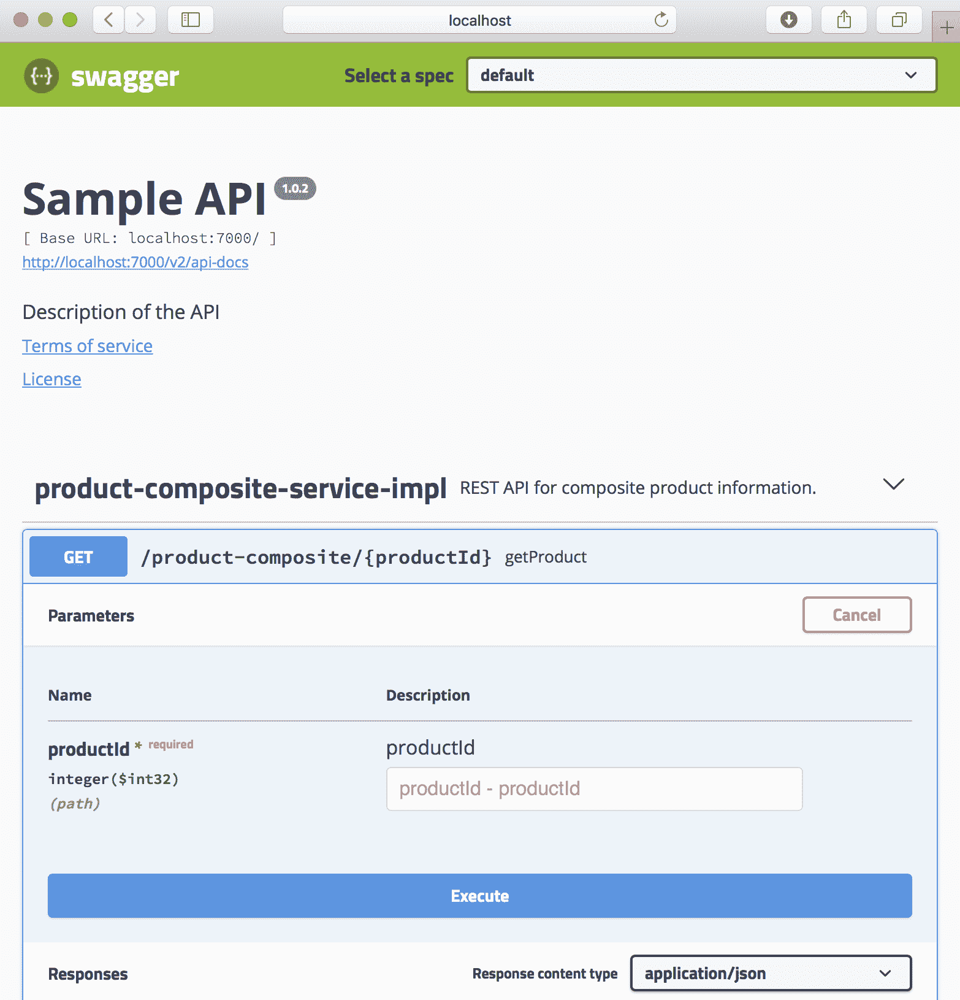

# 二、SpringBoot 简介

在本章中，我们将介绍如何使用 Spring Boot 构建一组协作的微服务，重点介绍如何开发提供业务价值的功能。我们在前一章中指出的挑战将只在某种程度上予以考虑，但它们将在后面几章中得到充分解决。

我们将使用 SpringWebFlux、基于 Swagger/OpenAPI 的 RESTAPI 文档以及 SpringFox 和数据持久性开发包含基于普通 SpringBean 和 RESTAPI 的业务逻辑的微服务，同时使用 Spring 数据在 SQL 和 NoSQL 数据库中存储数据

自 2018 年 3 月 Spring Boot v2.0 发布以来，开发反应式微服务变得更加容易（更多信息，请参阅[第 1 章](01.html)、*微服务简介*、*反应式 mi**微服务*部分）。因此，在本章中，我们还将介绍如何创建反应式微服务，包括非阻塞同步 RESTAPI 和基于消息的异步服务。我们将使用 SpringWebFlux 开发非阻塞同步 RESTAPI，使用 SpringCloudStream 开发基于消息的异步服务。

最后，我们将使用 Docker 将微服务作为容器运行。这将允许我们用一个命令启动和停止我们的微服务环境，包括数据库服务器和消息代理

这有很多技术和框架，所以让我们简单地浏览一下它们，看看它们是关于什么的！ 

在本章中，我们将介绍以下主题：

*   了解 Spring Boot
*   从春季开始
*   探索 SpringFox
*   理解 Spring 数据
*   理解春天的云流
*   了解 Docker

关于每种产品的更多细节将在接下来的章节中提供。

# 技术要求

本章不包含任何可下载的源代码，也不需要安装任何工具。

# 了解 Spring Boot

springboot，以及 springboot 所基于的 Spring 框架，是用 Java 开发微服务的一个很好的框架。

早在 2004 年，当 Spring 框架在 v1.0 中发布时，它的发布是为了修复过于复杂的**J2EE**标准（简称**Java 2 平台，企业版**及其臭名昭著的重量级部署描述符）。Spring 框架基于**依赖项注入**（**DI**的概念，提供了一个更加轻量级的开发模型。与 J2EE 中的部署描述符相比，Spring 框架还使用了更轻量级的 XML 配置文件。

更糟糕的是，在 J2EE 标准中，重量级部署描述符实际上有两种类型：

*   标准部署描述符，以标准化的方式描述配置
*   特定于供应商的部署描述符，在供应商的应用服务器中，将配置映射到供应商专用服务器 java T5.6.J2EE 在 2006 被更名为 OutT7.java EE T8A 简称为 AutoT99Java 平台，企业 eDiscovery1010 最近，神谕将贾维提交给日食基金会。2018 年 2.月，爪哇 EE 更名为雅加达嗯

多年来，尽管 Spring 框架越来越流行，但 Spring 框架中的功能却显著增长。慢慢地，使用不再那么轻量级的 XML 配置文件设置 Spring 应用的负担成了一个问题。

2014 年，SpringBootV1.0 发布，解决了这些问题！

# 配置和 fat JAR 文件的约定

Spring Boot 的目标是快速开发生产就绪的 Spring 应用，因为它对如何从 Spring 框架和第三方产品（如用于记录日志或连接到数据库的库）中设置核心模块持强烈意见。SpringBoot 通过默认情况下应用许多约定来实现这一点，从而最小化配置需求。只要需要，可以通过逐个编写一些配置来覆盖每个约定。这种设计模式被称为配置上的**约定**，将初始配置的需求降至最低

我认为，在需要时，最好使用 Java 和注释编写配置。好的基于 XML 的旧配置文件仍然可以使用，尽管它们比 Spring Boot 引入之前要小得多

除了使用*c**convention 优于配置*之外，Spring Boot 还支持基于独立 JAR 文件（也称为 fat JAR 文件）的运行时模型。在 Spring 启动之前，运行 Spring 应用最常见的方法是将其作为 WAR 文件部署到 JavaEEWeb 服务器上，如 ApacheTomcat。Spring Boot 仍然支持 WAR 文件部署。

fat JAR 文件不仅包含应用本身的类和资源文件，还包含应用所依赖的所有`.jar`文件。这意味着 fat JAR 文件是运行应用所需的唯一 JAR 文件；也就是说，我们只需要将一个 JAR 文件传输到希望运行应用的环境中，而不是将应用的 JAR 文件以及应用所依赖的所有 JAR 文件一起传输。

启动胖 JAR 不需要单独安装 javaeeweb 服务器，比如 apachetomcat。相反，它可以用一个简单的命令启动，比如`java -jar app.jar`，这使它成为在 Docker 容器中运行的完美选择！例如，如果 SpringBoot 应用使用 HTTP 公开 RESTAPI，它将包含一个嵌入式 web 服务器。

# 设置 Spring 启动应用的代码示例

为了更好地理解这意味着什么，让我们看一些源代码示例。

我们将只看一些小的代码片段来指出主要的特性。对于一个完全有效的示例，您必须等到下一章！

# magic@springboot 应用注释

基于约定的自动配置机制可以通过使用`@SpringBootApplication`注释对应用类（即包含静态`main`方法的类）进行注释来启动。下面的代码显示了这一点：

```java
@SpringBootApplication
public class MyApplication {

  public static void main(String[] args) {
    SpringApplication.run(MyApplication.class, args);
  }
}
```

此注释将提供以下功能：

*   它支持组件扫描，即在应用类及其所有子包的包中查找 Spring 组件和配置类。
*   应用类本身成为一个配置类。
*   它支持自动配置，SpringBoot 在类路径中查找可以自动配置的 JAR 文件。例如，如果类路径中有 Tomcat，Spring Boot 将自动将 Tomcat 配置为嵌入式 web 服务器

# 元件扫描

假设应用类的包（或其子包之一）中有以下 Spring 组件：

```java
@Component
public class MyComponentImpl implements MyComponent { ...
```

应用中的另一个组件可以使用`@Autowired`注释自动注入组件，也称为**自动布线**：

```java
public class AnotherComponent {

  private final MyComponent myComponent;

  @Autowired
  public AnotherComponent(MyComponent myComponent) {
    this.myComponent = myComponent;
  }
```

我更喜欢使用构造函数注入（而不是字段和 setter 注入）来保持组件中的状态不变。如果希望能够在多线程运行时环境中运行组件，则不可变状态非常重要。

如果我们想要使用在应用包之外的包中声明的组件，例如，多个 Spring Boot 应用共享的实用程序组件，我们可以使用`@ComponentScan`注释来补充应用类中的`@SpringBootApplication`注释：

```java
package se.magnus.myapp;

@SpringBootApplication
@ComponentScan({"se.magnus.myapp","se.magnus.utils"})
public class MyApplication {
```

我们现在可以从应用代码中的`se.magnus.util`包中自动连接组件，例如，实用程序组件，如下所示：

```java
package se.magnus.utils;

@Component
public class MyUtility { ...
```

此实用程序组件可以自动连接到应用组件中，如下所示：

```java
package se.magnus.myapp.services;

public class AnotherComponent {

 private final MyUtility myUtility;

 @Autowired
 public AnotherComponent(MyUtility myUtility) {
   this.myUtility = myUtility;
 }
```

# 基于 Java 的配置

如果我们想要覆盖 Spring Boot 的默认配置，或者如果我们想要添加我们自己的配置，我们可以简单地用`@Configuration`注释一个类，它将被我们前面描述的组件扫描机制获取。

例如，如果我们想在处理 HTTP 请求时设置一个过滤器（由 Spring WebFlux 处理，如下所述），在处理请求的开始和结束时写入日志消息，我们可以配置一个日志过滤器，如下所示：

```java
@Configuration
public class SubscriberApplication {

  @Bean
  public Filter logFilter() {
    CommonsRequestLoggingFilter filter = new 
        CommonsRequestLoggingFilter();
    filter.setIncludeQueryString(true);
    filter.setIncludePayload(true);
    filter.setMaxPayloadLength(5120);
    return filter;
  }
```

我们也可以将配置直接放在应用类中，因为`@SpringBootApplication`注释意味着`@Configuration`注释。

现在我们已经了解了 Spring Boot，让我们来谈谈 Spring WebFlux。

# 从春季开始

SpringBoot2.0 基于 SpringFramework 5.0，它内置了对开发反应式应用的支持。Spring 框架使用**Project Reactor**作为其反应式支持的基本实现，还附带了一个新的 web 框架 Spring WebFlux，它支持反应式的开发，即非阻塞 HTTP 客户端和服务。

Spring WebFlux 支持两种不同的编程模型：

*   一种基于注释的命令式样式，类似于现有的 web 框架 SpringWebMVC，但支持响应式服务
*   一种新的基于路由器和处理器的面向函数模型

在本书中，我们将使用基于注释的命令式风格来演示将 REST 服务从 SpringWebMVC 移动到 SpringWebFlux，然后开始重构服务以使其完全响应是多么容易。

SpringWebFlux 还提供了一个完全反应式 HTTP 客户端`WebClient`，作为对现有`RestTemplate`客户端的补充。

SpringWebFlux 支持在 servlet 容器上运行（它需要 ServletV3.1 或更高版本），但也支持响应式非基于 servlet 的嵌入式 web 服务器，如 Netty（[https://netty.io/](https://netty.io/) ）。

# 使用 SpringWebFlux 设置 REST 服务的代码示例

在基于 SpringWebFlux 创建 REST 服务之前，我们需要将 SpringWebFlux（以及 SpringWebFlux 所需的依赖项）添加到类路径中，以便在启动期间检测和配置 SpringBoot。Spring Boot 提供了大量方便的*启动器依赖项*，这些依赖项带来了特定的功能，以及每个功能通常需要的依赖项。因此，让我们使用 SpringWebFlux 的 starter 依赖项，然后看看简单的 REST 服务是什么样子！

# 起始依赖项

在本书中，我们将使用 Gradle 作为构建工具，因此 SpringWebFlux 启动器依赖项将添加到`build.gradle`文件中。看起来是这样的：

```java
implementation('org.springframework.boot:spring-boot-starter-webflux')
```

您可能想知道为什么不指定版本号。
我们将在[第 3 章](03.html)中的完整示例中讨论这一点，*创建一组协作的微服务*！

当微服务启动时，SpringBoot 将检测类路径上的 SpringWebFlux 并对其进行配置，以及用于启动嵌入式 web 服务器的其他内容。默认情况下使用 Netty，我们可以从日志输出中看到：

```java
2018-09-30 15:23:43.592 INFO 17429 --- [ main] o.s.b.web.embedded.netty.NettyWebServer : Netty started on port(s): 8080
```

如果我们想从 Netty 切换到 Tomcat 作为嵌入式 web 服务器，我们可以通过将 Netty 从 starter 依赖项中排除并添加 Tomcat 的 starter 依赖项来覆盖默认配置：

```java
implementation('org.springframework.boot:spring-boot-starter-webflux') 
{
 exclude group: 'org.springframework.boot', module: 'spring-boot-
 starter-reactor-netty'
}
implementation('org.springframework.boot:spring-boot-starter-tomcat')
```

重新启动微服务后，我们可以看到 Spring Boot 选择了 Tomcat：

```java
2018-09-30 18:23:44.182 INFO 17648 --- [ main] o.s.b.w.embedded.tomcat.TomcatWebServer : Tomcat initialized with port(s): 8080 (http)
```

# 属性文件

从前面的示例中可以看到，web 服务器是使用端口`8080`启动的。如果要更改端口，可以使用属性文件覆盖默认值。Spring Boot 应用属性文件可以是`.properties`文件或 YAML 文件。默认情况下，它们分别命名为`application.properties`和`application.yml`。

在本书中，我们将使用 YAML 文件，以便嵌入式 web 服务器使用的 HTTP 端口可以更改为`7001`。通过这样做，我们可以避免与同一服务器上运行的其他微服务发生端口冲突。要执行此操作，请在`application.yml`文件中添加以下行：

```java
server.port: 7001
```

# 采样控制器

现在，有了我们选择的 Spring WebFlux 和嵌入式 web 服务器，我们可以像使用 Spring MVC 一样编写 REST 服务，即`RestController`：

```java
@RestController
public class MyRestService {

  @GetMapping(value = "/my-resource", produces = "application/json")
  List<Resource> listResources() {
    ...
  }
```

`listResources()`方法上的`@GetMapping`注释将 Java 方法映射到`host:8080/myResource`URL 上的 HTTP`GET`API。`List<Resource>`类型的返回值将转换为 JSON。

现在我们已经讨论了 SpringWebFlux，让我们看看 SpringFox 是关于什么的。

# 探索 SpringFox

开发 API（例如 RESTful 服务）的一个非常重要的方面是如何对它们进行文档化，以便它们易于使用。谈到 RESTful 服务，Swagger 是记录 RESTful 服务最广泛使用的方法之一。许多领先的 API 网关都支持使用 Swagger 公开 RESTful 服务的文档

2015，StimeBrand 软件向 OpenFAPI 倡议下的 Linux 基金会捐赠了 Savigg 规范，并创建了 OpenAPI 规范。SmartBear 软件提供的工具仍然使用 Swagger 这个名称。

SpringFox 是一个独立于 Spring 框架的开源项目，它可以在运行时创建基于 Swagger 的 API 文档。它是通过在启动时检查应用来实现的，例如，检查`WebFlux`和基于招摇的注释。

在接下来的章节中，我们将看到完整的源代码示例，但现在，以下示例 API 文档的屏幕截图可以：



请注意大的执行按钮，它可以用来实际试用 API，而不仅仅是阅读它的文档！

SpringFox 帮助我们理解了微服务是如何深入到 Spring 框架中的。现在，让我们继续讨论 Spring 数据。

# 理解 Spring 数据

Spring 数据附带了一个通用的编程模型，用于在各种类型的数据库引擎中持久化数据，从传统的关系数据库（SQL 数据库）到各种类型的 NoSQL 数据库引擎，如文档数据库（例如 MongoDB）、键值数据库（例如 Redis）和图形数据库（例如 Neo4J）。

Spring 数据项目分为几个子项目，在本书中，我们将使用映射到 MySQL 数据库的 MongoDB 和 JPA 的 Spring 数据子项目。

**JPA** stands for **Java Persistence API** and is a Java specification about how to handle relational data. Please go to [https://jcp.org/aboutJava/communityprocess/mrel/jsr338/index.html](https://jcp.org/aboutJava/communityprocess/mrel/jsr338/index.html) for the latest specification, which is JPA 2.2 at the time of writing.

Spring 数据中编程模型的两个核心概念是实体和存储库。实体和存储库概括了如何从各种类型的数据库中存储和访问数据。它们提供了一个通用的抽象，但仍然支持向实体和存储库添加特定于数据库的行为。请记住，更多细节将在接下来的章节中提供！

尽管 Spring 数据为不同类型的数据库提供了一个通用的编程模型，但这并不意味着您能够编写可移植的源代码，例如，将数据库技术从 SQL 数据库切换到 NoSQL 数据库，而无需对源代码进行更改！

# 实体

实体描述将由 Spring 数据存储的数据。通常，实体类使用通用 Spring 数据注释和特定于每种数据库技术的注释的组合进行注释。

例如，将存储在关系数据库中的实体可以使用 JPA 注释进行注释，例如：

```java
import javax.persistence.Entity;
import javax.persistence.Id;
import javax.persistence.IdClass;
import javax.persistence.Table;

@Entity
@IdClass(ReviewEntityPK.class)
@Table(name = "review")
public class ReviewEntity {
 @Id private int productId;
 @Id private int reviewId;
 private String author;
 private String subject;
 private String content;
```

如果实体要存储在 MongoDB 数据库中，那么 Spring Data MongoDB 子项目中的注释可以与通用 Spring 数据注释一起使用。例如，考虑下面的代码：

```java
import org.springframework.data.annotation.Id;
import org.springframework.data.annotation.Version;
import org.springframework.data.mongodb.core.mapping.Document;

@Document
public class RecommendationEntity {

    @Id
    private String id;

    @Version
    private int version;

    private int productId;
    private int recommendationId;
    private String author;
    private int rate;
    private String content;
```

`@Id`和`@Version`注释是通用注释，`@Document`注释是专门针对 Spring 数据 MongoDB 子项目的。

这可以通过研究进口声明来揭示；也就是说，包含`mongodb`的导入语句来自 Spring 数据 MongoDB 子项目。

# 存储库

存储库用于存储和访问来自不同类型数据库的数据。在其最基本的形式中，存储库可以声明为 Java 接口，Spring 数据将使用自以为是的约定动态生成其实现。这些约定可以被其他配置和（如果需要）一些 Java 代码覆盖和/或补充。Spring 数据还附带一些基本 Java 接口，例如，`CrudRepository`，以使存储库的定义更加简单。基本接口`CrudRepository`为我们提供了创建、读取、更新和删除操作的标准方法。

要指定用于处理 JPA 实体的存储库`ReviewEntity`，我们只需要声明以下内容：

```java
import org.springframework.data.repository.CrudRepository;

public interface ReviewRepository extends CrudRepository<ReviewEntity, ReviewEntityPK> {
    Collection<ReviewEntity> findByProductId(int productId);
}
```

在本例中，我们使用一个类`ReviewEntityPK`来描述复合主键。情况如下：

```java
public class ReviewEntityPK implements Serializable {
    public int productId;
    public int reviewId;
}
```

我们还添加了一个额外的方法，`findByProductId`，它允许我们基于`productId`来查找`Review`实体，该字段是主键的一部分。方法的命名遵循 Spring 数据定义的命名约定，该约定允许 Spring 数据动态生成此方法的实现。

如果我们想使用存储库，我们可以简单地注入它，然后开始使用它，例如：

```java
private final ReviewRepository repository;

@Autowired
public ReviewService(ReviewRepository repository) {
 this.repository = repository;
}

public void someMethod() {
  repository.save(entity);
  repository.delete(entity);
  repository.findByProductId(productId);
```

除了`CrudRepository`接口之外，Spring Data 还提供了一个反应性基本接口`ReactiveCrudRepository`，它支持反应性存储库。此接口中的方法不返回对象或对象集合；相反，它们返回`Mono`和`Flux`对象。`Mono`和`Flux`对象是能够返回`0`或`0`的反应流。。`1`或`0`。。`m`当实体在流中可用时。基于反应式的接口只能由支持反应式数据库驱动程序的 Spring 数据子项目使用；也就是说，它们基于非阻塞 I/O。Spring Data MongoDB 子项目支持反应式存储库，而 Spring Data JPA 不支持。

如前所述，指定用于处理 MongoDB 实体`RecommendationEntity`的反应式存储库可能如下所示：

```java
import org.springframework.data.repository.reactive.ReactiveCrudRepository;
import reactor.core.publisher.Flux;

public interface RecommendationRepository extends ReactiveCrudRepository<RecommendationEntity, String> {
    Flux<RecommendationEntity> findByProductId(int productId);
}
```

关于 Spring 数据的部分到此结束。现在让我们看看春天的云流是关于什么的。

# 理解春天的云流

在本章中，我们将不重点讨论春天的云；我们将从[第 9 章](09.html)、*添加使用 Netflix Eureka 和 Ribbon 的服务发现*到[第 14 章](14.html)、*理解分布式跟踪*进行此操作。但是，我们将引入 Spring Cloud 的一个模块：Spring Cloud Stream。Spring Cloud Stream 基于发布和订阅集成模式，通过消息传递提供流式抽象。Spring Cloud Stream 目前支持 Apache Kafka 和 RabbitMQ 开箱即用。有许多独立的项目提供与其他流行消息传递系统的集成。参见[https://github.com/spring-cloud?q=binder](https://github.com/spring-cloud?q=binder) 了解更多详情。

Spring Cloud Stream 中的核心概念如下：

*   **消息：**一种数据结构，用于描述发送到消息系统和从消息系统接收到的数据。
*   **发布者：**向消息系统发送消息。
*   **订户**：接收来自消息系统的消息
*   **通道：**用于与消息系统通信。发布者使用输出通道，订阅者使用输入通道。
*   **活页夹：**活页夹提供与特定消息传递系统的实际集成，类似于 JDBC 驱动程序对特定类型的数据库所做的操作

要使用的实际消息传递系统在运行时确定，具体取决于类路径上的内容。Spring Cloud Stream 附带了关于如何处理消息传递的自以为是的约定。可以通过指定消息传递功能的配置来覆盖这些约定，如消费群体、分区、持久性、持久性和错误处理，如重试和死信队列处理。

# 使用 Spring Cloud Stream 发送和接收消息的代码示例

为了更好地理解这一切是如何结合在一起的，让我们看一些源代码示例。

假设我们有一个简单的消息类，如下所示（为了提高可读性，省略了构造函数、getter 和 setter）：

```java
public class MyMessage {
  private String attribute1 = null;
  private String attribute2 = null;
```

Spring Cloud Stream 带有默认的输入和输出通道，`Sink`和`Source`，所以我们不需要创建自己的通道就可以开始了。要发布消息，我们可以使用以下源代码：

```java
import org.springframework.cloud.stream.messaging.Source;

@EnableBinding(Source.class)
public class MyPublisher {

 @Autowired private Source mysource;

 public String processMessage(MyMessage message) {
   mysource.output().send(MessageBuilder.withPayload(message).build());
```

要接收消息，我们可以使用以下代码：

```java
import org.springframework.cloud.stream.messaging.Sink;

@EnableBinding(Sink.class)
public class MySubscriber {

 @StreamListener(target = Sink.INPUT)
 public void receive(MyMessage message) {
 LOG.info("Received: {}",message);
```

要绑定到 RabbitMQ，我们将在构建文件`build.gradle`中使用专用的启动程序依赖项：

```java
implementation('org.springframework.cloud:spring-cloud-starter-stream-rabbit')
```

为了让订阅服务器从发布服务器接收消息，我们需要将输入和输出通道配置为使用相同的目标。如果我们使用 YAML 来描述我们的配置，那么对于发布者来说可能如下所示：

```java
spring.cloud.stream:
  default.contentType: application/json
  bindings.output.destination: mydestination
```

订阅服务器的配置如下所示：

```java
spring.cloud.stream:
  default.contentType: application/json
  bindings.input.destination: mydestination
```

我们使用`default.contentType`来指定我们更喜欢将消息序列化为 JSON 格式

现在我们已经了解了各种 SpringAPI，让我们在下一节中了解一个相对较新的概念 Docker。

# 了解 Docker

我假设 Docker 和容器的概念不需要深入介绍。Docker 容器作为虚拟机的轻量级替代品的概念在 2013 年非常流行。容器实际上是在 Linux 主机中处理的，该主机使用 Linux**名称空间**在容器之间提供全局系统资源，如用户、进程、文件系统和网络。Linux 控制组（也称为**cgroups**）用于限制容器允许消耗的 CPU 和内存量。与使用虚拟机监控程序在每个虚拟机中运行操作系统的完整副本的虚拟机相比，容器中的开销只是虚拟机开销的一小部分。这将导致更快的启动时间，并显著降低 CPU 和内存使用方面的开销。然而，为容器提供的隔离并不像为虚拟机提供的隔离那样安全。随着 Windows Server 2016 的发布，Microsoft 支持在 Windows 服务器中使用 Docker。

容器在开发和测试期间都非常有用。能够用一个测试命令启动一个完整的微服务和资源管理器（例如，数据库服务器、消息传递代理等）协作的系统环境简直太神奇了。

例如，我们可以编写脚本来自动化微服务环境的端到端测试。测试脚本可以启动微服务环境，使用公开的服务运行测试，并拆除环境。这种类型的自动测试脚本非常有用，既可以在将代码推送到源代码存储库之前在开发人员 PC 上本地运行，也可以作为交付管道中的一个步骤执行。每当开发人员将代码推送到源存储库时，构建服务器可以在其持续集成和部署过程中运行这些类型的测试。

对于生产使用，我们需要一个容器编排器，比如 Kubernetes。我们将在本书后面的部分回到容器编排器和 Kubernetes

对于本书中介绍的大多数微服务，将微服务作为 Docker 容器运行所需的 Docker 文件如下：

```java
FROM openjdk:12.0.2

MAINTAINER Magnus Larsson <magnus.larsson.ml@gmail.com>

EXPOSE 8080
ADD ./build/libs/*.jar app.jar
ENTRYPOINT ["java","-jar","/app.jar"]
```

如果我们想用一个命令启动和停止多个容器，Docker Compose 是一个完美的工具。Docker Compose 使用 YAML 文件描述要管理的容器。对于我们的微服务，它可能看起来如下所示：

```java
product:
 build: microservices/product-service

recommendation:
 build: microservices/recommendation-service

review:
  build: microservices/review-service

composite:
  build: microservices/product-composite-service
  ports:
    - "8080:8080"
```

让我稍微解释一下前面的源代码：

*   `build`指令用于指定每个微服务使用哪个 Dockerfile。Docker Compose 将使用它构建 Docker 映像，然后基于该 Docker 映像启动 Docker 容器
*   复合服务的`ports`指令用于公开 Docker 运行的服务器上的端口`8080`。在开发人员的机器上，这意味着只需使用`localhost:8080`即可访问复合服务的端口！

可以使用以下简单命令管理 YAML 文件中的所有容器：

*   `docker-compose up -d`：启动所有容器。`-d`表示容器在后台运行，不锁定执行命令的终端。
*   `docker-compose down`：停止并移除所有容器。
*   `docker-compose logs -f --tail=0`：打印所有容器中的日志消息。`-f`表示命令不会完成，而是等待新的日志消息。`--tail=0`表示我们不希望看到任何以前的日志消息，只希望看到新的日志消息。

这是对 Docker 的简要介绍。我们将在本书的最后几章中详细介绍 Docker。

# 总结

在本章中，我们介绍了 Spring Boot 和可用于构建协作微服务的补充开源工具。

Spring Boot 用于简化基于 Spring 的、可用于生产的应用的开发。在如何从 Spring 框架和第三方产品中设置核心模块方面，它有着强烈的主张。

SpringWebFlux 是 Spring 系列中的一个新模块，用于开发反应式（即非阻塞）REST 服务。它在轻量级 web 服务器（如 Netty）和任何 Servlet3.1+兼容的 web 服务器上运行。它还支持来自旧的 Spring MVC 模块的编程模型；将为 SpringMVC 编写的 REST 服务迁移到 SpringWebFlux 很容易，而无需完全重写代码。

SpringFox 可用于创建有关 REST 服务的基于 Swagger 和 OpenAPI 的文档。它通过检查 REST 服务的注释（包括 Spring 注释和一些特定于招摇过市的注释，如果使用的话），在运行时动态创建文档。

Spring 数据为使用实体和存储库访问和操作持久数据提供了一个优雅的抽象。编程模型类似，但不能在不同类型的数据库（例如关系数据库、文档数据库、键值数据库和图形数据库）之间移植。

SpringCloudStream 基于发布和订阅集成模式，通过消息传递提供流抽象。SpringCloudStream 附带了对 ApacheKafka 和 RabbitMQ 的开箱即用支持，但可以扩展到使用自定义绑定支持其他消息传递代理。

Docker 使容器的概念成为虚拟机的轻量级替代品，易于使用。基于 Linux 名称空间和控制组，容器提供了与传统虚拟机类似的隔离，但在 CPU 和内存使用方面的开销显著降低。Docker 是一个非常好的开发和测试工具，但在大多数情况下需要在生产环境中使用容器编排器，如 Kubernetes。

# 问题

1.  `@SpringBootApplication`注释的目的是什么？
2.  开发 REST 服务的旧的 Spring 组件、SpringWebMVC 和新的 SpringWebFlux 之间的主要区别是什么？
3.  SpringFox 如何帮助开发人员记录 RESTAPI？
4.  Spring 数据中存储库的功能是什么？存储库最简单的实现是什么？
5.  春天云流中的活页夹的用途是什么？
6.  Docker Compose 的目的是什么？