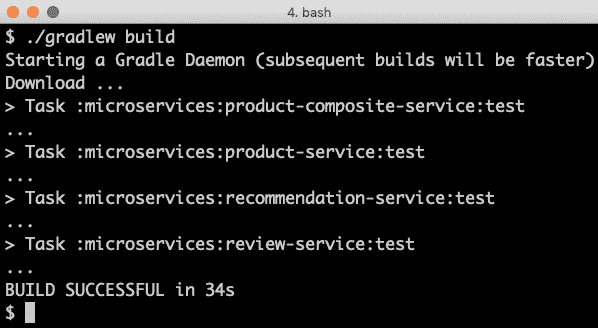
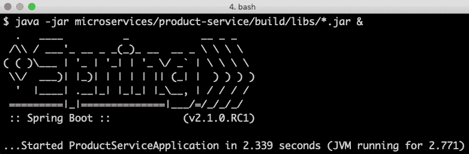
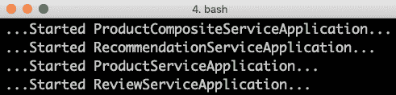
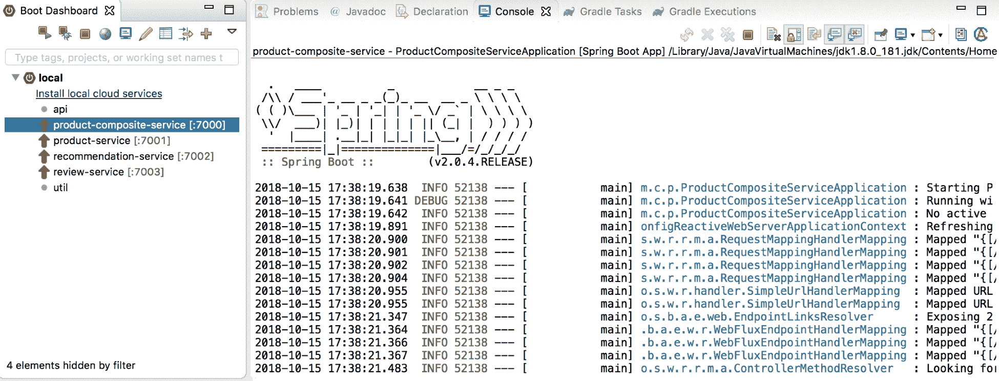
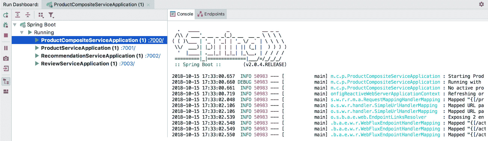
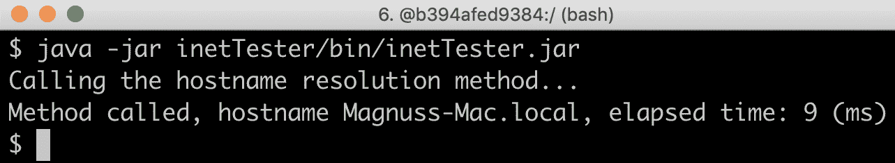

# 三、创建一组协作的微服务

在本章中，我们将构建我们的第一对微服务。我们将学习如何创建具有最低功能的协作微服务。在接下来的章节中，我们将为这些微服务添加越来越多的功能。在本章结束时，我们将有一个由复合微服务公开的 RESTful API。复合微服务将使用 RESTfulAPI 调用其他三个微服务，以创建聚合响应。

本章将介绍以下主题：

*   微服务景观介绍

*   生成骨架微服务
*   添加 RESTful API

*   添加复合微服务
*   添加错误处理
*   手动测试 API
*   单独添加微服务的自动化测试
*   向微服务环境中添加半自动化测试

# 技术要求

本书中描述的所有命令都是使用 macOS Mojave 在 MacBook Pro 上运行的，但修改起来应该很简单，以便可以在其他平台（如 Linux 或 Windows）上运行。

# 工具安装

为了能够执行本章中使用的命令，您需要在计算机上安装以下工具：

*   **Git:**可从[下载安装 https://git-scm.com/downloads](https://git-scm.com/downloads) 。
*   **Java:**可从[下载安装 https://www.oracle.com/technetwork/java/javase/downloads/index.html](https://www.oracle.com/technetwork/java/javase/downloads/index.html) 。

*   `curl`：这个用于测试基于 HTTP 的 API 的命令行工具可以从[下载并安装 https://curl.haxx.se/download.html](https://curl.haxx.se/download.html) 。
*   `jq`：此命令行 JSON 处理器可从[下载并安装 https://stedolan.github.io/jq/download/](https://stedolan.github.io/jq/download/) 。
*   **Spring Boot CLI**：这个用于 Spring Boot 应用的命令行工具可以从[下载并安装 https://docs.spring.io/spring-boot/docs/current/reference/html/getting-started-installing-spring-boot.html#getting-已开始安装 cli](https://docs.spring.io/spring-boot/docs/current/reference/html/getting-started-installing-spring-boot.html#getting-started-installing-the-cli)。

# 安装自制软件

要在 macOS 上安装这些工具，我建议您使用自制软件[https://brew.sh/](https://brew.sh/) 。如果尚未安装，可以使用以下命令安装：

```java
/usr/bin/ruby -e "$(curl -fsSL https://raw.githubusercontent.com/Homebrew/install/master/install)"
```

安装用于 Xcode 的命令行工具会安装 Homebrew，因此如果尚未安装，可能需要一段时间。

使用以下命令验证自制软件的安装：

```java
brew --version
```

期望得到如下响应：

```java
Homebrew 1.7.7
```

# 使用自制软件安装 Java、curl、jq 和 Spring Boot CLI

在 macOS 上，`curl`已经预装，`git`作为自制软件安装的一部分安装。剩余的工具可以通过以下命令使用自制软件安装在 macOS 上：

```java
brew tap pivotal/tap && \
brew cask install java && \
brew install jq && \
brew install springboot
```

这些工具的安装可通过以下命令进行验证：

```java
git --version
java -version
curl --version
jq --version
spring --version 
```

这些命令将返回如下内容（删除了一些额外的无关输出）：


# 使用 IDE

我建议您使用支持 Spring 启动应用开发的 IDE 来处理 Java 代码，如 Spring 工具套件或 IntelliJ IDEA Ultimate Edition。请参阅*手动测试 API*部分，了解如何使用 Spring Boot 仪表板。但是，您不需要 IDE 就能按照本书中的说明进行操作。

# 访问源代码

本章的源代码可以在本书的 GitHub 存储库中找到：[https://github.com/PacktPublishing/Hands-On-Microservices-with-Spring-Boot-and-Spring-Cloud/tree/master/Chapter03](https://github.com/PacktPublishing/Hands-On-Microservices-with-Spring-Boot-and-Spring-Cloud/tree/master/Chapter03) 。

为了能够运行本书中描述的命令，请将源代码下载到一个文件夹，并设置一个指向该文件夹的环境变量`$BOOK_HOME`。一些示例命令如下所示：

```java
export BOOK_HOME=~/Documents/Hands-On-Microservices-with-Spring-Boot-and-Spring-Cloud
git clone https://github.com/PacktPublishing/Hands-On-Microservices-with-Spring-Boot-and-Spring-Cloud $BOOK_HOME
cd $BOOK_HOME/Chapter03
```

Java 源代码是为 Java8 编写的，经过测试可以在 Java12 上运行。为了避免 Spring Boot 2.0（和 Spring 5.0）出现一些问题，本章使用 Spring Boot 2.1.0 RC1（和 Spring 5.1.1），这是编写本文时可用的 Spring Boot 的最新版本。

本章中的代码示例均来自`$BOOK_HOME/Chapter03`中的源代码，但在许多情况下，都经过编辑以删除源代码中不相关的部分，如注释、导入和日志语句。

这样，我们就安装了所需的工具，并下载了本章的源代码。在下一节中，我们将了解我们将在本章中创建的协作微服务的系统环境

# 介绍微服务领域

在[第 1 章](01.html)*微服务简介*中，我们简要介绍了我们将在本书中使用的基于微服务的系统场景：


它包括三个核心微服务，**产品**、**审查**和**推荐**服务，所有这些服务都处理一种类型的资源，以及一个称为**产品复合**服务的复合微服务，该复合微服务聚合来自三个核心服务的信息

# 临时替换发现服务

由于在此阶段，我们没有任何服务发现机制，因此我们将为每个微服务使用硬编码端口号。我们将使用以下端口：

*   产品组合服务：`7000`
*   产品服务：`7001`
*   审核服务：`7002`
*   推荐服务：`7003`

稍后当我们开始使用 Docker 和 Kubernetes 时，我们将去掉硬编码端口！

在本节中，我们已经介绍了我们将要创建的微服务以及它们将处理的信息。在下一节中，我们将使用 Spring Initializer 为微服务创建框架代码。

# 由微服务处理的信息

为了使本书中的源代码示例易于理解，它们只有少量的业务逻辑。出于同样的原因，它们处理的业务对象的信息模型保持最小。在本节中，我们将介绍每个微服务处理的信息，以及微服务处理的基础设施相关信息。

# 产品服务

`product`服务管理产品信息，并用以下属性描述每个产品：

*   产品 ID
*   名称
*   重量

# 复习服务

`review`服务管理产品评审，并存储有关每次评审的以下信息：

*   产品 ID
*   审查 ID
*   著者
*   主题
*   所容纳之物

# 推荐服务

`recommendation`服务管理产品推荐，并存储关于每个推荐的以下信息：

*   产品 ID
*   推荐 ID
*   著者
*   速度
*   所容纳之物

# 产品组合服务

product composite 服务汇总来自三个核心服务的信息，并按如下方式显示有关产品的信息：

*   产品信息，如`product`服务中所述
*   指定产品的产品审查列表，如`review`服务中所述
*   `recommendation`服务中描述的指定产品的产品建议列表

# 基础设施相关信息

一旦我们开始将微服务作为由基础设施（首先是 Docker，然后是 Kubernetes）管理的容器来运行，跟踪哪个容器实际响应了我们的请求将是一件有趣的事情。为了简化跟踪，我们还为所有响应添加了一个`serviceAddress`属性，格式为`hostname/ip-address:port`。

# 生成骨架微服务

现在是时候看看我们如何为我们的微服务创建项目了。此主题的最终结果可在`$BOOK_HOME/Chapter03/1-spring-init`**文件夹中找到。为了简化项目的设置，我们将使用 Spring Initializer 为每个微服务生成一个框架项目。框架项目包含构建项目所需的文件，以及用于微服务的空`main`类和测试类。之后，我们将看到如何在我们将使用的构建工具 Gradle 中使用多项目构建，通过一个命令构建所有的微服务。**

 **# 使用 Spring 初始化器生成框架代码

为了开始开发我们的微服务，我们将使用名为**Spring Initializer**的工具为我们生成框架代码。它可以使用[从 web 浏览器调用 https://start.spring.io/](https://start.spring.io/) URL 或通过命令行工具`spring init`。为了更容易地重现微服务的创建，我们将使用命令行工具。

对于每个微服务，我们将创建一个 Spring Boot 项目，该项目将执行以下操作：

*   使用 Gradle 作为构建工具
*   为 Java8 生成代码
*   将项目打包为 fat JAR 文件
*   引入了`Actuator`和`WebFlux`弹簧模块的依赖项
*   基于 Spring Boot v2.1.0 RC1（取决于 Spring Framework v5.1.1）

Spring Boot Actuator 为管理和监视提供了许多有价值的端点。我们稍后将看到他们的行动。SpringWebFlux 将用于创建我们的 RESTfulAPI。

要为我们的微服务创建框架代码，我们需要为`product-service`运行以下命令：

```java
spring init \
--boot-version=2.1.0.RC1 \
--build=gradle \
--java-version=1.8 \
--packaging=jar \
--name=product-service \
--package-name=se.magnus.microservices.core.product \
--groupId=se.magnus.microservices.core.product \
--dependencies=actuator,webflux \
--version=1.0.0-SNAPSHOT \
product-service
```

如果您想了解有关`spring init`CLI 的更多信息，可以运行`spring help init`命令。要查看可以添加哪些依赖项，请运行`spring init --list`命令。

如果您想自己创建这四个项目，而不是使用本书 GitHub 存储库中的源代码，请尝试`$BOOK_HOME/Chapter03/1-spring-init/create-projects.bash`，如下所示：

```java
mkdir some-temp-folder cd some-temp-folder
$BOOK_HOME/Chapter03/1-spring-init/create-projects.bash
```

使用`create-projects.bash`创建我们的四个项目后，我们将拥有以下文件结构：

```java
microservices/
├── product-composite-service
├── product-service
├── recommendation-service
└── review-service
```

对于每个项目，我们可以列出创建的文件。让我们为`product-service`项目这样做：

```java
find microservices/product-service -type f
```

我们将收到以下输出：


Spring Initializer 为 Gradle 创建了许多文件，包括一个`.gitignore`文件和三个 Spring 启动文件：

*   `ProductServiceApplication.java`，我们的主要应用类
*   `application.properties`，一个空的属性文件
*   `ProductServiceApplicationTests.java`，一个测试类，已配置为使用 JUnit 在 Spring Boot 应用上运行测试

`main`应用类`ProductServiceApplication.java`看起来就像我们在上一章中所期望的：

```java
package se.magnus.microservices.core.product;

@SpringBootApplication
public class ProductServiceApplication {
   public static void main(String[] args) {
      SpringApplication.run(ProductServiceApplication.class, args);
   }
}
```

测试类如下所示：

```java
package se.magnus.microservices.core.product;

@RunWith(SpringRunner.class)
@SpringBootTest
public class ProductServiceApplicationTests {
   @Test
   public void contextLoads() {
   }
}
```

`@RunWith(SpringRunner.class)`和`@SpringBootTest`注释将以与`@SpringBootApplication`运行应用时相同的方式初始化我们的应用；也就是说，将在使用组件扫描和自动配置执行测试之前设置 Spring 应用上下文，如前一章所述。

我们还来看看最重要的 Gradle 文件，`build.gradle`。该文件的内容描述了如何构建项目，例如编译、测试和打包源代码。Gradle 文件首先通过声明`buildscript`元素并列出要应用的插件来设置构建文件其余部分的条件：

```java
buildscript {
  ext {
    springBootVersion = '2.1.0.RC1'
  }
  repositories {
    mavenCentral()
    maven { url "https://repo.spring.io/snapshot" }
    maven { url "https://repo.spring.io/milestone" }
  }
  dependencies {
    classpath("org.springframework.boot:spring-boot-gradle-
    plugin:${springBootVersion}")
  }
}

apply plugin: 'java'
apply plugin: 'eclipse'
apply plugin: 'org.springframework.boot'
apply plugin: 'io.spring.dependency-management'
```

让我们更详细地解释前面的源代码：

*   Spring 启动版本设置为我们在运行`spring init`命令`2.1.0.RC1`时指定的版本。
*   声明了许多 Gradle 插件。最重要的是`org.springframework.boot`和`io.spring.dependency-management`插件，它们一起确保 Gradle 将构建一个胖 JAR 文件，并且我们不需要在 Spring Boot starter 依赖项上指定任何明确的版本号。相反，它们由`springBootVersion`属性暗示。
*   插件是从中央 Maven 存储库以及 Spring 的快照和里程碑存储库中获取的，因为我们已经指定了 Spring Boot 的候选版本 v2.1.0 RC1，而不是已经发布并在中央 Maven 存储库中可用的版本。

在构建文件的其余部分中，我们基本上声明了项目的组名和版本、Java 版本及其依赖项：

```java
group = 'se.magnus.microservices.core.product'
version = '1.0.0-SNAPSHOT'
sourceCompatibility = 1.8

repositories {
  mavenCentral()
  maven { url "https://repo.spring.io/snapshot" }
  maven { url "https://repo.spring.io/milestone" }
}

dependencies {
  implementation('org.springframework.boot:spring-boot-starter-
  actuator')
  implementation('org.springframework.boot:spring-boot-starter-
  webflux')
  testImplementation('org.springframework.boot:spring-boot-starter-
  test')
  testImplementation('io.projectreactor:reactor-test')
}
```

下面让我们更详细地解释前面的源代码：

*   与前面的插件一样，依赖项从中央 Maven 存储库以及 Spring 的快照和里程碑存储库获取。
*   依赖项是按照`Actuator`和`WebFlux`模块中的规定设置的，还有一些有用的测试依赖项。

我们可以使用以下命令分别构建每个微服务：

```java
cd microservices/product-composite-service; ./gradlew build; cd -; \
cd microservices/product-service;           ./gradlew build; cd -; \
cd microservices/recommendation-service;    ./gradlew build; cd -; \ cd microservices/review-service;            ./gradlew build; cd -; 
```

注意我们如何使用由 Spring Initializer 创建的`gradlew`可执行文件；也就是说，我们不需要安装 Gradle！

我们第一次用`gradlew`运行命令时，它会自动下载 Gradle。所使用的渐变版本由`gradle/wrapper/gradle-wrapper.properties`文件中的`distributionUrl`属性确定。

# 在 Gradle 中设置多项目构建

为了简化用一个命令构建所有微服务的过程，我们可以在 Gradle 中设置一个多项目构建。步骤如下：

1.  首先，我们创建`settings.gradle`文件，该文件描述了 Gradle 应该构建哪些项目：

```java
cat <<EOF > settings.gradle
include ':microservices:product-service'
include ':microservices:review-service'
include ':microservices:recommendation-service'
include ':microservices:product-composite-service'
EOF
```

2.  接下来，我们复制从其中一个项目生成的 Gradle 可执行文件，以便在多项目构建中重用它们：

```java
cp -r microservices/product-service/gradle .
cp microservices/product-service/gradlew .
cp microservices/product-service/gradlew.bat .
cp microservices/product-service/.gitignore .
```

3.  我们不再需要每个项目中生成的 Gradle 可执行文件，因此我们可以使用以下命令删除它们：

```java
find microservices -depth -name "gradle" -exec rm -rfv "{}" \; find microservices -depth -name "gradlew*" -exec rm -fv "{}" \; 
```

结果应该与您在文件夹`$BOOK_HOME/Chapter03/1-spring-init`**中找到的代码类似。**

4.  现在，我们可以用一个命令构建所有的微服务：

```java
./gradlew build
```

如果尚未运行上述命令，只需转到本书的源代码并从中构建：

```java
cd $BOOK_HOME/Chapter03/1-spring-init

./gradlew build
```

5.  这将产生以下输出：



通过使用 Spring Initializer 创建并使用 Gradle 成功构建的微服务框架项目，我们准备在下一节向微服务添加一些代码。

从 DevOps 的角度来看，多项目设置可能不是首选。相反，最好为每个微服务项目设置单独的构建管道。但是，在本书中，我们将使用多项目设置，以使使用单个命令更容易构建和部署整个系统环境。

# 添加 RESTful API

现在我们已经为我们的微服务设置了项目，让我们为我们的三个核心微服务添加一些 RESTful API！

本章和本章剩余主题的最终结果可在`$BOOK_HOME/Chapter03/2-basic-rest-services`**文件夹中找到。**

 **首先，我们将添加两个项目（`api`和`util`，它们将包含微服务项目共享的代码，然后我们将实现 RESTful API。

# 添加 API 和 util 项目

要添加 API，我们需要执行以下操作：

1.  首先，我们将建立一个单独的 Gradle 项目，在那里我们可以放置 API 定义。我们将使用 Java 接口来描述 RESTful API，并使用模型类来描述 API 在其请求和响应中使用的数据。在我看来，在 Java 接口中而不是直接在 Java 类中描述 RESTful API 是将 API 定义与其实现分离的好方法。在本书后面的部分中，当我们在 Java 接口中添加更多 API 信息以在 Swagger/OpenAPI 定义中公开时，我们将进一步扩展此模式。更多信息请参见[第 5 章](05.html)、*使用 OpenAPI/Swagger*添加 API 描述。

在 Java 接口中描述 RESTful API 直到 SpringFrameworkV5.1.0 才得到完全支持。参见[https://jira.spring.io/browse/SPR-11055](https://jira.spring.io/browse/SPR-11055) 了解详情。
将一组微服务的 API 定义存储在一个公共 API 模块中是否是一种良好的做法，这一点值得商榷。对我来说，对于属于同一交付组织的微服务来说，这是一个不错的选择，也就是说，它们的发布由同一个组织管理（与*领域驱动设计*中的*限定上下文*相比，我们的微服务被放置在同一个限定上下文中）。

2.  接下来，我们将创建一个`util`项目，该项目可以容纳一些由我们的微服务共享的助手类，例如，用于以统一的方式处理错误。

再次，从 DevOps 的角度来看，最好在自己的构建管道中构建所有项目，并对微服务项目中的`api`和`util`项目具有版本控制依赖关系；也就是说，每个微服务可以选择使用什么版本的`api`和`util`项目。但是为了在本书的上下文中简化构建和部署步骤，我们将把`api`和`util`项目作为多项目构建的一部分。

# api 项目

`api`项目将打包为一个库；也就是说，它没有自己的`main`应用类。不幸的是，Spring 初始化器不支持创建库项目。相反，必须从头开始手动创建库项目。API 项目的源代码可在`$BOOK_HOME/Chapter03/2-basic-rest-services/api`**获取。**

库项目的结构与应用项目相同，只是我们不再有`main`应用类，以及`build.gradle`文件中的一些细微差异。Gradle`org.springframework.boot`和`io.spring.dependency-management`插件替换为`dependencyManagement`部分：

```java
plugins {
   id "io.spring.dependency-management" version "1.0.5.RELEASE"
}

dependencyManagement {
  imports { mavenBom("org.springframework.boot:spring-boot-
  dependencies:${springBootVersion}") }
}
```

这允许我们在构建步骤中用普通 JAR 文件的创建替换胖 JAR 的构建时保留 Spring 引导依赖关系管理；也就是说，它们只包含库项目自己的类和属性文件。

我们三个核心微服务的`api`项目中的 Java 文件如下：

```java
$BOOK_HOME/Chapter03/2-basic-rest-services/api/src/main/java/se/magnus/api/core
├── product
│   ├── Product.java
│   └── ProductService.java
├── recommendation
│   ├── Recommendation.java
│   └── RecommendationService.java
└── review
    ├── Review.java
    └── ReviewService.java
```

这三个核心微服务的 Java 类的结构看起来非常相似，因此我们将只浏览`product`服务的源代码。

首先我们来看一下`ProductService.java`Java 接口，如下代码所示：

```java
package se.magnus.api.core.product;

public interface ProductService {
    @GetMapping(
        value    = "/product/{productId}",
        produces = "application/json")
     Product getProduct(@PathVariable int productId);
}
```

让我们更详细地解释前面的源代码：

*   `product`服务只公开了一个 API 方法`getProduct()`（我们将在本书后面对 API 进行扩展）。
*   为了将该方法映射到 HTTP`GET`请求，我们使用`@GetMapping`Spring 注释，其中我们指定该方法将映射到的 URL 路径（`/product/{productId}`以及响应的格式，在本例中为 JSON。
*   路径的`{productId}`部分映射到名为`productId`的`path`变量。
*   `productId`方法参数用`@PathVariable`注释，它将 HTTP 请求中传递的值映射到参数。例如，对`/product/123`的 HTTP`GET`请求将导致调用`getProduct()`方法，并将`productId`参数设置为`123`。

该方法返回一个`Product`对象，一个基于普通 POJO 的模型类，其成员变量对应于`Product`的属性，如本章开头所述。`Product.java`如下所示（不包括构造函数和 getter 方法）：

```java
public class Product {
 private final int productId;
 private final String name;
 private final int weight;
 private final String serviceAddress;
}
```

这种类型的 POJO 类也称为**数据传输对象**（**DTO**，因为它用于在 API 实现和 API 调用方之间传输数据。当我们进入[第 6 章](06.html)、*添加持久性*时，我们将看到另一种类型的 POJO，可用于描述数据如何存储在数据库中，也称为实体对象。

# util 项目

`util`项目将以与`api`项目相同的方式打包为库。`util`项目的源代码可在`$BOOK_HOME/Chapter03/2-basic-rest-services/util`获取。该项目包含以下 Java 文件：

*   `InvalidInputException`和`NotFoundException`异常类
*   `GlobalControllerExceptionHandler`、`HttpErrorInfo`和`ServiceUtil`实用程序类

除了`ServiceUtil.java`中的代码外，这些类是可重用的实用程序类，我们可以使用它们将 Java 异常映射到正确的 HTTP 状态代码，如*添加错误处理*部分所述。`ServiceUtil.java`的主要目的是找出微服务使用的主机名、IP 地址和端口。该类公开了一个方法`getServiceAddress()`，微服务可以使用该方法查找其主机名、IP 地址和端口。

# 实现我们的 API

现在我们可以开始在核心微服务中实现我们的 API 了！

三个核心微服务的实现看起来非常相似，因此我们将只浏览`product`服务的源代码。您可以在`$BOOK_HOME/Chapter03/2-basic-rest-services/microservices`中找到其他文件。让我们看看我们是如何做到这一点的：

1.  我们需要将`api`和`util`项目作为依赖项添加到我们的`build.gradle`文件中，即`$BOOK_HOME/Chapter03/2-basic-rest-services/microservices/product-service/build.gradle`：

```java
dependencies {
   implementation project(':api')
   implementation project(':util')
```

2.  为了使 Spring Boot 的自动配置功能能够检测`api`和`util`项目中的 Spring Bean，我们还需要在`main`应用类中添加`@ComponentScan`注释，其中包括`api`和`util`项目的包：

```java
@SpringBootApplication
@ComponentScan("se.magnus")
public class ProductServiceApplication {
```

3.  接下来，我们创建我们的服务实现文件`ProductServiceImpl.java`，以实现来自`api`项目的 Java 接口`ProductService`，并用`@RestController`注释该类，以便 Spring 根据`Interface`类中指定的映射调用该类中的方法：

```java
package se.magnus.microservices.core.product.services;

@RestController
public class ProductServiceImpl implements ProductService {
}
```

4.  为了能够使用`util`项目中的`ServiceUtil`类，我们将把它注入构造函数中，如下所示：

```java
private final ServiceUtil serviceUtil;

@Autowired
public ProductServiceImpl(ServiceUtil serviceUtil) {
    this.serviceUtil = serviceUtil;
}
```

5.  现在，我们可以通过在`api`项目的接口中重写`getProduct()`方法来实现 API：

```java
@Override
public Product getProduct(int productId) {
 return new Product(productId, "name-" + productId, 123, 
 serviceUtil.getServiceAddress());
}
```

由于我们目前没有使用数据库，我们只需返回一个基于`productId`输入的硬编码响应，以及`ServiceUtil`类提供的服务地址。

最终结果，包括日志记录和错误处理，请参见`$BOOK_HOME/Chapter03/2-basic-rest-services/microservices/product-service/src/main/java/se/magnus/microservices/core/product/services/ProductServiceImpl.java`。

6.  最后，我们还需要设置一些运行时属性——要使用的端口和所需的日志级别。这将添加到`$BOOK_HOME/Chapter03/2-basic-rest-services/microservices/product-service/src/main/resources/application.yml`属性文件中：

```java
server.port: 7001

logging:
  level:
    root: INFO
    se.magnus.microservices: DEBUG
```

7.  我们可以自己试一试`product`服务。使用以下命令构建并启动 microservice：

```java
cd $BOOK_HOME/Chapter03/2-basic-rest-services
./gradlew build
java -jar microservices/product-service/build/libs/*.jar &
```

8.  等待，直到在终端中打印以下内容：



9.  对`product`服务进行测试呼叫：

```java
curl http://localhost:7001/product/123
```

10.  它应该以类似于以下内容的方式进行响应：


11.  最后，停止`product`服务：

```java
kill $(jobs -p)
```

我们现在已经构建、运行并测试了我们的第一个单微服务。在下一节中，我们将实现复合微服务，它将使用到目前为止我们创建的三个核心微服务

# 添加复合微服务

现在，是时候通过添加将调用三个核心服务的组合服务来将事情联系起来了！

复合服务的实现分为两个部分：一个集成组件，用于处理向核心服务发出的 HTTP 请求，另一个是复合服务实现本身。这种责任划分的主要原因是它简化了自动化单元和集成测试；也就是说，我们可以通过用 mock 替换集成组件来单独测试服务实现。

正如我们将在本书后面看到的，这种责任划分也将使引入断路器变得更容易！

在研究这两个组件的源代码之前，我们需要了解组合微服务将使用的 API 类，并了解如何使用运行时属性来保存核心微服务的地址信息。

集成组件的完整实现和复合服务的实现都可以在`$BOOK_HOME/Chapter03/2-basic-rest-services/microservices/product-composite-service/src/main/java/se/magnus/microservices/composite/product/services`文件夹中找到。

# API 类

在本节中，我们将了解描述复合组件 API 的类。可在`$BOOK_HOME/Chapter03/2-basic-rest-services/api`中找到。以下是 API 类：

```java
$BOOK_HOME/Chapter03/2-basic-rest-services/api
└── src/main/java/se/magnus/api/composite
    └── product
        ├── ProductAggregate.java
        ├── ProductCompositeService.java
        ├── RecommendationSummary.java
        ├── ReviewSummary.java
        └── ServiceAddresses.java
```

Java 接口类`ProductCompositeService.java`遵循核心服务使用的相同模式，如下所示：

```java
package se.magnus.api.composite.product;

public interface ProductCompositeService {
    @GetMapping(
        value    = "/product-composite/{productId}",
        produces = "application/json")
    ProductAggregate getProduct(@PathVariable int productId);
}
```

模型类`ProductAggregate.java`比核心模型稍微复杂一些，因为它包含用于建议和评审列表的字段：

```java
package se.magnus.api.composite.product;

public class ProductAggregate {
    private final int productId;
    private final String name;
    private final int weight;
    private final List<RecommendationSummary> recommendations;
    private final List<ReviewSummary> reviews;
    private final ServiceAddresses serviceAddresses;
```

# 性质

为了避免将核心服务的地址信息硬编码到复合微服务的源代码中，后者使用一个属性文件，其中存储了有关如何查找核心服务的信息。属性文件可以在`$BOOK_HOME/Chapter03/2-basic-rest-services/microservices/product-composite-service/src/main/resources/application.yml`中找到，如下所示：

```java
server.port: 7000

app:
  product-service:
    host: localhost
    port: 7001
  recommendation-service:
    host: localhost
    port: 7002
  review-service:
    host: localhost
    port: 7003
```

如前所述，本书稍后将用服务发现机制取代此配置。

# 集成组件

让我们看看集成组件`ProductCompositeIntegration.java`。它使用`@Component`注释声明为 Springbean，并实现三个核心服务的 API 接口：

```java
package se.magnus.microservices.composite.product.services;

@Component
public class ProductCompositeIntegration implements ProductService, RecommendationService, ReviewService {
```

集成组件在 Spring 框架中使用一个 helper 类`RestTemplate.java`，来执行对核心微服务的实际 HTTP 请求。在将其注入集成组件之前，我们需要对其进行配置。我们在`main`应用类`ProductCompositeServiceApplication.java`中这样做，如下所示：

```java
@Bean
RestTemplate restTemplate() {
   return new RestTemplate();
}
```

`RestTemplate`是高度可配置的，但我们暂时保留其默认值。

我们现在可以注入`RestTemplate`，以及用于错误处理的 JSON 映射器，以及我们在集成组件构造函数的属性文件中设置的配置值。让我们看看这是如何做到的：

1.  我们用于为三个核心服务设置 URL 的配置值注入构造函数，如下所示：

```java
private final RestTemplate restTemplate;
private final ObjectMapper mapper;

private final String productServiceUrl;
private final String recommendationServiceUrl;
private final String reviewServiceUrl;

@Autowired
public ProductCompositeIntegration(
  RestTemplate restTemplate,
  ObjectMapper mapper,

  @Value("${app.product-service.host}") String productServiceHost,
  @Value("${app.product-service.port}") int productServicePort,

  @Value("${app.recommendation-service.host}") String 
  recommendationServiceHost,
  @Value("${app.recommendation-service.port}") int 
  recommendationServicePort,

  @Value("${app.review-service.host}") String reviewServiceHost,
  @Value("${app.review-service.port}") int reviewServicePort
)
```

构造函数主体基于注入的值构建 URL，如下所示：

```java
{
  this.restTemplate = restTemplate;
  this.mapper = mapper;

  productServiceUrl = "http://" + productServiceHost + ":" + 
  productServicePort + "/product/";
  recommendationServiceUrl = "http://" + recommendationServiceHost
  + ":" + recommendationServicePort + "/recommendation?
  productId="; reviewServiceUrl = "http://" + reviewServiceHost + 
  ":" + reviewServicePort + "/review?productId=";
}
```

2.  最后，集成组件通过`RestTemplate`实现三个核心服务的 API 方法进行实际的传出调用：

```java
public Product getProduct(int productId) {
 String url = productServiceUrl + productId;
 Product product = restTemplate.getForObject(url, Product.class);
 return product;
}

public List<Recommendation> getRecommendations(int productId) {
    String url = recommendationServiceUrl + productId;
    List<Recommendation> recommendations = 
    restTemplate.exchange(url, GET, null, new 
    ParameterizedTypeReference<List<Recommendation>>() 
    {}).getBody();
    return recommendations;
}

public List<Review> getReviews(int productId) {
    String url = reviewServiceUrl + productId;
    List<Review> reviews = restTemplate.exchange(url, GET, null,
    new ParameterizedTypeReference<List<Review>>() {}).getBody();
    return reviews;
}
```

让我们更详细地解释前面的源代码：

*   对于`getProduct()`实现，可以在`RestTemplate`中使用`getForObject()`方法。预期的响应是`Product`对象，可以通过指定`RestTemplate`将 JSON 响应映射到的`Product.class`类在对`getForObject()`的调用中表示
*   对于对`getRecommendations()`和`getReviews()`的调用，必须使用更高级的方法`exchange()`。原因是从 JSON 响应到`RestTemplate`执行的模型类的自动映射。
*   `getRecommendations()`和`getReviews()`方法期望在响应中有一个通用列表，即`List<Recommendation>`和`List<Review>`。由于泛型在运行时不保存任何类型的信息，因此我们不能指定方法在其响应中需要泛型列表。相反，我们可以使用 Spring 框架中的 helper 类`ParameterizedTypeReference`，该类旨在通过在运行时保存类型信息来解决此问题。这意味着`RestTemplate`可以确定将 JSON 响应映射到哪个类。要使用这个 helper 类，我们必须使用更复杂的`exchange()`方法，而不是`RestTemplate`上更简单的`getForObject()`方法。

# 复合 API 实现

最后，我们将看到复合微服务实现的最后一部分：`ProductCompositeServiceImpl.java`。实现类。让我们一步一步地看一遍：

1.  与我们对核心服务所做的相同，复合服务实现其 API 接口`ProductCompositeService`，并用`@RestController`注释以将其标记为 REST 服务：

```java
package se.magnus.microservices.composite.product.services;

@RestController
public class ProductCompositeServiceImpl implements ProductCompositeService {
```

2.  实现类需要`ServiceUtil`bean 和它自己的集成组件，所以它们被注入到它的构造函数中：

```java
private final ServiceUtil serviceUtil;
private  ProductCompositeIntegration integration;

@Autowired
public ProductCompositeServiceImpl(ServiceUtil serviceUtil, ProductCompositeIntegration integration) {
    this.serviceUtil = serviceUtil;
    this.integration = integration;
}
```

3.  最后，API 方法实现如下：

```java
@Override
public ProductAggregate getProduct(int productId) {
    Product product = integration.getProduct(productId);
    List<Recommendation> recommendations = 
    integration.getRecommendations(productId);
    List<Review> reviews = integration.getReviews(productId);
    return createProductAggregate(product, recommendations,
    reviews, serviceUtil.getServiceAddress());
}
```

集成组件用于调用三个核心服务，助手方法`createProductAggregate()`用于根据调用集成组件的响应创建`ProductAggregate`类型的响应对象。

助手方法`createProductAggregate()`的实现相当长，并不十分重要，因此本章省略了该方法；然而，它可以在本书的源代码中找到。

集成组件和复合服务的完整实现可以在`$BOOK_HOME/Chapter03/2-basic-rest-services/microservices/product-composite-service/src/main/java/se/magnus/microservices/composite/product/services`文件夹中找到。

这就从功能的角度完成了复合微服务的实现。在下一节中，我们将看到如何添加源代码以便处理错误。

# 添加错误处理

在许多微服务使用同步 API（例如，使用 HTTP 和 JSON）相互通信的微服务环境中，以结构化和深思熟虑的方式处理错误是必不可少的。将特定于协议的错误处理（如 HTTP 状态代码）与业务逻辑分开也很重要。

可以说，在实现微服务时，应该为业务逻辑添加一个单独的层。这将确保业务逻辑与特定于协议的代码分离，从而更容易测试和重用。为了避免在本书提供的示例中出现不必要的复杂性，我们省略了业务逻辑的单独一层，即微服务直接在`@RestController`组件中实现其业务逻辑。

我在`util`项目中创建了一组 Java 异常，这些异常由 API 实现和 API 客户端使用，最初是`InvalidInputException`和`NotFoundException`。详见`$BOOK_HOME/Chapter03/2-basic-rest-services/util/src/main/java/se/magnus/util/exceptions`。

# 全局 REST 控制器异常处理程序

为了将特定于协议的错误处理与 REST 控制器（即 API 实现）中的业务逻辑分开，我在`util`项目中创建了一个实用程序类`GlobalControllerExceptionHandler.java`，该类被注释为`@RestControllerAdvice`。

对于 API 实现引发的每个 Java 异常，实用程序类都有一个异常处理程序方法，该方法将 Java 异常映射到适当的 HTTP 响应，即具有适当的 HTTP 状态和 HTTP 响应体。

例如，如果 API 实现类抛出`InvalidInputException`，实用程序类将其映射到状态代码设置为`422`（`UNPROCESSABLE_ENTITY`的 HTTP 响应。下面的代码显示了这一点：

```java
@ResponseStatus(UNPROCESSABLE_ENTITY)
@ExceptionHandler(InvalidInputException.class)
public @ResponseBody HttpErrorInfo handleInvalidInputException(ServerHttpRequest request, Exception ex) {
    return createHttpErrorInfo(UNPROCESSABLE_ENTITY, request, ex);
}
```

同样地，`NotFoundException`被映射到`404`（`NOT_FOUND`）HTTP 状态码。

每当 REST 控制器抛出这些异常中的任何一个时，Spring 都将使用实用程序类来创建 HTTP 响应。

请注意，Spring 本身在检测到无效请求时返回 HTTP 状态代码`400`（`BAD_REQUEST`），例如，如果请求包含非数字的产品 ID（`productId`在 API 声明中指定为整数）。

实用类的完整源代码请参见`$BOOK_HOME/Chapter03/2-basic-rest-services/util/src/main/java/se/magnus/util/http/GlobalControllerExceptionHandler.java`。

# API 实现中的错误处理

API 实现使用`util`项目中的异常来表示错误。它们将以 HTTPS 状态代码的形式报告给 REST 客户机，以指示出错的地方。例如，`Product`微服务实现类`ProductServiceImpl.java`使用`InvalidInputException`异常返回表示输入无效的错误，`NotFoundException`异常告诉我们所请求的产品不存在。代码如下所示：

```java
if (productId < 1) throw new InvalidInputException("Invalid productId: 
    " + productId);
if (productId == 13) throw new NotFoundException("No product found for 
    productId: " + productId);
```

因为我们目前没有使用数据库，所以我们必须模拟何时抛出`NotFoundException`。

# API 客户端中的错误处理

API 客户端，即`Composite`微服务的集成组件，做相反的事情；即将`422`（`UNPROCESSABLE_ENTITY`）HTTP 状态码映射到`InvalidInputException`，将`404`（`NOT_FOUND`）HTTP 状态码映射到`NotFoundException`。此错误处理逻辑的实现参见`ProductCompositeIntegration.java`中的`getProduct()`方法。源代码如下所示：

```java
catch (HttpClientErrorException ex) {

    switch (ex.getStatusCode()) {

    case NOT_FOUND:
        throw new NotFoundException(getErrorMessage(ex));

    case UNPROCESSABLE_ENTITY :
        throw new InvalidInputException(getErrorMessage(ex));

    default:
        LOG.warn("Got a unexpected HTTP error: {}, will rethrow it", 
        ex.getStatusCode());
        LOG.warn("Error body: {}", ex.getResponseBodyAsString());
        throw ex;
    }
}
```

集成组件中对`getRecommendations()`和`getReviews()`的错误处理稍微宽松一点——归类为“尽力而为”，这意味着，如果它成功地获得了产品信息，但没有得到建议或评论，它仍然被认为是正常的。但是，会将警告写入日志。

更多详情请参见`$BOOK_HOME/Chapter03/2-basic-rest-services/microservices/product-composite-service/src/main/java/se/magnus/microservices/composite/product/services/ProductCompositeIntegration.java`。

这就完成了代码和复合微服务的实现。在下一节中，我们将测试微服务及其公开的 API。

# 手动测试 API

我们的微服务的实现到此结束。让我们通过执行以下步骤来尝试它们：

1.  构建并启动它们作为后台进程。
2.  使用`curl`调用复合 API。
3.  阻止他们。

首先，构建并启动每个微服务作为后台流程，如下所示：

```java
cd $BOOK_HOME/Chapter03/2-basic-rest-services/

./gradlew build
```

构建完成后，我们可以使用以下代码将微服务作为后台进程启动到终端进程：

```java
java -jar microservices/product-composite-service/build/libs/*.jar &
java -jar microservices/product-service/build/libs/*.jar &
java -jar microservices/recommendation-service/build/libs/*.jar &
java -jar microservices/review-service/build/libs/*.jar &
```

大量日志消息将写入终端，但几秒钟后，事情会平静下来，我们将发现以下消息写入日志：



这意味着它们都已准备好接收请求。请使用以下代码尝试此操作：

```java
curl http://localhost:7000/product-composite/1
```

在一些日志输出之后，我们将得到一个 JSON 响应，该响应如下所示：


要将 JSON 响应打印出来，可以使用`jq`工具：

```java
curl http://localhost:7000/product-composite/1 -s | jq .
```

这将导致以下输出（为了提高可读性，一些细节已被`...`替换）：


如果愿意，还可以尝试以下命令，以验证错误处理是否按预期工作：

```java

# Verify that a 404 (Not Found) error is returned for a non-existing productId (13)
curl http://localhost:7000/product-composite/13 -i 
# Verify that no recommendations are returned for productId 113
curl http://localhost:7000/product-composite/113 -s | jq . 
# Verify that no reviews are returned for productId 213
curl http://localhost:7000/product-composite/213 -s | jq . 
# Verify that a 422 (Unprocessable Entity) error is returned for a productId that is out of range (-1)
curl http://localhost:7000/product-composite/-1 -i 
# Verify that a 400 (Bad Request) error is returned for a productId that is not a number, i.e. invalid format
curl http://localhost:7000/product-composite/invalidProductId -i 
```

最后，您可以使用以下命令关闭微服务：

```java
kill $(jobs -p)
```

如果您使用 Spring 工具套件或 IntelliJ IDEA Ultimate Edition 作为您的 IDE，您可以使用他们的 Spring Boot 仪表板，只需单击一下即可启动和停止您的微服务。

以下屏幕截图显示了 Spring 工具套件的使用：



以下屏幕截图显示 IntelliJ IDEA 终极版的使用：



在本节中，我们学习了如何手动启动、测试和停止协作微服务的系统环境。这些类型的测试非常耗时，因此它们显然需要自动化。在接下来的两个部分中，我们将采取第一步来学习如何自动化测试，测试单个单独的微服务和协作微服务的整个系统环境。在本书中，我们将改进如何测试我们的微服务

# 防止本地主机主机名的缓慢查找

从 macOS Sierra 开始，在 macOS 上的 Java 程序中查找本地主机使用的主机名可能需要很长时间，即 5 秒，这使得测试非常缓慢。在使用 macOS Mojave 时，这个问题似乎已经解决了，但是如果您使用的是旧版本的 macOS，这个问题很容易解决。

首先，您需要通过从 GitHub 下载一个小工具并运行它来验证问题是否会影响您：

```java
git clone https://github.com/thoeni/inetTester.git
java -jar inetTester/bin/inetTester.jar
```

假设程序响应如下：


如果您的响应时间为 5 秒，那么您就有问题了！

解决方案是编辑`/etc/hosts`文件并在`localhost`之后添加您的本地主机名，在上例中为`Magnuss-Mac.local`；例如：

```java
127.0.0.1 localhost Magnuss-Mac.local
::1       localhost Magnuss-Mac.local
```

重新运行测试。它的响应时间应为几毫秒，例如：



现在让我们看看如何为微服务单独添加自动化测试。

# 单独添加自动化微服务测试

在结束实现之前，我们还需要编写一些自动化测试。

目前我们没有太多的业务逻辑需要测试，所以我们不需要编写任何单元测试。相反，我们将重点测试微服务公开的 API；也就是说，我们将在与嵌入式 web 服务器的集成测试中启动它们，然后使用测试客户端执行 HTTP 请求并验证响应。SpringWebFlux 带来了一个新的测试客户端`WebTestClient`，它提供了一个流畅的 API，用于发出请求，然后对结果应用断言。

下面是一个示例，我们通过执行以下操作来测试复合产品 API：

*   为现有产品发送`productId`，并声明我们返回 200 作为 HTTP 响应代码和 JSON 响应，其中包含请求的`productId`以及一条建议和一条评论
*   发送一个丢失的`productId`并声明我们返回 404 作为 HTTP 响应代码和包含相关错误信息的 JSON 响应

这两个测试的实现如以下代码所示：

```java
@Autowired
private WebTestClient client;

@Test
public void getProductById() {
  client.get()
    .uri("/product-composite/" + PRODUCT_ID_OK)
    .accept(APPLICATION_JSON_UTF8)
    .exchange()
    .expectStatus().isOk()
    .expectHeader().contentType(APPLICATION_JSON_UTF8)
    .expectBody()
    .jsonPath("$.productId").isEqualTo(PRODUCT_ID_OK)
    .jsonPath("$.recommendations.length()").isEqualTo(1)
    .jsonPath("$.reviews.length()").isEqualTo(1);
}
```

让我们更详细地解释前面的源代码：

*   测试使用 fluent`WebTestClient`API 设置调用`"/product-composite/" + PRODUCT_ID_OK`的 URL，并指定接受的响应格式 JSON。
*   使用`exchange()`方法执行请求后，测试验证响应状态是否为 OK（200），以及响应格式是否为 JSON（根据请求）。
*   最后，测试检查响应主体，并验证其是否包含`productId`以及建议和评论数量方面的预期信息。

第二个测试如下所示：

```java

@Test
public void getProductNotFound() {
  client.get()
    .uri("/product-composite/" + PRODUCT_ID_NOT_FOUND)
    .accept(APPLICATION_JSON_UTF8)
    .exchange()
    .expectStatus().isNotFound()
    .expectHeader().contentType(APPLICATION_JSON_UTF8)
    .expectBody()
    .jsonPath("$.path").isEqualTo("/product-composite/" + 
     PRODUCT_ID_NOT_FOUND)
    .jsonPath("$.message").isEqualTo("NOT FOUND: " + 
     PRODUCT_ID_NOT_FOUND);
}
```

让我们更详细地解释前面的源代码：

*   这个否定测试在结构上与前面的测试非常相似；主要区别在于，它验证是否返回了错误状态代码 Not Found（404），以及响应主体是否包含预期的错误消息。

要单独测试复合产品 API，我们需要模拟其依赖关系，即对集成组件`ProductCompositeIntegration`执行的其他三个微服务的请求。我们使用 Mockito 来实现这一点，如下所示：

```java
private static final int PRODUCT_ID_OK = 1;
private static final int PRODUCT_ID_NOT_FOUND = 2;
private static final int PRODUCT_ID_INVALID = 3;

@MockBean
private ProductCompositeIntegration compositeIntegration;

@Before
public void setUp() {

  when(compositeIntegration.getProduct(PRODUCT_ID_OK)).
    thenReturn(new Product(PRODUCT_ID_OK, "name", 1, "mock-address"));
  when(compositeIntegration.getRecommendations(PRODUCT_ID_OK)).
    thenReturn(singletonList(new Recommendation(PRODUCT_ID_OK, 1, 
    "author", 1, "content", "mock address")));
     when(compositeIntegration.getReviews(PRODUCT_ID_OK)).
    thenReturn(singletonList(new Review(PRODUCT_ID_OK, 1, "author", 
    "subject", "content", "mock address")));

  when(compositeIntegration.getProduct(PRODUCT_ID_NOT_FOUND)).
    thenThrow(new NotFoundException("NOT FOUND: " + 
    PRODUCT_ID_NOT_FOUND));

  when(compositeIntegration.getProduct(PRODUCT_ID_INVALID)).
    thenThrow(new InvalidInputException("INVALID: " + 
    PRODUCT_ID_INVALID));
}
```

让我们更详细地解释前面的源代码：

*   首先，我们声明测试类中使用的三个常量：`PRODUCT_ID_OK`、`PRODUCT_ID_NOT_FOUND`和`PRODUCT_ID_INVALID`。
*   如果在集成组件上调用了`getProduct()`、`getRecommendations()`和`getReviews()`方法，并且`productId`被设置为`PRODUCT_ID_OK`，模拟将返回正常响应。
*   如果调用`getProduct()`方法时`productId`设置为`PRODUCT_ID_NOT_FOUND`，则模拟将抛出`NotFoundException`。
*   如果调用`getProduct()`方法时`productId`设置为`PRODUCT_ID_INVALID`，则模拟将抛出`InvalidInputException`。

复合产品 API 自动集成测试的完整源代码可在`$BOOK_HOME/Chapter03/2-basic-rest-services/microservices/product-composite-service/src/test/java/se/magnus/microservices/composite/product/ProductCompositeServiceApplicationTests.java`中找到。

由三个核心微服务公开的 API 上的自动集成测试是类似的，但更简单，因为它们不需要模拟任何东西！测试的源代码可以在每个微服务的`test`文件夹中找到。

执行生成时，Gradle 会自动运行测试：

```java
./gradlew build
```

但是，您可以指定只运行测试（而不是生成的其余部分）：

```java
./gradlew test
```

本文介绍了如何独立地为微服务编写自动化测试。在下一节中，我们将学习如何编写自动测试微服务环境的测试。在本章中，这些测试仅为半自动化测试。在接下来的章节中，测试将完全自动化，这是一个显著的改进。

# 添加微服务环境的半自动化测试

当然，能够独立地自动测试每个微服务是非常有用的，但还不够！

我们需要一种方法来自动测试我们所有的微服务，以确保它们提供我们所期望的！

因此，我编写了一个简单的 bash 脚本，可以使用`curl`执行对 RESTful API 的调用，并使用`jq`验证其返回代码和部分 JSON 响应。该脚本包含两个助手函数`assertCurl()`和`assertEqual()`，以使测试代码紧凑且易于阅读。

例如，发出一个普通请求并期望 200 作为状态代码，以及断言我们得到一个 JSON 响应，该响应返回请求的`productId`以及三条建议和三条评论，如下所示：

```java
# Verify that a normal request works, expect three recommendations and three reviews
assertCurl 200 "curl http://$HOST:${PORT}/product-composite/1 -s"
assertEqual 1 $(echo $RESPONSE | jq .productId)
assertEqual 3 $(echo $RESPONSE | jq ".recommendations | length")
assertEqual 3 $(echo $RESPONSE | jq ".reviews | length")

```

验证我们是否将`404 (Not Found)`作为 HTTP 响应代码返回（当我们尝试查找不存在的产品时），如下所示：

```java
# Verify that a 404 (Not Found) error is returned for a non-existing productId (13)
assertCurl 404 "curl http://$HOST:${PORT}/product-composite/13 -s" 
```

测试脚本实现了在*手动测试 API*部分中描述的手动测试，可以在`$BOOK_HOME/Chapter03/2-basic-rest-services/test-em-all.bash`中找到。

# 正在尝试测试脚本

要尝试测试脚本，请执行以下步骤：

1.  首先，启动微服务，就像我们之前做的那样：

```java
cd $BOOK_HOME/Chapter03/2-basic-rest-services
java -jar microservices/product-composite-service/build/libs/*.jar
& java -jar microservices/product-service/build/libs/*.jar &
java -jar microservices/recommendation-service/build/libs/*.jar &
java -jar microservices/review-service/build/libs/*.jar &
```

2.  一旦它们全部启动，运行测试脚本：

```java
./test-em-all.bash
```

3.  预期输出类似于以下内容：


4.  通过使用以下命令关闭 MicroService 来结束此过程：

```java
kill $(jobs -p)
```

在本节中，我们已经采取了自动化测试协作微服务的系统环境的第一步，所有这些都将在接下来的章节中得到改进。

# 总结

现在，我们已经使用 SpringBoot 构建了最初的几个微服务。在介绍了我们将在本书中使用的微服务环境之后，我们学习了如何使用 Spring Initializer 为每个微服务创建框架项目。

接下来，我们学习了如何使用 SpringWebFlux 为三个核心服务添加 API，并实现了一个复合服务，该服务使用三个核心服务 API 创建其中信息的聚合视图。复合服务使用 Spring 框架中的`RestTemplate`类对核心服务公开的 API 执行 HTTP 请求。在服务中添加错误处理逻辑后，我们在微服务环境中运行了一些手动测试。

我们通过学习如何单独添加微服务测试以及当它们作为一个系统环境一起工作时，来结束本章。为了为复合服务提供受控隔离，我们使用 Mockito 模拟其对核心服务的依赖关系。整个系统环境的测试由一个 bash 脚本执行，该脚本使用`curl`执行对复合服务 API 的调用。

有了这些技能，我们已经准备好迈出下一步，在下一章中进入 Docker 和 containers 的世界！除此之外，我们还将学习如何使用 Docker 完全自动化协作微服务系统环境的测试。

# 问题

1.  使用`spring init`Spring Initializer CLI 工具创建新的 Spring 启动项目时，列出可用依赖项的命令是什么？
2.  如何设置 Gradle 以使用一个命令构建多个相关项目？
3.  `@PathVariable`和`@RequestParam`注释的用途是什么？
4.  如何在 API 实现类中将特定于协议的错误处理与业务逻辑分开？
5.  莫基托的用途是什么？****