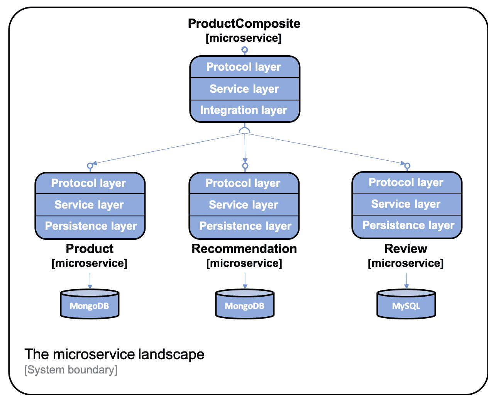
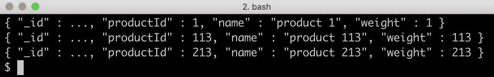
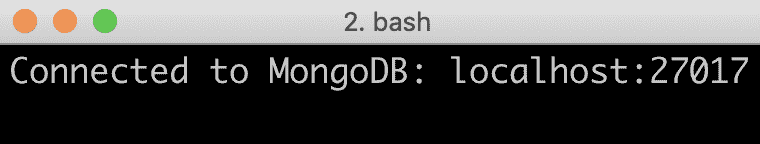
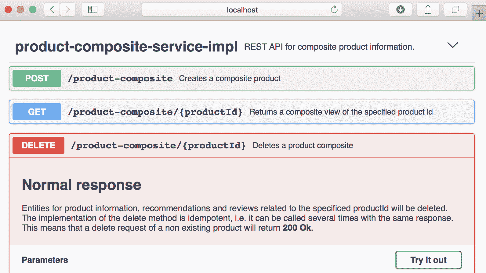
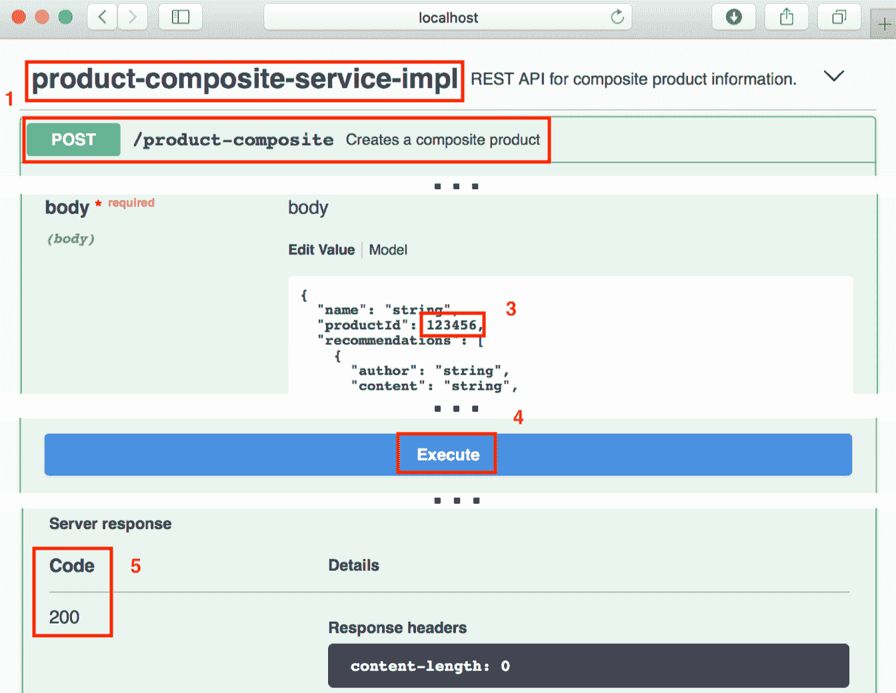

# 六、添加持久化

在本章中，我们将学习如何持久化微服务正在使用的数据。如[第 2 章](01.html)、*Spring Boot 简介*中所述，我们将使用 Spring 数据项目将数据持久化到 MongoDB 和 MySQL 数据库。`project`和`recommendation`微服务将为 MongoDB 使用 Spring 数据，`review`微服务将为**JPA**（简称**Java 持久化 API**使用 Spring 数据）访问 MySQL 数据库。我们将向 RESTful API 添加操作，以便能够在数据库中创建和删除数据。用于读取数据的现有 API 将更新以访问数据库。我们将以 Docker 容器的形式运行数据库，由 Docker Compose 管理，也就是说，与运行微服务的方式相同。

本章将介绍以下主题：

*   向核心微服务添加持久层
*   编写专注于持久性的自动化测试
*   在服务层中使用持久性层
*   扩展复合服务 API
*   向 Docker Compose 环境添加数据库
*   手动测试新 API 和持久性层
*   更新微服务环境的自动化测试

# 技术要求

本书中描述的所有命令都是使用 macOS Mojave 在 MacBook Pro 上运行的，但应该可以直接修改以在其他平台（如 Linux 或 Windows）上运行。

本章中无需安装新工具。

要手动访问数据库，我们将使用用于运行数据库的 Docker 映像中提供的 CLI 工具。但是，我们将公开 Docker Compose 中每个数据库使用的标准端口，MySQL 为`3306`，MongoDB 为`27017`。这将使您能够使用本地常用的数据库工具访问数据库，访问方式与访问数据库在您的计算机上本地运行的方式相同

本章的源代码可以在 GitHub 上找到：[https://github.com/PacktPublishing/Hands-On-Microservices-with-Spring-Boot-and-Spring-Cloud/tree/master/Chapter06](https://github.com/PacktPublishing/Hands-On-Microservices-with-Spring-Boot-and-Spring-Cloud/tree/master/Chapter06) 。

为了能够按照书中所述运行命令，请将源代码下载到一个文件夹中，并设置一个指向该文件夹的环境变量`$BOOK_HOME`。以下是一些示例命令：

```java
export BOOK_HOME=~/Documents/Hands-On-Microservices-with-Spring-Boot-and-Spring-Cloud
git clone https://github.com/PacktPublishing/Hands-On-Microservices-with-Spring-Boot-and-Spring-Cloud $BOOK_HOME
cd $BOOK_HOME/Chapter06
```

Java 源代码是为 Java8 编写的，并在 Java12 上进行了测试。本章使用 Spring Boot 2.1.0（和 Spring 5.1.2）——编写本章时可用的 Spring Boot 的最新版本。

源代码包含以下 Gradle 项目：

*   `api`
*   `util`
*   `microservices/product-service`
*   `microservices/review-service`
*   `microservices/recommendation-service`
*   `microservices/product-composite-service`

本章中的代码示例均来自`$BOOK_HOME/Chapter06`中的源代码，但在许多情况下，经过编辑以删除源代码中不相关的部分，如注释、导入和日志语句。

如果您想查看[第 6 章](06.html)、*添加持久性*中应用于源代码的更改，即使用 Spring 数据向微服务添加持久性所需的操作，您可以将其与[第 5 章](05.html)、*的源代码进行比较使用 OpenAPI/Swagger*添加 API 说明。您可以使用自己喜欢的 diff 工具，比较两个文件夹`$BOOK_HOME/Chapter05`和`$BOOK_HOME/Chapter06`。

# 但首先，让我们看看我们将走向何方

在本章结束时，我们将在微服务中设置如下所示的层：



**协议层**非常薄，仅由`RestController`注释和普通`GlobalControllerExceptionHandler`组成。每个微服务的主要功能位于服务层中。`product-composite`服务包含一个与三个核心微服务通信的集成层。核心微服务都将有一个**持久层**用于与其数据库通信。

我们将能够使用如下命令查看存储在 MongoDB 中的数据：

```
docker-compose exec mongodb mongo product-db --quiet --eval "db.products.find()"
```

命令的结果应如下所示：



关于 MySQL 中存储的数据，我们可以通过如下命令查看：

```
docker-compose exec mysql mysql -uuser -p review-db -e "select * from reviews"
```

命令的结果应如下所示：


**Note:** The output from the `mongo` and `mysql` commands have been shortened for improved readability.

让我们看看怎么做。

# 向核心微服务添加持久层

让我们从向核心微服务添加持久层开始。除了使用 Spring 数据之外，我们还将使用 JavaBean 映射工具 MapStruct，它可以轻松地在 Spring 数据实体对象和 API 模型类之间进行转换。有关更多详细信息，请参见[http://mapstruct.org/](http://mapstruct.org/) 。

首先，我们需要为打算使用的数据库向 MapStruct、Spring 数据和 JDBC 驱动程序添加依赖项。之后，我们可以定义 Spring 数据实体类和存储库。Spring 数据实体类和存储库将放在它们自己的 Java 包`persistence`中。例如，对于产品 microservice，它们将被放置在 Java 包`se.magnus.microservices.core.product.persistence`中。

# 添加依赖项

我们将使用 MapStruct V1.3.0-Beta 2，因此我们首先定义一个变量，该变量保存每个核心微服务的构建文件中的版本信息，`build.gradle`：

```
ext {
 mapstructVersion = "1.3.0.Beta2"
}
```

接下来，我们在 MapStruct 上声明一个依赖项：

```
implementation("org.mapstruct:mapstruct:${mapstructVersion}")
```

由于 MapStruct 通过处理 MapStruct 注释在编译时生成 bean 映射的实现，我们需要添加一个`annotationProcessor`和`testAnnotationProcessor`依赖项：

```
iannotationProcessor "org.mapstruct:mapstruct-processor:${mapstructVersion}"
testAnnotationProcessor "org.mapstruct:mapstruct-processor:${mapstructVersion}"
```

为了使编译时生成在流行的 IDE（如 IntelliJ IDEA）中工作，我们还需要添加以下依赖项：

```
compileOnly "org.mapstruct:mapstruct-processor:${mapstructVersion}"
```

如果使用 IntelliJ IDEA，还需要确保启用对注释处理的支持。打开首选项并导航到构建、执行、部署|编译器|注释处理器。验证是否选中了名为“启用注释处理”的复选框！

对于`project`和`recommendation`微服务，我们为 MongoDB 声明对 Spring 数据的以下依赖性：

```
implementation('org.springframework.boot:spring-boot-starter-data-mongodb')
testImplementation('de.flapdoodle.embed:de.flapdoodle.embed.mongo')
```

对`de.flapdoodle.embed.mongo`的测试依赖性使我们能够在运行基于 JUnit 的测试时运行 MongoDB embedded。

`review`微服务将在运行时使用 JPA 的 Spring 数据和 MySQL 作为其数据库，并在测试期间使用嵌入式数据库 H2。因此，它在其构建文件`build.gradle`中声明了以下依赖项：

```
implementation('org.springframework.boot:spring-boot-starter-data-jpa')
implementation('mysql:mysql-connector-java')
testImplementation('com.h2database:h2')
```

# 使用实体类存储数据

实体类在包含哪些字段方面与相应的 API 模型类类似，请参见`api`项目中的 Java 包`se.magnus.api.core`。与 API 模型类中的字段相比，我们将在实体类中添加两个字段`id`和`version`。

`id`字段用于在使用关系数据库时保存每个存储实体的数据库标识（主键）。我们将把生成标识字段唯一值的责任委托给 Spring 数据。根据所使用的数据库，Spring Data 可以将此职责委托给数据库引擎。在这两种情况下，应用程序代码不需要考虑如何设置唯一的数据库 AUT1 T1 值。从安全角度来看，`id`字段在 API 中没有公开，这是一种最佳实践。模型类中标识实体的字段将在相应的实体类中分配一个唯一索引，以确保从业务角度来看数据库的一致性

`version`字段用于实现乐观锁定，即允许 Spring 数据验证数据库中实体的更新不会覆盖并发更新。如果数据库中存储的版本字段的值高于更新请求中的版本字段的值，则表示更新是在陈旧数据上执行的。要更新的信息自从数据库读取以来已由其他人更新。Spring 数据将阻止基于过时数据执行更新的尝试。在编写持久性测试一节中，我们将看到验证 Spring 数据中的乐观锁定机制的测试，以防止对过时数据执行更新。由于我们只实现用于创建、读取和删除操作的 API，因此我们不会在 API 中公开版本字段。

product entity 类中最有趣的部分如下所示：

```
@Document(collection="products")
public class ProductEntity {

 @Id
 private String id;

 @Version
 private Integer version;

 @Indexed(unique = true)
 private int productId;

 private String name;
 private int weight;
```

以下是上述代码的观察结果：

*   `@Document(collection="products")`注释用于将该类标记为 MongoDB 使用的实体类，即映射到 MongoDB 中名为`products`的集合。
*   如前所述，`@Id`和`@Version`注释用于标记弹簧数据要使用的`id`和`version`字段。
*   `@Indexed(unique = true)`注释用于获取为业务密钥`productId`创建的唯一索引。

`Recommendation`实体类中最有趣的部分如下所示：

```
@Document(collection="recommendations")
@CompoundIndex(name = "prod-rec-id", unique = true, def = "{'productId': 1, 'recommendationId' : 1}")
public class RecommendationEntity {

    @Id
    private String id;

    @Version
    private Integer version;

    private int productId;
    private int recommendationId;
    private String author;
    private int rating;
    private String content;
```

除了对前面产品实体的解释之外，我们还可以看到如何使用基于字段`productId`和`recommendationId`的复合业务密钥的`@CompoundIndex`注释来创建唯一的复合索引。

最后，`Review`实体类中最有趣的部分如下所示：

```
@Entity
@Table(name = "reviews", indexes = { @Index(name = "reviews_unique_idx", unique = true, columnList = "productId,reviewId") })
public class ReviewEntity {

    @Id @GeneratedValue
    private int id;

    @Version
    private int version;

    private int productId;
    private int reviewId;
    private String author;
    private String subject;
    private String content;
```

以下是上述代码的观察结果：

*   `@Entity`和`@Table`注释用于将该类标记为一个实体类，用于映射到 SQL 数据库中名为`products`的表的 JPA。
*   `@Table`注释还用于指定根据字段`productId`和`reviewId`为复合业务密钥创建唯一的复合索引。
*   如前所述，`@Id`和`@Version`注释用于标记弹簧数据要使用的`id`和`version`字段。为了指导 JPA 的 Spring 数据自动为`id`字段生成唯一的`id`值，我们使用`@GeneratedValue`注释。

有关实体类的完整源代码，请参见以下内容：

*   `product`项目中的`se.magnus.microservices.core.product.persistence.ProductEntity`
*   `recommendation`项目中的`se.magnus.microservices.core.recommendation.persistence.RecommendationEntity`
*   `review`项目中的`se.magnus.microservices.core.review.persistence.ReviewEntity`

# 在 Spring 数据中定义存储库

Spring 数据附带了一组用于定义存储库的基类。我们将使用基类`CrudRepository`和`PagingAndSortingRepository`。`CrudRepository`基类提供了对数据库中存储的数据执行基本创建、读取、更新和删除操作的标准方法。`PagingAndSortingRepository`基类增加了对`CrudRepository`基类的分页和排序支持。

我们将使用`CrudRepository`类作为`Recommendation`和`Review`存储库的基类，`PagingAndSortingRepository`类作为`Product`存储库的基类。

我们还将向存储库中添加一些额外的查询方法，以便使用业务密钥`productId`查找实体。

Spring 数据支持根据方法签名的命名约定定义额外的查询方法。例如，`findByProductId(int productId)`方法签名可用于指示 Spring 数据自动创建一个查询，该查询返回基础集合或表中的实体，该基础集合或表的`productId`字段在调用查询方法时设置为`productId`参数中指定的值。有关如何声明额外查询的更多详细信息，请参见[https://docs.spring.io/spring-data/data-commons/docs/current/reference/html/#repositories.query-methods.query-creation](https://docs.spring.io/spring-data/data-commons/docs/current/reference/html/#repositories.query-methods.query-creation)。

`Product`存储库类如下所示：

```
public interface ProductRepository extends PagingAndSortingRepository<ProductEntity, String> {
    Optional<ProductEntity> findByProductId(int productId);
}
```

由于`findByProductId`方法可能返回零或一个产品实体，因此返回值通过将其包装在`Optional`对象中标记为可选。

`Recommendation`存储库类如下所示：

```
public interface RecommendationRepository extends CrudRepository<RecommendationEntity, String> {
    List<RecommendationEntity> findByProductId(int productId);
}
```

在这种情况下，`findByProductId`方法将向多个推荐实体返回零，因此返回值定义为一个列表。

最后，`Review`存储库类如下所示：

```
public interface ReviewRepository extends CrudRepository<ReviewEntity, Integer> {
    @Transactional(readOnly = true)
    List<ReviewEntity> findByProductId(int productId);
}
```

由于 SQL 数据库是事务性的，因此我们必须为查询方法`findByProductId()`指定默认的只读事务类型。

这就是为我们的核心微服务建立持久层所需要的全部。

有关存储库类的完整源代码，请参见以下内容：

*   `product`项目中的`se.magnus.microservices.core.product.persistence.ProductRepository`
*   `recommendation`项目中的`se.magnus.microservices.core.recommendation.persistence.RecommendationRepository`
*   `review`项目中的`se.magnus.microservices.core.review.persistence.ReviewRepository`

让我们从编写一些持久性测试开始使用它们，以验证它们是否按预期工作。

# 编写专注于持久性的自动化测试

在编写持久性测试时，我们希望在测试开始时启动嵌入式数据库，并在测试完成时将其拆下。但是，我们不希望测试等待其他资源启动，例如，Netty 之类的 web 服务器（这在运行时是必需的）。

Spring Boot 附带了两个类级别的注释，专门针对这一特定需求进行了定制：

*   `@DataMongoTest`：在测试开始时启动嵌入式 MongoDB 数据库。
*   `@DataJpaTest`：测试开始时启动嵌入式 SQL 数据库：

    *   由于我们在 H2 数据库的 review microservice 的构建文件中添加了一个测试依赖项，因此它将用作嵌入式 SQL 数据库。
    *   默认情况下，SpringBoot 将测试配置为回滚对 SQL 数据库的更新，以最大限度地降低对其他测试产生负面影响的风险。在我们的例子中，这种行为会导致一些测试失败。因此，使用类级注释`@Transactional(propagation = NOT_SUPPORTED)`禁用自动回滚。

三个核心微服务的持久性测试彼此相似，因此我们只对`Product`微服务进行持久性测试

测试类声明了一个方法`setupDb()`，并用`@Before`注释，该方法在每个测试方法之前执行。setup 方法从数据库中以前的测试中删除任何实体，并插入一个实体，测试方法可以将该实体用作其测试的基础：

```
@RunWith(SpringRunner.class)
@DataMongoTest
public class PersistenceTests {

    @Autowired
    private ProductRepository repository;
    private ProductEntity savedEntity;

    @Before
    public void setupDb() {
        repository.deleteAll();
        ProductEntity entity = new ProductEntity(1, "n", 1);
        savedEntity = repository.save(entity);
        assertEqualsProduct(entity, savedEntity);
    }
```

接下来是各种测试方法。先出是一个`create`测试：

```
@Test
public void create() {
    ProductEntity newEntity = new ProductEntity(2, "n", 2);
    savedEntity = repository.save(newEntity);

    ProductEntity foundEntity = 
    repository.findById(newEntity.getId()).get();
    assertEqualsProduct(newEntity, foundEntity);

    assertEquals(2, repository.count());
}
```

此测试创建一个新实体，并验证是否可以使用`findByProductId()`方法找到它，最后断言数据库中存储了两个实体，一个是由`setup`方法创建的，另一个是由测试本身创建的。

`update`测试如下所示：

```
@Test
public void update() {
    savedEntity.setName("n2");
    repository.save(savedEntity);

    ProductEntity foundEntity = 
    repository.findById(savedEntity.getId()).get();
    assertEquals(1, (long)foundEntity.getVersion());
    assertEquals("n2", foundEntity.getName());
}
```

此测试更新由 setup 方法创建的实体，使用标准`findById()`方法从数据库中再次读取该实体，并断言该实体包含其某些字段的预期值。请注意，创建实体时，其`version`字段由 Spring 数据设置为`0`。

`delete`测试如下所示：

```
@Test
public void delete() {
    repository.delete(savedEntity);
    assertFalse(repository.existsById(savedEntity.getId()));
}
```

此测试删除由`setup`方法创建的实体，并验证它在数据库中不再存在。

`read`测试如下所示：

```
@Test
public void getByProductId() {
    Optional<ProductEntity> entity = 
    repository.findByProductId(savedEntity.getProductId());
    assertTrue(entity.isPresent());
    assertEqualsProduct(savedEntity, entity.get());
}
```

此测试使用`findByProductId()`方法获取`setup`方法创建的实体，验证是否找到了该实体，然后使用本地助手方法`assertEqualsProduct()`验证`findByProductId()`返回的实体与设置方法存储的实体是否相同。

接下来，它遵循两种测试方法来验证错误条件的替代流处理。首先，是一项测试，用于验证是否正确处理了重复项：

```
@Test(expected = DuplicateKeyException.class)
public void duplicateError() {
    ProductEntity entity = new 
    ProductEntity(savedEntity.getProductId(), "n", 1);
    repository.save(entity);
}
```

测试尝试存储一个实体，该实体的业务密钥与通过设置方法保存的实体使用的业务密钥相同。如果保存操作成功，或者如果保存失败，出现除预期异常之外的异常`DuplicateKeyException`，则测试将失败。

在我看来，另一个否定测试是测试课上最有趣的测试。这是一个测试，在更新过时数据的情况下验证正确的错误处理。它验证乐观锁定机制是否工作。看起来是这样的：

```
@Test
public void optimisticLockError() {

    // Store the saved entity in two separate entity objects
    ProductEntity entity1 = 
    repository.findById(savedEntity.getId()).get();
    ProductEntity entity2 = 
    repository.findById(savedEntity.getId()).get();

    // Update the entity using the first entity object
    entity1.setName("n1");
    repository.save(entity1);

    //  Update the entity using the second entity object.
    // This should fail since the second entity now holds a old version 
    // number, that is, a Optimistic Lock Error
    try {
        entity2.setName("n2");
        repository.save(entity2);

        fail("Expected an OptimisticLockingFailureException");
    } catch (OptimisticLockingFailureException e) {}

    // Get the updated entity from the database and verify its new 
    // state
    ProductEntity updatedEntity = 
    repository.findById(savedEntity.getId()).get();
    assertEquals(1, (int)updatedEntity.getVersion());
    assertEquals("n1", updatedEntity.getName());
}
```

从前面的代码中可以看出：

1.  首先，测试读取同一实体两次，并将其存储在两个不同的变量中，`entity1`和`entity2`。
2.  接下来，它使用一个变量`entity1`来更新实体。数据库中实体的更新将导致实体的版本字段由 Spring 数据自动增加。另一个变量`entity2`现在包含过时数据，其版本字段的值低于数据库中相应的值
3.  当测试试图使用包含过时数据的变量`entity2`更新实体时，它可能会抛出`OptimisticLockingFailureException`异常而失败。
4.  测试通过断言数据库中的实体反映了第一次更新来结束，即，包含名称`"n1"`，并且版本字段的值为`1`，即，仅对数据库中的实体执行了一次更新。

最后，`product`服务包含一个测试，演示如何使用内置支持在 Spring 数据中进行排序和分页：

```
@Test
public void paging() {
    repository.deleteAll();
    List<ProductEntity> newProducts = rangeClosed(1001, 1010)
        .mapToObj(i -> new ProductEntity(i, "name " + i, i))
        .collect(Collectors.toList());
    repository.saveAll(newProducts);

    Pageable nextPage = PageRequest.of(0, 4, ASC, "productId");
    nextPage = testNextPage(nextPage, "[1001, 1002, 1003, 1004]", 
    true);
    nextPage = testNextPage(nextPage, "[1005, 1006, 1007, 1008]", 
    true);
    nextPage = testNextPage(nextPage, "[1009, 1010]", false);
}
```

从前面的代码中可以看出：

1.  测试首先删除任何现有数据，然后插入 10 个实体，其中的`productId`字段范围从`1001`到`1010`。
2.  接下来，它创建`PageRequest`，请求每页`4`实体的页面计数，并根据`ProductId`按升序排序。
3.  最后，它使用助手方法`testNextPage`读取预期的三个页面，验证每个页面中预期的产品 ID，并验证 Spring 数据是否正确地报告是否存在更多页面。

助手方法`testNextPage`如下所示：

```
private Pageable testNextPage(Pageable nextPage, String expectedProductIds, boolean expectsNextPage) {
    Page<ProductEntity> productPage = repository.findAll(nextPage);
    assertEquals(expectedProductIds, productPage.getContent()
    .stream().map(p -> p.getProductId()).collect(Collectors.
    toList()).toString());
    assertEquals(expectsNextPage, productPage.hasNext());
    return productPage.nextPageable();
}
```

helper 方法使用页面请求对象`nextPage`从存储库方法`findAll()`获取下一个页面。根据结果，它从返回的实体中将产品 ID 提取为字符串，并将其与预期的产品 ID 列表进行比较。最后，它返回一个布尔值，指示是否可以检索更多页面。

有关三个持久性测试类的完整源代码，请参见以下内容：

*   `product`项目中的`se.magnus.microservices.core.product.PersistenceTests`
*   `recommendation`项目中的`se.magnus.microservices.core.recommendation.PersistenceTests`
*   `review`项目中的`se.magnus.microservices.core.review.PersistenceTests`

`product`微服务中的持久性测试可以使用 Gradle 执行，命令如下：

```
cd $BOOK_HOME/Chapter06
./gradlew microservices:product-service:test --tests PersistenceTests
```

运行测试后，它应响应以下内容：


有了持久层，我们可以更新核心微服务中的服务层以使用持久层。

# 在服务层中使用持久性层

在本节中，我们将学习如何使用服务层中的持久层来存储数据和从数据库检索数据。我们将执行以下步骤：

1.  记录数据库连接 URL。
2.  添加新的 API。
3.  使用持久层。
4.  声明一个 JavaBean 映射器。
5.  更新服务测试。

# 记录数据库连接 URL

当扩大每个微服务连接到自己数据库的微服务数量时，我发现自己时不时地处于一种不确定每个微服务实际使用的数据库的情况。因此，我通常在微服务启动后直接添加一条 log 语句，该微服务记录用于连接数据库的连接 URL。

例如，`Product`服务的启动代码如下：

```
public class ProductServiceApplication {
  private static final Logger LOG = 
  LoggerFactory.getLogger(ProductServiceApplication.class);

  public static void main(String[] args) {
    ConfigurableApplicationContext ctx = 
    SpringApplication.run(ProductServiceApplication.class, args);
    String mongodDbHost = 
    ctx.getEnvironment().getProperty("spring.data.mongodb.host");
    String mongodDbPort = 
    ctx.getEnvironment().getProperty("spring.data.mongodb.port");
    LOG.info("Connected to MongoDb: " + mongodDbHost + ":" + 
    mongodDbPort);
  }
}
```

在日志中，应预期以下类型的输出：



完整的源代码请参见`product`项目中的`se.magnus.microservices.core.product.ProductServiceApplication`类。

# 添加新的 API

在使用持久层创建和删除数据库中的信息之前，我们需要在核心服务 API 中创建相应的 API 操作。

创建和删除产品实体的 API 操作如下所示：

```
@PostMapping(
    value    = "/product",
    consumes = "application/json",
    produces = "application/json")
Product createProduct(@RequestBody Product body);

@DeleteMapping(value = "/product/{productId}")
void deleteProduct(@PathVariable int productId);
```

delete 操作的实现将是幂等的，也就是说，如果多次调用，它将返回相同的结果。这是故障场景中的一个重要特征。例如，如果客户机在调用删除操作期间遇到网络超时，它可以简单地再次调用删除操作，而不必担心不同的响应，例如，第一次响应 OK（200），而连续调用未找到（404），或任何意外的副作用。这意味着即使数据库中不再存在实体，操作也应返回状态代码 OK（200）。

`recommendation`和`review`实体的 API 操作看起来相似；但是，请注意，当涉及到对`recommendation`和`review`实体的删除操作时，它将删除指定`productId`的所有`recommendations`和`reviews`。

完整的源代码请参见`api`项目中的以下类：

*   `se.magnus.api.core.product.ProductService`
*   `se.magnus.api.core.recommendation.RecommendationService`
*   `se.magnus.api.core.review.ReviewService`

# 持久层的使用

服务层中用于使用持久性层的源代码的结构与所有核心微服务的结构相同。因此，我们将只浏览`Product`微服务的源代码。

首先，我们需要将持久层中的 repository 类和 Java bean 映射器类注入构造函数：

```
private final ServiceUtil serviceUtil;
private final ProductRepository repository;
private final ProductMapper mapper;

@Autowired
public ProductServiceImpl(ProductRepository repository, ProductMapper mapper, ServiceUtil serviceUtil) {
    this.repository = repository;
    this.mapper = mapper;
    this.serviceUtil = serviceUtil;
}
```

在下一节中，我们将看到 Java 映射器类是如何定义的。

接下来，`createProduct`方法实现如下：

```
public Product createProduct(Product body) {
    try {
        ProductEntity entity = mapper.apiToEntity(body);
        ProductEntity newEntity = repository.save(entity);
        return mapper.entityToApi(newEntity);
    } catch (DuplicateKeyException dke) {
        throw new InvalidInputException("Duplicate key, Product Id: " + 
        body.getProductId());
    }
}
```

`create`方法使用存储库中的`save`方法来存储新实体。应该注意映射器类是如何使用两个映射器方法`apiToEntity()`和`entityToApi()`在 API 模型类和实体类之间转换 Java bean 的。我们为`create`方法处理的唯一错误是`DuplicateKeyException`异常，我们将其转换为`InvalidInputException`异常。

`getProduct`方法如下：

```
public Product getProduct(int productId) {
    if (productId < 1) throw new InvalidInputException("Invalid 
    productId: " + productId);
    ProductEntity entity = repository.findByProductId(productId)
        .orElseThrow(() -> new NotFoundException("No product found for 
         productId: " + productId));
    Product response = mapper.entityToApi(entity);
    response.setServiceAddress(serviceUtil.getServiceAddress());
    return response;
}
```

经过一些基本的输入验证（即确保`productId`不是负数）后，使用存储库中的`findByProductId()`方法查找产品实体。由于 repository 方法返回一个`Optional`产品，如果没有找到产品实体，我们可以使用`Optional`类中的`orElseThrow()`方法方便地抛出一个`NotFoundException`异常。在返回产品信息之前，`serviceUtil`对象用于填写微服务当前使用的地址。

最后我们来看一下`deleteProduct`方法：

```
public void deleteProduct(int productId) {
    repository.findByProductId(productId).ifPresent(e -> 
    repository.delete(e));
}
```

`delete`方法还使用存储库中的`findByProductId()`方法，并使用`Optional`类中的`ifPresent()`方法方便地删除实体（如果实体存在）。注意，实现是幂等的，也就是说，如果找不到实体，它不会报告任何失败。

三个服务实现类的源代码可在以下位置找到：

*   `product`项目中的`se.magnus.microservices.core.product.services.ProductServiceImpl`
*   `recommendation`项目中的`se.magnus.microservices.core.recommendation.services.RecommendationServiceImpl`
*   `review`项目中的`se.magnus.microservices.core.review.services.ReviewServiceImpl`

# 声明 JavaBean 映射器

那么，神奇的 JavaBean 映射器呢？

如前所述，我们使用 MapStruct 来声明映射器类。MapStruct 在所有三个核心微服务中的使用都是类似的，因此我们将只在`Product`微服务中浏览 mapper 对象的源代码

`product`服务的映射器类如下所示：

```
@Mapper(componentModel = "spring")
public interface ProductMapper {

    @Mappings({
        @Mapping(target = "serviceAddress", ignore = true)
    })
    Product entityToApi(ProductEntity entity);

    @Mappings({
        @Mapping(target = "id", ignore = true),
        @Mapping(target = "version", ignore = true)
    })
    ProductEntity apiToEntity(Product api);
}
```

从前面的代码中可以看出：

*   `entityToApi()`方法将实体对象映射到 API 模型对象。由于实体类没有用于`serviceAddress`的字段，`entityToApi()`方法被注释为忽略`serviceAddress`。
*   `apiToEntity()`方法将 API 模型对象映射到实体对象。同样地，`apiToEntity()`方法被注释为忽略 API 模型类中缺少的`id`和`version`字段

MapStruct 不仅支持按名称映射字段，还可以定向到具有不同名称的映射字段。在`Recommendation`服务的映射器类中，`rating`实体字段使用以下注释映射到 API 模型字段`rate`：

```
    @Mapping(target = "rate", source="entity.rating"),
    Recommendation entityToApi(RecommendationEntity entity);

    @Mapping(target = "rating", source="api.rate"),
    RecommendationEntity apiToEntity(Recommendation api);
```

Gradle 构建成功后，可以在`build/classes`文件夹中找到生成的映射实现，例如`Product`服务：`$BOOK_HOME/Chapter06/microservices/product-service/build/classes/java/main/se/magnus/microservices/core/product/services/ProductMapperImpl.java`。

三个映射器类的源代码可在以下位置找到：

*   `product`项目中的`se.magnus.microservices.core.product.services.ProductMapper`
*   `recommendation`项目中的`se.magnus.microservices.core.recommendation.services.RecommendationMapper`
*   `review`项目中的`se.magnus.microservices.core.review.services.ReviewMapper`

# 更新服务测试

自上一章以来，核心微服务公开的 API 测试已经更新，包括创建和删除 API 操作的测试。

添加的测试在所有三个核心微服务中都是类似的，因此我们将只查看`Product`微服务中服务测试的源代码

为了确保每个测试都有一个已知的状态，声明了一个设置方法`setupDb()`，并用`@Before`注释，因此它在每个测试运行之前运行。设置方法将删除以前创建的任何实体：

```
@Autowired
private ProductRepository repository;

@Before
public void setupDb() {
   repository.deleteAll();
}
```

创建 API 的测试方法验证了一个产品实体在创建后可以被检索，并且使用相同的`productId`创建另一个产品实体会在响应 API 请求时导致预期错误`UNPROCESSABLE_ENTITY`：

```
@Test
public void duplicateError() {
   int productId = 1;
   postAndVerifyProduct(productId, OK);
   assertTrue(repository.findByProductId(productId).isPresent());

   postAndVerifyProduct(productId, UNPROCESSABLE_ENTITY)
      .jsonPath("$.path").isEqualTo("/product")
      .jsonPath("$.message").isEqualTo("Duplicate key, Product Id: " + 
       productId);
}
```

delete API 的测试方法验证是否可以删除产品实体，以及第二个删除请求是否是幂等的。即使该实体不再存在于数据库中，它也会返回状态代码 OK：

```
@Test
public void deleteProduct() {
   int productId = 1;
   postAndVerifyProduct(productId, OK);
   assertTrue(repository.findByProductId(productId).isPresent());

   deleteAndVerifyProduct(productId, OK);
   assertFalse(repository.findByProductId(productId).isPresent());

   deleteAndVerifyProduct(productId, OK);
}
```

为了简化向 API 发送创建、读取和删除请求并验证响应状态，创建了三种帮助器方法：

*   `postAndVerifyProduct()`
*   `getAndVerifyProduct()`
*   `deleteAndVerifyProduct()`

`postAndVerifyProduct()`方法如下：

```
private WebTestClient.BodyContentSpec postAndVerifyProduct(int productId, HttpStatus expectedStatus) {
   Product product = new Product(productId, "Name " + productId, 
   productId, "SA");
   return client.post()
      .uri("/product")
      .body(just(product), Product.class)
      .accept(APPLICATION_JSON_UTF8)
      .exchange()
      .expectStatus().isEqualTo(expectedStatus)
      .expectHeader().contentType(APPLICATION_JSON_UTF8)
      .expectBody();
}
```

除了执行实际的 HTTP 请求并验证其响应代码之外，helper 方法还返回响应主体，以便调用方进一步调查（如果需要）。用于读取和删除请求的其他两个助手方法类似，可以在本节开头指出的源代码中找到。

三个服务测试类的源代码可在以下位置找到：

*   `product`项目中的`se.magnus.microservices.core.product.ProductServiceApplicationTests`
*   `recommendation`项目中的`se.magnus.microservices.core.recommendation.RecommendationServiceApplicationTests`
*   `review`项目中的`se.magnus.microservices.core.review.ReviewServiceApplicationTests`

现在，让我们继续了解如何扩展复合服务 API。

# 扩展复合服务 API

在本节中，我们将看到如何通过创建和删除复合实体的操作来扩展复合 API。我们将执行以下步骤：

1.  在复合服务 API 中添加新操作
2.  在集成层中添加方法
3.  实现新的复合 API 操作
4.  更新复合服务测试

# 在复合服务 API 中添加新操作

创建和删除实体以及处理聚合实体的复合版本类似于核心服务 API 中的创建和删除操作。主要区别在于，它们为基于 Swagger 的文档添加了注释。有关 Swagger 注释的用法说明，`@ApiOperation`和`@ApiResponses`，请参阅[第 5 章](05.html)，*使用 OpenAPI/Swagger*添加 API 说明，*一节在 ProductCompositeService*中添加特定于 API 的文档。创建复合产品实体的 API 操作声明如下：

```
@ApiOperation(
    value = "${api.product-composite.create-composite-
    product.description}",
    notes = "${api.product-composite.create-composite-product.notes}")
@ApiResponses(value = {
    @ApiResponse(code = 400, message = "Bad Request, invalid format of 
    the request. See response message for more information."),
    @ApiResponse(code = 422, message = "Unprocessable entity, input 
    parameters caused the processing to fail. See response message for 
    more information.")
})
@PostMapping(
    value    = "/product-composite",
    consumes = "application/json")
void createCompositeProduct(@RequestBody ProductAggregate body);
```

用于删除复合产品实体的 API 操作声明如下：

```
@ApiOperation(
    value = "${api.product-composite.delete-composite-
    product.description}",
    notes = "${api.product-composite.delete-composite-product.notes}")
@ApiResponses(value = {
    @ApiResponse(code = 400, message = "Bad Request, invalid format of 
    the request. See response message for more information."),
    @ApiResponse(code = 422, message = "Unprocessable entity, input 
    parameters caused the processing to fail. See response message for 
    more information.")
})
@DeleteMapping(value = "/product-composite/{productId}")
void deleteCompositeProduct(@PathVariable int productId);
```

完整的源代码请参见`api`项目中的 Java 接口`se.magnus.api.composite.product.ProductCompositeService`

我们还需要像前面一样，将 API 文档的描述性文本添加到属性文件`application.yml`：

```
create-composite-product:
  description: Creates a composite product
  notes: |
    # Normal response
    The composite product information posted to the API will be 
    splitted up and stored as separate product-info, recommendation and 
    review entities.

    # Expected error responses
    1\. If a product with the same productId as specified in the posted 
    information already exists, an <b>422 - Unprocessable Entity</b> 
    error with a "duplicate key" error message will be returned

delete-composite-product:
  description: Deletes a product composite
  notes: |
    # Normal response
    Entities for product information, recommendations and reviews 
    related to the specificed productId will be deleted.
    The implementation of the delete method is idempotent, that is, it 
    can be called several times with the same response.
    This means that a delete request of a non existing product will 
    return <b>200 Ok</b>.
```

详见`product-composite`项目中的配置文件`src/main/resources/application.yml`。

更新后的 Swagger 文档如下所示：



在本章后面，我们将使用 Swagger UI 来尝试新的复合 API 操作。

# 在集成层中添加方法

在复合服务中实现新的创建和删除 API 之前，我们需要扩展集成层，以便它能够在核心微服务的 API 中调用底层的创建和删除操作。

集成层中调用三个核心微服务中创建和删除操作的方法非常简单，彼此相似，因此我们将只浏览调用`Product`微服务的方法的源代码

`createProduct()`方法如下：

```
@Override
public Product createProduct(Product body) {
    try {
        return restTemplate.postForObject(productServiceUrl, body, 
        Product.class);
    } catch (HttpClientErrorException ex) {
        throw handleHttpClientException(ex);
    }
}
```

它只是将发送 HTTP 请求的责任委托给`RestTemplate`对象，并将错误处理委托给助手方法`handleHttpClientException`

`deleteProduct()`方法如下：

```
@Override
public void deleteProduct(int productId) {
    try {
        restTemplate.delete(productServiceUrl + "/" + productId);
    } catch (HttpClientErrorException ex) {
        throw handleHttpClientException(ex);
    }
}
```

它的实现方式与 create 方法相同，但执行 HTTP 删除请求。

集成层的完整源代码可以在`product-composite`项目的`se.magnus.microservices.composite.product.services.ProductCompositeIntegration`类中看到。

# 实现新的复合 API 操作

现在，我们可以实现复合创建和删除方法了！

组合的创建方法将聚合的产品对象拆分为`product`、`recommendation`、`review`的离散对象，并在集成层调用相应的创建方法：

```
@Override
public void createCompositeProduct(ProductAggregate body) {
    try {
        Product product = new Product(body.getProductId(), 
        body.getName(), body.getWeight(), null);
        integration.createProduct(product);

        if (body.getRecommendations() != null) {
            body.getRecommendations().forEach(r -> {
                Recommendation recommendation = new 
                Recommendation(body.getProductId(), 
                r.getRecommendationId(), r.getAuthor(), r.getRate(), 
                r.getContent(), null);
                integration.createRecommendation(recommendation);
            });
        }

        if (body.getReviews() != null) {
            body.getReviews().forEach(r -> {
                Review review = new Review(body.getProductId(), 
                r.getReviewId(), r.getAuthor(), r.getSubject(), 
                r.getContent(), null);
                integration.createReview(review);
            });
        }
    } catch (RuntimeException re) {
        LOG.warn("createCompositeProduct failed", re);
        throw re;
    }
}
```

composite 的 delete 方法只调用集成层中的三个 delete 方法来删除底层数据库中的相应实体：

```
@Override
public void deleteCompositeProduct(int productId) {
    integration.deleteProduct(productId);
    integration.deleteRecommendations(productId);
    integration.deleteReviews(productId);
}
```

完整的源代码请参见`product-composite`项目中的`se.magnus.microservices.composite.product.services.ProductCompositeServiceImpl`类。

对于快乐日场景，这种实现将很好，但是如果我们考虑各种错误场景，这种实现会引起麻烦！

例如，如果某个底层核心微服务暂时不可用（例如，由于内部、网络或数据库问题），该怎么办

这可能会导致部分创建或删除复合产品。对于 delete 操作，如果请求者只需调用组合的 delete 方法直到成功，则可以修复此问题。但是，如果潜在问题仍然存在一段时间，请求者可能会放弃，导致复合产品的状态不一致，在大多数情况下是不可接受的！

在下一章[第 7 章](07.html)*开发反应式微服务*中，我们将看到如何将同步 API 作为 RESTful API 来解决这些类型的缺点！

现在，让我们继续考虑这个脆弱的设计。

# 更新复合服务测试

测试复合服务，如[第 3 章](03.html)所述，*创建一组协作的微服务*（参考*微服务自动测试隔离*部分），仅限于使用简单的模拟组件，而不是实际的核心服务。这限制了我们测试更复杂的场景，例如，尝试在底层数据库中创建重复项时的错误处理。因此，复合创建和删除 API 操作的测试相对简单：

```
@Test
public void createCompositeProduct1() {
   ProductAggregate compositeProduct = new ProductAggregate(1, "name", 
   1, null, null, null);
   postAndVerifyProduct(compositeProduct, OK);
}

@Test
public void createCompositeProduct2() {
    ProductAggregate compositeProduct = new ProductAggregate(1, "name", 
        1, singletonList(new RecommendationSummary(1, "a", 1, "c")),
        singletonList(new ReviewSummary(1, "a", "s", "c")), null);
    postAndVerifyProduct(compositeProduct, OK);
}

@Test
public void deleteCompositeProduct() {
    ProductAggregate compositeProduct = new ProductAggregate(1, "name", 
        1,singletonList(new RecommendationSummary(1, "a", 1, "c")),
        singletonList(new ReviewSummary(1, "a", "s", "c")), null);
    postAndVerifyProduct(compositeProduct, OK);
    deleteAndVerifyProduct(compositeProduct.getProductId(), OK);
    deleteAndVerifyProduct(compositeProduct.getProductId(), OK);
}
```

完整的源代码请参见`product-composite`项目中的测试类`se.magnus.microservices.composite.product.ProductCompositeServiceApplicationTests`。

接下来，我们将看到如何将数据库添加到 Docker Compose 的环境中。

# 向 Docker Compose 环境添加数据库

现在，我们已经准备好了所有的源代码。在启动微服务环境并尝试新的 API 和新的持久层之前，我们必须先启动一些数据库。

我们将把 MongoDB 和 MySQL 引入 Docker Compose 控制的系统环境，并将配置添加到我们的微服务中，以便它们在运行时可以找到自己的数据库，无论是否作为 Docker 容器运行。

# Docker Compose 配置

MongoDB 和 MySQL 在 Docker Compose 配置文件`docker-compose.yml`中声明如下：

```
mongodb:
  image: mongo:3.6.9
  mem_limit: 350m
  ports:
    - "27017:27017"
  command: mongod --smallfiles

mysql:
  image: mysql:5.7
  mem_limit: 350m
  ports:
    - "3306:3306"
  environment:
    - MYSQL_ROOT_PASSWORD=rootpwd
    - MYSQL_DATABASE=review-db
    - MYSQL_USER=user
    - MYSQL_PASSWORD=pwd
  healthcheck:
    test: ["CMD", "mysqladmin" ,"ping", "-uuser", "-ppwd", "-h", "localhost"]
    interval: 10s
    timeout: 5s
    retries: 10
```

从前面的代码中可以看出：

1.  我们将使用 MongoDB V3.6.9 和 MySQL 5.7 的官方 Docker 镜像，并将它们的默认端口`27017`和`3306`转发给 Docker 主机，在使用 Docker for Mac 时也在`localhost`上提供。
2.  对于 MySQL，我们还声明了一些环境变量，定义如下：
    *   根密码
    *   将在映像启动时创建的数据库的名称
    *   在映像启动时为数据库设置的用户的用户名和密码
3.  对于 MySQL，我们还声明 Docker 将运行一个健康检查来确定 MySQL 数据库的状态。

为了避免在数据库启动和运行之前尝试连接到其数据库的微服务出现问题，`product`和`recommendation`服务声明依赖于`mongodb`数据库，如下所示：

```
product/recommendation:
 depends_on:
 - mongodb
```

这意味着 Docker Compose 在启动`mongodb`容器之前不会启动`product`和`recommendation`容器。

出于同样的原因，`review`服务被声明依赖于`mysql`数据库：

```
review:
  depends_on:
    mysql:
      condition: service_healthy
```

在这种情况下，`review`服务取决于`mysql`集装箱不仅启动，而且`mysql`集装箱健康检查报告正常。这个额外步骤的原因是，`mysql`容器的初始化包括设置数据库和为数据库创建超级用户。这需要几秒钟，为了阻止`review`服务在启动之前启动，我们指示 Docker Compose 阻止`review`容器启动，直到`mysql`容器通过健康检查报告其正在运行。

# 数据库连接配置

数据库就绪后，我们现在需要为核心微服务设置配置，以便它们知道如何连接到数据库。这是在每个核心微服务的配置文件`src/main/resources/application.yml`、`product`、`recommendation`和`review`项目中设置的。

`product`和`recommendation`服务的配置是相似的，所以我们只研究`product`服务的配置。配置的以下部分值得关注：

```
spring.data.mongodb:
  host: localhost
  port: 27017
  database: product-db

logging:
 level:
 org.springframework.data.mongodb.core.MongoTemplate: DEBUG

---
spring.profiles: docker

spring.data.mongodb.host: mongodb
```

从前面的代码中可以看出：

1.  使用默认 Spring 配置文件在没有 Docker 的情况下运行时，数据库应可在`localhost:27017`上访问。
2.  将`MongoTemplate`的日志级别设置为`DEBUG`将允许我们查看日志中执行了哪些 MongoDB 语句。
3.  当在 Docker 内部使用 Spring 配置文件`Docker`运行时，数据库应可在`mongodb:27017`上访问。

`review`服务的配置会影响其连接到 SQL 数据库的方式，如下所示：

```
spring.jpa.hibernate.ddl-auto: update

spring.datasource:
  url: jdbc:mysql://localhost/review-db
  username: user
  password: pwd

spring.datasource.hikari.initializationFailTimeout: 60000

logging:
 level:
 org.hibernate.SQL: DEBUG
 org.hibernate.type.descriptor.sql.BasicBinder: TRACE

---
spring.profiles: docker

spring.datasource:
 url: jdbc:mysql://mysql/review-db
```

从前面的代码中可以看出：

1.  默认情况下，SpringDataJPA 将使用 Hibernate 作为 JPA 实体管理器。
2.  `spring.jpa.hibernate.ddl-auto`属性用于告知 Spring 数据 JPA 在启动期间创建新的或更新现有的 SQL 表。
    **注意：**强烈建议在生产环境中将`spring.jpa.hibernate.ddl-auto`属性设置为`none`，这样可以防止 Spring Data JPA 操纵 SQL 表的结构。
3.  在没有 Docker 的情况下运行时，使用默认的 Spring 配置文件，可以使用默认端口`3306`在`localhost`上访问数据库。
4.  默认情况下，Spring Data JPA 将 HikariCP 用作 JDBC 连接池。为了在硬件资源有限的计算机上最小化启动问题，`initializationFailTimeout`参数设置为 60 秒。这意味着 Spring 启动应用程序将在启动期间等待最多 60 秒以建立数据库连接。
5.  Hibernate 的日志级别设置将导致 Hibernate 打印使用的 SQL 语句和实际使用的值。请注意，在生产环境中使用时，出于隐私原因，应避免将实际值写入日志。
6.  当使用 Spring 配置文件`Docker`在 Docker 内部运行时，预期可以使用默认端口`3306`在`mysql`主机名上访问数据库。

# MongoDB 和 MySQL CLI 工具

为了能够运行数据库 CLI 工具，可以使用 Docker Compose`exec`命令。

当我们进入下一节中的手动测试时，将使用本节中描述的命令。现在不要试图运行它们；他们将失败，因为我们还没有数据库启动和运行！

要在`mongodb`容器内启动 MongoDB CLI 工具`mongo`，请运行以下命令：

```
docker-compose exec mongodb mongo --quiet
>
```

输入`exit`退出`mongo`CLI。

要在`mysql`容器内启动 MySQL CLI 工具`mysql`，并使用启动时创建的用户登录`review-db`，请运行以下命令：

```
docker-compose exec mysql mysql -uuser -p review-db
mysql>
```

`mysql`CLI 工具会提示您输入密码；您可以在`docker-compose.yml`文件中找到它。查找环境变量`MYSQL_PASSWORD`的值。

输入`exit`退出`mysql`CLI。

我们将在下一节中看到这些工具的用法。

如果您喜欢图形数据库工具，也可以在本地运行它们，因为 MongoDB 和 MySQL 容器都在 localhost 上公开了它们的标准端口。

# 新 API 和持久层的手动测试

现在，终于到了启动一切并使用 Swagger UI 手动测试它的时候了。

使用以下命令构建并启动系统环境：

```
cd $BOOK_HOME/Chapter06
./gradlew build && docker-compose build && docker-compose up
```

在 web 浏览器`http://localhost:8080/swagger-ui.html`中打开 Swagger UI，在网页上执行以下步骤：

1.  单击 ProductCompositeServiceImpl 和 POST 方法以展开它们。
2.  单击“试用”按钮并转到“正文”字段。
3.  将`productId`字段的默认值`0`替换为`123456`。
4.  向下滚动至“执行”按钮并单击它。
5.  验证返回的响应代码是否为`200`。

以下是点击执行按钮后的示例屏幕截图：



在`docker-compose up`命令的日志输出中，我们应该能够看到如下输出（为增加可读性而缩写）：


我们还可以使用数据库 CLI 工具查看不同数据库中的实际内容。

使用以下命令查找`product`服务中的内容，即 MongoDB 中的`products`集合：

```
docker-compose exec mongodb mongo product-db --quiet --eval "db.products.find()"
```

期望得到如下响应：


使用以下命令查找`recommendation`服务中的内容，即 MongoDB 中的`recommendations`集合：

```
docker-compose exec mongodb mongo recommendation-db --quiet --eval "db.recommendations.find()"
```

期望得到如下响应：

10

使用以下命令在`review`服务中查找内容，即 MySQL 中的`reviews`表：

```
docker-compose exec mysql mysql -uuser -p review-db -e "select * from reviews"
```

`mysql`CLI 工具会提示您输入密码；您可以在`docker-compose.yml`文件中找到它。查找环境变量`MYSQL_PASSWORD`的值。期望得到如下响应：


通过使用*Ctrl+C*中断`docker-compose up`命令，然后是`docker-compose down`命令，关闭系统景观。在此之后，让我们看看如何在微服务环境中更新自动化测试。

# 更新微服务环境的自动化测试

微服务环境的自动测试`test-em-all.bash`需要更新，以确保每个微服务的数据库在运行测试之前具有已知状态。

脚本通过一个设置函数`setupTestdata()`进行了扩展，该函数使用组合的创建和删除 API 将测试使用的产品重新创建为已知状态。

`setupTestdata`函数如下所示：

```
function setupTestdata() {

    body=\
    '{"productId":1,"name":"product 1","weight":1, "recommendations":[
        {"recommendationId":1,"author":"author 
         1","rate":1,"content":"content 1"},
        {"recommendationId":2,"author":"author 
         2","rate":2,"content":"content 2"},
        {"recommendationId":3,"author":"author 
         3","rate":3,"content":"content 3"}
    ], "reviews":[
        {"reviewId":1,"author":"author 1","subject":"subject 
         1","content":"content 1"},
        {"reviewId":2,"author":"author 2","subject":"subject 
         2","content":"content 2"},
        {"reviewId":3,"author":"author 3","subject":"subject 
         3","content":"content 3"}
    ]}'
    recreateComposite 1 "$body"

    body=\
    '{"productId":113,"name":"product 113","weight":113, "reviews":[
    {"reviewId":1,"author":"author 1","subject":"subject 
     1","content":"content 1"},
    {"reviewId":2,"author":"author 2","subject":"subject 
     2","content":"content 2"},
    {"reviewId":3,"author":"author 3","subject":"subject 
     3","content":"content 3"}
]}'
    recreateComposite 113 "$body"

    body=\
    '{"productId":213,"name":"product 213","weight":213, 
    "recommendations":[
       {"recommendationId":1,"author":"author 
         1","rate":1,"content":"content 1"},
       {"recommendationId":2,"author":"author 
        2","rate":2,"content":"content 2"},
       {"recommendationId":3,"author":"author 
        3","rate":3,"content":"content 3"}
]}'
    recreateComposite 213 "$body"

}
```

它使用助手函数`recreateComposite()`来执行对创建和删除 API 的实际请求：

```
function recreateComposite() {
    local productId=$1
    local composite=$2

    assertCurl 200 "curl -X DELETE http://$HOST:$PORT/product-
    composite/${productId} -s"
    curl -X POST http://$HOST:$PORT/product-composite -H "Content-Type: 
    application/json" --data "$composite"
}
```

直接在`waitForService`函数之后调用`setupTestdata`函数：

```
waitForService curl -X DELETE http://$HOST:$PORT/product-composite/13

setupTestdata
```

`waitForService`功能的主要目的是验证所有微服务都已启动并正在运行。在前一章中，复合产品服务上使用了 GETAPI。本章改用 delete API，使用 get API 时，如果找不到实体，只调用产品核心微服务；不会调用推荐和`review`服务来验证它们是否已启动并正在运行。对 delete API 的调用还将确保*未找到*-对`productId 13`的测试将成功。在本书的后面，我们将了解如何定义特定的 API 来检查微服务环境的运行状况。

使用以下命令执行更新的测试脚本：

```
cd $BOOK_HOME/Chapter06
./test-em-all.bash start stop
```

执行结束时应写入如下日志消息：


这就结束了微服务环境自动化测试的更新。

# 总结

在本章中，我们看到了如何使用 Spring 数据向核心微服务添加持久层。我们使用 Spring 数据、存储库和实体的核心概念，在 MongoDB 和 MySQL 中存储数据，使用类似的编程模型，即使不是完全可移植的。我们还看到了 SpringBoot 的注释`@DataMongoTest`和`@DataJpaTest`如何被用来方便地设置针对持久性的测试；这是在测试运行之前自动启动嵌入式数据库的地方，但微服务在运行时不需要其他基础设施，例如，启动 Netty 之类的 web 服务器。这导致持久性测试易于设置，并且以最小的开销开始。

我们还了解了服务层如何使用持久性层，以及如何添加用于创建和删除实体（包括核心实体和复合实体）的 API

最后，我们了解了在运行时使用 Docker Compose 启动 MongoDB 和 MySQL 等数据库是多么方便，以及如何在运行基于微服务的系统环境的自动测试之前使用新的创建和删除 API 来设置测试数据。

然而，本章确定了一个主要问题。更新（创建或删除）复合实体如果不是所有涉及的微服务都能成功更新，那么使用同步 API 将其部分存储在多个微服务中的实体可能会导致不一致。一般来说，这是不可接受的。这将引导我们进入下一章，在那里我们将研究为什么以及如何构建反应式微服务，即可伸缩和健壮的微服务。

# 问题

1.  Spring 数据是一种基于实体和存储库的通用编程模型，可用于不同类型的数据库引擎。从本章的源代码示例来看，MySQL 和 MongoDB 的持久性代码最重要的区别是什么？
2.  使用 Spring 数据实现乐观锁定需要什么？
3.  MapStruct 的用途是什么？
4.  运算是幂等的是什么意思？为什么它有用？
5.  我们如何在不使用 API 的情况下访问存储在 MySQL 和 MongoDB 数据库中的数据？