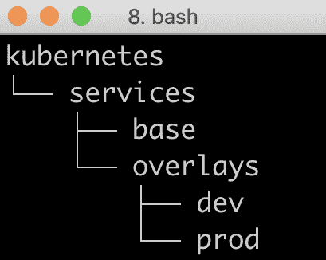
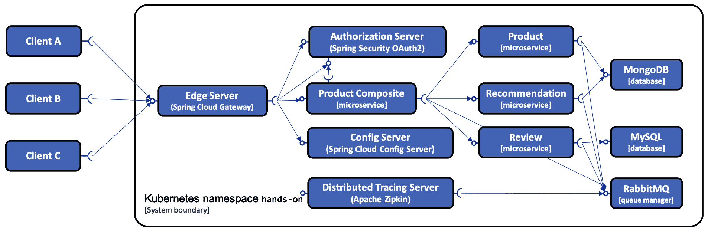
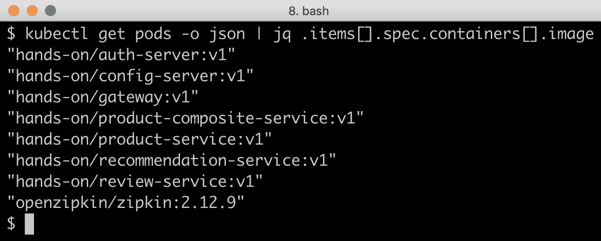
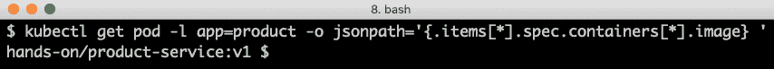
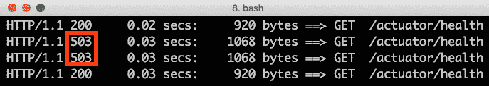
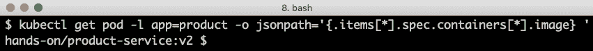
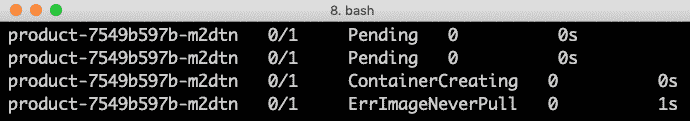

# 十六、将我们的微服务部署到 Kubernetes

在本章中，我们将把本书中的微服务部署到 Kubernetes。我们还将了解 Kubernetes 的一些核心功能，例如使用**Kustomize**为不同的运行时环境配置部署，以及使用 Kubernetes 部署对象进行滚动升级。在此之前，我们需要回顾一下如何使用服务发现。由于 Kubernetes 内置了对服务发现的支持，因此似乎没有必要部署我们自己的服务，因为到目前为止我们一直在使用 Netflix Eureka。

本章将介绍以下主题：

*   将 Netflix Eureka 替换为 Kubernetes`Service`对象和`kube-proxy`用于服务发现
*   使用 Kustomize 准备在不同环境中部署的微服务
*   使用测试脚本版本`test-em-all.bash`测试部署
*   执行滚动升级
*   学习如何回滚失败的升级

# 技术要求

本书中描述的所有命令都是使用 macOS Mojave 在 MacBook Pro 上运行的，但如果您想在其他平台（如 Linux 或 Windows）上运行这些命令，则可以直接修改这些命令。

本章唯一需要的新工具是`siege`命令行工具，用于基于 HTTP 的负载测试和基准测试。我们将使用`siege`在执行滚动升级时为 Kubernetes 集群加载一些负载。该工具可通过以下命令使用自制软件安装：

```java
brew install siege
```

本章的源代码可以在本书的 GitHub 存储库中找到：[https://github.com/PacktPublishing/Hands-On-Microservices-with-Spring-Boot-and-Spring-Cloud/tree/master/Chapter16](https://github.com/PacktPublishing/Hands-On-Microservices-with-Spring-Boot-and-Spring-Cloud/tree/master/Chapter16) 。

为了能够运行本书中描述的命令，您需要将源代码下载到一个文件夹中，并设置一个指向该文件夹的环境变量`$BOOK_HOME`。一些示例命令如下所示：

```
export BOOK_HOME=~/Documents/Hands-On-Microservices-with-Spring-Boot-and-Spring-Cloud
git clone https://github.com/PacktPublishing/Hands-On-Microservices-with-Spring-Boot-and-Spring-Cloud $BOOK_HOME
cd $BOOK_HOME/Chapter16
```

本章中的所有源代码示例均来自`$BOOK_HOME/Chapter16`中的源代码，并已使用 Kubernetes 1.15 进行了测试。

如果您想查看本章中应用于源代码的更改，即查看在 Kubernetes 上部署微服务所需的更改，您可以将其与[第 15 章](15.html)、*Kubernetes 简介*的源代码进行比较。您可以使用您最喜欢的`diff`工具并比较两个文件夹`$BOOK_HOME/Chapter15`和`$BOOK_HOME/Chapter16`。

# 用 Kubernetes 服务取代 Netflix Eureka

如前一章[第 15 章](15.html)*Kubernetes 简介*所示，Kubernetes 自带了一个基于 Kubernetes`Service`对象和`kube-proxy`运行时组件的内置发现服务。这使得无需部署单独的发现服务，如我们在前几章中使用的 Netflix Eureka。使用 Kubernetes 发现服务的一个优点是，它不需要像 Netflix Ribbon 这样的客户端库，我们一直在与 Netflix Eureka 一起使用 Netflix Ribbon。这使得 Kubernetes 发现服务易于使用，与微服务所基于的语言或框架无关。使用 Kubernetes 发现服务的一个缺点是它只在 Kubernetes 环境中工作。但是，由于发现服务基于`kube-proxy`，它接受对服务对象的 DNS 名称或 IP 地址的请求，因此将其替换为类似的发现服务应该相当简单，例如，与另一个容器编排器捆绑在一起的发现服务。

总而言之，我们将从我们的微服务环境中删除基于 Netflix Eureka 的发现服务器，如下图所示：


为了使用 Kubernetes 内置的发现服务替换基于 Netflix Eureka 的发现服务器，对源代码进行了以下更改：

*   Netflix Eureka 和功能区特定配置（客户端和服务器）已从配置存储库`config-repo`中删除。
*   已从`config-repo/gateway.yml`文件中删除通往 Eureka 服务器的网关服务中的路由规则。
*   我们已经删除了 Eureka 服务器项目，也就是说，我们已经删除了`spring-cloud/eureka-server`文件夹。
*   我们已经从 Docker Compose 文件和`settings.gradle`Gradle 文件中删除了 Eureka 服务器。
*   我们已经删除了 Eureka 所有客户端构建文件中对`spring-cloud-starter-netflix-eureka-client`的依赖，即`build.gradle`。
*   我们已经从 Eureka 的所有客户机集成测试中删除了不再需要的`eureka.client.enabled=false`属性设置。
*   网关服务不再使用基于`lb`协议的 Spring 云中客户端负载均衡器的路由。例如，`config-repo/gateway.yml`文件中的`lb://product-composite`路由目的地已被`http://product-composite`替换。
*   微服务和授权服务器使用的 HTTP 端口已从`8080`端口（授权服务器为`9999`端口）更改为默认 HTTP 端口`80`。这已在`config-repo`中针对每个受影响的服务进行了配置，如：

```
spring.profiles: docker
server.port: 80
```

使用 Kubernetes 服务替换 Netflix Eureka 不会影响我们正在使用的 HTTP 地址。例如，复合服务使用的地址不受影响：

```
private final String productServiceUrl = "http://product";
private final String recommendationServiceUrl = "http://recommendation";
private final String reviewServiceUrl = "http://review";
```

如前所述，这是通过将微服务和授权服务器使用的 HTTP 端口更改为默认 HTTP 端口`80`来实现的

使用 Docker Compose 仍然有效，即使 Netflix Eureka 已被删除。这可用于运行微服务的功能测试，而无需将其部署到 Kubernetes，例如，与 Docker for macOS 以与前几章相同的方式一起运行`test-em-all.bash`。然而，删除 Netflix Eureka 意味着在使用普通 Docker 和 Docker Compose 时，我们不再有发现服务。因此，扩展微服务只有在部署到 Kubernetes 时才起作用。

现在，我们已经熟悉了 Kubernetes 服务，接下来让我们转到 Kustomize，一个用于定制 Kubernetes 对象的工具。

# 介绍 Kustomize

**Kustomize**是一种工具，用于创建 Kubernetes 定义文件（即 YAML 文件）的特定于环境的定制，例如，用于开发、测试、暂存和生产环境。通用定义文件存储在`base`文件夹中，而特定于环境的新增内容保存在特定于环境的`overlay`文件夹中。例如，特定于环境的信息可以是以下任一信息：

*   要使用哪个版本的 Docker 图像
*   要运行的副本数
*   CPU 和内存方面的资源配额

每个文件夹都包含一个描述 Kustomize 内容的`kustomization.yml`文件。部署到特定环境时，Kustomize 将从`base`文件夹和特定于环境的`overlay`文件夹中获取内容，并将组合结果发送到`kubectl`。`overlay`文件夹中文件的属性将覆盖`base`文件夹中的相应属性（如果有）

在本章中，我们将为两个示例环境设置定制：开发环境和生产环境。

`$BOOK_HOME/Chapter16`下的文件夹结构如下：



由于 Kubernetes 1.14，`kubectl`使用`-k`标志内置了对 Kustomize 的支持。正如我们将看到的，使用 Kustomize 部署到开发环境将使用`kubectl apply -k kubernetes/services/overlays/dev`命令完成。

# 在基本文件夹中设置常用定义

在`base`文件夹中，每个微服务都有一个定义文件，但资源管理器（MongoDB、MySQL 和 RabbitMQ）没有定义文件。资源管理器将仅部署在开发环境中的 Kubernetes 中，并预期在生产环境中的 Kubernetes 之外运行，例如，在现有的本地数据库和队列管理器服务中或作为云中的托管服务。

`base`文件夹中的定义文件包含每个微服务的部署对象和服务对象。让我们看一下`kubernetes/services/base/product.yml`中的一个典型部署对象。它面向开发环境中所需的内容。它以以下代码开始：

```
apiVersion: apps/v1
kind: Deployment
metadata:
  name: product
spec:
  replicas: 1
  selector:
    matchLabels:
      app: product
  template:
    metadata:
      labels:
        app: product
    spec:
      containers:
      - name: pro
```

这一部分看起来与我们在上一章、[第 15 章](15.html)、*Kubernetes 简介*中使用的 NGINX 部署完全相同，在*中尝试了一个示例部署*部分，因此我们不需要再重复。

下一部分看起来有点不同：

```
        image: hands-on/product-service
        imagePullPolicy: Never
        env:
        - name: SPRING_PROFILES_ACTIVE
          value: "docker"
        envFrom:
        - secretRef:
            name: config-client-credentials
        ports:
        - containerPort: 80
        resources:
          limits:
            memory: 350Mi
```

让我们更详细地解释前面的源代码：

*   指定的 Docker 映像`hands-on/product-service`将在我们构建微服务的下方创建。更多信息，请参见*建筑码头图片*部分。
*   `imagePullPolicy: Never`声明告诉 Kubernetes 不要尝试从 Docker 注册表下载 Docker 映像。更多信息，请参见*建筑码头图片*部分。
*   `SPRING_PROFILES_ACTIVE`环境变量被定义为告诉 Spring 应用使用配置库中的`docker`Spring 概要文件。
*   密码`config-client-credentials`用于向容器提供访问配置服务器的凭据。
*   使用的 HTTP 端口是默认的 HTTP 端口`80`。
*   定义了一个资源限制，将可用内存最大化到 350MB，这与我们在前几章中使用 Docker Compose 时的方式相同。

部署对象声明的最后一部分包含活动性和就绪性探测：

```
        livenessProbe:
          httpGet:
            scheme: HTTP
            path: /actuator/info
            port: 80
          initialDelaySeconds: 10
          periodSeconds: 10
          timeoutSeconds: 2
          failureThreshold: 20
          successThreshold: 1
        readinessProbe:
          httpGet:
            scheme: HTTP
            path: /actuator/health
            port: 80
          initialDelaySeconds: 10
          periodSeconds: 10
          timeoutSeconds: 2
          failureThreshold: 3
          successThreshold: 1
```

让我们更详细地解释前面的源代码：

*   **liveness****probe**基于发送到 Spring Boot Actuator`info`端点的 HTTP 请求。这意味着，如果微服务实例状态非常糟糕，无法对发送到轻量级`info`端点的请求做出 200（OK）响应，现在是 Kubernetes 重新启动 microservice 实例的时候了。
*   **就绪探测**基于发送到弹簧启动执行器`health`端点的 HTTP 请求。如果微服务实例的`health`端点以 HTTP 状态 200（OK）响应，Kubernetes 将只向微服务实例发送请求。不使用 200（OK）进行响应通常意味着微服务实例在到达它所依赖的某些资源时遇到问题，因此当它在`health`端点上不使用 200（OK）进行响应时，不向微服务实例发送任何请求是有意义的。
*   可以使用以下属性配置活动性和就绪性探测：
    *   `initialDelaySeconds`指定 Kubernetes 在容器启动后等待探测的时间。
    *   `periodSeconds`指定 Kubernetes 发送探测请求的间隔时间。
    *   `timeoutSeconds`指定 Kubernetes 在将探测视为失败之前等待响应的时间。
    *   `failureThreshold`指定 Kubernetes 在放弃之前失败的尝试次数。对于活性探针，这意味着重新启动 pod。在准备就绪探测的情况下，这意味着 Kubernetes 将不再向容器发送任何请求。
    *   `successThreshold`指定失败后探针再次被视为成功所需的成功尝试次数。这仅适用于就绪探测，因为如果为活动探测指定，则必须将其设置为`1`。

为探测器找到最佳设置可能是一项挑战，也就是说，在 pod 可用性发生变化时从 Kubernetes 处获得快速反应和不使用探测器请求使 pod 过载之间找到适当的平衡。具体地说，将 liveness probe 配置为过低的值可能会导致 Kubernetes 重新启动只需要一段时间即可启动的 POD，即不需要重新启动的 POD。使用 liveness Probe 上设置得太低的值启动大量 POD 可能会导致大量不必要的重新启动。将探针上的配置值设置得太高（除了`successThreshold`值）会使 Kubernetes 的反应变慢，这在开发环境中可能会很烦人。正确的值还取决于可用的硬件，这会影响 POD 的启动时间。在本书的范围内，liveness Probe 的`failureThreshold`设置为高值`20`，以避免在硬件资源有限的计算机上进行不必要的重启。

`kubernetes/services/base/product.yml`中的服务对象如下：

```
apiVersion: v1
kind: Service
metadata:
  name: product
spec:
  selector:
    app: product
  ports:
  - port: 80
    targetPort: 80
```

该服务对象看起来类似于我们在上一章[第 15 章](15.html)*Kubernetes 简介*中使用的 NGINX 服务对象，在*尝试示例部署*部分。一个区别是服务类型为`ClusterIP`（这是默认类型，因此未指定）。服务对象将在端口`80`上接收内部请求，并将其转发到所选 pod 上的目标端口`80`。唯一的例外是网关微服务，它使用主机端口上的`NodePort`服务对外公开，即`31443`：

```
apiVersion: v1
kind: Service
metadata:
 name: gateway
spec:
 type: NodePort
 selector:
 app: gateway
 ports:
 - port: 443
 nodePort: 31443
 targetPort: 8443
```

最后，我们有一个 Kustomize 文件，它将`base`文件夹中的所有内容绑定在一起：

```
resources:
- auth-server.yml
- config-server.yml
- gateway.yml
- product-composite.yml
- product.yml
- recommendation.yml
- review.yml
- zipkin-server.yml
```

它只是列出了 Kustomize 应在`base`文件夹中使用的 YAML 定义文件。

现在，我们将看到如何将这些基本定义与`overlay`文件夹中的定义一起使用，以及如何使用`-k`开关和`kubectl apply`命令应用它们

# 部署到 Kubernetes 进行开发和测试

在本节中，我们将在用于开发和测试活动（例如，系统集成测试）的环境中部署微服务。这种类型的环境主要用于功能测试，因此配置为使用最少的系统资源。

由于`base`文件夹中的部署对象是为开发环境配置的，因此它们不需要在覆盖层中进行任何进一步的细化来进行开发。我们只需为 RabbitMQ、MySQL 和 MongoDB 的三个资源管理器添加部署和服务对象，方法与使用 Docker Compose 时相同。我们将在与微服务相同的 Kubernetes 命名空间中部署资源管理器。如下图所示：



资源管理器的定义文件可以在`kubernetes/services/overlays/dev`文件夹中找到。

`kustomization.yml`文件如下所示：

```
bases:
- ../../base
resources:
- mongodb-dev.yml
- rabbitmq-dev.yml
- mysql-dev.yml
```

它定义了`base`文件夹作为基础，并添加了前面提到的三个资源。

# 构建 Docker 图像

通常，我们必须将图像推送到 Docker 注册表，并配置 Kubernetes 从注册表中提取图像。在我们的例子中，我们有一个本地单节点集群，我们可以通过将 Docker 客户端指向 Minikube 中的 Docker 引擎，然后运行`docker-compose build`命令来缩短这个过程。这将导致 Docker 图像立即可供 Kubernetes 使用。对于开发，我们将使用`latest`作为微服务的 Docker 映像版本。

您可能想知道我们如何更新使用`latest`Docker 图像的 pod。来自 Kubernetes 1.15 的

非常简单。只需更改代码并重建 Docker 映像，例如，使用此处描述的`build`命令。然后，使用`kubectl rollout restart`命令更新 pod。

例如，如果`product`服务已经更新，则运行`kubectl rollout restart deploy product`命令。

您可以从源代码生成 Docker 映像，如下所示：

```
cd $BOOK_HOME/Chapter16
eval $(minikube docker-env)
./gradlew build && docker-compose build
```

`eval $(minikube docker-env)`命令指示本地 Docker 客户端与 Minikube 中的 Docker 引擎通信，例如，在构建 Docker 映像时。

`docker-compose.yml`文件已更新，以指定其生成的 Docker 映像的名称。例如，对于`product`服务，我们有以下内容：

```
  product:
    build: microservices/product-service
    image: hands-on/product-service
```

`latest` is the default tag for a Docker image name, so it is not specified.

随着 Docker 图像的构建，我们可以开始创建 Kubernetes 资源对象了！

# 部署到 Kubernetes

在将微服务部署到 Kubernetes 之前，我们需要创建名称空间、所需的配置映射和机密。执行部署后，我们将等待部署启动并运行，并验证我们在部署的吊舱和每个吊舱使用的 Docker 映像方面是否获得了预期结果。

创建名称空间`hands-on`，并将其设置为`kubectl`的默认名称空间：

```
kubectl create namespace hands-on
kubectl config set-context $(kubectl config current-context) --namespace=hands-on
```

所有应用配置都保存在配置服务器管理的配置存储库中。唯一需要存储在配置存储库外部的配置信息是用于连接到配置服务器的凭据和加密密钥。配置服务器使用加密密钥将配置存储库中的敏感信息保持加密状态，即在磁盘上。

我们将在配置映射中存储配置存储库，并对所有敏感信息进行加密；详见[第 12 章](12.html)、*集中配置*。连接到配置服务器的凭据和加密密钥将存储在两个机密中，一个用于配置服务器，另一个用于其客户端。

要检查此情况，请执行以下步骤：

1.  使用以下命令基于`config-repo`文件夹中的文件创建配置存储库的配置映射：

```
kubectl create configmap config-repo --from-file=config-repo/ --save-config
```

2.  使用以下命令为配置服务器创建机密：

```
kubectl create secret generic config-server-secrets \
  --from-literal=ENCRYPT_KEY=my-very-secure-encrypt-key \
  --from-literal=SPRING_SECURITY_USER_NAME=dev-usr \
  --from-literal=SPRING_SECURITY_USER_PASSWORD=dev-pwd \
  --save-config
```

3.  使用以下命令为配置服务器的客户端创建机密：

```
kubectl create secret generic config-client-credentials \
--from-literal=CONFIG_SERVER_USR=dev-usr \
--from-literal=CONFIG_SERVER_PWD=dev-pwd --save-config
```

由于我们刚刚输入的命令包含明文形式的敏感信息，例如密码和加密密钥，因此最好清除`history`命令。要清除内存和磁盘中的`history`命令，请运行`history -c; history -w`命令。

见[的讨论 https://unix.stackexchange.com/a/416831](https://unix.stackexchange.com/a/416831) 获取`history`命令的详细信息。

4.  为了避免由于 Kubernetes 下载 Docker 映像而导致部署缓慢（可能导致我们前面描述的 liveness 探测器重新启动 POD），请运行以下`docker pull`命令下载映像：

```
docker pull mysql:5.7
docker pull mongo:3.6.9
docker pull rabbitmq:3.7.8-management
docker pull openzipkin/zipkin:2.12.9
```

5.  基于`dev`覆盖，使用`-k`开关激活 Kustomize，为开发环境部署微服务，如前所述：

```
kubectl apply -k kubernetes/services/overlays/dev
```

6.  通过运行以下命令，等待部署及其 POD 启动并运行：

```
kubectl wait --timeout=600s --for=condition=ready pod --all
```

期望每个命令都以`deployment.extensions/... condition met`响应。`...`将替换为实际部署的名称。

7.  要查看用于开发的 Docker 映像，请运行以下命令：

```
kubectl get pods -o json | jq .items[].spec.containers[].image
```

响应应类似于以下内容：


我们现在已经准备好测试我们的部署！

但是在我们可以这样做之前，我们需要完成测试脚本中需要的更改，以便与 Kubernetes 一起使用。

# 用于 Kubernetes 的测试脚本中的更改

为了测试部署，我们将像往常一样运行测试脚本，即`test-em-all.bash`。为了与 Kubernetes 一起工作，断路器测试稍微做了修改。查看`testCircuitBreaker()`函数了解更多详细信息。断路器测试调用`product-composite`服务上的`actuator`端点，以检查其健康状态并访问断路器事件。`actuator`端点不对外公开，因此在使用 Docker Compose 和 Kubernetes 时，测试脚本需要使用不同的技术来访问内部端点：

*   使用 Docker Compose 时，测试脚本将使用普通的`docker run`命令启动 Docker 容器，该命令从 Docker Compose 创建的网络内部调用`actuator`端点。
*   当使用 Kubernetes 时，测试脚本将启动一个 Kubernetes pod，它可以用来在 Kubernetes 内部运行相应的命令。

让我们看看在使用 Docker Compose 和 Kubernetes 时是如何做到这一点的。

# 使用 Docker Compose 到达内部执行器端点

为 Docker Compose 定义的基本命令如下：

```
EXEC="docker run --rm -it --network=my-network alpine"
```

请注意，每次执行测试命令后，将使用`--rm`开关终止容器。

# 使用 Kubernetes 到达内部致动器端点

由于在 Kubernetes 中启动吊舱比启动容器慢，测试脚本将启动单个吊舱`alpine-client`。pod 将在`testCircuitBreaker()`功能启动时启动，测试将使用`kubectl exec`命令运行该 pod 中的测试命令。这将比为每个测试命令创建和删除 pod 快得多。

启动单吊舱在`testCircuitBreaker()`功能开始时处理：

```
echo "Restarting alpine-client..."
local ns=$NAMESPACE
if kubectl -n $ns get pod alpine-client > /dev/null ; then
    kubectl -n $ns delete pod alpine-client --grace-period=1
fi
kubectl -n $ns run --restart=Never alpine-client --image=alpine --command -- sleep 600
echo "Waiting for alpine-client to be ready..."
kubectl -n $ns wait --for=condition=Ready pod/alpine-client

EXEC="kubectl -n $ns exec alpine-client --"
```

断路器测试结束时，使用以下命令删除 pod：

```
kubectl -n $ns delete pod alpine-client --grace-period=1
```

# 在 Docker Compose 和 Kubernetes 之间选择

为了使测试脚本能够与 Docker Compose 和 Kubernetes 一起工作，它假设如果将`HOST`环境变量设置为`localhost`，将使用 Docker Compose；否则，它假定将使用 Kubernetes。请参阅以下代码：

```
if [ "$HOST" = "localhost" ]
then
    EXEC="docker run --rm -it --network=my-network alpine"
else
    echo "Restarting alpine-client..."
    ...
    EXEC="kubectl -n $ns exec alpine-client --"
fi
```

测试脚本中`HOST`环境变量的默认值为`localhost`。

一旦设置了`EXEC`变量，根据测试是在 Docker Compose 上运行还是在 Kubernetes 上运行，它将用于`testCircuitBreaker()`测试函数中。测试开始时，使用以下语句验证断路器是否闭合：

```
assertEqual "CLOSED" "$($EXEC wget product-composite:${MGM_PORT}/actuator/health -qO - | jq -r .details.productCircuitBreaker.details.state)"
```

测试脚本中的最后一个更改发生，因为我们的服务现在可以在集群内的`80`端口上访问；也就是说，它们不再在`8080`端口上。

如果我们使用的各种端口看起来令人困惑，请查看基本文件夹部分中*设置通用定义中的服务定义。*

# 测试部署

启动测试脚本时，我们必须为它提供运行 Kubernetes 的主机的地址，即 Minikube 实例，以及网关服务侦听外部请求的外部端口。`minikube ip`命令可用于查找 Minikube 实例的 IP 地址，如*在基本文件夹*部分中设置通用定义所述，我们已将外部`NodePort 31443`分配给网关服务。

使用以下命令启动测试：

```
HOST=$(minikube ip) PORT=31443 ./test-em-all.bash
```

在脚本的输出中，我们将看到如何使用 Minikube 实例的 IP 地址，以及如何创建和销毁`alpine-client`pod：


在我们继续讨论如何设置用于登台和生产使用的相应环境之前，让我们清理一下在开发环境中安装的内容，以保留 Kubernetes 集群中的资源。我们可以通过简单地删除名称空间来实现这一点。删除名称空间将递归删除名称空间中存在的资源。

使用以下命令删除命名空间：

```
kubectl delete namespace hands-on
```

移除开发环境后，我们可以继续并建立一个以登台和生产为目标的环境。

# 部署到 Kubernetes 进行暂存和生产

在本节中，我们将在一个用于登台和生产使用的环境中部署微服务。暂存环境用于执行**质量****保证**（**质量**）和**用户验收测试**（**UAT**）作为新版本投入生产前的最后一步。为了能够验证新版本不仅满足功能性需求，而且还满足非功能性需求，例如，在性能、健壮性、可伸缩性和恢复能力方面，将暂存环境配置为尽可能类似于生产环境。

与部署用于开发或测试时相比，部署到用于暂存或生产的环境时，需要进行许多更改：

*   **资源管理器应在 Kubernetes 集群**之外运行：使用`StatefulSets`和`PersistentVolumes`在 Kubernetes 上运行数据库和队列管理器作为有状态容器用于生产在技术上是可行的。在撰写本章时，我建议不要这样做，主要是因为对有状态容器的支持在 Kubernetes 中相对较新且未经验证。相反，我建议使用现有的本地数据库和队列管理器服务或云中的托管服务，让 Kubernetes 做它最适合做的事情，即运行无状态容器，和 RabbitMQ 作为 Kubernetes 之外的普通 Docker 容器，使用已经存在的 Docker Compose 文件。
*   **锁定：**
    *   出于安全考虑，`actuator`端点和日志级别等内容需要在生产环境中进行约束。
    *   外部暴露的端点也应该从安全角度进行审查。例如，对配置服务器的访问很可能应该在生产环境中锁定，但为了方便起见，我们将在本书中公开它。
    *   必须指定 Docker 图像标记，以便能够跟踪已部署的微服务版本。
*   **扩展可用资源**：为了满足高可用性和更高负载的要求，我们需要在每次部署中至少运行两个 POD。我们可能还需要增加每个 pod 允许使用的内存和 CPU 量。为了避免 Minikube 实例内存不足，我们将在每次部署中保留一个 pod，但增加生产环境中允许的最大内存。
*   **建立一个生产就绪的 Kubernetes 集群**：**这不在本书的范围之内，但如果可行，我建议使用领先云提供商提供的托管 Kubernetes 服务之一。在本书的范围内，我们将部署到本地 Minikube 实例。**

 **这并不意味着在设置生产环境时必须考虑的所有事项，但这是一个良好的开端。

我们的模拟生产环境如下所示：


# 源代码中的更改

以下更改已应用于源代码，以准备在用于生产的环境中部署：

*   名为`prod`的 Spring 配置文件已添加到`config-repo`配置库中的配置文件中：

```
spring.profiles: prod
```

*   在`prod`配置文件中，添加了以下内容：
*   指向作为普通 Docker 容器运行的资源管理器的 URL：

```
spring.rabbitmq.host: 172.17.0.1
spring.data.mongodb.host: 172.17.0.1
spring.datasource.url: jdbc:mysql://172.17.0.1:3306/review-db
```

我们正在使用`172.17.0.1`IP 地址来寻址 Minikube 实例中的 Docker 引擎。这是使用 Minikube 创建 Docker 引擎时的默认 IP 地址，至少对于 Minikube 版本 1.2 之前的版本。
如果容器需要访问其运行的 Docker 主机，则正在为其建立标准 DNS 名称，以供其使用，但在编写本章时，这项工作尚未完成。

*   日志级别已设置为警告或更高，即错误或致命。例如：

```
logging.level.root: WARN
```

*   通过 HTTP 公开的唯一`actuator`端点是 Kubernetes 中 liveness and readiness Probe 使用的`info`和`health`端点，以及测试脚本`test-em-all.bash`使用的`circuitbreakerevents`端点：

```
management.endpoints.web.exposure.include: health,info,circuitbreakerevents
```

*   在生产`overlay`文件夹`kubernetes/services/overlays/prod`中，为每个微服务添加了一个部署对象，其中包含以下内容，以便与基础定义合并：
*   对于所有微服务，`v1`被指定为 Docker`image`标签，`prod`配置文件被添加到活动弹簧配置文件中。例如，我们为`product`服务提供以下服务：

```
image: hands-on/product-service:v1
env:
- name: SPRING_PROFILES_ACTIVE
  value: "docker,prod"
```

*   对于 Zipkin 和 configuration server，它们没有将配置保存在配置存储库中，环境变量已添加到它们的部署定义中，并具有相应的配置：

```
env:
- name: LOGGING_LEVEL_ROOT
  value: WARN
- name: MANAGEMENT_ENDPOINTS_WEB_EXPOSURE_INCLUDE
  value: "health,info"
- name: RABBIT_ADDRESSES
  value: 172.17.0.1
```

*   最后，一个`kustomization.yml`文件定义`prod overlay`文件夹中的文件应通过指定`patchesStrategicMerge`补丁机制与`base`文件夹中相应的定义进行合并：

```
bases:
- ../../base
patchesStrategicMerge:
- auth-server-prod.yml
- ...
```

在真实的生产环境中，我们还应该将`imagePullPolicy: Never`设置更改为`IfNotPresent`，即从 Docker 注册表下载 Docker 图像。但是，由于我们将在 Minikube 实例中部署生产设置，在该实例中，我们将手动构建并标记 Docker 映像，因此我们不会更新此设置。

# 部署到 Kubernetes

为了模拟生产级资源管理器，MySQL、MongoDB 和 RabbitMQ 将使用 Docker Compose 在 Kubernetes 之外运行。我们像在前面章节中一样启动它们：

```
eval $(minikube docker-env)
docker-compose up -d mongodb mysql rabbitmq
```

我们还需要使用以下命令将现有 Docker 图像标记为`v1`：

```
docker tag hands-on/auth-server hands-on/auth-server:v1
docker tag hands-on/config-server hands-on/config-server:v1
docker tag hands-on/gateway hands-on/gateway:v1 
docker tag hands-on/product-composite-service hands-on/product-composite-service:v1 
docker tag hands-on/product-service hands-on/product-service:v1
docker tag hands-on/recommendation-service hands-on/recommendation-service:v1
docker tag hands-on/review-service hands-on/review-service:v1
```

从这里开始，这些命令与我们部署到开发环境的方式非常相似。

我们将使用另一个 Kustomize 覆盖，并为配置服务器使用不同的凭据，但是，除此之外，它将是相同的（当然，这是一件好事！）。我们将使用相同的配置库，但将 POD 配置为使用`prod`Spring 概要文件，如前所述。请按照以下步骤执行此操作：

1.  创建名称空间`hands-on`，并将其设置为`kubectl`的默认名称空间：

```
kubectl create namespace hands-on
kubectl config set-context $(kubectl config current-context) --namespace=hands-on
```

2.  使用以下命令基于`config-repo`文件夹中的文件创建配置存储库的配置映射：

```
kubectl create configmap config-repo --from-file=config-repo/ --save-config
```

3.  使用以下命令为配置服务器创建机密：

```
kubectl create secret generic config-server-secrets \
  --from-literal=ENCRYPT_KEY=my-very-secure-encrypt-key \
  --from-literal=SPRING_SECURITY_USER_NAME=prod-usr \
  --from-literal=SPRING_SECURITY_USER_PASSWORD=prod-pwd \
  --save-config
```

4.  使用以下命令为配置服务器的客户端创建机密：

```
kubectl create secret generic config-client-credentials \
--from-literal=CONFIG_SERVER_USR=prod-usr \
--from-literal=CONFIG_SERVER_PWD=prod-pwd --save-config
```

5.  从命令历史记录中删除明文加密密钥和密码：

```
history -c; history -w
```

6.  基于`prod`覆盖，使用`-k`开关激活 Kustomize，为开发环境部署微服务，如前所述：

```
kubectl apply -k kubernetes/services/overlays/prod
```

7.  等待部署启动并运行：

```
kubectl wait --timeout=600s --for=condition=ready pod --all
```

8.  要查看当前用于生产的 Docker 映像，请运行以下命令：

```
kubectl get pods -o json | jq .items[].spec.containers[].image
```

响应应如下所示：



注意 Docker 图片的`v1`版本！

还请注意，MySQL、MongoDB 和 RabbitMQ 的资源管理器吊舱已经不存在了；这些可以通过`docker-compose ps`命令找到。

运行测试脚本`thest-em-all.bash`，以验证模拟的生产环境：

```
HOST=$(minikube ip) PORT=31443 ./test-em-all.bash
```

期望得到与在开发环境中运行测试脚本时相同的输出类型。

# 执行滚动升级

从历史上看，更新通常会导致被更新的组件停机。在一个系统环境中，越来越多的自主微服务相互独立地更新，由于微服务的频繁更新而导致的反复停机是不可接受的。能够在不停机的情况下部署更新变得至关重要。

在本节中，我们将了解如何执行滚动升级，将 microservice 更新为 Docker 映像的新版本，而不需要任何停机时间。执行滚动升级意味着 Kubernetes 首先在新的 pod 中启动新版本的微服务，当它报告为健康时，Kubernetes 将终止旧版本。这样可以确保始终有一个 pod 启动并运行，随时准备在升级期间为传入的请求提供服务。滚动升级工作的先决条件是，升级在用于与其他服务和数据库结构通信的 API 和消息格式方面向后兼容。如果新版本的 microservice 需要更改旧版本无法处理的外部 API、消息格式或数据库结构，则无法应用滚动升级。默认情况下，部署对象配置为作为滚动升级执行任何更新。

为了尝试这一点，我们将为`product`服务创建一个 v2 版本的 Docker 映像，然后启动一个测试客户端`siege`，它将在滚动升级期间每秒提交一个请求。假设测试客户机在升级期间发送的所有请求都将报告 200（OK）。

# 准备滚动升级

为了准备滚动升级，首先，验证我们部署了产品 pod 的`v1`版本：

```
kubectl get pod -l app=product -o jsonpath='{.items[*].spec.containers[*].image} '
```

预期输出应显示 Docker 映像的`v1`正在使用：



使用以下命令在 Docker 映像上为`product`服务创建`v2`标记：

```
docker tag hands-on/product-service:v1 hands-on/product-service:v2
```

要从 Kubernetes 的角度尝试滚动升级，我们不需要更改`product`服务中的任何代码。部署一个 Docker 映像并使用另一个标记（而不是现有标记）将启动滚动升级。

为了能够观察升级期间是否发生停机，我们将使用`siege`启动低容量负载测试。以下命令启动负载测试，模拟平均每秒提交一个请求的一个用户（`-c1`）（`-d1`）：

```
siege https://$(minikube ip):31443/actuator/health -c1 -d1
```

因为测试调用网关健康端点，所以它验证所有服务是否健康。

您应该会收到与以下屏幕截图类似的输出：


响应中有趣的部分是 HTTP 状态码，我们希望它在任何时候都是`200`。

另外，使用以下命令监视产品吊舱状态的更改：

```
kubectl get pod -l app=product -w
```

# 将产品服务从 v1 升级到 v2

要升级`product`服务，请编辑`kubernetes/services/overlays/prod/product-prod.yml`文件并将`image: hands-on/product-service:v1`更改为`image: hands-on/product-service:v2`。

使用以下命令应用更新：

```
kubectl apply -k kubernetes/services/overlays/prod
```

预期命令会做出响应，报告大多数对象保持不变，但应报告更新为`deployment.apps/product configured`的产品部署除外。

Kubernetes 附带了一些速记命令。例如，`kubectl set image deployment/product pro=hands-on/product-service:v2`可以用来执行与我们更新定义文件并运行`kubectl apply`命令相同的更新。使用`kubectl apply`命令的一个主要好处是，我们可以通过将源代码中的更改推送到 Git 等版本控制系统来跟踪更改。如果我们希望能够以代码的形式处理我们的基础设施，这一点非常重要。当使用 Kubernetes 集群时，只使用它来测试速记命令，因为这非常有用。

在*准备滚动升级*部分启动的`kubectl get pod -l app=product -w`命令的输出中，我们将看到一些动作发生。请看以下屏幕截图：


在这里，我们可以看到现有 pod（`ffrdh`）最初是如何报告它已启动并运行的，并且在新 pod 启动（`t8mcl`时报告它是健康的。过了一段时间（`16s`，在我的例子中），它也被报告为启动并运行。在某个时间段内，两个 POD 都将启动并运行并处理请求。一段时间后，第一个 pod 终止（在我的例子中是 2 分钟）。

在查看`siege`输出时，我们有时会发现一些关于`503`服务不可用错误的报告错误：



这通常发生在旧 pod 终止时。在 readiness probe 报告旧 pod 不健康之前，它可以在其终止期间接收一些请求，也就是说，当它不再能够服务任何请求时

在[第 18 章](18.html)中*使用服务网格来提高可观察性和管理*中，我们将了解如何建立路由规则，以更平滑的方式将流量从旧 pod 移动到新 pod，而不会导致 503 个错误。我们还将了解如何应用重试机制来阻止临时故障到达最终用户。

通过验证 pod 是否使用新的`v2`版本的 Docker 图像来总结：

```
kubectl get pod -l app=product -o jsonpath='{.items[*].spec.containers[*].image} '
```

预期输出显示 Docker 映像的`v2`正在使用中：



执行此升级后，我们可以继续了解出现故障时会发生什么。在下一节中，我们将看到如何回滚失败的部署。

# 回滚失败的部署

有时，事情并没有按照计划进行，例如，部署和 POD 的升级可能会由于各种原因而失败。为了演示如何回滚失败的升级，让我们尝试升级到`v3`，而不在 Docker 映像上创建`v3`标记！

让我们试用以下速记命令来执行更新：

```
kubectl set image deployment/product pro=hands-on/product-service:v3
```

预计我们在*准备滚动升级**部分启动的`kubectl get pod -l app=product -w`命令会报告以下变化：*

 *<q></q>

我们可以清楚地看到，新的 pod（在我的例子中以`m2dtn`结尾）无法启动，因为查找其 Docker 映像时出现问题（如预期的那样）。如果我们查看`siege`测试工具的输出，没有报告错误，只有 200（正常）！在这里，部署挂起，因为它找不到请求的 Docker 映像，但没有任何错误影响最终用户，因为新 pod 甚至无法启动。

让我们看看 Kubernetes 关于产品部署的历史记录。运行以下命令：

```
kubectl rollout history deployment product
```

您将收到类似以下内容的输出：


我们可以猜测修订版 2 是最新成功部署的版本，即 Docker 映像的`v2`。让我们使用以下命令检查这一点：

```
kubectl rollout history deployment product --revision=2
```

在响应中，我们可以看到`revision #2`是带有 Docker 图像`v2`的：


让我们使用以下命令将部署回滚到`revision=2`：

```
kubectl rollout undo deployment product --to-revision=2
```

期望得到一个确认回滚的响应，如下所示：


我们在*准备滚动升级*部分启动的`kubectl get pod -l app=product -w`命令将报告新的（不工作）吊舱已被`rollback`命令移除：


我们可以通过验证当前图像版本是否仍然为`v2`来总结这一点：

```
kubectl get pod -l app=product -o jsonpath='{.items[*].spec.containers[*].image} '
```

# 清理

要删除我们使用的资源，请运行以下命令：

1.  使用*Ctrl**+**C*停止监视命令`kubectl get pod -l app=product -w`和负载测试程序`siege`。
2.  删除命名空间：

```
kubectl delete namespace hands-on
```

3.  关闭在 Kubernetes 之外运行的资源管理器：

```
eval $(minikube docker-env)
docker-compose down
```

`kubectl delete namespace`命令将递归删除命名空间中存在的所有 Kubernetes 资源，`docker-compose down`命令将停止 MySQL、MongoDB 和 RabbitMQ。删除了生产环境后，我们就到了本章的末尾。

# 总结

在本章中，我们学习了如何在 Kubernetes 上部署本书中的微服务。我们还介绍了 Kubernetes 中的一些核心功能，例如使用 Kustomize 为不同的运行时环境配置部署，使用 Kubernetes 部署对象进行滚动升级，以及如何在需要时回滚失败的更新。为了帮助 Kubernetes 了解何时需要重新启动微服务以及它们是否准备好接受请求，我们实现了 liveness 和 readiness 探测。

最后，为了能够部署我们的微服务，我们必须用 Kubernetes 中的内置发现服务取代 Netflix Eureka。更改发现服务是在没有任何代码更改的情况下完成的–我们所要做的就是将更改应用于构建依赖项和一些配置

在下一章中，我们将看到如何进一步利用 Kubernetes 来减少需要在 Kubernetes 中部署的支持服务的数量。请阅读下一章，了解如何消除对配置服务器的需求，以及如何用 Kubernetes 入口控制器替换边缘服务器

# 问题

1.  在 Kubernetes 上部署 Eureka 服务器时，为什么要将其从 microservices 环境中删除？
2.  我们用什么替换了 Eureka 服务器？微服务的源代码是如何受此更改影响的？
3.  基本文件夹和覆盖文件夹如何与 Kustomize 一起使用？
4.  我们如何让一个正在运行的 pod 在配置映射或秘密中更新？
5.  如果我们在 Docker 映像上使用最新的标记，我们如何使用 Docker 映像的新构建来获得运行的吊舱？
6.  我们可以使用什么命令回滚失败的部署？
7.  活力和准备度探测的目的是什么？
8.  以下服务定义中使用的不同端口是什么？

```
apiVersion: v1
kind: Service
spec:
  type: NodePort
  ports:
    - port: 80
      nodePort: 30080
      targetPort: 8080
```***