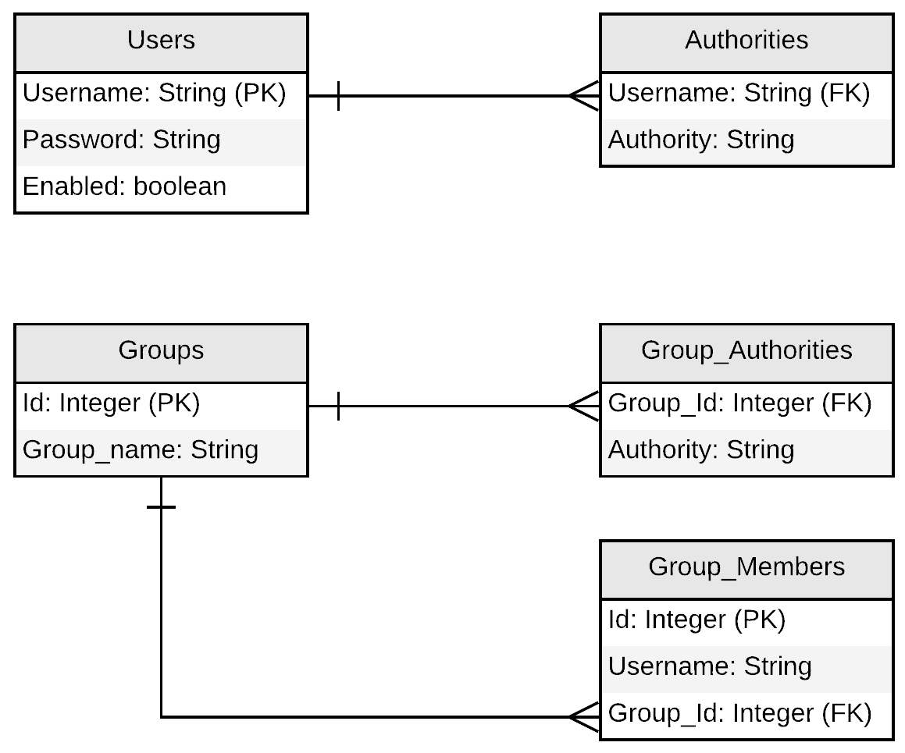
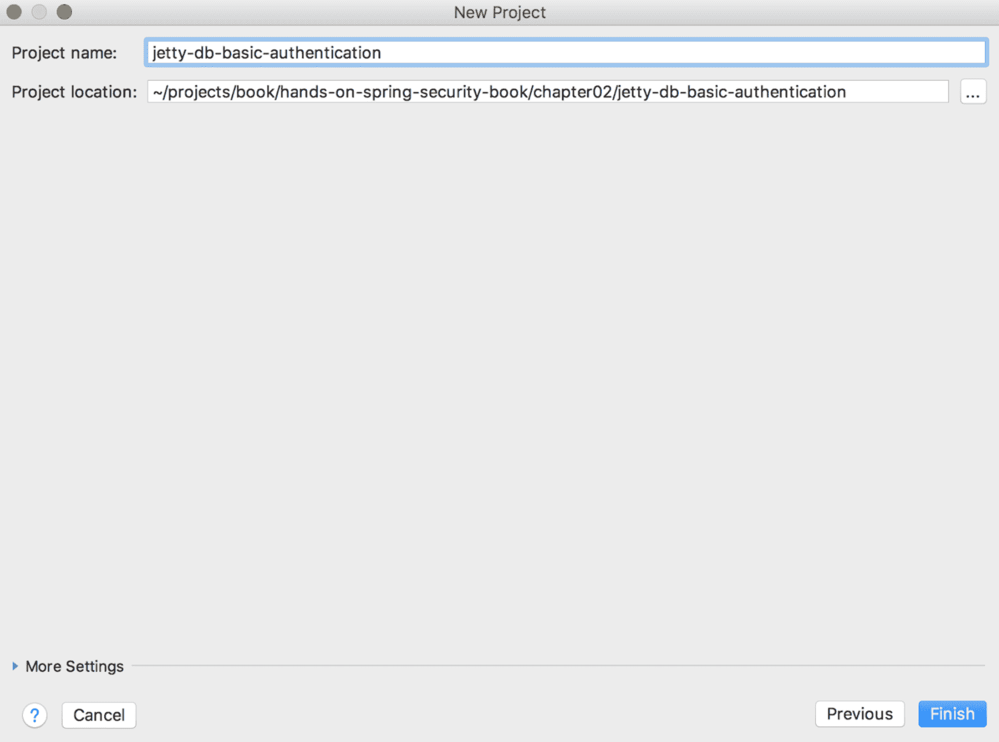
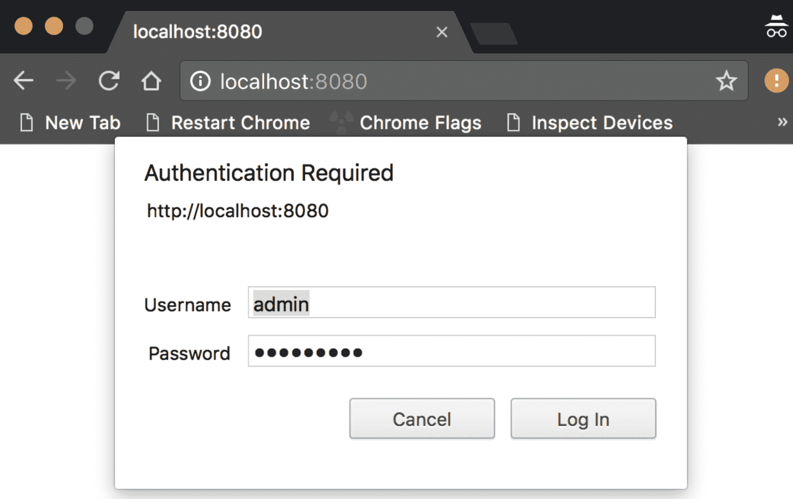
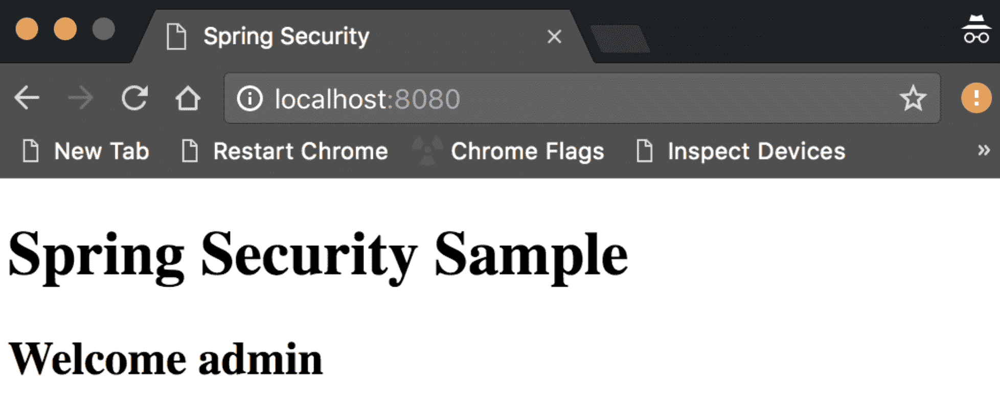
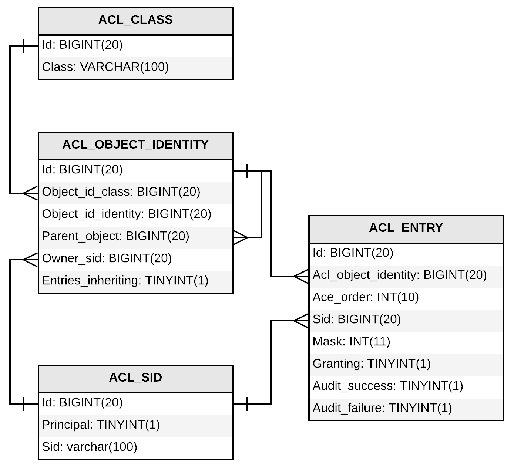

# 二、深入 SpringSecurity

这是一本实践性的书，但我们的第一章是理论性的（应该是这样的），因为它是介绍性的一章。

在本章中，我们将深入探讨 SpringSecurity的技术功能，特别是使用代码的认证和授权。然而，在我们进入编码之前，我们将对理论做一个简要的解释。我们这样做是因为在深入编码之前理解概念是很重要的。

安全的两个最重要方面如下：

*   查找用户的身份
*   查找此用户有权访问的资源

认证是查明用户身份的机制，授权是允许应用程序查明用户可以对应用程序执行哪些操作的机制：


图 01：安全认证和授权的基本方面

在本章中，我们将介绍以下内容：

*   认证
*   认证机制
*   批准

# 认证

确保资源安全的基本方法之一是确保调用方是他们声称的人。检查凭证并确保其真实性的过程称为**认证**。

下图显示了 Spring Security 用于解决此核心安全需求的基本流程。该图是通用的，可用于解释框架支持的所有各种认证方法：


图 02：认证体系结构

如[第 1 章](01.html)、*Spring 5 概述和 Spring Security 5*（在 Spring Security 部分*工作中）所述，Spring Security 有一系列 servlet 过滤器（一个过滤器链）。当请求到达服务器时，它会被这一系列过滤器截获（上图中的*步骤 1*。*

在反应式世界（使用新的 SpringWebFlux web 应用程序框架），过滤器的编写方式与传统过滤器（例如 SpringMVCWeb 应用程序框架中使用的过滤器）截然不同。话虽如此，两者的基本机制仍然相同。我们专门有一章解释如何将 SpringSecurity应用程序转换为 Spring MVC 和 Spring WebFlux，我们将更详细地介绍这些方面。

过滤器链中的 Servlet 过滤器代码执行会一直跳过，直到找到正确的过滤器为止。一旦它根据所使用的认证机制到达正确的认证过滤器，它就会从调用方提取提供的凭据（通常是用户名和密码）。使用提供的值（这里我们有用户名和密码），过滤器（`UsernamePasswordAuthenticationFilter`创建一个`Authentication`对象（在上图中，`UsernamePasswordAuthenticationToken`是使用*步骤 2*中提供的用户名和密码创建的）。然后使用*步骤 2*中创建的`Authentication`对象调用`AuthenticationManager`接口中的`authenticate`方法：

```java
public interface AuthenticationManager {
    Authentication authenticate(Authentication authentication) 
        throws AuthenticationException;
}
```

实际实现由*ProviderManager*提供，它有一个配置的`AuthenticationProvider`列表。

```java
public interface AuthenticationProvider {
    Authentication authenticate(Authentication authentication)
        throws AuthenticationException;
    boolean supports(Class<?> authentication);
}
```

请求通过各种提供者，并在适当的时候尝试对请求进行认证。作为 Spring Security 的一部分，有许多`AuthenticationProvider`。

在本章开头的图表中，`AuthenticationProvider`需要用户详细信息（有些提供商需要，但有些没有），这些信息在`UserDetailsService`中提供：

```java
public interface UserDetailsService {
    UserDetails loadUserByUsername(String username) throws           
        UsernameNotFoundException;
}
```

`UserDetailsService`使用提供的用户名检索`UserDetails`（并实现`User`接口）。

如果一切顺利，Spring Security 将创建一个完全填充的`Authentication`对象（authenticate:true，authenticate authority list 和 username），其中将包含各种必要的细节。过滤器将`Authentication`对象存储在`SecurityContext`对象中，以备将来使用。

`AuthenticationManager`中的`authenticate`方法可以返回以下内容：

*   如果 Spring Security 可以验证提供的用户凭据，则为带有`authenticated=true`的`Authentication`对象
*   如果 Spring Security 发现提供的用户凭据无效，则返回`AuthenticationException`
*   `null`，如果 Spring Security 无法判断是真是假（混乱状态）

# 设置 AuthenticationManager

Spring Security 中有许多内置的`AuthenticationManager`可以在您的应用程序中轻松使用。Spring Security 还有许多帮助程序类，您可以使用这些类设置`AuthenticationManager`。一个助手类是`AuthenticationManagerBuilder`。使用这个类，可以很容易地针对数据库、内存、LDAP 等设置`UserDetailsService`。如果需要，您还可以拥有自己的自定义`UserDetailsService`（可能您的组织中已经有自定义单点登录解决方案）。

您可以创建一个`AuthenticationManager`全局，这样整个应用程序都可以访问它。它将可用于方法安全性和其他`WebSecurityConfigurerAdapter`实例。`WebSecurityConfigurerAdapter`是一个由 Spring 配置文件扩展的类，使 SpringSecurity很容易引入到 Spring 应用程序中。以下是使用`@Autowired`注释设置全局`AuthenticationManager`的方式：

```java
@Configuration
@EnableWebSecurity
public class SpringSecurityConfig extends WebSecurityConfigurerAdapter {

    @Autowired
    public void confGlobalAuthManager(AuthenticationManagerBuilder auth) throws 
            Exception {
        auth
            .inMemoryAuthentication()
                .withUser("admin").password("admin@password").roles("ROLE_ADMIN");
    }
}
```

您还可以通过覆盖`configure`方法创建本地`AuthenticationManager`，该本地`AuthenticationManager`仅适用于此特定`WebSecurityConfigurerAdapter`，如下代码所示：

```java
@Configuration
@EnableWebSecurity
public class SpringSecurityConfig extends WebSecurityConfigurerAdapter {

    @Override
    protected void configure(AuthenticationManagerBuilder auth) throws Exception {
        auth
            .inMemoryAuthentication()
                .withUser("admin").password("admin@password").roles("ROLE_ADMIN");
    }
}
```

另一个选项是通过重写`authenticationManagerBean`方法来公开`AuthenticationManager`bean，如下所示：

```java
@Override
    public AuthenticationManager authenticationManagerBean() throws Exception {
        return super.authenticationManagerBean();
}
```

您还可以将各种`AuthenticationManager`、`AuthenticationProvider`或`UserDetailsService`公开为 bean，这些 bean 将覆盖默认 bean。

在前面的代码示例中，我们使用了`AuthenticationManagerBuilder`来配置内存中的认证。`AuthenticationManagerBuilder`类的更多机制将在本章后面的示例中使用。

# 认证提供者

`AuthenticationProvider`提供了获取用户详细信息的机制，可以通过该机制进行认证。Spring Security 提供了许多`AuthenticationProvider`实现，如下图所示：


图 03:Spring Security 内置 AuthenticationProvider

在接下来的章节中，我们将通过更多的代码示例详细介绍其中的每一个。

# 自定义认证提供程序

如果需要，我们可以通过实现`AuthenticationProvider`接口来编写自定义`AuthenticationProvider`。我们必须实现两种方法，即认证（`Authentication`和`supports(Class<?> aClass)`：

```java
@Component
public class CustomAuthenticationProvider implements AuthenticationProvider {
    @Override
    public Authentication authenticate(Authentication authentication) throws     
            AuthenticationException {
      String username = authentication.getName();
      String password = authentication.getCredentials().toString();
      if ("user".equals(username) && "password".equals(password)) {
        return new UsernamePasswordAuthenticationToken
          (username, password, Collections.emptyList());
      } else {
        throw new BadCredentialsException("Authentication failed");
      }
    }
    @Override
    public boolean supports(Class<?> aClass) {
      return aClass.equals(UsernamePasswordAuthenticationToken.class);
    }
}
```

我们的方法很简单。我们只是将用户名和密码与静态值进行比较。我们可以在这里编写任何逻辑并验证用户。如果有错误，它将抛出异常`AuthenticationException`。

在本书的 GitHub 页面上，导航到`jetty-in-memory-basic-custom-authentication`项目以查看此类的完整源代码。

# 多重认证提供程序

Spring Security 允许您在应用程序中声明多个`AuthenticationProvider`。它们根据在配置中声明的顺序执行。

`jetty-in-memory-basic-custom-authentication`项目进一步修改，我们将新创建的`CustomAuthenticationProvider`作为`AuthenticationProvider`（`Order 1`），现有的`inMemoryAuthentication`作为我们的第二个`AuthenticationProvider`（`Order 2`：

```java
@EnableWebSecurity
@ComponentScan(basePackageClasses = CustomAuthenticationProvider.class)
public class SpringSecurityConfig extends WebSecurityConfigurerAdapter {

    @Autowired
    CustomAuthenticationProvider customAuthenticationProvider;

    @Override
    protected void configure(HttpSecurity http) throws Exception {
        http.httpBasic()
                .and()
                .authorizeRequests()
                .antMatchers("/**")
                .authenticated(); // Use Basic authentication
    }
    @Override
    protected void configure(AuthenticationManagerBuilder auth) throws Exception {
        // Custom authentication provider - Order 1
        auth.authenticationProvider(customAuthenticationProvider);
        // Built-in authentication provider - Order 2
        auth.inMemoryAuthentication()
                .withUser("admin")
                .password("{noop}admin@password")
                //{noop} makes sure that the password encoder doesn't do anything
                .roles("ADMIN") // Role of the user
                .and()
                .withUser("user")
                .password("{noop}user@password")
                .credentialsExpired(true)
                .accountExpired(true)
                .accountLocked(true)
                .roles("USER");
    }
}
```

每当`authenticate`方法无误执行时，控件返回，随后配置的`AuthenticationProvider`不会执行。

# 示例应用程序

让我们做一些编码来弄脏我们的手。我们将从最常见的认证机制开始，然后讨论可以与 Spring Security 一起使用的其他认证机制。

# 基本项目设置

除了实际的认证机制外，应用程序的许多方面都非常相似。在本节中，我们将设置示例，然后详细介绍特定的认证机制。

我们将使用默认的 SpringSecurityDB 模式对用户进行认证。我们将创建一个成熟的 SpringMVCWeb 应用程序，每个组件都是从头开始创建的。在 SpringBoot 的帮助下使用 SpringMVC 创建一个示例 SpringSecurity应用程序非常简单。应用程序将通过许多隐藏在开发人员之外的东西来运行。但是在本例中，我们将逐个组件地创建这个应用程序组件，以便您可以看到构建在 SpringMVC 上的 web 应用程序的实际代码。

Spring Security 使用的默认 DB 模式如下图所示。但是，您可以按照您认为适合您的应用程序的方式对其进行自定义。我们将在此处使用**用户**和**权限**表进行设置：



图 04:SpringSecurity默认数据库模式

现在让我们开始开发示例应用程序。

# 步骤 1-在 IntelliJ IDEA 中创建 Maven 项目

在 IntelliJ 中，选择文件|新建|项目。这将打开“新建项目向导”，如下面的屏幕截图所示。现在选择 Maven 并单击下一步按钮：


图 05:IntelliJ 中的新 Maven 项目

在新建项目向导的下一个屏幕（*步骤 2*中），输入 GroupId、ArtifactId 和版本，如以下屏幕截图所示：


图 06:IntelliJ Input GroupId、ArtifactId 和 Version 中的 Maven 项目设置

在新建项目向导的下一个屏幕（*步骤 3*中），输入项目名称和项目位置，如下图所示：



图 07:Maven 项目设置设置项目名称和项目位置

IntelliJ 将向您提示说明，如以下屏幕截图所示。要在`pom.xml`中进行任何更改时自动导入项目，请单击启用自动导入链接：


图 08：在 IntelliJ 中启用自动导入

# 步骤 2-pom.xml 更改

打开`pom.xml`文件，在项目标签（`<project></project>`内添加以下代码：

```java
<!-- Spring dependencies -->
<dependency>
   <groupId>org.springframework.security</groupId>
   <artifactId>spring-security-web</artifactId>
   <version>5.0.4.RELEASE</version>
</dependency>
<dependency>
   <groupId>org.springframework.security</groupId>
   <artifactId>spring-security-config</artifactId>
   <version>5.0.4.RELEASE</version>
</dependency>
<dependency>
   <groupId>org.springframework.security</groupId>
   <artifactId>spring-security-crypto</artifactId>
   <version>5.0.4.RELEASE</version>
</dependency>
<dependency>
   <groupId>org.springframework</groupId>
   <artifactId>spring-webmvc</artifactId>
   <version>5.0.5.RELEASE</version>
</dependency>
<dependency>
   <groupId>org.springframework</groupId>
   <artifactId>spring-jdbc</artifactId>
   <version>5.0.4.RELEASE</version>
</dependency>
<!-- Servlet and JSP related dependencies -->
<dependency>
   <groupId>javax.servlet</groupId>
   <artifactId>javax.servlet-api</artifactId>
   <version>3.1.0</version>
   <scope>provided</scope>
</dependency>
<dependency>
   <groupId>javax.servlet.jsp</groupId>
   <artifactId>javax.servlet.jsp-api</artifactId>
   <version>2.3.1</version>
   <scope>provided</scope>
</dependency>
<dependency>
   <groupId>javax.servlet.jsp.jstl</groupId>
   <artifactId>javax.servlet.jsp.jstl-api</artifactId>
   <version>1.2.1</version>
</dependency>
<dependency>
   <groupId>taglibs</groupId>
   <artifactId>standard</artifactId>
   <version>1.1.2</version>
</dependency>
<!-- For datasource configuration -->
<dependency>
   <groupId>org.apache.commons</groupId>
   <artifactId>commons-dbcp2</artifactId>
   <version>2.1.1</version>
</dependency>
<!-- We will be using MySQL as our database server -->
<dependency>
   <groupId>mysql</groupId>
   <artifactId>mysql-connector-java</artifactId>
   <version>6.0.6</version>
</dependency>
```

在`pom.xml`上建立一个设置，我们将使用 jetty 运行创建的应用程序。

```java
<build>
   <plugins>
       <!-- We will be using jetty plugin to test the war file -->
       <plugin>
           <groupId>org.eclipse.jetty</groupId>
           <artifactId>jetty-maven-plugin</artifactId>
           <version>9.4.8.v20171121</version>
       </plugin>
   </plugins>
</build>
```

# 步骤 3-MySQL 数据库模式设置

使用以下脚本创建默认数据库架构，并插入一些用户：

```java
create table users(
    username varchar(75) not null primary key,
    password varchar(150) not null,
    enabled boolean not null
);
create table authorities (
    username varchar(75) not null,
    authority varchar(50) not null,
    constraint fk_authorities_users foreign key(username) references users(username)
);
```

使用以下脚本将数据插入到前面的表中：

```java
insert into users(username, password, enabled)
    values('admin', '$2a$04$lcVPCpEk5DOCCAxOMleFcOJvIiYURH01P9rx1Y/pl.wJpkNTfWO6u', true);
insert into authorities(username, authority) 
    values('admin','ROLE_ADMIN');
insert into users(username, password, enabled)
    values('user', '$2a$04$nbz5hF5uzq3qsjzY8ZLpnueDAvwj4x0U9SVtLPDROk4vpmuHdvG3a', true);
insert into authorities(username,authority) 
    values('user','ROLE_USER');
```

`password`是使用在线工具[进行单向散列的 http://www.devglan.com/online-tools/bcrypt-hash-generator](http://www.devglan.com/online-tools/bcrypt-hash-generator) 。为了比较`password`，我们将使用`PasswordEncoder`（`Bcrypt`。

全权证书如下：

*   用户=`admin`和密码=`admin@password`
*   用户=`user`和密码=`user@password`

需要注意的是，尽管角色名为`ROLE_ADMIN`，但实际名称为`ADMIN`，这就是我们的代码在传递时将使用的名称。

# 步骤 4-在项目中设置 MySQL 数据库属性

在`src/main/resources`文件夹中创建一个名为`mysqldb.properties`的文件，内容如下：

```java
mysql.driver=com.mysql.cj.jdbc.Driver
mysql.jdbcUrl=jdbc:mysql://localhost:3306/spring_security_schema?useSSL=false
mysql.username=root
mysql.password=<your-db-password>
```

# 步骤 5-Spring 应用程序配置

在`com.packtpub.book.ch02.springsecurity.config`包中创建一个名为`ApplicationConfig`的 Java 类，代码如下：

```java
@Configuration
@PropertySource("classpath:mysqldb.properties")
public class ApplicationConfig {

   @Autowired
   private Environment env;

   @Bean
   public DataSource getDataSource() {
       BasicDataSource dataSource = new BasicDataSource();
       dataSource.setDriverClassName(env.getProperty("mysql.driver"));
       dataSource.setUrl(env.getProperty("mysql.jdbcUrl"));
       dataSource.setUsername(env.getProperty("mysql.username"));
       dataSource.setPassword(env.getProperty("mysql.password"));
       return dataSource;
   }
}
```

# 步骤 6-Web 应用程序配置

在本例中，我们将使用 SpringMVC 作为我们的 web 应用程序框架。让我们创建 web 应用程序配置文件：

```java
@Configuration
@EnableWebMvc
@ComponentScan(basePackages= {"com.packtpub.book.ch02.springsecurity.controller"})
public class WebApplicationConfig implements WebMvcConfigurer {
   @Override
   public void configureViewResolvers(ViewResolverRegistry registry) {
       registry.jsp().prefix("/WEB-INF/views/").suffix(".jsp");
   }
}
```

`@EnableWebMvc`注释确保您的应用程序基于 SpringMVC。

# 步骤 7-Spring MVC 设置

在 Spring MVC 中，请求到达`DispatcherServlet`。`DispatcherServlet`可以在`web.xml`中声明，如果 servlet 容器是 3.0+，则可以将其声明为 Java 配置。请创建一个虚拟的`SpringSecurityConfig.java`文件。在解释第一种认证机制，即基本认证时，我们将构造此类：

```java
public class SpringMvcWebApplicationInitializer
       extends AbstractAnnotationConfigDispatcherServletInitializer {

   @Override
   protected Class<?>[] getRootConfigClasses() {
       return new Class[] { ApplicationConfig.class, SpringSecurityConfig.class };
   }

   @Override
   protected Class<?>[] getServletConfigClasses() {
       return new Class[] { WebApplicationConfig.class };
   }

   @Override
   protected String[] getServletMappings() {
       return new String[] { "/" };
   }

}
```

# 步骤 8-控制器设置

让我们为安全的 JSP 页面（`home.jsp`创建一个基本控制器（`HomeController`。请注意，映射方法的返回应该是一个字符串，并且应该映射到 JSP 文件的实际名称。在我们的例子中，它是`home.jsp`，调用者登录时导航的安全资源：

```java
@Controller
public class HomeController {

   @GetMapping("/")
   public String home(Model model, Principal principal) {
       if(principal != null)
           model.addAttribute("msg", "Welcome " + principal.getName());
       return "home";
   }
}
```

# 步骤 9-JSP 创建

我们的主页是一个非常简单的 JSP 文件，如下面的代码片段所示。此 JSP 仅显示我们在`HomeController`类中构造的一条消息：

```java
<%@ page language="java" contentType="text/html; charset=ISO-8859-1"
        pageEncoding="ISO-8859-1"%>
<!DOCTYPE html>
<html>
<head>
   <meta http-equiv="Content-Type" content="text/html; charset=ISO-8859-1">
   <title>Spring Security</title>
</head>
<body>
<h1>Spring Security Sample</h1>
<h2>${msg}</h2>
</body>
</html>
```

现在，这是基本的 SpringMVC 应用程序，通过它，我们将尝试设置各种认证机制。

# SpringSecurity设置

为了解释 SpringSecurity，我们将在前面创建的 SpringMVC 项目上实现基本认证。在[第 3 章](03.html)*中，使用 SAML、LDAP 和 OAuth/OIDC*进行认证，我们将研究使用 SpringSecurity实现其他认证机制。要在应用程序中完成基本认证，让我们执行本节中概述的其他步骤。

# 步骤 1-SpringSecurity配置设置

现在，我们将创建非常重要的 Spring Security 配置类，并确保设置了 Spring Security 的默认筛选器链以保护所有资源：

```java
@EnableWebSecurity
public class SpringSecurityConfig extends WebSecurityConfigurerAdapter {
   @Autowired
   private DataSource dataSource;
   @Override
   protected void configure(AuthenticationManagerBuilder auth) throws Exception {
       auth.jdbcAuthentication().dataSource(dataSource)
               .usersByUsernameQuery("select username, password, enabled"
                       + " from users where username = ?")
               .authoritiesByUsernameQuery("select username, authority "
                       + "from authorities where username = ?")
               .passwordEncoder(new BCryptPasswordEncoder());
   }
   @Override
   protected void configure(HttpSecurity http) throws Exception {
       http.authorizeRequests().anyRequest().hasAnyRole("ADMIN", "USER")
               .and()
               .httpBasic(); // Use Basic authentication
   }
}
```

在 SpringSecurity配置中，我们要做的第一件事是告诉 SpringSecurity，您必须使用定义的用户查询并使用定义的权限查询检查用户的权限，从而根据数据库对用户进行认证。

然后，我们设置认证机制来检索用户的凭据。这里我们使用基本认证作为捕获用户凭据的机制。请注意，用于检查的角色名称没有前缀`ROLE_`。

# 步骤 2-Spring 针对 web 应用程序的安全设置

我们知道必须指示应用程序开始使用 SpringSecurity。一个简单的方法是在`web.xml`中声明弹簧安全过滤器。如果您希望避免使用 XML，而是使用 Java 执行操作，那么创建一个扩展`AbstractSecurityWebApplicationInitializer`的类；这将完成初始化过滤器和为应用程序设置 SpringSecurity的技巧：

```java
public class SecurityWebApplicationInitializer
       extends AbstractSecurityWebApplicationInitializer {

}
```

这样，我们就完成了查看基本认证所需的所有设置。

# 运行应用程序

通过执行`mvn jetty:run`命令来运行项目。一旦您看到以下屏幕截图中显示的日志，请打开浏览器并转到`http://localhost:8080`：


图 09：Jetty 服务器运行-控制台日志

访问 URL 后，浏览器将提示默认的基本认证对话框，如以下屏幕截图所示。输入用户名和密码为`admin`/`admin@password`并点击登录：



图 10：浏览器中的基本认证对话框

如果您的凭据正确，并且用户具有`ADMIN`或`USER`角色，您应该看到如下主页：



图 11：成功登录后的主页

完整的项目代码可在本书的 GitHub 页面（[中找到）https://github.com/PacktPublishing/Hands-On-Spring-Security-5-for-Reactive-Applications `jetty-db-basic-authentication`*项目内的*](https://github.com/PacktPublishing/Hands-On-Spring-Security-5-for-Reactive-Applications)*）。*

 *# 内存用户存储器

如前所述，对于各种测试目的，最好先存储用户凭据，然后在内存中进行认证，而不是使用适当的数据库，如 MySQL。为此，只需通过添加以下方法更改 SpringSecurity配置文件（`SpringSecurityConfig.java`：

```java
@Override
protected void configure(AuthenticationManagerBuilder auth) throws Exception {
   auth
.inMemoryAuthentication()
           .withUser("admin")
           .password("{noop}admin@password") 
//{noop} makes sure that the password encoder doesn't do anything
           .roles("ADMIN") // Role of the user
           .and()
           .withUser("user")
           .password("{noop}user@password")
           .credentialsExpired(true)
           .accountExpired(true)
           .accountLocked(true)
           .roles("USER");
}
```

需要注意的是，密码有一个前缀，`{noop}`，附在上面。这样可以确保在验证密码时，不会执行任何编码。这是在运行项目时避免密码编码错误的一种方法。

完整的源代码，作为一个成熟的项目，可以在本书的 GitHub 页面的`jetty-in-memory-basic-authentication`项目中找到。

# 像弹簧靴一样运行

前面的示例可以通过以下附加步骤轻松地转换为 Spring 引导应用程序。这个过程不会涵盖我们之前所做的许多琐碎步骤。您还需要一个配置文件`SpringSecurityConfig.java`*，具体如下。*

 *您可以使用以下代码创建一个新文件，通常名为`Run.java`：

```java
@SpringBootApplication
public class Run {
   public static void main(String[] args) {
       SpringApplication.run(Run.class, args);
   }
}
```

这是一个非常简单的文件，其中有一个重要的注释，`@SpringBootApplication`。我们去掉了 Spring MVC 配置类，并将以下属性放入`application.properties`文件中。这只是避免创建新的 Spring MVC 配置文件而使用属性文件的另一种方法：

```java
spring.mvc.view.prefix: /WEB-INF/views/
spring.mvc.view.suffix: .jsp
```

和之前一样，其他一切都完好无损。关于完整的项目，请参阅本书在`spring-boot-in-memory-basic-authentication`项目中的 GitHub 页面。

打开命令提示符并输入以下命令：

```java
mvn spring-boot:run
```

打开浏览器，导航到`http://localhost:8080`，应该会有一个基本认证对话框。成功登录后，您将进入用户主页，如前所示。

# 批准

一旦用户在他们声称是谁方面得到验证，下一个方面，即用户可以访问什么，就需要确定。这个确保允许用户在应用程序中做什么的过程称为授权。

与认证体系结构一致，如前所述，授权也有一个管理器，`AccessDecisionManager`。Spring Security 为此有三个内置实现：`AffirmativeBased`、`ConsensusBased`和`UnanimousBased`。`AccessDecisionManager`通过授权给`AccessDecisionVoter`连锁店进行工作。与授权相关的 SpringSecurity类/接口如下图所示：


图 12:SpringSecurity授权类/接口

在 SpringSecurity 中，通过调用投票者，然后统计收到的选票，授予对安全资源的授权。三个内置实现以不同的方式记录收到的投票：

*   **基于确认的**：如果至少有一名投票人投票，则用户可以访问安全资源
*   **共识基础**：如果投票人和他们的选票之间达成了明确的共识，则用户可以访问安全资源
*   **基于 UnanimousBased**：如果所有投票人都投票，则用户可以访问安全资源

Spring Security 提供了两种授权方法：

*   **Web URL**：基于传入 URL（特定 URL 或正则表达式）的授权
*   **方法**：控制访问的方法签名

如果您的服务层只公开 RESTful 端点，并且应用程序中的数据被正确分类为资源（符合 REST 原则），那么可以考虑使用 Web URL 方法。如果您的应用程序只公开端点（基于 REST，我将调用）不真正遵守 REST 原则，您可以考虑使用基于方法的授权。

# 网址

Spring Security 可用于设置基于 URL 的授权。HTTP 安全配置可以与 SpringSecurity配置一起使用，以实现所需的授权。在到目前为止我们已经经历的许多示例中，我们已经看到了模式匹配授权。这里有一个这样的例子：

*   `AntPathRequestMatcher`：使用 Ant 样式模式进行 URL 匹配：

```java
http
    .antMatcher("/rest/**")
    .httpBasic()
        .disable()
    .authorizeRequests()
        .antMatchers("/rest/movie/**", "/rest/ticket/**", "/index")
            .hasRole("ROLE_USER");
```

在前面的代码片段中，`/rest`URL 的基本认证被禁用，对于其他 URL（`/rest/movie`、`/rest/ticket`和`/index`，具有`USER`角色的用户可以访问。该代码段还显示了单个匹配（使用`antMatcher`）和多个匹配（使用`antMatchers`）。

*   `MvcRequestMatcher`：使用 Spring MVC 匹配路径，然后提取变量。匹配是相对于 servlet 路径的。
*   `RegexRequestMatcher`：使用正则表达式匹配 URL。如果需要，它还可以用于匹配 HTTP 方法。匹配区分大小写，形式为（`servletPath`+`pathInfo`+`queryString`：

```java
http
    .authorizeRequests()
    .regexMatchers("^((?!(/rest|/advSearch)).)*$").hasRole("ADMIN")
    .regexMatchers("^((?!(/rest|/basicSearch)).)*$").access("hasRole(USER)")
        .anyRequest()
    .authenticated()
    .and()
    .httpBasic();
```

# 方法调用

Spring Security 允许用户在后台使用**面向方面编程**（**AOP**）访问控制方法执行。这可以使用 XML 配置或 Java 配置来完成。由于本书中我们一直在关注 Java 配置，因此我们将在这里介绍 Java 配置和注释，以解释方法安全性。最佳实践是选择一种特定的方法调用授权方法，并坚持使用这种方法，以确保整个应用程序的一致性。选择适合您的应用程序的方法，因为没有任何关于何时选择什么的特定文档。

如果您希望在应用程序中启用方法安全性，请首先使用`@EnableMethodSecurity`注释该类。您可以使用三种类型的注释对方法进行注释并对其进行授权。类型如下：

*   **基于投票的****安****旋转**：Spring Security 中最常用的注释。Spring Security 的`@Secured`注释属于这一类。要使用这些注释，首先必须启用它们，如以下代码段所示：

```java
@Configuration
@EnableGlobalMethodSecurity(securedEnabled = true)
public class SecurityConfig extends WebSecurityConfigurerAdapter {
    // ...
}
```

一旦启用了注释的使用，就可以使用`@Secured`注释，如下代码段所示：

```java
@RestController
@RequestMapping("/movie")
public class MovieController {

    @GetMapping("public")
    @Secured("ROLE_PUBLIC")
    public String publiclyAvailable() {
        return "Hello All!";
    }

    @GetMapping("admin")
    @Secured("ROLE_ADMIN")
    public String adminAccessible() {
        return "Hello Admin!";
    }
}
```

*   **JSR-250 安全注释**：也称为**企业 JavaBeans 3.0**（**EJB****3**安全注释。同样，在使用这些注释之前，必须使用`@EnableGlobalMethodSecurity(jsr250Enabled = true)`启用它们。以下代码段显示了正在运行的 JSR-250 安全注释：

```java
@RestController
@RequestMapping("/movie")
public class MovieController {

    @GetMapping("public")
    @PermitAll
    public String publiclyAvailable() {
        return "Hello All!";
    }

    @GetMapping("admin")
    @RolesAllowed({"ROLE_ADMIN"})
    public String adminAccessible() {
        return "Hello Admin!";
    }
}
```

*   **基于表达式的注释**：基于`@Pre`和`@Post`的注释属于这一类。它们通过`@EnableGlobalMethodSecurity(prePostEnabled = true)`启用：

```java
@RestController
@RequestMapping("/movie")
public class MovieController {
    @GetMapping("public")
    @PreAuthorize("permitAll()")
    public String publiclyAvailable() {
        return "Hello All!";
    }
    @GetMapping("admin")
    @PreAuthorize("hasAnyAuthority('ROLE_ADMIN')")
    public String adminAccessible() {
        return "Hello Admin!";
    }
}
```

在上例中，`hasAnyAuthority`被称为**Spring 表达式语言**（**SpEL**。与所示示例类似，有许多这样的预定义表达式可用于安全性。

# 域实例

Spring Security 提供了访问控制附加到任何对象的各种权限的方法。Spring Security**访问控制列表**（**ACL**存储与域对象关联的权限列表。它还将这些权限授予需要对域对象执行不同操作的各种实体。要使 SpringSecurity工作，您需要设置四个数据库表，如下图所示：



图 13:SpringSecurity ACL 数据库模式

下面是对上图中表格的一个小说明：

*   `ACL_CLASS`表：顾名思义，它存储域对象的类名。
*   `ACL_SID`表：**安全标识**（**SID**）存储用户名（`testuser`或角色名（`ROLE_ADMIN`）。`PRINCIPAL`列存储 0 或 1，如果 SID 是用户名，则存储 0；如果 SID 是角色名，则存储 1。
*   `ACL_OBJECT_IDENTITY`表：委托存储对象相关信息，链接其他表。
*   `ACL_ENTRY`表：存储每个`OBJECT_IDENTITY`授予每个 SID 的权限。

为了让 SpringSecurity ACL 工作，它还需要缓存。与 Spring 集成的最简单的方法之一是 EhCache。

Spring Security ACL 支持以下权限：

*   `READ`
*   `WRITE`
*   `CREATE`
*   `DELETE`
*   `ADMINISTRATION`

要使其工作，我们必须使用`@EnableGlobalMethodSecurity(prePostEnabled = true, securedEnabled = true)`启用它。我们现在已经准备好放置注释以开始访问控制域对象。使用 Spring ACL 的代码段如下所示：

```java
@PostFilter("hasPermission(filterObject, 'READ')")
List<Record> findRecords();
```

查询记录（后过滤）后，检查结果（列表），进行过滤，只返回用户有`READ`权限的对象。我们也可以使用`@PostAuthorize`如下：

```java
@PostAuthorize("hasPermission(returnObject, 'READ')")
```

执行方法（`@Post`后，如果用户对对象有`READ`访问权限，则返回。否则会抛出一个`AccessDeniedException`异常：

```java
@PreAuthorize("hasPermission(#movie, 'WRITE')")
Movie save(@Param("movie")Movie movie);
```

方法触发前（`@Pre`检查用户是否对该对象有`WRITE`权限。这里，我们使用传递到方法中的参数来检查用户权限。如果用户对`WRITE`有权限，则执行该方法。否则，它将抛出一个异常。

我们可以有一个完全成熟的例子，但我们已经被这本书所涵盖的主题数量所累了。因此，我将把它留在这里，我相信您现在有足够的信息来完成一个完整的实现。

有关安全性的一些常见内置 Spring 表达式如下所示：

| **表达式** | **说明** |
| `hasRole([role_name])` | 如果当前用户有`role_name`，则返回`true` |
| `hasAnyRole([role_name1, role_name2])` | 如果当前用户在列表中有任何角色名称，则返回`true` |
| `hasAuthority([authority])` | 如果当前用户有指定权限，则返回`true` |
| `hasAnyAuthority([authority1, authority2])` | 如果当前用户在指定列表中有权限，则返回`true` |
| `permitAll` | 始终等于`true` |
| `denyAll` | 始终等于`false` |
| `isAnonymous()` | 如果当前用户是匿名用户，则返回`true` |
| `isRememberMe()` | 如果当前用户设置了记住我，则返回`true` |
| `isAuthenticated()` | 如果当前用户不是匿名用户，则返回`true` |
| `isFullyAuthenticated()` | 如果当前用户不是匿名用户或记住我的用户，则返回`true` |
| `hasPermission(Object target, Object permission)` | 如果当前用户对目标对象有权限，则返回`true` |
| `hasPermission(Object targetId, Object targetType, Object permission)` | 如果当前用户对目标对象有权限，则返回`true` |

# 其他 SpringSecurity功能

除了核心安全特性、认证和授权之外，Spring Security 还有许多功能。这里列出了一些最重要的问题。在[第 7 章](07.html)、*Spring Security Add-Ons*中，我们将使用动手编码更详细地介绍其中的每一个。我们将以本章中创建的示例为基础，解释每个非常重要的 SpringSecurity功能：

*   **记住我认证**：这也称为持久登录，允许网站在多个会话之间记住用户的身份。Spring Security 提供了两种实现（基于哈希令牌和基于持久令牌），使这一过程变得简单。
*   **跨站点请求伪造**（**CSRF**）：这是黑客利用的一种非常常见的安全漏洞，用于进行不道德的操作，即代表用户发送未经授权的命令。Spring Security 允许我们通过配置轻松修复此漏洞。
*   **跨源资源共享**（**CORS**）：这是一种机制，通过这种机制，在特定域上运行的 web 应用程序可以通过添加额外的 HTTP 头来访问另一个域中公开的资源。这是用于确保只有合法代码才能访问域公开的资源的安全机制之一。
*   **会话管理**：正确的用户会话管理是任何应用程序安全的关键。以下是 Spring Security 轻松处理的一些重要会话相关功能：
    *   **会话超时**：确保用户会话以配置值超时，不被黑客攻击。
    *   **并发会话**：防止用户在服务器内有多个（配置值）活动会话。
    *   **会话固定**：这是一种安全攻击，允许攻击者劫持有效用户的会话，然后开始将其用于不道德的操作。

这些是 SpringSecurity 带来的一些重要特性。在涵盖了与 SpringSecurity相关的其他主题之后，我们将深入探讨它们。

# 总结

本章旨在介绍两个重要的安全概念，即认证和授权，以及 SpringSecurity如何支持它们。

我们首先详细解释了这些概念，然后借助一个示例应用程序深入讨论了它们。我们使用 SpringMVC 应用程序作为基础，帮助您理解 SpringSecurity概念。[第 4 章](04.html)*使用 CAS 和 JAAS 进行认证*，旨在解释反应式 web 应用程序框架 Spring WebFlux。

在下一章中，我们将通过扩展我们在本章中构建的示例，介绍 Spring Security 支持的其他认证机制。**