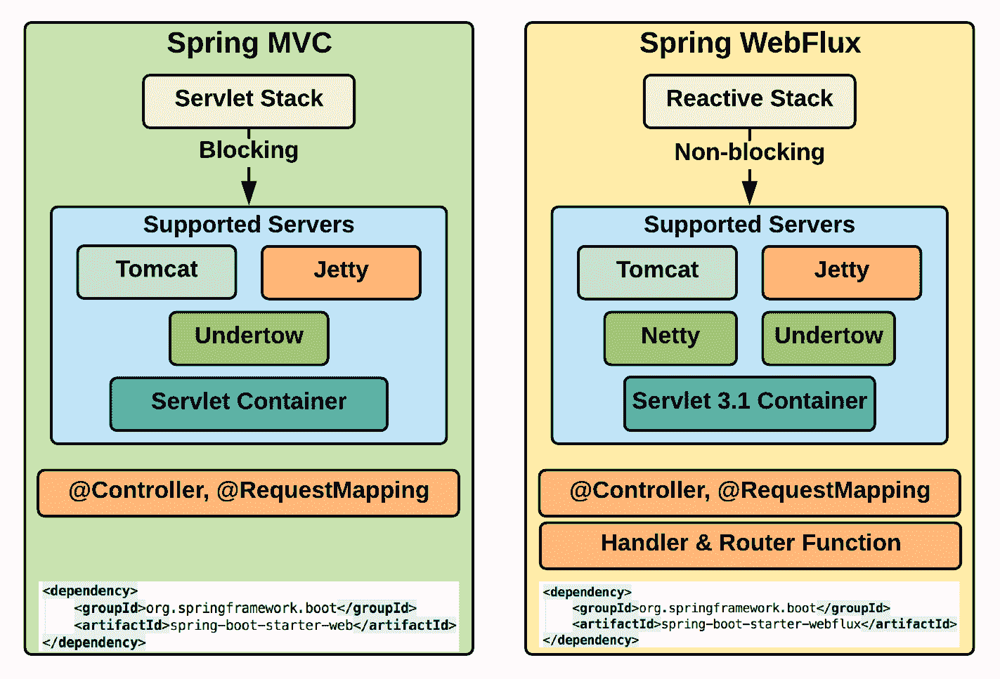
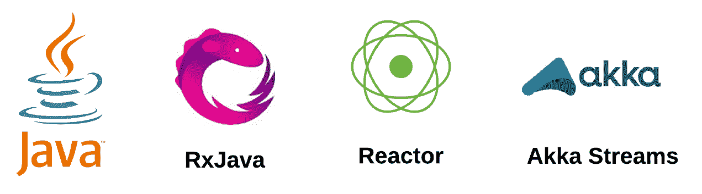
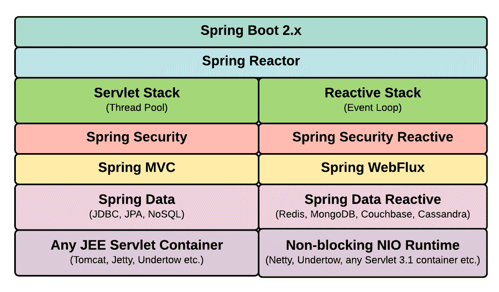
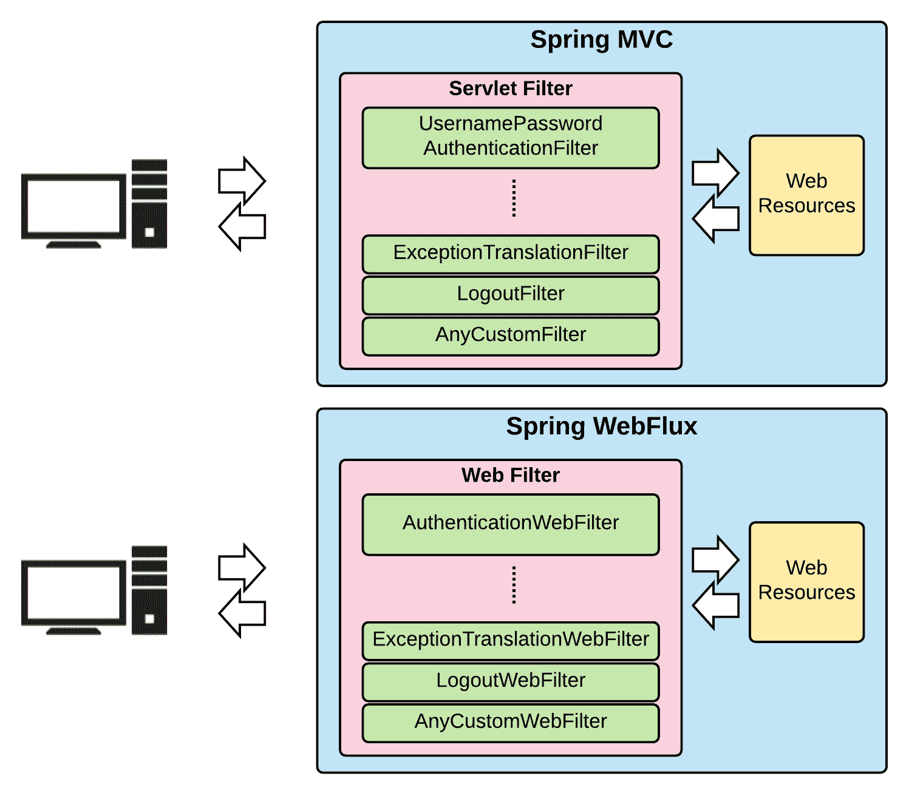
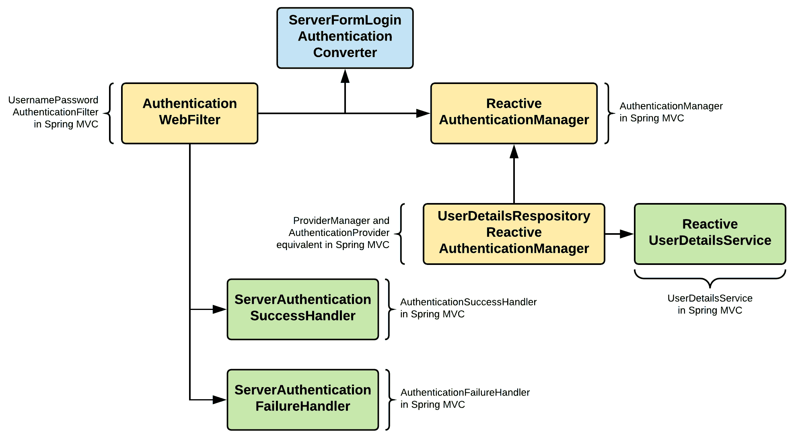
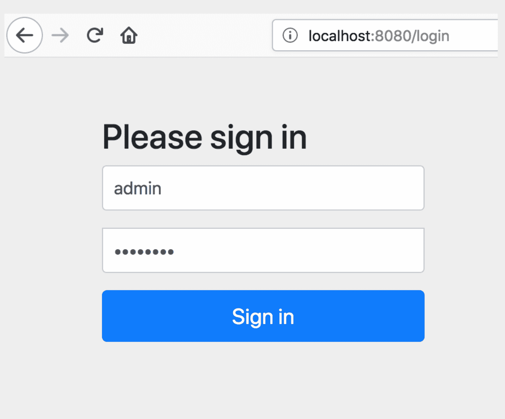
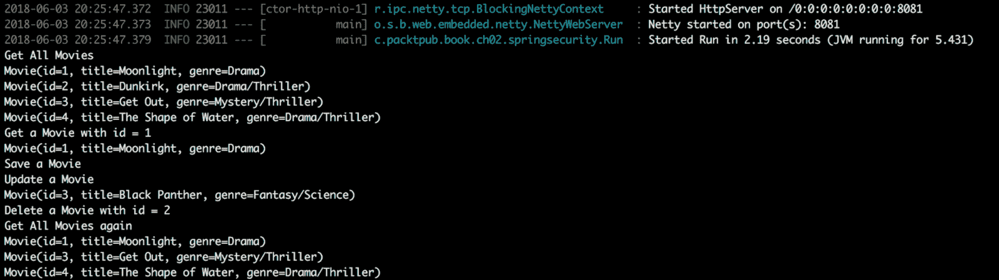

# 与 Spring WebFlux 集成

作为 SpringFramework5 的一部分引入的一个新特性是引入了一个新的反应式 web 应用程序框架 SpringWebFlux。WebFlux 与成熟的 web 应用程序框架 SpringMVC 共存。本书旨在介绍 SpringSecurity 的反应部分，其中 SpringWebFlux 是核心组件之一。

使您的应用程序成为被动的，会给您的应用程序带来异步特性。传统的 Java 应用程序使用线程来实现应用程序的并行和异步特性，但是，web 应用程序使用线程在任何方面都是不可伸缩和高效的。

本章首先介绍 SpringMVC 和 SpringWebFlux 之间的核心区别。然后深入研究 Spring 安全模块以及如何将反应性方面引入其中。

在本章中，我们将介绍以下主题：

*   Spring MVC 与 WebFlux
*   春季 5 号的反应性支持
*   春季网络流量
*   SpringWebFlux 认证体系结构
*   SpringWebFlux 授权
*   样本项目
*   定制

# Spring MVC 与 WebFlux

SpringWebFlux 作为 Spring5 的一部分引入，以引入现有 SpringMVC 的新替代方案。SpringWebFlux 引入了非阻塞事件循环风格的编程，以提供异步性。

事件循环是由 Node.js 引入并使其出名的。只要有可能，Node.js 就可以通过将操作卸载到系统内核，使用单线程 JavaScript 执行非阻塞操作。内核是多线程的，能够执行这些卸载操作，并且在成功执行后通过回调通知 Node.js。有一个持续运行的进程检查调用堆栈（其中需要执行的操作被堆叠），并以**先进先出**（**FIFO**的方式持续执行进程。如果调用堆栈为空，则会查看*事件队列*中的操作。它将拾取它们，然后将它们移动到调用堆栈，以便进一步拾取以执行。

下图显示了两个 web 应用程序框架中的内容：



图 1:SpringMVC 和 SpringWebFlux

如上图所示，SpringMVC 基于 ServletAPI（适用于线程池），SpringWebFlux 基于反应流（适用于事件循环机制）。然而，这两个框架都支持常用的注释，例如`@Controller`，并且还支持一些著名的服务器。

让我们在下图中并排查看 Spring MVC 和 Spring WebFlux 的工作原理：


图 2:SpringMVC 和 SpringWebFlux 的工作原理

如您所见，这两个框架工作的根本区别在于 SpringMVC 是阻塞的，SpringWebFlux 是非阻塞的。

在 Spring WebFlux 中，Servlet API 充当适配器层，使其能够支持 Servlet 容器（如**Tomcat**和**Jetty**）和非 Servlet 运行时（如**Undertow**和**Netty**）。

Spring MVC 包括同步 API（过滤器、Servlet 等）和阻塞 I/O（`InputStream`、`OutputStream`等），而 Spring WebFlux 的异步 API（`WebFilter`、`WebHandler`等）和非阻塞 I/O（Reactor Mono 用于*0..1*元素，Rector Flux 用于*0..N*元素）。

SpringWebFlux 支持各种异步和反应式 API，即 Java9FlowAPI、RxJava、Reactor 和 Akka 流。默认情况下，它使用 Spring 自己的反应式框架 Reactor，它的工作做得非常好：



图 3:SpringWebFlux 反应式 API 支持

如前所述，SpringWebFlux 是作为 SpringMVC 的替代品引入的。这并不意味着 SpringMVC 不受欢迎。用 SpringMVC 编写的应用程序可以继续在同一堆栈上运行，而无需迁移到 SpringWebFlux。如果需要，我们可以通过运行反应式客户端来调用远程服务，从而将反应式编码实践引入到现有的 SpringMVC 应用程序中。

现在我们已经在 Spring 中看到了两个 web 应用程序框架的特性，下一节将介绍在构建应用程序时何时选择哪种框架。

# 什么时候选择什么？

反应式编程非常好，但这并不意味着我们必须对每个应用程序都进行反应式编程。同样，并非所有的应用程序都适合 SpringWebFlux。通过查看需求以及这些框架如何解决需求来选择框架。如果应用程序使用 SpringMVC 作为框架运行良好，则无需将其移植到 SpringWebFlux。事实上，如前所述，如果需要的话，可以将 reactive 的好部分引入到 springmvc 中。

此外，如果应用程序已经有了阻塞依赖项（JDBC、LDAP 等），那么最好还是坚持使用 SpringMVC，因为引入反应式概念会带来复杂性。即使我们引入了反应式概念，应用程序的许多部分都处于阻塞模式，这将阻止充分利用这种编程范式。

如果您的应用程序处理数据流（输入和输出），请采用 SpringWebFlux。此外，如果可伸缩性和性能是最重要的，将其视为 Web 应用程序的选择。由于其纯粹的性质，即异步和非阻塞，这些应用程序的性能将优于同步和阻塞。由于是异步的，它们可以处理延迟，并且更具可伸缩性。

# 春季 5 号的反应性支持

SpringFramework 5 广泛支持反应式编程范式。许多模块已经双手拥抱这一概念，并使其成为一流公民。下图总结了被动弹簧的弹簧 5 支撑：



图 4：弹簧 5 和反应支撑

SpringWebFlux 模块是一个成熟的 web 应用程序框架，建立在反应式编程范式之上（它使用 Reactor 和 RxJava）。Spring/Java 生态系统中反应式编程的一些早期采用者是**Spring 数据**、**Spring 安全**和**Thymeleaf**。Spring Security 有许多支持反应式编程的功能。

Spring 数据对 Redis、MongoDB、Couchbase 和 Cassandra 提供了反应式支持。它还支持来自数据库的无限流（以流的形式逐个发出的记录）和`@Tailable`。JDBC 本质上是阻塞的，因此，Spring 数据 JPA 是阻塞的，不能成为被动的。

# Spring 中的反应式 MVC

尽管 SpringMVC 本质上是阻塞的，但通过使用 Spring5 中可用的反应式编程功能，某些方面可以成为反应式的。

在 Spring MVC 控制器中，您可以使用反应式类型`Flux`和`Mono`，如下图所示。唯一的规则是，您只能将这些被动类型用作控制器的返回值：


图 5:SpringMVC 通过使用反应类型变得非阻塞

SpringWebFlux 中还支持 SpringMVC 注释，如`@Controller`、`@RequestMapping`等。因此，将 SpringMVCWeb 应用程序转换为 SpringWebFlux 可以在一段时间内以慢节奏完成。

# 春季网络流量

在本节中，我们将更详细地介绍 SpringWebFlux。有两种（编程模型）方法可以使用 SpringWebFlux。详情如下:

*   **使用注释**：使用类似于 Spring MVC 的注释，如`@Controller`
*   **使用功能风格**：使用 Java Lambdas 进行路由和处理

下面的代码显示了使用 SpringWebFlux 的基于注释的样式。我们将在本章后续章节中介绍整个代码示例。然而，本节的目的是在我们深入研究之前进行介绍：

```java
@RestController
@RequestMapping(value=”/api/movie”)
public class MovieAPI {
    @GetMapping(“/”)
    public Flux(Movie) getMovies() {
        //Logic of getting all movies
    }
    @GetMapping(“/{id}”)
    public Mono<Movie> getMovie(@PathVariable Long id) {
        //Logic for getting a specific movie
    }
    @PostMapping(“/post”)
    public Mono<ResponseEntity<String>> createMovie(@RequestBody Movie movie) {
        // Logic for creating movie
    }
}
```

Spring WebFlux 的函数式编程模型使用两个基本组件：

*   `HandlerFunction`：受托处理 HTTP 请求。相当于我们在前面的代码片段中看到的`@Controller`处理程序方法。
*   `RouterFunction`：委托路由 HTTP 请求。相当于基于注释中的`@RequestMapping`。

# HandlerFunction

`HandlerFunction`接受`ServerRequest`对象并返回`Mono<ServerResponse>`。`ServerRequest`和`ServerResponse`对象都是不可变的、完全反应的，构建在反应器的顶部。

`ServerRequest`将身体暴露为`Mono`或`Flux`。传统上，`BodyExtractor`用于实现这一点。但是，它还有一些实用程序方法，可以公开这些对象，如下面的代码所示。`ServerRequest`还允许访问所有 HTTP 请求元素，如方法、URI 和查询字符串参数：

```java
Mono<String> helloWorld = request.body(BodyExtractors.toMono(String.class);
Mono<String> helloWorldUtil = request.bodyToMono(String.class);

Flux<Person> movie = request.body(BodyExtractors.toFlux(Movie.class);
Flux<Person> movieUtil = request.bodyToFlux(Movie.class);
```

`ServerResponse`对象允许您访问各种 HTTP 响应。`ServerResponse`对象可以使用生成器创建，该生成器允许设置响应状态和响应头。它还允许您设置响应主体：

```java
Mono<Movie> movie = ...
ServerResponse.ok().contentType(MediaType.APPLICATION_JSON).body(movie);
```

可以使用 Lambda 函数创建`HandlerFunction`，如下代码所示，并返回状态为 200 OK 的`ServerResponse`和基于`String`的正文：

```java
HandlerFunction<ServerResponse> handlerFunction =
  request -> ServerResponse.ok().body(fromObject("Sample HandlerFunction"));
```

建议将所有`HandlerFunction`对象分组到一个具有多个方法的类中，每个方法处理一个特定的函数，如以下代码段所示：

```java
public class MovieHandler {
    public Mono<ServerResponse> listMovies(ServerRequest request) {
        // Logic that returns all Movies objects
    }
    public Mono<ServerResponse> createMovie(ServerRequest request) {
        // Logic that returns creates Movie object in the request object
    }
    public Mono<ServerResponse> getMovie(ServerRequest request) {
        // Logic that returns one Movie object
    }
    //.. More methods as needed
}
```

# 路由函数

`RouterFunction`拦截传入请求，并根据配置的路由导航到右侧`HandlerFunction`。路线是否匹配；`RouterFunction`接收`ServerRequest`并返回`Mono<HandlerFunction>`。否则返回空的`Mono`。

`RouterFunction`创建如下代码段所示：

```java
RouterFunctions.route(RequestPredicate, HandlerFunction)
```

`RequestPredicate`是一个实用程序类，对于大多数常见用例都有预定义的匹配模式，例如基于路径、内容类型、HTTP 方法等的匹配。`RouterFunction`的示例代码段如下：

```java
RouterFunction<ServerResponse> routeFunctionSample =
    RouterFunctions.route(RequestPredicates.path("/sample-route"),
    request -> Response.ok().body(fromObject("Sample Route")));
```

通过调用以下方法可以组合多个`RouterFunction`对象：

```java
RouterFunction.and(RouterFunction)
```

还有一种方便的方法，如下所示，它是`RouterFunction.and()`和`RouterFunctions.route()`方法的组合：

```java
RouterFunction.andRoute(RequestPredicate, HandlerFunction)
```

前一个`HandlerFunction`的`RouterFunction`如下：

```java
RouterFunction<ServerResponse> movieRoutes =
    route(GET("/movie/{id}").and(accept(APPLICATION_JSON)), handler::getMovie)
    .andRoute(GET("/movie").and(accept(APPLICATION_JSON)), handler::listMovies)
    .andRoute(POST("/movie").and(contentType(APPLICATION_JSON)), handler::createMovie);
```

# SpringWebFlux 服务器支持

Spring Webflux 支持许多服务器，如下所示：

*   内蒂
*   码头
*   公猫
*   下拖
*   Servlet 3.1+容器

当选择的 web 应用程序框架是 SpringWebFlux 时，SpringBoot2+默认使用 Netty。

创建的`RouterFunction`可以在前面列出的任何服务器上运行。为此，需要使用以下方法将`RouterFunction`转换为`HttpHandler`：

```java
RouterFunctions.toHttpHandler(RouterFunction)
```

如果要在 Netty 中运行之前创建的`RouterFunction`，可以使用以下代码段：

```java
HttpHandler httpHandler = RouterFunctions.toHttpHandler(movieRoutes);
ReactorHttpHandlerAdapter reactorAdapter = new ReactorHttpHandlerAdapter(httpHandler);
HttpServer server = HttpServer.create(HOST, PORT);
server.newHandler(reactorAdapter).block();
```

当我们在本章后续章节中查看示例应用程序时，我们将查看其他支持 SpringWebFlux 的服务器的代码。

# 反应式网络客户端

SpringWebFlux 包含一个名为`WebClient`的反应式客户端，使我们能够以非阻塞方式执行 HTTP 请求并使用反应式流。`WebClient`可作为`RestTemplate`的替代品，后者更为传统。`WebClient`暴露反应性`ClientHttpRequest`和`ClientHttpResponse`物体。这些对象的主体由反应性的`Flux<DataBuffer>`组成，与传统的阻塞流实现（`InputStream`和`OutputStream`相反）。

创建`WebClient`实例，执行请求，然后处理响应。以下是显示`WebClient`用法的代码片段：

```java
WebClient client = WebClient.create("http://any-domain.com");
Mono<Movie> movie = client.get()
        .url("/movie/{id}", 1L)
        .accept(APPLICATION_JSON)
        .exchange(request)
        .then(response -> response.bodyToMono(Movie.class));
```

`WebClient`可以从 Spring MVC 和 Spring WebFlux web 应用程序中使用。`RestTemplate`的用法可以很容易地与`WebClient`互换，利用它提供的反应优势。

在我们的示例项目中，我们将使用一个示例介绍`WebClient`的概念和功能。

# 反应式 WebTestClient

与`WebClient`类似，SpringWebFlux 为您提供了一个名为`WebTestClient`的非阻塞、反应式客户端，用于在服务器上测试您的反应式 API。它有一些实用程序，可以在测试环境设置中轻松地测试这些 API。`WebTestClient`可以通过 HTTP 连接连接到任何服务器，并执行必要的测试。但是，客户机可以在有或没有运行的服务器的情况下运行测试。

`WebTestClient`还有许多实用程序来验证通过执行这些服务器端 API 产生的响应。它可以很容易地将自己绑定到 WebFlux web 应用程序，并模拟必要的请求和响应对象，以确定 API 的功能方面。`WebTestClient`可以根据需要改变标头，以模拟所需的测试环境。您可以为整个应用程序获取一个`WebTestClient`实例（使用`WebTestClient.bindToApplicationContext`方法），也可以将其限制为特定的控制器（使用`WebTextClient.bindToController`方法）、`RouterFunction`（使用`WebTestClient.bindToRouterFunction`方法），等等。

我们将在后续的实践部分（在*测试（WebTestClient）*小节下的*示例项目*部分）中看到`WebTestClient`如何工作的详细示例。

# 反应性网袋

SpringWebFlux 包括基于 JavaWebSocket API 的反应式`WebSocket`客户端和服务器支持。

在服务器上，创建`WebSocketHandlerAdapter`，然后将每个处理程序映射到 URL。由于我们的示例应用程序中没有涉及`WebSocket`，所以让我们更详细地讨论一下：

```java
public class MovieWebSocketHandler implements WebSocketHandler {
    @Override
    public Mono<Void> handle(WebSocketSession session) {
        // ...
    }
}
```

`handle()`方法接收`WebSocketSession`对象，在会话处理完成后返回`Mono<Void>`。`WebSocketSession`分别使用`Flux<WebSocketMessage> receive()`和`Mono<Void> send(Publisher<WebSocketMessage>)`方法处理入站和出站消息。

在 web 应用程序 Java 配置中，为`WebSocketHandlerAdpater`声明一个 bean，并创建另一个 bean 将 URL 映射到相应的`WebSocketHandler`，如以下代码段所示：

```java
@Configuration
static class WebApplicationConfig {
    @Bean
    public HandlerMapping webSockerHandlerMapping() {
        Map<String, WebSocketHandler> map = new HashMap<>();
        map.put("/movie", new MovieWebSocketHandler());

        SimpleUrlHandlerMapping mapping = new SimpleUrlHandlerMapping();
        mapping.setUrlMap(map);
        return mapping;
    }
    @Bean
    public WebSocketHandlerAdapter handlerAdapter() {
        return new WebSocketHandlerAdapter();
    }
}
```

SpringWebFlux 还提供了`WebSocketClient`并为前面讨论的所有 web 服务器（如 Netty、Jetty 等）提供了抽象。使用适当的服务器抽象并创建客户端，如以下代码段所示：

```java
WebSocketClient client = new ReactorNettyWebSocketClient();
URI url = new URI("ws://localhost:8080/movie");
client.execute(url, session ->
        session.receive()
            .doOnNext(System.out::println)
            .then());
```

在客户端代码中，我们现在可以订阅`WebSocket`、端点和侦听消息，并执行必要的（基本`WebSocket`实现）。前端上此类客户端的代码段如下所示：

```java
<script>
   var clientWebSocket = new WebSocket("ws://localhost:8080/movie");
   clientWebSocket.onopen = function() {
       // Logic as needed
   }
   clientWebSocket.onclose = function(error) {
       // Logic as needed
   }
   clientWebSocket.onerror = function(error) {
       // Logic as needed
   }
   clientWebSocket.onmessage = function(error) {
       // Logic as needed
   }
</script>
```

为了保持本章的重点和简洁，我们将不讨论 Spring security 提供的`WebSocket`安全性。在本书的最后一章中，我们将通过一个示例快速介绍`WebSocket`安全性。

# SpringWebFlux 认证体系结构

在介绍了 SpringWebFlux 的核心概念之后，我们现在将进入本章的核心部分；向您介绍基于 SpringWebFlux 的反应式 web 应用程序的 SpringSecurity。

如前所述，Spring MVC web 应用程序中的 Spring 安全性基于 ServletFilter，而对于 Spring WebFlux，它基于 WebFilter：



图 6:SpringMVC 和 SpringWebFlux 认证方法

在前几章中，我们在 SpringMVCWeb 应用程序中详细介绍了 Spring 安全性。现在，我们将了解基于 SpringWebFlux 的 web 应用程序的 SpringSecurity 身份验证的内部细节。下图显示了 WebFlux 应用程序启动身份验证过程时各种类之间的交互：



图 7:SpringWebFlux 认证体系结构

前面的图表是不言自明的，与您之前看到的 SpringMVC 非常相似。核心区别在于`ServletFilter`现在被`WebFilter`取代，我们在 Spring MVC 中为其他阻塞类提供了基于反应的类。然而，Spring 安全性的核心概念保持不变，`WebFilter`在初始身份验证过程中处理了许多方面；核心认证由`ReactiveAuthenticationManager`及相关类处理。

# SpringWebFlux 授权

与身份验证类似，关于授权的核心概念与我们在 SpringMVC 中看到的类似。但是，执行操作的类已经更改，并且是被动的和非阻塞的。下图显示了 Spring WebFlux 应用程序中与授权相关的主要类及其交互：


图 8:SpringWebFlux 应用程序中与授权相关的类

我们现在都知道，Spring WebFlux security 在`WebFilter`上工作，并且`AuthorizationWebFilter`截取请求并使用`ReactiveAuthorizationManager`检查`Authentication`对象是否可以访问受保护的资源。`ReactiveAuthorizationManager`有两种方法，即`check`（检查是否授予`Authentication`对象访问权限）和`verify`*（检查是否必须授予`Authentication`对象访问权限）。如果出现任何异常，`ExceptionTranslationWebFilter`会按照适当的路径处理。*

 *# 样本项目

充分的解释；是时候用实际的代码把我们的手弄脏了。在本节中，我们将创建一个具有集成 Spring 安全性的电影目录站点。我们将始终使用反应式概念，并将使用基于表单的登录。我们将从硬编码用户开始，然后看看如何查看持久用户存储来验证用户的身份。然后，我们将更详细地进行测试，最后看看我们可以为 Spring 安全页面带来的一些定制。最后，我们将触及授权方面的基础，并关闭示例应用程序。

# WebFlux 项目设置

我们将首先创建一个基本的基于 WebFlux 的 web 应用程序，并在其中慢慢添加其他功能，包括安全性。整个代码都可以在我们的书的 GitHub 页面中找到，在章节的文件夹下，即`spring-boot-webflux`。

我使用 IntelliJ 作为我的 IDE，由于我们使用的是*Lombok 库*（注释`preprocessor`），请确保启用 Lombok 插件，以便为您的模型生成适当的样板代码。我们的项目保持相当简单，并执行电影管理功能（电影积垢操作）。

# Maven 设置

使用 SpringInitializer 生成 SpringWebFlux 项目非常简单。但是，为了掌握 WebFlux 应用程序的各个方面，我们将自己构建方面。然而，我们将使用 SpringBoot 来运行我们的应用程序。

我们将创建一个 maven 项目，然后将以下主要依赖项添加到我们的`pom.xml`中（为了缩短代码，以下代码中只显示重要的依赖项）：

```java
<!--Spring Framework and Spring Boot-->
<dependency>
  <groupId>org.springframework.boot</groupId>
  <artifactId>spring-boot-starter-webflux</artifactId>
</dependency>
<!--JSON-->
<dependency>
…
</dependency>
<!--Logging-->
<dependency>
…
</dependency>
<!--Testing-->
<dependency>
…
</dependency>
```

我们将包括库和插件依赖项的快照存储库。最后，我们将为 Spring Boot 添加最重要的 maven 插件，如下所示：

```java
<build>
  <plugins>
      <plugin>
          <groupId>org.springframework.boot</groupId>
          <artifactId>spring-boot-maven-plugin</artifactId>
      </plugin>
  </plugins>
</build>
```

# 配置类

尽管我们将尽可能多地使用默认配置，但对于各种组件，我们仍然有单独的配置类。在我们的项目中，我们正在构建一个基本的 WebFlux 应用程序，因此我们只有一个配置类。

# SpringWebFluxConfig 类

Spring WebFlux web 应用程序的主配置类由以下类实现：

```java
@Configuration
@EnableWebFlux
@ComponentScan
public class SpringWebFluxConfig {
  // ...
}
```

我们有一个空类，其中只有一些非常重要的注释，如前面的代码所示。`@EnableWebFlux`使应用程序具有反应性，并使其成为 WebFlux。

# 存储库

我们将使用硬编码电影作为本示例的数据结构，并将以反应式方式编写方法，以公开存储库类中的方法。这些方法可用于操纵电影的数据结构。我们的 repository 类是一个传统的类，但正确的数据结构（以`Mono`和`Flux`的形式）有助于为应用程序带来反应性：

```java
@Repository
public class MovieRepositoryImpl implements MovieRepository {
    private Map<Long, Movie> movies = new HashMap<Long, Movie>();

    @PostConstruct
    public void initIt() throws Exception {
      movies.put(Long.valueOf(1), new Movie(Long.valueOf(1), "Moonlight",     
        "Drama"));
      movies.put(Long.valueOf(2), new Movie(Long.valueOf(2), "Dunkirk", 
        "Drama/Thriller"));
      movies.put(Long.valueOf(3), new Movie(Long.valueOf(3), "Get Out", 
        "Mystery/Thriller"));
      movies.put(Long.valueOf(4), new Movie(Long.valueOf(4), "The Shape of 
        Water", "Drama/Thriller"));
    }
    @Override
    public Mono<Movie> getMovieById(Long id) {
        return Mono.just(movies.get(id));
    }
    //...Other methods
}
```

该类只是从该类中提取的一个片段，只显示一个方法（`getMovieById`。和往常一样，我们的类实现了一个接口（`MovieRepository`），这个引用将用于应用程序的其他部分（使用 Spring 的依赖注入功能）。

# 处理器和路由器

如前所述，我们有两种方法来实现 WebFlux 应用程序，即基于**函数的**和基于**注释的**。基于注释的方法类似于 Spring MVC，因此，我们将在示例应用程序中使用基于函数的方法：

```java
@Component
public class MovieHandler {
    private final MovieRepository movieRepository;

    public MovieHandler(MovieRepository movieRepository) {
        this.movieRepository = movieRepository;
    }
    public Mono<ServerResponse> listMovies(ServerRequest request) {
        // fetch all Movies from repository
        Flux<Movie> movies = movieRepository.listMovies();
        // build response
        return 
            ServerResponse.ok().contentType(MediaType.APPLICATION_JSON)
            .body(movies, Movie.class);
    }
    //...Other methods
}
```

该类非常简单，使用存储库类进行数据结构查询和操作。每个方法完成功能，最后返回`Mono<ServerResponse>`。WebFlux 在基于函数的编程中的另一个重要方面是路由配置类，如下所示：

```java
@Configuration
public class RouterConfig {

    @Bean
    public RouterFunction<ServerResponse> routerFunction1(MovieHandler 
        movieHandler) {
      return 
        route(GET("/").and(accept(MediaType.APPLICATION_JSON)), 
            movieHandler::listMovies)
        .andRoute(GET("/api/movie").and(accept(MediaType.APPLICATION_JSON)), 
            movieHandler::listMovies)
        .andRoute(GET("/api/movie/{id}").and(accept(MediaType.APPLICATION_JSON)), 
            movieHandler::getMovieById)
        .andRoute(POST("/api/movie").and(accept(MediaType.APPLICATION_JSON)), 
            movieHandler::saveMovie)
        .andRoute(PUT("/api/movie/{id}").and(accept(MediaType.APPLICATION_JSON)), 
            movieHandler::putMovie)
        .andRoute(DELETE("/api/movie/{id}")
            .and(accept(MediaType.APPLICATION_JSON)), movieHandler::deleteMovie);
    }
}
```

这是查看请求并将其路由到适当的处理程序方法的类。在应用程序中，可以有任意数量的路由器配置文件。

# 引导应用程序

我们的示例应用程序使用 Spring 引导。默认情况下，SpringWebFlux 在 SpringBoot 内的 Reactor Netty 服务器上运行。我们的 Spring Boot 类非常基本，如下所示：

```java
@SpringBootApplication
public class Run {
  public static void main(String[] args) {
      SpringApplication.run(Run.class, args);
  }
}
```

除了 Spring Boot 之外，您可以在任何其他服务器上运行该应用程序，这非常容易实现。我们有一个名为`spring-boot-tomcat-webflux`的独立项目，它在 Spring Boot 上运行，但它不是在 Reactor Netty 上运行，而是在 Tomcat 服务器上运行。

除`pom.xml`外，代码的任何部分均无需更改：

```java
<!--Spring Framework and Spring Boot-->
<dependency>
  <groupId>org.springframework.boot</groupId>
  <artifactId>spring-boot-starter-webflux</artifactId>
  <exclusions>
      <exclusion>
          <groupId>org.springframework.boot</groupId>
          <artifactId>spring-boot-starter-reactor-netty</artifactId>
      </exclusion>
  </exclusions>
</dependency>
<!--Explicit Tomcat dependency-->
<dependency>
  <groupId>org.springframework.boot</groupId>
  <artifactId>spring-boot-starter-tomcat</artifactId>
</dependency>
```

从`spring-boot-starter-webflux`工件中，排除反应堆 Netty。此后，显式添加 Tomcat 依赖项`spring-boot-starter-tomcat`。`pom.xml`的其余部分完好无损。对于其他服务器运行时，如 Undertow、Jetty 等，该方法与此处详述的方法类似。

# 运行应用程序

现在，最重要的部分是：运行我们构建的应用程序。由于它是一个 Spring 引导应用程序，请按如下方式执行默认命令：

```java
mvn spring-boot:run
```

服务器启动后（默认为 Rector Netty 或 Tomcat），打开浏览器并导航到`localhost:8080/movies`。我们已经创建了指向“列出所有电影”端点的默认路由，如果一切顺利，您应该看到 JSON，它显示了存储库类中所有硬编码的电影。

在本节中，我们创建了一个示例 SpringWebFlux 电影应用程序。在下一节中，我们将向该应用程序添加所有重要的安全性。

# 增加安全性

为了与我们迄今为止所取得的成就分开，我们将有一个单独的项目，`spring-boot-security-webflux`（与`spring-boot-webflux`相同）。我们将在其中构建所有安全方面。

# 配置类

我们将为 Spring Security 创建一个新的配置类：`SpringSecurityWebFluxConfig`。首先，我们将用最重要的词条注释这个类：`@EnableWebFluxSecurity`。这指示它为 WebFlux web 应用程序启用 Spring 安全性。在 configuration 类中，我们将研究两个重要的 bean，如下所示。

# UserDetailsService bean

我们将使用硬编码的用户详细信息，并根据这些信息进行身份验证。对于生产就绪的应用程序，不必这样做，但为了简单起见，为了解释概念，让我们走这条捷径：

```java
@Bean
public MapReactiveUserDetailsService userDetailsRepository() {
    UserDetails user = User.withUsername("user")
        .password("{noop}password").roles("USER").build();
    UserDetails admin = User.withUsername("admin")
        .password("{noop}password").roles("USER","ADMIN").build();
    return new MapReactiveUserDetailsService(user, admin);
}
```

bean 返回反应式用户详细信息服务，其中包含两个用户的硬编码凭证；一个是普通用户，另一个是管理员。

# SpringSecurityFilterChain bean

这是我们实际指定 Spring 安全配置的 bean：

```java
@Bean
SecurityWebFilterChain springWebFilterChain(ServerHttpSecurity http) 
    throws Exception {
    return http
      .authorizeExchange()
      .pathMatchers(HttpMethod.GET, "/api/movie/**").hasRole("USER")
      .pathMatchers(HttpMethod.POST, "/api/movie/**").hasRole("ADMIN")
      .anyExchange().authenticated()
      .and().formLogin()
      .and().build();
}
```

与我们前面看到的类似，在前面的 SpringMVC 应用程序中，我们匹配 URL 模式并指定访问它所需的角色。我们正在将登录方法配置为一个表单，在该表单中，Spring Security 将向用户显示默认的登录表单。

# 运行应用程序

执行以下命令：

```java
mvn spring-boot:run
```

当服务器启动时，有两种方法可以测试应用程序，如下所示。

# 卷曲

打开常用命令提示符并执行以下命令：

```java
curl http://localhost:8080/ -v
```

您将被重定向到`http://localhost:8080/login`页面。您的整个应用程序都是安全的，如果不登录，您将无法访问任何内容。使用表单登录作为方法，您将无法使用`curl`对其进行测试。让我们在 Spring 安全配置（即`springWebFilterChain`bean）中将登录方法从表单（`formLogin`更改为基本（`httpBasic`）。现在，执行以下命令：

```java
curl http://localhost:8080/api/movie -v -u admin:password
```

您现在应该看到原始 JSON 显示了所有硬编码的电影。使用其他通用 CURL 命令（如下所示）测试其他端点：

```java
curl http://localhost:8080/api/movie/1 -v -u admin:password
```

# 浏览器

让我们将登录方法放回表单，然后打开浏览器并导航到`http://localhost:8080`。您将被导航到默认的 Spring 安全登录页面。输入用户名为`admin`，密码为`password`，点击登录：



图 9：默认的 Spring 安全登录表单

成功登录后，将导航到“列出所有电影”端点，如下所示：


图 10：登录后列出所有电影的默认主页

# 网络客户端

在这本书的 GitHub 页面上，我们有一个单独的项目（`spring-boot-security-webclient-webflux`，您可以在其中看到本节将详细介绍的整个代码。

# Maven 设置

创建一个基本 maven 项目，并将以下主要依赖项添加到您的`pom.xml`文件中：

```java
<!--Spring Framework and Spring Boot-->
<dependency>
  <groupId>org.springframework.boot</groupId>
  <artifactId>spring-boot-starter-webflux</artifactId>
</dependency>
```

现在，添加其他依赖项，以及默认的 Spring 引导构建部分。

# 创建 WebClient 实例

`WebClient`实例可以通过`create()`方法创建，也可以通过`builder()`方法创建。在我们的样本中，我们使用了`builder()`方法，如下所示：

```java
@Service
public class WebClientTestImpl implements WebClientTestInterface {
    private final WebClient webClient;
    public WebClientTestImpl(WebClient.Builder webClientBuilder) {
        this.webClient = webClientBuilder.defaultHeader(HttpHeaders.ACCEPT,     
        MediaType.APPLICATION_JSON_VALUE)
              .baseUrl("http://localhost:8080/api/movie").build();
    }
    //...Other methods
}
```

我们将使用我们之前在 BaseSpringWebFlux 项目中创建的所有端点，并将使用`WebClient`访问它们。

使用`create()`方法创建`WebClient`实例，如下：

```java
WebClient webClient = WebClient.create();
```

如果您有一个基本 URL，`WebClient`可以按如下方式创建：

```java
WebClient webClient = WebClient.create("http://localhost:8080/api/movie");
```

`builder()`方法提供了一系列实用方法，如过滤器、设置头、设置 cookie 等。在我们的示例中，我们设置了一些默认的头，还设置了基本 URL。

# 处理错误

`WebClient`实例允许您处理`listMovies()`方法中的错误`WebClientTestImpl`类，如下所示：

```java
@Override
public Flux<Movie> listMovies() {
    return webClient.get().uri("/")
        .retrieve()
        .onStatus(HttpStatus::is4xxClientError, clientResponse ->
            Mono.error(new SampleException())
        )
        .onStatus(HttpStatus::is5xxServerError, clientResponse ->
            Mono.error(new SampleException())
        )
        .bodyToFlux(Movie.class);
}
```

`SampleException`是我们通过扩展`Exception`类创建的自定义异常类。我们正在处理 4xx 和 5xx 错误，当遇到这些错误时，它会发送自定义异常作为响应。

# 发送请求和检索响应

`retrieve()`方法是一种简单的方法，使用它可以检索响应体。如果您想对返回的响应有更多的控制，可以使用`exchange()`方法来检索响应。我们在示例应用程序中使用了这两种方法；`WebClientTestImpl`类中两个方法的代码片段如下：

```java
@Override
public Mono<Movie> getMovieById(Long id) 
  return this.webClient.get().uri("/{id}", id)
          .retrieve().bodyToMono(Movie.class);
}
@Override
public Mono<Movie> saveMovie(Movie movie) {
  return webClient.post().uri("/")
          .body(BodyInserters.fromObject(movie))
          .exchange().flatMap( clientResponse ->     
            clientResponse.bodyToMono(Movie.class) );
}
```

在第一种方法中，我们对 URI`http://localhost:8080/api/movie/{id}`执行 GET 方法，使用`retrieve()`方法，然后转换为`Mono`。

在第二种方法中，我们在 URL`http://localhost:8080/api/movie`上执行 POST 方法，使用`exchange()`方法，并使用`flatMap()`方法创建响应。

# 运行和测试应用程序

我们将在这个示例项目中使用相同的电影模型。由于这是我们从上一个示例应用程序中需要的唯一类，因此我们将在这里复制该类。在理想的情况下，我们会有一个包含所有公共类的 JAR 文件，它可以包含在我们的`pom.xml`文件中。

创建`Run`类（如前所示）并调用`WebClient`方法。其中一个方法的代码段如下所示：

```java
@SpringBootApplication
public class Run implements CommandLineRunner {
  @Autowired
  WebClientTestInterface webClient;
  public static void main(String[] args) {
      SpringApplication.run(Run.class, args);
  }
  @Override
  public void run(String... args) throws Exception {
      // get all movies
      System.out.println("Get All Movies");
      webClient.listMovies().subscribe(System.out::println);
      Thread.sleep(3000);
      … Other methods
  }
  //… Other WebClient methods getting called
}
```

在执行每个`WebClient`调用后，我们将睡眠三秒。由于`WebClient`方法发出反应类型（`Mono`或`Flux`，您必须订阅，如前面的代码所示。

启动`spring-boot-webflux`项目，暴露端点，我们将在本项目中使用`WebClient`进行测试。

通过包含以下条目，确保在`application.properties`文件中更改了应用程序的默认端口：

```java
server.port=8081
```

通过执行 Spring Boot 命令启动应用程序，如下所示：

```java
mvn spring-boot:run
```

如果一切顺利，您应该在服务器控制台中看到输出，如下所示：



图 11:WebClient 测试执行

# 单元测试（WebTestClient）

在我们的 base`spring-boot-webflux`项目中，我们使用`WebTestClient`编写了测试用例。我们有两个测试用例：一个用于获取所有电影，另一个用于保存电影。

# Maven 依赖

确保您的`pom.xml`文件中有以下依赖项：

```java
<!--Testing-->
<dependency>
  <groupId>junit</groupId>
  <artifactId>junit</artifactId>
  <scope>test</scope>
</dependency>
<dependency>
  <groupId>org.springframework</groupId>
  <artifactId>spring-test</artifactId>
  <scope>test</scope>
</dependency>
<dependency>
  <groupId>org.skyscreamer</groupId>
  <artifactId>jsonassert</artifactId>
  <scope>test</scope>
</dependency>
<dependency>
  <groupId>io.projectreactor</groupId>
  <artifactId>reactor-test</artifactId>
  <scope>test</scope>
</dependency>
<dependency>
  <groupId>org.springframework.boot</groupId>
  <artifactId>spring-boot-starter-test</artifactId>
  <scope>test</scope>
</dependency>
```

正如您所看到的，在前面的代码中，所有依赖项都可以确定测试的范围。

# 测试班

创建一个普通的测试类，如下所示。使用`@Autowired`注释在您的测试类中注入`WebTestClient`实例：

```java
@RunWith(SpringRunner.class)
@SpringBootTest(webEnvironment = SpringBootTest.WebEnvironment.RANDOM_PORT)
@FixMethodOrder(MethodSorters.NAME_ASCENDING)
public class WebclientDemoApplicationTests {
  @Autowired
  private WebTestClient webTestClient;
  @Test
  public void getAllMovies() {
      System.out.println("Test 1 executing getAllMovies");
      webTestClient.get().uri("/api/movie")
              .accept(MediaType.APPLICATION_JSON)
              .exchange()
              .expectStatus().isOk()
              .expectHeader().contentType(MediaType.APPLICATION_JSON)
              .expectBodyList(Movie.class);
  }
  @Test
  public void saveMovie() {
      System.out.println("Test 2 executing saveMovie");
      Movie movie = new Movie(Long.valueOf(10), "Test Title", "Test Genre");
      webTestClient.post().uri("/api/movie")
              .body(Mono.just(movie), Movie.class)
              .exchange()
              .expectStatus().isOk()
              .expectBody();
  }
}
```

如前所述，`WebTestClient`对象的功能类似于`WebClient`。我们可以检查响应中的各种属性，以确定要测试的内容。在前面的示例中，对于第一个测试，我们将触发一个 GET 请求并检查 OK 状态、一个 application/JSON 内容类型头，最后是一个具有`Movie`对象列表的主体。在第二个测试中，我们使用`Movie`对象作为主体触发 POST 请求，并期望状态为 OK，主体为空。

# 弹簧数据

尽管这本书的重点是关于被动概念的 Spring 安全性，但我真的希望您对其他领域的被动概念也有一些了解。因此，有一个单独的项目，`spring-boot-security-mongo-webflux`，它使用 Spring 数据，通过将早期项目与反应式 MongoDB 集成来实现反应式概念。涵盖这方面的各个方面并不是我们要做的事情。然而，以早期项目为基础，我们将在本节中介绍一些重要方面。

# Maven 依赖

在您的应用程序`pom.xml`中，添加以下依赖项，这两个依赖项都涉及将 MongoDB 包含到项目中：

```java
<!--Mongo-->
<dependency>
  <groupId>org.springframework.boot</groupId>
  <artifactId>spring-boot-starter-data-mongodb-reactive</artifactId>
</dependency>
<dependency>
  <groupId>de.flapdoodle.embed</groupId>
  <artifactId>de.flapdoodle.embed.mongo</artifactId>
  <scope>test</scope>
</dependency>
```

我已经在我的机器上安装了 MongoDB。我已经在默认端口（`27017`上本地启动了数据库。

# MongoDB 配置

将以下内容添加到 application.properties 文件：

```java
spring.data.mongodb.uri=mongodb://localhost:27017/movie
```

我们将使用电影数据库将数据库指向默认端口上本地运行的数据库。

# 建立模型

在我们已经存在的`Movie`模型中，我们只添加了一个注释：`@Document(collection = "movies")`。此注释将通知 MongoDB 存储此模型的数据库中集合的名称。

# 实现存储库

我们将创建一个新的存储库`ReactiveMovieRepository`，其中包含两个策划的方法和扩展类提供的所有默认方法：

```java
@Repository
public interface ReactiveMovieRepository extends 
    ReactiveMongoRepository<Movie, Long> {
      @Query("{ 'title': ?0, 'genre': ?1}")
      Flux<Movie> findByTitleAndGenre(String title, String genre);
      @Query("{ 'genre': ?0}")
      Flux<Movie> findByGenre(String genre);
}
```

我们将从`ReactiveMongoRepository`扩展我们的存储库。`ReactiveMongoRepository`有大量的常用方法，可以立即使用，没有任何问题。我们实现的方法对 MongoDB 使用普通查询并返回列表。

# 实现控制器

为了使其与现有的基于函数的编程分离，我们创建了一个新的控制器，它将使用新创建的`ReactiveMovieRepository`以 RESTful 方式公开一些方法：

```java
@RestController
public class MovieController {
  @Autowired
  private ReactiveMovieRepository reactiveMovieRepository;
  @GetMapping("/movies")
  public Flux<Movie> getAllMovies() {
      return reactiveMovieRepository.findAll();
  }
  @GetMapping("/movies/{genre}")
  public Flux<Movie> getAllMoviesByGenre(@PathVariable String genre) {
      return reactiveMovieRepository.findByGenre(genre);
  }
  @GetMapping("/movies/{title}/{genre}")
  public Flux<Movie> getAllMoviesByTitleAndGenre
    (@PathVariable String title, @PathVariable String genre) {
      return reactiveMovieRepository.findByTitleAndGenre(title, genre);
  }
  @PostMapping("/movies")
  public Mono<Movie> createMovies(@Valid @RequestBody Movie movie) {
      return reactiveMovieRepository.save(movie);
  }
}
```

这门课很简单；每个方法都有适当的映射，并使用相应的存储库类来实际执行该工作。

# 运行应用程序

使用`mongod`命令，我们将启动本地安装的 MongoDB，然后使用以下命令，我们将启动刚刚创建的项目：

```java
mvn spring-boot:run
```

前往邮递员处，拨打 URL`http://localhost:8080/movies`（GET）。您将看到一个包含零个元素的数组。现在，调用 URL`http://localhost:8080/movies`（POST），主体中包含以下 JSON：

```java
{
   "id": 1,
   "title": "testtitle",
   "genre": "thriller"
}
```

您将获得一个 200 OK 状态，并且应该将新创建的 JSON 作为响应。现在，如果在 movies 端点上运行 GET 请求，您应该会看到新创建的`Movie`作为响应。

在这里，我们在`Movie`模型中通过使用 MongoDB 作为反应式编程范例中的持久性存储来实现 CRUD。

# 批准

在过去，我们已经看到使用`@EnableWebFluxSecurity`注释可以获得 URL 安全性。Spring 安全性还允许您通过使用另一个注释`@EnableReactiveMethodSecurity`以反应式方式保护方法执行。这个概念与我们在基于 SpringMVC 的早期示例中看到的相同。我们将在本节中介绍方法安全性；其余方面完全相同，我们将在这里避免复制。

# 方法安全性

要启用方法安全性，首先用`@EnableReactiveMethodSecurity`注释 Spring 安全配置类：

```java
@EnableReactiveMethodSecurity
public class SpringSecurityWebFluxConfig {
    …
}
```

之后，对于您希望具有某些安全特性的任何方法，请使用前面章节中讨论的所有与安全相关的注释：

```java
@GetMapping("/movies")
@PreAuthorize("hasRole('ADMIN')")
public Flux<Movie> getAllMovies() {
  return reactiveMovieRepository.findAll();
}
```

在前面的方法中，我们指导 Spring Security，如果用户经过身份验证并且被授予了`ADMIN`角色，那么应该允许`getAllMovies()`的方法执行。

# 定制

SpringSecurity 允许进行大量定制。Spring Security 生成的默认页面（如登录表单、注销表单等）可以根据应用程序的品牌在各个方面进行完全定制。如果您想调整 SpringSecurity 的默认执行，那么实现您自己的过滤器是合适的。由于 Spring 安全性在很大程度上依赖于过滤器来实现其功能，因此让我们来看看这方面的定制机会。

此外，几乎所有的 Spring Security 部分都可以通过使用您自己的类进行定制，然后插入 Spring Security 默认流来管理您自己的定制。

# 编写自定义过滤器

如前所述，在 WebFlux web 应用程序中，Spring 安全性基于`WebFilter`（类似于 Spring MVC 中的 Servlet 过滤器）工作。如果您想在 Spring 安全性中定制某些方面，特别是在请求和响应操作中，那么实现定制`WebFilter`是可以考虑的方法之一。

Spring WebFlux 提供了两种实现过滤器的方法：

*   **使用**`WebFilter`：既适用于基于注释的，也适用于基于功能的（`routerhandler`）
*   **使用**`HandlerFilterFunction`：仅适用于基于功能的

# 使用 WebFilter

我们将在项目`spring-boot-webflux`的基础上进行建设。为了使其与其他项目隔离，我们将创建一个新项目`spring-boot-webflux-custom`。如前所述，使用`WebFilter`适用于基于注释和基于功能的 WebFlux 方法。在我们的示例中，我们将有两条路径：`filtertest1`和`filtertest2`。我们将使用`WebFluxTestClient`编写测试用例，并将断言某些条件。与 rest 分开，我们将创建一个新的路由配置、一个处理程序和一个全新的 rest 控制器。我们将不详细讨论已经涉及的一些方面。在本节中，我们将只介绍`WebFilter`代码，以及测试用例的一些重要方面：

```java
@Component
public class SampleWebFilter implements WebFilter {
    @Override
    public Mono<Void> filter(ServerWebExchange serverWebExchange, 
            WebFilterChain webFilterChain) {
        serverWebExchange.getResponse().getHeaders().add("filter-added-header", 
            "filter-added-header-value");
        return webFilterChain.filter(serverWebExchange);
    }
}
```

`SampleWebFilter`类实现了`WebFilter`，也实现了`filter`方法。在这个类中，我们将添加一个新的响应头，`filter-added-header`：

```java
@Test
public void filtertest1_with_pathVariable_equalTo_value1_apply_WebFilter() {
    EntityExchangeResult<String> result = 
        webTestClient.get().uri("/filtertest1/value1")
        .exchange()
        .expectStatus().isOk()
        .expectBody(String.class)
        .returnResult();
    Assert.assertEquals(result.getResponseBody(), "value1");
    Assert.assertEquals(result.getResponseHeaders()
        .getFirst("filter-added-header"), "filter-added-header-value");
}
@Test
public void filtertest2_with_pathVariable_equalTo_value1_apply_WebFilter() {
    EntityExchangeResult<String> result = 
        webTestClient.get().uri("/filtertest2/value1")
        .exchange()
        .expectStatus().isOk()
        .expectBody(String.class)
        .returnResult();
    Assert.assertEquals(result.getResponseBody(), "value1");
    Assert.assertEquals(result.getResponseHeaders()
        .getFirst("filter-added-header"), "filter-added-header-value");
}
```

在这两个测试用例中，对于这两个路径，我们将检查新添加的头。当您运行测试用例时（使用`mvn test`，它将确认此发现。

# 使用 HandlerFilterFunction

我们将实现一个新的`HandlerFilterFunction``SampleHandlerFilterFunction`，其中我们将查看路径变量（`pathVariable`，并检查其值。如果该值等于`value2`，我们会将状态标记为`BAD_REQUEST`。需要注意的是，由于`HandlerFilterFunction`仅适用于基于功能的，因此即使路径变量值等于`value2`，状态也没有标记为`BAD_REQUEST`，收到的响应正常：

```java
public class SampleHandlerFilterFunction implements 
        HandlerFilterFunction<ServerResponse, ServerResponse> {
    @Override
    public Mono<ServerResponse> filter(ServerRequest serverRequest, 
        HandlerFunction<ServerResponse> handlerFunction) {
        if (serverRequest.pathVariable("pathVariable")
                .equalsIgnoreCase("value2")) {
            return ServerResponse.status(BAD_REQUEST).build();
        }
        return handlerFunction.handle(serverRequest);
    }
}
```

`SampleHandlerFilterFunction`实现了`HandlerFilterFunction`类，也实现了`filter`方法。在这个类中，如果满足以下条件，我们将显式地将响应状态设置为错误请求：

```java
@Test
public void filtertest1_with_pathVariable_equalTo_value2_apply_HandlerFilterFunction() {
    webTestClient.get().uri("/filtertest1/value2")
        .exchange()
        .expectStatus().isOk();
}
@Test
public void filtertest2_with_pathVariable_equalTo_value2_apply_HandlerFilterFunction() {
    webTestClient.get().uri("/filtertest2/value2")
        .exchange()
        .expectStatus().isBadRequest();
}
```

在前面的测试用例中，测试的路径是不同的，因为`HandlerFilterFunction`只适用于基于功能的，所以当路径为`filtertest1`时响应正常，当路径为`filtertest2`时响应为`BAD_REQUEST`。

# 总结

在本章中，在本书中，我们第一次使用 SpringWebFlux 框架详细介绍了反应式编程。我们首先在高层次上提供了框架本身的足够细节。我们回顾了一个非常基本的示例，然后向您介绍了 Spring 安全性及其与 Spring WebFlux 的功能。

最后，我们使用一个示例应用程序完成了一个动手编码会话。在本例中，我们讨论了其他反应性方面，例如 SpringDataMongo，以便让您更深入地了解反应性世界。

我们在本章结尾介绍了 SpringWebFlux 和 SpringSecurity 中可能的一些定制。

阅读了本章之后，您应该对 SpringMVC 和 SpringWebFlux 框架之间的区别有了清晰的认识。您还应该使用 Spring 安全模块很好地了解 Spring WebFlux 安全性的工作原理。这些例子本质上是简单的，因为我们在本书中脱去了 Spring Security 的外衣，这些方面在解释中被赋予了更多的价值。*