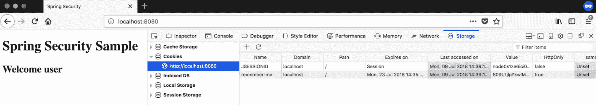
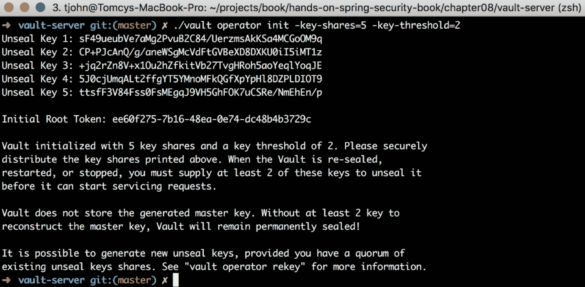
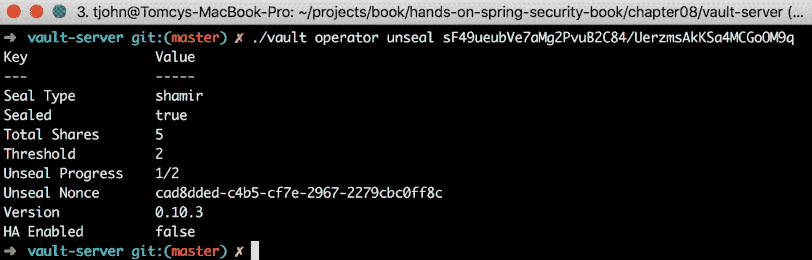
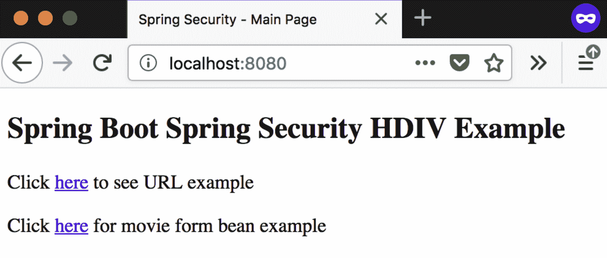
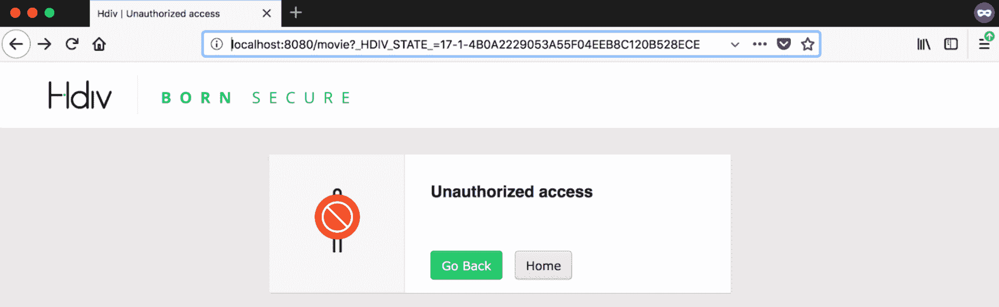

# Spring 安全附加组件

在前面的章节中，我们介绍了使用 Spring 安全性的多种核心安全方面（如身份验证和授权）的实现细节。在这样做的过程中，我们只是略过了使用 Spring 安全性可以实现的一层非常薄的功能。在本章中，我们将以简洁的方式介绍 Spring Security 提供的一些其他功能。

此外，本章还介绍了许多可以与 Spring Security 一起使用的产品（开源和付费版本）。我不支持这些产品，但我认为它们是实现您正在寻找的技术能力的有力竞争者。我们将首先介绍一种产品，给出我们需要解决的技术能力要点，然后向您简要介绍该产品。

在本章中，我们将介绍以下主题：

*   记得我吗
*   会话管理
*   CSRF
*   顾客服务提供商
*   通道安全
*   CORS 支持
*   密码模块
*   秘密管理
*   HTTP 数据完整性验证程序
*   自定义 DSL

# 记得我吗

我们将重用并增强我们在[第 2 章](02.html)*深入研究 Spring Security*（`jetty-db-basic-authentication`）中构建的示例，以解释如何使用 Spring Security 实现记住我或持久登录功能。在我们要重用的示例中，我们使用了基本身份验证，其中用户凭据存储在 MySQL 数据库中。

在 Spring Security 中，当用户选择在客户端记住其凭据时，通过向浏览器发送 cookie 来实现“记住我”功能。cookie 可以配置为在浏览器中存储规定的时间。如果 cookie 存在且有效，则用户下次访问应用程序时，会直接将其带到用户主页，并避免使用用户名/密码组合进行显式身份验证。

记住我的功能可以通过两种方法实现：

*   **基于散列的令牌**：对用户名、到期时间、密码和私钥进行散列，并将其作为令牌发送给客户端
*   **持久令牌**：持久存储机制用于将令牌存储在服务器上

现在，我们将通过持久令牌方法的一个简单实现来详细解释这个概念。

# 在 MySQL 数据库中创建新表

我们将使用与我们在[第 2 章](02.html)、*深入 Spring Security*中使用的 MySQL DB 相同的模式。保持一切原样，然后在 MySQL 数据库中创建一个新表，通过在 MySQL 工作台中执行以下 DDL 语句来存储持久令牌：

```java
create table persistent_logins(
     series varchar(64) not null primary key,   
     username varchar(75) not null,
     token varchar(100) not null,
     last_used timestamp not null
);
```

# Spring 安全配置

在[第 2 章](02.html)*深入 Spring Security*（在`Sample`应用程序部分的 Spring Security setup 子部分中）中，我们看到了基本身份验证，我们在 Spring Security Configuration 类的配置方法中配置了基本身份验证。在本例中，我们将创建一个自定义登录页面，并将登录机制更改为基于表单。打开`SpringSecurityConfig`类并更改配置方法，如下面的代码段所示。然后，添加`tokenRepository`bean，我们将使用它来实现记住我的功能：

```java
@Override
protected void configure(HttpSecurity http) throws Exception {
  http.csrf().disable();
  http.authorizeRequests().anyRequest().hasAnyRole("ADMIN", "USER")
      .and()
      .authorizeRequests().antMatchers("/login**").permitAll()
      .and()
      .formLogin()
      .loginPage("/login").loginProcessingUrl("/loginProc").permitAll()
      .and()
      .logout().logoutSuccessUrl("/login").permitAll()
      .and()
      .rememberMe()
      .rememberMeParameter("rememberme").tokenRepository(tokenRepository());
}
@Bean
public PersistentTokenRepository tokenRepository() {
  JdbcTokenRepositoryImpl jdbcTokenRepositoryImpl=new JdbcTokenRepositoryImpl();
  jdbcTokenRepositoryImpl.setDataSource(dataSource);
  return jdbcTokenRepositoryImpl;
}
```

# 自定义登录页面

在`src/main/webapp/WEB-INF/view`文件夹中创建一个新页面，即`login.jsp`。页面的主要部分包含`username`、`password`和`rememberme`字段，如下代码片段所示：

```java
<form action='<spring:url value="/loginProc"/>' method="post">
  <table>
      <tr>
          <td>Username</td>
          <td><input type="text" name="username"></td>
      </tr>
      <tr>
          <td>Password</td>
          <td><input type="password" name="password"></td>
      </tr>
      <tr>
          <td><input type="checkbox" name="rememberme"></td>
          <td>Remember me</td>
      </tr>
      <tr>
          <td><button type="submit">Login</button></td>
      </tr>
  </table>
</form>
```

确保将“记住我”复选框命名为与在 Spring 安全配置中指定的相同的名称。

# 运行应用程序并进行测试

通过执行以下命令运行项目：

```java
mvn jetty:run
```

等待控制台打印 Jetty Server 启动的[INFO]。

打开浏览器（我使用 Firefox 在私有模式下进行测试）并导航到`http://localhost:8080`，您将看到您创建的自定义登录页面，如下图所示：


图 1：自定义登录页面

输入`user`/`user@password`作为用户名和密码。点击`Remember me`并点击`Login`按钮，您将被导航到用户主页，如下图：


图 2：用户主页

在 MySQL 数据库中查询`persistent_logins`表，会看到一条新记录，如下图所示：


图 3:MySQLWorkbench 查询新的持久登录表

现在，转到浏览器中的开发者工具并检查 cookie。根据您使用的浏览器，您应该会看到类似的内容：



图 4：实现“记住我”功能的浏览器 cookie 集

这个例子的整个项目可以在`jetty-db-basic-authentication-remember-me`项目的书的 GitHub 页面上找到。

# 会话管理

Spring Security 允许您仅通过一些配置来管理服务器上的会话。下面列出了一些最重要的会话管理活动：

*   **会话创建**：这决定了何时需要创建会话以及您与会话交互的方式。在 Spring 安全配置中，输入以下代码：

```java
http.sessionManagement().sessionCreationPolicy(SessionCreationPolicy.ALWAYS);
```

有四种会话创建策略可供选择。详情如下:

```java
http.sessionManagement().invalidSessionUrl("/invalidSession");
```

*   **会话超时**：控制会话过期时如何通知用户。
*   **并发会话**：这允许控制用户可以在应用程序中启动多少会话。如果最大会话设置为`1`，则当用户第二次登录时，前一个会话无效，用户注销。如果指定的值大于`1`，则允许用户同时拥有那么多个会话：

```java
http.sessionManagement().maximumSessions(1);
```

以下屏幕截图显示了默认错误屏幕，当同一用户创建的会话超过所需数量（如配置）时，会弹出该屏幕：


图 5：当用户访问多个会话时引发的错误

*   **会话固定**：非常类似于并发会话控制。此设置允许我们控制当用户启动新会话时将发生什么。我们可以指定以下三个值：
*   `migrateSession`：认证成功后创建新会话时，旧会话失效，所有属性复制到新会话：

```java
http.sessionManagement().sessionFixation().migrateSession();
```

*   `newSession`：创建新会话时，不会复制上一个有效会话的任何属性：

```java
http.sessionManagement().sessionFixation().newSession();
```

*   `none`：旧会话被重复使用且未失效：

```java
http.sessionManagement().sessionFixation().none();
```

# CSRF

**跨站点请求伪造****CSRF**（[https://www.owasp.org/index.php/Cross-Site_Request_Forgery_（CSRF）](https://www.owasp.org/index.php/Cross-Site_Request_Forgery_(CSRF))是一种攻击，迫使最终用户在其当前已通过身份验证的 web 应用程序上执行不需要的操作。CSRF 攻击的目标是改变状态的请求，而不是窃取数据，因为攻击者无法看到对伪造请求的响应。

**开放式 Web 应用程序安全项目**（**OWASP**将 CSRF 视为 Web 应用程序最常见的安全风险之一。OWASP 每年都会发布一份名单（称为 OWASP 前 10 名），重点列出困扰其认为 CSRF 排名第五的 web 应用程序的前 10 大安全风险。

在 Spring Security 中，默认情况下启用 CSRF。如果需要（我们在许多示例中禁用了此功能，以便我们能够专注于示例应该传达的主要概念），我们可以通过在 Spring 安全配置中添加以下代码片段来显式禁用它：

```java
http
  .csrf().disable();
```

尽管默认情况下启用了 CSRF，但为了使其正常工作，每个请求都需要提供一个 CSRF 令牌。如果 CSRF 令牌没有发送到服务器，服务器将拒绝请求并抛出错误。如果您使用**Java 服务器页面**（**JSP**）作为您的视图，只需包含隐藏的输入，如下面的代码片段所示，许多事情都会自动神奇地发生：

```java
<input type="hidden" name="${_csrf.parameterName}" value="${_csrf.token}" />
```

如果使用 AJAX 请求调用服务器，而不是隐藏输入，则可以以 HTTP 头的形式提供 CSRF 令牌。您可以将 CSRF 相关的头声明为元标记，如以下代码段所示：

```java
<head>
     <meta name="_csrf" content="${_csrf.token}"/>
     <meta name="_csrf_header" content="${_csrf.headerName}"/>
     <!-- ... -->
 </head>
```

之后，在调用服务器时，将这些（`_csrf`和`_csrf_header`作为头，您将被允许调用所需的端点。

如果您希望持久化 CSRF 令牌，Spring Security 允许您通过调整配置来实现这一点，如以下代码段所示：

```java
http
  .csrf()
  .csrfTokenRepository(new CookieCsrfTokenRepository());
```

执行此操作时，CSRF 令牌作为 cookie 持久化，服务器可以读取并验证（所有操作都自动完成）。

# 顾客服务提供商

**内容安全策略**（**CSP**）（[https://developer.mozilla.org/en-US/docs/Web/HTTP/CSP](https://developer.mozilla.org/en-US/docs/Web/HTTP/CSP) 是一个附加的安全层，有助于检测和缓解某些类型的攻击，包括**跨站点脚本**（**XSS**）和数据注入攻击。这些攻击被用于从数据盗窃到网站破坏或恶意软件传播的所有方面。

应用程序中正确的 CSP 设置可以处理内容注入漏洞，这是减少 XSS 的一个好方法。XSS 在 OWASP 前 10 名中排名第二。

CSP 不是处理所有注入漏洞的解决方案，但可以用作将注入攻击降低到合理水平的工具之一。

CSP 是一种声明性策略，使用 HTTP 头实现。它可以在应用程序中以两种模式运行：

*   生产模式（声明为 CSP）
*   仅报告模式（用于测试，声明为*仅内容安全策略报告*）

CSP 包含一组安全策略指令，负责对 web 资源施加适当的限制，然后在违反时通知客户端（用户代理）。例如，以下安全策略片段从定义的受信任域加载脚本：

```java
Content-Security-Policy: script-src https://trusted-domain.com
```

如果有违规行为，用户代理将阻止它，如果策略指定了一个`report-uri`参数，如以下示例所示，它将以 JSON 的形式向该 URI 报告违规行为：

```java
Content-Security-Policy: script-src https://trusted-domain.com; report-uri /csp-report-api/
```

前面的示例展示了 CSP 在生产模式下的工作。如果要首先测试安全策略，并在特定时间段后使这些策略处于生产模式，CSP 提供了一种机制，如以下代码段所示：

```java
Content-Security-Policy-Report-Only: script-src https://trusted-domain.com; report-uri /csp-report-api/
```

在仅报告模式下，当检测到违规时，报告以 JSON 格式发布到`report-uri`，如下代码所示：

```java
{"csp-report":
    {"document-uri":"...",
    "violated-directive":"script-src https://trusted-domain.com",
    "original-policy":"...",
    "blocked-uri":"https://untrusted-domain.com"}
}
```

除了前面示例中详述的安全指令外，在设置 CSP 时还可以使用许多安全指令。有关指令的完整列表，请参考[https://content-security-policy.com/](https://content-security-policy.com/) 。

与 CSRF 令牌类似，CSP 还可用于确保特定资源在访问服务器时包含令牌。以下示例显示了此 nonce 方法的使用：

```java
Content-Security-Policy: script-src 'self' 'nonce-<cryptographically generated random string>'
```

与 CSRF 令牌类似，此 nonce 必须与服务器中的任何资源访问一起包含，并且必须在加载页面时新生成。

CSP 还允许您仅在资源与服务器期望的哈希匹配时加载资源。以下政策用于实现这一目标：

```java
Content-Security-Policy: script-src 'self' 'sha256-<base64 encoded hash>'
```

几乎所有现代浏览器都支持 CSP。即使某些浏览器不支持某些安全指令，其他受支持的指令也可以正常工作。最好的处理方法是只发送浏览器通过解密用户代理肯定支持的安全指令，而不是向客户端抛出错误。

# 使用 Spring 安全性的 CSP

使用 Spring 安全配置配置 CSP 是轻而易举的事。默认情况下，CSP 未启用。您可以在 Spring 安全配置中启用它，如以下代码段所示：

```java
http
     .headers()
         .contentSecurityPolicy("script-src 'self' https://trusted-domain.com; report-uri /csp-report-api/");
```

Spring 安全配置中的仅报告 CSP 如下所示：

```java
http
     .headers()
         .contentSecurityPolicy("script-src 'self' https://trusted-domain.com; report-uri /csp-report-api/")
        .reportOnly();
```

# 通道安全

除了身份验证和授权之外，Spring Security 还可以用于检查到达服务器的每个请求是否存在任何其他属性。它可以检查协议（传输类型、HTTP 或 HTTPS）、是否存在某些 HTTP 头等等。SSL 现在是任何 web 应用程序（或网站）都必须遵守的事实标准，如果您的网站不是 HTTPS，许多搜索引擎（例如 Google）甚至会惩罚您。SSL 用于保护数据从客户端流向服务器的通道，反之亦然。

Spring 安全性可以配置为显式检查 URL 模式，并显式地将用户重定向到 HTTPS（如果它们与 HTTP 协议一起提供）。

这可以通过在 Spring 安全配置中配置适当的 URL 模式轻松完成，如下所示：

```java
http.authorizeRequests()
      .requiresChannel().antMatchers("/httpsRequired/**").requiresSecure();
```

当用户访问`/httpsRequired/**`URL 模式时，如果协议是 HTTP，Spring Security 将使用 HTTPS 协议将用户重定向到同一 URL。以下配置用于保护所有请求：

```java
http.authorizeRequests()
      .requiresChannel().anyRequest().requiresSecure();
```

要明确指出某些 URL 不安全，请使用以下代码：

```java
.requiresChannel().antMatchers("/httpRequired/**").requiresInsecure();
```

以下代码段显示了如何将任何请求指定为 HTTP（不安全）：

```java
.requiresChannel().anyRequest().requiresInsecure();
```

# CORS 支持

**跨来源资源共享**（**CORS**）（[https://developer.mozilla.org/en-US/docs/Web/HTTP/CORS](https://developer.mozilla.org/en-US/docs/Web/HTTP/CORS) 是一种使用附加 HTTP 头通知浏览器允许 web 应用程序在一个源（域）上运行的机制具有从不同来源的服务器访问所选资源的权限。当 web 应用程序请求的资源的来源（域、协议和端口）与其自己的来源不同时，会发出跨来源 HTTP 请求。

在本节中，我们不会创建完整的项目来解释 CORS 的工作。我们将使用代码片段并解释每一段代码，以使本节简洁明了。

更改 Spring 安全配置，如以下代码段所示：

```java
@EnableWebSecurity
@Configuration
public class SpringSecurityConfig extends WebSecurityConfigurerAdapter {

 @Override
 protected void configure(HttpSecurity http) throws Exception {
    http.cors();
 }
 @Bean
 CorsConfigurationSource corsConfigurationSource() {
    UrlBasedCorsConfigurationSource urlCorsConfigSrc = new
          UrlBasedCorsConfigurationSource();
    urlCorsConfigSrc.registerCorsConfiguration("/**", 
        new CorsConfiguration().applyPermitDefaultValues());
    return urlCorsConfigSrc;
 }
}
```

在前面的代码中，我们在 Spring Security`configure`方法中配置 CORS。然后我们创建一个新的 bean，`corsConfigurationSource`，在其中我们使`*/***`路径可以被其他域访问。这在很多场景中都不是很理想，下面的代码片段显示了更增强的`CorsConfiguration`类：

```java
CorsConfiguration configuration = new CorsConfiguration();
configuration.setAllowedOrigins(new ArrayList<String>(Arrays.asList("*")));
configuration.setAllowedHeaders(new ArrayList<String>        
    (Arrays.asList("Authorization", "Cache-Control", "Content-Type")));
configuration.setAllowedMethods(new ArrayList<String>(Arrays.asList("HEAD", 
    "GET", "POST", "PUT", "DELETE", "PATCH")));
configuration.setAllowCredentials(true);
```

如果它是一个 Spring MVC 应用程序，您可以拥有一个 Spring MVC 配置文件，在该文件中您可以通过创建一个 bean 来指定 CORS 映射，如下所示：

```java
@Configuration
public class SpringMVCConfig {
  @Bean
  public WebMvcConfigurer corsConfigurer() {
    return new WebMvcConfigurer() {
      @Override
      public void addCorsMappings(CorsRegistry registry) {
        registry.addMapping("/**")
          .allowedMethods("HEAD", "GET", "PUT", "POST", "DELETE",
            "PATCH","OPTIONS");
      }
    };
  }
}
```

我复制了[第 2 章](02.html)*深入 Spring Security*之前的一个示例，并在本章中创建了一个新项目，包含`spring-boot-in-memory-basic-authentication-with-cors`中的完整源代码。我们在这里所做的是通过声明`CorsConfigurationSource`bean 来设置 CORS 全局配置。

# 密码模块

Spring Security Crypto 模块允许您进行密码编码、对称加密和密钥生成。该模块作为核心 Spring 安全产品的一部分捆绑在一起，不依赖于其他 Spring 安全代码。

# 密码编码

现代化的密码编码是 Spring Security 5 的新功能之一。Spring Security 的`PasswordEncoder`接口是它的核心，它使用各种算法对密码进行单向散列，然后可以安全地存储密码。Spring Security 支持多种密码编码算法：

*   `BcryptPasswordEncoder`：使用 Bcrypt 强散列函数。可以选择提供强度参数（默认值为 10）；值越高，需要对密码进行的哈希运算就越多。
*   `Pbkdf2PasswordEncoder`：使用**基于密码的密钥派生函数 2**（**PKDF2**），具有可配置的迭代次数和 8 字节的随机 salt 值。
*   `ScryptPasswordEncoder`：使用 Scrypt 哈希函数。在散列时，客户端可以提供 CPU 开销参数、内存开销参数和并行化参数。当前实现使用 Bouncy Castle 库。

# 加密

Spring Security 的`org.springframework.security.crypto.encrypt.Encryptors`类具有可用于创建对称加密机的工厂方法。该类支持两个加密程序：

*   `BytesEncryptor`：对原始字节数组形式的数据进行对称数据加密的服务接口。
*   `TextEncryptor`：文本字符串对称数据加密服务接口：


# 密钥生成

如前面关于加密的部分所示，Spring Security 有一个类，即`org.springframework.security.crypto.keygen.KeyGenerators`，它有许多工厂方法，可用于构造应用程序所需的许多密钥。

以下是两种受支持的密钥生成器类型：

*   `BytesKeyGenerator`：用于生成基于字节数组的唯一密钥的生成器。
*   `StringKeyGenerator`：唯一字符串键的生成器：


图 7:BytesKeyGenerator 和 StringKeyGenerator 工厂方法

# 秘密管理

在应用程序中，我们需要以 API 密钥、其他应用程序密码等形式处理各种机密/安全数据。通常，对于在生产环境中部署和运行的应用程序，以纯文本形式保存这些内容可能会导致安全漏洞。如今，自动化以相当低的成本被抢占，对于现代应用程序，必须使用访问控制和安全存储安全地存储此类数据。

加密已被广泛接受，但对于解密，密钥需要循环，而密钥的循环通常是一个大问题。如果一个人决定在组织之外使用密钥，可能会出现严重问题。

HashiCorp 提供的 Vault 是解决此问题的有力竞争者，并通过非常严格的控制帮助轻松管理这些机密。它提供了 API，允许基于设置的策略进行访问。它还具有提供访问控制的功能，并且还附带了现成的加密功能。此外，它还具有多种持久性后端支持，例如 concur（来自 HashiCorp）等，使企业能够轻松地采用它。Vault 是用 Go 编写的，有可用于多种平台的二进制文件，可以从其网站下载。在本节中，我们将快速介绍 Vault 产品本身，然后介绍一个示例，在该示例中，我们将创建一个 Spring Boot 项目，并安全地访问 Vault 中存储的一些机密。不用再麻烦了，让我们用实际的代码把我们的手弄脏吧。

# 从打开保险库开始

从 Vault 项目的网站（[下载最新的二进制文件 https://www.vaultproject.io/downloads.html](https://www.vaultproject.io/downloads.html) ），并根据您的操作系统进行安装。要启动 Vault，您需要有一个文件-`vault.conf`，我们将在其中指定 Vault 启动所需的一些选项。下面是一个您可以使用的样本`vault.conf`文件：

```java
backend "inmem" {
} 
listener "tcp" {
  address = "0.0.0.0:8200"
  tls_disable = 1
}
disable_mlock = true
```

在`vault.conf`文件中，我们显式设置了它将侦听的地址，并禁用了 TLS/SSL（以便它以纯文本模式运行）。

通过使用以下命令指定`vault.conf`文件的位置来启动 Vault：

```java
./vault server -config vault.conf
```

从下面的屏幕截图可以看出，Vault 正在纯文本模式下运行（禁用 TLS/SSL）：


图 8：启动和配置 Vault

打开一个新的命令提示符，我们现在将从这里开始管理 Vault。通过执行以下命令设置环境变量，让客户端知道他们必须使用纯文本连接到 Vault（因为我们已禁用 TLS/SSL）：

```java
export VAULT_ADDR=http://127.0.0.1:8200
```

在此之后，通过执行以下命令初始化 Vault 密钥生成：



图 9：初始化 Vault

我们使用的命令为我们提供了五个密钥共享和两个密钥阈值。请务必注意，一旦 Vault 初始化，我们就无法更改这些值（输出仅显示一次）。注意收集必要的信息；否则，您将无法检索存储在 Vault 中的任何数据。从前面的屏幕截图可以看出，Vault 的`init`命令为我们提供了打开 Vault 所需的密钥和令牌。在我们使用保险库之前，它必须被打开。

**启封**[https://www.vaultproject.io/docs/concepts/seal.html](https://www.vaultproject.io/docs/concepts/seal.html) 是构造读取解密密钥以解密数据所需的主密钥的过程，允许访问保险库。在启封之前，几乎不可能对 Vault 进行任何操作。

可以通过执行以下命令并提供在 Vault 初始化过程中生成的任意密钥来解除 Vault 的密封：

```java
./vault unseal <any key generated using initialization>
```

以下屏幕截图显示了前面命令的成功执行：



图 10：开封拱顶

一旦打开，您的 Vault 现在就可以存储您可能希望在应用程序中使用的机密数据。

成功打开 Vault 后，要存储任何数据，首先需要进行身份验证。初始化 Vault 时，屏幕上显示了一个令牌，该令牌用于身份验证。使用此令牌实现身份验证的最简单方法之一是设置一个新的环境变量（`VAULT_TOKEN`。如图所示执行以下命令，当 Vault 启动时，它将使用此环境变量并对自身进行身份验证：

```java
export VAULT_TOKEN=ee60f275-7b16-48ea-0e74-dc48b4b3729c
```

执行上述命令后，您现在可以通过执行以下命令写入机密：

```java
./vault write secret/movie-application password=randomstring
```

输入命令后，应收到以下输出：


图 11：将秘密写入 Vault

令牌是在 Vault 中进行身份验证的主要方式。除此之外，还有其他机制，如 LDAP 和用户名/密码，可以使用这些机制进行身份验证。

# SpringBoot 项目

Spring 有一个名为 SpringCloudVault 的专用模块，它可以轻松地在应用程序中使用 Vault。SpringCloudVault 非常易于使用，我们将在本节介绍如何使用它。

**春云金库配置**[http://cloud.spring.io/spring-cloud-vault/](http://cloud.spring.io/spring-cloud-vault/) 为分布式系统中的外部化配置提供客户端支持。使用 HashiCorp 的 Vault，您可以在中心位置管理所有环境中应用程序的外部机密属性。Vault 可以管理静态和动态机密，如远程应用程序/资源的用户名/密码，并为外部服务（如 MySQL、PostgreSQL、Apache Cassandra、MongoDB、Consor、AWS 等）提供凭据。

我们将使用 Spring 启动项目（使用 Spring 初始化器生成，[https://start.spring.io](https://start.spring.io) ）。在应用程序启动时，将启动 Vault 并获取所有机密：


图 12：创建一个空的 Spring 初始化器项目

通过执行以下命令解压下载的 Spring Initializer 项目：

```java
unzip -a spring-boot-spring-cloud-vault.zip
```

在您喜爱的 IDE 中导入项目（我正在使用 IntelliJ）。

# Maven 依赖

确保您的项目的`pom.xml`添加了以下 Maven 依赖项：

```java
<dependency>
 <groupId>org.springframework.cloud</groupId>
 <artifactId>spring-cloud-starter-vault-config</artifactId>
 <version>2.0.0.RELEASE</version>
</dependency>
```

当 Spring Boot 项目启动时，如果 Vault 服务器在端口`8200`上运行，它将选择默认的 Vault 配置。如果要自定义这些属性，可以指定`bootstrap.yml`或`bootstrap.properties`。在我们的示例中，我们将使用以下内容显式设置`bootstrap.yml`文件：

```java
spring:
  application:
      name: movie-application
spring.cloud.vault:
  host: localhost # hostname of vault server
  port: 8200  # vault server port
  scheme: http # connection scheme http or https
  uri: http://localhost:8200 # vault endpoint
  connection-timeout: 10000 # connection timeout in milliseconds
  read-timeout: 5000  # read timeout in milliseconds
  config:
      order: -10  # order for property source
  token: ee60f275-7b16-48ea-0e74-dc48b4b3729c
health.vault.enabled: true  # health endpoint enabled using spring actuator
```

在以纯文本模式启动 Vault 时，我们将使用 HTTP 方案。如果您想使用 HTTPS，那么很容易做到，因为大多数事情都是通过已经提供的脚本完成的。这是运行 Vault 的默认方案，在生产设置中也是如此。在您实现实际用例时，让我们先了解一下这个概念，然后再深入了解一下。

如果您想在 HTTPS 方案中运行 Vault，Spring Cloud Vault 在其源代码中的`src/test/bash`（[下）有许多脚本可用 https://github.com/spring-cloud/spring-cloud-vault/tree/master/src/test/bash](https://github.com/spring-cloud/spring-cloud-vault/tree/master/src/test/bash) ），可用于创建必要的证书，然后在此方案中运行 Vault。为了保持这一部分的简洁，我们将不在这里详细介绍这一方面。

在`.yml`文件中，我们使用了在 Vault 初始化过程中创建的根令牌。如果需要，可以通过执行以下命令获取新令牌：

```java
./vault token create
```

下面的屏幕截图显示了`token create`命令的成功执行：


图 13：新 Vault 令牌创建

在 Spring Boot 项目中，在应用程序运行类`SpringBootSpringCloudVaultApplication`中添加以下代码段：

```java
@Value("${password}")
String password;

@PostConstruct
private void postConstruct() {
 System.out.println("Secret in Movie application password is: " + password);
}
```

在此代码中，`password`字段将由 Spring Cloud Vault 填充，如果您运行应用程序（使用命令`mvn spring-boot:run`，您应该会看到 Spring Cloud Vault 连接到正在运行的 Vault（使用`bootstrap.yml`文件中的配置），并检索我们为`movie-application`写入 Vault 的值。

这就结束了我们对使用 Spring Boot 和 Spring Cloud Vault 的基础应用程序的研究。您可以在本章下项目的书的 GitHub 页面中看到完整的源代码，名为`spring-boot-spring-cloud-vault`。

# HTTP 数据完整性验证程序

springsecurity 帮助我们用常见的安全特性来丰富我们的应用程序，使我们能够非常轻松地用最少的代码来实现这一点。然而，Spring Security 正在缓慢而稳定地赶上现代应用程序所需的许多附加安全功能。这些应用程序大多部署在云端，每天都有很高的变化率推送到生产中。**HTTP 数据完整性验证程序**（**HDIV**是一款可用于进一步丰富应用程序安全性的产品。

# 什么是 HDIV？

HDIV 最初是一个开源项目，由 Roberto Velasco、Gotzon Illaramendi 和 Gorka Vicente 开发，用于解决生产环境中检测到的安全问题。第一个稳定版本 1.0 于 2008 年发布，其形式为集成到 web 应用程序中的安全库。HDIV 于 2011 年正式与 SpringMVC 集成，SpringMVC 是 web 应用程序开发中使用最多的 Java 解决方案。2012 年，HDIV 与 Grails 集成。2015 年，HDIV 作为与 web 安全相关的解决方案被纳入 Spring 框架官方文档。基于全球利益和对高市场需求的响应，创作者创建了**HDIV 证券**（[https://hdivsecurity.com/](https://hdivsecurity.com/) 公司，并于 2016 年推出 HDIV 商业版。HDIV 解决方案在开发过程中内置到应用程序中，以针对 OWASP 前 10 大威胁提供最强大的可用**运行时应用程序自我保护**（**RASP**。

HDIV 的诞生是为了保护应用程序免受参数篡改攻击。它的第一个目的（查看首字母缩写）是保证服务器生成的所有数据（链接、隐藏字段、组合值、单选按钮、destiny 页面、cookie、标题等）的完整性（无数据修改）。HDIV 通过添加安全功能以及维护 API 和框架规范来扩展 web 应用程序的行为。HDIV 逐渐整合了 CSRF、**SQL 注入**（**SQLi**）和 XSS 保护等功能，从而大大提高了安全性，不仅仅是一个 HTTP 数据完整性验证器。

攻击成本越来越低，自动化程度越来越高。手动安全测试正成为成本高昂的瓶颈。Spring Security 通过轻松实现最重要的安全方面（如身份验证和授权）来保护应用程序，但不能防止应用程序代码中常见的安全漏洞和设计缺陷。这就是集成已经使用 Spring 安全性进行保护的 Spring 应用程序可以带来 HDIV 的地方。我们将通过一个非常简单的例子，展示 HDIV 的几个亮点。以下是他们网站上详述的一些优势：

*   HDIV 使用运行时数据流技术报告漏洞的文件和行号，在源代码被攻击之前检测到安全漏洞。在开发过程中，无论是在 web 浏览器中还是在集中的 web 控制台中，开发人员都可以立即进行报告。

*   它可以防止业务逻辑缺陷，而无需了解应用程序，并在不更改源代码的情况下提供安全漏洞的检测和保护。
*   HDIV 使笔测试工具（Burp 套件）和应用程序之间的集成成为可能，将有价值的信息传达给笔测试仪。它避免了许多手工编码的步骤，将笔测试人员的注意力和精力集中在最脆弱的入口点上。

有关更多信息，您可以查看以下链接：[https://hdivsecurity.com/](https://hdivsecurity.com/) 。

让我们开始构建一个简单的示例，展示 HDIV 通过保护应用程序中的链接和表单数据所做的保护。

# 引导程序项目

我们将使用 Spring Initializer 创建的基本项目来创建 HDIV 示例，如下所示：


图 14：基本 Spring 初始化器项目设置

# Maven 依赖项

在以下代码中，我们调用了作为本项目一部分所需的显式依赖项，即 HDIV：

```java
<!--HDIV dependency-->
<dependency>
   <groupId>org.hdiv</groupId>
   <artifactId>spring-boot-starter-hdiv-thymeleaf</artifactId>
   <version>1.3.1</version>
   <type>pom</type>
</dependency>
```

HDIV 支持许多 web 应用程序框架。在我们的示例中，我们将使用 SpringMVC 和 Thymeleaf，上面提到的依赖关系将解决这个问题。

# Spring 安全配置

现在，您已经知道了 Spring 安全配置文件中的内容。我们将有内存中的身份验证，并将配置两个用户（类似于我们在本书中所做的）。我们将有基于表单的登录，也将创建我们自己的登录页面。

# springmvc 配置

到目前为止，我们一直在研究的 SpringMVC 配置非常基本。这里没有什么特别值得一提的。我们只需要确保连接到登录页面的控制器是显式定义的。

# HDIV 配置

这个神奇的类将为您的应用程序带来 HDIV 功能，而不会带来太多麻烦。完整类如下图所示：

```java
@Configuration
@EnableHdivWebSecurity
public class HdivSecurityConfig extends HdivWebSecurityConfigurerAdapter {
    @Override
    public void addExclusions(final ExclusionRegistry registry) {
        registry.addUrlExclusions("/login");
    }
}
```

繁重的工作是由我们正在扩展的班级`HdivWebSecurityConfigurerAdapter`完成的。此外，`@EnableHdivWebSecurity`注释确保大部分设置都自动完成。我们只需要通过覆盖`addExclusions`方法，确保登录页面 URL 的配置被排除在 HDIV 安全性之外。

# 模范班

我们将使用本书中一直使用的同一个模型类-`Movie`。为了简化编码，我们将使用 Lombok 库，它通过查看类中配置的各种注释来发挥所有的作用。

# 控制器类

我们将只有一个控制器类，在这里我们将映射本例中要创建的所有页面。为了展示 HDIV 的威力，我们将看到 HDIV 在两种情况下发挥作用：

*   电影创建页面（电影 bean），在包含表单的页面中显示 HDIV 正在工作
*   一个链接页面，显示当有人操纵实际链接时 HDIV 拦截和抛出错误

这个类非常简单，这里不需要详细说明。

# 页

如前所述，我们将在示例中创建以下页面：

*   `login.html`：我们将用于用户登录应用程序的自定义登录页面
*   `main.html`：用户成功登录后导航到的页面，包含电影制作链接和链接页面
*   `links.html`：用户点击链接 URL 时导航到的页面
*   `movie.html`：电影创作页面，包含标题和类型两个字段

# 运行应用程序

通过执行以下命令，与任何其他 Spring Boot 项目一样运行应用程序：

```java
mvn spring-boot:run
```

进入浏览器并导航至`http://localhost:8080`，您将看到一个登录页面，如下所示：


图 15：登录页面

如上图所示，输入`username`/`password`并点击登录按钮，您将被导航到主页：



图 16：成功登录后显示给用户的主页

单击链接导航到可以创建新电影的页面。您将被导航到以下屏幕截图中显示的页面。仔细查看 URL，您将看到添加了一个新的查询参数，`_HDIV_STATE_`。服务器通过查看该值来验证并确保提交的表单是真实的：


图 17:createmovie 屏幕，显示 HDIV_STATE_uquery 字符串

现在回到主页，点击链接页面。您将被导航到以下页面：


图 18:links 页面，显示了 _HDIV_STATE_ 查询字符串

如页面所述，尝试操作链接（更改`_HDIV_STATE_`值），您将进入 HDIV 错误页面：



图 19:HDIV 错误页面，在出现错误情况时显示

本例仅展示了 HDIV 在与 SpringSecurity 一起工作时显示其价值的两种情况。欲了解更多详情，请访问 HDIV 网站和文档，可从以下网址获得：

*   [https://hdivsecurity.com/docs/](https://hdivsecurity.com/docs/)
*   [https://hdivsecurity.com/docs/installation/library-setup/](https://hdivsecurity.com/docs/installation/library-setup/)
*   [https://github.com/hdiv/hdiv](https://github.com/hdiv/hdiv)

# 自定义 DSL

Spring Security 允许您编写自己的**域特定语言**（**DSL**），可用于在应用程序中配置安全性。当我们使用 OKTA 实现 SAML 身份验证时，我们已经看到了一个定制 DSL 正在运行。我们使用 OKTA 提供的定制 DSL 来配置 Spring 安全性。

要编写自己的自定义 DSL，可以扩展`AbstractHttpConfigurer`*类*并覆盖它的一些方法，如下所示：

```java
public class CustomDSL extends AbstractHttpConfigurer<CustomDSL, HttpSecurity> {
    @Override
    public void init(HttpSecurity builder) throws Exception {
       // Any configurations that you would like to do (say as default) can be  
       configured here
    }

    @Override
    public void configure(HttpSecurity builder) throws Exception {
       // Can add anything specific to your application and this will be honored
    }
}
```

在 Spring 安全配置类（configure 方法）中，您可以使用自定义 DSL，如下所示：

```java
@Override
 protected void configure(HttpSecurity http) throws Exception {
     http
         .apply(<invoke custom DSL>)
         ...;
 }
```

当 Spring Security 看到自定义 DSL 设置时，代码执行如下：

1.  调用 Spring 安全配置类的`configure`方法
2.  调用自定义 DSL`init`方法
3.  调用自定义 DSL`configure`方法

Spring Security 使用这种方法来实现`authorizeRequests()`。

# 总结

本章向您介绍了可以在应用程序中使用的 Spring Security 的一些其他功能。通过示例，我们介绍了如何在应用程序中实现“记住我”功能。我们还简要介绍了 CSRF、CORS、CSP、通道安全和会话管理等概念。我们还简要介绍了 Spring Security 中的加密模块。

在本章的结尾，我们介绍了两种可以与 Spring Security HashiCorp Vault（用于秘密管理）和 HDIV（用于附加安全功能）一起使用的产品。

阅读本章后，您应该对使用 Spring Security 可以实现的一些附加功能有了清晰的理解。您还应该很好地了解可以与 Spring Security 一起使用的一些产品，以实现现代应用程序所需的一些最重要的技术功能。

现在，如果你正在读这本书，请拍拍你的背，就像这一章一样，我们完成了这本书。我希望你喜欢这本书的每一点，我希望你学到了一些新的东西，可以用来创造精彩和创新的新应用程序。

谢谢你的阅读！