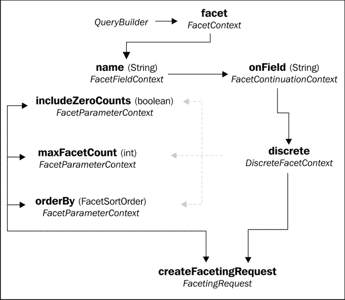
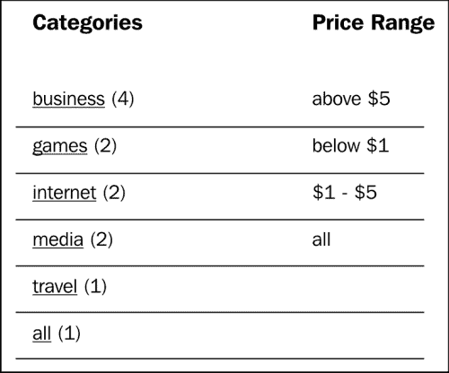

# 第五章高级查询

在本章中，我们将根据刚刚学到的新映射知识，详细介绍前面介绍的基本搜索查询概念。现在，我们将研究一些使搜索查询更灵活、更强大的技术。

我们将看到如何在 Lucene 级别动态过滤结果，甚至在触及数据库之前。我们还将通过使用基于投影的查询来避免数据库调用，直接从 Lucene 检索属性。我们将使用分面搜索来识别和隔离搜索结果中的数据子集。最后，我们将介绍一些杂项查询工具，例如查询时间提升和对查询设置时间限制。

# 过滤

构建查询的过程围绕查找匹配项展开。但是，有时您希望根据明确不匹配的条件缩小搜索结果的范围。例如，假设我们希望将 VAPORware Marketplace 搜索限制为仅限于特定设备上支持的应用程序：

*   向现有查询中添加关键字或短语没有帮助，因为这只会使查询更具包容性。
*   我们可以将现有的查询转换为带有额外的`must`子句的布尔查询，但是 DSL 开始变得更难维护。此外，如果您需要使用复杂的逻辑来缩小结果范围，那么 DSL 可能无法提供足够的灵活性。
*   Hibernate 搜索`FullTextQuery`对象继承自 Hibernate ORM`Query`（或其 JPA 对应）类。因此，我们可以使用核心 Hibernate 工具（如`ResultTransformer`）缩小结果范围。但是，这需要进行额外的数据库调用，这可能会影响性能。

Hibernate 搜索提供了一种更优雅、更高效的**过滤器**方法。通过这种机制，各种场景的过滤器逻辑被封装在单独的类中。这些过滤器类可以在运行时单独或以任何组合动态启用或禁用。当查询被过滤时，不需要的结果从一开始就不会从 Lucene 中获取。这减少了任何后续数据库访问的重量。

## 创建过滤器工厂

要通过支持的设备过滤我们的搜索结果，第一步是创建一个类来存储过滤逻辑。这应该是`org.apache.lucene.search.Filter`的一个实例。对于简单的硬编码逻辑，您可以创建自己的子类。

但是，如果我们改为使用过滤器工厂动态生成过滤器，那么我们可以接受参数（例如，设备名称）并在运行时自定义过滤器：

```java
public class DeviceFilterFactory {

   private String deviceName;

 @Factory
   public Filter getFilter() {
      PhraseQuery query = new PhraseQuery();
      StringTokenizertokenzier = new StringTokenizer(deviceName);
      while(tokenzier.hasMoreTokens()) {
         Term term = new Term(
            "supportedDevices.name", tokenzier.nextToken());
         query.add(term);
      }
 Filter filter = new QueryWrapperFilter(query);
      return new CachingWrapperFilter(filter);
   }

   public void setDeviceName(String deviceName) {
      this.deviceName = deviceName.toLowerCase();
   }

}
```

`@Factory`注释应用于负责生成 Lucene filter 对象的方法。在本例中，我们对恰当命名的`getFilter`方法进行了注释。

### 注

不幸的是，构建 Lucene`Filter`对象需要我们更紧密地使用原始的 Lucene API，而不是 Hibernate Search 提供的方便的 DSL 包装器。完整的 Lucene API 非常复杂，完全覆盖它需要一本完全独立的书。然而，即使是这种浅潜也足以为我们提供编写真正有用的过滤器的工具。

本例通过包装一个 Lucene 查询，然后应用第二个包装来构建一个过滤器，以方便过滤器缓存。使用的特定查询类型是`org.apache.lucene.search.PhraseQuery`，这相当于我们在[第 3 章](3.html "Chapter 3. Performing Queries")、*执行查询*中探讨的 DSL 短语查询。

### 提示

我们在本例中检查短语查询，因为它是构建过滤器最有用的类型之一。但是，总共有 15 种 Lucene 查询类型。您可以在[浏览 JavaDocshttp://lucene.apache.org/core/old_versioned_docs/versions/3_0_3/api/all/org/apache/lucene/search/Query.html](http://lucene.apache.org/core/old_versioned_docs/versions/3_0_3/api/all/org/apache/lucene/search/Query.html) 。

让我们回顾一下关于数据如何存储在 Lucene 索引中的一些知识。默认情况下，分析器标记字符串，并将其作为单个术语索引。默认分析器还将字符串数据转换为小写。HibernateSearchDSL 通常隐藏所有这些细节，因此开发人员不必考虑它。

但是，在直接使用 Lucene API 时，确实需要考虑这些问题。因此，我们的`setDeviceName`setter 方法手动将`deviceName`属性转换为小写，以避免与 Lucene 不匹配。然后，`getFilter`方法手动将该属性标记为单独的术语，以匹配 Lucene 索引的内容。

每个标记化术语用于构造一个 Lucene`Term`对象，该对象由数据和相关字段名组成（在本例中为`supportedDevices.name`。这些术语按照它们在短语中出现的确切顺序，一个接一个地添加到`PhraseQuery`对象中。然后将查询对象包装为过滤器并返回。

### 增加过滤键

默认情况下，Hibernate 搜索缓存过滤器实例以获得更好的性能。因此，每个实例都需要缓存中引用一个唯一的密钥。在本例中，最符合逻辑的键是每个实例正在筛选的设备名。

首先，我们向我们的过滤器工厂添加了一个新方法，并用`@Key`注释，以表明它负责生成唯一密钥。此方法返回一个子类`FilterKey`：

```java
...
@Key
Public FilterKey getKey() {
   DeviceFilterKey key = new DeviceFilterKey();
   key.setDeviceName(this.deviceName);
   return key;
}
...
```

自定义`FilterKey`子类必须实现方法`equals`和`hashCode`。通常，当实际包装的数据可以表示为字符串时，您可以委托给`String`类上的相应方法：

```java
public class DeviceFilterKey extends FilterKey {

   private String deviceName;

 @Override
 public boolean equals(Object otherKey) {
      if(this.deviceName == null
           || !(otherKey instanceof DeviceFilterKey)) {
         return false;
      }
      DeviceFilterKeyotherDeviceFilterKey =
           (DeviceFilterKey) otherKey;
      return otherDeviceFilterKey.deviceName != null
              && this.deviceName.equals(otherDeviceFilterKey.deviceName);
   }

 @Override
 public int hashCode() {
      if(this.deviceName == null) {
         return 0;
      }
      return this.deviceName.hashCode();
   }

   // GETTER AND SETTER FOR deviceName...
}
```

## 建立过滤器定义

为了使此筛选器可用于我们的应用程序搜索，我们将在`App`实体类中创建筛选器定义：

```java
...
@FullTextFilterDefs({
   @FullTextFilterDef(
      name="deviceName", impl=DeviceFilterFactory.class
   )
})
public class App {
...
```

`@FullTextFilterDef`注释将实体类与`impl`元素指定的给定过滤器或过滤器工厂类相链接。元素是一个字符串，Hibernate 搜索查询可以通过它引用过滤器，我们将在下一小节中看到。

`entity`类可以有任意数量的已定义过滤器。复数`@FullTextFilterDefs`注释通过包装一个或多个单数`@FullTextFilterDef`注释的逗号分隔列表来支持这一点。

## 启用查询过滤器

最后，我们使用`FullTextQuery`对象的`enableFullTextFilter`方法为 Hibernate 搜索查询启用过滤器定义：

```java
...
if(selectedDevice != null && !selectedDevice.equals("all")) {
   hibernateQuery.enableFullTextFilter("deviceName")
      .setParameter("deviceName", selectedDevice);
}
...
```

此方法的`string`参数与查询中涉及的一个实体类上的过滤器定义相匹配。在这种情况下，它是在`App`上定义的`deviceName`过滤器。当 Hibernate 搜索找到此匹配项时，它将自动调用相应的过滤器工厂以获取一个`Filter`对象。

我们的过滤器工厂使用一个参数，也称为`deviceName`以保持一致性（尽管它是一个不同的变量）。在 Hibernate 搜索可以调用工厂方法之前，必须通过将参数名称和值传递给`setParameter`来设置此参数。

过滤器在`if`块中启用，因此当未选择任何设备时（即**所有设备**选项），我们可以跳过此选项。如果您检查本章 VAPORware Marketplace 应用程序版本的可下载代码包，您将看到 HTML 文件已修改为添加用于设备选择的下拉菜单：


# 投影

在前两章中，我们的示例应用程序在一个大型数据库调用中获取了所有匹配的实体。我们在[第 3 章](3.html "Chapter 3. Performing Queries")中引入了分页，*执行查询*，以至少将数据库调用限制为固定行数。然而，既然我们已经开始在 Lucene 索引中搜索数据，那么真的有必要访问数据库吗？

Hibernate Search 提供了**投影**作为技术，用于消除或至少减少数据库访问。基于投影的搜索只返回从 Lucene 提取的特定字段，而不是从数据库返回完整的实体对象。然后，如果需要，您可以转到数据库并获取完整的对象，但是 Lucene 中可用的字段本身就足够了。

本章版本的 VAPORware Marketplace 应用程序修改了搜索结果页面，使其现在使用基于投影的查询。之前版本的页面一次接收到所有的`App`实体，并隐藏每个应用的弹出窗口，直到点击**完整细节**按钮。现在，页面只接收足够的字段来构建摘要视图。每个**完整细节**按钮都会触发该应用程序的 AJAX 调用。然后才调用数据库，并且只获取该应用程序的数据。

### 注

关于如何从 JavaScript 进行 AJAX 调用以及如何编写 RESTful web 服务来响应这些调用的详尽描述远远超出了本 Hibernate 搜索书的范围。

也就是说，所有 JavaScript 都包含在搜索结果 JSP 中的`showAppDetails`函数中。所有相应的服务器端 Java 代码都驻留在`com.packtpub.hibernatesearch.rest`包中，并被大量注释。有无数关于编写 RESTful 服务的在线入门和教程，这里使用的特定框架的文档位于[http://jersey.java.net/nonav/documentation/latest](http://jersey.java.net/nonav/documentation/latest) 。

## 基于投影进行查询

要将`FullTextQuery`更改为基于投影，请在该对象上调用`setProjection`方法。我们的搜索 servlet 类现在包含以下行：

```java
...
hibernateQuery.setProjection("id", "name", "description", "image");
...
```

该方法接受一个或多个字段的名称，以从与此查询关联的 Lucene 索引中提取。

## 将投影结果转换为对象形式

如果我们停在这里，那么查询对象的`list()`方法将不再返回`App`对象的列表！默认情况下，基于投影的查询返回对象数组列表（即`Object[]`），而不是实体对象。这些数组通常被称为元组**元组**。

每个元组中的元素都按声明顺序包含投影字段的值。例如，`listItem[0]`将包含结果 ID 的值，`field.listItem[1]`将包含名称，`value.listItem[2]`将包含描述，等等。

在某些情况下，按原样使用元组非常容易。但是，通过将 Hibernate ORM 结果转换器附加到查询，可以将元组自动转换为对象形式。这样做会再次将查询的返回类型从`List<Object[]>`更改为所需对象类型的列表：

```java
...
hibernateQuery.setResultTransformer(
   newAliasToBeanResultTransformer(App.class) );
...
```

您可以创建自己的自定义 transformer 类继承自`ResultTransformer`，实现您需要的任何复杂逻辑。然而，在大多数情况下，Hibernate ORM 提供的现成子类已经足够了。

这里，我们使用`AliasToBeanResultTransformer`子类，并用`App`实体类初始化它。这会将投影字段与具有相同名称的实体类属性相匹配，并使用相应的字段值设置每个属性。

只有`App`的一部分属性可用。可以不初始化其他属性，因为 JSP 在构建摘要列表时不需要搜索结果。此外，生成的`App`对象实际上不会附加到 Hibernate 会话。然而，在将结果发送到 JSP 之前，我们一直在分离结果。

## 使 Lucene 场可用于投影

默认情况下，Lucene 索引被优化，前提是它们不会用于基于投影的查询。因此，投影需要进行一些小的映射更改，并记住几个注意事项。

首先，Lucene 必须以易于检索的方式存储现场数据。正常的索引过程为复杂查询优化数据，而不是以原始形式进行检索。要以可以通过投影恢复的形式存储字段的值，请在`@Field`注释中添加`store`元素：

```java
...
@Field(store=Store.COMPRESS)
private String description;
...
```

此元素采用具有三个可能值的枚举：

*   `Store.NO`为默认值。它使字段被索引以进行搜索，但不能通过投影以原始形式检索。
*   `Store.YES`导致字段包含在 Lucene 索引中。这增加了索引的大小，但使预测成为可能。
*   `Store.COMPRESS`是一种妥协尝试。它还按原样存储字段，但应用压缩以减小总体索引大小。请注意，这是处理器密集型的，并且不适用于同时使用`@NumericField`注释的字段。

其次，场必须使用双向场桥。所有内置于 Hibernate 搜索的默认网桥都已支持此功能。但是，如果您创建自己的自定义桥接类型（请参见[第 4 章](4.html "Chapter 4. Advanced Mapping")、*高级映射*，则必须基于`TwoWayStringBridge`或`TwoWayFieldBridge`。

最后但并非最不重要的一点是，投影仅对实体类本身的基本属性有效。它不用于获取关联实体或嵌入对象。如果您确实尝试引用关联，那么您将只获得一个实例，而不是您可能期望的完整集合。

### 提示

如果需要处理关联的或嵌入的对象，那么可以采用示例应用程序使用的方法。Lucene 投影获取所有搜索结果的基本属性，包括实体对象的主键。当我们以后需要处理实体对象的关联时，我们使用该主键通过数据库调用仅检索必要的行。

# 分面搜索

Lucene 过滤器是一个功能强大的工具，可以将查询范围缩小到某个特定的子集。但是，过滤器在预定义的子集上工作。你必须已经知道你在寻找什么。

有时您需要动态地标识子集。例如，让我们给`App`实体一个`category`属性，表示其类型：

```java
...
@Column
@Field
private String category;
...
```

当我们对应用程序执行关键字搜索时，我们可能想知道结果中代表了哪些类别，以及每个类别下有多少个结果。我们可能还想知道找到了哪些价格范围。所有这些信息都有助于指导用户更有效地缩小查询范围。

## 离散面

动态识别维度并根据维度进行过滤的过程称为**分面搜索**。Hibernate 搜索查询 DSL 对此有一个流程，从`QueryBuilder`对象的`facet`方法开始：



离散刻面请求流（灰色虚线箭头表示可选路径）

`name`方法对此方面采用一些描述性标识符（例如，`categoryFacet`，以便稍后查询可以引用它。熟悉的`onField`子句声明用于对结果进行分组的字段（例如，`category`）。

`discrete`子句表示我们按单个值分组，而不是按值的范围分组。我们将在下一节中探索范围方面。

`createFacetingRequest`方法完成此过程并返回一个`FacetingRequest`对象。但是，有三种可选方法可以在任何组合中首先调用：

*   `includeZeroCounts`：它使 Hibernate 搜索返回所有可能的方面，即使是当前搜索结果中没有任何点击的方面。默认情况下，未命中的面将被悄悄忽略。
*   `maxFacetCount`：限制返回的面数。
*   `orderedBy`：指定找到的刻面的排序顺序。与离散面相关的三个选项是：
    *   `COUNT_ASC`：面按关联搜索结果的数量升序排序。首先列出命中次数最少的面。
    *   `COUNT_DESC`：这与`COUNT_ASC`完全相反。刻面从最高命中率到最低命中率列出。
    *   `FIELD_VALUE`：面按照相关字段的值按字母顺序排序。例如，“商业”类别将排在“游戏”类别之前。

本章版本的 VAPORware Marketplace 现在包含以下代码，用于在`app`类别上设置分面搜索：

```java
...
// Create a faceting request
FacetingRequestcategoryFacetingRequest =
 queryBuilder
 .facet()
   .name("categoryFacet")
   .onField("category")
   .discrete()
   .orderedBy(FacetSortOrder.FIELD_VALUE)
   .includeZeroCounts(false)
   .createFacetingRequest();

// Enable it for the FullTextQuery object
hibernateQuery.getFacetManager().enableFaceting(
   categoryFacetingRequest);
...
```

现在，faceting 请求已启用，我们可以运行搜索查询，并使用刚才声明的`categoryFacet`名称检索 facet 信息：

```java
...
List<App> apps = hibernateQuery.list();

List<Facet> categoryFacets =
   hibernateQuery.getFacetManager().getFacets("categoryFacet");
...
```

`Facet`类包括一个`getValue`方法，该方法返回特定组的字段值。例如，如果一些匹配的应用程序属于“business”类别，那么其中一个 facet 的值将是字符串“business”。`getCount`方法报告有多少搜索结果与该方面相关。

使用这两种方法，我们的搜索 servlet 可以迭代所有类别方面，并构建一个集合，用于在搜索结果 JSP 中显示：

```java
...
Map<String, Integer> categories = new TreeMap<String, Integer>();
for(Facet categoryFacet : categoryFacets) {

   // Build a collection of categories, and the hit count for each
   categories.put(
 categoryFacet.getValue(),categoryFacet.getCount());

   // If this one is the *selected* category, then re-run the query
   // with this facet to narrow the results
   if(categoryFacet.getValue().equalsIgnoreCase(selectedCategory)) {
      hibernateQuery.getFacetManager()
 .getFacetGroup("categoryFacet").selectFacets(categoryFacet);
       apps = hibernateQuery.list();
   }
}
...
```

如果搜索 servlet 接收到带有`selectedCategory`CGI 参数的请求，则用户选择将结果缩小到特定类别。因此，如果该字符串与正在迭代的 facet 的值匹配，那么该 facet 将被`FullTextQuery`对象“选中”。然后可以重新运行查询，然后只返回属于该类别的应用程序。

## 射程面

面不限于单个离散值。还可以从一系列值创建方面。例如，我们可能想要按价格范围对应用程序进行分组，搜索结果的价格低于 1 美元，介于 1 美元和 5 美元之间，或高于 5 美元。

范围刻面的 Hibernate Search DSL 获取离散刻面流的元素，并将它们与我们在[第 3 章](3.html "Chapter 3. Performing Queries")、*执行查询*中看到的范围查询中的元素相结合：


范围分面请求流（灰色虚线箭头表示可选路径）

您可以将范围定义为高于、低于或介于两个值之间（即`from`–`to`）。这些选项可以组合使用，以定义所需的任意多个范围子集。

与常规范围查询一样，可选的`excludeLimit`方法将其边界值从范围中排除。换句话说，`above(5)`表示“大于或等于 5”，而`above(5).excludeLimit()`表示“大于 5，*期间*。

可选的`includeZeroCounts`、`maxFacetCount`和`orderBy`方法的操作方式与离散刻面相同。然而，范围刻面为排序顺序提供了额外的选择。`FacetSortOrder.RANGE_DEFINITION_ODER`导致按定义的顺序返回面（请注意，`oder`中缺少“【T4]”）。

沿着`category`的离散刻面请求，本章的示例代码还包括以下代码片段，以启用`price`的范围刻面：

```java
...
FacetingRequestpriceRangeFacetingRequest =
 queryBuilder
 .facet()
      .name("priceRangeFacet")
      .onField("price")
      .range()
      .below(1f).excludeLimit()
      .from(1f).to(5f)
      .above(5f).excludeLimit()
      .createFacetingRequest();
hibernateQuery.getFacetManager().enableFaceting(
   priceRangeFacetingRequest);
...
```

如果你看一看`search.jsp`的源代码，它现在包括在每次搜索中找到的类别和价格范围方面。这两种镶嵌面类型可组合使用以缩小搜索结果范围，当前选定的镶嵌面以粗体突出显示。当为任一类型选择**all**时，该特定面将被删除，搜索结果将再次加宽。



# 查询时间

在[第 3 章](3.html "Chapter 3. Performing Queries")*执行查询*中，我们了解了如何在索引时提高字段的相关性，无论是固定的还是动态的。也可以在查询时动态更改权重。

Hibernate 搜索 DSL 中的所有查询类型都包括`onField`和`andField`方法。对于每种查询类型，这两个子句还支持一个`boostedTo`方法，将`weight`因子作为`float`参数。无论该字段的索引时间权重是多少，添加一个`boostedTo`子句将其乘以指定的数字：

```java
...
luceneQuery = queryBuilder
      .phrase()
      .onField("name").boostedTo(2)
      .andField("description").boostedTo(2)
      .andField("supportedDevices.name")
      .andField("customerReviews.comments")
      .sentence(unquotedSearchString)
      .createQuery();
...
```

在本章的 VAPORware Marketplace 应用程序版本中，现在将查询时间提升添加到“精确短语”用例中。当用户将搜索字符串用双引号括起来，按短语而不是关键字进行搜索时，我们希望给`App`实体的名称和描述字段赋予比正常情况更大的权重。突出显示的更改使这两个字段的索引时间权重加倍，但仅适用于精确的短语查询，而不是所有查询类型。

# 对查询设置时间限制

我们正在使用的示例应用程序只有有限的测试数据集，只有十几个应用程序和少数设备。因此，只要您的计算机具有合理数量的处理器和内存资源，搜索查询就应该几乎立即运行。

然而，一个具有真实数据的应用程序可能需要在数百万个实体之间进行搜索，并且可能存在查询时间过长的风险。就用户体验而言，如果没有其他问题，您可能希望将查询的执行限制在合理的时间段内。

HibernateSearch 为查询时间装箱提供了两种方法。一种是通过`FullTextQuery`对象的`limitExecutionTime`方法：

```java
...
hibernateQuery.limitExecutionTimeTo(2, TimeUnit.SECONDS);
...
```

此方法会导致查询在指定的时间段后正常停止，并返回在该时间点之前找到的所有结果。第一个参数是时间单位的数量，第二个参数是时间单位的类型（例如，微秒、毫秒、秒等）。前面的代码段将在搜索两秒钟后尝试停止查询。

### 提示

在这个查询运行之后，您可以通过调用对象的`hasPartialResults()` 方法来确定它是否被中断。如果查询在达到其自然结论之前超时，则此布尔方法返回`true`。

第二种方法，使用`setTimeout()`方法，在概念和参数上类似：

```java
...
hibernateQuery.setTimeout(2, TimeUnit.SECONDS);
...
```

但是，此方法适用于搜索在超时时应完全失败的情况，而不是像没有发生一样继续。前面的查询对象在运行满两秒后会抛出`QueryTimeoutException`异常，不会返回在此期间发现的任何结果。

### 注

请注意，对于这两种方法，Hibernate Search 尽其所能遵守指定的时间段。实际上，查询停止可能需要更多的时间。

此外，这些超时设置仅影响 Lucene 访问。一旦查询完成对 Lucene 的搜索并开始从数据库中提取实际实体，超时控制权就掌握在 Hibernate ORM 而不是 Hibernate Search 手中。

# 总结

在本章中，我们探讨了缩小搜索结果范围、提高匹配相关性质量和提高性能的更先进技术。

我们现在可以使用 Lucene 过滤器磨练固定的匹配子集。我们还了解了如何使用分面搜索来动态识别结果中的子集。通过基于投影的查询，我们可以减少甚至消除对实际数据库调用的需要。我们现在知道如何在查询时调整字段的相关性，而不仅仅是在索引时。最后但并非最不重要的一点是，我们现在能够对查询设置时间限制，并优雅地处理搜索运行时间过长的情况。

在下一章中，我们将转向管理和维护，学习如何配置 Hibernate Search 和 Lucene 以获得最佳性能。