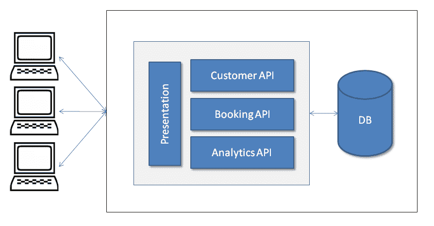
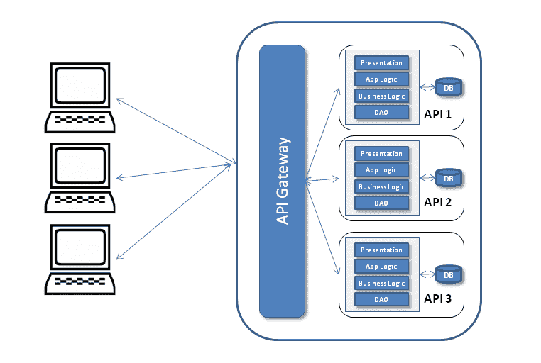
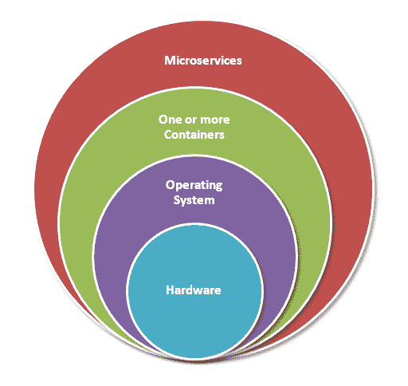

# 一、解决方法

作为先决条件，您应该对微服务和软件架构风格有基本的了解。有一个基本的理解可以帮助你彻底理解概念和这本书。

阅读本书后，您可以为内部部署或云生产部署实施微服务，并通过持续集成和部署学习设计、开发、测试和部署的完整生命周期。这本书是专门为实际使用而写的，并作为解决方案架构师激发您的灵感。您的学习将帮助您为任何类型的前提开发和发布产品，包括 SaaS、PaaS 等。我们将主要使用 Java 和基于 Java 的框架工具，如 Spring Boot 和 Jetty，并将 Docker 用作容器。

在本章中，您将了解微服务的永恒存在，以及它是如何演变的。它强调了内部部署和基于云的产品面临的重大问题，以及微服务如何处理这些问题。它还解释了在 SaaS、企业或大型应用及其解决方案的开发过程中遇到的常见问题。

在本章中，我们将学习以下主题：

*   微服务和简要背景
*   单片建筑
*   单片建筑的局限性
*   微服务提供的好处和灵活性
*   容器（如 Docker）上的微服务部署

# 微服务的演变

马丁·福勒解释说：

2011 年 5 月，在威尼斯附近的一个软件架构师研讨会上讨论了“微服务”一词，以描述参与者认为的一种常见的架构风格，他们中的许多人最近都在探索这种风格。2012 年 5 月，该集团决定将µServices 作为最合适的名称。

让我们了解一下这些年来它的演变过程。企业架构更多地从历史上的大型机计算，通过客户端-服务器架构（从两层到 n 层）演变为**面向服务的架构**（**SOA**。

从 SOA 到微服务的转换不是行业组织定义的标准，而是许多组织实践的实用方法。SOA 最终演变为微服务。

前 Netflix 架构师 Adrian Cockcroft 将其描述为：

细粒 SOA。因此，微服务是 SOA，重点放在小的临时组件上。

同样，设计 X Windows 系统的成员 Mike Gancarz 的以下引用也适用于微服务范式，该系统定义了 Unix 哲学的最高准则之一：

小就是美。

微服务与 SOA 有许多共同的特征，例如对服务的关注以及一个服务如何与另一个服务解耦。SOA 围绕单片应用集成而发展，它公开了主要基于**简单对象访问协议**（**SOAP**的 API。因此，像**企业服务总线**（**ESB**这样的中间件对于 SOA 非常重要。微服务不那么复杂，即使它们可能使用消息总线，它也只用于消息传输，不包含任何逻辑。它只是基于智能端点。

Tony Pujals 完美地定义了微服务：

在我的心智模型中，我想到了通过 HTTP 进行通信的自包含（如容器中）轻量级进程，这些进程以相对较小的工作量和仪式创建和部署，为其消费者提供了狭隘的 API。

虽然 Tony 只谈到 HTTP，但事件驱动的微服务可能会使用不同的协议进行通信。您可以使用 Kafka 实现事件驱动的微服务。卡夫卡使用有线协议，一种 TCP 上的二进制协议。

# 单片结构概述

微服务并不是什么新鲜事，它已经存在很多年了。例如，Stubby，一种基于**远程****过程****呼叫**（**RPC**）的通用基础设施，在 21 世纪初被谷歌数据中心用于连接多个服务和跨数据中心。它最近的崛起是因为它的知名度和知名度。在微服务流行之前，主要是单片架构，用于开发内部部署和云应用。

单片体系结构允许开发不同的组件，例如表示、应用逻辑、业务逻辑和**数据访问对象**（**DAO**），然后您可以将它们捆绑在**企业档案**（**EAR**或**Web 档案**（**WAR**），或者将它们存储在单个目录层次结构中（例如，Rails、NodeJ 等）。

许多著名的应用（如 Netflix）都是使用微服务体系结构开发的。此外，eBay、亚马逊和 Groupon 已经从单一架构演变为微服务架构。

既然您已经了解了微服务的背景和历史，那么让我们讨论一下传统方法（即单片应用开发）的局限性，并比较微服务如何解决这些局限性。

# 单片体系结构与微服务解决方案的局限性

正如我们所知，变化是永恒的。人类总是在寻找更好的解决方案。这就是微服务如何成为今天的样子，并可能在未来进一步发展。今天，组织正在使用敏捷方法来开发应用——这是一个快节奏的开发环境，在云和分布式技术发明之后，它的规模也大得多。许多人认为，单片体系结构也可以达到类似的目的，并与敏捷方法保持一致，但微服务仍然为生产就绪应用的许多方面提供了更好的解决方案。

为了理解单片服务和微型服务之间的设计差异，让我们以餐厅餐桌预订应用为例。此应用可能有许多服务，如客户、预订、分析等，以及常规组件，如演示文稿和数据库。

我们将在这里探讨三种不同的设计；传统单片设计、带服务的单片设计和微服务设计。

# 传统单片设计

下图说明了传统的单片应用设计。在 SOA 流行之前，这种设计被广泛使用：

传统单片应用设计

在传统的单片设计中，所有东西都捆绑在同一个归档中，例如**表示**代码、**应用逻辑**和**业务逻辑**代码、**DAO**以及与数据库文件或其他源交互的相关代码。

# 带服务的单片设计

SOA 之后，应用开始基于服务开发，其中每个组件都向其他组件或外部实体提供服务。下图描述了具有不同服务的单片应用；这里的服务与**表示**组件一起使用。所有服务、**演示文稿**组件或任何其他组件捆绑在一起：

# 服务设计

以下第三种设计描述了微服务。这里，每个组件都代表自治。每个组件都可以独立开发、构建、测试和部署。在这里，甚至应用**用户界面**（**UI**组件也可以是客户端，使用微服务。在我们的示例中，所设计的层用于µ服务中。

**API 网关**提供不同客户端访问个别服务的接口，解决以下问题：

当您希望为同一服务向不同的客户端发送不同的响应时，您会怎么做？例如，预订服务可以向提供不同详细信息的移动客户端（最小信息）和桌面客户端（详细信息）发送不同的响应，也可以向第三方客户端发送不同的响应。

响应可能需要从两个或多个服务获取信息：

在观察了所有的示例设计图（它们是非常高级的设计）之后，您可能会发现，在单片设计中，组件捆绑在一起并紧密耦合。

所有服务都是同一捆绑包的一部分。类似地，在第二个设计图中，您可以看到第一个图的一个变体，其中所有服务都可以有自己的层并形成不同的 API，但是，如图所示，这些服务也都捆绑在一起。

相反，在微服务中，设计组件不是捆绑在一起的，而是松散耦合的。每个服务都有自己的层和**DB**，并捆绑在单独的归档中。所有这些部署的服务都提供其特定的 API，如客户、预订或客户。这些 API 已经可以使用了。甚至 UI 也单独部署，并使用µ服务进行设计。由于这个原因，它提供了各种各样的优势。我仍然要提醒您，在某些特殊情况下，单片应用开发非常成功，例如 Etsy 和对等电子商务 web 应用。

现在，让我们讨论一下使用单片应用时所面临的限制。

# 一维可伸缩性

大规模的单片应用，可以在所有组件捆绑在一起时扩展所有组件。例如，在餐馆餐桌预订应用的情况下，即使您希望缩放餐桌预订服务，它也会缩放整个应用；它无法单独扩展桌面预订服务。它没有最佳地利用资源。

此外，这种缩放是一维的。运行更多的应用副本可以随着事务量的增加而扩大规模。操作团队可以根据服务器场或云中的负载调整使用负载平衡器的应用副本的数量。这些拷贝中的每一个都将访问相同的数据源，因此会增加内存消耗，并且由此产生的 I/O 操作会降低缓存的效率。

微服务提供了仅在需要扩展时扩展服务的灵活性，并允许优化资源利用率。正如我们前面提到的，当需要时，您可以只扩展表预订服务，而不影响任何其他组件。它还允许二维缩放；在这里，我们不仅可以增加事务量，还可以使用缓存（平台规模）增加数据量。

然后，开发团队可以专注于新特性的交付和发布，而不是担心扩展问题（产品规模）。

正如我们之前看到的，微服务可以帮助您扩展平台、人员和产品维度。这里的人员规模是指团队规模的增加或减少，具体取决于微服务的特定开发和重点需求。

使用 RESTfulWeb 服务开发的微服务开发使其在 REST 的服务器端是无状态的意义上具有可伸缩性；这意味着服务器之间没有太多的通信，这使得它具有水平可扩展性。

# 如果出现故障，请释放回滚

由于单片应用要么捆绑在同一个归档文件中，要么包含在单个目录中，因此它们阻止了代码模块化的部署。例如，你们中的许多人可能已经经历过由于一个特性的失败而延迟发布整个版本的痛苦。

为了解决这些情况，微服务为我们提供了只回滚那些失败的功能的灵活性。这是一种非常灵活和富有成效的方法。例如，假设您是在线购物门户开发团队的成员，并且希望开发基于微服务的应用。您可以根据不同的域（如产品、付款、购物车等）划分应用，并将所有这些组件打包为单独的包。一旦您单独部署了所有这些包，这些包将作为单个组件，可以独立开发、测试和部署，并称为µService。

现在，让我们看看这对你有什么帮助。比如说，在发布了新功能、增强功能和错误修复后，您会发现支付服务中存在需要立即修复的缺陷。由于您使用的体系结构基于微服务，因此如果您的应用体系结构允许，您可以回滚支付服务而不是回滚整个版本，或者在不影响其他服务的情况下将修复应用于微服务支付服务。这不仅允许您正确处理故障，而且有助于将功能/修复快速交付给客户。

# 采用新技术的问题

单片应用主要基于项目或产品初始开发期间主要使用的技术进行开发和增强。这使得在开发后期或产品处于成熟状态（例如，几年后）很难引入新技术。此外，同一项目中的不同模块依赖于同一库的不同版本，这使得这一点更具挑战性。

技术逐年进步。例如，您的系统可能是用 Java 设计的，几年后，出于业务需要或利用新技术的优势，您希望用 RubyonRails 或 NodeJS 开发新服务。在现有的单片应用中使用新技术是非常困难的。

它不仅涉及代码级集成，还涉及测试和部署。通过重新编写整个应用来采用新技术是可能的，但这样做既耗时又有风险。

另一方面，由于其基于组件的开发和设计，微服务为我们提供了使用任何新的或旧的技术进行开发的灵活性。它不限制您使用特定的技术，它为您的开发和工程活动提供了一个新的范例。您可以随时使用 RubyonRails、NodeJS 或任何其他技术。

那么，它是如何实现的呢？嗯，很简单。基于微服务的应用代码不会捆绑到单个存档中，也不会存储在单个目录中。每个µ服务都有自己的存档，并单独部署。新服务可以在隔离的环境中开发，并且可以在没有任何技术问题的情况下进行测试和部署。正如您所知，微服务也拥有自己的独立流程；它不存在任何冲突，例如紧密耦合的共享资源，并且流程保持独立。

因为根据定义，微服务是一个小型的、自包含的功能，所以它提供了一个尝试新技术的低风险机会。就单片系统而言，情况绝对不是这样。

您还可以将您的微服务作为开放源代码软件提供，以便其他人可以使用，如果需要，它可以与封闭源代码专有软件进行互操作，这在单片应用中是不可能的。

# 与敏捷实践保持一致

毫无疑问，单片应用可以使用敏捷实践进行开发，这些应用正在开发中。可以使用**持续集成（CI）**和**持续部署（CD）**，但问题是它是否有效地使用了敏捷实践？让我们检查以下几点：

*   例如，当故事相互依赖的可能性很高，并且可能存在各种场景时，在相关故事完成之前，无法开始讲述故事
*   随着代码大小的增加，构建需要更多的时间
*   频繁部署大型单片应用是一项很难实现的任务
*   即使更新了单个组件，也必须重新部署整个应用
*   重新部署可能会对已经运行的组件造成问题，例如，作业计划程序可能会更改组件是否影响它
*   如果单个更改的组件无法正常工作或需要更多修复，则重新部署的风险可能会增加
*   UI 开发人员总是需要更多的重新部署，这对于大型单片应用来说是非常危险和耗时的

微服务可以很容易地解决上述问题，例如，UI 开发人员可能有自己的 UI 组件，可以单独开发、构建、测试和部署。类似地，其他微服务也可以独立部署，并且由于其自治特性，降低了系统故障的风险。开发目的的另一个优点是，UI 开发人员可以使用 JSON 对象和模拟 Ajax 调用来开发 UI，这可以以独立的方式进行。开发完成后，开发人员可以使用实际的 API 并测试功能。总而言之，您可以说微服务开发非常迅速，它与业务的增量需求非常吻合。

# 易于开发–可以做得更好

一般来说，大型单片应用代码对于开发人员来说是最难理解的，而且新开发人员需要时间才能变得高效。即使将大型单片应用加载到 IDE 中也很麻烦，这会使 IDE 速度变慢，开发人员的生产效率降低。

大型单片应用中的更改很难实现，而且由于代码库很大，需要花费更多的时间，如果影响分析没有正确、彻底地完成，则会有很高的 bug 风险。因此，开发人员在实现更改之前进行彻底的影响分析成为一个先决条件。

在单片应用中，当所有组件捆绑在一起时，依赖关系会随着时间的推移而建立。因此，随着代码更改（修改的代码行数）的增加，与代码更改相关的风险呈指数增长。

当一个代码库非常庞大，并且有 100 多名开发人员在使用它时，由于前面提到的原因，构建产品和实现新功能变得非常困难。你需要确保一切就绪，并且一切都协调一致。在这种情况下，一个设计良好且文档化的 API 会有很大帮助。

按需互联网流媒体提供商 Netflix 在开发应用时遇到了问题，大约有 100 人在开发。然后，他们使用云，将应用分解成不同的部分。这些最终成为了微服务。微服务源于对速度和敏捷性以及独立部署团队的渴望。

微组件由于其公开的 API 而松散耦合，可以持续进行集成测试。随着微服务持续的发布周期，变化很小，开发人员可以通过回归测试快速利用它们，然后检查它们并修复最终发现的缺陷，从而降低部署风险。这将导致更高的速度和更低的相关风险。

由于功能分离和单一责任原则，微服务使团队非常高效。您可以在网上找到许多示例，其中大型项目的开发团队规模最小，例如 8 到 10 名开发人员。

开发人员可以更专注于更小的代码和更好的特性实现，从而与产品用户建立更高的共情关系。这有助于在功能实现中实现更好的动机和清晰性。与用户的移情关系可以缩短反馈循环，更好、更快地确定功能管道的优先级。更短的反馈回路也可以更快地检测缺陷。

每个微服务团队都是独立工作的，新的功能或想法可以在不与更多受众协调的情况下实现。在微服务设计中，端点故障处理的实现也很容易实现。

最近，在一次会议上，一个团队展示了他们如何在 10 周内开发出一款基于微服务的交通跟踪应用，包括 iOS 和 Android 应用，该应用具有 Uber 类型的跟踪功能。一家大型咨询公司向其客户提供了一份 7 个月的评估报告。它展示了微服务如何与敏捷方法和 CI/CD 相结合。

# 微服务构建管道

还可以使用流行的 CI/CD 工具（如 Jenkins、TeamCity 等）构建和测试微服务。它非常类似于在单片应用中完成构建的方式。在微服务中，每个微服务都被视为一个小应用。

例如，一旦在存储库（SCM）中提交代码，CI/CD 工具就会触发生成过程：

*   清理代码
*   代码编译
*   单元测试执行
*   合同/验收测试执行
*   构建应用存档/容器映像
*   将存档/容器映像发布到存储库管理
*   在各种交付环境（如 Dev、QA、Stage 等）上部署
*   集成和功能测试执行
*   还有其他步骤吗

然后，在`pom.xml`中更改快照或发布版本的发布构建触发器（对于 Maven）按照正常构建触发器中的描述构建工件。将工件发布到工件存储库。在存储库中标记此版本。如果使用容器映像，则将容器映像构建为构建的一部分。

# 使用容器（如 Docker）进行部署

由于微服务的设计，您需要一个能够为持续集成和部署以及装运提供灵活性、敏捷性和平滑性的环境。微服务部署需要速度、隔离管理和敏捷的生命周期。

产品和软件也可以使用多式联运集装箱模型的概念进行装运。联运集装箱是为联运货物运输而设计的大型标准化集装箱。它允许货物使用不同的运输方式—卡车、铁路或船舶，而无需卸载和重新装载。这是一种高效、安全的储存和运输物品的方法。它解决了运输问题，以前这是一个耗时、劳动密集型的过程，反复搬运往往会损坏易碎货物。

海运集装箱将其内容封装起来。类似地，软件容器开始用于封装其内容（产品、应用、依赖项等）。

在此之前，**虚拟机**（**虚拟机**）用于创建可在需要时部署的软件映像。后来，Docker 等容器变得更加流行，因为它们与传统的虚拟站点系统和云环境兼容。例如，在开发人员的笔记本电脑上部署多个虚拟机是不实际的。构建和引导虚拟机通常是 I/O 密集型的，因此速度较慢。

# 容器

容器（例如 Linux 容器）提供了一个轻量级的运行时环境，该环境由虚拟机的核心功能和操作系统的独立服务组成。这使得微服务的打包和执行变得简单和顺利。

如下图所示，容器在**操作****系统**中作为应用（微服务）运行。操作系统位于硬件之上，每个操作系统可以有多个容器，其中一个容器运行应用。

容器利用操作系统的内核接口，如**cnames**和**命名空间**，允许多个容器共享同一内核，同时彼此完全隔离运行。这样做的好处是不必为每次使用完成操作系统安装；结果是它消除了开销。它还优化使用了**硬件**：

容器层图

# 码头工人

集装箱技术是当今发展最快的技术之一，Docker 在这一领域处于领先地位。Docker 是一个开源项目，于 2013 年启动。2013 年 8 月推出互动教程后，10000 名开发者试用了它。到 2013 年 6 月发布 1.0 版本时，它的下载量达到 275 万次。许多大公司已经与 Docker 签署了合作协议，如 Microsoft、Red Hat、HP、OpenStack 和服务提供商，如 Amazon Web Services、IBM 和 Google。

正如我们前面提到的，Docker 还利用 Linux 内核特性，如 cgroups 和名称空间，以确保应用及其依赖项的资源隔离和打包。这种依赖项的打包使应用能够在不同的 Linux 操作系统/发行版之间按预期运行，支持一定程度的可移植性。此外，这种可移植性允许开发人员用任何语言开发应用，然后轻松地将其从笔记本电脑部署到测试或生产服务器。

Docker 在 Linux 上本机运行。但是，您也可以使用 VirtualBox 和 boot2docker 在 Windows 和 MacOS 上运行 Docker。

容器仅由应用及其依赖项（包括基本操作系统）组成。这使得它在资源利用率方面变得轻量级和高效。开发人员和系统管理员对容器的可移植性和资源的高效利用感兴趣。

Docker 容器中的所有内容都在主机上本机执行，并直接使用主机内核。每个容器都有自己的用户名称空间。

# Docker 的体系结构

正如 Docker 文档中指定的，Docker 体系结构使用客户机-服务器体系结构。如下图所示（来源于 Docker 网站：[https://docs.docker.com/engine/docker-overview/](https://docs.docker.com/engine/docker-overview/) ），Docker 客户端主要是终端用户使用的用户界面；客户端与 Docker 守护进程来回通信。Docker 守护进程负责构建、运行和分发 Docker 容器。Docker 客户端和守护进程可以在同一个系统或不同的计算机上运行。

Docker 客户端和守护进程通过套接字或 RESTful API 进行通信。Docker Register 是公共或私有 Docker 映像存储库，您可以从中上载或下载映像，例如，Docker Hub（[Hub.Docker.com](https://hub.docker.com/)是公共 Docker 注册表。

Docker 的体系结构

Docker 的主要组件包括：

*   **Docker image**：Docker image 是只读模板。例如，一个映像可以包含一个安装了 ApacheWeb 服务器和 web 应用的 Ubuntu 操作系统。Docker 图像是 Docker 的构建组件，图像用于创建 Docker 容器。Docker 提供了一种构建新图像或更新现有图像的简单方法。您还可以使用其他人创建的图像和/或对其进行扩展。
*   **Docker container**：根据 Docker 图像创建 Docker 容器。Docker 的工作方式是使容器只能看到自己的进程，并将自己的文件系统分层到主机文件系统和网络堆栈上，网络堆栈通过管道连接到主机网络堆栈。Docker**集装箱**可以运行、启动、停止、移动或删除。

# 部署

使用 Docker 部署微服务涉及三个部分：

*   应用打包，例如 JAR
*   使用 Docker 指令文件、Docker 文件和命令`docker build`构建带有 JAR 和依赖项的 Docker 映像。它有助于反复创建图像
*   使用命令`docker run`从此新建图像执行 Docker 容器

以上信息将帮助您了解 Docker 的基本知识。您将在[第 5 章](05.html)、*部署和测试*中了解更多关于 Docker 及其实际使用的信息。来源和参考，参考：[https://docs.docker.com](https://docs.docker.com) 。

# 总结

在本章中，您已经学习或回顾了大型软件项目的高级设计，从传统的单片到微服务应用。还向您介绍了微服务的简史、单片应用的限制以及微服务提供的好处和灵活性。我希望本章能够帮助您理解单片应用在生产环境中面临的常见问题，以及微服务如何解决此类问题。还向您介绍了轻量级和高效的 Docker 容器，并了解了容器化是简化微服务部署的一种非常好的方法。

在下一章中，您将了解如何将开发环境从 IDE 和其他开发工具设置到不同的库。我们将处理创建基本项目和设置 springboot 配置来构建和开发我们的第一个微服务。我们将使用 Java9 作为我们项目的语言和 Spring 引导。