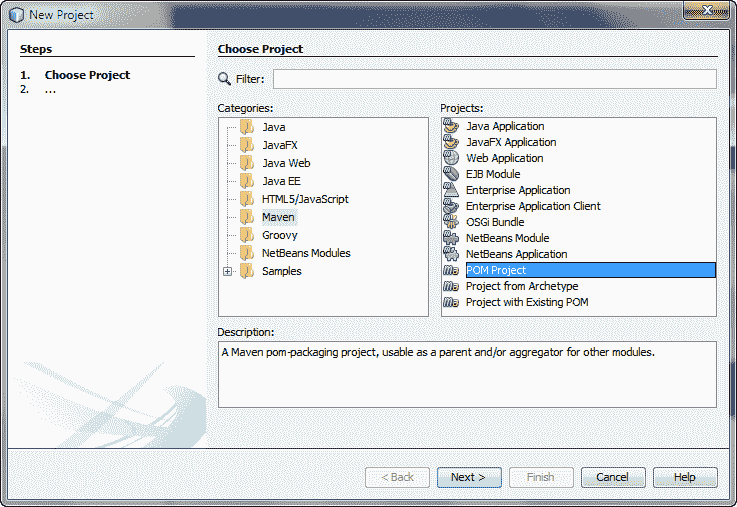
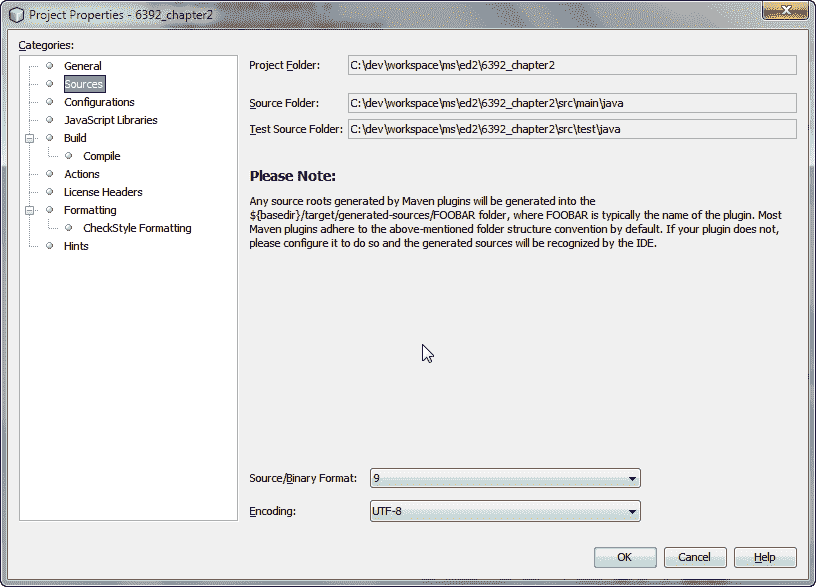
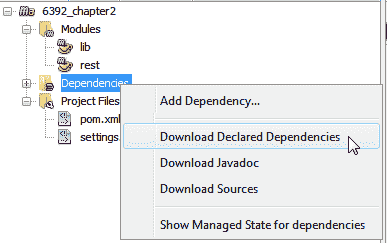
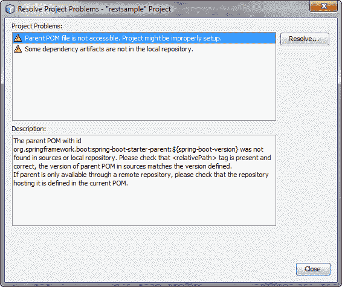

# 建立发展环境

本章重点介绍开发环境的设置和配置。如果您熟悉这些工具和库，可以跳过本章继续[第 3 章](03.html)、*领域驱动设计*，在这里您可以探索**领域驱动设计**（**DDD**）。

本章将涵盖以下主题：

*   NetBeans IDE 安装和设置
*   Spring 引导配置
*   带有 Java9 模块的示例 REST 程序
*   建筑设置
*   使用 Chrome 的 Postman 扩展进行 restapi 测试

本书将仅使用开放源码工具和框架作为示例和代码。本书还将使用 Java9 作为编程语言，应用程序框架将基于 Spring 框架。本书利用 Spring Boot 开发微服务。

NetBeans 的**集成开发环境**（**IDE**）为 Java 和 JavaScript 提供了最先进的支持，足以满足我们的需求。它在过去的几年中有了很大的发展，并内置了对本书所使用的大多数技术的支持，如 Maven、Spring Boot 等等。因此，我建议您使用 NetBeans IDE。但是，您可以自由使用任何 IDE。

我们将使用 SpringBoot 来开发 REST 服务和微服务。在本书中，选择最流行的 Spring 框架 Spring Boot 或其子集 Spring Cloud 是一个有意识的决定。因此，我们不需要从头开始编写应用程序，它为云应用程序中使用的大多数技术提供了默认配置。SpringBoot 的配置部分提供了 SpringBoot 概述。如果您是 Spring Boot 的新手，这肯定会对您有所帮助。

我们将使用 Maven 作为构建工具。与 IDE 一样，您可以使用任何您想要的构建工具，例如 Gradle 或 Ant with Ivy。我们将使用嵌入式 Jetty 作为 web 服务器，但另一种选择是使用嵌入式 Tomcat web 服务器。我们还将使用 Chrome 的 Postman 扩展来测试我们的 REST 服务。

我们将从 Spring 引导配置开始。如果您是 NetBeans 新手或在设置环境时遇到问题，可以参考以下部分。

# NetBeans IDE 安装和设置

NetBeans IDE 是免费的、开源的，拥有一个庞大的用户社区。您可以从其官方网站[下载 NetBeans IDEhttps://netbeans.org/downloads/](https://netbeans.org/downloads/) 。

在撰写本书时，NetbeansforJava9 仅作为夜间版本提供（可从[下载）http://bits.netbeans.org/download/trunk/nightly/latest/](http://bits.netbeans.org/download/trunk/nightly/latest/) ）。如以下屏幕截图所示，下载所有受支持的 NetBeans 捆绑包，因为我们也将使用 Javascript：


NetBeans 捆绑包

GlassFish 服务器和 ApacheTomcat 是可选的。所需的包和运行时表示为已安装（因为我的系统上已经安装了 NetBeans）：


NetBeans 包和运行时

下载安装后，执行安装程序文件。如以下屏幕截图所示接受许可协议，并按照其余步骤安装 NetBeans IDE：


NetBeans 许可证对话框

安装和运行所有 NetBeans 捆绑包需要 JDK 8 或更高版本。本书使用 Java9，因此我们将使用 JDK9。您可以从[下载独立的 JDK 9http://www.oracle.com/technetwork/java/javase/downloads/index.html](http://www.oracle.com/technetwork/java/javase/downloads/index.html) 。我不得不使用 JDK9 早期访问构建，因为在写这本书的时候 JDK9 还没有发布。可在[处获得 http://jdk.java.net/9/](http://jdk.java.net/9/) 。

安装 NetBeans IDE 后，启动 NetBeans IDE。NetBeans IDE 应如下所示：


NetBeans 起始页

Maven 和 Gradle 都是 Java 构建工具。他们将依赖库添加到项目中，编译代码，设置属性，构建归档，并执行更多相关活动。SpringBoot 或 SpringCloud 同时支持 Maven 和 Gradle 构建工具。然而，在本书中，我们将使用 Maven 构建工具。如果您愿意，可以随意使用 Gradle。

Maven 已经在 NetBeans IDE 中可用。现在，我们可以启动一个新的 Maven 项目来构建我们的第一个 REST 应用程序。

以下是创建新的空 Maven 项目的步骤：

1.  点击文件菜单下的新建项目（*Ctrl*+*Shift*+*N*）。它将打开“新建项目向导”。
2.  从类别列表中选择`Maven`。然后，从项目列表中选择 POM 项目，如下面的屏幕截图所示。然后，单击“下一步”按钮。



新建项目向导

3.  现在，输入项目名称为`6392_chapter2`。另外，输入其他属性，如下面的屏幕截图所示。填写完所有必填字段后，单击“完成”：


NetBeans Maven 项目属性

Aggelos Karalias 为 NetBeans IDE 开发了一个有用的插件，提供对 Spring 引导配置属性的自动完成支持，可在[上找到 https://github.com/keevosh/nb-springboot-configuration-support](https://github.com/keevosh/nb-springboot-configuration-support) 。您可以从他的项目页面[下载 http://keevosh.github.io/nb-springboot-configuration-support/](http://keevosh.github.io/nb-springboot-configuration-support/) 。您也可以使用 Spring 工具套件 IDE（[https://spring.io/tools](https://spring.io/tools) ）而不是 NetBeans IDE。它是一个定制的基于 Eclipse 的一体式发行版，使应用程序开发变得简单。

完成上述所有步骤后，NetBeans 将显示一个新创建的 Maven 项目。您将使用此项目使用 SpringBoot 创建示例 rest 应用程序。

4.  要使用 Java 9 作为源代码，请将 source/Binary Format 设置为 9，如以下屏幕截图所示：



NetBeans Maven 项目属性-源

5.  转到 Build | Compile 并确保 Java 平台设置为 JDK 9（默认值），如下所示：


NetBeans Maven 项目属性-Complile

6.  同样，通过打开右键菜单，然后选择创建新模块选项，您可以在`Modules`文件夹中添加两个名为`lib`和`rest`的新模块。这次您应该在新建项目对话框的类别列表和项目列表中选择`Maven`和 Java 应用程序。

# Spring 引导配置

Spring Boot 显然是开发针对 Spring 的最先进的生产应用程序的选择。其网站（[https://projects.spring.io/spring-boot/](https://projects.spring.io/spring-boot/) 还陈述了其真正的优势：

对构建生产就绪的 Spring 应用程序持有一种固执己见的观点。SpringBoot 支持约定而非配置，旨在让您尽快启动并运行。

# 弹簧靴概述

Spring Boot 是**Pivotal**创建的一款令人惊叹的 Spring 工具，于 2014 年 4 月发布（GA）。它是根据 SPR-9888（[的要求开发的 https://jira.spring.io/browse/SPR-9888 标题为*的*](https://jira.spring.io/browse/SPR-9888)改进了对“无容器”web 应用程序架构的支持。

你一定想知道，为什么没有集装箱？因为，今天的云环境或 PaaS 提供了基于容器的 web 架构提供的大部分功能，如可靠性、管理或可扩展性。因此，Spring Boot 致力于使自己成为一个超轻容器。

Spring Boot 经过预配置，可以非常轻松地让 web 应用程序做好生产准备。**弹簧初始化器**[http://start.spring.io </span>](http://start.spring.io)是一个页面，您可以在其中选择构建工具，如 Maven 或 Gradle，以及项目元数据，如组、工件和依赖项。在输入所需字段后，只需单击 Generate Project 按钮，它将为您提供 Spring Boot 项目，您可以将其用于生产应用程序。

在这个页面上，默认的打包选项是 Jar。我们还将在微服务开发中使用 JAR 包装。原因很简单：它使微服务开发更容易。试想一下，如果要管理和创建一个基础设施，让每个微服务都在自己的服务器实例上运行，那将是多么困难。

Josh Long 在一个春季 IOs 中分享了他的演讲：

“最好是制造罐子，而不是战争。”

稍后，我们将使用 SpringCloud，它是 SpringBoot 顶部的包装。

我们将开发一个示例 REST 应用程序，它将使用 Java9 模块特性。我们将创建两个模块-`lib`和`rest`。`lib`模块将向`rest`模块提供模型或任何支持的类。`rest`模块将包括开发 REST 应用程序所需的所有类，它还将使用`lib`模块中定义的模型类。

`lib`和`rest`模块都是`maven`模块，它们的`parent`模块是我们的主体项目`6392_chapter2`。

`module-info.java`文件是一个重要的类，它控制对其类的访问。我们将使用`requires`、`opens`和`exports`来使用`spring`模块，并在我们的 REST 应用程序的`lib`和`rest`模块之间建立提供者-消费者关系。

# 将 Spring Boot 添加到我们的主项目中

我们将使用 Java9 来开发微服务。因此，我们将使用最新的 Spring 框架和 Spring 引导项目。在撰写本文时，SpringBoot2.0.0 构建快照发布版本已经可用。

您可以使用最新发布的版本。SpringBoot2.0.0 构建快照使用 Spring5（5.0.0 构建快照版本）。

让我们来看看下面的步骤，了解如何将 Spring 引导添加到我们的主要项目：

1.  打开`pom.xml`文件（在`6392_chapter2`项目文件下提供），将 Spring Boot 添加到示例项目中：

```java
<?xml version="1.0" encoding="UTF-8"?> 
<project  
         xmlns:xsi="http://www.w3.org/2001/XMLSchema-instance" 
         xsi:schemaLocation="http://maven.apache.org/POM/4.0.0 http://maven.apache.org/xsd/maven-4.0.0.xsd"> 
    <modelVersion>4.0.0</modelVersion> 

    <groupId>com.packtpub.mmj</groupId> 
    <artifactId>6392_chapter2</artifactId> 
    <version>1.0-SNAPSHOT</version> 
    <packaging>pom</packaging> 

    <modules> 
        <module>lib</module> 
        <module>rest</module> 
    </modules> 

    <properties> 
        <project.build.sourceEncoding>UTF-8</project.build.sourceEncoding> 
        <spring-boot-version>2.0.0.BUILD-SNAPSHOT</spring-boot-version> 
        <spring-version>5.0.0.BUILD-SNAPSHOT</spring-version> 
        <maven.compiler.source>9</maven.compiler.source> 
        <maven.compiler.target>9</maven.compiler.target> 
        <start-class>com.packtpub.mmj.rest.RestSampleApp</start-class> 
    </properties> 
    <parent> 
        <groupId>org.springframework.boot</groupId> 
        <artifactId>spring-boot-starter-parent</artifactId> 
        <version>2.0.0.BUILD-SNAPSHOT</version> 
    </parent> 
    <dependencyManagement> 
        <dependencies> 
            <dependency> 
                <groupId>com.packtpub.mmj</groupId> 
                <artifactId>rest</artifactId> 
                <version>${project.version}</version> 
            </dependency> 
            <dependency> 
                <groupId>com.packtpub.mmj</groupId> 
                <artifactId>lib</artifactId> 
                <version>${project.version}</version> 
            </dependency> 
        </dependencies> 
    </dependencyManagement> 

    <build> 
        <plugins> 
            <plugin> 
                <groupId>org.springframework.boot</groupId> 
                <artifactId>spring-boot-maven-plugin</artifactId> 
                <version>2.0.0.BUILD-SNAPSHOT</version> 
                <executions> 
                    <execution> 
                        <goals> 
                            <goal>repackage</goal> 
                        </goals> 
                        <configuration> 
                            <classifier>exec</classifier> 
                            <mainClass>${start-class}</mainClass> 
                        </configuration> 
                    </execution> 
                </executions> 
            </plugin> 
            <plugin> 
                <groupId>org.apache.maven.plugins</groupId> 
                <artifactId>maven-compiler-plugin</artifactId> 
                <version>3.6.1</version> 
                <configuration> 
                    <source>1.9</source> 
                    <target>1.9</target> 
                    <showDeprecation>true</showDeprecation> 
                    <showWarnings>true</showWarnings> 
                </configuration> 
            </plugin> 
        </plugins> 
    </build> 
    <repositories> 
        <repository> 
            <id>spring-snapshots</id> 
            <name>Spring Snapshots</name> 
            <url>https://repo.spring.io/snapshot</url> 
            <snapshots> 
                <enabled>true</enabled> 
            </snapshots> 
        </repository> 
        <repository> 
            <id>spring-milestones</id> 
            <name>Spring Milestones</name> 
            <url>https://repo.spring.io/milestone</url> 
            <snapshots> 
                <enabled>false</enabled> 
            </snapshots> 
        </repository> 
    </repositories> 

    <pluginRepositories> 
        <pluginRepository> 
            <id>spring-snapshots</id> 
            <name>Spring Snapshots</name> 
            <url>https://repo.spring.io/snapshot</url> 
            <snapshots> 
                <enabled>true</enabled> 
            </snapshots> 
        </pluginRepository> 
        <pluginRepository> 
            <id>spring-milestones</id> 
            <name>Spring Milestones</name> 
            <url>https://repo.spring.io/milestone</url> 
            <snapshots> 
                <enabled>false</enabled> 
            </snapshots> 
        </pluginRepository> 
    </pluginRepositories> 
</project> 
```

您可以看到，我们已经在父项目`pom.xml`中定义了两个模块`lib`和`rest`。

2.  如果您是第一次添加这些依赖项，则需要通过右键单击项目窗格中`6392_chapter2`项目下的`Dependencies`文件夹下载这些依赖项，如下图所示：



下载 NetBeans 中的 Maven 依赖项

3.  同样，要解决项目问题，右键单击 NetBeans 项目`6392_chapter2`并选择解决项目问题。。。。它将打开如下所示的对话框。点击解决。。。解决问题的按钮：



“解决项目问题”对话框

4.  如果您在代理后面使用 Maven，则更新 Maven 主目录中`settings.xml`中的`proxies`。如果您使用的是与 NetBeans 捆绑在一起的 Maven，那么请使用`<NetBeans Installation Directory>\java\maven\conf\settings.xml`。您可能需要重新启动 NetBeans IDE。

如果声明的依赖项和可传递的依赖项在本地 Maven 存储库中不可用，则前面的步骤将从远程 Maven 存储库下载所有必需的依赖项。如果您是第一次下载依赖项，则可能需要一些时间，具体取决于您的互联网速度。

# 示例 REST 程序

我们将使用一种简单的方法来构建一个独立的应用程序。它将所有内容打包到一个可执行的 JAR 文件中，由`main()`方法驱动。在此过程中，您使用 Spring 支持将 Jetty servlet 容器嵌入为 HTTP 运行时，而不是将其部署到外部实例。因此，我们将创建可执行 JAR 文件来代替 war，war 需要部署在外部 web 服务器上，这是`rest`模块的一部分。我们将在`lib`模块中定义域模型，在`rest`模块中定义 API 相关类。

以下是`lib`和`rest`模块的`pom.xml`。

`lib`模块的`pom.xml`文件：

```java
<?xml version="1.0" encoding="UTF-8"?> 
<project  xmlns:xsi="http://www.w3.org/2001/XMLSchema-instance" xsi:schemaLocation="http://maven.apache.org/POM/4.0.0 http://maven.apache.org/xsd/maven-4.0.0.xsd"> 
    <modelVersion>4.0.0</modelVersion> 
    <parent> 
        <groupId>com.packtpub.mmj</groupId> 
        <artifactId>6392_chapter2</artifactId> 
        <version>1.0-SNAPSHOT</version> 
    </parent> 
    <artifactId>lib</artifactId> 
</project> 
```

`rest`模块的`pom.xml`：

```java
    <modelVersion>4.0.0</modelVersion> 
    <parent> 
        <groupId>com.packtpub.mmj</groupId> 
        <artifactId>6392_chapter2</artifactId> 
        <version>1.0-SNAPSHOT</version> 
    </parent> 
    <artifactId>rest</artifactId> 
  <dependencies> 
        <dependency> 
            <groupId>com.packtpub.mmj</groupId> 
            <artifactId>lib</artifactId> 
        </dependency> 
        <dependency> 
            <groupId>org.springframework.boot</groupId> 
            <artifactId>spring-boot-starter-web</artifactId> 
    ... 
    ...  
```

这里，`spring-boot-starter-web`依赖项用于开发独立的可执行 REST 服务。

我们将分别在`lib`和`rest`模块的默认包中添加以下`module-info.java`类。

`lib`模块中的`module-info.java`文件：

```java
module com.packtpub.mmj.lib { 
    exports com.packtpub.mmj.lib.model to com.packtpub.mmj.rest; 
    opens com.packtpub.mmj.lib.model; 
} 
```

在这里，我们将`com.packtpub.mmj.lib.model`包导出到`com.packtpub.mmj.rest`，这允许`lib`模型类访问`rest`模块类。

`lib`模块中的`module-info.java`文件：

```java
module com.packtpub.mmj.rest { 

    requires spring.core; 
    requires spring.beans; 
    requires spring.context; 
    requires spring.aop; 
    requires spring.web; 
    requires spring.expression; 

    requires spring.boot; 
    requires spring.boot.autoconfigure; 

    requires com.packtpub.mmj.lib; 

    exports com.packtpub.mmj.rest; 
    exports com.packtpub.mmj.rest.resources; 

    opens com.packtpub.mmj.rest; 
    opens com.packtpub.mmj.rest.resources; 
} 
```

在这里，我们使用`requires`语句添加所有必需的`spring`和`lib`包，这使得`rest`模块类能够使用`spring`和`lib`模块中定义的类。此外，我们还出口`com.packt.mmj.rest`和`com.packt.mmj.rest.resources`包装。

现在，当您在 NetBeans IDE 中准备好 Spring Boot 时，您可以创建示例 web 服务。您将创建一个数学 API，它执行简单的计算并将结果生成为 JSON。

让我们讨论一下如何致电 REST 服务并获得响应。

服务将处理`/calculation/sqrt`或`/calculation/power`等的`GET`请求。`GET`请求应该返回一个包含 JSON 的`200 OK`响应，其中 JSON 表示给定数字的平方根。它应该是这样的：

```java
{ 
  "function": "sqrt", 
  "input": [ 
    "144" 
  ], 
  "output": [ 
    "12.0" 
  ] 
} 
```

`input`字段是平方根函数的输入参数，内容是结果的文本表示。

您可以创建一个资源表示类，通过使用**普通旧 Java 对象**（**POJO**）对输入、输出和函数数据的字段、构造函数、setter 和 getter 进行建模。由于它是一个模型，我们将在`lib`模块中创建它：

```java
package com.packtpub.mmj.lib.model; 

import java.util.List; 

public class Calculation { 

    String function; 
    private List<String> input; 
    private List<String> output; 

    public Calculation(List<String> input, List<String> output, String function) { 
        this.function = function; 
        this.input = input; 
        this.output = output; 
    } 

    public List<String> getInput() { 
        return input; 
    } 

    public void setInput(List<String> input) { 
        this.input = input; 
    } 

    public List<String> getOutput() { 
        return output; 
    } 

    public void setOutput(List<String> output) { 
        this.output = output; 
    } 

    public String getFunction() { 
        return function; 
    } 

    public void setFunction(String function) { 
        this.function = function; 
    } 

} 
```

# 编写 REST 控制器类

罗伊·菲尔丁在他的博士论文中定义并引入了术语**表征状态转移**（**休息**。REST 是一种用于分布式超媒体系统（如 WWW）的软件体系结构。RESTful 指符合 REST 体系结构属性、原则和约束的系统。

现在，您将创建一个 REST 控制器来处理`Calculation`资源。控制器在 Spring RESTful web 服务实现中处理 HTTP 请求。

# @RestController 注释

`@RestController`是用于 Spring 4 中引入的`resource`类的类级注释。它是`@Controller`和`@ResponseBody`的组合，因此类返回域对象而不是视图。

在下面的代码中，可以看到`CalculationController`类通过返回`calculation`类的新实例来处理`GET`对`/calculation`的请求。

我们将为一个`Calculation`资源实现两个 URI，平方根（`Math.sqrt()`函数）作为`/calculations/sqrt`URI，幂（`Math.pow()`函数）作为`/calculation/power`URI。

# @RequestMapping 注释

类级使用`@RequestMapping`注释将`/calculation`URI 映射到`CalculationController`类，即确保对`/calculation`的 HTTP 请求映射到`CalculationController`类。基于使用 URI 的注释`@RequestMapping`定义的路径（后缀为`/calculation`，例如`/calculation/sqrt/144`，它将映射到各自的方法。这里，请求映射`/calculation/sqrt`映射到`sqrt()`方法，`/calculation/power`映射到`pow()`方法。

您可能还注意到，我们没有定义这些方法将使用什么请求方法（`GET`/`POST`/`PUT`等等）。`@RequestMapping`注释默认映射所有 HTTP 请求方法。您可以使用`RequestMapping`的 method 属性来使用特定的方法。例如，您可以通过以下方式编写`@RequestMethod`注释以使用`POST`方法：

```java
@RequestMapping(value = "/power", method = POST) 
```

为了沿途传递参数，示例分别使用注释`@RequestParam`和`@PathVariable`演示了请求参数和路径参数。

# @RequestParam 注释

`@RequestParam`负责将查询参数绑定到控制器方法的参数。例如，`QueryParam`基和指数分别绑定到`CalculationController`方法`pow()`的参数`b`和`e`。`pow()`方法的两个查询参数都是必需的，因为我们没有对它们使用任何默认值。查询参数的默认值可以使用`@RequestParam`的`defaultValue`属性设置，例如`@RequestParam(value="base", defaultValue="2")`。这里，如果用户没有传递查询参数 base，那么默认值`2`将用于 base。

如果未定义`defaultValue`且用户未提供请求参数，则`RestController`返回 HTTP`status`代码`400`并显示消息`Required String parameter 'base' is not present`。如果缺少多个请求参数，则始终使用第一个必需参数的引用：

```java
{ 
  "timestamp": 1464678493402, 
  "status": 400, 
  "error": "Bad Request", 
  "exception": "org.springframework.web.bind.MissingServletRequestParameterException", 
  "message": "Required String parameter 'base' is not present", 
  "path": "/calculation/power/" 
} 
```

# @PathVariable 注释

`@PathVariable`帮助您创建动态 URI。`@PathVariable`注释允许您将 Java 参数映射到路径参数。它与`@RequestMapping`一起工作，在 URI 中创建占位符，然后将相同的占位符名称用作`PathVariable`或方法参数，正如您在`CalculationController`类的“方法”`sqrt()`中看到的那样。这里，值占位符在`@RequestMapping`内创建，相同的值被分配给`@PathVariable`的值。

`sqrt()`方法使用 URI 中的参数代替请求参数，例如`http://localhost:8080/calculation/sqrt/144`。此处，`144`值作为路径参数传递，此 URL 应返回`144`的平方根，即`12`。

为了使用基本就地检查，我们使用正则表达式`"^-?+\\d+\\.?+\\d*$"`只允许参数中的有效数字。如果传递了非数值，则相应的方法会向 JSON 的输出键添加一条错误消息：

`CalculationController` also uses the regular expression `.+` in the `path` variable (`path` parameter) to allow the decimal point(`.`) in numeric values: `/path/{variable:.+}`. Spring ignores anything after the last dot. Spring default behavior takes it as a file extension.

还有其他选择，例如在末尾添加斜杠（`/path/{variable}/`），或者通过使用`PathMatchConfigurer`（在 Spring 4.0.1+中提供）将`useRegisteredSuffixPatternMatch`设置为`true`来覆盖`WebMvcConfigurerAdapter`的`configurePathMatch()`方法。

`CalculationController`资源代码，我们已经实现到 REST 端点：

```java
package com.packtpub.mmj.rest.resources; 

import com.packtpub.mmj.lib.model.Calculation; 
import java.util.ArrayList; 
import java.util.List; 
import org.springframework.web.bind.annotation.PathVariable; 
import org.springframework.web.bind.annotation.RequestMapping; 
import static org.springframework.web.bind.annotation.RequestMethod.GET; 
import org.springframework.web.bind.annotation.RequestParam; 
import org.springframework.web.bind.annotation.RestController; 

/** 
 * 
 * @author sousharm 
 */ 
@RestController 
@RequestMapping("calculation") 
public class CalculationController { 

    private static final String PATTERN = "^-?+\\d+\\.?+\\d*$"; 

    /** 
     * 
     * @param b 
     * @param e 
     * @return 
     */ 
    @RequestMapping("/power") 
    public Calculation pow(@RequestParam(value = "base") String b, @RequestParam(value = "exponent") String e) { 
        List<String> input = new ArrayList(); 
        input.add(b); 
        input.add(e); 
        List<String> output = new ArrayList(); 
        String powValue; 
        if (b != null && e != null && b.matches(PATTERN) && e.matches(PATTERN)) { 
            powValue = String.valueOf(Math.pow(Double.valueOf(b), Double.valueOf(e))); 
        } else { 
            powValue = "Base or/and Exponent is/are not set to numeric value."; 
        } 
        output.add(powValue); 
        return new Calculation(input, output, "power"); 
    } 

    /** 
     * 
     * @param aValue 
     * @return 
     */ 
    @RequestMapping(value = "/sqrt/{value:.+}", method = GET) 
    public Calculation sqrt(@PathVariable(value = "value") String aValue) { 
        List<String> input = new ArrayList(); 
        input.add(aValue); 
        List<String> output = new ArrayList(); 
        String sqrtValue; 
        if (aValue != null && aValue.matches(PATTERN)) { 
            sqrtValue = String.valueOf(Math.sqrt(Double.valueOf(aValue))); 
        } else { 
            sqrtValue = "Input value is not set to numeric value."; 
        } 
        output.add(sqrtValue); 
        return new Calculation(input, output, "sqrt"); 
    } 
} 
```

这里，我们仅公开使用 URI`/calculation/power`和`/calculation/sqrt`的`Calculation`资源的`power`和`sqrt`函数。

在这里，我们使用`sqrt`和`power`作为 URI 的一部分，我们仅用于演示目的。理想情况下，这些应该作为请求参数`function`的值或基于端点设计形成的类似值传递。

这里一件有趣的事情是，由于 Spring 的 HTTP 消息转换器支持，`Calculation`对象自动转换为 JSON。您不需要手动执行此转换。如果 Jackson 2 在类路径上，Spring 的`MappingJackson2HttpMessageConverter`将`Calculation`对象转换为 JSON。

# 使示例 REST 应用程序可执行

创建一个带有注释`SpringBootApplication`的`RestSampleApp`类。`main()`方法使用 Spring Boot 的`SpringApplication.run()`方法启动应用程序。

我们将使用隐式添加以下所有标记的`@SpringBootApplication`注释来注释`RestSampleApp`类：

*   `@Configuration`注释将该类标记为应用程序上下文的 bean 定义源。
*   `@EnableAutoConfiguration`注释表示 SpringBoot 将根据类路径设置、其他 bean 和各种属性设置开始添加 bean。
*   如果 Spring Boot 在类路径上找到`spring-webmvc`，则添加`@EnableWebMvc`注释。它将应用程序视为 web 应用程序，并激活关键行为，如设置`DispatcherServlet`。
*   `@ComponentScan`注释告诉 Spring 在给定包中查找其他组件、配置和服务：

```java
package com.packtpub.mmj.rest; 

import org.springframework.boot.SpringApplication; 
import org.springframework.boot.autoconfigure.SpringBootApplication; 

@SpringBootApplication 
public class RestSampleApp { 

    public static void main(String[] args) { 
        SpringApplication.run(RestSampleApp.class, args); 
    } 
} 
```

这个 web 应用程序是 100%纯 Java 的，您不必使用 XML 配置任何管道或基础设施；取而代之的是，它使用了 Java 注释，而 Spring 引导使 Java 注释变得更加简单。因此，除了 Maven 的`pom.xml`之外，没有一行 XML。甚至连一个`web.xml`文件都没有。

# 添加 Jetty 嵌入式服务器

SpringBoot 默认提供 ApacheTomcat 作为嵌入式应用程序容器。本书将使用 Jetty 嵌入式应用程序容器代替 ApacheTomcat。因此，我们需要添加 Jetty 应用程序容器依赖项来支持 Jetty web 服务器。

Jetty 还允许您使用类路径读取密钥或信任存储，也就是说，您不需要将这些存储保存在 JAR 文件之外。如果将 Tomcat 与 SSL 一起使用，则需要直接从文件系统访问密钥存储或信任存储，但不能使用类路径。结果是，您无法读取 JAR 文件中的密钥存储或信任存储，因为 Tomcat 要求密钥存储（如果您使用的是信任存储）可以直接在文件系统上访问。这可能会改变这本书的后期写作。

这个限制不适用于 Jetty，Jetty 允许读取 JAR 文件中的密钥或信任存储。模块`rest`的`pom.xml`上的相对部分：

```java
<dependencies> 
<dependency> 
       <groupId>org.springframework.boot</groupId> 
           <artifactId>spring-boot-starter-web</artifactId> 
           <exclusions> 
             <exclusion> 
<groupId>org.springframework.boot</groupId> 
<artifactId>spring-boot-starter-tomcat</artifactId> 
                </exclusion> 
            </exclusions> 
</dependency> 
<dependency> 
<groupId>org.springframework.boot</groupId> 
<artifactId>spring-boot-starter-jetty</artifactId> 
</dependency> 
</dependencies>
```

# 设置应用程序构建

无论`pom.xml`文件是什么，我们到目前为止使用的任何文件都足以执行我们的示例 REST 服务。此服务将代码打包到 JAR 文件中。要使此 JAR 可执行，我们需要选择以下选项：

*   运行 Maven 工具
*   使用 Java 命令执行

以下各节将详细介绍它们。

# 运行 Maven 工具

这种方法可能不起作用，因为 Java9、SpringBoot2 和 SpringFramework5 都在早期版本或快照版本中。如果它不起作用，请使用 Java 命令的项目。

这里，我们使用 Maven 工具来执行生成的 JAR 文件，步骤如下：

1.  右键点击`pom.xml`文件。
2.  选择 Run Maven | Goals。。。从弹出菜单中。它将打开对话框。在目标字段中键入`spring-boot:run`。我们在代码中使用了 Spring Boot 的发布版本。但是，如果您使用的是快照版本，则可以选中更新快照复选框。要在将来使用它，请在“记住为”字段中键入`spring-boot-run`。
3.  下次，您可以直接单击 Run Maven | Goals |`spring-boot-run`执行项目：


运行 Maven 对话框

4.  单击“确定”执行项目。

# 使用 Java 命令执行

在执行以下命令之前，请确保 Java 和`JAVA_HOME`已设置为 Java 9。
请看以下步骤：

1.  要构建 JAR 文件，请在父项目根目录（`6392_chapter2`中的命令提示符下执行`mvn clean package`命令。这里，`clean`和`package`是 Maven 的目标：

```java
mvn clean package
```

2.  它在相应的目标目录中创建 JAR 文件。我们将执行在`6392_chapter2\rest\target`目录中生成的 JAR 文件。可以使用以下命令执行 JAR 文件：

```java
java -jar rest\target\rest-1.0-SNAPSHOT-exec.jar
```

请确保您执行的 JAR 文件有后缀`exec`，如前面的命令所示。

# 使用 Postman Chrome 扩展进行 REST API 测试

本书使用 Chrome 的 Postman-REST 客户端扩展来测试我们的 REST 服务。我使用 5.0.1 版本的 Postman。您可以使用 Postman Chrome 应用程序或任何其他 REST 客户端来测试示例 REST 应用程序，如以下屏幕截图所示：


Postman-Rest 客户端 Chrome 扩展

一旦安装了 Postman-REST 客户机，我们就来测试我们的第一个 REST 资源。我们从“开始”菜单或快捷方式启动 Postman-REST 客户端。

默认情况下，嵌入式 web 服务器在端口`8080`上启动。因此，我们需要使用`http://localhost:8080/<resource>`URL 来访问示例 REST 应用程序。例如：`http://localhost:8080/calculation/sqrt/144`。

一旦启动，您可以为`sqrt`键入`Calculation`REST URL，并将值`144`作为路径参数。您可以在下面的屏幕截图中看到它。此 URL 在邮递员扩展的 URL（在此处输入请求 URL）输入字段中输入。默认情况下，请求方式为`GET`。我们使用 request 方法的默认值，因为我们还编写了 RESTful 服务来服务 request`GET`方法。

一旦您准备好前面提到的输入数据，您可以通过点击发送按钮提交
请求。您可以在下面的屏幕截图中看到，
响应代码`200`由您的示例 REST 服务返回。您可以在下面的屏幕截图中找到状态标签，以查看 200 OK 代码。成功的请求
还返回`Calculation`资源的 JSON 数据，如屏幕截图中的
漂亮选项卡所示。返回的 JSON 显示函数键的`sqrt`方法值。
还分别显示`144`和`12.0`作为输入和输出列表：


邮递员计算（`sqrt`资源测试

类似地，我们还测试了用于计算`power`函数的示例 REST 服务。我们在邮递员分机中输入以下数据：

*   **URL**：[http://localhost:8080/calculation/power?base=2 &指数=4](http://localhost:8080/calculation/power?base=2&exponent=4)
*   **请求方式**：`GET`

在这里，我们分别传递值为`2`和`4`的请求参数`base`和`exponent`。它返回以下 JSON：

```java
{ 
    "function": "power", 
    "input": [ 
        "2", 
        "4" 
    ], 
    "output": [ 
        "16.0" 
    ] 
} 
```

它返回前面的 JSON，响应状态为 200，如以下屏幕截图所示：


邮递员计算（`power`资源测试

# 一些更积极的测试场景

下表中，所有 URL 均以`http://localhost:8080`开头：

| 统一资源定位地址 | 输出 JSON |
| --- | --- |
| `/calculation/sqrt/12344.234` | 

```java
{   
    "function":   "sqrt",   
    "input":   [   
        "12344.234"   
    ],   
    "output":   [   
        "111.1046083652699"   
    ]   
}   
```

 |
| `Math.sqrt`函数特殊场景的`/calculation/sqrt/-9344.34`：如果参数为`NaN`或小于零，则结果为`NaN` | 

```java
{   
    "function":   "sqrt",   
    "input":   [   
        "-9344.34"   
    ],   
    "output":   [   
        "NaN"   
    ]   
}   
```

 |
| `/calculation/power?base=2.09&exponent=4.5` | 

```java
{   
    "function":   "power",   
    "input":   [   
        "2.09",   
        "4.5"   
    ],   
    "output":   [   
        "27.58406626826615"   
    ]   
}   
```

 |
| `/calculation/power?base=-92.9&exponent=-4` | 

```java
{   
    "function":   "power",   
    "input":   [   
        "-92.9",   
        "-4"   
    ],   
    "output":   [   
        "1.3425706351762353E-8"   
    ]   
}   
```

 |

# 否定测试场景

类似地，您也可以执行一些负面场景，如下表所示。在此表中，所有 URL 均以`http://localhost:8080`开头：

| 统一资源定位地址 | 输出 JSON |
| --- | --- |
| `/calculation/power?base=2a&exponent=4` | 

```java
{   
    "function":   "power",   
    "input":   [   
        "2a",   
        "4"   
    ],   
    "output":   [   
        "Base   or/and Exponent is/are not set to numeric value."   
    ]   
}   
```

 |
| `/calculation/power?base=2&exponent=4b` | 

```java
{   
    "function":   "power",   
    "input":   [   
        "2",   
        "4b"   
    ],   
    "output":   [   
        "Base   or/and Exponent is/are not set to numeric value."   
    ]   
}   
```

 |
| `/calculation/power?base=2.0a&exponent=a4` | 

```java
{   
    "function":   "power",   
    "input":   [   
        "2.0a",   
        "a4"   
    ],   
    "output":   [   
        "Base   or/and Exponent is/are not set to numeric value."   
    ]   
}   
```

 |
| `/calculation/sqrt/144a` | 

```java
{   
    "function":   "sqrt",   
    "input":   [   
        "144a"   
    ],   
    "output":   [   
        "Input   value is not set to numeric value."   
    ]   
}   
```

 |
| `/calculation/sqrt/144.33$` | 

```java
{   
    "function":   "sqrt",   
    "input":   [   
        "144.33$"   
    ],   
    "output":   [   
        "Input   value is not set to numeric value."   
    ]   
}   
```

 |

# 总结

在本章中，您探讨了设置开发环境、Maven 配置、Spring 引导配置等各个方面。

您还学习了如何使用 SpringBoot 开发示例 REST 服务应用程序。我们了解了 Spring Boot 的强大功能，它大大简化了开发，您只需担心实际代码，而不必担心您编写的样板代码或配置。我们还使用嵌入式应用程序容器 Jetty 将代码打包到一个 JAR 文件中。它允许 It 运行和访问 web 应用程序，而无需担心部署问题。

在下一章中，您将使用一个示例项目学习**域驱动设计**（**DDD**），该示例项目可在其余章节中使用。我们将使用样本项目**在线表格预订系统**（**OTRS**）经历微服务开发的各个阶段，了解 DDD。完成[第三章](03.html)*领域驱动设计*后，您将学习 DDD 的基础知识。

通过设计示例服务，您将了解如何实际使用 DDD。您还将学习在此基础上设计域模型和 REST 服务。以下是一些链接，您可以查看这些链接以了解我们在此处使用的工具的更多信息：

*   **弹簧****靴**：[http://projects.spring.io/spring-boot/](http://projects.spring.io/spring-boot/)
*   **下载****上网本**：[https://netbeans.org/downloads](https://netbeans.org/downloads)
*   **表征状态转移****休息**：第五章[https://www.ics.uci.edu/托马斯·菲尔丁博士/博士学位]。论文*架构风格与基于网络的软件架构设计*](https://www.ics.uci.edu/~fielding/pubs/dissertation/top.htm)
*   **休息**：[https://en.wikipedia.org/wiki/Representational_state_transfer](https://en.wikipedia.org/wiki/Representational_state_transfer)
*   **马文**：[https://maven.apache.org/](https://maven.apache.org/)
*   **梯度**：[http://gradle.org/](http://gradle.org/)