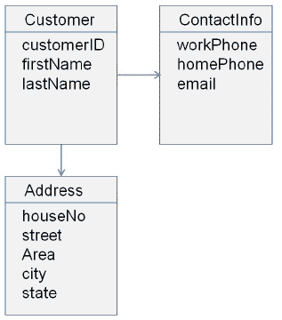
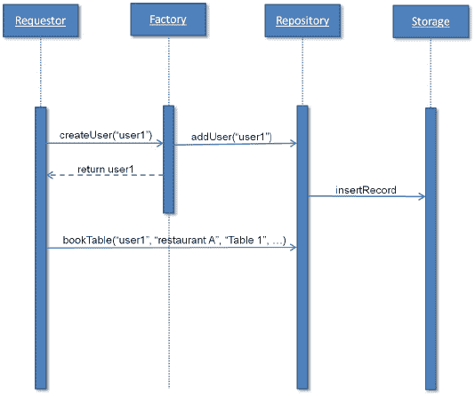
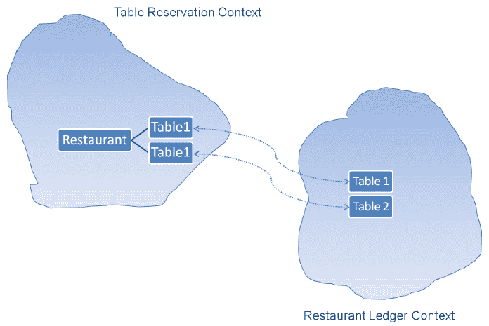
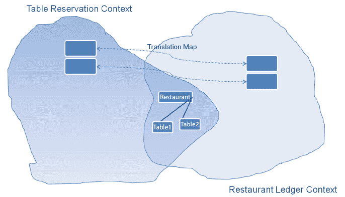

# 领域驱动设计

本章通过引用一个示例项目为其余章节定下基调。从这里开始，示例项目将用于解释不同的微服务概念。本章使用此示例项目来驱动功能和领域服务的不同组合，或解释**领域驱动设计**（**DDD**）。它将帮助您学习 DDD 的基本原理及其实际使用。您还将学习使用 REST 服务设计域模型的概念。

本章涵盖以下主题：

*   DDD 的基本原理
*   如何使用 DDD 设计应用程序
*   域模型
*   基于 DDD 的样本域模型设计

一个好的软件设计与它提供的功能一样，是产品或服务成功的关键。它对产品的成功具有同等的重要性；例如，`Amazon.com`提供购物平台，但其架构设计使其不同于其他类似网站，并有助于其成功。它显示了软件或体系结构设计对于产品/服务的成功是多么重要。DDD 是软件设计实践之一，我们将用各种理论和实践例子来探讨它。

DDD 是一种关键的设计实践，有助于设计您正在开发的产品的微服务。因此，在进入微服务开发之前，我们将首先探索 DDD。学习本章之后，您将了解 DDD 对于微服务开发的重要性。

# 领域驱动设计基础

企业或云应用程序解决业务问题和其他现实问题。如果不了解该领域，这些问题就无法解决。例如，如果您不了解证券交易所及其功能，则无法为在线股票交易等金融系统提供软件解决方案。因此，拥有领域知识是解决问题的必要条件。现在，如果您想使用软件或应用程序提供解决方案，则需要借助领域知识进行设计。当我们结合领域和软件设计时，它提供了一种称为 DDD 的软件设计方法。

当我们开发软件来实现提供域功能的真实场景时，我们创建了域的模型。**模型**是领域的抽象或蓝图。

Eric Evans 在 2004 年出版的著作*领域驱动设计：解决软件核心的复杂性*中创造了 DDD 一词。

设计这个模型不是火箭科学，但它确实需要很多努力、改进和领域专家的投入。这是软件设计师、领域专家和开发人员的集体工作。他们组织信息，将其分成更小的部分，对它们进行逻辑分组，并创建模块。每个模块可以单独使用，也可以使用类似的方法进行划分。这个过程可以一直遵循，直到我们达到单位级别，或者当我们无法进一步划分它时。一个复杂的项目可能有更多这样的迭代；类似地，一个简单的项目可能只有一次迭代。

一旦一个模型被定义并形成良好的文档，它就可以进入下一个阶段——代码设计。所以，这里我们有一个**软件设计**——一个领域模型和代码设计，以及领域模型的代码实现。域模型提供了解决方案（软件/应用程序）的高级体系结构，而代码实现使域模型作为工作模型具有生命。

DDD 使设计和开发协同工作。它提供了持续开发软件的能力，同时根据从开发过程中收到的反馈，使设计保持最新。它解决了敏捷和瀑布式方法论的一个局限性，使软件（包括设计和代码）具有可维护性，并使应用程序保持最低限度的可行性。

设计驱动的开发涉及到从初始阶段开始的开发人员，以及软件设计师在建模过程中与领域专家讨论领域的所有会议。它为开发人员提供了理解领域的正确平台，并提供了分享领域模型实现的早期反馈的机会。它消除了在股东等待交付成果的后期阶段出现的瓶颈。

# DDD 的基本原理

为了理解领域驱动设计，我们可以大致分为以下三个概念：

*   通用语言和统一模型语言（UML）
*   多层结构
*   工件（组件）

下面几节解释了泛在语言和多层体系结构的用法和重要性。还将解释模型驱动设计中使用的不同工件。

# 泛在语言

**泛在语言**是项目内部交流的通用语言。正如我们所看到的，设计模型是软件设计师、领域专家和开发人员的集体努力；因此，它需要一种共同的语言来交流。DDD 使得使用泛在语言成为必要。领域模型在其图表、描述、演示、演讲和会议中使用普遍存在的语言。它消除了他们之间的误解、误解和沟通鸿沟。因此，它必须包含在所有图表、描述、演示、会议等中，简言之，包含在所有内容中。

**统一建模语言**（**UML**）在创建模型时被广泛使用并非常流行。它也有一些局限性；例如，当您从一篇论文中提取了数千个类时，很难表示类关系并同时理解它们的抽象，同时从中获取意义。此外，UML 图并不表示模型的概念以及对象应该做什么。因此，UML 应始终与其他文档、代码或任何其他参考一起使用，以实现有效的通信。

与域模型通信的其他方式包括使用文档、代码等。

# 多层结构

多层体系结构是 DDD 的常见解决方案。它包含四层：

1.  表示层或**用户界面**（**用户界面**）。
2.  应用层。
3.  域层。
4.  基础设施层。


分层结构

您可以在这里看到，只有**域**层负责域模型，其他层与其他组件（如 UI、应用程序逻辑等）相关。这种分层架构非常重要。它将域相关代码与其他层分开。

在这种多层体系结构中，每一层都包含各自的代码，它有助于实现松散耦合，并避免混合来自不同层的代码。它还有助于产品/服务的长期可维护性和易增强性，因为如果更改仅针对相应的层，则一层代码的更改不会影响其他组件。每一层都可以通过多层体系结构轻松地与另一个实现进行切换。

# 表示层

该层表示 UI，并为交互和信息显示提供用户界面。该层可以是 web 应用程序、移动应用程序或使用您的服务的第三方应用程序。

# 应用层

该层负责应用程序逻辑。它维护和协调产品/服务的整体流程。它不包含业务逻辑或 UI。它可以保存应用程序对象的状态，如正在进行的任务。例如，您的产品**REST 服务**将是此应用层的一部分。

# 域层

域层是一个非常重要的层，因为它包含域信息和业务逻辑。它保存业务对象的状态。它持久化业务对象的状态，并将这些持久化状态传递给基础架构层。

# 基础结构层

该层为所有其他层提供支持，并负责其他层之间的通信。它包含其他层使用的支持库。它还实现了业务对象的持久性。

为了理解不同层次之间的交互，让我们使用一个在餐厅预订餐桌的示例。最终用户使用 UI 请求预订桌子。UI 将请求传递给应用程序层。应用程序层从域层获取域对象，例如餐厅、桌子、日期等。域层从基础结构中获取这些现有的持久化对象，并调用相关方法进行预订并将它们持久化回基础结构层。一旦应用程序对象被持久化，应用程序层将向最终用户显示持久化对象。

# 领域驱动设计的工件

DDD 中使用了七种不同的构件来表示、创建和检索域模型：

*   实体
*   价值对象
*   服务
*   聚集体
*   存储库
*   工厂
*   单元

# 实体

实体是可识别的特定类型的对象，并且在产品/服务的整个状态中保持不变。这些对象不是通过它们的属性来识别的，而是通过它们的身份和连续性来识别的。这些类型的对象称为**实体**。

这听起来很简单，但也很复杂。您需要了解我们如何定义实体。让我们以一个餐桌预订系统为例，我们有一个`restaurant`类，该类具有诸如餐厅名称、地址、电话号码、机构数据等属性。我们可以举两个`restaurant`类的实例，它们不能使用餐厅名称识别，因为可能有其他同名餐厅。同样，如果我们通过任何其他单一属性，我们将找不到任何能够单独识别一家独特餐厅的属性。如果两个餐厅具有所有相同的属性值，则它们是相同的，并且可以互换。但是，它们不是相同的实体，因为它们都有不同的引用（内存地址）。

相反，让我们选一个美国公民。每个公民都有自己的社会保险号码。这一数字不仅是唯一的，而且在公民的一生中保持不变，确保了连续性。这个`citizen`对象将存在于内存中，将被序列化，并从内存中删除并存储在数据库中。它甚至在人死后仍然存在。只要系统存在，它就会一直保存在系统中。公民的社会保险号码保持不变，无论其代表性如何。

因此，在产品中创建实体意味着创建一个**标识**。因此，现在给上一个例子中的任何餐馆一个标识，然后使用诸如餐馆名称、成立日期和街道等属性的组合，或者添加一个标识符，例如`restaurant_id`来标识它。基本规则是两个标识符不能相同。因此，当我们为实体引入标识符时，我们需要确保它。

有不同的方法为对象创建唯一标识，如下所述：

*   使用表中的**主键**。
*   使用域模块自动生成的**ID**。域程序生成标识符并将其分配给在不同层之间持久化的对象。
*   一些真实的对象本身带有**用户定义的标识符**。例如，每个国家都有自己的国家代码用于拨打 ISD 电话。
*   **复合键。**这是属性的组合，也可用于创建标识符，如前面的`restaurant`对象所述。

*Entities are very important for domain models. Therefore, they should be defined from the initial stage of the modeling process*.

当一个对象可以通过其标识符而不是属性来标识时，表示这些对象的类应该有一个简单的定义，并且应该注意生命周期的连续性和标识。必须识别此类中具有相同属性值的对象。如果查询，定义的系统应为每个对象返回唯一的结果。设计师应该确保模型定义了相同事物的含义。

# 价值对象

**价值对象（VO）**简化了设计。实体具有身份、连续性线程和不定义其身份的属性等特征。与实体不同，值对象只有属性，没有概念标识。最佳实践是将值对象保持为不可变对象。如果可能，您甚至应该保持实体对象不变。

实体概念可能会使您倾向于将所有对象保持为实体，作为内存或数据库中具有生命周期连续性的唯一可标识对象，但每个对象必须有一个实例。现在，假设您正在将客户创建为实体对象。每个 customer 对象将代表餐厅的客人，这不能用于为其他客人预订订单。如果数百万客户正在使用系统，这可能会在内存中创建数百万客户实体对象。系统中不仅存在数百万个唯一可识别的对象，而且每个对象都被跟踪。跟踪和创建身份是复杂的。需要一个高度可靠的系统来创建和跟踪这些对象，这不仅非常复杂，而且资源也非常繁重。这可能会导致系统性能下降。因此，使用值对象而不是使用实体很重要。下面几段将解释原因。

应用程序并不总是需要具有可跟踪性和可识别的客户对象。在某些情况下，您只需要拥有域元素的某些或所有属性。这些是应用程序可以使用值对象的情况。它使事情变得简单并提高了性能。

由于缺少标识，价值对象很容易创建和销毁。这简化了设计，如果没有其他对象引用值对象，它使值对象可用于垃圾收集。

让我们讨论值对象的不变性。值对象应设计为不可变的，并进行编码。一旦它们被创建，在其生命周期中就不应该修改它们。如果需要 VO 或其任何对象的不同值，只需创建一个新的值对象，但不要修改原始值对象。在这里，不变性具有**面向对象编程**（**OOP**的所有意义。当且仅当值对象是不可变的时，才可以在不影响其完整性的情况下共享和使用它。

# 常见问题

*   一个值对象可以包含另一个值对象吗？
    可以
*   一个值对象是否可以引用另一个值对象或实体？
    可以
*   我可以使用不同值对象或实体的属性创建值对象吗？
    是的，你可以

# 服务

在创建域模型时，您可能会遇到各种情况，其中行为可能与任何特定对象无关。这些行为可以在**服务对象**中进行调节。

服务对象是没有任何内部状态的域层的一部分。服务对象的唯一目的是向不属于单个实体或值对象的域提供行为。

泛在语言帮助您在域建模过程中识别具有不同属性和行为的不同对象、身份或价值对象。在创建域模型的过程中，您可能会发现不属于任何特定对象的不同行为或方法。这些行为很重要，因此不能忽视。也不能将它们添加到实体或值对象。添加不属于该对象的行为会破坏该对象。请记住，该行为可能会影响各种对象。使用面向对象编程使附加到某些对象成为可能；这被称为**服务**。

服务在技术框架中很常见。它们也用于 DDD 中的域层。服务对象没有任何内部状态；它的唯一目的是向域提供行为。服务对象提供的行为不能与特定实体或值对象相关。服务对象可以向一个或多个实体或值对象提供一个或多个相关行为。在域模型中明确定义服务是一种实践。

创建服务时，您需要勾选以下所有要点：

*   服务对象的行为在实体和值对象上执行，但它不属于实体或值对象
*   服务对象的行为状态不被维护，因此它们是无状态的
*   服务是域模型的一部分

服务也可能存在于其他层中。保持域层服务的隔离非常重要。它消除了复杂性并保持了设计的解耦。

让我们举一个例子，一个餐馆老板想要查看他每月餐桌预定量的报告。在这种情况下，他将以管理员身份登录，并在提供所需的输入字段（如持续时间）后单击**显示报告**按钮。

应用程序层将请求传递给拥有报表和模板对象的域层，其中包含一些参数，如报表 ID 等。使用模板创建报告，并从数据库或其他来源获取数据。然后应用层将所有参数传递给业务层，包括报表 ID。在这里，需要从数据库或其他源获取模板，以根据 ID 生成报告。此操作不属于报告对象或模板对象。因此，将使用执行此操作的服务对象从数据库中检索所需的模板。

# 聚集体

聚合域模式与对象的生命周期相关，并定义所有权和边界。

当您使用应用程序在线预订您最喜欢的餐厅的桌子时，您不需要担心预订的内部系统和过程，包括搜索可用的餐厅，然后搜索给定日期、时间等的可用桌子。因此，您可以说一个预订应用程序是其他几个对象的**聚合**，并作为表预订系统所有其他对象的**根**。

此根目录应该是一个将对象集合绑定在一起的实体。也称为**聚合根**。此根对象不会将内部对象的任何引用传递给外部世界，并保护在内部对象内执行的更改。

我们需要理解为什么需要聚合器。域模型可以包含大量的域对象。应用程序的功能和大小越大，其设计越复杂，显示的对象数量就越多。这些对象之间存在关系。一些可能有多对多关系，一些可能有一对多关系，其他可能有一对一关系。这些关系由代码或数据库中的模型实现强制执行，以确保对象之间的这些关系保持完整。关系不仅仅是单向的；它们也可以是双向的。它们也会增加复杂性。

设计师的工作是简化模型中的这些关系。某些关系可能存在于实际域中，但在域模型中可能不是必需的。设计者需要确保域模型中不存在此类关系。类似地，多重性可以通过这些约束来减少。当多个对象满足关系时，一个约束可以执行此任务。也有可能将双向关系转换为单向关系。

无论您输入了多少简化，最终仍可能在模型中建立关系。这些关系需要在代码中维护。当删除一个对象时，代码应该从其他位置删除对此对象的所有引用。例如，从一个表中删除记录需要以外键等形式进行引用，以保持数据的一致性和完整性。此外，每当数据更改时，需要强制和维护不变量（规则）。

关系、约束和不变量带来了复杂性，需要对代码进行有效处理。我们通过使用称为根**的单个实体表示的聚合来找到解决方案，该实体与保持数据更改一致性的对象组相关联。**

 **此根是唯一可以从外部访问的对象，因此此根元素用作分隔内部对象和外部世界的边界门。根可以引用一个或多个内部对象，这些内部对象可以引用与根有关系或没有关系的其他内部对象。但是，外部对象也可以引用根，而不是任何内部对象。

聚合可确保数据完整性并强制执行不变量。外部对象不能对内部对象进行任何更改；它们只能改变根。但是，他们可以通过调用公开操作，使用根在对象内部进行更改。如果需要，根目录应该将内部对象的值传递给外部对象。

如果聚合对象存储在数据库中，则查询应仅返回聚合对象。当对象在内部链接到聚合根时，应使用遍历关联返回该对象。这些内部对象还可以引用其他聚合。

聚合根实体保存其全局标识，并在其实体内保存本地标识。

表预订系统中聚合的一个简单示例是 customer。客户可以接触外部对象，其根对象包含其内部对象地址和联系信息。

请求时，可以将内部对象（如地址）的值对象传递给外部对象：



将客户视为一个集合

# 存储库

在域模型中，在给定的时间点上，可能存在许多域对象。每个对象都有自己的生命周期，从对象的创建到对象的删除或持久化。每当任何域操作需要域对象时，它都应该高效地检索所请求对象的引用。如果不在一个中心对象中维护所有可用的域对象，这将非常困难。中心对象携带所有对象的引用，并负责返回请求的对象引用。这个中心对象称为**存储库**。

存储库是一个与数据库或文件系统等基础结构交互的点。存储库对象是域模型的一部分，它与数据库、外部源等存储交互，以检索持久化对象。当存储库收到对象引用的请求时，它将返回现有对象的引用。如果请求的对象在存储库中不存在，则它将从存储中检索该对象。例如，如果您需要一个客户，您可以查询 repository 对象以向该客户提供 ID`31`。存储库将提供请求的客户对象（如果该对象在存储库中已经可用），如果不可用，则将查询持久化存储（如数据库），获取它，并提供它的引用。

使用存储库的主要优点是，在请求者不需要直接与存储（如数据库）交互的情况下，可以以一致的方式检索对象。

存储库可以查询各种存储类型的对象，例如一个或多个数据库、文件系统或工厂存储库等。在这种情况下，存储库可能具有针对不同对象类型或类别指向不同来源的策略：


存储库对象流

如存储库对象流程图所示，r**存储库**与 i**nfrastructure 层**交互，该接口是**域层**的一部分。**请求者**可能属于域层或应用层。r**epository**帮助系统管理域对象的生命周期。

# 工厂

当不是创建工厂所必需的简单对象时。它有助于创建复杂对象，或创建涉及其他相关对象的聚合。

工厂也是域对象生命周期的一部分，因为它负责创建它们。工厂和存储库在某种程度上相互关联，因为两者都涉及域对象。工厂引用新创建的对象，而存储库从内存或外部存储返回已经存在的对象。

让我们通过使用用户创建过程应用程序来了解控制是如何流动的。假设用户使用用户名`user1`注册。此用户创建首先与工厂交互，工厂创建名称`user1`，然后使用存储库将其缓存在域中，存储库还将其存储在存储器中以进行持久化。

当同一个用户再次登录时，调用将移动到存储库以获取引用。这将使用存储来加载引用并将其传递给请求者。

然后，请求者可以使用此`user1`对象在指定的餐厅和指定的时间预订餐桌。这些值作为参数传递，并使用存储库在存储器中创建表预订记录：



存储库对象流

工厂可以使用一种面向对象的编程模式（例如工厂或抽象工厂模式）来创建对象。

# 模块

**模块**是分离相关业务对象的最佳方式。这些最适合于域对象大小更大的大型项目。对于最终用户来说，将域模型划分为模块并设置这些模块之间的关系是有意义的。一旦您理解了模块及其关系，您就开始看到域模型的更大图景，因此更容易进一步深入了解模型。

模块还可以帮助编写具有高度内聚性或保持低耦合性的代码。通用语言可以用来命名这些模块。对于餐桌预订系统，我们可以有不同的模块，如用户管理、餐厅和餐桌、分析和报告以及评论等。

# 战略设计与原则

企业模型通常非常庞大和复杂。它可以分布在组织中的不同部门之间。每个部门可能都有一个单独的领导团队，因此一起工作和设计可能会产生困难和协调问题。在这种情况下，维护域模型的完整性并非易事。

在这种情况下，使用统一的模型并不是解决方案，大型企业模型需要划分为不同的子模型。这些子模型包含预定义的精确关系和详细的契约。每个子模型都必须毫无例外地维护定义的合同。

维护域模型的完整性可以遵循多种原则，如下所示：

*   有界上下文
*   连续积分
*   上下文映射
    *   共享内核
    *   客户供应商
    *   循规蹈矩的人
    *   反腐败层
    *   分道扬镳
    *   开放主机服务
    *   蒸馏

# 有界上下文

当您有不同的子模型时，在合并所有子模型时很难维护代码。您需要有一个可以分配给单个团队的小模型。您可能需要收集相关元素并对它们进行分组。上下文通过应用这组条件来保持和维护为其各自子模型定义的域术语的含义。

这些领域术语定义了创建上下文边界的模型的范围。

有界上下文似乎与您在上一节中了解的模块非常相似。事实上，模块是有界上下文的一部分，它定义了子模型发生和开发的逻辑框架。鉴于，该模块组织了域模型的元素，并且在设计文档和代码中可见。

现在，作为一名设计师，您必须保持每个子模型的良好定义和一致性。通过这种方式，您可以独立地重构每个模型，而不会影响其他子模型。这使软件设计师能够灵活地在任何时间点对其进行优化和改进。

现在，让我们检查一下我们一直在使用的表保留示例。当您开始设计系统时，您会看到客户将访问该应用程序，并请求在选定的餐厅、日期和时间预订餐桌。然后，有一个后端系统通知餐厅预订信息，同样，餐厅也会更新其系统中的餐桌预订信息，因为餐厅自己也可以预订餐桌。因此，当您查看系统的细节时，可以看到两个域模型：

*   网上订餐系统
*   离线餐厅管理系统

两者都有自己的有界上下文，您需要确保它们之间的接口工作正常。

# 连续积分

在开发时，代码分散在许多团队和各种技术中。该代码可以被组织成不同的模块，并且对于相应的子模型具有适用的有界上下文。

这种类型的开发可能会带来一定程度的复杂度，涉及到重复代码、代码中断或可能中断的有界上下文。发生这种情况不仅是因为代码和域模型的规模很大，而且还因为其他因素，例如团队成员的变化、新成员、或者没有一个文档化的模型等等。

当使用 DDD 和敏捷方法设计和开发系统时，域模型在编码开始之前并没有完全设计好，域模型及其元素在一段时间内随着不断的改进和完善而逐渐演化。

因此，整合仍在继续，这是当前发展的关键原因之一，因此它发挥着非常重要的作用。在**持续集成**中，频繁合并代码，以避免域模型出现任何中断和问题。合并的代码不仅可以部署，还可以定期进行测试。市场上有各种持续集成工具，可以在预定时间合并、构建和部署代码。如今，组织更加强调持续集成的自动化。Hudson、TeamCity 和 Jenkins CI 是目前用于持续集成的几种流行工具。Hudson 和 Jenkins CI 是开源工具，TeamCity 是专有工具。

将测试套件附加到每个构建中可以确认模型的一致性和完整性。测试套件从物理的角度定义模型，而 UML 从逻辑上定义模型。它会通知您需要更改代码的任何错误或意外结果。它还有助于在早期识别域模型中的错误和异常。

# 上下文映射

上下文映射帮助您了解大型企业应用程序的总体情况。它显示了企业模型中存在多少有界上下文，以及它们是如何相互关联的。因此，我们可以说，任何解释有界上下文及其关系的图表或文档都被称为**上下文****映射**。

上下文映射帮助所有团队成员，无论他们是在同一个团队中还是在不同的团队中，以各种部分（有界上下文或子模型）和关系的形式理解高层企业模型。

这使个人对自己执行的任务有了更清晰的了解，并可能让他或她对模型的完整性提出任何担忧/问题：



上下文映射示例

上下文映射示例图是上下文映射的一个示例。这里，**表 1**和**表 2**都出现在**表预订上下文**中，也出现在**餐厅分类账上下文**中。有趣的是**表 1**和**表 2**在每个有界上下文中都有各自的概念。这里，使用泛在语言将有界上下文命名为**table reservation**和**restaurant ledger**。

在下一节中，我们将探讨一些模式，这些模式可用于在上下文映射中定义不同上下文之间的通信。

# 共享内核

顾名思义，有界上下文的一部分与另一部分的有界上下文共享。如下图所示，**餐厅**实体在**表预订上下文**和**餐厅账本上下文**之间共享：



共享内核

# 客户供应商

当一个有界上下文的输出需要用于另一个有界上下文时，客户-供应商模式表示两个有界上下文之间的关系。也就是说，一方将信息提供给另一方（称为客户），后者使用信息。

在现实世界中的一个例子中，汽车经销商在汽车制造商交付汽车之前无法销售汽车。因此，在这个域模型中，汽车制造商是供应商，经销商是客户。此关系建立了客户-供应商关系，因为一个有界上下文（汽车制造商）的输出（汽车）是另一个有界上下文（经销商）所必需的。

在这里，客户和供应商团队应定期会面，以建立合同，并形成正确的协议，以便相互沟通。

# 循规蹈矩的人

这种模式类似于客户和供应商的模式，其中一方需要提供合同和信息，而另一方需要使用它。在这里，实际团队参与的不是有限的上下文，而是具有上游/下游关系。

此外，由于缺乏动力，上游团队无法满足下游团队的需求。因此，下游团队可能需要计划和处理永远不可用的项目。为了解决这种情况，如果供应商提供的信息不够价值，客户团队可以开发自己的模型。如果供应商提供的信息确实有价值或部分有价值，则客户可以使用界面或翻译器，将供应商提供的信息与客户自己的模型一起使用。

# 反腐败层

**反腐败层**仍然是域的一部分，当系统需要来自外部系统或自身遗留系统的数据时使用。在这里，反腐败是与外部系统交互并在域模型中使用外部系统数据而不影响域模型的完整性和原始性的层。

在大多数情况下，服务可以用作反腐败层，该层可以使用带有适配器和转换器的外观模式来使用内部模型中的外部域数据。因此，您的系统将始终使用该服务来检索数据。可以使用 facade 模式设计服务层。这将确保它将与域模型一起工作，以给定的格式提供所需的数据。然后，服务还可以使用适配器和转换器模式，以确保无论数据以何种格式和层次结构由外部源发送，服务都将以所需的格式提供，层次结构将使用适配器和转换器。

# 分道扬镳

当您有一个大型企业应用程序和一个域，其中不同的域没有公共元素，并且它由可以独立工作的大型子模型组成时，这仍然可以作为最终用户的单个应用程序工作。

在这种情况下，设计师可以创建没有关系的单独模型，并在其上开发一个小应用程序。这些小应用程序在合并在一起时成为单个应用程序。

提供各种小型应用程序的雇主内部网应用程序，例如与人力资源相关的应用程序、问题跟踪程序、交通工具或公司内部社交网络，是设计师可以使用**单独方式**模式的一种应用程序。

集成使用单独模型开发的应用程序将是非常具有挑战性和复杂的。因此，在实现此模式之前，您应该小心。

# 开放主机服务

当两个子模型相互作用时，使用转换层。将模型与外部系统集成时，将使用此转换层。当您有一个子模型使用此外部系统时，此功能可以正常工作。当许多子模型使用此外部系统来删除额外和重复的代码时，需要开放主机服务，因为这样您就需要为外部系统的每个子模型编写一个转换层。

开放主机服务使用包装器向所有子模型提供外部系统的服务。

# 蒸馏

如你所知，**蒸馏**是净化液体的过程。类似地，在 DDD 中，蒸馏是过滤掉不需要的信息并只保留有意义信息的过程。它帮助您确定核心领域和业务领域的基本概念。它可以帮助你过滤掉一般概念，直到你得到核心领域概念。

核心领域的设计、开发和实现应该使用开发人员和设计人员对细节给予最高的关注，因为它对整个系统的成功至关重要。

在我们的表保留系统示例中，它不是一个大型或复杂的域应用程序，因此不难识别核心域。这里的核心域用于共享餐厅中实时准确的空桌，并允许用户在无麻烦的过程中预订它们。

# 示例域服务

让我们基于表预订系统创建一个示例域服务。正如本章所讨论的，高效域层的重要性是成功产品或服务的关键。基于领域层开发的项目更具可维护性、高度内聚性和解耦性。它们在业务需求变化方面提供了高可扩展性，并且对其他层的设计影响较小。

域驱动的开发是基于域的，因此不建议您使用自顶向下的方法，首先开发 UI，然后开发其余层，最后开发持久层。您也不应该使用自底向上的方法，在这种方法中，持久层（如 DB）是首先设计的，然后是其余的层，最后是 UI。

首先使用本书中描述的模式开发一个域模型，可以让所有团队成员在功能方面更加清晰，并且有利于软件设计师构建一个灵活、可维护且一致的系统，帮助组织以更少的维护成本推出世界级的产品。

在这里，您将创建一个餐馆服务，该服务提供添加和检索餐馆的功能。基于实现，您可以添加其他功能，例如根据菜肴或评级查找餐厅。

从实体开始。在这里，餐厅是我们的实体，因为每个餐厅都是唯一的，并且有一个标识符。您可以使用一个接口或一组接口在表保留系统中实现实体。理想情况下，如果遵循接口隔离原则，则将使用一组接口，而不是单个接口。

**接口隔离原则**（**ISP**规定不应强迫客户依赖他们不使用的接口。

# 实体实现

对于第一个接口，您可以拥有所有实体都需要的抽象类或接口。例如，如果我们考虑 ID 和名称，属性对于所有实体都是通用的。

因此，您可以使用抽象类`Entity`作为域层中实体的抽象：

```java
public abstract class Entity<T> { 

    T id; 
    String name; 
    ... (getter/setter and other relevant code)} 
```

基于此，您还可以拥有另一个继承`Entity`的`abstract`类，一个抽象类：

```java
public abstract class BaseEntity<T> extends Entity<T> { 

    private final boolean isModified;    
    public BaseEntity(T id, String name) { 
        super.id = id; 
        super.name = name; 
        isModified = false; 
    } 
    ... (getter/setter and other relevant code) 
} 
```

基于前面的抽象，我们可以为餐厅管理创建`Restaurant`实体。

现在，由于我们正在开发表保留系统，`Table`是域模型方面的另一个重要实体。因此，如果我们按照聚合模式，`Restaurant`将作为根工作，`Table`实体将位于`Restaurant`实体的内部。因此，`Table`实体始终可以使用`Restaurant`实体访问。

您可以使用以下实现创建`Table`实体，并且可以根据需要添加属性。仅出于演示目的，使用基本属性：

```java
public class Table extends BaseEntity<BigInteger> { 

    private int capacity; 

    public Table(String name, BigInteger id, int capacity) { 
        super(id, name); 
        this.capacity = capacity; 
    } 

    public void setCapacity(int capacity) { 
        this.capacity = capacity; 
    } 

    public int getCapacity() { 
        return capacity; 
    } 
} 
```

现在，我们可以实现如下所示的聚合器`Restaurant`类。这里只使用基本属性。您可以添加任意数量的功能，也可以添加其他功能：

```java
public class Restaurant extends BaseEntity<String> { 

    private List<Table> tables = new ArrayList<>(); 
    public Restaurant(String name, String id, List<Table> tables) { 
        super(id, name); 
        this.tables = tables; 
    } 

    public void setTables(List<Table> tables) { 
        this.tables = tables; 
    } 

    public List<Table> getTables() { 
        return tables; 
    } 

    @Override 
    public String toString() { 
        return new StringBuilder("{id: ").append(id).append(", name: ") 
                .append(name).append(", tables: ").append(tables).append("}").toString(); 
    } 
} 
```

# 存储库实现

现在我们可以实现存储库模式，如本章所述。首先，您将首先创建两个接口`Repository`和`ReadOnlyRepository`。`ReadOnlyRepository`接口将用于为只读操作提供抽象，而`Repository`抽象将用于执行所有类型的操作：

```java
public interface ReadOnlyRepository<TE, T> { 

    boolean contains(T id); 

    Entity get(T id); 

    Collection<TE> getAll(); 
} 
```

基于此接口，我们可以创建`Repository`的抽象，它将执行添加、删除和更新等附加操作：

```java
public interface Repository<TE, T> extends ReadOnlyRepository<TE, T> { 

    void add(TE entity); 

    void remove(T id); 

    void update(TE entity); 
} 
```

前面定义的`Repository`抽象可以以适合您的方式实现，以持久化您的对象。作为基础架构层的一部分，持久性代码的更改不会影响域层代码，因为契约和抽象是由域层定义的。域层使用抽象类和接口，消除了直接具体类的使用，并提供松散耦合。出于演示目的，我们可以简单地使用内存中保留的映射来持久化对象：

```java
public interface RestaurantRepository<Restaurant, String> extends Repository<Restaurant, String> { 

    boolean ContainsName(String name); 
} 

public class InMemRestaurantRepository implements RestaurantRepository<Restaurant, String> { 

    private Map<String, Restaurant> entities; 

    public InMemRestaurantRepository() { 
        entities = new HashMap(); 
    } 

    @Override 
    public boolean ContainsName(String name) { 
        return entities.containsKey(name); 
    } 

    @Override 
    public void add(Restaurant entity) { 
        entities.put(entity.getName(), entity); 
    } 

    @Override 
    public void remove(String id) { 
        if (entities.containsKey(id)) { 
            entities.remove(id); 
        } 
    } 

    @Override 
    public void update(Restaurant entity) { 
        if (entities.containsKey(entity.getName())) { 
            entities.put(entity.getName(), entity); 
        } 
    } 

    @Override 
    public boolean contains(String id) { 
        throw new UnsupportedOperationException("Not supported yet."); 
     //To change body of generated methods, choose Tools | Templates. 
    } 

    @Override 
    public Entity get(String id) { 
        throw new UnsupportedOperationException("Not supported yet."); 
     //To change body of generated methods, choose Tools | Templates. 
    } 

    @Override 
    public Collection<Restaurant> getAll() { 
        return entities.values(); 
    } 

} 
```

# 服务实现

与前面的方法相同，您可以将域服务的抽象分为两部分：主服务抽象和只读服务抽象：

```java
public abstract class ReadOnlyBaseService<TE, T> { 

    private final Repository<TE, T> repository; 

    ReadOnlyBaseService(ReadOnlyRepository<TE, T> repository) { 
        this.repository = repository; 
    } 
    ... 
} 
```

现在，我们可以使用这个`ReadOnlyBaseService`来创建`BaseService`。这里，我们通过构造函数使用依赖注入模式来映射抽象的具体对象：

```java
public abstract class BaseService<TE, T> extends ReadOnlyBaseService<TE, T> { 
    private final Repository<TE, T> _repository; 

    BaseService(Repository<TE, T> repository) { 
        super(repository); 
        _repository = repository; 
    } 

    public void add(TE entity) throws Exception { 
        _repository.add(entity); 
    } 

    public Collection<TE> getAll() { 
        return _repository.getAll(); 
    } 
} 
```

现在，在定义了服务抽象服务之后，我们可以通过以下方式实现`RestaurantService`：

```java
public class RestaurantService extends BaseService<Restaurant, BigInteger> { 

    private final RestaurantRepository<Restaurant, String> restaurantRepository; 

    public RestaurantService(RestaurantRepository repository) { 
        super(repository); 
        restaurantRepository = repository; 
    } 

    public void add(Restaurant restaurant) throws Exception { 
        if (restaurantRepository.ContainsName(restaurant.getName())) { 
            throw new Exception(String.format("There is already a product with the name - %s", restaurant.getName())); 
        } 

        if (restaurant.getName() == null || "".equals(restaurant.getName())) { 
            throw new Exception("Restaurant name cannot be null or empty string."); 
        } 
        super.add(restaurant); 
    } 
    @Override 
    public Collection<Restaurant> getAll() { 
        return super.getAll(); 
    } 
} 
```

类似地，您可以为其他实体编写实现。此代码是一个基本实现，您可以在生产代码中添加各种实现和行为。

我们可以编写一个应用程序类来执行和测试我们刚刚编写的示例域模型代码。

`RestaurantApp.java`文件将如下所示：

```java
public class RestaurantApp { 

    public static void main(String[] args) { 
        try { 
            // Initialize the RestaurantService 
            RestaurantService restaurantService = new RestaurantService(new InMemRestaurantRepository()); 

            // Data Creation for Restaurants 
            Table table1 = new Table("Table 1", BigInteger.ONE, 6); 
            Table table2 = new Table("Table 2", BigInteger.valueOf(2), 4); 
            Table table3 = new Table("Table 3", BigInteger.valueOf(3), 2); 
            List<Table> tableList = new ArrayList(); 
            tableList.add(table1); 
            tableList.add(table2); 
            tableList.add(table3); 
            Restaurant restaurant1 = new Restaurant("Big-O Restaurant", "1", tableList); 

            // Adding the created restaurant using Service 
            restaurantService.add(restaurant1); 

            // Note: To raise an exception give Same restaurant name to one of the below restaurant 
            Restaurant restaurant2 = new Restaurant("Pizza Shops", "2", null); 
            restaurantService.add(restaurant2); 

            Restaurant restaurant3 = new Restaurant("La Pasta", "3", null); 
            restaurantService.add(restaurant3); 

            // Retrieving all restaurants using Service 
            Collection<Restaurant> restaurants = restaurantService.getAll(); 

            // Print the retrieved restaurants on console 
            System.out.println("Restaurants List:"); 
            restaurants.stream().forEach((restaurant) -> { 
                System.out.println(String.format("Restaurant: %s", restaurant)); 
            }); 
        } catch (Exception ex) { 
            System.out.println(String.format("Exception: %s", ex.getMessage())); 
            // Exception Handling Code 
        } 
    } 
} 

```

要执行这个程序，可以直接从 IDE 执行，也可以使用 Maven 运行。它打印以下输出：

```java
Scanning for projects... 

------------------------------------------------------------------------ 
Building 6392_chapter3 1.0-SNAPSHOT 
------------------------------------------------------------------------ 

--- exec-maven-plugin:1.5.0:java (default-cli) @ 6392_chapter3 --- 
Restaurants List: 
Restaurant: {id: 3, name: La Pasta, tables: null} 
Restaurant: {id: 2, name: Pizza Shops, tables: null} 
Restaurant: {id: 1, name: Big-O Restaurant, tables: [{id: 1, name: Table 1, capacity: 6}, {id: 2, name: Table 2, capacity: 4}, {id: 3, name: Table 3, capacity: 2}]} 
------------------------------------------------------------------------ 
BUILD SUCCESS 
------------------------------------------------------------------------ 
```

# 总结

在本章中，您学习了 DDD 的基本原理。您还探索了可用于使用 DDD 开发软件的多层体系结构和不同模式。此时，您应该意识到域模型设计对于软件的成功非常重要。最后，我们演示了一个使用餐厅餐桌预订系统的域服务实现。

在下一章中，您将学习如何使用设计来实现示例项目。本示例项目的设计说明源自上一章，DDD 将用于构建微服务。本章不仅介绍了编码，还介绍了微服务的不同方面，如构建、单元测试和打包。到下一章结束时，示例 microservice 项目将准备好部署和使用。**