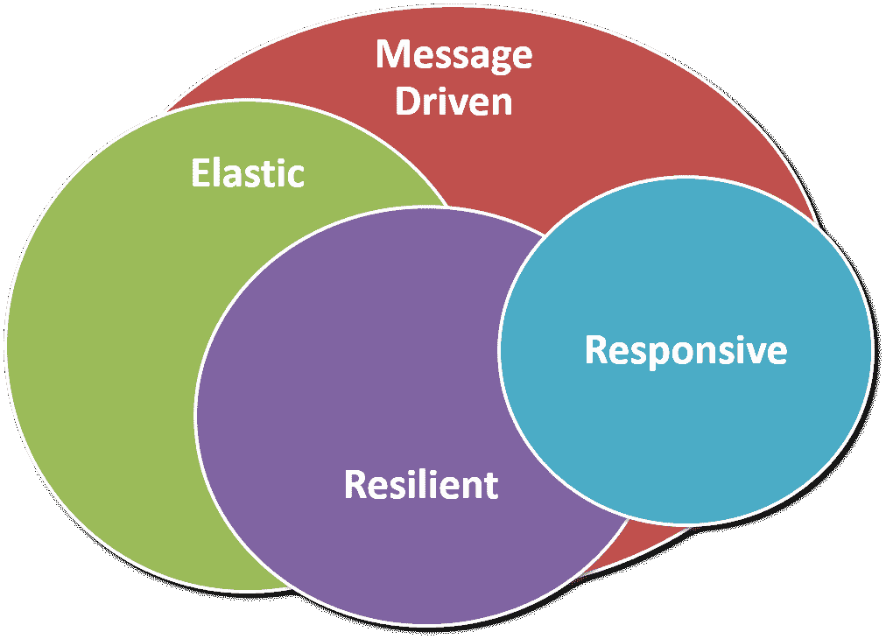

# 反应式微服务

在本章中，我们将使用 springboot、springstream、apachekafka 和 apacheavro 实现反应式微服务。我们将利用现有的 Booking microservice 来实现消息生成器，或者换句话说，生成事件。我们还将创建一个新的微服务（计费），用于消费更新的预订微服务生成的消息，或者我们可以说，用于消费预订微服务生成的事件。我们还将讨论基于 REST 的微服务和基于事件的微服务之间的权衡。

在本章中，我们将介绍以下主题：

*   反应式微服务体系结构概述
*   制造事件
*   消费事件

# 反应式微服务体系结构概述

到目前为止，我们开发的微服务是基于 REST 的。我们将 REST 用于内部（内部微服务，其中一个微服务与同一系统中的另一个微服务通信）和外部（通过公共 API）通信。目前，REST 最适合公共 API。微服务间的通信还有其他选择吗？对于微服务间的通信，这是实现 REST 的最佳方法吗？我们将在本节中讨论所有这些。

您可以构建完全异步的微服务。您可以构建基于微服务的系统，该系统将基于事件进行通信。REST 和基于事件的微服务之间存在权衡。REST 提供同步通信，而反应式微服务基于异步通信（异步消息传递）。

我们可以使用异步通信进行微服务间的通信。根据需求和功能，我们可以选择 REST 或异步消息传递。考虑用户放置订单的示例案例，这为实现反应性微服务提供了非常好的情况。成功下订单后，库存服务将重新计算可用项目；账户服务将维护交易，通信服务将向所有相关用户（如客户和供应商）发送消息（短信、电子邮件等）。在这种情况下，多个微服务可以基于在一个微服务中执行的操作（下单）执行不同的操作（库存、帐户、消息传递等）。现在，想想如果所有这些通信都是同步的。相反，具有异步消息传递的反应式通信提供了硬件资源的有效利用、无阻塞、低延迟和高吞吐量操作。

我们可以将微服务实现主要分为两组：基于 REST 的微服务和基于事件/消息驱动的微服务。反应式微服务是基于事件的。



反应性宣言

反应式微服务基于反应式宣言（[https://www.reactivemanifesto.org/](https://www.reactivemanifesto.org/) ）。反应性宣言包括四项原则，我们现在将讨论这四项原则。

# 反应敏捷的

响应性是及时提供请求的特征。它是通过延迟来衡量的。生产者应及时提供响应，消费者应及时收到响应。为请求执行的操作链中的故障不应导致响应延迟或故障。因此，服务的可用性非常重要。

# 有弹性的

弹性系统是一个稳健的系统。弹性原则与响应原则一致。尽管出现故障，微服务仍应提供响应，如果微服务的一个实例出现故障，则该请求应由同一微服务的另一个节点提供。弹性微服务系统能够处理各种故障。应对所有服务进行监控，以检测故障，并应对所有故障进行处理。在上一章中，我们使用服务发现 eureka 进行监控，并使用 Hystrix 进行断路器模式实施。

# 有弹力的

如果通过优化利用硬件和其他资源对负载作出反应，则反应系统是有弹性的。如果需求增加，它可以提供一个或多个微服务的新实例，反之亦然。在特殊的销售日，如黑色星期五、圣诞节、排灯节等，反应式购物应用程序将实例化更多的微服务节点，以分担增加的请求负载。在正常情况下，购物应用程序可能不需要比平均数更多的资源，因此它可以减少节点的数量。因此，为了有效地使用硬件，反应式系统应该具有弹性。

# 消息驱动

如果无事可做，反应式系统将处于闲置状态；如果它不应该做任何事情，它就不会不必要地使用这些资源。一个事件或一条消息可能会激活一个反应性微服务，然后对接收到的事件/消息（请求）开始工作（反应）。理想情况下，通信本质上应该是异步和无阻塞的。反应式系统使用消息进行通信异步消息传递。在本章中，我们将使用 ApacheKafka 进行消息传递。

理想情况下，反应式编程语言是实现反应式微服务的最佳方式。反应式编程语言提供异步和非阻塞调用。Java 还可以通过使用 Java 流特性来开发反应式微服务。Kafka 将用于 Kafka 的 Java 库和插件的消息传递。我们已经实现了服务发现和注册服务（Eureka Server monitoring）、代理服务器（Zuul）和断路器（弹性和响应性）的 Hystrix。在下一节中，我们将实现消息驱动的微服务。

# 实现反应式微服务

反应式微服务执行响应事件的操作。我们将在代码中进行更改，以生成和使用示例实现的事件。尽管我们将创建一个事件，但一个微服务可以有多个生产者或消费者事件。此外，微服务可以同时具有生产者和消费者事件。我们将利用 Booking microservice 中创建新预订（`POST /v1/booking`的现有功能。这将是我们的事件源，并将使用 ApacheKafka 发送此事件。其他微服务可以通过侦听事件来使用此事件。成功预订电话后，预订微服务将生成卡夫卡主题（活动）`amp.bookingOrdered`。我们将创建一个新的微服务账单（与我们创建其他微服务（如预订）的方式相同），用于消费此活动（`amp.bookingOrdered`。

# 制造事件

一旦发生事件，就会向卡夫卡发送一个对象。类似地，Kafka 会将生成的对象发送给所有侦听器（微服务）。简而言之，生成的对象通过网络传输。因此，我们需要对这些对象的序列化支持。我们将使用 ApacheAvro 进行数据序列化。它以 JSON 格式定义了数据结构（模式），还为 Maven 和 Gradle 提供了一个插件，以使用 JSON 模式生成 Java 类。Avro 与 Kafka 配合得很好，因为 Avro 和 Kafka 都是 Apache 产品，并且在集成方面彼此配合得很好。

让我们从定义模式开始，该模式表示创建新预订时通过网络发送的对象。正如前面为制作活动所分享的，我们将利用现有的预订微服务。我们将在 Booking microservice 的`src/main/resources/avro`目录中创建 Avro 模式文件`bookingOrder.avro`。

`bookingOrder.avro`文件将如下所示：

```java
{"namespace": "com.packtpub.mmj.booking.domain.valueobject.avro", 
 "type": "record", 
 "name": "BookingOrder", 
 "fields": [ 
     {"name": "id", "type": "string"}, 
     {"name": "name", "type": "string", "default": ""}, 
     {"name": "userId", "type": "string", "default": ""}, 
     {"name": "restaurantId", "type": "string", "default": ""}, 
     {"name": "tableId", "type": "string", "default": ""}, 
     {"name": "date", "type": ["null", "string"], "default": null}, 
     {"name": "time", "type": ["null", "string"], "default": null} 
 ] 
}  
```

这里，`namespace`表示包`type`，包`record`表示类，`name`表示类的名称，`fields`表示类的属性。当我们使用这个模式生成 Java 类时，它将在`com.packtpub.mmj.booking.domain.valueobject.avro package`中创建新的 Java 类`BookingOrder.java`，所有属性都在`fields`中定义。

在`fields`中，我们还有`name`和`type`表示属性的名称和类型。对于所有字段，我们使用输入`type`作为`string`。您还可以使用其他基本类型，例如`boolean`、`int`和`double`。此外，您还可以使用复杂类型，例如`record`（在前面的代码片段中使用）、`enum`、`array`和`map`。`default`类型表示属性的默认值。

前面的模式将用于生成 Java 代码。我们将利用`avro-maven-plugin`从前面的 Avro 模式生成 Java 源文件。我们将在子`pom`文件的插件部分添加此插件（服务的`pom.xml`：

```java
<plugin> 
    <groupId>org.apache.avro</groupId> 
    <artifactId>avro-maven-plugin</artifactId> 
    <version>1.8.2</version> 
    <executions> 
        <execution> 
            <phase>generate-sources</phase> 
            <goals> 
                <goal>schema</goal> 
            </goals> 
            <configuration> 
               <sourceDirectory>${project.basedir}/src/main/resources/avro/</sourceDirectory> 
               <outputDirectory>${project.basedir}/src/main/java/</outputDirectory> 
            </configuration> 
        </execution> 
    </executions> 
</plugin> 
```

您可以看到在`configuration`部分配置了`sourceDirectory`和`outputDirectory`。因此，当我们运行`mvn package`时，它会在配置的`outputDirectory`中的`com.packtpub.mmj.booking.domain.valueobject.avro`包中创建`BookingOrder.java`文件。

现在我们可以使用 Avro 模式和生成的 Java 源代码，我们将添加生成事件所需的 Maven 依赖项。

在 Booking microservice`pom.xml`文件中添加依赖项：

```java
... 
<dependency> 
    <groupId>org.apache.avro</groupId> 
    <artifactId>avro</artifactId> 
    <version>1.8.2</version> 
</dependency> 
<dependency> 
    <groupId>org.springframework.cloud</groupId> 
    <artifactId>spring-cloud-stream</artifactId> 
    <version>2.0.0.M1</version> 
</dependency> 
<dependency> 
    <groupId>org.springframework.cloud</groupId> 
    <artifactId>spring-cloud-starter-stream-kafka</artifactId> 
</dependency> 
<dependency> 
    <groupId>org.apache.kafka</groupId> 
    <artifactId>kafka-clients</artifactId> 
    <version>0.11.0.1</version> 
</dependency> 
<dependency> 
    <groupId>org.springframework.cloud</groupId> 
    <artifactId>spring-cloud-stream-schema</artifactId> 
</dependency> 
... 
```

在这里，我们添加了三个主要依赖项：`avro`、`spring-cloud-stream`和`kafka-clients`。此外，我们还添加了与 Kafka（`spring-cloud-starter-stream-kafka`和流支持模式（`spring-cloud-stream-schema`）的流集成。

现在，由于我们的依赖关系已经就绪，我们可以开始编写生产者实现了。预订微服务会将`amp.bookingOrdered`事件发送到卡夫卡流。我们将为此目的声明该频道。可以使用带有`@InboundChannelAdapter`注释的`Source.OUTPUT`或通过声明 Java 接口来完成。我们将使用接口方法，因为它更容易理解和关联。

我们将在`com.packtpub.mmj.booking.domain.service.message`包中创建`BookingMessageChannels.java`消息通道。在这里，我们可以添加所需的所有消息通道。因为我们使用单个事件进行示例实现，所以我们只需声明`bookingOrderOutput`。

`BookingMessageChannels.java`文件将如下所示：

```java
package com.packtpub.mmj.booking.domain.message; 

import org.springframework.cloud.stream.annotation.Output; 
import org.springframework.messaging.MessageChannel; 

public interface BookingMessageChannels { 

    public final static String BOOKING_ORDER_OUTPUT = "bookingOrderOutput"; 

    @Output(BOOKING_ORDER_OUTPUT) 
    MessageChannel bookingOrderOutput(); 
} 
```

在这里，我们刚刚使用`@Output annotation`定义了消息通道的名称`bookingOrderOutput`。我们还需要在`application.yaml`中配置此消息通道。我们将使用此名称在`application.yaml`文件中定义卡夫卡主题：

```java
spring: 
  cloud: 
    stream: 
        bindings: 
            bookingOrderOutput: 
                destination: amp.bookingOrdered 
```

这里给出了绑定到`bookingOrderOutput`消息通道的卡夫卡主题名`amp.bookingOrdered`。（卡夫卡主题名称可以是任何字符串，我们使用前缀`amp`表示异步消息传递，可以使用带前缀或不带前缀的卡夫卡主题名称。）

我们还需要一个消息转换器，将`BookingOrder`对象发送到卡夫卡。为此，我们将创建一个`@Bean`注释，该注释将在 Booking service 主类中返回 Spring`MessageConverter`。

`BookingApp.class`文件中的`@Bean`注释如下：

```java
... 
@Bean 
public MessageConverter bookingOrderMessageConverter() throws IOException { 
    LOG.info("avro message converter bean initialized."); 
    AvroSchemaMessageConverter avroSchemaMessageConverter = new AvroSchemaMessageConverter(MimeType.valueOf("application/bookingOrder.v1+avro")); 
    avroSchemaMessageConverter.setSchemaLocation(new ClassPathResource("avro/bookingOrder.avsc")); 
    return avroSchemaMessageConverter; 
} 
... 
```

您可以根据各个模式所需的模式添加更多 bean。我们尚未在`application.yaml`中配置 Kafka 服务器，该服务器设置为`localhost`。让我们做吧。

在`application.yaml`文件中配置 Kafka 服务器：

```java
spring: 
  cloud: 
    stream: 
        kafka: 
            binder: 
                zkNodes: localhost 
            binder: 
                brokers: localhost 
```

在这里，我们为`zkNodes`和`brokers`都配置了`localhost`；您可以将其更改为卡夫卡的宿主。

我们已经准备好将`amp.bookingOrdered`卡夫卡主题发送到卡夫卡服务器。为简单起见，我们将直接在`BookingServiceImpl.java`类中添加一个以`Booking`类为参数的`produceBookingOrderEvent`方法（您需要在`BookingService.java`中添加相同的方法签名）。让我们先看看代码。

`BookingServiceImpl.java`文件如下：

```java
... 
@EnableBinding(BookingMessageChannels.class) 
public class BookingServiceImpl extends BaseService<Booking, String> 
        implements BookingService { 
... 
... 
private BookingMessageChannels bookingMessageChannels; 

@Autowired 
public void setBookingMessageChannels(BookingMessageChannels bookingMessageChannels) { 
    this.bookingMessageChannels = bookingMessageChannels; 
} 

@Override 
public void add(Booking booking) throws Exception { 
    ... 
    ... 
    super.add(booking); 
    produceBookingOrderEvent(booking); 
} 
... 
...     
@Override 
public void produceBookingOrderEvent(Booking booking) throws Exception { 
    final BookingOrder.Builder boBuilder = BookingOrder.newBuilder(); 
    boBuilder.setId(booking.getId()); 
    boBuilder.setName(booking.getName()); 
    boBuilder.setRestaurantId(booking.getRestaurantId()); 
    boBuilder.setTableId(booking.getTableId()); 
    boBuilder.setUserId(booking.getUserId()); 
    boBuilder.setDate(booking.getDate().toString()); 
    boBuilder.setTime(booking.getTime().toString()); 
    BookingOrder bo = boBuilder.build(); 
    final Message<BookingOrder> message = MessageBuilder.withPayload(bo).build(); 
    bookingMessageChannels.bookingOrderOutput().send(message); 
    LOG.info("sending bookingOrder: {}", booking); 
} 
... 
```

这里，我们声明了使用`setter`方法自动连接的`bookingMessageChannel`对象。Spring 云流注释`@EnableBinding`绑定`BookingMessageChannels`类中声明的`bookingOrderOutput`消息通道。

增加了`produceBookingOrderEvent`方法，取`booking`对象。在`produceBookingOrderEvent`方法中，使用`booking`对象设置`BookingOrder`对象属性。然后使用`bookingOrder`对象构建消息。最后，使用`bookingMessageChannels`将消息发送给卡夫卡。

预订成功持久化到 DB 后调用`produceBookingOrderEvent`方法。

要测试此功能，可以使用以下命令运行 Booking microservice：

```java
java -jar booking-service/target/booking-service.jar
```

确保 Kafka 和 Zookeeper 应用程序在`application.yaml`文件中定义的主机和端口上正常运行，以便成功执行测试。

然后，通过具有以下有效负载的任何 REST 客户端发出预订的 post 请求（`http://<host>:<port>/v1/booking`）：

```java
{ 
                "id": "999999999999",  
                "name": "Test Booking 888",  
                "userId": "3",  
                "restaurantId": "1",  
                "tableId": "1",  
                "date": "2017-10-02",  
                "time": "20:20:20.963543300" 
} 

```

它将产生`amp.bookingOrdered`卡夫卡主题（事件），如预订微服务控制台上发布的以下日志所示：

```java
2017-10-02 20:22:17.538  INFO 4940 --- [nio-7052-exec-1] c.p.m.b.d.service.BookingServiceImpl     : sending bookingOrder: {id: 999999999999, name: Test Booking 888, userId: 3, restaurantId: 1, tableId: 1, date: 2017-10-02, time: 20:20:20.963543300} 
```

类似地，卡夫卡控制台将显示以下消息，确认卡夫卡已成功接收该消息：

```java
[2017-10-02 20:22:17,646] INFO Updated PartitionLeaderEpoch. New: {epoch:0, offset:0}, Current: {epoch:-1, offset-1} for Partition: amp.bookingOrdered-0\. Cache now contains 0 entries. (kafka.server.epoch.LeaderEpochFileCache) 

```

现在，我们可以对先前生成的事件的使用者进行编码。

# 消费事件

首先，我们将在父`pom.xml`文件中添加新模块`billing-service`，并按照[第 5 章](05.html)、*部署和测试*中创建其他微服务的方式创建计费微服务。我们为预订微服务编写的大多数反应式代码将被重新用于计费微服务，例如 Avro 模式和`pom.xml`条目。

我们将在 Billing microservice 中添加 Avro 模式，就像在 Booking microservice 中添加 Avro 模式一样。由于模式名称空间（包名称）将与 Billing microservice 中的`booking`包相同，我们需要在`BillingApp.java`中的`@SpringBootApplication`注释的`scanBasePackages`属性中添加`com.packtpub.mmj.booking`值。它还允许 spring 上下文扫描预订包。

我们将在 Billing microservice`pom.xml`中添加以下依赖项，这与我们在 Booking microservice 中添加的依赖项相同。

计费微服务的`pom.xml`文件如下：

```java
... 
... 
<dependency> 
    <groupId>org.apache.avro</groupId> 
    <artifactId>avro</artifactId> 
    <version>1.8.2</version> 
</dependency> 
<dependency> 
    <groupId>org.springframework.cloud</groupId> 
    <artifactId>spring-cloud-stream</artifactId> 
    <version>2.0.0.M1</version> 
</dependency> 
<dependency> 
    <groupId>org.springframework.cloud</groupId> 
    <artifactId>spring-cloud-starter-stream-kafka</artifactId> 
</dependency> 
<dependency> 
    <groupId>org.apache.kafka</groupId> 
    <artifactId>kafka-clients</artifactId> 
    <version>0.11.0.1</version> 
</dependency> 
<dependency> 
    <groupId>org.springframework.cloud</groupId> 
    <artifactId>spring-cloud-stream-schema</artifactId> 
</dependency> 
... 
... 
```

有关添加这些依赖项的原因，请参阅“预订服务依赖项”一段。

接下来，我们将在 Billing microservice 中添加消息通道，如下所示：

```java
package com.packtpub.mmj.billing.domain.message; 

import org.springframework.cloud.stream.annotation.Input; 
import org.springframework.messaging.MessageChannel; 

public interface BillingMessageChannels { 

    public final static String BOOKING_ORDER_INPUT = "bookingOrderInput"; 

    @Input(BOOKING_ORDER_INPUT) 
    MessageChannel bookingOrderInput(); 
} 
```

在这里，我们在预订服务中添加了与消息通道相对的输入消息通道，在那里我们添加了输出消息通道。注意，`bookingOrderInput`是一个带有`@input`注释的输入消息通道。

接下来，我们要配置卡夫卡主题`amp.BookingOrdered`的`bookingOrderInput`频道。为此，我们将修改`application.yaml`：

```java
 spring: 
  ... 
  ... 
  cloud: 
    stream: 
        bindings: 
            bookingOrderInput: 
                destination: amp.bookingOrdered 
                consumer: 
                    resetOffsets: true 
                group: 
                    ${bookingConsumerGroup} 
bookingConsumerGroup: "booking-service" 
```

这里，卡夫卡主题使用 destination 属性添加到`bookingOrderInput`频道。我们还将按照我们在预订微服务中配置卡夫卡的方式，在计费微服务（`application.yaml`中配置卡夫卡：

```java
        kafka: 
            binder:                
                zkNodes: localhost 
            binder: 
                brokers: localhost 
```

现在，我们将添加事件监听器，该监听器将使用 SpringCloudSteam 库中可用的`@StreamListener`注释侦听绑定到`bookingOrderInput`消息通道的流。

`EventListener.java`文件如下：

```java
package com.packtpub.mmj.billing.domain.message; 

import com.packtpub.mmj.billing.domain.service.TweetMapper; 
import com.packtpub.mmj.billing.domain.service.TweetReceiver; 
import com.packtpub.mmj.billing.domain.service.WebSocketTweetReceiver; 
import com.packtpub.mmj.billing.domain.valueobject.TweetInput; 
import com.packtpub.mmj.booking.domain.valueobject.avro.BookingOrder; 
import com.packtpub.mmj.booking.domain.valueobject.avro.TweetDto; 
import org.slf4j.Logger; 
import org.slf4j.LoggerFactory; 
import org.springframework.beans.factory.annotation.Autowired; 
import org.springframework.cloud.stream.annotation.StreamListener; 

public class EventListener { 

    private static final Logger LOG = LoggerFactory.getLogger(WebSocketTweetReceiver.class); 

    @StreamListener(BillingMessageChannels.BOOKING_ORDER_INPUT) 
    public void consumeBookingOrder(BookingOrder bookingOrder) { 
        LOG.info("Received BookingOrder: {}", bookingOrder); 
    } 
} 
```

在这里，您还可以添加其他事件侦听器。例如，我们只需记录接收到的对象。您可以根据需要添加附加功能；如果需要，您甚至可以再次生成新事件以进行进一步处理。例如，您可以通过管理餐厅通信的服务向请求新预订的餐厅制作活动，等等。

最后，我们可以使用 Spring 云流库的`@EnableBinding`注释启用`bookingOrderInput`消息通道到流的绑定，并创建`BillingApp.java`中创建的`EventListener`类的 bean`billing-service`模块的主类】，如下所示：

`BillingApp.java`将看起来像这样：

```java
@SpringBootApplication(scanBasePackages = {"com.packtpub.mmj.billing", "com.packtpub.mmj.booking"}) 
@EnableBinding({BillingMessageChannels.class}) 
public class BillingApp { 

    public static void main(String[] args) { 
        SpringApplication.run(BillingApp.class, args); 
    } 

    @Bean 
    public EventListener eventListener() { 
        return new EventListener(); 
    } 
} 
```

现在，您可以启动计费微服务并拨打新的`POST/v1/booking`REST 电话。您可以在 Billing microservice 日志中找到收到的对象，如下所示：

```java
2017-10-02 20:22:17.728  INFO 6748 --- [           -C-1] c.p.m.b.d.s.WebSocketTweetReceiver       : Received BookingOrder: {"id": "999999999999", "name": "Test Booking 888", "userId": "3", "restaurantId": "1", "tableId": "1", "date": "2017-10-02", "time": "20:20:20.963543300"} 

```

# 工具书类

以下链接将为您提供更多信息：

*   **阿帕奇·卡夫卡**：[https://kafka.apache.org/](https://kafka.apache.org/)
*   **阿帕奇 Avro**：[https://avro.apache.org/](https://avro.apache.org/)
*   **Avro 规格**：[https://avro.apache.org/docs/current/spec.html](https://avro.apache.org/docs/current/spec.html)
*   **春云流**：[https://cloud.spring.io/spring-cloud-stream/](https://cloud.spring.io/spring-cloud-stream/)

# 总结

在本章中，您学习了反应式微服务或基于事件的微服务。这些服务处理消息/事件，而不是 HTTP 上的 REST 调用。它们在服务之间提供异步通信，从而提供非阻塞通信，并允许更好地使用资源和故障处理。

我们使用 ApacheAvro 和 ApacheKafka 以及 Spring 云流库来实现反应式微服务。我们已经在现有的`booking-service`模块中添加了代码，用于生成卡夫卡主题下的`amp.bookingOrdered`消息，并添加了新的模块`billing-service`用于消费相同的事件。

您可能希望为生产者和消费者添加新事件。您可以为一个事件添加多个使用者，也可以创建一系列事件作为练习。

在下一章中，您将学习如何在身份验证和授权方面保护微服务。我们还将探讨微服务证券的其他方面。