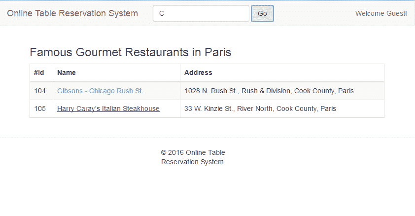
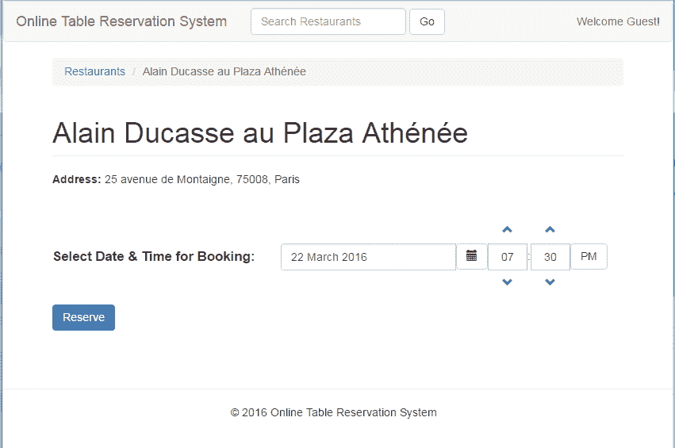
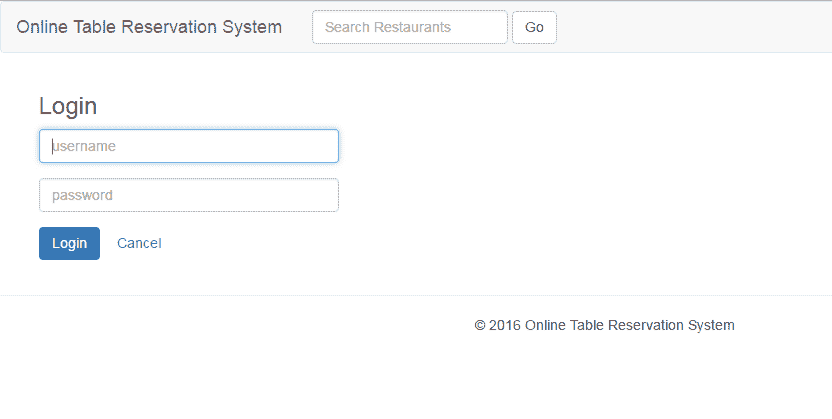
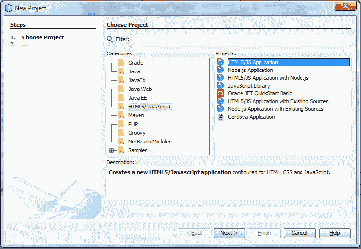
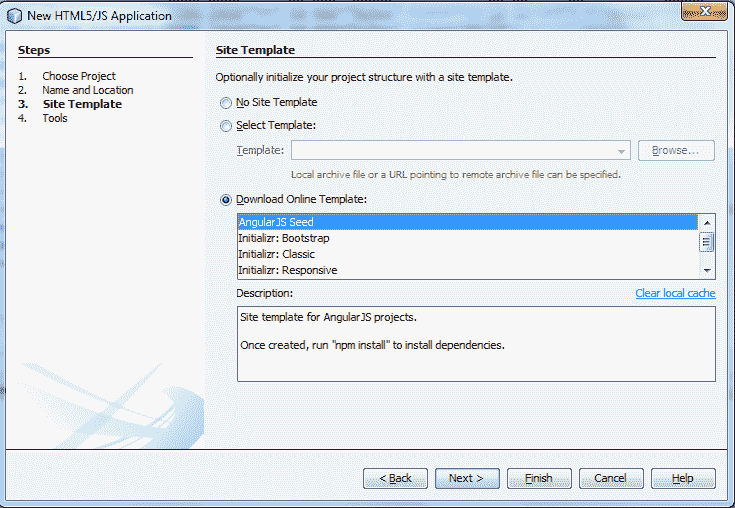
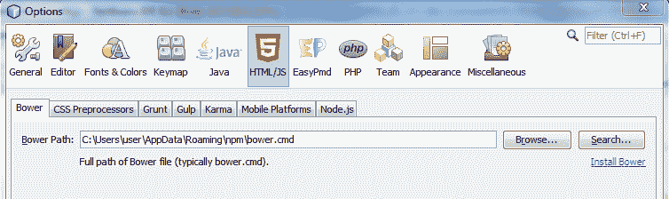
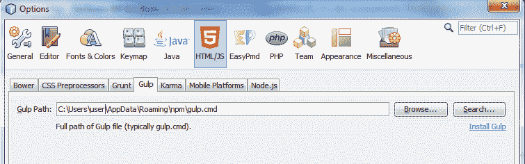
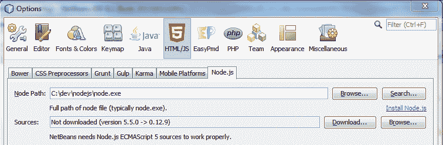

# 使用 Microservice Web 应用程序消费服务

现在，在开发了这些微服务之后，我们很有兴趣了解一下**在线餐桌预订系统**（**OTRS**）提供的服务如何被 web 或移动应用程序使用。我们将使用 AngularJS/Bootstrap 开发 web 应用程序（UI），以构建 web 应用程序的原型。此示例应用程序将显示此示例项目（一个小型公用事业项目）的数据和流程。此 web 应用程序也是一个示例项目，将独立运行。早些时候，web 应用程序是在包含 UI 和服务器端代码的单一 web 存档（扩展名为`.war`的文件）中开发的。这样做的原因很简单，因为 UI 也是使用 Java 与 JSP、servlet、JSF 等一起开发的。如今，UI 正在使用 JavaScript 独立开发。因此，这些 UI 应用程序也作为单个微服务部署。在本章中，我们将探讨如何开发这些独立的 UI 应用程序。我们将开发和实现 OTRS 示例应用程序，无需登录和授权流程。我们将部署一个非常有限的功能实现，并涵盖高级 AngularJS 概念。关于 AngularJS 的更多信息，您可以参考*AngularJS 示例*、*Chandermani*、*Packt Publishing*。

在本章中，我们将介绍以下主题：

*   AngularJS 框架概述
*   OTRS 特性的发展
*   设置 web 应用程序（UI）

# AngularJS 框架概述

现在，既然我们已经准备好 HTML5Web 应用程序设置，我们就可以学习 AngularJS 的基础知识了。这将帮助我们理解 AngularJS 代码。本节描述了您可以通过使用 AngularJS 文档或参考其他 Packt 发布资源来理解示例应用程序和进一步探索的高级理解。

AngularJS 是一个客户端 JavaScript 框架。它足够灵活，可以用作**模型视图控制器**（**MVC**）或**模型视图控制器**（**MVVM】**。它还使用依赖注入模式提供内置服务，如`$http`或`$log`。

# MVC

MVC 是一种著名的设计模式。Struts 和 SpringMVC 是流行的例子。让我们看看它们如何适应 JavaScript 世界：

*   **模型**：模型是包含应用数据的 JavaScript 对象。它们还表示应用程序的状态。
*   **视图**：视图是由 HTML 文件组成的表示层。在这里，您可以显示模型中的数据，并向用户提供交互界面。
*   **控制器**：可以用 JavaScript 定义控制器，它包含应用逻辑。

# MVVM

MVVM 是一种专门针对 UI 开发的架构设计模式。MVVM 旨在简化双向数据绑定。双向数据绑定提供了模型和视图之间的同步。当模型（数据）更改时，它会立即反映在视图上。类似地，当用户更改视图上的数据时，它会反映在模型上：

*   **模型**：与 MVC 非常相似，包含业务逻辑和数据。
*   **视图**：与 MVC 一样，包含表示逻辑或用户界面。
*   **视图模型**：视图模型包含视图与模型之间的数据绑定。因此，它是视图和模型之间的接口。

# 模块

模块是我们为任何 AngularJS 应用程序定义的第一件事。模块是包含应用程序不同部分的容器，如控制器、服务、过滤器等。AngularJS 应用程序可以在单个模块或多个模块中编写。AngularJS 模块还可以包含其他模块。

许多其他 JavaScript 框架使用`main`方法来实例化和连接应用程序的不同部分。AngularJS 没有`main`方法。由于以下原因，它将模块用作入口点：

*   **模块化**：您可以按功能划分和创建应用程序，也可以使用可重用组件。
*   **简单性**：您可能会遇到复杂而庞大的应用程序代码，这使得维护和增强成为一个难题。没有更多：AngularJS 使代码简单易懂。
*   **测试**：它使单元测试和端到端测试更容易，因为您可以覆盖配置，只加载所需的模块。

每个 AngularJS 应用程序都需要一个模块来引导 AngularJS 应用程序。引导我们的应用程序需要以下三个部分：

*   **应用模块**：包含 AngularJS 模块的 JavaScript 文件（`app.js`），如图所示：

```java
var otrsApp = AngularJS.module('otrsApp', [ ]) 
// [] contains the reference to other modules 
```

*   **加载 Angular 库及应用模块**：一个`index.html`文件，包含对 JavaScript 文件与其他 AngularJS 库的引用：

```java
<script type="text/javascript" src="bower_components/angular/angular.min.js"></script> 
<script type="text/javascript" src="scripts/app.js"></script>
```

*   **应用程序 DOM 配置**：这告诉 DOM 元素的 AngularJS 位置，应该在该位置进行引导。可以通过以下两种方式之一进行：

1.  一个`index.html`文件，其中还包含一个 HTML 元素（通常为`<html>`），该元素的`ng-app`（AngularJS 指令）属性具有`app.js`中给定的值。AngularJS 指令的前缀为`ng`（AngularJS）：`<html lang="en" ng-app="otrsApp" class="no-js">`。
2.  或者，如果异步加载 JavaScript 文件，请使用此命令：`AngularJS.bootstrap(document.documentElement, ['otrsApp']);`。

AngularJS 模块除了控制器、服务、过滤器等其他组件外，还有两个重要部分`config()`和`run()`：

*   `config()`用于注册和配置模块，它只接受使用`$injector`的提供者和常量。`$injector`是 AngularJS 服务。我们将在下一节介绍提供商和`$injector`。不能在此处使用实例。它阻止在完全配置服务之前使用服务。
*   `run()`用于在使用前面的`config()`方法创建`$injector`后执行代码。这仅适用于实例和常量。您不能在此处使用提供程序来避免在运行时进行配置。

# 供应商和服务

让我们看看下面的代码：

```java
.controller('otrsAppCtrl', function ($injector) { 
var log = $injector.get('$log'); 
```

`$log`是内置的 AngularJS 服务，提供日志 API。这里，我们正在使用另一个内置服务`$injector`，它允许我们使用`$log`服务。`$injector`是控制器中的一个参数。AngularJS 使用函数定义和正则表达式向调用方（也称为控制器）提供`$injector`服务。以下是 AngularJS 如何有效使用依赖注入模式的示例。

AngularJS 大量使用依赖注入模式，使用注入服务（`$injector`来实例化和连接我们在 AngularJS 应用程序中使用的大多数对象。此注入器创建两种类型的对象服务和专用对象。

为了简化，您可以说我们（开发人员）定义了服务。相反，专用对象是 AngularJS 项，如控制器、过滤器、指令等。

AngularJS 提供了五种配方类型，告诉注射器如何创建服务对象——**提供者**、**值**、**工厂**、**服务**和**常量**。

*   提供者是最核心和最复杂的配方类型。其他的食谱是在上面放合成糖。我们通常避免使用提供者，除非我们需要创建需要全局配置的可重用代码。
*   值和常量配方类型的工作方式与其名称相同。它们都不能有依赖关系。此外，它们之间的区别在于它们的用法。您不能在配置阶段使用值服务对象。
*   工厂和服务是最常用的服务类型。它们属于类似的类型。当我们想要生成 JavaScript 原语和函数时，我们使用工厂配方。另一方面，当我们想要生成自定义定义的类型时，就会使用该服务。

现在我们对服务有了一些了解，可以说服务有两种常见用途：组织代码和跨应用程序共享代码。服务是单例对象，由 AngularJS 服务工厂延迟实例化。我们已经看到了一些内置的 AngularJS 服务，比如`$injector`、`$log`等等。AngularJS 服务的前缀为`$`符号。

# 范围

在 AngularJS 应用程序中，广泛使用两种类型的示波器-`$rootScope`和`$scope`：

*   `$rootScope`是作用域层次结构中最顶层的对象，具有与其关联的全局作用域。这意味着您附加到它的任何变量都将在任何地方都可用，因此，`$rootScope`的使用应该是一个经过仔细考虑的决定。
*   控制器将`$scope`作为回调函数中的参数。它用于将数据从控制器绑定到视图。其范围仅限于与其关联的控制器的使用。

# 控制器

JavaScript`constructor`函数将控制器定义为具有`$scope`作为参数。控制器的主要目的是将数据绑定到视图。控制器功能还用于编写业务逻辑，设置`$scope`对象的初始状态，并将行为添加到`$scope`。控制器签名如下所示：

```java
RestModule.controller('RestaurantsCtrl', function ($scope, restaurantService) { 
```

这里，控制器是`RestModule`的一部分，控制器的名称是`RestaurantCtrl`，并且`$scope`和`restaurantService`作为参数传递。

# 过滤器

过滤器的目的是格式化给定表达式的值。在下面的代码中，我们定义了以日期为参数的`datetime1`过滤器，并将值更改为`dd MMM yyyy HH:mm`格式，例如 2016 年 4 月 4 日 04:13 PM：

```java
.filter('datetime1', function ($filter) { 
    return function (argDateTime) { 
        if (argDateTime) { 
            return $filter('date')(new Date(argDateTime), 'dd MMM yyyy HH:mm a'); 
        } 
        return ""; 
    }; 
});
```

# 指令

正如我们在*模块*部分中看到的，AngularJS 指令是带有`ng`前缀的 HTML 属性。一些流行的指令包括：

*   `ng-app`：本指令定义了 AngularJS 应用程序
*   `ng-model`：此指令将 HTML 表单输入绑定到数据
*   `ng-bind`：此指令将数据绑定到 HTML 视图
*   `ng-submit`：本指令提交 HTML 表单
*   `ng-repeat`：此指令迭代集合：

```java
<div ng-app=""> 
    <p>Search: <input type="text" ng-model="searchValue"></p> 
    <p ng-bind="searchedTerm"></p> 
</div>
```

# 用户界面路由器

在**单页应用**（**SPAs**中），页面只加载一次，用户通过不同的链接导航，没有页面刷新。这一切都是可能的，因为路由。路由是一种让 SPA 导航感觉像普通站点的方法。因此，路由对于 SPA 非常重要。

AngularUI 团队构建了 UI 路由器，一个 AngularJS 路由框架。UI 路由器不是核心 AngularJS 的一部分。UI 路由器不仅更改路由 URL，而且在用户单击 SPA 中的任何链接时还更改应用程序的状态。因为 UI 路由器也可以进行状态更改，所以您可以在不更改 URL 的情况下更改页面的视图。这是可能的，因为 UI 路由器管理应用程序状态。

如果我们将 SPA 视为状态机，那么状态是应用程序的当前状态。创建路由链接时，我们将在 HTML 链接标记中使用`ui-sref`属性。链接中的`href`属性将由此生成，并指向在`app.js`中创建的应用程序的某些状态。

我们使用 HTML`div`中的`ui-view`属性来使用 UI 路由器。例如，
`<div ui-view></div>`。

# OTRS 特性的发展

如你所知，我们正在开发水疗中心。因此，一旦应用程序加载，您就可以在不刷新页面的情况下执行所有操作。与服务器的所有交互都使用 AJAX 调用执行。现在，我们将使用第一节中介绍的 AngularJS 概念。我们将介绍以下场景：

*   将显示餐厅列表的页面。这也将是我们的主页。
*   搜索餐馆。
*   餐厅详细信息和预订选项。
*   登录（不是从服务器登录，而是用于显示流）。
*   预订确认。

对于主页，我们将创建一个{ To.t0}文件和一个模板，该模板将包含中间部分或内容区域中的餐馆列表。

# 主页/餐厅列表页

主页是任何 web 应用程序的主页。为了设计主页，我们将使用 Angular UI 引导，而不是实际的引导。Angular UI 是引导的 Angular 版本。主页将分为三个部分：

*   标题部分将在右上角包含应用程序名称、搜索表单和用户名。
*   内容或中间部分将包含餐厅列表，其中餐厅名称作为链接。此链接将指向餐厅详细信息和预订页面。
*   页脚部分将包含带有版权标记的应用程序名称。

在设计或实现主页之前，您必须对查看主页感兴趣。因此，让我们先看看内容准备就绪后的效果：


OTRS 主页，包含餐厅列表

现在，要设计我们的主页，我们需要添加以下四个文件：

*   `index.html`：我们的主 HTML 文件
*   `app.js`：我们主要的 AngularJS 模块
*   `restaurants.js`：餐厅模块，也包含餐厅服务
*   `restaurants.html`：显示餐厅
    列表的 HTML 模板

# index.html

首先，我们将把`./app/index.html`添加到我们的项目工作区。`index.html`文件的内容如下所述。

我在代码之间添加了注释，以使代码更可读、更容易理解。

`index.html`文件分为许多部分。我们将在这里讨论几个关键部分。首先，我们将了解如何处理旧版本的 Internet Explorer。如果您想针对大于 8 的 Internet Explorer 浏览器版本或 IE 版本 9 以后的版本，那么我们需要添加以下代码块，以防止 JavaScript 呈现，并向最终用户提供`no-js`输出：

```java
<!--[if lt IE 7]>      <html lang="en" ng-app="otrsApp" class="no-js lt-ie9 lt-ie8 lt-ie7"> <![endif]--> 
<!--[if IE 7]>         <html lang="en" ng-app="otrsApp" class="no-js lt-ie9 lt-ie8"> <![endif]--> 
<!--[if IE 8]>         <html lang="en" ng-app="otrsApp" class="no-js lt-ie9"> <![endif]--> 
<!--[if gt IE 8]><!--> <html lang="en" ng-app="otrsApp" class="no-js"> <!--<![endif]--> 
```

然后，在添加几个`meta`标记和应用程序的标题之后，我们还将定义重要的`meta`标记`viewport`。`viewport`用于响应用户界面设计。

内容属性中定义的`width`属性控制`viewport`的大小。它可以设置为特定数量的像素，例如`width = 600`，或者设置为特殊的`device-width`值，即屏幕宽度（以 CSS 像素为单位），比例为 100%。

`initial-scale`属性控制首次加载页面时的缩放级别。“最大比例”、“最小比例”和“用户可缩放”属性控制允许用户放大或缩小页面的方式：

```java
<meta name="viewport" content="width=device-width, initial-scale=1"> 
```

在接下来的几行中，我们将定义应用程序的样式表。我们从 HTML5 样板代码中添加了`normalize.css`和`main.css`。我们还添加了应用程序的客户 CSS`app.css`。最后，我们添加了 bootstrap3css。除了客户`app.css`之外，它还引用了其他 CSS。这些 CSS 文件中没有任何更改：

```java
<link rel="stylesheet" href="bower_components/html5-boilerplate/dist/css/normalize.css"> 
<link rel="stylesheet" href="bower_components/html5-boilerplate/dist/css/main.css"> 
<link rel="stylesheet" href="public/css/app.css"> 
<link data-require="bootstrap-css@*" data-server="3.0.0" rel="stylesheet" href="//netdna.bootstrapcdn.com/bootstrap/3.0.0/css/bootstrap.min.css" /> 
```

然后，我们将使用`script`标记定义脚本。我们正在添加 modernizer、Angular、Angular route 和`app.js`，这是我们自己开发的定制 JavaScript 文件。
我们已经讨论了角度和角度 UI。`app.js`将在下一节
中讨论。

modernizer 允许 web 开发人员使用新的 CSS3 和 HTML5 功能，同时对不支持它们的浏览器保持良好的控制水平。基本上，modernizer 在浏览器中加载页面并报告结果时执行下一代功能检测（检查这些功能的可用性）。根据这些结果，您可以检测浏览器中可用的最新功能，并在此基础上为最终用户提供一个界面。如果浏览器不支持其中一些功能，则会向最终用户提供备用流或 UI。

我们还使用`ui-bootstrap-tpls javascript`文件添加了用 JavaScript 编写的引导模板：

```java
<script src="bower_components/html5-boilerplate/dist/js/vendor/modernizr-2.8.3.min.js"></script> 
<script src="bower_components/angular/angular.min.js"></script> 
<script src="bower_components/angular-route/angular-route.min.js"></script> 
<script src="app.js"></script> 
<script data-require="ui-bootstrap@0.5.0" data-semver="0.5.0" src="http://angular-ui.github.io/bootstrap/ui-bootstrap-tpls-0.6.0.js"></script> 
```

我们还可以向`head`标记添加样式，如下面的代码所示。此样式允许使用下拉菜单：

```java
<style> 
    div.navbar-collapse.collapse { 
      display: block; 
      overflow: hidden; 
      max-height: 0px; 
      -webkit-transition: max-height .3s ease; 
      -moz-transition: max-height .3s ease; 
      -o-transition: max-height .3s ease; 
      transition: max-height .3s ease; 
      } 
    div.navbar-collapse.collapse.in { 
      max-height: 2000px; 
      } 
</style> 
```

在`body`标记中，我们使用
`ng-controller`属性定义应用程序的控制器。页面加载时，它会将应用程序的名称告知控制器，如下所示：

```java
<body ng-controller="otrsAppCtrl"> 
```

然后，我们定义主页的`header`部分。在`header`部分，我们将定义应用程序标题`Online Table Reservation System`。此外，我们还将定义搜索餐厅的搜索表单：

```java
<!-- BEGIN HEADER --> 
        <nav class="navbar navbar-default" role="navigation"> 

            <div class="navbar-header"> 
                <a class="navbar-brand" href="#"> 
                    Online Table Reservation System 
                </a> 
            </div> 
            <div class="collapse navbar-collapse" ng-class="!navCollapsed && 'in'" ng-click="navCollapsed = true"> 
                <form class="navbar-form navbar-left" role="search" ng-submit="search()"> 
                    <div class="form-group"> 
                        <input type="text" id="searchedValue" ng-model="searchedValue" class="form-control" placeholder="Search Restaurants"> 
                    </div> 
                    <button type="submit" class="btn btn-default" ng-click="">Go</button> 
                </form> 
        <!-- END HEADER --> 
```

然后，下一部分，中间部分，包括我们实际绑定不同视图的地方，用实际的内容注释进行标记。`div`中的`ui-view`属性从角度动态获取其内容，如餐厅详细信息、餐厅列表等。我们还在中间部分添加了警告对话框和微调器，在需要时可以看到：

```java
<div class="clearfix"></div> 
    <!-- BEGIN CONTAINER --> 
    <div class="page-container container"> 
        <!-- BEGIN CONTENT --> 
        <div class="page-content-wrapper"> 
            <div class="page-content"> 
                <!-- BEGIN ACTUAL CONTENT --> 
                <div ui-view class="fade-in-up"></div> 
                <!-- END ACTUAL CONTENT --> 
            </div> 
        </div> 
        <!-- END CONTENT --> 
    </div> 
    <!-- loading spinner --> 
    <div id="loadingSpinnerId" ng-show="isSpinnerShown()" style="top:0; left:45%; position:absolute; z-index:999"> 
        <script type="text/ng-template" id="alert.html"> 
            <div class="alert alert-warning" role="alert"> 
            <div ng-transclude></div> 
            </div> 
        </script> 
        <uib-alert type="warning" template-url="alert.html"><b>Loading...</b></uib-alert> 
    </div> 
        <!-- END CONTAINER --> 
```

`index.html`的最后一部分是页脚。在这里，我们只是添加静态内容和版权文本。您可以在此处添加任何需要的内容：

```java
        <!-- BEGIN FOOTER --> 
        <div class="page-footer"> 
            <hr/><div style="padding: 0 39%">&copy; 2016 Online Table Reservation System</div> 
        </div> 
        <!-- END FOOTER --> 
    </body> 
</html> 
```

# app.js

`app.js`是我们的主要申请文件。因为我们已经在`index.html`中定义了它，
一旦调用我们的`index.html`就会加载它。

我们需要注意不要将路由（URI）与 REST 端点混合使用。路线代表 SPA 的状态/视图。

我们将使用 REST 服务器（包括边缘服务器）访问所有内容。包括 UI 在内的外部应用程序将使用边缘服务器主机访问应用程序。您可以在全局常量文件中配置它，然后在需要时使用它。这将允许您在单个位置配置 REST 主机，并在其他位置使用它：

```java
'use strict'; 
/* 
This call initializes our application and registers all the modules, which are passed as an array in the second argument. 
*/ 
var otrsApp = angular.module('otrsApp', [ 
    'ui.router', 
    'templates', 
    'ui.bootstrap', 
    'ngStorage', 
    'otrsApp.httperror', 
    'otrsApp.login', 
    'otrsApp.restaurants' 
]) 
/* 
  Then we have defined the default route /restaurants 
*/ 
        .config([ 
            '$stateProvider', '$urlRouterProvider', 
            function ($stateProvider, $urlRouterProvider) { 
                $urlRouterProvider.otherwise('/restaurants'); 
            }]) 
/* 
   This functions controls the flow of the application and handles the events. 
*/ 
        .controller('otrsAppCtrl', function ($scope, $injector, restaurantService) { 
            var controller = this; 

            var AjaxHandler = $injector.get('AjaxHandler'); 
            var $rootScope = $injector.get('$rootScope'); 
            var log = $injector.get('$log'); 
            var sessionStorage = $injector.get('$sessionStorage'); 
            $scope.showSpinner = false; 
/* 
   This function gets called when the user searches any restaurant. It uses the Angular restaurant service that we'll define in the next section to search the given search string. 
*/ 
            $scope.search = function () { 
                $scope.restaurantService = restaurantService; 
                restaurantService.async().then(function () { 
                    $scope.restaurants = restaurantService.search($scope.searchedValue); 
                }); 
            } 
/* 
   When the state is changed, the new controller controls the flows based on the view and configuration and the existing controller is destroyed. This function gets a call on the destroy event. 
*/ 
            $scope.$on('$destroy', function destroyed() { 
                log.debug('otrsAppCtrl destroyed'); 
                controller = null; 
                $scope = null; 
            }); 

            $rootScope.fromState; 
            $rootScope.fromStateParams; 
            $rootScope.$on('$stateChangeSuccess', function (event, toState, toParams, fromState, fromStateParams) { 
                $rootScope.fromState = fromState; 
                $rootScope.fromStateParams = fromStateParams; 
            }); 

            // utility method 
            $scope.isLoggedIn = function () { 
                if (sessionStorage.session) { 
                    return true; 
                } else { 
                    return false; 
                } 
            }; 

            /* spinner status */ 
            $scope.isSpinnerShown = function () { 
                return AjaxHandler.getSpinnerStatus(); 
            }; 

        }) 
/* 
   This function gets executed when this object loads. Here we are setting the user object which is defined for the root scope. 
*/ 
        .run(['$rootScope', '$injector', '$state', function ($rootScope, $injector, $state) { 
                $rootScope.restaurants = null; 
                // self reference 
                var controller = this; 
                // inject external references 
                var log = $injector.get('$log'); 
                var $sessionStorage = $injector.get('$sessionStorage'); 
                var AjaxHandler = $injector.get('AjaxHandler'); 

                if (sessionStorage.currentUser) { 
                    $rootScope.currentUser = $sessionStorage.currentUser; 
                } else { 
                    $rootScope.currentUser = "Guest"; 
                    $sessionStorage.currentUser = "" 
                } 
            }]) 
```

# 餐厅

`restaurants.js`表示我们将用于餐厅的应用程序的角度服务。我们知道，服务有两种常见用途：组织代码和跨应用程序共享代码。因此，我们创建了一个餐馆服务，它将在不同的模块中使用，如搜索、列表、详细信息等。

服务是单例对象，由 AngularJS 服务工厂延迟实例化。

以下部分初始化“餐厅服务”模块并加载所需的依赖项：

```java
angular.module('otrsApp.restaurants', [ 
    'ui.router', 
    'ui.bootstrap', 
    'ngStorage', 
    'ngResource' 
]) 
```

在配置中，我们使用 UI 路由器定义`otrsApp.restaurants`模块的路由和状态。

首先，我们通过传递 JSON 对象来定义`restaurants`状态，JSON 对象包含指向路由器 URI 的 URL、指向显示`restaurants`状态的 HTML 模板的模板 URL 以及将处理`restaurants`视图上事件的控制器。

在`restaurants`视图（`route - /restaurants`的顶部，还定义了一个嵌套的`restaurants.profile`状态，表示特定的餐厅。例如，`/restaurant/1`将打开并显示由`Id 1`表示的餐厅的餐厅简介（详细信息）页面。在`restaurants`模板中单击链接时调用此状态。在此`ui-sref="restaurants.profile({id: rest.id})"`中，`rest`表示从`restaurants`视图检索到的`restaurant`对象。

请注意，状态名称为`'restaurants.profile'`，它告诉 AngularJS UI 路由器该配置文件是`restaurants`状态的嵌套状态：

```java
        .config([ 
            '$stateProvider', '$urlRouterProvider', 
            function ($stateProvider, $urlRouterProvider) { 
                $stateProvider.state('restaurants', { 
                    url: '/restaurants', 
                    templateUrl: 'restaurants/restaurants.html', 
                    controller: 'RestaurantsCtrl' 
                }) 
                        // Restaurant show page 
                        .state('restaurants.profile', { 
                            url: '/:id', 
                            views: { 
                                '@': { 
                                    templateUrl: 'restaurants/restaurant.html', 
                                    controller: 'RestaurantCtrl' 
                                } 
                            } 
                        }); 
            }]) 
```

在下一个代码部分中，我们将使用 Angular factory 服务类型定义餐厅服务。此加载的餐馆服务使用 REST 调用从服务器获取餐馆列表。它提供一个列表并搜索餐厅运营和餐厅数据：

```java
        .factory('restaurantService', function ($injector, $q) { 
            var log = $injector.get('$log'); 
            var ajaxHandler = $injector.get('AjaxHandler'); 
            var deffered = $q.defer(); 
            var restaurantService = {}; 
            restaurantService.restaurants = []; 
            restaurantService.orignalRestaurants = []; 
            restaurantService.async = function () { 
                ajaxHandler.startSpinner(); 
                if (restaurantService.restaurants.length === 0) { 
                    ajaxHandler.get('/api/restaurant') 
                            .success(function (data, status, headers, config) { 
                                log.debug('Getting restaurants'); 
                                sessionStorage.apiActive = true; 
                                log.debug("if Restaurants --> " + restaurantService.restaurants.length); 
                                restaurantService.restaurants = data; 
                                ajaxHandler.stopSpinner(); 
                                deffered.resolve(); 
                            }) 
                            .error(function (error, status, headers, config) { 
                                restaurantService.restaurants = mockdata; 
                                ajaxHandler.stopSpinner(); 
                                deffered.resolve(); 
                            }); 
                    return deffered.promise; 
                } else { 
                    deffered.resolve(); 
                    ajaxHandler.stopSpinner(); 
                    return deffered.promise; 
                } 
            }; 
            restaurantService.list = function () { 
                return restaurantService.restaurants; 
            }; 
            restaurantService.add = function () { 
                console.log("called add"); 
                restaurantService.restaurants.push( 
                        { 
                            id: 103, 
                            name: 'Chi Cha\'s Noodles', 
                            address: '13 W. St., Eastern Park, New County, Paris', 
                        }); 
            }; 
            restaurantService.search = function (searchedValue) { 
                ajaxHandler.startSpinner(); 
                if (!searchedValue) { 
                    if (restaurantService.orignalRestaurants.length > 0) { 
                        restaurantService.restaurants = restaurantService.orignalRestaurants; 
                    } 
                    deffered.resolve(); 
                    ajaxHandler.stopSpinner(); 
                    return deffered.promise; 
                } else { 
                    ajaxHandler.get('/api/restaurant?name=' + searchedValue) 
                            .success(function (data, status, headers, config) { 
                                log.debug('Getting restaurants'); 
                                sessionStorage.apiActive = true; 
                                log.debug("if Restaurants --> " + restaurantService.restaurants.length); 
                                if (restaurantService.orignalRestaurants.length < 1) { 
                                    restaurantService.orignalRestaurants = restaurantService.restaurants; 
                                } 
                                restaurantService.restaurants = data; 
                                ajaxHandler.stopSpinner(); 
                                deffered.resolve(); 
                            }) 
                            .error(function (error, status, headers, config) { 
                                if (restaurantService.orignalRestaurants.length < 1) { 
                                    restaurantService.orignalRestaurants = restaurantService.restaurants; 
                                } 
                                restaurantService.restaurants = []; 
                                restaurantService.restaurants.push( 
                                        { 
                                            id: 104, 
                                            name: 'Gibsons - Chicago Rush St.', 
                                            address: '1028 N. Rush St., Rush & Division, Cook County, Paris' 
                                        }); 
                                restaurantService.restaurants.push( 
                                        { 
                                            id: 105, 
                                            name: 'Harry Caray\'s Italian Steakhouse', 
                                            address: '33 W. Kinzie St., River North, Cook County, Paris', 
                                        }); 
                                ajaxHandler.stopSpinner(); 
                                deffered.resolve(); 
                            }); 
                    return deffered.promise; 
                } 
            }; 
            return restaurantService; 
        }) 
```

在`restaurants.js`模块的下一节中，我们将添加我们为路由配置中的`restaurants`和`restaurants.profile`状态定义的两个控制器。这两个控制器分别为`RestaurantsCtrl`和`RestaurantCtrl`，分别处理`restaurants`状态和`restaurants.profiles`状态。

`RestaurantsCtrl`控制器非常简单，它使用餐馆服务列表方法加载餐馆数据：

```java
        .controller('RestaurantsCtrl', function ($scope, restaurantService) { 
            $scope.restaurantService = restaurantService; 
            restaurantService.async().then(function () { 
                $scope.restaurants = restaurantService.list(); 
            }); 
        }) 
```

`RestaurantCtrl`控制器负责显示给定 ID 的餐厅详细信息。该控制器还负责对显示的餐厅执行预订操作。当我们设计带有预订选项的餐厅详细信息页面时，将使用此控件：

```java
        .controller('RestaurantCtrl', function ($scope, $state, $stateParams, $injector, restaurantService) { 
            var $sessionStorage = $injector.get('$sessionStorage'); 
            $scope.format = 'dd MMMM yyyy'; 
            $scope.today = $scope.dt = new Date(); 
            $scope.dateOptions = { 
                formatYear: 'yy', 
                maxDate: new Date().setDate($scope.today.getDate() + 180), 
                minDate: $scope.today.getDate(), 
                startingDay: 1 
            }; 

            $scope.popup1 = { 
                opened: false 
            }; 
            $scope.altInputFormats = ['M!/d!/yyyy']; 
            $scope.open1 = function () { 
                $scope.popup1.opened = true; 
            }; 
            $scope.hstep = 1; 
            $scope.mstep = 30; 

            if ($sessionStorage.reservationData) { 
                $scope.restaurant = $sessionStorage.reservationData.restaurant; 
                $scope.dt = new Date($sessionStorage.reservationData.tm); 
                $scope.tm = $scope.dt; 
            } else { 
                $scope.dt.setDate($scope.today.getDate() + 1); 
                $scope.tm = $scope.dt; 
                $scope.tm.setHours(19); 
                $scope.tm.setMinutes(30); 
                restaurantService.async().then(function () { 
                    angular.forEach(restaurantService.list(), function (value, key) { 
                        if (value.id === parseInt($stateParams.id)) { 
                            $scope.restaurant = value; 
                        } 
                    }); 
                }); 
            } 
            $scope.book = function () { 
                var tempHour = $scope.tm.getHours(); 
                var tempMinute = $scope.tm.getMinutes(); 
                $scope.tm = $scope.dt; 
                $scope.tm.setHours(tempHour); 
                $scope.tm.setMinutes(tempMinute); 
                if ($sessionStorage.currentUser) { 
                    console.log("$scope.tm --> " + $scope.tm); 
                    alert("Booking Confirmed!!!"); 
                    $sessionStorage.reservationData = null; 
                    $state.go("restaurants"); 
                } else { 
                    $sessionStorage.reservationData = {}; 
                    $sessionStorage.reservationData.restaurant = $scope.restaurant; 
                    $sessionStorage.reservationData.tm = $scope.tm; 
                    $state.go("login"); 
                } 
            } 
        }) 
```

我们还在`restaurants.js`模块中添加了一些过滤器来格式化日期和时间。这些过滤器对输入数据执行以下格式设置：

*   `date1`：返回`dd MMM yyyy`格式的输入日期，如 2016 年 4 月 13 日
*   `time1`：返回 HH:mm:ss 格式的输入时间，如 11:55:04
*   `dateTime1`：返回`dd MMM yyyy HH:mm:ss`格式的输入日期和时间，如 2016 年 4 月 13 日 11:55:04

在以下代码段中，我们应用了以下三个过滤器：

```java
        .filter('date1', function ($filter) { 
            return function (argDate) { 
                if (argDate) { 
                    var d = $filter('date')(new Date(argDate), 'dd MMM yyyy'); 
                    return d.toString(); 
                } 
                return ""; 
            }; 
        }) 
        .filter('time1', function ($filter) { 
            return function (argTime) { 
                if (argTime) { 
                    return $filter('date')(new Date(argTime), 'HH:mm:ss'); 
                } 
                return ""; 
            }; 
        }) 
        .filter('datetime1', function ($filter) { 
            return function (argDateTime) { 
                if (argDateTime) { 
                    return $filter('date')(new Date(argDateTime), 'dd MMM yyyy HH:mm a'); 
                } 
                return ""; 
            }; 
        }); 
```

# restaurants.html

我们需要添加为`restaurants.profile`状态定义的模板。如您所见，在模板中，我们使用`ng-repeat`指令迭代`restaurantService.restaurants`返回的对象列表。`restaurantService`范围变量在控制器中定义。`'RestaurantsCtrl'`在`restaurants`状态下与该模板关联：

```java
<h3>Famous Gourmet Restaurants in Paris</h3> 
<div class="row"> 
    <div class="col-md-12"> 
        <table class="table table-bordered table-striped"> 
            <thead> 
                <tr> 
                    <th>#Id</th> 
                    <th>Name</th> 
                    <th>Address</th> 
                </tr> 
            </thead> 
            <tbody> 
                <tr ng-repeat="rest in restaurantService.restaurants"> 
                    <td>{{rest.id}}</td> 
                    <td><a ui-sref="restaurants.profile({id: rest.id})">{{rest.name}}</a></td> 
                    <td>{{rest.address}}</td> 
                </tr> 
            </tbody> 
        </table> 
    </div> 
</div> 
```

# 搜索餐厅

在主页`index.html`中，我们在`header`部分添加了搜索表单，允许我们搜索餐厅。搜索餐厅功能将使用与前面所述相同的文件。使用`app.js`（搜索表单处理程序）、`restaurants.js`（餐厅服务）和`restaurants.html`显示搜索到的记录：



OTRS 主页，包含餐厅列表

# 带预订选项的餐厅详细信息

带有预订选项的餐厅详细信息将作为内容区（页面中间部分）的一部分。这将在顶部包含一个面包屑，其中餐厅作为餐厅列表页面的链接，然后是餐厅的名称和地址。最后一部分将包含预订部分，其中包含日期和时间选择框以及预订按钮。

此页面将类似于以下屏幕截图：



带预订选项的餐厅详细信息页面

在此，我们将使用`restaurants.js`中声明的相同餐厅服务。
唯一的更改将是`restaurants.profile`状态所述的模板。此模板将使用`restaurant.html`定义。

# restaurant.html

如您所见，面包屑正在使用`restaurants`路由，该路由是使用`ui-sref`属性定义的。此模板中设计的预订表单使用表单提交上的指令`ng-submit`调用控制器`RestaurantCtrl`中定义的`book()`函数：

```java
<div class="row"> 
<div class="row"> 
    <div class="col-md-12"> 
        <ol class="breadcrumb"> 
            <li><a ui-sref="restaurants">Restaurants</a></li> 
            <li class="active">{{restaurant.name}}</li> 
        </ol> 
        <div class="bs-docs-section"> 
            <h1 class="page-header">{{restaurant.name}}</h1> 
            <div> 
                <strong>Address:</strong> {{restaurant.address}} 
            </div> 
            </br></br> 
            <form ng-submit="book()"> 
                <div class="input-append date form_datetime"> 
                    <div class="row"> 
                        <div class="col-md-7"> 
                            <p class="input-group"> 
                                <span style="display: table-cell; vertical-align: middle; font-weight: bolder; font-size: 1.2em">Select Date & Time for Booking:</span> 
                                <span style="display: table-cell; vertical-align: middle"> 
                                    <input type="text" size=20 class="form-control" uib-datepicker-popup="{{format}}" ng-model="dt" is-open="popup1.opened" datepicker-options="dateOptions" ng-required="true" close-text="Close" alt-input-formats="altInputFormats" /> 
                                </span> 
                                <span class="input-group-btn"> 
                                    <button type="button" class="btn btn-default" ng-click="open1()"><i class="glyphicon glyphicon-calendar"></i></button> 
                                </span> 
                            <uib-timepicker ng-model="tm" ng-change="changed()" hour-step="hstep" minute-step="mstep"></uib-timepicker> 
                            </p> 
                        </div> 
                    </div></div> 
                <div class="form-group"> 
                    <button class="btn btn-primary" type="submit">Reserve</button> 
                </div> 
            </form></br></br> 
        </div> 
    </div> 
</div> 
```

# 登录页面

当用户在选择预订日期和时间后单击餐厅详细信息页面上的预订按钮时，餐厅详细信息页面将检查用户是否已登录。如果用户未登录，则显示登录页面。它看起来像下面的屏幕截图：



登录页面

我们没有从服务器验证用户。相反，我们只是在会话存储和根作用域中填充用户名以实现流。

用户登录后，将重定向回具有持久状态的同一预订页面。然后，用户可以继续进行预订。登录页面基本上使用两个文件：`login.html`和`login.js`。

# login.html

`login.html`模板只包含两个输入字段，用户名和密码，带有登录按钮和取消链接。取消链接重置表单，登录按钮提交登录表单。

在这里，我们将`LoginCtrl`与`ng-controller`指令一起使用。使用调用`LoginCtrl`的`submit`函数的`ng-submit`指令提交登录表单。输入值首先使用`ng-model`指令收集，然后使用其各自的属性`_email`和`_password`提交：

```java
<div ng-controller="LoginCtrl as loginC" style="max-width: 300px"> 
    <h3>Login</h3> 
    <div class="form-container"> 
        <form ng-submit="loginC.submit(_email, _password)"> 
            <div class="form-group"> 
                <label for="username" class="sr-only">Username</label> 
                <input type="text" id="username" class="form-control" placeholder="username" ng-model="_email" required autofocus /> 
            </div> 
            <div class="form-group"> 
                <label for="password" class="sr-only">Password</label> 
                <input type="password" id="password" class="form-control" placeholder="password" ng-model="_password" /> 
            </div> 
            <div class="form-group"> 
                <button class="btn btn-primary" type="submit">Login</button> 
                <button class="btn btn-link" ng-click="loginC.cancel()">Cancel</button> 
            </div> 
        </form> 
    </div> 
</div> 
```

# login.js

登录模块在包含并使用`module`函数加载依赖项的`login.js`文件中定义。登录状态是通过`config`函数定义的，该函数接受包含`url`、`controller`和`templateUrl`属性的 JSON 对象。

在`controller`中定义`cancel`和`submit`操作，从`login.html`模板调用：

```java
angular.module('otrsApp.login', [ 
    'ui.router', 
    'ngStorage' 
]) 
        .config(function config($stateProvider) { 
            $stateProvider.state('login', { 
                url: '/login', 
                controller: 'LoginCtrl', 
                templateUrl: 'login/login.html' 
            }); 
        }) 
        .controller('LoginCtrl', function ($state, $scope, $rootScope, $injector) { 
            var $sessionStorage = $injector.get('$sessionStorage'); 
            if ($sessionStorage.currentUser) { 
                $state.go($rootScope.fromState.name, $rootScope.fromStateParams); 
            } 
            var controller = this; 
            var log = $injector.get('$log'); 
            var http = $injector.get('$http'); 

            $scope.$on('$destroy', function destroyed() { 
                log.debug('LoginCtrl destroyed'); 
                controller = null; 
                $scope = null; 
            }); 
            this.cancel = function () { 
                $scope.$dismiss; 
                $state.go('restaurants'); 
            } 
            console.log("Current --> " + $state.current); 
            this.submit = function (username, password) { 
                $rootScope.currentUser = username; 
                $sessionStorage.currentUser = username; 
                if ($rootScope.fromState.name) { 
                    $state.go($rootScope.fromState.name, $rootScope.fromStateParams); 
                } else { 
                    $state.go("restaurants"); 
                } 
            }; 
        });
```

# 预订确认

用户登录并单击预订按钮后，餐厅控制器将显示带有确认的警报框，如以下屏幕截图所示：


带预订确认的餐厅详情页面

# 设置 web 应用程序

由于我们计划在 UI 应用程序开发中使用最新的技术堆栈，我们将使用 Node.js 和**npm**（**Node.js package manager**）为开发服务器端 JavaScript web 应用程序提供开源运行时环境。

我建议把这一节再看一遍。它将向您介绍 JavaScript 构建工具和堆栈。但是，如果您知道 JavaScript 构建工具或不想探索它们，可以跳过它。

Node.js 构建在 Chrome 的 V8 JavaScript 引擎上，并使用事件驱动的非阻塞 I/O，这使得它轻量级且高效。Node.js 的默认包管理器 npm 是开放源码库的最大生态系统。它允许安装 Node.js 程序，并使指定和链接依赖项变得更容易：

1.  首先，如果尚未安装 npm，我们需要安装它。这是一个先决条件。您可以在以下位置查看链接：[https://docs.npmjs.com/getting-started/installing-node](https://docs.npmjs.com/getting-started/installing-node) 安装 npm。
2.  要检查 npm 是否正确设置，请在 CLI 上执行`npm -v`命令。它应该在输出中返回已安装的 npm 版本。我们可以切换到 NetBeans，在 NetBeans 中创建新的 AngularJS HTML5 项目。在撰写本章时，我已经使用了 NetBeans 8.1。
3.  导航到文件|新项目。此时会出现一个新的项目对话框。在类别列表下选择 HTML5/JavaScript，在项目选项下选择 HTML5/JS 应用程序，如以下屏幕截图所示：



NetBeans-新的 HTML5/JavaScript 项目

4.  点击下一步按钮。然后，在名称和位置对话框中输入项目名称、项目位置、
    和项目文件夹，并点击
    下一步按钮：


NetBeans 新项目-名称和位置

5.  在 Site Template 对话框中，选择 Download Online Template:选项下的 AngularJS 种子项目，然后单击 Next 按钮。AngularJS 种子项目可在以下网址获取：[https://github.com/angular/angular-seed](https://github.com/angular/angular-seed) ：



NetBeans 新项目-站点 Ttemplate

6.  在“工具”对话框中，选择创建 package.json、创建 bower.json 和创建 gulpfile.js。我们将使用 gulp 作为构建工具。Gulp 和 Grunt 是两种最流行的 JS 构建框架。作为 Java 程序员，您可以将这些工具与 Ant 关联起来。两者都有各自的特点。如果需要，还可以使用`Gruntfile.js`作为构建工具：


Netbeans 新项目-工具

7.  现在，一旦单击 Finish，就可以看到 HTML5/JS 应用程序目录和文件。目录结构将如以下屏幕截图所示：


AngularJS 种子目录结构

8.  如果未正确配置所有必需的依赖项，您还将在项目中看到感叹号。通过右键单击项目，然后选择“解决项目问题”选项，可以解决项目问题：


“解决项目问题”对话框

9.  理想情况下，如果单击“解决”按钮，NetBeans 可以解决项目问题。。。按钮
10.  您还可以通过为一些 JS 模块（如 Bower、gulp 和 Node）提供正确的路径来解决一些问题：

*   **Bower**：需要管理 OTRS 应用程序的 JavaScript 库
*   **吞食**：一个任务执行者，需要像蚂蚁一样构建我们的项目
*   **节点**：用于执行我们的服务器端 OTRS 应用

Bower 是一个依赖项管理工具，与 npm 类似。Npm 用于安装 Node.js 模块，而 Bower 用于管理 web 应用程序的库/组件。

11.  单击“工具”菜单并选择“选项”。现在，设置 Bower、gulp 和 Node.js 的路径，如下面屏幕截图中的 HTML/js 工具（顶栏图标）所示。要设置 Bower 路径，请单击 Bower 选项卡（如以下屏幕截图所示），然后更新路径：



设置 Bower 路径

12.  要设置 Gulp 路径，请单击 Gulp 选项卡，如以下屏幕截图所示，并更新路径：



设置吞咽路径

13.  要设置节点路径，请单击 Node.js 选项卡，如以下屏幕截图所示，然后更新路径：



设置节点路径

14.  完成后，package.json 将如下所示。我们修改了一些条目的值，如名称、描述、依赖项等：

```java
{ 
  "name": "otrs-ui", 
  "private": true, 
  "version": "1.0.0", 
  "description": "Online Table Reservation System", 
  "main": "index.js", 
  "license": "MIT", 
  "dependencies": { 
    "coffee-script": "^1.10.0", 
    "del": "^1.1.1", 
    "gulp-angular-templatecache": "^1.9.1", 
    "gulp-clean": "^0.3.2", 
    "gulp-connect": "^3.2.3", 
    "gulp-file-include": "^0.13.7", 
    "gulp-sass": "^2.3.2", 
    "gulp-util": "^3.0.8", 
    "run-sequence": "^1.2.2" 
  }, 
  "devDependencies": { 
    "coffee-script": "*", 
    "gulp-sass": "*", 
    "bower": "^1.3.1", 
    "http-server": "^0.6.1", 
    "jasmine-core": "^2.3.4", 
    "karma": "~0.12", 
    "karma-chrome-launcher": "^0.1.12", 
    "karma-firefox-launcher": "^0.1.6", 
    "karma-jasmine": "^0.3.5", 
    "karma-junit-reporter": "^0.2.2", 
    "protractor": "^2.1.0", 
    "shelljs": "^0.2.6" 
  }, 
  "scripts": { 
    "postinstall": "bower install", 
    "prestart": "npm install", 
    "start": "http-server -a localhost -p 8000 -c-1", 
    "pretest": "npm install", 
    "test": "karma start karma.conf.js", 
    "test-single-run": "karma start karma.conf.js  --single-run", 
    "preupdate-webdriver": "npm install", 
    "update-webdriver": "webdriver-manager update", 
    "preprotractor": "npm run update-webdriver", 
    "protractor": "protractor e2e-tests/protractor.conf.js", 
    "update-index-async": "node -e \"require('shelljs/global'); sed('-i', /\\/\\/@@NG_LOADER_START@@[\\s\\S]*\\/\\/@@NG_LOADER_END@@/, '//@@NG_LOADER_START@@\\n' + sed(/sourceMappingURL=angular-loader.min.js.map/,'sourceMappingURL=bower_components/angular-loader/angular-loader.min.js.map','app/bower_components/angular-loader/angular-loader.min.js') + '\\n//@@NG_LOADER_END@@', 'app/index-async.html');\"" 
  } 

}
```

15.  然后我们将更新`bower.json`，如下面的代码片段所示：

```java
{ 
    "name": "OTRS-UI", 
    "description": "OTRS-UI", 
    "version": "0.0.1", 
    "license": "MIT", 
    "private": true, 
    "dependencies": { 
        "AngularJS": "~1.5.0", 
        "AngularJS-ui-router": "~0.2.18", 
        "AngularJS-mocks": "~1.5.0", 
        "AngularJS-bootstrap": "~1.2.1", 
        "AngularJS-touch": "~1.5.0", 
        "bootstrap-sass-official": "~3.3.6", 
        "AngularJS-route": "~1.5.0", 
        "AngularJS-loader": "~1.5.0", 
        "ngstorage": "^0.3.10", 
        "AngularJS-resource": "^1.5.0", 
        "html5-boilerplate": "~5.2.0" 
    } 
} 
```

16.  接下来，我们将修改`.bowerrc`文件，如下面的代码所示，以指定 Bower 将存储`bower.json`中定义的组件的目录。我们将在应用程序目录下存储 Bower 组件：

```java
{ 
  "directory": "app/bower_components" 
} 
```

17.  接下来，我们将设置`gulpfile.js`。我们将使用`CoffeeScript`来定义`gulp`任务。因此，我们将在`gulpfile.js`中定义`CoffeeScript`，实际任务将在`gulpfile.coffee`文件中定义。让我们看看`gulpfile.js`文件的内容：

```java
require('coffee-script/register'); 
require('./gulpfile.coffee'); 
```

18.  在这一步中，我们将定义`gulp`配置。我们正在使用`CoffeeScript`来定义`gulp`文件。在`CoffeeScript`中写入的`gulp`文件名为`gulpfile.coffee`。默认任务定义为`default_sequence`：

```java
default_sequence = ['connect', 'build', 'watch']
```

让我们了解`default_sequence`任务执行的是什么：

*   根据定义的`default_sequence`任务，首先连接到服务器，然后构建 web 应用程序，并监视更改。手表将有助于呈现我们在代码中所做的更改，并将立即显示在 UI 上。
*   这个脚本中最重要的任务是`connect`和`watch`。其他的则不言自明。所以，让我们深入研究。
*   `gulp-connect`：这是一个运行 web 服务器的`gulp`插件。它还允许实时重新加载。
*   `gulp-watch`：这是一个使用 chokidar 并发射乙烯基物体（物体描述文件路径和内容）的文件观察者。简单地说，我们可以说`gulp-watch`监视文件的更改并触发任务。

`gulpfile.coffee`将看起来像这样：

```java
gulp          = require('gulp') 
gutil         = require('gulp-util') 
del           = require('del'); 
clean         = require('gulp-clean') 
connect       = require('gulp-connect') 
fileinclude   = require('gulp-file-include') 
runSequence   = require('run-sequence') 
templateCache = require('gulp-AngularJS-templatecache') 
sass          = require('gulp-sass') 

paths = 
  scripts: 
    src: ['app/src/scripts/**/*.js'] 
    dest: 'public/scripts' 
  scripts2: 
    src: ['app/src/views/**/*.js'] 
    dest: 'public/scripts' 
  styles: 
    src: ['app/src/styles/**/*.scss'] 
    dest: 'public/styles' 
  fonts: 
    src: ['app/src/fonts/**/*'] 
    dest: 'public/fonts' 
  images: 
    src: ['app/src/img/**/*'] 
    dest: 'public/images' 
  templates: 
    src: ['app/src/views/**/*.html'] 
    dest: 'public/scripts' 
  html: 
    src: ['app/src/*.html'] 
    dest: 'public' 
  bower: 
    src: ['app/bower_components/**/*'] 
    dest: 'public/bower_components' 

#copy bower modules to public directory 
gulp.task 'bower', -> 
  gulp.src(paths.bower.src) 
  .pipe gulp.dest(paths.bower.dest) 
  .pipe connect.reload() 

#copy scripts to public directory 
gulp.task 'scripts', -> 
  gulp.src(paths.scripts.src) 
  .pipe gulp.dest(paths.scripts.dest) 
  .pipe connect.reload() 

#copy scripts2 to public directory 
gulp.task 'scripts2', -> 
  gulp.src(paths.scripts2.src) 
  .pipe gulp.dest(paths.scripts2.dest) 
  .pipe connect.reload() 

#copy styles to public directory 
gulp.task 'styles', -> 
  gulp.src(paths.styles.src) 
  .pipe sass() 
  .pipe gulp.dest(paths.styles.dest) 
  .pipe connect.reload() 

#copy images to public directory 
gulp.task 'images', -> 
  gulp.src(paths.images.src) 
  .pipe gulp.dest(paths.images.dest) 
  .pipe connect.reload() 

#copy fonts to public directory 
gulp.task 'fonts', -> 
  gulp.src(paths.fonts.src) 
  .pipe gulp.dest(paths.fonts.dest) 
  .pipe connect.reload() 

#copy html to public directory 
gulp.task 'html', -> 
  gulp.src(paths.html.src) 
  .pipe gulp.dest(paths.html.dest) 
  .pipe connect.reload() 

#compile AngularJS template in a single js file 
gulp.task 'templates', -> 
  gulp.src(paths.templates.src) 
  .pipe(templateCache({standalone: true})) 
  .pipe(gulp.dest(paths.templates.dest)) 

#delete contents from public directory 
gulp.task 'clean', (callback) -> 
  del ['./public/**/*'], callback; 

#Gulp Connect task, deploys the public directory 
gulp.task 'connect', -> 
  connect.server 
    root: ['./public'] 
    port: 1337 
    livereload: true 

gulp.task 'watch', -> 
  gulp.watch paths.scripts.src, ['scripts'] 
  gulp.watch paths.scripts2.src, ['scripts2'] 
  gulp.watch paths.styles.src, ['styles'] 
  gulp.watch paths.fonts.src, ['fonts'] 
  gulp.watch paths.html.src, ['html'] 
  gulp.watch paths.images.src, ['images'] 
  gulp.watch paths.templates.src, ['templates'] 

gulp.task 'build', ['bower', 'scripts', 'scripts2', 'styles', 'fonts', 'images', 'templates', 'html'] 

default_sequence = ['connect', 'build', 'watch'] 

gulp.task 'default', default_sequence 

gutil.log 'Server started and waiting for changes' 
```

19.  完成上述更改后，我们将使用以下命令安装`gulp`：

```java
npm install --no-optional gulp
```

要安装 windows 生成工具，请在 windows 环境中运行以下命令：

```java
npm install --global --production windows-build-tools 
```

20.  另外，我们将使用以下命令安装其他`gulp`库，如`gulp-clean`、`gulp-connect`等：

```java
npm install --save --no-optional gulp-util gulp-clean gulp-connect gulp-file-include run-sequence gulp-angular-templatecache gulp-sass del coffee-script
```

21.  现在，我们可以使用以下命令安装`bower.json`文件中定义的 Bower 依赖项：

```java
bower install --s
```

如果未安装 Bower，请使用以下命令安装它：

```java
npm install -g bower
```

上述命令的输出将如以下屏幕截图所示：


样本输出-bower 安装--s

22.  这是设置中的最后一步。在这里，我们将确认目录结构应该如下所示。我们将把`src`和`published`工件（在`./public`目录中）作为单独的目录保存。因此，以下目录结构不同于默认的 AngularJS 种子项目：

```java
+---app 
|   +---bower_components 
|   |   +---AngularJS 
|   |   +---AngularJS-bootstrap 
|   |   +---AngularJS-loader 
|   |   +---AngularJS-mocks 
|   |   +---AngularJS-resource 
|   |   +---AngularJS-route 
|   |   +---AngularJS-touch 
|   |   +---AngularJS-ui-router 
|   |   +---bootstrap-sass-official 
|   |   +---html5-boilerplate 
|   |   +---jquery 
|   |   \---ngstorage 
|   +---components 
|   |   \---version 
|   +---node_modules 
|   +---public 
|   |   \---css 
|   \---src 
|       +---scripts 
|       +---styles 
|       +---views 
+---e2e-tests 
+---nbproject 
|   \---private 
+---node_modules 
+---public 
|   +---bower_components 
|   +---scripts 
|   +---styles 
\---test
```

# 工具书类

以下是一些好文章的参考：

*   *AngularJS 举例*，*包装出版：*（[https://www.packtpub.com/web-development/angularjs-example](https://www.packtpub.com/web-development/angularjs-example)
*   角形种子项目：（[https://github.com/angular/angular-seed](https://github.com/angular/angular-seed) ）
*   角度 UI:（[https://angular-ui.github.io/bootstrap/](https://angular-ui.github.io/bootstrap/) ）
*   大口喝：（[http://gulpjs.com/](http://gulpjs.com/) ）

# 总结

在本章中，我们了解了新的动态 web 应用程序开发。
这些年来，它已经完全改变了。web 应用程序前端完全是用纯 HTML 和 JavaScript 开发的，而不是使用任何服务器端技术，如 JSP、servlet、ASP 等。使用 JavaScript 开发 UI 应用程序现在有自己的开发环境，如 npm、Bower 等。我们已经探索了 AngularJS 框架来开发我们的 web 应用程序。它通过提供内置特性和对引导和处理 AJAX 调用的`$http`服务的支持，使事情变得更简单。

我希望您已经掌握了 UI 开发概述以及现代应用程序开发和与服务器端微服务集成的方式。在下一章中，我们将学习微服务设计的最佳实践和常见原则。本章将使用行业实践和示例提供有关微服务开发的详细信息。它还将包含 microservices 实现出错的地方以及如何避免此类问题的示例。