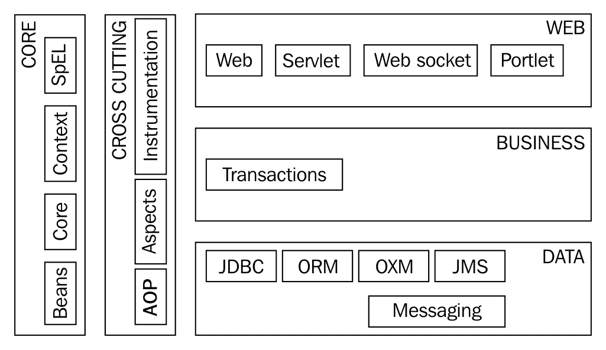

# Spring 框架 5.0 的演变

SpringFramework1.0 的第一个版本于 2004 年 3 月发布。在 15 年多的时间里，Spring 框架一直是构建 Java 应用程序的首选框架。

在相对年轻和动态的 Java 框架世界中，十年是很长的时间。

在本章中，我们首先了解 Spring 框架的核心特性。我们将了解为什么 Spring 框架变得流行，以及它是如何适应成为首选框架的。在快速查看 Spring 框架中的重要模块之后，我们将进入 Spring 项目的世界。在本章的结尾，我们将介绍 SpringFramework5.0 中的新特性。

本章将回答以下问题：

*   为什么 Spring 框架很流行？
*   Spring 框架如何适应应用程序架构的发展？
*   Spring 框架中的重要模块是什么？
*   Spring 框架在 Spring 项目的保护伞中的位置是什么？
*   SpringFramework5.0 中有哪些新特性？

# 弹簧框架

春季网站（[https://projects.spring.io/spring-framework/](https://projects.spring.io/spring-framework/) 对 Spring 框架的定义如下：*Spring 框架为基于 Java 的现代企业应用程序*提供了全面的编程和配置模型。

Spring 框架用于连接企业 Java 应用程序。Spring 框架的主要目的是处理连接应用程序不同部分所需的所有技术管道。这使得程序员能够专注于他们工作的关键——编写业务逻辑。

# EJB 的问题

Spring 框架于 2004 年 3 月发布。当 Spring 框架的第一个版本发布时，开发企业应用程序的流行方式是使用**企业 Java Beans**（**EJB**）2.1。

开发和部署 EJB 是一个繁琐的过程。虽然 EJB 使组件的分发变得更容易，但是开发、单元测试和部署它们并不容易。EJB 的初始版本（1.0、2.0、2.1）有一个复杂的**应用程序编程接口**（**API**），这导致人们认为（在大多数应用程序中也是如此）引入的复杂性远远超过了好处：

*   很难进行单元测试。实际上，很难在 EJB 容器之外进行测试。
*   需要使用许多不必要的方法来实现多个接口。
*   繁琐乏味的异常处理。
*   部署描述符不方便。

Spring 框架是作为一个轻量级框架引入的，旨在简化 JavaEE 应用程序的开发。

# 为什么 Spring 框架很流行？

Spring 框架的第一个版本于 2004 年 3 月发布。在随后的十五年中，Spring 框架的使用和普及只会增加。

Spring 框架流行的重要原因如下：

*   简化的单元测试——因为依赖注入
*   减少管道规范
*   架构灵活性
*   与时俱进

让我们详细讨论其中的每一项。

# 简化单元测试

早期版本的 EJB 很难进行单元测试。事实上，很难在容器之外运行 EJB（从版本 2.1 开始）。测试它们的唯一方法是将它们部署在容器中。

Spring 框架引入了**依赖注入**（**DI**的概念。我们将在[第 2 章](01.html)、*依赖注入*中详细讨论依赖注入。

依赖项注入使用模拟替换依赖项变得容易，从而支持单元测试。我们不需要部署整个应用程序来对其进行单元测试。

简化单元测试有多个好处：

*   程序员的工作效率更高
*   缺陷发现得更早，因此修复成本更低
*   应用程序具有自动单元测试，可以在**连续集成**构建中运行，防止将来出现缺陷

# 减少管道规范

在 Spring 框架之前，典型的 J2EE（现在称为 JavaEE）应用程序包含大量管道代码。例如：获取数据库连接、异常处理代码、事务管理代码、日志记录代码等等。

让我们来看一个使用准备语句执行查询的简单例子：

```java
    PreparedStatement st = null;
    try {
          st = conn.prepareStatement(INSERT_TODO_QUERY);
          st.setString(1, bean.getDescription());
          st.setBoolean(2, bean.isDone());
          st.execute();
        } 
    catch (SQLException e) {
          logger.error("Failed : " + INSERT_TODO_QUERY, e);
     } finally {
                if (st != null) {
           try {
           st.close();
          } catch (SQLException e) {
           // Ignore - nothing to do..
          }
       }
     }
```

在前面的示例中，有四行业务逻辑和十多行管道代码。

使用 Spring Framework，可以在几行中应用相同的逻辑：

```
    jdbcTemplate.update(INSERT_TODO_QUERY, 
    bean.getDescription(), bean.isDone());
```

# Spring 框架是如何做到这一点的？

在前面的示例中，SpringJDBC（通常是 Spring）将大多数已检查的异常转换为未检查的异常。通常，当查询失败时，除了关闭语句并使事务失败之外，我们无能为力。我们可以使用 Spring**面向方面编程**（**AOP**）集中异常处理并将其注入，而不是在每个方法中实现异常处理。

SpringJDBC 不再需要创建获取连接、创建准备好的语句等所涉及的所有管道代码。可以在 Spring 上下文中创建`jdbcTemplate`类，并在需要时注入**数据访问对象**（**DAO**类）。

与前面的示例类似，SpringJMS、SpringAOP 和其他 Spring 模块有助于减少大量管道代码。

Spring 框架让程序员专注于程序员的主要工作——编写业务逻辑。

避免所有管道代码还有另一个很大的好处——减少代码中的重复。由于事务管理、异常处理等的所有代码（通常是所有横切关注点）都在一个地方实现，因此维护起来更容易。

# 架构灵活性

Spring 框架是模块化的。它作为一组独立的模块构建在核心弹簧模块之上。大多数 Spring 模块都是独立的——您可以使用其中一个模块，而不必使用其他模块。

让我们看几个例子：

*   在 web 层，Spring 提供了自己的框架——SpringMVC。然而，Spring 非常支持 Struts、Vaadin、JSF 或您选择的任何 web 框架。
*   Springbeans 可以为您的业务逻辑提供轻量级实现。但是，Spring 也可以与 EJB 集成。
*   在数据层，Spring 使用其 SpringJDBC 模块简化了 JDBC。然而，Spring 非常支持您喜欢的任何数据层框架——JPA、Hibernate（带或不带 JPA）或 iBatis。
*   您可以选择使用 SpringAOP 实现横切关注点（日志记录、事务管理、安全性等）。或者，您可以与成熟的 AOP 实现（如 AspectJ）集成。

Spring 框架不想成为所有行业的佼佼者。Spring 的核心工作是减少应用程序不同部分之间的耦合并使其可测试，它提供了与您选择的框架的良好集成。这意味着您的体系结构具有灵活性——如果您不想使用特定的框架，您可以轻松地用另一个框架替换它。

# 与时俱进

Spring 框架的第一个版本专注于使应用程序可测试。然而，随着时间的推移，出现了新的挑战。Spring 框架通过提供的灵活性和模块成功地发展并保持了领先地位。下面列出了几个示例：

*   注释是在 Java5 中引入的。SpringFramework（版本 2.5–2007 年 11 月）在为 SpringMVC 引入基于注释的控制器模型方面领先于 JavaEE。使用 JavaEE 的开发人员必须等到 JavaEE6（2009 年 12 月-2 年）才能拥有类似的功能。
*   Spring 框架在 JavaEE 之前引入了许多抽象，以保持应用程序与特定实现的解耦。缓存 API 就是一个很好的例子。Spring 在 Spring3.1 中提供了透明缓存支持。JavaEE 在 2014 年为 JCache 提出了*JSR-107*——Spring4.1 提供了对它的支持。

Spring 带来的另一件重要事情是 Spring 项目的保护伞。Spring 框架只是 Spring 项目下众多项目之一。我们将在单独一节中讨论不同的 Spring 项目。以下示例说明了 Spring 如何通过新的 Spring 项目保持领先：

*   **SpringBatch**定义了一种构建 Java 批处理应用程序的新方法。我们不得不等到 JavaEE7（2013 年 6 月）才能在 JavaEE 中获得类似的批处理应用程序规范。
*   随着体系结构向云和微服务发展，Spring 提出了新的面向云的 Spring 项目。SpringCloud 有助于简化微服务的开发和部署。Spring 云数据流围绕微服务应用程序提供编排。

# 弹簧模块

Spring 框架的模块化是其广泛应用的重要原因之一。Spring 框架是高度模块化的，有 20 多个不同的模块——具有明确定义的边界。

下图显示了不同的 Spring 模块——按它们通常使用的应用程序层组织：



我们将首先讨论 Spring 核心容器，然后再讨论按应用层分组的其他模块，这些模块通常在其中使用。

# 弹簧芯容器

Spring 核心容器提供 Spring 框架的核心特性——依赖注入、**IoC**（**控制反转**容器）和应用上下文。我们将在[第 2 章](01.html)、*依赖注入*中了解更多关于 DI 和 IoC 容器的信息。

下表列出了重要的核心弹簧模块：

| **模块/工件** | **使用** |
| 弹簧芯 | 其他 Spring 模块使用的实用程序。 |
| 春豆 | 支持 SpringBean。与 SpringCore 的结合提供了 spring 框架的核心特性——依赖项注入。包括 BeanFactory 的实现。 |
| spring 上下文 | 实现 ApplicationContext，它扩展 BeanFactory 并提供加载资源和国际化等支持。 |
| 弹簧式 | 扩展了**EL**（JSP 中的**表达式语言**，并为 bean 属性（包括数组和集合）访问和操作提供了一种语言。 |

# 交叉关注点

横切关注点适用于所有应用程序层——日志记录和安全性等。**AOP**通常用于实现横切关注点。

单元测试和集成测试适合这个类别，因为它们适用于所有层。

与横切关注点相关的重要弹簧模块如下所示：

| **模块/工件** | **使用** |
| 春季 aop | 为面向方面编程提供基本支持——使用方法拦截器和切入点。 |
| 春季方面 | 提供与最流行且功能齐全的 AOP 框架 AspectJ 的集成。 |
| 弹簧乐器 | 提供基本的仪表支持。 |
| 弹簧试验 | 为单元测试和集成测试提供基本支持。 |

# 网状物

Spring 提供了自己的 MVC 框架 SpringMVC，而不是提供与 Struts 等流行 web 框架的良好集成。

重要工件/模块如下所示：

*   **spring web**：提供基本的 web 功能，如多部分文件上传。提供与其他 web 框架（如 Struts）集成的支持。
*   **spring webmvc**：提供了一个功能齐全的 web MVC 框架——spring MVC，其中还包括实现 REST 服务的功能。

我们将在[第 3 章](01.html)、*用 Spring MVC 构建 web 应用*、[第 5 章](01.html)、*用 Spring Boot 构建微服务中介绍 Spring MVC，并用它开发 web 应用和 rest 服务。*

# 商业

业务层的重点是执行应用程序的业务逻辑。使用 Spring，业务逻辑通常在**普通旧 Java 对象**（**POJO**中实现。

**Spring 事务****Spring tx**为 POJO 等类提供声明式事务管理。

# 数据

应用程序中的数据层通常与数据库和/或外部接口通信。
下表列出了与数据层相关的一些重要弹簧模块：

| **模块/工件** | **使用** |
| --- | --- |
| SpringJDBC | 围绕 JDBC 提供抽象以避免样板代码。 |
| 春季甲虫 | 提供与 ORM 框架和规范（JPA 和 Hibernate 等）的集成。 |
| 弹簧 oxm | 提供对象到 XML 映射集成。支持 JAXB、Castor 等框架。 |
| SpringJMS | 围绕 JMS 提供抽象以避免样板代码。 |

# 春季项目

Spring 框架为企业应用程序（DI、web、数据）的核心功能提供了基础，而其他 Spring 项目则探索企业空间中其他问题的集成和解决方案——部署、云、大数据、批处理和安全等。

以下列出了一些重要的 Spring 项目：

*   弹簧靴
*   春云
*   弹簧数据
*   春批
*   春季安全
*   春风

# 弹簧靴

开发微服务和 web 应用程序时面临的一些挑战如下：

*   做出框架选择并决定兼容的框架版本
*   提供外部化配置的机制——可以从一个环境更改到另一个环境的属性
*   运行状况检查和监视--在应用程序的特定部分关闭时提供警报
*   决定部署环境并为其配置应用程序

Spring Boot 通过对应用程序的开发方式采取*自以为是的观点*解决了所有这些问题。

我们将分两章深入了解 Spring Boot——[第 5 章](01.html)、*使用 Spring Boot 构建微服务*和[第 7 章](07.html)、*高级 Spring Boot 功能*。

# 春云

可以毫不夸张地说*世界正在向云*移动。

云本地微服务和应用程序是当今的主流。我们将在[第 4 章](01.html)、*微服务和云本机应用的发展*中详细讨论这一点。

Spring 正朝着使用 SpringCloud 简化云应用程序开发的方向快速迈进。

SpringCloud 为分布式系统中的常见模式提供了解决方案。SpringCloud 使开发人员能够快速创建实现公共模式的应用程序。Spring Cloud 中实现的一些常见模式如下所示：

*   配置管理
*   服务发现
*   断路器
*   智能路由

我们将在[第 9 章](09.html)、*春季云中更详细地讨论春季云及其变化范围特征。*

# 弹簧数据

当今世界有多种数据源——SQL（关系型）和各种 NOSQL 数据库。SpringData 试图为所有这些不同类型的数据库提供一致的数据访问方法。

Spring Data 提供了与各种规格和/或数据存储的集成：

*   JPA
*   蒙哥达
*   雷迪斯
*   索尔
*   Gemfire
*   阿帕奇·卡桑德拉

以下列出了一些重要功能：

*   提供关于存储库和对象映射的抽象——通过从方法名称确定查询
*   简单 Spring 集成
*   与 Spring MVC 控制器的集成
*   高级自动审核功能--创建人、创建日期、上次更改人和上次更改日期

我们将在[第 8 章](08.html)、*弹簧数据*中更详细地讨论弹簧数据。

# 春批

如今，企业应用程序使用批处理程序处理大量数据。这些应用程序的需求非常相似。SpringBatch 为具有高性能要求的大容量批处理程序提供解决方案。

Spring Batch 的重要特性如下：

*   启动、停止和重新启动作业的能力——包括从失败的作业开始重新启动失败的作业的能力
*   以数据块的形式处理数据的能力
*   重试步骤或在失败时跳过步骤的能力
*   基于 Web 的管理界面

# 春季安全

**认证**是识别用户的过程。**授权**是确保用户有权对资源执行已识别操作的过程。

身份验证和授权是企业应用程序（包括 web 应用程序和 web 服务）的关键部分。Spring Security 为基于 Java 的应用程序提供声明式身份验证和授权。

Spring Security 中的重要功能如下：

*   简化的身份验证和授权
*   与 SpringMVC 和 ServletAPI 的良好集成
*   支持防止常见安全攻击--**跨站点伪造请求**（**CSRF**）和会话固定
*   可与 SAML 和 LDAP 集成的模块

我们将在[第 3 章](01.html)*使用 Spring MVC 构建 web 应用程序*中讨论如何使用 Spring 安全保护 web 应用程序。

我们将在[第 6 章](06.html)、*扩展微服务*中讨论如何使用 Spring Security 通过基本和 OAuth 身份验证机制保护 REST 服务。

# 春风

**HATEOAS**代表**超媒体作为应用状态**的引擎。虽然听起来很复杂，但这是一个相当简单的概念。其主要目的是将服务器（服务的提供者）与客户机（服务的消费者）分离。

服务提供者向服务使用者提供有关可以对资源执行哪些其他操作的信息。

SpringHateOAS 提供了一个 HATEOAS 实现——特别是对于使用 SpringMVC 实现的 REST 服务。

Spring HATEOAS 的重要功能如下：

*   指向服务方法的链接的简化定义，使链接不那么脆弱
*   支持 JAXB（基于 XML）和 JSON 集成
*   对服务消费者的支持（客户端）

我们将在[第 6 章](06.html)*扩展微服务*中讨论如何使用 HATEOAS。

# SpringFramework 5.0 中的新功能

springframework5.0 是 springframework 中的第一个主要升级，比 springframework4.0 快了四年。在这个时间范围内，主要的发展之一是 SpringBoot 项目的发展。我们将在下一节讨论 SpringBoot2.0 中的新特性。

SpringFramework5.0 的最大特点之一是**反应式编程**。SpringFramework5.0 提供了核心反应式编程功能和对反应式端点的支持。重要变更清单包括以下内容：

*   基线升级
*   jdk9 运行时兼容性
*   Spring 框架代码中 JDK 8 特性的使用
*   反应式编程支持
*   一个功能性 web 框架
*   用 Jigsaw 实现 Java 模块化
*   科特林支持
*   丢弃的特征

# 基线升级

SpringFramework5.0 有 JDK8 和 JavaEE7 基线。基本上，这意味着以前的 JDK 和 JavaEE 版本不再受支持。

Spring Framework 5.0 的一些重要基线 Java EE 7 规范如下所示：

*   Servlet 3.1
*   JMS 2.0
*   JPA 2.1
*   JAX-RS 2.0
*   Bean 验证 1.1

一些 Java 框架的最低支持版本有很多变化。以下列表包含一些受支持的重要框架的最低版本：

*   冬眠 5
*   杰克逊 2.6
*   EhCache 2.10
*   少年 5
*   瓷砖 3

以下列表显示了受支持的服务器版本：

*   Tomcat 8.5+
*   码头 9.4+
*   野蝇 10+
*   Netty 4.1+（用于使用 Spring web Flux 的 web 反应式编程）
*   Undertow 1.4+（用于带弹簧卷筒纸流量的卷筒纸反应式编程）

使用上述任何规范/框架的早期版本的应用程序在使用 Spring Framework 5.0 之前，至少需要升级到先前列出的版本。

# jdk9 运行时兼容性

JDK 9 预计将于 2017 年年中发布。SpringFramework5.0 预计在运行时与 JDK9 兼容。

# 在 Spring 框架代码中使用 JDK 8 特性

SpringFramework4.x 基线版本是 JavaSE6。这意味着它支持 Java6、7 和 8。必须支持 JavaSE6 和 JavaSE7 会对 Spring 框架代码造成限制。框架代码不能使用 Java8 中的任何新特性。因此，当世界其他地方升级到 Java8 时，Spring 框架中的代码（至少是主要部分）仅限于使用早期版本的 Java。

对于 SpringFramework5.0，基线版本是 Java8。Spring 框架代码现在升级为使用 Java8 中的新特性。这将产生更具可读性和性能的框架代码。使用的一些 Java 8 功能如下所示：

*   核心 Spring 接口中的 Java8 默认方法
*   基于 Java8 反射增强的内部代码改进
*   函数式编程在框架代码中的使用——lambdas 和 streams

# 反应式编程支持

反应式编程是 SpringFramework5.0 最重要的特性之一。

微服务架构通常是围绕基于事件的通信构建的。应用程序是为响应事件（或消息）而构建的。

反应式编程提供了另一种编程风格，重点是构建对事件做出反应的应用程序。

虽然 Java 8 没有内置的对反应式编程的支持，但有许多框架提供了对反应式编程的支持：

*   **反应流**：语言无关的尝试定义反应 API。
*   **Reactor**：Spring Pivotal 团队提供的反应流的 Java 实现。
*   **Spring WebFlux**：支持基于反应式编程的 web 应用程序开发。提供类似于 SpringMVC 的编程模型。

我们将在[第 11 章](11.html)、*反应式编程*中讨论反应式编程以及如何使用 SpringWebFlux 实现它。

# 功能性 web 框架

Spring5 在被动功能的基础上，还提供了一个功能强大的 web 框架。

功能性 web 框架提供了使用功能性编程风格定义端点的功能。下面显示了一个简单的 hello world 示例：

```
    RouterFunction<String> route =
    route(GET("/hello-world"),
    request -> Response.ok().body(fromObject("Hello World")));
```

功能性 web 框架也可用于定义更复杂的路由，如以下示例所示：

```
    RouterFunction<?> route = route(GET("/todos/{id}"),
    request -> {
       Mono<Todo> todo = Mono.justOrEmpty(request.pathVariable("id"))
       .map(Integer::valueOf)
       .then(repository::getTodo);
       return Response.ok().body(fromPublisher(todo, Todo.class));
      })
     .and(route(GET("/todos"),
     request -> {
       Flux<Todo> people = repository.allTodos();
       return Response.ok().body(fromPublisher(people, Todo.class));
     }))
    .and(route(POST("/todos"),
    request -> {
      Mono<Todo> todo = request.body(toMono(Todo.class));
      return Response.ok().build(repository.saveTodo(todo));
    }));
```

需要注意的几个重要事项如下：

*   `RouterFunction`评估匹配条件，将请求路由到适当的处理函数
*   我们定义了三个端点、两个 get 和一个 POST，并将它们映射到不同的处理程序函数

我们将在[第 11 章](11.html)*反应式编程中更详细地讨论 Mono 和 Flux。*

# 用 Jigsaw 实现 Java 模块化

在 Java8 之前，Java 平台不是模块化的。由此产生了几个重要问题：

*   **平台膨胀**：Java 模块化在过去几十年中没有引起关注。然而，随着**物联网**（**物联网**）和 Node.js 等新型轻量级平台的出现，迫切需要解决 Java 平台的膨胀问题。（JDK 的初始版本的大小小于 10 MB。JDK 的最新版本需要 200 MB 以上。）
*   **罐子地狱**：另一个重要的问题是罐子地狱的问题。当 Java 类加载器找到一个类时，它不会看到该类是否有其他可用的定义。它立即加载找到的第一个类。如果应用程序的两个不同部分需要来自不同 jar 的同一类，则它们无法指定必须从中加载类的 jar。

**开放系统网关计划**（**OSGi**是 1999 年开始的计划之一，旨在将模块化引入 Java 应用程序。

每个模块（称为捆绑）定义了以下内容：

*   **导入**：模块使用的其他捆绑包
*   **导出**：该捆绑包导出的包

每个模块都有自己的生命周期。它可以自行安装、启动和停止。

Jigsaw 是**Java 社区流程**（**JCP**下的一项倡议，从 Java 7 开始，旨在将模块化引入 Java。它有两个主要目的：

*   定义和实现 JDK 的模块化结构
*   为构建在 Java 平台上的应用程序定义模块系统

Jigsaw 预计将成为 Java9 的一部分，SpringFramework5.0 预计将包括对 Jigsaw 模块的基本支持。

# 科特林支持

Kotlin 是一种静态类型的 JVM 语言，它支持具有表达性、简短性和可读性的代码。SpringFramework 5.0 对 Kotlin 有很好的支持。

考虑一个简单的 KOTLIN 程序来说明一个数据类，如下所示：

```
    import java.util.*
    data class Todo(var description: String, var name: String, var  
    targetDate : Date)
    fun main(args: Array<String>) {
      var todo = Todo("Learn Spring Boot", "Jack", Date())
      println(todo)
        //Todo(description=Learn Spring Boot, name=Jack, 
        //targetDate=Mon May 22 04:26:22 UTC 2017)
      var todo2 = todo.copy(name = "Jill")
      println(todo2)
         //Todo(description=Learn Spring Boot, name=Jill, 
         //targetDate=Mon May 22 04:26:22 UTC 2017)
      var todo3 = todo.copy()
      println(todo3.equals(todo)) //true
    }  
```

在不到 10 行代码中，我们创建并测试了一个具有三个属性和以下函数的数据 bean：

*   `equals()`
*   `hashCode()`
*   `toString()`
*   `copy()`

Kotlin 是强类型的。但无需明确指定每个变量的类型：

```
    val arrayList = arrayListOf("Item1", "Item2", "Item3") 
    // Type is ArrayList
```

命名参数允许您在调用方法时指定参数的名称，从而生成更可读的代码：

```
    var todo = Todo(description = "Learn Spring Boot", 
    name = "Jack", targetDate = Date())
```

Kotlin 通过提供默认变量（`it`和`take`、`drop`等方法简化了函数编程：

```
    var first3TodosOfJack = students.filter { it.name == "Jack"   
     }.take(3)
```

还可以为 Kotlin 中的参数指定默认值：

```
    import java.util.*
    data class Todo(var description: String, var name: String, var
    targetDate : Date = Date())
    fun main(args: Array<String>) {
      var todo = Todo(description = "Learn Spring Boot", name = "Jack")
    }
```

由于 Kotlin 的所有特性使代码简洁而富有表现力，我们希望它能成为一种为未来学习的语言。

我们将在[第 13 章](11.html)*中讨论更多关于科特林的内容，在春季与科特林合作。*

# 丢弃的特征

SpringFramework5 是一个主要的 Spring 版本，它的基线大幅增加。随着 Java、Java EE 和其他一些框架的基线版本的增加，Spring Framework 5 取消了对一些框架的支持：

*   Portlet
*   速度
*   JasperReports
*   XMLBeans
*   JDO
*   番石榴

如果您使用的是上述任何一种框架，建议您计划迁移并继续使用 SpringFramework4.3，它支持 2019 年。

# Spring Boot 2.0 新功能

Spring Boot 的第一个版本于 2014 年发布。以下是 Spring Boot 2.0 中预期的一些重要更新：

*   基线 JDK 版本是 Java8
*   Spring 的基线版本是 SpringFramework 5.0
*   SpringBoot2.0 支持 WebFlux 的反应式 Web 编程

一些重要框架的最低支持版本如下所示：

*   码头 9.4
*   Tomcat 8.5
*   冬眠 5.2
*   格拉德尔 3.4

我们将在[第 5 章](01.html)、*使用弹簧靴构建微服务*和[第 7 章](07.html)、*高级弹簧靴功能*中详细讨论弹簧靴。

# 总结

在过去十五年中，Spring 框架极大地改善了开发 Java 企业应用程序的体验。在 SpringFramework5.0 中，它引入了许多特性，同时显著增加了基线。

在接下来的章节中，我们将介绍依赖注入，并了解如何使用 SpringMVC 开发 web 应用程序。之后，我们将进入微服务的世界。在[第 5 章](01.html)、*用弹簧靴构建微服务*、[第 6 章](06.html)、*扩展微服务*、[第 7 章](07.html)、*高级弹簧靴功能*中，我们将介绍弹簧靴如何简化微服务的创建。然后，我们将把注意力转移到使用 Spring 云和 Spring 云数据流在云中构建应用程序上。