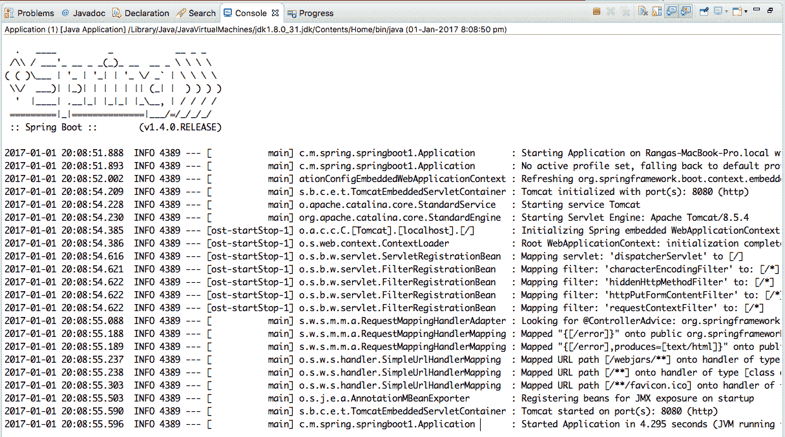
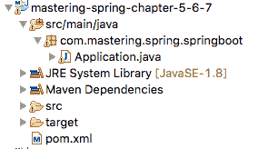
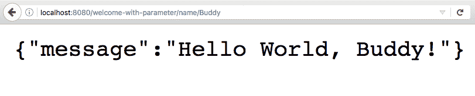
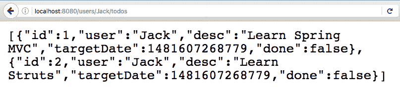
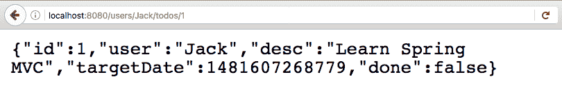
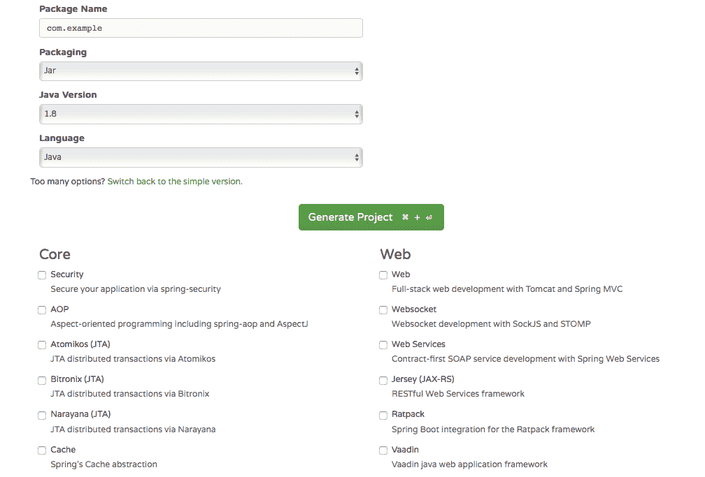
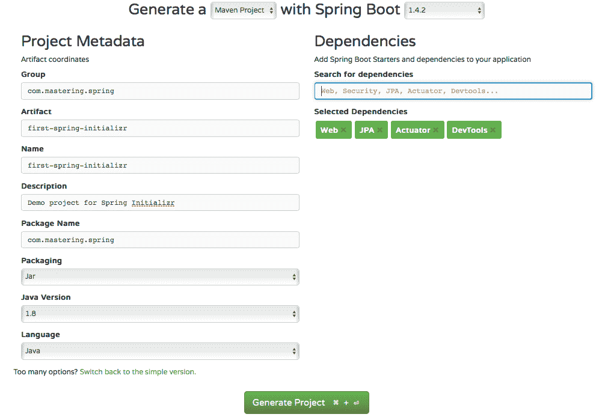
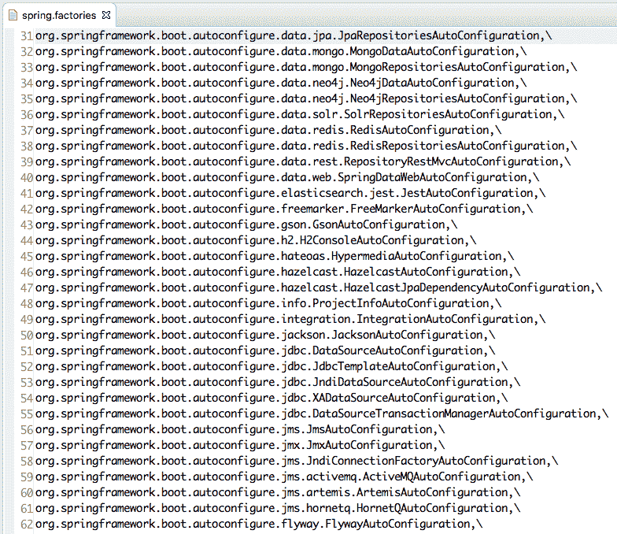

# 五、使用 Spring Boot 构建微服务

正如我们在上一章中所讨论的，我们正在朝着具有更小、可独立部署的微服务的体系结构发展。这意味着将会有大量的小型微服务被开发出来。

一个重要的结果是，我们需要能够快速启动并使用新组件运行。

SpringBoot 旨在解决使用新组件快速起步的问题。在本章中，我们将从理解 Spring Boot 带来的功能开始。我们将回答以下问题：

*   为什么是弹簧靴？
*   Spring Boot 提供了哪些功能？
*   什么是自动配置？
*   弹簧靴不是什么？
*   使用 Spring Boot 时后台会发生什么？
*   如何使用 SpringInitializer 创建新的 SpringBoot 项目？
*   如何使用 SpringBoot 创建基本的 RESTful 服务？

# 什么是弹簧靴？

首先，让我们先澄清一些关于 Spring Boot 的误解：

*   Spring Boot 不是一个代码生成框架。它不生成任何代码。
*   Spring Boot 既不是应用服务器，也不是 web 服务器。它提供了与不同范围的应用和 web 服务器的良好集成。
*   SpringBoot 不实现任何特定的框架或规范。

这些问题仍然存在：

*   什么是弹簧靴？
*   为什么在过去的几年里它变得如此流行？

为了回答这些问题，让我们构建一个快速示例。让我们考虑一个示例应用，您希望快速原型化。

# 为微服务构建快速原型

假设我们想用 SpringMVC 构建一个微服务，并使用 JPA（Hibernate 作为实现）连接到数据库。

让我们考虑建立这样一个应用的步骤：

1.  决定使用哪个版本的 SpringMVC、JPA 和 Hibernate。
2.  设置 Spring 上下文以将所有不同层连接在一起。
3.  使用 Spring MVC 设置 web 层（包括 Spring MVC 配置）：
    *   为 DispatcherServlet、处理程序、解析器、视图解析器等配置 bean
4.  在数据层中设置 Hibernate：
    *   为 SessionFactory、数据源等配置 bean
5.  决定并实施如何存储应用配置，这在不同的环境中有所不同。
6.  决定如何进行单元测试。
7.  决定并实施您的事务管理策略。
8.  决定并实施如何实施安全性。
9.  设置日志框架。
10.  决定并实现在生产中监视应用的方式。

11.  决定并实施一个度量管理系统，以提供有关应用的统计信息。
12.  决定并实施如何将应用部署到 web 或应用服务器。

在开始构建业务逻辑之前，至少必须完成上面提到的几个步骤。这可能至少需要几个星期。

当我们构建微服务时，我们希望快速开始。前面的所有步骤都不会使开发微服务变得容易。这就是 Spring Boot 想要解决的问题。

以下引文摘自 Spring Boot 网站（[http://docs.spring.io/spring-boot/docs/current-SNAPSHOT/reference/htmlsingle/#boot-文件](http://docs.spring.io/spring-boot/docs/current-SNAPSHOT/reference/htmlsingle/#boot-documentation)：

SpringBoot 可以轻松创建独立的、生产级的、基于 Spring 的应用，您可以“直接运行”。我们对 Spring 平台和第三方库持有一种固执己见的观点，这样您就可以用最少的麻烦开始了。大多数 SpringBoot 应用只需要很少的 Spring 配置。

SpringBoot 使开发人员能够关注其微服务背后的业务逻辑。它旨在处理开发微服务所涉及的所有基本技术细节。

# 主要目标

Spring Boot 的主要目标如下：

*   支持快速启动基于 Spring 的项目。
*   固执己见。根据常见用法进行默认假设。提供配置选项以处理与默认值的偏差。
*   提供一系列开箱即用的非功能特性。
*   不要使用代码生成，避免使用大量 XML 配置。

# 非功能特征

Spring Boot 提供的一些非功能特性如下：

*   各种框架、服务器和规范的版本控制和配置的默认处理
*   应用安全的默认选项
*   具有扩展可能性的默认应用度量
*   使用运行状况检查的基本应用监视
*   外部化配置的多个选项

# 春靴你好世界

在本章中，我们将从构建第一个 SpringBoot 应用开始。我们将使用 Maven 来管理依赖关系。

使用 SpringBoot 应用启动时涉及以下步骤：

1.  在您的`pom.xml`文件中配置`spring-boot-starter-parent`。
2.  用所需的初学者项目配置`pom.xml`文件。
3.  将`spring-boot-maven-plugin`配置为能够运行应用。
4.  创建您的第一个 Spring Boot 启动类。

让我们从步骤 1 开始：配置 starter 项目。

# 配置 springbootstarter 父级

让我们从一个简单的带有`spring-boot-starter-parent`的`pom.xml`文件开始：

```java
    <project 
     xmlns:xsi="http://www.w3.org/2001/XMLSchema-instance" 
     xsi:schemaLocation="http://maven.apache.org/POM/4.0.0 
     http://maven.apache.org/xsd/maven-4.0.0.xsd">   
    <modelVersion>4.0.0</modelVersion> 
    <groupId>com.mastering.spring</groupId> 
    <artifactId>springboot-example</artifactId> 
    <version>0.0.1-SNAPSHOT</version> 
    <name>First Spring Boot Example</name> 
    <packaging>war</packaging>
    <parent> 
      <groupId>org.springframework.boot</groupId> 
      <artifactId>spring-boot-starter-parent</artifactId>  
      <version>2.0.0.M1</version>
    </parent>
    <properties> 
      <java.version>1.8</java.version> 
    </properties>

   <repositories>
    <repository>
      <id>spring-milestones</id>
      <name>Spring Milestones</name>
      <url>https://repo.spring.io/milestone</url>
      <snapshots>
        <enabled>false</enabled>
      </snapshots>
    </repository>
   </repositories>

   <pluginRepositories>
    <pluginRepository>
      <id>spring-milestones</id>
      <name>Spring Milestones</name>
      <url>https://repo.spring.io/milestone</url>
        <snapshots>
          <enabled>false</enabled>
        </snapshots>
     </pluginRepository>
    </pluginRepositories>

</project>
```

第一个问题是：为什么我们需要`spring-boot-starter-parent`？

`spring-boot-starter-parent`依赖项包含要使用的 Java 的默认版本、Spring Boot 使用的依赖项的默认版本以及 Maven 插件的默认配置。

`spring-boot-starter-parent`依赖项是父 POM，为基于 SpringBoot 的应用提供依赖项和插件管理。

让我们看一下`spring-boot-starter-parent`中的一些代码，以便更深入地了解`spring-boot-starter-parent`。

# spring 启动程序父级

`spring-boot-starter-parent`依赖项继承自`spring-boot-dependencies`，该依赖项在 POM 顶部定义。以下代码片段显示了`spring-boot-starter-parent`的摘录：

```java
    <parent>
      <groupId>org.springframework.boot</groupId>
      <artifactId>spring-boot-dependencies</artifactId>
      <version>2.0.0.M1</version>
      <relativePath>../../spring-boot-dependencies</relativePath>
   </parent>
```

`spring-boot-dependencies`为 Spring Boot 使用的所有依赖项提供默认依赖项管理。以下代码显示了`spring-boot-dependencies`中配置的各种依赖项的不同版本：

```java
<activemq.version>5.13.4</activemq.version>
<aspectj.version>1.8.9</aspectj.version>
<ehcache.version>2.10.2.2.21</ehcache.version>
<elasticsearch.version>2.3.4</elasticsearch.version>
<gson.version>2.7</gson.version>
<h2.version>1.4.192</h2.version>
<hazelcast.version>3.6.4</hazelcast.version>
<hibernate.version>5.0.9.Final</hibernate.version>
<hibernate-validator.version>5.2.4.Final</hibernate
  validator.version>
<hsqldb.version>2.3.3</hsqldb.version>
<htmlunit.version>2.21</htmlunit.version>
<jackson.version>2.8.1</jackson.version>
<jersey.version>2.23.1</jersey.version>
<jetty.version>9.3.11.v20160721</jetty.version>
<junit.version>4.12</junit.version>
<mockito.version>1.10.19</mockito.version>
<selenium.version>2.53.1</selenium.version>
<servlet-api.version>3.1.0</servlet-api.version>
<spring.version>4.3.2.RELEASE</spring.version>
<spring-amqp.version>1.6.1.RELEASE</spring-amqp.version>
<spring-batch.version>3.0.7.RELEASE</spring-batch.version>
<spring-data-releasetrain.version>Hopper-SR2</spring-
  data-releasetrain.version>
<spring-hateoas.version>0.20.0.RELEASE</spring-hateoas.version>
<spring-restdocs.version>1.1.1.RELEASE</spring-restdocs.version>
<spring-security.version>4.1.1.RELEASE</spring-security.version>
<spring-session.version>1.2.1.RELEASE</spring-session.version>
<spring-ws.version>2.3.0.RELEASE</spring-ws.version>
<thymeleaf.version>2.1.5.RELEASE</thymeleaf.version>
<tomcat.version>8.5.4</tomcat.version>
<xml-apis.version>1.4.01</xml-apis.version>
```

如果我们想覆盖依赖项的特定版本，可以通过在应用的`pom.xml`文件中提供具有正确名称的属性来实现。以下代码片段显示了将应用配置为使用 Mockito 版本 1.10.20 的示例：

```java
    <properties>
     <mockito.version>1.10.20</mockito.version>
    </properties>
```

以下是`spring-boot-starter-parent`中定义的一些其他事项：

*   默认 Java 版本`<java.version>1.8</java.version>`
*   Maven 插件的默认配置：
    *   `maven-failsafe-plugin`
    *   `maven-surefire-plugin`
    *   `git-commit-id-plugin`

不同版本的框架之间的兼容性是开发人员面临的主要问题之一。如何找到与特定版本的 Spring 兼容的最新 Spring 会话版本？通常的答案是阅读文档。然而，如果我们使用 Spring Boot，这可以通过`spring-boot-starter-parent`简化。如果我们想升级到一个更新的 Spring 版本，我们需要做的就是找到该 Spring 版本的`spring-boot-starter-parent`依赖项。一旦我们升级应用以使用特定版本的`spring-boot-starter-parent`，我们将所有其他依赖项升级到与新的 Spring 版本兼容的版本。开发人员少了一个需要处理的问题。总是让我快乐。

# 使用所需的初学者项目配置 pom.xml

每当我们想要在 SpringBoot 中构建应用时，我们都需要开始寻找初学者项目。让我们专注于理解什么是启动项目。

# 了解初学者项目

起动器是为不同目的定制的简化依赖描述符。例如，`spring-boot-starter-web`是使用 SpringMVC 构建 web 应用（包括 RESTful）的起点。它使用 Tomcat 作为默认的嵌入式容器。如果我想使用 Spring MVC 开发一个 web 应用，我们需要做的就是将`spring-boot-starter-web`包含在我们的依赖项中，并自动预配置以下内容：

*   Spring MVC
*   jackson databind（用于绑定）和 hibernate validator（用于表单验证）的兼容版本
*   `spring-boot-starter-tomcat`（Tomcat 启动项目）

下面的代码片段显示了在`spring-boot-starter-web`中配置的一些依赖项：

```java
    <dependencies>
        <dependency>
          <groupId>org.springframework.boot</groupId>
          <artifactId>spring-boot-starter</artifactId>
        </dependency>
        <dependency>
          <groupId>org.springframework.boot</groupId>
          <artifactId>spring-boot-starter-tomcat</artifactId>
        </dependency>
        <dependency>
          <groupId>org.hibernate</groupId>
          <artifactId>hibernate-validator</artifactId>
        </dependency>
        <dependency>
          <groupId>com.fasterxml.jackson.core</groupId>
          <artifactId>jackson-databind</artifactId>
        </dependency>
        <dependency>
          <groupId>org.springframework</groupId>
          <artifactId>spring-web</artifactId>
        </dependency>
        <dependency>
          <groupId>org.springframework</groupId>
          <artifactId>spring-webmvc</artifactId>
       </dependency>
    </dependencies>
```

正如我们在前面的代码片段中所看到的，当我们使用
`spring-boot-starter-web`时，我们会自动配置很多框架。

对于我们想要构建的 web 应用，我们还希望进行一些良好的单元测试，并将其部署到 Tomcat 上。下面的代码片段显示了我们需要的不同启动程序依赖项。我们需要将此添加到我们的`pom.xml`文件中：

```java
    <dependencies>
      <dependency>
        <groupId>org.springframework.boot</groupId>
        <artifactId>spring-boot-starter-web</artifactId>
     </dependency>
     <dependency>
       <groupId>org.springframework.boot</groupId>
       <artifactId>spring-boot-starter-test</artifactId>
       <scope>test</scope>
     </dependency>
     <dependency>
       <groupId>org.springframework.boot</groupId>
       <artifactId>spring-boot-starter-tomcat</artifactId>
       <scope>provided</scope>
     </dependency>
    </dependencies>
```

我们增加了三个启动项目：

*   我们已经讨论过`spring-boot-starter-web`。它为我们提供了使用 SpringMVC 构建 web 应用所需的框架。
*   `spring-boot-starter-test`依赖项提供了单元测试所需的以下测试框架：
    *   **JUnit**：基本单元测试框架
    *   **Mockito**：用于模拟
    *   **Hamcrest**、**资产 J**：可读性资产
    *   **Spring 测试**：基于 Spring 上下文应用的单元测试框架
*   `spring-boot-starter-tomcat`依赖项是运行 web 应用的默认值。为了清晰起见，我们将其包括在内。`spring-boot-starter-tomcat`是使用 Tomcat 作为嵌入式 servlet 容器的起点。

我们现在已经用 starter 父级和所需的 starter 项目配置了我们的`pom.xml`文件。现在让我们添加`spring-boot-maven-plugin`，这将使我们能够运行 SpringBoot 应用。

# 配置 SpringBootMaven 插件

当我们使用 Spring Boot 构建应用时，有两种情况是可能的：

*   我们希望在不构建 JAR 或 WAR 的情况下就地运行应用
*   我们希望为以后的部署构建一个 JAR 和一个 WAR

`spring-boot-maven-plugin`依赖项为上述两种情况提供了功能。下面的代码片段显示了如何在应用中配置`spring-boot-maven-plugin`：

```java
    <build>
     <plugins>
      <plugin>
        <groupId>org.springframework.boot</groupId>
        <artifactId>spring-boot-maven-plugin</artifactId>
      </plugin>
     </plugins>
    </build>
```

`spring-boot-maven-plugin`依赖项为 SpringBoot 应用提供了几个目标。最常见的目标是运行（可以在项目根文件夹的命令提示符下以`mvn spring-boot:run`的形式执行）。

# 创建第一个 Spring 启动类

下面的类解释了如何创建一个简单的 Spring 启动类。它使用`SpringApplication`类中的静态 run 方法，如下面的代码片段所示：

```java
    package com.mastering.spring.springboot; 
    import org.springframework.boot.SpringApplication; 
    import org.springframework.boot.
    autoconfigure.SpringBootApplication; 
    import org.springframework.context.ApplicationContext; 
    @SpringBootApplication public class Application {
       public static void main(String[] args)
        { 
         ApplicationContext ctx = SpringApplication.run 
         (Application.class,args); 
        }
     }
```

前面的代码是一个简单的 Java`main`方法，在`SpringApplication`类上执行静态`run`方法。

# Spring 应用类

`SpringApplication`类可用于从 Java`main`方法引导和启动 Spring 应用。

以下是启动 SpringBoot 应用时通常执行的步骤：

1.  创建 Spring 的`ApplicationContext`实例。
2.  启用该功能以接受命令行参数并将其作为 Spring 属性公开。
3.  根据配置加载所有 Springbean。

# @SpringBootApplication 注释

`@SpringBootApplication`注释是三个注释的快捷方式：

*   `@Configuration`：表示这是一个 Spring 应用上下文配置文件。
*   `@EnableAutoConfiguration`：启用自动配置，这是 Spring Boot 的一个重要功能。我们将在后面的单独章节中讨论自动配置。
*   `@ComponentScan`：启用扫描该类及其所有子包中的 SpringBean。

# 运行 Hello World 应用

我们可以以多种方式运行 Hello World 应用。让我们从最简单的选项开始运行它——作为 Java 应用运行。在 IDE 中，右键单击应用类并将其作为 Java 应用运行。以下屏幕截图显示了运行`Hello World`应用的部分日志：



以下是需要注意的关键事项：

*   Tomcat 服务器在端口 8080 上启动--`Tomcat started on port(s): 8080 (http)`。
*   已配置 DispatcherServlet。这意味着 SpringMVC 框架已经准备好接受请求--`Mapping servlet: 'dispatcherServlet' to [/]`。

*   默认启用四个过滤器--`characterEncodingFilter`、`hiddenHttpMethodFilter`、`httpPutFormContentFilter`和`requestContextFilter`
*   默认错误页面已配置--`Mapped "{[/error]}" onto public org.springframework.http.ResponseEntity<java.util.Map<java.lang.String, java.lang.Object>> org.springframework.boot.autoconfigure.web.BasicErrorController.error(javax.servlet.http.HttpServletRequest)`
*   Webjar 是自动配置的。正如我们在[第 3 章](05.html)*中所讨论的，使用 Spring MVC*构建 Web 应用时，WebJAR 为静态依赖项（如引导和查询）启用依赖项管理--`Mapped URL path [/webjars/**] onto handler of type [class org.springframework.web.servlet.resource.ResourceHttpRequestHandler]`

下面的屏幕截图显示了目前的应用布局。我们只有两个文件，`pom.xml`和`Application.java`：



通过一个简单的`pom.xml`文件和一个 Java 类，我们能够启动 SpringMVC 应用，并描述了前面的所有功能。关于 Spring Boot，最重要的事情是理解后台发生了什么。首先要了解前面的启动日志。让我们看看 Maven 依赖项，以获得更深入的了解。

以下屏幕截图显示了使用我们创建的`pom.xml`文件中的基本配置配置的一些依赖项：


弹簧靴有很多魔力。一旦您配置并运行了应用，我建议您使用它来获得更深入的理解，这在调试问题时非常有用。

正如蜘蛛侠所说，<q>拥有强大的力量，随之而来的是巨大的责任</q>。这在弹簧靴的情况下是绝对正确的。在将来，使用 SpringBoot 的最佳开发人员将是那些了解后台发生的事情的人——依赖项和自动配置。

# 自动配置

为了使我们能够进一步了解自动配置，让我们扩展我们的应用类，以包含更多的代码行：

```java
    ApplicationContext ctx = SpringApplication.run(Application.class, 
     args);
    String[] beanNames = ctx.getBeanDefinitionNames();
    Arrays.sort(beanNames);

   for (String beanName : beanNames) {
     System.out.println(beanName);
    }
```

我们获取在 Spring 应用上下文中定义的所有 bean，并打印它们的名称。当`Application.java`作为 Java 程序运行时，它打印 bean 列表，如下输出所示：

```java
application
basicErrorController
beanNameHandlerMapping
beanNameViewResolver
characterEncodingFilter
conventionErrorViewResolver
defaultServletHandlerMapping
defaultViewResolver
dispatcherServlet
dispatcherServletRegistration
duplicateServerPropertiesDetector
embeddedServletContainerCustomizerBeanPostProcessor
error
errorAttributes
errorPageCustomizer
errorPageRegistrarBeanPostProcessor
faviconHandlerMapping
faviconRequestHandler
handlerExceptionResolver
hiddenHttpMethodFilter
httpPutFormContentFilter
httpRequestHandlerAdapter
jacksonObjectMapper
jacksonObjectMapperBuilder
jsonComponentModule
localeCharsetMappingsCustomizer
mappingJackson2HttpMessageConverter
mbeanExporter
mbeanServer
messageConverters
multipartConfigElement
multipartResolver
mvcContentNegotiationManager
mvcConversionService
mvcPathMatcher
mvcResourceUrlProvider
mvcUriComponentsContributor
mvcUrlPathHelper
mvcValidator
mvcViewResolver
objectNamingStrategy
autoconfigure.AutoConfigurationPackages
autoconfigure.PropertyPlaceholderAutoConfiguration
autoconfigure.condition.BeanTypeRegistry
autoconfigure.context.ConfigurationPropertiesAutoConfiguration
autoconfigure.info.ProjectInfoAutoConfiguration
autoconfigure.internalCachingMetadataReaderFactory
autoconfigure.jackson.JacksonAutoConfiguration
autoconfigure.jackson.JacksonAutoConfiguration$Jackson2ObjectMapperBuilderCustomizerConfiguration
autoconfigure.jackson.JacksonAutoConfiguration$JacksonObjectMapperBuilderConfiguration
autoconfigure.jackson.JacksonAutoConfiguration$JacksonObjectMapperConfiguration
autoconfigure.jmx.JmxAutoConfiguration
autoconfigure.web.DispatcherServletAutoConfiguration
autoconfigure.web.DispatcherServletAutoConfiguration$DispatcherServletConfiguration
autoconfigure.web.DispatcherServletAutoConfiguration$DispatcherServletRegistrationConfiguration
autoconfigure.web.EmbeddedServletContainerAutoConfiguration
autoconfigure.web.EmbeddedServletContainerAutoConfiguration$EmbeddedTomcat
autoconfigure.web.ErrorMvcAutoConfiguration
autoconfigure.web.ErrorMvcAutoConfiguration$WhitelabelErrorViewConfiguration
autoconfigure.web.HttpEncodingAutoConfiguration
autoconfigure.web.HttpMessageConvertersAutoConfiguration
autoconfigure.web.HttpMessageConvertersAutoConfiguration$StringHttpMessageConverterConfiguration
autoconfigure.web.JacksonHttpMessageConvertersConfiguration
autoconfigure.web.JacksonHttpMessageConvertersConfiguration$MappingJackson2HttpMessageConverterConfiguration
autoconfigure.web.MultipartAutoConfiguration
autoconfigure.web.ServerPropertiesAutoConfiguration
autoconfigure.web.WebClientAutoConfiguration
autoconfigure.web.WebClientAutoConfiguration$RestTemplateConfiguration
autoconfigure.web.WebMvcAutoConfiguration
autoconfigure.web.WebMvcAutoConfiguration$EnableWebMvcConfiguration
autoconfigure.web.WebMvcAutoConfiguration$WebMvcAutoConfigurationAdapter
autoconfigure.web.WebMvcAutoConfiguration$WebMvcAutoConfigurationAdapter$FaviconConfiguration
autoconfigure.websocket.WebSocketAutoConfiguration
autoconfigure.websocket.WebSocketAutoConfiguration$TomcatWebSocketConfiguration
context.properties.ConfigurationPropertiesBindingPostProcessor
context.properties.ConfigurationPropertiesBindingPostProcessor.store
annotation.ConfigurationClassPostProcessor.enhancedConfigurationProcessor
annotation.ConfigurationClassPostProcessor.importAwareProcessor
annotation.internalAutowiredAnnotationProcessor
annotation.internalCommonAnnotationProcessor
annotation.internalConfigurationAnnotationProcessor
annotation.internalRequiredAnnotationProcessor
event.internalEventListenerFactory
event.internalEventListenerProcessor
preserveErrorControllerTargetClassPostProcessor
propertySourcesPlaceholderConfigurer
requestContextFilter
requestMappingHandlerAdapter
requestMappingHandlerMapping
resourceHandlerMapping
restTemplateBuilder
serverProperties
simpleControllerHandlerAdapter
spring.http.encoding-autoconfigure.web.HttpEncodingProperties
spring.http.multipart-autoconfigure.web.MultipartProperties
spring.info-autoconfigure.info.ProjectInfoProperties
spring.jackson-autoconfigure.jackson.JacksonProperties
spring.mvc-autoconfigure.web.WebMvcProperties
spring.resources-autoconfigure.web.ResourceProperties
standardJacksonObjectMapperBuilderCustomizer
stringHttpMessageConverter
tomcatEmbeddedServletContainerFactory
viewControllerHandlerMapping
viewResolver
websocketContainerCustomizer
```

需要考虑的重要事项如下：

*   这些 bean 是在哪里定义的？
*   这些 bean 是如何创建的？

这就是 Spring 自动配置的神奇之处。

每当我们向 springboot 项目添加一个新的依赖项时，springboot 自动配置就会自动尝试根据该依赖项配置 bean。

例如，当我们在`spring-boot-starter-web`中添加依赖项时，会自动配置以下 bean：

*   `basicErrorController`、`handlerExceptionResolver`：基本异常处理。显示发生异常时的默认错误页。
*   `beanNameHandlerMapping`：用于解析到处理程序（控制器）的路径。
*   `characterEncodingFilter`：提供默认字符编码 UTF-8。
*   `dispatcherServlet`：DispatcherServlet 是 Spring MVC 应用中的前端控制器。
*   `jacksonObjectMapper`：将对象转换为 JSON，将 JSON 转换为 REST 服务中的对象。
*   `messageConverters`：默认的消息转换器将对象转换为 XML 或 JSON，反之亦然。
*   `multipartResolver`：支持在 web 应用中上传文件。
*   `mvcValidator`：支持 HTTP 请求的验证。
*   `viewResolver`：将逻辑视图名称解析为物理视图。
*   `propertySourcesPlaceholderConfigurer`：支持应用配置的外部化。
*   `requestContextFilter`：默认过滤请求。
*   `restTemplateBuilder`：用于呼叫 REST 服务。
*   `tomcatEmbeddedServletContainerFactory`：Tomcat 是基于 Spring Boot 的 web 应用的默认嵌入式 servlet 容器。

在下一节中，让我们看看一些初学者项目及其提供的自动配置。

# 启动项目

下表显示了 Spring Boot 提供的一些重要启动项目：

| **起动器** | **说明** |
| `spring-boot-starter-web-services` | 这是一个开发基于 XML 的 web 服务的入门项目。 |
| `spring-boot-starter-web` | 这是构建基于 SpringMVC 的 web 应用或 RESTful 应用的入门项目。它使用 Tomcat 作为默认的嵌入式 servlet 容器。 |
| `spring-boot-starter-activemq` | 这支持在 ActiveMQ 上使用 JMS 进行基于消息的通信。 |
| `spring-boot-starter-integration` | 这支持为企业集成模式提供实现的 Spring 集成框架。 |
| `spring-boot-starter-test` | 这为各种单元测试框架提供了支持，如 JUnit、Mockito 和 Hamcrest matchers。 |
| `spring-boot-starter-jdbc` | 这为使用 SpringJDBC 提供了支持。默认情况下，它配置 Tomcat JDBC 连接池。 |
| `spring-boot-starter-validation` | 这提供了对 JavaBean 验证 API 的支持。它的默认实现是 hibernate 验证器。 |
| `spring-boot-starter-hateoas` | HATEOAS 代表作为应用状态引擎的超媒体。使用 HATEOAS 的 RESTful 服务除了返回数据外，还返回指向与当前上下文相关的其他资源的链接。 |
| `spring-boot-starter-jersey` | JAX-RS 是开发 RESTAPI 的 JavaEE 标准。Jersey 是默认实现。此初学者项目支持构建基于 JAX-RS 的 restapi。 |
| `spring-boot-starter-websocket` | HTTP 是无状态的。WebSocket 允许您维护服务器和浏览器之间的连接。此初学者项目提供对 Spring WebSocket 的支持。 |
| `spring-boot-starter-aop` | 这为面向方面的编程提供了支持。它还支持 AspectJ 进行高级面向方面编程。 |
| `spring-boot-starter-amqp` | 使用 RabbitMQ 作为默认值，此初学者项目提供使用 AMQP 的消息传递。 |
| `spring-boot-starter-security` | 此 starter 项目支持 Spring Security 的自动配置。 |
| `spring-boot-starter-data-jpa` | 这提供了对 Spring 数据 JPA 的支持。它的默认实现是 Hibernate。 |
| `spring-boot-starter` | 这是 Spring Boot 应用的基本启动程序。它支持自动配置和日志记录。 |
| `spring-boot-starter-batch` | 这为使用 SpringBatch 开发批处理应用提供了支持。 |
| `spring-boot-starter-cache` | 这是对使用 Spring 框架进行缓存的基本支持。 |
| `spring-boot-starter-data-rest` | 这是对使用 SpringDataREST 公开 REST 服务的支持。 |

到目前为止，我们已经建立了一个基本的 web 应用，并了解了与 Spring Boot 相关的一些重要概念：

*   自动配置
*   启动项目
*   `spring-boot-maven-plugin`
*   `spring-boot-starter-parent`
*   注释`@SpringBootApplication`

现在，让我们把注意力转移到理解 REST 是什么以及构建 REST 服务上。

# 什么是休息？

**具象状态转移**（**REST**）基本上是 web 的一种架构风格。REST 指定一组约束。这些约束确保客户端（服务使用者和浏览器）可以灵活地与服务器交互。

让我们首先了解一些常用术语：

*   **服务器**：服务商。公开客户端可以使用的服务。
*   **客户**：服务消费者。可能是浏览器或其他系统。
*   **资源**：任何信息都可以是资源：一个人、一幅图像、一段视频或你想销售的产品。
*   **表示**：表示资源的具体方式。例如，产品资源可以使用 JSON、XML 或 HTML 表示。不同的客户端可能会请求不同的资源表示。

以下列出了一些重要的 REST 约束：

*   **客户端-服务器**：应该有一个服务器（服务提供商）和一个客户端（服务消费者）。随着新技术的出现，这使得服务器和客户机能够松散耦合和独立发展。
*   **无状态**：每个服务都应该是无状态的。后续请求不应依赖于临时存储的前一个请求中的某些数据。消息应该是自描述性的。
*   **统一接口**：每个资源都有一个资源标识符。对于 web 服务，我们使用以下 URI 示例：`/users/Jack/todos/1`。在这里，urijack 是用户的名称。`1`是我们要检索的 todo 的 ID。
*   **可缓存**：服务响应应该是可缓存的。每个响应都应指明其是否可缓存。
*   **分层系统**：服务的消费者不应承担与服务提供商的直接连接。由于可以缓存请求，客户端可能从中间层获取缓存响应。
*   **通过表示操作资源**：一个资源可以有多个表示。应该可以通过带有任何这些表示形式的消息来修改资源。
*   **超媒体作为应用状态**的引擎（**HATEOAS**）：一个 RESTful 应用的消费者应该只知道一个固定的服务 URL。所有后续资源都应该可以从资源表示中包含的链接中发现。

这里显示了带有 HATEOAS 链接的响应示例。这是对检索所有 TODO 的请求的响应：

```java
    {  
    "_embedded":{ 
    "todos":[  
            {  
               "user":"Jill",
               "desc":"Learn Hibernate",
               "done":false,
               "_links":{  
                 "self":{  
                        "href":"http://localhost:8080/todos/1"
                  },
                    "todo":{  
                        "href":"http://localhost:8080/todos/1"
                    }
                }
           }
        ]
     },
    "_links":{  
        "self":{  
            "href":"http://localhost:8080/todos"
        },
        "profile":{  
            "href":"http://localhost:8080/profile/todos"
        },
        "search":{  
            "href":"http://localhost:8080/todos/search"
        }
      }
    }
```

前面的响应包括以下链接：

*   具体 TODO（`http://localhost:8080/todos/1`）
*   搜索资源（`http://localhost:8080/todos/search`）

如果服务消费者想要进行搜索，它可以选择从响应中获取搜索 URL 并向其发送搜索请求。这将减少服务提供者和服务使用者之间的耦合。

我们开发的初始服务不会遵守所有这些限制。在接下来的章节中，我们将向您介绍这些约束的详细信息，并将它们添加到服务中，以使它们更加 RESTful。

# 先休息服务

让我们先创建一个简单的 REST 服务，返回一条欢迎消息。我们将创建一个简单的 POJO`WelcomeBean`类，其中包含一个名为 message 的成员字段和一个参数构造函数，如以下代码段所示：

```java
    package com.mastering.spring.springboot.bean;

    public class WelcomeBean {
      private String message;

       public WelcomeBean(String message) {
         super();
         this.message = message;
       }

      public String getMessage() {
        return message;
      }
    }
```

# 返回字符串的简单方法

让我们从创建一个返回字符串的简单 REST 控制器方法开始：

```java
    @RestController
    public class BasicController {
      @GetMapping("/welcome")
      public String welcome() {
        return "Hello World";
      }
    }
```

需要注意的几个重要事项如下：

*   `@RestController`：`@RestController`注释提供了`@ResponseBody`和`@Controller`注释的组合。这通常用于创建 REST 控制器。
*   `@GetMapping("welcome")`：`@GetMapping`是`@RequestMapping(method = RequestMethod.GET)`的快捷方式。此注释是一种可读的替代方法。带有此注释的方法将处理对`welcome`URI 的 Get 请求。

如果我们将`Application.java`作为 Java 应用运行，它将启动嵌入式 Tomcat 容器。我们可以在浏览器中启动 URL，如以下屏幕截图所示：


# 单元测试

让我们快速编写一个单元测试来测试前面的`controller`方法：

```java
    @RunWith(SpringRunner.class)
    @WebMvcTest(BasicController.class)
    public class BasicControllerTest {

      @Autowired
      private MockMvc mvc;

      @Test
      public void welcome() throws Exception {
        mvc.perform(
        MockMvcRequestBuilders.get("/welcome")
       .accept(MediaType.APPLICATION_JSON))
       .andExpect(status().isOk())
       .andExpect(content().string(
       equalTo("Hello World")));
      }
    }
```

在前面的单元测试中，我们将使用`BasicController`启动一个模拟 MVC 实例。以下是一些需要注意的事项：

*   `@RunWith(SpringRunner.class)`：SpringRunner 是`SpringJUnit4ClassRunner`注释的快捷方式。这为单元测试启动了一个简单的 Spring 上下文。
*   `@WebMvcTest(BasicController.class)`：此注释可与 SpringRunner 一起用于编写 SpringMVC 控制器的简单测试。这将只加载带有 SpringMVC 相关注释的 bean。在本例中，我们将启动一个 Web MVC 测试上下文，测试中的类是 BasicController。
*   `@Autowired private MockMvc mvc`：自动连接可用于发出请求的 MockMvc bean。
*   `mvc.perform(MockMvcRequestBuilders.get("/welcome").accept(MediaType.APPLICATION_JSON))`：使用`Accept`头值`application/json`对`/welcome`执行请求。
*   `andExpect(status().isOk())`：期望响应状态为 200（成功）。
*   `andExpect(content().string(equalTo("Hello World")))`：期望响应内容等于`"Hello World"`。

# 集成测试

在进行集成测试时，我们希望启动带有所有已配置控制器和 bean 的嵌入式服务器。此代码片段显示了如何创建简单的集成测试：

```java
    @RunWith(SpringRunner.class)
    @SpringBootTest(classes = Application.class, 
    webEnvironment = SpringBootTest.WebEnvironment.RANDOM_PORT)
    public class BasicControllerIT {

      private static final String LOCAL_HOST = 
      "http://localhost:";

      @LocalServerPort
      private int port;

      private TestRestTemplate template = new TestRestTemplate();

      @Test
      public void welcome() throws Exception {
        ResponseEntity<String> response = template
       .getForEntity(createURL("/welcome"), String.class);
        assertThat(response.getBody(), equalTo("Hello World"));
       }

      private String createURL(String uri) {
        return LOCAL_HOST + port + uri;
      }
    }
```

需要注意的几个重要事项如下：

*   `@SpringBootTest(classes = Application.class, webEnvironment = SpringBootTest.WebEnvironment.RANDOM_PORT)`：在 Spring TestContext 之上提供额外的功能。提供配置端口以完全运行容器和 TestRestTemplate（以执行请求）的支持。
*   `@LocalServerPort private int port`：`SpringBootTest`将确保运行容器的端口自动连接到端口变量中。
*   `private String createURL(String uri)`：将本地主机 URL 和端口附加到 URI 以创建完整 URL 的方法。
*   `private TestRestTemplate template = new TestRestTemplate()`：`TestRestTemplate`通常用于集成测试。它在 RestTemplate 之上提供了额外的功能，这在集成测试上下文中特别有用。它不遵循重定向，因此我们可以断言响应位置。
*   `template.getForEntity(createURL("/welcome"), String.class)`：对给定 URI 执行 get 请求。
*   `assertThat(response.getBody(), equalTo("Hello World"))`：表示响应主体内容为`"Hello World"`。

# 返回对象的简单 REST 方法

在前面的方法中，我们返回了一个字符串。让我们创建一个返回正确 JSON 响应的方法。请看以下方法：

```java
    @GetMapping("/welcome-with-object")
    public WelcomeBean welcomeWithObject() {
      return new WelcomeBean("Hello World");
    }
```

前面的方法返回一个简单的`WelcomeBean`，并用一条消息初始化：`"Hello World"`。

# 执行请求

让我们发送一个测试请求，看看得到了什么响应。以下屏幕截图显示了输出：


`http://localhost:8080/welcome-with-object`URL 的响应如下：

```java
    {"message":"Hello World"}
```

需要回答的问题是：我们返回的`WelcomeBean`对象如何转换为 JSON？

这也是 Spring Boot 自动配置的神奇之处。如果 Jackson 位于应用的类路径上，则 Spring Boot 会自动配置默认对象到 JSON（反之亦然）转换器的实例。

# 单元测试

让我们快速编写一个单元测试来检查 JSON 响应。让我们将测试添加到`BasicControllerTest`：

```java
    @Test
    public void welcomeWithObject() throws Exception {
      mvc.perform(
       MockMvcRequestBuilders.get("/welcome-with-object")
      .accept(MediaType.APPLICATION_JSON))
      .andExpect(status().isOk())
      .andExpect(content().string(containsString("Hello World")));
    }
```

此测试与早期的单元测试非常相似，只是我们使用`containsString`检查内容是否包含子字符串`"Hello World"`。稍后我们将学习如何编写适当的 JSON 测试。

# 集成测试

让我们把注意力转移到编写集成测试上。让我们在`BasicControllerIT`中添加一个方法，如下代码片段所示：

```java
    @Test
    public void welcomeWithObject() throws Exception {
      ResponseEntity<String> response = 
      template.getForEntity(createURL("/welcome-with-object"), 
      String.class);
      assertThat(response.getBody(), 
      containsString("Hello World"));
    }
```

此方法类似于早期的集成测试，只是我们使用`String`方法断言子字符串。

# 使用路径变量获取方法

让我们把注意力转移到路径变量上。路径变量用于将 URI 中的值绑定到控制器方法上的变量。在以下示例中，我们希望参数化名称，以便使用名称自定义欢迎消息：

```java
    private static final String helloWorldTemplate = "Hello World, 
    %s!";

   @GetMapping("/welcome-with-parameter/name/{name}")
   public WelcomeBean welcomeWithParameter(@PathVariable String name) 
    {
       return new WelcomeBean(String.format(helloWorldTemplate, name));
    }
```

需要注意的几个重要事项如下：

*   `@GetMapping("/welcome-with-parameter/name/{name}")`：`{name}`表示该值为变量。一个 URI 中可以有多个变量模板。
*   `welcomeWithParameter(@PathVariable String name)`：`@PathVariable`确保 URI 中的变量值绑定到变量名。
*   `String.format(helloWorldTemplate, name)`：用名称替换模板中`%s`的简单字符串格式。

# 执行请求

让我们发送一个测试请求，看看得到了什么响应。以下屏幕截图显示了响应：



`http://localhost:8080/welcome-with-parameter/name/Buddy`URL 的响应如下：

```java
    {"message":"Hello World, Buddy!"}
```

正如预期的那样，URI 中的名称用于在响应中形成消息。

# 单元测试

让我们为前面的方法快速编写一个单元测试。我们希望传递一个名称作为 URI 的一部分，并检查响应是否包含该名称。下面的代码显示了我们如何做到这一点：

```java
    @Test
    public void welcomeWithParameter() throws Exception {
      mvc.perform(
      MockMvcRequestBuilders.get("/welcome-with-parameter/name/Buddy")
     .accept(MediaType.APPLICATION_JSON))
     .andExpect(status().isOk())
     .andExpect(
     content().string(containsString("Hello World, Buddy")));
    }
```

需要注意的几个重要事项如下：

*   `MockMvcRequestBuilders.get("/welcome-with-parameter/name/Buddy")`：与 URI 中的变量模板匹配。我们传入名称`Buddy`。
*   `.andExpect(content().string(containsString("Hello World, Buddy”)))`：我们希望响应包含带有名称的消息。

# 集成测试

上述方法的集成测试非常简单。查看以下测试方法：

```java
    @Test
    public void welcomeWithParameter() throws Exception {
      ResponseEntity<String> response = 
      template.getForEntity(
      createURL("/welcome-with-parameter/name/Buddy"), String.class);
      assertThat(response.getBody(), 
      containsString("Hello World, Buddy"));
    }
```

需要注意的几个重要事项如下：

*   `createURL("/welcome-with-parameter/name/Buddy")`：与 URI 中的变量模板匹配。我们正在传名字，伙计。
*   `assertThat(response.getBody(), containsString("Hello World, Buddy”))`：我们希望响应包含带有名称的消息。

在本节中，我们了解了使用 SpringBoot 创建简单 REST 服务的基础知识。我们还确保有良好的单元测试和集成测试。虽然这些是非常基础的，但它们为下一节中构建的更复杂的 REST 服务奠定了基础。

我们实现的单元测试和集成测试可以使用 JSON 比较而不是简单的子字符串比较获得更好的断言。我们将在为下一节中创建的 REST 服务编写的测试中重点介绍它。

# 创建 todo 资源

我们将重点为基本的 todo 管理系统创建 REST 服务。我们将为以下内容创建服务：

*   检索给定用户的 TODO 列表
*   正在检索特定 todo 的详细信息
*   为用户创建 todo

# 请求方法、操作和 URI

REST 服务的最佳实践之一是根据我们执行的操作使用适当的 HTTP 请求方法。在我们迄今为止公开的服务中，我们使用了`GET`方法，因为我们专注于读取数据的服务。

下表显示了基于我们执行的操作的适当 HTTP 请求方法：

| **HTTP 请求方式** | **操作** |
| `GET` | 读取--检索资源的详细信息 |
| `POST` | 创建--创建一个新项目或资源 |
| `PUT` | 更新/替换 |
| `PATCH` | 更新/修改资源的一部分 |
| `DELETE` | 删去 |

让我们快速将要创建的服务映射到适当的请求方法：

*   **为给定用户检索 TODO 列表**：这是`READ`。我们将使用`GET`。我们将使用一个 URI:`/users/{name}/todos`。还有一个很好的实践是对 URI 中的静态内容使用复数：用户、todo 等等。这将导致更具可读性的 URI。
*   **检索特定 todo 的详细信息**：同样，我们将使用`GET`。我们将使用 URI`/users/{name}/todos/{id}`。您可以看到，这与我们为 TODO 列表决定的早期 URI 一致。
*   **为用户**创建 todo：对于创建操作，建议 HTTP 请求方式为`POST`。要创建新的待办事项，我们将发布到`URI /users/{name}/todos`。

# 豆类和服务

为了能够检索和存储 todo 的细节，我们需要一个 todo bean 和一个服务来检索和存储细节。

让我们创建一个 Todo Bean：

```java
    public class Todo {
      private int id;
      private String user;

      private String desc;

      private Date targetDate;
      private boolean isDone;

      public Todo() {}

      public Todo(int id, String user, String desc, 
      Date targetDate, boolean isDone) { 
        super();
        this.id = id;
        this.user = user;
        this.desc = desc;
        this.targetDate = targetDate;
        this.isDone = isDone;
      }

       //ALL Getters
    }
```

我们创建了一个简单的 todobean，其中包含 ID、用户名、Todo 描述、Todo 目标日期和完成状态指示器。我们为所有字段添加了构造函数和 getter。

现在我们再加上`TodoService`：

```java
   @Service
   public class TodoService {
     private static List<Todo> todos = new ArrayList<Todo>();
     private static int todoCount = 3;

     static {
       todos.add(new Todo(1, "Jack", "Learn Spring MVC", 
       new Date(), false));
       todos.add(new Todo(2, "Jack", "Learn Struts", new Date(), 
       false));
       todos.add(new Todo(3, "Jill", "Learn Hibernate", new Date(), 
       false));
      }

     public List<Todo> retrieveTodos(String user) {
       List<Todo> filteredTodos = new ArrayList<Todo>();
       for (Todo todo : todos) {
         if (todo.getUser().equals(user))
         filteredTodos.add(todo);
        }
      return filteredTodos;
     }

    public Todo addTodo(String name, String desc, 
    Date targetDate, boolean isDone) {
      Todo todo = new Todo(++todoCount, name, desc, targetDate, 
      isDone);
      todos.add(todo);
      return todo;
    }

    public Todo retrieveTodo(int id) {
      for (Todo todo : todos) {
      if (todo.getId() == id)
        return todo;
      }
      return null;
     }
   }
```

需要注意的事项如下：

*   为了简单起见，此服务不与数据库通信。它维护一个 TODO 的内存数组列表。此列表使用静态初始值设定项初始化。
*   我们将公开两个简单的检索方法和一个添加 to-do 的方法。

现在我们已经准备好了服务和 bean，我们可以创建第一个服务来检索用户的待办事项列表。

# 检索待办事项列表

我们将创建一个名为`TodoController`的新`RestController`注释。retrieve todos 方法的代码如下所示：

```java
    @RestController
    public class TodoController {
     @Autowired
     private TodoService todoService;

     @GetMapping("/users/{name}/todos")
     public List<Todo> retrieveTodos(@PathVariable String name) {
       return todoService.retrieveTodos(name);
     }
    }
```

需要注意的几点如下：

*   我们正在使用`@Autowired`注释自动连接 todo 服务
*   我们使用`@GetMapping`注释将`"/users/{name}/todos"`URI 的 Get 请求映射到`retrieveTodos`方法

# 执行服务

让我们发送一个测试请求，看看得到了什么响应。以下屏幕截图显示了输出：



`http://localhost:8080/users/Jack/todos`URL 的响应如下：

```java
   [
    {"id":1,"user":"Jack","desc":"Learn Spring    
     MVC","targetDate":1481607268779,"done":false},  
    {"id":2,"user":"Jack","desc":"Learn 
    Struts","targetDate":1481607268779, "done":false}
   ]
```

# 单元测试

单元测试`TodoController`类的代码如下图所示：

```java
   @RunWith(SpringRunner.class)
   @WebMvcTest(TodoController.class)
   public class TodoControllerTest {

    @Autowired
    private MockMvc mvc;

    @MockBean
    private TodoService service;

    @Test
    public void retrieveTodos() throws Exception {
     List<Todo> mockList = Arrays.asList(new Todo(1, "Jack",
     "Learn Spring MVC", new Date(), false), new Todo(2, "Jack",
     "Learn Struts", new Date(), false));

     when(service.retrieveTodos(anyString())).thenReturn(mockList);

     MvcResult result = mvc
    .perform(MockMvcRequestBuilders.get("/users
    /Jack/todos").accept(MediaType.APPLICATION_JSON))
    .andExpect(status().isOk()).andReturn();

    String expected = "["
     + "{id:1,user:Jack,desc:\"Learn Spring MVC\",done:false}" +","
     + "{id:2,user:Jack,desc:\"Learn Struts\",done:false}" + "]";

     JSONAssert.assertEquals(expected, result.getResponse()
      .getContentAsString(), false);
     }
    }
```

需要注意的几个重要事项如下：

*   我们正在编写一个单元测试。因此，我们只想测试`TodoController`类中存在的逻辑。因此，我们使用`@WebMvcTest(TodoController.class)`仅使用`TodoController`类初始化一个模拟 MVC 框架。
*   `@MockBean private TodoService service`：我们正在使用`@MockBean`注释模拟 TodoService。在使用 SpringRunner 运行的测试类中，使用`@MockBean`定义的 bean 将被使用 Mockito 框架创建的 mock 替换。
*   `when(service.retrieveTodos(anyString())).thenReturn(mockList)`：我们正在模拟 retrieveTodos 服务方法以返回模拟列表。
*   `MvcResult result = ..`：我们正在将请求的结果接受到一个 MvcResult 变量中，以使我们能够对响应执行断言。
*   `JSONAssert.assertEquals(expected, result.getResponse().getContentAsString(), false)`：JSONAssert 是一个非常有用的框架，可以对 JSON 执行断言。它将响应文本与预期值进行比较。JSONAssert 足够智能，可以忽略未指定的值。另一个优点是在断言失败的情况下提供清晰的失败消息。最后一个参数 false 表示使用非严格模式。如果更改为 true，则预期值应与结果完全匹配。

# 集成测试

在`TodoController`类上执行集成测试的代码如下面的代码片段所示。它启动整个 Spring 上下文，并定义所有控制器和 bean：

```java
   @RunWith(SpringJUnit4ClassRunner.class)
   @SpringBootTest(classes = Application.class, webEnvironment =     
   SpringBootTest.WebEnvironment.RANDOM_PORT)
   public class TodoControllerIT {

    @LocalServerPort
    private int port;

    private TestRestTemplate template = new TestRestTemplate();

    @Test
    public void retrieveTodos() throws Exception {
     String expected = "["
     + "{id:1,user:Jack,desc:\"Learn Spring MVC\",done:false}" + ","
     + "{id:2,user:Jack,desc:\"Learn Struts\",done:false}" + "]";

     String uri = "/users/Jack/todos";

     ResponseEntity<String> response =
     template.getForEntity(createUrl(uri), String.class);

     JSONAssert.assertEquals(expected, response.getBody(), false);
    }

     private String createUrl(String uri) {
     return "http://localhost:" + port + uri;
    }
  }
```

该测试与`BasicController`的集成测试非常相似，只是我们使用`JSONAssert`来断言响应。

# 正在检索特定 Todo 的详细信息

现在，我们将添加检索特定 Todo 详细信息的方法：

```java
    @GetMapping(path = "/users/{name}/todos/{id}")
    public Todo retrieveTodo(@PathVariable String name, @PathVariable 
    int id) {
      return todoService.retrieveTodo(id);
    }
```

需要注意的几点如下：

*   映射的 URI 为`/users/{name}/todos/{id}`
*   我们为`name`和`id`定义了两个路径变量

# 执行服务

让我们发送一个测试请求，看看会得到什么样的响应，如下面的屏幕截图所示：



`http://localhost:8080/users/Jack/todos/1`URL 的响应如下：

```java
    {"id":1,"user":"Jack","desc":"Learn Spring MVC", 
    "targetDate":1481607268779,"done":false}
```

# 单元测试

单元测试代码`retrieveTodo`如下：

```java
     @Test
     public void retrieveTodo() throws Exception {
       Todo mockTodo = new Todo(1, "Jack", "Learn Spring MVC", 
       new Date(), false);

       when(service.retrieveTodo(anyInt())).thenReturn(mockTodo);

       MvcResult result = mvc.perform(
       MockMvcRequestBuilders.get("/users/Jack/todos/1")
       .accept(MediaType.APPLICATION_JSON))
       .andExpect(status().isOk()).andReturn();

       String expected = "{id:1,user:Jack,desc:\"Learn Spring
       MVC\",done:false}";

      JSONAssert.assertEquals(expected, 
       result.getResponse().getContentAsString(), false);

     }
```

需要注意的几个重要事项如下：

*   `when(service.retrieveTodo(anyInt())).thenReturn(mockTodo)`：我们正在模拟 retrieveTodo 服务方法以返回模拟 todo。
*   `MvcResult result = ..`：我们正在将请求的结果接受到一个 MvcResult 变量中，以使我们能够对响应执行断言。
*   `JSONAssert.assertEquals(expected, result.getResponse().getContentAsString(), false)`：断言结果是否符合预期。

# 集成测试

在`TodoController`中的`retrieveTodos`上执行集成测试的代码如下代码片段所示。这将添加到`TodoControllerIT`类中：

```java
     @Test
     public void retrieveTodo() throws Exception {
       String expected = "{id:1,user:Jack,desc:\"Learn Spring   
       MVC\",done:false}";
       ResponseEntity<String> response = template.getForEntity(
       createUrl("/users/Jack/todos/1"), String.class);
       JSONAssert.assertEquals(expected, response.getBody(), false);
     }
```

# 添加待办事项

现在我们将添加创建新 Todo 的方法。用于创建的 HTTP 方法为`Post`。我们将发布到一个`"/users/{name}/todos"`URI：

```java
    @PostMapping("/users/{name}/todos")
    ResponseEntity<?> add(@PathVariable String name,
    @RequestBody Todo todo) { 
      Todo createdTodo = todoService.addTodo(name, todo.getDesc(),
      todo.getTargetDate(), todo.isDone());
      if (createdTodo == null) {
         return ResponseEntity.noContent().build();
      }

     URI location = ServletUriComponentsBuilder.fromCurrentRequest()

    .path("/{id}").buildAndExpand(createdTodo.getId()).toUri();
    return ResponseEntity.created(location).build();
   }
```

需要注意的几点如下：

*   `@PostMapping("/users/{name}/todos")`：`@PostMapping`注释使用`POST`方法将`add()`方法映射到 HTTP 请求。
*   `ResponseEntity<?> add(@PathVariable String name, @RequestBody Todo todo)`：HTTP post 请求理想情况下应该将 URI 返回到创建的资源。我们用`ResourceEntity`来做这个。`@RequestBody`将请求主体直接绑定到 bean。
*   `ResponseEntity.noContent().build()`：用于返回资源创建失败。
*   `ServletUriComponentsBuilder.fromCurrentRequest().path("/{id}").buildAndExpand(createdTodo.getId()).toUri()`：形成可在响应中返回的已创建资源的 URI。
*   `ResponseEntity.created(location).build()`：返回`201(CREATED)`状态，并带有指向已创建资源的链接。

# 邮递员

如果您在 Mac 上，您可能还想尝试 Paw 应用。

让我们发送一个测试请求，看看得到了什么响应。以下屏幕截图显示了响应：


我们将使用 Postman 应用与 REST 服务进行交互。您可以从网站[安装 https://www.getpostman.com/](https://www.getpostman.com/) 。它在 Windows 和 Mac 上可用。谷歌 Chrome 插件也可用。

# 执行邮政服务

要使用`POST`创建新的 Todo，我们需要在请求主体中包含 Todo 的 JSON。下面的屏幕截图显示了如何使用 Postman 应用在执行请求后创建请求和响应：


需要注意的几个重要事项如下：

*   我们正在发送一个 POST 请求。因此，我们从左上角的下拉列表中选择帖子。
*   为了将 Todo JSON 作为请求主体的一部分发送，我们在主体选项卡中选择 raw 选项（用蓝点突出显示）。我们选择内容类型为 JSON（`application/json`。
*   一旦成功执行请求，您就可以看到屏幕中间的栏中请求的状态：状态：201 创建。
*   位置为`http://localhost:8080/users/Jack/todos/5`。这是在响应中接收到的新创建的 todo 的 URI。

请求`http://localhost:8080/users/Jack/todos`的完整细节如方框所示，如下所示：

```java
    Header
    Content-Type:application/json

   Body
    {
      "user": "Jack",
      "desc": "Learn Spring Boot",
       "done": false
     }
```

# 单元测试

对创建的 Todo 进行单元测试的代码如下所示：

```java
    @Test
    public void createTodo() throws Exception {
     Todo mockTodo = new Todo(CREATED_TODO_ID, "Jack", 
     "Learn Spring MVC", new Date(), false);
     String todo = "{"user":"Jack","desc":"Learn Spring MVC",     
     "done":false}";

    when(service.addTodo(anyString(), anyString(),   
    isNull(),anyBoolean()))
    .thenReturn(mockTodo);

   mvc
    .perform(MockMvcRequestBuilders.post("/users/Jack/todos")
    .content(todo)
    .contentType(MediaType.APPLICATION_JSON)
    )
    .andExpect(status().isCreated())
    .andExpect(
      header().string("location",containsString("/users/Jack/todos/"
     + CREATED_TODO_ID)));
   }
```

需要注意的几个重要事项如下：

*   `String todo = "{"user":"Jack","desc":"Learn Spring MVC","done":false}"`：要发布到创建 Todo 服务的 Todo 内容。
*   `when(service.addTodo(anyString(), anyString(), isNull(), anyBoolean())).thenReturn(mockTodo)`：模拟服务以返回虚拟 todo。
*   `MockMvcRequestBuilders.post("/users/Jack/todos").content(todo).contentType(MediaType.APPLICATION_JSON))`：使用给定内容类型创建到给定 URI 的帖子。
*   `andExpect(status().isCreated())`：希望状态已创建。
*   `andExpect(header().string("location",containsString("/users/Jack/todos/" + CREATED_TODO_ID)))`：希望表头包含`location`，URI 为已创建资源。

# 集成测试

在`TodoController`中创建的 todo 上执行集成测试的代码如下所示。这将添加到`TodoControllerIT`类中，如下所示：

```java
    @Test
    public void addTodo() throws Exception {
      Todo todo = new Todo(-1, "Jill", "Learn Hibernate", new Date(),  
      false);
      URI location = template
     .postForLocation(createUrl("/users/Jill/todos"),todo);
      assertThat(location.getPath(), 
      containsString("/users/Jill/todos/4"));
    }
```

需要注意的几个重要事项如下：

*   `URI location = template.postForLocation(createUrl("/users/Jill/todos"), todo)`：`postForLocation`是一种实用方法，在创建新资源的测试中特别有用。我们正在将 todo 发布到给定的 URI，并从标头获取位置。
*   `assertThat(location.getPath(), containsString("/users/Jill/todos/4"))`：声明该位置包含新创建资源的路径。

# 弹簧初始化器

是否要自动生成 Spring 启动项目？您想快速开始开发应用吗？Spring 初始化器就是答案。

Spring 初始化器托管在[http://start.spring.io](http://start.spring.io) 。以下屏幕截图显示了网站的外观：

******

SpringInitializer 在创建项目时提供了很大的灵活性。您可以选择执行以下操作：

*   选择你的构建工具：Maven 或 Gradle。
*   选择要使用的 SpringBoot 版本。
*   为组件配置组 ID 和工件 ID。
*   选择项目所需的起始项（依赖项）。您可以单击屏幕底部的链接，切换到完整版本，以查看您可以选择的所有初学者项目。
*   选择如何打包组件：JAR 或 WAR。
*   选择要使用的 Java 版本。
*   选择要使用的 JVM 语言。

以下屏幕截图显示了当您展开（单击链接）到完整版本时 Spring Initializer 提供的一些选项：



# 创建第一个 Spring 初始值设定项项目

我们将使用完整版本并输入值，如下所示：



需要注意的事项如下：

*   构建工具：`Maven`
*   Spring 启动版本：选择可用的最新版本
*   组：`com.mastering.spring`
*   神器：`first-spring-initializr`
*   所选依赖项：选择`Web, JPA, Actuator and Dev Tools`。在文本框中输入每一项，然后按*输入*选择它们。在下一节中，我们将了解更多关于执行器和开发工具的信息
*   Java 版本：`1.8`

继续并单击生成项目按钮。这将创建一个`.zip`文件，您可以将其下载到您的计算机上。

以下屏幕截图显示了所创建项目的结构：


我们现在将这个项目导入到您的 IDE 中。在 Eclipse 中，您可以执行以下步骤：

1.  启动 Eclipse。
2.  导航到文件|导入。
3.  选择现有的 Maven 项目。
4.  浏览并选择 Maven 项目的根文件夹（包含`pom.xml`文件的文件夹）。
5.  继续默认设置并单击 Finish。

这将把项目导入 Eclipse。以下屏幕截图显示了 Eclipse 中项目的结构：


让我们看看生成的项目中的一些重要文件。

# pom.xml

以下代码段显示了声明的依赖项：

```java
<dependencies> <dependency> <groupId>org.springframework.boot</groupId> <artifactId>spring-boot-starter-web</artifactId> </dependency> <dependency> <groupId>org.springframework.boot</groupId> <artifactId>spring-boot-starter-data-jpa</artifactId> </dependency> <dependency> <groupId>org.springframework.boot</groupId> <artifactId>spring-boot-starter-actuator</artifactId> </dependency> <dependency> <groupId>org.springframework.boot</groupId> <artifactId>spring-boot-devtools</artifactId> <scope>runtime</scope> </dependency> <dependency> <groupId>org.springframework.boot</groupId> <artifactId>spring-boot-starter-test</artifactId> <scope>test</scope> </dependency> </dependencies>
```

其他一些重要的观察结果如下：

*   该组件的包装为`.jar`
*   `org.springframework.boot:spring-boot-starter-parent`被声明为父 POM
*   `<java.version>1.8</java.version>`：Java 版本为 1.8
*   Spring Boot Maven 插件（`org.springframework.boot:spring-boot-maven-plugin`配置为插件

# FirstSpringInitializarApplication.java 类

`FirstSpringInitializrApplication.java`是弹簧靴的发射器：

```java
    package com.mastering.spring;
    import org.springframework.boot.SpringApplication;
    import org.springframework.boot.autoconfigure
    .SpringBootApplication;

    @SpringBootApplication
    public class FirstSpringInitializrApplication {
       public static void main(String[] args) {
        SpringApplication.run(FirstSpringInitializrApplication.class,   
        args);
      }
    }
```

# FirstSpringInitializeApplicationTests 类

`FirstSpringInitializrApplicationTests`包含在我们开始开发应用时可用于开始编写测试的基本上下文：

```java
    package com.mastering.spring;
    import org.junit.Test;
    import org.junit.runner.RunWith;
    import org.springframework.boot.test.context.SpringBootTest;
    import org.springframework.test.context.junit4.SpringRunner;

    @RunWith(SpringRunner.class)
    @SpringBootTest
    public class FirstSpringInitializrApplicationTests {

      @Test
      public void contextLoads() {
      }
   }
```

# 快速浏览自动配置

自动配置是 Spring Boot 最重要的功能之一。在本节中，我们将快速了解幕后情况，以了解 Spring Boot 自动配置是如何工作的。

大多数 Spring Boot 自动配置魔法来自`spring-boot-autoconfigure-{version}.jar`。当我们启动任何 SpringBoot 应用时，许多 bean 都会自动配置。这是怎么发生的？

下面的屏幕截图显示了来自`spring-boot-autoconfigure-{version}.jar`的`spring.factories`摘录。为了节省空间，我们过滤掉了一些配置：



每当启动 SpringBoot 应用时，就会运行前面的自动配置类列表。让我们来看看其中的一个：

`org.springframework.boot.autoconfigure.web.WebMvcAutoConfiguration`。

下面是一个小片段：

```java
@Configuration
@ConditionalOnWebApplication
@ConditionalOnClass({ Servlet.class, DispatcherServlet.class,
WebMvcConfigurerAdapter.class })
@ConditionalOnMissingBean(WebMvcConfigurationSupport.class)
@AutoConfigureOrder(Ordered.HIGHEST_PRECEDENCE + 10)
@AutoConfigureAfter(DispatcherServletAutoConfiguration.class)
public class WebMvcAutoConfiguration {
```

需要注意的一些要点如下：

*   `@ConditionalOnClass({ Servlet.class, DispatcherServlet.class, WebMvcConfigurerAdapter.class })`：如果上述任何类位于类路径中，则启用此自动配置。当我们添加一个 WebStarter 项目时，我们引入了所有这些类的依赖项。因此，将启用此自动配置。
*   `@ConditionalOnMissingBean(WebMvcConfigurationSupport.class)`：仅当应用未显式声明`WebMvcConfigurationSupport.class`类的 bean 时，才会启用此自动配置。
*   `@AutoConfigureOrder(Ordered.HIGHEST_PRECEDENCE + 10)`：指定此特定自动配置的优先级。

让我们看另一个小片段，其中显示了来自同一类的一个方法：

```java
    @Bean
    @ConditionalOnBean(ViewResolver.class)
    @ConditionalOnMissingBean(name = "viewResolver", 
    value = ContentNegotiatingViewResolver.class)
    public ContentNegotiatingViewResolver 
    viewResolver(BeanFactory beanFactory) {
      ContentNegotiatingViewResolver resolver = new 
      ContentNegotiatingViewResolver();
      resolver.setContentNegotiationManager
      (beanFactory.getBean(ContentNegotiationManager.class));
      resolver.setOrder(Ordered.HIGHEST_PRECEDENCE);
      return resolver;
     }
```

视图解析器是`WebMvcAutoConfiguration`类配置的 bean 之一。前面的代码段确保，如果应用未提供视图解析器，则 Spring Boot 自动配置默认视图解析器。以下是需要注意的几个要点：

*   `@ConditionalOnBean(ViewResolver.class)`：如果`ViewResolver.class`在类路径上，则创建此 bean
*   `@ConditionalOnMissingBean(name = "viewResolver", value = ContentNegotiatingViewResolver.class)`：如果没有名为`viewResolver`且类型为`ContentNegotiatingViewResolver.class`的显式声明 bean，则创建此 bean
*   该方法的其余部分在视图解析器中配置

总之，所有的自动配置逻辑都是在 Spring 启动应用的启动时执行的。如果类路径上有特定类（来自特定依赖项或启动程序项目），则执行自动配置类。这些自动配置类查看已配置的 bean。基于现有 bean，它们支持创建默认 bean。

# 总结

Spring Boot 使基于 Spring 的应用的开发变得容易。它使我们能够从项目的第一天开始创建生产就绪的应用。

在本章中，我们介绍了 SpringBoot 和 REST 服务的基础知识。我们讨论了 Spring Boot 的不同特性，并通过大量测试创建了一些 REST 服务。通过深入了解自动配置，我们了解了在后台发生的事情。

在下一章中，我们将把注意力转移到向 REST 服务添加更多功能上。